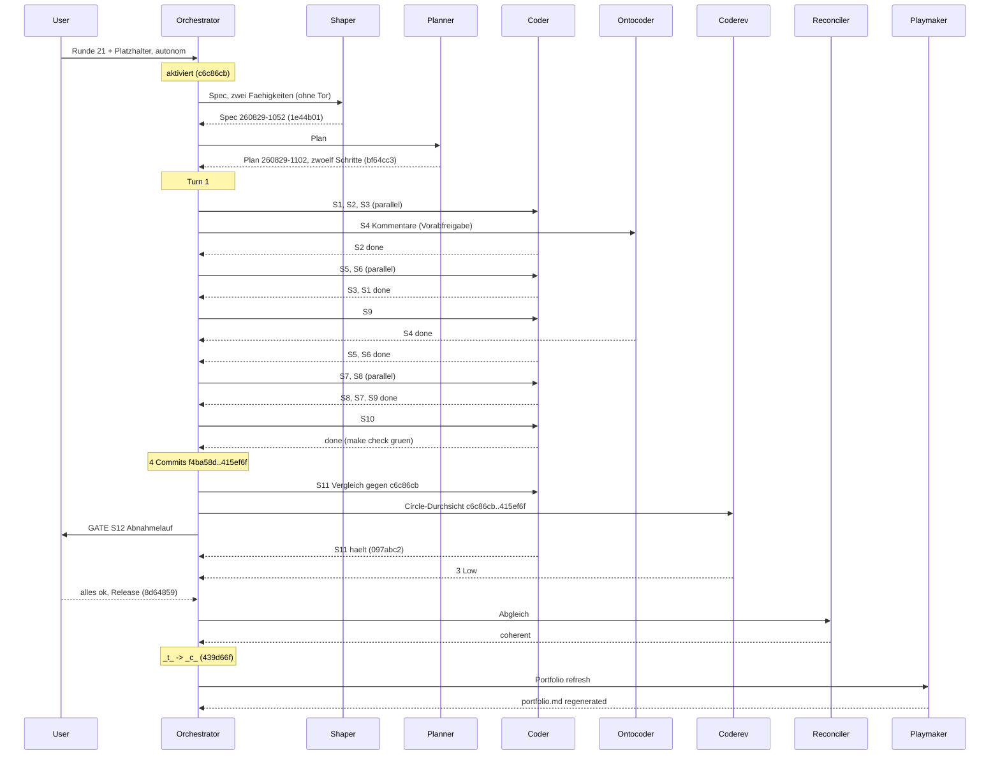

# Orchestrator Session — 260829-1047

**Directive:** die Runde 21 autonom fertigstellen — Circle `circles/260828-1041-dateilistenfilter-nimmt-eingaben-per-paste`: Cmd+V im Dateifenster hängt Text an den Filter an (Directive im Datensatz), **erweitert um die zweite Fähigkeit** aus `shared/backlog/260829-0842_o_dateilistenfilter-versteht-stern-als-platzhalter.md`: `*` im Filtertext ist ein Platzhalter für eine beliebige Zeichenfolge. Der Nutzer hat am 260829 beide zusammen in diese Runde gelegt und sie ohne Tore beauftragt; der Abnahmelauf am Bündel bleibt bei ihm.
**Mode:** custom → Phase 0b (Shaping, Planung), autonom
**Status:** Complete — Runde 21 kohärent geschlossen (`_c_`), Auslieferung 1.4.0 im Anschluss
**Circle:** 260828-1041-dateilistenfilter-nimmt-eingaben-per-paste (aktiviert 260829-1047, Claim auf Checkout 6c11b1f2)

## Snapshot bei Sitzungsbeginn

- HEAD: 79d507a (nach Release v1.3.0); Turn-Budget 12; Domain code
- Circles:   12 b    8 c    2 d    1 t 
- Grundlage des Circles teils überholt: „`copy:` bleibt unbeantwortet" stimmt seit Runde 22 nicht mehr (Playmaker-Warnung) — der Spec liest gegen den Baum
- Spec/Plan: keine — Phase 0b

## Budget

| Metric | Count |
|--------|-------|
| Turns | 1 (Phase 0b davor, ohne Tore) |
| Tasks resolved | 12 |
| Tasks skipped/deferred | 0 |
| Issues created (by reviewers) | 5 (`records anchor=79d507a start=260829-1047`: Orchestrator 1, Durchsicht 3, Abgleich 1) |
| Issues resolved | 0 |
| Decisions answered (`_o_`→`_a_`) | 0 |
| Decisions implemented (`_a_`→`_i_`) | 0 |
| Commits | 10 seit `79d507a` (`git rev-list`) |
| Agent errors | 0 |
| Human gates hit | 1 (S12 Abnahmelauf); Spec, Plan, Ontocoder-Schritt und Stop-Klauseln vom Nutzer vorab freigegeben |

## Per-Turn Log

### Turn 1
- Tasks attempted: S1, S2, S3, S4 (parallel); S5, S6, S9 (parallel); S7, S8, S10 (parallel); S11; S12
- Tasks completed: alle zwölf
- Commits: f4ba58d, 1b0939a, 3722c89, 415ef6f, 097abc2, 8d64859
- Review findings: 3 Low
- Circuit breaker status: OK
- Coherence: ok

## Coherence
<!-- RECONCILER-OWNED -->

**Verdict:** coherent

**Edges:**
- Artifact↔Grounding: 12 claims verified / 0 drift items / 3 open coderev issues (alle Low, Randfälle außerhalb der Festlegungen A1–A13, B1–B9) — jeder Planschritt gegen `f4ba58d`…`8d64859` gelesen (Belegtabelle im Reconciliation Log des Plans), `make check` am Arbeitsbaum exit 0 mit 1733 Proben; die einzige Abweichung ist der Wortlaut einer Abschlussklausel (`grep regex Cargo.lock` war nie leer, Diff der Kisten aber ist es), gefilt als `issues/260829-1223_o_…`, kein Widerspruch zwischen Baum und Grundlage.
- Artifact↔Directive: commits move toward the stated Directive — `f4ba58d` (`*` als Platzhalter, zweite Fähigkeit), `1b0939a` (Reinigung im Kern), `3722c89` (`paste:` am Delegierten, Hülle, Tabelle, Prosa), `415ef6f` (Kernproben, Zählprobe), `097abc2`/`8d64859` (Buchung, Abnahme); `c6c86cb`/`1e44b01`/`bf64cc3` sind Aktivierung, Spec und Plan derselben Runde. Kein Commit seit `79d507a` außerhalb der Directive; kein neues `Kommando`, keine Belegungszeile, keine elfte Zeitzusage.
- Grounding↔Directive: 25 active decisions consistent (1 im Circle: `decisions/260828-1041_o_…`, von A6 ausdrücklich unbeantwortet gelassen und keine Vorbedingung; 24 unter `shared/decisions/`, davon berühren `260816-1310_a_…` (Kriterien statt Messgröße für den Inhaltsfilter — der Spec setzt keine elfte Zusage), `260826-0859_o_…` und `260826-0923_o_…` (Schwelle und tiefer Durchlauf — B6 setzt auf beide auf, entscheidet keine) das Thema, keine widerspricht) / 0 potentially conflicting.

**Rebalance recommendation:** none

## Review coverage

**Range:** `79d507a..439d66f` — 10 commits (plus der Haushalts-Commit nach diesem Bericht)
**Covered by:** `reviews/260829-1218-coderev-einfuegen-in-den-filter-und-stern-als-platzhalter.md`, `**Reviewed-range:** c6c86cb..415ef6f`, covers=6, not-opened=none
**Not covered:** `c6c86cb` (Aktivierung), `097abc2` (S11), `8d64859` (S12), `439d66f` (Abschluss) — alle reine Workbench-Commits; Spec und Plan liegen innerhalb des Review-Bereichs
**Carried out-of-scope files:** none

## Remaining Work

Unter `circles/260828-1041-dateilistenfilter-nimmt-eingaben-per-paste/`:
- `issues/260829-1215_o_…keine-hoechstlaenge…` (Low; Nutzerfrage: Grenze oder ausdrücklich keine)
- `issues/260829-1216_o_…wagenruecklauf…` (Low, Coder, Einzeiler + Probe)
- `issues/260829-1217_o_claude-md-nennt-die-zaehlprobe-…` (Kurator)
- `issues/260829-1201_o_c6-6-…` und `issues/260829-1223_o_…grep-regex…` (Spec-/Plan-Prosa, nach Ortsregel nicht geändert)
- `decisions/260828-1041_o_was-tut-cmd-v-mit-einem-dateiverweis-…` (offen, keine Vorbedingung)
Für den Kurator (CLAUDE.md, gesammelt aus den Runden 19–22): Rundentabelle endet bei 18; `Wirkungsbereich` acht Werte; die Hülle schreibt Dateiverweise und liest die Einfügequelle; `copy:`/`cut:`/`paste:` als dritter Weg ohne Taste; Probenname `…drei_rufer…` und der Vergleich als Muster → `/fusion:cleanup --only claude-md`.

## Commits

| Hash | Message | Task |
|------|---------|------|
| c6c86cb | chore(workbench): die Runde 21 ist aktiviert und nimmt den Platzhalter mit auf | activation |
| 1e44b01 | docs(workbench): der Spec der Runde 21 ist geschaerft und vorab freigegeben | spec |
| bf64cc3 | docs(workbench): der Plan der Runde 21 ist vorab freigegeben und steht auf _p_ | plan |
| f4ba58d | feat(verzeichnis): der Filter versteht * als Platzhalter | S1 |
| 1b0939a | feat(zwischenablage): die Reinigung macht aus Text oder Verweis einen Filtertext | S2 |
| 3722c89 | feat(anwendung): cmd+v im Dateifenster haengt den Text an den Filter an | S3–S8, S10 |
| 415ef6f | test(verzeichnis): die Proben des Kerns fuer Einfuegen und Platzhalter | S9 |
| 097abc2 | docs(workbench): Bau, Zaehlungen und Ausgaben gegen den Stand vor der Runde, und die Durchsicht | S11 |
| 8d64859 | docs(workbench): der Abnahmelauf der Runde 21 ist gefahren | S12 |
| 439d66f | chore(workbench): die Runde 21 schliesst kohaerent | closure |

## Portfolio update

Playmaker-Lauf `shared/history/260829-1227-playmaker-orchestrator-phase4.md`; `portfolio.md` neu erzeugt: 0 vorgesehen, 0 aktiv, 9 kohärent, 12 beschränkt, 2 zurückgestellt; keine Propagation. Keine Empfehlung: kein Circle vorgesehen, die zwei gebauten Backlog-Einträge warten zum sechsten Mal auf ihre Schließung beim nächsten interaktiven `/fusion:next`.

## Session Flow

