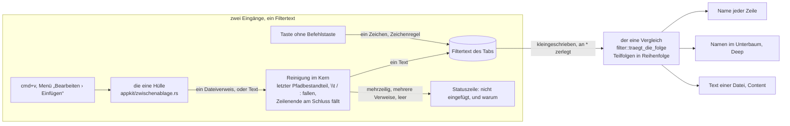

# Spec: Der Dateilistenfilter nimmt Eingaben per Cmd+V an und versteht `*` als Platzhalter

**Date:** 2026-08-29
**Status:** Complete — gebaut und vom Nutzer am 260829 abgenommen (Plan `planning/260829-1102_*_plan-einfuegen-in-den-filter-und-stern-als-platzhalter.md`, alle zwölf Schritte `[DONE]`, Abgleich 260829-1223); die Prosa von C6.6 ist unberichtigt und im Spec nicht angefasst (`issues/260829-1201_o_…`)
**Activated from Circle:** 260828-1041-dateilistenfilter-nimmt-eingaben-per-paste
**Source:** Zwei Quellen. Erstens die Directive des Circle-Datensatzes `_t_circle.md` samt den Festlegungen seines Grounding snapshot, vom Shaper am 260828 in zwei Klärungsrunden aus dem Backlog-Eintrag `shared/backlog/260828-0909_*_dateilistenfilter-nimmt-eingaben-per-paste.md` geformt. Zweitens der Backlog-Eintrag `shared/backlog/260829-0842_*_dateilistenfilter-versteht-stern-als-platzhalter.md`, in dem der Nutzer am 260829 die Möglichkeit 1 von drei gewählt hat (Glob im ganzen Filtertext) und den der Orchestrator dieser Runde als zweite Fähigkeit zugeschlagen hat; er ist mit diesem Spec promoviert. Der Nutzer hat verlangt, die Runde autonom zu bauen: keine Klärungsrunde, Lücken nach Muster entscheiden, das Spec-Tor gilt als vorab freigegeben. Die Festlegungen des Grounding snapshot stehen hier als A1 bis A6, gegen den Baum nach der Runde 22 gelesen; A7 bis A13 füllen die Lücken des Einfügens, B1 bis B9 die des Platzhalters. Alle sind am Spec-Tor überstimmbar.

---

## Directive

Nach dieser Runde füllt `cmd+v` im Dateifenster den Filtertext des sichtbaren Tabs aus der Zwischenablage, so wie ein Tastendruck ihn heute zeichenweise füllt: der eingefügte Text wird an einen stehenden Filtertext angehängt und nicht an seine Stelle gesetzt, und die Liste zeigt danach denselben Stand, den dasselbe Getippte gezeigt hätte. Was die Zwischenablage trägt, entscheidet, was ankommt. Ein Text, der wie ein Name aussieht, kommt ganz; ein Pfad, ob als Text oder als Dateiverweis aus dem Finder, kommt allein mit seinem letzten Bestandteil, dem Dateinamen; aus dem Ankommenden fallen der Tabulator, der Schrägstrich und der Doppelpunkt heraus, weil kein Eintrag sie tragen kann. Ein Inhalt über mehrere Zeilen wird nicht eingefügt, und der Filtertext bleibt dann, wie er war; mehrere Dateiverweise auf einmal ebenso. Das Menü „Bearbeiten" führt den Eintrag „Einfügen" im Dateifenster nicht mehr grau, sondern als das, was `cmd+v` dort tut. Ein Filtertext, der per `cmd+v` entstanden ist, verhält sich in allem Weiteren wie ein getippter: er übersteht den Ordnerwechsel, fällt zeichenweise mit dem Rückschritt, ganz mit `Esc`, und die Zahl seiner Zeichen entscheidet wie bisher, ab wann der Inhaltsfilter mitliest.

Daneben versteht der Filter das Zeichen `*` als Platzhalter für eine beliebige, auch leere Zeichenfolge, im ganzen Filtertext und nicht nur an einer Stelle: `260503-1144_*_f1-zitadel` trifft `260503-1144_d_f1-zitadel…` und `260503-1144_c_f1-zitadel…`. Ein Filtertext ohne `*` findet nach dieser Runde genau das, was er heute findet. Der Platzhalter gilt für den Namen wie für den Inhalt einer Datei, weil beide durch denselben einen Vergleich laufen; die Tippsuche der Belegungsansicht kennt ihn nicht. Ein wörtliches `*` lässt sich danach nicht mehr suchen; der Nutzer hat das am 260829 angenommen.

Diese Runde setzt keine elfte Zeitzusage und fasst keine der zehn aus C8 der Runde 1 an.

---

## Verhältnis zu den zehn Zeitzusagen aus C8 der Runde 1

**Kein Weg dieser Runde liegt auf einer gemessenen Strecke, und das ist am Baum geprüft.** Die zehn Zusagen messen in `crates/krk-bench/src/messen.rs` den Zeichendurchgang nach einem Tastendruck (L1, `auswahl_runter`), das Lesen und Sortieren der Prüfordner (L2, L3, L10), den Prozessstart (L4), den Tabwechsel, den Fensterwechsel, den Einstieg in einen Unterordner und die Vorschau des ausgewählten Eintrags (L5, L6, L8, L9 und L7, alle auf der Prüfsitzung aus C8). Keine der beiden Messstrecken setzt je einen Filtertext: weder `krk-bench/src/messen.rs` noch `krk-ui/src/messmodus.rs` ruft `filtertext_setzen` oder `zeichen_anhaengen`, und die gesendete Taste ist `pfeil_ab`, ein Zeichen, das `traegt_ein_dateiname` abweist (dieselbe Prüfung steht im Datensatz `shared/decisions/260826-0923_*_bekommt-der-tiefe-durchlauf-eine-eigene-zeichenschwelle-…`). Der Vergleich `traegt_die_folge` wird im Prüfschritt des Ordnermodells erst hinter dem Zweig „steht ein Filtertext?" gefragt; ohne Filtertext läuft nach dieser Runde dieselbe Zeile wie vor ihr, und L7 wie L10 sehen den Musterabgleich nie.

**Was die Runde über die Kosten weiß, steht als Auskunft.** Der Vergleich läuft heute einmal je Eintrag und je Aufbau der Sicht als `contains` über den kleingeschriebenen Namen. Mit dem Platzhalter läuft er als Folge von Teilfolgensuchen, eine je `*`-getrenntem Stück des Filtertexts, jede ab dem Ende der vorigen; für einen Filtertext ohne `*` ist das genau eine Suche, wie heute. Der Filtertext wird dabei einmal je Suche zerlegt und nicht einmal je Vergleich (B7). Beim Inhaltsfilter kommt dieselbe Folge auf den gelesenen Text, und dort ist das Lesen der Datei der Preis und nicht der Vergleich. Gemessen ist nichts davon, und eine Zusage entsteht nicht.

**L7 steht seit der Runde 14 auf den Gegenständen der späteren Messrunde** (CLAUDE.md, „Maximen"). Diese Runde legt keine Arbeit in seine Endbedingung und ändert daran nichts.

---

## Festlegungen, am Spec-Tor überstimmbar

Der Circle-Datensatz trägt sechs Festlegungen zum Einfügen; der Spec übernimmt sie als A1 bis A6, jede gegen den Baum nach den vier Commits der Runde 22 (`4455af7..1644ada`) gelesen, denn dort hat sich die Grundlage bewegt: der Anwendungsdelegierte beantwortet `copy:` und `cut:` am Dateifenster über `dateiablage_ausfuehren` und fragt `zulaessigkeit::dateiablage_zulaessig`, `paste:` ist weiter unbeantwortet und dieser Runde zugesprochen. A7 bis A13 füllen die Lücken des Einfügens; B1 bis B9 legen den Platzhalter fest, für den der Backlog-Eintrag die Wahl des Nutzers und der Orchestrator die Vorgaben mitgebracht hat. Keine widerspricht der Directive.

### Das Einfügen

**A1 — `paste:` wird am Dateifenster über die Antwortkette beantwortet, nach dem Muster der Runde 22, und sonst ändert sich an Belegung und Menü nichts.** Kein neues `Kommando`, keine der drei Pflichtstellen aus CLAUDE.md („Etliche Fallunterscheidungen"), keine Zeile in `resources/default-keymap.toml`, kein zweiter Menüeintrag; `text_einfuegen` steht dort weiter mit `gehalten_von = "menue"` (`default-keymap.toml:1047-1050`). Gegen den Baum gelesen: die Runde 22 hat den Weg vorgezeichnet, den diese Runde geht. `copy:` und `cut:` kommen als Aktionsselektoren mit Ziel `nil` die Antwortkette hinunter und enden mit dem Fokus in einer Dateiliste beim Anwendungsdelegierten (`anwendung.rs`, Modulkopf „Zwei Antworten ohne Kommando"); `paste:` geht denselben Weg. Die Zulässigkeit fragt die eine Regel mit dem zweiten Eingang `dateiablage_zulaessig`, dessen `Anspruch::Dateiablage` den Wirkungsbereich Dateifenster stellt (`zulaessigkeit.rs:230-262`); ob das Einfügen diesen Eingang mitbenutzt oder die private Aufzählung `Anspruch` einen dritten Wert bekommt, ist Planerfrage, und beides fragt dieselbe `gestattet`-Regel. `validateMenuItem:` (`anwendung.rs:953-975`) fragt für `paste:` dieselbe Regel wie für `copy:` und `cut:`, und der Zweig für „jede andere fremde Aktion" bleibt der Auffang für die drei übrigen zugestellten Funktionen. **Die Probe `dateiablageproben` (`anwendung.rs:9837-9865`) hält heute fest, dass `paste:` unbeantwortet bleibt, und nennt diesen Circle als Grund; sie kehrt sich mit der Runde um** und hält danach, dass der Delegierte alle drei beantwortet.

**A2 — Was die Zwischenablage trägt, liest die eine Hülle, und die Rangfolge ist die von `lesen`: Dateiverweis vor Text.** Gegen den Baum gelesen: `appkit/zwischenablage.rs::lesen` (`:235-248`) fragt `NSPasteboardTypeFileURL` vor `NSPasteboardTypeString` an `generalPasteboard`; `dateiverweise` (`:446`) liefert alle Dateiverweise einer gereichten Ablage als Pfade. Das Einfügen braucht beides: die Zahl der Verweise, um mehrere abzuweisen (A4), und den Text, wenn kein Verweis da ist. Ob die Hülle dafür einen weiteren Leser bekommt oder die zwei bestehenden zusammen gerufen werden, ist Planerfrage; eine zweite Hülle um `NSPasteboard` entsteht nicht (CLAUDE.md, „Projektstand"). Seit der Runde 22 legt KRK selbst mit `cmd+c` Verweise und Namenszeilen ab (Spec der Runde 22, A3, dort mit genau dieser Folge angekündigt): ein `cmd+v` nach dem Kopieren eines Eintrags in KRK filtert nach dessen Namen, nach dem Kopieren mehrerer wird abgewiesen, gleich wie beim Finder.

**A3 — Die Reinigung ist reines Rust im Kern, ohne Fenster prüfbar, und sie läuft in dieser Reihenfolge.** Das ist das Muster von `krk_core::zwischenablage::deuten`, das die `file:`-Zerlegung schon trägt (`verweis_zu_pfad`, Prozentzeichen eingeschlossen); wo die neue Funktion wohnt, entscheidet der Planner.
1. Zeilenenden am Ende des Textes fallen weg, `\r\n` wie `\n`; ein aus einem Terminal kopierter Name bringt eines mit.
2. Steht danach noch ein Zeilenende im Text, ist er mehrzeilig, und das Einfügen scheitert ganz; der Filtertext bleibt unverändert (A4).
3. Ein `file:`-Verweis und ein Text mit Schrägstrich sind ein Pfad, und es bleibt der letzte nicht leere Bestandteil: `Ordner/` liefert `Ordner`, `/Users/k1/Notizen.md` liefert `Notizen.md`, `file:///Users/k1/Mein%20Text.md` liefert `Mein Text.md`. Ein Text ohne Schrägstrich kommt ganz. Ein `http:`-Link ist nach dieser Regel ein Pfad, und es bleibt, was nach dem letzten Schrägstrich steht; ein eigener Zweig für Adressen entsteht nicht.
4. Aus dem Rest fällt jedes Zeichen, das die Zeichenregel `traegt_ein_dateiname` abweist (Steuerzeichen einschließlich Tabulator, der Bereich `U+F700`–`U+F8FF`, der Schrägstrich), und dazu der Doppelpunkt. **Die Tipp-Regel selbst bleibt, wie sie ist**: wer `:` tippt, bekommt ihn weiter in den Filtertext, denn ein POSIX-Name trägt ihn; beim Einfügen fällt er, weil ein eingefügter Doppelpunkt fast immer aus einem Pfad in Finder-Schreibweise oder aus einem Link stammt. Ob die vierte Klasse als Schalter an der Kernregel oder als eigene Funktion daneben steht, ist Planerfrage; die Zählprobe `die_zeichenregel_hat_zwei_rufer_und_der_vergleich_drei` (`crates/krk-core/tests/verzeichnis.rs:3226`) wird mit einem dritten Rufer der Zeichenregel rot und ist dann nachzuziehen, nicht zu umgehen.
5. Bleibt nichts übrig, wird nichts eingefügt, und die Statuszeile sagt es (A5).
Das Leerzeichen, das `*` und jedes andere Zeichen, das ein Name trägt, bleiben stehen. Ein eingefügtes `*` ist danach ein Platzhalter wie ein getipptes (B1); das Beispiel des Backlog-Eintrags, ein aus der Werkbank kopierter Dateiname mit `_*_`, ist genau dieser Fall.

**A4 — Mehrzeiliger Text und mehrere Dateiverweise werden abgewiesen, ein leerer Inhalt auch; der Filtertext bleibt in allen drei Fällen, wie er war.** Mehrere Verweise sind das Gegenstück zum mehrzeiligen Text: der Finder legt beim Kopieren mehrerer Dateien die Namen als Zeilen ab, und KRK seit der Runde 22 ebenso. Ein einzelner Verweis wird eingefügt. Eine Ablage ohne Text und ohne Verweis, etwa nach dem Kopieren eines Bildes, fügt nichts ein. Ein Einfügen ist damit ganz oder gar nicht; ein halb eingefügter Text, etwa die erste Zeile eines mehrzeiligen, wäre ein Sonderfall mit eigener Regel, den diese Runde nicht baut.

**A5 — Ein Einfügen, das nichts einfügt, meldet sich in der Statuszeile im Rang `Befehlsantwort`, mit Umlauten, und ein geglücktes meldet sich nicht.** Das ist das Muster des Zwischenablagesprungs aus C10 (`Ziel::Nichts` → Statuszeile) und der Pfadkopierer (`ablage_weist_ab`); die Statuszeile hat sieben Ränge ohne Auffangzweig (`statuszeile.rs::Rang`, gezählt über `Rang::ALLE`), und die Meldung tritt in den bestehenden Rang `Befehlsantwort`, nicht in einen achten. Nach einem geglückten Einfügen ist der Rang `Filterstand` die Antwort: `Filter „<text>“: n von m angezeigt` zeigt den neuen Filtertext samt Wirkung, und eine zweite Zeile darüber sagte nichts, was die erste nicht sagt. Die vier Sätze, jeder eine reine Funktion in `kommandos/operationen.rs` mit Probe, in der Schreibweise des Baums seit dem 260826 (`shared/decisions/260826-1225_*_welche-schreibweise-gilt-fuer-nutzersichtbare-deutsche-meldungen-…`, offen):
- Ablage ohne Text und ohne Verweis: `nichts einzufügen: die Zwischenablage trägt keinen Text`
- mehrzeiliger Text: `nicht eingefügt: der Text hat mehrere Zeilen`
- mehrere Dateiverweise: `nicht eingefügt: die Zwischenablage trägt <n> Dateiverweise` (die Zahl in der Schreibweise von `zahl`, wie `<n> Einträge kopiert`)
- nach der Reinigung leer: `nichts einzufügen: der Text trägt kein Zeichen, das ein Name tragen kann`

**A6 — Der Einhängepunkt ist mit dieser Runde ganz besetzt, und eine Dateizwischenablage entsteht nicht.** Belegung und Menü halten `cmd+v` seit dem 260805 dafür frei, dass „wer `copy:` und `paste:` am Dateifenster beantwortet, sie hat" (`default-keymap.toml:990-997`, `menue.rs:105-116`). Die Runde 22 hat die `copy:`- und `cut:`-Hälfte für das Ablegen von Verweisen genommen; diese Runde nimmt die `paste:`-Hälfte für den Filter. Keine Datei wird durch Einfügen kopiert oder bewegt, und `cmd+v` mit einem Finder-Verweis in der Ablage filtert nach dessen Namen. Die Folge für eine spätere Dateizwischenablage bleibt als offener Datensatz stehen, `decisions/260828-1041_*_was-tut-cmd-v-mit-einem-dateiverweis-sobald-die-dateizwischenablage-gebaut-ist.md`; er hält keinen Planschritt auf, und dieser Spec schreibt die Doppelbelegung nicht als Dauerzustand aus. Die Prosastellen, die `paste:` als unbeantwortet beschreiben, ziehen nach (C4.5).

**A7 — Der eingefügte Text wird angehängt, als eine Änderung, und die Anzeige zieht einmal nach.** Der Nutzer hat am 260828 „anhängen, wie ein getipptes Zeichen" gewählt; `filtertext_setzen` (`modell.rs:940-944`) ersetzt und ist deshalb nicht der Weg. Ob der Kern eine anhängende Form für einen ganzen Text bekommt oder `zeichen_anhaengen` je Zeichen gerufen wird, ist Planerfrage; die Zusage ist, dass `nach_filteraenderung` (`tabelle.rs`, „der eine Weg der Anzeige nach einer Filteränderung") **einmal** läuft und der Durchlauf über den Unterbaum bei stehendem „Deep" **einmal** abgebrochen und neu angestoßen wird, nicht je Zeichen. Ein Einfügen ist damit für die Sicht dasselbe wie ein einzelner Anschlag mit vielen Zeichen.

**A8 — Der eingefügte Filtertext ist danach ein gewöhnlicher Filtertext, und die Runde führt keinen zweiten Zustand ein.** Er gehört dem `Ordnermodell` des Tabs, übersteht den Ordnerwechsel (`circles/260814-1551-…/decisions/260814-1830_*_bleibt-der-filtertext-bei-einem-ordnerwechsel-stehen-…`), fällt zeichenweise über die Regel in `kommandos/rueckschritt.rs` und ganz über `Esc`. Ein „Einfügen rückgängig" gibt es nicht: der Rückschritt nimmt nach einem Einfügen von zwölf Zeichen ein Zeichen und nicht zwölf, weil der Filtertext nicht weiß, woher seine Zeichen stammen, und es nicht wissen soll. `inhalt_wirkt` zählt die eingefügten Zeichen wie getippte: ein eingefügter Name von fünf Buchstaben stößt bei stehender tiefer Suche und angehaktem „Content" den Inhaltsfilter sofort an, was beim Tippen erst der fünfte Anschlag tut (`shared/decisions/260826-0859_*_…`, offen, bindet auch diese Runde). Der Filter misst keine Zeit, und das Einfügen führt keine ein.

**A9 — Die Zulässigkeit des Einfügens folgt der Regel eines Kommandos mit Wirkungsbereich Dateifenster, und der Menüeintrag ist genau dann grau, wenn der Tastendruck abgewiesen würde.** Kein stehendes Blatt, der Ersthelfer gehört nicht AppKit, der Fokus steht in einem Dateifenster, das Schlüsselfenster gehört KRK (`zulaessigkeit.rs`, die vier Bestandteile). Der Fokusvorbehalt trennt die Bedeutungen ohne Zutun dieser Runde: mit der Schreibmarke im Editor, im Umbenennungsfeld oder in der Pfadeingabe findet AppKit `paste:` beim Textsystem, bevor die Kette den Delegierten erreicht; in der Vorschau und im Betrachter, deren Text nicht bearbeitbar ist, tut `paste:` nach der Runde, was es heute tut. Mit dem Fokus in der Lesezeichenleiste beantwortet niemand `paste:`, der Eintrag bleibt grau. **Der Inhalt der Zwischenablage ist kein Bestandteil der Regel:** „Einfügen" ist auch bei leerer Ablage freigegeben, und was dann geschieht, sagt die Statuszeile (A5). Eine Ausgrauung nach Ablageinhalt fragte den Ablageserver bei jeder Menüprüfung, und die Ausgrauung ist eine Anzeige und keine Sperre (`dateiablage_ausfuehren`, Doc-Kommentar).

**A10 — Ein offener Defekt bekommt einen Nebenweg, und der ist keine Behebung.** Die Leertaste ist an die Markierung vergeben und erreicht den Filter nie (`shared/issues/260816-2144_o_die-leertaste-ist-belegt-und-erreicht-den-dateifilter-nie.md`); die Zeichenregel nimmt das Leerzeichen an, und ein eingefügter Text mit Leerzeichen bringt es damit erstmals in den Filtertext. Der Defekt bleibt offen, denn getippt wird das Leerzeichen weiter nicht. Wer ihn nach der Runde als behoben liest, liest ihn falsch.

**A11 — Gelesen werden die zwei Sorten, die `lesen` heute liest, und keine dritte.** `NSPasteboardTypeFileURL` und `NSPasteboardTypeString`. Formatierter Text (RTF, HTML) kommt, soweit die abgebende Anwendung eine Textsorte danebenlegt, als diese an; legt sie keine, ist die Ablage für das Einfügen leer (A5). Ein Bild ist leer. Kein eigener Zweig je Sorte.

**A12 — Das Einfügen hat einen Weg hinein, und der ist `paste:`.** Kein Eintrag im Kontextmenü der Dateiliste (`Kontextbefehl` bleibt bei drei Werten), kein Ablegen von Text per Ziehen auf die Liste (der Abwurf der Runde 13 nimmt Dateien an und bleibt, wie er ist), keine Pfadeingabe, die in den Filter schreibt.

**A13 — Die Belegungsansicht und die Namen im Menü bleiben, wie sie sind.** „Einfügen" heißt im Menü „Bearbeiten" weiter so, und die Belegungsansicht zeigt für `text_einfuegen` weiter „gehalten von Menü"; `make tasten` und `make menue` geben vor und nach der Runde dieselben Zeilen aus. Ein Name wie „In den Filter einfügen" wäre im Editor falsch, wo derselbe Eintrag Text einfügt; der Mac-übliche Name deckt beides (Runde 22, A9).

### Der Platzhalter

**B1 — `*` steht für eine beliebige Zeichenfolge, auch für die leere, an jeder Stelle des Filtertexts, und mehrere `*` sind erlaubt.** `a*b` trifft `ab`, `a-b` und `a-lange-folge-b`; `*_*_f1` trifft `260503-1144_d_f1-…`. Zwei `*` nebeneinander bedeuten dasselbe wie eines. Das ist die Wahl des Nutzers vom 260829, Möglichkeit 1 von drei: Glob im ganzen Filtertext, nicht nur im Marker `_*_`, und nicht „Teilfolgen in Reihenfolge" ohne Platzhalterzeichen.

**B2 — Der Vergleich bleibt an beiden Enden ungebunden: eine Teilfolge bleibt eine Teilfolge.** `abc` trifft nach der Runde, was es heute trifft, an jeder Stelle des Namens (C1.2 der Runde 10 gilt für Texte ohne `*` unverändert weiter). Ein `*` am Anfang oder am Ende des Filtertexts hat deshalb keine Wirkung: `*abc`, `abc*` und `*abc*` treffen genau, was `abc` trifft. Der Platzhalter verankert nichts; wer `beginnt mit` will, bekommt es in dieser Runde nicht.

**B3 — Es gibt genau ein Sonderzeichen, und kein Entkommen davor.** Kein `?`, keine Zeichenklassen `[…]`, keine Alternativen, kein `\*` für ein wörtliches Sternchen. Ein getipptes oder eingefügtes `*` ist immer der Platzhalter, und ein Name, der ein wörtliches `*` trägt, wird über eines seiner anderen Zeichen gefunden. Der Nutzer hat diesen Verlust im Backlog-Eintrag angenommen; er ist der Preis der einfachsten Regel, und ein zweites Sonderzeichen wäre der Anfang einer Mustersprache, die diese Runde nicht baut. Die Zeichenregel `traegt_ein_dateiname` nimmt `*` heute an und ändert sich nicht.

**B4 — Schreibung und Faltung bleiben, wie sie sind.** Ohne Rücksicht auf Groß- und Kleinschreibung, ohne Faltung von Umlauten und Akzenten (C1.3 der Runde 10): `Ä*.txt` findet `Äpfel.txt` und `äpfel.txt`, `a*.txt` findet keines von beiden. Der Filtertext wird einmal je Suche kleingeschrieben, der Name einmal je Vergleich; die Asymmetrie der zwei Argumente bleibt.

**B5 — Der Inhaltsfilter vergleicht mit demselben Muster, weil er denselben einen Vergleich ruft.** `traegt_die_folge` hat drei Rufer, alle im Kern: den Prüfschritt des Ordnermodells für die angezeigte Zeile, den Durchlauf für den Unterbaum und `inhalt` für den gelesenen Text einer Datei (`filter.rs`, Modulkopf). Alle drei bekommen den Platzhalter mit derselben Zeile; dieselbe Folge gibt am Namen und am Inhalt dieselbe Antwort (C6.9 der Runde 11 hält weiter). Beim Inhalt läuft das Muster über den ganzen gelesenen Text, und ein `*` darf dabei über Zeilenenden hinweg treffen: `fn*main` trifft eine Datei, in der irgendwo `fn` und später irgendwo `main` steht. Eine eigene Regel „nur innerhalb einer Zeile" wäre ein zweiter Vergleich, und den schließt der Modulkopf aus.

**B6 — Das `*` zählt nicht zur Inhaltsschwelle.** `inhaltsschwelle` (fünf bei tiefer Suche, drei sonst) schützt davor, bei einer kurzen und deshalb wenig sagenden Eingabe viele Dateien zu lesen (`filter.rs`, Doc-Kommentar der Schwelle). Ein `*` sagt nichts über den Gegenstand aus; `ab*` bezeichnet weniger als `abc`, nicht mehr. Gezählt werden deshalb die Zeichen des Filtertexts ohne die Sternchen: `ab*cd` sind vier, `*****` sind null, und ein Filtertext aus lauter `*` liest nie eine Datei. Die eine Stelle, die die Schwelle prüft, bleibt `Ordnermodell::inhalt_wirkt`; sie zählt nach der Runde anders und wird nicht verdoppelt. Für das Einfügen (A8) gilt dieselbe Zählung. **Der tiefe Durchlauf hängt dagegen weiter an `filter_steht`, also an einem Zeichen, gleich welchem:** ein einzelnes `*` stößt ihn an, und weil jeder Name das Muster trägt, entscheidet er jeden Ordner mit dem ersten Eintrag und lässt den Rest liegen. Ob der Durchlauf eine eigene Schwelle bekommt, ist eine offene Frage außerhalb dieser Runde (`shared/decisions/260826-0923_*_…`), und diese Runde beantwortet sie nicht.

**B7 — Kein regulärer Ausdruck, keine neue Kiste, und der Filtertext wird einmal je Suche zerlegt.** Das Muster ist an den `*` in Stücke zu teilen, und der Name trägt es, wenn jedes Stück in Reihenfolge und ohne Überlappung im Namen steht, das erste an beliebiger, jedes weitere hinter dem Ende des vorigen; leere Stücke (vom Anfang, vom Ende, zwischen zwei `*`) treffen immer. Das ist für ein Muster mit nur `*` die vollständige und richtige Antwort, ohne Rückverfolgung. Die Zerlegung gehört dorthin, wo heute `filter_klein` entsteht, einmal je Änderung des Filtertexts (`modell.rs:1138-1142`), und nicht in den Vergleich, der je Eintrag läuft; die Form, ein vorgezerlegter Typ oder ein zweites Feld neben `filter_klein`, ist Planerfrage. `Cargo.lock` führt danach keine neue Kiste.

**B8 — Der eine Vergleich bleibt einer, und die Zählprobe hält weiter drei Rufer.** `die_zeichenregel_hat_zwei_rufer_und_der_vergleich_drei` (`crates/krk-core/tests/verzeichnis.rs:3226-3273`) liest die Quelldateien und verlangt, dass `traegt_die_folge` in `filter.rs` erklärt wird und genau von `durchlauf.rs`, `inhalt.rs` und `modell.rs` gerufen. Bekommt der Vergleich mit dem Muster eine neue Signatur oder einen neuen Namen, zieht die Probe mit ihrer Nadel nach und hält danach dasselbe: eine Stelle, drei Rufer. Sie wird nicht umgangen und nicht auf eine Zahl ohne Namen verkürzt.

**B9 — Der Platzhalter gilt allein dem Filter der Dateiliste.** Die Tippsuche der Belegungsansicht aus der Runde 7 teilt mit dem Filter die Zeichenregel und nicht den Vergleich (`belegungsmodell.rs:568`, ein eigenes `contains`), und die Kollisionsprüfung des Kontextmenüs teilt allein die Faltung (`kontextmenue.rs:678`). Beide bleiben wörtlich. Ein Platzhalter in der Belegungsansicht wäre eine zweite Stelle mit derselben Regel, und ob sie ihn braucht, hat niemand gefragt.

---

## Capabilities

### C1: `cmd+v` im Dateifenster hängt den Inhalt der Zwischenablage an den Filtertext an

**Description:** Wer im Dateifenster `cmd+v` drückt oder „Bearbeiten › Einfügen" wählt, hat danach den Text der Zwischenablage, bereinigt nach A3, hinten an seinem Filtertext, und die Liste zeigt, was sie nach demselben Getippten zeigte. Stand kein Filtertext, ist der eingefügte Text der ganze Filtertext.

**Acceptance criteria:**
- [ ] C1.1 Leerer Filtertext, in der Ablage der Text `notiz`, `cmd+v`: die Liste zeigt genau die Zeilen, die nach dem Tippen von `n`, `o`, `t`, `i`, `z` stehen, und die Statuszeile zeigt `Filter „notiz“: n von m angezeigt`. Zu prüfen am Bündel; die Gleichheit der Sicht ohne Fenster als Probe am Ordnermodell (eingefügt gegen zeichenweise angehängt).
- [ ] C1.2 Stehender Filtertext `no`, in der Ablage `tiz`, `cmd+v`: der Filtertext lautet `notiz`, nicht `tiz` (A7).
- [ ] C1.3 „Bearbeiten › Einfügen" und `cmd+v` tun dasselbe; der Menüeintrag geht dieselbe Antwortkette hinunter wie der Tastendruck, und es gibt keinen zweiten Ausführungsweg (A1).
- [ ] C1.4 Nach einem Einfügen von zwölf Zeichen bei stehendem „Deep" ist der Durchlauf über den Unterbaum genau einmal abgebrochen und neu angestoßen, und `nach_filteraenderung` ist einmal gelaufen (A7). Probe ohne Fenster, soweit die Zählung am Modell oder an der Tabliste zu fassen ist; sonst am Bündel daran, dass die Sicht nicht flackert.
- [ ] C1.5 Der Rückschritt nach dem Einfügen von `notiz` nimmt das `z` und lässt `noti` stehen; `Esc` leert den Filtertext ganz (A8).
- [ ] C1.6 Ein eingefügter Filtertext übersteht den Wechsel in einen Unterordner und zurück, wie ein getippter (A8).
- [ ] C1.7 „Content" angehakt, „Deep" an, leerer Filtertext, in der Ablage `hallo` (fünf Zeichen): nach `cmd+v` wirkt der Inhaltsfilter sofort, und eine Datei, deren Text `hallo` trägt und deren Name es nicht tut, steht abgesetzt in der Liste (A8). Probe ohne Fenster über `inhalt_wirkt` nach dem Anhängen.
- [ ] C1.8 In der Ablage `ab cd` (mit Leerzeichen), `cmd+v`: der Filtertext trägt das Leerzeichen, und `ab cd.txt` steht in der Liste. Die Leertaste tippt danach weiterhin kein Leerzeichen in den Filter; der Defekt `260816-2144` bleibt offen (A10).
- [ ] C1.9 `resources/default-keymap.toml` trägt nach der Runde keine neue Zeile, `Kommando` keine neue Variante, und `make tasten` wie `make menue` geben dieselbe Ausgabe wie vor der Runde (A1, A13). Zu prüfen mit einem Diff der beiden Ausgaben gegen den Stand von `c6c86cb`.

### C2: Was ankommt, entscheidet der Inhalt der Zwischenablage

**Description:** Ein Name kommt ganz, ein Pfad oder Dateiverweis mit seinem letzten Bestandteil, und Zeichen, die kein Eintrag tragen kann, fallen heraus. Die Reinigung ist eine reine Funktion des Kerns mit Proben für jeden Fall.

**Acceptance criteria:**
- [ ] C2.1 Text `Notizen.md` → Filtertext `Notizen.md`; Text `/Users/k1/Notizen.md` → `Notizen.md`; Text `Ordner/` → `Ordner`; ein im Finder kopierter Eintrag `Mein Text.md` (Dateiverweis, daneben der Name als Text) → `Mein Text.md` (A2, A3). Proben ohne Fenster auf der Reinigung; der Finder-Fall am Bündel.
- [ ] C2.2 Text `https://example.com/pfad/seite.html` → `seite.html`; kein eigener Zweig für Adressen (A3).
- [ ] C2.3 Text `Name\n` und `Name\r\n` → `Name`; Text `a\tb:c` → `abc`; ein getipptes `:` steht dagegen weiter im Filtertext (A3, Schritt 1 und 4, und die unveränderte Tipp-Regel; Probe auf `traegt_ein_dateiname(':')`).
- [ ] C2.4 Text `erste Zeile\nzweite Zeile`: nichts wird eingefügt, der Filtertext bleibt, wie er war, und die Statuszeile sagt `nicht eingefügt: der Text hat mehrere Zeilen` (A4, A5).
- [ ] C2.5 Drei im Finder kopierte Einträge, `cmd+v` in KRK: nichts wird eingefügt, die Statuszeile sagt `nicht eingefügt: die Zwischenablage trägt 3 Dateiverweise` (A4, A5). Dasselbe nach `cmd+c` auf drei markierten Einträgen in KRK selbst (Runde 22). Zu prüfen am Bündel; die Regel ohne Fenster auf der Verweiszahl.
- [ ] C2.6 Ein kopiertes Bild, `cmd+v`: nichts wird eingefügt, die Statuszeile sagt `nichts einzufügen: die Zwischenablage trägt keinen Text` (A4, A5, A11). Zu prüfen am Bündel.
- [ ] C2.7 Text `\t:\t`: nichts wird eingefügt, die Statuszeile sagt `nichts einzufügen: der Text trägt kein Zeichen, das ein Name tragen kann` (A3 Schritt 5, A5).
- [ ] C2.8 Nach einem geglückten Einfügen steht im Rang `Befehlsantwort` nichts; die Antwort ist der Rang `Filterstand` (A5). Eine Befehlsantwort des vorigen Befehls ist gelöscht, wie bei jedem Befehl.
- [ ] C2.9 Die vier Sätze aus A5 sind reine Funktionen in `kommandos/operationen.rs` mit je einer Probe, stehen mit Umlauten und tragen `#[must_use]` wie ihre Geschwister aus der Runde 22.
- [ ] C2.10 Text `260503-1144_*_f1-zitadel-slot-rehost-and-swap-test.md`, eingefügt: der Filtertext trägt das `*`, und die Liste zeigt `260503-1144_d_f1-…` und `260503-1144_c_f1-…` (A3, B1). Probe ohne Fenster am Ordnermodell mit beiden Namen im Bestand.

### C3: Zulässigkeit und Ausgrauung folgen der einen Regel

**Description:** Ob `cmd+v` im Dateifenster gerade wirken darf, beantwortet dieselbe Regel wie für jedes Kommando mit Wirkungsbereich Dateifenster und wie für `copy:` und `cut:` seit der Runde 22; „Einfügen" ist im Menü genau dann grau, wenn der Tastendruck abgewiesen würde.

**Acceptance criteria:**
- [ ] C3.1 Mit dem Fokus im Dateifenster und ohne Blatt ist „Einfügen" im Menü „Bearbeiten" freigegeben, neben „Kopieren" und „Ausschneiden"; C4.1 und C1.14 der Runde 22 (Einfügen bleibt grau) sind damit ersetzt und nicht ergänzt (A1, A9).
- [ ] C3.2 Solange ein Blatt steht (Rückfrage, Konfliktblatt, Notizzettel, Stapelumbenennen), wirkt `cmd+v` im Dateifenster nicht, der Eintrag ist grau, die Ausnahmeliste `immer_erreichbar` wächst nicht, und `waehrend_eines_blattes_kommen_genau_diese_vier_durch` bleibt bei vier.
- [ ] C3.3 Während des Umbenennens in der Liste und in der Pfadeingabe fügt `cmd+v` in das Feld ein und nicht in den Filter; mit der Schreibmarke im Editor fügt es in den Text ein. Nichts davon ändert sich (A9). Zu prüfen am Bündel.
- [ ] C3.4 Mit dem Fokus in der Lesezeichenleiste ist „Einfügen" grau und `cmd+v` wirkungslos, wie heute (A9).
- [ ] C3.5 Bei leerer Zwischenablage ist „Einfügen" mit dem Fokus im Dateifenster freigegeben, und der Tastendruck meldet nach C2.6 (A9).
- [ ] C3.6 `validateMenuItem:` fragt für `paste:` dieselbe Regel wie für `copy:` und `cut:` und bekommt keinen Zweig, der etwas anderes fragt; Ereignisweg und Menü fragen dieselbe Funktion auf derselben `Lage` (A1, A9). Ohne Fenster prüfbar, soweit die Regel in `kommandos/` steht; `die_zwei_frager_der_dateiablage_rufen_dieselbe_regel` zieht auf die neue Zahl der Rufer nach und nennt sie.
- [ ] C3.7 Die Probe `dateiablageproben` hält nach der Runde, dass der Delegierte `copy:`, `cut:` **und** `paste:` beantwortet, und ihr Doc-Kommentar nennt diese Runde als den Grund (A1).

### C4: Die eine Hülle, der Kern, und die Prosa, die den Stand beschreibt

**Description:** Das Lesen der Ablage bleibt Sache von `appkit/zwischenablage.rs`, die Reinigung ist reines Rust im Kern, und die Stellen im Baum, die `paste:` als unbeantwortet beschreiben, sagen danach den neuen Stand.

**Acceptance criteria:**
- [ ] C4.1 Keine Datei außer `appkit/zwischenablage.rs` liest eine Ablage; `grep -rn NSPasteboard crates/krk-ui/src` trifft außerhalb der Hülle nach der Runde dieselben Stellen wie vor ihr (A2).
- [ ] C4.2 Die Reinigung aus A3 steht in `krk-core`, nennt keine `objc2`-Kiste und trägt Proben für jeden der fünf Schritte und für die drei Abweisungsfälle aus A4 (ohne den Bildfall, der die Ablage braucht).
- [ ] C4.3 Wird die Zeichenregel für den Doppelpunkt ergänzt oder daneben eine Reinigungsfunktion angelegt, hält `die_zeichenregel_hat_zwei_rufer_und_der_vergleich_drei` die neue Lage und nennt jeden Rufer mit Namen (A3 Schritt 4).
- [ ] C4.4 Jede Antwort, deren stilles Fallenlassen unbemerkt bliebe, trägt `#[must_use]`: die Reinigung, die Zulässigkeitsantwort, die vier Meldungen; `cargo clippy --workspace --all-targets` unter `-D warnings` bleibt grün.
- [ ] C4.5 Die Prosastellen, die `paste:` als unbeantwortet oder als diesem Circle gehörend beschreiben, sagen nach der Runde den neuen Stand: der Modulkopf von `anwendung.rs` („Zwei Antworten ohne Kommando"), der Modulkopf und die Tafel `GEMESSEN` von `menue.rs` (`:100-134`, `:896-900`), der Modulkopf von `zwischenablage.rs` („die `paste:`-Hälfte nicht"), der Kopf von `resources/default-keymap.toml` (`:81-84`, `:990-997`) und der Doc-Kommentar von `dateiablage_ausfuehren` („kein `paste:` daneben"). Constraint 5 der Runde 22 ist mit dieser Runde eingelöst.
- [ ] C4.6 Der Untergrenzen-Abschnitt jeder angefassten Datei unter `crates/krk-ui/src/appkit/` nennt jede neu angesprochene Methode mit ihrem macOS; keine liegt über macOS 15.

### C5: `*` im Filtertext steht für eine beliebige Zeichenfolge

**Description:** Ein `*` im Filtertext trifft an seiner Stelle jede Zeichenfolge, auch keine; mehrere `*` sind erlaubt; alles andere bleibt, wie es ist. Ein Filtertext ohne `*` findet, was er heute findet.

**Acceptance criteria:**
- [ ] C5.1 Filtertext `260503-1144_*_f1`: `260503-1144_d_f1-zitadel.md` und `260503-1144_c_f1-zitadel.md` stehen in der Liste, `260503-1144-f1-zitadel.md` (ohne Marker) nicht, weil `_` und `_` um das `*` verlangt sind (B1). Probe auf dem Vergleich und am Ordnermodell.
- [ ] C5.2 Filtertext `a*b`: `ab`, `a-b` und `a-lange-folge-b` treffen; `ba` trifft nicht (B1, Reihenfolge).
- [ ] C5.3 Filtertext `a**b` trifft dasselbe wie `a*b`; Filtertext `*` und `***` treffen jeden Namen (B1).
- [ ] C5.4 `*abc`, `abc*`, `*abc*` und `abc` treffen dieselben Namen (B2). Probe über einen Bestand mit `abc`, `xabc`, `abcx`, `xabcx`, `axbc`.
- [ ] C5.5 Ein Name mit wörtlichem `*`, etwa `a*b.txt`, wird von `a*b` getroffen und von keinem Filtertext gezielt (B3); `?` und `[` sind gewöhnliche Zeichen: `a?b` trifft `a?b.txt` und nicht `axb.txt`.
- [ ] C5.6 `Ä*.txt` trifft `Äpfel.txt` und `äpfel.txt`; `a*.txt` trifft keines von beiden; `A*B` trifft `ab` (B4).
- [ ] C5.7 `traegt_ein_dateiname('*')` ist wahr, vor und nach der Runde (B3).
- [ ] C5.8 Die Tippsuche der Belegungsansicht findet mit `a*b` nichts, was nicht wörtlich `a*b` trägt (B9).
- [ ] C5.9 Die Statuszeile zeigt den Filtertext mit dem `*`, wie er steht: `Filter „a*b“: 3 von 40 angezeigt`.

### C6: Der Platzhalter wirkt im Unterbaum und im Inhalt wie in der Zeile, und die Schwelle zählt ihn nicht

**Description:** Der eine Vergleich bedient die angezeigte Zeile, den tiefen Durchlauf und den Inhaltsfilter; alle drei verstehen das Muster gleich. Zur Inhaltsschwelle zählen nur die Zeichen ohne `*`.

**Acceptance criteria:**
- [ ] C6.1 „Deep" an, Filtertext `a*z`: ein Ordner, in dessen Unterbaum `anzeige.txt` liegt, steht in der Liste; einer, in dessen Unterbaum nur `zebra.txt` liegt, nicht (B5). Probe ohne Fenster auf dem Durchlauf im Prüfordner.
- [ ] C6.2 „Content" an, Filtertext `fn*main` (sechs Zeichen ohne `*`, über beiden Schwellen): eine Datei, in deren Text `fn` und später, auch in einer anderen Zeile, `main` steht, trägt den Inhaltsbefund `Traegt`; eine mit `main` vor `fn` nicht (B5). Probe auf `traegt_der_inhalt`.
- [ ] C6.3 Dieselbe Folge gibt am Namen und am Inhalt dieselbe Antwort, mit und ohne `*`: die Probe zu C6.9 der Runde 11 läuft mit einem Muster ein zweites Mal (B5).
- [ ] C6.4 „Content" an, „Deep" aus (Schwelle drei): `ab*` wirkt nicht, `ab*c` wirkt; „Deep" an (Schwelle fünf): `ab*cd` wirkt nicht, `ab*cde` wirkt; `*****` wirkt nie (B6). Probe auf `inhalt_wirkt`.
- [ ] C6.5 Die Zählung aus B6 steht an einer Stelle, `Ordnermodell::inhalt_wirkt`, und die Statuszeile, die Auftragsliste und die Entscheidung über den Durchlauf rechnen sie nicht nach (B6, `modell.rs`, Doc-Kommentar von `inhalt_wirkt`).
- [ ] C6.6 „Deep" an, Filtertext `*`: der Durchlauf läuft an und entscheidet jeden Ordner mit dem ersten Eintrag; jede Zeile steht in der Liste (B6). Probe auf dem Durchlauf.

### C7: Der eine Vergleich, seine Zerlegung und die Zählprobe

**Description:** Der Vergleich bleibt eine Funktion im Kern mit drei Rufern; das Muster wird einmal je Änderung des Filtertexts zerlegt und nicht je Eintrag; keine neue Kiste kommt in den Baum.

**Acceptance criteria:**
- [ ] C7.1 `die_zeichenregel_hat_zwei_rufer_und_der_vergleich_drei` ist grün und nennt nach der Runde weiter genau `durchlauf.rs`, `inhalt.rs` und `modell.rs` als Rufer des Vergleichs; hat der Vergleich einen neuen Namen oder eine neue Signatur, ist die Nadel der Probe nachgezogen und die Probe hält dasselbe (B8).
- [ ] C7.2 Die Zerlegung des Filtertexts an den `*` geschieht dort, wo `filter_klein` entsteht, einmal je Änderung, und nicht im Vergleich (B7). Ohne Fenster prüfbar, soweit die Form sie zeigt; sonst durch Lesen des Plans.
- [ ] C7.3 Der Vergleich ist ohne Rückverfolgung: er sucht jedes Stück ab dem Ende des vorigen genau einmal (B7). Probe mit `a*a*a` gegen `aaa` (trifft), `aa` (trifft nicht) und `a-a-a` (trifft).
- [ ] C7.4 `Cargo.lock` führt nach der Runde keine neue Kiste, kein `cc` und außer `windows-sys` kein `-sys`-Paket; kein regulärer Ausdruck (B7).
- [ ] C7.5 Der Modulkopf von `filter.rs` beschreibt den Vergleich nach der Runde als Musterabgleich und nennt das Sonderzeichen, die Ungebundenheit an beiden Enden und die Zählregel der Schwelle; der Doc-Kommentar von `inhaltsschwelle` und der von `inhalt_wirkt` sagen, dass `*` nicht zählt (B6).

---

## Constraints

Acht Bedingungen binden jede Umsetzung dieses Specs.

1. **Eine Hülle um `NSPasteboard`.** `appkit/zwischenablage.rs` bleibt die einzige Datei, die eine Ablage liest oder schreibt; was das Einfügen an der Ablage braucht, ist ein Leser dieser Datei oder eine Zusammensetzung ihrer bestehenden (C4.1). Die Deutung des Gelesenen steht im Kern (C4.2).

2. **`#[must_use]` an jeder Antwort, deren stilles Fallenlassen unbemerkt bliebe.** Reinigung, Zulässigkeit, Meldungen, Vergleich; `let _ =` davor heißt „ich brauche den Wert nicht" und kommt am Rufer des Einfügens nicht vor (C4.4).

3. **Vollständigkeit ohne Auffangzweig.** Die Runde legt kein `Kommando`, keinen `Kontextbefehl`, keine Vorgangsart und keinen Rang der Statuszeile an. Wo sie über einen Selektor oder über die Abweisungsgründe des Einfügens verzweigt, verzweigt sie vollständig; bekommt `Anspruch` in `zulaessigkeit.rs` einen dritten Wert, hält der Bau jede Stelle, die ihn einordnen muss (A1, A5).

4. **Die Zählproben ziehen nach und werden nicht umgangen.** `die_zeichenregel_hat_zwei_rufer_und_der_vergleich_drei`, `die_zwei_frager_der_dateiablage_rufen_dieselbe_regel`, `dateiablageproben` und `waehrend_eines_blattes_kommen_genau_diese_vier_durch` halten nach der Runde die neue Lage mit Namen (C3.2, C3.6, C3.7, C4.3, C7.1).

5. **Keine Belegungszeile für `cmd+v`, kein neues Kommando, kein zweiter Menüeintrag.** „Einfügen" bleibt der eine Eintrag, der die Kombination hält, und die Belegungsansicht zeigt ihn wie heute (A1, A13, C1.9).

6. **Ein Vergleich, drei Rufer, alle im Kern.** Der Platzhalter kommt in `traegt_die_folge` und nirgends sonst; kein Rufer legt eine eigene Fassung daneben, und die Tippsuche der Belegungsansicht bleibt wörtlich (B5, B8, B9, C7.1).

7. **Kein regulärer Ausdruck, keine neue Kiste.** `Cargo.lock` bleibt ohne neuen Eintrag (B7, C7.4).

8. **Der Untergrenzen-Abschnitt.** Jede Datei unter `crates/krk-ui/src/appkit/`, die diese Runde anfasst, trägt danach in `# Ab welchem macOS die angesprochenen Klassen stehen` jede neu angesprochene Klasse und Methode; keine liegt über macOS 15 (C4.6).

---

## Out of Scope

**Eine Dateizwischenablage: das Einfügen von Dateien in KRK.** `cmd+v` mit einem Dateiverweis filtert nach dessen Namen und kopiert nichts. Was eine spätere Dateizwischenablage mit der besetzten Kombination tut, bleibt in `decisions/260828-1041_*_was-tut-cmd-v-mit-einem-dateiverweis-…` offen (A6).

**Ein halbes Einfügen.** Die erste Zeile eines mehrzeiligen Textes, der erste von mehreren Verweisen: abgewiesen wird ganz (A4).

**Eine Änderung der Tipp-Regel.** `traegt_ein_dateiname` nimmt den Doppelpunkt und das `*` weiter an; der Doppelpunkt fällt allein beim Einfügen (A3, B3).

**Die Behebung des Leertasten-Defekts** `shared/issues/260816-2144_o_…` (A10).

**Ein „Einfügen rückgängig".** Der Rückschritt nimmt ein Zeichen (A8).

**Eine Ausgrauung nach dem Inhalt der Zwischenablage** (A9).

**Ein Kontextmenüeintrag „Einfügen", ein Textabwurf auf die Liste** (A12).

**Ein zweites Sonderzeichen, ein Entkommen, eine Verankerung.** Kein `?`, keine Zeichenklassen, kein `\*`, kein „beginnt mit" oder „endet auf" (B2, B3).

**Der Platzhalter in der Tippsuche der Belegungsansicht** (B9).

**Eine eigene Schwelle für den tiefen Durchlauf.** `shared/decisions/260826-0923_*_…` bleibt offen; ein einzelnes `*` stößt den Durchlauf an wie jedes andere Zeichen (B6).

**Eine Entkopplung der Inhaltsschwelle vom Stand der tiefen Suche.** `shared/decisions/260826-0859_*_…` bleibt offen; B6 ändert die Zählung, nicht die Staffelung.

**Eine elfte Zeitzusage und eine Messung des Musterabgleichs.** Der Abschnitt `## Verhältnis zu den zehn Zeitzusagen aus C8 der Runde 1`.

**Die zwei offenen Low-Befunde der Runde 22** (`circles/260828-2349-…/issues/260829-0051_o_…`, `…/260829-0052_o_…`). Sie betreffen die Schreibseite der Hülle und werden hier nicht schlechter.

---

## Open for Planner

Technische Entscheidungen, die der Planner beim Bau trifft:

- **Wo `paste:` beantwortet wird**: am Anwendungsdelegierten neben `copy:` und `cut:` über dieselbe Attributform, mit einem Aufruf an die Datenquelle des aktiven Dateifensters wie `dateiablage_ausfuehren`, oder an der Tabellenklasse. Das Muster der Runde 22 liegt vor, und der Spec verlangt allein C1.3 und C3.6.
- **Wie die Zulässigkeitsregel gestellt wird**: `dateiablage_zulaessig` mitbenutzen, weil der Anspruch derselbe ist (Wirkungsbereich Dateifenster, kein Blatt), oder `Anspruch` einen dritten Wert geben und einen dritten benannten Eingang anlegen. Ein Rumpf, gleich wie viele Eingänge (Modulkopf von `zulaessigkeit.rs`, „Ein Rumpf, zwei Eingänge").
- **Wie die Hülle die Ablage für das Einfügen liest**: ein neuer Leser, der die Verweiszahl und den Text in einem Wert liefert, oder `dateiverweise(generalPasteboard)` neben `lesen`. Der Spec verlangt die Rangfolge aus A2 und die Abweisung aus A4.
- **Wo die Reinigung wohnt und wie sie heißt**: in `krk_core::zwischenablage` neben `deuten`, das die `file:`-Zerlegung schon trägt, oder in `verzeichnis::filter` neben der Zeichenregel. Der Spec verlangt eine reine Funktion mit Proben (C4.2) und einen Rückgabetyp, der die drei Abweisungsgründe aus A5 unterscheidet.
- **Wie der Doppelpunkt fällt**: ein Schalter an `traegt_ein_dateiname` oder eine Reinigungsfunktion daneben, die die Zeichenregel ruft und den Doppelpunkt dazunimmt; die Zählprobe zieht in beiden Fällen nach (C4.3).
- **Wie der Text angehängt wird**: eine neue anhängende Form am `Ordnermodell` für einen ganzen Text, die `filter_uebernehmen` einmal ruft, oder `zeichen_anhaengen` in einer Schleife mit einem einzigen `nach_filteraenderung` danach. A7 verlangt eine Änderung der Sicht, nicht n.
- **Die Form des zerlegten Musters**: ein Typ `Muster` neben `filter_klein`, ein `Vec<String>` der Stücke, oder eine Zerlegung am Eingang des Vergleichs mit einem Merker. B7 verlangt die Zerlegung einmal je Änderung; die Signatur von `traegt_die_folge` darf sich ändern, und die Zählprobe zieht dann nach (C7.1).
- **Wie `inhalt_wirkt` die Zeichen ohne `*` zählt**: `chars().filter(...).count()` an Ort und Stelle oder eine Zahl, die die Zerlegung gleich mitliefert. Eine Stelle (C6.5).
- **Ob die Statuszeile nach einem abgewiesenen Einfügen die Befehlsantwort über die Datenquelle oder über den Delegierten schreibt**: `befehlsantwort_zeigen` an der Tabelle ist die eine Stelle für den Rang `Befehlsantwort`, und die Runde 22 ist dort hindurchgegangen.

---

## User Decisions Pending

- [ ] Die Festlegungen A1 bis A13 und B1 bis B9. Sie sind am Spec-Tor überstimmbar; nach der Weisung vom 260829 gilt das Tor als vorab freigegeben, und sie gelten mit diesem Spec. Die zwei, an denen zwei Lesarten auseinanderlaufen, sind B6 (das `*` zählt nicht zur Inhaltsschwelle) und A3 Schritt 4 (der Doppelpunkt fällt beim Einfügen und nicht beim Tippen).
- [ ] Was `cmd+v` mit einem Dateiverweis tut, sobald eine Dateizwischenablage gebaut wird (`decisions/260828-1041_*_…`, offen). Diese Runde beantwortet ihn nicht.
- [ ] Die Kopplung der Inhaltsschwelle an die tiefe Suche (`shared/decisions/260826-0859_*_…`, offen) und die eigene Schwelle des Durchlaufs (`shared/decisions/260826-0923_*_…`, offen). B6 setzt auf beide auf, ohne sie zu entscheiden.
- [ ] Die Schreibweise nutzersichtbarer Meldungen (`shared/decisions/260826-1225_*_…`, offen). A5 schreibt Umlaute, wie der Baum seit dem 260826.

---

## Zur Zählung der Abnahmekriterien

Der Spec führt **52** Abnahmekriterien, und keines ist abgehakt. Je Fähigkeit nachgezählt am 260829-1052: C1 neun, C2 zehn, C3 sieben, C4 sechs, C5 neun, C6 sechs, C7 fünf. Der Abschnitt zu den Zeitzusagen trägt kein Kriterium.

**Die Datei trägt 56 Kästchen und nicht 52.** Die vier übrigen stehen unter `## User Decisions Pending` und sind offene Nutzerfragen, keine Abnahmekriterien.

**Der Abnahmelauf am Bündel ist Nutzerarbeit**, wie in jeder Runde dieses Projekts: `cmd+v` verlangt KRK im Vordergrund und eine gefüllte Zwischenablage des Nutzers, die keine Probe beschreiben darf. Ohne Fenster prüfbar sind C1.2, C1.4 (soweit am Modell), C1.5, C1.7, C1.9, C2.1 (ohne den Finder-Fall), C2.2, C2.3, C2.4, C2.7, C2.9, C2.10, C3.2, C3.6, C3.7, C4.1 bis C4.5, C5.1 bis C5.8, C6.1 bis C6.6, C7.1, C7.3, C7.4, C7.5. Der Platzhalter ist damit fast ganz ohne Fenster abzunehmen; das Einfügen nicht, und die Runde schließt voraussichtlich als beschränkter Abschluss.
