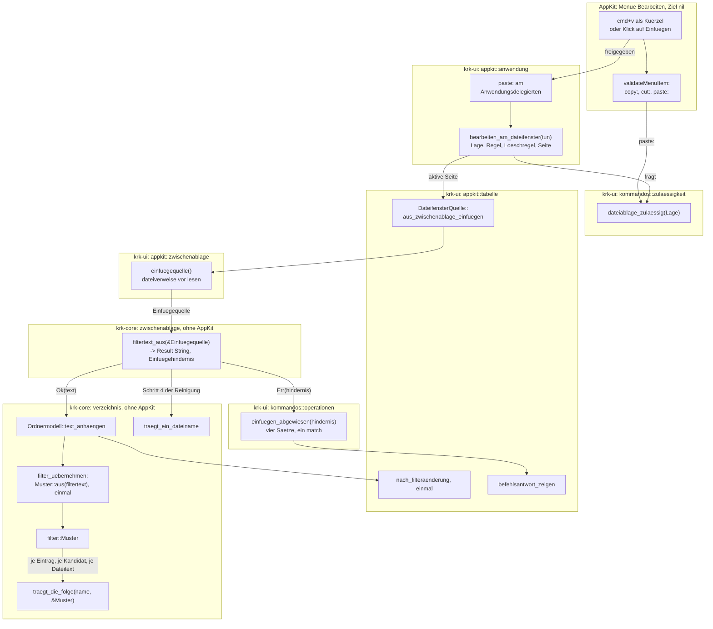
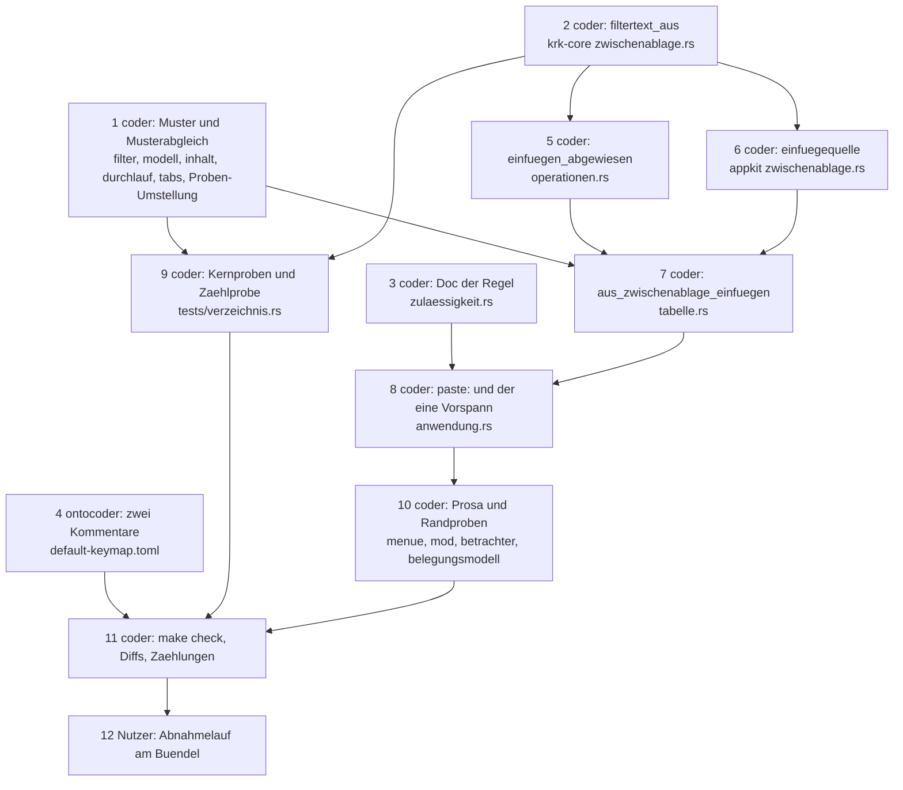

# Implementierungsplan: Der Dateilistenfilter nimmt Eingaben per Cmd+V an und versteht `*` als Platzhalter

**Date:** 2026-08-29
**Status:** freigegeben am 260829 (Plan-Tor vorab, autonome Runde), Bau läuft
**Spec:** `circles/260828-1041-dateilistenfilter-nimmt-eingaben-per-paste/planning/260829-1052_*_spec-einfuegen-in-den-filter-und-stern-als-platzhalter.md`, nach der Weisung des Nutzers vom 260829 vorab freigegeben, A1 bis A13 und B1 bis B9 ohne Einspruch
**Decidability:** Die zwei tragenden Fragen lauten: *Welcher Text aus der Zwischenablage gehört in den Filter, und trägt ein Name oder ein Dateitext das Muster mit `*`?* Beide sind aus den Eingaben entscheidbar, die der Mechanismus hat. Die erste beantwortet eine reine Funktion des Kerns allein aus dem, was die eine Hülle liest, nämlich der Zahl der Dateiverweise und dem Text (`crates/krk-ui/src/appkit/zwischenablage.rs:235-248`, `:446`): jede Regel aus A3 ist eine Eigenschaft der Zeichenkette (Zeilenende am Schluss, Zeilenende mittendrin, Schrägstrich, `file:`-Schema, die Zeichenklassen von `traegt_ein_dateiname`), und keine fragt nach der Herkunft des Textes. **Der Doppelpunkt ist die Stelle, an der der Spec eine Herkunft vermutet** („stammt fast immer aus einem Pfad in Finder-Schreibweise"); die Regel selbst ist trotzdem total, denn sie sagt „beim Einfügen fällt `:`", nicht „falls aus dem Finder". Die zweite Frage beantwortet ein Vergleich ohne Rückverfolgung: für ein Muster, dessen einziges Sonderzeichen `*` ist, findet die Suche jedes Stücks ab dem Ende des vorigen an der jeweils ersten Stelle genau dann eine Zerlegung, wenn es eine gibt; ein Beweis durch Vertauschung steht in Entscheidung 6. Nicht entscheidbar ist, ob der Nutzer ein wörtliches `*` meinte; der Spec hat den Mechanismus dafür schon gewechselt (B3: es gibt kein wörtliches `*` mehr), und der Plan nähert nichts an.

---

## Directive

Siehe den Spec. Zwei Fähigkeiten: `cmd+v` im Dateifenster hängt den bereinigten Inhalt der Zwischenablage an den Filtertext des sichtbaren Tabs an (C1 bis C4), und `*` im Filtertext steht für eine beliebige, auch leere Zeichenfolge, im Namen wie im Inhalt (C5 bis C7). Dieser Plan wiederholt die 52 Abnahmekriterien nicht, sondern ordnet jedem eine Stelle im Baum oder im Abnahmelauf zu. Keine der zehn Zeitzusagen ist berührt, und eine elfte entsteht nicht; der Spec begründet es unter `## Verhältnis zu den zehn Zeitzusagen aus C8 der Runde 1`, und der Plan hat es am Baum nachgelesen: weder `crates/krk-bench/src/messen.rs` noch `crates/krk-ui/src/messmodus.rs` setzt einen Filtertext.

---

## Current State

**Der Filtertext hat einen Weg hinein, und der ist zeichenweise.** `Anwendungsdelegierter::eingabe_ausfuehren` (`crates/krk-ui/src/appkit/anwendung.rs:3010-3072`) prüft Blatt und Ersthelfer aus der `Lage`, ruft für `Fokus::Dateifenster` allein `filterzeichen_tippen` an der Datenquelle des aktiven Fensters (`:3058-3062`); `DateifensterQuelle::filterzeichen_tippen` (`crates/krk-ui/src/appkit/tabelle.rs:2101-2110`) fragt `traegt_ein_dateiname`, hängt das Zeichen über `Ordnermodell::zeichen_anhaengen` an (`crates/krk-core/src/verzeichnis/modell.rs:954-957`) und ruft `nach_filteraenderung` (`tabelle.rs:2146`), den einen Weg der Anzeige nach jeder Filteränderung, der seinerseits `durchlauf_nachziehen`, `umsortiert`, `meldung_gewechselt` und die Ersatzzeile in dieser Reihenfolge fährt. `filtertext_setzen` (`modell.rs:940-944`) ersetzt statt anzuhängen und ist nach A7 nicht der Weg. Jede Änderung des Filtertexts läuft durch `filter_uebernehmen` (`modell.rs:1141-1146`), das `filter_klein` einmal je Änderung kleinschreibt, die Befunde zurücksetzt und die Sicht neu aufbaut.

**Der eine Vergleich ist ein `contains` über den kleingeschriebenen Namen.** `traegt_die_folge(name, filter_klein)` (`crates/krk-core/src/verzeichnis/filter.rs:122-124`) hat drei Rufer, alle im Kern: `Ordnermodell::name_traegt_den_filter` (`modell.rs:841-845`), die Kandidatenschleife des Durchlaufs (`crates/krk-core/src/verzeichnis/durchlauf.rs:539`) und `traegt_der_inhalt` (`crates/krk-core/src/verzeichnis/inhalt.rs:133-150`). Der kleingeschriebene Text reist als `String` in den Durchlauf (`Durchlauf::starten`, `durchlauf.rs:252-258`, Feld `Auftragslage::filter_klein` `:346`, weiter an `datei_entscheiden` `:430-434` und `unterbaum_entscheiden` `:483-487`); `Tabliste::durchlauf_nachziehen_an` holt ihn mit `tab.modell.filter_klein().to_owned()` (`crates/krk-ui/src/tabs.rs:920`). Außerhalb des Kerns ruft niemand `filter_klein()` außer dieser Stelle und drei Zeilen der Kernproben (`crates/krk-core/tests/verzeichnis.rs:1194`, `:1198`, `:1900`); die Kernproben rufen `traegt_der_inhalt` mit einem `&str` an vierzehn Stellen (`:1724-1900`). Die Zählprobe `die_zeichenregel_hat_zwei_rufer_und_der_vergleich_drei` (`tests/verzeichnis.rs:3226-3273`) liest **alle** `.rs`-Dateien unter `crates/`, die Probendateien eingeschlossen (`crates/krk-core/tests/gemeinsam/mod.rs:329-344`, `quellen_einsammeln` `:347-369`), streicht Kommentarzeilen und nichts sonst (`code_zeilen` `:3054-3059`) und verlangt namentlich `[tabelle.rs, belegungsmodell.rs]` für die Zeichenregel und `[durchlauf.rs, inhalt.rs, modell.rs]` für den Vergleich; die Heimat `filter.rs` fällt aus der Zählung. **Eine Probe in `tests/verzeichnis.rs`, die `traegt_die_folge` in einer Codezeile nennt, würde damit ein vierter Rufer**; die bestehenden Proben des Vergleichs stehen deshalb im Prüfmodul von `filter.rs` (`:161-`) und die Probe zu C6.9 (`der_name_und_der_inhalt_geben_dieselbe_antwort`, `tests/verzeichnis.rs:1886`) fragt `name_traegt_den_filter` gegen `traegt_der_inhalt`.

**Die Inhaltsschwelle wird an einer Stelle geprüft.** `Ordnermodell::inhalt_wirkt` (`modell.rs:1079-1081`) zählt `self.filtertext.chars().count()` gegen `inhaltsschwelle(self.tief)` (`filter.rs:157-159`); Rufer sind der Prüfschritt (`modell.rs:758`), `schalter_setzen` (`:1050-1052`) und `tabs.rs:168`, `:897`, `:928`. Der tiefe Durchlauf hängt an `filter_steht` (`tabs.rs:897`) und nicht an der Schwelle.

**Die Runde 22 hat den Weg für `paste:` vorgezeichnet.** `copy:` und `cut:` beantwortet der Anwendungsdelegierte im `define_class!`-Block (`anwendung.rs:892-894`, `:905-907`), je ein Einzeiler auf `dateiablage_ausfuehren(befehl)` (`:3188-3198`): `lage()`, `zulaessigkeit::dateiablage_zulaessig(lage)`, `befehlsantwort_beidseitig_loeschen()`, dann `self.dateifenster(aktiv).quelle().dateiverweise_ablegen(befehl)`. `validateMenuItem:` (`:953-971`) fragt für `copy:` und `cut:` dieselbe Regel und lässt jede andere fremde Aktion, also auch `paste:`, mit `true` an AppKit. Die Regel hat einen Rumpf `gestattet(Anspruch, Lage)` (`crates/krk-ui/src/kommandos/zulaessigkeit.rs:290-298`) und zwei Eingänge, `zulaessig(kommando, lage)` (`:205`) und `dateiablage_zulaessig(lage)` (`:230-232`); `Anspruch::Dateiablage` (`:247-252`) antwortet `Dateifenster`, nein, nein. Zwei Zählproben halten die Zahl der Frager, `beide_frager_rufen_die_eine_regel` (`:389-401`, zwei) und `die_zwei_frager_der_dateiablage_rufen_dieselbe_regel` (`:419-431`, zwei, über `quellbaum::aufrufstellen`, das einen Namen nur ohne Namenszeichen davor als Aufruf zählt, `crates/krk-ui/src/quellbaum.rs:133-151`). `dateiablageproben::der_delegierte_beantwortet_copy_und_cut_und_paste_nicht` (`anwendung.rs:9837-9866`) hält über `responds_to`, dass `paste:` unbeantwortet bleibt, und nennt diesen Circle als Grund. Die Prosa, die denselben Stand beschreibt: `anwendung.rs:78-89` („Zwei Antworten ohne Kommando"), `:886-888` („kein `paste:` daneben"), `:936-942` (Doc von `validateMenuItem:`), `:209-211` (Untergrenzen-Satz zu `copy:` und `cut:`); `crates/krk-ui/src/appkit/menue.rs:100-101` und `:126-134` sowie die Doc der Tafel `GEMESSEN` (`:885-896`); `zwischenablage.rs:72-78` („die `paste:`-Hälfte nicht"); `resources/default-keymap.toml:81-84` und `:990-997`; `crates/krk-ui/src/kommandos/mod.rs:68-76`.

**Die Hülle liest zwei Sorten, und die Deutung steht im Kern.** `lesen()` (`zwischenablage.rs:235-248`) fragt `NSPasteboardTypeFileURL` vor `NSPasteboardTypeString` an `generalPasteboard` und liefert die erste nicht leere Zeichenkette; `dateiverweise(ablage)` (`:446-472`) liefert alle Dateiverweise einer gereichten Ablage als `Vec<PathBuf>`, mit 0,13 ms je Eintrag gemessen (`:432-436`). `krk_core::zwischenablage::deuten` (`crates/krk-core/src/zwischenablage.rs:54-71`) trägt die `file:`-Zerlegung in den privaten Helfern `ohne_schema` (`:79`), `verweis_zu_pfad` (`:95-116`, drei Schreibweisen, Rechnername) und `prozent_dekodieren` (`:118-133`). Die Zählprobe `die_huelle_um_die_zwischenablage_steht_in_genau_einer_datei` hält `generalPasteboard`, `setString_forType` und `writeObjects` als Codezeilen auf die eine Datei; ein Rufer außerhalb der Hülle kann `generalPasteboard` deshalb nicht selbst nehmen.

**Die Meldungen der Runde 22 sind das Vorbild.** `Dateiablage`, `namenszeilen`, `ablagemeldung` (vollständiges `match`) und `verweise_abgewiesen` stehen in `crates/krk-ui/src/kommandos/operationen.rs:1124-1213` neben `ablage_weist_ab` (`:1119`); `zahl` (`:808`) ist die eine Schreibweise für Zahlen und `pub(crate)`. Die Statuszeile hat sieben Ränge (`crates/krk-ui/src/appkit/statuszeile.rs:218-238`, gezählt über `Rang::ALLE`); `befehlsantwort_zeigen` (`tabelle.rs:3349-3352`) ist die eine Stelle für den Rang `Befehlsantwort`, `filterstand_text` (`statuszeile.rs:488`) schreibt den Filtertext, wie er steht.

**Die Tippsuche der Belegungsansicht** vergleicht mit einem eigenen `contains` (`crates/krk-ui/src/belegungsmodell.rs:564-569`) und teilt mit dem Filter allein die Zeichenregel.

---

## Approach

Der Plan setzt an den Nähten an, die es gibt, und legt eine neue, den Typ des Musters.

**Erstens wird das Muster ein Typ, und der Vergleich bleibt eine Funktion mit drei Rufern.** `filter::Muster` entsteht einmal je Änderung des Filtertexts an der Stelle, an der heute `filter_klein` entsteht, schreibt dabei klein und zerlegt an `*`; `traegt_die_folge(name, &Muster)` behält Namen, Heimat und Rufer, und das Muster reist als Wert in den Durchlauf, wie heute der `String`. Die Asymmetrie der zwei Argumente (Filtertext einmal je Suche, Name einmal je Vergleich) wird damit vom Typ gehalten und nicht mehr von der Disziplin des Rufers.

**Zweitens ist das Einfügen für die Sicht ein einzelner Anschlag mit vielen Zeichen.** `Ordnermodell::text_anhaengen(text)` ruft `filter_uebernehmen` einmal, `DateifensterQuelle::aus_zwischenablage_einfuegen` ruft `nach_filteraenderung` einmal, und alles Weitere, Ordnerwechsel, Rückschritt, `Esc`, Schwelle, ist der bestehende Weg ohne Zutun dieser Runde (A8).

**Drittens ist die Reinigung eine Deutung der Zwischenablage und wohnt neben `deuten`.** `krk_core::zwischenablage::filtertext_aus(&Einfuegequelle) -> Result<String, Einfuegehindernis>` bekommt vom Rufer, was die Hülle gelesen hat, als Wert eines Typs, und antwortet mit dem Text oder mit einem von vier Hindernissen, die den vier Sätzen aus A5 eins zu eins entsprechen. Sie nutzt `verweis_zu_pfad` aus derselben Datei und `traegt_ein_dateiname` aus dem Filter; letzteres macht sie zum dritten Rufer der Zeichenregel, und die Zählprobe zieht mit Namen nach (C4.3).

**Viertens beantwortet der Anwendungsdelegierte `paste:` über denselben Rumpf wie `copy:` und `cut:`.** Die drei Selektoren des Menüs „Bearbeiten" am Dateifenster stellen denselben Anspruch (Wirkungsbereich Dateifenster, kein Blatt, keine Ausnahme); `dateiablage_zulaessig` bleibt ihr Eingang, und ein privater Helfer `bearbeiten_am_dateifenster(tun)` trägt die vier Zeilen Vorspann (Lage, Regel, Löschregel, aktive Seite) genau einmal für alle drei. `validateMenuItem:` bekommt `paste:` in den bestehenden Zweig. Kein neues `Kommando`, keine Belegungszeile, kein zweiter Menüeintrag (Constraint 5).



Die Richtung ist die des Weges: von AppKit über den Delegierten in die Regel und die Tabelle, von dort in die Hülle, in den Kern und zurück in die Anzeige. Die zwei Kernblöcke kennen einander nur über `traegt_ein_dateiname`, und kein Modul unter `kommandos/` oder im Kern zeigt nach `appkit/`. Der Platzhalter-Ast (rechts unten) und der Einfüge-Ast (links) teilen sich genau die Kante `text_anhaengen → filter_uebernehmen`; das ist der Grund, aus dem die zwei Fähigkeiten getrennt gebaut und zusammen abgenommen werden können.

---

## Die neun Entscheidungen aus `## Open for Planner`

### 1. Wo `paste:` beantwortet wird

**Am Anwendungsdelegierten, wie `copy:` und `cut:`.** Die Begründung der Runde 22 gilt unverändert: die Tabelle ist eine nackte `NSTableView` ohne Unterklasse, und eine Antwort dort wäre ein zweiter Ort für `validateMenuItem:` und ein dritter Frager der Regel. Der Delegierte hält die `Lage` (`anwendung.rs:3154`) und die aktive Seite. Die Attributform ist dieselbe, `#[unsafe(method(paste:))]`, mit der Signatur `(&self, _absender: Option<&AnyObject>)`; der Rumpf ist ein Aufruf von `einfuegen_ausfuehren`. Beide Frager, Menü und Tastendruck, laufen über dieselbe Kette (C1.3): das Kürzel `cmd+v` ist ein Menükürzel, das AppKit über `performKeyEquivalent:` als Klick auf den Eintrag zustellt, und einen zweiten Ausführungsweg gibt es nicht, weil der Ereignisabgriff die vom Menü gehaltenen Funktionen nicht sieht (`menue.rs:118-124`).

### 2. Wie die Zulässigkeitsregel gestellt wird

**`dateiablage_zulaessig` bleibt der Eingang, `Anspruch` bekommt keinen dritten Wert, und die vier Zeilen Vorspann stehen einmal.** Der Anspruch des Einfügens ist byteweise der der Dateiablage: `Wirkungsbereich::Dateifenster`, nicht während eines Blattes, nicht immer erreichbar (A9). Ein dritter Wert `Anspruch::Einfuegen` mit denselben drei Antworten wäre eine zweite Kopie derselben drei Antworten, die sich allein im Namen unterscheidet; `critical-stance.md` §2 sagt, das ist ein Defekt und keine Lösung. Was sich ändert, ist die Auskunft: der Doc-Kommentar von `dateiablage_zulaessig` und von `Anspruch::Dateiablage` sagt danach „die drei Selektoren des Menüs „Bearbeiten", die der Delegierte am Dateifenster beantwortet: `copy:` und `cut:` seit der Runde 22, `paste:` seit der Runde 21", und der Name `Dateiablage` liest sich seither als „der Ablage-Einhängepunkt des Dateifensters". Ob er umbenannt gehört, steht unter `## Open Questions`; dieser Plan benennt nicht um, weil die Umbenennung vier Proben, zwei Modulköpfe und die Runde-22-Prosa anfasste, ohne dass ein Rufer anders antwortete.

Damit die Zahl der Frager nicht mit jedem Selektor wächst, wandert der Vorspann von `dateiablage_ausfuehren` (`anwendung.rs:3188-3198`) in `fn bearbeiten_am_dateifenster(&self, tun: impl FnOnce(&DateifensterQuelle))`: Lage erheben, Regel fragen, bei nein zurück, `befehlsantwort_beidseitig_loeschen`, dann `tun(self.dateifenster(aktiv).quelle())`. `dateiablage_ausfuehren(befehl)` wird zu `self.bearbeiten_am_dateifenster(|quelle| quelle.dateiverweise_ablegen(befehl))`, und `einfuegen_ausfuehren()` zu `self.bearbeiten_am_dateifenster(|quelle| quelle.aus_zwischenablage_einfuegen())`. **`die_zwei_frager_der_dateiablage_rufen_dieselbe_regel` bleibt bei zwei** (Ausgrauung und der eine Vorspann), und ihr Doc-Kommentar nennt die neue Lage (C3.6): der zweite Frager ist seit dieser Runde der Rumpf, durch den alle drei Selektoren gehen. `quelle()` liefert `&DateifensterQuelle` (`tabelle.rs:4843-4845`), die Ausleihe des Fenstermodells endet vor dem Aufruf, wie heute.

### 3. Wie die Hülle die Ablage für das Einfügen liest

**Ein neuer Leser `einfuegequelle() -> Einfuegequelle`, der die zwei bestehenden zusammensetzt, plus die gereichte Form `einfuegequelle_aus(ablage)` für die Proben.** Rumpf: `let verweise = dateiverweise(&ablage); if !verweise.is_empty() { Verweise(verweise) } else { match lesen_aus(&ablage) { Some(text) => Text(text), None => Leer } }`. Die Rangfolge ist die von `lesen` (A2), Dateiverweis vor Text, und die Zahl der Verweise kommt mit, damit der Kern mehrere abweisen kann (A4). `lesen()` (`:235-248`) bekommt dafür die gereichte Schwester `lesen_aus(ablage: &NSPasteboard)` und wird zum Einzeiler darauf, nach dem Muster von `text_schreiben`/`text_auf_ablage_schreiben`; der Modulkopf-Satz „`lesen` bekommt keinen Parameter" (`:114-120`) bleibt wahr für `lesen` und bekommt den Halbsatz, dass die gereichte Form seit dieser Runde daneben steht, damit `einfuegequelle_aus` und die Proben nicht an `generalPasteboard` müssen. Der Typ `Einfuegequelle` wohnt im Kern (Entscheidung 4), die Hülle baut ihn; das ist die Form von `inhalt_lesen`, das `crate::vorschaumodell::Zwischenablageinhalt` baut (`:271-291`). **Keine dritte Sorte** (A11): `dateiverweise` liest `NSURL` mit `NSPasteboardURLReadingFileURLsOnlyKey`, `lesen_aus` liest `NSPasteboardTypeFileURL` und `NSPasteboardTypeString`. Liefert `dateiverweise` nichts und `lesen_aus` eine `file:`-Zeichenkette (ein Verweis auf einen fremden Rechner, den die Sortenfrage noch trägt), kommt sie als `Text` an und geht durch dieselbe Pfadregel wie ein getippter Pfad; ein eigener Zweig entsteht nicht.

### 4. Wo die Reinigung wohnt und wie sie heißt

**In `krk_core::zwischenablage`, als `filtertext_aus(quelle: &Einfuegequelle) -> Result<String, Einfuegehindernis>`, neben `deuten`.** Die Reinigung ist eine zweite Deutung desselben Gegenstands und braucht `verweis_zu_pfad` (`:95-116`), das dort privat steht; in `verzeichnis::filter` läge sie neben der Zeichenregel, müsste aber den `file:`-Helfer herüberholen oder öffentlich machen, und der Filter kennte plötzlich die Zwischenablage. Die zwei Typen:

```rust
pub enum Einfuegequelle { Verweise(Vec<PathBuf>), Text(String), Leer }
pub enum Einfuegehindernis { KeinText, Mehrzeilig, MehrereVerweise(usize), NichtsTragbar }
```

Die vier Varianten des Hindernisses sind die vier Sätze aus A5 in derselben Reihenfolge; `einfuegen_abgewiesen` in `operationen.rs` verzweigt über sie vollständig (Constraint 3). Die Reihenfolge der Reinigung ist die aus A3, als eine Fallunterscheidung ohne Überschneidung:

1. `Leer` → `Err(KeinText)`. `Verweise(v)` mit `v.len() > 1` → `Err(MehrereVerweise(v.len()))`. `Verweise([p])` → `pfadtext = p.to_string_lossy()`, weiter bei 4.
2. `Text(t)`: die Zeilenenden am Ende fallen (`t.trim_end_matches(['\n', '\r'])`); steht danach noch ein `\n` im Text → `Err(Mehrzeilig)`. Ein `\r` ohne `\n` ist kein Zeilenende im Sinne von A3 und fällt in Schritt 4 als Steuerzeichen.
3. Beginnt der Rest mit `file:` und liefert `verweis_zu_pfad` einen Pfad, ist `pfadtext` dieser Pfad als Zeichenkette (Prozentzeichen aufgelöst, C2.1 `Mein%20Text.md`); sonst ist `pfadtext` der Rest selbst. Kein Zweig für `http:` (C2.2).
4. `letzter_bestandteil(pfadtext)`: das letzte nicht leere Stück beim Teilen an `/`. Ein Text ohne `/` ist sein eigenes einziges Stück und kommt ganz; `Ordner/` liefert `Ordner`; `/` allein liefert nichts. **Eine Regel für Verweis, Pfadtext und Namen**, und deshalb keine Sonderbehandlung für `Path::file_name`, das für `/` und `..` `None` liefert.
5. Aus dem Stück fällt jedes Zeichen, für das `traegt_ein_dateiname` nein sagt, und der Doppelpunkt (Entscheidung 5). Bleibt nichts → `Err(NichtsTragbar)`; sonst `Ok(rest)`.

`#[must_use]` steht **nicht** an dieser Funktion, und das ist C4.4 und kein Verstoß: `Result` trägt `#[must_use]` in der Standardbibliothek, und ein zweites am `fn` löst `clippy::double_must_use` aus, das `-D warnings` rot macht. Der Doc-Kommentar sagt es in einem Satz. Ein Rufer, der die Antwort fallen ließe, bekäme die Warnung des Übersetzers.

### 5. Wie der Doppelpunkt fällt

**In der Reinigung, als eine Zeile neben der Zeichenregel: `traegt_ein_dateiname(z) && z != ':'`.** Die Tipp-Regel bleibt, wie sie ist (A3 Schritt 4, C2.3, C5.7); ein Schalter an `traegt_ein_dateiname(zeichen, beim_einfuegen)` gäbe der Regel zwei Bedeutungen und zwänge die Tippsuche der Belegungsansicht, einen Wert einzusetzen, den sie nicht meint. Die Zählprobe bekommt `krk-core/src/zwischenablage.rs` als **ersten** Eintrag der Zeichenrufer (die Sortierung von `quelldateien` ist die des Pfades unter `crates/`, und `krk-core/` steht vor `krk-ui/`), wird in `die_zeichenregel_hat_drei_rufer_und_der_vergleich_drei` umbenannt, und ihr Doc-Kommentar sagt, welcher der dritte ist und warum er im Kern und nicht in der Hülle steht (C4.3).

### 6. Wie der Text angehängt wird

**Eine anhängende Form am `Ordnermodell` für einen ganzen Text: `pub fn text_anhaengen(&mut self, text: &str)`, `push_str` und einmal `filter_uebernehmen`.** Sie steht neben `zeichen_anhaengen` (`modell.rs:954-957`) und trägt denselben Vertrag: welche Zeichen hineindürfen, hat der Rufer entschieden (hier die Reinigung), und die Stelle nimmt jedes. Eine Schleife über `zeichen_anhaengen` mit einem `nach_filteraenderung` danach hielte A7 zwar an der Anzeige ein, riefe aber `filter_uebernehmen` je Zeichen, also je Zeichen einen Neuaufbau der Sicht über den ganzen Bestand auf dem Hauptfaden; bei 100.000 Einträgen und zwölf Zeichen sind das elf Gänge zu viel (`modell.rs:1097-1109`, die Begründung von `befunde_setzen`, gilt hier wörtlich).

### 7. Die Form des zerlegten Musters

**Ein Typ `Muster` in `filter.rs`, der `filter_klein` als Feld des Modells ersetzt, und `traegt_die_folge(name: &str, muster: &Muster) -> bool`.**

```rust
#[derive(Debug, Clone, PartialEq, Eq)]
pub struct Muster { stuecke: Vec<String> }   // kleingeschrieben, an '*' geteilt; nie leer

impl Muster {
    pub fn aus(filtertext: &str) -> Self;      // to_lowercase, split('*'); "" -> [""]
}

pub fn traegt_die_folge(name: &str, muster: &Muster) -> bool {
    let name = name.to_lowercase();
    let mut ab = 0;
    for stueck in &muster.stuecke {
        match name[ab..].find(stueck.as_str()) {
            Some(stelle) => ab += stelle + stueck.len(),
            None => return false,
        }
    }
    true
}
```

Für einen Filtertext ohne `*` ist das genau ein `find`, also `contains` (B2, C5.4: ein leeres Stück am Anfang oder Ende trifft bei `find("")` sofort und verschiebt nichts). **Vollständig und ohne Rückverfolgung**, und der Grund ist ein Vertauschungsargument: gibt es für `s1*s2*…*sn` eine Zerlegung mit Stellen `p1 < p2 < …`, dann liegt die erste Fundstelle `q1 ≤ p1` von `s1`, und `s2` steht ab `p1 + |s1| ≥ q1 + |s1|` weiterhin im Rest; Induktion über die Stücke. C7.3 (`a*a*a` gegen `aaa`, `aa`, `a-a-a`) ist die Probe dazu. Die Umschreibung des Namens (`to_lowercase`) bleibt einmal je Vergleich, wie heute; die des Filtertexts geschieht in `Muster::aus`, also einmal je Änderung (B4, B7). Die Probe `ein_grossgeschriebener_filtertext_findet_nichts` (`filter.rs:245-250`) verliert ihren Gegenstand, weil kein Rufer dem Vergleich mehr einen ungeschriebenen Text reichen kann; an ihre Stelle tritt `das_muster_schreibt_einmal_klein`. Der Durchlauf bekommt das Muster als `Muster` statt als `String` (`Durchlauf::starten`, `Auftragslage`, `datei_entscheiden`, `unterbaum_entscheiden`, `traegt_der_inhalt`); `Vec<String>` ist `Send`, und `tabs.rs:920` klont es einmal je Lauf, wie heute den `String`.

### 8. Wie `inhalt_wirkt` die Zeichen ohne `*` zählt

**An Ort und Stelle: `self.filtertext.chars().filter(|z| *z != '*').count() >= inhaltsschwelle(self.tief)`.** Gezählt wird weiter der Filtertext und nicht das Muster, weil `to_lowercase` die Zeichenzahl ändern kann (`İ` wird zu zwei Zeichen) und die Schwelle von getippten Zeichen spricht. Eine Zahl aus der Zerlegung wäre eine zweite Rechnung derselben Größe an einem zweiten Ort (C6.5). Der Doc-Kommentar von `inhalt_wirkt` und der von `inhaltsschwelle` sagen, dass `*` nicht zählt und warum (B6, C7.5).

### 9. Wie die Statuszeile die Befehlsantwort nach einem abgewiesenen Einfügen schreibt

**Über die Datenquelle, `befehlsantwort_zeigen` an der Tabelle (`tabelle.rs:3349`), wie die Runde 22.** `aus_zwischenablage_einfuegen` schreibt im `Err`-Zweig `operationen::einfuegen_abgewiesen(hindernis)` dorthin; im `Ok`-Zweig schreibt es nichts, denn `nach_filteraenderung` zieht den Rang `Filterstand` nach, und die Befehlsantwort des vorigen Befehls hat der Vorspann des Delegierten schon gelöscht (C2.8, A5).

**Kein Schritt für den `analyst`.** Die Executor-Menge nennt ihn; die Runde hat keinen Schritt, dessen Produkt ein Entscheidungsdatensatz, eine Momentaufnahme oder ein Vergleich wäre. **Ein Schritt für den `ontocoder`**: die zwei Kommentare in `resources/default-keymap.toml`, die der Spec unter C4.5 ausdrücklich nachziehen lässt; die Datei ist die eine Quelle der Belegung und damit Daten, nicht Code.

---

## Implementation Steps

Jeder Schritt nennt genau einen Executor. Schritt 12 ist der einzige außerhalb der Executor-Menge: der Abnahmelauf am laufenden Bündel verlangt KRK im Vordergrund und eine gefüllte Zwischenablage des Nutzers, die keine Probe beschreiben darf (`circles/260802-0842-krk-mac-dateimanager-editor-git/decisions/260806-1303_*_wie-kommt-krk-fuer-den-abnahmelauf-in-den-vordergrund.md`, offen). **Die Schritte 1 bis 4 berühren disjunkte Dateien und haben keine Vorbedingung; sie laufen nebeneinander.** Schritt 1 ist der Platzhalter-Ast, die Schritte 2 bis 8 sind der Einfüge-Ast, und beide treffen sich erst in Schritt 7.

1. **Der eine Vergleich wird zum Musterabgleich, und das Muster reist als Typ** [DONE]
   - Executor: `coder`
   - Files: `crates/krk-core/src/verzeichnis/filter.rs`, `crates/krk-core/src/verzeichnis/modell.rs`, `crates/krk-core/src/verzeichnis/inhalt.rs`, `crates/krk-core/src/verzeichnis/durchlauf.rs`, `crates/krk-ui/src/tabs.rs`, `crates/krk-core/tests/verzeichnis.rs` (allein die mechanische Umstellung der bestehenden Proben)
   - Changes: In `filter.rs` entsteht `pub struct Muster` mit `Muster::aus(filtertext)` nach Entscheidung 7; `traegt_die_folge` (`:122-124`) bekommt die Signatur `(name: &str, muster: &Muster) -> bool` und den Rumpf aus Entscheidung 7, behält Namen und Heimat. Der Modulkopf (`:1-27`) beschreibt den Vergleich als Musterabgleich mit genau einem Sonderzeichen, ungebunden an beiden Enden, ohne Rückverfolgung, und nennt die Zählregel der Schwelle (C7.5); die Skizze (`:4-14`) bekommt `Muster::aus` zwischen dem Filtertext und dem Vergleich; der Satz „Die Zeichenregel hat zwei Aufrufer" (`:16-19`) wird zu drei mit dem Namen des dritten, weil Schritt 2 ihn anlegt. Der Doc-Kommentar von `inhaltsschwelle` (`:126-156`) sagt, dass `*` nicht zählt. Prüfmodul von `filter.rs` (die Heimat, die die Zählprobe nicht zählt; **neue Proben des Vergleichs gehören hierher und nicht nach `tests/verzeichnis.rs`**, siehe `## Current State`): die bestehenden Vergleichsproben (`:217-256`) rufen `Muster::aus`; `ein_grossgeschriebener_filtertext_findet_nichts` (`:245`) wird zu `das_muster_schreibt_einmal_klein` (`Muster::aus("Banane")` trifft `Banane.txt`); neu `ein_stern_steht_fuer_eine_beliebige_auch_leere_folge` (C5.2: `a*b` gegen `ab`, `a-b`, `a-lange-folge-b`, nicht `ba`), `zwei_sterne_sind_einer_und_lauter_sterne_treffen_jeden_namen` (C5.3), `ein_stern_am_rand_verankert_nichts` (C5.4: `*abc`, `abc*`, `*abc*`, `abc` über `abc`, `xabc`, `abcx`, `xabcx`, `axbc`), `es_gibt_kein_zweites_sonderzeichen_und_kein_entkommen` (C5.5: `a?b`, `a[b`, `a*b.txt`), `die_schreibung_bleibt_und_gefaltet_wird_nichts` (C5.6), `der_vergleich_sucht_jedes_stueck_genau_einmal_ab_dem_ende_des_vorigen` (C7.3), `traegt_ein_dateiname_nimmt_den_stern` (C5.7, B3) und der Markerfall `260503-1144_*_f1` gegen `_d_`, `_c_` und den Namen ohne Marker (C5.1, Vergleichshälfte). In `modell.rs` wird das Feld `filter_klein: String` (`:286`) zu `muster: Muster`, der Zugang `filter_klein()` (`:930-932`) zu `muster() -> &Muster`, `filter_uebernehmen` (`:1141-1146`) zu `self.muster = Muster::aus(&self.filtertext)`, `name_traegt_den_filter` (`:844`) reicht `&self.muster`; `inhalt_wirkt` (`:1079-1081`) zählt nach Entscheidung 8, sein Doc-Kommentar sagt es; neu `pub fn text_anhaengen(&mut self, text: &str)` neben `zeichen_anhaengen` (`:954-957`) nach Entscheidung 6 mit Doc-Kommentar (A7, der Vertrag des Rufers, der Grund gegen die Schleife). Der Modulkopf-Absatz `:105-107` nennt das Muster statt `filter_klein`. In `inhalt.rs` bekommt `traegt_der_inhalt` (`:133`) `muster: &Muster` und die Doc (`:113-132`) sagt, dass die Kleinschreibung des Filtertexts im Typ steckt. In `durchlauf.rs` werden `Durchlauf::starten` (`:256`), `Auftragslage` (`:346`), `durchlauffaden` (`:364`), `datei_entscheiden` (`:432`) und `unterbaum_entscheiden` (`:485`) auf `Muster` umgestellt; der Aufruf `:539` reicht es weiter; Docs (`:233-235`) ziehen nach. In `tabs.rs:920` steht `tab.modell.muster().clone()`. In `tests/verzeichnis.rs` ziehen allein die bestehenden Proben nach: `:1194` und `:1198` fragen `modell.muster()` gegen `Muster::aus("AaA")` und `Muster::aus("")`, die Helfer und Aufrufe von `traegt_der_inhalt` (`:1715-1900`) reichen `&Muster::aus(…)`; keine Codezeile dieser Datei nennt `traegt_die_folge`. Am Ende des Schritts übersetzen `krk-core` und `krk-ui`, und `cargo test -p krk-core` ist bis auf die Zählprobe grün, die erst Schritt 9 nachzieht (Schritt 2 legt den dritten Zeichenrufer an).
   - Kriterien: C5.1 bis C5.7 (Vergleichshälften), C6.5, C7.2, C7.3, C7.5, B1 bis B4, B6, B7, Constraint 6, Constraint 7
   - Dependencies: keine

2. **Die Reinigung im Kern** [DONE]
   - Executor: `coder`
   - Files: `crates/krk-core/src/zwischenablage.rs`
   - Changes: Neben `deuten` (`:54`) entstehen `pub enum Einfuegequelle`, `pub enum Einfuegehindernis` (beide `Debug`, `Clone`, `PartialEq`, `Eq`) und `pub fn filtertext_aus(quelle: &Einfuegequelle) -> Result<String, Einfuegehindernis>` nach Entscheidung 4, mit den privaten Helfern `letzter_bestandteil(&str) -> &str` und `tragbar(char) -> bool` (Entscheidung 5, ruft `traegt_ein_dateiname` aus `crate::verzeichnis::filter`). Der Modulkopf bekommt neben der Skizze (`:3-7`) einen zweiten Ausgang `einfuegequelle ──> filtertext_aus ──> Ok(Text) ──> Filtertext des Tabs` / `Err(Hindernis) ──> Statuszeile` und einen Abschnitt `# Eine zweite Deutung: was aus der Ablage in den Filter kommt (Runde 21)` mit den fünf Schritten, dem Grund für den Doppelpunkt, dem Grund gegen einen `http:`-Zweig, und dem Satz zu `#[must_use]` (Entscheidung 4, letzter Absatz). Proben im Prüfmodul, je Schritt und je Hindernis (C4.2): `Text("Notizen.md")` → `Notizen.md`, `Text("/Users/k1/Notizen.md")` → `Notizen.md`, `Text("Ordner/")` → `Ordner`, `Verweise([/Users/k1/Mein Text.md])` → `Mein Text.md`, `Text("file:///Users/k1/Mein%20Text.md")` → `Mein Text.md` (C2.1); `Text("https://example.com/pfad/seite.html")` → `seite.html` (C2.2); `Text("Name\n")` und `Text("Name\r\n")` → `Name`, `Text("a\tb:c")` → `abc` (C2.3); `Text("erste Zeile\nzweite Zeile")` → `Err(Mehrzeilig)` (C2.4); `Verweise` mit drei Pfaden → `Err(MehrereVerweise(3))` (C2.5, Regelhälfte); `Leer` → `Err(KeinText)` (C2.6, Regelhälfte); `Text("\t:\t")` → `Err(NichtsTragbar)` (C2.7); `Text("260503-1144_*_f1-zitadel-slot-rehost-and-swap-test.md")` behält das `*` (C2.10, Reinigungshälfte); `Text("ab cd")` behält das Leerzeichen (C1.8, Reinigungshälfte); `Text("/")` → `Err(NichtsTragbar)`; `Text("file://fileserver/x/y.md")` → `y.md` (der nicht lokale Verweis geht als Pfadtext durch dieselbe Regel). Die Datei nennt keine `objc2`-Kiste.
   - Kriterien: C2.1 bis C2.7 (Probenhälften), C2.10, C1.8 (Reinigungshälfte), C4.2, A3, A4, Constraint 1 (Deutung im Kern)
   - Dependencies: keine (macht `die_zeichenregel_hat_zwei_rufer_und_der_vergleich_drei` rot, bis Schritt 9 sie nachzieht)

3. **Die Zulässigkeitsregel sagt, wen ihr zweiter Eingang bedient** [DONE]
   - Executor: `coder`
   - Files: `crates/krk-ui/src/kommandos/zulaessigkeit.rs`
   - Changes: Kein Code ändert sich in der Regel. Der Doc-Kommentar von `dateiablage_zulaessig` (`:209-229`) und der von `Anspruch::Dateiablage` (`:247-252`) nennen die drei Selektoren nach Entscheidung 2 und sagen, warum kein dritter Wert entsteht; der Modulkopf `# Ein Rumpf, zwei Eingänge (Runde 22)` (`:30-55`) bekommt den Absatz, dass `paste:` seit der Runde 21 denselben Eingang nimmt, und die Skizze (`:8-17`) die dritte Beschriftung. `die_zwei_frager_der_dateiablage_rufen_dieselbe_regel` (`:403-431`) behält die Zahl 2 und sagt in der Doc, welche zwei es seit dieser Runde sind: `validateMenuItem:` und `Anwendungsdelegierter::bearbeiten_am_dateifenster`, der Rumpf aller drei Selektoren (C3.6). `die_dateiablage_wirkt_genau_mit_dem_fokus_im_dateifenster` (`:433-`) bekommt den Doc-Satz, dass die Tafel seit dieser Runde auch das Einfügen hält (C3.2, C3.4, C3.5, Probenhälften), und `waehrend_eines_blattes_kommen_genau_diese_vier_durch` den Satz, dass das Einfügen die Liste nicht erweitert (C3.2).
   - Kriterien: C3.2, C3.4, C3.5, C3.6 (Probenhälften), A9, Constraint 3, Constraint 4
   - Dependencies: keine

4. **Die zwei Kommentare der Belegungsdatei** [DONE]
   - Executor: `ontocoder`
   - Files: `resources/default-keymap.toml`
   - Changes: Allein Kommentarzeilen; kein `[[funktion]]`-Block, keine `tasten`-Zeile, kein neuer Eintrag (C1.9, Constraint 5). `:81-84`: der Satz „hält sie für die Dateizwischenablage einer späteren Runde frei" wird zur Lage nach den Runden 22 und 21: `copy:` und `cut:` beantwortet der Delegierte am Dateifenster seit der Runde 22 und legt Verweise ab, `paste:` seit der Runde 21 und füllt den Filtertext; die Reservierung ist damit ganz eingelöst, und was eine spätere Dateizwischenablage mit der besetzten Kombination tut, steht in `circles/260828-1041-…/decisions/260828-1041_*_…`. `:990-997`: „im Dateifenster heute niemand, weshalb der Eintrag dort grau ist" und „Genau dieser Punkt ist später der Einhängepunkt" werden zu: im Dateifenster antwortet der Anwendungsdelegierte auf alle drei, und der Einhängepunkt ist besetzt, ohne einen zweiten Menüeintrag und ohne eine zweite Zeile in dieser Datei. Der Eintrag `text_einfuegen` (`:1047-1050`) bleibt zeichengleich (A13). Der Ontocoder schreibt die zwei Fassungen der Zeilen `:81-84` und `:990-997` in seinen History-Eintrag.
   - Kriterien: C4.5 (Belegungshälfte), C1.9, A13, Constraint 5
   - Dependencies: keine (der Wortlaut nimmt die Runde vorweg; ein Bau hängt nicht daran)

5. **Die vier Sätze der Statuszeile** [DONE]
   - Executor: `coder`
   - Files: `crates/krk-ui/src/kommandos/operationen.rs`
   - Changes: Nach dem Block „Die Dateiverweise in der Zwischenablage (Runde 22)" (`:1124-1213`) entsteht ein Block „Das Einfügen in den Filter (Runde 21)" mit `#[must_use] pub fn einfuegen_abgewiesen(hindernis: Einfuegehindernis) -> String`, vollständiges `match` über die vier Varianten, kein Auffangzweig, mit dem Wortlaut aus A5, Umlaute inbegriffen: `KeinText` → `nichts einzufügen: die Zwischenablage trägt keinen Text`; `Mehrzeilig` → `nicht eingefügt: der Text hat mehrere Zeilen`; `MehrereVerweise(n)` → `nicht eingefügt: die Zwischenablage trägt <zahl(n)> Dateiverweise`; `NichtsTragbar` → `nichts einzufügen: der Text trägt kein Zeichen, das ein Name tragen kann`. Doc-Kommentar nach dem Muster von `verweise_abgewiesen` (`:1199-1213`): vier Hindernisse, vier Sätze, die Zahl in der Schreibweise von `zahl` (`:808`), und der Grund, warum ein geglücktes Einfügen keinen Satz bekommt (A5, C2.8). Vier Proben, eine je Variante, mit dem Wortlaut als Erwartung, dazu `MehrereVerweise(1234)` → `1.234 Dateiverweise` (C2.9). Der Modulkopf von `operationen.rs` nennt den Block.
   - Kriterien: C2.4 bis C2.7 (Wortlaut), C2.9, A5, Constraint 2, Constraint 3
   - Dependencies: Schritt 2 (der Typ `Einfuegehindernis`)

6. **Der dritte Leser der Hülle** [DONE]
   - Executor: `coder`
   - Files: `crates/krk-ui/src/appkit/zwischenablage.rs`
   - Changes: `lesen()` (`:235-248`) wird zu `lesen_aus(&NSPasteboard::generalPasteboard())`, und `pub fn lesen_aus(ablage: &NSPasteboard) -> Option<String>` trägt den bisherigen Rumpf. Neu `pub fn einfuegequelle() -> Einfuegequelle` und `pub fn einfuegequelle_aus(ablage: &NSPasteboard) -> Einfuegequelle` nach Entscheidung 3, mit Doc-Kommentar (Rangfolge aus A2, die Verweiszahl für A4, kein dritter Sortentyp nach A11, die 0,13 ms je Verweis aus `:432-436` als Auskunft). Der Modulkopf: die Skizze (`:5-26`) bekommt den Pfeil `├─> einfuegequelle ──> krk_core::zwischenablage::filtertext_aus (Runde 21)`, der Absatz `:72-78` sagt, dass seit der Runde 21 auch die `paste:`-Hälfte besetzt ist, und zwar vom Filter und nicht von einer Dateizwischenablage, mit Verweis auf den offenen Datensatz; der Absatz `:114-120` bekommt den Halbsatz zur gereichten Form `lesen_aus`. Der Untergrenzen-Abschnitt (`:188-213`) bleibt, denn keine neue Klasse und keine neue Methode wird angesprochen; der Coder liest ihn und bestätigt es in seinem History-Eintrag (C4.6). Proben auf `probenablage`: Text allein → `Text`; zwei Dateiverweise aus dem `Pruefordner` → `Verweise` mit zwei Pfaden in Reihenfolge; ein Verweis mit Namenszeile daneben (über `dateiverweise_auf_ablage_schreiben`, `:359`) → `Verweise` mit einem Pfad und nicht `Text` (Rangfolge); geleerte Ablage → `Leer`. `die_huelle_um_die_zwischenablage_steht_in_genau_einer_datei` bleibt, wie sie ist: `generalPasteboard` steht weiter allein hier (C4.1).
   - Kriterien: C4.1, C4.6, A2, A11, Constraint 1 (Hülle)
   - Dependencies: Schritt 2 (der Typ `Einfuegequelle`)

7. **Das Einfügen an der Tabelle** [DONE]
   - Executor: `coder`
   - Files: `crates/krk-ui/src/appkit/tabelle.rs`
   - Changes: Neben `dateiverweise_ablegen` (`:1940`) entsteht `pub fn aus_zwischenablage_einfuegen(&self)`: `let quelle = super::zwischenablage::einfuegequelle();` dann `match krk_core::zwischenablage::filtertext_aus(&quelle)`: `Ok(text)` → in einer Ausleihe `tabs.aktiver_mut().modell_mut().text_anhaengen(&text)`, danach `self.nach_filteraenderung()` (einmal, A7, C1.4); `Err(hindernis)` → `self.befehlsantwort_zeigen(&operationen::einfuegen_abgewiesen(hindernis))`. Doc-Kommentar: der zweite Eingang in den Filtertext neben `filterzeichen_tippen` (`:2101`), der Vertrag der Reinigung (kein Zeichen kommt hier an, das die Zeichenregel abweist), warum die Ausleihe vor `nach_filteraenderung` endet (wie in `filterzeichen_tippen`), und dass ein geglücktes Einfügen keine Befehlsantwort schreibt (C2.8). `nach_filteraenderung` (`:2146`) nennt in seiner Doc das Einfügen als dritten Rufer neben Tippen und Rücknehmen; der Modulkopf (`:18-23`) nennt das Einfügen als weiteren Weg durch `befehlsantwort_zeigen`. Keine neue AppKit-Berührung; der Untergrenzen-Abschnitt bleibt (C4.6). `pub`, weil der Rufer der Anwendungsdelegierte ist.
   - Kriterien: C1.1 bis C1.4 (Bauart), C2.8, C4.6, A7, A8
   - Dependencies: Schritte 1, 5, 6

8. **Die dritte Antwort beim Anwendungsdelegierten** [DONE]
   - Executor: `coder`
   - Files: `crates/krk-ui/src/appkit/anwendung.rs`
   - Changes: Im `define_class!`-Block neben `dateien_ausschneiden_aktion` (`:905-907`) eine Methode `#[unsafe(method(paste:))] fn filter_einfuegen_aktion(&self, _absender: Option<&AnyObject>)`, Einzeiler auf `self.einfuegen_ausfuehren()`; der Coder prüft den Namen mit `grep` gegen Kollisionen. Im `impl`-Block wird `dateiablage_ausfuehren` (`:3188-3198`) nach Entscheidung 2 auf den privaten Helfer `bearbeiten_am_dateifenster(&self, tun: impl FnOnce(&DateifensterQuelle))` umgestellt, der den Vorspann trägt, und `fn einfuegen_ausfuehren(&self)` ruft ihn mit `|quelle| quelle.aus_zwischenablage_einfuegen()`. Der Doc-Kommentar des Helfers übernimmt den von `dateiablage_ausfuehren` (der Spiegel von `kommando_ausfuehren`, die Regel wird ein zweites Mal gefragt, die Seite ist die aus `bereichskommando`) und sagt, dass er der eine Rumpf der drei Selektoren ist. `validateMenuItem:` (`:967-968`): der Zweig wird zu `aktion == Some(sel!(copy:)) || aktion == Some(sel!(cut:)) || aktion == Some(sel!(paste:))`; die Doc (`:936-942`) sagt, dass die drei Selektoren der Regel unterstehen und der letzte Zweig für die drei übrigen zugestellten Funktionen bleibt (C3.6). Prosa: der Modulkopf-Abschnitt `:78-89` heißt „Drei Antworten ohne Kommando: `copy:`, `cut:` und `paste:` (Runden 22 und 21)" und sagt, dass `paste:` den Filtertext füllt; `:886-888` verliert „kein `paste:` daneben"; der Untergrenzen-Satz `:209-211` nennt `paste:` als dritten erklärten Selektor (C4.6). `dateiablageproben` (`:9837-9866`): die Probe heißt `der_delegierte_beantwortet_copy_cut_und_paste`, hält alle drei mit `responds_to` und nennt in der Doc die Runde 21 als Grund (C3.7).
   - Kriterien: C1.3, C3.1, C3.3 (Bauart: der Fokusvorbehalt trennt), C3.6, C3.7, C4.5 (anwendung.rs), C4.6, A1, A9, Constraint 3, Constraint 5
   - Dependencies: Schritte 3, 7

9. **Die Proben des Kerns am Ordnermodell, am Durchlauf und am Inhalt, und die Zählprobe zieht nach** [DONE]
   - Executor: `coder`
   - Files: `crates/krk-core/tests/verzeichnis.rs`
   - Changes: `die_zeichenregel_hat_zwei_rufer_und_der_vergleich_drei` (`:3226-3273`) heißt `die_zeichenregel_hat_drei_rufer_und_der_vergleich_drei`, erwartet für die Zeichenregel `["krk-core/src/zwischenablage.rs", "krk-ui/src/appkit/tabelle.rs", "krk-ui/src/belegungsmodell.rs"]` und für den Vergleich unverändert die drei; die Doc sagt, warum die Reinigung ein Rufer ist und in welcher Datei sie steht (C4.3, C7.1). Neue Proben, alle über `Ordnermodell`, `Durchlauf` oder `traegt_der_inhalt` und ohne `traegt_die_folge` in einer Codezeile: `ein_eingefuegter_text_ist_derselbe_filtertext_wie_fuenf_getippte_zeichen` (C1.1, Modellhälfte; C1.2: `zeichen_anhaengen('n')`, `('o')`, dann `text_anhaengen("tiz")` ergibt `notiz`; Sicht und `muster()` gleich dem zeichenweisen Weg); `der_rueckschritt_nach_einem_einfuegen_nimmt_ein_zeichen` (C1.5: `letztes_zeichen_weg` lässt `noti`, `filter_leeren` leert); `ein_eingefuegter_name_von_fuenf_zeichen_stoesst_den_inhaltsfilter_sofort_an` (C1.7: `tief_setzen(true)`, `inhalt_setzen(true)`, `text_anhaengen("hallo")`, `inhalt_wirkt()`); `ein_eingefuegter_marker_findet_beide_marker` (C2.10, C5.1 am Bestand mit `_d_`, `_c_` und ohne Marker); `ein_stern_am_rand_aendert_die_sicht_nicht` (C5.4 am Modell); `der_durchlauf_versteht_das_muster` (C6.1 im Prüfordner aus `gemeinsam`: `a*z` findet `anzeige.txt` im Unterbaum, nicht `zebra.txt`); `der_inhalt_versteht_das_muster_ueber_zeilenenden` (C6.2: `fn*main` gegen eine Datei mit `fn` und später `main` in einer anderen Zeile, gegen eine mit `main` vor `fn`); `der_name_und_der_inhalt_geben_dieselbe_antwort` (`:1886`) läuft mit einem Muster ein zweites Mal (C6.3); `das_sternchen_zaehlt_nicht_zur_schwelle` (C6.4: `ab*` wirkt nicht, `ab*c` wirkt bei flach; `ab*cd` nicht, `ab*cde` wirkt bei tief; `*****` nie); `ein_einzelnes_sternchen_stoesst_den_durchlauf_an_und_entscheidet_jeden_ordner_mit_dem_ersten_eintrag` (C6.6, am `Durchlauf` mit `Muster::aus("*")`, jeder Ordner `Some(true)`). `der_kleingeschriebene_filtertext_laeuft_mit` (`:1188`) bekommt einen Fall mit `*`.
   - Kriterien: C1.1, C1.2, C1.5, C1.7 (Modellhälften), C2.10, C4.3, C5.1, C5.4 (Modellhälften), C6.1 bis C6.4, C6.6, C7.1, B5, B6, B8
   - Dependencies: Schritte 1, 2

10. **Die Prosa des Menüs und des Kommandoverzeichnisses, und zwei Randproben** [DONE]
    - Executor: `coder`
    - Files: `crates/krk-ui/src/appkit/menue.rs`, `crates/krk-ui/src/kommandos/mod.rs`, `crates/krk-ui/src/appkit/betrachter.rs`, `crates/krk-ui/src/belegungsmodell.rs`
    - Changes: `menue.rs:100-101` („`paste:` beantwortet der Delegierte nicht") und `:126-134` sagen den Stand nach der Runde 21: alle drei Selektoren beantwortet der Delegierte am Dateifenster und unterstellt sie der Regel; `paste:` füllt den Filtertext; der Circle ist gefahren, und der offene Datensatz bleibt. Die Doc der Tafel `GEMESSEN` (`:885-896`) sagt „`copy:`, `cut:` und `paste:` ja" für die Delegiertenprobe; die Tafel selbst bleibt zeichengleich, denn sie misst Ersthelferklassen. `kommandos/mod.rs:29-31` nennt bei `operationen` die Sätze des Einfügens, `:68-76` sagt, dass der zweite Eingang seit der Runde 21 drei Selektoren bedient. `betrachter.rs:731-` bekommt eine dritte Nadel `concat!("unsafe(method(pas", "te:))")` mit Erwartung `[("krk-ui/src/appkit/anwendung.rs", 1)]` und heißt `nspasteboard_steht_nicht_im_betrachter_und_copy_cut_und_paste_stehen_an_genannten_stellen`; Modulkopf `:65` zieht nach. `belegungsmodell.rs`, Prüfmodul (`:915-`): `die_tippsuche_kennt_keinen_platzhalter` (C5.8: `a*b` findet allein Zeilen, die `a*b` wörtlich tragen; über `trefferzeilen`, `:1710`).
    - Kriterien: C4.5 (menue.rs), C5.8, B9
    - Dependencies: Schritt 8

11. **Der Bau, die Zählungen und die zwei Ausgaben gegen den Stand vor der Runde** [DONE]
    - Executor: `coder`
    - Files: keine im Baum; geprüft wird mit Kommandos
    - Changes: `make check` grün, darunter `cargo clippy --workspace --all-targets -- -D warnings` (C4.4). `git diff c6c86cb HEAD -- resources/default-keymap.toml` zeigt allein Kommentarzeilen (Schritt 4); `git diff c6c86cb HEAD -- Cargo.lock Cargo.toml` leer und `grep -n 'name = "cc"\|-sys"' Cargo.lock` allein `windows-sys` (C7.4). `awk '/^pub enum Kommando/,/^}/' crates/krk-core/src/tasten/belegung.rs | grep -c ','` vor und nach der Runde gleich; `grep -rn 'Kontextbefehl' crates/krk-ui/src/kommandos/kontextmenue.rs` zeigt drei Werte (A12). `make menue` auf `c6c86cb` und auf HEAD in zwei Dateien unter dem Scratchpad, `diff` leer (C1.9); `make tasten` ebenso, oder, falls es wie in der Runde 22 nicht kopflos läuft, der leere Diff der Belegungsquelle ohne Kommentare (`grep -v '^#' resources/default-keymap.toml` beidseits). `grep -rn NSPasteboard crates/krk-ui/src` außerhalb von `zwischenablage.rs` liefert vor und nach der Runde dieselben Stellen (C4.1). `grep -oE '"L[0-9]+"' crates/krk-bench/src/messen.rs | sort -u` liefert dieselben zehn. Das Ergebnis steht mit Prüfsummen im History-Eintrag des Coders.
    - Kriterien: C1.9, C4.1, C4.4, C7.4, Constraint 2, Constraint 5, Constraint 7
    - Dependencies: Schritte 4, 9, 10

12. **Der Abnahmelauf am laufenden Bündel**
    - Executor: Nutzer (kein Agent; siehe die Vorbemerkung zu dieser Liste)
    - Files: keine; geprüft wird am gebauten `target/KRK.app`
    - Changes: `cargo xtask bundle` bauen und KRK aus einem Terminalfenster im Vordergrund starten. Zu prüfen sind die Kriterien, die eine laufende Oberfläche und die Zwischenablage des Nutzers verlangen: `notiz` im Terminal kopiert, `cmd+v` im Dateifenster, Liste und Statuszeile `Filter „notiz“: n von m angezeigt` (C1.1); `no` getippt, `tiz` eingefügt (C1.2); „Bearbeiten › Einfügen" statt der Taste (C1.3); zwölf Zeichen bei stehendem „Deep", die Sicht flackert nicht (C1.4, Bündelhälfte); Rückschritt und `Esc` danach (C1.5); Wechsel in einen Unterordner und zurück (C1.6); „Content" und „Deep" an, `hallo` eingefügt, eine Datei mit `hallo` im Text steht abgesetzt (C1.7); `ab cd` mit Leerzeichen, danach die Leertaste, die weiter markiert (C1.8); ein im Finder kopierter Eintrag `Mein Text.md` (C2.1, Finder-Fall); drei im Finder kopierte Einträge und drei in KRK mit `cmd+c` kopierte (C2.5); ein kopiertes Bild (C2.6); nach einem geglückten Einfügen steht keine Befehlsantwort (C2.8); ein aus der Werkbank kopierter Name mit `_*_` (C2.10); „Einfügen" freigegeben neben „Kopieren" und „Ausschneiden" (C3.1); während eines Blattes (Rückfrage, Notizzettel, Stapelumbenennen) grau und wirkungslos (C3.2); `cmd+v` im Umbenennungsfeld, in der Pfadeingabe, im Editor fügt dort ein (C3.3); Fokus in der Lesezeichenleiste (C3.4); leere Zwischenablage, Eintrag freigegeben, Meldung nach C2.6 (C3.5); `Filter „a*b“: …` in der Statuszeile (C5.9). Der Lauf gilt als gefahren, wenn jeder Punkt im Turn log des Circle-Datensatzes steht.
    - Kriterien: C1.1 bis C1.8, C2.1 (Finder-Fall), C2.5, C2.6, C2.8, C2.10, C3.1 bis C3.5 (Bündelhälften), C5.9
    - Dependencies: Schritt 11



Die Schritte 1, 2, 3 und 4 laufen nebeneinander; 5 und 6 nebeneinander nach 2; 7 wartet auf 1, 5 und 6; 8 auf 3 und 7; 9 auf 1 und 2 und nebeneinander mit 5 bis 8; 10 auf 8; 11 auf 4, 9 und 10; 12 auf 11. **Eine Probe ist zwischen Schritt 2 und Schritt 9 rot, und das ist die Reihenfolge und keine Panne**: `die_zeichenregel_hat_zwei_rufer_und_der_vergleich_drei` erwartet zwei Zeichenrufer, und Schritt 2 legt den dritten an; Schritt 9 zieht sie nach. Wer die Schritte 2 und 9 in einem Zug baut, sieht sie nie rot. Jeder Schritt lässt beide Kisten übersetzen; `make check` gilt am Ende von Schritt 11 und nicht je Schritt (`shared/issues/260820-0602_*_make-check-prueft-den-ganzen-arbeitsbereich-und-bricht-bei-parallelen-agenten-an-fremden-dateien-ab.md`).

---

## Where this Circle stops

- Alle zwölf Schritte dieses Plans stehen auf `[DONE]`, und jede behauptete Erledigung ist einzeln gegen den Baum gelesen; der Abgleich liegt unter `history/` dieses Circles.
- `make check` läuft grün, also `cargo build --workspace`, `cargo test --workspace`, `cargo clippy --workspace --all-targets` und `cargo fmt --all --check`; `cargo clippy --workspace --all-targets -- -D warnings` endet mit 0.
- Jedes der 52 Abnahmekriterien des Specs hat eine benannte Stelle in einer `Kriterien:`-Zeile eines Schritts oder im Abnahmelauf, und keines steht ohne Zuordnung da.
- `resources/default-keymap.toml` unterscheidet sich von `c6c86cb` allein in Kommentarzeilen (`git diff c6c86cb HEAD -- resources/default-keymap.toml | grep '^[-+]' | grep -v '^[-+]#' | grep -v '^[-+][-+]'` ist leer); `make menue` gibt beidseits dieselbe Ausgabe; `awk '/^pub enum Kommando/,/^}/' crates/krk-core/src/tasten/belegung.rs` zählt vor und nach der Runde gleich viele Varianten; `Kontextbefehl` hat drei Werte.
- `Cargo.lock` und `Cargo.toml` sind im Diff der Runde nicht enthalten; `grep -n 'name = "cc"\|-sys"' Cargo.lock` liefert allein `windows-sys`; `grep -rn 'regex' Cargo.lock` ist leer.
- `traegt_die_folge` ist in `filter.rs` genau einmal erklärt und wird genau von `durchlauf.rs`, `inhalt.rs` und `modell.rs` gerufen; `traegt_ein_dateiname` genau von `krk-core/src/zwischenablage.rs`, `tabelle.rs` und `belegungsmodell.rs`; beides hält `die_zeichenregel_hat_drei_rufer_und_der_vergleich_drei`.
- `dateiablage_zulaessig` hat außerhalb seiner Datei genau zwei Rufer, `validateMenuItem:` und `bearbeiten_am_dateifenster`, gehalten von `die_zwei_frager_der_dateiablage_rufen_dieselbe_regel`; `waehrend_eines_blattes_kommen_genau_diese_vier_durch` steht bei vier.
- `#[unsafe(method(paste:))]` steht als Codezeile genau einmal im Baum, in `anwendung.rs`, gehalten von der Probe aus Schritt 10; `Anwendungsdelegierter::class().responds_to(sel!(paste:))` ist wahr, gehalten von `der_delegierte_beantwortet_copy_cut_und_paste`.
- `generalPasteboard`, `setString_forType` und `writeObjects` stehen als Codezeilen allein in `zwischenablage.rs`, gehalten von `die_huelle_um_die_zwischenablage_steht_in_genau_einer_datei`; `grep -rn NSPasteboard crates/krk-ui/src` trifft außerhalb der Hülle dieselben Stellen wie auf `c6c86cb`.
- `crates/krk-core/src/zwischenablage.rs` nennt keine `objc2`-Kiste (`grep -n objc2` leer).
- `grep -oE '"L[0-9]+"' crates/krk-bench/src/messen.rs | sort -u` liefert vor und nach dieser Runde dieselbe Menge; es entsteht keine elfte Zeitzusage.
- Jede Datei unter `crates/krk-ui/src/appkit/`, die diese Runde anfasst, trägt danach in `# Ab welchem macOS die angesprochenen Klassen stehen` jede neu angesprochene Methode; diese Runde spricht keine neue an, und die drei angefassten Dateien sagen es in ihrem Abschnitt.
- Der Datensatz `decisions/260828-1041_*_was-tut-cmd-v-mit-einem-dateiverweis-sobald-die-dateizwischenablage-gebaut-ist.md` steht nach der Runde weiter auf `_o_`; diese Runde beantwortet ihn nicht. `shared/decisions/260826-0859_*_…`, `260826-0923_*_…` und `260826-1225_*_…` bleiben, wie sie sind.
- `shared/issues/260816-2144_o_die-leertaste-ist-belegt-und-erreicht-den-dateifilter-nie.md` bleibt offen; diese Runde behebt ihn nicht (A10).
- Die Runde schließt **beschränkt** (`_b_`), solange der Nutzer den Abnahmelauf aus Schritt 12 nicht gefahren hat, und kohärent (`_c_`) erst danach. Kein Agent kann diesen Lauf fahren.
- Eine Auslieferung ist keine Vorbedingung dieser Runde. Wird eine gefahren, geht ihr die Durchsicht der Runde voraus und nicht umgekehrt.

---

## Data Structures

```rust
// crates/krk-core/src/verzeichnis/filter.rs
#[derive(Debug, Clone, PartialEq, Eq)]
pub struct Muster { stuecke: Vec<String> }                       // neu; kleingeschrieben, an '*' geteilt
impl Muster { pub fn aus(filtertext: &str) -> Self; }
pub fn traegt_die_folge(name: &str, muster: &Muster) -> bool;      // Signatur geaendert, Name und Heimat nicht

// crates/krk-core/src/verzeichnis/modell.rs
pub fn muster(&self) -> &Muster;                                   // ersetzt filter_klein()
pub fn text_anhaengen(&mut self, text: &str);                      // neu, ein filter_uebernehmen

// crates/krk-core/src/verzeichnis/inhalt.rs, durchlauf.rs
pub fn traegt_der_inhalt(pfad: &Path, muster: &Muster, grenze: u64) -> Inhaltsbefund;
pub fn Durchlauf::starten(…, muster: Muster, …) -> Self;

// crates/krk-core/src/zwischenablage.rs
pub enum Einfuegequelle { Verweise(Vec<PathBuf>), Text(String), Leer }
pub enum Einfuegehindernis { KeinText, Mehrzeilig, MehrereVerweise(usize), NichtsTragbar }
pub fn filtertext_aus(quelle: &Einfuegequelle) -> Result<String, Einfuegehindernis>;

// crates/krk-ui/src/appkit/zwischenablage.rs
pub fn lesen_aus(ablage: &NSPasteboard) -> Option<String>;        // neu; lesen() ist die Huelle darum
pub fn einfuegequelle() -> Einfuegequelle;                         // neu
pub fn einfuegequelle_aus(ablage: &NSPasteboard) -> Einfuegequelle;

// crates/krk-ui/src/kommandos/operationen.rs
#[must_use] pub fn einfuegen_abgewiesen(hindernis: Einfuegehindernis) -> String;

// crates/krk-ui/src/appkit/tabelle.rs
pub fn aus_zwischenablage_einfuegen(&self);

// crates/krk-ui/src/appkit/anwendung.rs
fn bearbeiten_am_dateifenster(&self, tun: impl FnOnce(&DateifensterQuelle));   // privat, der eine Vorspann
fn einfuegen_ausfuehren(&self);                                                // privat
// #[unsafe(method(paste:))] im define_class!-Block
```

---

## API Changes

Innerhalb des Arbeitsbereichs ändern sich drei Signaturen des Kerns: `traegt_die_folge`, `traegt_der_inhalt` und `Durchlauf::starten` nehmen ein `&Muster` beziehungsweise ein `Muster` statt eines `&str` beziehungsweise `String`; `Ordnermodell::filter_klein()` fällt zugunsten von `muster()`. Alle Rufer stehen im Kern, in `tabs.rs:920` und in `tests/verzeichnis.rs`; Schritt 1 stellt sie um. `zulaessig` und `dateiablage_zulaessig` behalten Signatur und Verhalten; `validateMenuItem:` antwortet für `paste:` nicht mehr `true`, sondern nach der Regel. Der Anwendungsdelegierte beantwortet einen Selektor mehr. Keine Belegungszeile, kein `Kommando`, kein Rang, keine Vorgangsart, kein `Kontextbefehl`.

---

## Testing Strategy

**Ohne Fenster prüfbar, und je Schritt benannt:** der Vergleich in allen Formen aus C5 und C7.3 im Prüfmodul der Heimat (Schritt 1); die Reinigung je Schritt und je Hindernis aus A3 und A4 (Schritt 2, C4.2); die Zulässigkeit des Einfügens über die bestehende Tafel, deren Gegenstand sie seit dieser Runde mit ist (Schritt 3); die vier Sätze mit Wortlaut und Tausenderpunkt (Schritt 5, C2.9); die Rangfolge und die Verweiszahl auf der benannten Probenablage (Schritt 6); die Antwort der Delegiertenklasse auf die drei Selektoren (Schritt 8, C3.7); das Modell nach dem Einfügen, der Durchlauf, der Inhalt, die Schwelle und die Zählprobe (Schritt 9); die Nadeln `paste:` und die Wörtlichkeit der Tippsuche (Schritt 10); die Diffs und Zählungen (Schritt 11).

**Was allein am Bündel zu sehen ist, sagt Schritt 12**: ob AppKit `paste:` mit dem Fokus in der Dateiliste bis zum Delegierten trägt, ob es in der Vorschau und im Betrachter bei der `NSTextView` stehen bleibt, ob `validateMenuItem:` „Einfügen" neben „Kopieren" freigibt, ob der Finder beim Kopieren eines Eintrags den Verweis und den Namen so ablegt, wie A2 es sagt, und ob die Sicht bei zwölf eingefügten Zeichen einmal und nicht zwölfmal nachzieht.

**Zur Vollständigkeit der Aufzählungen.** `Einfuegequelle` hat drei Varianten und ein vollständiges `match` in `filtertext_aus`; `Einfuegehindernis` hat vier und ein vollständiges `match` in `einfuegen_abgewiesen`; `Anspruch` bleibt bei zwei. Keine bestehende Aufzählung wächst (Constraint 3). Der Übersetzer hält die zwei neuen `match`; die Zählproben halten, was er nicht hält: die Rufer der Zeichenregel und des Vergleichs, die Frager der Regel, die Stellen von `paste:`, die eine Hülle.

**Zur Zählprobe der Rufer.** Sie liest jede `.rs`-Datei unter `crates/`, auch die Probendateien. Eine neue Probe in `tests/verzeichnis.rs`, die `traegt_die_folge` oder `traegt_ein_dateiname` in einer Codezeile nennt, wäre ein weiterer Rufer und ließe sie rot werden; die Schritte 1 und 9 sagen deshalb, welche Proben in die Heimat gehören und welche über `Ordnermodell`, `Durchlauf` und `traegt_der_inhalt` gehen.

---

## Risks & Mitigations

| Risiko | Gegenmaßnahme |
|---|---|
| Ein Rufer reicht `filtertext_aus` etwas anderes als das, was die Hülle gelesen hat, und die Rangfolge aus A2 gilt dann nicht. | Es gibt genau einen Rufer, `aus_zwischenablage_einfuegen`, und er nimmt `einfuegequelle()` und nichts sonst; die Hülle baut den Typ, der Kern deutet ihn, kein dritter setzt ihn zusammen. |
| `#[must_use]` an einer `Result`-Funktion löst `clippy::double_must_use` aus, und C4.4 verlangt die Warnungsfreiheit unter `-D warnings`. | Entscheidung 4: kein Attribut an `filtertext_aus`; `Result` ist in der Standardbibliothek `#[must_use]`. Der Doc-Kommentar sagt es, damit die nächste Durchsicht das Fehlen nicht als Lücke liest. |
| `to_lowercase` ändert die Zeichenzahl (`İ`), und eine Zählung am Muster wiche von der am Filtertext ab. | Entscheidung 8 zählt am Filtertext, wie heute; die Probe zu C6.4 hält die Staffelung an getippten Zeichen. |
| Die Zählprobe der Rufer ist zwischen Schritt 2 und Schritt 9 rot, und ein Coder, der je Schritt `cargo test -p krk-core` fährt, hält das für einen Fehler seines Schritts. | Schritt 2 und der Absatz nach dem Graphen sagen es; wer 2 und 9 in einem Zug baut, sieht es nie. |
| Das Muster reist als `Vec<String>` in den Arbeitsfaden, und ein Klon je Durchlauf statt eines `String`-Klons kostet je Stück eine Zuweisung. | Ein Durchlauf entsteht je Filteränderung und nicht je Eintrag; die Zahl der Stücke ist die Zahl der `*` plus eins. Gemessen ist es nicht, und der Spec misst nichts an dieser Stelle. |
| AppKit trägt `paste:` mit dem Fokus in der Vorschau oder im Betrachter nicht bei der `NSTextView` aus, sondern bis zum Delegierten, und das Einfügen liefe in den Filter. | `bearbeiten_am_dateifenster` fragt die Regel, und `fokus::wirkt(Dateifenster, Vorschau)` sagt nein; es geschieht nichts. A9 verlangt in der Vorschau „was es heute tut", und das ist nichts. Der Abnahmelauf prüft es (C3.3). |
| Ein Filtertext aus lauter `*` stößt bei stehendem „Deep" den Durchlauf über den ganzen Unterbaum an, obwohl jede Zeile ohnehin steht. | Vom Spec so festgelegt (B6, C6.6) und mit `shared/decisions/260826-0923_*_…` außerhalb dieser Runde; der Durchlauf entscheidet jeden Ordner mit dem ersten Eintrag und liest keine Datei, weil die Schwelle bei null Zeichen nicht erreicht ist. |
| `Anspruch::Dateiablage` und `dateiablage_zulaessig` tragen einen Namen, der das Einfügen nicht nennt, und die nächste Runde legt einen dritten Wert an, weil sie den zweiten für „nur Ablegen" hält. | Die Docs aus Schritt 3 nennen alle drei Selektoren am Eingang und am Wert; die Frage einer Umbenennung steht unter `## Open Questions`. |
| `CLAUDE.md` sagt „Der Filtertext hat heute genau einen Weg hinein" nirgends, aber „Das Tippen im Dateifenster filtert" und „der Vergleich ist eine Teilzeichenfolge", und beides ist nach der Runde unvollständig. | Der Abgleich der normativen Flächen gehört dem Kurator am Tor von `/fusion:cleanup`; `curator` steht nicht in der Executor-Menge, und dieser Plan trägt keinen Schritt dafür. |

---

## Open Questions

- [ ] **Wird `Anspruch::Dateiablage` mit `dateiablage_zulaessig` umbenannt, jetzt wo der Eingang drei Selektoren bedient?** Ein Name wie `bearbeiten_zulaessig` sagte es; die Umbenennung fasst vier Proben, zwei Modulköpfe und die Prosa der Runde 22 an, ohne dass ein Rufer anders antwortete. Dieser Plan benennt nicht um und bindet damit nur dieses Dokument; wer umbenennt, tut es als eigenen Schritt nach der Runde.
- [ ] **Liest C1.9 „keine neue Zeile in `resources/default-keymap.toml`" Kommentarzeilen mit?** C4.5 verlangt die zwei Kommentare ausdrücklich nachzuziehen, und `make tasten` sieht Kommentare nicht. Der Plan liest C1.9 als „keine Belegungszeile" und hält es in Schritt 11 mit dem Diff ohne Kommentarzeilen fest.
- [ ] **Was tut `cmd+v` mit einem Dateiverweis, sobald eine Dateizwischenablage gebaut wird?** `decisions/260828-1041_*_was-tut-cmd-v-mit-einem-dateiverweis-sobald-die-dateizwischenablage-gebaut-ist.md`, offen; diese Runde besetzt den Einhängepunkt und beantwortet ihn nicht (A6).
- [ ] **Die Kopplung der Inhaltsschwelle an die tiefe Suche und die eigene Schwelle des Durchlaufs** (`shared/decisions/260826-0859_*_…`, `shared/decisions/260826-0923_*_…`, beide offen): B6 setzt auf beide auf und entscheidet keine.
- [ ] **Die Schreibweise nutzersichtbarer Meldungen** (`shared/decisions/260826-1225_*_…`, offen): A5 schreibt Umlaute, wie der Baum seit dem 260826, und Schritt 5 folgt A5.
