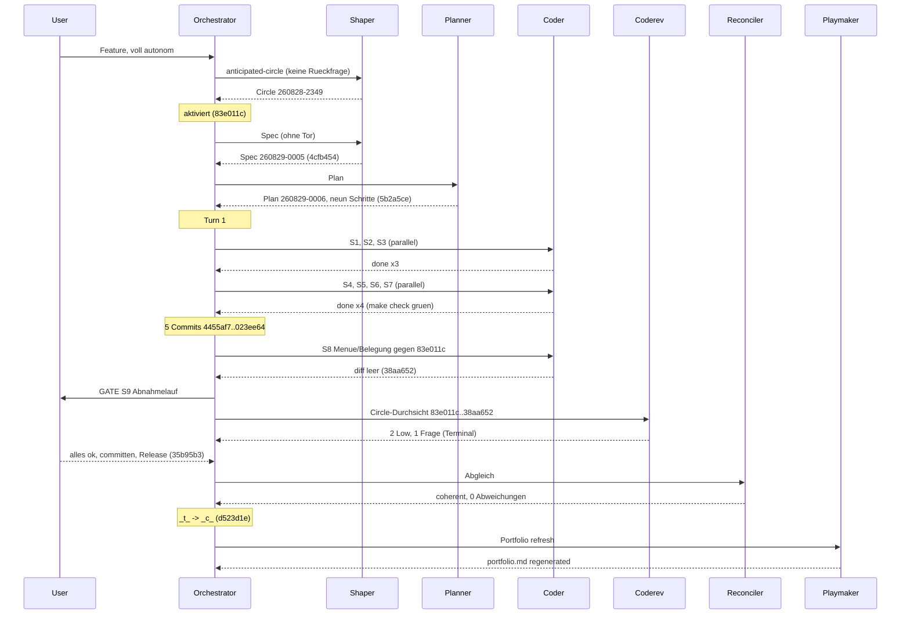

# Orchestrator Session — 260828-2351

**Directive:** die Runde 22 autonom fertigstellen — Circle `circles/260828-2349-cmd-c-und-cmd-x-legen-dateiverweise-ab`: Cmd+C und Cmd+X in der Dateiliste legen die betroffenen Dateien als Verweise auf die Zwischenablage, sodass andere Apps (Finder) sie einfügen können. Der Nutzer hat am 260828 verlangt, die Runde ohne Tore zu bauen; Spec- und Plan-Tor gelten als vorab freigegeben, der Abnahmelauf am Bündel bleibt bei ihm.
**Mode:** custom → Phase 0b (Shaping, Planung), autonom
**Status:** Complete — Runde 22 kohärent geschlossen (`_c_`), Auslieferung 1.3.0 im Anschluss
**Circle:** 260828-2349-cmd-c-und-cmd-x-legen-dateiverweise-ab (aktiviert 260828-2351, Claim auf Checkout 6c11b1f2)

## Snapshot bei Sitzungsbeginn

- HEAD: 701412c; Turn-Budget 12; Domain code (unveränderter Baum, 161/12 aus der Vorsitzung)
- Circles:    1 a   12 b    7 c    2 d    1 t 
- Vorgesehen daneben: 260828-1041-dateilistenfilter-nimmt-eingaben-per-paste (Runde 21, wartet)
- Offene Defekte: Circle 0, shared 201; Runde 20 hinterlässt 7 offene unter ihrem Circle
- Spec/Plan: keine — Phase 0b

## Budget

| Metric | Count |
|--------|-------|
| Turns | 1 (Phase 0b davor, ohne Tore) |
| Tasks resolved | 9 |
| Tasks skipped/deferred | 0 |
| Issues created (by reviewers) | 4 (`records anchor=4bd0084 start=260828-2351`: Planner 1, Orchestrator 1, Durchsicht 2) |
| Issues resolved | 0 |
| Decisions answered (`_o_`→`_a_`) | 1 (Terminal fügt den Namen ein; keine Codeänderung, bleibt `_a_`) |
| Decisions implemented (`_a_`→`_i_`) | 0 |
| Commits | 13 seit `4bd0084` (`git rev-list`), davon 2 die Nutzer-Auslieferung 1.2.2 (`701412c`, `9facb1e`) |
| Agent errors | 1 (Shaper-Dispatch an Verbindungsabbruch gescheitert, ohne Schreibung; wiederholt) |
| Human gates hit | 1 (S9 Abnahmelauf); Spec, Plan, Stop-Klauseln vom Nutzer vorab freigegeben |

## Per-Turn Log

### Turn 1
- Tasks attempted: S1, S2, S3 (parallel); S4, S5, S6, S7 (parallel); S8; S9
- Tasks completed: alle neun
- Commits: 4455af7, dfde98c, 3764fb6, 1644ada, 023ee64, 38aa652, 35b95b3
- Review findings: 2 Low; dazu 1 Frage (Terminal), vom Nutzer beantwortet
- Circuit breaker status: OK
- Coherence: ok

## Coherence
<!-- RECONCILER-OWNED -->

**Verdict:** coherent

**Edges:**
- Artifact↔Grounding: 9 claims verified / 0 drift items / 0 open coderev+ontorev issues — jeder Planschritt gegen `4455af7`…`35b95b3` gelesen (Belegtabelle im Reconciliation Log des Plans), `cargo test`/`clippy -D warnings`/`fmt --check` grün auf `35b95b3`; die vier offenen Defekte des Circles sind drei Low aus der Durchsicht und eine Spec-Prosa-Korrektur, keiner widerspricht einer Grounding-Festlegung; einzige Abweichung vom Planwortlaut (`public.url` statt allein `public.file-url`) ist eine Sortenangabe, die kein Code behauptet.
- Artifact↔Directive: commits move toward the stated Directive — `4455af7` (Texte, `Dateiablage`), `dfde98c` (zweiter Eingang der Regel), `3764fb6` (zweiter Ausgang der Hülle, Ablage an der Tabelle), `1644ada` (`copy:`/`cut:` beim Delegierten, Menüprosa, Zählprobe), `023ee64`/`38aa652`/`35b95b3` (Buchung, Belegung-und-Menü-Diff leer, Abnahme); `701412c`/`9facb1e` (Auslieferung 1.2.2) liegen vor dem ersten Codecommit und sind orthogonal, aber kein Teil der Runde; kein Commit der Runde außerhalb der Directive, kein `paste:`, kein neues `Kommando`.
- Grounding↔Directive: 1 active decision consistent (`decisions/260829-0053_a_…`, beantwortet: Terminal fügt den Namen ein, C2.1 hält) / 0 potentially conflicting; unter `shared/decisions/` (24 `_a_`/`_o_`) keine, die die Dateiablage, die Hülle oder `cmd+c`/`cmd+x` berührt — `260813-0053_o_…` und `260826-1221_o_…` meinen mit „Ablage" die Sitzungsablage bzw. das Konfliktblatt; der Entscheid vom 260811-1610 (Pfadkopierer legen allein Text) gilt fort und ist im Modulkopf der Hülle abgegrenzt; `circles/260828-1041-…/decisions/260828-1041_o_…` bleibt offen und ist laut Plan keine Vorbedingung.

**Rebalance recommendation:** none

## Review coverage

**Range:** `4bd0084..d523d1e` — 13 commits (plus der Haushalts-Commit nach diesem Bericht)
**Covered by:** `reviews/260829-0051-coderev-runde-22-dateiverweise-in-der-zwischenablage.md`, `**Reviewed-range:** 83e011c..38aa652`, covers=8, not-opened=none
**Not covered:** `d523d1e chore(workbench): die Runde 22 schliesst kohaerent`; `35b95b3 docs(workbench): der Abnahmelauf …`; `83e011c chore(workbench): die Runde 22 steht als Circle …` — alle drei reine Workbench-Commits; `701412c chore(release): die Version steht auf 1.2.2` und `9facb1e buchhaltung` — die Auslieferung 1.2.2 des Nutzers zwischen den Runden, nicht Gegenstand dieser Sitzung
**Carried out-of-scope files:** none

## Remaining Work

Unter `circles/260828-2349-cmd-c-und-cmd-x-legen-dateiverweise-ab/issues/`:
- `260829-0051_o_must-use-steht-an-den-neuen-ausgaengen-…` (Low, Coder)
- `260829-0052_o_die-abweisungsmeldung-nennt-die-eintraege-…` (Low, Coder)
- `260829-0041_o_die-probenablagen-der-huelle-teilen-sich-zwei-gleichzeitige-testlaeufe` (Low; nur bei parallelen `cargo test`-Prozessen)
- `260829-0006_o_drei-baumaussagen-des-specs-…` (Punkt 2 überholt, 1 und 3 offen; Spec-Prosa)
Für den Kurator (CLAUDE.md): die Hülle schreibt seit dieser Runde auch Dateiverweise; Rundentabelle endet bei 18; `copy:`/`cut:` als dritter Weg ohne Taste; `Wirkungsbereich` acht Werte (aus Runde 20).
Vorgesehen: `circles/260828-1041-dateilistenfilter-nimmt-eingaben-per-paste/` (Runde 21).

## Commits

| Hash | Message | Task |
|------|---------|------|
| 83e011c | chore(workbench): die Runde 22 steht als Circle und ist aktiviert | activation |
| 4cfb454 | docs(workbench): der Spec der Runde 22 ist geschaerft und vorab freigegeben | spec |
| 5b2a5ce | docs(workbench): der Plan der Runde 22 ist vorab freigegeben und steht auf _p_ | plan |
| 4455af7 | feat(kommandos): die Aufzaehlung Dateiablage und die Meldungen des Kopierens | S1 |
| dfde98c | feat(kommandos): die Zulaessigkeitsregel bekommt einen zweiten Eingang | S2 |
| 3764fb6 | feat(zwischenablage): die Huelle schreibt Dateiverweise, und die Tabelle legt sie ab | S3, S4 |
| 1644ada | feat(anwendung): cmd+c und cmd+x im Dateifenster legen die Dateien fuer andere Apps ab | S5–S7 |
| 023ee64 | docs(workbench): die Runde 22 traegt ihre sieben Schritte im Plan | S1–S7 |
| 38aa652 | docs(workbench): Menue und Belegung gegen den Stand vor der Runde gehalten | S8 |
| 35b95b3 | docs(workbench): der Abnahmelauf der Runde 22 ist gefahren | S9 |
| d523d1e | chore(workbench): die Runde 22 schliesst kohaerent | closure |

## Portfolio update

Playmaker-Lauf `shared/history/260829-0738-playmaker-orchestrator-phase4.md`; `portfolio.md` neu erzeugt: 1 vorgesehen, 0 aktiv, 8 kohärent, 12 beschränkt, 2 zurückgestellt; keine Bounded-Closure-Propagation. Empfehlung: Runde 21 (`260828-1041-dateilistenfilter-nimmt-eingaben-per-paste`) aktivieren — ihre Grundlage sagt noch „`copy:` bleibt unbeantwortet", was seit `1644ada` nicht mehr stimmt; der Spec liest sie nach. Zwei gebaute Backlog-Einträge warten zum fünften Mal auf die Schließung.

## Session Flow

