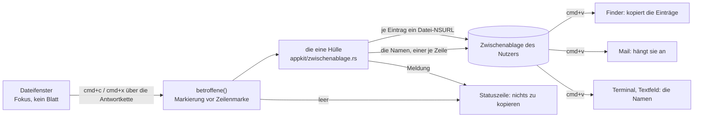

# Spec: Cmd+C und Cmd+X in der Dateiliste legen Dateiverweise für andere Anwendungen ab

**Date:** 2026-08-29
**Status:** freigegeben am 260829 (Spec-Tor vorab durch den Nutzer, autonome Runde), Planung läuft
**Activated from Circle:** 260828-2349-cmd-c-und-cmd-x-legen-dateiverweise-ab
**Source:** Die Directive des Circle-Datensatzes `_t_circle.md`, vom Shaper am 260828-2349 ohne Klärungsrunde aus dem Backlog-Eintrag `shared/backlog/260828-2345_*_cmd-c-und-cmd-x-kopieren-dateien-fuer-andere-apps.md` geformt, auf Weisung des Nutzers vom 260828 („autonom fertigstellen"). Die fünf Festlegungen des Grounding snapshot sind hier A1 bis A5; A6 bis A12 füllen die Lücken, die der Datensatz gelassen hat. Alle zwölf sind am Spec-Tor überstimmbar, und das Tor gilt nach derselben Weisung als vorab freigegeben.

---

## Directive

Nach dieser Runde legt `cmd+c` im Dateifenster die betroffenen Einträge, die Markierung oder sonst den Eintrag unter der Zeilenmarke, Dateien wie Ordner, als Dateiverweise in die Zwischenablage. Ein `cmd+v` im Finder oder in einer anderen Anwendung, die Dateien annimmt, kopiert diese Einträge dorthin; daneben stehen die bloßen Namen als Text, ein Name je Zeile, wie es der Finder beim Kopieren einer Datei tut. `cmd+x` legt dieselben Verweise ab und sagt in der Statuszeile, dass das Verschieben beim Ziel liegt. Beide Befehle sind die `copy:`- und `cut:`-Hälfte des Einhängepunkts, den Belegung und Menü „Bearbeiten" seit dem 260805 für die Dateizwischenablage freihalten; im Editor, in der Vorschau und in jedem Textfeld bleiben `cmd+c` und `cmd+x` die Textbefehle, die sie sind. Ein Einfügen von Dateien in KRK baut diese Runde nicht.

Diese Runde setzt keine elfte Zeitzusage und fasst keine der zehn aus C8 der Runde 1 an.

---

## Verhältnis zu den zehn Zeitzusagen aus C8 der Runde 1

**Kein Weg dieser Runde liegt auf einer gemessenen Strecke.** Die kopflose Messstrecke (`crates/krk-ui/src/messmodus.rs`) drückt weder `cmd+c` noch `cmd+x`; beide Kombinationen gehen seit dem 260805 ins Menü „Bearbeiten" und erreichen die Belegung nicht, über die die Strecke ihre Befehle absetzt. Keine der zehn Zahlen wird angefasst, und eine elfte entsteht nicht: der Abnahmelauf am Bündel ist Nutzerarbeit, und eine Zusage, die kein Agent messen kann, wäre ein Wunsch.

**Was die Runde dennoch über die Kosten weiß, steht als Auskunft und nicht als Zusage.** Die Leseseite derselben Hülle ist gemessen: `dateiverweise` baut je Eintrag ein `NSURL` über den Ablageserver und braucht dafür bei 1.000 Einträgen 155 ms und bei 5.000 Einträgen 585 ms (`zwischenablage.rs`, Doc-Kommentar von `dateiverweise`, Referenzgerät, 260819). Die Schreibseite über `writeObjects:` ist auf dem Referenzgerät ungemessen; sie läuft auf dem Hauptfaden und einmal je Tastendruck, nicht je Zeigerbewegung. Der Spec begrenzt die Zahl der Einträge nicht und verlangt keine Rückfrage, wie der Pfadkopierer `shift+cmd+c` es auch nicht tut; wer 5.000 markierte Einträge kopiert, wartet, bis die Ablage sie hat, und die Statuszeile nennt danach die Zahl. Ob und wann die Schreibseite gemessen wird, ist ein Gegenstand der späteren Messrunde und keine Zusage dieser.

---

## Festlegungen, am Spec-Tor überstimmbar

Der Circle-Datensatz trägt fünf Festlegungen, jede aus dem Baum abgeleitet. Der Spec übernimmt sie als A1 bis A5, jede am 260829 noch einmal gegen den Baum gelesen, und ergänzt A6 bis A12 für die Lücken, die der Datensatz dem Spec ausdrücklich überlassen hat (Wortlaut der Meldungen, Name in der Belegungsansicht) oder gar nicht benannt hat (Verknüpfungen, versteckte Einträge, die abweisende Ablage, das Kontextmenü, die zweite Zählprobe). Keine widerspricht der Directive; eine Klärungsrunde fällt deshalb nach der Weisung des Nutzers aus.

**A1 — `copy:` und `cut:` werden am Dateifenster über die Antwortkette beantwortet, und sonst ändert sich an Belegung und Menü nichts.** Kein neues `Kommando`, keine der drei Pflichtstellen aus CLAUDE.md („Etliche Fallunterscheidungen"), keine Zeile in `resources/default-keymap.toml`, kein zweiter Menüeintrag. Gegen den Baum gelesen: `text_kopieren` und `text_ausschneiden` stehen mit `gehalten_von = "menue"` in der Belegung (`default-keymap.toml:1035-1043`), der Kopf des Abschnitts C2 (`:988-997`) und der Modulkopf von `menue.rs` (`:105-116`) benennen genau diese Antwort als den Einhängepunkt, und `GEMESSEN` (`menue.rs:869-871`) hält fest, dass heute allein `NSText` `copy:` und `cut:` beantwortet. Wo die Antwort steht, an der Tabelle oder am Anwendungsdelegierten, ist Planerfrage. `paste:` wird nicht beantwortet; die Kombination gehört dem vorgesehenen Circle `260828-1041-dateilistenfilter-nimmt-eingaben-per-paste`, und sein offener Datensatz `circles/260828-1041-dateilistenfilter-nimmt-eingaben-per-paste/decisions/260828-1041_*_was-tut-cmd-v-mit-einem-dateiverweis-sobald-die-dateizwischenablage-gebaut-ist.md` bleibt offen: diese Runde liefert die Ablageseite, auf die er wartet, und beantwortet ihn nicht.

**A2 — Betroffen ist, was `betroffene()` sagt: die Markierung vor der Zeilenmarke, Ordner wie Dateien, in Sichtreihenfolge, ohne Typprüfung.** Gegen den Baum gelesen: `operationen::betroffene` (`crates/krk-ui/src/kommandos/operationen.rs:170`) zählt allein die sichtbaren Zeilen, und `Tabelle::betroffene_eintraege` (`tabelle.rs:1833`) ist ihre Ausleihe; der Pfadkopierer und der Öffner sind der fünfte und sechste Abnehmer, `cmd+c` und `cmd+x` werden der siebte und achte. Ein leerer Ordner, weder Markierung noch Zeilenmarke, lässt die Zwischenablage unverändert, und die Statuszeile sagt, dass nichts zu kopieren war, nach dem Muster von `eintragspfad_kopieren` (`tabelle.rs:1897-1909`, `operationen::nichts_zu_kopieren`). Die Markierung bleibt nach dem Kopieren stehen, wie sie ist.

**A3 — Abgelegt werden je Eintrag ein Datei-`NSURL` und daneben die Namen als Text, ein Name je Zeile, über die eine Hülle `appkit/zwischenablage.rs`.** Gegen den Baum gelesen: die Hülle schreibt heute allein `NSPasteboardTypeString` (`text_auf_ablage_schreiben`, `text_schreiben`), und ihr Modulkopf schließt Dateiverweis und `writeObjects:` beim Schreiben ausdrücklich aus; das Schreiben von Datei-`NSURL` über `writeObjects:` steht als `dateien_ablegen` im Prüfmodul derselben Datei und ist damit in Klasse, Methode und Form bekannt. Das Ablegen der Verweise wird ein weiterer Ausgang dieser Hülle, der Modulkopf wird nachgezogen und nicht umgangen. **Der Nutzerentscheid vom 260811-1610, nur Text abzulegen** (`circles/260811-1257-vier-tastenbefehle-pfade-kopieren-oeffnen/decisions/260811-1552_*_welche-sorten-legt-der-pfadkopierer-in-die-zwischenablage.md`), **gilt weiter:** er gilt den zwei Pfadkopierern, deren Name einen Pfad verspricht, und `shift+cmd+c` wie `opt+cmd+c` schreiben nach der Runde, was sie heute schreiben. Die Namenszeilen tragen den Namen und nicht den Pfad, weil der Pfad die Textsorte von `shift+cmd+c` ist und zwei Befehle mit derselben Textsorte einer zu viel wären. Zwei Folgen für KRK selbst sind benannt und angenommen: der Zwischenablagesprung `opt+cmd+g` nach einem `cmd+c` springt zum ersten der kopierten Einträge und wortlos nicht zu den übrigen, weil `lesen` den Verweis vor dem Text fragt, und das Einfügen in den Filter nach der Filterrunde filtert nach dem Namen des einen Eintrags und lehnt mehrere ab, wie es einen Finder-Verweis behandelt.

**A4 — `cmd+x` legt dieselben Verweise ab wie `cmd+c`, verschiebt nichts und sagt in der Statuszeile, dass das Verschieben beim Ziel liegt.** Es blendet keine Zeile ab. Gegen den Baum gelesen: `NSPasteboard` trägt keine öffentliche Sorte für „ausgeschnitten", der Finder verschiebt Kopiertes auf `opt+cmd+v`, und die Dateizelle trägt zwei Kennzeichen, Farbe und Schrift, deren dritter Zustand die Runde 11 ausgeschlossen hat (`tabelle.rs`, Doc-Kommentar der Zelle; `circles/260816-1321-inhaltsfilter-mit-ankreuzfeld-content/decisions/260816-1359_*_welche-aussage-schreibt-die-dateizelle-wenn-markierung-und-inhaltsdaempfung-zusammentreffen.md`). Was die Wahl kostet, steht dazu: „Ausschneiden" im Dateifenster ist nach dieser Runde ein Kopieren mit einem Satz, und der Nutzer bekommt das Verschieben vom Ziel, nicht von KRK. Wer die Lesart (a) des Datensatzes will, abgeblendete Zeilen bis zum nächsten Kopieren oder `Esc`, wählt sie am Spec-Tor und nimmt den dritten Zellenzustand in Kauf. `cut:` wird beantwortet und nicht grau gelassen, denn ein grauer Eintrag könnte den Satz nicht sagen.

**A5 — Die Zählprobe im Betrachter zieht nach und schreibt die Stellen aus.** `nspasteboard_steht_nicht_im_betrachter_und_copy_genau_einmal` (`crates/krk-ui/src/appkit/betrachter.rs:713-752`) verlangt heute, dass `#[unsafe(method(copy:))]` im ganzen Quellbaum genau einmal steht, im Betrachter. Der Satz, den sie hält, eine Hülle um `NSPasteboard`, bleibt wahr; die Zahl war die Lage am 260828. Nach der Runde nennt die Probe jede Stelle mit Dateinamen und Zahl, wie die Zählproben dieses Projekts es tun, und wird nicht umgangen. Ob die Antwort am Dateifenster über dieselbe Attributform läuft, entscheidet der Planner; die Probe ist beim Planen zu lesen, bevor sie rot wird.

**A6 — Der Wortlaut der vier Meldungen.** Die Statuszeile trägt den Rang `Befehlsantwort` (`appkit/statuszeile.rs`), und die vier Sätze stehen mit Umlauten (`shared/decisions/260826-1225_*_welche-schreibweise-gilt-fuer-nutzersichtbare-deutsche-meldungen-umlaut-oder-umschrift.md`, offen; der Baum schreibt seit dem 260826 Umlaute):
- nach `cmd+c`, ein Eintrag: `kopiert: <Name>`; mehrere: `<n> Einträge kopiert`.
- nach `cmd+x`, ein Eintrag: `kopiert: <Name> – verschieben tut das Ziel (Finder: opt+cmd+v)`; mehrere: `<n> Einträge kopiert – verschieben tut das Ziel (Finder: opt+cmd+v)`.
- leere Menge, beide Befehle: der Satz von `operationen::nichts_zu_kopieren` unverändert, `nichts zu kopieren: nichts markiert und nichts ausgewählt`.
- die Ablage nimmt die Verweise nicht an: `die Zwischenablage hat die Einträge nicht angenommen`, nach dem Muster von `ablage_weist_ab`.
Der genannte Name ist derselbe, der als Textzeile in der Ablage steht. Die Meldungen sind reine Funktionen in `kommandos/operationen.rs` und tragen Proben wie `kopiermeldung`.

**A7 — Eine Verknüpfung wird als Verknüpfung abgelegt, nicht als ihr Ziel.** Der Verzeichnisleser folgt Verknüpfungen nicht (`crates/krk-core/src/verzeichnis/eintrag.rs`, `Typ::Verknuepfung`), `betroffene()` liefert `ordner.join(name)`, und der Verweis nennt diese Stelle. Was der Finder beim Einfügen aus einer Verknüpfung macht, entscheidet der Finder; KRK löst sie nicht auf, auch nicht, wenn ihr Ziel fehlt. Der Grund steht unter `## Sicherheitsüberlegung`.

**A8 — Was nicht zu sehen ist, wird nicht kopiert.** Versteckte Einträge bei ausgeblendeten Versteckten und Einträge, die ein Filtertext ausblendet, sind nicht betroffen; die Regel ist die von `betroffene()` und wird nicht verdoppelt. Sind die Versteckten eingeblendet (`versteckte_umschalten`), sind sie Einträge wie jeder andere und werden mit der Markierung kopiert.

**A9 — Die Belegungsansicht und die Namen im Menü bleiben, wie sie sind.** „Kopieren" und „Ausschneiden" heißen im Menü „Bearbeiten" weiter so, und die Belegungsansicht zeigt für `text_kopieren` und `text_ausschneiden` weiter „gehalten von Menü"; `make tasten` und `make menue` geben vor und nach der Runde dieselben Zeilen aus. Ein Name wie „Dateien kopieren" wäre im Editor falsch, wo derselbe Eintrag Text kopiert; der Mac-übliche Name deckt beides.

**A10 — Das Kontextmenü der Dateiliste bekommt keinen fünften Eintrag.** `cmd+c` steht im Hauptmenü, und ein Eintrag im Kontextmenü wäre ein zweiter Weg zu derselben Antwort. `Kontextbefehl` (`kommandos/kontextmenue.rs`) bleibt bei drei Werten.

**A11 — Die Zulässigkeit der zwei Antworten folgt der Regel eines Kommandos mit Wirkungsbereich Dateifenster.** Kein stehendes Blatt, der Ersthelfer gehört nicht AppKit, der Fokus steht in einem Dateifenster, das Schlüsselfenster gehört KRK (`kommandos/zulaessigkeit.rs`, die vier Bestandteile). Die Ausgrauung des Menüeintrags läuft über `validateMenuItem:` (`anwendung.rs:895`) und bekommt keinen zweiten Zweig neben der Regel; wie die Antwortkette und `validateMenuItem:` dieselbe Regel für einen Selektor ohne `Kommando` befragen, ist Planerfrage. Der Fokusvorbehalt trennt die Bedeutungen ohne Zutun dieser Runde: mit der Schreibmarke im Editor, in der Vorschau, im Umbenennungsfeld oder in der Pfadeingabe gehört der Ersthelfer AppKit oder ist eine angemeldete Textfläche, und `copy:` landet beim Textsystem. Mit dem Fokus in der Lesezeichenleiste beantwortet niemand `copy:`, der Eintrag bleibt grau.

**A12 — Ein Schreiben in die Ablage trägt `#[must_use]`, und die Probe dazu geht über eine benannte Probenablage.** `text_auf_ablage_schreiben` trägt das Attribut, und der neue Ausgang tut es ebenso. `generalPasteboard` wird von keiner Probe beschrieben (Modulkopf der Hülle); die Probe legt die Verweise auf eine `pasteboardWithName:`-Ablage wie `probenablage` im Prüfmodul und liest beide Sorten zurück, die Verweise über `dateiverweise` und die Namen über `stringForType:`.

---

## Capabilities

### C1: `cmd+c` im Dateifenster legt die betroffenen Einträge als Dateiverweise ab

**Description:** Wer im Dateifenster einen Eintrag unter der Zeilenmarke hat oder mehrere markiert und `cmd+c` drückt oder „Bearbeiten › Kopieren" wählt, hat diese Einträge danach in der Zwischenablage, so dass der Finder, Mail und jede Anwendung, die Dateien annimmt, sie beim Einfügen entgegennimmt. KRK liest dafür keine Datei und hält keine offen; es legt Verweise ab.

**Acceptance criteria:**
- [ ] C1.1 Eine Datei unter der Zeilenmarke, keine Markierung, `cmd+c`, dann `cmd+v` im Finder in einem anderen Ordner: der Finder legt dort eine Kopie der Datei an, und die Quelle bleibt, wo sie war. Zu prüfen am Bündel.
- [ ] C1.2 Drei markierte Einträge, darunter ein Ordner, `cmd+c`, `cmd+v` im Finder: alle drei kommen an, der Ordner mit seinem Inhalt. Ein Ordner wird ohne Typprüfung wie eine Datei abgelegt (A2). Zu prüfen am Bündel.
- [ ] C1.3 Eine Markierung und daneben eine Zeilenmarke auf einem nicht markierten Eintrag: kopiert wird die Markierung und nicht der Eintrag unter der Zeilenmarke (Vorrang der Markierung, `betroffene()`). Probe ohne Fenster auf der Regel; die Ausleihe am Bündel.
- [ ] C1.4 Die Verweise stehen in der Sichtreihenfolge der Liste, gleich in welcher Reihenfolge der Nutzer markiert hat; die Probe liest sie über `dateiverweise` zurück und vergleicht die Reihenfolge.
- [ ] C1.5 `cmd+c` und „Bearbeiten › Kopieren" tun dasselbe: der Menüeintrag geht dieselbe Antwortkette hinunter wie der Tastendruck, und es gibt keinen zweiten Ausführungsweg.
- [ ] C1.6 Nach dem Kopieren steht die Markierung unverändert, die Zeilenmarke ebenso; nichts in der Liste ändert seine Anzeige (A4 für `cmd+x`, hier für `cmd+c`).
- [ ] C1.7 Ein leerer Ordner, `cmd+c`: die Zwischenablage trägt danach noch, was sie vorher trug, und die Statuszeile sagt `nichts zu kopieren: nichts markiert und nichts ausgewählt` (A6). Probe ohne Fenster auf der leeren `Auswahl`; am Bündel mit einem vorher kopierten Text, der nach dem Befehl noch einfügbar ist.
- [ ] C1.8 Nach einem geglückten Kopieren nennt die Statuszeile bei einem Eintrag den Namen und bei mehreren die Zahl (A6). Die Sätze sind reine Funktionen mit Probe.
- [ ] C1.9 Eine Verknüpfung unter der Zeilenmarke: der Verweis nennt die Verknüpfung, nicht ihr Ziel (A7). Probe ohne Fenster: eine Verknüpfung im Prüfordner, der zurückgelesene Pfad ist der der Verknüpfung.
- [ ] C1.10 Versteckte Einträge bei ausgeblendeten Versteckten und vom Filtertext ausgeblendete Einträge sind nicht in der Ablage, auch wenn sie vor dem Ausblenden markiert waren (A8). Probe ohne Fenster über `betroffene()` mit gesetztem Filtertext.
- [ ] C1.11 `resources/default-keymap.toml` trägt nach der Runde keine neue Zeile, `Kommando` keine neue Variante, und `make tasten` wie `make menue` geben dieselbe Ausgabe wie vor der Runde (A1, A9). Zu prüfen mit einem Diff der beiden Ausgaben gegen den Stand von `83e011c`.
- [ ] C1.12 Mit der Schreibmarke im Editor kopiert `cmd+c` den markierten Text; in der Vorschau den markierten Quelltext (Runde 14); im Betrachter den markierten Seitentext (Runde 20); im Umbenennungsfeld und in der Pfadeingabe den Feldtext. Nichts davon ändert sich. Zu prüfen am Bündel, je Fläche einmal.
- [ ] C1.13 Mit dem Fokus in der Lesezeichenleiste ist „Kopieren" im Menü grau und `cmd+c` wirkungslos, wie heute.
- [ ] C1.14 `cmd+v` im Dateifenster tut nach dieser Runde, was es vor ihr tat: „Einfügen" bleibt dort grau, und kein Einfügen von Dateien in KRK entsteht (A1).

### C2: Daneben die Namen als Text, ein Name je Zeile

**Description:** Wo kein Dateiverweis angenommen wird, in einem Terminal, einem Textfeld, einem Editor, ergibt das Einfügen die bloßen Namen der kopierten Einträge, einer je Zeile, wie nach dem Kopieren einer Datei im Finder. Der Pfad ist nicht dabei; den legt `shift+cmd+c`.

**Acceptance criteria:**
- [ ] C2.1 Ein Eintrag kopiert, `cmd+v` in einem Terminal: es erscheint der Name, ohne Ordner, ohne Trenner, ohne Zeilenumbruch am Ende. Zu prüfen am Bündel; die Form ohne Fenster als Probe der Zeilenfunktion.
- [ ] C2.2 Drei Einträge kopiert, `cmd+v` in ein Textfeld: drei Zeilen in Sichtreihenfolge, durch `\n` getrennt, ohne Schlusszeilenumbruch, wie `pfadzeilen` es für Pfade hält.
- [ ] C2.3 Ein Ordner kopiert: die Zeile trägt seinen Namen ohne abschließenden Trenner.
- [ ] C2.4 `shift+cmd+c` legt nach der Runde, was es heute legt: den vollen Pfad als einzige Sorte, keinen Verweis. `opt+cmd+c` ebenso für den angezeigten Ordner. Der Entscheid vom 260811-1610 ist unberührt (A3).
- [ ] C2.5 Ein Eintrag kopiert, dann `opt+cmd+g` (Zum Inhalt der Zwischenablage springen): KRK springt zu genau diesem Eintrag. Bei mehreren kopierten Einträgen springt es zum ersten in Sichtreihenfolge und sagt nichts über die übrigen (A3, angenommene Folge).
- [ ] C2.6 Ein Eintrag kopiert, dann `shift+f3` (Vorschau der Zwischenablage): die Vorschau zeigt, was sie nach dem Kopieren derselben Datei im Finder zeigt; diese Runde ändert `inhalt_lesen` nicht.
- [ ] C2.7 Die Probe legt über den neuen Ausgang der Hülle zwei Pfade auf eine benannte Probenablage und liest beide Sorten zurück: `dateiverweise` liefert die zwei Pfade, `stringForType:` mit `NSPasteboardTypeString` die zwei Namen als Zeilen (A12).

### C3: `cmd+x` legt dieselben Verweise ab und überlässt das Verschieben dem Ziel

**Description:** `cmd+x` und „Bearbeiten › Ausschneiden" legen im Dateifenster dasselbe ab wie `cmd+c` und sagen in der Statuszeile, dass das Verschieben beim Ziel liegt. KRK verschiebt, löscht und blendet nichts ab; der Finder verschiebt die Einträge auf `opt+cmd+v`, und was eine andere Anwendung tut, ist ihre Sache.

**Acceptance criteria:**
- [ ] C3.1 Ein Eintrag unter der Zeilenmarke, `cmd+x`: die Ablage trägt danach denselben Verweis und dieselbe Namenszeile wie nach `cmd+c`; die Probe vergleicht beide Ergebnisse auf Gleichheit.
- [ ] C3.2 Die Statuszeile sagt nach `cmd+x` `kopiert: <Name> – verschieben tut das Ziel (Finder: opt+cmd+v)`, bei mehreren mit der Zahl (A6). Der Satz ist eine reine Funktion mit Probe.
- [ ] C3.3 Nach `cmd+x` steht die Quelle unverändert im Dateifenster: keine Zeile ist abgeblendet, keine gelöscht, keine in den Papierkorb geräumt, und die Markierung steht, wie sie stand (A4). Zu prüfen am Bündel und ohne Fenster daran, dass kein Vorgang der Art `Verschieben` oder `InPapierkorb` angelegt wird.
- [ ] C3.4 `cmd+x` in KRK, dann `opt+cmd+v` im Finder in einem anderen Ordner: der Finder verschiebt den Eintrag, und KRKs Dateifenster zeigt den Ordner ohne ihn, sobald die Auffrischung nach einer fremden Änderung greift, wie nach jedem Verschieben im Finder. Zu prüfen am Bündel.
- [ ] C3.5 `cmd+x` in KRK, dann `cmd+v` im Finder: der Finder kopiert, die Quelle bleibt. KRK hat nichts anderes versprochen (A4). Zu prüfen am Bündel.
- [ ] C3.6 Ein leerer Ordner, `cmd+x`: die Zwischenablage bleibt unverändert, die Statuszeile sagt den Satz aus C1.7.
- [ ] C3.7 Mit der Schreibmarke im Editor oder in einem Textfeld schneidet `cmd+x` den markierten Text aus, wie heute; in der Vorschau und im Betrachter, deren Text nicht bearbeitbar ist, tut es, was es heute tut. Nichts davon ändert sich. Zu prüfen am Bündel.
- [ ] C3.8 „Ausschneiden" im Menü ist mit dem Fokus im Dateifenster freigegeben und nicht grau (A4, `cut:` wird beantwortet).

### C4: Zulässigkeit und Ausgrauung folgen der einen Regel

**Description:** Ob `cmd+c` und `cmd+x` im Dateifenster gerade wirken dürfen, beantwortet dieselbe Regel wie für jedes Kommando mit Wirkungsbereich Dateifenster, und der Menüeintrag ist genau dann grau, wenn der Tastendruck abgewiesen würde.

**Acceptance criteria:**
- [ ] C4.1 Mit dem Fokus im Dateifenster und ohne Blatt sind „Kopieren" und „Ausschneiden" im Menü „Bearbeiten" freigegeben; „Einfügen" bleibt grau (A1, A11).
- [ ] C4.2 Solange ein Blatt steht (Rückfrage, Konfliktblatt, Notizzettel, Stapelumbenennen), wirkt `cmd+c` im Dateifenster nicht, und der Menüeintrag ist grau; die Ausnahmeliste `immer_erreichbar` wächst nicht, und die Probe `waehrend_eines_blattes_kommen_genau_diese_vier_durch` bleibt bei vier.
- [ ] C4.3 Während des Umbenennens in der Liste kopiert `cmd+c` den Feldtext und nicht den Eintrag: der Feldeditor gehört AppKit, Bestandteil (2) der Regel weist die Dateiantwort ab. Zu prüfen am Bündel.
- [ ] C4.4 Steht der Über-Dialog oder ein fremdes Fenster vorn, wirkt der Befehl nicht (Bestandteil (4)).
- [ ] C4.5 `validateMenuItem:` bekommt für `copy:` und `cut:` keinen zweiten Zweig neben der Regel; Ereignisabgriff und Menü fragen dieselbe Funktion auf derselben `Lage` (Modulkopf von `zulaessigkeit.rs`). Ohne Fenster prüfbar, soweit die Regel in `kommandos/` steht; der Rest am Bündel über C4.1 bis C4.3.

### C5: Die eine Hülle, ihr Modulkopf und die zwei Zählproben

**Description:** Das Ablegen der Verweise ist ein weiterer Ausgang von `appkit/zwischenablage.rs` und keine zweite Hülle. Der Modulkopf sagt danach, was die Datei schreibt, und die zwei Proben, die die Lage zählen, zählen die neue Lage.

**Acceptance criteria:**
- [ ] C5.1 Keine Datei außer `appkit/zwischenablage.rs` liest oder schreibt eine Ablage. `abwurf.rs::sorten` nennt weiter die Sortenkonstante für die Anmeldung des Abwurfs, und `vorschau.rs::auswahl_ablegen` reicht die hereingereichte Ablage weiter an die Hülle; beide bleiben, wie sie sind, und keine dritte Stelle kommt dazu. Nachgezählt am 260829: `grep -rn NSPasteboard crates/krk-ui/src` trifft außerhalb der Hülle allein diese zwei Dateien und den Betrachter, dort im Kommentar.
- [ ] C5.2 Der Modulkopf von `zwischenablage.rs` sagt nicht mehr „Geschrieben wird eine einzige Sorte" und „kein `writeObjects:`", sondern nennt den zweiten Ausgang, seine zwei Sorten und den Grund, aus dem der Entscheid vom 260811 für die Pfadkopierer weitergilt (A3). Das Diagramm im Kopf trägt den neuen Pfeil.
- [ ] C5.3 Der neue Ausgang trägt `#[must_use]`, und sein Rufer wertet den Wahrheitswert aus: `false` führt zur Meldung aus A6 (A12). `cargo clippy --workspace --all-targets` unter `-D warnings` bleibt grün.
- [ ] C5.4 `nspasteboard_steht_nicht_im_betrachter_und_copy_genau_einmal` (`betrachter.rs`) ist auf die neue Lage nachgezogen und nennt jede Stelle von `#[unsafe(method(copy:))]` mit Dateinamen und Zahl; ihr Name sagt nach der Runde, was sie hält (A5). Wird die Antwort ohne diese Attributform gebaut, bleibt die Probe unverändert grün und der Plan sagt, warum.
- [ ] C5.5 Der Untergrenzen-Abschnitt von `zwischenablage.rs` nennt jede neu angesprochene Methode mit ihrem macOS; `writeObjects:` und `fileURLWithPath:` stehen darin schon. Wird die Antwort in einer Datei gebaut, deren Untergrenzen-Abschnitt sie nicht deckt, zieht der Abschnitt nach.
- [ ] C5.6 `Cargo.lock` führt nach der Runde kein `cc` und außer `windows-sys` kein `-sys`-Paket; die Runde bringt keine neue Kiste.

---

## Sicherheitsüberlegung

**Die Zwischenablage ist öffentlich, und KRK legt Namen hinein, keine Inhalte.** Jede Anwendung, die läuft, kann `generalPasteboard` lesen, und über die Handoff-Zwischenablage kann ihr Inhalt auf ein anderes Gerät desselben Nutzers wandern. Ein Datei-`NSURL` ist dort wertlos, er nennt eine Stelle auf dieser Platte; die Namenszeilen dagegen wandern als Text. Wer den Namen einer Datei als vertraulich behandelt, kopiert sie nicht. Das ist dieselbe Lage wie beim Finder und beim Pfadkopierer seit der Runde 4, der schon heute den vollen Pfad ablegt; die Runde macht sie nicht schlechter.

**Versteckte Einträge.** Ein Eintrag, den der Nutzer nicht sieht, gehört nicht in die Ablage (A8): eine Markierung, die vor dem Ausblenden gesetzt war, kopiert nach dem Ausblenden nicht mit. Ein eingeblendeter versteckter Eintrag ist eine bewusste Anzeige, und ihn zu kopieren ist eine bewusste Handlung. Ein Ordner, der versteckte Einträge enthält, wird als Ganzes abgelegt; was der Finder beim Einfügen davon mitnimmt, entscheidet der Finder, wie beim Kopieren im Finder selbst.

**Verknüpfungen.** Der Verweis nennt die Verknüpfung und nicht ihr Ziel (A7). Löste KRK sie auf, kopierte ein `cmd+c` auf einer harmlos benannten Verknüpfung unbemerkt eine Datei von anderswo, etwa aus einem fremden Benutzerverzeichnis oder von einem Netzlaufwerk, und der Nutzer sähe es erst am Ziel. Der Verzeichnisleser folgt Verknüpfungen aus demselben Grund nicht. Eine Verknüpfung, deren Ziel fehlt, wird ebenso abgelegt; KRK prüft beim Kopieren kein Ziel, und was das Einfügen daraus macht, meldet die Anwendung, die einfügt.

**Einträge, die zwischen Kopieren und Einfügen verschwinden.** KRK legt Verweise ab und keine Zusagen: es hält keine Datei offen, es verspricht keinen Inhalt (`NSFilePromise` wird nicht benutzt), und es merkt sich nicht, was es abgelegt hat. Wird ein Eintrag nach dem Kopieren umbenannt, verschoben oder gelöscht, zeigt der Verweis ins Leere, und das Einfügen scheitert dort, wo es versucht wird, mit der Meldung jener Anwendung. Das ist die Lage des Finders auch, und KRK kann sie nicht verbessern, ohne Dateien zu halten, die der Nutzer gerade freigeben will. Umgekehrt gilt: was KRK abgelegt hat, überlebt das Beenden von KRK, weil die Ablage beim Ablageserver liegt und nicht im Prozess.

**Was KRK nie tut.** Es löscht nach `cmd+x` nichts, es schreibt keine Sorte, die ein Ziel als „verschieben" deuten könnte, und es legt keinen Inhalt in die Ablage, der beim Lesen Code ausführte: zwei Sorten, `public.file-url` und `public.utf8-plain-text`, und sonst keine.

---

## Constraints

Sieben Bedingungen binden jede Umsetzung dieses Specs.

1. **Eine Hülle um `NSPasteboard`.** `appkit/zwischenablage.rs` bleibt die einzige Datei, die eine Ablage liest oder schreibt; das Ablegen der Verweise ist ein Ausgang dieser Datei, und ihr Modulkopf wird nachgezogen (C5.1, C5.2). Constraint 3 der Runde 20 gilt fort, und die Probe, die ihn hält, zieht nach statt umgangen zu werden (A5).

2. **`#[must_use]` an jedem Schreiben, dessen stilles Fallenlassen unbemerkt bliebe.** Der neue Ausgang trägt es wie `text_auf_ablage_schreiben`; `let _ =` davor heißt „ich brauche den Wert nicht" und kommt am Rufer der Antwort nicht vor (C5.3).

3. **Vollständigkeit ohne Auffangzweig.** Die Runde legt kein `Kommando`, keinen `Kontextbefehl` und keine Vorgangsart an, und sie fügt keiner vollständigen Fallunterscheidung einen Auffangzweig hinzu. Wo sie über einen Selektor verzweigt, verzweigt sie vollständig; `paste:` bekommt dabei keinen Zweig, auch keinen leeren (A1).

4. **Der Untergrenzen-Abschnitt.** Jede Datei unter `crates/krk-ui/src/appkit/`, die diese Runde anfasst, trägt danach in `# Ab welchem macOS die angesprochenen Klassen stehen` jede neu angesprochene Klasse und Methode; keine liegt über macOS 15 (C5.5).

5. **`paste:` bleibt beim Circle `260828-1041`.** Diese Runde beantwortet `paste:` am Dateifenster nicht, ändert die Bedeutung von `cmd+v` nicht und beantwortet den offenen Datensatz jenes Circles nicht (A1, C1.14).

6. **KRK verschiebt nichts.** Kein Weg dieser Runde legt einen Vorgang der Art `Verschieben` oder `InPapierkorb` an, und keine Zeile wird als „ausgeschnitten" gekennzeichnet (A4, C3.3). Der Löschweg bleibt der eine der Runde 12, mit Rückfrage und Papierkorb.

7. **Belegung, Menü und Kontextmenü bleiben, wie sie sind.** Keine Zeile in `resources/default-keymap.toml`, kein zweiter Menüeintrag, kein fünfter Kontextmenüeintrag, keine neue Variante von `Kommando` (A1, A9, A10, C1.11).

---

## Out of Scope

**Ein Einfügen von Dateien in KRK, in welcher Form auch immer.** `paste:` gehört dem Circle `260828-1041-dateilistenfilter-nimmt-eingaben-per-paste`; die Frage, was `cmd+v` mit einem Dateiverweis tut, bleibt in dessen Datensatz offen.

**Ein Verschieben durch KRK nach `cmd+x`, ein Abblenden der Zeilen, ein dritter Zellenzustand.** Festlegung A4; wer die Lesart (a) will, wählt sie am Spec-Tor.

**Ein Ziehen aus KRK heraus in fremde Anwendungen.** Die Runde 13 hat den Abwurf in KRK gebaut; die Gegenrichtung, `NSDraggingSource` am Dateifenster, ist eine eigene Runde und läuft nicht über die Zwischenablage des Nutzers.

**Dateizusagen (`NSFilePromiseProvider`).** KRK legt Verweise auf Dateien ab, die es gibt, und verspricht keine, die es erst erzeugte.

**Eine Änderung der zwei Pfadkopierer.** `shift+cmd+c` und `opt+cmd+c` schreiben nach dem Entscheid vom 260811-1610 weiter nur Text (A3, C2.4).

**Ein Kontextmenüeintrag „Kopieren".** Festlegung A10.

**Ein neuer Name für „Kopieren" und „Ausschneiden" in Menü und Belegungsansicht.** Festlegung A9.

**Das Auflösen von Verknüpfungen beim Kopieren.** Festlegung A7 und die Sicherheitsüberlegung.

**Eine Obergrenze oder eine Rückfrage bei vielen Einträgen.** Wie beim Pfadkopierer; die Kosten stehen als Auskunft unter den Zeitzusagen.

**Eine elfte Zeitzusage und eine Messung der Schreibseite.** Der Abschnitt `## Verhältnis zu den zehn Zeitzusagen aus C8 der Runde 1`.

**Die Behebung der offenen Defekte an Menü und Ausgrauung** (`circles/260813-0100-suche-in-der-belegung-vollstaendiges-menue-weitere-instanz/issues/260813-0420_o_das-menue-bearbeiten-verliert-seine-mac-uebliche-reihenfolge-und-seinen-trenner.md`, `…/260813-0416_o_zwei-menueeintraege-mit-cmd-a-…`). Sie stehen offen und werden hier nicht schlechter.

---

## Open for Planner

Technische Entscheidungen, die der Planner beim Bau trifft:

- **Wo `copy:` und `cut:` beantwortet werden**: an der Tabellenklasse des Dateifensters, die Ersthelfer ist, oder am Anwendungsdelegierten am Ende der Kette, der den Fokus schon kennt. Die Wahl entscheidet, ob die Zählprobe aus A5 eine zweite Datei nennt (C5.4) und wie `validateMenuItem:` die Regel für einen Selektor ohne `Kommando` befragt (A11, C4.5).
- **Wie die Zulässigkeitsregel für einen Selektor ohne `Kommando` gestellt wird.** `zulaessig()` nimmt heute ein `Kommando`; ob die zwei Antworten den Wirkungsbereich `Dateifenster` direkt einsetzen oder die Regel eine zweite Eingangsform bekommt, entscheidet der Plan, und eine zweite Regel daneben ist ausgeschlossen (C4.5).
- **Wie die zwei Sorten in einem Ablegen zusammenkommen.** `writeObjects:` mit je Eintrag einem `NSURL` legt mehrere Ablageeinträge an; ob die Namenszeilen als eigener Schreiber im selben Aufruf, als zweite Sorte am ersten Eintrag oder über `setString:forType:` danach hinzukommen, entscheidet der Plan, und der Spec verlangt allein das Ergebnis aus C2.7 und C1.4. Ein `NSURL` schreibt von sich aus weitere Sorten; welche, und ob sie mit den Namenszeilen kollidieren, ist am Bündel zu messen und in der Probe zu halten.
- **Die Signatur des neuen Ausgangs** (Pfade und Namen getrennt oder aus den Pfaden abgeleitet) und ob die Namenszeilen eine Schwester von `pfadzeilen` in `kommandos/operationen.rs` werden. Der Spec verlangt eine reine Funktion mit Probe für die Zeilen und für jede Meldung (A6).
- **Ob die Probe aus A5 auch `cut:` zählt.** Sie zählt heute `copy:`; eine Stelle von `cut:` neben der von `copy:` ist nach dieser Runde die erwartete Lage, und ob die Probe beide hält oder eine zweite es tut, entscheidet der Plan.
- **Wie die Statuszeilenmeldung an die Antwort kommt**, wenn die Antwort nicht an der Tabelle steht: `befehlsantwort_zeigen` (`tabelle.rs:3306`) ist die eine Stelle, die den Rang `Befehlsantwort` schreibt.
- **Wie der Plan den siebten und achten Abnehmer von `betroffene()` bucht.** Der Doc-Kommentar der Funktion nennt keine Zahl; die Specs der Runden 4 und 17 zählen bis sechs, und der Plan trägt einen Schritt, der die Zählung dort nachzieht, wo eine steht.

---

## User Decisions Pending

- [ ] Die zwölf Festlegungen A1 bis A12. Sie sind am Spec-Tor überstimmbar; nach der Weisung vom 260828 gilt das Tor als vorab freigegeben, und sie gelten mit diesem Spec. Die eine, an der zwei Lesarten auseinanderlaufen, ist A4 (`cmd+x` ohne Abblenden).
- [ ] Was `cmd+v` mit einem Dateiverweis tut, sobald diese Runde gebaut ist (`circles/260828-1041-dateilistenfilter-nimmt-eingaben-per-paste/decisions/260828-1041_*_was-tut-cmd-v-mit-einem-dateiverweis-sobald-die-dateizwischenablage-gebaut-ist.md`, offen). Diese Runde beantwortet ihn nicht; sie ist die Ablageseite, auf die er wartet.
- [ ] Die Schreibweise nutzersichtbarer Meldungen (`shared/decisions/260826-1225_*_welche-schreibweise-gilt-fuer-nutzersichtbare-deutsche-meldungen-umlaut-oder-umschrift.md`, offen). A6 schreibt Umlaute, wie der Baum seit dem 260826.

---

## Zur Zählung der Abnahmekriterien

Der Spec führt **40** Abnahmekriterien, und keines ist abgehakt. Je Fähigkeit nachgezählt am 260829-0005: C1 vierzehn, C2 sieben, C3 acht, C4 fünf, C5 sechs. Der Abschnitt zu den Zeitzusagen trägt in dieser Runde kein Kriterium.

**Die Datei trägt 43 Kästchen und nicht 40.** Die drei übrigen stehen unter `## User Decisions Pending` und sind offene Nutzerfragen, keine Abnahmekriterien.

**Der Abnahmelauf am Bündel ist Nutzerarbeit**, wie in jeder Runde dieses Projekts: Einfügen im Finder, in Mail und in einem Terminal verlangt KRK im Vordergrund und eine fremde Anwendung daneben. Ohne Fenster prüfbar sind C1.3, C1.4, C1.7, C1.8, C1.9, C1.10, C1.11, C2.2, C2.3, C2.7, C3.1, C3.2, C3.6, C4.2, C4.5, C5.1, C5.3, C5.4, C5.6. Die Runde schließt voraussichtlich als beschränkter Abschluss.
