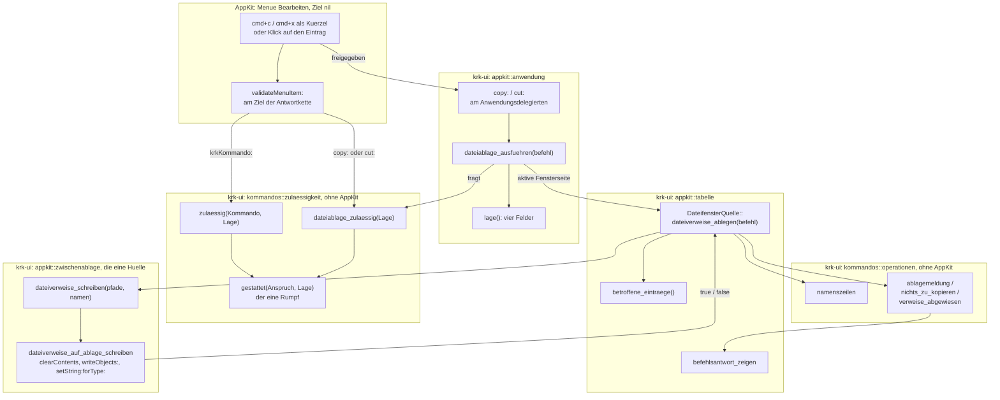
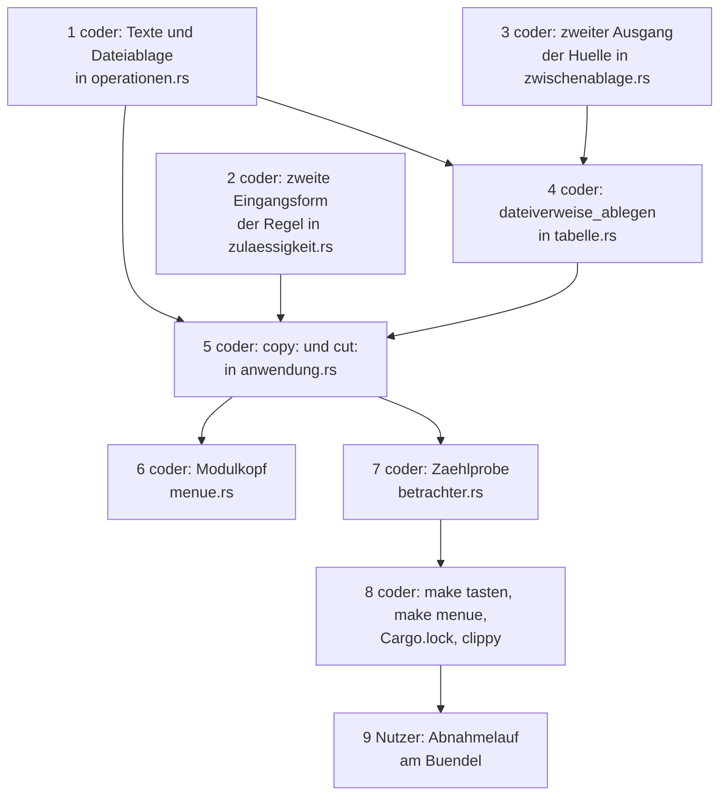

# Implementierungsplan: Cmd+C und Cmd+X in der Dateiliste legen Dateiverweise für andere Anwendungen ab

**Date:** 2026-08-29
**Status:** Ready for Review
**Spec:** `circles/260828-2349-cmd-c-und-cmd-x-legen-dateiverweise-ab/planning/260829-0005_*_spec-cmd-c-und-cmd-x-legen-dateiverweise-ab.md`, nach der Weisung des Nutzers vom 260828 vorab freigegeben, A1 bis A12 ohne Einspruch
**Decidability:** Die tragende Frage lautet: *Darf `copy:` oder `cut:` in diesem Augenblick als Dateibefehl wirken, welche Einträge sind gemeint, und hat die Ablage sie angenommen?* Alle drei Teile sind aus den Eingaben entscheidbar, die der Mechanismus hat. Ob der Befehl wirken darf, beantwortet die eine Zulässigkeitsregel aus den vier Feldern der `Lage`, die der Anwendungsdelegierte ohnehin erhebt (`crates/krk-ui/src/kommandos/zulaessigkeit.rs:131-177`); welche Einträge gemeint sind, sagt `operationen::betroffene` aus dem Ordnermodell des sichtbaren Tabs (`crates/krk-ui/src/kommandos/operationen.rs:170`); ob die Ablage die Verweise angenommen hat, sagt der Wahrheitswert von `writeObjects:` und `setString:forType:`. **Nicht entscheidbar ist, was das Ziel nach `cmd+x` tut**, denn `NSPasteboard` trägt keine Sorte, die „ausgeschnitten" bedeutet, und KRK erfährt nie, ob eine fremde Anwendung nach dem Einfügen die Quelle entfernt. Der Spec hat den Mechanismus dafür schon gewechselt (A4): KRK verspricht kein Verschieben, blendet nichts ab und sagt in der Statuszeile, dass das Verschieben beim Ziel liegt. Der Plan nähert an dieser Stelle nichts an.

---

## Directive

Nach dieser Runde legt `cmd+c` im Dateifenster die betroffenen Einträge als Dateiverweise in die Zwischenablage, daneben ihre Namen als Text, einer je Zeile; `cmd+x` legt dasselbe ab und sagt in der Statuszeile, dass das Verschieben beim Ziel liegt. Beide sind die `copy:`- und `cut:`-Hälfte des Einhängepunkts, den Belegung und Menü „Bearbeiten" seit dem 260805 freihalten. Der Spec schreibt fünf Fähigkeiten mit 40 Abnahmekriterien aus; dieser Plan wiederholt sie nicht, sondern ordnet jedem Kriterium eine Stelle im Baum oder im Abnahmelauf zu.

Keine der zehn Zeitzusagen aus C8 der Runde 1 ist berührt, und eine elfte entsteht nicht; der Spec begründet es unter `## Verhältnis zu den zehn Zeitzusagen aus C8 der Runde 1`.

---

## Current State

**Der Einhängepunkt ist reserviert, und niemand beantwortet ihn.** `cut:`, `copy:` und `paste:` gehen als Menüeinträge mit Ziel `nil` die Antwortkette hinunter (`crates/krk-ui/src/appkit/menue.rs:18-30`, `:105-116`); `Kommando` trägt keine Variante dafür, `resources/default-keymap.toml:1035-1049` führt die drei mit `gehalten_von = "menue"`, und die Tafel `GEMESSEN` (`menue.rs:869-871`) hält fest, dass am 260811 allein `NSText` die drei beantwortet hat. Mit dem Fokus im Dateifenster endet die Kette beim Anwendungsdelegierten, und der beantwortet keinen der drei; die Einträge sind dort grau.

**Die Zulässigkeit hat eine Regel, und die nimmt ein `Kommando`.** `zulaessigkeit::zulaessig(kommando, lage)` (`zulaessigkeit.rs:177-186`) setzt vier Bestandteile zusammen und fragt das Kommando nach drei Dingen: seinem Wirkungsbereich, ob es während eines Blattes erlaubt ist (`operationen::waehrend_blatt_erlaubt`), und ob es auf der Ausnahmeliste `immer_erreichbar` steht (`:202-207`). Zwei Frager rufen sie, `Anwendungsdelegierter::kommando_ausfuehren` (`crates/krk-ui/src/appkit/anwendung.rs:3145-3164`) und `validateMenuItem:` (`:896-911`); die Probe `beide_frager_rufen_die_eine_regel` (`zulaessigkeit.rs:270-284`) zählt genau diese zwei über `quellbaum::aufrufstellen`, das einen Namen nur dann als Aufruf zählt, wenn kein Namenszeichen davorsteht (`crates/krk-ui/src/quellbaum.rs:133-151`). `validateMenuItem:` antwortet heute für jede Aktion außer `krkKommando:` mit `true` und überlässt AppKit die Entscheidung.

**Die Hülle um `NSPasteboard` schreibt eine Sorte und liest zwei.** `text_auf_ablage_schreiben` (`crates/krk-ui/src/appkit/zwischenablage.rs:259-262`) leert und schreibt `NSPasteboardTypeString`; `text_schreiben` (`:270-272`) reicht ihr `generalPasteboard` hinein. `dateiverweise` (`:321-346`) liest je Eintrag ein `NSURL` über `readObjectsForClasses:options:`. Das Schreiben von Datei-`NSURL` über `writeObjects:` steht im Prüfmodul als `dateien_ablegen` (`:381-393`), und `probenablage` (`:372-378`) ist die benannte Ablage, die keine Probe an `generalPasteboard` heranlässt. Der Modulkopf sagt an `:73-74` „Geschrieben wird eine einzige Sorte" und „Kein Dateiverweis und kein `writeObjects:`". Die Zählprobe `die_huelle_um_die_zwischenablage_steht_in_genau_einer_datei` (`:482-519`) hält zwei Nadeln, `setString_forType` und `generalPasteboard`, auf diese eine Datei.

**Die Pfadkopierer sind das Vorbild für Meldung und leere Menge.** `eintragspfad_kopieren` (`crates/krk-ui/src/appkit/tabelle.rs:1897-1909`) fragt `betroffene_eintraege` (`:1833-1837`), meldet bei leerer Menge `operationen::nichts_zu_kopieren` (`operationen.rs:970`), schreibt `pfadzeilen` (`:942`) und meldet `kopiermeldung` (`:958`) oder `ablage_weist_ab` (`:1111`), alles über `befehlsantwort_zeigen` (`tabelle.rs:3306`). `eintragsname` (`operationen.rs:1124-1129`) ist privat und liefert den Namen eines Pfades, ersatzweise den Pfad.

**Die Zählprobe im Betrachter zählt `copy:` im ganzen Baum.** `nspasteboard_steht_nicht_im_betrachter_und_copy_genau_einmal` (`crates/krk-ui/src/appkit/betrachter.rs:713-752`) verlangt, dass `#[unsafe(method(copy:))]` als Codezeile in genau einer Datei steht, `betrachter.rs`, und dort genau einmal (`:359`). `quelldateien` liefert die Dateien sortiert nach ihrem Pfad unter `crates/` (`quellbaum.rs:95-107`).

**Der Fokusvorbehalt trennt die Bedeutungen ohne Zutun dieser Runde.** Steht die Schreibmarke in einer `NSTextView` oder im Feldeditor eines Textfeldes, findet die Antwortkette `copy:` an dieser Fläche, bevor sie den Delegierten erreicht; `validateMenuItem:` wird dann an jener Fläche gestellt und nicht am Delegierten. Der Delegierte wird nur gefragt, wenn kein Glied vor ihm antwortet, also mit dem Fokus in einer Dateiliste, in der Lesezeichenleiste, auf dem Fenster selbst oder von einem Blatt aus.

---

## Approach

Der Plan setzt an vier Nähten an, die es gibt, und legt keine neue: die Antwort steht beim Anwendungsdelegierten, die Zulässigkeit in der einen Regel, das Schreiben in der einen Hülle, die Texte bei den Pfadkopierern.

**Erstens beantwortet der Anwendungsdelegierte `copy:` und `cut:`, und nicht die Tabelle.** Die Tabelle ist eine nackte `NSTableView` ohne Unterklasse (`grep -rn 'super = NSTableView' crates/krk-ui/src/appkit/` liefert nichts; die Klasse in `tabelle.rs:1101-1111` ist die Datenquelle, ein `NSObject`), und eine Unterklasse allein für zwei Selektoren wäre eine zweite Stelle, die `validateMenuItem:` beantwortet, also ein dritter Frager der Regel und ein zweiter Ort für ihre Antwort. Der Delegierte hält die `Lage` schon (`lage`, `anwendung.rs:3093-3104`), kennt die aktive Fensterseite (`bereichskommando`, `:3466-3527`) und ist die Stelle, an der `validateMenuItem:` heute steht. Beide Selektoren gehen durch **eine** Funktion `dateiablage_ausfuehren(befehl)`, die nach der Regel fragt und dann an die Datenquelle der aktiven Fensterseite weiterreicht; sie spiegelt `kommando_ausfuehren` für einen Befehl ohne `Kommando`.

**Zweitens bekommt die Zulässigkeitsregel eine zweite Eingangsform und keinen zweiten Rumpf.** Was die Regel vom Kommando wissen will, sind drei Antworten; die Aufzählung `Anspruch { Kommando(Kommando), Dateiablage }` gibt sie, vollständig und ohne Auffangzweig, und der eine Rumpf `gestattet(anspruch, lage)` trägt die vier Bestandteile. `zulaessig(kommando, lage)` bleibt mit Signatur und Verhalten stehen und wird zur Hülle um `gestattet`; `dateiablage_zulaessig(lage)` ist die zweite Hülle. Die Tafel aus 280 Fällen und die zwei Frager der bestehenden Regel bleiben unangetastet; `aufrufstellen` zählt `dateiablage_zulaessig(` nicht als Aufruf von `zulaessig(`, weil ein Unterstrich davorsteht.

**Drittens wird das Ablegen der Verweise ein weiterer Ausgang der Hülle, mit derselben Bauform wie das Textschreiben.** `dateiverweise_auf_ablage_schreiben(ablage, pfade, namen)` leert die Ablage, schreibt je Pfad ein `NSURL` über `writeObjects:` und setzt danach die Namenszeilen mit `setString:forType:` auf den ersten Ablageeintrag; `dateiverweise_schreiben(pfade, namen)` reicht `generalPasteboard` hinein. Die Namenszeilen kommen fertig herein, weil die Hülle nicht deutet (Modulkopf, „Die Deutung steht nicht hier"); so ist der Name in der Statuszeile derselbe wie der in der Ablage, beide aus `eintragsname`.

**Viertens stehen die Texte bei den Pfadkopierern, als reine Funktionen mit Proben.** `Dateiablage { Kopieren, Ausschneiden }`, `namenszeilen`, `ablagemeldung` und `verweise_abgewiesen` kommen in `kommandos/operationen.rs` neben `pfadzeilen` und `kopiermeldung`, wie A6 es nennt; `nichts_zu_kopieren` wird für die leere Menge wiederverwendet und nicht verdoppelt.



Die Richtung des Graphen ist die des Weges: von AppKit über den Delegierten in die Regel und die Tabelle, von dort in die Texte und die Hülle. Kein Modul unter `kommandos/` zeigt zurück nach `appkit/`; der einzige Pfeil gegen die Leserichtung ist der Wahrheitswert der Hülle, den die Tabelle in eine Meldung übersetzt, und er ist ein Rückgabewert und keine Abhängigkeit.

---

## Die sieben Entscheidungen aus `## Open for Planner`

### 1. Wo `copy:` und `cut:` beantwortet werden

**Am Anwendungsdelegierten.** Die Begründung steht unter `## Approach`; hier die Folgen. Die Zählprobe aus A5 nennt nach der Runde zwei Dateien für `copy:` und eine für `cut:` (C5.4, Entscheidung 5). `validateMenuItem:` bekommt neben dem Zweig für `krkKommando:` einen zweiten für die beiden Selektoren, und der ruft die Regel und nichts sonst (A11, C4.5); der Zweig `else { true }` für jede fremde Aktion bleibt, und `paste:` fällt weiter hinein, ohne dass der Delegierte darauf antwortet (Constraint 3, C1.14). Dass der Delegierte `copy:` und `cut:` beantwortet und `paste:` nicht, hält eine Probe an der Klasse über `AnyClass::responds_to`, ohne Fenster und ohne Hauptfaden, nach dem Muster von `wer_antwortet` in `menue.rs:888-908`.

**Was das für die Lesezeichenleiste heißt (C1.13):** mit dem Fokus dort erreicht die Kette den Delegierten, der antwortet jetzt auf `copy:`, und AppKit fragt `validateMenuItem:`. Die Regel antwortet `false`, weil `fokus::wirkt(Dateifenster, Leiste)` nein sagt (`crates/krk-ui/src/kommandos/fokus.rs:346`). Der Eintrag bleibt grau, jetzt aus der Regel statt aus dem Fehlen einer Antwort.

### 2. Wie die Regel für einen Selektor ohne `Kommando` gestellt wird

**Eine zweite Eingangsform, ein Rumpf.** `Anspruch` in `zulaessigkeit.rs` beantwortet die drei Fragen, die der Rumpf heute an das Kommando stellt: `wirkungsbereich()` liefert für `Dateiablage` `Wirkungsbereich::Dateifenster`, `waehrend_blatt_erlaubt()` und `immer_erreichbar()` liefern `false`. Jede der drei ist ein vollständiges `match` über die zwei Varianten. Ein `zulaessig` mit generischer Signatur (`impl Into<Anspruch>`) wäre die andere Form gewesen; sie hätte die Zählprobe `beide_frager_rufen_die_eine_regel` auf drei Rufer gehoben und die 280 Aufrufe der Tafel an einen Trait gebunden. Zwei benannte Hüllen um einen privaten Rumpf halten beides, wie es ist: `die_zulaessigkeitsregel_ist_genau_einmal_erklaert` zählt weiter `fn zulaessig(` und bekommt eine zweite Nadel `fn gestattet(`, und `beide_frager_rufen_die_eine_regel` bleibt bei zwei.

**Die Ausnahmeliste wächst nicht** (C4.2): `Dateiablage` steht nicht darauf, und `waehrend_eines_blattes_kommen_genau_diese_vier_durch` bleibt bei vier; die Probe bekommt eine Zeile, dass `dateiablage_zulaessig` bei stehendem Blatt `false` liefert.

### 3. Wie die zwei Sorten in einem Ablegen zusammenkommen

**`writeObjects:` mit je Eintrag einem `NSURL`, danach `setString:forType:` mit den Namenszeilen auf den ersten Eintrag.** `setString:forType:` setzt die Sorte am ersten Ablageeintrag und legt keinen neuen an (`NSPasteboard.h`, „for the first item"); `lesen` (`zwischenablage.rs:183-195`) fragt `stringForType:` und damit ebenfalls den ersten Eintrag, so dass der Dateiverweis vor dem Text gefunden wird und der Zwischenablagesprung zum ersten kopierten Eintrag springt (A3, C2.5). Die Reihenfolge der `NSURL` ist die der Pfade, also die Sichtreihenfolge aus `betroffene` (C1.4); `dateiverweise` liest sie in derselben Reihenfolge zurück, wie `zwei_dateiverweise_kommen_als_zwei_pfade_zurueck` es heute schon hält (`:396-410`).

**Was ein `NSURL` von sich aus schreibt, ist am Bündel zu messen.** `inference:` ein Datei-`NSURL` legt `public.file-url` und `public.url` ab und keinen `NSPasteboardTypeString`; träfe das nicht zu, überschriebe `setString:forType:` die Zeichenkette am ersten Eintrag ohnehin mit den Namenszeilen, und die Probe C2.7 liest genau diese Sorte zurück. Die Probe hält damit das Ergebnis, das der Spec verlangt, gleich welche Sorten daneben liegen; die Sortenliste selbst (`types` der Ablage) nennt der Abnahmelauf, und die Risikotabelle trägt den Fall.

**Der `NSURL` entsteht über `fileURLWithPath:`.** Der Erzeuger fragt das Dateisystem, ob der Pfad ein Verzeichnis ist, um den abschließenden Schrägstrich zu setzen; das ist ein `stat(2)` je Eintrag und kein Öffnen (KRK hält keine Datei offen, `## Sicherheitsüberlegung`). Eine Verknüpfung wird nicht aufgelöst: der Verweis nennt den Pfad der Verknüpfung, und `path` liefert ihn beim Zurücklesen ohne Schrägstrich zurück (A7, C1.9); die Probe legt eine Verknüpfung im Prüfordner an und vergleicht.

### 4. Die Signatur des neuen Ausgangs

**`dateiverweise_auf_ablage_schreiben(ablage: &NSPasteboard, pfade: &[PathBuf], namen: &str) -> bool`, mit `#[must_use]`, und `dateiverweise_schreiben(pfade, namen) -> bool` als Hülle mit `generalPasteboard`, ebenfalls mit `#[must_use]`.** Pfade und Namen kommen getrennt herein: die Hülle deutet nicht, und `namenszeilen` gehört zu den Texten in `kommandos/operationen.rs`, wo `eintragsname` schon steht und wo die Statuszeile denselben Namen bezieht. `namenszeilen` ist die Schwester von `pfadzeilen`: `\n`-getrennt, ohne Schlusszeilenumbruch, in Sichtreihenfolge (C2.1 bis C2.3). `text_schreiben` trägt heute kein `#[must_use]`; der neue Ausgang trägt es an beiden Funktionen (Constraint 2), und der eine Rufer wertet den Wert in einem `if` aus (C5.3).

### 5. Ob die Probe aus A5 auch `cut:` zählt

**Ja, dieselbe Probe, mit zwei Nadeln und ausgeschriebenen Stellen.** Sie heißt danach `nspasteboard_steht_nicht_im_betrachter_und_copy_und_cut_stehen_an_genannten_stellen`, sammelt je Nadel die Liste `(Datei, Zahl)` wie heute und erwartet für `copy:` `[("krk-ui/src/appkit/anwendung.rs", 1), ("krk-ui/src/appkit/betrachter.rs", 1)]` in der Sortierung von `quelldateien` und für `cut:` `[("krk-ui/src/appkit/anwendung.rs", 1)]`. Die erste Hälfte, keine Codezeile des Betrachters nennt `NSPasteboard`, bleibt unverändert. Die Antwort am Delegierten läuft über dieselbe Attributform `#[unsafe(method(copy:))]` wie der Betrachter, denn `define_class!` kennt keine andere; die Probe wird also rot, sobald Schritt 5 landet, und Schritt 7 zieht sie nach. Die Reihenfolge der Schritte trägt das.

### 6. Wie die Statuszeilenmeldung an die Antwort kommt

**Über die Tabelle, die sie heute schreibt.** `dateiablage_ausfuehren` reicht an `DateifensterQuelle::dateiverweise_ablegen(befehl)` der aktiven Fensterseite weiter, und diese Methode steht neben `eintragspfad_kopieren` und ruft `befehlsantwort_zeigen` wie jene (`tabelle.rs:3306`). Der Delegierte schreibt selbst keine Meldung; die Auswahl der Seite ist die aus `bereichskommando` für `Fokus::Dateifenster` (`anwendung.rs:3503-3508`), also `modell.aktiv()`. Vor dem Weiterreichen ruft `dateiablage_ausfuehren` `befehlsantwort_beidseitig_loeschen` (`:4999`), damit die Antwort auf den vorigen Befehl fällt, wie bei jedem Kommando.

### 7. Wie der Plan die weiteren Abnehmer von `betroffene()` bucht

**Ohne Ordnungszahl.** Der Spec sagt, die Zählung stehe bei sechs; der Baum sagt sieben (`teilen.rs:182`, `anwendung.rs:3791`, das Teilen der Runde 6), und `grep -rn 'betroffene(\|betroffene_eintraege()' crates/krk-ui/src` liefert am 260829 mehr Rufer, als die Ordnungszahlen der Doc-Kommentare nennen. Der Doc-Kommentar der neuen Methode nennt deshalb keine Zahl, sondern den Befehl, der sie liefert (`critical-stance.md` §5); die vorhandenen Ordnungszahlen in `tabelle.rs:1885` und `:1916` bleiben stehen, weil sie nicht falsch werden, sondern älter. Der Befund steht als Defekt `issues/260829-0006_*_drei-baumaussagen-des-specs-der-runde-22-stimmen-mit-dem-baum-nicht-ueberein.md` in diesem Circle.

**Kein Schritt für den `analyst`.** Die Executor-Menge nennt ihn; die Runde hat keinen Schritt, dessen Produkt ein Entscheidungsdatensatz, eine Momentaufnahme oder ein Vergleich wäre. Die eine Frage, die diese Planung aufgeworfen hat, ist ein Defekt am Spec und schon gefiled.

---

## Implementation Steps

Jeder Schritt nennt genau einen Executor. Schritt 9 ist der einzige außerhalb der Executor-Menge: der Abnahmelauf am laufenden Bündel verlangt KRK im Vordergrund und ist Nutzerarbeit (`circles/260802-0842-krk-mac-dateimanager-editor-git/decisions/260806-1303_*_wie-kommt-krk-fuer-den-abnahmelauf-in-den-vordergrund.md`, offen). Die Schritte 1, 2 und 3 berühren disjunkte Dateien und haben keine Vorbedingung; sie laufen nebeneinander.

1. **Die Texte und die Aufzählung der zwei Befehle** [DONE]
   - Executor: `coder`
   - Files: `crates/krk-ui/src/kommandos/operationen.rs`
   - Changes: Neben `pfadzeilen` (`:942`) und `kopiermeldung` (`:958`) entsteht ein Block „Die Dateiverweise in der Zwischenablage (Runde 22)": `pub enum Dateiablage { Kopieren, Ausschneiden }` mit `Copy`, `Debug`, `PartialEq`, `Eq` und Doc-Kommentar, der A4 nennt (Ausschneiden verschiebt nichts, der Unterschied ist ein Satz); `pub fn namenszeilen(pfade: &[PathBuf]) -> String` über `eintragsname`, `\n`-getrennt, ohne Schlusszeilenumbruch, Doc-Kommentar mit dem Grund, warum es der Name und nicht der Pfad ist (A3, zwei Befehle mit derselben Textsorte wären einer zu viel); `#[must_use] pub fn ablagemeldung(befehl: Dateiablage, pfade: &[PathBuf]) -> String` mit dem Wortlaut aus A6: ein Eintrag `kopiert: <Name>` über `eintragsname`, mehrere `<n> Einträge kopiert` über `zahl`, bei `Ausschneiden` jeweils mit dem Zusatz ` – verschieben tut das Ziel (Finder: opt+cmd+v)`; vollständiges `match` über `Dateiablage`, kein Auffangzweig; `#[must_use] pub fn verweise_abgewiesen() -> String` mit `die Zwischenablage hat die Einträge nicht angenommen`, Doc-Kommentar nach dem Muster von `ablage_weist_ab` (`:1111`). Die leere Menge nimmt `nichts_zu_kopieren` (`:970`) unverändert; der Doc-Kommentar dort nennt den weiteren Rufer. Der Modulkopf von `operationen.rs` und die Zeile zu `operationen` im Kopf von `kommandos/mod.rs:29-31` nennen die Texte der Dateiablage. Proben im Prüfmodul: `namenszeilen` für einen Pfad ohne Umbruch, für drei Pfade mit zwei `\n` in gegebener Reihenfolge, für einen Ordnerpfad mit abschließendem Trenner ohne Trenner in der Zeile (C2.1 bis C2.3, Probenhälfte); `ablagemeldung` für einen und für drei Pfade je Befehl, mit dem Wortlaut aus A6 als Erwartung und mit Umlauten (C1.8, C3.2); `verweise_abgewiesen` als Wortlautprobe; eine Probe, dass die Meldung nach `Kopieren` und nach `Ausschneiden` denselben Anfang trägt und sich allein im Zusatz unterscheidet (C3.1, Texthälfte).
   - Kriterien: C1.8, C2.1, C2.2, C2.3 (Probenhälften), C3.2, A6
   - Dependencies: keine

2. **Die zweite Eingangsform der Zulässigkeitsregel** [DONE]
   - Executor: `coder`
   - Files: `crates/krk-ui/src/kommandos/zulaessigkeit.rs`, `crates/krk-ui/src/kommandos/mod.rs`
   - Changes: In `zulaessigkeit.rs` entsteht `enum Anspruch { Kommando(Kommando), Dateiablage }` (privat, `Copy`) mit den drei Methoden `wirkungsbereich(self) -> Wirkungsbereich`, `waehrend_blatt_erlaubt(self) -> bool`, `immer_erreichbar(self) -> bool`, jede ein vollständiges `match`; `Dateiablage` liefert `Wirkungsbereich::Dateifenster`, `false`, `false`. Der Rumpf von `zulaessig` (`:177-186`) wandert unverändert in `fn gestattet(anspruch: Anspruch, lage: Lage) -> bool` und fragt dort `anspruch.…` statt `kommando.…`; `pub fn zulaessig(kommando, lage)` wird zu `gestattet(Anspruch::Kommando(kommando), lage)` und behält Signatur, Doc-Kommentar und beide Frager; `#[must_use] pub fn dateiablage_zulaessig(lage: Lage) -> bool` wird zu `gestattet(Anspruch::Dateiablage, lage)` mit einem Doc-Kommentar, der A11 und den Grund für die zweite Hülle nennt (Entscheidung 2). `immer_erreichbar` (`:202`) bleibt öffentlich und unverändert. Der Modulkopf (`# Eine Frage, zwei Frager`, `:18-27`, und die Skizze `:8-16`) zieht nach: die Regel hat einen Rumpf und zwei Eingänge, der zweite für die Dateiablage, die kein Kommando ist; die zwei Frager des Kommando-Eingangs bleiben, der Dateiablage-Eingang hat seine zwei eigenen, `validateMenuItem:` und `dateiablage_ausfuehren`. In `kommandos/mod.rs:68-73` sagt der Satz „Zwei Frager stellen sie" dasselbe in einem Halbsatz. Proben: `die_zulaessigkeitsregel_ist_genau_einmal_erklaert` (`:225-236`) bekommt `fn gestattet(` als zweite Nadel mit Erwartung 1; `beide_frager_rufen_die_eine_regel` (`:270-284`) bleibt bei zwei; neu `die_zwei_frager_der_dateiablage_rufen_dieselbe_regel` zählt `aufrufstellen(inhalt, "dateiablage_zulaessig")` außerhalb dieser Datei und erwartet 2 (C4.5, Baumhälfte; sie ist bis Schritt 5 rot, siehe die Reihenfolge); neu `die_dateiablage_wirkt_genau_mit_dem_fokus_im_dateifenster`: über `Fokus::ALLE` ist `dateiablage_zulaessig` genau für `Fokus::Dateifenster` wahr, und für jeden Fokus falsch, sobald `blatt_steht`, `ersthelfer_gehoert_appkit` oder `!schluesselfenster_gehoert_krk` gilt (C4.1 bis C4.4, Probenhälfte); `waehrend_eines_blattes_kommen_genau_diese_vier_durch` (`:722`) bekommt die Zeile, dass `dateiablage_zulaessig` bei stehendem Blatt `false` ist und die Liste bei vier bleibt (C4.2).
   - Kriterien: C4.1, C4.2, C4.3, C4.4 (Probenhälften), C4.5 (Baumhälfte), A11, Constraint 3
   - Dependencies: keine

3. [DONE] **Der zweite Ausgang der Hülle**
   - Executor: `coder`
   - Files: `crates/krk-ui/src/appkit/zwischenablage.rs`
   - Changes: Neben `text_schreiben` (`:270`) entstehen `#[must_use] pub fn dateiverweise_auf_ablage_schreiben(ablage: &NSPasteboard, pfade: &[PathBuf], namen: &str) -> bool` und `#[must_use] pub fn dateiverweise_schreiben(pfade: &[PathBuf], namen: &str) -> bool`. Der Rumpf der ersten: `clearContents`; je Pfad `NSURL::fileURLWithPath` wie in `dateien_ablegen` (`:381-393`), als `ProtocolObject<dyn NSPasteboardWriting>` gesammelt; `writeObjects:` mit der Liste, bei `false` sofort `false`; danach `setString_forType(namen, NSPasteboardTypeString)`, dessen Wahrheitswert die Antwort ist. Der Doc-Kommentar sagt, warum `clearContents` Bedingung ist (wie bei `text_auf_ablage_schreiben`, `:244-258`), warum die Namen fertig hereinkommen (Entscheidung 4), warum `setString:forType:` nach `writeObjects:` steht und am ersten Eintrag landet (Entscheidung 3), und dass `fileURLWithPath:` je Eintrag ein `stat(2)` und kein Öffnen kostet. Die zweite reicht `generalPasteboard` hinein, nach dem Muster von `text_schreiben`, ohne Probe und mit demselben Grund. Der Modulkopf zieht nach (C5.2): die Skizze (`:5-21`) bekommt den Pfeil `dateiverweise_schreiben <── cmd+c und cmd+x im Dateifenster (Runde 22)`; der Absatz `:73-84` sagt nicht mehr „eine einzige Sorte" und „kein `writeObjects:`", sondern: die zwei Pfadkopierer schreiben allein Text, nach dem Entscheid vom 260811-1610, der weitergilt, weil ihr Name einen Pfad verspricht; `cmd+c` verspricht die Datei, und die Sorte, die das einlöst, ist der Verweis, daneben der Name als Text, wie der Finder es tut (A3); ein neuer Abschnitt `# Seit der Runde 22 schreibt die Hülle zwei Sorten` trägt die Begründung. Der Untergrenzen-Abschnitt (`:141-166`) nennt `fileURLWithPath:` (seit 10.0, `NSURL.h`, vom Coder am SDK nachgelesen) und `NSPasteboardWriting` (seit 10.6, `NSPasteboard.h:469`, wie `teilen.rs:297-300` es zitiert); `writeObjects:` steht schon (C5.5). Das Prüfmodul: `dateien_ablegen` fällt, `zwei_dateiverweise_kommen_als_zwei_pfade_zurueck` (`:396`) ruft `dateiverweise_auf_ablage_schreiben` mit leeren Namen; neu `der_zweite_ausgang_legt_verweise_und_namen_ab`: zwei Dateien im `Pruefordner`, Aufruf mit `namenszeilen`-gleichem Text, `dateiverweise` liefert die zwei Pfade in Reihenfolge, `stringForType(NSPasteboardTypeString)` liefert den Text (C2.7, C1.4); neu `eine_verknuepfung_wird_als_verknuepfung_abgelegt`: `std::os::unix::fs::symlink` im Prüfordner, der zurückgelesene Pfad ist der der Verknüpfung (C1.9); neu `ein_zweites_ablegen_ersetzt_das_erste`: nach einem zweiten Aufruf trägt die Ablage allein die zweiten Pfade. `die_huelle_um_die_zwischenablage_steht_in_genau_einer_datei` (`:482`) bekommt `writeObjects` als dritte Nadel, mit dem Satz im Doc-Kommentar, dass die Hülle seit dieser Runde drei Griffe hat (C5.1).
   - Kriterien: C1.4, C1.9, C2.7, C5.1, C5.2, C5.5, Constraint 1, Constraint 2, Constraint 4
   - Dependencies: keine

4. **Die Ablage an der Tabelle** [DONE]
   - Executor: `coder`
   - Files: `crates/krk-ui/src/appkit/tabelle.rs`
   - Changes: Neben `eintragspfad_kopieren` (`:1897-1909`) entsteht `pub fn dateiverweise_ablegen(&self, befehl: Dateiablage)`: `betroffene_eintraege()`; bei leerer Menge `befehlsantwort_zeigen(nichts_zu_kopieren())` und zurück (C1.7, C3.6); sonst `namenszeilen(&betroffen.pfade)`, dann `if super::zwischenablage::dateiverweise_schreiben(&betroffen.pfade, &namen)` → `befehlsantwort_zeigen(ablagemeldung(befehl, &betroffen.pfade))`, sonst `befehlsantwort_zeigen(verweise_abgewiesen())` (C5.3). Markierung und Auswahl werden nicht angefasst (C1.6, C3.3); kein Auftrag wird gestellt, und der Doc-Kommentar sagt es mit Verweis auf A4 und Constraint 6. Der Doc-Kommentar nennt keine Ordnungszahl für die Abnehmer von `betroffene`, sondern den `grep` aus Entscheidung 7, und den Grund. `pub`, weil der Rufer der Anwendungsdelegierte ist, wie bei `betroffene_eintraege`. Der Modulkopf von `tabelle.rs` nennt bei den Pfadkopierern (`:201` und Umgebung, „Abnehmer") die Dateiablage als weiteren Weg durch `befehlsantwort_zeigen`. Keine neue AppKit-Berührung; der Untergrenzen-Abschnitt (`:114`) bleibt.
   - Kriterien: C1.3 (Ausleihe), C1.6, C1.7, C3.1 (Bauart: ein Rumpf für beide), C3.3, C3.6, C5.3, Constraint 6
   - Dependencies: Schritte 1, 3

5. **Die zwei Antworten beim Anwendungsdelegierten** [DONE]
   - Executor: `coder`
   - Files: `crates/krk-ui/src/appkit/anwendung.rs`
   - Changes: Im `define_class!`-Block neben `krk_kommando` (`:829`) zwei Methoden mit `#[unsafe(method(copy:))]` und `#[unsafe(method(cut:))]`, Signatur `(&self, _absender: Option<&AnyObject>)` wie im Betrachter (`betrachter.rs:359-371`), Namen, die mit keiner Methode der Datei kollidieren (etwa `dateien_kopieren_aktion`, `dateien_ausschneiden_aktion`; der Coder prüft mit `grep`), jede ein Einzeiler auf `self.dateiablage_ausfuehren(Dateiablage::Kopieren | Ausschneiden)`. Kein `paste:` (Constraint 3). Die Methode `fn dateiablage_ausfuehren(&self, befehl: Dateiablage)` im `impl`-Block neben `kommando_ausfuehren` (`:3145`): `let lage = self.lage()`; `if !zulaessigkeit::dateiablage_zulaessig(lage) { return; }`; `self.befehlsantwort_beidseitig_loeschen()`; `let aktiv = self.ivars().modell.borrow().aktiv()`; `self.dateifenster(aktiv).quelle().dateiverweise_ablegen(befehl)`. Doc-Kommentar: der Spiegel von `kommando_ausfuehren` für einen Befehl ohne `Kommando`; kein `bildschirmbreiten_uebernehmen`, kein Nachzug der Aufteilung, keine vorgemerkte Sitzung, weil der Befehl nichts an Fenster oder Sitzung ändert; die Seite ist die aus `bereichskommando` für `Fokus::Dateifenster`; die Regel wird hier ein zweites Mal gefragt, obwohl AppKit den Eintrag eben freigegeben hat, aus demselben Grund, aus dem `krk_kommando` durch `kommando_ausfuehren` geht (`:823-826`). `validateMenuItem:` (`:896-911`) bekommt zwischen dem `krkKommando:`-Zweig und `else { true }` den Zweig `else if aktion == Some(sel!(copy:)) || aktion == Some(sel!(cut:)) { zulaessigkeit::dateiablage_zulaessig(self.lage()) }`; `eintrag.action()` wird dafür einmal in eine Variable gelesen. Der Doc-Kommentar der Methode (`:872-894`) sagt, dass die Dateiablage der zweite Fall ist, den die Regel und nicht AppKit entscheidet, und dass jede andere fremde Aktion weiter `true` bekommt. Der Modulkopf: der Untergrenzen-Abschnitt (`:168-194`) bekommt einen Satz, dass `copy:` und `cut:` Aktionsselektoren sind, die diese Datei **erklärt** und nicht ruft, und deshalb keine Untergrenze tragen; der Absatz über `validateMenuItem:` im Kopf nennt den zweiten Zweig. Eine Probe im Prüfmodul der Datei (eines der `#[cfg(test)]`-Module ab `:8276`, oder in `menue.rs` neben `wer_antwortet`, `:888`): `<Anwendungsdelegierter as ClassType>::class().responds_to(sel!(copy:))` und `sel!(cut:)` sind wahr, `sel!(paste:)` ist falsch (C1.14, C3.8, Constraint 3, ohne Fenster); wo die Probe steht, entscheidet der Coder danach, welches Modul `AnyClass` schon importiert.
   - Kriterien: C1.5, C1.14, C3.8, C4.1 bis C4.4 (Bauart), C4.5, A1, A11, Constraint 3, Constraint 5, Constraint 7
   - Dependencies: Schritte 1, 2, 4

6. **Der Modulkopf des Menüs** [DONE]
   - Executor: `coder`
   - Files: `crates/krk-ui/src/appkit/menue.rs`
   - Changes: Drei Prosastellen ziehen nach, kein Code ändert sich. `:18-25`: `copy:` und `cut:` erreichen seit der Runde 22 als vierte Fläche den Anwendungsdelegierten, wenn kein Glied davor antwortet, also mit dem Fokus in der Dateiliste. `:83-91` („Kein zweiter Zweig in `validateMenuItem:`"): der Delegierte antwortet für jede fremde Aktion `true` **außer** für `copy:` und `cut:`, die er selbst beantwortet und deshalb der Regel unterstellt; der Absatz nennt den Grund, aus dem das kein Sonderfall für einen Eintrag ist, sondern die Regel für jeden Eintrag, den KRK beantwortet. `:105-116`: der Satz „wo heute niemand `paste:` beantwortet" und „sie beantwortet `copy:` und `paste:` am Dateifenster" wird zu: `copy:` und `cut:` beantwortet seit der Runde 22 der Anwendungsdelegierte, `paste:` beantwortet weiter niemand, und der vorgesehene Circle `260828-1041` besetzt ihn. Der Doc-Kommentar von `GEMESSEN` (`:852-868`) bekommt den Satz, dass die Tafel sechs AppKit-Klassen misst und den Anwendungsdelegierten nicht, und dass dessen Antwort die Probe aus Schritt 5 hält. `default-keymap.toml` wird **nicht** angefasst (C1.11, Constraint 7): die Kommentare `:81-84` und `:990-997` sprechen von „einer späteren Runde"; ob sie nachgezogen werden, ist eine Frage an eine Datei, deren Diff die Runde ausdrücklich leer halten will, und steht unter `## Open Questions`.
   - Kriterien: C1.5, C1.11 (Prosahälfte), A9, Constraint 7
   - Dependencies: Schritt 5

7. **Die Zählprobe im Betrachter zieht nach** [DONE]
   - Executor: `coder`
   - Files: `crates/krk-ui/src/appkit/betrachter.rs`
   - Changes: `nspasteboard_steht_nicht_im_betrachter_und_copy_genau_einmal` (`:713-752`) wird zu `nspasteboard_steht_nicht_im_betrachter_und_copy_und_cut_stehen_an_genannten_stellen`. Die erste Hälfte bleibt. Die Sammlung `stellen` wird zu einer Hilfsfunktion `stellen_von(nadel) -> Vec<(String, usize)>` über `dateien`, zweimal gerufen: für `concat!("unsafe(method(co", "py:))")` mit Erwartung `[("krk-ui/src/appkit/anwendung.rs", 1), (DIESE_DATEI, 1)]`, für `concat!("unsafe(method(cu", "t:))")` mit Erwartung `[("krk-ui/src/appkit/anwendung.rs", 1)]`. Der Doc-Kommentar sagt, was die Probe seit der Runde 22 hält: `copy:` steht an zwei genannten Stellen, im Betrachter für die Auswahl aus dem PDF und beim Delegierten für die Dateiliste, `cut:` an einer; die Zahl war die Lage am 260828 und keine Zusage über spätere Runden (A5). Der Modulkopf (`:60-66`) nennt den Namen der Probe neu.
   - Kriterien: C5.4, A5
   - Dependencies: Schritt 5

8. **Die Belegungs- und Menüausgabe gegen den Stand vor der Runde** [DONE]
   - Executor: `coder`
   - Files: keine im Baum; geprüft wird mit `make tasten` und `make menue`
   - Changes: Vor dem ersten Codeschritt oder auf `83e011c` ausgecheckt schreibt der Coder `make tasten` und `make menue` in zwei Dateien unter dem Scratchpad; nach Schritt 7 dieselben zwei noch einmal; `diff` ist in beiden Fällen leer (C1.11). Das Ergebnis steht als Satz im History-Eintrag des Coders mit den zwei Prüfsummen. Daneben `grep -n 'name = "cc"\|-sys"' Cargo.lock` mit allein `windows-sys` als Treffer (C5.6) und `cargo clippy --workspace --all-targets -- -D warnings` grün (C5.3).
   - Kriterien: C1.11, C5.3, C5.6, Constraint 7
   - Dependencies: Schritt 7

9. **Der Abnahmelauf am laufenden Bündel** [DONE] — vom Nutzer am 260829 gefahren, alle zehn Punkte halten (Bündel auf 023ee64; das Terminal fügt den Namen ein, C2.1 hält)
   - Executor: Nutzer (kein Agent; siehe die Vorbemerkung zu dieser Liste)
   - Files: keine; geprüft wird am gebauten `target/KRK.app`
   - Changes: `cargo xtask bundle` bauen und KRK aus einem Terminalfenster im Vordergrund starten. Zu prüfen sind die Kriterien, die eine laufende Oberfläche und eine fremde Anwendung verlangen: eine Datei unter der Zeilenmarke, `cmd+c`, `cmd+v` im Finder in einem anderen Ordner (C1.1); drei markierte Einträge mit einem Ordner (C1.2); Markierung neben einer Zeilenmarke auf einem nicht markierten Eintrag (C1.3); „Bearbeiten › Kopieren" statt der Taste (C1.5); Markierung und Anzeige nach dem Kopieren (C1.6); ein leerer Ordner mit vorher kopiertem Text, der danach noch einfügbar ist (C1.7); versteckte und gefilterte Einträge (C1.10); `cmd+c` im Editor, in der Vorschau, im Betrachter, im Umbenennungsfeld und in der Pfadeingabe (C1.12); Fokus in der Lesezeichenleiste (C1.13); `cmd+v` im Dateifenster bleibt grau (C1.14); ein Eintrag in ein Terminal (C2.1), drei in ein Textfeld (C2.2), ein Ordner (C2.3); `shift+cmd+c` und `opt+cmd+c` legen weiter allein Text (C2.4); `opt+cmd+g` nach `cmd+c` springt zum ersten Eintrag (C2.5); `shift+f3` zeigt, was es nach dem Kopieren im Finder zeigt (C2.6); `cmd+x`, dann `opt+cmd+v` im Finder (C3.4) und `cmd+v` im Finder (C3.5); `cmd+x` im Editor, in der Vorschau, im Betrachter (C3.7); „Ausschneiden" im Menü freigegeben (C3.8); die Einträge während eines Blattes (C4.2), während des Umbenennens (C4.3), vor dem Über-Dialog (C4.4). Dazu, als Auskunft für Entscheidung 3: nach einem `cmd+c` in KRK die Sortenliste der Zwischenablage, etwa mit `osascript -e 'clipboard info'` oder im Pasteboard-Betrachter einer Entwicklungsanwendung, im Turn log des Circle-Datensatzes festgehalten. Der Abnahmelauf in Mail (Anhängen) gilt als geprüft, wenn der Finder annimmt; wer Mail dazunimmt, notiert es.
   - Kriterien: C1.1, C1.2, C1.3 (Ausleihe), C1.5, C1.6, C1.7, C1.10, C1.12, C1.13, C1.14, C2.1 bis C2.6, C3.4, C3.5, C3.7, C3.8, C4.1 bis C4.4 (Bündelhälften)
   - Dependencies: Schritt 8



Die Schritte 1, 2 und 3 laufen nebeneinander; 4 wartet auf 1 und 3, 5 auf 1, 2 und 4, 6 und 7 auf 5 und nebeneinander, 8 auf 7, 9 auf 8. **Zwei Proben sind zwischen ihrem Schritt und Schritt 5 rot, und das ist die Reihenfolge und keine Panne:** `die_zwei_frager_der_dateiablage_rufen_dieselbe_regel` aus Schritt 2 erwartet zwei Rufer, die erst Schritt 5 anlegt, und die Zählprobe im Betrachter wird mit Schritt 5 rot, bis Schritt 7 sie nachzieht. Wer die Schritte 2 und 5 in einem Zug baut, sieht die erste nie rot; wer 5 und 7 in einem Zug baut, die zweite nicht. `make check` gilt am Ende von Schritt 8 und nicht je Schritt (`shared/issues/260820-0602_*_make-check-prueft-den-ganzen-arbeitsbereich-und-bricht-bei-parallelen-agenten-an-fremden-dateien-ab.md`).

---

## Where this Circle stops

- Alle neun Schritte dieses Plans stehen auf `[DONE]`, und jede behauptete Erledigung ist einzeln gegen den Baum gelesen; der Abgleich liegt unter `history/` dieses Circles.
- `make check` läuft grün, also `cargo build --workspace`, `cargo test --workspace`, `cargo clippy --workspace --all-targets` und `cargo fmt --all --check`.
- Jedes der 40 Abnahmekriterien des Specs hat eine benannte Stelle in einem Schritt oder im Abnahmelauf, und keines steht ohne Zuordnung da.
- `make tasten` und `make menue` geben nach der Runde dieselbe Ausgabe wie auf `83e011c`; `resources/default-keymap.toml` ist im Diff der Runde nicht enthalten, und `awk '/^pub enum Kommando/,/^}/' crates/krk-core/src/tasten/belegung.rs` zählt vor und nach der Runde gleich viele Varianten.
- `grep -n 'name = "cc"\|-sys"' Cargo.lock` liefert nach dieser Runde dieselben Zeilen wie davor, also allein `windows-sys`; `Cargo.lock` ist im Diff der Runde nicht enthalten.
- `grep -rn 'NSPasteboard' crates/krk-ui/src` trifft außerhalb von `zwischenablage.rs` keine Codezeile, die eine Ablage liest oder schreibt; `writeObjects`, `setString_forType` und `generalPasteboard` stehen als Codezeilen allein in dieser Datei, gehalten von `die_huelle_um_die_zwischenablage_steht_in_genau_einer_datei`.
- `#[unsafe(method(copy:))]` steht als Codezeile in `anwendung.rs` und `betrachter.rs` je einmal, `#[unsafe(method(cut:))]` in `anwendung.rs` einmal, `#[unsafe(method(paste:))]` nirgends; gehalten von der Probe aus Schritt 7.
- `grep -oE '"L[0-9]+"' crates/krk-bench/src/messen.rs | sort -u` liefert vor und nach dieser Runde dieselbe Menge; es entsteht keine elfte Zeitzusage.
- Jede Datei unter `crates/krk-ui/src/appkit/`, die diese Runde anfasst, trägt danach in `# Ab welchem macOS die angesprochenen Klassen stehen` jede neu angesprochene Methode; `zwischenablage.rs` nennt `fileURLWithPath:`, und keine genannte Untergrenze liegt über macOS 15.
- Der Defekt `issues/260829-0006_*_drei-baumaussagen-des-specs-der-runde-22-stimmen-mit-dem-baum-nicht-ueberein.md` ist dem Nutzer vorgelegt; seine Schließung ist keine Vorbedingung für den Abschluss.
- Der Datensatz `circles/260828-1041-dateilistenfilter-nimmt-eingaben-per-paste/decisions/260828-1041_*_was-tut-cmd-v-mit-einem-dateiverweis-sobald-die-dateizwischenablage-gebaut-ist.md` steht nach der Runde weiter auf `_o_`; diese Runde beantwortet ihn nicht.
- Die Runde schließt **beschränkt** (`_b_`), solange der Nutzer den Abnahmelauf aus Schritt 9 nicht gefahren hat, und kohärent (`_c_`) erst danach. Kein Agent kann diesen Lauf fahren.
- Eine Auslieferung ist keine Vorbedingung dieser Runde. Wird eine gefahren, geht ihr die Durchsicht der Runde voraus und nicht umgekehrt.

---

## Data Structures

```rust
// crates/krk-ui/src/kommandos/operationen.rs
pub enum Dateiablage { Kopieren, Ausschneiden }
pub fn namenszeilen(pfade: &[PathBuf]) -> String;
#[must_use] pub fn ablagemeldung(befehl: Dateiablage, pfade: &[PathBuf]) -> String;
#[must_use] pub fn verweise_abgewiesen() -> String;

// crates/krk-ui/src/kommandos/zulaessigkeit.rs
enum Anspruch { Kommando(Kommando), Dateiablage }      // privat
fn gestattet(anspruch: Anspruch, lage: Lage) -> bool;   // privat, der eine Rumpf
pub fn zulaessig(kommando: Kommando, lage: Lage) -> bool;          // unveraendert
#[must_use] pub fn dateiablage_zulaessig(lage: Lage) -> bool;      // neu

// crates/krk-ui/src/appkit/zwischenablage.rs
#[must_use] pub fn dateiverweise_auf_ablage_schreiben(ablage: &NSPasteboard, pfade: &[PathBuf], namen: &str) -> bool;
#[must_use] pub fn dateiverweise_schreiben(pfade: &[PathBuf], namen: &str) -> bool;

// crates/krk-ui/src/appkit/tabelle.rs
pub fn dateiverweise_ablegen(&self, befehl: Dateiablage);

// crates/krk-ui/src/appkit/anwendung.rs
fn dateiablage_ausfuehren(&self, befehl: Dateiablage);   // privat
// #[unsafe(method(copy:))], #[unsafe(method(cut:))] im define_class!-Block
```

---

## API Changes

Keine bestehende Signatur ändert sich. `zulaessig` behält Signatur, Verhalten und beide Frager; die Tafel aus 280 Fällen läuft unverändert. `validateMenuItem:` antwortet für `copy:` und `cut:` nicht mehr `true`, sondern nach der Regel; für jede andere fremde Aktion wie bisher `true`. Der Anwendungsdelegierte beantwortet zwei Selektoren mehr, `copy:` und `cut:`, und `paste:` weiterhin nicht.

---

## Testing Strategy

**Ohne Fenster prüfbar, und je Schritt benannt:** die Form der Namenszeilen und der vier Meldungen (Schritt 1, C2.1 bis C2.3, C1.8, C3.2); die Zulässigkeit der Dateiablage je Fokus, bei Blatt, bei AppKit-Ersthelfer und bei fremdem Schlüsselfenster, dazu die Zählungen der Erklärung und der Frager (Schritt 2, C4.1 bis C4.5); das Ablegen und Zurücklesen beider Sorten auf der benannten Probenablage, die Reihenfolge, die Verknüpfung, das Ersetzen und die drei Nadeln der Hülle (Schritt 3, C1.4, C1.9, C2.7, C5.1); die Antwort der Delegiertenklasse auf die drei Selektoren (Schritt 5, C1.14, C3.8); die zwei Zählungen von `copy:` und `cut:` (Schritt 7, C5.4); die zwei Diffs und der `grep` auf `Cargo.lock` (Schritt 8, C1.11, C5.6). Dass `betroffene` versteckte und gefilterte Einträge nicht liefert (C1.10, A8), hält die Runde 10 schon: die Probe in `crates/krk-ui/src/tabs.rs:2330-2345` setzt einen Filtertext und liest `betroffene` zurück; diese Runde legt keine zweite daneben.

**Was allein am Bündel zu sehen ist, sagt Schritt 9**: ob der Finder, ein Terminal und ein Textfeld die zwei Sorten so annehmen, wie der Spec es beschreibt, ob die Antwortkette den Delegierten genau dann erreicht, wenn der Fokus in der Dateiliste steht, welche Sorten ein `NSURL` neben dem Dateiverweis ablegt, und ob AppKit `validateMenuItem:` für ein Kürzel vor dem Zustellen fragt, solange ein Blatt steht. Jede dieser Erschließungen steht in der Risikotabelle mit ihrer Gegenmaßnahme.

**Zur Vollständigkeit der Aufzählungen.** `Anspruch` hat zwei Varianten und drei vollständige `match`; `Dateiablage` hat zwei Varianten und ein vollständiges `match` in `ablagemeldung`; keine bestehende Aufzählung wächst, `Kommando`, `Kontextbefehl` und `Art` bleiben, wie sie sind (Constraint 3). Der Übersetzer hält die vier `match`; die Zählprobe aus Schritt 7 und die Frager-Zählung aus Schritt 2 halten, was er nicht hält.

---

## Risks & Mitigations

| Risiko | Gegenmaßnahme |
|---|---|
| Ein Datei-`NSURL` legt über `writeObjects:` eine Zeichenkettensorte ab, und `setString:forType:` danach trifft nicht dieselbe Sorte oder nicht denselben Eintrag; ein Textfeld bekäme dann die `file:`-Adresse statt der Namen. | `inference:` `NSURL` schreibt `public.file-url` und `public.url`, keinen `NSPasteboardTypeString`; `setString:forType:` setzt am ersten Eintrag. Die Probe C2.7 liest genau `NSPasteboardTypeString` zurück und wird rot, wenn die Erschließung nicht trägt; der Abnahmelauf nennt die Sortenliste. Trüge sie nicht, wäre der Weg ein `NSPasteboardItem` je Eintrag mit beiden Sorten von Hand, an derselben Stelle der Hülle und ohne zweite Hülle. |
| AppKit fragt `validateMenuItem:` für ein Kürzel nicht, solange ein Blatt steht, und `copy:` erreichte den Delegierten von der Blattfläche aus. | `dateiablage_ausfuehren` fragt die Regel selbst, bevor es etwas tut; mit `blatt_steht` und `Fokus::Anderswo` antwortet sie `false`, und es geschieht nichts (C4.2). Der zweite Frager ist deshalb keine Doppelung, sondern die Sperre, die nicht an AppKits Reihenfolge hängt. |
| `fileURLWithPath:` kostet je Eintrag ein `stat(2)`, und bei 5.000 markierten Einträgen ist die Schreibseite ungemessen. | Der Spec begrenzt die Zahl nicht und misst die Schreibseite nicht (`## Verhältnis zu den zehn Zeitzusagen`); die Leseseite liegt bei 585 ms für 5.000 (`zwischenablage.rs:308-312`). Wer die Zahl braucht, misst sie in der späteren Messrunde; `fileURLWithPath:isDirectory:` spart das `stat`, verlangt aber je Pfad die Auskunft, die `Auswahl` heute nur als Summe trägt, und ist der erste Griff, wenn die Messung es verlangt. |
| Zwei Proben sind zwischen ihrem Schritt und Schritt 5 rot (siehe die Reihenfolge nach dem Graphen), und ein Coder, der je Schritt `make check` fährt, hält das für einen Fehler seines Schritts. | Die Schritte 2 und 7 sagen es in ihrem `Changes`-Text, und der Absatz nach dem Graphen sagt, welche Kombination die Röte vermeidet. |
| `CLAUDE.md` sagt „Es gibt genau eine Hülle um `NSPasteboard`, sie ist seit der Runde 4 auch Ziel", und nennt nach der Runde weder den zweiten Ausgang noch die Dateiablage als neuen Weg ohne Kommando. | Der Abgleich der normativen Flächen gehört dem Kurator am Tor von `/fusion:cleanup`; `curator` steht nicht in der Executor-Menge, und dieser Plan trägt keinen Schritt dafür. Der Satz bleibt wahr; er wird unvollständig. |
| Die Kommentare in `resources/default-keymap.toml:81-84` und `:990-997` sprechen nach der Runde von „einer späteren Runde", die schon gefahren ist. | Constraint 7 und C1.11 halten das Diff der Datei leer, und dieser Plan folgt dem; die Frage steht unter `## Open Questions`. |
| Der Methodenname im `define_class!`-Block kollidiert mit einer der über neunzig Methoden von `anwendung.rs`. | Schritt 5 nennt die Prüfung mit `grep` vor dem Anlegen; ein kollidierender Name hält den Bau an und ist kein stiller Fehler. |

---

## Open Questions

- [ ] **Ziehen die zwei Kommentare in `resources/default-keymap.toml` nach, die den Einhängepunkt einer „späteren Runde" zusprechen?** Ein Kommentar ist keine Belegungszeile, und C1.11 misst über `make tasten`, das Kommentare nicht sieht; Constraint 7 sagt aber „keine Zeile in `resources/default-keymap.toml`". Der Plan lässt die Datei unangetastet. Wer die Kommentare nachziehen will, gibt es dem `ontocoder` als eigenen Schritt nach der Runde; der Plan trägt ihn nicht, weil die Frage nur dieses Dokument bindet.
- [ ] **Welche Sorten legt ein Datei-`NSURL` beim `writeObjects:` neben dem Dateiverweis ab, und welche davon liest ein Textfeld vor `public.utf8-plain-text`?** Eine Messung am Bündel, kein Entscheid; Schritt 9 hält sie fest, und die Risikotabelle nennt die Folge.
- [ ] **Der Defekt am Spec** (`issues/260829-0006_*_drei-baumaussagen-des-specs-der-runde-22-stimmen-mit-dem-baum-nicht-ueberein.md`): drei Baumaussagen, die der Baum nicht deckt; keine blockiert, jede schickt einen Leser an eine falsche Zahl.
- [ ] **Was tut `cmd+v` mit einem Dateiverweis, sobald diese Runde gebaut ist?** `circles/260828-1041-dateilistenfilter-nimmt-eingaben-per-paste/decisions/260828-1041_*_was-tut-cmd-v-mit-einem-dateiverweis-sobald-die-dateizwischenablage-gebaut-ist.md`, offen; diese Runde ist die Ablageseite, auf die er wartet, und beantwortet ihn nicht.
- [ ] **Die Schreibweise nutzersichtbarer Meldungen** (`shared/decisions/260826-1225_*_welche-schreibweise-gilt-fuer-nutzersichtbare-deutsche-meldungen-umlaut-oder-umschrift.md`, offen): A6 schreibt Umlaute, wie der Baum seit dem 260826, und Schritt 1 folgt A6.
