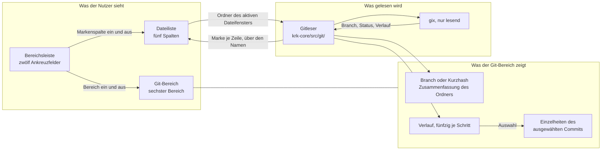

# Spec: Der Git-Bereich liest Status, Branch und Verlauf (Stufe A)

**Date:** 2026-08-30
**Status:** Draft
**Activated from Circle:** 260830-1045-git-bereich-liest-status-branch-verlauf
**Source:** Die Directive des Circle-Datensatzes `_t_circle.md`, vom Nutzer am 260830-1045 geschärft und hier nicht noch einmal angefasst. Dazu die Machbarkeitsanalyse `260830-1006-gix-als-git-anbindung-stufe-a.md`, die vier beantworteten Entscheidungen unter dem Stempel `260830-1006` und die vier Antworten des Nutzers vom 260830 („1a 2a 3b 4b"). Die dreizehn Festlegungen des Nutzers stehen unten als E1 bis E13; A1 bis A14 füllen die Lücken, die keine von ihnen benennt, und sind am Spec-Tor überstimmbar.

**Baumstand aller Erhebungen dieses Specs:** `3266fb3`. Unterhalb von `crates/`, in `Cargo.toml` und in `CLAUDE.md` ist dieser Stand mit `d1fbaac` deckungsgleich, dem Stand der Machbarkeitsanalyse; die drei Commits dazwischen fassen allein `fusion-workbench/` an.

---

## Directive

KRK zeigt nach dieser Runde den Git-Zustand des angezeigten Ordners, ohne ins Repository zu schreiben. Ein sechster Bereich der Fensterzeile trägt den Namen des Branch, eine Zusammenfassung des Status und den Commit-Verlauf als Liste; er bewirbt sich als dritter um dieselbe Fläche wie Vorschau und Editor, folgt dem aktiven Dateifenster und nimmt den Tastaturfokus als sechster Wert `Fokus::Git`, damit die Verlaufsliste mit den Pfeiltasten zu durchlaufen ist. Die Dateiliste beider Dateifenster trägt eine fünfte Spalte mit einer Marke je Zeile, die fünf Zustände unterscheidet, und die über ein weiteres Ankreuzfeld der Bereichsleiste zuschaltbar ist. In einem Ordner ohne Repository bleibt die Anzeige ruhig: ein Satz im Git-Bereich, ein Ankreuzfeld, das eingeschaltet bleibt und nicht wirkt, eine Spalte, die steht und leer bleibt. Gelesen wird mit `gix`; Hinzufügen, Committen, Verwerfen und der Versions-Schieberegler sind die nächste Runde und liegen außerhalb dieser.

Diese Runde setzt keine elfte Zeitzusage und fasst keine der zehn aus C8 der Runde 1 an.



Der Graph zeigt einen Kreis, `Liste → Gitleser → Liste`, und er ist Auftrag und Antwort und keine Verflechtung: die Dateiliste meldet den Ordner, der Gitleser trägt seinen Befund nach. Dieselbe Form trägt der Durchlauf des Filters seit der Runde 10.

---

## Verhältnis zu den zehn Zeitzusagen aus C8 der Runde 1

**Diese Runde fasst keine der zehn Zahlen an und setzt keine elfte.** Der Nutzer hat den Verlust der Zusagen bei der Klärung der Directive in Kauf genommen; nach den Messungen der Machbarkeitsanalyse muss er ihn nicht zahlen, und dieser Spec verlangt deshalb die Bauform, die ihn vermeidet, statt die Zusagen abzusenken.

**Was gemessen ist, steht als Auskunft und nicht als Zusage.** Auf dem Referenzgerät der zehn Zahlen kostet eine Statusabfrage über KRKs eigenes Repository 11 bis 12 ms, über einen Ordner mit 100 000 Einträgen 155 bis 164 ms und über einen Unterordner mit 500 Einträgen in demselben Repository 12 ms. Die Frage nach einem Repository kostet an einem Pfad ohne `.git` 21 bis 82 µs. Fünfzig Commits samt Autor, Zeit und Kurzbeschreibung kosten 3,9 ms. Alle Zahlen stammen aus `260830-1006-gix-als-git-anbindung-stufe-a.md`, Fragen 4 und 8, Profil `release`, warm.

**Drei der zehn Zusagen liegen in Reichweite, und jede bleibt unberührt, solange die Bauform steht.** L3 sagt 400 ms für das vollständige Lesen von 10 000 Einträgen zu; der Status kostet dort 17 ms und ist ungefährlich. L10 sagt 4 000 ms für das vollständige Lesen von 100 000 Einträgen zu; der Status kostet dort 155 ms und ist ebenso ungefährlich. Die zweite Hälfte von L10, 100 ms bis zur ersten Bildschirmseite, wäre der Bruch, wenn der Status **synchron** liefe, denn 155 ms stehen neben 100 ms. Läuft er nebenläufig und trägt seinen Befund nach, steht die erste Seite unverändert nach dem alten Wert da. L1 sagt einen Zeichendurchgang je Bild zu, also 16 ms bei 60 Hz; jede synchrone Statusabfrage im Zeichendurchgang bräche sie in jedem gemessenen Fall. Beides bindet C7 dieses Specs.

**Diese Runde schuldet keinen Abnahmelauf gegen die zehn Zusagen.** Sie legt keine Arbeit in eine gemessene Strecke: die kopflose Messstrecke (`crates/krk-ui/src/messmodus.rs`) kennt weder den Git-Bereich noch die Markenspalte, und beide Schalter stehen ab Werk so, dass die Strecke sie nicht anfasst. Der Fall der Runde 14, in der Arbeit innerhalb der Endbedingung einer Zusage lag und die Zusage deshalb auf die Gegenstände der späteren Messrunde zurückkam (`shared/decisions/260819-2216_*_schuldet-diese-runde-einen-abnahmelauf-gegen-die-zusage-l7.md`), liegt hier nicht vor. Was diese Runde stattdessen misst, steht in C10: den einen Posten, den die Analyse ausdrücklich ungemessen gelassen hat.

**Eine Warnung gehört dazu, und sie richtet sich an die spätere Messrunde.** Die Zahlen oben sind der Aufwand und nicht seine Wirkung auf eine Zusage. Ob L10 mit eingeschaltetem Git-Bereich und eingeschalteter Markenspalte auf dem laufenden Bündel hält, sagt allein ein Abnahmelauf, und der verlangt KRK im Vordergrund und ist damit Nutzerarbeit.

---

## Dreizehn Festlegungen des Nutzers

Sie stehen fest und werden von diesem Spec nicht aufgemacht.

**E1 — Der Git-Bereich ist der sechste Bereich der Fensterzeile** und der dritte Bewerber um die Fläche, die sich Vorschau und Editor teilen. Er folgt dem **aktiven** Dateifenster.

**E2 — `Fokus::Git` wird der sechste Fokuswert.** Die zehn Nachzugsstellen aus der zweiten Tabelle unter Frage 7 der Machbarkeitsanalyse sind angenommen, die vier stillen eingeschlossen.

**E3 — Die Marken stehen als fünfte Spalte** neben Name, Größe, Datum und Typ, mit eigener Überschrift und eigener Breite; ihr Ankreuzfeld reiht sich bei den drei Spaltenschaltern der Bereichsleiste ein. Die Spalte gilt in **beiden** Dateifenstern.

**E4 — Fünf Markenzustände:** geändert, vorgemerkt, neu beziehungsweise unverfolgt, in Konflikt, umbenannt.

**E5 — Ordner ohne Repository: alles ruhig.** Ein Satz im Git-Bereich, das Ankreuzfeld bleibt eingeschaltet und wirkt nicht, die Spalte steht und bleibt leer. Sie wird nicht eingezogen.

**E6 — Die Anbindung wohnt in `krk-core/src/git/`**, `gix` wird Abhängigkeit von `krk-core`. Keine fünfte Kiste.

**E7 — Die C-Freiheits-Zusage bezieht sich künftig auf das Bauziel.** Prüfmittel ist `cargo tree --target <ziel> -e normal,build`. Die Prosastellen sind nachzuziehen, und zwar mit einer Erhebungsvorschrift statt einer Zahl.

**E8 — Stufe A liest nur.** Hinzufügen, Committen, Verwerfen und der Versions-Schieberegler sind Runde 24. Der aufgefrischte Index wird nicht zurückgeschrieben.

**E9 — Der Status läuft nebenläufig** und trägt seinen Befund nach, in der Bauform des Durchlaufs aus Runde 10. Zuordnung über den **Namen**, nicht über den Eintragsindex. Eigener Befundvektor mit eigener Ungültigkeitsregel neben dem des Filters. Beschränkung auf den angezeigten Ordner über die Pfadmuster von `into_iter`.

**E10 — Die zwei Tasten.** Der Bereich bekommt `opt+cmd+r` für „Repository", der Fokusbefehl `shift+cmd+b` für „Branch". Beide sind ab Werk frei; am 260830 nachgezählt über `grep 'tasten = ' resources/default-keymap.toml`, keine Tastenliste dieser Datei nennt eine der beiden. Beide bleiben in ihrer Familie: `opt+cmd+<Buchstabe>` ist die Umschaltfamilie, `shift+cmd+<Buchstabe>` die Fokusfamilie. Damit sind sie für spätere Befehle vergeben.

**E11 — Die Marke ist ein Buchstabe**, wie `git status` ihn schreibt: `M` geändert, `S` vorgemerkt, `N` neu, `K` in Konflikt, `U` umbenannt. Schmal und ohne Farbe lesbar. Kein ausgeschriebenes Wort, kein farbiger Punkt als alleiniges Merkmal.

**E12 — Der Verlauf lädt fünfzig auf einmal**, und das Ende der Liste lädt die nächsten fünfzig nach.

**E13 — Der Git-Bereich zeigt unter der Liste die vollständige Commit-Nachricht, den Autor und das Datum des ausgewählten Commits.** Die zweite Anzeigefläche im Bereich ist angenommen. Die Liste der geänderten Dateien eines Commits (`gix-diff`) ist nicht gewählt und bleibt draußen.

---

## Vierzehn Festlegungen des Specs, am Spec-Tor überstimmbar

Jede füllt eine Lücke, die weder die Directive noch eine der dreizehn benennt, und jede ist gegen den Baum gelesen.

**A1 — Der Git-Bereich steht in `Bereich::ALLE` an sechster und letzter Stelle**, hinter dem Editor. Das ist die Einordnung, die der Editor selbst bekommen hat, und aus demselben Grund: er nimmt die Stelle am rechten Rand ein, die schon die Vorschau hat, und die Reihenfolge der Aufzählung ist die der Fensterzeile von links nach rechts (`crates/krk-ui/src/fenstermodell.rs:103-122`). Die Felder in `Breiten` und `Sichtbarkeit` (`crates/krk-core/src/ablage/sitzung.rs:182`, `:228`) stehen an derselben Stelle, weil `serde` die Zeilen der `session.toml` in Feldreihenfolge schreibt und diese Datei nach C7 der Runde 1 von Hand zu lesen ist.

**A2 — Der Bereich heißt auf seinem Schalter „Git" und im Hinweistext „Git-Bereich".** Das Ankreuzfeld der Markenspalte heißt „Marke". Zwei Schalter mit derselben Beschriftung in einer Leiste wären eine Auskunft, die keine ist; die Leiste trägt nach dieser Runde zwölf Felder nebeneinander auf achtzehn Punkten Höhe, und ein Wort je Schalter ist die Regel, die `Bereich::beschriftung` und `Spalte::beschriftung` schon halten.

**A3 — Die Statuszusammenfassung meint den angezeigten Ordner und sagt es.** Sie nennt je Markenzustand die Zahl der betroffenen Einträge, lässt die Zustände mit null weg und schreibt „unverändert", wenn keiner übrig bleibt. Der Satz trägt den Zusatz, dass er den Ordner meint und nicht das Repository. Das folgt aus E9: der Status ist über die Pfadmuster auf den angezeigten Ordner beschränkt, und eine Zahl, die als Auskunft über das ganze Repository gelesen würde, wäre falsch. Was die Wahl kostet, steht dazu: wer wissen will, ob das Repository als ganzes sauber ist, sieht es in KRK nicht. Die repositoryweite Zusammenfassung kostete in einem Baum mit 100 000 Einträgen 220 ms statt 12 ms und ist deshalb nicht gewählt.

**A4 — Der Verlauf ist repositoryweit und nicht auf den Ordner beschränkt.** `rev_walk` läuft von HEAD aus über die Vorfahren; eine Beschränkung auf die Commits, die den angezeigten Ordner berühren, verlangte einen Vergleich je Commit und ist weder von der Directive verlangt noch gemessen.

**A5 — Eine Verlaufszeile trägt vier Angaben in einer Zeile:** die Kurzbeschreibung des Commits, den Namen des Autors, das Datum und den Kurzhash. Die Kurzbeschreibung steht vorn und bekommt den Platz, der übrig bleibt; sie ist die Angabe, an der der Nutzer einen Commit wiedererkennt. Die Fläche darunter aus E13 trägt die vollständige Nachricht, den Autor mit E-Mail, das Datum und den vollen Hash.

**A6 — Ein abgelöster HEAD zeigt den Kurzhash an der Stelle des Branchnamens, mit dem Wort „abgelöst" daneben.** Der Verlauf steht wie sonst. `gix` beantwortet nicht, welcher Branch diesen Commit enthält, und `git` tut es an dieser Stelle auch nicht; KRK behauptet deshalb keinen Branchnamen, den es nicht hat.

**A7 — Ein Repository ohne Commit zeigt den Branchnamen und den Satz „noch kein Commit".** Die Verlaufsliste bleibt leer, die Fläche der Einzelheiten bleibt leer, und es erscheint keine Fehlermeldung. Der Fall ist gemessen und eine Fußangel: `head_name()` liefert dort den Namen, `head_id()` scheitert mit `Unborn`, und die Prüfhülle der Machbarkeitsanalyse ist genau daran gescheitert, bevor die Trennung eingebaut war (Frage 1 der Analyse). Die Markenspalte wirkt in diesem Fall normal: jeder Eintrag ist neu oder vorgemerkt.

**A8 — Solange der Statuslauf noch läuft, steht an der Stelle der Zusammenfassung nichts, und die Markenspalte bleibt leer.** Kein Platzhaltertext, kein Fortschrittsanzeiger, kein Flackern. Branch und Verlauf stehen zu diesem Zeitpunkt schon, denn beide kosten zusammen weniger als eine Statusabfrage über einen kleinen Ordner. Die Begründung ist die der drei Antworten aus dem Entscheid zum leeren Ordner: Ruhe beim Ordnerwechsel ist in einem Programm, dessen Zusagen in Einzelbildern gemessen werden, eine Eigenschaft und kein Geschmack. Ein Text „wird gelesen …", der bei jedem Ordnerwechsel für zwölf Millisekunden erschiene, wäre genau das Flackern, das der Entscheid für das Ankreuzfeld schon abgelehnt hat.

**A9 — Der Gitbefund wird genau dann neu geholt, wenn ein Dateifenster seinen Ordner neu liest**, und sonst nur beim Wechsel des aktiven Dateifensters, beim Tabwechsel und beim Einschalten des Bereichs oder der Spalte. Der eine Auffrischungspfad ist `auffrischung::ordner_neu_lesen` (`crates/krk-ui/src/auffrischung.rs`), und der hat schon zwei Auslöser, den FSEvents-Rückruf und den Abschluss einer Dateioperation. Der Gitbefund hängt sich an diesen einen Pfad und baut keinen zweiten daneben. Was die Wahl kostet, steht dazu und ist nicht klein: wer in einem Terminal committet, während KRK einen Unterordner des Repositorys zeigt, sieht die Änderung erst beim nächsten Neulesen dieses Ordners. Ein eigener Beobachter auf `.git` ist nicht gebaut; die Frage ist als Datensatz gefilt (`decisions/260830-1251_*_haengt-der-gitbefund-zusaetzlich-an-einem-beobachter-auf-git.md`).

**A10 — Ein Statuslauf, dessen Ordner nicht mehr angezeigt wird, wird verworfen.** Der Befund kommt über den Namen an (E9), und ein Name aus dem alten Ordner träfe im neuen möglicherweise einen gleichnamigen Eintrag. Der Auftrag trägt deshalb die Kennung des Lesevorgangs mit, zu dem er gehört, wie es `Ordnermodell::ersatz_einloesen` für Auswahl, Markierung und Filterbefund schon tut. Zwei Statusläufe für dasselbe Dateifenster laufen nie nebeneinander.

**A11 — Ein Eintrag ohne Befund trägt eine leere Zelle und keine Marke für „unverändert".** Die fünf Buchstaben aus E11 sind fünf und nicht sechs; eine sechste Marke für den Normalfall füllte die Spalte in jedem Repository mit einem Zeichen, das nichts sagt.

**A12 — Nach der Marke wird nicht sortiert.** `Schluessel` (`crates/krk-core/src/verzeichnis/`) bleibt bei vier Werten, `cmd+1` bis `cmd+4` behalten ihre Bedeutung, und ein fünfter Sortierbefehl entsteht nicht. Die Sortierung dieses Projekts läuft über vorberechnete Schlüssel, die beim Lesen entstehen; ein Schlüssel, der auf einen nachgetragenen Befund wartet, ordnete die Liste nach dem Eintreffen des Befunds neu.

**A13 — Die Markenspalte steht ab Werk eingeschaltet, der Git-Bereich ab Werk ausgeblendet.** Die Spalte folgt damit den vier anderen, die ab Werk alle stehen; der Bereich folgt Vorschau und Editor, von denen ab Werk keiner den rechten Rand belegt. Beide Stände überleben das Beenden in der `session.toml`.

**A14 — Der Wortlaut der drei Sätze im Git-Bereich**, mit Umlauten, wie der Baum sie seit dem 260826 schreibt (`shared/decisions/260826-1225_*_welche-schreibweise-gilt-fuer-nutzersichtbare-deutsche-meldungen-umlaut-oder-umschrift.md`, offen):
- kein Repository: `Dieser Ordner liegt in keinem Git-Repository.`
- Repository ohne Commit: `noch kein Commit`
- unveränderter Ordner: `unverändert`
Alle drei sind reine Funktionen mit Probe, wie die Meldungen der Statuszeile.

---

## Capabilities

### C1: Der sechste Bereich der Fensterzeile

**Description:** Wer `opt+cmd+r` drückt oder in der Bereichsleiste das Feld „Git" ankreuzt, bekommt am rechten Rand des Fensters einen Bereich, der den Git-Zustand des Ordners zeigt, den das aktive Dateifenster anzeigt. Vorschau, Editor und Git bewerben sich um dieselbe Fläche, und höchstens einer von ihnen steht.

**Acceptance criteria:**
- [ ] C1.1 `Bereich` trägt sechs Werte und `Bereich::ALLE` sechs Einträge, `Git` an sechster Stelle (A1). Zu prüfen mit `awk '/pub enum Bereich/,/^}/' crates/krk-ui/src/fenstermodell.rs` und dem Bau: die vier Feldbreiten in `Aufteilung::rahmen`, `Bereichsleiste::bereichsschalter`, `Aufteilung::gemessene_breiten` und `Fenstermodell::breiten_uebernehmen` halten den Bau an, sobald `ALLE` gewachsen ist.
- [ ] C1.2 `opt+cmd+r` blendet den Git-Bereich ein und wieder aus; der Menüeintrag „Git-Bereich ein- und ausblenden" tut dasselbe und geht denselben Weg. `make tasten` und `make menue` führen die Zeile nach der Runde. Nutzerarbeit am Bündel, dazu ein Diff der beiden Ausgaben gegen den Stand vor der Runde.
- [ ] C1.3 Die Bereichsleiste trägt einen sechsten Bereichsschalter mit der Beschriftung „Git" und dem Hinweistext „Git-Bereich" (A2), und er steht in der Reihe der Bereichsschalter, nicht bei den Spaltenschaltern. Nutzerarbeit am Bündel.
- [ ] C1.4 Höchstens einer von Vorschau, Editor und Git ist sichtbar: das Einschalten eines der drei blendet die beiden anderen aus. Probe ohne Fenster am `Fenstermodell` für alle sechs geordneten Paare; die Anzeige selbst Nutzerarbeit am Bündel.
- [ ] C1.5 Der gegenseitige Ausschluss bleibt gegenseitig: die Probe `der_ausschluss_ist_gegenseitig` gilt nach der Runde für alle drei Paare und nicht mehr für eines. `Bereich::teilt_flaeche_mit` liefert heute ein `Option<Bereich>` und kann drei Bewerber nicht ausdrücken; welche Form an ihre Stelle tritt, entscheidet der Planner, und ein zweiter Schreiber neben `Fenstermodell::sichtbar_setzen` entsteht dabei nicht.
- [ ] C1.6 Der Git-Bereich trägt einen `NSBox` mit Fokusrahmen wie die fünf anderen, und die Rahmenregel aus C9 der Runde 2 färbt ihn nach denselben drei Rollen. Nutzerarbeit am Bündel.
- [ ] C1.7 Sichtbarkeit und Breite des Git-Bereichs überleben das Beenden. Eine `session.toml` aus der Zeit vor dieser Runde bleibt lesbar und lässt den Bereich ausgeblendet; die Probe dazu steht neben den bestehenden in `crates/krk-core/tests/ablage.rs`.
- [ ] C1.8 Ab Werk ist der Git-Bereich ausgeblendet (A13). Probe ohne Fenster auf `Sichtbarkeit::default()`.
- [ ] C1.9 Die Regel „eines bleibt" für die beiden Dateifenster ist unberührt: `Fenstermodell::umschalten` weist weiterhin jeden Befehl ab, der das letzte sichtbare Dateifenster ausblenden würde. Probe ohne Fenster.
- [ ] C1.10 Der Git-Bereich folgt dem aktiven Dateifenster (E1): ein Fensterwechsel stellt ihn auf den Ordner des nun aktiven Dateifensters um, auch wenn beide Fenster in verschiedenen Repositorys stehen. Nutzerarbeit am Bündel, mit zwei Ordnern aus zwei Repositorys nebeneinander.
- [ ] C1.11 Die proportionale Breitenregel aus der Runde 5 rechnet den Git-Bereich mit, wenn er steht, und lässt ihn aus, wenn er ausgeblendet ist; die Breiten der übrigen Bereiche stehen vor und nach dem Ein- und Ausblenden gleich. Probe ohne Fenster über `bereichsbreiten`.

### C2: Der sechste Fokuswert `Fokus::Git`

**Description:** Der Git-Bereich nimmt den Tastaturfokus wie Vorschau und Editor. Mit dem Fokus dort durchläuft der Nutzer die Verlaufsliste mit den Pfeiltasten, und die Befehle, die einen anderen Bereich brauchen, wirken nicht und sind im Menü grau.

**Acceptance criteria:**
- [ ] C2.1 `Fokus` trägt sechs Werte und `Fokus::ALLE` sechs Einträge. Zu prüfen mit `awk '/pub enum Fokus/,/^}/' crates/krk-ui/src/kommandos/fokus.rs`; der Bau hält `fokus::in_bereich`, `bereich_mit_fokus`, `teilen::worauf`, `fenstertitel`, `rundweg`, `fokusansicht`, `bereichskommando` und `tab_schliessen`, und keine dieser Stellen bekommt einen Auffangzweig.
- [ ] C2.2 `shift+cmd+b` holt den Fokus in den Git-Bereich und blendet ihn dabei ein, wenn er ausgeblendet war, wie die vier vorhandenen Fokusbefehle es tun. Nutzerarbeit am Bündel.
- [ ] C2.3 Mit dem Fokus im Git-Bereich trägt sein Rahmen die Fokusfarbe und der Fenstertitel den Bereich; `krk-ui/src/fenstertitel.rs` bekommt eine Antwort für `Fokus::Git`. Die Titelfunktion ist eine reine Funktion mit Probe; die Rahmenfarbe ist Nutzerarbeit am Bündel.
- [ ] C2.4 Ein Mausklick in die Verlaufsliste setzt den Fokus in den Git-Bereich, und `Anwendungsdelegierter::ersthelferbereich` findet ihn über `Bereich::ALLE`. Nutzerarbeit am Bündel.
- [ ] C2.5 Die Tafel in `kommandos/fokus.rs` ist auf acht Wirkungsbereiche mal **sechs** Fokuswerte gewachsen und geht auf. Die Spalte `Git` trägt `true` bei `Ueberall` und bei `Navigator` und `false` bei `Dateifenster`, `Leiste`, `Dateibereiche`, `Editor`, `Tabbereich` und `Vorschau`. Probe.
- [ ] C2.6 Die Tafel `OHNE_SPERRE` in `kommandos/zulaessigkeit.rs` trägt ebenso eine sechste Spalte, und ihre Probe geht auf. Probe.
- [ ] C2.7 Mit dem Fokus im Git-Bereich bewegen `up` und `down` die Auswahl in der Verlaufsliste und **nicht** im Dateifenster. Nutzerarbeit am Bündel; die Zulässigkeit selbst über die Tafel aus C2.5 als Probe.
- [ ] C2.8 Mit dem Fokus im Git-Bereich wechselt `tab` das aktive Dateifenster, wie aus dem Vorschaufenster heraus. Nutzerarbeit am Bündel.
- [ ] C2.9 Mit dem Fokus im Git-Bereich wirken die drei Zoombefehle des Betrachters nicht, der Rundweg `cmd+e` nicht, die drei Tabbefehle nicht und die Befehle mit Wirkungsbereich `Dateifenster` nicht; ihre Menüeinträge sind grau. Über die Tafel aus C2.5 als Probe; je ein Stichprobenpaar am Bündel als Nutzerarbeit.
- [ ] C2.10 `fokus::wirkt` lässt `Fokus::Git` nicht still in „wirkt nicht" fallen: jede der acht Zweige nennt den neuen Wert ausdrücklich, wo er gilt, und die Probe aus C2.5 hält beide Mengen gegeneinander. Der Übersetzer hält diese Stelle nicht, und das ist der Grund, aus dem sie eine eigene Zeile bekommt.
- [ ] C2.11 Ein stehendes Blatt hält auch `opt+cmd+r` und `shift+cmd+b` an. Die Ausnahmeliste `kommandos::zulaessigkeit::immer_erreichbar` wächst nicht, und die Probe `waehrend_eines_blattes_kommen_genau_diese_vier_durch` bleibt bei vier und wird nicht rot.
- [ ] C2.12 Der Fokus geht nicht in einen ausgeblendeten Git-Bereich: die Sperre in `fokus_setzen` gilt ihm wie der Vorschau und dem Editor. Probe, soweit die Regel in `kommandos/` steht.

### C3: Was der Git-Bereich zeigt

**Description:** Der Bereich zeigt drei Dinge übereinander: oben den Branch und die Zusammenfassung des Status für den angezeigten Ordner, in der Mitte den Commit-Verlauf als Liste, unten die Einzelheiten des Commits, den der Nutzer in der Liste ausgewählt hat.

**Acceptance criteria:**
- [ ] C3.1 Der Kopf des Bereichs nennt den Namen des Branch, auf dem HEAD steht. Nutzerarbeit am Bündel; die Ableitung aus `head_name()` als Probe ohne Fenster gegen ein angelegtes Prüfrepository.
- [ ] C3.2 Darunter steht die Zusammenfassung: je Markenzustand die Zahl der betroffenen Einträge des angezeigten Ordners, die Zustände mit null weggelassen, und der Zusatz, dass der Satz den Ordner meint (A3). Ist keiner übrig, steht `unverändert` (A14). Der Satz ist eine reine Funktion mit Probe.
- [ ] C3.3 Die Verlaufsliste trägt je Zeile Kurzbeschreibung, Autorname, Datum und Kurzhash (A5), die Kurzbeschreibung vorn und mit dem übrigen Platz. Nutzerarbeit am Bündel; die Zeilenform als reine Funktion mit Probe.
- [ ] C3.4 Die Fläche unter der Liste zeigt für den ausgewählten Commit die vollständige Nachricht, den Autor mit E-Mail, das Datum und den vollen Hash (E13). Nutzerarbeit am Bündel.
- [ ] C3.5 Ohne Auswahl in der Liste bleibt die Fläche der Einzelheiten leer, und der Bereich zeigt keinen Platzhaltertext. Nutzerarbeit am Bündel.
- [ ] C3.6 Bei abgelöstem HEAD steht an der Stelle des Branchnamens der Kurzhash mit dem Wort „abgelöst"; der Verlauf steht wie sonst (A6). Probe ohne Fenster gegen ein Prüfrepository mit abgelöstem HEAD, wie die Machbarkeitsanalyse eines angelegt hat.
- [ ] C3.7 In einem Repository ohne Commit steht der Branchname und darunter `noch kein Commit`; die Verlaufsliste ist leer, die Fläche der Einzelheiten ist leer, und keine Fehlermeldung erscheint (A7, A14). Probe ohne Fenster: `head_name()` liefert den Namen, `head_id()` scheitert mit `Unborn`, und der Gitleser trennt die beiden Fälle, statt den Fehler durchzureichen.
- [ ] C3.8 Kein Weg dieser Runde schreibt in ein Repository. `write_changes` wird nicht gerufen, kein `.git/index` wird angefasst, keine Sperre wird genommen (E8). Zu prüfen mit `grep -rn 'write_changes' crates/`, das nach der Runde keine Fundstelle liefert, und daran, dass der Gitleser keinen schreibenden `gix`-Weg ruft.
- [ ] C3.9 Der Bereich zeigt den Ordner des aktiven Dateifensters und nicht den des anderen (E1, C1.10). Nutzerarbeit am Bündel.
- [ ] C3.10 Ein Ordner, der in einem Repository liegt, ohne dessen Wurzel zu sein, wird als Repository behandelt: `discover` findet den Baum aufwärts, der Branch steht, der Verlauf steht, und die Zusammenfassung meint den Unterordner. Probe ohne Fenster.

### C4: Der Verlauf lädt in Fünfzigerschritten nach

**Description:** Die Liste zeigt zuerst die fünfzig jüngsten Commits. Erreicht der Nutzer ihr Ende, kommen die nächsten fünfzig dazu, ohne dass die Liste springt oder die Auswahl sich bewegt.

**Acceptance criteria:**
- [ ] C4.1 Beim Aufbau des Bereichs stehen fünfzig Commits in der Liste, sofern das Repository so viele hat (E12). Probe ohne Fenster gegen KRKs eigenes Repository oder ein angelegtes Prüfrepository.
- [ ] C4.2 Erreicht die Auswahl den letzten Eintrag der Liste und der Nutzer drückt weiter `down`, kommen die nächsten fünfzig dazu; die Auswahl bleibt auf dem Eintrag, auf dem sie stand, und die Liste springt nicht. Nutzerarbeit am Bündel.
- [ ] C4.3 Sind weniger als fünfzig übrig, kommt der Rest; danach wächst die Liste nicht weiter, und ein weiteres `down` am Ende bewirkt nichts. Probe ohne Fenster auf der Nachladeregel; die Anzeige Nutzerarbeit am Bündel.
- [ ] C4.4 Während des Nachladens steht keine Platzhalterzeile in der Liste, und es erscheint kein Fortschrittsanzeiger. Fünfzig Commits kosten gemessen 3,9 ms, also weniger als ein Viertelbild. Nutzerarbeit am Bündel.
- [ ] C4.5 Ein Repository mit weniger als fünfzig Commits zeigt alle, und kein Nachladen wird versucht. Probe ohne Fenster gegen ein angelegtes Prüfrepository mit drei Commits.
- [ ] C4.6 Ein Ordnerwechsel setzt die Liste auf die ersten fünfzig zurück; die Nachladehöhe wird nicht über zwei Ordner hinweg gehalten. Probe ohne Fenster.

### C5: Die fünfte Spalte der Dateiliste

**Description:** Beide Dateilisten tragen eine fünfte Spalte, die je Zeile einen Buchstaben zeigt: `M` geändert, `S` vorgemerkt, `N` neu, `K` in Konflikt, `U` umbenannt. Ein Ankreuzfeld der Bereichsleiste blendet sie ein und aus, wie die drei Spaltenschalter daneben.

**Acceptance criteria:**
- [ ] C5.1 `Spalte` trägt fünf Werte und `Spalte::ALLE` fünf Einträge, `Marke` als fünfte hinter `Typ` (E3). Zu prüfen mit `awk '/pub enum Spalte/,/^}/' crates/krk-ui/src/spalten.rs`. **`Spalte::ALLE` ist dieselbe stille Stelle wie `Bereich::ALLE`:** die Feldbreite `[Spalte; 4]` zwingt zu vier Einträgen und sagt nichts darüber, welche vier. Die vollständigen Fallunterscheidungen darüber halten den Bau an, die Liste hält ihn nicht.
- [ ] C5.2 Kennung, Überschrift, Beschriftung, die beiden Breiten, Ausrichtung und Beschreibbarkeit tragen je eine Antwort für `Spalte::Marke`, keine über einen Auffangzweig. Die Spalte ist nicht beschreibbar; `Spalte::beschreibbar` bleibt bei `Name` als einzigem `true`. Bau.
- [ ] C5.3 Die fünf Zustände zeigen die fünf Buchstaben aus E11, ein unveränderter Eintrag eine leere Zelle (A11). Probe ohne Fenster: ein angelegtes Prüfrepository mit je einem Eintrag der fünf Zustände, der Statusstrom gegen die erwartete Zuordnung von Name auf Buchstabe gehalten.
- [ ] C5.4 Die Spalte gilt in beiden Dateifenstern, und jedes zeigt die Marken seines eigenen Ordners und seines eigenen Repositorys (E3). Zwei Ordner aus zwei verschiedenen Repositorys nebeneinander zeigen zwei verschiedene Markensätze. Nutzerarbeit am Bündel.
- [ ] C5.5 Die Bereichsleiste trägt ein viertes Spaltenfeld mit der Beschriftung „Marke" (A2), und es steht in der Reihe der Spaltenschalter. Nutzerarbeit am Bündel.
- [ ] C5.6 Ein neues `Kommando` blendet die Spalte ein und aus, ohne Tastenbefehl (`tasten = []`), wie die drei vorhandenen Spaltenschalter; sein Menüeintrag steht unmittelbar bei ihnen. `bereich_des_kommandos` (`crates/krk-ui/src/belegungsmodell.rs:226`) ordnet es dem Dateilisting zu, wie die drei. `make menue` führt die Zeile nach der Runde.
- [ ] C5.7 Die drei Pflichtstellen jedes neuen Kommandos sind besetzt: `Kommando::wirkungsbereich`, `bereich_des_kommandos` und `Kommando::KENNUNGEN`. Die dritte hält der Übersetzer nicht; sie hält die Probe `jede_variante_von_kommando_steht_genau_einmal_in_kennungen` in `crates/krk-core/tests/belegung.rs`, und sie bleibt grün.
- [ ] C5.8 Nach der Marke wird nicht sortiert (A12): `Schluessel` bleibt bei vier Werten, und `cmd+1` bis `cmd+4` behalten ihre Bedeutung. Zu prüfen mit `awk '/pub enum Schluessel/,/^}/'` über die Datei, die die Aufzählung trägt.
- [ ] C5.9 Die Sichtbarkeit der Markenspalte überlebt das Beenden; eine `session.toml` aus der Zeit vor der Runde bleibt lesbar und lässt die Spalte stehen (A13). Probe ohne Fenster.
- [ ] C5.10 Ab Werk steht die Markenspalte, wie die vier anderen (A13). Probe ohne Fenster auf dem Auslieferungszustand der Spaltensichtbarkeit.
- [ ] C5.11 Der Buchstabe bleibt in einer markierten Zeile lesbar. Die Dateizelle trägt zwei Kennzeichen, Farbe und Schrift, und die Markenspalte fügt kein drittes hinzu; sie nimmt dieselbe Auszeichnung wie die vier anderen Spalten. Nutzerarbeit am Bündel.

### C6: Der Ordner ohne Repository

**Description:** In einem Ordner, unter dem bis zur Wurzel kein `.git` liegt, bleibt die Anzeige ruhig. Der Git-Bereich sagt einen Satz, das Ankreuzfeld bleibt eingeschaltet und wirkt nicht, die Markenspalte steht und bleibt leer.

**Acceptance criteria:**
- [ ] C6.1 Der Git-Bereich zeigt an der Stelle seines Inhalts den Satz `Dieser Ordner liegt in keinem Git-Repository.` (E5, A14) und behält seine Breite. Nutzerarbeit am Bündel; der Satz als reine Funktion mit Probe.
- [ ] C6.2 Das Ankreuzfeld „Marke" bleibt eingeschaltet und wirkt nicht. Es wird nicht ausgegraut, und es ändert seinen Stand beim Ordnerwechsel nicht (E5). Nutzerarbeit am Bündel, mit einem Wechsel zwischen einem Repository und einem gewöhnlichen Ordner und zurück.
- [ ] C6.3 Die Markenspalte steht und bleibt leer; keine Spaltenbreite ändert sich beim Wechsel zwischen einem Repository und einem gewöhnlichen Ordner, und die Liste bricht nicht um (E5). Nutzerarbeit am Bündel.
- [ ] C6.4 Der Git-Bereich blendet sich nicht selbst aus. `Fenstermodell::sichtbar_setzen` bleibt der eine Schreiber der Sichtbarkeit, und kein Weg dieser Runde ruft ihn wegen eines Ordnerinhalts. Probe ohne Fenster; zu prüfen mit `grep -rn 'sichtbar_setzen' crates/krk-ui/src`, dessen Ruferliste nach der Runde keinen Gitweg führt.
- [ ] C6.5 Die Frage nach einem Repository wird bei jedem Ordnerwechsel synchron gestellt und kostet an einem Pfad ohne `.git` gemessen 21 bis 82 µs, also weniger als ein Zweihundertstel eines Bildes. Probe ohne Fenster auf dem negativen Fall; die Zahl ist Auskunft und keine Zusage.
- [ ] C6.6 KRK gibt in diesem Fall keine Meldung in die Statuszeile, kein Hinweisfenster und nichts auf die Standardfehlerausgabe. Ein Ordner ohne Repository ist der Normalfall und kein Fehler. Nutzerarbeit am Bündel; `grep -rn 'eprintln!' crates/krk-ui/src` bleibt ohne neue Fundstelle.
- [ ] C6.7 Ein Repository, das einem anderen Benutzer gehört, wird gelesen und nicht abgewiesen: `gix` leitet die Vertrauensstufe aus dem Eigentum am Pfad ab und überliest in der reduzierten Stufe die empfindlichen Abschnitte der Konfiguration, statt den Zugriff zu verweigern. Die Voreinstellung `bail_if_untrusted = false` bleibt stehen. Nutzerarbeit am Bündel, mit einem Repository unter einem fremden Heimatverzeichnis oder auf einer Wechselplatte.

### C7: Der Status läuft nebenläufig und trägt seinen Befund nach

**Description:** Die Dateiliste steht sofort da, wie sie heute dasteht, und die Marken kommen hinterher. Kein Statuslauf liegt auf dem Hauptfaden, und keiner hält den Zeichendurchgang auf.

**Acceptance criteria:**
- [ ] C7.1 Keine Statusabfrage läuft auf dem Hauptfaden und keine im Zeichendurchgang (E9). Zu prüfen daran, dass der Gitleser seinen Befund über einen Kanal meldet und nicht zurückgibt, wie der Durchlauf des Filters seit der Runde 10.
- [ ] C7.2 Die erste Bildschirmseite eines Ordners steht nach der Runde nicht später da als vor ihr. Nutzerarbeit am Bündel; die Zusage L10 selbst wird in dieser Runde nicht gemessen (Abschnitt zu den Zeitzusagen).
- [ ] C7.3 Bis der Befund eintrifft, bleibt die Markenspalte leer und an der Stelle der Zusammenfassung steht nichts; Branch und Verlauf stehen schon (A8). Nutzerarbeit am Bündel, in einem großen Repository, wo die Spanne sichtbar ist.
- [ ] C7.4 Die Zuordnung läuft über den **Namen** und nicht über den Eintragsindex (E9). Ein Befund, der eintrifft, während `Ordnermodell::lesevorgang_beginnen` den Ersatz noch vormerkt, schreibt keine Marke in den alten Bestand. Probe ohne Fenster.
- [ ] C7.5 Ein Befund, dessen Ordner nicht mehr angezeigt wird, wird verworfen und schreibt keine Marke in den neuen Ordner (A10). Probe ohne Fenster mit zwei aufeinanderfolgenden Lesevorgängen und einem verspäteten Befund.
- [ ] C7.6 Der Gitbefund steht in einem eigenen Vektor mit eigener Ungültigkeitsregel neben dem des Filters (E9). Ein Tippen im Filter wirft die Gitbefunde nicht weg; ein Ordnerwechsel wirft beide weg. Probe ohne Fenster.
- [ ] C7.7 Der Status ist über die Pfadmuster von `into_iter` auf den angezeigten Ordner beschränkt (E9). Zu prüfen daran, dass der Gitleser das Muster aus dem angezeigten Ordner gegen `Repository::workdir()` errechnet und nicht den ganzen Baum abfragt; gemessen ist der Unterschied mit 12 ms statt 220 ms in einem Repository mit 100 000 Einträgen.
- [ ] C7.8 Ein Deskriptormangel von außen lässt den Gitbefund **unentschieden** und entscheidet ihn nicht negativ, wie es `verzeichnis::sys::ist_deskriptormangel` für den Verzeichnisleser hält. Der Wert `Befund::Unentschieden` steht dafür schon bereit. Probe ohne Fenster unter `ulimit -n 64`, als Kindprobe, weil `cargo test` sonst die angehobene Grenze der Sitzung erbt.
- [ ] C7.9 Die Deskriptorzusagen des Durchlaufs bleiben unberührt: er hält weiterhin genau einen Verzeichnisdeskriptor und während eines Lesens genau einen Dateideskriptor. Der Gitleser ist ein zweiter Leser und leert den Vorrat nicht; sein Höchststand ist gemessen und liegt im niedrigen zweistelligen Bereich. Probe wie C7.8.
- [ ] C7.10 Der Gitbefund wird über `auffrischung::ordner_neu_lesen` aufgefrischt und über keinen zweiten Weg (A9). Zu prüfen daran, dass keine zweite Stelle im Baum einen Statuslauf anstößt; `grep` über die Ruferliste des Gitlesers nennt die Auslöser aus A9 und keinen weiteren.
- [ ] C7.11 Zwei Statusläufe für dasselbe Dateifenster laufen nie nebeneinander (A10). Probe ohne Fenster mit zwei schnell aufeinanderfolgenden Ordnerwechseln.

### C8: `gix` wird Abhängigkeit von `krk-core`

**Description:** Die Anbindung wohnt als Modul `krk-core/src/git/` im Kern, mit `gix` als seiner Abhängigkeit. Der Bau bleibt frei von C-Code, die Merkmalswahl steht mit ihrer Begründung an der einen Stelle, an der dieses Projekt jede fremde Kiste begründet.

**Acceptance criteria:**
- [ ] C8.1 Das Modul liegt in `crates/krk-core/src/git/`, `gix` steht in `crates/krk-core/Cargo.toml`, und der Workspace führt nach der Runde weiterhin vier Mitglieder (E6). Zu prüfen mit `grep -c 'members' Cargo.toml` und dem Verzeichnisbestand unter `crates/`.
- [ ] C8.2 Die Merkmalswahl lautet `default-features = false` mit `status`, `revision`, `max-performance-safe`, `parallel` und `sha1`, und die Fassung ist auf eine kleine Fassung festgenagelt und nicht auf `"0"`. Zu prüfen am Eintrag in der Wurzel-`Cargo.toml`.
- [ ] C8.3 Die Begründung an der Versionsangabe in der Wurzel-`Cargo.toml` nennt die Merkmalswahl, die 98 zusätzlichen Pakete auf dem Bauziel, die Fassungskadenz von vierzehn kleinen Fassungen in zehn Monaten und den Befund zu `cc` und `-sys`, wie es dieses Projekt bei jeder fremden Kiste tut. Zu prüfen durch Lesen.
- [ ] C8.4 `cargo tree --target x86_64-apple-darwin -e normal,build` und dasselbe für `aarch64-apple-darwin` führen nach der Runde weder `cc` noch ein Paket mit einem Namen auf `-sys`. Beide Läufe sind das Prüfmittel der neugefassten Zusage aus E7 und gehören in die Abnahme.
- [ ] C8.5 `#![deny(unsafe_code)]` bleibt an der Wurzel von `krk-core`, und das Gitmodul trägt kein `#![allow(unsafe_code)]`. Die beiden bestehenden Ausnahmen bleiben die beiden. Bau.
- [ ] C8.6 Die Proben legen ihr Prüfrepository über die Fassung des selbstabräumenden Prüfordners aus `crates/krk-core/tests/gemeinsam/mod.rs` an, und keine vierte Fassung entsteht. Die Zählprobe `genau_drei_pruefordner_fassungen_stehen_im_baum` (`crates/krk-core/tests/baum.rs`) bleibt grün.
- [ ] C8.7 `cargo build --workspace`, `cargo test --workspace`, `cargo clippy --workspace --all-targets` unter `-D warnings` und `cargo fmt --all --check` bleiben grün, also `make check` als ganzes.
- [ ] C8.8 `cargo xtask bundle` baut und signiert das Bündel nach der Runde unverändert; die Auslieferungskette ist von dieser Runde nicht berührt.
- [ ] C8.9 Kein Rückgabewert, dessen stilles Fallenlassen unbemerkt bliebe, steht ohne `#[must_use]`; die neuen Stellen tragen es wie der Baum es hält, und `let _ =` davor heißt überall „ich brauche den Wert nicht".

### C9: Die Prosastellen, die diese Runde falsch macht

**Description:** Die Runde macht drei Sorten von Aussagen im Baum unrichtig: die C-Freiheits-Zusage, die Zählaussagen über Bereiche, Fokuswerte, Spalten und Schalter, und die fünf Behauptungen, eine Feldbreite halte den Bau an. Alle drei zieht sie nach, und keine ersetzt sie durch eine Zahl, die mit der nächsten Runde wieder falsch wird.

**Acceptance criteria:**
- [ ] C9.1 Die C-Freiheits-Zusage steht an allen sechs Stellen in der neugefassten Form aus E7. Die sechs sind namentlich aufgezählt im Defekt `issues/260830-1106_*_der-entscheid-zur-c-freiheits-zusage-nennt-fuenf-prosastellen-im-baum-stehen-sechs.md`: `Cargo.toml:91-95`, `Cargo.toml:150-153`, `Cargo.toml:274-275`, `Cargo.toml:352-356`, `CLAUDE.md:87` und `crates/krk-core/src/verzeichnis/sys.rs:66`. Die sechste ist die, die keine Erhebung nach dem Wortlaut findet: sie behauptet den Rang „erstes `-sys`-Paket neben `windows-sys`" für eine künftige Zeitkiste, und `linux-raw-sys` nimmt ihn nach dieser Runde ein.
- [ ] C9.2 Keine der sechs Stellen und kein Datensatz nennt danach eine **Zahl** der Prosastellen. An ihre Stelle tritt die Erhebungsvorschrift, die der Defekt ausschreibt. Zu prüfen daran, dass das dort ausgeschriebene `grep` läuft und seine Treffer mit der Aufzählung übereinstimmen.
- [ ] C9.3 Die Zahl „fünf Prosastellen" in `shared/decisions/260830-1006_*_wie-lautet-die-c-freiheits-zusage-…` und in `shared/history/260830-0950-orchestrator-session.md` ist durch einen **Nachtrag** berichtigt und nicht durch Überschreiben; beide Aufzeichnungen behalten ihren Stand nach der Ortsregel. Damit schließt der Defekt aus C9.1.
- [ ] C9.4 Die Zählaussagen über Bereiche, Fokuswerte, Spalten und Schalter sind nachgezogen. Erhoben am 260830 über den Stand `3266fb3` mit
  ```sh
  grep -rnE "fuenf Bereiche|fünf Bereiche|sechster Bereich|sechsten Bereich|fuenf Fokuswert|fünf Fokuswert|sechster Fokuswert|sechsten Fokuswert|vier Spalten|fuenfte Spalte|fünfte Spalte|zehn Ankreuzfeld|neun Schalter|vier fokussierbare" \
    --include='*.rs' --include='*.toml' --include='*.md' \
    crates/ resources/ xtask/ README.md CLAUDE.md Cargo.toml
  ```
  **92 Treffer in 21 Dateien.** Jeder ist zu lesen; wo die Zahl mit jeder Runde wächst, tritt eine Erhebungsvorschrift an ihre Stelle, wie es CLAUDE.md für `Kommando`, `Wirkungsbereich` und `Art` schon hält, und sonst steht die neue Zahl. Nach der Runde liefert dieselbe Erhebung keine unrichtige Aussage mehr. `messungen/`, `spikes/` und der Tätigkeitsbericht sind ausgenommen: sie sind Aufzeichnungen eines Standes und behalten ihn nach der Ortsregel.
- [ ] C9.5 Der Modulkopf von `crates/krk-ui/src/appkit/bereichsleiste.rs` sagt nicht mehr „`Fokus` bekommt deshalb keinen sechsten Wert, sondern der Fall wird ausgeschlossen". Er sagt danach, warum die Leiste keinen Fokuswert bekommt, während der Git-Bereich einen hat: die Leiste liegt in keinem der Teilbäume, die `ersthelferbereich` durchgeht, der Git-Bereich liegt in einem.
- [ ] C9.6 Der Modulkopf von `crates/krk-ui/src/appkit/statuszeile.rs` sagt nicht mehr, eine Zeile in der `NSSplitView` wäre „ein sechster Bereich". Dieselbe Berichtigung gilt `crates/krk-ui/src/appkit/fenster.rs:353-354`, `crates/krk-ui/src/appkit/anwendung.rs:1287-1288` und `crates/krk-ui/src/appkit/titelzusatz.rs:34`, die alle vier auf dieselbe Zahl gebaut sind.
- [ ] C9.7 Der Modulkopf von `crates/krk-ui/src/spalten.rs` nennt `Spalte::ALLE` als die Stelle, die der Übersetzer **nicht** hält, neben den Stellen, die er hält. Der heutige Kopf zählt sieben Stellen auf, die eine neue Spalte erzwingt, und lässt die eine aus, die entscheidet, ob die Spalte überhaupt erscheint (C5.1).
- [ ] C9.8 Die fünf Stellen aus dem offenen Defekt `shared/issues/260830-1006_*_fuenf-prosastellen-behaupten-eine-feldbreite-halte-den-bau-an-…` und die sechste mit der schwächeren Formulierung behaupten danach keine Sicherung durch die Feldbreite mehr; jede sagt stattdessen, was tatsächlich hält. Der Defekt schließt mit dieser Runde, weil sie an genau diesen Stellen ohnehin arbeitet. Die Frage, welche Bauform die Vollständigkeit der `ALLE`-Listen künftig hält, bleibt davon unberührt und offen (`shared/decisions/260826-1811_*_wie-wird-die-vollstaendigkeit-einer-alle-liste-neben-einer-aufzaehlung-gehalten.md`).
- [ ] C9.9 Jede Datei unter `crates/krk-ui/src/appkit/`, die diese Runde anlegt oder anfasst, trägt danach den Abschnitt `# Ab welchem macOS die angesprochenen Klassen stehen` mit jeder neu angesprochenen Klasse und Methode, und keine liegt über macOS 15. Die zwei begründeten Ausnahmen bleiben `koordinaten.rs` und `mod.rs`.
- [ ] C9.10 CLAUDE.md nennt nach der Runde die Runde 23 in der Rundentabelle und zieht die Absätze nach, die diese Runde falsch macht. Welche das sind, sagt die Erhebung aus C9.4 und keine Aufzählung an dieser Stelle.

### C10: Der ungemessene Posten `NeedsUpdate`

**Description:** Die Machbarkeitsanalyse hat einen Posten ausdrücklich ungemessen gelassen: was es kostet, den aufgefrischten Stat-Zwischenspeicher **nicht** zurückzuschreiben. Diese Runde misst ihn, weil die Messstrecke dann schon dasteht, und baut den Schreibweg nicht.

**Acceptance criteria:**
- [ ] C10.1 Ein Messbericht unter `messungen/` beziffert den Posten auf dem Referenzgerät: derselbe Baum mit frisch angefassten Zeitstempeln, einmal ohne und einmal mit Rückschreiben, je drei Durchgänge. Der Bericht nennt das Gerät, das Profil und die Zahl der Einträge, wie die bestehenden Berichte es tun.
- [ ] C10.2 Der Datensatz `shared/decisions/260830-1006_*_darf-stufe-a-den-aufgefrischten-index-zurueckschreiben-…` trägt danach die gemessene Zahl. Er bekommt seine Antwort oder bleibt mit dem gemessenen Posten in der Wiedervorlage offen; welches von beiden, entscheidet der Nutzer und kein Planschritt.
- [ ] C10.3 Kein Schreibweg entsteht: `Outcome::write_changes` wird nicht gerufen, und `EntryStatus::NeedsUpdate` wird gelesen und verworfen (E8, C3.8). Zu prüfen mit `grep -rn 'NeedsUpdate\|write_changes' crates/`, dessen Treffer die Lesestelle nennen und keine Schreibstelle.

---

## Stops when

Drei Bedingungen halten diese Runde an, und in jedem der drei Fälle ist die Antwort eine Nutzerfrage und kein Planschritt.

- Wenn `cargo tree --target x86_64-apple-darwin -e normal,build` oder derselbe Lauf gegen `aarch64-apple-darwin` nach der Aufnahme von `gix` **doch** `cc` oder ein Paket mit einem Namen auf `-sys` im Baum führt, hält die Runde an. Die ganze Bibliothekswahl hing an diesem einen Befund, und er ist an einem Prüf-Workspace gemessen und nicht am Projektbaum; er ist am Projektbaum zu wiederholen, bevor die Kiste bleibt. Die neugefasste Zusage aus E7 misst dann etwas, das nicht mehr gilt, und die Wahl ist dem Nutzer erneut vorzulegen.
- Wenn die Messung aus C10.1 zeigt, dass der nicht zurückgeschriebene Index bei jedem Ordnerwechsel mehr kostet als die synchrone Statusabfrage selbst, hält die Runde vor dem Abschluss an und legt dem Nutzer die drei Möglichkeiten des Datensatzes erneut vor. Ein Schreibweg wird auch dann in dieser Runde nicht gebaut.
- Wenn die Erhebung aus C9.4 mehr als die 92 erhobenen Stellen findet, weil das Muster zu eng geschnitten war, wird das Muster erweitert und die Erhebung wiederholt, bevor gezählt wird. Eine Erhebung, die zählt, bevor ihr Muster steht, liefert eine Untergrenze und keine Zahl; fünf Erhebungen dieses Projekts haben dieselben acht Stellen aus demselben Grund nicht gesehen.

---

## Constraints

Neun Bedingungen binden jede Umsetzung dieses Specs.

1. **`Bereich::ALLE`, `Fokus::ALLE` und `Spalte::ALLE` werden zuerst erweitert, und zwar in dieser Reihenfolge vor allem anderen.** Erst danach hält der Übersetzer, was er halten kann: die vier Feldbreiten hinter `Bereich::ALLE`, die vollständigen Fallunterscheidungen über `Fokus` und die sieben über `Spalte`. Ein sechster Bereich, der in `ALLE` fehlt, übersetzt, besteht jede Probe, bekommt keinen `NSBox`, keinen Schalter, keinen Breitenanteil und keinen Ersthelferbereich, und existiert damit nicht. Das ist die vierte Bedingung der Machbarkeitsanalyse und der erste Planschritt.

2. **Stufe A schreibt nicht.** Kein Weg dieser Runde ruft eine schreibende `gix`-Funktion, nimmt eine Sperre auf ein Repository oder fasst eine Datei unter `.git` an (E8, C3.8, C10.3).

3. **Keine Statusabfrage auf dem Hauptfaden.** Weder im Zeichendurchgang noch im synchronen Teil eines Ordnerwechsels; die Frage nach dem Repository (`discover`) ist die eine Ausnahme, und sie ist mit 21 bis 82 µs gemessen (C6.5, C7.1).

4. **Vollständigkeit ohne Auffangzweig.** Keine der Fallunterscheidungen über `Bereich`, `Fokus`, `Spalte`, `Wirkungsbereich` oder `Kommando`, die diese Runde anfasst, bekommt einen Auffangzweig. Wo der Übersetzer eine Stelle nicht hält, hält sie eine Probe, und die Probe nennt ihre Stellen mit Namen (C2.10, C5.7).

5. **Ein Ordnermodell, zwei Befundvektoren.** Der Gitbefund benutzt den Befundvektor des Filters nicht mit; er bekommt einen eigenen, gleich gebauten, mit eigener Ungültigkeitsregel und eigener Schreibstelle neben `befunde_setzen` (E9, C7.6).

6. **Ein Auffrischungspfad.** `auffrischung::ordner_neu_lesen` bleibt der einzige Weg, auf dem ein Dateifenster seinen Ordner noch einmal liest, und der Gitbefund hängt sich daran, statt einen zweiten daneben zu bauen (A9, C7.10).

7. **Ein Schreiber der Sichtbarkeit.** `Fenstermodell::sichtbar_setzen` bleibt die eine Stelle, die ein Feld von `Sichtbarkeit` schreibt; kein Ordnerinhalt blendet einen Bereich ein oder aus (C6.4).

8. **Der Untergrenzen-Abschnitt.** Jede angefasste Datei unter `crates/krk-ui/src/appkit/` trägt ihn vollständig, und keine angesprochene Klasse liegt über macOS 15 (C9.9). `objc2` führt keine Verfügbarkeitsangaben mit sich, und der Übersetzer hält die Untergrenze nicht.

9. **Drei Prüfordnerfassungen.** Die Proben der Stufe A nehmen die Fassung ihrer Kiste; eine vierte entsteht nicht (C8.6). Die bereits im Baum stehende vierte in `xtask/src/release.rs` ist eine offene Nutzerfrage und von dieser Runde nicht berührt.

---

## Out of Scope

**Jeder schreibende Git-Befehl.** Hinzufügen, Committen, Verwerfen, Zurücksetzen, Wechseln des Branch, Anlegen eines Branch (E8). Der offene Datensatz `shared/decisions/260802-0842_*_git-verwerfen-bedeutung.md` bindet die Stufe B und wird von dieser Runde nicht beantwortet.

**Der Versions-Schieberegler.** Runde 24.

**Das Zurückschreiben des aufgefrischten Index.** Gemessen wird der Posten (C10), gebaut wird der Weg nicht.

**Die Liste der geänderten Dateien eines Commits.** `gix-diff` ist nicht gewählt (E13); die Fläche unter der Verlaufsliste trägt Nachricht, Autor, Datum und Hash und keine Dateiliste.

**Ein Beobachter auf `.git`.** Der Gitbefund hängt am einen Auffrischungspfad (A9); ein eigener Beobachter, der ein `git commit` aus einem Terminal sofort sichtbar machte, ist als Datensatz gefilt und nicht gebaut.

**Eine repositoryweite Statuszusammenfassung.** Die Zusammenfassung meint den angezeigten Ordner (A3); die repositoryweite Zahl kostete in einem großen Baum das Zwanzigfache.

**Eine Sortierung nach der Marke** und ein fünfter Sortierschlüssel (A12).

**Ein Rang des Git-Bereichs in der Statuszeile.** Die Zusammenfassung steht im Bereich, nicht in der Zeile; `Rang::ALLE` (`crates/krk-ui/src/appkit/statuszeile.rs`) wächst nicht, und der offene Defekt `shared/issues/260826-1420_*_zwei-probenkoepfe-in-statuszeile-rs-zaehlen-fuenf-raenge-und-rang-alle-traegt-sechs.md` bleibt, wie er ist.

**Ein neunter `Wirkungsbereich`.** Beide neuen Befehle tragen `Wirkungsbereich::Ueberall`, wie die vier Fokusbefehle und die fünf Umschalter es tun; ein eigener Wirkungsbereich für Befehle, die allein im Git-Bereich etwas bedeuten, entsteht erst, wenn es solche Befehle gibt.

**Ein Kontextmenüeintrag der Dateiliste.** `Kontextbefehl` (`crates/krk-ui/src/kommandos/kontextmenue.rs`) bleibt bei drei Werten.

**Die Beschleunigung des Status über einen Dateisystemwächter oder einen `untracked`-Zwischenspeicher.** Beide fehlen in `gix-status` und `gix-dir` und stehen auf dem Aufgabenzettel jenes Projekts; KRK baut keinen davon nach.

**Eine elfte Zeitzusage und ein Abnahmelauf gegen die zehn.** Der Abschnitt zu den Zeitzusagen schreibt aus, warum.

**Die Bauform, die die Vollständigkeit der elf `ALLE`-Listen künftig hält.** Diese Runde trägt in drei von ihnen einen Wert ein und greift der offenen Nutzerfrage `shared/decisions/260826-1811_*_…` nicht vor.

---

## Open for Planner

Technische Entscheidungen, die der Planner beim Bau trifft:

- **Welche Form an die Stelle von `Bereich::teilt_flaeche_mit` tritt.** Sie liefert heute ein `Option<Bereich>` und kann drei Bewerber um eine Fläche nicht ausdrücken. Der Spec verlangt allein das Ergebnis aus C1.4 und C1.5, und dass `Fenstermodell::sichtbar_setzen` der eine Schreiber bleibt.
- **Wie `up` und `down` im Git-Bereich ankommen.** Zwei Wege stehen offen: `Wirkungsbereich::Navigator` um `Fokus::Git` erweitern, womit die Verlaufsliste die Befehle über die Antwortkette bekommt wie Tabelle und Leiste, oder ein neunter Wirkungsbereich. Der Spec legt das Verhalten fest (C2.7, C2.8) und nicht den Weg; wählt der Planner den ersten, zieht er den Doc-Kommentar von `Wirkungsbereich::Navigator` nach, der die Bereiche der Runde 1 aufzählt.
- **Wie der Statusauftrag und sein Befund reisen.** Kanal, Arbeitsfaden, Auftragskennung und die Form des zweiten Befundvektors. Die Bauform des Durchlaufs aus der Runde 10 steht im Baum vor; der Spec verlangt ihre Form und nicht ihren Vektor (E9, C7.6).
- **Wo der Gitbefund im Ordnermodell wohnt** und wie `gitbefunde_setzen` neben `befunde_setzen` steht, ohne dass die beiden Ungültigkeitsregeln sich berühren.
- **Wie die drei Flächen des Git-Bereichs gebaut sind**, welche Klassen die Verlaufsliste und die Fläche der Einzelheiten tragen und wie das Nachladen aus C4.2 seinen Auslöser bekommt.
- **Mindestbreite und Anfangsbreite des Git-Bereichs.** Der Spec verlangt allein, dass eine Verlaufszeile mit ihren vier Angaben (A5) bei der Mindestbreite noch lesbar ist; die Zahlen setzt der Planner nach dem Muster der fünf vorhandenen.
- **Ob und wie die Fadenzahl von `gix` gedeckelt wird.** `Platform::index_worktree_options_mut` bietet ein `thread_limit`; gemessen ist der Höchststand an Deskriptoren und nicht die Fadenzahl.
- **Die stellengenaue Erhebung für `belegungsausgabe.rs`, `belegungsmodell.rs` und `messmodus.rs`.** Die Machbarkeitsanalyse hat die drei nur summarisch berührt; ohne neunten Wirkungsbereich ist die Last kleiner, als sie dort steht, und die Erhebung gehört trotzdem in den Plan.
- **Wie die 92 Stellen aus C9.4 aufgeteilt werden**, damit der Nachzug ein eigener Planschritt ist und nicht am Ende jedes anderen Schritts mitläuft. Ein Wartungsschritt neben einer Handlung ist die Form, die dieses Projekt schon hat ausfallen sehen.

---

## User Decisions Pending

- [ ] Die vierzehn Festlegungen A1 bis A14. Sie gelten mit diesem Spec und sind am Spec-Tor überstimmbar. Die drei, an denen zwei Lesarten ernsthaft auseinanderlaufen, sind A3 (die Zusammenfassung meint den Ordner und nicht das Repository), A8 (während des Statuslaufs steht nichts da, statt „wird gelesen …") und A9 (kein Beobachter auf `.git`).
- [ ] Ob der Gitbefund zusätzlich an einem Beobachter auf `.git` hängt (`decisions/260830-1251_*_haengt-der-gitbefund-zusaetzlich-an-einem-beobachter-auf-git.md`, offen). A9 fährt bis dahin auf dem einen Auffrischungspfad.
- [ ] Ob Stufe A den aufgefrischten Index zurückschreiben darf (`shared/decisions/260830-1006_*_darf-stufe-a-den-aufgefrischten-index-zurueckschreiben-…`, offen mit angenommener Vorbelegung). C10 misst den Posten; die Antwort bleibt beim Nutzer.
- [ ] Welche Bauform die Vollständigkeit der elf `ALLE`-Listen hält (`shared/decisions/260826-1811_*_…`, offen). Diese Runde trägt in drei von ihnen einen Wert ein und greift nicht vor.
- [ ] Die Schreibweise nutzersichtbarer deutscher Meldungen (`shared/decisions/260826-1225_*_…`, offen). A14 schreibt Umlaute, wie der Baum seit dem 260826.

---

## Zur Zählung der Abnahmekriterien

Der Spec führt **90** Abnahmekriterien, und keines ist abgehakt. Je Fähigkeit gezählt am 260830-1251 mit `grep -cE '^- \[ \] C<n>\.[0-9]+ '`: C1 elf, C2 zwölf, C3 zehn, C4 sechs, C5 elf, C6 sieben, C7 elf, C8 neun, C9 zehn, C10 drei. Die Abschnitte „Verhältnis zu den zehn Zeitzusagen" und „Stops when" tragen kein Kriterium.

**Die Datei trägt 95 Kästchen und nicht 90.** Die fünf übrigen stehen unter `## User Decisions Pending` und sind offene Nutzerfragen, keine Abnahmekriterien.

**Nutzerarbeit am laufenden Bündel sind diese 25:** C1.2, C1.3, C1.6, C1.10, C2.2, C2.4, C2.7, C2.8, C3.1, C3.3, C3.4, C3.5, C3.9, C4.2, C4.4, C5.4, C5.5, C5.11, C6.1, C6.2, C6.3, C6.6, C6.7, C7.2, C7.3. Etliche von ihnen tragen daneben eine Probe ohne Fenster für den Teil, der ohne Anzeige prüfbar ist; C2.3, C3.1, C3.3, C4.3 und C6.5 sind so geschnitten und in der Liste oben deshalb nicht geführt. Der Grund für die Länge der Liste ist derselbe wie in jeder Runde dieses Projekts: die Wirkungsbereichs-Prüfung weist aus dem Hintergrund jeden fokusgebundenen Befehl ab, und die Anzeige selbst hat kein Prüfziel ohne Fenster. **Die Runde schließt deshalb voraussichtlich als beschränkter Abschluss** (`_b_`), wie die meisten vor ihr.

**Ohne Fenster prüfbar oder vom Bau gehalten sind die übrigen 65.** Darunter fallen alle Kriterien von C8, C9 und C10, die Aufzählungs- und Tafelkriterien von C1, C2 und C5, die drei Sonderzustände aus C3.6, C3.7 und C3.10 und die Nebenläufigkeitskriterien aus C7 mit Ausnahme von C7.2 und C7.3.
