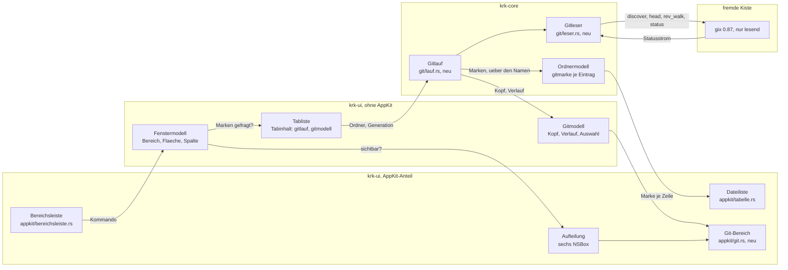
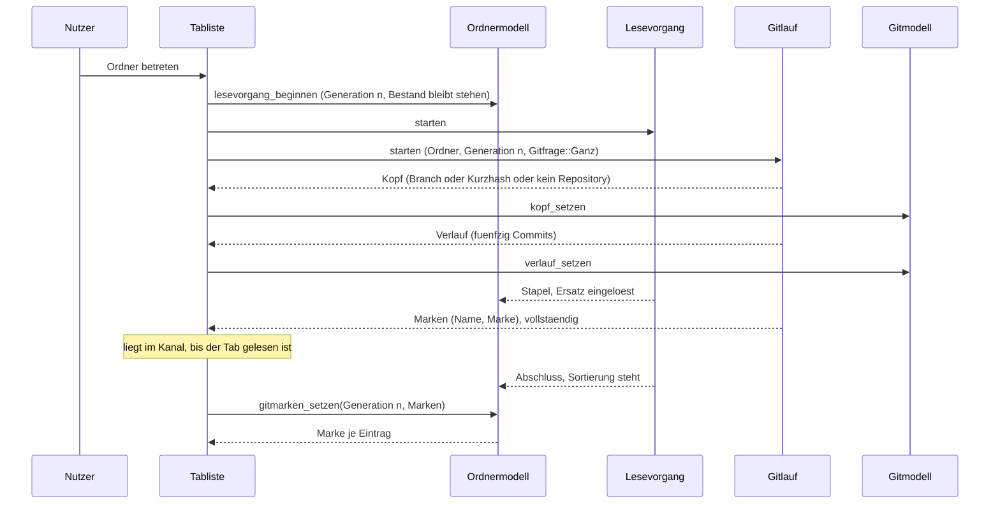
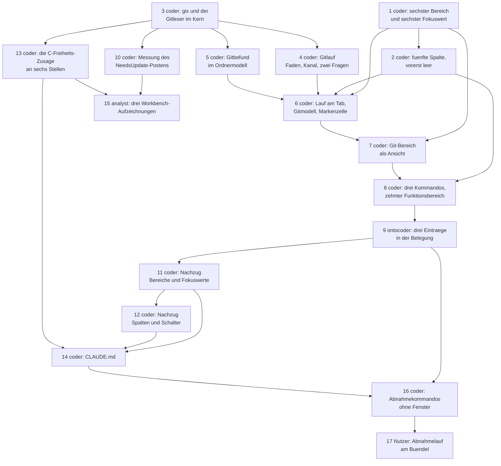

# Implementierungsplan: Der Git-Bereich liest Status, Branch und Verlauf (Stufe A)

**Date:** 2026-08-30
**Status:** Draft
**Spec:** `260830-1251_*_spec-git-bereich-liest-status-branch-verlauf.md`, vom Nutzer am 260830 unverändert freigegeben; A1 bis A14 gelten, E1 bis E13 stehen fest.
**Decidability:** Die tragende Frage lautet: *Welche Marke trägt dieser Eintrag, und gehört der eintreffende Befund noch zu dem Ordner, der jetzt dasteht?* Beide Hälften sind aus den Eingaben entscheidbar, die der Mechanismus hat. Die erste beantwortet der Statusstrom von `gix`, der je Eintrag genau einen der drei Fälle liefert und für einen unveränderten Eintrag gar nichts; die zweite beantwortet die Generation des Lesevorgangs, die der Lauf mitführt und die `Ordnermodell::generation` gegenhält — und sie ist hier tragend und nicht bloß Zierat, weil die Zuordnung über den **Namen** läuft und ein Name im neuen Ordner einen gleichnamigen Eintrag träfe, während der Eintragsindex des Filterbefunds am Bestandsende von selbst durchfällt. **Nicht entscheidbar ist, ob der angezeigte Befund noch der wahre Zustand des Repositorys ist.** Ein `git commit` in einem Terminal ändert nichts im angezeigten Unterordner, FSEvents meldet nichts, und KRK hat keine Eingabe, aus der es die Veralterung ableiten könnte. Der Spec hat den Mechanismus dafür schon gewechselt (A9): KRK sagt nicht zu, aktuell zu sein, sondern beantwortet die andere, entscheidbare Frage — *was stand hier, als dieser Ordner zuletzt gelesen wurde* —, und die offene Nutzerfrage nach einem Beobachter auf `.git` ist als Datensatz gefilt. Der Plan nähert an dieser Stelle nichts an.

**Zweite Entscheidbarkeitsfrage, und sie hat eine schlechtere Antwort als der Spec annimmt.** *Ist ein sechster Bereich vollständig eingetragen?* ist aus dem Bau **nicht** entscheidbar. Der Spec sagt in C1.1, vier Feldbreiten hielten den Bau an, sobald `Bereich::ALLE` gewachsen ist; eigenständig übersetzt gemessen hält genau **eine** von ihnen ihn an, und drei stürzen erst zur Laufzeit ab. Der Beleg steht unten unter `## Current State`, der Defekt ist gefilt. Der Mechanismus, den dieser Plan an die Stelle setzt, ist kein besserer Übersetzerlauf, sondern eine namentliche Aufzählung im Schritt 1 samt den Proben, die die drei stillen Stellen abdecken.

---

## Directive

Nach dieser Runde zeigt KRK den Git-Zustand des angezeigten Ordners, ohne ins Repository zu schreiben. Der Spec schreibt zehn Fähigkeiten mit 90 Abnahmekriterien aus, dreizehn Nutzerfestlegungen, vierzehn Spec-Festlegungen und neun bindende Bedingungen; dieser Plan wiederholt sie nicht, sondern ordnet jedem Kriterium eine Stelle im Baum oder im Abnahmelauf zu und beantwortet die neun technischen Fragen aus `## Open for Planner`.

Keine der zehn Zeitzusagen aus C8 der Runde 1 wird angefasst, und eine elfte entsteht nicht; der Spec begründet es unter `## Verhältnis zu den zehn Zeitzusagen`.

---

## Current State

**Der Risikopunkt liegt im eigenen Baum, und er ist größer als der Spec sagt.** Ich habe die vier Feldbreiten, die C1.1 als Sicherungsring nennt, in einem eigenständig übersetzten Programm nachgestellt: eine sechswertige Aufzählung, eine mitgewachsene `ALLE`-Liste von sechs Einträgen, und daneben die vier Bauformen, wie sie im Baum stehen. Ergebnis, gemessen am 260830-1300 mit `rustc` über `cargo build`, Kante 2024:

| Stelle | Bauform im Baum | was sie hält |
|---|---|---|
| `Bereichsleiste::bereichsschalter` (`bereichsleiste.rs:423`) | Feld `[_; 5]`, gebaut aus `Bereich::ALLE.map(…)` (`:466`) | **den Bau**: `expected an array with a size of 5, found one with a size of 6` |
| `Aufteilung::rahmen` (`aufteilung.rs:244`) | Feld `[_; 5]`, gebaut aus einem fünfgliedrigen Literal (`:275-281`) | nichts beim Bau; `index out of bounds` beim Start |
| `Aufteilung::gemessene_breiten` (`aufteilung.rs:352`) | `let mut breiten = [0.0; 5]`, gefüllt über `ALLE` | nichts beim Bau; `index out of bounds` zur Laufzeit |
| `Fenstermodell::breiten_uebernehmen` (`fenstermodell.rs:920`) | Parameter `[f64; 5]` | nichts; beide Seiten bleiben fünf |

Dazu `bereichsbreiten` (`fenstermodell.rs:1056`), das dieselbe Form wie `gemessene_breiten` trägt und in derselben Weise erst zur Laufzeit bricht. Der Unterschied zwischen der ersten Zeile und den übrigen ist die Bauform und nicht die Feldbreite: `ALLE.map` erzeugt ein Feld, dessen Länge aus der Aufzählung folgt, ein Literal und ein `[0.0; 5]` tun das nicht. Der Spec und der Datensatz `260830-1006_*_fuenf-prosastellen-behaupten-eine-feldbreite-halte-den-bau-an-…` sagen beide „die vier"; richtig ist eine. Für den Plan heißt das: **der Schritt 1 zählt die drei stillen Stellen namentlich auf und verlässt sich nicht auf die Fehlerliste des Übersetzers.** Ein Absturz beim Start ist laut und nicht still, aber er kommt erst, wenn jemand das Bündel startet, und kein Agent kann das.

**Die zweite stille Stelle ist `Fokus::ALLE`, und sie hat einen anderen Schnitt.** Die Liste trägt `#[cfg(test)]` und wird vom Programm nirgends mehr durchlaufen. Drei Proben binden sie über `const JEDER_FOKUS: [Fokus; 5] = Fokus::ALLE;` (`kommandos/fokus.rs:389`, `kommandos/zulaessigkeit.rs:505`, `kommandos/rundweg.rs:160`), und diese drei halten den **Probenbau** an, sobald die Liste auf sechs wächst. Was danach still bleibt, sind die beiden Tafeln: `TAFEL: [(Wirkungsbereich, [bool; 5]); 8]` (`fokus.rs:404`) und `OHNE_SPERRE: [[bool; 5]; 8]` (`zulaessigkeit.rs:670`) laufen über `JEDER_FOKUS.into_iter().zip(zeile)`, und `zip` bricht bei der kürzeren Seite ab. Eine sechswertige Liste gegen fünfspaltige Zeilen prüft fünf von sechs Werten und wird grün. Dasselbe gilt für `fokus::wirkt` (`:343`), dessen acht Zweige über `==` und `matches!` vergleichen und einen unbekannten Wert in „wirkt nicht" fallen lassen.

**Der Weg für den nebenläufigen Befund steht im Baum vor und ist vollständig.** `Durchlauf` (`krk-core/src/verzeichnis/durchlauf.rs:224`) hält ein Abbruchkennzeichen, einen `sync_channel` und einen Arbeitsfaden; `Tabinhalt.durchlauf` (`krk-ui/src/tabs.rs:58`) hält höchstens einen je Tab; `Tabliste::durchlauf_nachziehen_an` (`:878`) lässt den alten fallen und stößt unter vier Bedingungen einen neuen an; `einzug_je_tab` (`:1036`) räumt beide Kanäle in einem Takt leer; `Einzug` (`:353`) sagt der Ansicht, worauf sie wie zu antworten hat; und `DateifensterQuelle::einziehen` (`appkit/tabelle.rs:3473`) hält den `NSTimer` genau so lange, wie `Tabliste::arbeitet_noch` (`tabs.rs:811`) etwas zu tun meldet. Der Gitlauf tritt in genau diese Form ein und legt keine zweite daneben.

**Der Befundvektor des Filters darf dabei nicht mitbenutzt werden, und das ist im Modulkopf schon ausgeschrieben.** `Ordnermodell` (`verzeichnis/modell.rs`) führt `befund: Vec<Befund>` parallel zum Bestand, und der ganze Vektor fällt, sobald sich das Muster oder `inhalt_wirkt` ändert (`befund_zuruecksetzen`, gerufen von `filter_uebernehmen` und `schalter_setzen`). Die Gitfrage hat eine andere Ungültigkeitsregel: sie fällt beim Ordnerwechsel und nicht beim Tippen. Was `ersatz_einloesen` (`:441`) für Auswahl, Markierung und Befund tut — einen frischen `Arc` einsetzen und die drei Vektoren leeren —, ist genau der Anlass, an dem die Marken mitfallen.

**Das Ordnermodell leert seinen Bestand nicht vorab.** `lesevorgang_beginnen` (`:414`) setzt die Generation und merkt den Ersatz vor; wer in dieser Spanne den Bestand befragt, sieht den alten Ordner. Der Filterbefund kommt darüber hinweg, weil er einen Eintragsindex trägt und `befunde_setzen` (`:1140`) einen Index außerhalb des Bestands verwirft. Ein Name hat diesen natürlichen Schutz nicht — im neuen Ordner kann derselbe Name stehen —, und genau deshalb trägt der Gitbefund seine Generation mit.

**Die Auffrischung hat einen Pfad und zwei Auslöser.** `auffrischung::ordner_neu_lesen` (`auffrischung.rs:281`) ruft `sicht.neu_lesen(seite)` und mündet damit in `Tabliste::lesen_starten` (`tabs.rs:993`), das den Lesevorgang, den Durchlauf und dessen Zahl zurücksetzt. Ein Tabwechsel läuft **nicht** darüber: `Tabliste::waehlen` (`:526`) ruft `durchlauf_nachziehen_an` für die verlassene Stelle und liest einen schon gelesenen Tab nicht neu. Der Gitlauf braucht deshalb an denselben drei Stellen einen Nachzug, an denen der Durchlauf einen hat, und keine vierte daneben.

**Der Ersthelferbereich und die Fokusanzeige laufen bereits über `Bereich::ALLE`.** `Anwendungsdelegierter::bereich_des_ersthelfers` (`anwendung.rs:6192`) geht die Liste durch und fragt `isDescendantOf:` gegen `Aufteilung::bereichssicht`; `Aufteilung::rahmen_setzen` färbt über dieselbe Liste. Beide brauchen für den sechsten Bereich keine Zeile — sobald die Liste und der sechste `NSBox` stehen, tragen sie ihn.

**Die vier Bereiche mit eigenem Fokuswert tragen ihren Umschalter und ihren Fokusbefehl in ihrem eigenen `Funktionsbereich`.** `belegungsmodell::bereich` ordnet `VorschauUmschalten` und `FokusVorschau` zu `Vorschau`, `EditorUmschalten` und `FokusEditor` zu `Editor`, `LeisteUmschalten` und `FokusLeiste` zu `LeisteUndFokus`, jedes Mal mit demselben ausgeschriebenen Satz: die Gliederung fragt nach der Gegend der Anwendung, und wer die Vorschau sucht, sucht unter „Vorschau". Die drei Spaltenschalter stehen dagegen unter `Dateilisting`, weil sie bestimmen, was die Liste zeigt.

**`krk-ui` hat kein Bibliotheksziel.** Die Proben der Oberfläche stehen in `#[cfg(test)]`-Modulen neben dem Code; alles ohne Fenster Prüfbare gehört deshalb in den Kern, und der Gitleser gehört dorthin (E6, beantwortet am 260830).

---

## Approach

Der Plan setzt an vier Nähten an, die es gibt, und legt keine fünfte.

**Erstens wird der gegenseitige Ausschluss eine Äquivalenzklasse und keine Paarbeziehung.** `Bereich::teilt_flaeche_mit` liefert heute `Option<Bereich>` und kann drei Bewerber nicht ausdrücken; ein `Vec` oder eine Liste von Gegenübern könnte es, wäre aber nicht mehr von selbst symmetrisch, und die Probe `der_ausschluss_ist_gegenseitig` hält genau die Symmetrie fest. An seine Stelle tritt `Bereich::flaeche(self) -> Flaeche` mit vier Werten — `Lesezeichen`, `LinkesDateifenster`, `RechtesDateifenster`, `RechterRand` —, und „teilt sich die Fläche mit" heißt danach „trägt dieselbe `Flaeche` und ist nicht derselbe Bereich". Gleichheit ist symmetrisch und transitiv, also fällt die Symmetrie aus der Bauform an, statt von einer Probe bewacht zu werden, und ein vierter Bewerber um den rechten Rand kostet später eine Zeile statt einer Umschreibung. `gegenueber_raeumen` wird zu `mitbewerber_raeumen` und geht weiter durch `sichtbar_setzen`, den einen Schreiber.

**Zweitens tritt der Gitlauf in die Form des Durchlaufs ein, mit zwei Fragen an einer Maschine.** `Gitfrage::Ganz` liefert nacheinander drei Meldungen — den Kopf, den Verlauf und die Marken —, `Gitfrage::WeitererVerlauf` liefert nur die zweite. Das ist derselbe Schnitt, den `Auftragsart` im Durchlauf zieht, und aus demselben Grund: dieselbe Art Frage an dieselbe Art Gegenstand bekommt keine zweite Maschine. Die Reihenfolge der drei Meldungen ist die ihrer Kosten und zugleich die, die A8 verlangt: der Kopf steht nach unter einer Millisekunde, der Verlauf nach knapp vier, die Marken nach zwölf bis hundertvierundsechzig.

**Drittens wartet die Markenmeldung, bis der Bestand steht, und der Kanal ist der Warteraum.** Der Lauf beginnt zugleich mit dem Lesevorgang, damit Branch und Verlauf nicht auf einen Ordner mit hunderttausend Einträgen warten. Die Marken aber ordnen sich über den Namen zu, und ein Name findet im halb gelesenen Bestand seinen Eintrag nicht. Der Einzugstakt nimmt die Markenmeldung deshalb erst aus dem Kanal, wenn der Tab gelesen ist; bis dahin liegt sie dort, wo `mpsc` sie ohnehin hält. Zwei Zustände statt eines Puffers: entweder die Meldung ist noch im Kanal, oder sie ist eingetragen.

**Viertens gehört der Gitbefund dem Tab und nicht dem Bereich.** `Tabinhalt` bekommt neben `modell` ein `gitmodell` mit Kopf, Verlauf und Auswahl, und neben `durchlauf` ein `gitlauf`. Der Git-Bereich ist dann eine reine Anzeige des Gitmodells im sichtbaren Tab des aktiven Dateifensters, und C1.10 wie C3.9 fallen ohne eigene Zeile an: ein Fensterwechsel wechselt die Quelle, und der Bereich zeigt, was dort schon steht. Ein Gitmodell am Fenster statt am Tab hätte bei jedem Tabwechsel neu geholt werden müssen.



Der Graph hat genau einen Kreis, `Gitleser → gix → Gitleser`, und er ist Auftrag und Antwort und keine Verflechtung; dieselbe Form trägt der Durchlauf gegenüber dem Dateisystem seit der Runde 10. Die drei Pfeile, die aus `kern` herausführen — `Gitlauf → Gitmodell`, `Gitlauf → Ordnermodell` und `Ordnermodell → Tabelle` —, sind gelieferte Werte und keine Abhängigkeiten: der Gitlauf schickt seine Meldungen in einen Kanal, aus dem die Tabliste holt, und kennt keinen seiner beiden Empfänger; die Tabelle liest das Ordnermodell, das der Kern hält. Keine Zeile unter `crates/krk-core/` nennt einen Typ aus `krk-ui`.



---

## Die neun Entscheidungen aus `## Open for Planner`

### 1. Welche Form an die Stelle von `Bereich::teilt_flaeche_mit` tritt

**Eine Äquivalenzklasse: `Bereich::flaeche(self) -> Flaeche`.** Die Begründung steht unter `## Approach`; hier die Folgen. `Flaeche` trägt vier Werte und ist eine eigene Aufzählung in `fenstermodell.rs`, keine Zahl und kein `usize`: eine Zahl wäre eine zweite Stelle in der Fensterzeile neben `Bereich::index`, und die beiden liefen auseinander, sobald ein Bereich seine Stelle wechselt. `Bereich::flaeche` ist vollständig und ohne Auffangzweig, wie die übrigen Fallunterscheidungen über `Bereich`.

`teilt_flaeche_mit` fällt und wird durch zwei Stellen ersetzt, die beide über die Klasse rechnen: `Fenstermodell::mitbewerber_raeumen(bereich)` blendet jeden anderen Bereich derselben `Flaeche` aus und ruft dafür `sichtbar_setzen`, den einen Schreiber, einmal je Mitbewerber; `mindestbreiten_passen` filtert `Bereich::ALLE` auf „ist der genannte, oder trägt eine andere Fläche und ist sichtbar", statt `Some(*kandidat) != weicht` zu prüfen. Zwei Aufrufer weniger als heute gibt es nicht, und zwei mehr auch nicht.

`der_ausschluss_ist_gegenseitig` prüft danach die sechs geordneten Paare aus C1.4 ausdrücklich und dazu die Eigenschaft, aus der sie folgen: für je zwei verschiedene Bereiche ist „teilen sich die Fläche" symmetrisch, und die Menge der Paare, die sie teilen, ist genau `{Vorschau, Editor}`, `{Vorschau, Git}`, `{Editor, Git}`. Die Probe rechnet die Erwartung nicht aus `flaeche()`, sondern schreibt sie aus; eine gerechnete Erwartung wäre die Umsetzung ein zweites Mal.

Die zwei Doc-Kommentare in `angezeigtedatei.rs:32` und `:78`, die `teilt_flaeche_mit` namentlich nennen, ziehen im selben Schritt nach.

### 2. Wie `up` und `down` im Git-Bereich ankommen

**`Wirkungsbereich::Navigator` wächst um `Fokus::Git`; ein neunter Wirkungsbereich entsteht nicht.** Der Spec hat das in seinem Abschnitt `## Out of Scope` schon entschieden — „Ein neunter `Wirkungsbereich`" steht dort —, und C2.5 schreibt die Spalte aus: `true` bei `Ueberall` und bei `Navigator`, `false` bei den sechs übrigen. Der Weg ist damit eine Zeile in `fokus::wirkt`: `matches!(fokus, Fokus::Dateifenster | Fokus::Leiste | Fokus::Vorschau | Fokus::Git)`, weiterhin positiv aufgezählt und nicht als Verneinung des Editors, aus dem Grund, den der Kommentar dort schon trägt.

Zwei Prosastellen ziehen nach, und die zweite ist kein Kommentar, sondern Nutzerausgabe. Der Doc-Kommentar von `Wirkungsbereich::Navigator` (`krk-core/src/tasten/belegung.rs:274-292`) zählt die Bereiche der Runde 1 auf und bekommt den Git-Bereich dazu, samt dem Satz, warum: der Verlauf ist eine Liste mit einer Auswahl, und der Auf- und der Ab-Pfeil bewegen die Auswahl der Liste, vor der der Nutzer steht — dieselbe Regel, die Leiste und Vorschau schon tragen. Und `Wirkungsbereich::beschriftung` (`:361`) liefert für `Navigator` heute `"Dateifenster, Leiste und Vorschau"`; dieser Text steht in der dritten Spalte jeder Zeile von `make tasten` und in `docs/tastenbelegung.md`, die der Nutzer liest. Er wird zu `"Dateifenster, Leiste, Vorschau und Git-Bereich"`. Die Probe `keine_zwei_wirkungsbereiche_teilen_sich_eine_beschriftung` bleibt grün, und `make tasten` ändert seine Ausgabe an genau den Zeilen, deren Kommando `Navigator` trägt — das sind `fenster_wechseln`, `auswahl_hoch` und `auswahl_runter`, und der Diff aus Schritt 16 ist deshalb **nicht** leer und darf es nicht sein.

Beim Anwendungsdelegierten bekommt `bereichskommando` einen sechsten Zweig, `Fokus::Git => self.git().kommando_ausfuehren(kommando)`, gebaut wie der Zweig der Leiste: der Git-Bereich führt aus, was er kennt, und meldet für alles übrige `false`. Kein Tastendruck wird dabei an AppKit zurückgegeben; seit der Runde 7 schluckt der Abgriff jeden zulässigen Befehl.

### 3. Wie der Statusauftrag und sein Befund reisen

**Ein Arbeitsfaden je Lauf, ein `sync_channel`, ein Abbruchkennzeichen, ein `Drop`, der es setzt — die Bauform von `Durchlauf`, Zeile für Zeile.** `Gitlauf::starten(ordner: PathBuf, frage: Gitfrage, generation: u64) -> Self` in `krk-core/src/git/lauf.rs`; `Gitlauf::meldungen(&self) -> &Receiver<Gitmeldung>`; `Gitlauf::abbrechen(&self)`; `impl Drop` setzt ab.

**Der Kanal trägt drei Meldungsarten und keine zwei Vektoren.**

```rust
pub enum Gitmeldung {
    Kopf(Kopf),                     // Branch, abgeloest, ungeboren, kein Repository
    Verlauf(Vec<Commit>),           // fuenfzig, oder der Rest
    Marken(Vec<(String, Marke)>),   // der Status, vollstaendig, in einem Stueck
}
```

Die Tiefe des Kanals ist drei und nicht `STAPELGROESSE`: es gibt je Lauf höchstens drei Meldungen, und ein Faden, der nach der dritten blockierte, hat ohnehin nichts mehr zu tun. Der Unterschied zum Durchlauf gehört in den Modulkopf: dort ist die Tiefe eine Aussage über den Rückstau eines Stroms, hier über die Zahl der Antworten.

**Die Marken kommen in einem Stück und nicht Eintrag für Eintrag.** Zwei Gründe, und beide sind Zusagen des Specs. A8 verlangt, dass die Spalte leer bleibt, bis der Befund da ist — eine fortschreitend gefüllte Spalte wäre genau das Flackern, das der Entscheid zum leeren Ordner abgelehnt hat. Und die Zuordnung über den Namen braucht ein Nachschlagewerk über den Bestand; es je eintreffendem Schwung aufzubauen hieße, bei hunderttausend Einträgen mehrfach hunderttausend Namen zu hashen, auf dem Hauptfaden. Einmal je Lauf ist einmal.

**Die Auftragskennung ist die Generation des Lesevorgangs, und sie wird gegengehalten.** `Gitlauf` führt sie mit, `Tabliste` reicht sie an `Ordnermodell::gitmarken_setzen(generation, marken)` weiter, und das Modell weist alles ab, was nicht seine eigene Generation nennt oder eintrifft, während `ersatz_ausstehend` noch steht. Beim Durchlauf ist die Generation ausdrücklich **nicht** Teil der Meldung, und der Doc-Kommentar dort begründet es: jeder Tab hält seinen eigenen Lauf und liest allein aus dessen Kanal. Für den Gitlauf gilt derselbe Satz, und er genügt trotzdem nicht: dort trägt der Befund einen Eintragsindex, den `befunde_setzen` am Bestandsende von selbst verwirft, hier trägt er einen Namen, den der neue Ordner ebenso führen kann. Die Prüfung ist deshalb keine Doppelung der Kanalzusage, sondern der Ersatz für einen Schutz, den es hier nicht gibt. Der Doc-Kommentar sagt genau das.

**Die Fadenbenennung folgt dem Vorbild:** `krk-gitlauf-<generation>`.

### 4. Wo der Gitbefund im Ordnermodell wohnt

**Als `gitmarke: Vec<Option<Marke>>` parallel zu `eintraege`, in derselben Bauart wie `markiert`, `befund` und `grund`, und mit einer eigenen Ungültigkeitsregel, die die des Filters nirgends berührt.** Ein `Option` und kein sechster Markenwert für „unverändert": A11 sagt, dass ein Eintrag ohne Befund eine leere Zelle trägt, und `None` ist genau diese Aussage.

Die Berührungspunkte sind drei, und jeder ist eine Zeile:

- `anhaengen` hängt je Eintrag ein `None` an, wie es für `markiert`, `befund` und `grund` schon geschieht. Ohne diese Zeile liefe der Vektor kürzer als der Bestand, und `gitmarken_setzen` schriebe ins Leere.
- `ersatz_einloesen` leert ihn mit den drei anderen. Das ist die ganze Ungültigkeitsregel: der Gitbefund fällt mit dem Bestand, dem er gilt.
- `befund_zuruecksetzen` fasst ihn **nicht** an, und der Doc-Kommentar dort sagt warum. Damit ist C7.6 eingelöst: ein getipptes Zeichen wirft die Marken nicht weg.

`gitmarken_setzen(&mut self, generation: u64, marken: &[(String, Marke)])` baut einmal eine `HashMap<&str, u32>` über den Bestand, trägt die gefundenen Namen ein und liefert, ob etwas eingetragen wurde. **Es baut die Sicht nicht neu auf**, und das ist der eine Unterschied zu `befunde_setzen`: eine Marke entscheidet nicht, ob eine Zeile steht, sondern nur, was in einer ihrer Zellen steht. `sicht_neu_aufbauen` liefe über alle Einträge samt `sort_unstable_by` und ordnete die Liste für nichts. Die Ansicht antwortet stattdessen mit `reloadData` und **ohne** `auswahl_anzeigen`, weil die Sichtreihenfolge unverändert bleibt und die ausgewählte Zeile ihre Stelle behält. Der Doc-Kommentar nennt beide Unterschiede zu `befunde_setzen` ausdrücklich; nebeneinanderstehende Setzer, die sich in zwei Punkten unterscheiden, laufen sonst zusammen.

`Marke` selbst wohnt in `krk-core/src/git/` und nicht im Ordnermodell: sie ist eine Auskunft über ein Repository, und das Modell nimmt sie entgegen, wie es `Befund` entgegennimmt. Fünf Werte, vollständig, ohne Auffangzweig, mit `Marke::buchstabe(self) -> char` als reiner Funktion und einer Probe über alle fünf.

### 5. Wie die drei Flächen des Git-Bereichs gebaut sind

**Ein `Gitfenster` in `krk-ui/src/appkit/git.rs`, nach dem Muster von `Vorschaufenster`:** eine `define_class!`-Klasse mit einer Trägeransicht, die in die Aufteilung gehängt wird, `bauen(mtm)`, `sicht()`, `fokusansicht()` und einem Melder für den Rückweg.

Die drei Flächen stehen untereinander in der Trägeransicht, mit Autoresizing und ohne zweite `NSSplitView`: der Nutzer soll sie nicht gegeneinander verschieben, und ein Schieberegler im Bereich wäre ein Bedienelement, das der Spec nicht verlangt.

- **Kopf**: ein `NSTextField` als Etikett über zwei Zeilen, oben festgemacht, feste Höhe. Zeile eins trägt den Branchnamen, den Kurzhash mit dem Wort „abgelöst" oder den Satz aus A14; Zeile zwei die Zusammenfassung. Beide Texte kommen fertig aus dem Kern und werden hier nicht geformt.
- **Verlaufsliste**: eine `NSTableView` mit **einer** Spalte, ohne Kopfzeile, in einer `NSScrollView` — dieselbe Bauform wie die Lesezeichenleiste, und wie dort ohne eigene `keyDown:`-Methode. Sie ist die Fläche, die den Ersthelferrang nimmt. Die vier Angaben einer Zeile aus A5 stehen in **einer** Zelle als ein Text, den eine reine Funktion im Kern formt; vier `NSTableColumn` wären vier Breiten, die bei der Mindestbreite gegeneinander laufen.
- **Einzelheiten**: ein `NSTextField` als mehrzeiliges Etikett in einer `NSScrollView`, unten festgemacht, feste Höhe. Keine `NSTextView`: sie wäre eine dritte eigene Textfläche, und `Anwendungsdelegierter::ist_eigene_textflaeche` müsste dann entscheiden, ob sie sich anmeldet. Die Fläche ist nicht bedienbar, also stellt sich die Frage nicht — und dass sie sich nicht stellt, gehört in den Modulkopf, weil der nächste Leser sie stellen wird.

**Der Auslöser des Nachladens ist ein Melder und keine Kenntnis der Tabliste.** `Gitfenster::kommando_ausfuehren(kommando)` bewegt bei `AuswahlHoch` und `AuswahlRunter` die Auswahl der Liste; steht sie schon auf dem letzten Eintrag, meldet ein `down` über den `Nachlademelder` nach oben und bewegt nichts. Der Anwendungsdelegierte fängt die Meldung und ruft `self.dateifenster(aktiv).quelle().verlauf_nachladen()`, das einen `Gitlauf` mit `Gitfrage::WeitererVerlauf` startet. Damit bleibt der Bereich so unwissend über die Tabliste, wie die Lesezeichenleiste es über die Dateifenster ist, und der Ring Delegierter → Bereich → Rückruf → Delegierter hält den Delegierten schwach, wie die sechs vorhandenen Melder.

**Ist der Verlauf erschöpft, meldet nichts** (C4.3): der Kopf trägt, ob der letzte Lauf weniger als fünfzig geliefert hat, und der Melder feuert dann nicht.

### 6. Mindestbreite und Anfangsbreite des Git-Bereichs

**Mindestbreite 340, Anfangsbreite 420.**

Die Mindestbreite folgt aus der Verlaufszeile und nicht aus einem Gefühl. Sie trägt vier Angaben, und für drei davon steht im Baum schon eine gemessene Breite: die Spalte „Änderungsdatum" der Dateiliste steht mit 130 Punkten natürlich und 100 mindestens (`appkit/tabelle.rs:363`), und dieselbe Schrift trägt hier das Datum; der Kurzhash sind sieben Zeichen, der Autorname liegt in der Größenordnung eines Dateinamens. Bleiben rund hundert Punkte für die Kurzbeschreibung, unter denen die Zeile nichts mehr sagt. 340 ist die Summe, und sie liegt bewusst über den 320 des Editors: der Editor braucht vierzig Zeichen fester Schrift, die Verlaufszeile vier Angaben, von denen drei nicht kürzbar sind. Die Folge ist benannt und angenommen: in einem schmalen Fenster weist `Fenstermodell::umschalten` das Einblenden des Git-Bereichs eher ab als das des Editors, und das ist die Abweisung, die C1.11 schon kennt.

Die Anfangsbreite folgt der Anteilsregel wie die des Editors. Stehen Lesezeichen, beide Dateifenster und der Git-Bereich, wünschen sie zusammen 1440, und 420 davon sind 29 Prozent — dieselbe Größenordnung wie die 31 Prozent, mit denen der Editor aufgeht, und damit „rund ein Drittel der Fensterbreite". Die Zahl gilt nur beim allerersten Start; danach gilt die Breite des Nutzers, und sie steht in `session.toml`.

**Ob die Zeile bei 340 wirklich lesbar ist, sagt allein der Abnahmelauf.** Die Rechnung oben ist eine Ableitung aus gemessenen Spaltenbreiten und keine Messung der Zeile selbst; sie steht in der Risikotabelle mit ihrer Gegenmaßnahme.

### 7. Ob und wie die Fadenzahl von `gix` gedeckelt wird

**Sie wird in dieser Runde nicht gedeckelt, und die Stelle, an der es geschähe, trägt den Kommentar, warum nicht.**

Die Frage, wie viele Fäden richtig sind, ist aus den Eingaben, die der Mechanismus hat, nicht entscheidbar: sie hängt an der Kernzahl des Geräts, daran, wie viele Läufe gerade nebeneinander stehen — zwei Dateifenster können je einen halten, dazu zwei Durchläufe —, und daran, was sonst läuft. Eine Zahl an dieser Stelle wäre der Deckel, den niemand gemessen hat, und das ist dieselbe Reihenfolge verkehrt herum, die der Datensatz zum Rückschreiben des Index für den anderen Posten schon benannt hat.

Was **entscheidbar** ist, ist die Frage dahinter: nimmt der Statuslauf dem Hauptfaden Bilder weg? Sie beantwortet ein Abnahmelauf und nichts sonst, und sie steht als C7.2 im Spec, als Nutzerarbeit. Fällt sie negativ aus, ist `Platform::index_worktree_options_mut().thread_limit` der erste Griff und keine Umbaumaßnahme. Der Gitleser nennt die Stelle deshalb namentlich in seinem Modulkopf, mit dem Satz, dass sie der erste Hebel ist und heute keinen Wert setzt. Die Frage ist als Datensatz gefilt.

Gemessen ist der Deskriptorstand und nicht die Fadenzahl: der Lauf kommt unter `ulimit -n 32` in derselben Zeit durch, und sein Höchststand liegt im niedrigen zweistelligen Bereich. Das deckt C7.9 und sagt über die Fäden nichts.

### 8. Die stellengenaue Erhebung für `belegungsausgabe.rs`, `belegungsmodell.rs` und `messmodus.rs`

Die Machbarkeitsanalyse hat die drei nur summarisch berührt, weil sie einen neunten `Wirkungsbereich` unterstellte. Ohne ihn ist die Last kleiner, und sie ist nicht null. Erhoben am 260830 über den Stand `2059138`:

**`belegungsausgabe.rs`: keine Codezeile, zwei Prosastellen, eine unvermeidliche Diffänderung.** Die dritte Spalte liest `kommando.wirkungsbereich().beschriftung()` (`:265`) und ist über `Wirkungsbereich` total; ein Kommando mehr fällt in die erste Begründungslage und braucht keine Zeile. Die Probe `die_dritte_spalte_haelt_die_vier_begruendungslagen_auseinander` (`:743`) hält `mit_kommando` gegen `Kommando::KENNUNGEN.len()` und geht mit drei neuen Kommandos von selbst auf, sobald sie in der Auslieferungsbelegung stehen — genau deshalb ist die Reihenfolge von Schritt 8 und Schritt 9 bindend. Die Probe `ab Werk ist jeder Bereich besetzt, also stehen alle neun in ihrer Reihenfolge` (`:641`) wird mit dem zehnten `Funktionsbereich` rot und zieht auf zehn nach; ein `Funktionsbereich` ohne besetzte Funktion erzeugte keinen Abschnitt, und deshalb muss der zehnte Wert zusammen mit seinen Kommandos landen und nicht davor. **Und der Doc-Kommentar `:234-235` sagt „die sieben Beschriftungen von `Wirkungsbereich`", während der Baum acht trägt** — eine Zählaussage, die schon heute falsch ist, die diese Runde nicht falsch macht und die das Erhebungsmuster aus C9.4 nicht findet. Sie ist als Defekt gefilt und gehört in den Nachzug von Schritt 11.

**`belegungsmodell.rs`: zwei Codestellen.** `bereich` (`:226-410`) ist ein vollständiges `match` über `Kommando` ohne Auffangzweig — der Übersetzer verlangt für jedes der drei neuen Kommandos eine Zeile. Und `Funktionsbereich` (`:101-139`) wächst um `Git`; dazu gehören `Funktionsbereich::name` und die Reihenfolge der Aufzählung, die die Reihenfolge der Obermenüs ist. Der neue Wert steht unmittelbar hinter `Editor`: die drei Bereiche am rechten Rand des Fensters stehen damit im Menü in derselben Folge wie in der Fensterzeile. Ob der Git-Bereich überhaupt einen eigenen `Funktionsbereich` bekommt, ist eine Nutzerfrage, weil sie ein zehntes Obermenü sichtbar macht und die Befehle der Runde 24 mitbindet; sie ist als Datensatz gefilt, und der Plan fährt bis dahin auf dem zehnten Wert, weil die Regel, die dieses Modul dreimal ausschreibt, ihn verlangt.

**`messmodus.rs`: keine Codezeile, und der Grund, den der Spec dafür angibt, stimmt nicht.** Der Spec sagt, „beide Schalter stehen ab Werk so, dass die Strecke sie nicht anfasst"; A13 stellt die Markenspalte ab Werk auf **ein**, und die Messstrecke läuft ohnehin gegen die `session.toml` des Nutzers und nicht gegen den Auslieferungszustand. Was die Messung wirklich schützt, ist der Ort des Messplatzes: er liegt unter `~/Library/Caches/krk-messplatz`, und dort liegt bis zur Wurzel kein `.git`. `gix::discover` antwortet dort in 21 bis 82 Mikrosekunden mit „kein Repository", es entsteht kein Lauf, und die zehn Zusagen sehen von dieser Runde nichts. Das ist eine prüfbare Aussage und keine Annahme: Schritt 16 hält sie mit `git -C ~/Library/Caches/krk-messplatz rev-parse --show-toplevel`, das nichts liefern darf. Der Widerspruch zum Spec ist als Defekt gefilt. Die drei Prosastellen in `messmodus.rs`, die einen Wirkungsbereich nennen (`:95`, `:104`, `:1905`), sprechen von `Navigator` als „schließt den Editor aus" und bleiben wahr; der Git-Bereich ändert daran nichts.

### 9. Wie die 92 Stellen aus C9.4 aufgeteilt werden

**In zwei eigene Schritte, geschnitten nach der Aussage und nicht nach der Datei, dazu ein dritter für CLAUDE.md und ein vierter für die C-Freiheits-Zusage.** Ein Wartungsschritt, der am Ende eines Handlungsschritts mitläuft, ist die Form, die in diesem Projekt schon ausgefallen ist; deshalb hat keiner der Schritte 1 bis 10 eine Zeile Prosanachzug in seinem Auftrag, außer für die Datei, die er selbst anlegt.

Die Erhebung, am 260830 über den Stand `2059138` mit dem Muster aus C9.4 gefahren, liefert **92 Treffer in 21 Dateien**, und sie zerfällt sauber in zwei Hälften, weil die beiden Aussagen keine Datei ernsthaft teilen:

| Hälfte | Aussage | Dateien |
|---|---|---|
| Bereiche und Fokuswerte (Schritt 11) | fünf Bereiche, sechster Bereich, fünf Fokuswerte, vier fokussierbare | `fenstermodell.rs`, `appkit/anwendung.rs`, `appkit/aufteilung.rs`, `kommandos/fokus.rs`, `appkit/fenster.rs`, `kommandos/rundweg.rs`, `appkit/teilen.rs`, `appkit/statuszeile.rs`, `fenstertitel.rs`, `main.rs`, `appkit/titelzusatz.rs`, `appkit/mod.rs`, `appkit/leiste.rs`, `kommandos/zulaessigkeit.rs`, `tabs.rs`, `ablage/sitzung.rs` |
| Spalten und Schalter (Schritt 12) | vier Spalten, fünfte Spalte, zehn Ankreuzfelder, neun Schalter | `spalten.rs`, `appkit/tabelle.rs`, `appkit/bereichsleiste.rs`, `ablage/sitzung.rs`, `kommandos/loeschwarnung.rs` |

`ablage/sitzung.rs` und `appkit/bereichsleiste.rs` tragen beide Aussagen; die zwei Schritte fassen dieselbe Datei an verschiedenen Stellen an und laufen deshalb nacheinander und nicht nebeneinander. `CLAUDE.md` steht in beiden Erhebungen und bekommt trotzdem einen eigenen Schritt (14), weil dort außer der Zählaussage die Rundentabelle und mehrere Absätze nachzuziehen sind und weil die Datei die normative Fläche des Projekts ist.

**Wo eine Zahl mit der nächsten Runde wieder falsch würde, tritt eine Erhebungsvorschrift an ihre Stelle**, wie CLAUDE.md es für `Kommando`, `Wirkungsbereich` und `Art` schon hält. Das betrifft vor allem die Zahl der Ankreuzfelder in der Bereichsleiste, die seit der Runde 5 viermal gewachsen ist: statt „zwölf Ankreuzfelder" steht dort danach, wie sie sich zusammensetzen — je einer je Bereich, je einer je schaltbarer Spalte, dazu die zwei Sucheinstellungen — und der Befehl, der sie zählt. Die Zahl der Bereiche und der Fokuswerte darf dagegen als Zahl stehen bleiben: sie wächst nicht mit jeder Runde, sie ist an `Bereich::ALLE` und `Fokus::ALLE` gebunden, und die Prosa dort erklärt eine Bauform und keine Menge.

**Die Erhebung wird vor dem Zählen wiederholt und mit erweitertem Muster.** Die dritte Bedingung aus `## Stops when` verlangt es, und der Fall ist schon eingetreten: `belegungsausgabe.rs:234-235` trägt eine falsche Zählaussage über `Wirkungsbereich`, die das Muster nicht findet. Schritt 11 erweitert das Muster deshalb zuerst um die Wortformen, die dieselbe Sorte Aussage in anderer Gestalt tragen — `sieben Beschriftungen`, `acht Wirkungsbereiche`, `vier fokussierbaren`, `fuenf Kaesten`, `fuenf Rahmen`, `fuenf Teilbaeume`, `fuenf Werte`, `fuenf Bereichen` —, fährt sie erneut und zählt danach. Die neue Zahl steht im History-Eintrag des Schritts und nicht in diesem Plan.

---

## Implementation Steps

Jeder Schritt nennt genau einen Executor. Schritt 17 ist der einzige außerhalb der Executor-Menge: der Abnahmelauf am laufenden Bündel verlangt KRK im Vordergrund und ist Nutzerarbeit (`260806-1303_*_wie-kommt-krk-fuer-den-abnahmelauf-in-den-vordergrund.md`, offen). **Jeder Schritt trägt `#[must_use]` an jedem neuen Rückgabewert, dessen stilles Fallenlassen unbemerkt bliebe** (C8.9); Schritt 16 prüft es als ganzes. `make check` gilt am Ende von Schritt 16 und nicht je Schritt (`260820-0602_*_make-check-prueft-den-ganzen-arbeitsbereich-und-bricht-bei-parallelen-agenten-an-fremden-dateien-ab.md`).

1. **Der sechste Bereich und der sechste Fokuswert** [DONE]
   - Executor: `coder`
   - Files: `crates/krk-ui/src/fenstermodell.rs`, `crates/krk-ui/src/kommandos/fokus.rs`, `crates/krk-ui/src/kommandos/zulaessigkeit.rs`, `crates/krk-ui/src/kommandos/rundweg.rs`, `crates/krk-ui/src/fenstertitel.rs`, `crates/krk-ui/src/appkit/aufteilung.rs`, `crates/krk-ui/src/appkit/bereichsleiste.rs`, `crates/krk-ui/src/appkit/teilen.rs`, `crates/krk-ui/src/appkit/anwendung.rs`, `crates/krk-ui/src/angezeigtedatei.rs`, `crates/krk-core/src/ablage/sitzung.rs`
   - Changes: **Zuerst die zwei Listen, und in dieser Reihenfolge.** `Bereich::Git` als sechster Wert hinter `Editor` (A1) und `Bereich::ALLE` auf `[Bereich; 6]`; danach `Fokus::Git` als sechster Wert und `Fokus::ALLE` auf `[Fokus; 6]`. Beide zusammen in einem Schritt, weil `fokus::in_bereich` einen `Bereich` auf einen `Fokus` abbildet und ohne den sechsten Fokuswert keine Antwort für den sechsten Bereich hat. Danach nennt der Übersetzer die Stellen, die er hält, und die sind: `Bereich::index`, `seite`, `mindestbreite` (340), `anfangsbreite` (420), `beschriftung` („Git"), `langname` („Git-Bereich"), `sichtbar_in`, `breite_in`, `Fenstermodell::sichtbar_setzen`, `breite_setzen`, `fokus::in_bereich`, `holt_hervor`, `bereich_mit_fokus`, `bereichsleiste::kommando_des_bereichs`, `teilen::worauf`, `fenstertitel::titel`, `Anwendungsdelegierter::fokusansicht`, `bereichskommando`, `tab_schliessen` und das Feld `Bereichsleiste::bereichsschalter`. Die Antworten: `flaeche` für Git ist `Flaeche::RechterRand`, `seite` ist `None`, `teilen::worauf` ist `Quelle::Nichts` wie bei der Leiste (ein Commit ist kein Eintrag, den ein Freigabedienst annähme), `fenstertitel` liefert den aktiven Ordner wie bei der Leiste (der Bereich zeigt dessen Zustand und hat keinen eigenen Pfad), `tab_schliessen` reiht Git zu Leiste, Editor und Anderswo (der Bereich hat keine Tabs), `fokusansicht` und `bereichskommando` bekommen ihren Zweig erst in Schritt 8, wenn es ein `Gitfenster` gibt — bis dahin `None` beziehungsweise `false` mit einem Kommentar, der auf Schritt 8 zeigt.
     **`Bereich::teilt_flaeche_mit` fällt und `Bereich::flaeche(self) -> Flaeche` tritt an seine Stelle**, mit der Aufzählung `Flaeche { Lesezeichen, LinkesDateifenster, RechtesDateifenster, RechterRand }` daneben; `gegenueber_raeumen` wird zu `mitbewerber_raeumen` und blendet jeden anderen Bereich derselben Fläche über `sichtbar_setzen` aus; `mindestbreiten_passen` filtert über die Fläche statt über das Gegenüber. Der Doc-Kommentar trägt die Begründung aus Entscheidung 1. Die zwei Verweise in `angezeigtedatei.rs:32` und `:78` ziehen nach.
     **Die drei stillen Stellen werden namentlich angefasst, weil der Übersetzer sie nicht nennt** (siehe `## Current State`): `Aufteilung::rahmen` auf `[Retained<NSBox>; 6]` samt dem sechsten `gerahmt(mtm, git)` im Literal und dem neuen Parameter von `Aufteilung::bauen`; `Aufteilung::gemessene_breiten` auf `[f64; 6]` samt `[0.0; 6]`; `bereichsbreiten` auf `[f64; 6]` samt `[0.0_f64; 6]`; `Fenstermodell::breiten_uebernehmen` auf `[f64; 6]`. Der Doc-Kommentar an jeder der vier sagt danach, was sie hält und was nicht — das ist zugleich die Hälfte von C9.8, die in diesen Dateien liegt, und sie steht hier und nicht im Nachzugsschritt, weil der Schritt die Zeilen ohnehin anfasst und eine Behauptung, die er stehen ließe, mit seinem eigenen Diff falsch würde.
     **`fokus::wirkt` bekommt `Fokus::Git` ausdrücklich in jedem Zweig, in dem er gilt** (C2.10): `Ueberall` trägt ihn ohnehin, `Navigator` wird zu `matches!(fokus, Fokus::Dateifenster | Fokus::Leiste | Fokus::Vorschau | Fokus::Git)`, die sechs übrigen bleiben, wie sie sind, und tragen ihn damit nicht. Der Doc-Kommentar von `Wirkungsbereich::Navigator` (`krk-core/src/tasten/belegung.rs:274`) und `Wirkungsbereich::beschriftung` für `Navigator` ziehen nach (Entscheidung 2).
     **Die beiden Tafeln bekommen ihre sechste Spalte von Hand** (C2.5, C2.6), weil `zip` eine fehlende Spalte still übergeht: `TAFEL: [(Wirkungsbereich, [bool; 6]); 8]` in `fokus.rs` mit der Spalte aus C2.5, `OHNE_SPERRE: [[bool; 6]; 8]` in `zulaessigkeit.rs` mit derselben. Beide Proben bekommen dazu die Zusicherung, dass jede Zeile so viele Spalten hat, wie `Fokus::ALLE` Werte führt — `assert_eq!(zeile.len(), Fokus::ALLE.len())` je Zeile —, damit die nächste Runde nicht wieder auf `zip` trifft.
     `Sichtbarkeit` und `Breiten` (`krk-core/src/ablage/sitzung.rs:182`, `:228`) bekommen je ein Feld `git` an sechster und letzter Stelle (A1); `Sichtbarkeit::default` setzt es auf `false` (A13, C1.8), `Breiten` bleibt bei `Option<f64>` und `None`.
     Proben: `der_ausschluss_ist_gegenseitig` prüft die sechs geordneten Paare und die Symmetrie über alle Paare (C1.4, C1.5); `Sichtbarkeit::default` trägt Git auf `false` (C1.8); `bereichsbreiten` rechnet mit und ohne Git und lässt die übrigen Breiten beim Ein- und Ausblenden gleich (C1.11); `umschalten` weist weiterhin das Ausblenden des letzten Dateifensters ab (C1.9); eine `session.toml` ohne `git`-Feld bleibt lesbar und lässt den Bereich ausgeblendet, die Probe neben den bestehenden in `crates/krk-core/tests/ablage.rs` (C1.7); `fenstertitel` liefert für `Fokus::Git` den aktiven Ordner (C2.3, Probenhälfte); die Tafelproben (C2.5, C2.6, C2.7 Zulässigkeitshälfte, C2.8, C2.9, C2.10).
   - Kriterien: C1.1, C1.3 (Bauhälfte), C1.4, C1.5, C1.6 (Bauhälfte), C1.7, C1.8, C1.9, C1.11, C2.1, C2.3 (Probenhälfte), C2.4 (Bauhälfte), C2.5, C2.6, C2.7 (Probenhälfte), C2.8 (Probenhälfte), C2.9 (Probenhälfte), C2.10, C2.12, C9.8 (die Hälfte in den angefassten Dateien), Bedingung 1, Bedingung 4
   - Dependencies: keine

2. **Die fünfte Spalte, und sie bleibt vorerst leer** [DONE]
   - Executor: `coder`
   - Files: `crates/krk-ui/src/spalten.rs`, `crates/krk-ui/src/fenstermodell.rs`, `crates/krk-ui/src/appkit/tabelle.rs`, `crates/krk-ui/src/appkit/bereichsleiste.rs`, `crates/krk-core/src/ablage/sitzung.rs`
   - Changes: `Spalte::Marke` als fünfter Wert hinter `Typ` und `Spalte::ALLE` auf `[Spalte; 5]` (E3, C5.1); damit hält der Übersetzer die sieben Stellen, die der Modulkopf von `spalten.rs` aufzählt, und sie bekommen ihre Antworten: `kennung` `"marke"`, `titel` „Marke", `beschriftung` „Marke", `breiten` (60.0, 45.0) — die Überschrift setzt das Mindestmaß, nicht der eine Buchstabe —, `ausrichtung` `Left`, `beschreibbar` `false`, `beschriften` liefert vorerst die leere Zeichenkette. `spalte_sichtbar_in` (`fenstermodell.rs`) bekommt seinen Zweig, `Spaltensichtbarkeit` ein viertes Feld `marke` mit `true` ab Werk (A13, C5.10), `bereichsleiste::kommando_der_spalte` liefert `Some(Kommando::SpalteMarkeUmschalten)` — das Kommando entsteht in Schritt 8, bis dahin steht hier die Variante, die Schritt 8 anlegt, und dieser Schritt läuft deshalb **nach** Schritt 8? Nein: die Reihenfolge bleibt, wie sie hier steht, und Schritt 8 legt die Variante an; **dieser Schritt lässt `kommando_der_spalte` für `Marke` deshalb zunächst auf `None` und die Zahl der Spaltenschalter bei drei**, und Schritt 8 zieht beides zusammen mit dem Kommando nach. So bleibt Bedingung 1 gewahrt und kein Schritt hängt an einem Typ, den es noch nicht gibt.
     **Die leere Zelle ist kein Platzhalter, sondern das Zielverhalten des einen von zwei Fällen**: E5 und C6.3 verlangen für einen Ordner ohne Repository dauerhaft genau das. Schritt 6 fügt den zweiten Fall hinzu.
     **`Bereichsleiste::spaltenschalter` und `Vec::with_capacity(3)` bleiben bei drei**, solange `kommando_der_spalte` für `Marke` `None` liefert; die Zählprobe `genau_drei_spalten_sind_schaltbar` bleibt grün. Der Schritt schreibt in ihren Doc-Kommentar, dass Schritt 8 sie auf vier hebt und dass die `try_into`-Umwandlung dort **zur Laufzeit** und nicht beim Bau bricht — eine `expect` beim Start ist laut, aber kein Übersetzerfehler.
     `Schluessel` wird nicht angefasst (A12, C5.8); der Schritt prüft es mit `awk '/pub enum Schluessel/,/^}/'` vor und nach seiner Arbeit und schreibt das Ergebnis in seinen History-Eintrag.
     Proben: `jede_spalte_hat_eine_eigene_beschriftung` und `genau_die_namensspalte_ist_beschreibbar` bleiben grün und decken `Marke` mit ab; eine `session.toml` ohne `marke`-Feld bleibt lesbar und lässt die Spalte stehen (C5.9); `Spaltensichtbarkeit::default` trägt `marke` auf `true` (C5.10).
   - Kriterien: C5.1, C5.2, C5.8, C5.9, C5.10, C6.3 (Bauhälfte), Bedingung 1
   - Dependencies: Schritt 1 (`bereichsleiste.rs` und `fenstermodell.rs` werden von beiden angefasst)

3. **`gix` als Abhängigkeit und der Gitleser im Kern** [DONE]
   - Executor: `coder`
   - Files: `Cargo.toml`, `crates/krk-core/Cargo.toml`, `crates/krk-core/src/lib.rs`, `crates/krk-core/src/git/mod.rs` (neu), `crates/krk-core/src/git/leser.rs` (neu), `crates/krk-core/src/git/texte.rs` (neu), `crates/krk-core/tests/git.rs` (neu)
   - Changes: `gix` in die Wurzel-`Cargo.toml` mit `default-features = false` und den Merkmalen `status`, `revision`, `max-performance-safe`, `parallel`, `sha1`, auf eine kleine Fassung festgenagelt (`"0.87"`, nicht `"0"`) (C8.2); die Begründung daneben, wie bei jeder fremden Kiste dieses Projekts, mit der Merkmalswahl, den 98 zusätzlichen Paketen auf dem Bauziel, der Fassungskadenz von vierzehn kleinen Fassungen in zehn Monaten und dem Befund zu `cc` und `-sys` (C8.3). `krk-core/Cargo.toml` nimmt sie auf, `lib.rs` das Modul; der Workspace bleibt bei vier Mitgliedern (C8.1).
     `git/leser.rs` trägt die vier Auskünfte als **synchrone** Funktionen über einem gehaltenen `Repository`: `oeffnen(ordner) -> Option<Gitleser>` über `gix::discover` (C6.5, C3.10), `kopf() -> Kopf`, `verlauf(ab: Option<ObjectId>, zahl: usize) -> Vec<Commit>`, `marken() -> Vec<(String, Marke)>` über `Repository::status(…).into_iter(muster)` mit dem aus dem angezeigten Ordner gegen `Repository::workdir()` gerechneten Pfadmuster (C7.7). `Kopf` ist eine vierwertige Aufzählung — `Branch(String)`, `Abgeloest(String)`, `OhneCommit(String)`, `KeinRepository` —, vollständig und ohne Auffangzweig; sie trennt insbesondere den ungeborenen HEAD, bei dem `head_name()` liefert und `head_id()` mit `Unborn` scheitert (A7, C3.6, C3.7). `Marke` mit fünf Werten und `buchstabe()` (E11, C5.3). `EntryStatus::NeedsUpdate` wird gelesen und verworfen; `Outcome::write_changes` wird nicht gerufen (E8, C3.8, C10.3), und der Modulkopf sagt es mit dem Verweis auf den offenen Datensatz.
     Der Modulkopf trägt daneben: `bail_if_untrusted` bleibt auf seiner Voreinstellung `false`, damit ein fremdes Repository gelesen und nicht abgewiesen wird (C6.7); `Platform::index_worktree_options_mut().thread_limit` wird **nicht** gesetzt, und warum (Entscheidung 7); ein Deskriptormangel von außen lässt den Befund unentschieden, nach dem Muster von `verzeichnis::sys::ist_deskriptormangel` (C7.8).
     `git/texte.rs` trägt die reinen Funktionen mit ihren Proben: der Satz aus A14 für die drei Lagen, die Zusammenfassung aus A3 (je Markenzustand die Zahl, Zustände mit null weggelassen, der Zusatz „in diesem Ordner", sonst `unverändert`), die Kopfzeile aus A6 und die Verlaufszeile aus A5.
     Proben in `crates/krk-core/tests/git.rs`, sämtlich gegen angelegte Prüfrepositorys über die Fassung des selbstabräumenden Prüfordners aus `crates/krk-core/tests/gemeinsam/mod.rs`; eine vierte Fassung entsteht nicht (C8.6, Bedingung 9). Geprüft werden: der Branchname (C3.1, Probenhälfte); der abgelöste HEAD (C3.6); das Repository ohne Commit (C3.7); der Unterordner eines Repositorys mit auf ihn beschränkter Zusammenfassung (C3.10); fünfzig Commits beim ersten Aufruf (C4.1); ein Repository mit drei Commits liefert drei und meldet, dass nichts mehr folgt (C4.5); die fünf Markenzustände an je einem Eintrag gegen die erwartete Zuordnung von Name auf Buchstabe (C5.3, Probenhälfte); der negative Fall von `discover` (C6.5); der Deskriptormangel unter `ulimit -n 64` als Kindprobe, weil `cargo test` sonst die angehobene Grenze der Sitzung erbt (C7.8, C7.9).
     `#![deny(unsafe_code)]` bleibt an der Wurzel von `krk-core`, das Gitmodul trägt kein `#![allow(unsafe_code)]` (C8.5).
   - Kriterien: C3.1 (Probenhälfte), C3.2 (Textfunktion), C3.3 (Zeilenform), C3.6, C3.7, C3.8, C3.10, C4.1, C4.5, C5.3 (Probenhälfte), C6.1 (Textfunktion), C6.5, C6.7 (Bauhälfte), C7.7, C7.8, C7.9, C8.1, C8.2, C8.3, C8.5, C8.6, C10.3 (Bauhälfte), Bedingung 2, Bedingung 9
   - Dependencies: keine

4. **Der Gitlauf: ein Faden, ein Kanal, zwei Fragen** [DONE]
   - Executor: `coder`
   - Files: `crates/krk-core/src/git/lauf.rs` (neu), `crates/krk-core/src/git/mod.rs`, `crates/krk-core/tests/git.rs`
   - Changes: `Gitlauf` nach der Bauform von `Durchlauf`: `starten(ordner, frage, generation)`, `meldungen() -> &Receiver<Gitmeldung>`, `abbrechen()`, `impl Drop`, Faden `krk-gitlauf-<n>`, `sync_channel(3)`. `Gitfrage { Ganz, WeitererVerlauf { ab: ObjectId } }` und `Gitmeldung { Kopf, Verlauf, Marken }`, beide vollständig und ohne Auffangzweig. Der Faden ruft die Funktionen aus Schritt 3 in der Reihenfolge Kopf, Verlauf, Marken und prüft das Abbruchkennzeichen vor jeder der drei; ein abgebrochener Lauf meldet nichts mehr, und der geschlossene Kanal ohne Markenmeldung heißt „nicht entschieden" und nicht „keine Marken", genau wie beim Durchlauf. Der Modulkopf schreibt die Unterschiede zum Durchlauf aus: die Kanaltiefe ist die Zahl der Antworten und kein Rückstaumaß, und die Marken kommen in einem Stück, aus den zwei Gründen in Entscheidung 3.
     Proben: der Lauf über ein Prüfrepository liefert genau drei Meldungen in dieser Reihenfolge; `Gitfrage::WeitererVerlauf` liefert genau eine; ein Lauf, dessen `Gitlauf` fällt, meldet nichts mehr; ein Ordner ohne Repository liefert `Kopf::KeinRepository` und danach nichts (C6.1, Laufhälfte). **Keine Statusabfrage steht auf dem Hauptfaden** (C7.1): geprüft daran, dass der einzige öffentliche Weg in `git/leser.rs` von außerhalb dieses Moduls der Kanal ist, mit einer Zählprobe über `quellbaum::aufrufstellen` auf `Gitleser::marken(` außerhalb von `git/`.
   - Kriterien: C4.2 (die zweite Frage), C4.3 (Nachladeregel), C6.1 (Laufhälfte), C7.1, Bedingung 3
   - Dependencies: Schritt 3

5. **Der Gitbefund im Ordnermodell**
   - Executor: `coder`
   - Files: `crates/krk-core/src/verzeichnis/modell.rs`
   - Changes: `gitmarke: Vec<Option<Marke>>` parallel zu `eintraege`, in der Bauart von `markiert`, `befund` und `grund`; `anhaengen` hängt je Eintrag ein `None` an, `ersatz_einloesen` leert ihn mit den drei anderen, `befund_zuruecksetzen` fasst ihn nicht an. `#[must_use] pub fn gitmarken_setzen(&mut self, generation: u64, marken: &[(String, Marke)]) -> bool` weist ab, solange `generation != self.generation` oder `ersatz_ausstehend` steht, baut sonst einmal eine `HashMap<&str, u32>` über den Bestand, trägt ein und liefert, ob etwas eingetragen wurde; **sie baut die Sicht nicht neu auf**, und der Doc-Kommentar nennt beide Unterschiede zu `befunde_setzen` (Entscheidung 4). `pub fn gitmarke(&self, eintragsindex: u32) -> Option<Marke>` als Leseseite. Der Modulkopf bekommt einen Abschnitt `# Zwei Befundvektoren, zwei Ungültigkeitsregeln`, der ausschreibt, dass der Filterbefund mit der Frage fällt und die Marke mit dem Bestand.
     Proben: ein Befund mit fremder Generation schreibt nichts (C7.5); ein Befund, der eintrifft, während `lesevorgang_beginnen` den Ersatz noch vorgemerkt hat, schreibt nichts in den alten Bestand (C7.4); ein Ordnerwechsel wirft beide Vektoren weg, ein Tippen im Filter allein den des Filters (C7.6); ein Name, den der Bestand nicht führt, wird verworfen, ohne die übrigen zu verhindern; die fünf Buchstaben stehen an den fünf Einträgen und ein unveränderter trägt `None` (C5.3, Modellhälfte, A11).
   - Kriterien: C5.3 (Modellhälfte), C7.4, C7.5, C7.6, Bedingung 5
   - Dependencies: Schritt 3

6. **Der Lauf am Tab, das Gitmodell und die gefüllte Markenzelle**
   - Executor: `coder`
   - Files: `crates/krk-ui/src/tabs.rs`, `crates/krk-ui/src/gitmodell.rs` (neu), `crates/krk-ui/src/main.rs`, `crates/krk-ui/src/appkit/tabelle.rs`
   - Changes: `Tabinhalt` bekommt `gitlauf: Option<Gitlauf>` und `gitmodell: Gitmodell`; `Tabliste` bekommt `git_gefragt: bool` mit Setzer und `letzter_gitlauf: u64`. `gitmodell.rs` hält ohne AppKit, was der Bereich zeigt: den `Kopf`, den Verlauf als `Vec<Commit>`, die Auswahl als Index, ob der Verlauf erschöpft ist, und die Textformen aus Schritt 3 als Leseseite.
     `Tabliste::gitlauf_nachziehen_an(stelle)` nach dem Vorbild von `durchlauf_nachziehen_an`, mit drei Bedingungen: der Tab ist der sichtbare, der Gitbefund ist gefragt (Bereich oder Spalte steht), und der Ordner steht. **Die dritte ist schwächer als beim Durchlauf, und das ist der Kern:** der Lauf braucht nur den Pfad, nicht den gelesenen Bestand, und beginnt deshalb zugleich mit dem Lesevorgang in `lesen_starten` — sonst wartete der Branch in einem Ordner mit hunderttausend Einträgen vier Sekunden. `lesen_starten` setzt `gitlauf`, `gitmodell` und die Nachladehöhe zurück (C4.6) und stößt den neuen Lauf an; `waehlen` ruft den Nachzug für die verlassene und die neue Stelle, wie es ihn für den Durchlauf ruft. Ein vierter Weg entsteht nicht (A9, C7.10), und zwei Läufe für dasselbe Dateifenster stehen nie nebeneinander, weil das Feld den alten fallen lässt (A10, C7.11).
     `einzug_je_tab` bekommt den dritten Kanal: `Kopf` und `Verlauf` gehen sofort ins Gitmodell, die `Marken`-Meldung wird **erst aus dem Kanal genommen, wenn `tab.gelesen && !tab.liest()`** — bis dahin liegt sie dort, und der Takt lässt sie liegen (Entscheidung 3). `Einzug` bekommt `gitkopf_neu` und `gitmarken_neu`; `arbeitet_noch` zählt den dritten Kanal mit, sonst hielte der Takt an, während der Statuslauf noch unterwegs ist. `Tabliste::verlauf_nachladen()` startet einen Lauf mit `Gitfrage::WeitererVerlauf` ab dem letzten gehaltenen Commit.
     In `appkit/tabelle.rs`: `beschriften(Spalte::Marke, …)` liefert den Buchstaben aus `Ordnermodell::gitmarke` oder die leere Zeichenkette (C5.3, C5.11); die Zelle nimmt dieselbe Auszeichnung wie die vier anderen und fügt kein drittes Kennzeichen neben Farbe und Schrift hinzu (C5.11). Der Einzugstakt antwortet auf `gitmarken_neu` mit `reloadData` und **ohne** `auswahl_anzeigen`, mit dem Grund im Kommentar: die Sichtreihenfolge bleibt, die ausgewählte Zeile behält ihre Stelle.
     Proben: ein Ordnerwechsel setzt den Verlauf auf die ersten fünfzig zurück (C4.6); zwei schnell aufeinanderfolgende Ordnerwechsel lassen nie zwei Läufe stehen (C7.11); ein verspäteter Befund schreibt nichts in den neuen Ordner (C7.5, Tabhälfte); die Ruferliste des Gitlaufs nennt genau die Auslöser aus A9 und keinen weiteren, über `quellbaum::aufrufstellen` auf `Gitlauf::starten(` (C7.10).
   - Kriterien: C4.6, C5.3 (Zellenhälfte), C5.11 (Bauhälfte), C6.3 (Verhaltenshälfte), C7.3 (Bauhälfte), C7.10, C7.11
   - Dependencies: Schritte 1, 2, 4, 5

7. **Der Git-Bereich als Ansicht**
   - Executor: `coder`
   - Files: `crates/krk-ui/src/appkit/git.rs` (neu), `crates/krk-ui/src/appkit/mod.rs`, `crates/krk-ui/src/appkit/aufteilung.rs`
   - Changes: `Gitfenster` nach dem Muster von `Vorschaufenster`, mit den drei Flächen aus Entscheidung 5: Kopf als `NSTextField`-Etikett, Verlaufsliste als einspaltige `NSTableView` ohne Kopfzeile in einer `NSScrollView`, Einzelheiten als mehrzeiliges Etikett in einer `NSScrollView`. `bauen(mtm)`, `sicht()`, `fokusansicht()` (die Verlaufsliste), `zeigen(&Gitmodell)` als der eine Schreiber der drei Flächen, `kommando_ausfuehren(kommando)` für `AuswahlHoch` und `AuswahlRunter`, `nachlademelder_setzen`. Ohne Auswahl bleibt die Fläche der Einzelheiten leer und es steht kein Platzhaltertext (C3.5); während des Nachladens erscheint keine Platzhalterzeile und kein Fortschrittsanzeiger (C4.4); der Bereich blendet sich nie selbst aus, und keine Zeile dieser Datei ruft `sichtbar_setzen` (C6.4). Keine Meldung geht in die Statuszeile, kein Hinweisfenster, nichts auf die Standardfehlerausgabe (C6.6).
     `Aufteilung::bauen` nimmt die Ansicht als sechsten Parameter und rahmt sie wie die fünf anderen; damit trägt der Bereich seinen `NSBox` und die Rahmenregel aus C9 der Runde 2 färbt ihn über `rahmenrolle` mit (C1.6), und `bereich_des_ersthelfers` findet ihn über `Bereich::ALLE` (C2.4).
     Der Modulkopf trägt den Abschnitt `# Ab welchem macOS die angesprochenen Klassen stehen` mit jeder angesprochenen Klasse und Methode und ihrer Untergrenze aus dem SDK, und keine liegt über macOS 15 (C9.9, Bedingung 8). Er trägt daneben den Satz, warum die Fläche der Einzelheiten kein `NSTextView` ist und deshalb nicht bei `ist_eigene_textflaeche` angemeldet wird.
   - Kriterien: C1.6 (Rahmen), C2.4 (Ansichtshälfte), C3.4 (Bauhälfte), C3.5 (Bauhälfte), C4.2 (Auslöser), C4.4 (Bauhälfte), C6.4, C6.6 (Bauhälfte), C9.9
   - Dependencies: Schritte 1, 6

8. **Die drei Kommandos, der zehnte Funktionsbereich und die Einhängung**
   - Executor: `coder`
   - Files: `crates/krk-core/src/tasten/belegung.rs`, `crates/krk-ui/src/belegungsmodell.rs`, `crates/krk-ui/src/appkit/anwendung.rs`, `crates/krk-ui/src/appkit/bereichsleiste.rs`, `crates/krk-ui/src/spalten.rs`
   - Changes: Drei neue `Kommando`-Varianten — `GitBereichUmschalten`, `FokusGit`, `SpalteMarkeUmschalten` — mit ihren **drei Pflichtstellen** je Kommando: `Kommando::wirkungsbereich` (alle drei `Ueberall`, wie die fünf Umschalter und die vier Fokusbefehle), `belegungsmodell::bereich` und `Kommando::KENNUNGEN` (`"git_bereich_umschalten"`, `"fokus_git"`, `"spalte_marke_umschalten"`). Die dritte hält der Übersetzer nicht; sie hält `jede_variante_von_kommando_steht_genau_einmal_in_kennungen` (C5.7).
     `Funktionsbereich::Git` als zehnter Wert unmittelbar hinter `Editor`, mit `name` „Git" (Entscheidung 8); `GitBereichUmschalten` und `FokusGit` ordnen sich ihm zu, `SpalteMarkeUmschalten` dem `Dateilisting` bei den drei Spaltenschaltern (C5.6). Die Probe in `belegungsausgabe.rs:641` zieht von neun auf zehn nach.
     Beim Anwendungsdelegierten: `Kommando::GitBereichUmschalten => self.bereich_umschalten(Bereich::Git)`, `Kommando::FokusGit => self.fokus_holen(Fokus::Git)`, `Kommando::SpalteMarkeUmschalten => self.spalte_umschalten(Spalte::Marke)`; `fokusansicht` liefert für `Fokus::Git` die Verlaufsliste, `bereichskommando` bekommt seinen sechsten Zweig (Entscheidung 2), `tab_schliessen` bleibt, wie Schritt 1 ihn gesetzt hat. Neu: `gitbedarf_nachziehen`, das aus `sichtbar(Bereich::Git) || spalte_sichtbar_in(&spalten, Spalte::Marke)` einen Wahrheitswert rechnet und ihn an beide `DateifensterQuelle` gibt, die daraufhin ihren Gitlauf nachziehen; gerufen aus `aufteilung_nachziehen` (deckt das Umschalten des Bereichs und den Wechsel des aktiven Dateifensters ab) und aus `spaltenanzeige_nachziehen` (deckt das Umschalten der Spalte ab), also aus den zwei Nachzügen, die es schon gibt, und aus keinem dritten. Und `gitanzeige_nachziehen`, das `Gitfenster::zeigen` mit dem Gitmodell des sichtbaren Tabs im aktiven Dateifenster ruft — der eine Schreiber der drei Flächen, mit denselben Anlässen wie `bereichsleiste_nachziehen` (C1.10, C3.9).
     `bereichsleiste::kommando_der_spalte` liefert für `Marke` jetzt `Some(Kommando::SpalteMarkeUmschalten)`; damit wächst die Reihung auf vier, und `spaltenschalter: [Retained<NSButton>; 4]`, `Vec::with_capacity(4)`, der `expect`-Text und die Zählprobe `genau_drei_spalten_sind_schaltbar` ziehen zusammen nach (C5.5). **Die Umwandlung bricht zur Laufzeit und nicht beim Bau**, und der Doc-Kommentar sagt es.
     `kommandos::zulaessigkeit::immer_erreichbar` wächst **nicht**; die Probe `waehrend_eines_blattes_kommen_genau_diese_vier_durch` bleibt bei vier und bekommt die Zeile, dass die zwei neuen Befehle bei stehendem Blatt abgewiesen werden (C2.11).
     **Zwischen diesem Schritt und Schritt 9 ist `jede_kennung_der_kommandos_steht_in_der_auslieferungsbelegung` rot**, und das ist die Reihenfolge und keine Panne: die Belegung kennt die drei Kennungen erst nach Schritt 9. Wer beide in einem Zug baut, sieht sie nie rot.
   - Kriterien: C1.2 (Bauhälfte), C1.10 (Nachzug), C2.2 (Bauhälfte), C2.7 (Route), C2.11, C2.12 (Sperre), C3.9 (Nachzug), C5.5 (Bauhälfte), C5.6 (Bauhälfte), C5.7, C6.2 (Bauhälfte)
   - Dependencies: Schritte 2, 7

9. **Die drei Einträge in der Auslieferungsbelegung**
   - Executor: `ontocoder`
   - Files: `resources/default-keymap.toml`
   - Changes: Drei `[[funktion]]`-Blöcke. `git_bereich_umschalten` mit `name = "Git-Bereich ein- und ausblenden"` und `tasten = ["opt+cmd+r"]`, eingeordnet bei den übrigen Bereichsumschaltern, mit dem Kommentar, warum der Buchstabe `r` („Repository") und dass er zur Umschaltfamilie `opt+cmd+<Buchstabe>` gehört (E10). `fokus_git` mit `name = "Fokus in den Git-Bereich"` und `tasten = ["shift+cmd+b"]`, eingeordnet bei den vier vorhandenen Fokusbefehlen, mit dem Kommentar, warum `b` („Branch") und dass er zur Fokusfamilie `shift+cmd+<Buchstabe>` gehört, und mit dem Hinweis, dass der Buchstabe hier **nicht** vom Umschalter geerbt wird, anders als bei Leiste, Dateifenster und Vorschau — `shift+cmd+r` ist die naheliegende Form und der Nutzer hat `b` gewählt (E10). `spalte_marke_umschalten` mit `name = "Spalte Marke ein- und ausblenden"` und `tasten = []`, unmittelbar hinter `spalte_typ_umschalten`.
     Vor dem Schreiben ist zu prüfen, dass keine der beiden Kombinationen schon belegt ist: `grep 'tasten = ' resources/default-keymap.toml` nennt sie am 260830 nicht, und der Schritt wiederholt die Prüfung an seinem eigenen Stand. Ein Doppeleintrag hielte den Bau nicht an; die Belegungsprüfung meldet ihn.
     Nach diesem Schritt ist `jede_kennung_der_kommandos_steht_in_der_auslieferungsbelegung` wieder grün.
   - Kriterien: C1.2 (Belegungshälfte), C2.2 (Belegungshälfte), C5.6 (Belegungshälfte)
   - Dependencies: Schritt 8

10. **Die Messung des ungemessenen Postens**
    - Executor: `coder`
    - Files: `messungen/260830-<hhmm>-needsupdate.txt` (neu), gegebenenfalls ein Prüfprogramm unter `crates/krk-bench/`
    - Changes: Derselbe Baum mit frisch angefassten Zeitstempeln, einmal ohne und einmal mit Rückschreiben, je drei Durchgänge, auf dem Referenzgerät im Profil `release`. Der Bericht nennt das Gerät, das Profil und die Zahl der Einträge, wie die bestehenden Berichte unter `messungen/` es tun (C10.1). **Gebaut wird der Schreibweg nicht**: der Vergleichslauf mit `write_changes` läuft in einem Wegwerf-Repository außerhalb des Projektbaums und nicht über einen Weg, der im ausgelieferten Bündel steht; `grep -rn 'write_changes' crates/` liefert danach keine Fundstelle (C10.3, C3.8).
      **Findet die Messung, dass der nicht zurückgeschriebene Index bei jedem Ordnerwechsel mehr kostet als die synchrone Statusabfrage selbst, hält die Runde vor dem Abschluss an** und legt dem Nutzer die drei Möglichkeiten des Datensatzes erneut vor; das ist die zweite Bedingung aus `## Stops when`, und dieser Schritt ist die Stelle, an der sie greift.
    - Kriterien: C10.1, C10.3, C3.8 (Prüfhälfte)
    - Dependencies: Schritt 3

11. **Der Nachzug: die Zählaussagen über Bereiche und Fokuswerte**
    - Executor: `coder`
    - Files: die sechzehn Dateien der ersten Hälfte aus Entscheidung 9, dazu `crates/krk-ui/src/belegungsausgabe.rs`
    - Changes: **Zuerst das Muster erweitern, dann erheben, dann zählen** — die dritte Bedingung aus `## Stops when`, und der Anlass ist gefunden: `belegungsausgabe.rs:234-235` sagt „die sieben Beschriftungen von `Wirkungsbereich`", der Baum trägt acht, und das Muster aus C9.4 findet die Stelle nicht. Ergänzt werden mindestens `sieben Beschriftungen`, `acht Wirkungsbereiche`, `vier fokussierbaren`, `fuenf Kaesten`, `fuenf Rahmen`, `fuenf Teilbaeume`, `fuenf Werten`, `fuenf Bereichen`, `sechs Bereiche`. Die neue Zahl steht im History-Eintrag.
      Jede Fundstelle wird gelesen und einzeln entschieden. Namentlich: der Modulkopf von `appkit/bereichsleiste.rs` sagt nicht mehr „`Fokus` bekommt deshalb keinen sechsten Wert, sondern der Fall wird ausgeschlossen", sondern warum die Leiste keinen Fokuswert bekommt, während der Git-Bereich einen hat — die Leiste liegt in keinem der Teilbäume, die `ersthelferbereich` durchgeht, der Git-Bereich liegt in einem (C9.5). Der Modulkopf von `appkit/statuszeile.rs:48`, `appkit/fenster.rs:353-354`, `appkit/anwendung.rs:1287-1288` und `appkit/titelzusatz.rs:34` sagen nicht mehr, eine Zeile in der `NSSplitView` wäre „ein sechster Bereich" beziehungsweise „`Bereich` wie `Fokus` bleiben bei fünf Werten"; sie sagen danach dasselbe über den siebten (C9.6). Die fünf Stellen aus `260830-1006_*_fuenf-prosastellen-behaupten-eine-feldbreite-halte-den-bau-an-…` und die sechste mit der schwächeren Formulierung behaupten keine Sicherung durch die Feldbreite mehr, sondern sagen, was tatsächlich hält — **und was der Plan dazu gemessen hat**: `ALLE.map` hält den Bau, ein Literal und ein `[0.0; N]` halten ihn nicht (C9.8). Der Defekt schließt mit diesem Schritt; die offene Nutzerfrage nach der Bauform bleibt unberührt.
      Wo eine Zahl mit der nächsten Runde wieder falsch würde, tritt eine Erhebungsvorschrift an ihre Stelle; wo sie an `Bereich::ALLE` oder `Fokus::ALLE` gebunden ist, steht die neue Zahl.
    - Kriterien: C9.4 (erste Hälfte), C9.5, C9.6, C9.8
    - Dependencies: Schritt 9

12. **Der Nachzug: die Zählaussagen über Spalten und Schalter**
    - Executor: `coder`
    - Files: `crates/krk-ui/src/spalten.rs`, `crates/krk-ui/src/appkit/tabelle.rs`, `crates/krk-ui/src/appkit/bereichsleiste.rs`, `crates/krk-core/src/ablage/sitzung.rs`, `crates/krk-ui/src/kommandos/loeschwarnung.rs`
    - Changes: Dieselbe Arbeit für die zweite Hälfte. Namentlich: der Modulkopf von `spalten.rs` nennt `Spalte::ALLE` als die Stelle, die der Übersetzer **nicht** hält, neben den sieben, die er hält; der heutige Kopf zählt die sieben auf und lässt die eine aus, die entscheidet, ob die Spalte überhaupt erscheint (C9.7). Die Zahl der Ankreuzfelder in der Bereichsleiste tritt hinter eine Erhebungsvorschrift zurück: sie ist seit der Runde 5 viermal gewachsen, und die nächste Spalte oder der nächste Bereich macht sie wieder falsch. Der Doc-Kommentar an `Bereichsleiste::spaltenschalter` sagt, dass die Umwandlung zur Laufzeit bricht und nicht beim Bau.
    - Kriterien: C9.4 (zweite Hälfte), C9.7
    - Dependencies: Schritt 11

13. **Die C-Freiheits-Zusage an ihren sechs Stellen**
    - Executor: `coder`
    - Files: `Cargo.toml`, `CLAUDE.md`, `crates/krk-core/src/verzeichnis/sys.rs`
    - Changes: Die sechs Stellen aus dem Defekt `issues/260830-1106_*_der-entscheid-zur-c-freiheits-zusage-nennt-fuenf-prosastellen-im-baum-stehen-sechs.md` — `Cargo.toml:91-95`, `:150-153`, `:274-275`, `:352-356`, `CLAUDE.md:87` und `crates/krk-core/src/verzeichnis/sys.rs:66` — tragen danach die neugefasste Form aus E7: auf den beiden Mac-Zielen kommt weder `cc` noch ein Paket mit einem Namen auf `-sys` im Baum an; `Cargo.lock` führt daneben `windows-sys` und `linux-raw-sys`, beide an fremden Zielen. Prüfmittel ist `cargo tree --target <ziel> -e normal,build` und nicht mehr ein `grep` über `Cargo.lock` (C9.1). **Keine der sechs Stellen nennt danach eine Zahl der Prosastellen**; an ihre Stelle tritt die Erhebungsvorschrift, die der Defekt ausschreibt, und der Schritt prüft, dass das dortige `grep` läuft und seine Treffer mit der Aufzählung übereinstimmen (C9.2). Die sechste Stelle, `sys.rs:66`, behauptet den Rang „erstes `-sys`-Paket neben `windows-sys`" für eine künftige Zeitkiste; sie sagt danach, dass der Rang mit dieser Runde an `linux-raw-sys` gefallen ist und dass die Frage ohnehin am Bauziel und nicht in `Cargo.lock` entschieden wird. Der Defekt schließt mit diesem Schritt und mit Schritt 15 zusammen.
    - Kriterien: C9.1, C9.2
    - Dependencies: Schritt 3

14. **CLAUDE.md: die Runde 23 und die Absätze, die sie falsch macht**
    - Executor: `coder`
    - Files: `CLAUDE.md`
    - Changes: Die Rundentabelle bekommt die Zeile 23 mit dem Circle-Verzeichnis und dem Gegenstand. Die Absätze, die diese Runde falsch macht, ziehen nach; welche das sind, sagt die Erhebung aus Schritt 11 und keine Aufzählung an dieser Stelle (C9.10). Zu erwarten sind mindestens: der Absatz zu `syntect`, `two-face` und `zip` bekommt `gix` mit seiner Merkmalsbegründung; der Absatz über die gewachsenen Aufzählungen nennt `Bereich`, `Fokus` und `Spalte` mit ihrer neuen Zahl oder mit ihrem Zählbefehl; der Absatz über den Ereignisabgriff und die zwei eigenen Textflächen bleibt bei zwei, weil der Git-Bereich keine dritte anmeldet, und sagt es; der Absatz über die Ablage bleibt unberührt, weil diese Runde keine achte Ablagedatei anlegt. Die C-Freiheits-Zeile hat Schritt 13 schon gesetzt und wird hier nicht ein zweites Mal angefasst.
    - Kriterien: C9.10
    - Dependencies: Schritte 11, 12, 13

15. **Die drei Workbench-Aufzeichnungen tragen ihren Nachtrag**
    - Executor: `analyst`
    - Files: `260830-1006_*_wie-lautet-die-c-freiheits-zusage-…`, `260830-0950-orchestrator-session.md`, `260830-1006_*_darf-stufe-a-den-aufgefrischten-index-zurueckschreiben-…`
    - Changes: Die Zahl „fünf Prosastellen" in den ersten beiden wird durch einen **Nachtrag** berichtigt und nicht durch Überschreiben; beide Aufzeichnungen behalten ihren Stand nach der Ortsregel, und der Nachtrag nennt die sechs Stellen oder die Erhebungsvorschrift (C9.3). Damit schließt der Defekt aus C9.1. Der dritte Datensatz trägt danach die in Schritt 10 gemessene Zahl; er bekommt seine Antwort **nicht** von diesem Schritt, sondern bleibt mit dem gemessenen Posten in der Wiedervorlage offen, und der Marker bleibt `_o_` (C10.2). Welches von beiden — Antwort oder Wiedervorlage — entscheidet der Nutzer und kein Planschritt.
    - Kriterien: C9.3, C10.2
    - Dependencies: Schritte 10, 13

16. **Die Abnahmekommandos ohne Fenster**
    - Executor: `coder`
    - Files: keine im Baum
    - Changes: `make check` als ganzes, also `cargo build --workspace`, `cargo test --workspace`, `cargo clippy --workspace --all-targets` unter `-D warnings` und `cargo fmt --all --check` (C8.7). `cargo xtask bundle` baut und signiert unverändert (C8.8). `cargo tree --target x86_64-apple-darwin -e normal,build` und derselbe Lauf gegen `aarch64-apple-darwin` führen weder `cc` noch ein Paket mit einem Namen auf `-sys`; **beide Läufe sind das Prüfmittel der neugefassten Zusage und stehen namentlich in der Abnahme** (C8.4). Findet einer von beiden doch einen Treffer, hält die Runde an und die Bibliothekswahl geht an den Nutzer zurück — die erste Bedingung aus `## Stops when`.
      Dazu: `grep -rn 'write_changes' crates/` ohne Fundstelle und `grep -rn 'NeedsUpdate' crates/` mit der Lesestelle und keiner Schreibstelle (C3.8, C10.3); `grep -rn 'eprintln!' crates/krk-ui/src` ohne neue Fundstelle (C6.6); `grep -rn 'sichtbar_setzen' crates/krk-ui/src` mit einer Ruferliste ohne Gitweg (C6.4); `awk '/pub enum Schluessel/,/^}/'` mit vier Werten wie vor der Runde (C5.8); `grep -oE '"L[0-9]+"' crates/krk-bench/src/messen.rs | sort -u` mit derselben Menge wie vor der Runde; `grep -rn '^\s*#\[must_use' crates/*/src` mit einer Zahl, die gegenüber dem Stand vor der Runde gewachsen ist, und eine Durchsicht der neuen Rückgabewerte (C8.9); `git -C ~/Library/Caches/krk-messplatz rev-parse --show-toplevel` ohne Ausgabe, als Beleg dafür, dass die Messstrecke in keinem Repository läuft (Entscheidung 8).
      `make tasten` und `make menue` werden vor der ersten Codeänderung und danach in je zwei Dateien geschrieben und verglichen. **Der Diff ist diesmal nicht leer, und er darf es nicht sein**: drei neue Funktionen kommen dazu, ein zehntes Obermenü, und die dritte Spalte der Zeilen `fenster_wechseln`, `auswahl_hoch` und `auswahl_runter` wechselt von „Dateifenster, Leiste und Vorschau" auf „Dateifenster, Leiste, Vorschau und Git-Bereich". Jede weitere Abweichung ist ein Befund und gehört in den History-Eintrag.
    - Kriterien: C3.8 (Prüfhälfte), C5.8 (Prüfhälfte), C6.4 (Prüfhälfte), C6.6 (Prüfhälfte), C8.4, C8.7, C8.8, C8.9, C10.3 (Prüfhälfte)
    - Dependencies: Schritte 9, 14

17. **Der Abnahmelauf am laufenden Bündel**
    - Executor: Nutzer (kein Agent; siehe die Vorbemerkung zu dieser Liste)
    - Files: keine; geprüft wird am gebauten `target/KRK.app`
    - Changes: `cargo xtask bundle` bauen und KRK aus einem Terminalfenster im Vordergrund starten. Die 25 Kriterien, die der Spec namentlich als Nutzerarbeit führt, als Prüfliste:
      **Der Bereich und sein Schalter** — C1.2 (`opt+cmd+r` und der Menüeintrag blenden ein und aus), C1.3 (der sechste Bereichsschalter heißt „Git" und steht bei den Bereichsschaltern), C1.6 (der Fokusrahmen färbt nach den drei Rollen), C1.10 (zwei Ordner aus zwei verschiedenen Repositorys nebeneinander; der Fensterwechsel stellt den Bereich um).
      **Der Fokus** — C2.2 (`shift+cmd+b` holt den Fokus und blendet den Bereich dabei ein), C2.4 (ein Mausklick in die Verlaufsliste setzt den Fokus), C2.7 (`up` und `down` bewegen die Auswahl in der Verlaufsliste und nicht im Dateifenster), C2.8 (`tab` wechselt das aktive Dateifenster).
      **Was der Bereich zeigt** — C3.1 (der Branchname), C3.3 (die vier Angaben je Zeile, die Kurzbeschreibung vorn und mit dem übrigen Platz), C3.4 (Nachricht, Autor mit E-Mail, Datum, voller Hash), C3.5 (ohne Auswahl bleibt die Fläche leer), C3.9 (der Ordner des aktiven Dateifensters).
      **Das Nachladen** — C4.2 (`down` am letzten Eintrag lädt fünfzig nach, die Auswahl bleibt stehen, die Liste springt nicht), C4.4 (keine Platzhalterzeile, kein Fortschrittsanzeiger).
      **Die Spalte** — C5.4 (zwei Ordner aus zwei Repositorys zeigen zwei verschiedene Markensätze), C5.5 (das vierte Spaltenfeld heißt „Marke" und steht bei den Spaltenschaltern), C5.11 (der Buchstabe bleibt in einer markierten Zeile lesbar).
      **Der Ordner ohne Repository** — C6.1 (der Satz und die unveränderte Breite), C6.2 (das Ankreuzfeld bleibt eingeschaltet und wirkt nicht, beim Wechsel hin und zurück), C6.3 (die Spalte steht und bleibt leer, keine Breite ändert sich, die Liste bricht nicht um), C6.6 (keine Meldung in der Statuszeile, kein Hinweisfenster), C6.7 (ein Repository unter einem fremden Heimatverzeichnis oder auf einer Wechselplatte wird gelesen).
      **Die Nebenläufigkeit** — C7.2 (die erste Bildschirmseite steht nicht später da als vor der Runde), C7.3 (in einem großen Repository ist die Spanne sichtbar: Branch und Verlauf stehen, die Marken kommen nach).
      Dazu, als Auskunft und ohne Abnahmerang: ob die Verlaufszeile bei der Mindestbreite von 340 Punkten noch lesbar ist (Entscheidung 6, Risikotabelle), und ob der Statuslauf in einem großen Repository dem Zeichendurchgang Bilder wegnimmt (Entscheidung 7). Beide gehören in das Turn log des Circle-Datensatzes.
    - Kriterien: C1.2, C1.3, C1.6, C1.10, C2.2, C2.4, C2.7, C2.8, C3.1, C3.3, C3.4, C3.5, C3.9, C4.2, C4.4, C5.4, C5.5, C5.11, C6.1, C6.2, C6.3, C6.6, C6.7, C7.2, C7.3
    - Dependencies: Schritt 16



Die Schritte 1 und 3 beginnen nebeneinander; 3 zieht 4, 5, 10 und 13 nach sich, 1 zieht 2 nach sich, und 6 ist die Naht, an der beide Stränge zusammenlaufen. Von 8 an läuft ein Hauptstrang 8 → 9 → 11 → 12 → 14 → 16 → 17, weil die Erhebung von 11 den Stand nach 9 braucht und 12 dieselben zwei Dateien anfasst wie 11. Zwei Schritte hängen daneben und nicht darin: 10 misst und braucht allein den Kern aus 3, und **15 fasst Workbench-Aufzeichnungen an und keine Datei im Baum** — beide können neben dem Hauptstrang laufen, sobald ihre Vorbedingung steht.

---

## Where this Circle stops

- Alle siebzehn Schritte dieses Plans stehen auf `[DONE]`, und jede behauptete Erledigung ist einzeln gegen den Baum gelesen; der Abgleich liegt unter `history/` dieses Circles.
- `make check` läuft grün, also `cargo build --workspace`, `cargo test --workspace`, `cargo clippy --workspace --all-targets` unter `-D warnings` und `cargo fmt --all --check`.
- Jedes der 90 Abnahmekriterien des Specs hat eine benannte Stelle in einem Schritt oder in der Prüfliste von Schritt 17, und keines steht ohne Zuordnung da.
- `cargo tree --target x86_64-apple-darwin -e normal,build` und derselbe Lauf gegen `aarch64-apple-darwin` führen weder `cc` noch ein Paket mit einem Namen auf `-sys`. **Findet einer von beiden einen, ist die Runde angehalten und die Bibliothekswahl liegt wieder beim Nutzer**; das ist die erste Bedingung aus `## Stops when` und keine Klausel, die ein Agent für erfüllt erklären darf.
- Der Messbericht aus Schritt 10 liegt unter `messungen/` und beziffert den Posten. Zeigt er, dass der nicht zurückgeschriebene Index bei jedem Ordnerwechsel mehr kostet als die synchrone Statusabfrage selbst, ist die Runde vor dem Abschluss angehalten und die drei Möglichkeiten des Datensatzes liegen dem Nutzer erneut vor. (Bedingung kann nicht eintreten, wenn die Messung sie nicht auslöst; trifft das zu, wird die Klausel mit `(Bedingung ist nicht eingetreten: gemessen wurde <Zahl>)` beantwortet.)
- Die Erhebung aus C9.4 ist mit dem in Schritt 11 erweiterten Muster gefahren, **bevor** gezählt wurde, und liefert danach keine unrichtige Aussage mehr. Die Zahl der Stellen steht im History-Eintrag von Schritt 11 und nicht in diesem Plan.
- `grep -rn 'write_changes' crates/` liefert keine Fundstelle, und `grep -rn 'NeedsUpdate' crates/` nennt eine Lesestelle und keine Schreibstelle. Stufe A ist schreibfrei geblieben.
- `grep -oE '"L[0-9]+"' crates/krk-bench/src/messen.rs | sort -u` liefert vor und nach dieser Runde dieselbe Menge; es entsteht keine elfte Zeitzusage, und keine der zehn ist angefasst.
- `awk '/pub enum Schluessel/,/^}/'` zählt vor und nach der Runde vier Werte; `cmd+1` bis `cmd+4` behalten ihre Bedeutung, und ein fünfter Sortierbefehl ist nicht entstanden.
- Jede Datei unter `crates/krk-ui/src/appkit/`, die diese Runde anlegt oder anfasst, trägt danach den Abschnitt `# Ab welchem macOS die angesprochenen Klassen stehen` mit jeder neu angesprochenen Klasse und Methode, und keine genannte Untergrenze liegt über macOS 15. Die zwei begründeten Ausnahmen bleiben `koordinaten.rs` und `mod.rs`.
- Die Zählprobe `genau_drei_pruefordner_fassungen_stehen_im_baum` ist grün; die Proben der Stufe A haben keine vierte Fassung angelegt.
- Die vier Defekte, die dieser Plan gefilt hat, sind dem Nutzer vorgelegt. Ihre Schließung ist keine Vorbedingung für den Abschluss, mit einer Ausnahme: der Defekt zur Feldbreiten-Behauptung schließt mit Schritt 11, weil dieser Schritt die Stellen ohnehin anfasst.
- Die zwei Entscheidungsdatensätze, die dieser Plan gefilt hat, stehen nach der Runde weiter auf `_o_`, sofern der Nutzer sie nicht beantwortet; die Runde fährt in beiden Fällen auf der im Plan begründeten Vorbelegung.
- **Die Runde schließt beschränkt (`_b_`), solange der Nutzer den Abnahmelauf aus Schritt 17 nicht gefahren hat, und kohärent (`_c_`) erst danach.** Kein Agent kann diesen Lauf fahren: die Wirkungsbereichs-Prüfung weist aus dem Hintergrund jeden fokusgebundenen Befehl ab.
- **Eine Auslieferung ist keine Vorbedingung dieser Runde, und keine Auslieferung geht ihrem Abschluss voraus.** Wird eine gefahren, geht ihr die Durchsicht der Runde voraus und nicht umgekehrt; der Fall, in dem eine Version getaggt und geschoben wurde, bevor die Durchsicht lief, ist in diesem Projekt schon eingetreten.

---

## Data Structures

```rust
// crates/krk-ui/src/fenstermodell.rs
pub enum Bereich { Lesezeichen, Links, Rechts, Vorschau, Editor, Git }
pub enum Flaeche { Lesezeichen, LinkesDateifenster, RechtesDateifenster, RechterRand }
impl Bereich {
    pub const ALLE: [Bereich; 6];
    pub const fn flaeche(self) -> Flaeche;            // ersetzt teilt_flaeche_mit
}
pub fn bereichsbreiten(…) -> [f64; 6];

// crates/krk-ui/src/kommandos/fokus.rs
pub enum Fokus { Dateifenster, Leiste, Vorschau, Editor, Git, Anderswo }
impl Fokus { #[cfg(test)] pub const ALLE: [Fokus; 6]; }

// crates/krk-ui/src/spalten.rs
pub enum Spalte { Name, Groesse, Geaendert, Typ, Marke }
impl Spalte { pub const ALLE: [Spalte; 5]; }

// crates/krk-core/src/git/
pub enum Marke { Geaendert, Vorgemerkt, Neu, Konflikt, Umbenannt }
impl Marke { #[must_use] pub const fn buchstabe(self) -> char; }
pub enum Kopf { Branch(String), Abgeloest(String), OhneCommit(String), KeinRepository }
pub struct Commit { pub id: ObjectId, pub kurzbeschreibung: String, pub nachricht: String,
                    pub autor: String, pub email: String, pub zeit: SystemTime }
pub struct Gitleser;                                   // haelt ein gix::Repository
impl Gitleser {
    pub fn oeffnen(ordner: &Path) -> Option<Self>;
    #[must_use] pub fn kopf(&self) -> Kopf;
    #[must_use] pub fn verlauf(&self, ab: Option<ObjectId>, zahl: usize) -> Vec<Commit>;
    #[must_use] pub fn marken(&self, ordner: &Path) -> Vec<(String, Marke)>;
}
pub enum Gitfrage { Ganz, WeitererVerlauf { ab: ObjectId } }
pub enum Gitmeldung { Kopf(Kopf), Verlauf(Vec<Commit>), Marken(Vec<(String, Marke)>) }
pub struct Gitlauf;
impl Gitlauf {
    pub fn starten(ordner: PathBuf, frage: Gitfrage, generation: u64) -> Self;
    pub fn meldungen(&self) -> &Receiver<Gitmeldung>;
    pub fn abbrechen(&self);
}

// crates/krk-core/src/verzeichnis/modell.rs
impl Ordnermodell {
    #[must_use] pub fn gitmarken_setzen(&mut self, generation: u64,
                                        marken: &[(String, Marke)]) -> bool;
    #[must_use] pub fn gitmarke(&self, eintragsindex: u32) -> Option<Marke>;
}

// crates/krk-core/src/ablage/sitzung.rs
pub struct Sichtbarkeit { …, pub git: bool }            // sechstes Feld, ab Werk false
pub struct Breiten { …, pub git: Option<f64> }          // sechstes Feld
pub struct Spaltensichtbarkeit { …, pub marke: bool }   // viertes Feld, ab Werk true

// crates/krk-ui/src/gitmodell.rs (neu, ohne AppKit)
pub struct Gitmodell { … }                              // Kopf, Verlauf, Auswahl, erschoepft

// crates/krk-ui/src/belegungsmodell.rs
pub enum Funktionsbereich { …, Git, … }                 // zehnter Wert, hinter Editor

// crates/krk-core/src/tasten/belegung.rs
pub enum Kommando { …, GitBereichUmschalten, FokusGit, SpalteMarkeUmschalten }
```

---

## API Changes

`Bereich::teilt_flaeche_mit` **fällt** und wird durch `Bereich::flaeche` ersetzt; das ist die einzige Signatur, die verschwindet. Vier Signaturen wechseln ihre Feldbreite von fünf auf sechs: `Aufteilung::gemessene_breiten`, `Fenstermodell::breiten_uebernehmen`, `bereichsbreiten` und `Aufteilung::rahmen`. `Aufteilung::bauen` nimmt einen sechsten Parameter, die Ansicht des Git-Bereichs. `Bereichsleiste::spaltenschalter` wechselt von drei auf vier. `Wirkungsbereich::beschriftung` liefert für `Navigator` einen anderen Text, und der steht in einer Datei, die der Nutzer liest. Alles übrige wächst um Varianten und Felder und ändert keine Signatur.

---

## Testing Strategy

**Ohne Fenster prüfbar, und je Schritt benannt.** Die Aufzählungs- und Tafelkriterien von C1, C2 und C5 hält Schritt 1 und Schritt 2 (die sechs Paare des Ausschlusses, die zwei Tafeln mit ihrer neuen Spaltenzusicherung, die zwei `session.toml`-Proben, die zwei Auslieferungszustände, die Breitenrechnung mit und ohne Git). Die Sonderzustände des Repositorys hält Schritt 3 gegen angelegte Prüfrepositorys (abgelöster HEAD, ungeborener HEAD, Unterordner, drei Commits, fünf Markenzustände, kein Repository, Deskriptormangel unter `ulimit -n 64` als Kindprobe). Die Nebenläufigkeit halten Schritt 4, 5 und 6 (drei Meldungen in Reihenfolge, fremde Generation, vorgemerkter Ersatz, zwei Ungültigkeitsregeln, zwei schnelle Ordnerwechsel, die Ruferliste des Laufs). Die drei Pflichtstellen jedes neuen Kommandos hält Schritt 8, und die dritte hält eine Probe und nicht der Übersetzer.

**Zwei Zusagen bekommen ausdrücklich eine Probe, weil der Übersetzer sie nicht hält.** Erstens: jede Zeile der beiden Tafeln hat so viele Spalten, wie `Fokus::ALLE` Werte führt — ohne diese Zusicherung übergeht `zip` eine fehlende Spalte still, und genau das ist der Weg, auf dem eine Runde die Tafel unbemerkt schrumpfen lässt. Zweitens: `fokus::wirkt` nennt `Fokus::Git` in jedem Zweig, in dem er gilt, und die Tafelprobe hält beide Mengen gegeneinander (C2.10).

**Was allein am Bündel zu sehen ist, sagt Schritt 17**, und die Liste ist mit 25 von 90 Kriterien lang aus dem Grund, den jede Runde dieses Projekts hat: die Wirkungsbereichs-Prüfung weist aus dem Hintergrund jeden fokusgebundenen Befehl ab, und die Anzeige selbst hat kein Prüfziel ohne Fenster.

**Zur Vollständigkeit der Aufzählungen.** Diese Runde erweitert `Bereich` (5→6), `Fokus` (5→6), `Spalte` (4→5), `Kommando` (drei Varianten), `Funktionsbereich` (9→10) und legt vier neue an: `Flaeche`, `Marke`, `Kopf`, `Gitfrage`, `Gitmeldung`. `Wirkungsbereich`, `Art`, `Kontextbefehl`, `Schluessel` und `Rang` bleiben, wie sie sind. Der Übersetzer hält die Fallunterscheidungen über alle davon; was er **nicht** hält, sind die drei `ALLE`-Listen, die drei Feldbreiten aus `## Current State`, `Bereichsleiste::spaltenschalter` und die zwei Tafeln — und jede dieser acht Stellen steht in einem Schritt namentlich.

---

## Risks & Mitigations

| Risiko | Gegenmaßnahme |
|---|---|
| Drei der vier Feldbreiten, die C1.1 als Sicherung nennt, halten den Bau nicht an, sondern stürzen beim Start ab. Ein Coder, der sich auf die Fehlerliste des Übersetzers verlässt, liefert ein Bündel, das nicht startet. | Gemessen und belegt in `## Current State`; Schritt 1 zählt die drei namentlich auf. Der Defekt ist gefilt, und Schritt 11 zieht die Prosa nach, die das Gegenteil behauptet. |
| Die Markenmeldung liegt im Kanal, bis der Tab gelesen ist; bleibt der Tab hängen — ein Ordner, der sich nicht lesen lässt —, wird sie nie geholt und der `Gitlauf` fällt nie. Der Einzugstakt liefe für immer. | `lesevorgang_beginnen` und `abschliessen` setzen `gelesen`; ein Ordner, der leer ist oder sich nicht lesen lässt, ist nach `abschliessen` gelesen, und der Takt räumt die Meldung ab. Die Probe dazu legt einen nicht lesbaren Ordner an und prüft, dass `arbeitet_noch` danach `false` meldet. |
| Der Statuslauf nimmt dem Zeichendurchgang Bilder weg, weil `gix` ohne Deckel so viele Fäden nimmt, wie das Gerät Kerne hat, und zwei Dateifenster je einen Lauf halten können. | Entscheidung 7: kein Deckel, aber die Stelle steht namentlich im Modulkopf als erster Hebel. C7.2 und C7.3 sind Nutzerarbeit und messen genau das; die Frage ist als Datensatz gefilt. Der Umbau, falls nötig, ist eine Zeile und keine Bauform. |
| `gix` 0.87 bringt auf dem Projektbaum doch `cc` oder ein `-sys`-Paket auf einem der beiden Mac-Ziele, weil der Befund an einem Prüf-Workspace gemessen ist und nicht am Projektbaum. | Schritt 16 wiederholt beide Läufe am Projektbaum; die erste Bedingung aus `## Stops when` hält die Runde an. Die ganze Bibliothekswahl hing an diesem Befund, und ihn am falschen Baum stehen zu lassen wäre die eine Annahme, die diese Runde sich nicht leisten kann. |
| Die Verlaufszeile ist bei der Mindestbreite von 340 Punkten nicht lesbar; die Zahl ist aus gemessenen Spaltenbreiten abgeleitet und nicht an der Zeile gemessen. | Schritt 17 nennt es als Auskunft. Die Zahl steht an genau einer Stelle, `Bereich::mindestbreite`, und sie zu ändern kostet eine Zeile. Fällt sie zu klein aus, ist die Alternative nicht eine größere Zahl, sondern eine kürzere Zeile — der Kurzhash oder das Datum weichen zuerst. |
| Ein Repository auf einer Netzfreigabe oder einer langsamen externen Platte kostet um Größenordnungen mehr als die gemessenen 12 bis 164 ms; alle Zahlen stammen von der internen SSD. | Ungemessen und in der Machbarkeitsanalyse als offene Frage benannt. Der Lauf ist nebenläufig, also kostet er keine Bildzeit; was der Nutzer sieht, ist eine Spanne, in der die Marken fehlen, und A8 hat für genau diese Spanne schon entschieden, dass dort nichts steht. Der Schaden ist damit begrenzt und die Messung nicht dringend. |
| Der zehnte `Funktionsbereich` bringt ein zehntes Obermenü mit zwei Einträgen, und der Nutzer hält es für zu viel Menü für zu wenig Befehl. | Als Datensatz gefilt, mit dem Gegenvorschlag. Die Regel, die dieses Modul dreimal ausschreibt, verlangt ihn, und die Runde 24 füllt ihn; die Alternative — die zwei Befehle bei „Fenster" und „LeisteUndFokus" einzureihen — wäre die Ausnahme von einer Regel, die sonst ohne Ausnahme gilt. |
| `Bereichsleiste::spaltenschalter` wächst in Schritt 8 auf vier, und die `try_into`-Umwandlung bricht **zur Laufzeit** und nicht beim Bau; ein Schritt, der die Feldbreite vergisst, liefert ein Bündel, das beim Start abstürzt. | Schritt 8 nennt beide Stellen und die Zählprobe; Schritt 2 schreibt den Hinweis schon in den Doc-Kommentar. Es ist dieselbe Falle wie bei `Aufteilung::rahmen`, an einer zweiten Stelle. |
| Zwischen Schritt 8 und Schritt 9 ist `jede_kennung_der_kommandos_steht_in_der_auslieferungsbelegung` rot, und ein Coder, der je Schritt `make check` fährt, hält das für einen Fehler seines Schritts. | Schritt 8 sagt es in seinem Auftragstext, und der Absatz nach dem Graphen sagt, welche Reihenfolge die Röte vermeidet. `make check` gilt ohnehin erst am Ende von Schritt 16. |
| `CLAUDE.md` sagt „Es gibt genau eine Hülle um `NSPasteboard`" und mehrere Sätze über die gewachsenen Aufzählungen; nach dieser Runde sind einige davon unvollständig statt falsch. | Schritt 14 zieht sie nach, soweit die Erhebung aus Schritt 11 sie nennt. Der Abgleich der normativen Flächen als ganzes gehört dem Kurator am Tor von `/fusion:cleanup`; `curator` steht nicht in der Executor-Menge, und dieser Plan trägt keinen Schritt dafür. |

---

## Open Questions

- [ ] **Bekommt der Git-Bereich einen zehnten `Funktionsbereich`?** `decisions/260830-1317_*_bekommt-der-git-bereich-einen-eigenen-funktionsbereich-und-damit-ein-zehntes-obermenue.md`, offen. Der Plan fährt bis dahin auf dem zehnten Wert, weil die Regel in `belegungsmodell.rs` ihn verlangt.
- [ ] **Wird die Fadenzahl von `gix` gedeckelt?** `decisions/260830-1317_*_wird-die-fadenzahl-von-gix-gedeckelt-und-woran-waere-die-zahl-zu-messen.md`, offen. Der Plan setzt keinen Deckel und nennt die Stelle im Modulkopf.
- [ ] **Hängt der Gitbefund zusätzlich an einem Beobachter auf `.git`?** `decisions/260830-1251_*_haengt-der-gitbefund-zusaetzlich-an-einem-beobachter-auf-git.md`, offen. A9 fährt bis dahin auf dem einen Auffrischungspfad; die Frage ist nach der ersten Abnahme zu stellen und nicht davor.
- [ ] **Darf Stufe A den aufgefrischten Index zurückschreiben?** `260830-1006_*_darf-stufe-a-den-aufgefrischten-index-zurueckschreiben-…`, offen. Schritt 10 misst den Posten, Schritt 15 trägt ihn ein; die Antwort bleibt beim Nutzer.
- [ ] **Welche Bauform hält die Vollständigkeit der `ALLE`-Listen?** `260826-1811_*_wie-wird-die-vollstaendigkeit-einer-alle-liste-neben-einer-aufzaehlung-gehalten.md`, offen. Diese Runde trägt in drei von ihnen einen Wert ein und greift nicht vor; sie liefert der Frage aber ein neues Datum, nämlich dass `ALLE.map` den Bau hält und ein Literal nicht.
- [ ] **Die Schreibweise nutzersichtbarer deutscher Meldungen** (`260826-1225_*_…`, offen). A14 schreibt Umlaute, wie der Baum seit dem 260826, und Schritt 3 folgt A14.
- [ ] **Ob die vierte Prüfordner-Fassung in `xtask/src/release.rs` anerkannt wird oder fällt** (`260826-1302_*_…`, offen). Von dieser Runde nicht berührt; Bedingung 9 sagt es.
