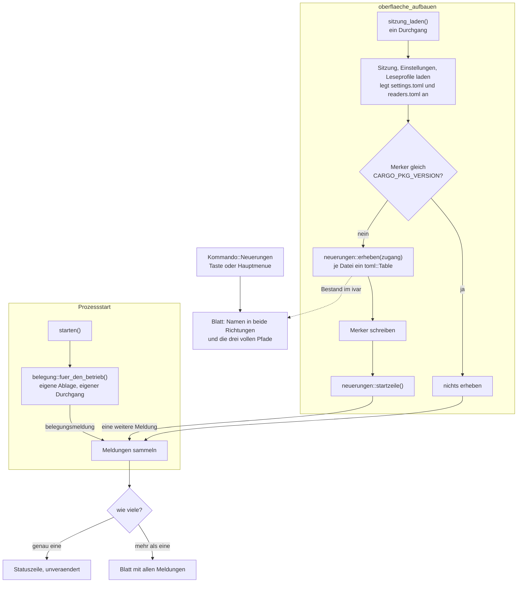
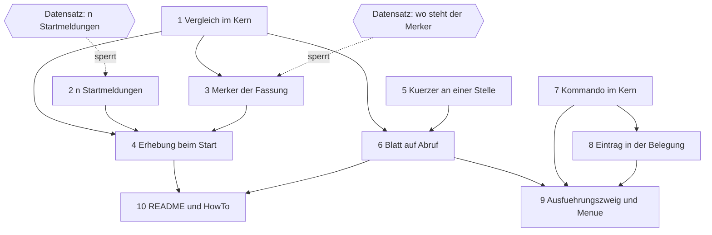

# Implementation Plan: KRK meldet, was eine neue Fassung an readers.toml, settings.toml und keymap.toml mitbringt

**Date:** 2026-09-10
**Status:** Draft
**Spec:** keiner — geplant gegen die Directive und den Grundlagen-Abschnitt des Circle-Datensatzes `260910-0707-krk-meldet-neuerungen-in-readers-settings-keymap`
**Decidability:** Die tragende Frage lautet „führt die Auslieferungsfassung einen Eintrag, den die Nutzerdatei nicht führt, und hat KRK das für diese Fassung schon gemeldet?". Beide Hälften sind aus Eingaben entscheidbar, die der Mechanismus hat: die Auslieferungsfassung steht über `include_str!` einkompiliert da, die Nutzerdatei liegt auf der Platte, und die eigene Versionsnummer kommt aus `env!("CARGO_PKG_VERSION")`. Für die zweite Hälfte braucht es einen abgelegten Wert; ohne ihn ist sie aus nichts zu erschließen, und der Datensatz `260910-0818_*_wo-merkt-sich-krk-fuer-welche-fassung-es-die-neuerungen-schon-gemeldet-hat.md` legt die zwei Orte vor. **Eine dritte Frage ist mit denselben Eingaben nicht entscheidbar und wird deshalb nicht gestellt:** ob eine **fehlende** Nutzerdatei „zurückliegt". Eine `keymap.toml` gibt es auf einer frischen Installation gar nicht, und wer sie als leere Datei liest, meldet dem Nutzer alle 93 Funktionen als Neuerung. Der Plan ändert dafür nicht die Näherung, sondern die Frage: verglichen wird nur, was dasteht, und eine Datei, die nicht dasteht, liefert keine Neuerung.

## Directive

Der Circle-Datensatz trägt sie. Nicht wiederholt, sondern in einem Satz belegt: der Nutzer
erfährt beim Start, dass seine drei von Hand gepflegten Ablagedateien hinter der
Auslieferungsfassung zurückliegen, und kann sich den Unterschied auf Verlangen im Einzelnen
ansehen; KRK schreibt dabei keine der drei.

Der Nutzer hat den Zuschnitt am 260910 erweitert: der offene Defekt
`260820-2235_*_die-startmeldungen-ueberschreiben-einander-und-nur-die-letzte-erreicht-den-nutzer.md`
kommt mit in diese Runde. Er ist die Voraussetzung dafür, dass die neue Startzeile überhaupt
ankommt.

## Current State

**Die Auslieferungsfassung liegt einkompiliert im Programm, die Nutzerdatei auf der Platte.**
Drei Konstanten `AUSLIEFERUNGSTEXT` tragen sie: in `ablage/einstellungen.rs`, in
`ablage/leseprofile.rs` und in `tasten/belegung.rs`, letztere heute noch modulprivat. Der
Vergleich braucht damit weder das Bündel noch das Netz.

**Jede der drei Dateien benennt ihre Einträge, und zwar auf zwei Weisen.**
`settings.toml` führt oberste Schlüssel und trägt heute genau einen, `terminal`.
`readers.toml` führt `[[profil]]` mit einem `name`, `keymap.toml` führt `[[funktion]]` mit
`id` und `name`. Zwei Gestalten für drei Dateien.

**Die drei verhalten sich verschieden, und der Unterschied wiegt je Datei anders.** Bei
`readers.toml` kommt eine Neuerung nie an: die Datei entsteht beim ersten Start und wird
danach nie überschrieben. Bei `settings.toml` füllt `Einstellungen::aus_datei` jedes
fehlende Feld aus der eingebetteten Fassung, die neue Einstellung wirkt also schon, und was
fehlt, ist allein der erklärende Kommentarblock. Bei `keymap.toml` ist der Befund enger, als
er zunächst aussieht: `Belegung::bauen` (`crates/krk-core/src/tasten/belegung.rs`) nimmt
jede Funktion, die die Nutzerdatei nicht nennt, **unbelegt** hinzu. Eine fehlende Funktion
steht damit in der Belegungsansicht und im Hauptmenü; was fehlt, sind ihre ausgelieferten
Tastenkombinationen. Das ist wichtig für diese Runde selbst: ihr eigener Befehl bleibt für
einen Nutzer mit alter `keymap.toml` über das Hauptmenü erreichbar, nur ohne Kürzel.

**Die Gegenrichtung ist bei zwei der drei Dateien bauartbedingt leer.** `Einstellungsdatei`
und `Profildatei` tragen `#[serde(deny_unknown_fields)]`, und `Belegung::bauen` gibt für
eine unbekannte Kennung `Belegungsfehler::UnbekannteFunktion` zurück. Ein Eintrag, den die
Nutzerdatei führt und die Auslieferungsfassung nicht, macht `settings.toml` und
`keymap.toml` also **beschädigt** statt abweichend, und eine erfolgreich gelesene Datei
dieser beiden kann in der Gegenrichtung nichts liefern. Allein bei `readers.toml` ist die
Gegenrichtung besetzt: ein `[[profil]]` mit einem eigenen Namen ist dort der gewöhnliche
Fall und kein Fehler. Die Zusage „in beide Richtungen" wird deshalb an einer Datei erfüllt
und an zweien leer, mit dem Grund daneben.

**Die Startmeldungen laufen heute in ein Fach.** `oberflaeche_aufbauen` sammelt sie in einem
`Vec` und ruft je Meldung `meldung_zeigen`, das das eine Feld `fenstermeldung` setzt
(`crates/krk-ui/src/appkit/tabelle.rs`). `Rang::Fenstermeldung` hat genau einen Platz
(`crates/krk-ui/src/appkit/statuszeile.rs`); von n Meldungen sieht der Nutzer die n-te. Der
Statuszeilentext kürzt rechts, und `kurzhinweis_nachziehen` hängt bei Kürzung einen
Kurzhinweis an.

**Der Start hat zwei getrennte Durchgänge durch die Ablage.**
`belegung::fuer_den_betrieb()` läuft in `starten()`, vor `NSApplication`, mit einer eigenen,
kurzlebigen `Ablage`; ihre Meldung reist als `belegungsmeldung` zum Delegierten.
`sitzung_laden` öffnet danach die bleibende Ablage und liest Sitzung, Einstellungen und
Leseprofile in **einem** Durchgang. Zwei Ablagen eines Prozesses dürfen nicht zugleich einen
Durchgang fahren (Kopf von `ablage::sperre`).

**Das Blatt auf Abruf hat ein Vorbild und drei Pflichtstellen.**
`blaetter/uebersprungen.rs` baut mit `Blatt::mit_schaltflaechen` und `erlaeuterung_setzen`
genau die Form, die hier gebraucht wird. Ein neuer Befehl braucht eine Zeile in
`Kommando::KENNUNGEN`, eine in `Kommando::wirkungsbereich`, eine in `bereich_des_kommandos`,
einen eigenen Ausführungszweig und einen Eintrag in `resources/default-keymap.toml`.

## Approach

**Ein Mechanismus, nicht drei.** Ein neues Kernmodul `ablage/neuerungen.rs` erhebt den
Unterschied für jede Ablagedatei, die einen tragen kann, und hält die Antwort „was ist bei
dieser Datei ein Eintrag" als **vollständige Fallunterscheidung ohne Auffangzweig** über
`Datei`. Damit hält der Übersetzer eine achte Ablagedatei auch hier an, so wie ihn heute
`format`, `leerbefund` und `ersatz` anhalten.

**Die Fallunterscheidung steht nicht in `pfade.rs`, und das ist keine Nachlässigkeit.** Der
Kopf von `ablage/leseprofile.rs` zieht die Linie: die Ablage kennt Pfad, Format und
Fehlerbehandlung und **nicht den Inhalt**. „Ein Eintrag ist ein `[[profil]]`, benannt durch
sein Feld `name`" ist eine Aussage über den Inhalt. Sie gehört deshalb in das neue Modul,
das sie braucht, und der Kopf von `pfade.rs` bekommt einen Satz, der auf die vierte je Datei
beantwortete Frage zeigt — sonst zählt er weiter drei und ein Neuling glaubt ihm.

**Verglichen wird über `toml::Table` und nicht über die getypten Strukturen.** Der Grund ist
`settings.toml`: `Einstellungsdatei` ist eine Struktur mit lauter `Option`-Feldern, und
„welchen obersten Schlüssel nennt die Datei" ist aus ihr nur über eine Feldliste daneben zu
beantworten — genau die Falle, die dieser Baum an `Kommando::KENNUNGEN` schon einmal
bezahlt hat. Ein `toml::Table` beantwortet die Frage für alle drei Dateien aus dem Bestand,
über einen Weg, und `Zugang::laden::<toml::Table>` geht dabei durch dieselbe Tür wie jedes
andere Laden, mit derselben Schadensbehandlung.

**Die Erhebung steht hinter dem Fassungsvergleich.** Stimmt der abgelegte Merker mit
`env!("CARGO_PKG_VERSION")` überein, wird keine Datei ein zweites Mal geöffnet. Das ist
zugleich die Einlösung von „einmal je Fassung" und die Bedingung, unter der die Zeitzusage
L4 im Dauerbetrieb unberührt bleibt (`260910-0818_*_schuldet-diese-runde-einen-abnahmelauf-gegen-die-zusage-l4.md`).

**Eine Datei, die nicht dasteht, wird nicht verglichen.** Auf einer frischen Installation
gibt es keine `keymap.toml`, und eine beschädigte Datei ist beim zweiten Lesen
beiseitegelegt. In beiden Fällen ist „fehlt" die richtige Auskunft und „liegt 93 Einträge
zurück" die falsche. Die Regel steht an einer Stelle und gilt für jede verglichene Datei.

**Die Erhebung läuft im Durchgang von `sitzung_laden`, und zwar als Letztes.** Vorher legen
`einstellungen::laden` und `leseprofile::laden` ihre Dateien beim ersten Start an; wer davor
erhebt, vergleicht gegen zwei Dateien, die es in dieser Sekunde noch nicht gibt.
`keymap.toml` wird dabei ein zweites Mal gelesen — der erste Lauf in `fuer_den_betrieb` ist
längst zu Ende, und ein drittes Rückgabestück durch `fuer_den_betrieb` zu fädeln wäre der
teurere Weg für dasselbe Ergebnis.

Der Knoten `Bestand im ivar` ist die eine gestrichelte Kante, und sie trägt eine Aussage:
das Blatt auf Abruf zeigt den Stand **vom Start** und liest die drei Dateien nicht neu. Das
ist kein Sparen, sondern die Wahrheit über KRK: die Leseprofile und die Belegung, mit denen
KRK arbeitet, sind die vom Start. Ein Blatt, das die Platte neu läse, zeigte einen Bestand,
den die laufende Anwendung gar nicht benutzt.

## Implementation Steps

1. **Der Vergleich im Kern** [DONE]
   - Executor: `coder`
   - Files: `crates/krk-core/src/ablage/neuerungen.rs` (neu),
     `crates/krk-core/src/ablage/mod.rs`, `crates/krk-core/src/ablage/pfade.rs`,
     `crates/krk-core/src/tasten/belegung.rs`, `crates/krk-core/tests/ablage.rs`
   - Changes: Das neue Modul trägt (a) `Vergleichsform` als vollständige Fallunterscheidung
     über `Datei`, ohne Auffangzweig, mit den Werten „oberste Schlüssel", „Tabellenfolge mit
     Tischnamen und Schlüsselfeld" und „wird nicht verglichen"; (b) `Neuerungen` je Datei mit
     dem vollen Pfad, den Namen nur in der Auslieferungsfassung und den Namen nur beim
     Nutzer; (c) `Bestand` über alle verglichenen Dateien; (d) `erheben(&Zugang)`, das über
     `Datei::ALLE` läuft, jede Datei mit `Vergleichsform::Nicht` überspringt, eine **nicht
     vorhandene** Nutzerdatei überspringt und sonst `zugang.laden::<toml::Table>` gegen die
     eingebettete Fassung hält; (e) die zwei reinen Formatierer `startzeile` und `blatttext`.
     Die eingebetteten Fassungen kommen als `LazyLock<toml::Table>` aus den drei vorhandenen
     `AUSLIEFERUNGSTEXT`-Konstanten; die in `tasten/belegung.rs` wird dafür sichtbar gemacht
     und bekommt den Grund als Doc-Kommentar. `ablage/mod.rs` nimmt das Modul auf und nennt
     es im Modulkopf. Der Kopf von `pfade.rs` bekommt **einen Satz**, der auf die vierte je
     Datei beantwortete Frage in `neuerungen.rs` zeigt; die drei dort bleiben, wie sie sind.
   - Acceptance:
     - Eine Nutzerdatei, die es nicht gibt, liefert keine Neuerung — je Datei eine Probe,
       `keymap.toml` namentlich, weil sie auf einer frischen Installation nie entsteht.
     - Eine Nutzerdatei, die der Auslieferungsfassung gleicht, liefert keine Neuerung.
     - Ein aus `readers.toml` entferntes Profil steht in der Hinrichtung, ein eigenes Profil
       des Nutzers in der Gegenrichtung.
     - Eine `keymap.toml` ohne eine ausgelieferte `id` liefert genau diese `id`.
     - Eine `settings.toml` ohne `terminal` liefert genau diesen Schlüssel.
     - Eine Probe hält fest, **warum** die Gegenrichtung bei `keymap.toml` und
       `settings.toml` leer bleibt: sie schreibt eine Nutzerdatei mit unbekanntem Eintrag und
       zeigt, dass sie als beschädigt gilt und gar nicht bis zum Vergleich kommt.
     - `startzeile` nennt je Datei mit Unterschied deren Namen und Zahl und dazu den Ordner
       in KRKs Meldungsform (`gekuerzt_fuer_anzeige`, also `~` statt des
       Benutzerverzeichnisses); ohne Unterschied gibt sie `None`.
     - Der Wortlaut beider Formatierer trägt Umlaute (Naht vom 260907), die Bezeichner und
       Kommentare die Umschrift. Je eine Probe hält den Wortlaut.
   - Dependencies: keine

2. **Die n Startmeldungen erreichen den Nutzer** [DONE]
   - Executor: `coder`
   - Files: `crates/krk-ui/src/appkit/anwendung.rs`,
     `crates/krk-ui/src/appkit/blaetter/startmeldungen.rs` (neu, falls Möglichkeit 2),
     `crates/krk-ui/src/appkit/blaetter/mod.rs`,
     der Defektdatensatz `260820-2235_*_die-startmeldungen-ueberschreiben-einander-und-nur-die-letzte-erreicht-den-nutzer.md`
   - Changes: Behebt den Defekt nach der Antwort auf
     `260910-0818_*_wie-erreichen-n-startmeldungen-den-nutzer-wenn-die-eine-zeile-nur-eine-traegt.md`.
     Empfohlen ist dort Möglichkeit 2: genau eine Meldung geht unverändert über
     `meldung_zeigen` in die Statuszeile, ab der zweiten fährt ein Blatt herunter, das alle
     aufführt, gebaut wie `blaetter/uebersprungen.rs`. Der Modulkopf von `blaetter/mod.rs`
     zählt heute die Blätter; er wird mitgezogen. Der Defektdatensatz bekommt seine
     `Resolved:`-Zeile und den Marker `_c_`.
   - Acceptance:
     - Bei genau einer Startmeldung ist das Verhalten Wort für Wort das heutige. Eine Probe
       hält das fest; der Defekt fordert es ausdrücklich.
     - Bei zwei und bei drei Meldungen erreicht jede den Nutzer.
     - Der Bauplan des Blattes trägt genau eine Schaltfläche, und sie lässt liegen — dieselbe
       Probe wie bei `uebersprungen`.
     - Ohne Startmeldung geschieht nichts: kein Blatt, keine Zeile.
   - Dependencies: keine. **Der Schritt steht trotzdem vor Schritt 4**, weil dessen Abnahme
     davon abhängt: eine Startzeile, die neben einer Ablagemeldung still ausfällt, ist keine
     gebaute Zusage. Bis der Datensatz beantwortet ist, ist der Schritt gesperrt.

3. **Der Merker der gemeldeten Fassung**
   - Executor: `coder`
   - Files: nach der Antwort auf
     `260910-0818_*_wo-merkt-sich-krk-fuer-welche-fassung-es-die-neuerungen-schon-gemeldet-hat.md`.
     Bei der achten Ablagedatei (empfohlen): `crates/krk-core/src/ablage/pfade.rs`,
     `crates/krk-core/src/ablage/merker.rs` (neu),
     `crates/krk-core/src/ablage/neuerungen.rs`, `crates/krk-core/src/ablage/mod.rs`,
     `crates/krk-core/tests/ablage.rs`, `crates/krk-core/tests/baum.rs` sowie jede
     Prosastelle unter `crates/krk-core/src/ablage/`, die die Probe
     `keine_prosastelle_der_ablage_nennt_eine_andere_zahl_von_ablagedateien` beim ersten
     roten Lauf namentlich nennt. Bei `session.toml`: `crates/krk-core/src/ablage/sitzung.rs`,
     `crates/krk-core/tests/ablage.rs`.
   - Changes: Legt den Wert ab und liest ihn zurück. Bei der achten Datei: `Datei` bekommt
     eine Variante, `Datei::ALLE` wird `[Datei; 8]`, und `format`, `leerbefund`, `ersatz` und
     `Vergleichsform` bekommen je eine bewusste Antwort — `Toml`, `Beschaedigt`,
     `Auslieferungszustand`, `Nicht`, denn KRK schreibt diese Datei selbst und sie ist nie
     Gegenstand der Meldung. Geschrieben wird über `Zugang::sichern`, gelesen über
     `Zugang::laden`. Bei `session.toml`: ein oberstes Feld auf `Sitzung`, **vor** den drei
     Tabellen, weil TOML die Werte einer Tabelle vor ihren Untertabellen verlangt.
   - Acceptance:
     - Ein leerer oder fehlender Merker heißt „noch nie gemeldet".
     - Ein Merker mit einer anderen Zahl als `env!("CARGO_PKG_VERSION")` heißt „melden".
     - Ein Merker mit derselben Zahl heißt „nicht melden".
     - Bei der achten Datei: die Probe über die Prosazahlen ist wieder grün, und
       `Datei::ALLE` und die drei Fallunterscheidungen tragen die achte Datei.
     - Bei `session.toml`: eine `session.toml` aus der Zeit vor dem Feld bleibt lesbar, und
       die Probe `eine_session_toml_aus_einer_spaeteren_fassung_behaelt_ihre_sitzung` bleibt
       grün.
   - Dependencies: Schritt 1 (die `Vergleichsform` der neuen Datei). Gesperrt, bis der
     Datensatz beantwortet ist.

4. **Die Erhebung läuft beim Start, und die Zeile geht hinaus**
   - Executor: `coder`
   - Files: `crates/krk-ui/src/appkit/anwendung.rs`
   - Changes: In `sitzung_laden`, im vorhandenen `durchgang` und **als Letztes** darin: den
     Merker lesen, gegen `env!("CARGO_PKG_VERSION")` halten, bei Gleichheit nichts tun, sonst
     `neuerungen::erheben(zugang)` rufen, den Merker schreiben und `neuerungen::startzeile`
     an `meldungen` anhängen. Der erhobene `Bestand` wird in einem neuen `ivar` gehalten,
     damit das Blatt aus Schritt 6 ihn zeigen kann; er wird auch dann gehalten, wenn er leer
     ist, denn das Blatt zeigt die drei Pfade in jedem Fall.
   - Acceptance:
     - Bei gleichem Merker wird keine der drei Dateien ein zweites Mal geöffnet. Das ist die
       Bedingung aus `260910-0818_*_schuldet-diese-runde-einen-abnahmelauf-gegen-die-zusage-l4.md`
       und braucht eine Probe, die die Öffnungen zählt, keine Zusicherung im Kommentar.
     - Nach dem ersten Start einer Fassung meldet der zweite Start derselben Fassung nichts.
     - Die Zeile erscheint neben einer gleichzeitigen Ablagemeldung und nicht statt ihrer
       (das leistet Schritt 2).
     - Die Erhebung steht hinter `einstellungen::laden` und `leseprofile::laden`: auf einer
       frischen Installation meldet der erste Start **keine** Neuerung an `settings.toml` und
       `readers.toml`, weil beide gerade wörtlich aus der Auslieferungsfassung entstanden
       sind, und keine an `keymap.toml`, weil sie nicht dasteht.
   - Dependencies: Schritte 1, 2, 3

5. **Ein Kürzer für lange Namenslisten, an einer Stelle**
   - Executor: `coder`
   - Files: `crates/krk-ui/src/kommandos/operationen.rs`,
     `crates/krk-core/src/ablage/neuerungen.rs`
   - Changes: `uebersprungenliste` kürzt heute auf `HOECHSTENS_EINZELN` Zeilen und hängt
     „… und N weitere" an. Das Blatt aus Schritt 6 braucht dieselbe Kürzung: `keymap.toml`
     kann 93 Namen liefern. Die Kürzung wird als reine Funktion herausgezogen und von beiden
     gerufen, statt den Wortlaut ein zweites Mal zu schreiben.
   - Acceptance:
     - Die vorhandenen Proben von `uebersprungenliste` bleiben grün, Wortlaut unverändert
       (`… und 18 weitere`, `HOECHSTENS_EINZELN + 1` Zeilen).
     - Die Kürzung hat genau zwei Rufer, und eine Zählprobe hält das fest — dieselbe Bauform
       wie `die_zeichenregel_hat_drei_rufer_und_der_vergleich_drei`.
   - Dependencies: keine

6. **Das Blatt auf Abruf**
   - Executor: `coder`
   - Files: `crates/krk-ui/src/appkit/blaetter/neuerungen.rs` (neu),
     `crates/krk-ui/src/appkit/blaetter/mod.rs`
   - Changes: Ein Blatt nach dem Vorbild `blaetter/uebersprungen.rs`:
     `Blatt::mit_schaltflaechen` mit einer schließenden Schaltfläche auf der Eingabetaste,
     `erlaeuterung_setzen` mit dem Text aus `neuerungen::blatttext`. Der Text führt je Datei
     den vollen Pfad, die Namen nur in der Auslieferungsfassung, die Namen nur beim Nutzer
     und einen Satz darüber, was ein Unterschied bei **dieser** Datei kostet: bei
     `readers.toml` das Profil selbst, bei `settings.toml` allein der erklärende
     Kommentarblock, bei `keymap.toml` die ausgelieferten Tastenkombinationen der Funktion,
     während die Funktion über das Hauptmenü erreichbar bleibt. Wo die Gegenrichtung
     bauartbedingt leer ist, sagt der Text es in einem Halbsatz, statt eine leere Zeile
     stehen zu lassen. Der Modulkopf von `blaetter/mod.rs` zählt die Blätter und wird
     mitgezogen.
   - Acceptance:
     - Ohne einen einzigen Unterschied steht das Blatt trotzdem und zeigt die drei vollen
       Pfade. Das ist der Unterschied zu `uebersprungen`, wo ohne Einträge kein Blatt
       aufgeht: dort meldet KRK ungefragt, hier hat der Nutzer gefragt.
     - Der Bauplan trägt genau eine Schaltfläche, und sie lässt liegen.
     - Eine Namensliste jenseits der Kürzungsgrenze endet mit „… und N weitere".
     - Die drei Sätze über den Preis je Datei stehen als Probe im Wortlaut fest.
   - Dependencies: Schritte 1, 5

7. **Das Kommando im Kern**
   - Executor: `coder`
   - Files: `crates/krk-core/src/tasten/belegung.rs`, `crates/krk-ui/src/belegungsmodell.rs`
   - Changes: `Kommando` bekommt eine Variante, `Kommando::KENNUNGEN` die Zeile mit der
     Kennung `neuerungen_zeigen`, `Kommando::wirkungsbereich` den Wert
     `Wirkungsbereich::Ueberall` (wie `Kommando::Notizzettel`: das Blatt betrifft die Ablage
     und keinen Bereich der Fensterzeile), `bereich_des_kommandos` den Wert
     `Funktionsbereich::Anwendung`.
   - Acceptance:
     - `cargo build --workspace` läuft durch; die zwei vollständigen Fallunterscheidungen
       sind beantwortet.
     - `Kommando::aus_kennung`, `kennung()` und `tag_des_kommandos` beantworten die neue
       Variante.
     - **Zwischen diesem Schritt und Schritt 8 ist `cargo test -p krk-core` rot**, und zwar
       an genau einer Stelle: `jede_kennung_der_kommandos_steht_in_der_auslieferungsbelegung`
       verlangt für jede Kennung einen Eintrag in `resources/default-keymap.toml`. Das ist
       erwartet und aufgeschrieben. **Wer diesen Schritt ausführt, fasst
       `resources/default-keymap.toml` nicht an**; die Datei gehört Schritt 8.
   - Dependencies: keine

8. **Der Eintrag in der Auslieferungsbelegung**
   - Executor: `ontocoder`
   - Files: `resources/default-keymap.toml`
   - Changes: Ein `[[funktion]]`-Block mit `id = "neuerungen_zeigen"`, einem deutschen
     `name` und einer Tastenkombination, eingeordnet in den Block „Anwendung als ganze"
     zwischen dem Notizzettel und der weiteren Instanz, weil `bereich_des_kommandos` die
     Kennung unter `Funktionsbereich::Anwendung` führt und die Reihenfolge der Blöcke die
     Reihenfolge im Menü ist. Dazu die Kopfzeile „# Ausgeliefert sind N Funktionen mit
     zusammen M Kombinationen", die eine Probe gegen die Datei hält. Der Block bekommt seinen
     Begründungskommentar wie jeder andere.
   - Acceptance:
     - Die gewählte Kombination ist über **jede** `tasten`-Liste der Datei frei. Geprüft mit
       `grep -oE '"[^"]+"' resources/default-keymap.toml | sort -u`, nicht nach Augenmaß.
       Vorschlag: `opt+cmd+i`; am 260910 war sie frei, und der Ausführende prüft das erneut.
     - Beide Zahlen der Kopfzeile stimmen wieder;
       `die_zwei_zahlen_im_kopf_von_default_keymap_toml_stimmen_noch` ist grün.
     - `jede_kennung_der_kommandos_steht_in_der_auslieferungsbelegung` ist grün.
     - `cargo test --workspace` ist wieder vollständig grün.
   - Dependencies: Schritt 7. **Die Reihenfolge ist nicht umkehrbar**: ein Eintrag in der
     Belegung ohne Kommando lässt `belegungsmodell::bereich` `None` liefern, und
     `nach_bereichen` bricht darauf mit einem `panic` ab, sobald das Hauptmenü gebaut wird.
     Daten zuerst hieße also: KRK startet nicht.

9. **Der Ausführungszweig und der Weg über das Hauptmenü**
   - Executor: `coder`
   - Files: `crates/krk-ui/src/appkit/anwendung.rs`
   - Changes: Ein eigener Zweig in `Anwendungsdelegierter::kommando_ausfuehren`, der das
     Blatt aus Schritt 6 mit dem gehaltenen `Bestand` zeigt und den Griff wie die übrigen
     Blätter nach `offenes_blatt` legt. Der Zweig ist die Pflichtstelle, die weder der
     Übersetzer noch eine Probe hält; ohne ihn steht der Befehl mit Namen und Kombination im
     Hauptmenü und tut nichts.
   - Acceptance:
     - Die Taste öffnet das Blatt, der Menüeintrag ebenso.
     - Ein Nutzer mit einer `keymap.toml` ohne die neue Kennung erreicht den Befehl über das
       Hauptmenü, ohne Kürzel — die Folge daraus, dass `Belegung::bauen` fehlende Funktionen
       unbelegt hinzunimmt.
     - Bei stehendem Blatt ist der Befehl gesperrt, wie jeder außer den vier der
       Ausnahmeliste. Die Probe
       `zulaessigkeit::waehrend_eines_blattes_kommen_genau_diese_vier_durch` bleibt grün und
       zählt weiter vier.
   - Dependencies: Schritte 6, 7, 8

10. **Was der Nutzer darüber liest**
    - Executor: `ontocoder`
    - Files: `README.md`, `HowTo.md`
    - Changes: `README.md` `## Neue Leseprofile übernehmen` sagt heute den Handgriff, mit dem
      der Nutzer neue Profile bekommt; der Abschnitt bekommt den Satz, dass KRK die Neuerung
      jetzt von sich aus meldet und wo der Befehl liegt, der sie im Einzelnen zeigt. Er gilt
      danach nicht mehr allein für `readers.toml`; die Überschrift wird entsprechend
      gefasst. `HowTo.md` reist im Releasepaket mit und bekommt dieselbe Auskunft in der
      Sprache des Nutzers.
    - Acceptance:
      - Beide Stellen nennen den Befehl mit seinem Menüeintrag und nicht nur mit der
        Tastenkombination, denn die fehlt einem Nutzer mit alter `keymap.toml`.
      - Die Betriebsregel „die neue Fassung über die alte kopieren und die alte nicht vorher
        löschen" bleibt an jeder Stelle unverändert stehen, an der sie heute steht. Die
        Erhebung dazu ist
        ``grep -rnE --exclude-dir=fusion-workbench --exclude-dir=target '[Dd]ie alte.{0,24}löschen' .``
        vor und nach dem Schritt, mit demselben Ergebnis.
      - Keine neue Zahl im Text, die der Baum schon trägt.
    - Dependencies: Schritte 4, 6

## Where this Circle stops

- Jeder Planschritt trägt `[DONE]`, und jede behauptete Erledigung ist einzeln gegen den
  Baum gelesen.
- `make check` endet mit 0, alle fünf Kommandos, in seiner Reihenfolge.
- Die drei Datensätze dieser Runde sind beantwortet, und die zwei sperrenden
  (`260910-0818_*_wo-merkt-sich-krk-fuer-welche-fassung-es-die-neuerungen-schon-gemeldet-hat.md`
  und
  `260910-0818_*_wie-erreichen-n-startmeldungen-den-nutzer-wenn-die-eine-zeile-nur-eine-traegt.md`)
  sind in Code umgesetzt und tragen den Marker `_i_`.
- Der Defekt
  `260820-2235_*_die-startmeldungen-ueberschreiben-einander-und-nur-die-letzte-erreicht-den-nutzer.md`
  ist geschlossen, mit einer `Resolved:`-Zeile, die den gewählten Weg benennt.
- Am gebauten Bündel, vom Nutzer gefahren: nach einem Fassungswechsel zeigt der erste Start
  die Zeile mit den Zahlen und dem Ordner, der zweite Start derselben Fassung zeigt sie
  nicht. Der Befehl öffnet das Blatt über die Taste und über den Hauptmenüeintrag, und das
  Blatt trägt die drei vollen Pfade.
- Keine der drei gemeldeten Dateien ist von KRK geschrieben worden. Geprüft am
  Änderungsdatum der drei Dateien vor und nach einem Start.
- Ein Abnahmelauf gegen die zehn Zeitzusagen aus C8 ist **keine** Vorbedingung dieser Runde,
  sofern
  `260910-0818_*_schuldet-diese-runde-einen-abnahmelauf-gegen-die-zusage-l4.md` mit
  Möglichkeit 1 beantwortet ist und die Probe steht, die zählt, dass ohne Fassungswechsel
  keine der drei Dateien ein zweites Mal geöffnet wird. Fällt der Datensatz anders aus, ist
  der Lauf Vorbedingung und Nutzerarbeit.
- Ein Tag und eine Auslieferung sind **nicht** Teil dieser Runde. Wird eine daraus gefahren,
  ist die Nutzerabnahme des vorigen Punktes ihre Vorbedingung, und diese Vorbedingung ist von
  einem Menschen zu lesen und von keinem Werkzeug zu prüfen — das ist die Lehre aus
  `foreign:fusion:260817-1613_*_does-a-plan-stated-precondition-get-any-mechanism-or-is-it-read-by-a-human-or-not-at-all.md`.
- CLAUDE.md wird von dieser Runde nicht angefasst. Der Abgleich gehört
  `/fusion:cleanup --only claude-md` am Ende der Sitzung; betroffen sind mindestens die
  Aufzählung der Ablagedateien, der Abschnitt über die Leseprofile und die Stelle, die die
  Aufzählung `Kommando` beschreibt.

## Data Structures

| Typ | Ort | Was er trägt |
|---|---|---|
| `Vergleichsform` | `ablage/neuerungen.rs` | Was bei einer Ablagedatei ein Eintrag ist. Vollständig über `Datei`, ohne Auffangzweig: oberste Schlüssel, Tabellenfolge mit Tischname und Schlüsselfeld, oder gar kein Vergleich. |
| `Neuerungen` | `ablage/neuerungen.rs` | Je Datei: welche Datei, ihr voller Pfad, die Namen nur in der Auslieferungsfassung, die Namen nur beim Nutzer. |
| `Bestand` | `ablage/neuerungen.rs` | Die `Neuerungen` aller verglichenen Dateien, in der Reihenfolge von `Datei::ALLE`. |
| Merker | nach dem Datensatz: `ablage/merker.rs` oder ein Feld auf `Sitzung` | Die Versionsnummer, für die zuletzt gemeldet wurde. |

`Vergleichsform` ordnet den drei von Hand gepflegten Dateien zu: `settings.toml` die obersten
Schlüssel, `readers.toml` die Tabellenfolge `profil` mit dem Schlüsselfeld `name`,
`keymap.toml` die Tabellenfolge `funktion` mit dem Schlüsselfeld `id`. Die vier übrigen
tragen „kein Vergleich", und die Begründung gehört an den Zweig: KRK schreibt sie selbst,
also kann eine Nutzerfassung nicht hinter der Auslieferungsfassung zurückliegen.

## API Changes

- `krk_core::ablage::neuerungen` ist neu und öffentlich: `Vergleichsform`, `Neuerungen`,
  `Bestand`, `erheben`, `startzeile`, `blatttext`.
- `krk_core::tasten::belegung::AUSLIEFERUNGSTEXT` wird sichtbar. Heute ist sie modulprivat;
  der Vergleich braucht sie, und die zwei Schwestern in `ablage/` sind es längst.
- `Kommando` bekommt eine Variante. Das ist eine `#[non_exhaustive]`-freie Aufzählung, also
  eine brechende Änderung im Sinne der Kiste — innerhalb dieses Workspace ohne Belang, und
  genau das ist der Zweck: der Übersetzer nennt jede Stelle, die nachzuziehen ist.
- Bei der achten Ablagedatei: `Datei` bekommt eine Variante und `Datei::ALLE` die Länge acht.
  Gleiche Wirkung, gleicher Zweck.

## Testing Strategy

**Der Kern trägt die Last, weil er ohne AppKit prüfbar ist.** `erheben`, `startzeile` und
`blatttext` sind reine Funktionen über einen `Zugang` und über einfache Werte; alle
inhaltlichen Zusagen dieser Runde hängen an ihnen und werden dort geprüft, in
`crates/krk-core/tests/ablage.rs` gegen einen Prüfordner der Fassung dieser Kiste
(`crates/krk-core/tests/gemeinsam/mod.rs`, keine vierte).

**Die Oberfläche wird an den Bauplänen geprüft und nicht am gebauten `NSAlert`.** Das ist die
vorhandene Bauform: `schaltflaechen()` als reine Funktion, `abbruchstelle` darüber, so wie es
`uebersprungen.rs` und `loeschbestaetigung.rs` schon tun. `krk-ui` hat kein
Bibliotheksziel, also stehen diese Proben in `#[cfg(test)]`-Modulen neben dem Code.

**Drei Proben halten, was sonst still auseinanderliefe:**

- die Zählprobe über die Rufer des Kürzers (Schritt 5),
- die Probe, die zählt, dass ohne Fassungswechsel keine der drei Dateien ein zweites Mal
  geöffnet wird (Schritt 4) — sie ist die Bedingung des L4-Datensatzes und darf keine
  Zusicherung im Kommentar bleiben,
- die Probe, die den Grund für die leere Gegenrichtung bei `keymap.toml` und `settings.toml`
  festhält (Schritt 1). Ohne sie ist „ist bauartbedingt leer" eine Behauptung im Modulkopf,
  und der erste, der `deny_unknown_fields` entfernt, macht sie still falsch.

Nicht geprüft wird am laufenden Bündel; das ist der Abnahmelauf und Nutzerarbeit.

## Risks & Mitigations

| Risiko | Gegenmaßnahme |
|---|---|
| Der Vergleich meldet auf einer frischen Installation 93 Neuerungen an `keymap.toml`, weil die Datei fehlt. | Die Regel „was nicht dasteht, wird nicht verglichen" steht an einer Stelle in `erheben`, und je Datei hält eine Probe sie fest. |
| Die Erhebung läuft vor `einstellungen::laden` und `leseprofile::laden` und meldet beim ersten Start Neuerungen an zwei Dateien, die in derselben Sekunde entstehen. | Die Reihenfolge steht als Randbedingung im Schritt und als Abnahmekriterium; die Probe fährt einen leeren Ablageordner. |
| Die zusätzliche Arbeit beim Start belastet L4. | Die Erhebung steht hinter dem Fassungsvergleich; im Dauerbetrieb wird keine Datei ein zweites Mal geöffnet, und eine Probe zählt das. Der Datensatz zu L4 entscheidet den Rest. |
| Die Startzeile fällt neben einer Ablagemeldung still aus. | Schritt 2 behebt den Defekt, bevor Schritt 4 die Zeile anhängt, und die Abhängigkeit ist im Schritt genannt. |
| Der neue Befehl steht im Menü und tut nichts. | Der Ausführungszweig ist ein eigener Schritt mit eigenem Abnahmekriterium. Diese Pflichtstelle hält weder der Übersetzer noch eine Probe; genau deshalb steht sie hier und nicht in einer Sammelzeile. |
| Zwischen Schritt 7 und Schritt 8 ist die Prüfung rot, und der Ausführende von Schritt 7 „repariert" das, indem er die Belegungsdatei anfasst. | Der Schritt schreibt beides aus: welche Probe rot ist und dass die Datei Schritt 8 gehört. Die umgekehrte Reihenfolge scheidet aus, weil `nach_bereichen` dann beim Bau des Hauptmenüs abbricht. |
| Eine achte Ablagedatei lässt Prosastellen im ganzen Ablagemodul falsch werden. | Die Probe `keine_prosastelle_der_ablage_nennt_eine_andere_zahl_von_ablagedateien` nennt jede beim ersten roten Lauf. Der Umfang ist damit erhoben und nicht geschätzt. |
| Das Blatt auf Abruf zeigt einen Stand, den der Nutzer inzwischen geändert hat. | Es zeigt den Stand vom Start, und das ist der Bestand, mit dem KRK arbeitet: Leseprofile und Belegung werden im Betrieb nicht neu gelesen. Der Text des Blattes sagt es in einem Halbsatz. |
| Der Nutzer, der ein Profil bewusst herausgenommen hat, liest seinen Namen mit jeder neuen Fassung wieder. | Bekannter, angenommener Preis; der Circle-Datensatz führt ihn unter „Die Spannung zu C1.6". Die Runde nimmt davon nichts zurück, sie meldet und ergänzt nicht. |

## Open Questions

- [ ] Wo merkt sich KRK die gemeldete Fassung? Datensatz
      `260910-0818_*_wo-merkt-sich-krk-fuer-welche-fassung-es-die-neuerungen-schon-gemeldet-hat.md`.
      Sperrt Schritt 3 und mittelbar Schritt 4. Empfohlen ist die achte Ablagedatei; der
      Ausschlag ist die zweite Instanz, die ohne Sitzungsrecht `session.toml` nie schreibt
      und deshalb bei jedem Start melden würde.
- [ ] Wie erreichen n Startmeldungen den Nutzer? Datensatz
      `260910-0818_*_wie-erreichen-n-startmeldungen-den-nutzer-wenn-die-eine-zeile-nur-eine-traegt.md`.
      Sperrt Schritt 2 und mittelbar Schritt 4. Empfohlen ist das Blatt ab der zweiten
      Meldung; das schließt zugleich den Defekt `260820-2235`.
- [ ] Schuldet diese Runde einen Abnahmelauf gegen L4? Datensatz
      `260910-0818_*_schuldet-diese-runde-einen-abnahmelauf-gegen-die-zusage-l4.md`. Sperrt
      keinen Schritt, wohl aber die Schließung dieser Runde.
- [ ] Welche Tastenkombination bekommt der Befehl? Der Plan schlägt `opt+cmd+i` vor und
      verlangt in Schritt 8 die Prüfung gegen jede `tasten`-Liste der Datei. Die Frage bindet
      nur diesen Plan und steht deshalb hier und nicht als eigener Datensatz.
- [ ] Nennt die Startzeile alle drei Dateien oder nur die mit einem Unterschied? Der Plan
      nennt nur die mit einem Unterschied: die Zeile ist einzeilig und kürzt rechts, und drei
      Nullen darin verdrängen die Auskunft, um die es geht. Je Datei eine Zahl bleibt damit
      erfüllt. Bindet nur diesen Plan.
