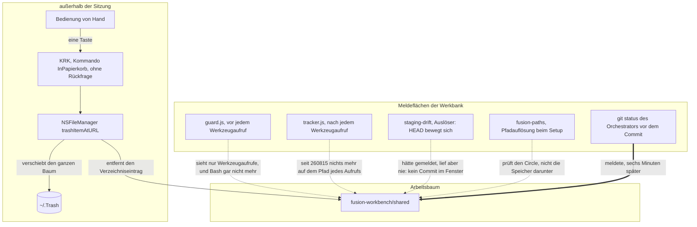

# Analyse: der Verlust des Speichers `shared/` in der Nacht zum 260817

**Datum:** 2026-08-17 04:19
**Typ:** Failure Investigation
**Status:** Complete
**Angefordert von:** orchestrator, im Auftrag des Nutzers

## Frage

Was hat das Verzeichnis `fusion-workbench/shared/` aus dem Arbeitsbaum entfernt, zu welchem Zeitpunkt, und welcher Mechanismus hätte den Verlust melden müssen und hat es nicht getan?

## Umfang

Untersucht sind die vier Dateien der Beweisaufnahme unter `/tmp/krk-vorfall-260817-0354/` sowie sechs Spuren, die wir selbst erhoben haben: der Zustand des Arbeitsbaums und des Ablagestands von git, das vollständige Ereignisprotokoll des Wächters (39 764 Zeilen ab dem 260801), die Sitzungsprotokolle von Claude Code für dieses Projekt und für das Projekt `fusion` samt allen Unteragenten, das vereinheitlichte Systemprotokoll von macOS für das Fenster 03:40 bis 03:50 Ortszeit (30,9 MB), KRKs eigene Ablage unter `~/Library/Application Support/KRK/` und der Quelltext der Wächter-Haken im Plugin. Jeder Zugriff war lesend; keine Datei der Beweisaufnahme ist verändert worden.

**Zeitangaben.** Das Dateisystem und das Systemprotokoll führen Ortszeit (CEST, UTC+2), `orchestrator-events.jsonl` und `.guard-state/events.jsonl` führen UTC. Die Umrechnung ist an zwei Paaren geprüft: `planner_done` steht bei `21:18:11` UTC, und `orchestrator-live.md` trägt die mtime `23:18:11` Ortszeit; `scope_resolved` steht bei `19:18:43` UTC, und `agentstate.yaml` trägt `21:18:43`. Wo unten keine Zone dabeisteht, ist Ortszeit gemeint.

## Befunde

### Das Beweisverzeichnis

| Spur | Was sie trägt | Was sie entschieden hat |
|---|---|---|
| `dateisystem.txt` (Aufnahme 04:02) | `ls -laT` über Werkbank-Wurzel, `circles/`, Circle 12, Projektwurzel, `shared/` | den Zeitpunkt der Wiederherstellung, nicht den der Löschung |
| `git.txt` | `git status --porcelain`, `git log -6`, `git reflog -15` | dass HEAD sich im Fenster nicht bewegt hat |
| `guard-events-tail.txt` | letzte 60 Zeilen des Wächterprotokolls | nichts über die Löschung, und zwar aus einem strukturellen Grund |
| `orchestrator-events-tail.txt` | letzte 80 Zeilen des Sitzungsprotokolls | dass die Sitzung im Fenster 4 h 35 min an einem Nutzergate stand |
| Sitzungsprotokoll des Planners, `history/260816-2307-…` | Auftrag, Lektüre, fünf erzeugte Dateien | den Namen der verlorenen Datei |
| Claude-Code-Mitschrift des Planners (1,38 MB) | 78 Werkzeugaufrufe, alle `Bash`, im Wortlaut | dass der Planner nichts unter `shared/` gelöscht hat |
| Wächterprotokoll, vollständig | 39 764 Ereignisse ab 260801 | dass der Wächter seit dem 260816 keinen Bash-Aufruf mehr aufzeichnet |
| Systemprotokoll von macOS, 03:40 bis 03:50 | Prozessstarts, Vordergrundwechsel, XPC-Verbindungen | den Urheber, auf die Sekunde |
| `~/.Trash`, nur die mtime lesbar | 2026-08-17 03:44:31 | die Bestätigung des Wegs, auf dem der Baum verschwand |

Nicht lesbar war der **Inhalt** von `~/.Trash`: der Datenschutzmechanismus von macOS weist jeden Zugriff dieses Prozesses auf das Verzeichnis ab (`ls: Operation not permitted`). Die mtime des Verzeichnisses ist über `stat` weiterhin abfragbar und ist unten die entscheidende Zahl.

### Die Zeitleiste

Ortszeit, mit der Quelle je Zeile.

| Zeit | Ereignis | Quelle |
|---|---|---|
| 22:45:29 | letzte Bearbeitung des Specs unter `shared/planning/` | Wächterprotokoll `20:45:29Z` |
| 22:56:26 | Circle 12 angelegt, `.active-circle` geschrieben | mtime `.active-circle` |
| 22:57:01 | Commit `5a52f16`, staged aus `shared/planning`, `shared/history`, `shared/issues` | Sitzungsprotokoll, Kommandotext im Mitschnitt |
| 22:57:33 | erster Werkzeugaufruf des Planners | Mitschrift |
| **23:10:18** | **der Planner schreibt `shared/issues/260816-2307_o_der-doc-kommentar-von-ablage-pfad-…md`; Rückgabe „geschrieben"** | Mitschrift, Kommando und Ergebnis |
| 23:17:17 | letzter Schreibvorgang des Planners, sein Sitzungsprotokoll, in den Circle | Mitschrift, mtime |
| 23:18:11 | `planner_done`, danach `gate_hit` „Plan-Abnahme" | Sitzungsprotokoll |
| 23:18:37 | die Frage steht am Nutzergate; die Sitzung setzt bis 03:53:55 keinen einzigen Werkzeugaufruf mehr ab | Mitschrift des Orchestrators |
| 03:42:51 | **KRK.app wird über LaunchServices gestartet** (`org.stalmann.krk`, PID 47991) | Systemprotokoll |
| 03:42:56 bis 03:44:33 | KRK ist Vordergrundanwendung, unterbrochen von kurzen Wechseln zu Finder und Terminal; Mausklicks um 03:43:22, 03:44:23 | Systemprotokoll, `trackMouse send action on mouseUp` |
| **03:44:31.204** | **KRK öffnet die XPC-Verbindung `com.apple.coreservices.quarantine-resolver`** | Systemprotokoll |
| **03:44:31** | **`~/.Trash` erhält einen neuen Eintrag** | mtime von `~/.Trash` |
| **03:44** | **`fusion-workbench/` verliert den Verzeichniseintrag `shared`** | mtime der Werkbank-Wurzel, gelesen um 03:54:03 |
| 03:50 bis 03:53:56 | der Nutzer beantwortet das Gate; der Orchestrator fährt `git status` und findet den Verlust | Sitzungsprotokoll, Mitschrift |
| 03:54:03 | `ls -la fusion-workbench/` zeigt Verknüpfungszahl 16 und mtime `03:44`, `shared/` fehlt ganz | Mitschrift, Ergebnis des Kommandos |
| 03:54:21 | `git checkout HEAD -- fusion-workbench/shared` stellt 189 Dateien her | Mitschrift, mtime der Werkbank-Wurzel |
| 03:54:30 | die drei leeren Speicher werden von Hand angelegt | Mitschrift, mtime |
| 04:02:33 | die Beweisaufnahme wird erhoben | Kopf von `dateisystem.txt` |

Der Kipppunkt ist die Zeile **03:44:31**. Alles davor ist gewöhnlicher Betrieb, alles danach Wiederherstellung.

### F1: was verschwand, und was nicht

**Verschwunden ist das Verzeichnis `shared` selbst, mit 189 verfolgten Dateien und einer unverfolgten.** Die Zahl 189 ist gemessen und ersetzt die 183 des Defektdatensatzes: die Ausgabe von `git status --porcelain`, die der Orchestrator um 03:53:56 erhielt, trägt genau 189 Zeilen mit dem Code ` D`, und die Ausgabe ist vollständig, denn ihre letzte Zeile ist der unverfolgte Planordner des Circles. Dieselbe Zahl steht unabhängig davon im Ablagestand: `git ls-tree -r 5a52f16 -- fusion-workbench/shared` liefert 189 Einträge. Auch die Zählung, die der Orchestrator nach der Wiederherstellung selbst ausgab, summiert sich auf 189 (77 Defekte, 74 Sitzungsprotokolle, 24 Entscheidungen, 6 Durchsichten, 4 Pläne, 3 Backlog-Einträge, 1 Beratung). Der Defektdatensatz nennt an zwei Stellen 183 und ist an beiden zu berichtigen.

**Es war das Verzeichnis und nicht allein sein Inhalt.** Dafür sprechen zwei voneinander unabhängige Messungen. Erstens meldete `ls -la .../shared/` um 03:54:03 „No such file or directory". Zweitens trägt die Werkbank-Wurzel `fusion-workbench/` nach dem `checkout` die mtime `03:54:21`, also genau den Zeitpunkt der Wiederherstellung: eine Verzeichnis-mtime ändert sich nur, wenn ein Eintrag darin entsteht oder verschwindet, und das einzige, was der `checkout` auf dieser Ebene anlegen konnte, war `shared` selbst. Hätte das Verzeichnis noch bestanden, wäre die mtime der Wurzel unberührt geblieben. Die Verknüpfungszahl bestätigt es: 16 vor dem `checkout`, 17 danach.

**Die drei leeren Speicher `analyses/`, `memos/` und `investigations/` sind ein Artefakt der Wiederherstellung und kein Hinweis.** Sie tragen die mtime `03:54:30`, neun Sekunden nach dem `checkout`, und stammen aus dem `mkdir -p`, das der Orchestrator danach fuhr; die übrigen neun Speicher tragen `03:54:21`. Über den Zustand vor dem Verlust sagt ihre Leere nichts, und sie muss es auch nicht: `git log --all` über die drei Pfade liefert keinen einzigen Treffer, es hat also in der ganzen Projektgeschichte nie eine verfolgte Datei darin gegeben.

**Genau eine unverfolgte Datei ist betroffen, und ihr Name ist rekonstruiert.** Es ist `shared/issues/260816-2307_o_der-doc-kommentar-von-ablage-pfad-nennt-vier-dateien-die-aufzaehlung-fuehrt-sechs.md`. Der Planner hat sie um 23:10:18 geschrieben, im selben Kommando wie den Circle-Befund zu C2.6; die Mitschrift trägt den Wortlaut des Heredoc und die Rückgabe „geschrieben". Ihr Inhalt ist damit nicht nur dem Sinn nach, sondern **wörtlich** aus der Mitschrift wiederherstellbar. Wir haben ihn dort gelesen: drei Stellen in `crates/krk-core/src/ablage/mod.rs` (Zeilen 45, 427 und 468) beschreiben `Ablage::pfad` und `Zugang::pfad` als „Der Pfad einer der vier Dateien", während `Datei::ALLE` seit der Runde 9 sechs Werte führt; `Zugang::laden` und `Zugang::sichern` sind davon ausdrücklich ausgenommen.

**Unversehrt geblieben ist alles andere.** `circles/` trägt weiterhin die mtime `22:56:26`, also den Zeitpunkt seiner letzten planmäßigen Änderung. Die zwölf wurzelverankerten Dateien und Verzeichnisse der Werkbank sind vollständig. Die Projektwurzel trägt die mtime `16 Aug 21:19:43`, dieselbe wie ihre `.DS_Store`, es ist dort seit dem 16. August 21:19 also kein Eintrag entstanden oder verschwunden.

### F2: wann, und was aus dem Ende des Wächterprotokolls folgt

**Die Löschung fällt in die Minute 03:44 des 17. August, und der Beleg ist eine Zahl, die nur eine einzige Aufnahme trägt.** Das `ls -la fusion-workbench/`, das der Orchestrator um 03:54:03 fuhr, also achtzehn Sekunden vor seiner eigenen Wiederherstellung, zeigt für das Verzeichnis selbst die mtime `17 Aug 03:44`. Die Beweisaufnahme um 04:02 trägt diese Zahl nicht mehr, weil der `checkout` sie um 03:54:21 überschrieben hat. Sie ist allein im Sitzungsmitschnitt erhalten, im Ergebnis eines Kommandos, das aus einem anderen Grund gefahren wurde.

Sekundengenau wird der Zeitpunkt durch zwei weitere Messungen: `~/.Trash` trägt die mtime `03:44:31`, und das Systemprotokoll verzeichnet für `krk[47991]` um `03:44:31.204` das Aktivieren der XPC-Verbindung `com.apple.coreservices.quarantine-resolver`.

**Der untere Rand des Fensters ist 23:10:18**, denn zu diesem Zeitpunkt hat ein Schreibvorgang in `shared/issues/` erfolgreich abgeschlossen. Das Fenster reicht damit von 23:10:18 bis 03:44 und ist durch die mtime der Werkbank-Wurzel auf eine Minute darin eingegrenzt.

**Aus dem Ende des Wächterprotokolls um 20:56 UTC folgt nichts über die Löschung.** Der Defektdatensatz schließt daraus, das Verschwinden sei „nicht über ein bewachtes `Write` oder `Edit` gelaufen". Der Schluss ist richtig, aber viel schwächer als er aussieht, und er verdeckt den eigentlichen Sachverhalt. Der Wächter zeichnet seit dem 260816 **überhaupt keinen Bash-Aufruf mehr auf**. Der Modulkopf von `hooks/guard.ts` sagt es im Wortlaut: „A Bash call therefore allows immediately, participating in NO write-guard bookkeeping (no counter reset, no guard_allow event)." Die Gegenprobe im Protokoll bestätigt es: am 260816 stehen dort 125 `guard_allow` und **null** `tracker_record`, während an den Tagen davor jeder Bash-Aufruf einen `tracker_record` erzeugte (am 260814 noch 198 zu 198). Der Zähler auf dem Pfad jedes Werkzeugaufrufs ist am 260815 entfernt worden, die Vorhersage über den Befehlstext bereits am 260807, und der letzte `guard_block` überhaupt stammt vom **260807-08:28 UTC**. Die effektive Liste geschützter Pfade in `hooks/config.json` ist heute leer (`categoryPaths: {}`, `decisions: []`).

Daraus folgt eine Aussage, die schärfer ist als die des Defektdatensatzes: **hätte ein Agent dieser Sitzung `rm -rf fusion-workbench/shared` abgesetzt, es stünde in keinem Protokoll dieses Projekts.** Das Fehlen einer Spur im Wächterprotokoll entlastet niemanden. Was den Planner tatsächlich entlastet, ist die Claude-Code-Mitschrift, nicht der Wächter.

### F3: wodurch

**Der Baum ist von KRK selbst in den Papierkorb geräumt worden, um 03:44:31, während KRK die Vordergrundanwendung war.** Die Kette besteht aus vier Messungen, die zeitlich aufeinander passen und je aus einer eigenen Quelle stammen.

1. Das Systemprotokoll zeigt den Start von `/Users/k1/Projects/productive/krk/target/KRK.app/Contents/MacOS/krk` um `03:42:51.5` über LaunchServices, mit `CoreServicesUIAgent` als Auslöser, also aus der Oberfläche und nicht aus einem Skript.
2. Dasselbe Protokoll führt für PID 47991 durchgehende Bedienspuren: Vordergrundwechsel um 03:42:56, 03:43:02, 03:43:35, 03:44:14, 03:44:36 und 03:44:42, dazu `trackMouse send action on mouseUp` um 03:43:22, 03:44:23 und 03:44:46. Von 03:44:14 bis 03:44:33 war KRK ununterbrochen vorn.
3. Um `03:44:31.204` öffnet `krk[47991]` die XPC-Verbindung `com.apple.coreservices.quarantine-resolver`. Sie kommt im ganzen Zehn-Minuten-Fenster genau zweimal vor, hier und um 03:48:34 bei einem anderen Prozess. KRKs Papierkorb ist `NSFileManager.trashItemAtURL:`, dokumentiert im Modulkopf von `crates/krk-core/src/operation/loeschen.rs` und gekapselt in `crates/krk-ui/src/appkit/papierkorb.rs`; dieser Aufruf ist der Weg, auf dem eine Anwendung LaunchServices für das Verschieben in den Papierkorb anspricht.
4. `~/.Trash` trägt die mtime `03:44:31`, und `fusion-workbench/` trägt für dieselbe Minute den Verlust seines Eintrags `shared`.

Die Löschtaste liegt in KRK auf `Kommando::InPapierkorb` und **fragt nicht nach**. Der Nutzer hat genau das am 260816-2144 als Defekt gemeldet, elf Stunden vor dem Vorfall: `shared/issues/260816-2144_o_das-raeumen-in-den-papierkorb-laeuft-ohne-rueckfrage.md`. Der Datensatz stuft die Schwere als mittel ein, mit der Begründung „Kein unwiederbringlicher Verlust, denn der ungesicherte Weg führt in den Papierkorb und nicht daran vorbei", und nennt daneben genau die drei Eigenschaften, die hier zusammengekommen sind: die Taste liegt unter der rechten Hand, sie wirkt auf die ganze Mehrfachauswahl, und sie trägt eine zweite Bedeutung. Der Vorfall ist der erste gemessene Schadensfall dieses Defekts.

**Was gemessen ist und was erschlossen.** Gemessen ist, dass KRK um 03:44:31 einen Eintrag in den Papierkorb verschoben hat und dass `shared` in derselben Minute aus dem Arbeitsbaum verschwand. `inference:` Der verschobene Eintrag war `fusion-workbench/shared`. Der Schluss stützt sich darauf, dass in dieser Minute im ganzen Projektbaum keine andere Änderung eines Verzeichniseintrags nachweisbar ist und die beiden Zeitstempel auf dieselbe Sekunde fallen. Direkt geprüft ist er nicht, weil der Datenschutzmechanismus von macOS diesem Prozess den Inhalt von `~/.Trash` verwehrt. **Die Spur, die die Frage endgültig entscheidet, liegt vor: ein Blick des Nutzers in den Papierkorb.** `speculation:` Der Bedienweg war die Löschtaste auf einer Auswahl im Dateifenster; welche Taste oder welcher Menüeintrag es war, sagt keine Spur, weil KRK selbst nichts protokolliert.

**Die geprüften Gegenhypothesen.**

| Hypothese | Prüfung | Ergebnis |
|---|---|---|
| Ein Kommando des Planners | alle 78 Werkzeugaufrufe der Mitschrift gelesen; ausnahmslos `Bash`, kein `rm`, `mv`, `rmdir`, `git clean`, `git reset` oder `git stash`; unter `shared/` allein `cat` und `sed -n` | ausgeschlossen |
| Ein Kommando des Orchestrators | 13 Werkzeugaufrufe im Fenster; zwischen 23:18:37 und 03:53:55 kein einziger | ausgeschlossen |
| Ein anderer Vorgang derselben Sitzung | die Sitzung hatte im Fenster keinen weiteren Unteragenten; `agent-*.meta.json` führt sechs, fünf davon vor 23:18 beendet | ausgeschlossen |
| Eine andere Claude-Code-Sitzung | `find` über `~/.claude` für 03:40 bis 03:53 liefert allein Dateien der Sitzung im Projekt `fusion`; deren 132 Werkzeugaufrufe im Fenster nennen `krk` an keiner Stelle und arbeiten ausschließlich im eigenen Baum | ausgeschlossen |
| Ein `git`-Kommando mit weitem Wirkungsbereich | `git reflog` zeigt für das Fenster keine HEAD-Bewegung; `git status` meldete die 189 Dateien als im Arbeitsbaum gelöscht und nicht vorgemerkt, was zu `git rm`, `git stash` und `git checkout` nicht passt | ausgeschlossen |
| Ein Sicherungs- oder Aufräumwerkzeug | `tmutil listlocalsnapshots /` endet am 260815-11:51, das Fenster ist von Time Machine nicht abgedeckt; kein Aufräumwerkzeug in den Benutzer-LaunchAgents (dort stehen allein drei Dropbox-Aktualisierer) | ohne Beleg, und ohne passende Spur |
| Ein Synchronisationsdienst | Dropbox und Google Drive laufen, aber `~/Projects` liegt in keinem ihrer Ordner; das Systemprotokoll zeigt für 03:44 keine Dateianbieter-Aktivität an diesem Pfad | ausgeschlossen |
| Ein Terminalfenster des Nutzers | `~/.zsh_history` trägt die mtime `16 Aug 07:57` und endet mit einem `find`; Terminal war um 03:44:33 und 03:44:42 kurz vorn. Ein offenes zsh schreibt seine Historie erst beim Beenden, ein Kommando von dort wäre also unsichtbar | nicht ausgeschlossen, aber ohne Beleg und zeitlich schlechter passend als KRK |
| Löschung über den Finder | in `fusion-workbench/` liegt keine `.DS_Store`; wer dort im Finder etwas auswählt, hinterlässt eine. Finder war um 03:44:13 für eine Sekunde vorn | sehr unwahrscheinlich |

**Die drei Dateien, nach denen ausdrücklich zu fragen war, tragen nichts bei.**

- `.DS_Store` in der Projektwurzel trägt die mtime `16 Aug 21:19:43`, sechseinhalb Stunden vor dem Vorfall, und belegt allein, dass der Finder an jenem Abend die Projektwurzel angezeigt hat. Beiläufig: die Datei steht nicht in `.gitignore` und taucht deshalb in jedem `git status` als unverfolgt auf.
- `orchestrator-events.jsonl.tmp` ist 0 Byte groß und trägt die mtime `8 Aug 01:24:10`, also neun Tage alt und im Fenster unberührt. Sie ist gitignoriert und der Rest eines Schreibvorgangs über eine Zwischendatei.
- `plane.config.yaml` trägt die mtime `1 Aug 22:13:28`, dieselbe wie `stilwerk/` und `archive/`, stammt also aus der Einrichtung der Werkbank und ist seither unberührt. Sie ist verfolgt. Sie steht nicht im Layout, das `rules/fusion-workbench-conventions.md` definiert, und ist damit eine projektfremde Datei an der Werkbank-Wurzel; für diesen Vorfall ist sie ohne Bedeutung.

### F4: warum es unbemerkt blieb

**Keine Meldefläche der Werkbank beobachtet den Bestand des Arbeitsbaums; alle beobachten Werkzeugaufrufe oder Commits.** Der Verlust kam von außerhalb beider Kategorien und war deshalb für jede von ihnen unsichtbar.

Im Einzelnen:

**Der Wächter ist strukturell blind.** Er hängt an `PreToolUse` und `PostToolUse` von Claude Code. Ein Vorgang, der kein Werkzeugaufruf ist, erreicht ihn nie. Dazu kommt, dass er auch innerhalb seiner Reichweite nichts mehr meldete: seit dem 260807 kein `guard_block`, seit dem 260815 keine Messung auf dem Pfad jedes Aufrufs, seit dem 260816 keine Aufzeichnung von Bash-Aufrufen. Für diesen Vorfall ist der erste Grund der entscheidende, der zweite bliebe es beim nächsten.

**Die eine Fläche, die es gemeldet hätte, war scharf und wurde nicht ausgelöst.** `hooks/lib/staging-drift.ts` fährt `git status --porcelain --untracked-files=all` über die Werkbank und ordnet nach eigener Aussage jeden Eintrag ein, „Nothing dropped". Die 189 Löschungen wären darin aufgetaucht. Ihr Auslöser ist aber ausdrücklich nicht jeder Werkzeugaufruf, sondern eine Bewegung von HEAD, also ein Commit. Zwischen 22:57 und 03:54 gab es keinen. Die Wahl des Auslösers ist begründet und im Modulkopf verteidigt: eine Prüfung, die auf ihrem häufigsten Pfad feuert, lernt ihr Leser zu überlesen. Die Kehrseite ist genau dieser Fall.

**Die Pfadauflösung hätte den fehlenden Speicher stumm weitergereicht.** `bin/fusion-paths` prüft die Existenz des Circle-Verzeichnisses (zwei Stellen im Skript) und die der Speicher darunter nicht. Ein Agent, der in diesem Zustand gestartet worden wäre, hätte `SCAN_ISSUES=… shared/issues` erhalten, dort nichts gefunden und „keine offenen Defekte" berichtet. Das ist die gefährlichere Hälfte des Befundes: der Verlust wäre nicht nur unbemerkt geblieben, er hätte falsche Auskünfte erzeugt, die richtig aussehen.

**Gefunden hat es `git status`, und zwar aus einem anderen Grund.** Der Orchestrator fuhr ihn als Vorbereitung eines Commits. Die Latenz betrug sechs Minuten und ist ein Zufall der Uhrzeit: das Gate war seit 23:18 offen, und die Antwort kam um 03:50. Wäre sie um 08:00 gekommen, hätte der Verlust vier Stunden länger bestanden. Der Defektdatensatz nennt daneben zu Recht das schlimmere Gegenstück: ein `git add` mit Verzeichnisargument hätte die Löschungen in einen Commit gestellt. Die Formregel aus `agents/orchestrator.md` Schritt 3b, die jeden Pfad einzeln aufführen lässt, hat das an dieser Stelle verhindert.

## Implikationen

**Der Vorfall ist kein Fehlverhalten eines Agenten, sondern eine Kollision zweier Rollen desselben Verzeichnisses.** `/Users/k1/Projects/productive/krk` ist zugleich der Quellbaum des Projekts und das Prüfobjekt der Anwendung, die dort entsteht. KRK wird im eigenen Baum bedient, weil das der nächstliegende Ordner ist, und KRK ist ein Dateimanager mit einer Löschfunktion ohne Rückfrage. Die Werkbank liegt mitten in diesem Prüfgelände.

**Die zweite Implikation betrifft die Beweislage und nicht die Ursache.** Dass dieser Vorfall überhaupt aufklärbar war, verdankt sich drei Spuren, von denen keine zur Werkbank gehört: der Claude-Code-Mitschrift, dem vereinheitlichten Systemprotokoll von macOS und einer Verzeichnis-mtime, die zufällig in einem Kommandoergebnis erhalten blieb. Die Protokolle der Werkbank selbst haben zur Aufklärung nichts beigetragen. Wer sich beim nächsten Mal auf sie verlässt, steht ohne Befund da.

**Die dritte betrifft den Defekt vom 260816-2144.** Seine Schwereeinschätzung „mittel, kein unwiederbringlicher Verlust" hält, aber nur wegen des Papierkorbs, und sie unterschätzt die Reichweite: die Rückfrage fehlt nicht bei einer Datei, sondern bei einem ganzen Verzeichnisbaum mit 190 Dateien, und der Weg zurück führt über den Papierkorb und nicht über einen Rückgängig-Schritt in KRK.

## Empfehlungen

Nach Kosten geordnet, und in zwei Gruppen getrennt: was den Verlust **verhindert**, und was ihn nur **früher meldet**. Die zweite Gruppe ersetzt die erste nicht.

### Sofort, vor allem anderen

**Den Papierkorb ansehen.** `open ~/.Trash` und nachsehen, ob dort ein Ordner `shared` liegt. Falls ja, ist die verlorene Datei `260816-2307_o_der-doc-kommentar-von-ablage-pfad-…md` darin und muss nicht neu erhoben werden; falls nein, ist die Löschung endgültig gelaufen (F8 statt Löschtaste), und die Datei ist aus der Mitschrift des Planners wörtlich wiederherstellbar. Nur der Nutzer kann das prüfen; dieser Prozess hat keinen Zugriff. Das ist zugleich die eine Prüfung, die die verbliebene Unsicherheit über den Urheber ausräumt.

### Verhindert den Verlust

1. **Die Rückfrage vor dem Räumen in den Papierkorb nachziehen.** Der Defekt ist gefasst, die Stelle benannt und das Bestätigungsblatt vorhanden (`crates/krk-ui/src/appkit/blaetter/loeschbestaetigung.rs`, ein Aufrufer). Der Aufwand ist klein. Der Defektdatensatz `shared/issues/260816-2144_o_…` ist um den eingetretenen Schadensfall zu ergänzen, damit die Schwereeinschätzung nicht ohne diesen Beleg gelesen wird.
2. **KRK nicht im eigenen Quellbaum üben, sondern in einem Prüfgelände.** Ein Ordner mit Wegwerfinhalt kostet nichts und nimmt der Kollision die Grundlage. Für die Zeitzusagen gibt es den Messplatz unter `~/Library/Caches/krk-messplatz` bereits; für die Bedienung von Hand fehlt das Gegenstück. Aufwand: gering.
3. **Zu prüfen, ob KRK einen Schutz für den eigenen Baum trägt.** Eine Warnung beim Löschen unterhalb des laufenden Quellbaums wäre eine Sonderregel, und Sonderregeln sind in diesem Projekt zu Recht selten. Der Punkt gehört als Frage an den Nutzer und nicht als Empfehlung in diesen Bericht.

### Meldet den Verlust früher

4. **Den Bestand der Werkbank an einer Stelle prüfen, an der ohnehin gelesen wird.** `bin/fusion-paths` löst beim Setup jedes Agenten die Pfade auf und prüft dabei den Circle. Dieselbe Prüfung auf die Speicher unter `shared/` auszudehnen, kostet wenige Zeilen und schließt die stumme Falschauskunft aus, die unter F4 beschrieben ist. Der Ort ist richtig, weil dort schon gelesen wird und eine neue Pflicht mit neuer Ausfallquote vermieden wird. Der Eingriff liegt im Plugin `fusion`, nicht in diesem Projekt.
5. **Den Auslöser von `staging-drift` um einen zweiten Fall ergänzen.** Heute feuert die Messung, wenn HEAD sich bewegt. Ein zweiter Auslöser, der beim Beginn eines Nutzergates und beim Wiederaufnehmen danach denselben `git status` fährt, träfe genau die Lücke dieses Vorfalls, ohne die Begründung des ersten Auslösers anzutasten: ein Gate ist selten, also schreit die Prüfung nicht bei jedem Aufruf. Aufwand: mittel, und wieder im Plugin.
6. **Nicht empfohlen: den Wächter wieder blockieren zu lassen.** Er hätte diesen Fall nicht gesehen, denn der Vorgang war kein Werkzeugaufruf. Die Wiederbelebung der Pfadsperre wäre eine Antwort auf eine Frage, die dieser Vorfall nicht gestellt hat.

## Widerspruch zum Defektdatensatz

`shared/issues/260817-0354_o_der-gesamte-speicher-shared-verschwand-waehrend-der-planner-lief.md` ist an fünf Stellen zu berichtigen. Vier davon sind sachlich, die fünfte betrifft den Titel.

| Stelle im Datensatz | Was dort steht | Was gemessen ist |
|---|---|---|
| Zahl der Dateien, zweimal | 183 | 189 |
| Zeitfenster | „bis zum Ende des Planner-Laufs (260817-0344)" | der Planner endete um 260816-2318; die Löschung fällt auf 260817-03:44:31 und liegt 4 h 26 min nach seinem Ende |
| „Die Ursache ist unbekannt" | unbekannt | KRK hat um 03:44:31 in den Papierkorb geräumt; die Zuordnung des geräumten Eintrags zu `shared` ist erschlossen und durch einen Blick in den Papierkorb zu entscheiden |
| Schluss aus dem Wächterprotokoll | „also ist das Verschwinden nicht über ein bewachtes `Write` oder `Edit` gelaufen" | richtig, aber ohne Aussagekraft: der Wächter zeichnet seit dem 260816 auch kein `Bash` mehr auf und blockiert seit dem 260807 nichts |
| Titel | „während der Planner lief" | der Planner lief nicht mehr; der Titel legt eine Urheberschaft nahe, für die kein Beleg besteht und gegen die die Mitschrift spricht |

Bestätigt wird der Datensatz in seinem wichtigsten Satz: dass der eigentliche Befund nicht die Löschung ist, sondern dass sie unbemerkt blieb. Bestätigt wird auch die Feststellung, dass der Circle der zwölften Runde unversehrt ist und allein `shared/` betroffen war.

## Filed Issues

Keine. Die drei Sachverhalte, die einen Datensatz verdienen, sind bereits gefasst: der Vorfall selbst in `shared/issues/260817-0354_o_…` (zu berichtigen, siehe oben), die fehlende Rückfrage in `shared/issues/260816-2144_o_das-raeumen-in-den-papierkorb-laeuft-ohne-rueckfrage.md` (um den Schadensfall zu ergänzen), und die Meldelücke im Schlussabsatz des Vorfalls-Datensatzes. Die Empfehlungen 4 und 5 betreffen das Plugin `fusion` und nicht diesen Baum; sie gehören dorthin und nicht in diesen Speicher.

## Quellen

- `/tmp/krk-vorfall-260817-0354/dateisystem.txt`, `git.txt`, `guard-events-tail.txt`, `orchestrator-events-tail.txt`
- `fusion-workbench/circles/260816-2255-befehle-absetzen-und-makros-speichern/history/260816-2307-plan-der-zwoelften-runde.md`
- `fusion-workbench/shared/issues/260817-0354_o_der-gesamte-speicher-shared-verschwand-waehrend-der-planner-lief.md`
- `fusion-workbench/shared/issues/260816-2144_o_das-raeumen-in-den-papierkorb-laeuft-ohne-rueckfrage.md`
- `fusion-workbench/.guard-state/events.jsonl`, 39 764 Zeilen, ausgewertet nach Tag und Ereignisart
- `~/.claude/projects/-Users-k1-Projects-productive-krk/666bc7a5-8924-41f4-b470-7ac1a1e75a60.jsonl` und `…/subagents/agent-ada160efc0f229af4.jsonl` (Planner, 78 Werkzeugaufrufe)
- `~/.claude/projects/-Users-k1-Projects-productive-fusion/94a9dec0-b962-4b73-a829-2278fa52b15d.jsonl` samt Unteragenten
- vereinheitlichtes Systemprotokoll von macOS, `log show --start "2026-08-17 03:40:00" --end "2026-08-17 03:50:00"`
- `stat -f '%Sm' ~/.Trash`, `tmutil listlocalsnapshots /`, `~/Library/Application Support/KRK/session.toml`
- `crates/krk-core/src/operation/loeschen.rs` (Modulkopf, Schnittstelle `Papierkorb`), `crates/krk-core/src/ablage/pfade.rs`
- `~/.fusion/hooks/guard.ts` (Modulkopf), `~/.fusion/hooks/tracker.ts` (Modulkopf), `~/.fusion/hooks/config.json`, `~/.fusion/hooks/lib/staging-drift.ts`, `~/.fusion/bin/fusion-paths`

## Offene Fragen

- [ ] Liegt `shared` im Papierkorb? Entscheidet zugleich die Urheberschaft und die Rückholbarkeit der einen unverfolgten Datei. Nur vom Nutzer prüfbar.
- [ ] Soll die verlorene Datei aus der Mitschrift wörtlich wiederhergestellt oder neu erhoben werden? Der Wortlaut steht vollständig zur Verfügung.
- [ ] Bekommt KRK ein eigenes Prüfgelände für die Bedienung von Hand, wie es der Messplatz für die Zeitzusagen ist? Das ist eine Frage an den Nutzer und kein Befund.
- [ ] Gehört `plane.config.yaml` an die Werkbank-Wurzel? Sie ist verfolgt, steht in keinem Layout und ist seit dem 260801 unberührt.
