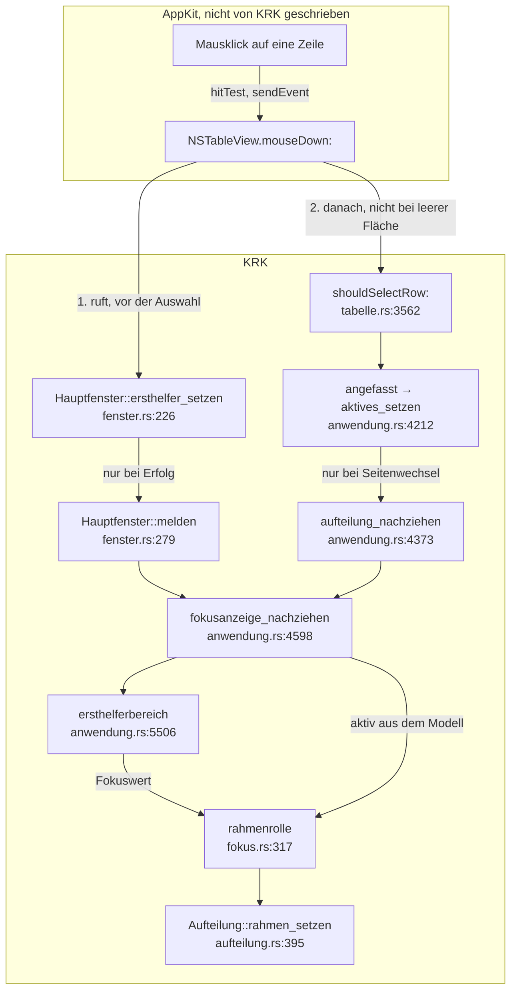

# Analyse: Warum ein Klick in das Dateifenster den Fokus nicht holt

**Datum:** 2026-08-19 10:43
**Typ:** Failure Investigation
**Status:** Complete
**Angefordert von:** Nutzer
**Gegenstand:** `shared/issues/260819-0900_o_ein-klick-in-das-dateifenster-holt-den-fokus-nicht-der-rahmen-bleibt-stehen.md`

## Frage

Der Defektdatensatz vom 260819-0900 hält fest, dass ein Klick in ein Dateifenster
den Eingabefokus nicht dorthin holt, und stellt vier Fragen: warum die
`NSTableView` den Ersthelferrang beim Klick nicht nimmt, ob die Lesezeichen- und
Geräteleiste denselben Grund hat, ob der Editor unauffällig ist, was ein Klick
auf die freie Fläche unter der letzten Zeile bewirkt, und ob es eine gemeinsame
Stelle für die Regel gibt. Diese Analyse beantwortet die Fragen 2 bis 5 belegt
und weist für Frage 1 nach, dass ihre Voraussetzung nicht trägt.

## Umfang

Gelesen: `crates/krk-ui/src/appkit/` vollständig, soweit Fokus, Ersthelferrang,
Mausklick und Fokusanzeige betroffen sind, dazu `crates/krk-ui/src/kommandos/fokus.rs`,
`crates/krk-ui/src/fenstermodell.rs` und der SDK-Kopf
`AppKit.framework/Headers/NSResponder.h`. Gemessen: fünf weggeworfene Programme
in Objective-C, die den Aufbau des Dateifensters, der Leiste, der Vorschau und
des Editors nachbauen und synthetische Mausklicks durch die Ereignisschlange des
Fensters schicken. Alle Messungen am 260819 auf macOS 15.7.7 (Build 24G720),
also auf dem Referenzgerät. Nicht gemessen: das laufende KRK-Bündel selbst.

## Befunde

### Der Kernbefund: die Voraussetzung des Datensatzes trägt nicht

**Ein Aufbau, der dem Dateifenster in jeder ablesbaren Eigenschaft entspricht,
nimmt den Ersthelferrang beim Klick von selbst.** Der Datensatz nimmt an, etwas
im Baum hindere die `NSTableView` daran, und nennt drei Kandidaten. Keiner davon
existiert, und der Nachbau widerlegt die Annahme unmittelbar.

Der Nachbau trägt: ein Fenster als Unterklasse mit derselben Überschreibung von
`makeFirstResponder:` wie `appkit/fenster.rs:226`, eine `NSSplitView` mit einem
`NSBox` je Bereich wie `appkit/aufteilung.rs:432`, die `NSScrollView` mit der
`NSTableView` und allen Eigenschaften aus `appkit/tabelle.rs:4271`, vier Spalten,
die Namensspalte als `NSTextField`-Unterklasse mit `setEditable(true)` und
Ziel/Aktion wie `tabelle.rs:3908`, den Doppelklick über `setDoubleAction:`, die
Anmeldung der Abwurfsorten, ein Kontextmenü und einen Delegierten mit
`tableView:shouldSelectRow:`. Das Fenster ist Schlüsselfenster, die Anwendung
aktiv, und die Klicks gehen über `postEvent:atStart:` durch die echte
Ereignisschlange.

| Klickziel | `hitTest:` liefert | `makeFirstResponder:` | Ersthelfer danach | `shouldSelectRow:` |
|---|---|---|---|---|
| Namensspalte, Zeile 3 | `Namensfeld` | `NSTableView` → ja | `NSTableView` | ja |
| Datumsspalte, Zeile 5 | `NSTextField` | `NSTableView` → ja | `NSTableView` | ja |
| freie Fläche unter der letzten Zeile | `NSTableBackgroundView` | `NSTableView` → ja | `NSTableView` | **nein** |
| Zelle in einer `NSView`-Hülle (Bauart der Leiste) | `NSView` | `NSTableView` → ja | `NSTableView` | ja |
| Fläche mit `acceptsFirstResponder` und ohne `mouseDown:` | die Fläche | wird nicht gerufen | **unverändert** | entfällt |

Die drei vom Datensatz genannten Kandidaten sind am Baum ausgeschlossen. Ein
`setRefusesFirstResponder(true)` steht ausschließlich an den Schaltern der
Bereichsleiste (`appkit/bereichsleiste.rs:647`), also an der Leiste am Fensterfuß
und nicht an einer Tabelle. Eine Überschreibung von `hitTest:` gibt es im ganzen
Baum nicht. Ein `mouseDown:` steht an genau einer Stelle, `appkit/vorschau.rs:250`.
Der `NSBox` fängt nichts ab: `gerahmt` setzt die fertige Ansicht als
`contentView` (`aufteilung.rs:440`), der Kasten enthält den Inhalt also und liegt
nicht darüber. Der lokale Ereignisabgriff hört allein auf `NSEventMask::KeyDown`
(`appkit/ereignisse.rs:423`) und sieht keinen Mausklick.

Damit steht der Schluss des Datensatzes auf zu schmaler Grundlage. Aus "der
Rahmen bleibt stehen" folgt nicht "`makeFirstResponder:` findet nicht statt",
solange der zweite Zweig nicht ausgeschlossen ist: die Anzeige könnte nicht
nachgezogen werden oder den alten Wert errechnen.

### Die Wirkungskette und die drei Stellen, an denen sie reißen kann

Die Reihenfolge im Diagramm ist gemessen und nicht angenommen: `makeFirstResponder:`
läuft **vor** `tableView:shouldSelectRow:`. Der Kreis über `aufteilung_nachziehen` ist
gewollt: die Anzeige hat zwei Anlässe, den Ersthelferwechsel und den Wechsel des aktiven
Dateifensters, und der zweite folgt beim Klick auf eine Zeile dem ersten. Wo die Kette
reißen kann, ist damit auf drei Stellen eingegrenzt.

Erstens, `makeFirstResponder:` wird nicht gerufen oder liefert `false`. Die
Überschreibung meldet nur bei Erfolg (`fenster.rs:231`), ein abgelehnter Wechsel
lässt die Anzeige also unberührt. Abgelehnt wird ein Wechsel, wenn der bisherige
Ersthelfer den Rang nicht abgibt.

Zweitens, `melden` findet keinen Melder oder der schwach gehaltene
Anwendungsdelegierte ist fort (`fenster.rs:279`, eingehängt in `anwendung.rs:1112`).
Dann bliebe die Anzeige auf **jedem** Weg stehen, auch beim Fokuswechsel über die
Tastatur.

Drittens, `ersthelferbereich` antwortet falsch. Das setzte voraus, dass entweder
`downcast_ref::<NSView>` oder `isDescendantOf:` fehlschlägt, und beides träfe
ebenfalls den Tastaturweg.

Die zweite und dritte Möglichkeit sind mit einem Handgriff zu trennen: wechselt
der Rahmen dem Tastaturbefehl, aber nicht der Maus, dann bleibt allein die erste
übrig.

### Frage 2: die Lesezeichen- und Geräteleiste

**Dieselbe Bauart, damit derselbe Grund, und ihr fehlendes `acceptsFirstResponder`
ist keine Lücke.** Die Leiste ist eine `NSTableView` in einer `NSScrollView`
(`appkit/leiste.rs:562` und `:581`), gebaut wie das Dateifenster und mit einer
`NSView` als Zellenhülle statt eines nackten Textfeldes (`leiste.rs:489`). Der
Nachbau mit dieser Hülle nimmt den Rang ebenso (Zeile 4 der Tabelle oben). Eine
`NSTableView` braucht weder `acceptsFirstResponder` noch `mouseDown:`; sie bringt
beides mit. Dass `leiste.rs` keines von beidem trägt, erklärt nichts und ist
kein Befund.

### Frage 3: der Editor

**Der Editor ist unauffällig, und der Grund ist gemessen.** Eine `NSTextView`
nimmt den Rang beim Klick von sich aus. Der Nachbau des Editors nach
`appkit/editor.rs:3127-3140`, also mit `setEditable(true)`, `setSelectable(true)`,
`setRichText(false)` und `setAllowsUndo(true)`, gibt ihn beim Klick in die Liste
auch wieder ab, und der Weg zurück in den Editor trägt ebenso.

Der Eintrag zum Ereignisabgriff in `CLAUDE.md` ist hier ohne Belang, und das
ist die Stelle, an der er sich leicht falsch lesen lässt. `ersthelfer_gehoert_appkit`
(`appkit/ereignisse.rs:685`) entscheidet, wohin ein **Tastendruck** geht, und
fragt dafür nach der Nämlichkeit der Editorfläche (`anwendung.rs:2357`, über
`isEqual`). Für den Mausklick spielt die Funktion keine Rolle, weil der Abgriff
nur `KeyDown` sieht.

Eine Einschränkung gehört dazu: der Editor ist der einzige der vier Bereiche, der
den Rang **verweigern** könnte. `NSTextView` gibt ihn nicht ab, wenn der
Delegierte das Ende der Bearbeitung ablehnt. Der Nachbau ohne Delegierten zeigt
das Verweigern nicht; KRK setzt einen Delegierten (`editor.rs:1534`). Falls sich
das Fehlverhalten allein bei Fokus im Editor zeigt, liegt hier der erste Verdacht,
und der Fix gehörte dann an den Editor und nicht an das Dateifenster.

### Frage 4: der Klick auf die freie Fläche unter der letzten Zeile

**Der Ersthelferrang wechselt, die Auswahl fällt weg, und das aktive Dateifenster
bleibt stehen.** Gemessen: `hitTest:` liefert die `NSTableBackgroundView`, die
Tabelle wird Ersthelfer, `selectedRow` geht auf −1, und
`tableView:shouldSelectRow:` wird nicht gerufen.

Für KRK folgt daraus ein eigener Defekt, und er ist aus Code und Messung
zusammen belegt, ohne dass es das laufende Bündel braucht. `angefasst()` hat
genau zwei Rufer, `shouldSelectRow:` (`tabelle.rs:3564`) und die Tableiste
(`tabelle.rs:4406`). Bei einem Klick in die freie Fläche feuert keiner davon,
also bleibt `aktiv` auf der anderen Seite. `fokusanzeige_nachziehen` liest
`aktiv` frisch aus dem Modell (`anwendung.rs:4607`), und `rahmenrolle` löst
`Fokus::Dateifenster` über `bereich_mit_fokus` auf das **aktive** Dateifenster
auf (`kommandos/fokus.rs:318` und `:262`). Klickt der Nutzer in die freie Fläche
des nicht aktiven Dateifensters, malt KRK den Fokusrahmen auf das andere
Dateifenster. Nichts korrigiert das nach, weil `aktives_setzen` nicht läuft.

Dieselbe Verzahnung erzeugt bei einem Klick auf eine Zeile nur ein Flackern: der
erste Nachzug malt noch mit dem alten `aktiv`, der zweite über `aktives_setzen`
korrigiert.

### Frage 5: eine gemeinsame Stelle oder vier

**Eine gemeinsame Stelle für die Klickregel gibt es nicht, weil drei der vier
Bereiche die Regel gar nicht brauchen.** Der SDK-Kopf sagt die Zuständigkeit
ausdrücklich: "It is up to the particular control that wants to be validated to
call this method in its `-mouseDown:`" (`NSResponder.h:315`). AppKit kennt keinen
allgemeinen Weg vom Klick zum Ersthelferrang, und der Nachbau bestätigt es: eine
Fläche mit `acceptsFirstResponder` und ohne `mouseDown:` bleibt beim Klick
unbeteiligt.

Damit ist die Lage asymmetrisch. Beide Dateifenster und die Leiste sind
`NSTableView`, der Editor ist `NSTextView`, und alle vier bringen die Regel mit.
Allein die `Inhaltsflaeche` der Vorschau ist eine nackte `NSView`
(`appkit/vorschau.rs:235`) und braucht beide Hälften: `acceptsFirstResponder`,
damit `fokus_setzen` überhaupt hineinkommt, und `mouseDown:`, damit der Klick
wirkt. Ihr Modulkopf sagt genau das (`vorschau.rs:208`). Vier Überschreibungen
wären also nicht vier Wahrheiten über eine Regel, sondern drei überflüssige neben
einer nötigen.

Die Frage, die KRK selbst beantwortet, ist eine andere: welche Ansicht den Rang
für einen Bereich trägt. Sie steht schon an einer Stelle,
`Anwendungsdelegierter::fokusansicht` (`anwendung.rs:2156`), und die Vorschau
ist dort mit ihrer `Inhaltsflaeche` eingetragen. Das Ein-Ort-Prinzip ist gewahrt.

## Implikationen

Der Defektdatensatz beschreibt eine Beobachtung, deren Erklärung noch aussteht,
und seine bisherige Einengung führt in die falsche Richtung. Wer auf ihrer
Grundlage baut, schreibt ein `mouseDown:` in `tabelle.rs` und `leiste.rs`, das
nach allem Gemessenen nichts hinzufügt, weil AppKit dieselbe Zeile schon
ausführt. Das Fehlverhalten bliebe, und der Baum trüge zwei tote
Überschreibungen mehr.

Die Untersuchung hat den Suchraum von "warum nimmt die Tabelle den Rang nicht"
auf drei prüfbare Möglichkeiten verengt, und zwei davon lassen sich in Sekunden
ausschließen.

Unabhängig davon steht mit dem Klick in die freie Fläche ein eigener,
belegter Defekt fest, den der Datensatz als Frage geführt hat.

Und es fehlt eine Festlegung. Die Erwartung "ein Klick auf einen der vier
bedienbaren Bereiche legt den Fokus dorthin" steht nirgends im Baum. C9 der
Runde 2 hat als viertes Abnahmekriterium allein den Klick in die Bildlaufleiste
der Vorschau. Die Randfälle sind damit offen, und sie sind nicht selbsterklärend:
die freie Fläche unter der letzten Zeile, die Tableiste, die Statuszeile und die
Bereichsleiste, deren Schalter den Rang ausdrücklich verweigern.

## Empfehlungen

**Erst messen, dann schneiden.** Die Reihenfolge ist dieselbe, die der Befund
`260809-1738` der Runde 2 für dieselbe Klasse von Fragen gewählt hat.

1. **Zwei Handgriffe am laufenden Bündel, durch den Nutzer.** Sie trennen die
   drei verbliebenen Möglichkeiten und brauchen keine Messstrecke.
   - Fokus mit der Tastatur in einen anderen Bereich legen. Wandert der Rahmen
     mit, dann arbeiten Melder und `ersthelferbereich`, und es bleibt allein
     `makeFirstResponder:` auf dem Mausweg.
   - In eine Zeile des Dateifensters klicken und auf die Auswahl sehen. Springt
     die Auswahl auf die geklickte Zeile, hat der Klick die Tabelle erreicht, und
     der Fehler liegt hinter `makeFirstResponder:` und nicht davor.
   - Zusätzlich festhalten, ob das Fehlverhalten bei allen drei Ausgangslagen
     auftritt oder nur bei Fokus im Editor. Nur bei Editor hieße: der Editor gibt
     den Rang nicht ab, und der Fix gehört dorthin.
2. **Danach den Datensatz `260819-0900` nachziehen.** Sein Abschnitt "Warum das
   eine offene Frage und keine fertige Diagnose ist" nennt drei Kandidaten, die
   ausgeschlossen sind, und sein Schluss von der stehenden Anzeige auf das
   ausbleibende `makeFirstResponder:` ist nicht tragfähig. Der Reconciler oder
   der Nutzer schreibt das fort; diese Analyse ändert keinen fremden Datensatz.
3. **Den Klick in die freie Fläche als eigenen Defekt behandeln.** Er ist belegt
   und unabhängig vom Hauptbefund; der Datensatz dazu ist unten aufgeführt.
4. **Die Festlegung einholen, bevor gebaut wird.** Der Entscheidungsdatensatz
   unten stellt die Randfälle zur Wahl.
5. **Keine `mouseDown:`-Überschreibung an Tabelle oder Leiste, solange Schritt 1
   aussteht.** Sollte sich nach der Messung herausstellen, dass KRK den Wechsel
   selbst anstoßen muss, ist der integrale Ort nicht die einzelne Ansicht,
   sondern `Hauptfenster`: es ist schon der eine Auslösepunkt für jeden
   Ersthelferwechsel, es sieht in `sendEvent:` jeden Mausklick, und die
   Zuordnung Bereich → Ansicht liegt in `fokusansicht` bereits einmal vor. Der
   Weg dorthin ginge über denselben schwach gehaltenen Rückruf, den das Fenster
   für die Fokusanzeige schon trägt. Diese Möglichkeit steht hier als benannter
   Weg und nicht als Empfehlung: sie zu bauen, bevor die Ursache feststeht,
   wäre der Fix gegen eine unbelegte Diagnose.

## Eingereichte Datensätze

- `shared/issues/260819-1043_o_ein-klick-unter-die-letzte-zeile-laesst-das-aktive-dateifenster-stehen-und-malt-den-rahmen-auf-das-andere.md`
- `shared/decisions/260819-1043_o_welche-flaechen-holen-den-fokus-wenn-man-hineinklickt.md`

## Quellen

- `fusion-workbench/shared/issues/260819-0900_o_ein-klick-in-das-dateifenster-holt-den-fokus-nicht-der-rahmen-bleibt-stehen.md`
- `fusion-workbench/circles/260807-2116-eingebauter-editor-mit-textmarken/issues/260809-1738_c_der-rueckfall-in-fokus-antwortet-dateifenster-fuer-jede-unteransicht-eines-randbereichs.md`
- `crates/krk-ui/src/appkit/fenster.rs:226`, `:231`, `:279` (Überschreibung, Meldung nur bei Erfolg, Melder)
- `crates/krk-ui/src/appkit/anwendung.rs:1112` (Melder eingehängt), `:2156` (`fokusansicht`), `:2202` (`fokus_setzen`), `:2357` (`ist_editorflaeche`), `:4212` (`aktives_setzen`), `:4373` (`aufteilung_nachziehen`), `:4598` (`fokusanzeige_nachziehen`), `:5506` (`ersthelferbereich`)
- `crates/krk-ui/src/appkit/tabelle.rs:3562` (`shouldSelectRow:`), `:3908` (`setEditable(true)`), `:4271` (Aufbau der Tabelle), `:4406` (zweiter Rufer von `angefasst`), `:4437` (die Liste trägt den Fokus)
- `crates/krk-ui/src/appkit/leiste.rs:489` (Zellenhülle), `:562`, `:581` (Tabelle und Bildlaufansicht)
- `crates/krk-ui/src/appkit/vorschau.rs:208` (Begründung), `:236` (`Inhaltsflaeche`), `:243`, `:250`
- `crates/krk-ui/src/appkit/aufteilung.rs:432` (`gerahmt`), `:440` (`setContentView`), `:375` (`bereichssicht`), `:394` (`rahmen_setzen`)
- `crates/krk-ui/src/appkit/ereignisse.rs:423` (Maske `KeyDown`), `:685` (`ersthelfer_gehoert_appkit`)
- `crates/krk-ui/src/appkit/bereichsleiste.rs:647` (das einzige `setRefusesFirstResponder`)
- `crates/krk-ui/src/appkit/editor.rs:1534` (Delegierter), `:3127-3140` (Aufbau der Textfläche)
- `crates/krk-ui/src/kommandos/fokus.rs:234` (`in_bereich`), `:262` (`bereich_mit_fokus`), `:317` (`rahmenrolle`)
- `$(xcrun --show-sdk-path)/System/Library/Frameworks/AppKit.framework/Headers/NSResponder.h:315` (Zuständigkeit für den Klick)
- Fünf weggeworfene Messprogramme, 260819, macOS 15.7.7 (24G720). Sie liegen im
  Kratzverzeichnis der Sitzung und gehören nicht in den Baum; wer sie
  wiederholen will, baut sie aus der Tabelle unter "Der Kernbefund" nach.

## Offene Fragen

- [ ] Welcher der drei verbliebenen Zweige trägt? Zu klären mit den zwei
      Handgriffen aus Empfehlung 1, und nur vom Nutzer, weil ein Agent im
      laufenden Bündel weder klicken noch den Rahmen sehen kann.
- [ ] Tritt das Fehlverhalten bei allen drei Ausgangslagen auf, oder nur bei
      Fokus im Editor?
- [ ] Gilt die Zusage auch für die freie Fläche unter der letzten Zeile und für
      die Tableiste? Der Entscheidungsdatensatz stellt beides zur Wahl.
