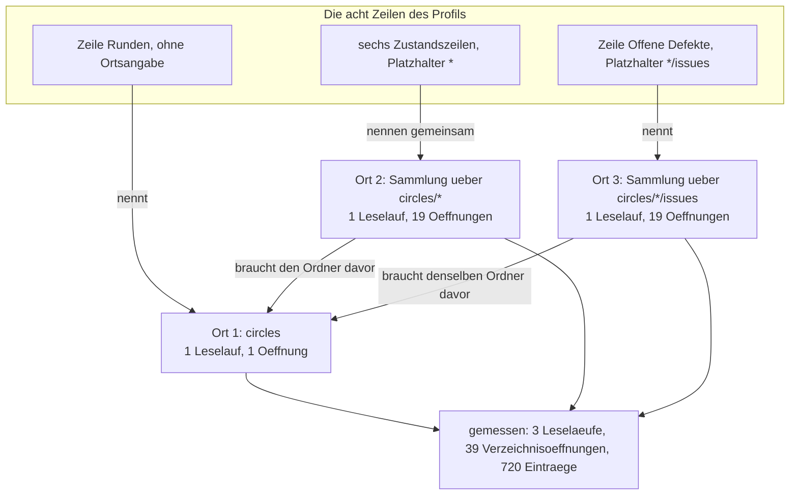

# Analysis: Was die zwölf Leseprofile an der wirklichen Werkbank kosten

**Date:** 2026-08-25 21:07
**Type:** Impact
**Status:** Complete
**Requested by:** orchestrator, Schritt 10 des Plans `shared/planning/260825-1725_p_plan-vorschau-vertieft-und-zwei-fehler.md`

## Question

Was kostet jedes der zwölf ausgelieferten Leseprofile an der Werkbank dieses Vorhabens, gemessen in Leseläufen, geöffneten Verzeichnissen, gelesenen Einträgen und Dateiöffnungen, und wie weit ist jede dieser Zahlen von ihrer Schranke entfernt? Die Zahlen im Abschnitt „Approach" des Plans sind gerechnet und nicht gemessen; mit dem Platzhalterlauf aus Schritt 5 weicht die Zahl der geöffneten Verzeichnisse erstmals von der Zahl der Leseläufe ab, und genau diese Abweichung ist der Preis der Runde.

## Scope

Gemessen wurden alle zwölf Profile aus `resources/default-readers.toml`, jedes an einem wirklichen Ort: die acht fusion-Profile an `fusion-workbench/` dieses Projekts, die vier flight-Profile an `/Users/k1/Projects/productive/example/`. Für die drei Profile, die viele Orte treffen (Speicher, Defektspeicher, einzelne Runde), ist der teuerste Ort dieser Werkbank gemessen und ein zweiter daneben.

**Baumstand.** HEAD `d04e50f`, Datum des Commits 2026-08-25 20:59:26 +0200, Zweig `main`, Tracking `## main...origin/main [voraus 12]`. Der Baum liegt zwölf Commits vor der Gegenseite; jede Aussage im Präsens gilt für diesen Stand und nicht für den veröffentlichten. Der Bestand der Werkbank zum Zeitpunkt der Messung: 19 Runden, 133 Einträge in den Rundenordnern, 568 Einträge in den 19 Defektspeichern der Runden, 116 davon offen, 92 Einträge in `shared/issues`, 63 davon offen.

**Wie erhoben wurde.** Zwei Zahlen liest die Anwendung selbst aus: `zusammenfassen_gezaehlt` liefert neben der Zusammenfassung den verbrauchten `Haushalt`, und der zählt Leseläufe und Dateiöffnungen (`crates/krk-core/src/leseprofil/mod.rs:749-805`). Zwei Zahlen zählt der `Haushalt` nicht, nämlich die geöffneten Verzeichnisse und die gelesenen Einträge; sie stammen aus einer Zählung der Systemaufrufe. Dafür steht eine kleine Bibliothek in C im Wegwerfverzeichnis dieser Sitzung, die über `DYLD_INSERT_LIBRARIES` drei Aufrufe von libSystem abfängt: `open(2)` unterscheidet Verzeichnis von Datei über `fstat(2)` am zurückgegebenen Deskriptor, `getattrlistbulk(2)` liefert die Zahl der vom Kern ausgelieferten Einträge, `realpath(3)` die Zahl der Auflösungsversuche. Der Messabschnitt ist über zwei Sentinel-Pfade abgegrenzt, so dass der eigene Start des Messprogramms in keine Zahl eingeht.

**Was nicht angefasst wurde.** Der KRK-Baum trägt keine Zeile Prüfcode dieser Messung. Das Messprogramm ist ein eigenes Cargo-Paket im Wegwerfverzeichnis mit einer Pfadabhängigkeit auf `krk-core`; es baut in sein eigenes `target/` und ruft ausschließlich öffentliche Schnittstellen (`ablage::leseprofile::AUSLIEFERUNGSTEXT`, `leseprofil::datei::pruefen`, `leseprofil::bausteine::zusammenfassen_gezaehlt`, `leseprofil::erkennung::erkennen`). Die drei künstlichen Verzeichnisbäume der Schrankenmessung lagen ebenfalls dort und sind nach der Messung entfernt.

**Keine Zeitmessung.** Dieser Bericht nennt keine Millisekunde. Keine der zehn Zusagen aus C8 der Runde 1 spricht über die Profil-Zusammenfassung, die Messstrecke sieht sie nicht (`circles/260823-2208-.../decisions/260824-1900_o_...`), und der Abnahmelauf verlangt KRK im Vordergrund und ist Nutzerarbeit. Gezählt sind Aufrufe. Was eine Zusammenfassung an Zeit kostet, ist an diesem Baum ungemessen.

## Findings

### Die vier Zahlen je Profil

| # | Profil | Gemessener Ort | Leseläufe | Verzeichnis&shy;öffnungen | Gelesene Einträge | Datei&shy;öffnungen |
|---|---|---|---|---|---|---|
| 1 | fusion-Werkbank: die Wurzel | `fusion-workbench` | 3 | 3 | 127 | 4 |
| 2 | fusion-Werkbank: ein Speicher | `shared/history` | 1 | 1 | 129 | 10 |
| 3 | fusion-Werkbank: ein Defektspeicher | `circles/260802-0842-…/issues` | 1 | 1 | 157 | 10 |
| 4 | fusion-Werkbank: alle Runden | `circles` | 3 | **39** | 720 | 0 |
| 5 | fusion-Werkbank: der Ablagespeicher | `archive` | 1 | 1 | 2 | 0 |
| 6 | fusion-Werkbank: der gemeinsame Speicher | `shared` | 10 | 10 | 286 | 0 |
| 7 | fusion-Werkbank: eine Runde | `circles/260802-0842-…` | 4 | 4 | 154 | 11 |
| 8 | Projektwurzel mit fusion-Werkbank | `/Users/k1/Projects/productive/krk` | 4 | 4 | 153 | 4 |
| 9 | flight-Werkbank: die Wurzel | `example/flight-workbench` | 5 | 5 | 17 | 3 |
| 10 | flight-Werkbank: ein Speicher | `flight-workbench/decisions` | 1 | 1 | 1 | 1 |
| 11 | flight-Werkbank: der Ablagespeicher | `flight-workbench/archive` | 1 | 1 | 0 | 0 |
| 12 | Projektwurzel mit flight-Werkbank | `/Users/k1/Projects/productive/example` | 6 | 6 | 18 | 3 |

Herkunft der Spalten: Leseläufe und Dateiöffnungen aus `Haushalt::leselaeufe()` und `Haushalt::oeffnungen()`, also aus der Buchung der Anwendung selbst. Verzeichnisöffnungen aus der Zählung von `open(2)` mit anschließendem `fstat(2)`. Gelesene Einträge aus der Summe der Rückgabewerte von `getattrlistbulk(2)`. Die dritte Spalte ist an jeder Stelle unabhängig gegengeprüft: 127 für die Werkbankwurzel sind 16 Einträge dort plus 19 in `circles` plus 92 in `shared/issues`, 720 für `circles` sind 19 plus 133 plus 568, 286 für `shared` sind die Summe der zehn Unterspeicher. Die Zahl der gemessenen Dateiöffnungen stimmt an allen zwölf Orten mit der gebuchten überein.

Vier weitere Messungen an zweiten Orten derselben Profile, damit die Spanne sichtbar ist: `shared/decisions` kostet 1 / 1 / 39 / 10, `shared/issues` 1 / 1 / 92 / 10, die Runde 16 (`circles/260823-2208-…`) 4 / 4 / 48 / 11, die zurückgestellte Runde `circles/260804-0933-…` 4 / 4 / 10 / 1.

### Die Abweichung, um die es geht

Bei elf der zwölf Profile ist die Zahl der geöffneten Verzeichnisse gleich der Zahl der Leseläufe. Beim Profil „alle Runden" ist sie es nicht: drei Leseläufe, neununddreißig Öffnungen. Das ist genau die Rechnung aus dem Plan (1 + 19 + 19), Stelle für Stelle bestätigt.

Die Kante von den zwei Sammlungen zurück auf Ort 1 ist die Stelle, an der die Bauart spart: der Ordner vor dem Platzhalter geht durch dieselbe Merkstelle wie jeder andere Ort und wird deshalb einmal gelesen, obwohl drei Zeilen ihn brauchen. Das Protokoll der Systemaufrufe zeigt `circles` genau einmal, danach neunzehn Rundenordner, danach neunzehn Defektspeicher.

Der Sonderfall daneben ist das Profil des gemeinsamen Speichers: zwanzig Zeilen, zehn Orte, zehn Leseläufe, zehn Öffnungen. Ohne Schritt 4 der Runde wären es zwanzig Läufe gegen einen Deckel von zwölf gewesen. Zwei der zwanzig Zeilen liefern heute den Platzhalter, weil `investigations` und `memos` leer sind; ein leerer Ordner kostet trotzdem seine Öffnung, liefert aber keinen Schwung.

### Was die Zahlen des Plans und die des Ontocoders halten

| Profil | Plan, gerechnet (Läufe / Öffnungen / Einträge / Dateien) | Gemessen | Befund |
|---|---|---|---|
| `circles/` | 3 / 39 / ~722 / 0 | 3 / 39 / 720 / 0 | trifft; die Einträge auf zwei genau |
| `shared/` | 10 / 10 / ~264 / 0 | 10 / 10 / 286 / 0 | Läufe und Öffnungen treffen, die Einträge lagen 22 zu niedrig |
| `archive/` | 1 / 1 / 2 / 0 | 1 / 1 / 2 / 0 | trifft vollständig |
| Projektwurzel | 5 / 5 / wie Werkbankwurzel / 5 | 4 / 4 / 153 / 4 | je eins zu hoch |

Die Projektwurzel kostet vier und nicht fünf, weil `.active-circle` an dieser Werkbank nicht steht: die Feldzeile „Aktive Runde" findet keinen Eintrag, den ihr Muster trifft, und öffnet deshalb keine Datei. Mit einer aktiven Runde wären es fünf Dateiöffnungen. Die vier Leseläufe sind die Wurzel selbst, `fusion-workbench`, `fusion-workbench/circles` und `fusion-workbench/shared/issues`; ein fünfter Ort steht in diesem Profil nicht.

Die sechs Zahlenpaare, die der Ontocoder in Schritt 8 genannt hat, halten alle: `shared` 10 Leseläufe und 0 Dateiöffnungen, `circles` 3 und 0, `archive` 1 und 0, Werkbankwurzel 3 und 4, Projektwurzel 4 und 4, flight höchstens 6 und 3. Was er nicht ausgewiesen hat, ist die Spalte, die diese Erhebung hinzufügt: bei `circles` stehen hinter seinen drei Leseläufen neununddreißig Verzeichnisöffnungen.

### Jede Schranke, ihr Abstand und der Bestand, bei dem sie fällt

| Schranke | Wert | Höchster gemessener Wert | Abstand | Fällt bei welchem Bestand |
|---|---|---|---|---|
| `HOECHSTENS_LESELAEUFE` | 12 | 10 (gemeinsamer Speicher) | 2 | Durch Wachstum der Werkbank nie. Die Zahl der Läufe ist die Zahl der im Profil genannten verschiedenen Orte und hängt nicht am Bestand. Sie fällt, wenn jemand dem Profil des gemeinsamen Speichers einen dreizehnten Unterspeicher hinzufügt. |
| `HOECHSTENS_OEFFNUNGEN` | 24 | 11 (eine Runde) | 13 | Durch Wachstum nie. Die elf sind der Circle-Datensatz und die zehn jüngsten Verläufe; `HOECHSTENS_JUENGSTE` deckelt die zweite Hälfte bei zehn. |
| `HOECHSTENS_EINTRAEGE` | 2.000 je Leselauf | 568 (Sammlung `circles/*/issues`) | 1.432 | Bei etwa 67 bis 93 Runden. Die Spanne folgt aus der Extrapolation: über alle 19 Runden liegt der Schnitt bei 29,9 Defektdatensätzen je Runde und ergibt 67, über die letzten zehn Runden bei 19,4 und ergibt 93. |
| `HOECHSTENS_EINTRAEGE`, zweitnächster Fall | 2.000 | 133 (Sammlung `circles/*`) | 1.867 | Bei 286 Runden. Jeder Rundenordner trägt genau sieben Einträge, an allen 19 gleich. |
| `HOECHSTENS_EINTRAEGE`, dritter Fall | 2.000 | 157 (größter Defektspeicher) | 1.843 | Bei 2.000 Datensätzen in einem einzelnen Speicher. |
| `HOECHSTENS_BYTES` | 64 KB je gelesener Datei | 119.614 Byte | **bereits überschritten** | Schon heute, siehe unten. |
| `HOECHSTENS_JUENGSTE` | 10 | 10 | 0 | Erreicht und so gewollt; die Zeile heißt „Die jüngsten zehn". |
| Verzeichnisöffnungen | **keine Schranke** | 39 | nicht bestimmbar | Wächst als 1 + 2N mit der Zahl N der Runden: 135 bei 67 Runden, 187 bei 93, 201 bei hundert. |

Wenn die Eintragsschranke bei etwa 67 bis 93 Runden greift, sagt die Zeile „Offene Defekte, alle Runden" nicht mehr eine Zahl, sondern „mindestens N (Lesung bei 2000 Einträgen abgebrochen)". Das ist die Vokabel `Wert::UeberGrenze` und genau der Fall, den die Zeile `**Decidability:**` des Plans vorhergesagt hat. Sie sagt dann selbst, dass sie unvollständig ist, statt eine stillschweigend falsche Zahl zu nennen.

### Die 64-KB-Grenze ist an dieser Werkbank schon überschritten

Der Feldbaustein liest eine Datei über `text::datei::anlesen` bis `HOECHSTENS_BYTES`, also 64 KB. Der Circle-Datensatz `circles/260804-0933-eingebauter-web-betrachter-im-vorschaufenster/_d_circle.md` ist 119.614 Byte groß, also das 1,8-fache. Die Zeile „Directive" jenes Profils antwortet trotzdem richtig, und zwar allein deshalb, weil `## Directive` in Zeile 12 der Datei steht. Ein Feld jenseits von 64 KB fiele auf den Platzhalter zurück, ohne dass etwas darauf hinwiese. Keine der Dateien unter `shared/history`, `circles/*/history`, `shared/issues` und `circles/*/issues`, die der Baustein „die jüngsten zehn" öffnet, liegt heute über 64 KB.

### Die Rechnung des Datensatzes 260825-1953 ist bestätigt

Der offene Datensatz `shared/issues/260825-1953_o_ein-platzhalterlauf-oeffnet-bis-zu-zweitausend-verzeichnisse-und-die-eintragsschranke-faengt-das-nicht.md` verlangt eine zweite Messung an einem Ordner mit vielen leeren Unterordnern und nennt rechnerisch rund 22.000 Verzeichnisöffnungen gegen eine Zusage von zwölf Leseläufen. Beide Hälften sind an künstlichen Bäumen im Wegwerfverzeichnis nachgemessen.

| Messung | Bau | Leseläufe | Verzeichnis&shy;öffnungen | `realpath` | davon ohne Treffer | Gelesene Einträge |
|---|---|---|---|---|---|---|
| Ausgeliefertes Profil „alle Runden" | 2.500 Runden, jede mit leerem `issues` | 3 | **4.001** | 4.001 | 0 | 4.500 |
| Dasselbe Profil, `issues` fehlt überall | 2.500 Runden ohne `issues` | 3 | 2.001 | 4.001 | 2.000 | 2.500 |
| Eigenes Profil mit elf Sammlungen | 2.500 Runden mit je elf leeren Unterordnern | 12 | **22.001** | 22.001 | 0 | 2.500 |

Die dritte Zeile ist die Schranke, von der der Datensatz spricht, und sie steht auf 22.001 und nicht auf „rund 22.000 als Schätzung". Der Bau dazu: elf Zeilen mit den Ortsangaben `*/s01` bis `*/s11`, die sich einen Ordner davor teilen, also ein Leselauf für den gemeinsamen Ordner und elf für die Sammlungen. Jede Sammlung öffnet die 2.000 Unterordner, die die auf 2.000 Einträge gedeckelte Elternlesung ihr liefert, und sammelt aus jedem null Einträge, so dass die Eintragsschranke nie greift.

Bestätigt ist auch der zweite Satz des Datensatzes, dass ein Fehlschlag einen Auflösungsversuch kostet und keinen Eintrag liefert: in der zweiten Zeile stehen 4.001 Aufrufe von `realpath` gegen 2.001 Öffnungen, und genau 2.000 dieser Aufrufe scheitern.

Zwei Ergänzungen, die im Datensatz nicht stehen und aus der Messung folgen. Erstens läuft `realpath` einmal je **Zeile** mit Ortsangabe und nicht einmal je Ort: das Profil des gemeinsamen Speichers zählt 21 Auflösungen gegen 10 Öffnungen, weil zwanzig Zeilen zehn Orte nennen und die Zusammenfassung ihren eigenen Ordner einmal auflöst. Die Merkstelle spart den Leselauf, nicht die Auflösung. Zweitens sagt die abgeschnittene Antwort in allen drei künstlichen Läufen von sich, dass sie abgeschnitten ist; die Zeilen lesen sich als „mindestens 0 (Lesung bei 2000 Einträgen abgebrochen)". Die Regel aus dem Modulkopf trägt also auch dort, wo der Abbruch aus der Elternlesung stammt und nicht aus der Sammlung selbst.

### Was ein Ordner ohne Profil kostet

Der Entscheidungsdatensatz zu L7 nennt als ungemessene Größe, dass seit der Runde 16 jeder ausgewählte Ordner ohne Pfadmuster einen Verzeichnisleselauf kostet, den es vorher nicht gab. Gemessen ist er jetzt: `crates` kostet eine Verzeichnisöffnung und drei gelesene Einträge, `crates/krk-ui/src/appkit` eine Öffnung und 31 Einträge, `archive/260820-2115-safe-cleanup-tier-1/shared` eine Öffnung und zwei Einträge. Eine Dateiöffnung fällt in keinem dieser Fälle an.

Für den großen Ordner ergibt die Messung einen Zusatz, der die Auslegung der Eintragsschranke schärft. An einem künstlichen Ordner mit 3.000 Dateien liefert der Kern alle 3.000 Einträge, an einem mit 20.000 liefert er 3.276 und dann keinen weiteren. Die Schranke begrenzt, was gesammelt wird, und schneidet den laufenden Schwung nicht ab: ein Leselauf holt höchstens einen Puffer von 256 KB über die 2.000 hinaus, danach stellt er die Arbeit ein. Für die Zusage ist das unerheblich, für die Auslegung des Wortes „gelesene Einträge" nicht.

### Was die Zusammenfassungen an dieser Werkbank sagen

Alle zwölf Profile antworten. Zwei Auffälligkeiten in den Werten selbst, beide schon abgelegt oder unten aufgeführt:

- Die Zeile „Projekt" liefert an der fusion-Werkbank den Platzhalter, an der flight-Werkbank dagegen `2026-Sommer-Adria`. Das ist der offene Datensatz `shared/issues/260825-2044_o_die-zeile-projekt-der-werkbankprofile-haengt-an-einem-feld-das-fusion-nicht-mehr-schreibt.md`, hier bestätigt und nicht neu erfasst.
- Die sechs Zustandszahlen des Profils „alle Runden" gehen auf: 5 kohärent geschlossen, 12 beschränkt geschlossen, 2 zurückgestellt, zusammen 19 wie die Zeile „Runden". Die Zeile „Offene Defekte, alle Runden" zeigt 116 und geht gegen `find fusion-workbench/circles/*/issues -maxdepth 1 -name '*_o_*.md' | wc -l` auf. Die Zeile „Offene Defekte, gemeinsam" des Wurzelprofils zeigt 63 und geht gegen dasselbe `find` über `shared/issues` auf.

## Implications

**Die Zusage über Leseläufe und Dateiöffnungen ist mit Abstand gehalten, und sie wird durch Wachstum der Werkbank nicht enger.** Beide Zahlen sind Eigenschaften des Profils und nicht des Bestands. Wer sie fallen sehen will, muss ein Profil ändern, und die eine Stelle, an der wenig Luft bleibt, ist der gemeinsame Speicher mit zehn von zwölf Läufen. Der Kommentar über jenem Block sagt das bereits und ist damit belegt.

**Die Zahl der geöffneten Verzeichnisse ist die eine Größe ohne Schranke, und der Preis dafür ist heute klein und morgen nicht abzulesen.** Neununddreißig Öffnungen für eine Zusammenfassung sind an dieser Werkbank unauffällig; die Form wächst mit 1 + 2N, und bei hundert Runden stünden 201 da. Die Schranke, die es gibt, liegt bei 22.001 Öffnungen je Zusammenfassung und ist gemessen. Ob das getragen wird, ist die Frage des Datensatzes 260825-1953 und bleibt seine.

**Die Eintragsschranke greift zuerst dort, wo sie gedacht war.** Von allen Orten aller zwölf Profile ist die Sammlung über `circles/*/issues` der einzige, dessen Bestand in absehbarer Zeit an die 2.000 stößt, und sie ist genau der Ort, für den der Platzhalterlauf gebaut wurde. Zwischen 67 und 93 Runden verliert die Zeile ihre Zahl und behält ihre Aussage.

**Was eine überflüssige Zusammenfassung kostet, ist damit beziffert.** Der offene Datensatz `shared/issues/260825-1922_o_eine-auffrischung-stoesst-die-vorschau-mit-an-und-die-kosten-sind-ungemessen.md` stellt zwei Fragen und nennt die zweite als die, die Schritt 10 beantworten kann. Die Antwort für die Werkbank dieses Vorhabens: ein überflüssiger Lauf über den Ordner `circles` kostet 3 Leseläufe, 39 Verzeichnisöffnungen und 720 gelesene Einträge; über `shared` 10 Leseläufe und 286 Einträge; über eine einzelne Runde 4 Leseläufe und 11 Dateiöffnungen; über einen Ordner ohne Profil eine einzige Verzeichnisöffnung. Der Ordner `circles` ist der teuerste der zwölf, und er ist zugleich einer der Orte, an denen ein Agent oder der Nutzer beim Arbeiten oft steht. Die erste Frage jenes Datensatzes, wie oft eine Auffrischung im Alltag meldet, beantwortet diese Erhebung nicht; ohne sie lässt sich die Gesamtlast nicht angeben.

## Recommendations

1. **Der Datensatz 260825-1953 ist entscheidungsreif.** Seine Rechnung ist bestätigt, und die Messung, die er anfordert, liegt vor. Die Wahl zwischen seinen drei Möglichkeiten liegt beim Nutzer; dieser Bericht empfiehlt keine, weil die Frage nicht technisch ist, sondern lautet, ob eine Schranke ohne heutigen Anlass gebaut wird. Nächster Agent: keiner, bis der Nutzer geantwortet hat.
2. **Die zweite Hälfte des Datensatzes 260825-1922 zur Auffrischung braucht eine Zählung der FSEvents-Meldungen, keine zweite Kostenmessung.** Der Kostenteil ist erledigt. Wer die Frage abschließen will, misst, wie oft `nach_lesebeginn` im Alltag meldet. Das ist Arbeit an `krk-ui` und damit Sache des `coder`, und sie hängt an einer laufenden Anwendung.
3. **Die Zahlen im Abschnitt „Approach" des Plans sind durch diese Tabelle ersetzt.** Drei der vier Zeilen treffen, die vierte liegt in allen drei Spalten um eins zu hoch. Ein Nachzug im Plan ist nicht nötig, weil der Plan seine Zahlen selbst als gerechnet ausweist und diesen Schritt als ihre Ablösung führt.

## Filed Issues

- `fusion-workbench/shared/issues/260825-2107_o_der-l7-entscheid-nennt-fuer-das-groesste-mitgelieferte-profil-fuenf-leselaeufe-gemessen-sind-vier.md` — der offene Entscheidungsdatensatz zu L7 beziffert das größte mitgelieferte Profil mit fünf Leseläufen und elf Dateiöffnungen; seit Schritt 4 dieser Runde kostet jenes Profil vier Leseläufe, und das größte nach Leseläufen ist ein anderes geworden.
- `fusion-workbench/shared/issues/260825-2107_o_ein-circle-datensatz-liegt-beim-1-8-fachen-der-64-kb-grenze-des-feldbausteins.md` — die Feldzeile „Directive" liest eine Datei von 119.614 Byte mit einer Grenze von 64 KB und antwortet nur richtig, weil der Abschnitt in Zeile 12 steht.

## Sources

- `fusion-workbench/shared/planning/260825-1725_p_plan-vorschau-vertieft-und-zwei-fehler.md`, Zeile `**Decidability:**`, Abschnitt `## Approach` und Schritte 8 und 10.
- `crates/krk-core/src/leseprofil/mod.rs:106-148` (die fünf Schranken), `:749-805` (`Haushalt`), `:664-745` (`Wert::UeberGrenze`).
- `crates/krk-core/src/leseprofil/bausteine.rs`, Modulkopf Zeilen 24-82 (ein Ort je Zusammenfassung, der Platzhalterlauf, der Wechsel der Einheit) und `Lauf::lesen` sowie `Lauf::gestreut_lesen` (`:417-476`).
- `crates/krk-core/src/verzeichnis/leser.rs:234-259` (`lesen_hoechstens`) und `crates/krk-core/src/verzeichnis/sys.rs:147` (`PUFFERGROESSE`), `:229-253` (`Schwungleser::oeffnen`).
- `resources/default-readers.toml:274-757` (die zwölf Profile).
- `fusion-workbench/shared/issues/260825-1953_o_ein-platzhalterlauf-oeffnet-bis-zu-zweitausend-verzeichnisse-und-die-eintragsschranke-faengt-das-nicht.md`.
- `fusion-workbench/shared/issues/260825-1922_o_eine-auffrischung-stoesst-die-vorschau-mit-an-und-die-kosten-sind-ungemessen.md` und `…_o_der-programmstart-und-der-tabwechsel-erreichen-die-neue-vorschauregel-nicht.md`.
- `fusion-workbench/shared/issues/260825-2044_o_die-zeile-projekt-der-werkbankprofile-haengt-an-einem-feld-das-fusion-nicht-mehr-schreibt.md`.
- `fusion-workbench/circles/260823-2208-vorschau-zeigt-profil-zusammenfassung-statt-metadaten/decisions/260824-1900_o_wie-wird-die-arbeit-dieser-runde-jemals-gegen-l7-gemessen-die-messstrecke-sieht-sie-nicht.md`.
- `fusion-workbench/circles/260823-2208-vorschau-zeigt-profil-zusammenfassung-statt-metadaten/issues/260824-1655_o_sechs-speicher-unter-archive-bleiben-ohne-profil-und-tragen-dieselben-datensatzarten.md`.
- Messwerkzeug und Rohprotokolle im Wegwerfverzeichnis dieser Sitzung: `scratchpad/messung/zaehler.c`, `scratchpad/messung/harness/`, `scratchpad/messung/gesamt.txt`. Nicht Teil des Baumes.

## Die drei offenen Datensätze, und was diese Erhebung ihnen beiträgt

**`shared/issues/260825-1953_o_ein-platzhalterlauf-oeffnet-bis-zu-zweitausend-verzeichnisse-…`.** Beigetragen ist die Messung, die er unter „Was zu tun wäre" verlangt, in beiden Hälften: an der wirklichen Werkbank kostet das Profil „alle Runden" 39 Verzeichnisöffnungen bei drei Leseläufen, an einem Ordner mit 2.500 leeren Unterordnern kostet dasselbe Profil 4.001, und die Schranke, die er mit „rund 22.000" beziffert, steht gemessen auf 22.001. Seine Rechnung ist damit bestätigt und nicht widerlegt. **Offen bleibt seine eigentliche Frage**, nämlich welche seiner drei Möglichkeiten gilt: es bleiben lassen, eine sechste Zahl im Haushalt auf die Treffer eines Platzhalterlaufs legen, oder die Treffer gegen `HOECHSTENS_EINTRAEGE` mitzählen. Dieser Bericht beantwortet sie nicht.

**`circles/260823-2208-…/decisions/260824-1900_o_wie-wird-die-arbeit-dieser-runde-jemals-gegen-l7-gemessen-…`.** Beigetragen sind zwei Zahlen, die der Datensatz als ungemessen führt. Erstens kostet ein ausgewählter Ordner ohne Profil genau eine Verzeichnisöffnung und keine Dateiöffnung, gemessen an drei Orten. Zweitens ist seine Angabe „das größte mitgelieferte Profil kostet gemessene fünf und elf" seit Schritt 4 dieser Runde überholt, und die Berichtigung ist als Defekt abgelegt. **Dringender wird die Frage durch diese Runde**, weil ein Ordnerwechsel seit Schritt 7 eine Zusammenfassung auslöst, die es vorher nicht gab: der Weg, der bis gestern nur bei einem angewählten Ordner lief, läuft jetzt bei jedem Eintritt in einen Ordner. **Offen bleibt alles, was der Datensatz fragt**, nämlich ob die Sitzungsstrecke einen Ordnersprung bekommt, ob der Messmodus die Leseprofile lädt, und ob eine solche Zahl unter L7 fällt oder eine elfte Zusage wäre. Keine dieser Fragen ist durch eine Zählung von Aufrufen zu beantworten, denn L7 spricht über Zeit, und Zeit misst dieser Bericht nicht.

**`circles/260823-2208-…/issues/260824-1655_o_sechs-speicher-unter-archive-bleiben-ohne-profil-…`.** Beigetragen ist der Nachweis, dass das neue `archive`-Profil ihn nicht erledigt. Gemessen am heutigen Stand: `archive/260820-2115-safe-cleanup-tier-1/shared/decisions` und `…/shared/issues` liefern beide `KEIN_PROFIL`, ebenso die `shared`-Hülle darüber. Das neue Profil spricht über `fusion-workbench/archive` selbst, jener Datensatz über die Speicher unter `archive/<lauf>/shared/`, und sein Pfadmuster-Argument steht unverändert. **Offen bleibt seine Frage**, ob ein eingefrorener Bestand ein Speicherprofil bekommen soll, samt der Beobachtung in seinem Nachtrag, dass die Zeile „Die jüngsten zehn" an einem archivierten Speicher nur so aussieht wie eine Auskunft.

## Open Questions

- [ ] Wie oft meldet eine Auffrischung im Alltag? Ohne diese Zahl bleibt die Gesamtlast aus dem Datensatz `260825-1922` zur Auffrischung unbestimmt, obwohl der Preis eines einzelnen Laufs jetzt beziffert ist.
- [ ] Bleibt es bei 22.001 möglichen Verzeichnisöffnungen je Zusammenfassung, oder bekommt der Platzhalterlauf eine eigene Schranke? Die Frage gehört dem Datensatz `260825-1953` und dem Nutzer.
- [ ] Wächst der Defektbestand je Runde eher wie der Gesamtschnitt von 29,9 oder wie der Schnitt der letzten zehn Runden von 19,4? Davon hängt ab, ob die Eintragsschranke bei 67 oder bei 93 Runden greift.
