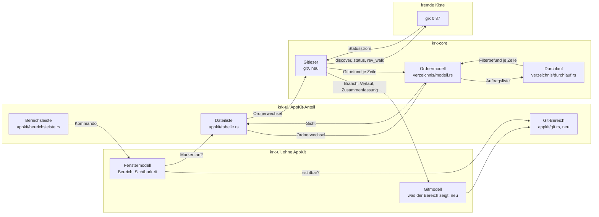
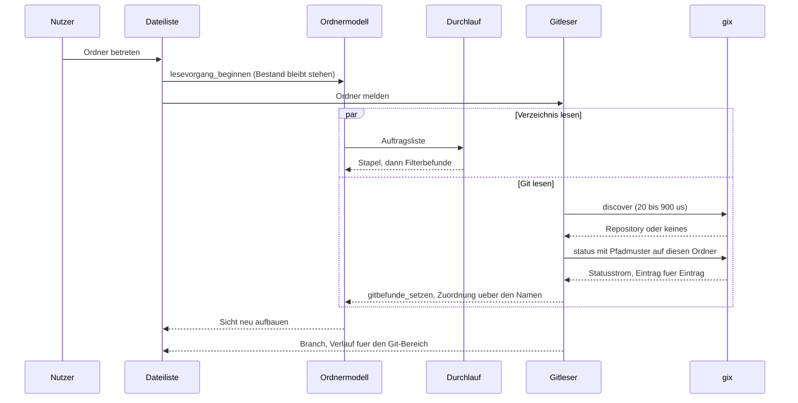

# Analyse: `gix` (gitoxide) als Git-Anbindung für KRK, Stufe A

**Date:** 2026-08-30 10:06
**Type:** Feasibility
**Status:** Complete
**Requested by:** user (Kai Stalmann), über den Orchestrator
**Filed by:** analyst, Kai Stalmann <kai@stalmann.org>

## Question

Trägt `gix` den lesenden Funktionsumfang der Stufe A (Repository finden, Status je Datei, Branchname, Commit-Verlauf), ohne die Bauvoraussetzungen dieses Projekts zu ändern, und was kostet er an Zeit, an Abhängigkeiten und an Umbau im bestehenden Baum?

## Scope

Geprüft wurden `gix` 0.87.1 (veröffentlicht am 2026-08-24, jüngste Fassung zum Zeitpunkt der Erhebung), sein Merkmalsbaum aus der eigenen `Cargo.toml`, seine Statuskiste `gix-status` 0.34.1, sowie im KRK-Baum die Aufzählungen `Bereich`, `Fokus`, `Wirkungsbereich`, das Modul `krk-core/src/verzeichnis/`, die Kistenaufteilung des Workspace und die zehn Zeitzusagen aus `crates/krk-bench/src/messen.rs`.

**Baumstand:** HEAD `d1fbaac0b9bad03c0dc9e014ca008f636a0816dc`, dessen Commitdatum 2026-08-29T13:10:53+02:00, Branch `main`, `git status -sb` meldet `## main...origin/main` ohne Vorsprung oder Rückstand; der Arbeitsbaum trägt vier Änderungen, alle unterhalb von `fusion-workbench/`. Jede Gegenwartsaussage unten ist auf diesen Stand datiert.

**Messgerät:** dieselbe Maschine, auf der die Sitzung läuft, `Intel Core i9-9880H`, 16 GB, macOS 15.7.7. Das ist **das Referenzgerät der zehn Zeitzusagen** (`circles/260802-0842-krk-mac-dateimanager-editor-git/decisions/260802-1036_*_leistungszusagen-navigator.md`: MacBook Pro 15", 2018, 8-Core i9 2,3 GHz, 16 GB, macOS 15.7.7). Die Zahlen unter Frage 4 sind damit unmittelbar mit L1, L3 und L10 vergleichbar und nicht auf ein schnelleres Gerät zu übertragen.

**Prüfaufbau:** ein Wegwerf-Workspace außerhalb des Projektbaums (`…/scratchpad/gixprobe`) mit fünf kleinen Programmen gegen `gix` 0.87.1 (`main.rs`, `negativ.rs`, `index.rs`, `beide.rs`, `untracked.rs`). Gefahren wurden sie gegen KRKs eigenes Repository (2 192 verfolgte Dateien, 773 Commits) und gegen fünf angelegte Wegwerf-Repositorys: eines mit 10 500 Dateien, eines mit 100 500, eines mit 10 000 unverfolgten, eines mit abgelöstem und eines mit ungeborenem HEAD. `Cargo.toml`, `Cargo.lock` und der Projektbaum sind nicht angefasst worden.

## Findings

### Frage 1: Deckt `gix` den Funktionsumfang der Stufe A?

Ja, alle vier Auskünfte, und alle vier sind am laufenden Programm gegen KRKs eigenes Repository geprüft und nicht aus der Dokumentation abgeschrieben.

| Auskunft | API in `gix` 0.87.1 | geprüft |
|---|---|---|
| Repository unter einem Pfad finden | `gix::discover(&Path) -> Result<Repository, discover::Error>` (`src/lib.rs:262`), sucht aufwärts; `gix::open` (`src/lib.rs:418`) ohne Aufwärtssuche | ja, siehe Frage 8 |
| Status der Arbeitskopie je Datei | `Repository::status(progress)` (`src/status/mod.rs:99`) liefert eine `Platform`; `Platform::into_index_worktree_iter(patterns)` für die Hälfte Index↔Arbeitskopie, `Platform::into_iter(patterns)` zusätzlich für Baum↔Index | ja, beide Hälften |
| Branchname, auch abgelöst | `Repository::head()` → `Head::referent_name()`, `Head::is_detached()`, `Head::is_unborn()` (`src/repository/reference.rs:187`); `head_name()` (`:219`) als Kurzform | ja, drei Zustände |
| Verlauf als Liste | `Repository::rev_walk([id]).all()` (`src/repository/revision.rs:174`); je Commit `find_commit(id)`, dann `message()?.summary()`, `author()` mit `name`, `email` und `time()` | ja, 50 Commits |

Der Statusstrom liefert je Eintrag einen von drei Fällen: `Item::Modification` mit `rela_path` und `EntryStatus` (Konflikt, Änderung, Aufwertung des Stat-Zwischenspeichers, `intent-to-add`), `Item::DirectoryContents` für unverfolgte und ignorierte Einträge aus dem Verzeichnisdurchlauf, und `Item::Rewrite` für erkannte Umbenennungen und Kopien. Das deckt die Marken ab, die ein Dateimanager je Zeile zeigt, einschließlich der Umbenennung, die `git status` selbst erst mit `-M` liefert.

Drei Randfälle sind gemessen, und einer davon ist eine Fußangel für den Plan:

- **Abgelöster HEAD.** `is_detached() == true`, `referent_name() == None`, `head_id()` liefert den Commit; die Anzeige hat also nur den Hash. `gix` beantwortet nicht, welcher Branch diesen Commit enthält, und `git` tut es an dieser Stelle auch nicht.
- **Ungeborener HEAD** (frisch angelegtes Repository ohne Commit). `is_unborn() == true`, und `head_name()` liefert **trotzdem** den Namen, hier `refs/heads/master`. `head_id()` scheitert dagegen mit `PeelToId(Unborn)`. Wer den Verlauf holt, ohne diesen Fall zu trennen, bekommt einen Fehler statt einer leeren Liste. Die Prüfhülle dieser Analyse ist genau daran gescheitert, bevor die Trennung eingebaut war.
- **Verlauf.** 50 Commits samt Autor, E-Mail, Zeit und Kurzbeschreibung kosten in KRKs Repository 3,9 ms.

Was `gix` für Stufe A **nicht** leistet, ist keine Lücke der Kiste, sondern eine Grenze der Frage: `gix-status` kennt weder einen Dateisystemwächter (`fsmonitor`) noch die Beschleunigung über einen `untracked`-Zwischenspeicher, und beide fehlen im Aufgabenzettel des Projekts (`crate-status.md`, Abschnitte `gix-status` und `gix-dir`). Die Folge steht unter Frage 4: jede Statusabfrage rechnet von vorn.

### Frage 2: Zieht `gix` C-Code herein?

**Nein, und es gibt dafür keinen Merkmalsschalter mehr, den man setzen müsste.** Das ist der wichtigste Befund dieser Analyse, und er ist gemessen.

Die Kompression liegt in `gix-zlib` 0.1.0, einer **nicht abwählbaren** Abhängigkeit von `gix` (`gix/Cargo.toml`, `[dependencies.gix-zlib]`). Diese Kiste hat genau ein Merkmal, `serde`, und hängt an `zlib-rs` 0.6.x, der Neufassung von zlib in reinem Rust. `zlib-rs` trägt `build = false`, also kein Bauskript und keine Übersetzungseinheit in C. Ein `libz-sys`, ein `zlib-ng` oder ein `flate2` mit C-Rücken kommt in `gix` 0.87.1 an keiner Stelle vor; das ältere Merkmalspaar `max-performance` / `max-pure`, das genau diese Wahl trug, ist zu `max-performance = ["max-performance-safe"]` zusammengefallen und schaltet nichts mehr um. Wer die README des Projekts liest und dort `max-pure` findet, liest einen überholten Stand; maßgeblich ist die `Cargo.toml` der ausgelieferten Fassung.

Die Kryptografie ist derselbe Fall. Das Vorgabemerkmal `sha1` bindet `gix-hash/sha1`, und darunter stehen `sha1` 0.10 und `sha1-checked` 0.10, beide aus der `RustCrypto`-Familie und beide ohne C. TLS kommt überhaupt nicht in Frage, weil kein Netzmerkmal vorgabeweise an ist: `blocking-network-client`, `blocking-http-transport-curl-openssl` und die übrigen Netzträger stehen zwar im Merkmalsbaum, aber `default = ["max-performance-safe", "comfort", "basic", "extras", "auto-chain-error", "sha1"]` führt keinen davon.

Die für Stufe A nötige Merkmalswahl ist damit sparsam und **nicht** durch C-Freiheit erzwungen, sondern nur durch Sparsamkeit:

```toml
gix = { version = "0.87", default-features = false, features = [
    "status",              # zieht dirwalk, index, blob-diff, attributes, excludes
    "revision",            # der Verlauf
    "max-performance-safe",
    "parallel",
    "sha1",
] }
```

Gemessen an diesem Satz, mit `cargo tree -e normal,build` für `x86_64-apple-darwin` **und** `aarch64-apple-darwin`: **weder `cc` noch ein Paket auf `-sys` steht im Baugraphen** für eines der beiden Mac-Ziele. Der Bau des Prüfprogramms läuft durch (`cargo build`, Profil `dev`, 19,2 s; `release` ebenso).

Zwei Einschränkungen gehören dazu, und beide sind Formulierungsfragen und keine Baufragen:

- `Cargo.lock` gewinnt einen Eintrag `linux-raw-sys`, über `rustix`. Er hängt am Linux-Ziel, kommt auf keinem der beiden Mac-Ziele im Baum an und übersetzt dort nie. Die Zusage dieses Projekts lautet heute aber wörtlich, `Cargo.lock` führe „außer `windows-sys` kein `-sys`-Paket" (`CLAUDE.md`, Abschnitt `## Was man nicht sieht`, und die Begründungen in der Wurzel-`Cargo.toml`). Diese Zusage wird durch die Aufnahme falsch, obwohl die Sache dahinter unverändert gilt. Sie ist nachzuziehen; der Datensatz dazu ist gefilt.
- `krk-core` bekommt `libc` in seinen Teilbaum. Heute führt `cargo tree -p krk-core --target x86_64-apple-darwin -e normal` **null** Vorkommen von `libc`; über `rustix` und `gix-fs` kämen welche herein. `libc` steht im Gesamtbaum ohnehin schon, über `objc2` und `signal-hook`, aber nicht unter dem Kern. Das ist eine Aussage über die Kistenwahl aus Frage 5 und keine über C-Code: `libc` bindet, es übersetzt nicht.

**Was der Satz an Paketen kostet, ist gezählt und nicht geschätzt.** Auf `x86_64-apple-darwin` wächst der Baum um **98 Pakete** (KRK heute 95, das Prüfprogramm 120, davon 22 gemeinsam); auf `aarch64-apple-darwin` sind es dieselben 98. In `Cargo.lock`, das alle Ziele führt, sind es 119. Das ist mit Abstand der größte Zuwachs, den dieser Baum je aufgenommen hat: `syntect` und `two-face` zusammen brachten 21, `zip` brachte zwei.

### Frage 3: Wie reif ist `gix` für diesen Zweck?

Reif genug für das Lesen, und die eigentliche Last liegt nicht in Lücken, sondern im Fassungswechsel.

**Die Kiste selbst führt sich als „Initial Development".** Das `crate-status.md` des Projekts ordnet `gix` und die meisten Rohrkisten darunter (`gix-status`, `gix-odb`, `gix-pack`, `gix-diff`) in diese Stufe ein: benutzbar, Dokumentation vollständig, Funktionsumfang möglicherweise nicht. Über 1.0 stehen die **schreibenden** Abläufe: klonen, holen, committen, pushen. Für Stufe A ist keiner davon nötig. Zwei Kisten, an denen KRK unmittelbar hängt, stehen höher: `gix-ref` und `gix-config` gelten als „feature complete" und warten allein auf Feldeinsatz.

**Der Preis ist die Fassungskadenz.** Seit dem 2025-10-22 sind vierzehn Fassungen erschienen, von 0.74.0 bis 0.87.1, also im Schnitt eine kleine Fassung je Monat. Unter 1.0 darf jede kleine Fassung brechen, und die Kiste nimmt das Recht auch wahr. Wer `gix` aufnimmt, nimmt damit eine wiederkehrende Pflege an, die dieses Projekt bei keiner seiner bisherigen fremden Kisten hat: `syntect` steht seit der Runde 2 auf 5.3.0, `pulldown-cmark` seit der Runde 6 auf 0.13.

Die Lücken bei genau den vier Auskünften der Frage 1 sind klein und benannt:

| Kiste | fehlt laut `crate-status.md` | trifft Stufe A? |
|---|---|---|
| `gix-status` | fsmonitor; Beschleunigung über sparse- und split-Index | ja, als Rechenkosten (Frage 4) |
| `gix-dir` | Beschleunigung über den `untracked`-Zwischenspeicher | ja, als Rechenkosten |
| `gix-discover` | eine Handhabung von `safe.directory` | nein, `gix` löst es anders (siehe unten) |
| `gix-ref` | `reftable`, der Rückspeicher für Git 3.0 | heute nein |
| `gix-revision` | vollständige Datumszerlegung | nein, Stufe A liest Daten und zerlegt keine |

**Das Vertrauensmodell ist eine Stärke und keine Lücke, und für einen Dateimanager ist es die richtige.** `gix` leitet die Vertrauensstufe aus dem **Eigentum am Pfad** ab: gehört das Verzeichnis dem laufenden Benutzer, gilt `Trust::Full`, sonst `Trust::Reduced` (`gix-sec/src/trust.rs:5`). In der reduzierten Stufe überliest `gix` die empfindlichen Abschnitte der Konfiguration, darunter Pfade zu ausführbaren Programmen, statt den Zugriff zu verweigern; `bail_if_untrusted` steht vorgabeweise auf `false` (`gix/src/open/options.rs:15`). Für KRK, das beliebige Ordner betritt, fremde Wechselplatten und Heimatverzeichnisse anderer Benutzer eingeschlossen, ist das genau die Voreinstellung, die man will: fremde Repositorys werden gelesen, ihre Konfiguration darf aber nichts starten. Der Punkt ist zu kennen, weil `status` über das Merkmal `attributes` die Filtertreiber `filter.<name>.clean` erreichen kann; das Vertrauensmodell ist die Stelle, die sie an einem fremden Repository nicht zieht.

### Frage 4: Was kostet der Status?

Alle Zahlen unten sind auf dem Referenzgerät gemessen, im Profil `release`, warm, jeweils drei Durchgänge; der erste Durchgang ist gesondert genannt, wo er abweicht.

| Repository | Abfrage | erster Durchgang | warm |
|---|---|---|---|
| KRK, 2 192 Dateien | ganz | 18,1 ms | 11,4–12,1 ms |
| KRK, 2 192 Dateien | auf `crates/krk-core` beschränkt | 2,6 ms | 2,4–2,5 ms |
| 10 500 Dateien, unverändert | ganz | 23,2 ms | 19,0–21,6 ms |
| 10 500 Dateien, 5 000 geändert + 200 neu | auf `flach` (10 000 Einträge) | 17,7 ms | 16,7–17,7 ms |
| 100 500 Dateien | ganz | 697 ms | 218–239 ms |
| 100 500 Dateien | auf `flach` (100 000 Einträge) | 155 ms | 158–164 ms |
| 100 500 Dateien | auf `tief` (500 Einträge) | 12,1 ms | 11,7–11,9 ms |
| 10 000 unverfolgte Dateien | ganz, `UntrackedFiles::Files` | 19,2 ms | 18,8 ms |

Zum Vergleich, auf demselben Gerät und denselben Bäumen: `git status --porcelain` kostet 30 ms bei 10 500 Dateien, 50–70 ms mit den 5 200 Änderungen und 180–290 ms bei 100 500. **`gix` ist in jedem gemessenen Fall so schnell wie `git` oder schneller**, bei den 5 200 Änderungen um den Faktor drei.

**Der auf ein Verzeichnis begrenzte Weg existiert und wirkt.** `into_iter(patterns)` und `into_index_worktree_iter(patterns)` nehmen Pfadmuster entgegen und schränken beide Hälften ein. Der Gewinn ist groß, wo das Verzeichnis klein ist: 12 ms statt 220 ms für einen Unterordner mit 500 Einträgen in einem Repository mit 100 000. Er verschwindet, wo das Verzeichnis selbst der ganze Baum ist: 155 ms für die 100 000 Einträge eines Ordners.

**Der Index wird je `Repository` gehalten und bei Bedarf neu gelesen.** Das erste `index_or_empty()` auf dem 100k-Baum kostet 36,7 ms, jedes weitere 3–12 µs; `Repository::index()` liest neu ein, sobald die Datei auf der Platte sich geändert hat (`src/repository/index.rs:112`). Ein einmal geöffnetes `Repository` festzuhalten, amortisiert also den teuersten Einzelposten, ohne bei einem `git add` von außen zu veralten.

**Eine echte Inkrementalität gibt es nicht, und der Grund ist eine Entscheidung der Stufe A.** `git` schreibt nach einem Status den aufgefrischten Stat-Zwischenspeicher in den Index zurück, damit der nächste Lauf billiger wird. `gix` bietet dasselbe an, über `Outcome::write_changes()`, und meldet die betroffenen Einträge vorher als `EntryStatus::NeedsUpdate`. Stufe A liest aber nur; wer nicht zurückschreibt, zahlt die Auffrischung bei jeder Abfrage erneut. In den gemessenen Bäumen war `NeedsUpdate` null, weil `git status` unmittelbar davor gelaufen war; in einem Baum, dessen Zeitstempel gerade angefasst wurden, fällt der Posten an. Wie hoch er ist, ist damit ungemessen. Die Frage, ob KRK zurückschreiben darf, ist gefilt.

**Das Verhältnis zu L1, L3 und L10.** L3 sagt für den Prüfordner A mit 10 000 Einträgen 400 ms vollständiges Lesen samt Sortierung zu; L10 sagt für 100 000 Einträge 100 ms bis zur ersten Bildschirmseite und 4 000 ms bis zum vollständigen Lesen zu; L1 sagt einen Zeichendurchgang je Bild zu, also 16 ms bei 60 Hz.

- Gegen **L3** ist der Status ungefährlich: 17 ms neben einem Budget von 400 ms.
- Gegen **L10, vollständig** ist er ungefährlich: 155 ms neben 4 000 ms.
- Gegen **L10, erste Bildschirmseite** ist er der Bruch, wenn er **synchron** läuft: 155 ms neben einem Budget von 100 ms. Läuft er nebenläufig und trägt seine Befunde nach, wie es der Durchlauf der Runde 10 tut, dann steht die erste Seite unverändert nach dem alten Wert da und die Marken kommen hinterher.
- Gegen **L1** wäre jede synchrone Statusabfrage im Zeichendurchgang der Bruch: 2,4 ms für den kleinsten gemessenen Fall stehen neben einem Bild von 16 ms, und der größte gemessene Fall ist das Zehnfache eines Bildes.

`inference:` Daraus folgt keine Aussage über eine Zusage, sondern eine über die Bauform: **der Status gehört auf einen Arbeitsfaden mit nachgetragenem Befund, und dann kostet er keine der zehn Zahlen.** Gemessen ist der Aufwand, nicht seine Wirkung auf eine Zusage; letztere sagt erst ein Abnahmelauf, und der ist Nutzerarbeit.

### Frage 5: Wohin gehört der Code im Baum?

**In `krk-core`, als Modul `krk-core/src/git/`.** Die Begründung kommt aus der bestehenden Aufteilung und nicht aus allgemeinen Erwägungen, und sie steht in diesem Projekt schon dreimal ausgeschrieben.

Die Trennlinie zwischen den beiden Bibliothekskisten ist in `krk-core/src/lib.rs` gezogen: „Der Kern kennt AppKit nicht. Das ist der Grund, aus dem er ohne Fenster testbar ist, und es ist die Grenze, die `krk-ui` von `krk-core` trennt." Drei fremde Kisten sind bereits an dieser Linie einsortiert worden, und alle drei Begründungen sagen dasselbe: `icu_collator` steht im Kern, weil der Sortierschlüssel dort entsteht; `regex` steht im Kern, weil C6.8 Proben ohne Fenster verlangt und `krk-ui` kein Bibliotheksziel hat; `zip` steht im Kern, weil der Lauf im Kern liegt und seine Proben den selbstabräumenden Prüfordner brauchen. Gegenprobe: `syntect` und `pulldown-cmark` stehen in `krk-ui`, weil sie eine **Darstellung** liefern, und Darstellung gehört in diesem Projekt zur Oberfläche.

Ein Gitleser liefert keine Darstellung. Er liefert Namen, Marken, Hashes und Zeitpunkte, alles abzählbar, alles ohne Fenster zu belegen. Und Belegen ist hier keine Kür: eine Datei unter `crates/krk-ui/tests/` ist eine eigene Kiste und erreicht nichts aus `krk-ui`, weil jene Kiste allein ein Binärziel führt. Ein Gitleser in `krk-ui` wäre nur über `#[cfg(test)]`-Module neben dem Code prüfbar, und die Proben, die man hier braucht (ein Prüfrepository anlegen, Dateien ändern, den Statusstrom gegen eine erwartete Menge halten) verlangen genau den selbstabräumenden Prüfordner aus `crates/krk-core/tests/gemeinsam/mod.rs`, den `zip` schon als Grund angeführt hat.

**Eine fünfte Kiste `krk-git` raten wir ab.** Sie hätte einen ehrlichen Vorzug, nämlich die 98 Pakete und das `libc` aus dem Teilbaum von `krk-core` herauszuhalten; `cargo test -p krk-core` bliebe so schnell, wie es ist. Drei Gründe wiegen schwerer. Erstens gäbe es dann zwei Kisten ohne AppKit mit derselben Begründung, und die Frage, welche von beiden ein neues fensterfreies Modul aufnimmt, wäre ab dann bei jeder Runde neu zu stellen, also genau die Aufspaltung, die `critical-stance.md` §2 als Sonderfall-Dickicht benennt. Zweitens hat dieses Projekt seine Kisten nach **Programmen** geschnitten und nicht nach Abhängigkeiten: `krk-bench` ist eine eigene Kiste, weil es ein eigenes Programm ist, `xtask` ebenso. Drittens ist der Vorzug messbar klein: die Übersetzung von `gix` und seinen 98 Paketen fällt einmal je Bau an und wird zwischengespeichert, und `cargo test -p krk-core` übersetzt sie mit oder ohne fünfte Kiste, sobald der Kern sie führt.

Die Frage ist trotzdem als Datensatz gefilt, weil sie den Zuschnitt des Workspace berührt und der Nutzer sie entscheidet und nicht ein Planschritt.



Die zwei Kreise im Graphen sind Absicht und keine Verflechtung: `Dateiliste ↔ Ordnermodell` und `Gitleser ↔ gix` sind je ein Auftrag mit seiner Antwort, und beide laufen in diesem Projekt über einen Kanal und einen Arbeitsfaden statt über einen Rückruf. Der Gitleser ist der einzige neue Knoten unterhalb von AppKit, und er zeigt auf zwei Empfänger: das Ordnermodell für die Marken je Zeile, das Gitmodell für Branch und Verlauf. Ein einziger Empfänger wäre kürzer und falsch, denn die beiden Auskünfte haben verschiedene Lebensdauern: die Marken fallen mit dem Ordnerwechsel, Branch und Verlauf gelten für das ganze Repository.

### Frage 6: Wie kommt der Status an die Dateiliste?

Er passt in die Zusagen des Verzeichnislesers, und er passt **ohne neue Mechanik**, weil das Ordnermodell die Form dafür seit der Runde 10 hat.

**Die Deskriptorzusagen bleiben unberührt, und das ist gemessen.** Der Durchlauf hält genau einen Verzeichnisdeskriptor, seit der Runde 11 zusätzlich genau einen Dateideskriptor und nur während eines Lesens (`crates/krk-core/src/verzeichnis/durchlauf.rs`, Modulkopf). Diese Zusagen gelten seiner eigenen Disziplin und nicht einem Gesamtvorrat; ein zweiter Leser bricht sie nur, wenn er den Vorrat leert. Der Statuslauf von `gix` läuft in der Prüfhülle bis `ulimit -n 14` herunter fehlerfrei durch; unter 14 bricht die Prüfhülle selbst und nicht `gix`. Bei `ulimit -n 32` liefert er die 5 200 Änderungen des 10k-Baums in 18,1 ms, also im selben Rahmen wie ohne Grenze. Sein Höchststand liegt damit im einstelligen bis niedrigen zweistelligen Bereich: die Paketdateien und der Index kommen über `mmap` herein und halten keinen Deskriptor offen, die Arbeitskopie wird Datei für Datei je Faden geöffnet und wieder freigegeben. Die Fadenzahl ist über `Platform::index_worktree_options_mut` und dessen `thread_limit` zu deckeln, falls das je nötig wird.

**Der Deskriptormangel von außen bleibt weiterhin unentschieden.** `verzeichnis::sys::ist_deskriptormangel` trennt `EMFILE` und `ENFILE` von den Fehlern, die über den Pfad sprechen, und lässt den Auftrag unentschieden statt ihn negativ zu entscheiden. Ein Gitleser, der dem Ordnermodell Befunde liefert, braucht denselben dritten Wert, und das Modell bietet ihn schon: `Befund` führt `Unentschieden` neben `Treffer` und `KeinTreffer` und schreibt in seinem Doc-Kommentar aus, warum die beiden letzten nicht zusammenfallen dürfen.

**Der leere Vorlauf des Lesevorgangs ist der Grund, warum der Gitbefund über den Namen und nicht über den Index laufen muss.** `Ordnermodell::lesevorgang_beginnen` leert den Bestand nicht vorab, sondern merkt den Ersatz vor; wer in dieser Spanne den Bestand befragt, sieht den **alten** Ordner (`crates/krk-core/src/verzeichnis/modell.rs:414`). Ein Gitbefund, der auf einen Eintragsindex zeigt und vor dem Ersatz eintrifft, zeigt danach auf einen beliebigen Eintrag; `ersatz_einloesen` wirft Auswahl, Markierung und Befund aus genau diesem Grund weg. Die Lösung liegt im Baum vor: `Tabliste::auswahl_auf_namen` fragt `liest()` zuerst und merkt den **Namen** vor. Der Gitleser liefert ohnehin Namen, denn `rela_path` ist ein repository-relativer Pfad. Also ist die Zuordnung über den Namen die natürliche und nicht die aufwendige.

**Was nicht wiederverwendet werden darf, ist der Befundvektor selbst.** Der Modulkopf des Ordnermodells schreibt aus, dass ein Befund nur zu der Frage gilt, die ihn erzeugt hat, und dass der ganze Vektor fällt, sobald sich das Muster oder `inhalt_wirkt` ändert. Die Gitfrage hat eine andere Ungültigkeitsregel: sie fällt bei einem Ordnerwechsel und bei einer Änderung im Repository, nicht beim Tippen im Filter. Zwei Fragen in einer Antwort zu führen hieße, die eine mit der anderen wegzuwerfen. Was übernommen wird, ist die **Form**, also ein zweiter, gleich gebauter Vektor mit eigener Ungültigkeitsregel und einem eigenen `gitbefunde_setzen` neben `befunde_setzen`, und nicht der Vektor.



### Frage 7: Welche Fallunterscheidungen hält der Übersetzer?

Zuerst eine Berichtigung der Frage: **`Fokus` trägt fünf Werte und `Wirkungsbereich` acht**, nicht elf. Erhoben mit `awk '/pub enum Fokus/,/^}/' crates/krk-ui/src/kommandos/fokus.rs` und `awk '/^pub enum Wirkungsbereich/,/^}/' crates/krk-core/src/tasten/belegung.rs`. Zu erheben ist deshalb, was ein **sechster** Fokuswert und ein **neunter** Wirkungsbereich kosten.

**Der Befund, der den Plan bindet: die gefährlichste Stelle ist nicht die, die alle Prosastellen des Baums dafür halten.**

Ein sechster `Bereich` fällt **nicht** durch die Feldbreite auf. `Bereich::ALLE` ist `pub const ALLE: [Bereich; 5] = [ … fünf Werte … ]` (`crates/krk-ui/src/fenstermodell.rs:122`), und eine neue Variante der Aufzählung bricht diese Zeile nicht: die Länge zwingt zu fünf Einträgen und sagt nichts darüber, welche fünf. Nachgewiesen mit einem eigenständigen Programm, das eine sechswertige Aufzählung neben eine unveränderte `ALLE: [_; 5]` stellt und grün übersetzt. Fünf Prosastellen im Baum behaupten das Gegenteil; der Defekt ist gefilt.

Die Folge wiegt schwer, weil `Bereich::ALLE` tragend ist und nicht bloß dokumentierend. Ein sechster Bereich, der dort fehlt, übersetzt und besteht jede Probe. Er bekommt aber keinen `NSBox`, keinen Schalter in der Bereichsleiste, keinen Anteil an der Breitenrechnung und wird von `Anwendungsdelegierter::ersthelferbereich` nie gefunden. Das ist genau die Falle, die `CLAUDE.md` für `Kommando::KENNUNGEN` beschreibt, an einer zweiten Stelle.

**Ein sechster `Bereich`, nach dem, was die Stelle hält:**

| Stelle | Datei | hält |
|---|---|---|
| `Bereich::index` | `fenstermodell.rs:131` | Übersetzer |
| `Bereich::seite` | `fenstermodell.rs:161` | Übersetzer |
| `Bereich::teilt_flaeche_mit` | `fenstermodell.rs:191` | Übersetzer |
| `Bereich::mindestbreite` | `fenstermodell.rs:209` | Übersetzer |
| `Bereich::anfangsbreite` | `fenstermodell.rs:232` | Übersetzer |
| `Bereich::beschriftung` | `fenstermodell.rs:254` | Übersetzer |
| `Bereich::langname` (Menü) | `fenstermodell.rs:275` | Übersetzer |
| `sichtbar_in` | `fenstermodell.rs:305` | Übersetzer |
| `breite_in` | `fenstermodell.rs:324` | Übersetzer |
| `Fenstermodell::sichtbar_setzen` | `fenstermodell.rs:524` | Übersetzer |
| `Fenstermodell::breite_setzen` | `fenstermodell.rs:979` | Übersetzer |
| `fokus::in_bereich` | `kommandos/fokus.rs:243` | Übersetzer |
| `bereichsleiste::kommando_des_bereichs` | `appkit/bereichsleiste.rs:162` | Übersetzer |
| **`Bereich::ALLE`** | `fenstermodell.rs:122` | **nichts** |
| `Aufteilung::rahmen: [Retained<NSBox>; 5]` | `appkit/aufteilung.rs:244` | Übersetzer, **aber erst, wenn `ALLE` wächst** |
| `Bereichsleiste::bereichsschalter: [_; 5]` | `appkit/bereichsleiste.rs:420` | dito |
| `Aufteilung::gemessene_breiten -> [f64; 5]` | `appkit/aufteilung.rs:352` | dito |
| `Fenstermodell::breiten_uebernehmen(gemessen: [f64; 5])` | `fenstermodell.rs:920` | dito |
| Feld in `Sichtbarkeit` | `krk-core/src/ablage/sitzung.rs:228` | nichts (`serde(default)`) |
| Feld in `Breiten` | `krk-core/src/ablage/sitzung.rs:182` | nichts (`serde(default)`) |

Die vier Feldbreiten in der Mitte der Tabelle sind der eigentliche Sicherungsring: sobald jemand den sechsten Wert in `Bereich::ALLE` einträgt, hält der Übersetzer alles Übrige. Solange er es **nicht** tut, hält nichts. Die Reihenfolge des Vorgehens ist damit vorgegeben: erst `ALLE`, dann der Rest, den der Übersetzer nennt.

**Ein sechster `Fokus`-Wert:**

| Stelle | Datei | hält |
|---|---|---|
| `bereich_mit_fokus` | `kommandos/fokus.rs:271` | Übersetzer |
| `teilen::worauf` | `appkit/teilen.rs:198` | Übersetzer |
| `fenstertitel` | `fenstertitel.rs:85` | Übersetzer |
| `Anwendungsdelegierter::fokusansicht` | `appkit/anwendung.rs:2464` | Übersetzer |
| `Anwendungsdelegierter::bereichskommando` | `appkit/anwendung.rs:3609` | Übersetzer |
| `Anwendungsdelegierter::tab_schliessen` | `appkit/anwendung.rs:3686` | Übersetzer |
| `fokus::wirkt` | `kommandos/fokus.rs:343` | **nichts**: die acht Zweige vergleichen über `==` und `matches!`, ein neuer Wert fällt still in „wirkt nicht" |
| **`Fokus::ALLE`** | `kommandos/fokus.rs:150` | **nichts** |
| Tafel `[(Wirkungsbereich, [bool; 5]); 8]` | `kommandos/fokus.rs:404` | **nichts**: die Spaltenbreite 5 ist unabhängig von der Aufzählung |
| Tafel `[[bool; 5]; 8]` in `OHNE_SPERRE` | `kommandos/zulaessigkeit.rs:670` | **nichts**, aus demselben Grund |

`Fokus::ALLE` trägt `#[cfg(test)]` und wird vom Programm nirgends mehr durchlaufen; der Schaden bleibt deshalb bei den Proben, die dann fünf von sechs Werten prüfen. Das stille Verhalten von `wirkt` ist der sicherere von zwei Ausgängen, denn ein unbekannter Fokus lässt nur `Ueberall` durch. Still ist es trotzdem, und der Modulkopf begründet an drei Stellen ausdrücklich, warum die Zweige positiv aufgezählt sind statt verneint.

**Ein neunter `Wirkungsbereich`:**

| Stelle | Datei | hält |
|---|---|---|
| `fokus::wirkt` | `kommandos/fokus.rs:343` | Übersetzer, vollständiges `match` ohne Auffangzweig |
| `Kommando::wirkungsbereich` | `krk-core/src/tasten/belegung.rs` | Übersetzer für jedes neue **Kommando**, nicht für einen neuen Wirkungsbereich |
| Tafel in `fokus.rs:403` und in `zulaessigkeit.rs:670` | beide | **nichts**: `; 8]` steht unabhängig von der Aufzählung da |
| `belegungsausgabe`, `belegungsmodell`, `messmodus` | drei Dateien | je nach Form; die Erhebung im Einzelnen gehört in den Plan |

**Für Stufe A folgt daraus eine Entwurfsfrage, die vor dem Plan zu beantworten ist.** `fokus::in_bereich` (`kommandos/fokus.rs:243`) bildet einen `Bereich` auf einen `Fokus` ab und liefert kein `Option`. Ein sechster Bereich erzwingt dort eine Antwort, und die fünf vorhandenen Fokuswerte passen alle nicht: „Dateifenster" wäre falsch, „Anderswo" hieße, dass in diesem Bereich kein Befehl von KRK wirkt. Der Git-Bereich braucht also entweder einen sechsten Fokuswert, und dann fallen alle Stellen der zweiten Tabelle an, die beiden Tafeln stumm eingeschlossen, oder er wird ausdrücklich nicht fokussierbar gebaut, wie die Bereichsleiste es ist, die ihre Schalter mit `setRefusesFirstResponder(true)` versieht und deshalb ohne eigenen Fokuswert auskommt. Ein Verlauf, den man mit den Pfeiltasten durchgehen soll, verträgt die zweite Antwort nicht. Der Datensatz ist gefilt.

### Frage 8: Was ist außerhalb eines Repositories?

**Der negative Fall ist nahezu umsonst, und das ist die beruhigende Zahl dieser Analyse.** Gemessen über je zwanzig Läufe:

| Pfad | `discover` (Median) | `open` ohne Aufwärtssuche |
|---|---|---|
| `/private/tmp/ohne-git/a/b/c/d/e` (fünf Ebenen tief) | 82 µs | 34 µs |
| `/Users/k1/Music` | 43 µs | 24 µs |
| `/Users/k1` | 35 µs | 23 µs |
| `/` | 21 µs | 23 µs |
| ein Unterordner in einem 100k-Repository | 346 µs | 27 µs (kein `.git` dort) |

Die Kosten steigen mit der Zahl der Ebenen bis zum Wurzelverzeichnis, weil `discover` je Ebene nach `.git` sieht; bei fünf Ebenen sind es 82 µs. Gegen das Bild von 16 ms aus L1 ist das ein Zweihundertstel. **Ein Ordnerwechsel darf die Frage deshalb synchron stellen.** Der positive Fall kostet mehr, weil dann Konfiguration und Referenzen geöffnet werden, nämlich 346 bis 900 µs, und liegt immer noch bei einem Zwanzigstel eines Bildes.

Was die Oberfläche in einem Ordner ohne Repository zeigt, ist keine Messung, sondern eine Entscheidung, und dieser Bericht trifft sie nicht. Die Lage, in der sie zu treffen ist, ist aber klar umrissen: die meisten Ordner, die KRK zeigt, liegen in keinem Git-Baum, also ist der Normalfall der leere und nicht der gefüllte. Drei Größen sind zu belegen und hängen nicht aneinander: was der Git-Bereich zeigt, ob das Ankreuzfeld ausgegraut wird oder eingeschaltet bleibt und wirkungslos ist, und ob die Dateiliste ihre Markenspalte einzieht oder leer stehen lässt. Der Datensatz ist gefilt.

Eine Falle gehört hierher, weil sie den Normalfall betrifft und nicht den Sonderfall: **ein Ordner in einem Repository ist nicht dasselbe wie ein Repository.** `gix::discover` findet auch aus einem Unterordner heraus den Baum, und der Status muss dann auf den angezeigten Ordner beschränkt werden, sonst kostet er den ganzen Baum. Die Pfadmuster aus Frage 4 sind der Weg; ihr Argument ist repository-relativ und nicht absolut, die Umrechnung gegen `Repository::workdir()` fällt bei jedem Ordnerwechsel an.

## Implications

**Die Bibliothekswahl ist bestätigt, und die Zusage aus der Technologiewahl hält.** `gix` 0.87.1 übersetzt auf beiden Mac-Zielen ohne `cc` und ohne ein `-sys`-Paket, das dort ankommt, und zwar ohne dass jemand ein Merkmal dafür setzen müsste: die C-Anbindung der Kompression ist aus der Kiste verschwunden statt abschaltbar zu sein. Das ist die stärkste Aussage dieses Berichts und die einzige, an der die ganze Wahl hing.

**Der Preis ist nicht die Geschwindigkeit, sondern die Fläche.** 98 Pakete auf dem Bauziel sind das Fünffache dessen, was `syntect` und `two-face` zusammen gekostet haben, und eine kleine Fassung im Monat unter 0.x ist eine Pflege, die dieses Projekt bisher nicht kennt. Beides ist tragbar, beides gehört in die Begründung an der Versionsangabe in der Wurzel-`Cargo.toml`, wie es dieses Projekt bei jeder fremden Kiste tut.

**Die zehn Zeitzusagen fallen nicht, wenn der Status nebenläufig läuft.** Der Nutzer hat ihren Verlust in Kauf genommen; nach den Messungen muss er ihn nicht zahlen. Der einzige Fall, der ein Budget sprengt, ist die synchrone Statusabfrage über einen Ordner mit 100 000 Einträgen gegen die erste Bildschirmseite aus L10, und genau dafür hat dieses Projekt seit der Runde 10 die Bauform: nebenläufiger Auftrag, nachgetragener Befund, Sicht neu aufgebaut. Wer den Status in den Zeichendurchgang legt, bricht L1 dagegen in jedem Fall.

**Der Umbau der Fensterzeile ist die riskantere Hälfte des Vorhabens, nicht die Bibliothek.** Der sechste `Bereich` fällt an genau der Stelle nicht auf, die fünf Prosastellen im Baum als Sicherung ausweisen. Ein Plan, der `Bereich::ALLE` nicht als **ersten** Schritt anfasst, baut einen Bereich, der übersetzt, jede Probe besteht und nicht existiert.

## Recommendations

**Stufe A geht mit `gix`, unter vier Bedingungen.**

1. **Die Merkmalswahl ist Teil der Einbindung und keine Sparsamkeit.** `default-features = false` mit `status`, `revision`, `max-performance-safe`, `parallel`, `sha1`, und die Fassung wird auf eine kleine Fassung festgenagelt, nicht auf `"0"`. Die Begründung steht an der Versionsangabe in der Wurzel-`Cargo.toml`, mit den gezählten 98 Paketen und dem Befund zu `cc` und `-sys`. → `coder`
2. **Der Status läuft nebenläufig und trägt seinen Befund nach**, in der Form des Durchlaufs aus der Runde 10, mit einem eigenen Befundvektor und einer eigenen Ungültigkeitsregel neben dem des Filters. Die Zuordnung geht über den **Namen** und nicht über den Eintragsindex. → `planner`
3. **Der Status wird auf den angezeigten Ordner beschränkt**, über die Pfadmuster von `into_iter`. Ohne die Beschränkung kostet ein Ordnerwechsel in einem großen Repository 220 ms statt 12 ms.
4. **`Bereich::ALLE` ist der erste Planschritt und nicht der letzte.** Danach nennt der Übersetzer alles Übrige.

**Der größte Einzelrisikopunkt ist nicht `gix`, sondern `Bereich::ALLE`.** Eine Bibliothek, die eine Auskunft nicht liefert, fällt beim ersten Versuch auf; ein sechster Bereich, der in `ALLE` fehlt, übersetzt, besteht jede Probe und ist unsichtbar. Der zweitgrößte ist die Fassungskadenz: vierzehn kleine Fassungen in zehn Monaten unter 0.x heißt, dass ein `cargo update` den Bau brechen kann, und dieses Projekt hat dafür bisher keinen Anlass gehabt.

Die nächsten Schritte, nach Agent geordnet: der `shaper` schneidet aus den fünf gefilten Entscheidungen und dieser Analyse den Spec der Runde; der `planner` erhebt danach die drei Dateien, die diese Analyse für einen neunten `Wirkungsbereich` nur summarisch berührt hat (`belegungsausgabe.rs`, `belegungsmodell.rs`, `messmodus.rs`), und schreibt die Reihenfolge aus Bedingung 4 als Schritt fest.

## Filed Issues

- `shared/issues/260830-1006_o_fuenf-prosastellen-behaupten-eine-feldbreite-halte-den-bau-an-wenn-eine-aufzaehlung-waechst-sie-tut-es-nicht.md`: die Sicherung, die `Fokus::ALLE`, `Bereich::ALLE` und die beiden Tafeln zugeschrieben bekommen, gibt es nicht; mit einem eigenständig übersetzten Gegenbeweis.

## Filed Decisions

- `shared/decisions/260830-1006_o_wohnt-die-git-anbindung-in-krk-core-oder-in-einer-fuenften-kiste-krk-git.md`
- `shared/decisions/260830-1006_o_bekommt-der-git-bereich-einen-sechsten-fokuswert-oder-ist-er-nicht-fokussierbar.md`
- `shared/decisions/260830-1006_o_wie-lautet-die-c-freiheits-zusage-wenn-linux-raw-sys-in-cargo-lock-steht.md`
- `shared/decisions/260830-1006_o_darf-stufe-a-den-aufgefrischten-index-zurueckschreiben-oder-zahlt-sie-die-wiederholung.md`
- `shared/decisions/260830-1006_o_was-zeigen-git-bereich-ankreuzfeld-und-dateiliste-in-einem-ordner-ohne-repository.md`

## Sources

Fremde Kiste, gelesen im entpackten Registrierungsstand `~/.cargo/registry/src/index.crates.io-*/`:

- `gix-0.87.1/Cargo.toml`, Abschnitt `[features]` und die Abhängigkeitsblöcke: der Merkmalsbaum und `gix-zlib` als nicht abwählbare Abhängigkeit
- `gix-zlib-0.1.0/Cargo.toml`: `zlib-rs` 0.6.2 als einzige Kompressionsabhängigkeit, ein einziges Merkmal `serde`
- `zlib-rs-0.6.7/Cargo.toml:17`: `build = false`
- `gix-0.87.1/src/lib.rs:23-32` (Vertrauensmodell), `:262`, `:418` (`discover`, `open`)
- `gix-0.87.1/src/repository/reference.rs:187`, `:211`, `:219`, `:224`
- `gix-0.87.1/src/repository/revision.rs:174`
- `gix-0.87.1/src/status/mod.rs:99`, `src/status/platform.rs`, `src/status/index_worktree.rs:337-400`, `:586`, `src/status/iter/mod.rs:40`
- `gix-0.87.1/src/open/options.rs:15`, `:110`; `gix-sec-0.14.2/src/trust.rs:5`
- `gix-status-0.34.1/src/lib.rs` (Kopf), `src/index_as_worktree/types.rs:185`
- `crate-status.md` des gitoxide-Projekts (Zweige `gix`, `gix-status`, `gix-dir`, `gix-index`, `gix-ref`, `gix-revision`, `gix-traverse`, `gix-discover`)
- `https://crates.io/api/v1/crates/gix/versions`: die vierzehn Fassungen seit dem 2025-10-22

KRK-Baum, Stand `d1fbaac`:

- `Cargo.toml` (Wurzel): die Begründungen zu `syntect`, `two-face`, `zip`, `flate2`, `regex`, `icu_collator`
- `crates/krk-core/Cargo.toml`, `crates/krk-ui/Cargo.toml`: die Zuordnungsgründe je Kiste
- `crates/krk-core/src/lib.rs:13-15`: die Grenze zwischen Kern und Oberfläche
- `crates/krk-core/src/verzeichnis/durchlauf.rs` (Modulkopf): Deskriptorzusagen, Abbruch, Befundkanal
- `crates/krk-core/src/verzeichnis/sys.rs` (Modulkopf), `:354`: `ist_deskriptormangel`
- `crates/krk-core/src/verzeichnis/modell.rs:60-180`, `:414`, `:441`: die sechs Eingaben, `lesevorgang_beginnen`, `ersatz_einloesen`
- `crates/krk-core/src/ablage/sitzung.rs:182`, `:228`: `Breiten`, `Sichtbarkeit`
- `crates/krk-ui/src/fenstermodell.rs:103`, `:122`, und die elf dort stehenden Fallunterscheidungen der Tabelle unter Frage 7
- `crates/krk-ui/src/kommandos/fokus.rs:75`, `:150`, `:243`, `:271`, `:343`, `:404`, `:706`
- `crates/krk-ui/src/kommandos/zulaessigkeit.rs:663-670`
- `crates/krk-ui/src/appkit/teilen.rs:198`, `crates/krk-ui/src/fenstertitel.rs:85`, `crates/krk-ui/src/appkit/anwendung.rs:2464`, `:3609`, `:3686`: die sechs vollständigen Fallunterscheidungen über `Fokus`
- `crates/krk-ui/src/appkit/aufteilung.rs:239-244`, `:352`
- `crates/krk-ui/src/appkit/bereichsleiste.rs:1-70`, `:162`, `:415-420`
- `crates/krk-core/src/tasten/belegung.rs`: `Wirkungsbereich` (acht Werte), `Kommando` (82 Varianten)
- `crates/krk-bench/src/messen.rs:1122-1222`: die zehn Zusagen mit ihren Abnahmemaßen
- `circles/260802-0842-krk-mac-dateimanager-editor-git/decisions/260802-1036_*_leistungszusagen-navigator.md`: das Referenzgerät

Bestehende Datensätze, gegen die abgeglichen wurde:

- `shared/decisions/260826-1811_*_wie-wird-die-vollstaendigkeit-einer-alle-liste-neben-einer-aufzaehlung-gehalten.md`: offen, nennt elf `ALLE`-Listen; der Befund unter Frage 7 fällt darunter und ist deshalb **nicht** als zweite Entscheidung gefilt
- `shared/decisions/260802-0842_*_git-verwerfen-bedeutung.md`: offen, betrifft Stufe B und bindet den späteren Schreibweg
- `shared/issues/260826-1420_*_zwei-probenkoepfe-in-statuszeile-rs-zaehlen-fuenf-raenge-und-rang-alle-traegt-sechs.md`: derselbe Befundtyp an anderer Stelle

Eigene Messungen auf dem Referenzgerät, Profil `release`, Prüfaufbau in `…/scratchpad/gixprobe`, alle Zahlen unter Frage 2, 4, 6 und 8.

## Open Questions

- [ ] Für einen neunten `Wirkungsbereich` sind `belegungsausgabe.rs`, `belegungsmodell.rs` und `messmodus.rs` nur summarisch erfasst; die stellengenaue Erhebung gehört in den Plan.
- [ ] `speculation:` Ob eine Statusabfrage über ein Repository auf einer Netzfreigabe oder einer langsamen externen Platte in derselben Größenordnung bleibt, ist ungemessen. Alle Zahlen stammen von der internen SSD.
- [ ] Ob KRK den Status bei jedem Ordnerwechsel neu holt oder zusätzlich an die vorhandene FSEvents-Bindung hängt, ist eine Entwurfsfrage der Runde und in dieser Analyse nicht entschieden.
