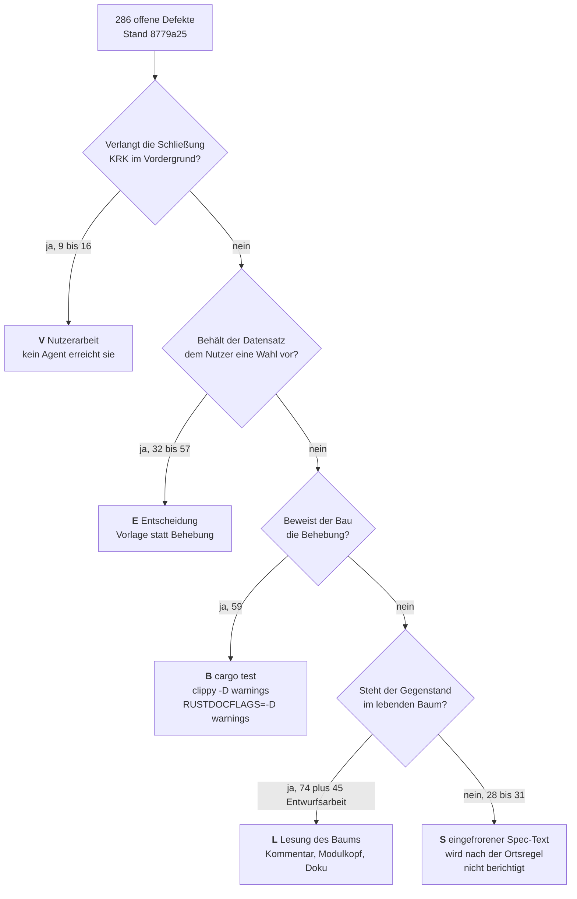
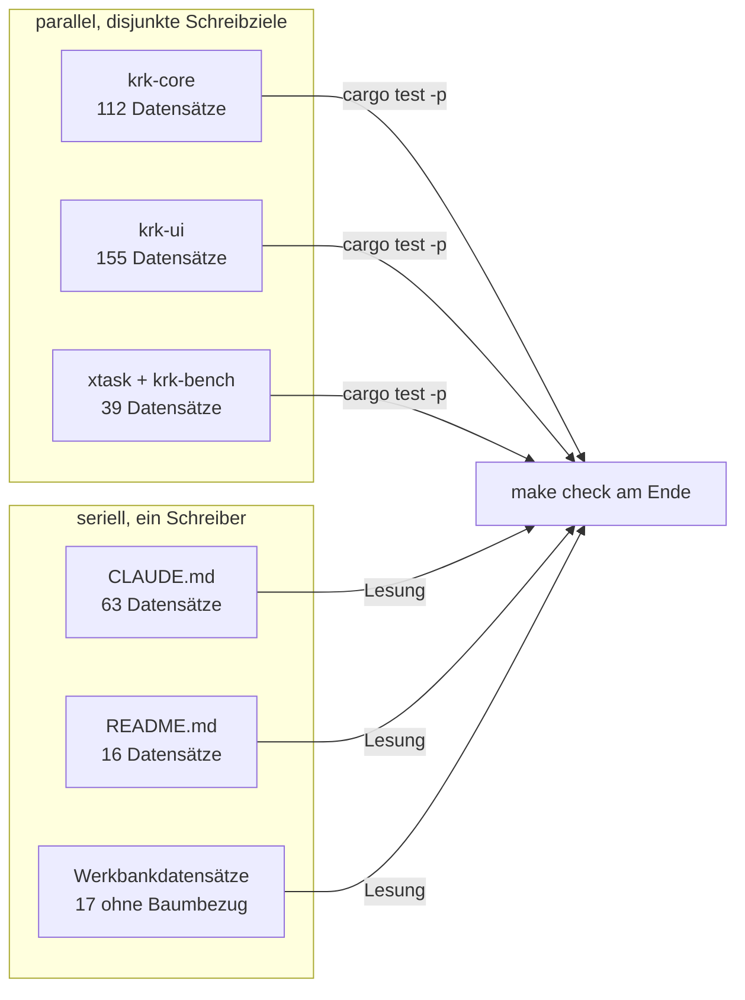

# Analyse: woran die nächste Schleife ansetzt

**Datum:** 2026-09-05 23:07
**Typ:** Gap-Analyse
**Status:** Complete
**Angefordert von:** Nutzer, nach der ersten Behebungsschleife dieser Sitzung

## Frage

Der offene Defektbestand ist nach der ersten Schleife auf 286 Datensätze gefallen. Die Sitzung hat noch bis zu neun Schleifen. Wo liegt der Ertrag, wo liegt das Risiko, und wie viele Datensätze sind für einen Agenten überhaupt erreichbar? Diese Analyse gruppiert den Bestand nach dem, was ihn behebbar macht, beziffert die Gruppe, die ohne einen Lauf am laufenden Bündel nicht schließbar ist, und prüft die Einschätzung des letzten Abgleichs zu den 140 Datensätzen, die er ungeprüft gelassen hat.

## Umfang

Gegenstand sind alle 286 offenen Defektdatensätze unter `fusion-workbench/shared/issues/` und `fusion-workbench/circles/*/issues/`, dazu die 53 offenen Entscheidungsdatensätze, der Abgleichsbericht `shared/history/260905-2054-reconciliation.md`, die drei Behebungsberichte `260905-2155`, `260905-2217` und `260905-2227`, die 15 Durchsichtsdateien der Vollbaum-Durchsicht vom 260826 und der Quellbaum unter `crates/` und `xtask/`.

**Baumstand.** Alle Zahlen dieser Analyse sind an Commit `8779a25` gemessen, datiert 2026-09-05T22:30:48+02:00, Branch `main`, vier Commits vor `origin/main`. Der Arbeitsbaum war bei Beginn bis auf Werkbankdateien sauber.

**Der Baum hat sich während der Analyse bewegt, und zwar auf eine Weise, die den Bericht selbst betrifft.** Eine zweite Sitzung hat um 22:54 den Commit `84d626b` gesetzt: „sieben Befunde an `CLAUDE.md` und `README` gegen den heutigen Baum". Sie hat damit genau die Bahn gefahren, die weiter unten als Gruppe 4 empfohlen ist, sieben Datensätze geschlossen und einen neuen abgelegt. Der Bestand stand um 22:32 bei 286 offenen Datensätzen und um 23:09 bei 280.

Jede Zahl unten ist deshalb an `8779a25` festgenagelt und aus dem Commit gelesen, nicht von der Platte. Wer sie nachprüft, prüft gegen denselben Commit. Wo eine Empfehlung durch `84d626b` schon eingelöst ist, steht es dort.

## Befunde

### 1. Der Bestand in Zahlen

| Größe | Zahl |
|---|---|
| Offene Defektdatensätze | 286 (147 gemeinsam, 139 in Runden) |
| Geschlossene Defektdatensätze | 543 ohne Archiv, 654 mit Archiv |
| Zurückgestellte Defektdatensätze | 4 |
| Defektdatensätze gesamt, ohne Archiv | 833 |
| Offene Fragen | 53 (26 gemeinsam, 27 in Runden) |
| Schließquote über offene und geschlossene | 543 von 829, also 66 Prozent |

Die Schwere der offenen Datensätze verteilt sich so:

| Schwere | Zahl |
|---|---|
| niedrig (`niedrig`, `low`, `gering`) | 124 |
| mittel (`mittel`, `medium`) | 45 |
| hoch | 2 |
| kein Schwerefeld | 115 |

**Kein einziger offener Defekt trägt eine ungeschränkte Schwere „hoch" oder „kritisch".** Die zwei Datensätze mit „hoch" schränken das Wort im selben Satz ein: `260813-0416` schreibt „hoch, wäre er stehengeblieben" über einen Fall, den derselbe Schritt schon behoben hat, und `260819-2206` schreibt „hoch in der Wirkung, niedrig in der Häufigkeit" über eine Werkbank-Kollision im Temporärverzeichnis. Die fünf schweren Befunde der Vollbaum-Durchsicht hatten einen eigenen Plan, der geschlossen und archiviert ist (`archive/260827-1534-safe-cleanup-tier-1/shared/planning/260826-1811_c_plan-die-fuenf-schweren-befunde-der-vollbaum-durchsicht.md`).

Damit steht fest: der verbliebene Bestand enthält kein Risiko für den Nutzer der Anwendung. Er enthält Risiko für die Verlässlichkeit dessen, was das Projekt über sich selbst behauptet.

### 2. Der Bestand nach dem, was ihn behebbar macht

Wir haben drei Leseläufe gefahren, jeder unabhängig vom anderen: einen über alle 147 Datensätze des gemeinsamen Speichers, einen über alle 139 der Rundenverzeichnisse und einen über die 56 Datensätze quer durch beide, deren Text „Bündel", „Nutzerarbeit", „Vordergrund", „Abnahmelauf" oder „am laufenden" führt. Die Klassen sind die des Auftrags.

| Klasse | gemeinsam (147) | Runden (139) | zusammen |
|---|---|---|---|
| **E** Entscheidung des Nutzers | 48 | 9 | 57 |
| **B** Bau beweist | 40 | 19 | 59 |
| **L** Lesung beweist | 25 | 49 | 74 |
| **C** Codeänderung mit Verhaltensfolge | 17 | 28 | 45 |
| **W** Werkbank-Buchhaltung | 14 | — | 14 |
| **S** eingefrorener Spec-Text | — | 28 | 28 |
| **V** Vordergrundlauf zwingend | 3 | 6 | 9 |

**Die Zeile E ist die unsicherste der Tabelle, und zwar wegen einer Definitionsdifferenz.** Der Lauf über den gemeinsamen Speicher hat E als restriktivste Klasse über B und C gesetzt und deshalb jeden Datensatz dorthin gezogen, bei dem eine Wahl offensteht, gleich ob der Datensatz sie ausdrücklich dem Nutzer vorbehält. Eine Suche über alle 286 nach den Wendungen, mit denen dieses Projekt eine Wahl wirklich vorbehält, findet im gemeinsamen Speicher nur 19 statt 48. Der Lauf über die Runden hat strenger gelesen und kam dort auf 9 bei 13 Treffern der Suche. Wer mit der Zahl arbeitet, nimmt die untere.

Die Reihenfolge der Fragen ist die Reihenfolge der Restriktion: eine Wahl, die dem Nutzer gehört, hebt jede Prüfbarkeit auf, und ein Vordergrundlauf hebt auch die Wahl auf.

**Klasse V ist die einzige, die wir dreifach gemessen haben, und sie streut.** Der Lauf über die 56 Kandidaten hat 15 Datensätze mit ausdrücklich zitierter Schließbedingung gefunden, sechs im gemeinsamen Speicher und neun in den Runden. Die zwei vollständigen Läufe lesen strenger: drei im gemeinsamen Speicher, sechs in den Runden, zusammen neun. Die Differenz liegt an Fällen wie `260816-2144` (die Leertaste erreicht den Dateifilter nie), den ein Lauf als Vordergrundarbeit und der andere als offene Wahl liest. **Die belastbare Aussage lautet: 9 bis 16 von 286**, also drei bis sechs Prozent.

**Klasse S, 28 gezählt und geschätzt 31.** Dazu unten, Abschnitt 5.

**Die Klassen B, L und C tragen den Rest.** Zusammen 178 Datensätze, und sie sind die Arbeitsfläche der nächsten Schleifen. Fünfzehn offene Defekte zeigen zusätzlich auf einen offenen Entscheidungsdatensatz.

### 3. Die eine Ursache: eine Durchsicht, die niemand verbraucht hat

Der Bestand hat keinen gleichmäßigen Zufluss. Er hat einen Tag.

| Ablagetag | abgelegt | davon heute offen |
|---|---|---|
| 260802 bis 260810 | 249 | 0 |
| 260811 bis 260825 | 390 | 168 |
| **260826** | **134** | **86** |
| 260827 bis 260905 | 60 | 32 |
| **Summe** | **833** | **286** |

Am 26. August sind zwischen 12:21 und 14:49 fünfzehn Durchsichtsläufe über den ganzen Baum gefahren, 2575 Zeilen Durchsichtstext, und haben **108 Defektdatensätze** abgelegt. Ein Planer hat am selben Abend die fünf schweren davon in einen Plan gefasst und ausdrücklich vermerkt: „die 116 übrigen folgen in einem zweiten Plan." Dieser zweite Plan ist nie geschrieben worden.

Das Ergebnis lässt sich am Commit ablesen. Von den 108 Datensätzen der Kampagne war bei `28c4a47`, also zehn Tage später, **kein einziger geschlossen**. Die erste Schleife dieser Sitzung hat dann 36 davon an einem Abend geschlossen. Es bleiben 72.

Damit ist die häufigste Fehldeutung dieses Bestands ausgeräumt. Die 108 Datensätze lagen nicht deshalb zehn Tage unberührt, weil sie schwer wären: 51 der 72 verbliebenen tragen einen ausgeschriebenen Behebungsweg, 62 tragen ein Zeilenzitat, und eine Stichprobe über zwölf zufällig gezogene offene Datensätze fand jede zitierte Datei noch am Platz und jede zitierte Zeile in Reichweite. Sie lagen unberührt, weil zwischen der Durchsicht und der Behebung kein Schritt stand, der sie aufnimmt.

Die Herkunftszahlen bestätigen das über den ganzen Bestand:

| Ablegender Agent | Datensätze | offen | Schließquote |
|---|---|---|---|
| `coderev` | 327 | 119 | 64 Prozent |
| ohne Herkunftsfeld | 256 | 66 | 74 Prozent |
| `coder` | 77 | 26 | 66 Prozent |
| `reconciler` | 32 | 18 | 44 Prozent |
| `analyst` | 10 | 8 | 20 Prozent |

Die Durchsicht ist die produktivste Quelle des Projekts und zugleich die, deren Ausstoß am längsten liegen bleibt.

### 4. Was die erste Schleife über den Bestand bewiesen hat

Der Abgleich hat drei Muster festgehalten, und alle drei muss man nach dieser Schleife anders lesen.

**Zum ersten: „die 15 `#[must_use]`-Befunde bestanden ausnahmslos."** Der Satz stimmte und war kein Urteil über Schwierigkeit. Vor der Schleife standen genau 15 Datensätze mit `must-use` im Dateinamen offen, danach vier. Elf sind in einem Abend gefallen. Die Marke selbst ist im Baum von 254 auf 634 Stellen gestiegen, also um 380. Das Verhältnis ist die eigentliche Auskunft: **elf Datensätze haben 380 Stellen gekostet**, weil jeder Datensatz keine Stelle benennt, sondern eine Familie.

**Zum zweiten: „von 34 Befunden an Proben und Messstrecke ist keiner behoben."** Auch das war eine Aussage über die Vergangenheit. Von den 63 Datensätzen, die die Schleife von offen auf geschlossen gezogen hat, zitieren 17 eine Probendatei oder `krk-bench`, und `crates/krk-bench/src/messen.rs` allein hat 306 Zeilen bekommen.

**Zum dritten: „von 32 Zählaussagen in Modulköpfen ist keine vollständig."** 42 der 63 Schließungen tragen eine Zahl- oder Nennaussage im Titel. Die Gruppe ist aber nicht abgetragen: 147 der 286 verbliebenen Datensätze tragen dieselbe Form.

**Die gemeinsame Ursache liegt tiefer, und sie ist messbar.** Der Baum trägt 143 827 Zeilen Rust, davon 56 794 Doc-Kommentarzeilen, also 39 Prozent; in `krk-ui` sind es 44 Prozent. **8150 dieser Doc-Zeilen führen eine Ziffer oder ein Zahlwort, 2470 davon in Modulköpfen.** Keine dieser Zahlen wird von irgendetwas gehalten. Der Übersetzer sieht sie nicht, keine Probe liest sie, und jede Runde, die eine Aufzählung erweitert, macht einen Teil von ihnen falsch, ohne dass etwas rot wird.

Die unbewachte Zahlenfläche ist die Quelle, aus der die Durchsichten schöpfen, und sie versiegt nicht. `CLAUDE.md` hat für sich selbst schon die Konsequenz gezogen: die Datei trägt heute 43 Zählkommandos und fünfzehnmal die Wendung, eine Auskunft stehe woanders und nicht in dieser Zeile. Im Quellbaum ist derselbe Schritt erst angefangen: 78 Modulkopfzeilen zeigen auf ein Zählkommando statt auf eine Zahl, gegen 2470 Zeilen, die eine Zahl führen.

**Eine einmalige Behebung dieser Ursache gibt es nicht, aber eine einmalige Eindämmung.** `RUSTDOCFLAGS="-D warnings" cargo doc --workspace --no-deps` bricht heute mit Exit 101 ab und meldet 157 Warnungen:

| Warnung | Zahl |
|---|---|
| unaufgelöster Verweis | 69 |
| öffentliche Doku verweist auf privates Element | 49 |
| überflüssiges Verweisziel | 32 |
| zugleich Funktion und Modul | 7 |

Verteilt auf `krk-core` 66, `krk-ui` 85, `krk-bench` 6 und `xtask` 0. Der offene Datensatz `260905-2217` nennt für `krk-ui` 51 unaufgelöste Verweise; unsere unabhängige Messung bestätigt genau diese Zahl. **Kein Abnahmekommando dieses Projekts fährt `cargo doc`.** Nach `make check` ist der Baum grün: `cargo clippy --workspace --all-targets -- -D warnings` liefert Exit 0, und alle Proben laufen durch.

Die Grenze dieser Eindämmung gehört dazu: rustdoc hält Verweise, nicht Zahlen. Ein Modulkopf, der „drei Rufer" sagt, wo der Baum sechs trägt, bleibt auch mit dem Tor unbemerkt.

### 5. Die 140 vom Abgleich ungeprüften Datensätze

Der Abgleich hat sie so begründet: sie lägen überwiegend in den Rundenverzeichnissen und beträfen Aussagen über eingefrorene Spec- und Plantexte, an denen ein Befund nicht nebenbei wahr werde.

**Die Einschätzung trägt nicht.** Ein vollständiger Klassifikationslauf über alle 139 offenen Rundendatensätze ordnet nur **28 von 139**, also 20 Prozent, als Aussage über einen eingefrorenen Spec-, Plan- oder Circle-Text ein. Die übrigen 111 lösen sich an etwas, das im lebenden Baum steht: 49 an einem Code-Kommentar oder Modulkopf, 28 an einer Codeänderung mit Verhaltensfolge, 19 an einer Probe, neun an einer Nutzerentscheidung, sechs an einem Vordergrundlauf.

Eine Stichprobe von 27 Datensätzen über dreizehn Runden, jeder im Volltext gelesen, kam auf sechs reine Spec-Aussagen und 21 mit lebendem Anteil. Hochgerechnet auf die 139 sind das geschätzt 31 reine und geschätzt 108 mit lebendem Anteil, was sich mit der Klassenzählung deckt.

Zwei Beispiele zeigen, woran die Pauschalisierung scheitert. `260814-0912` sagt, neun Stellen sprächen weiter von „vier Ablagedateien", und **alle neun sind Code-Kommentare**, keine einzige liegt in einem Spec. `260813-1345` sagt, neun Abnahmekriterien trügen die Kennzeichnung „(Probe)" und hätten keine: die Kennzeichnung im Spec ist eingefroren, die fehlende Probe im Baum ist es nicht.

**Die Frage, wie mit den echten 31 zu verfahren ist, gehört dem Nutzer** und ist von dieser Analyse nicht entschieden. Ein Marker `_o_` an einer Aussage über einen Text, den die Ortsregel nicht mehr anfasst, behauptet eine Arbeit, die niemand tun wird.

### 6. Der Widerspruch zur autonomen Arbeit

Er betrifft **9 bis 16 Datensätze von 286**, also drei bis sechs Prozent des Bestands, nicht achtzig. Fünfzehn davon führen ihre Schließbedingung im eigenen Text, und sie sagen dasselbe in verschiedenen Worten: `260814-1612` schreibt „Geschlossen wird auf Plausibilität nicht: der Marker bleibt `_o_`, bis der Klick gemeldet ist", `260816-2144` schreibt „Kein Agent kann am laufenden Bündel einen wirklichen Tastendruck auslösen", und `260827-1710` sowie `260828-0744` machen ihre Schließung ausdrücklich vom ausstehenden Abnahmelauf der Runde 16 beziehungsweise der Runde 1 abhängig.

Der Widerspruch ist damit klein genug, um ihn stehen zu lassen. Am Vordergrundlauf allein scheitern höchstens 16 der 286 Datensätze, und die Sitzung kann die übrigen 270 anfassen; wie viele davon sie schließt, begrenzen die Klassen E und S und nicht die Verfügbarkeit des Nutzers am Bildschirm. Für die 16 ist die richtige Handlung nicht, sie doch zu schließen, sondern sie als eine benannte Liste zusammenzustellen, die der Nutzer in einem Durchgang abarbeitet, wenn er das nächste Mal KRK im Vordergrund fährt.

Zwei Datensätze verdienen dabei eine gesonderte Behandlung, weil sie nicht an einem Klick hängen, sondern an einer ganzen Runde: `260827-1710` und `260828-0744` machen ihre Schließung vom ausstehenden Abnahmelauf der Runde 16 beziehungsweise der Runde 1 abhängig. Ein solcher Lauf ist keine Minute Nutzerarbeit, sondern eine Sitzung.

## Implikationen

Der Bestand ist nicht das Ergebnis von Nachlässigkeit, sondern von zwei Asymmetrien.

**Die erste liegt zwischen Finden und Beheben.** Eine Durchsicht über den ganzen Baum kostet einen Nachmittag und liefert 108 Datensätze. Ihre Behebung kostet mehrere Abende und hat in diesem Projekt keinen eigenen Auslöser: sie geschieht, wenn jemand sie anstößt, und sonst nicht. Solange das so bleibt, wächst der Bestand mit jeder Durchsicht und fällt nur, wenn eine Sitzung wie diese ihn absichtlich abträgt.

**Die zweite liegt zwischen Prosa und Prüfung.** Vier von zehn Zeilen dieses Baums sind Doku, 8150 davon führen eine Zahl, und nichts hält sie. Jede Runde, die eine Aufzählung erweitert, erzeugt Befunde, die erst eine spätere Durchsicht sichtbar macht. Der Rückstand ist deshalb kein Restposten, sondern ein Nebenprodukt der Bauweise.

Die erste Schleife hat gezeigt, dass beides beherrschbar ist. Vier Commits in 22 Minuten, drei Agenten auf disjunkten Kisten, 64 geschlossene Datensätze bei drei neu abgelegten. Der eine Datensatz, der offen blieb, blieb es aus einem Grund, der die Bauform der nächsten Schleifen bestimmt: seine dritte Fundstelle lag in `CLAUDE.md`, und diese Datei gehörte keiner der drei Bahnen. **63 der 286 offenen Datensätze nennen `CLAUDE.md`, 16 nennen `README.md`.** Wer nach Kisten parallelisiert, braucht für diese Dateien eine eigene, serielle Bahn.

Die Aufteilbarkeit lässt sich beziffern: 176 der 286 Datensätze nennen genau ein Schreibziel, 110 nennen zwei oder mehr.

Der Zählungen wegen: die Summe der genannten Ziele übersteigt 286, weil 110 Datensätze mehr als eines nennen. Ein Datensatz mit zwei Zielen gehört in die serielle Bahn oder an das Ende der Schleife.

## Empfehlungen

Fünf Gruppen, geordnet nach Datensätzen je Aufwandseinheit. Jede nennt ihr Prüfmittel und das, was an ihr schiefgehen kann.

### Gruppe 1: der Rest der Vollbaum-Durchsicht vom 260826

**Größe:** 72 Datensätze, exakt gezählt. Davon 51 mit ausgeschriebenem Behebungsweg, 62 mit Zeilenzitat. Genannte Kisten: 35 `krk-core`, 36 `krk-ui`, 14 `xtask` und `krk-bench` bei erlaubter Mehrfachnennung.

**Prüfmittel:** `cargo test --workspace` und `cargo clippy --workspace --all-targets -- -D warnings`, je Kiste während des Laufs, `make check` am Ende.

**Warum zuerst:** Diese Gruppe hat die beste Belegdichte des ganzen Bestands. Sie stammt aus einem einzigen Prüfvorgang, ihre Datensätze sind nach demselben Muster geschrieben, und die erste Schleife hat an ihr schon 36 Schließungen erzielt, also die Bauform erprobt. Die Aufteilung nach Kisten ist dieselbe wie in Schleife 1.

**Was schiefgehen kann:** Es ist **keine** Behebung, sondern 72. Die Gruppe teilt die Herkunft, nicht den Handgriff. Wer sie als eine Maßnahme plant, plant falsch; wer sie als drei parallele Bahnen zu je zwei Dutzend Einzelfällen plant, plant richtig. Zweitens verlangt ein erheblicher Teil Entwurfsarbeit und nicht eine Zeile. Drittens berührt ein Teil `krk-ui`, wo Proben in `#[cfg(test)]`-Modulen neben dem Code stehen und eine Änderung an einer `NSTextView`-Probe den Hauptfaden behaupten muss.

**Und ein vierter Punkt, der die Bahnbreite begrenzt.** Die Datensätze sind nicht gleichmäßig über die Dateien verteilt. Allein im gemeinsamen Speicher zitieren 18 offene Datensätze `crates/krk-ui/src/appkit/anwendung.rs` und 13 zitieren `crates/krk-ui/src/appkit/tabelle.rs`; die Kampagnendatensätze kommen dazu. Zwei Agenten in derselben Kiste kollidieren deshalb an wenigen großen Dateien, gleich wie sauber die Kistengrenze gezogen ist. Eine Bahn je Kiste ist die richtige Breite, zwei sind es nicht.

### Gruppe 2: das Dokumentationstor

**Größe:** 157 Warnungen in vier Kategorien, exakt gemessen; ein offener Datensatz (`260905-2217`) beschreibt 51 davon.

**Prüfmittel:** `RUSTDOCFLAGS="-D warnings" cargo doc --workspace --no-deps`, heute Exit 101, nach der Behebung Exit 0.

**Warum:** Es ist die einzige Gruppe des ganzen Bestands, bei der eine einmalige Handlung eine Fläche dauerhaft schließt. Nach der Behebung fängt das Tor jeden neuen toten Verweis am Tag seiner Entstehung ab, und die Klasse hört auf, Durchsichtsstoff zu sein. Die 32 überflüssigen Verweisziele und die 7 Mehrdeutigkeiten sind rein mechanisch.

**Was schiefgehen kann:** Zweierlei. Die 49 Fälle „öffentliche Doku verweist auf privates Element" liegen fast alle in `krk-core` und sind keine Tippfehler, sondern eine Entwurfsfrage: entweder das Element wird öffentlich, oder der Verweis wird zu Fließtext. Die Wahl zwischen beidem gehört dem Nutzer und ist keine Behebung. Und der zweite Teil des Datensatzes, ob `cargo doc` in `make check` aufgenommen wird, ist ausdrücklich als Nutzerentscheidung mit Kosten benannt: das Tor verlängert jeden Abnahmelauf. Die Empfehlung lautet deshalb, die 108 mechanischen Warnungen zu räumen und die 49 plus die Toraufnahme dem Nutzer vorzulegen.

### Gruppe 3: die Zahlaussagen in der Prosa des Baums

**Größe:** 147 der 286 offenen Datensätze tragen eine Zahl- oder Nennaussage im Titel; die zugrunde liegende Fläche sind 8150 Doc-Zeilen mit einer Zahl, davon 2470 in Modulköpfen.

**Prüfmittel:** eine Lesung gegen den Baum, je Fundstelle. Kein Bau beweist sie.

**Warum:** Die erste Schleife hat 42 Datensätze dieser Form geschlossen, sie ist also erprobt und ertragreich.

**Was schiefgehen kann:** Der Ertrag verfällt. Eine berichtigte Zahl ist am Tag der nächsten Aufzählungserweiterung wieder falsch, und das Projekt hat für genau diesen Fall schon fünfmal denselben Befund abgelegt. **Die Empfehlung ist deshalb, die Zahl nicht zu berichtigen, sondern sie durch das Zählkommando zu ersetzen**, wie `CLAUDE.md` es 43-mal für sich getan hat. Der Austausch ist derselbe Handgriff, kostet dieselbe Zeit und schließt den Datensatz endgültig statt bis zur nächsten Runde. Wo eine Zahl unentbehrlich ist, gehört sie in eine Zählprobe, nicht in einen Kommentar; der Baum trägt dafür schon 33 Probendateien, die den Quelltext selbst lesen.

### Gruppe 4: `CLAUDE.md` als eigene, serielle Bahn

**Größe bei `8779a25`:** 63 Datensätze nennen `CLAUDE.md`, 16 nennen `README.md`, die Schnittmenge ist nicht ausgezählt. **Nach `84d626b` sind es 58 und 13.**

**Prüfmittel:** Lesung gegen den Baum, dazu die Zählkommandos, die `CLAUDE.md` selbst schon führt.

**Warum:** Die erste Schleife hat an dieser Datei einen Datensatz verloren, weil sie außerhalb aller drei Bahnen lag. Solange drei Agenten parallel auf Kisten arbeiten, kann keiner sie anfassen, und jeder Befund, dessen Fundstellen sich über eine Kiste und `CLAUDE.md` verteilen, bleibt offen.

**Diese Gruppe ist während der Analyse angefahren worden und hat sich damit bewährt.** Der Commit `84d626b` hat sieben Datensätze dieser Bahn geschlossen und dabei einen achten neu abgelegt (`260905-2254`, das Zählkommando für `ohne_warten_oeffnen` gibt elf Zeilen für sechs Rufer aus). Das Verhältnis sieben zu eins ist das beste Ertragsverhältnis, das diese Sitzung bisher erreicht hat.

**Was schiefgehen kann:** Die Datei ist normativ. Eine Änderung an ihr ist keine Berichtigung eines Kommentars, sondern eine Änderung an der bindenden Beschreibung des Projekts, und sie gehört dem Kurator und nicht dem Beheber. Zweitens macht ein Zählkommando, das die Zahl ersetzt, den Befund nur dann besser, wenn es die richtige Zahl liefert: `260905-2254` ist genau der Fall, in dem das misslungen ist.

### Gruppe 5: die Liste für den Nutzer

**Größe:** 9 bis 16 Datensätze der Klasse V, 32 bis 57 der Klasse E, 28 bis 31 reine Spec-Aussagen. Die drei Mengen überschneiden sich, eine bereinigte Summe ist nicht ausgezählt.

**Prüfmittel:** keines, das ein Agent fahren kann.

**Warum:** Die drei Teilmengen sind der Teil des Bestands, den keine Schleife abträgt. Sie im Bestand mitzuführen, verzerrt jede Zählung, jede Planung und jede Aussage über den Fortschritt. Ihr Ertrag liegt darin, sie zu benennen und aus der Arbeitsfläche zu nehmen.

**Was schiefgehen kann:** Keine der drei Grenzen ist scharf, und die Spannen oben sind kein Messfehler, sondern eine echte Uneinigkeit zwischen drei Leseläufen. Bei V kamen zwei Läufe in den Runden auf neun und auf sechs, bei E einer im gemeinsamen Speicher auf 48 gegen 19 Treffer der Wortsuche. Wer die Liste erstellt, liest jeden Grenzfall einzeln und schreibt die Schließbedingung mit, statt eine Zahl zu übernehmen.

### Die echten Ein-Fix-Bündel, und was keines ist

Der Lauf über den gemeinsamen Speicher hat gezielt nach Mengen gesucht, die **eine** Handlung schließt, und dabei mehr verworfen als gefunden. Was blieb:

| Bündel | Datensätze | Klasse | Prüfmittel |
|---|---|---|---|
| Fadenstart mit `expect` reißt die Anwendung mit | 2 | C | `cargo test -p krk-core` |
| Blattgriff wird nicht überall in `offenes_blatt` abgelegt | 2 | C | `cargo test -p krk-ui`, Rest am Bündel |
| Der Leerbefund-Zweig der Ablage braucht einen sechsten `Beiseite`-Wert | 2 | E dann C | `cargo test -p krk-core` |
| Die lastabhängige Wettrennprobe des Öffnens, dreimal gefunden | 3 | E dann C | `cargo test --workspace` unter Last |
| Die Übertreibung an `kommando_ausfuehren` nach `52fba42` | 3 | L | Lesung, eine Probenzeile |
| Abschlussvermerke in einer Form, die keine Suche findet | 3 | W | `grep` |

Das erste Bündel haben wir am Baum nachgeprüft: vier Fadenstarts in `krk-core` brechen mit `expect` ab, nämlich `operation/mod.rs:165`, `verzeichnis/leser.rs:119`, `verzeichnis/durchlauf.rs:278` und `git/lauf.rs:202`. Dieselbe Änderung trifft alle vier. Zum Vergleich: der Nachbarbefund, dass ein Deskriptormangel den Auftrag unentschieden lässt statt ihn negativ zu entscheiden, ist im selben Modul schon so gebaut und liefert das Muster.

**Sechs Bündel über fünfzehn Datensätze, gegen 147 im gemeinsamen Speicher.** Ausdrücklich als Gruppe verworfen wurden unter anderem die zwölf Datensätze der Kerndurchsicht `260826-1221` bis `1225` und die zehn der Probenhygiene `260826-1302` und `1303`: sie teilen den Prüflauf, aber jeder verlangt einen eigenen Patch. Wer aus einer Herkunft eine Behebung macht, plant zehn Arbeiten als eine.

Ein Sonderfall gehört dazu, weil er das Gegenteil eines Duplikats ist. `260826-1221_o_der-freie-name-gibt-nach-tausend-versuchen-einen-belegten-namen-heraus` **widerlegt** eine Voraussetzung von `260825-1130`, statt sie zu wiederholen. Wer den zweiten für einen Nachtrag hält, schließt ihn mit dem ersten und verliert die Korrektur.

## Abgelegte Datensätze

Keine. Diese Analyse hat keinen neuen Defekt und keine neue Frage abgelegt; die Befunde stehen hier und in den Datensätzen, die sie zitiert.

## Quellen

- `fusion-workbench/shared/history/260905-2054-reconciliation.md` (Zeilen 11 bis 172)
- `fusion-workbench/shared/history/260905-2155-behebungsdurchgang-xtask-und-krk-bench.md`, `260905-2217-krk-ui-must-use-und-veraltete-prosazahlen.md`, `260905-2227-must-use-und-prosazahlen-in-krk-core.md`
- `fusion-workbench/shared/history/260826-1811-planner-die-fuenf-schweren-befunde.md`
- `fusion-workbench/shared/reviews/260826-12*.md` bis `260826-14*.md`, fünfzehn Dateien, 2575 Zeilen
- alle 286 offenen Defektdatensätze unter `fusion-workbench/shared/issues/` und `fusion-workbench/circles/*/issues/`, gelesen aus Commit `8779a25`
- `fusion-workbench/shared/issues/260818-0710_o_forty-three-closure-notes-are-written-in-a-form-that-no-resolved-sweep-finds.md` und `260820-2056_o_dreissig-entscheidungsdatensaetze-tragen-eine-leere-vorlagenzeile-vor-der-gefuellten.md` für die zwei Formbefunde
- `CLAUDE.md`, `README.md`, `Cargo.toml`
- der Quellbaum unter `crates/` und `xtask/`, 143 827 Zeilen
- `git log`, `git ls-tree` und `git show` gegen `28c4a47`, `8779a25` und `84d626b`
- eigene Läufe am Baum: `cargo test --workspace` (grün), `cargo clippy --workspace --all-targets -- -D warnings` (Exit 0), `cargo doc --workspace --no-deps` mit und ohne `RUSTDOCFLAGS="-D warnings"` (Exit 0 gegen Exit 101)

## Nachgemessene Zahlen des Abgleichs

Zwei Zahlen des Abgleichsberichts haben wir nachgemessen und weichen ab.

**Abschlussvermerke ohne `Resolved:`-Form.** Der Abgleich nennt „58 von 593 geschlossenen Defekten, bei Ablage 43 von 444". Gemessen an `8779a25` über alle `_c_`-Datensätze **einschließlich Archiv**: 654 geschlossene, davon 596 in der Konventionsform, 19 mit verschobenem Doppelpunkt und 39 ohne jede `Resolved`-Zeile, also 58 abweichende. Der Zähler stimmt, der Nenner des Abgleichs nicht. **Der Anteil ist gefallen**, nicht gestiegen: bei Ablage 43 von 428, also 10,0 Prozent, heute 58 von 654, also 8,9 Prozent.

**Entscheidungsdatensätze mit leerer Vorlagenzeile.** Der Abgleich nennt „heute 69, bei Ablage 30" und vergleicht dabei zwei verschiedene Größen. Gemessen: **39 Dateien mit 69 Schlüsselfällen**, gegen 30 Dateien mit 46 Fällen bei Ablage. Die Klasse wächst, aber um dreißig Prozent in den Dateien und nicht um hundertdreißig.

Beide Abweichungen ändern nichts an der Richtung des Befunds. Sie ändern seine Dringlichkeit.

## Offene Fragen

- [ ] Wie verfährt das Projekt mit den geschätzt 31 Datensätzen, die eine Aussage über einen eingefrorenen Spec-Text treffen? Ein Marker `_o_` behauptet dort eine Arbeit, die die Ortsregel ausschließt.
- [ ] Kommt `cargo doc` in `make check`? Der offene Datensatz `260905-2217` legt die Frage vor und nennt die Kosten.
- [ ] Werden die 49 Fälle „öffentliche Doku verweist auf privates Element" in `krk-core` durch Öffnen des Elements oder durch Umschreiben des Verweises geschlossen?
- [ ] Bekommt die Vollbaum-Durchsicht künftig einen festen Nachfolgeschritt, oder bleibt das Aufnehmen ihrer Befunde eine Sache des Anstoßes von außen?
- [ ] Wird die Liste der 9 bis 16 Datensätze, die einen Vordergrundlauf verlangen, als eigener Datensatz geführt, damit ein künftiger Abnahmelauf sie in einem Zug abarbeitet?
- [ ] Was heißt die Klasse E in diesem Projekt genau? Drei Leseläufe haben sie verschieden weit gezogen, von 19 bis 57 über den ganzen Bestand, und ohne eine Festlegung ist keine Zahl über den erreichbaren Teil des Bestands belastbar.
