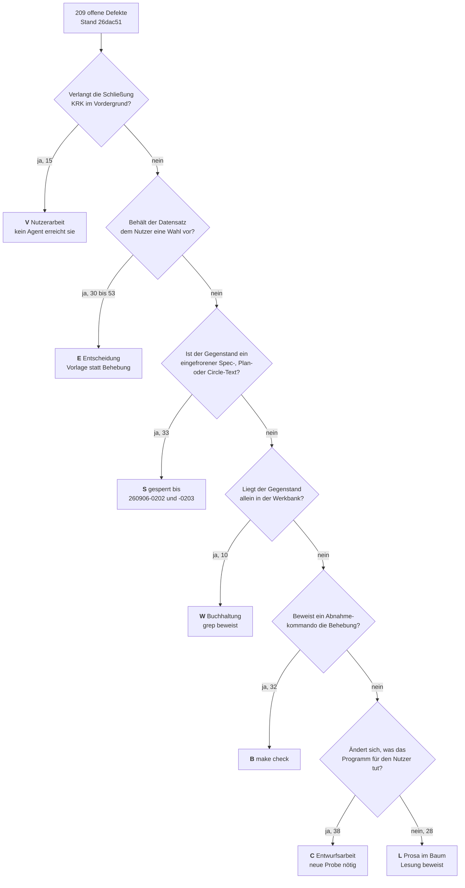
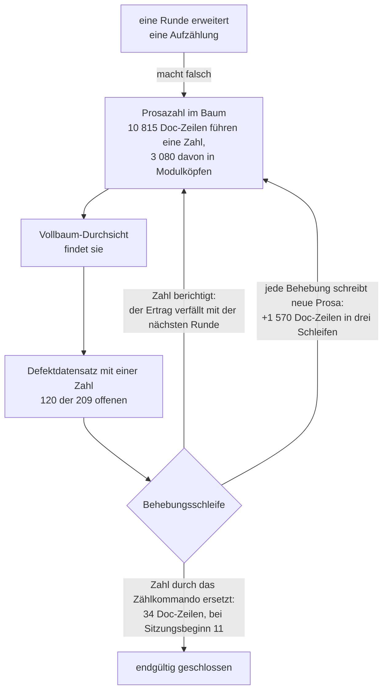

# Analyse: der Boden des Bestands

**Datum:** 2026-09-06 02:39
**Typ:** Gap-Analyse
**Status:** Complete
**Angefordert von:** Nutzer, nach der dritten Behebungsschleife dieser Sitzung

## Frage

Drei Behebungsschleifen haben den offenen Defektbestand von 347 auf 209 gezogen. Die Sitzung hat noch sieben. Diese Analyse erhebt den Bestand neu statt ihn fortzurechnen, stellt ihn dem Vorgängerbericht `260905-2307-woran-die-naechste-schleife-ansetzt.md` gegenüber, prüft zwei bestrittene Nachmessungen jenes Berichts nach, beziffert den Rest der fünf dort empfohlenen Gruppen und beantwortet die Frage, die für die Planung der nächsten sieben Schleifen die wichtigste ist: **welcher Teil dieses Bestands wird von keiner Schleife je abgetragen werden.**

## Umfang

Gegenstand sind alle 209 offenen Defektdatensätze unter `fusion-workbench/shared/issues/` und `fusion-workbench/circles/*/issues/`, die 56 offenen Entscheidungsdatensätze, die acht Behebungsberichte der zweiten und dritten Schleife unter `shared/history/`, der Sitzungsverlauf `260905-2008-orchestrator-session.md`, der Vorgängerbericht und der Quellbaum unter `crates/` und `xtask/`.

**Baumstand.** Jede Zahl dieser Analyse ist an Commit `26dac51` gemessen, datiert 2026-09-06T02:15:38+02:00, Branch `main`, 15 Commits vor `origin/main`. Der Arbeitsbaum ist bis auf `fusion-workbench/orchestrator-events.jsonl` sauber; für alle Werkbankdateien stimmen Platte und Commit überein, nachgeprüft mit `git status --porcelain`. Vergleichszahlen sind aus den Commits `28c4a47` (Sitzungsbeginn), `8779a25` (Stand des Vorgängerberichts), `2fa1d0e` und `56e5c2d` gelesen, nicht von der Platte.

Wir haben die 209 Datensätze in zwei unabhängigen Läufen vollständig gelesen und klassifiziert, einen über die 110 des gemeinsamen Speichers und einen über die 99 der Rundenverzeichnisse. Die Baumzahlen daneben sind eigene Messungen; wo wir eine Angabe eines anderen Laufs übernehmen, steht es dabei.

## Befunde

### 1. Der Bestand in Zahlen

| Größe | `28c4a47` Sitzungsbeginn | `8779a25` Vorgängerbericht | `26dac51` heute |
|---|---|---|---|
| Offene Defektdatensätze | 347 (201 + 146) | 286 (147 + 139) | **209 (110 + 99)** |
| Geschlossene, ohne Archiv | 479 | 543 | 623 |
| Zurückgestellte | 4 | 4 | 4 |
| Gesamt ohne Archiv | 830 | 833 | 836 |
| Geschlossene im Archiv | 111 | 111 | 111 |
| Offene Fragen | 51 | 53 (26 + 27) | **56 (29 + 27)** |
| Schließquote über offen und geschlossen | 58 % | 65 % | **75 %** |

Die Sitzung hat 144 Datensätze geschlossen und sechs neue abgelegt, davon drei noch in derselben Sitzung wieder geschlossen. Der Zufluss beträgt damit 4 Prozent des Abflusses.

Der Verlauf je Commit zeigt, dass der Ertrag nicht abfällt:

| Commit | offen vorher → nachher | Δ |
|---|---|---|
| `3136d02` Abgleich | 347 → 338 | −9 |
| `1c29826` xtask, bench | 338 → 323 | −15 |
| `c5f6fab` krk-ui | 323 → 303 | −20 |
| `8779a25` krk-core | 303 → 286 | −17 |
| `84d626b` CLAUDE.md, README | 286 → 280 | −6 |
| `ffe7384` xtask, bench | 280 → 273 | −7 |
| `fc6564e` krk-ui, Dokumentationstor | 273 → 264 | −9 |
| `ea90b7e` krk-core, Fadenstarts | 264 → 253 | −11 |
| `59d0688` krk-core, Dokumentationstor | 253 → 251 | −2 |
| `2fa1d0e` `make check` | 251 → 251 | ±0 |
| `210e4c1` krk-ui, Rundendatensätze | 251 → 228 | −23 |
| `56e5c2d` krk-core, Rundendatensätze | 228 → 216 | −12 |
| `26dac51` Abschlussvermerke | 216 → 209 | −7 |

Die Schwere der 209 verteilt sich auf 86 mit niedriger Angabe (`niedrig`, `low`, `gering`), 33 mit mittlerer, 88 ohne Schwerefeld und zwei mit „hoch". Es sind dieselben zwei wie im Vorgängerbericht, und beide schränken das Wort im selben Satz ein. **Der Bestand enthält weiterhin kein Risiko für den Nutzer der Anwendung.**

`make check` steht auf Exit 0, alle fünf Kommandos grün, eigener Lauf am `26dac51`.

### 2. Die Klassen neu erhoben

| Klasse | gemeinsam (110) | Runden (99) | zusammen | Vorgänger (286) | Δ |
|---|---|---|---|---|---|
| **V** Vordergrundlauf zwingend | 6 | 9 | **15** | 9 | +6 |
| **E** Entscheidung des Nutzers | 41 | 12 | **53** | 57 | −4 |
| **S** eingefrorener Spec-, Plan- oder Circle-Text | 1 | 32 | **33** | 28 | +5 |
| **W** Werkbank-Buchhaltung | 6 | 4 | **10** | 14 | −4 |
| **B** Bau beweist | 25 | 7 | **32** | 59 | −27 |
| **C** Codeänderung mit Verhaltensfolge | 19 | 19 | **38** | 45 | −7 |
| **L** Lesung beweist | 12 | 16 | **28** | 74 | −46 |

**Die drei Schleifen haben genau die Klassen geleert, die der Vorgängerbericht als Arbeitsfläche benannt hat, und die übrigen nicht angefasst.** B, C und L standen bei 178 und stehen bei 98. V, E und S standen bei 94 und stehen bei 101 — sie sind **gewachsen**, während der Bestand um 77 gefallen ist. Ihr Anteil ist damit von 33 auf 48 Prozent gestiegen.

Ein Teil dieser Verschiebung ist Umklassifizierung und nicht Zufluss: die Leseläufe sind verschiedene, und die Grenze zwischen E und den prüfbaren Klassen ist im Projekt nicht festgelegt. Die Richtung ist davon unberührt, und die Behebungsberichte bestätigen sie einzeln: der Lauf über die `krk-ui`-Rundendatensätze hat neun Datensätze ausdrücklich unangetastet gelassen und die Sperre als eigene Frage abgelegt (`260906-0202`), der Lauf über die Werkbank sieben weitere (`260906-0203`).

Die Reihenfolge der Fragen ist die Reihenfolge der Restriktion, und sie ist dieselbe, die beide Leseläufe angewandt haben. Ein Vordergrundlauf hebt jede Wahl auf, eine Wahl des Nutzers hebt jede Prüfbarkeit auf, und ein eingefrorener Text ist auch dann nicht zu berichtigen, wenn der Befund unstrittig ist.

**Der Bestand steckt heute in 18 Runden**, angeführt von der Runde 6 mit 17 offenen Datensätzen, der Runde 9 mit 12 und der Runde 7 mit 10. Sechs Runden führen keinen offenen Datensatz mehr.

### 3. Die zwei nachgemessenen Zahlen: wer recht hat

Der Werkbanklauf hat zwei Nachmessungen des Vorgängerberichts widersprochen. Wir haben beide an denselben Commits nachgerechnet, aus denen die Läufe gelesen haben.

**Zur Sache hat der Werkbanklauf recht, und der Vorgängerbericht hatte einen mechanisch erklärbaren blinden Fleck.** Die Abschlussvermerke stehen in vier Gestalten, nicht in drei:

| Gestalt | Beispiel |
|---|---|
| Konvention | `Resolved: 260906 (coder): …` |
| verschobener Doppelpunkt | `Resolved 260818 (coder, tree state ae665e5): …` |
| **Fettform** | `**Resolved:** 260831. Der Modulkopf von …` |
| keine Zeile | — |

Der Vorgängerbericht hat mit dem Muster `^Resolved:` gezählt. Eine Zeile, die mit `**` beginnt, kann dieses Muster nicht treffen, und die Fettform fiel deshalb in den Eimer „keine Zeile". Dasselbe gilt für die vier früheren Erhebungen; der Modulkopf von `xtask/src/werkbank.rs` hält es fest.

**In den Zahlen hat keiner der beiden Berichte recht.** Nachgerechnet über alle geschlossenen Defektdatensätze einschließlich Archiv:

| Commit | geschlossen | Konvention | Doppelpunkt | Fettform | ohne Zeile | abweichend |
|---|---|---|---|---|---|---|
| `8779a25` (Vorgänger las hier) | 654 | 595 | 19 | 30 | 10 | 59 |
| `2fa1d0e` (Werkbanklauf las hier) | 691 | 632 | 19 | 30 | 10 | 59 |
| `56e5c2d` (Stand vor der Behebung) | 726 | 667 | 19 | 30 | 10 | 59 |
| `26dac51` heute | 734 | **734** | 0 | 0 | 0 | **0** |

Der Vorgängerbericht nannte 654 / 596 / 19 / 39. Sein Zähler für die Konvention ist um eins zu hoch, weil sein Muster eine leere Vorlagenzeile `Resolved:` mitnimmt, und seine 39 sind in Wahrheit 30 Fettform plus 10 ohne Zeile. Der Werkbanklauf nannte 692 / 633 / 18 / 38 / 9; jede dieser fünf Zahlen weicht von der Nachrechnung an seinem eigenen Commit ab, die Fettform um acht.

**Der Code, den derselbe Lauf ausgeliefert hat, trägt die richtige Zahl.** Der Modulkopf von `xtask/src/werkbank.rs` schreibt „59 solche Fälle standen im Bestand, verteilt über drei Schreibweisen" — genau unsere 19 + 30 + 10. Der Bericht über die Arbeit ist falsch, das Erzeugnis der Arbeit ist richtig.

**Die Herkunftsangabe hält.** Von den 30 Dateien in Fettform liegen 11 im Circle der Runde 23, 10 in dem der Runde 6, 7 im Archiv und 2 in dem der Runde 10. Die Fettform war also tatsächlich eine laufende Quelle und keine Altlast.

**Die Dringlichkeit ist trotzdem weg, und zwar aus einem anderen Grund als der Behebung.** Alle 734 geschlossenen Datensätze stehen heute in Konventionsform, und der Zufluss ist abgeriegelt: `jeder_geschlossene_defektdatensatz_traegt_einen_abschlussvermerk` in `xtask/src/werkbank.rs` prüft `zeile.starts_with("Resolved:")` und läuft mit `cargo test --workspace`, also mit `make check`. Ein neuer Datensatz in Fettform macht den Abnahmelauf rot. Eine Lücke bleibt und ist heute leer: ein **geschlossener** Datensatz mit leerer `Resolved:`-Zeile käme durch beide Proben. Wir haben den Bestand darauf abgesucht und keinen gefunden.

Die zweite bestrittene Zahl, die leeren Vorlagenzeilen in Entscheidungsdatensätzen, hat der Werkbanklauf mit dem Muster des Vorgängerberichts nachgemessen und dessen 39 Dateien / 69 Fälle bestätigt. Dort gab es keinen Streit.

### 4. Was aus den fünf Empfehlungsgruppen geworden ist

**Gruppe 1, der Rest der Vollbaum-Durchsicht vom 260826: von 72 auf 43, und der Rest liegt geschlossen beieinander.**

Die Kampagne hat zwischen `260826-1221` und `260826-1442` **112 Datensätze** abgelegt, nicht die 108 des Vorgängerberichts. Bei `28c4a47` war keiner geschlossen, bei `8779a25` waren es 40, heute 69. Es bleiben 43, und alle 43 stehen im gemeinsamen Speicher — die Rundenverzeichnisse tragen keinen mehr. Sie sind damit 39 Prozent des gemeinsamen Speichers und 21 Prozent des ganzen Bestands.

Die Belegdichte hält: alle 43 tragen ein Zeilenzitat, 20 einen ausgeschriebenen Behebungsweg. Wir haben 57 Zeilenzitate mechanisch geprüft; jede zitierte Datei steht am Platz, und jede zitierte Zeile liegt innerhalb der heutigen Datei. Genannte Kisten bei erlaubter Mehrfachnennung: 26 `krk-ui`, 19 `krk-core`, 4 `krk-bench`, 2 `xtask`.

**Die Empfehlung trägt weiter, mit derselben Einschränkung wie beim ersten Mal:** es ist keine Behebung, sondern 43.

**Gruppe 2, das Dokumentationstor: erledigt und verankert.** Wir haben `RUSTDOCFLAGS="-D warnings" cargo doc --workspace --no-deps` gefahren, Exit 0, von 157 Warnungen. `Makefile:73` führt `doc` als fünftes Ziel von `check`. Die Kosten sind gemessen und liegen bei 0,3 bis 0,8 Sekunden gegen 45 Sekunden für `clippy` allein.

Die 49 Meldungen „öffentliche Doku verweist auf privates Element" hat der Nutzer entschieden: die Elemente bleiben privat, ein `#![allow(rustdoc::private_intra_doc_links)]` steht an der Wurzel von `krk-core`. **Wir haben die Zahl unabhängig nachgemessen**, indem wir das `allow` mit `--force-warn` überstimmt haben: es sind genau 49. Die 53, die der Behebungslauf nennt, sind dieselben 49 plus vier Verweise auf private Module, die rustdoc als unauflösbar und nicht als privat führt. Beide Zahlen sind richtig und zählen Verschiedenes.

Der Vorgängerbericht nannte diese Gruppe „die einzige des ganzen Bestands, bei der eine einmalige Handlung eine Fläche dauerhaft schließt". Die Wirkung hat sich bestätigt, die Einzigkeit nicht: die Sitzung hat zwei weitere Prüfungen derselben Bauart gebaut, die drei Proben über die Werkbankform und die Baumprobe zu den Fadenstarts. Die Gruppe selbst ist verbraucht.

**Gruppe 3, die Zahlaussagen in der Prosa des Baums: gearbeitet, nicht abgetragen.**

| Größe | `28c4a47` | `8779a25` | `26dac51` |
|---|---|---|---|
| Offene Datensätze mit Zahl- oder Nennaussage im Titel | 206 von 347 (59 %) | 161 von 286 (56 %) | **120 von 209 (57 %)** |
| Rust-Zeilen unter `crates/` und `xtask/` | 142 106 | 143 827 | 145 732 |
| Doc-Kommentarzeilen | 56 175 | 56 794 | **57 745** |
| davon Modulköpfe (`//!`) | 13 678 | 13 805 | 13 933 |
| Doc-Zeilen mit einem Zählkommando | 11 | 24 | **34** |

Der Anteil der Zahlaussagen am Bestand ist über drei Schleifen um zwei Punkte gefallen und liegt heute höher als nach der ersten. Die Fläche, aus der sie kommen, ist in derselben Zeit um 1 570 Doc-Zeilen gewachsen: **jede Behebungsschleife vergrößert die Fläche, aus der die nächste Durchsicht schöpft.** Von den heutigen 57 745 Doc-Zeilen führen 10 815 eine Ziffer oder ein Zahlwort, 3 080 davon in Modulköpfen; gezählt ohne den unbestimmten Artikel, der sonst jede zweite Zeile träfe. Diese Zahl ist mit der 8 150 des Vorgängerberichts nicht vergleichbar, weil das Muster ein anderes ist.

**Der empfohlene Handgriff wird angewandt und wirkt.** Die Zahl der Doc-Zeilen, die statt einer Zahl das Kommando führen, das sie zählt, ist in dieser Sitzung von 11 auf 34 gestiegen. Die Behebungsberichte schreiben die Regel jedes Mal aus, und einer stellt sie als Abschnitt „Wo eine Zahl gefallen ist statt berichtigt worden zu sein" an den Anfang. Der Abstand bleibt: 34 Zeigern stehen 10 815 Zahlen gegenüber.

**Eine Teilfläche ist dabei vollständig geräumt.** Die `#[must_use]`-Datensätze standen bei Sitzungsbeginn auf 15, nach der ersten Schleife auf 4 und heute auf 0. Die Marke selbst ist im Baum von 179 auf 576 Stellen gestiegen.

**Gruppe 4, `CLAUDE.md` als eigene serielle Bahn: bewährt und noch nicht ausgeschöpft.** Die Datensätze, die `CLAUDE.md` nennen, sind von 63 auf 39 gefallen, die für `README.md` von 16 auf 11. Von den 39 stehen 25 im gemeinsamen Speicher und 14 in den Runden. Die Bahn hat in dieser Sitzung zweimal gelaufen und beide Male mehr geschlossen als abgelegt.

**Gruppe 5, die Liste für den Nutzer: nicht erstellt.** Kein Datensatz und keine Datei im Bestand führt die Vordergrundarbeit als benannte Liste. An ihrer Stelle sind sechs Entscheidungsdatensätze abgelegt worden, die Teile der Klassen E und S fassen; die Klasse V hat weiterhin keinen Sammelpunkt. Der Abschnitt `## Die Fragen für den Nutzer` dieser Analyse liefert die Vorlage.

### 5. Trägt das Untertreibungsmuster?

**Es trägt für eine bestimmte Sorte Zahl und kehrt sich für eine andere um.** Wir haben jede Nachmessung aus den acht Behebungsberichten dieser drei Schleifen zusammengetragen und vier eigene Stichproben am Baum gefahren.

| Datensatz oder Bericht | genannt | am Baum gemessen | Richtung |
|---|---|---|---|
| `260818-0807` tote Zeiger | 14 | 16, dazu 5 weitere und ein Feld | unter |
| `260905-2217` tote Verweise in `krk-ui` | 51 | 85 Doc-Warnungen hielten das Tor rot | unter |
| `260826-1423` `Funktionsbereich` | 9, „die Zahl stimmt" | 10 | unter |
| `260826-1422` Helfer mit Griff ins Temporärverzeichnis | 2 | 4 | unter |
| `260826-1442` Kachelungsprobe | 10 | 16 | unter |
| `260813-1420` Tafel in `menue.rs` | 140 | 280 | unter |
| Vorgängerbericht, Kampagne vom 260826 | 108 | 112 | unter |
| Vorgängerbericht, Abschlussvermerke ohne Zeile | 39 | 40 (30 + 10) | unter |
| Auftrag dieser Analyse, Schließungen in den Runden | 35 | 40 | unter |
| Bericht `260906-0202`, `ordner_lesen` | 10 (Datensatz), 3 (Kommentar) | 11 | unter |
| eigene Stichprobe `260823-1439` | 3 im Titel | 4 in der eigenen Tafel | unter |
| eigene Stichprobe `260817-1130` ausgeschriebene Marker | 52 in 10 Dateien | 109 in 34 Dateien | unter, gewachsen |
| eigene Stichprobe `260823-1445` Rufer von `aufteilung_nachziehen` | 5 | 5 | **exakt** |
| eigene Stichprobe `260826-0904` fusion-Zeilen ohne Ortsangabe | 5 von 7 | 5 von 7 | **exakt** |
| eigene Nachmessung, private Verweise in `krk-core` | 49 (Vorgänger) | 49 | **exakt** |
| `260826-1024` offene mit leerer `Resolved:`-Zeile | 8 | 7 | über |
| Auftrag des Werkbanklaufs, Rundendatensätze ohne Codebezug | 19 | 18 | über |
| Werkbanklauf, Fettform | 38 | 30 | über |
| `260829-0051` Funktionen ohne `#[must_use]` | 7 | 0, alle tragen sie | über |
| `260831-1334` `kommando_ausfuehren` ohne Marke | 4 und 3 | 1 und 1 | über |

**Die Richtung hängt davon ab, was die Zahl zählt, und der Mechanismus ist in beiden Fällen benennbar.**

Eine Zahl von **Fundstellen im Baum** entsteht aus einem Suchmuster, und das Muster ist regelmäßig enger als die Erscheinung, die es benennen soll. Der Abschlussvermerk ist der reinste Fall: fünf Erhebungen haben `^Resolved:` gesucht und dreißigmal `**Resolved:**` übersehen. Für diese Sorte gilt der Satz des Auftrags, und er gilt scharf: **eine Fundstellenzahl in diesem Bestand ist eine Untergrenze.**

Eine Zahl, die **verbleibende Arbeit** benennt, veraltet in die andere Richtung. Der Datensatz war bei seiner Ablage richtig, und eine spätere Runde hat einen Teil des Gegenstands nebenbei erledigt; `260829-0051` und `260831-1334` sind vollständig beziehungsweise überwiegend vom Baum eingeholt worden, ohne dass jemand sie angefasst hätte. Für diese Sorte ist die Zahl eine **Obergrenze**.

Eine Zahl über **Formklassen im Datensatzbestand** kann in beide Richtungen falsch sein, weil das klassifizierende Muster genau der Gegenstand des Befunds ist.

Übertreibungen aus reiner Nachlässigkeit haben wir keine gefunden. Das ist die belastbare Fassung der Beobachtung des Auftrags: **kein Datensatz hat mehr behauptet, als er beim Filen belegen konnte**; wo eine Zahl heute zu hoch steht, hat der Baum sie eingeholt.

Für die Planung folgt daraus zweierlei. Eine Aufwandsschätzung über Fundstellen ist mit dem genannten Wert zu klein anzusetzen — die Sitzung hat 15 `#[must_use]`-Datensätze geschlossen und dabei 397 Stellen im Baum berührt, die Marke ist von 179 auf 576 gestiegen. Eine Bestandsschätzung über verbleibende Arbeit ist umgekehrt zu groß: ein Teil der 209 ist bereits erledigt und weiß es nicht.

Ein zweites Ergebnis der beiden Leseläufe gehört dazu. **127 der 209 offenen Datensätze führen selbst eine Größenangabe** — 57 im gemeinsamen Speicher, 70 in den Runden. Mindestens acht davon melden eine schon falsch gewordene Zahl aus dem Baum und schreiben dabei eine neue in die Werkbank. Der Bestand reproduziert die Klasse, gegen die er geschrieben ist.

### 6. Der Boden

**101 der 209 offenen Datensätze wird keine Behebungsschleife abtragen**, das sind 48 Prozent. Die Zahl setzt sich aus den drei gesperrten Klassen zusammen und hat eine Spanne, weil eine der drei nicht scharf definiert ist.

| Sperre | Zahl | Wer sie aufhebt |
|---|---|---|
| **V** — verlangt KRK im Vordergrund | 15 | der Nutzer, in einem Abnahmelauf |
| **E** — dem Nutzer vorbehaltene Wahl | 30 bis 53 | der Nutzer, in einer Entscheidung |
| **S** — Aussage über einen eingefrorenen Text | 33 | der Nutzer, über `260906-0202` und `260906-0203` |
| **Summe** | **78 bis 101** | |

Die untere Grenze von E stammt aus einer Wortsuche über alle 209 nach den Wendungen, mit denen dieses Projekt eine Wahl wirklich vorbehält (30 Treffer), die obere aus der Klassifikation der beiden Leseläufe (53). **Dieselbe Spanne stand schon im Vorgängerbericht, und sie ist seither nicht kleiner geworden**, weil die Frage, was Klasse E in diesem Projekt genau heißt, unbeantwortet ist.

Zwei Eigenschaften des Bodens sind für die Planung wichtiger als seine Höhe.

**Er ist nicht flach, sondern steigt.** Die drei Schleifen haben die erreichbaren Klassen von 192 auf 108 gezogen und die gesperrten von 94 auf 101. Bei gleichbleibendem Ertrag treffen die nächsten Schleifen einen Bestand, der zunehmend aus dem besteht, was sie nicht anfassen dürfen. Der Ertrag lag in dieser Sitzung bei 12 Schließungen je Behebungscommit; **geschätzt** reichen damit zwei bis drei weitere Schleifen für die 108, und ab da verbringt eine Schleife mehr Zeit mit Aussortieren als mit Beheben.

**Ein Drittel des Bodens ist mit zwei Antworten begehbar.** Die 33 Datensätze der Klasse S sind unstrittig in der Sache und einzeln am Baum nachgemessen. Sie liegen allein deshalb still, weil niemand weiß, ob ein Agent den Spec einer geschlossenen Runde anfassen darf. `260906-0202` und `260906-0203` legen genau diese Frage vor. **Ihre Aufstellungen erfassen zusammen 16 der 33**, weil beide Läufe nur ihren eigenen Auftragsbereich durchgesehen haben; `260906-0202` nennt seine neun „den größten zusammenhängenden Block", und es ist die Hälfte. Wer die Frage beantwortet, muss sie deshalb als Regel für die Klasse beantworten und nicht für die aufgezählten Fälle, sonst bleiben 17 Datensätze in derselben Sperre stehen, für die die Antwort schon vorliegt.

## Implikationen

Der Vorgängerbericht hat zwei Asymmetrien benannt. Die erste, zwischen Finden und Beheben, ist in dieser Sitzung aufgehoben worden: 144 Schließungen bei sechs Neuablagen. Die zweite, zwischen Prosa und Prüfung, besteht fort und hat sich als der eigentliche Gegenstand erwiesen.

**Die Fläche wächst, während sie geräumt wird.** In drei Schleifen sind 1 570 Doc-Zeilen hinzugekommen, und die Zahl der Zeilen, die ein Zählkommando statt einer Zahl führen, ist um 23 gestiegen. Über die ganze Doc-Fläche führt heute jede fünfte Zeile eine Ziffer oder ein Zahlwort; **geschätzt** stehen den 23 neuen Zeigern damit rund 290 neue Zahlen gegenüber.

Der Kreis hat genau einen Ausgang, und die Sitzung hat ihn dreimal benutzt. Das Dokumentationstor fängt jeden neuen toten Verweis am Tag seiner Entstehung ab. Die drei Proben in `xtask/src/werkbank.rs` tun dasselbe für die Form der Abschlussvermerke. `kein_fadenstart_im_baum_wirft_seinen_rueckgabewert_weg` in `crates/krk-core/tests/baum.rs` liest den Quelltext und hält eine Regel, die vier Stellen betraf. Die baumlesende Probendatei ist von sechs auf neun Proben gewachsen, die Werkbankdatei von null auf drei, und alle sechs laufen mit `make check`. Das Tor hat 157 Warnungen geräumt und hält sie geräumt; die Werkbankproben haben 59 Abschlussvermerke in Form gebracht und halten die Form. Beide Male ist die Prüfung kleiner als der Bestand, den sie deckt.

**Für die größte Fläche gibt es diese Bauart trotzdem nicht.** Eine Zahl in einem Doc-Kommentar ist maschinell nicht an ihren Gegenstand gebunden, und keine der sechs neuen Proben deckt sie. Was der Baum schon kann, zeigt `jede_variante_von_kommando_steht_genau_einmal_in_kennungen` in `crates/krk-core/tests/belegung.rs`: sie liest die Varianten aus dem Quelltext der Aufzählung und hält zwei Mengen gegeneinander. Die Bauform ist erprobt, angewandt ist sie je Aufzählung und nicht je Prosastelle.

**Der Bestand ist damit an einem Punkt, an dem die Frage nicht mehr lautet, wie schnell er fällt, sondern was ihn nachfüllt.** 108 erreichbare Datensätze sind in zwei bis drei Schleifen abtragbar. Die sieben verbleibenden Schleifen reichen dafür mit Reserve. Was sie nicht ändern, ist die Rate, mit der die nächste Vollbaum-Durchsicht wieder hundert Datensätze findet.

## Empfehlungen

Vier Gruppen für die sieben verbleibenden Schleifen, geordnet nach Datensätzen je Aufwandseinheit, dazu die Angabe, was nach ihnen liegen bleibt.

### Gruppe A: die 108 erreichbaren Datensätze, in Kistenbahnen

**Größe:** 108, exakt klassifiziert (32 B, 38 C, 28 L, 10 W). Genannte Ziele bei erlaubter Mehrfachnennung über alle 209: `krk-ui` 119, `krk-core` 82, `resources/` 28, `xtask/` 16, `README.md` 11, `krk-bench` 9, `Makefile` 5. 136 der 209 nennen genau eine Kiste, 42 mehrere, 31 keine.

**Prüfmittel:** `cargo test -p <kiste>` und `cargo clippy -p <kiste> --all-targets -- -D warnings` je Bahn, `make check` am Ende. Für die Klasse L eine Lesung und, wo möglich, das eingesetzte Zählkommando, am Baum gefahren bevor es geschrieben wird.

**Warum:** Es ist die Bauform, die in drei Schleifen 144 Schließungen erbracht hat, ohne einen einzigen roten Abnahmelauf. Die Aufteilung nach Kisten hält, weil 136 Datensätze genau eine nennen.

**Was schiefgehen kann:** Die Datensätze sind nicht gleichmäßig über die Dateien verteilt. `crates/krk-ui/src/appkit/anwendung.rs` wird von 38 offenen Datensätzen zitiert, `tabelle.rs` von 19, `krk-core/src/tasten/belegung.rs` von 14. Zwei Agenten in derselben Kiste kollidieren an diesen Dateien, gleich wie sauber die Kistengrenze gezogen ist. **Eine Bahn je Kiste ist die richtige Breite.** Die 31 Datensätze ohne Kistenziel und die 39, die `CLAUDE.md` nennen, gehören in eine eigene serielle Bahn.

### Gruppe B: die 33 Datensätze über eingefrorene Texte, nach einer Antwort

**Größe:** 33, davon 32 in den Runden und einer im gemeinsamen Speicher. 16 sind in `260906-0202` und `260906-0203` namentlich aufgeführt, 17 nicht.

**Prüfmittel:** je nach Antwort. Bei Möglichkeit 2 des Datensatzes `260906-0203` ein datierter Nachtrag an der Stelle, bei Möglichkeit 3 der Vermerk im Defektdatensatz, bei Möglichkeit 1 eine Umbenennung auf einen Marker, den das Vokabular noch nicht hat.

**Warum:** Es ist die größte Gruppe, die eine einzige Nutzerantwort freimacht, und ihre Befunde sind sämtlich am Baum nachgemessen. Ihr heutiger Zustand kostet jeden weiteren Durchgang dieselbe Lesearbeit, die schon zweimal geleistet worden ist.

**Was schiefgehen kann:** Die Antwort auf die aufgezählten Fälle statt auf die Klasse lässt 17 Datensätze stehen. Und die Frage berührt die Ortsregel aus `CLAUDE.md`, die ausdrücklich nach dem Ort und nicht nach dem Absatz entscheidbar sein soll; eine Antwort, die `planning/` teilweise einfriert, gibt diese Eigenschaft auf.

### Gruppe C: die zwei mechanischen Reste der Werkbankform

**Größe:** 4 Plandateien geschlossener Runden, die auf `_p_` oder `_o_` stehen, obwohl alle ihre Schritte `[DONE]` tragen; dazu 7 tote Zeiger der Klasse „der Marker ist die Aussage". Gemessen und einzeln benannt in `260906-0212` und im Bericht `260906-0211`.

**Prüfmittel:** `grep` über den Dateibestand, dazu die drei Proben in `xtask/src/werkbank.rs`, die mit `make check` laufen.

**Warum:** Die vier Pläne sind nach `rules/fusion-workbench-conventions.md` `## Inline State Tracking` je eine Prüfung gegen die eigenen Schrittmarken und keine Auslegung. Es ist die billigste offene Arbeit im ganzen Bestand.

**Was schiefgehen kann:** Die zwölf **Spec**dateien desselben Datensatzes gehören nicht dazu. Sie hängen an `260819-1440` — heißt `_c_` an einem Spec „gebaut" oder „abgenommen"? —, und in diesem Projekt fallen die zwei auseinander. Wer sie mitzieht, trifft eine Aussage, deren Inhalt nicht feststeht.

### Gruppe D: eine zweite Prüfung nach dem Muster des Dokumentationstors

**Größe:** eine Maßnahme, die eine Fläche von 10 815 Doc-Zeilen mit einer Zahl betrifft, davon 3 080 in Modulköpfen.

**Prüfmittel:** eine Zählprobe, die den Quelltext liest. `jede_variante_von_kommando_steht_genau_einmal_in_kennungen` in `crates/krk-core/tests/belegung.rs` ist die erprobte Bauform, `crates/krk-core/tests/baum.rs` mit seinen neun Proben der Ort.

**Warum:** Drei Maßnahmen dieser Sitzung haben je einen ganzen Befundtyp dauerhaft geschlossen, und jede kostete weniger als die Datensätze, die sie erledigte. Für die größte verbleibende Fläche gibt es keine solche Prüfung, und die Empfehlung, die Zahl durch das Zählkommando zu ersetzen, hat den Abstand nicht verkleinert: 34 Zeiger gegen 10 815 Zahlen.

**Was schiefgehen kann:** Eine Prüfung über alle Doc-Zahlen ist nicht baubar, weil eine Zahl in Prosa nicht maschinell an ihren Gegenstand gebunden ist. Baubar ist die engere Fassung: eine Probe je Aufzählung, die ihre Länge gegen jede Prosastelle hält, die sie nennt. Das ist Entwurfsarbeit und keine Behebung, und es ist eine Nutzerfrage, ob sie eine Schleife wert ist. **Die verwandte Frage steht schon offen** (`260826-1811`, wie die Vollständigkeit einer `ALLE`-Liste gehalten wird).

### Was keine Schleife abtragen wird

**78 bis 101 der 209 Datensätze.** Im Einzelnen: die 15 der Klasse V, die einen Lauf am laufenden Bündel verlangen und für die der Vorgängerbericht schon empfohlen hat, sie als benannte Liste zusammenzustellen; die 30 bis 53 der Klasse E, deren Wahl dem Nutzer gehört; die 33 der Klasse S, solange `260906-0202` und `260906-0203` offen sind. Nach der Beantwortung der beiden Fragen fällt S aus dieser Menge heraus, und der Boden liegt bei 45 bis 68.

Zwei der V-Datensätze verdienen eine gesonderte Behandlung, weil sie nicht an einem Klick hängen, sondern an einer ganzen Runde: `260827-1710` und `260828-0744` machen ihre Schließung vom ausstehenden Abnahmelauf der Runde 16 beziehungsweise der Runde 1 abhängig. Beide standen schon im Vorgängerbericht.

## Die Fragen für den Nutzer

Sechs Entscheidungsdatensätze sind in diesen drei Schleifen abgelegt worden, einer davon ist bereits beantwortet und umgesetzt. Die Tabelle führt sie zusammen mit den drei älteren Fragen, an denen die größten Blöcke des Bodens hängen, und mit den drei Fragen des Vorgängerberichts, die nirgends abgelegt sind. Die Spalte „hängt daran" nennt, was die Antwort freimacht, und ist nach dem Untertreibungsmuster aus Abschnitt 5 als Untergrenze zu lesen.

| Pfad | Die Frage in einem Satz | Hängt daran | Stand |
|---|---|---|---|
| `shared/decisions/260906-0203_o_darf-ein-agent-den-spec-oder-plan-einer-geschlossenen-runde-berichtigen.md` | Darf ein Agent eine falsche Zahl im Spec oder Plan einer geschlossenen Runde berichtigen, und wenn ja, als Nachtrag oder im Text? | 7 Datensätze aus 6 Runden namentlich, dazu ein Teil der 17 nicht erfassten der Klasse S | offen, mit Empfehlung |
| `shared/decisions/260906-0202_o_werden-defektdatensaetze-ueber-eingefrorene-spec-und-plantexte-geschlossen-oder-bleiben-sie-offen.md` | Bleibt ein Datensatz, der richtig ist und nie behebbar sein wird, auf `_o_` stehen, oder verlässt er die Liste offener Arbeit? | 9 Datensätze namentlich, der Sache nach die ganze Klasse S mit 33 | offen, vier Möglichkeiten, keine gewählt |
| `shared/decisions/260906-0206_o_werden-dateinamen-mit-vorauslaufendem-zeitstempel-umbenannt-oder-vermerkt.md` | Werden 19 Verlaufsdateien mit einem Zeitstempel aus der Zukunft umbenannt, oder bekommen sie einen Vermerk? | 4 Datensätze aus 4 Runden | offen, mit Empfehlung (Weg 2 plus Weg 4) |
| `shared/decisions/260905-2155_o_bekommen-die-drei-pruefordner-fassungen-must-use-oder-keine.md` | Bekommen alle drei anerkannten Prüfordner-Fassungen `#[must_use]`, oder keine? | 2 Datensätze; sperrt den nächsten `#[must_use]`-Durchgang | offen |
| `shared/decisions/260905-2155_o_bekommen-pruefordner-b-und-der-l6-unterordner-die-zweite-haelfte-der-deckung.md` | Werden Prüfordner B und der L6-Unterordner gegen ihre gelesene Eintragszahl gehalten, oder bleibt es bei der Beschriftung? | 2 Datensätze; betrifft die Grundlage von L4, L5 und L6 | offen |
| `circles/260802-0842-…/decisions/260806-1303_o_wie-kommt-krk-fuer-den-abnahmelauf-in-den-vordergrund.md` | Wie kommt KRK für den Abnahmelauf in den Vordergrund, ohne dass der Nutzer danebensitzt? | die 15 Datensätze der Klasse V, dazu jede künftige Rundenabnahme | offen seit dem 260806 |
| `shared/decisions/260819-1440_o_was-sagt-der-marker-c-an-einem-spec-gebaut-oder-abgenommen.md` | Heißt `_c_` an einer Specdatei „gebaut" oder „abgenommen"? | 12 Spec- und Plandateien aus `260906-0212` | offen seit dem 260819 |
| `shared/decisions/260826-1811_o_wie-wird-die-vollstaendigkeit-einer-alle-liste-neben-einer-aufzaehlung-gehalten.md` | Welche Bauform hält eine `ALLE`-Liste neben ihrer Aufzählung vollständig? | Gruppe D dieser Analyse; die Runde 23 hat neun Stellen von Hand nachziehen müssen | offen |
| — | Was heißt Klasse E in diesem Projekt genau? Drei Leseläufe ziehen sie von 30 bis 53. | die Belastbarkeit jeder Aussage über den erreichbaren Teil des Bestands | aus dem Vorgängerbericht, nicht abgelegt |
| — | Bekommt die Vollbaum-Durchsicht einen festen Nachfolgeschritt, oder bleibt das Aufnehmen ihrer Befunde eine Sache des Anstoßes von außen? | der Zufluss künftiger Bestände; 112 Datensätze aus einem Nachmittag | aus dem Vorgängerbericht, nicht abgelegt |
| — | Wird die Liste der 15 Datensätze der Klasse V als eigener Datensatz geführt? | ein künftiger Abnahmelauf könnte sie in einem Zug abarbeiten | aus dem Vorgängerbericht, nicht abgelegt |
| `shared/decisions/260905-2336_i_wird-ein-privates-element-oeffentlich-oder-der-verweis-darauf-zu-fliesstext.md` | Werden private Elemente öffentlich oder ihre Verweise zu Fließtext, und kommt `cargo doc` in `make check`? | war: 49 Meldungen plus die Toraufnahme | **beantwortet und umgesetzt** in `59d0688` und `2fa1d0e` |

Die Frage des Vorgängerberichts nach den 49 privaten Verweisen ist damit erledigt, und die nach `cargo doc` in `make check` ebenso.

**Drei der zwölf sind nirgends abgelegt.** Sie stehen im Vorgängerbericht und in dieser Tabelle, und ein Bericht ist nach der Ortsregel eine Aufzeichnung und kein Speicher offener Arbeit. Wer sie beantwortet haben will, legt sie als Entscheidungsdatensätze ab.

## Abgelegte Datensätze

Keine. Diese Analyse hat keinen neuen Defekt und keine neue Frage abgelegt.

## Quellen

- `fusion-workbench/shared/analyses/260905-2307-woran-die-naechste-schleife-ansetzt.md`, vollständig
- `fusion-workbench/shared/history/260905-2008-orchestrator-session.md`, `260905-2155`, `260905-2217`, `260905-2227`, `260905-2254`, `260906-0008`, `260906-0021`, `260906-0024`, `260906-0034`, `260906-0117`, `260906-0202`, `260906-0209`, `260906-0211`
- alle 209 offenen Defektdatensätze unter `fusion-workbench/shared/issues/` und `fusion-workbench/circles/*/issues/`, je einmal vollständig gelesen und klassifiziert
- die sechs Entscheidungsdatensätze dieser Sitzung, vollständig; die übrigen 50 offenen nach Titel und Marker
- `xtask/src/werkbank.rs` (Modulkopf und die drei Proben), `Makefile:68-73`, `CLAUDE.md`, `resources/default-readers.toml`
- eigene Läufe am Baum: `make check` (Exit 0, alle fünf Kommandos), `RUSTDOCFLAGS="-D warnings" cargo doc --workspace --no-deps` (Exit 0), `cargo doc -p krk-core` mit `--force-warn rustdoc::private_intra_doc_links` (49 Meldungen)
- `git ls-tree`, `git grep` und `git log` gegen `28c4a47`, `8779a25`, `2fa1d0e`, `56e5c2d` und `26dac51`
- vier eigene Stichproben am Baum zu `260823-1439`, `260823-1445`, `260817-1130` und `260826-0904`; 57 mechanisch geprüfte Zeilenzitate des Kampagnenrests

## Offene Fragen

- [ ] Wird die Frage nach den eingefrorenen Texten als Regel für die Klasse beantwortet oder für die 16 aufgezählten Fälle? Von der Antwort hängen 17 weitere Datensätze ab, die in keiner der beiden Aufstellungen stehen.
- [ ] Was heißt Klasse E in diesem Projekt genau? Ohne eine Festlegung bleibt jede Aussage über den erreichbaren Teil des Bestands eine Spanne von 23 Datensätzen.
- [ ] Bekommt die größte Prosafläche des Baums eine Prüfung nach dem Muster des Dokumentationstors, oder bleibt es beim Ersetzen einzelner Zahlen durch ihr Zählkommando?
- [ ] Wird die Liste der 15 Datensätze der Klasse V als eigener Datensatz geführt, damit ein künftiger Abnahmelauf sie in einem Zug abarbeitet?
- [ ] Bekommt die Vollbaum-Durchsicht einen festen Nachfolgeschritt? Ohne ihn füllt die nächste Durchsicht den Bestand wieder auf, den diese Sitzung geleert hat.
