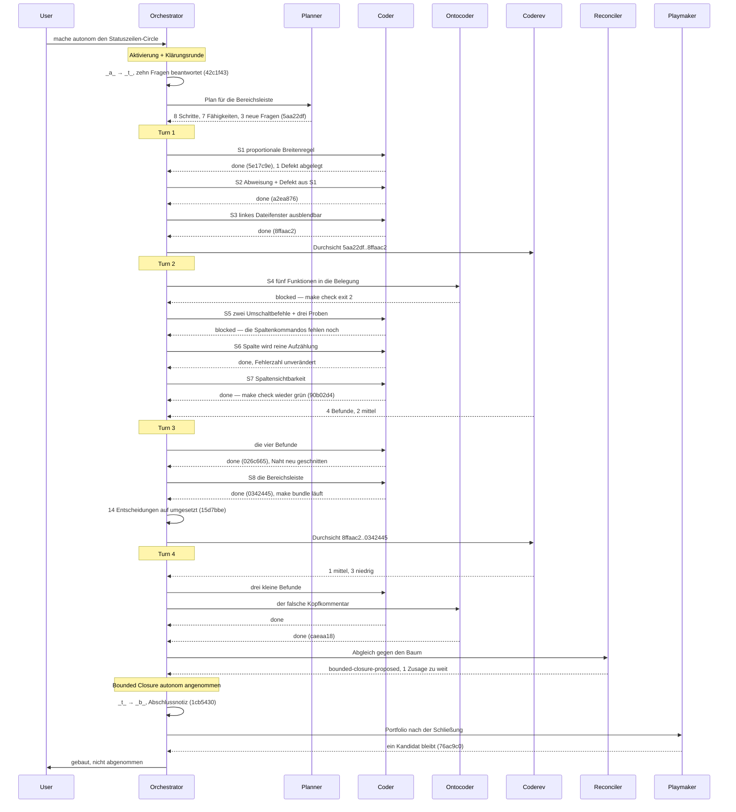

# Orchestrator Session — 260812-0306

**Directive:** Den Circle der Statusleiste (`260811-1304-statusleiste-mit-bereichsschaltern`) autonom fahren und den darin abgelegten Nachtrag zu den Spaltenschaltern mit erledigen.
**Mode:** plan — der Plan `260812-0415_p_bereichsleiste-und-proportionale-breitenregel.md` ist die Quelle der Warteschlange.
**Status:** Bounded Closure: dreizehn Abnahmekriterien verlangen KRK im Vordergrund

## Snapshot bei Sitzungsbeginn

- Arbeitsverzeichnis: /Users/k1/Projects/productive/krk
- Workbench: fusion-workbench/ (Plugin-Version 7.3.0)
- git HEAD: 6b6ea3c
- Aktiver Circle: keiner (`.active-circle` fehlt) — alle OUT_*/SCAN_* zeigen auf `shared/`
- Turn-Budget: max_turns=5 (aufgelöst über bin/fusion-turn-budget)
- Offene Defekte (`_o_`/`_p_`, alle Speicher): 4 — 3 im gemeinsamen Speicher, 1 im Circle der Statusleiste
- Offene Fragen (`_o_`, alle Speicher): 15 — 3 gemeinsam, 5 Runde 1, 1 Runde 3, 6 Statusleisten-Circle
- Offene Pläne/Specs (`_o_`/`_p_`, alle Speicher): 4
- Analysen im gemeinsamen Speicher: 0
- Wächter: `haltActive: false`, 0 aufeinanderfolgende Blockaden; die letzten Blockaden stammen vom 260806/07 aus dem inzwischen entfernten Schreibpfad-Klassifikator
- Circles: 2 vorgesehen (`_a_`), 4 beschränkt geschlossen (`_b_`), 0 aktiv
- Arbeitswarteschlange: keine `tasklist.md` an der Wurzel
- Circle-Hinweis ausgegeben: ja (2 vorgesehene Circles, `/fusion:next` empfohlen)

## Erkannte Domäne

`code`. Grundlage: `bin/fusion-count-sources` zählt 116 Quelldateien gegen 11 Datendateien
(`counted_by=git-ls-files`), also greift der Zweig `code_files > 0`, bevor die
artefaktgestützten Zweige überhaupt gelesen werden. Diese Domäne geht als
`**Domain:** code` an `taskplanner`, `reconciler` und `playmaker`.

## Meistbewegte Dateien

`bin/fusion-churn-rank` (Anker `workbench-root`, 847 Einträge, davon 410 nicht mehr auf
der Platte, 2 als Rauschen verworfen, 10 gewertet):

| Punkte | Datei |
|---|---|
| 163 | `crates/krk-ui/src/appkit/anwendung.rs` |
| 137 | `crates/krk-ui/src/appkit/editor.rs` |
| 76 | `crates/krk-ui/src/appkit/tabelle.rs` |
| 61 | `CLAUDE.md` |
| 43 | `crates/krk-ui/src/kommandos/operationen.rs` |

## Vorherige Sitzung

`shared/history/260812-0252-orchestrator-session.md` — vor 14 Minuten angelegt, kam über
Setup nicht hinaus (kein `agentstate.yaml`, kein Arbeitsauftrag, kein Turn). Die Datei
liegt unversioniert im Baum. Kein Wiederaufnahmefall: ohne `agentstate.yaml` gibt es
nichts fortzusetzen.

## Verlauf

- 260812-0306 — Setup abgeschlossen. Kein unterbrochener Lauf gefunden.

## Vor der Turn-Schleife

- 260812-0306 — Circle `260811-1304-statusleiste-mit-bereichsschaltern` aktiviert (`_a_` → `_t_`),
  Zeiger `.active-circle` geschrieben, Kopffelder nachgezogen.
- 260812-0306 — Klärungsrunde: sechs offene Fragen des Circles beantwortet, vier neue aus dem
  Nachtrag gestellt und beantwortet. Bericht: `circles/…/history/260812-0306-klaerungsrunde.md`.
- 260812-0415 — Planer gefahren. Plan mit sieben Fähigkeiten und acht Schritten; drei neue
  Wahlpunkte, alle drei im selben Zug beantwortet. Ein Beifund als offener Defekt abgelegt.
- Plane-Spiegel: nicht eingerichtet (`plane.config.yaml` trägt noch die Vorlagenwerte). Kein Push
  in dieser Sitzung.

## Per-Turn Log

### Turn 1
- Versuchte Aufgaben: S1, S2, S3
- Erledigt: alle drei
- Commits: 5e17c9e, a2ea876, 8ffaac2
- Abnahme je Aufgabe: `make check` exit 0 (build, test, fmt, clippy mit `-D warnings`)
- Defekte: 260812-0439 behoben (von S1 erzeugt, in S2 gefallen); 260812-0512 neu abgelegt
- Circuit breaker: OK
- Coherence: Durchsicht zum Turn-Ende gestartet

### Turn 2
- Versuchte Aufgaben: S4, S5, S6, S7
- Erledigt: alle vier, aber in **einem** Commit (90b02d4) statt in vieren
- Grund: der Baum wird zwischen S4 und S7 nicht grün. S4 trägt fünf Funktionen in die
  Belegung ein, deren Kommandos erst S7 baut; 28 Proben der Belegungsansicht brechen
  dazwischen ab. Ein Commit je Schritt hätte drei rote Stände in die Historie geschrieben.
- Abnahme: `make check` exit 0 nach S7 (nach S4, S5 und S6 je exit 2, jeweils gemessen und
  im Protokoll des Schrittes festgehalten)
- Defekte geschlossen: 260812-0533, 260812-0548
- Durchsicht (coderev, Bereich 5aa22df..8ffaac2): vier Befunde, zwei mittel. Bestätigt hat
  sie die Terminierung der Wasserstandsrechnung, die Summentreue über 200.000 zufällige
  Eingaben und die Reihenfolge der drei Zusicherungen in `aus_sitzung`.
- Circuit breaker: OK

### Turn 3
- Versuchte Aufgaben: die vier Befunde der ersten Durchsicht, S8, Markerpflege
- Erledigt: alle drei
- Commits: 026c665, 0342445, 15d7bbe
- Abnahme: `make check` exit 0 nach jeder Aufgabe; dazu `make bundle` exit 0 nach S8
  (`target/KRK.app` baut und ist signiert; KRK ist nicht gestartet worden)
- Die beiden mittleren Befunde sind nicht geflickt, sondern die Naht ist neu geschnitten:
  die Wünsche liegen jetzt im Delegierten der Aufteilung statt in den Rahmen der
  Unteransichten, und vom Schirm wird nur zurückgelesen, was eine Ziehbewegung verändert hat.
- Defekte geschlossen: vier aus der Durchsicht (260812-0539), dazu der Nachtrag 260811-1732
- Neu abgelegt: 260812-0700 (der Breitenschritt kommt neben einem gedeckelten Bereich
  gekürzt an)
- Vierzehn Entscheidungen von beantwortet auf umgesetzt, jede mit dem Commit, der sie einlöst
- Circuit breaker: OK

### Turn 4
- Versuchte Aufgaben: die vier Befunde der zweiten Durchsicht
- Erledigt: alle vier
- Commits: caeaa18
- Abnahme: `make check` exit 0
- Der Befund von Gewicht war kein Codefehler: drei Stellen dieser Runde sagten zu, die drei
  Spaltenbefehle stünden in der Markdown-Ausgabe der Runde 3. Die nimmt nur belegte Funktionen
  auf — Nutzerentscheid vom 260811-0110, beim Schreiben des Datensatzes 260812-0306 nicht
  gelesen. Berichtigt sind die drei Zusagen, der Code bleibt.
- Neu abgelegt: 260812-0810 (die Zahl 39 im Kopf der Belegungsdatei)
- Circuit breaker: OK

## Coherence

<!-- RECONCILER-OWNED -->

**Verdict:** bounded-closure-proposed

**Edges:**

- Artifact↔Grounding: 27 von 27 mit **(Probe)** gekennzeichneten Kriterien am Baum geprüft — 26
  treffen zu, C4.9 sagt mehr zu, als der Code hält (`issues/260812-0700_o_…`, gemessene 20,36 statt
  40 Punkte neben einem gedeckelten Bereich). Acht Planschritte, vierzehn `Implemented:`-Zeilen und
  zwölf geschlossene Defektdatensätze sind einzeln belegt; `make check` läuft mit Exit 0 über
  vierzehn Prüfziele. Ein neuer Befund ist entstanden (zwei Modulköpfe nennen das entfallene
  `aufteilung::sichtbar_im`, `issues/260812-0801_o_…`, Schwere niedrig); vier Defekte des Circles
  bleiben zu Recht offen. Belege: `circles/260811-1304-statusleiste-mit-bereichsschaltern/history/260812-0801-reconciliation.md`.
- Artifact↔Directive: Die zehn Commits `6b6ea3c..caeaa18` bewegen sich sämtlich auf die Directive
  zu; keiner liegt quer, keiner von ihr weg. Sechs bauen unmittelbar an ihr (`5e17c9e` die
  Anteilsregel, `a2ea876` die Abweisung, `8ffaac2` das ausblendbare linke Dateifenster, `90b02d4`
  die fünf Funktionen samt Spaltenschaltern, `0342445` die Leiste mit acht Schaltern), zwei
  reparieren Befunde der eigenen Durchsichten (`026c665`, `caeaa18`), zwei sind Buchführung
  (`42c1f43`, `15d7bbe`). **Zwei Einschränkungen, und keine davon ist ein Fehlschlag der Runde.**
  Erstens sagt die Directive zu, „der gemeldete Rückfall der Vorschaubreite … ist mit dieser Runde
  behoben"; behoben ist er seit `1ea5a3d` in der Runde 4, und die Runde hat ihn vorgefunden
  (`bildschirmbreiten_uebernehmen`, `crates/krk-ui/src/appkit/anwendung.rs:2747`, gerufen am Kopf
  von `kommando_ausfuehren`). Der Plan hat den Satz als gegenstandslos benannt, statt ihn
  stillschweigend zu erben. Zweitens ist der Rest der Directive **gebaut und nicht abgenommen**:
  dreizehn Kriterien verlangen KRK im Vordergrund.
- Grounding↔Directive: Neun offene Entscheidungsdatensätze über alle Speicher, keiner davon im
  aktiven Circle, dazu zwei zurückgestellte und zwei überholte; **keiner widerspricht der
  Directive.** Der Circle selbst hat alle vierzehn seiner Fragen beantwortet und umgesetzt. Zwei
  Berührungen sind zu nennen und keine ist ein Widerspruch: `shared/decisions/260810-2132_d_…` (L9,
  „erst messen") wird durch die 18 Punkte hohe Leiste auf dem Zeichenweg eher ausgelöst als
  verletzt, und der Plan setzt ausdrücklich keine neue Zahl; `shared/decisions/260811-2050_o_…`
  (prüfbare Untergrenzenangabe) bleibt offen, und die Runde hat ihre Gewohnheit gehalten — der
  Abschnitt steht jetzt in 32 von 34 Dateien unter `crates/krk-ui/src/appkit/`, `bereichsleiste.rs`
  eingeschlossen. **Eine Grundlage ist gefallen und gehört dem Nutzer vorgelegt:** die Festlegung
  vom 260808, nach der die Lesezeichenleiste dem Editor nicht weicht, trägt die Anteilsregel nicht
  mehr (`decisions/260811-1305_i_was-heisst-proportional-zur-letzten-aufteilung.md`). Sie stand nie
  als Datensatz, sondern nur im Dokumentationskommentar an `bereichsbreiten`, und der Orchestrator
  hat sie in der Klärungsrunde autonom fallen lassen.

**Rebalance recommendation:** accept Bounded Closure

**Warum beschränkter Abschluss und nicht kohärent.** Derselbe Grund wie in den vier Runden davor
und keine Häufung von Fehlschlägen: dreizehn Abnahmekriterien dieser Runde (C1.1, C1.2, C1.4,
C2.1 bis C2.5, C3.1, C3.2, C3.4, C5.1, C6.3) sind nur am laufenden `KRK.app` im Vordergrund zu
sehen, und das kann kein Agent fahren
(`circles/260802-0842-krk-mac-dateimanager-editor-git/decisions/260806-1303_o_wie-kommt-krk-fuer-den-abnahmelauf-in-den-vordergrund.md`).
Was ein Agent abnehmen kann, ist abgenommen: 27 Kriterien, `make check` Exit 0. „Gebaut" ist damit
die richtige Aussage über diese Runde und „abgenommen" nicht.

**Zwei Punkte für die Rebalance, beide klein und beide für den Nutzer.**

1. **Eine Zusage reicht weiter als der Code.** C4.9 verspricht den Breitenschritt von 40 Punkten
   ohne Bedingung; neben einem gedeckelten Bereich kommt weniger an. Weg 1 des Datensatzes
   `issues/260812-0700_o_…` schreibt die Grenze ans Kriterium und kostet einen Satz; Weg 2 ändert
   die eine Breitenregel. Das ist eine Wahl und keine Nacharbeit.
2. **Die Nutzerfestlegung vom 260808 ist von einem Agenten aufgehoben worden.** Das war durch die
   Weisung „mache autonom" gedeckt, und die tragende Begründung hält: die Directive vom 260811 ist
   jünger und spricht ausdrücklich von *Bereichen*, nicht von Dateifenstern, und eine benannte
   Ausnahme für die Lesezeichenleiste risse in genau das diktierte Beispiel ein Loch. **Die zweite
   Begründung des Datensatzes hält nicht.** Sie lautet, die Frage vom 260808 („wer weicht, wenn es
   eng wird?") löse sich unter der Anteilsregel auf, weil niemand mehr einzeln weiche. Das trifft
   nicht zu: die Wasserstandsrechnung nimmt einen Bereich, der sein Mindestmaß erreicht, aus der
   Verteilung heraus, und von da an weichen allein die übrigen. Die Frage hat also weiterhin einen
   Gegenstand, nur eine andere Antwort — den Vorrang bestimmt jetzt die Mindestbreite statt der
   Platz in `Bereich::ALLE`. Im gewöhnlichen Fall schrumpft die Lesezeichenleiste beim Aufgehen des
   Editors, und genau dagegen hatte der Nutzer am 260808 entschieden. Die Festlegung ist
   **überstimmt und nicht aufgelöst**, und so sollte sie im Datensatz stehen.

---

## Budget

| Kennzahl | Zahl |
|---|---|
| Turns | 4 |
| Aufgaben erledigt | 9 Planschritte plus 2 Befundläufe |
| Aufgaben übersprungen/zurückgestellt | 0 |
| Defekte gefiled | 16 |
| Defekte geschlossen | 12 |
| Fragen beantwortet (`_o_`→`_a_`) | 7 neu gefiled und im selben Zug beantwortet |
| Fragen umgesetzt (`_a_`→`_i_`) | 14 |
| Commits | 12 |
| Agentenfehler | 0 |
| Menschliche Gates getroffen | 0 (auf Weisung des Nutzers autonom gefahren) |

Die Zahlen sind am Dateibestand gemessen, nicht mitgezählt: `filed` vergleicht den Zeitstempel
im Dateinamen mit dem Sitzungsbeginn, `now_<marker>` fragt, ob der heutige Name beim Anker
`6b6ea3c` schon existierte. Fünf Defekte stehen am Ende offen.

## Review coverage

**Range:** `6b6ea3c..76ac9c0` — 12 Commits
**Covered by:**
- `circles/…/reviews/260812-0539-coderev-…` — `5aa22df..8ffaac2`, 3 Commits, `not-opened=none`
- `circles/…/reviews/260812-0727-coderev-…` — `8ffaac2..0342445`, 3 Commits, `not-opened=none`

**Not covered:** vier Commits.
- `caeaa18` fix(ui): vier Befunde der zweiten Durchsicht — Code, **die einzige ungedeckte
  Codeänderung**. Sie behebt Befunde der zweiten Durchsicht und ist selbst nicht mehr
  durchgesehen worden.
- `15d7bbe`, `5aa22df`, `42c1f43` — reine Workbench-Commits (Marker, Plan, Aktivierung), kein
  Code.

**Carried out-of-scope files:** `none`.

## Status

**Bounded Closure:** dreizehn Abnahmekriterien verlangen KRK im Vordergrund und sind Nutzerarbeit.

## Session Flow

