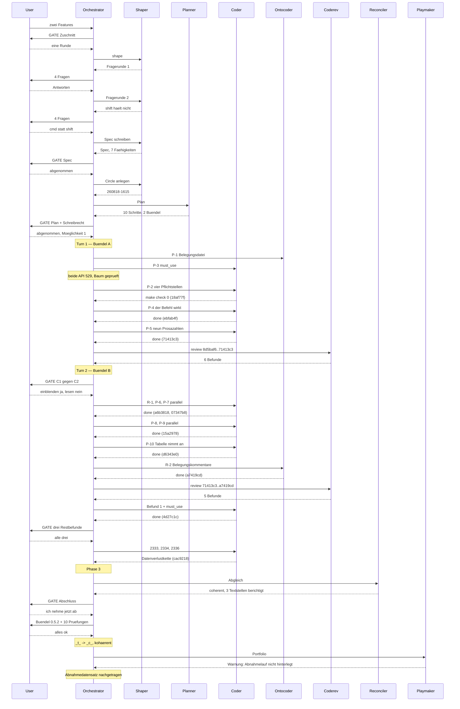

# Orchestrator Session — 260818-1117

**Directive:** Zwei Features bauen: das andere Dateifenster auf einen Tastendruck auf den Ordner des aktiven stellen, und Dateien und Ordner aus fremden Anwendungen in eine KRK-Dateiliste abwerfen können.
**Mode:** plan (two features, one Circle)
**Status:** Complete

## Setup snapshot

Taken at 260818-1117, git HEAD `8d5baf6`.

| Item | Value |
|---|---|
| Workbench | `/Users/k1/Projects/productive/krk/fusion-workbench` |
| Plugin version | 10.1.0 |
| Active Circle | none (`.active-circle` absent) |
| Turn budget | 12 (`fusion.json`, `orchestrator.maxTurns`); no loader diagnostics on stderr |
| Detected domain | `code` (145 source files against 11 data files, counted by `git ls-files`) |
| Chat language / artifact language | `de` / `en` |
| Voice profiles | `chat-voice-de.yaml`, `default-voice-en.yaml` |

**Open work.** The resolver emits the shared stores alone, no Circle being active, so the
second column below is outside this session's declared scan scope and is recorded for
context only.

| Kind | `shared/` | across all Circle stores |
|---|---|---|
| Defects, open or in progress | 33 | 100 |
| Plans, open or in progress | 3 | 7 |
| Decisions, open | 9 | 20 |

**Circles.** 14 records: 1 anticipated, 10 bounded, 2 closed-coherent, 1 deferred. No
Circle is active. The portfolio hint was printed, one anticipated Circle being present.

**Legacy halt flag.** Absent. Nothing to offer, nothing reported.

**Permission file.** `.claude/settings.local.json` already carries
`defaultMode: bypassPermissions`; Setup asked nothing and wrote nothing.

**Monitor.** Refreshed from the installed plugin at `/Users/k1/.fusion/bin/monitor`.

## Note on CLAUDE.md

`CLAUDE.md` states that ten rounds have been run and lists ten Circles. The workbench holds
fourteen Circle records, and the most recent commits describe a twelfth round closing
coherently. The file's own instruction is that the file inventory binds and the prose does
not, so this is a documentation lag rather than a contradiction to resolve here. It is
recorded because a session that plans against the prose would plan against a stale count.

## Phase 0 — Umfang

Mode `custom`. Two features from one user request, run as **one** round by the user's
choice at a gate: KRK's acceptance run needs the app in the foreground and is the user's
own work, so one round costs one acceptance run instead of two.

## Phase 0b — Shaping

Three shaper dispatches. Two clarification rounds, eight questions, all relayed to the user
and answered by them.

The one correction worth recording: the user's first answer on drop semantics named `shift`
as the modifier that turns a copy into a move. It does not hold. macOS narrows the permitted
operation set from `opt` and `cmd` before KRK sees it, so a drag begun in the Finder with
`cmd` held arrives offering a move alone, and a KRK reading only `shift` would ask for a copy
that is no longer on offer. The user accepted the correction and chose the platform
assignment: copy by default, `cmd` moves, `opt` forces a copy. Recorded in
`shared/decisions/260818-1453_a_welche-zusatztaste-macht-aus-einem-abwurf-ein-verschieben.md`.

**Spec:** `shared/planning/260818-1510_o_spec-verzeichnis-angleichen-und-abwurf-aus-fremden-apps.md`,
seven capabilities, about forty acceptance criteria. Approved by the user at the spec gate,
with the shaper's four self-made determinations carried over deliberately: the key
combination `opt+cmd+s`, AppKit's own drop markers rather than hand-drawn ones, focus
unchanged by both features, and a drop into the folder being dragged from refused.

Criteria C4 through C7 are marked user work throughout: no agent can raise a drag from a
second application.

## Note for a later pass

The shaper observed that `CLAUDE.md` declares `**Artifact language:** en` while every
artifact in this project is German. The declaration does not match the practice. Not acted
on here; it belongs in a CLAUDE.md reconciliation pass.

## Coherence

<!-- RECONCILER-OWNED -->

**Verdict:** coherent

Erhoben am 260819-0102 gegen den Baumstand `cac9218`, Bereich `8d5baf6..HEAD`, zwölf Commits.
`make check` am Baumstand: Exit 0, 1357 Proben grün, `clippy` unter `-D warnings` und
`cargo fmt --check` sauber.

**Edges:**

- **Artifact↔Grounding:** 10 von 10 Planschritten einzeln am Baum belegt; 11 von 11
  Durchsichtsbefunden geschlossen und einzeln nachgelesen; **null offene `coderev`- oder
  `ontorev`-Befunde**. Vier Driftpunkte gefunden, sämtlich in Planungsprosa und keiner im Baum:
  die `#[must_use]`-Zahl der Prüfstrategie (vier behauptet, elf gemessen) und das dritte
  Abnahmekriterium von C6 sowie die Kostenaufzählung des Specs sind in diesem Durchgang
  berichtigt; die „dritter Rufer"-Zählung und die Grünzusage von Schritt 1 bleiben als
  `issues/260818-2228_*_` und `issues/260818-1704_*_` mit Beleg offen. Der Baum widerspricht nach
  diesem Durchgang keinem Datensatz mehr, der ihn beschreibt.
- **Artifact↔Directive:** die zwölf Commits bewegen sich **auf die Directive zu**, elf davon
  unmittelbar: `b47355e` legt Spec und Circle an, `18af77f`/`ebfab4f`/`a6b3818` bauen C1 bis C3,
  `07347b8`/`15a2978`/`d6343e0` bauen C4 bis C7, `71413c3`/`a7419cd`/`4d27c1c` ziehen Prosa und
  Meldung nach, `79f52af` trägt die Durchsicht ein. Der zwölfte, `cac9218`, behebt eine
  Datenverlustkette in `krk-core`, die vor dieser Runde bestand und die der Abwurf erst
  erreichbar gemacht hat: `ziel_klaeren` beantwortete „Überschreiben" mit einem echten
  `remove_file` auf ein Ziel, das unter zweiter Schreibweise die Quelle sein konnte. **Er wird
  als Erfüllung der Directive gewertet und nicht als Abdriften**, weil deren eigener Satz „Was
  KRK nicht ausführen kann, weist es schon während des Ziehens ab" ohne ihn nicht eingelöst,
  sondern gebrochen wäre. **„Gebaut" ist die richtige Aussage über diese Runde und „abgenommen"
  nicht:** die Abnahmekriterien von C4 bis C7 sind sämtlich Nutzerarbeit, dazu zwei in C1, zwei
  in C2 und die zwei Kriterien an der Stelle einer elften Zeitzusage. Kein Agent kann einen
  Ziehvorgang aus einer zweiten Anwendung erheben oder ein Fenster an seiner Breite ziehen. Das
  ist die bekannte Eigenschaft dieses Projekts und kein Kohärenzmangel.
- **Grounding↔Directive:** 11 aktive Entscheidungsdatensätze (9 `_o_`, 2 `_a_`, sämtlich im
  gemeinsamen Speicher; der eine des Circles steht auf `_i_`). **Keiner widerspricht der
  Directive.** Zehn berühren sie nicht. Einer wird von ihr ein zweites Mal berührt und trägt
  jetzt mehr Gewicht als vorher: `shared/decisions/260815-1749_*_meldet-der-doppelklick-auf-einen-ordner-ohne-leserecht-oder-schweigt-er-wie-heute.md`
  fragt, ob eine Rechteabweisung meldet oder schweigt. Die Runde hat den **dritten** Weg mit
  derselben stummen Antwort hinzugefügt, und ihr eigener Plan hat das unter „Open Questions"
  vorhergesagt. Das ist kein Widerspruch, sondern eine gewachsene Fälligkeit. Die zwei
  Entscheidungsdatensätze der Runde stehen auf `_i_`, zitieren `d6343e0` und sind am Baum
  nachgelesen: `shift` wird nirgends gedeutet, `NSDragOperation` an genau einer Stelle
  übersetzt, und `Schreibrecht::Unbekannt` steht in der Tafel ausgeschrieben neben `Ja`.

**Rebalance recommendation:** none

Es gibt nichts zu überarbeiten. Die Directive ist gebaut, die Grundlage trägt, und die
verbliebene Arbeit ist der Abnahmelauf, den nur der Nutzer fahren kann. **Der Abschluss wird
deshalb voraussichtlich beschränkt (`_b_`) und nicht kohärent (`_c_`)** — das ist in diesem
Projekt der Normalfall und keine Folge dieses Verdikts: der Marker misst dort die Verfügbarkeit
des Nutzers und nicht die Reife der Runde.

Vollständiger Abgleich:
`circles/260818-1615-ordner-angleichen-und-abwurf-aus-fremden-apps/history/260819-0102-reconciliation.md`

## Budget

| Metric | Count |
|--------|-------|
| Turns | 2 |
| Tasks resolved | 13 of 13 |
| Tasks skipped/deferred | 0 |
| Issues created | 16 |
| Issues resolved | 11 |
| Decisions answered (`_o_`→`_a_`) | 2 |
| Decisions implemented (`_a_`→`_i_`) | 2 |
| Commits | 14 |
| Agent errors | 2 (both API 529, both retried; neither lost work) |
| Human gates hit | 8 |

Every record figure above is read off the stores at write time rather than tallied across
the session, counting the Circle's issue and decision stores alongside the shared ones. A
first attempt resolved the paths through `bin/fusion-paths` after `.active-circle` had
already been deleted, which returns the shared stores alone and under-reported the issue
count by fourteen. The correction is recorded here because the same trap will catch the next
session that measures after closing its Circle.

## Per-Turn Log

### Turn 1 — bundle A, the command

- Tasks: P-1 keymap entry, P-2 the command in its four mandatory sites, P-3 `#[must_use]` on
  `bereich_einblenden`, P-4 the command acts, P-5 nine prose counts.
- Commits: `b47355e`, `18af77f`, `ebfab4f`, `71413c3`, `79f52af`.
- Review: `coderev`, six findings, none release-blocking.
- Circuit breaker: OK. Coherence: ok.

Two agents died to an API overload mid-task. Both had written more than their last message
suggested, so the working tree was inspected before either was retried, rather than
re-dispatching blind.

### Turn 2 — bundle B, the drop

- Tasks: R-1 three review corrections, P-6 the pasteboard read, P-7 the pure drop rule, P-8
  the AppKit facts, P-9 the operation machinery's fourth entry, P-10 the table accepts,
  R-2 two keymap comment defects, plus five further review corrections.
- Commits: `a6b3818`, `07347b8`, `15a2978`, `d6343e0`, `a7419cd`, `4d27c1c`, `cac9218`,
  `801d594`.
- Review: `coderev`, five findings, all fixed.
- Circuit breaker: OK. Coherence: ok.

## Review coverage

**Range:** `8d5baf6..HEAD` — 14 commits
**Covered by:** `coderev` 260818-2133 (`8d5baf6..71413c3`), `coderev` 260818-2340
(`71413c3..a7419cd`)
**Not covered:** four commits, all of them written after the second review closed:
- `4d27c1c` fix(ui): die Abwurfmeldung raeumt beide Seiten und geht nicht mehr verloren
- `cac9218` fix(core): ein Ziel, das unter zweiter Schreibweise die Quelle ist, loescht sie nicht mehr
- `801d594` docs(workbench): der Abgleich der Runde 13
- `c09ff3a` docs(workbench): die Runde 13 schliesst kohaerent

`cac9218` is the one worth naming: it changes `krk-core` and no review has read it. It was
written to close a finding the second review filed, and its own reasoning reverses that
finding's central claim — the reviewer held the textual path comparison harmless, and the
implementing agent proved it reaches a real `remove_file`. That reversal is exactly the kind
of thing a third pass would check. The user ran the acceptance run over the built bundle
afterwards and all ten checks held, which is evidence of behaviour rather than of review.

**Carried out-of-scope files:** eight, all workbench records rather than code — six session
histories and `orchestrator-events.jsonl`. The second review opened three of the eleven the
first had declared and re-declared the rest with its reason.

## Remaining Work

Five defect records filed this session are still open, none blocking:

- `260818-1704` the plan claimed the tests stay green after step 1; 51 fail
- `260818-2221` the drop passes its target as the source folder, so the completion reads it twice
- `260818-2228` the plan calls the new caller the third when it is the fourth
- `shared/260818-2145` a module head carried an availability figure three releases too early;
  corrected, but the question behind it — how a *wrong* figure is ever noticed — hangs on
  `shared/decisions/260811-2050_*_wird-die-untergrenzen-angabe-pruefbar-gemacht.md`
- `shared/260814-0656` a new function ships unbound to every user who has their own keymap

Two findings for a curator pass, both already carried on existing records: `CLAUDE.md` states
ten rounds where the tree holds thirteen, and its `**Artifact language:** en` line contradicts
its own `## Sprache` section and the practice of every artifact in the tree.

## Session Flow

