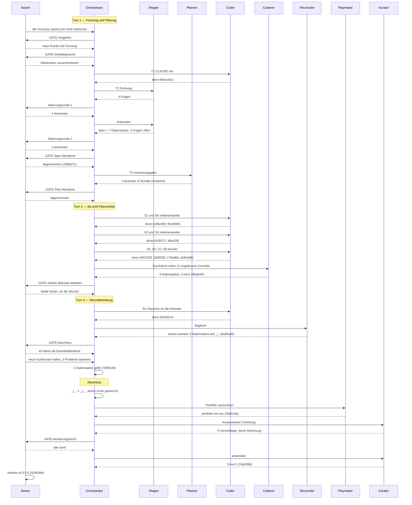

# Orchestrator Session — 260819-2026

**Directive:** Aus der Vorschau lässt sich nichts kopieren: die Fläche ist nicht auswählbar, Zeichen zu markieren ist nicht möglich. Das soll gelöst werden. (Wörtlich vom Nutzer am 260819-2031; ausformuliert im Spec `shared/planning/260819-2216_*_spec-auswahl-und-kopieren-in-der-vorschau.md`.)
**Mode:** custom, mit vorgeschalteter Formung (Nutzerentscheid am 260819-2035)
**Status:** Abgeschlossen

## Setup snapshot

- Workbench: `/Users/k1/Projects/productive/krk/fusion-workbench` (plugin version 10.2.0)
- No interrupted session: `agentstate.yaml` absent at Setup, so the prior session left nothing to resume.
- A prior history file, `shared/history/260819-2007-orchestrator-session.md`, stands untracked with `**Status:** Abgeschlossen`. That session wrote its Setup snapshot and went no further; it holds no work and no commits. This session does not adopt it — a session keeps its own history file — and the file is carried into this session's first staging list so it stops sitting outside every commit.
- No active Circle: `.active-circle` absent, so every `OUT_*` resolves into `shared/`.
- Git HEAD at start: `fce0b6f`
- Turn budget: `max_turns=12`, resolved from `fusion.json` (`orchestrator.maxTurns`). The configuration loader put no diagnostics on stderr.
- Open defect records: 34 in the shared store, 103 across the Circle stores.
- Open plan files: 3 in the shared store, 7 across the Circle stores.
- Open decision records: 13 in the shared store, 20 across the Circle stores.
- Circles: 1 anticipated, 10 bounded closure, 3 closed coherent, 1 deferred. The one anticipated Circle is `circles/260804-0933-eingebauter-web-betrachter-im-vorschaufenster/`.
- Circle hint printed to the user: yes (1 anticipated, 0 active).
- Workbench domain: `code`. Source count `code_files=147`, `data_files=11`, `counted_by=git-ls-files`; data does not outweigh source, so the tree's source volume decides.
- Monitor binary refreshed from the installed plugin.
- Session marker: the previous marker was stale (heartbeat 1064s old against a 600s threshold); a fresh one was written for this session.
- Permissions: `.claude/settings.local.json` already carried `defaultMode: bypassPermissions`; nothing written, no question asked.
- `fusion.json` already present; the template was not copied.
- No legacy halt flag in `.guard-state/`.
- Voice profiles: chat `chat-voice-de.yaml`, writing `default-voice-en.yaml`, matching the project's two declarations (chat German, artifacts English).

## Budget

| Metrik | Zahl |
|--------|------|
| Turns | 3 |
| Planschritte erledigt | 8 von 8 |
| Aufgaben insgesamt erledigt | 12 |
| Defektdatensätze gefilt | 17 |
| Defektdatensätze geschlossen | 8 |
| Entscheidungsdatensätze gefilt | 8 |
| Entscheidungsdatensätze auf beantwortet | 2 |
| Entscheidungsdatensätze auf umgesetzt | 6 |
| Commits | 19, dazu der Auslieferungscommit des Nutzers |
| Agentenfehler | 0 |
| Nutzergates | 9 |

Die vier Datensatzzahlen sind am Dateibestand erhoben und nicht mitgezählt: gegen den Anker
`fce0b6f` und den Sitzungsbeginn `260819-2026`, über beide Speicher (Circle und gemeinsam).

## Per-Turn Log

### Turn 1 — Formung und Planung
- Aufgaben: T1 Artefaktsprache aus `CLAUDE.md`; T2 Formung (Spec + sieben Datensätze, Circle angelegt und aktiviert); T3 Umsetzungsplan
- Commits: `6be1e81`, `258bd7c`, `677c1c6`, `41abcb3`
- Nutzergates: 4 (Vorgehen, Artefaktsprache, Spec-Abnahme, Plan-Abnahme)
- Coherence: ok — die zwei Abnahmegates tragen den Abgleich dieses Turns

### Turn 2 — die acht Planschritte
- Aufgaben: S1, S6 (nebeneinander), S2, S3 (nebeneinander), dann S4, S5, S7, S8 einzeln — ab S4 fassen alle Schritte `vorschau.rs` an
- Commits: `9e10b94`, `13be459`, `91f8727`, `dfacf29`, `6531f38`, `1b85538`, `17dad8a`, `b28cdd6`
- Durchsicht: `coderev` über `fce0b6f..b28cdd6`, zwölf zuvor ungelesene Commits; sechs Datensätze (0 kritisch, 2 hoch, 2 mittel, 2 niedrig). Deckung danach `uncovered=0`, Commit `56afe45`
- Befunde der Schritte selbst: viermal war eine Zählerwartung des Plans am Baum nicht erfüllbar, viermal hat der ausführende Coder die Erwartung an den Baum angepasst statt umgekehrt. Neun falsch gewordene Prosastellen statt der vier, die der Plan führte.

### Turn 3 — Wurzelbehebung
- Aufgabe: R1, beide hohen Befunde an ihrer gemeinsamen Wurzel. Die Klammer hängt seither an Vorspann und Nachspann eines Elements statt an verdeckten Bytes irgendwo darin.
- Commit: `05cb614`
- Nutzergate: 1 (welche Befunde behoben werden)
- Beide neuen Proben sind vor der Behebung gefahren worden und waren rot.

## Was aussteht

- **15 der 39 Abnahmekriterien sind ungefahren.** Sie tragen einen Bündelanteil, sind nur am
  laufenden `KRK.app` im Vordergrund zu sehen und damit Nutzerarbeit; kein Agent kann sie fahren.
- **Vier Befunde der Durchsicht bleiben offen**, auf ausdrücklichen Nutzerentscheid vom
  260820-0750: `260820-0733_o_` (die Abfangstelle verwirft die geforderten Sorten und leert jede
  gereichte Ablage), `260820-0735_o_` (der Anker des Freigabedialogs), `260820-0737_o_` (zwei
  Kriterien mit Probenkennzeichnung ohne Probe), `260820-0739_o_` (`text_schreiben` ohne
  `#[must_use]`).
- **Zwei Entscheidungsdatensätze bleiben auf beantwortet** statt umgesetzt, begründet im
  Abgleich: die Ausgabewege hängen an einer Erschließung, die erst die Bündelabnahme misst, und
  die L7-Antwort „kein Lauf" ruht auf einem Kriterium ohne Prüfer.
- **`CLAUDE.md` trägt eine falsche Aussage** (Zeile 124: die Textfläche des Editors sei die eine
  Ausnahme im Ereignisabgriff — es sind seit `6531f38` zwei) und drei unvollständige. Nicht
  angefasst; ob ein Kuratorendurchgang folgt, ist Nutzerentscheid.

<!-- RECONCILER-OWNED -->
## Coherence

**Verdict:** review-needed

**Edges:**
- Artifact↔Grounding: 24 der 39 Abnahmekriterien am Baum verifiziert (die 15 mit Bündelanteil sind Nutzerarbeit und ungefahren), 8 von 8 Planschritten `[DONE]` und einzeln belegt, alle vier Prüfkommandos grün gegen `05cb614`; **2 Drift-Punkte** — C2.3 und C2.4 tragen im Spec die Kennzeichnung **(Probe)** und haben im Baum keine (`issues/260820-0737_o_`), und das Sitzungsprotokoll dieser Sitzung führt weder Directive noch Turn-Log (neu gefilt als `shared/issues/260820-0834_o_…`); **4 offene Durchsichtsbefunde** (`260820-0733_o_`, `260820-0735_o_`, `260820-0737_o_`, `260820-0739_o_`), alle vier gegen `05cb614` nachgelesen, alle vier unverändert zutreffend, alle vier auf ausdrücklichen Nutzerentscheid offen gelassen.
- Artifact↔Directive: **bewegt sich auf die Directive zu.** Directive laut `agentstate.yaml`: „Aus der Vorschau lässt sich nichts kopieren: die Fläche ist nicht auswählbar. Das soll gelöst werden." Von den 15 Commits `fce0b6f..HEAD` tragen 13 unmittelbar dorthin — Formung und Plan (`258bd7c`, `41abcb3`), die acht Schritte (`13be459`, `91f8727`, `dfacf29`, `6531f38`, `1b85538`, `9e10b94`, `17dad8a`, `b28cdd6`), Durchsicht (`56afe45`) und Wurzelbehebung (`05cb614`). Die zwei übrigen sind Sitzungsbuchführung und nicht gegenläufig: `6be1e81` (eigene Nutzeraufgabe T1, Sprachdeklaration) und `677c1c6` (ein gefilter Befund). Kein Commit läuft der Directive entgegen.
- Grounding↔Directive: **16 aktive Datensätze in den zwei Speichern dieses Circles konsistent, 0 widersprüchlich** (nach diesem Abgleich; 5 der 21 sind auf `_i_` gewandert, der Speicher des Circles selbst ist leer, projektweit stehen 46 aktive). **2 sind gekoppelt und zitiert:** `shared/decisions/260819-1440_o_was-sagt-der-marker-c-an-einem-spec-gebaut-oder-abgenommen.md` bestimmt, wie diese Runde schließen darf, und ist unbeantwortet; `shared/decisions/260813-0053_o_schluckt-der-abgriff-den-zulaessigen-befehl-oder-den-ausgefuehrten.md` trägt die Grundlage von C1.10 und ist ebenfalls unbeantwortet. Kopplung, kein Widerspruch.

**Rebalance recommendation:** revise Artifact

**Zur Empfehlung.** Die geflaggte Kante ist Artifact↔Grounding, und die mechanische Zuordnung
liefert deshalb „revise Artifact". Die Empfehlung ist beratend und trifft hier auf eine
Eigenschaft dieses Projekts: **die Directive ist der Sache nach erreicht** — die Vorschaufläche
ist auswählbar, das Kopieren liefert bei gerendertem Markdown den Quelltext, und beides ist am
Baum belegt —, aber 15 der 39 Abnahmekriterien verlangen `KRK.app` im Vordergrund, und das ist
Nutzerarbeit, die kein Agent fahren kann. Zehn der bisher dreizehn gefahrenen Runden sind aus
genau diesem Grund als beschränkter Abschluss (`_b_`) geschlossen worden. Der Nutzer entscheidet
am Rebalance-Tor; der Reconciler nimmt ihm die Wahl nicht ab und hat den Circle-Marker `_t_`
nicht angefasst.

## Portfolio update

Die Runde 14 ist am 260820-1045 kohärent geschlossen, `.active-circle` ist gelöscht, und der
Playmaker hat `portfolio.md` neu erzeugt. Sein Protokoll:
`shared/history/260820-1044-playmaker-direct-dispatch.md`.

Drei seiner Befunde gehören in dieses Protokoll, weil sie über die Runde hinausweisen:

- **Rang 1 der vorgesehenen Circles bleibt der Web-Betrachter**, aber der Playmaker empfiehlt ihn
  nicht als nächsten Lauf. Vor ihm stehen eine Untersuchung des Darstellungsmittels und eine
  Klärungsrunde über drei Fragen.
- **Der stärkere Kandidat hat keinen Circle:** die Bewegung zwischen Editor und Vorschau, aus den
  drei Datensätzen dieses Abnahmelaufs. Kleiner im Zuschnitt, Grundlage zwei Stunden statt zwei
  Wochen alt, ein Defekt hoher Schwere darunter. Der Playmaker hat ihn benannt und nichts gefilt —
  einen Rückstandseintrag anzulegen ist dem Nutzer vorbehalten.
- **Eine `## Parent grounding stale`-Notiz steht am Circle des Web-Betrachters**, obwohl ihre
  übliche Bedingung nicht erfüllt war: sie fährt normalerweise auf einem beschränkt geschlossenen
  Kind, und die Runde 14 hat kohärent geschlossen. Die Prüfung fiel trotzdem bejahend aus, weil
  die Vorschau sich erheblich verändert hat.

**Das Auslieferungstor steht offen:** 22 Commits seit `v0.5.4`, kein Tag an HEAD. Das ist kein
Befund dieser Runde, sondern der Stand des Baums; `cargo xtask release` bricht in dieser Lage ab,
bis der Nutzer eine Zahl wählt.

## Review coverage

**Bereich:** `fce0b6f..HEAD` — 19 Commits.

**Gedeckt von:** `circles/260819-2230-auswahl-und-kopieren-in-der-vorschau/reviews/260820-0745-coderev-auswahl-und-kopieren-in-der-vorschau.md`, Bereich `fce0b6f..b28cdd6`, 12 Commits.

**Nicht gedeckt — sieben Commits, einzeln benannt und nicht gezählt:**

- `05cb614` fix(ui): die Klammer haengt an den Raendern eines Elements, nicht an verdeckten Bytes
- `56afe45` docs(workbench): die Durchsicht der Runde 14 und ihre sechs Datensaetze
- `dad0a36` chore(workbench): der Abgleich der Runde 14, Verdikt review-needed
- `70d914d` docs(workbench): der Abnahmelauf der Runde 14 und seine drei Befunde
- `2beb1de` docs(workbench): die Runde 14 schliesst kohaerent, und das Portfolio zieht nach
- `7da3098` docs: fuenf Aussagen in CLAUDE.md stehen wieder auf dem Stand des Baums
- `5d363de` chore(release): die Version steht auf 0.5.5 (Commit des Nutzers)

**Einer davon trägt Code, und das ist die Lücke, die zählt: `05cb614`**, die Wurzelbehebung der
Klammerregel, 238 geänderte Zeilen in `markdown.rs`. Sie ist **nach** der Durchsicht entstanden,
weil sie deren Befunde behebt, und keine zweite Durchsicht ist über sie gelaufen. Der Nutzer hat
sie am Bündel abgenommen; eine Durchsicht ist das nicht. Die übrigen sechs sind
Arbeitsplatz-Datensätze und der Versionscommit des Nutzers.

**Übernommene nicht geöffnete Dateien:** die Durchsicht nennt zwölf Pfade, die sie nicht geöffnet
hat, sämtlich Arbeitsplatz-Datensätze und `CLAUDE.md`. Eine nächste Durchsicht hat sie in ihren
Bereich aufzunehmen.

## Was diese Sitzung über das Verfahren gelernt hat

Vier Befunde binden künftige Arbeit und nicht diese Runde:

- **Der geteilte `/tmp`-Namensraum der Commit-Nachricht** (`shared/issues/260819-2206_o_`). Die
  Datei dieser Sitzung ist während des Laufs von einer fremden Sitzung überschrieben worden,
  folgenlos nur deshalb, weil es nach dem `git commit -F` geschah.
- **`make check` fasst den ganzen Arbeitsbereich** (`shared/issues/260820-0602_o_`). Bei parallelen
  Agenten gehört ein grünes Ergebnis dem Baum in jenem Augenblick und nicht dem einzelnen Schritt.
- **Der Plan schreibt Zählerwartungen, ohne sie am Baum zu prüfen** (`circles/…/issues/260820-0646_o_`).
  Viermal in einer Runde, viermal vom Coder in die richtige Richtung aufgelöst.
- **Neun falsch gewordene Prosastellen statt der vier, die der Plan führte**
  (`circles/…/issues/260820-0731_c_`). Eine Erhebung, die von den geänderten Dateien ausgeht,
  findet die übrigen nicht.

## Session Flow

