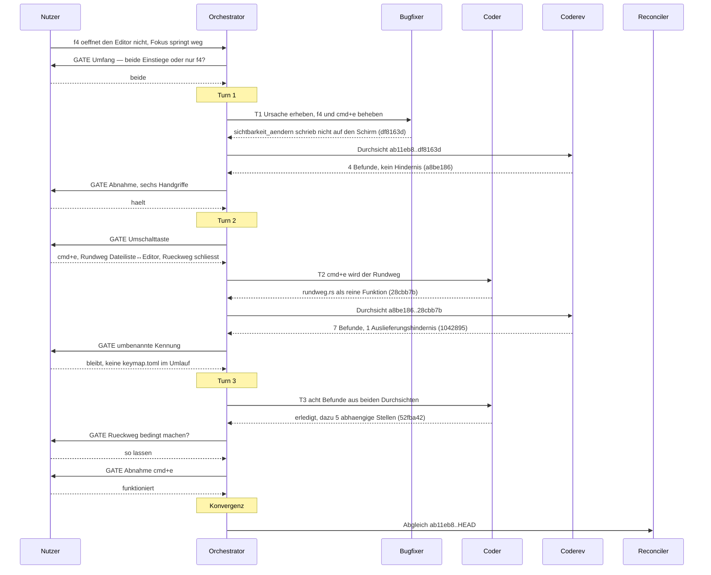

# Orchestrator-Sitzung — 260823-0442

**Directive:** `f4` soll den Editor mit der ausgewählten Datei öffnen und den Fokus hineinlegen; zu
Beginn öffnete der Editor gar nicht und der Fokus sprang in die Lesezeichenliste.
**Mode:** custom
**Status:** Abgeschlossen

## Aufnahme beim Start

| Größe | Wert |
|---|---|
| Arbeitsverzeichnis | `/Users/k1/Projects/productive/krk` |
| git HEAD | `ab11eb8` |
| Turn-Budget | 12 (aus `fusion.json`, `orchestrator.maxTurns`) |
| Offene Defekte, gemeinsamer Speicher | 44 |
| Offene Defekte, in Circles | 108 |
| Offene Pläne | 5 gemeinsam, 7 in Circles |
| Circles | 0 vorgesehen, 0 aktiv, 10 beschränkt, 5 kohärent, 2 zurückgestellt |
| Aktiver Circle | keiner |
| Erkannte Domäne | `code` (150 Quelldateien gegen 11 Datendateien, `git ls-files`) |

Kein Circle-Hinweis ausgegeben: es gab weder vorgesehene noch aktive Circles.

## Budget

Die vier Datensatzzahlen sind am Ende der Sitzung von der Platte erhoben und nicht mitgezählt
worden (Anker `ab11eb8`, Startstempel `260823-0442`, beide Hälften messbar).

| Metrik | Zahl |
|---|---|
| Turns | 3 |
| Aufgaben erledigt | 3 |
| Aufgaben übersprungen oder zurückgestellt | 0 |
| Defektdatensätze angelegt | 12 |
| Defektdatensätze geschlossen | 11 |
| Entscheidungen beantwortet (`_o_`→`_a_`) | 0 |
| Entscheidungen umgesetzt (`_a_`→`_i_`) | 2 |
| Commits | 9 |
| Agentenfehler | 0 |
| Nutzergates | 7 |

Die Null bei „beantwortet" ist kein Fehlbetrag: beide Entscheidungen dieser Sitzung sind noch in
derselben Sitzung umgesetzt worden und tragen deshalb heute `_i_`. Der Zwischenstand `_a_` hat auf
der Platte keine Spur hinterlassen, und die Erhebung fragt nach dem Namen, den ein Datensatz jetzt
trägt.

## Verlauf je Turn

### Turn 1 — die Ursache war nicht die vermutete

- **Aufgabe:** `bugfixer`, zwei Defektdatensätze vom 260820 mit **einer** Korrektur, nachdem der
  Nutzer am Gate „beide Einstiege" gewählt hatte.
- **Erhobene Ursache:** `sichtbarkeit_aendern` (`crates/krk-ui/src/appkit/anwendung.rs`) änderte
  die Sichtbarkeit im Fenstermodell und schrieb sie nicht auf den Schirm. `Aufteilung::anwenden`
  ist der einzige Schreiber von `setHidden`, sein einziger Rufer `aufteilung_nachziehen`, und
  dessen vier Aufrufstellen enthielten `editorausgang_behandeln` nicht — das läuft aus dem
  `NSTimer` des Editorbereichs, außerhalb jedes Befehlsrumpfs. Entstanden mit `784840c` vom
  260809.
- **Der Verdacht des Ursprungsdatensatzes ist widerlegt worden**, nicht bestätigt. Er lautete auf
  eine verkehrte Reihenfolge von Einblenden und Fokussetzen; `fokus_holen` blendet aber schon vor
  dem Fokussetzen ein. Verkehrt war, dass dazwischen niemand den Schirm anfasste, weshalb
  `fokus_setzen` an seiner eigenen Sperre vorbeikam: die fragt das Modell.
- **Commits:** `df8163d` (zwei Zeilen Produktionscode, drei Proben, vier Prosastellen), `a8be186`
  (Durchsicht, vier Befunde), `fda4b8d` (Abnahme und Entscheidung).
- **Abnahme durch den Nutzer:** `f4` hält, und die Fokusrichtung beim Ausblenden hält auch.
- **Coherence:** nicht als Gate gefahren; die Sitzung lief durchgehend am Nutzer.

### Turn 2 — der Nutzer stellt die Umschaltfrage um

- **Aufgabe:** `coder`, `cmd+e` wird der Rundweg zwischen Dateiliste und Editor.
- **Die alte Empfehlung ist gekippt, und zwar durch eine Nutzerbeobachtung an genau der Stelle,
  an der sie sich als `inference:` gekennzeichnet hatte.** Der Entscheidungsdatensatz empfahl
  Vorschau ↔ Editor unter der Annahme, der Fokus stünde beim Umschalten in der Vorschau. Der
  Nutzer: „der Fokus bleibt ja in der Dateiliste nach `f3`". Damit war Möglichkeit 1 nicht
  abgelehnt, sondern gegenstandslos.
- **Commits:** `28cbb7b` (elf Dateien, eine neu), `1042895` (Durchsicht, sieben Befunde),
  `471d801` (Markerkorrektur, siehe unten).
- **Ein Fehler des Orchestrators:** die Staging-Liste für `1042895` nahm nur vorhandene Dateien
  auf und ließ die Löschung des alten Markernamens liegen. HEAD führte den Entscheidungsdatensatz
  danach unter zwei Markern zugleich. Gefunden hat es die Staging-Prüfung unmittelbar nach dem
  Commit, behoben `471d801`.

### Turn 3 — die Gestalt, nicht die Einzelstelle

- **Aufgabe:** `coder`, acht Befunde aus beiden Durchsichten.
- **Der Ertrag lag neben dem Auftrag.** Zwei Commits hintereinander war dieselbe Sorte Fehler
  passiert: die geänderte Stelle wurde nachgezogen, die **abhängige** übersehen. Der Auftrag hat
  deshalb nach der Gestalt suchen lassen statt nach den acht Stellen, und der `coder` hat fünf
  weitere gefunden, die keine Durchsicht gemeldet hatte.
- **Ein Befund wurde zur Frage statt zur Behebung.** `260823-1035` schlug vor, den Rückweg
  bedingt zu machen; beim Ausschreiben der Folgen kam heraus, dass „der Hinweg" gar nicht
  wohldefiniert ist, weil der Fokus auch über `f4`, `opt+cmd+b` und die Sitzungswiederherstellung
  in den Editor kommt. Der Nutzer hat entschieden, es zu lassen; geändert wurde die Begründung im
  Code, nicht die Zeile.
- **Commits:** `52fba42`, `584c901`, `616ad5e`.

## Nutzergates

Sieben, alle vom Nutzer entschieden, keiner vom Orchestrator vorweggenommen:

1. Umfang: beide Einstiege zusammen statt nur `f4`.
2. Abnahme Turn 1: `f4` und die `f3`-Fokusrichtung halten.
3. Umschalttaste: `cmd+e` wird der Rundweg (erst als Vorschau ↔ Editor gewählt, dann vom Nutzer
   auf Dateiliste ↔ Editor umgestellt).
4. Rückweg: schließen statt ausblenden, mit dem Preis der Nachfrage bei ungesichertem Stand.
5. Umbenennung der Kennung: bleibt.
6. `260823-1137`: der Rückweg bleibt, wie er ist.
7. Abnahme Turn 2/3: der Rundweg funktioniert, „Abbrechen" eingeschlossen.

## Review coverage

**Range:** `ab11eb8..HEAD` — 9 Commits
**Covered by:**
- `shared/reviews/260823-0735-coderev-einblenden-erreicht-den-schirm.md` — `ab11eb8..df8163d`, `Not-opened: none`, deckt 1
- `shared/reviews/260823-1040-coderev-cmd-e-wird-der-rundweg.md` — `a8be186..28cbb7b`, `Not-opened: none`, deckt 2

**Not covered:** 6 Commits, und der erste davon ist der, auf den es ankommt.

- `52fba42` fix(ui): acht Befunde aus zwei Durchsichten, und fünf abhängige Stellen dazu
- `616ad5e` docs(workbench): der Rückweg bleibt, wie er ist
- `584c901` docs(workbench): sieben Befunde schließen
- `471d801` fix(workbench): der Entscheidungsdatensatz stand unter zwei Markern zugleich
- `1042895` docs(workbench): die Durchsicht von `28cbb7b`
- `a8be186` docs(workbench): die Durchsicht von `df8163d`

**`52fba42` ist der einzige Codecommit in dieser Lücke** und der einzige, dessen Ungelesenheit
etwas kostet: er ändert `anwendung.rs`, `tabelle.rs`, `belegungsmodell.rs`, `kommandos/mod.rs`,
`kommandos/rundweg.rs` und `tests/belegung.rs`. Die fünf übrigen tragen Datensätze und
Durchsichtsberichte. **Der Orchestrator hat in seinem Zwischenbericht nach Turn 3 behauptet, beide
Durchsichten deckten den Bereich lückenlos; das war falsch** und ist hier gegen den Baum
richtiggestellt.

**Carried out-of-scope files:** `none` (die zweite Durchsicht führt `Not-opened: none`).

## Coherence

<!-- RECONCILER-OWNED — angehängt in Phase 3. Format in `agents/reconciler.md` Schritt 4. Nicht überschreiben. -->

**Verdict:** review-needed

**Edges:**
- Artifact↔Grounding: 13 Behauptungen einzeln gegen den Baum geprüft und alle zutreffend (elf `Resolved:`-Vermerke, zwei `Implemented:`-Vermerke; `make check` gibt 0 zurück) — dagegen 2 Abweichungen: fünfzehn von fünfzehn geprüften Zeilenangaben nach `anwendung.rs` zeigen nach `52fba42` ins Leere (`shared/issues/260823-1336_*_die-zeilenzitate-der-zwei-offen-gebliebenen-befunde-*`), und `CLAUDE.md` nennt einen Empfänger der Ersthelfermeldung, wo der Baum seit `76ceb683` zwei trägt (`shared/issues/260823-1336_*_claude-md-nennt-einen-empfaenger-*`). Offen aus den zwei Durchsichten: 2 von 11 Befunden (`260823-0731`, `260823-0732`), beide zu Recht, dazu `260823-1210`.
- Artifact↔Directive: die neun Commits bewegen sich auf die Directive zu, mit einer vom Nutzer am Gate beauftragten Verbreiterung. `df8163d` behebt genau das benannte Verhalten und ist vom Nutzer am 260823-0942 von Hand abgenommen; `52fba42` räumt die Durchsichtsbefunde daraus ab. `28cbb7b` liegt außerhalb der Directive, die von `f4` spricht: der `cmd+e`-Rundweg ist eine Erweiterung, die der Nutzer am dritten Gate selbst verlangt hat. Kein Commit läuft quer oder weg. `a8be186`, `1042895`, `471d801`, `584c901` und `616ad5e` tragen Datensätze und Durchsichten.
- Grounding↔Directive: 42 aktive Entscheidungen (35 offen, 7 beantwortet) über alle Speicher, keine im Widerspruch zur Directive — aber eine ist überholt und steht trotzdem offen: `shared/decisions/260813-0053_*_schluckt-der-abgriff-den-zulaessigen-befehl-oder-den-ausgefuehrten.md` fragt nach einer Regel, die der Baum seit `9da33bc` vom 260813 trägt und die diese Sitzung mit `260823-1033` ein zweites Mal gegen den Baum gelesen hat. Der Marker ist bewusst nicht gezogen worden: der Datensatz fragt den Nutzer, und die Runde 7 ist auf der Empfehlung gefahren, statt sie beantwortet zu bekommen.

**Rebalance recommendation:** revise Grounding

Der Vorschlag zielt auf die eine Zeile, die fehlt: eine Antwort des Nutzers auf `260813-0053`
zieht den Datensatz in einem Schritt auf `_i_` und nimmt eine zehn Tage alte Unschärfe aus der
Grundlage. Die zwei Abweichungen der Artefaktkante sind abgelegt und brauchen kein Gate; keine
davon ist durch diese neun Commits entstanden, und keine macht eine Aussage von `CLAUDE.md` über
die vier gewachsenen Aufzählungen, den Ereignisabgriff oder die eine Hülle um `NSPasteboard`
falsch. Der vollständige Befund steht in
`shared/history/260823-1340-reconciliation.md`.

## Rebalance-Gate (Phase 3)

Der Abgleich lieferte `review-needed` mit der Empfehlung „Grundlage nachziehen". Das Gate ist dem
Nutzer vorgelegt worden, und er hat die Grundlage nachgezogen statt zu schließen:
`shared/decisions/260813-0053_*_schluckt-der-abgriff-den-zulaessigen-befehl-oder-den-ausgefuehrten.md`
steht auf umgesetzt, Möglichkeit 1 bestätigt.

**Der Befund dahinter ist der bleibende Teil.** Die Umsetzung lag zehn Tage vor der Antwort: die
Runde 7 ist auf der Empfehlung des Datensatzes gefahren, statt sie beantwortet zu bekommen, und
der Datensatz stand seitdem offen, während der Baum auf ihm aufbaute. Der Abgleich hat den Marker
bewusst nicht selbst gezogen, weil die Antwort dem Nutzer gehört und nicht aus dem Baum abzulesen
war. Das Turn-Budget ist von der Rebalance nicht berührt worden: Grundlagenarbeit erzeugt keinen
Turn.

**Status nach dem Gate:** die Kante Grundlage↔Directive ist geschlossen. Die zwei Abweichungen der
Artefaktkante sind als Datensätze abgelegt (`260823-1336`, zwei Stück) und brauchten kein Gate;
keine ist durch die neun Commits dieser Sitzung entstanden.

## Verbleibende Arbeit

| Datensatz | warum offen |
|---|---|
| `260823-0731` | Trennlinie ziehen, dann in das andere Dateifenster klicken nimmt die Ziehbewegung zurück und schreibt die zurückgeschobene Lage in die `session.toml`. Älterer Defekt aus `537fda53` vom 260804, unabhängig von dieser Sitzung. Gefunden, weil `df8163d` die Prosastelle stehen ließ, die diesen Aufrufer als geprüft mitzählte. |
| `260823-0732` | Nur noch die Zeithälfte: L1 mit Umschaltbefehlen in der Reihe, gegen `messungen/260810-1918-alle-zusagen.txt`. Die Fokushälfte ist vom Nutzer abgenommen. Kein Agent kann die Messung fahren. |
| `260823-1210` | Ein `make check` von neun brach mit Rückgabewert 2 ab, ohne dass die Ausgabe behalten wurde; acht Läufe danach grün. |
| `260823-1336` (Zeilenzitate) | Fünfzehn von fünfzehn geprüften Zeilenangaben nach `anwendung.rs` zeigen nach `52fba42` ins Leere, Versatz 59 bis 168 Zeilen. Betroffen sind die zwei offen gebliebenen Befunde und beide Durchsichtsberichte; die zwei offenen haben eine Umrechnungstafel bekommen. |
| `260823-1336` (`CLAUDE.md`) | `CLAUDE.md` nennt einen Empfänger der Ersthelfermeldung, am Melder hängen seit `76ceb683` vom 260819 zwei, und der ungenannte geht bis `anwenden` durch. Ältere Lücke, nicht von dieser Sitzung erzeugt. |
| `52fba42` ungelesen | Keine Durchsicht hat diesen Codecommit geöffnet. Erster Kandidat für die nächste Sitzung. |

## Commits

| Hash | Was |
|---|---|
| `df8163d` | Das Einblenden erreichte das Fenstermodell und nicht den Schirm |
| `a8be186` | Durchsicht von `df8163d`, vier Befunde |
| `fda4b8d` | Abnahme durch den Nutzer, und die Umschaltfrage wird umgestellt |
| `28cbb7b` | `cmd+e` wird der Rundweg zwischen Dateiliste und Editor |
| `1042895` | Durchsicht von `28cbb7b`, sieben Befunde |
| `471d801` | Markerkorrektur nach einem Staging-Fehler des Orchestrators |
| `52fba42` | Acht Befunde, und fünf abhängige Stellen dazu |
| `584c901` | Sieben Befunde schließen, einer bleibt eine Frage |
| `616ad5e` | Der Rückweg bleibt, wie er ist |

## Session Flow

