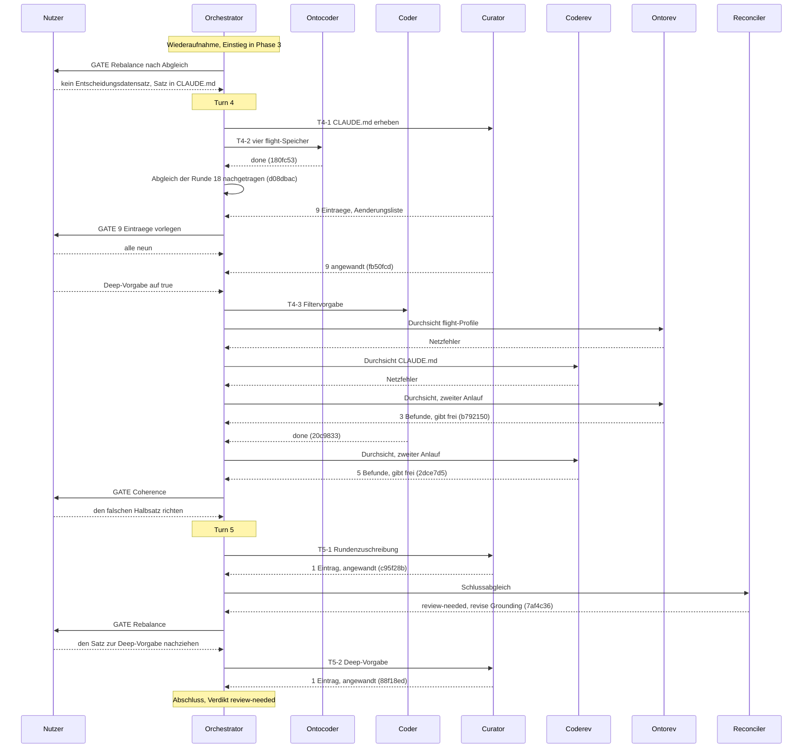

# Orchestrator Session — 260825-1659

**Directive:** Vorschau im Dateimanager um Zählungen erweitern (Circle-, Archiv- und shared-Ordner), Projektwurzel zeigt die Projektübersicht, dazu zwei Regressionen: Klick setzt den Fokus nicht, und der Zeitstempel beim Packen ist falsch.
**Mode:** (in Phase 0 aufzuloesen)
**Status:** Abgeschlossen mit Verdikt review-needed (ein Grundlagenbefund bewusst offen gelassen)

## Snapshot bei Sitzungsbeginn

| Groesse | Wert |
|---|---|
| git HEAD | 20eccd4 |
| Offene Defekte (shared/issues, `_o_`/`_p_`) | 57 |
| Offene Planschritte (shared/planning) | 5 |
| Circles: beschraenkt geschlossen (`_b_`) | 12 |
| Circles: kohaerent geschlossen (`_c_`) | 5 |
| Circles: zurueckgestellt (`_d_`) | 2 |
| Circles: vorgesehen (`_a_`) / aktiv (`_t_`) | 0 / 0 |
| Erkannte Domaene | code (160 Quelldateien, 12 Datendateien, gezaehlt ueber git ls-files) |
| Turn-Budget | 12 (aus ./fusion.json, Schluessel orchestrator.maxTurns) |
| Portfolio-Hinweis | nicht ausgegeben (keine vorgesehenen oder aktiven Circles) |

Die vorige Sitzung (260824-2120, Runde 17) hatte eine `agentstate.yaml` hinterlassen,
obwohl ihr Ereignisprotokoll `session_end` fuehrt und der Circle-Datensatz auf `_b_`
steht. Der Nutzer hat "neu starten" gewaehlt; die Datei ist geloescht.

## Phase 0 — Umfang

Modus `custom`. Der Nutzer hat vier Erweiterungen der Vorschau und zwei
Regressionen genannt (Wortlaut im Planauftrag). Er hat das Schaerfen
ausdruecklich uebersprungen und den Planer gebeten, die offenen Fragen selbst
und nach MECE zu beantworten.

Vorbefund des Orchestrators, dem Planer zur Pruefung mitgegeben:

- Die Zusammenfassungen kommen aus den Leseprofilen der Runde 16
  (`crates/krk-core/src/leseprofil/`), die ausgelieferte Profildatei ist
  `resources/default-readers.toml`.
- `zaehlung` zaehlt flach ueber eine Ebene. Der Zustandsmarker einer Runde liegt
  in `circles/<runde>/_X_circle.md`, ihre Defekte zwei Ebenen tiefer; beide
  Wuensche zu `circles/` sind damit nicht durch Pflege der Profildatei erfuellbar.
- Keiner der vier Bausteine liefert ein Datum.
- Neun Unterordner unter `shared/` mal zwei Zeilen kosten 18 Verzeichnis-
  leselaeufe gegen eine Grenze von 12 je Zusammenfassung.
- Die Projektwurzel ohne Zeilenfokus ist Verhalten der Vorschau, kein Profil.
- `operation/zippen.rs` baut seine Optionen mit `SimpleFileOptions::default()`;
  der Vorgabewert der Kiste `zip` ist ein fester Zeitstempel.

## Setup-Nachtrag

Die vier Stilprofile unter `fusion-workbench/stilwerk/` waren unveraendert die
ausgelieferten und gegenueber der Fassung 10.7.0 veraltet. Auf Wahl des Nutzers
ersetzt; die Pruefsummen stehen in `fusion-workbench/.asset-provenance`.
Die Vereinigungsregel fuer `orchestrator-events.jsonl` ist neu in
`.gitattributes` geschrieben.

## Coherence
<!-- RECONCILER-OWNED -->

**Verdict:** review-needed

**Edges:**
- Artifact↔Grounding: 12 von 12 behaupteten Erledigungen gegen den Baum bestätigt (zehn Planschritte, die Planberichtigung `4d6dc9a`, der Tableistenklick `d3da6e3`), `make check` selbst gefahren mit Ausstiegscode 0 über `e5ec81a`, jeder Codecommit der Sitzung in einem Durchsichtsbereich; **fünf Driftbefunde, alle auf der Grundlagenseite (Grounding at fault)**: das Abnahmekriterium in Schritt 3 des Plans und die `Resolved:`-Notiz von `circles/260825-0711-…/issues/260825-0838_*` behaupteten beide eine Zeile in der Abschlussliste, die `acc9671` gestrichen hat (beide jetzt nachgezogen), `CLAUDE.md` nennt für `zip` ein Merkmal statt zweier (`260825-1859_o_*`), `CLAUDE.md` sagt nichts über die fünf Neuerungen der Runde an der Vorschau (`260826-0149_o_*`), und der offene L7-Entscheid `circles/260823-2208-…/decisions/260824-1900_o_*` nennt fünf Leseläufe, wo vier gemessen sind (`260825-2107_o_*`); dazu 10 offene Befunde der zwei Reviewer, alle als gering eingestuft, keiner an einem ausgelieferten Byte. Drei reine Benennungsabweichungen zwischen Plan und Baum sind im Reconciliation Log ausgeschrieben.
- Artifact↔Directive: die Commits bewegen sich auf die Directive zu. Alle 26 dienen ihr: `fd361d7` und `d3da6e3` den Klick-Fokus, `c0050bf` und `e922c9e` den Zip-Zeitstempel, `f097e0e`, `3cadb45`, `66c779c`, `9322d5d` und `5595026` die Vorschau-Erweiterungen, der Rest Durchsicht, Behebung und Werkbank. Kein Commit steht quer dazu. Über die Directive hinaus geht allein die flight-Hälfte der zwölf Profile, und die hat der Nutzer selbst am 260825-2020 nach der Freigabe hinzugefügt.
- Grounding↔Directive: 42 aktive Entscheidungen (offen oder beantwortet) über alle Speicher, keine im Widerspruch zur Directive. Eine benannte Spannung, kein Konflikt: `circles/260823-2208-…/decisions/260824-1900_o_wie-wird-die-arbeit-dieser-runde-jemals-gegen-l7-gemessen-die-messstrecke-sieht-sie-nicht.md` wird durch diese Runde dringender, weil ein Ordnerwechsel jetzt eine Zusammenfassung auslöst, die es vorher nicht gab. Der Plan sagt das unter „Where this Circle stops" selbst und beansprucht nicht, die Frage zu beantworten.

**Rebalance recommendation:** revise Grounding

## Coherence
<!-- RECONCILER-OWNED -->

**Schlussabgleich der wiederaufgenommenen Sitzung, Bereich `e5ec81a..c95f28b` (sieben Commits).**
Der Abschnitt darüber gilt dem Bereich `20eccd4..e5ec81a` und bleibt unberührt; dieser hier ist
das Verdikt zum Sitzungsende und ersetzt ihn nicht, sondern setzt darauf auf.

**Verdict:** review-needed

**Edges:**
- Artifact↔Grounding: 5 behauptete Behebungen und 18 Fundstellen der sieben umgesetzten Entscheidungen einzeln gegen den Baum gelesen und alle bestätigt, `make check` über `c95f28b` selbst gefahren (Ausstiegscode 0, alle vier Kommandos), kein Planschritt der Runde von diesen Commits berührt; **zwei Driftbefunde, beide auf der Grundlagenseite (Grounding at fault)**: `CLAUDE.md` sagt nichts darüber, dass die tiefe Suche seit `20c9833` ab Werk steht und damit der erste Anschlag im Dateifenster den Unterbaum anlaufen lässt (`shared/issues/260826-1024_o_claude-md-sagt-nicht-dass-die-tiefe-suche-ab-werk-steht-….md`), und acht Defektdatensätze mit dem Marker `_o_` tragen eine leere `Resolved:`-Zeile und antworten damit jeder Suche als geschlossen (`shared/issues/260826-1024_o_acht-offene-defektdatensaetze-….md`). Dazu sieben offene Befunde der zwei Durchsichten dieses Bereichs, fünf Defekte und zwei Entscheidungsfragen, keiner an einem ausgelieferten Byte; zwei weitere sind mit diesem Abgleich geschlossen. Drei Marker, die seit dem 260820 beziehungsweise dem 260826-0831 nachstanden, sind nachgezogen.
- Artifact↔Directive: die Commits bewegen sich auf die Directive zu, und **drei Arbeiten in vier Commits gehen ausdrücklich über sie hinaus, ohne dass das Drift wäre**: die Datumszeilen der vier flight-Speicher (`180fc53`), der Kuratorenlauf über neun Aussagen in `CLAUDE.md` samt seiner Berichtigung (`fb50fcd`, `c95f28b`) und die Vorgabe des Dateifilters auf tiefe Suche (`20c9833`). Der Nutzer hat alle drei in dieser Sitzung selbst angewiesen; sie stehen außerhalb der Directive, weil er sie außerhalb ihrer gestellt hat, und nicht, weil die Arbeit abgekommen wäre. Die drei übrigen Commits (`d08dbac`, `b792150`, `2dce7d5`) sind Abgleich und Durchsicht an eben dieser Runde und dienen ihr unmittelbar. **Eine Beobachtung, kein Befund:** die Directive-Zeile dieser Sitzungsdatei ist damit enger als die Sitzung, die sie benennt, und `agentstate.yaml` führt `directive_revisions_this_session: 0` — die Erweiterung ist mündlich gekommen und nirgends als Revision festgehalten.
- Grounding↔Directive: 44 aktive Entscheidungen über alle Speicher (37 offen, 7 beantwortet), keine im Widerspruch zur Directive. Zwei benannte Spannungen, keine davon ein Konflikt: die zwei neuen Entscheidungsfragen zur tiefen Suche (`shared/decisions/260826-0859_o_*` und `shared/decisions/260826-0923_o_bekommt-der-tiefe-durchlauf-*`) sind aus der Arbeit **außerhalb** der Directive entstanden und können ihr deshalb nicht widersprechen; und `circles/260823-2208-…/decisions/260824-1900_o_wie-wird-die-arbeit-dieser-runde-jemals-gegen-l7-gemessen-…` wird durch `20c9833` ein zweites Mal dringender, weil jetzt auch ein Anschlag einen Verzeichnisdurchlauf auslöst. Dass die zehn Zeitzusagen aus C8 davon nicht berührt sind, ist vom `coderev` an drei unabhängigen Stellen belegt und in diesem Abgleich nachgelesen.

**Rebalance recommendation:** revise Grounding

Beide Driftbefunde sitzen auf der Grundlagenseite, keiner an der Arbeit: `CLAUDE.md` schweigt zu
einer Eigenschaft, die der Baum trägt, und acht Datensätze geben eine Auskunft, die ihr eigener
Marker widerlegt. Die Directive steht und ist erreicht; die Artefakte tragen, was sie behaupten.

## Wiederaufnahme am 260826-0646

Die Sitzung ist am 260826-0215 abgebrochen, nachdem der Abgleich der Runde 18 gelaufen war
und bevor das Rebalance-Gate stand. Der Nutzer hat fortsetzen gewählt; Historiendatei, Anker
und Startzeitpunkt sind übernommen, kein zweiter Verlauf angelegt. Die Warteschlange war
leer, die Deckungslesung meldete sieben Commits ohne Durchsicht, alle sieben reine
Werkbankcommits ohne eine Zeile Quelltext. Wiedereinstieg deshalb in Phase 3.

Fünfundzwanzig Einträge lagen im Arbeitsbaum und in keinem Commit: die sieben Entscheidungen
auf umgesetzt, ein geschlossener Defekt, zwei neue, der Plan, zwei Durchsichten und der
Abgleichsbericht. Sie sind als `d08dbac` nachgetragen, so wie sie gefahren wurden.

**Drei Arbeiten hat der Nutzer in dieser Sitzung selbst angewiesen**, und sie stehen außerhalb
der Directive der Runde 18. Die Datumszeilen der vier flight-Speicher, der Kuratorenlauf über
`CLAUDE.md` und die Vorgabe des Dateifilters auf tiefe Suche. Der Abgleich liest das nicht als
Drift, und die Directive-Zeile oben ist damit enger als die Sitzung, die sie benennt;
`agentstate.yaml` führt `directive_revisions_this_session: 0`, die Erweiterung ist mündlich
gekommen und nirgends als Revision festgehalten.

**Ein Fehler dieser Sitzung ist in ihr selbst entstanden und in ihr behoben worden.** Der erste
Kuratorenlauf hat die Zuschreibung „seit der Runde 14" wörtlich aus dem Datensatz übernommen,
den er umsetzen sollte, statt sie zu messen — genau die Klasse, die derselbe Commit an vier
Stellen behebt. Die Durchsicht hat es gefunden, `c95f28b` hat es berichtigt, und der
Schlussabgleich hat die Falschaussage auch in ihrer Quelle mit einem `Revised by:`-Vermerk
versehen, damit ein späterer Lauf sie nicht ein zweites Mal nach `CLAUDE.md` trägt.

## Budget

| Größe | Zahl |
|---|---|
| Turns | 5 |
| Aufgaben erledigt | 22 (17 vor dem Abbruch, 5 danach) |
| Aufgaben übersprungen oder zurückgestellt | 0 |
| Defektdatensätze abgelegt | 42 |
| Defektdatensätze geschlossen | 21 |
| Entscheidungen beantwortet (`_o_`→`_a_`) | 0 |
| Entscheidungen umgesetzt (`_a_`→`_i_`) | 7 |
| Commits | 35 (9 nach der Wiederaufnahme) |
| Agentenfehler | 2 (beide Netzfehler, kein Befund verloren) |
| Nutzergates | 8 |

Die vier Datensatzzahlen sind aus dem Dateibestand gerechnet und nicht mitgezählt: gegen den
Anker `20eccd4` und den Startzeitpunkt `260825-1659`, über beide Speicher.

## Die Turns nach der Wiederaufnahme

### Turn 4

Drei Aufgaben. Der `ontocoder` hat die vier flight-Speicher um ihre Datumszeile ergänzt und
zwei Kommentardefekte im selben Block geschlossen (`180fc53`). Der `curator` hat neun Aussagen
in `CLAUDE.md` erhoben, alle neun sind vom Nutzer freigegeben und angewandt worden (`fb50fcd`).
Der `coder` hat die Vorgabe des Dateifilters auf tiefe Suche gestellt (`20c9833`); elf Proben
waren dabei rot, keine hatte die Vorgabe geprüft, jede hatte sich auf sie verlassen.

Zwei Durchsichten sind an einem Netzfehler abgebrochen, bevor sie etwas geschrieben hatten,
und neu gefahren worden. Die `ontorev` hat die vier Zahlen des `ontocoder` nicht geglaubt,
sondern mit einer eigenen Messhilfe an zwei Prüfordnern und an einer wirklichen flight-Werkbank
nachgemessen (`b792150`). Die `coderev` hat jedes der neun Kuratorenkommandos selbst gefahren
und dabei die falsche Rundenzuschreibung gefunden (`2dce7d5`).

Beide Durchsichten geben den Stand ausdrücklich frei. Coherence: `review-needed`.

### Turn 5

Zwei Aufgaben, beide am `curator`. Die Berichtigung der Rundenzuschreibung (`c95f28b`), und
nach dem Schlussabgleich der Satz, der sagt, dass die tiefe Suche ab Werk steht (`88f18ed`).
Der zweite Lauf hat dabei eine stillschweigende Vorentscheidung vermieden, die der Auftrag
nicht genannt hatte: ob der Deep-Stand die Sitzung übersteht und ob er je Tab oder je Fenster
gilt, ist seit dem 260814 offen, und beide Halbsätze sind aus dem neuen Text draußen geblieben.

Dazwischen der Schlussabgleich (`7af4c36`): fünf behauptete Behebungen und achtzehn Fundstellen
einzeln gegen den Baum gelesen, `make check` selbst gefahren, sechs Datensätze geschlossen,
zwei neu abgelegt.

## Review coverage

**Range:** `20eccd4..HEAD` — 35 Commits, 8 Durchsichten, keine unbrauchbar.
**Not covered:** 11 Commits, und alle elf sind reine Werkbankcommits ohne eine Zeile Quelltext
oder Daten: `88f18ed`, `7af4c36`, `c95f28b`, `2dce7d5`, `e5ec81a`, `f7f156b`, `c10fc1a`,
`75ba8e2`, `c07fdd7`, `ecd7e4b`, `fb7db85`. Jeder Codecommit der Sitzung liegt in einem
Durchsichtsbereich.
**Carried out-of-scope files:** fünfzehn, sämtlich Werkbank-Markdown, aus
`shared/reviews/260826-0906-ontorev-die-datumszeilen-der-vier-flight-speicher.md`.

## Was offen bleibt

Der Plan `shared/planning/260825-1725_p_plan-vorschau-vertieft-und-zwei-fehler.md` steht
weiter auf `_p_`: gebaut, nicht abgenommen. Vier Nachweise vor einem Auslieferungslauf fehlen,
sie stehen im Abgleich `shared/history/260826-0157-reconciliation.md` unter „Vor dem
Auslieferungslauf"; der erste, der vierteilige Handgriff zum Klick-Fokus, wiegt schwerer als
die drei anderen zusammen.

Sieben Befunde dieser Sitzung stehen offen, keiner an einem ausgelieferten Byte. Der
gewichtigste ist `shared/issues/260826-1024_o_acht-offene-defektdatensaetze-tragen-eine-leere-resolved-zeile-und-antworten-jeder-suche-als-geschlossen.md`:
acht Datensätze geben jeder Suche eine Auskunft, die ihr eigener Rumpf nicht trägt. Der Nutzer
hat ihn bewusst liegen lassen.

**Status dieser Sitzung: `review-needed`.** Nicht `coherent`, und der Grund ist genau dieser
eine Befund. Ihn zu schließen war eine Möglichkeit am letzten Gate, und der Nutzer hat die
andere gewählt.

## Session Flow

Der Abschnitt zeigt die Turns nach der Wiederaufnahme. Die Turns 1 bis 3 stehen im
Ereignisprotokoll `fusion-workbench/orchestrator-events.jsonl`.

