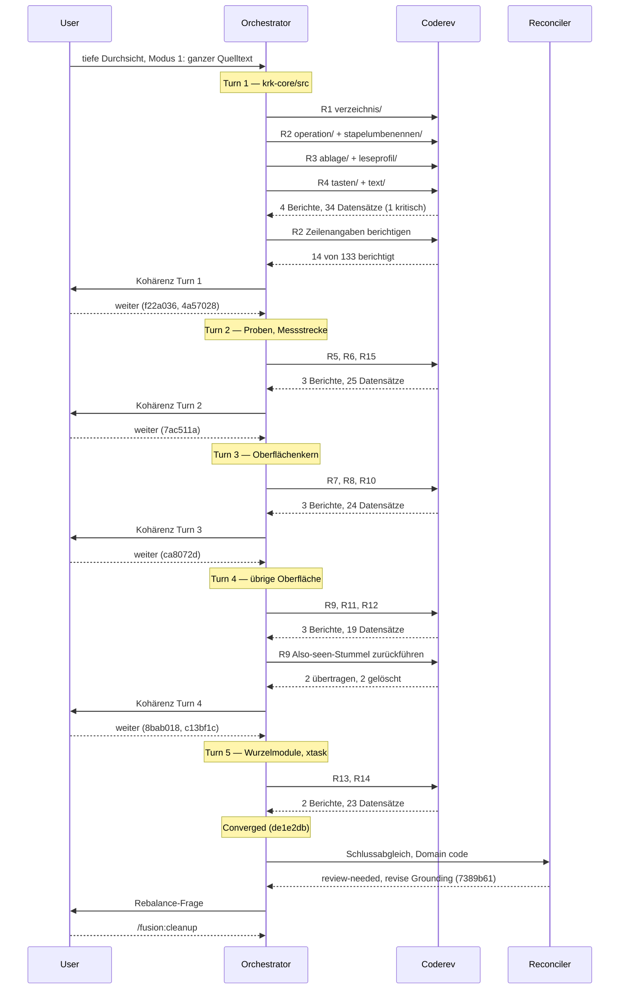

# Orchestratorsitzung — 260826-1114

**Directive:** Tiefe Durchsicht des ganzen Quelltexts: 155 Rust-Dateien, 126.707 Zeilen, gegen Maximen und Architektur statt gegen einen Commit-Bereich.
**Mode:** review (Vollbaum, Durchsicht ohne Ausführung)
**Status:** Complete

## Einrichtung

- Werkbank: `/Users/k1/Projects/productive/krk/fusion-workbench`
- Einrichtungsmarke: vorhanden, Fassung 10.7.0, unverändert übernommen
- Monitor: aus dem installierten Plugin neu kopiert
- Stilprofile: alle vier stimmen mit den ausgelieferten überein, nichts ersetzt
- `fusion.json`: vorhanden, Rundenbudget 12
- `.gitattributes`: Union-Zusammenführung für das Ereignisprotokoll gilt bereits
- Kennung dieses Auscheckens: Kai Stalmann <kai@stalmann.org>, Checkout 6c11b1f2
- Keine unterbrochene Sitzung (`agentstate.yaml` fehlt), keine Altlast-Haltemarke
- Nebenläufige Sitzung: keine

## Bestandsaufnahme

- Git-HEAD: `004ff72`
- Offene Defekte (`_o_`/`_p_`): 194, davon 78 im gemeinsamen Speicher
- Offene Spezifikationen und Pläne (`_o_`/`_p_`): 15
- Offene Entscheidungen (`_o_`): 37
- Circles: 12 beschränkt geschlossen, 5 kohärent geschlossen, 2 zurückgestellt — kein vorgesehener, kein aktiver
- Kein aktiver Circle, kein Zeiger `.active-circle`; Portfolio-Hinweis deshalb nicht ausgegeben
- Erkannte Domäne: `code` (161 Quelldateien gegen 12 Datendateien, gezählt über `git ls-files`)
- Rundenbudget: 12 (aus `fusion.json`, keine Meldungen des Konfigurationsladers)

## Coherence
<!-- RECONCILER-OWNED -->

**Verdict:** review-needed

**Edges:**
- Artifact↔Grounding: 15 Stichproben (je Bericht einer der neuen Datensätze) am Baum `de1e2db` geprüft, 15 tragen an der zitierten Zeile, was sie behaupten, 0 Abweichungen; 2 Altbefund-Meldungen geprüft (`260826-1442` Schaltflächentasten: trifft zu, Entscheidung `260813-0053` auf `_i_` gesetzt; `260826-1306` `cargo test`-Greifer: zitiert richtig, `CLAUDE.md:129` widerspricht dem Baum `messen.rs:1029`/`:1661`/`:2720`/`:2769`) — **flagged (Grounding at fault)**: eine Entscheidung stand seit dem 260813 offen, obwohl gebaut, und ein Satz in `CLAUDE.md` warnt vor einer Wechselwirkung, die der Baum seit `260810-1925_c_` nicht mehr trägt; 316 offene coderev-Defekte über beide Speicher, davon 122 aus dieser Sitzung.
- Artifact↔Directive: die Directive verlangt Lesen und Melden, keinen Code; der Quellbaum steht unverändert auf `004ff72` (`git diff --name-status 004ff72..HEAD` trifft keine Datei außerhalb von `fusion-workbench/`), und die sieben Commits `f22a036`, `4a57028`, `7ac511a`, `ca8072d`, `8bab018`, `c13bf1c`, `de1e2db` tragen 15 Berichte, 121 neu angelegte Defektdatensätze plus 1 umbenannter, 4 Entscheidungsdatensätze und 16 `Also seen`-Nachträge an bestehenden Datensätzen — commits move toward the stated Directive, vollständig.
- Grounding↔Directive: 4 neue offene Entscheidungen (`260826-1221` Papierkorb beim Überschreiben, `260826-1223` Zehnerblock, `260826-1225` Umlautschreibweise, `260826-1302` Probe unter root) sind aus der Durchsicht gefiltert und stehen zur Directive nicht im Widerspruch; 1 bestehende (`260813-0053` Schaltflächentasten) war gebaut und ist jetzt `_i_`; 0 potentially conflicting. Die Sitzungsdatei nennt im Kopf fünf neue Entscheidungen — der Dateibestand trägt vier mit Stempel `260826-12*` bis `260826-14*`.

**Rebalance recommendation:** revise Grounding — der Curator-Lauf über `CLAUDE.md` (`260826-1306` und die weiteren Datensätze dieser Sitzung mit `**Betroffen:** CLAUDE.md`), kein Eingriff in Directive oder Artefakt.

### Der `#[must_use]`-Durchgang, ein Durchgang über zwölf Datensätze

Neun Prüfer haben unabhängig gefiltert; im Bestand stehen zwölf Datensätze mit Stempel `260826-*` und `must-use` im Namen. Sie teilen den Baum nach Dateigruppen ohne Überschneidung derselben Funktion:

| Datensatz | Dateigruppe |
|---|---|
| `260826-1221_o_must-use-traegt-sieben-praedikate-des-verzeichnisbaums-…` | `krk-core/src/verzeichnis/` |
| `260826-1221_o_must-use-fehlt-an-fast-jeder-reinen-antwort-der-vorgangsmaschine-…` | `krk-core/src/operation/`, `stapelumbenennen/` |
| `260826-1223_o_tasten-und-text-tragen-kein-einziges-must-use-…` | `krk-core/src/tasten/`, `text/`, `zwischenablage.rs` |
| `260826-1225_o_geladen-traegt-kein-must-use-…` | `krk-core/src/ablage/` (`Geladen`, die fünf Ladewege) |
| `260826-1305_o_krk-bench-traegt-ein-einziges-must-use-…` | `krk-bench/src/` |
| `260826-1325_o_fokus-setzen-und-auftrag-starten-tragen-kein-must-use-…` | `krk-ui/src/appkit/anwendung.rs` |
| `260826-1327_o_must-use-fehlt-in-editor-rs-ganz-und-in-tabelle-rs-…` | `krk-ui/src/appkit/editor.rs`, `tabelle.rs` |
| `260826-1335_o_zwei-von-rund-zwanzig-reinen-antworten-der-blaetter-…` | `krk-ui/src/appkit/blaetter/` |
| `260826-1417_o_vier-fremdprogramm-huellen-geben-bool-oder-option-…` | die 27 übrigen Dateien unter `krk-ui/src/appkit/` |
| `260826-1417_o_sechs-der-zwoelf-kommandos-module-tragen-kein-must-use-…` | `krk-ui/src/kommandos/` |
| `260826-1421_o_must-use-fehlt-an-rund-25-reinen-antworten-der-sechs-modelle-…` | die sechs Modelle in `krk-ui/src/` (`editormodell.rs`, `fenstermodell.rs`, `tabs.rs`, `vorschaumodell.rs`, `leistenmodell.rs`, `zettelmodell.rs`) |
| `260826-1451_o_must-use-ist-in-xtask-ungleich-verteilt-…` | `xtask/src/` |

Berührungen ohne Doppelung, damit ein Coder sie nicht zweimal baut: `1327` und `1421` nennen gleichnamige Funktionen (`weitersuchen`, `rueckwaerts_suchen`, `treffer_ersetzen`, `alle_treffer_ersetzen`, `sichern`, `fremdaenderung_melden`), aber `1327` meint die Hülle in `appkit/editor.rs:2438-2686`, `1421` das Modell in `editormodell.rs:986-1213`; `1327` zitiert daneben die Typen `Ladeausgang` und `Sicherungsausgang` (`editormodell.rs:501-502`, `:551-552`), deren Funktionen `1421` führt. `1223` (`Belegung::sichern`, `belegung.rs:1379`) und `1225` (`belegung::laden`, `belegung.rs:1492`) treffen dieselbe Datei an zwei Funktionen. `1221`-operation zitiert `verzeichnis/filter.rs:154-157` und `umfang.rs:215-218` nur als Vorbild, `1223` die vier getragenen Prädikate des Verzeichnisbaums nur als Vergleich. `1305` reicht mit `krk_ui::pruefordner::Pruefordner` (`pruefordner.rs:47-49`) und `tests/gemeinsam/mod.rs:63-65` über `krk-bench` hinaus; kein anderer Datensatz führt diese zwei. Keine Funktion steht in zwei Datensätzen als Lücke.

### Bestandszahlen nach dem Abgleich

Über beide Speicher, `shared/` und jeden `circles/*/`, per `find … -maxdepth 1`:

- Offene Defekte (`_o_` + `_p_`): **315** (davon 199 im gemeinsamen Speicher); vor der Sitzung 194, plus 122 aus der Durchsicht, minus 1 (`260826-1442` Schaltflächentasten, geschlossen).
- Offene Entscheidungen (`_o_`): **40** (davon 19 im gemeinsamen Speicher); vor der Sitzung 37, plus 4 neue, minus 1 (`260813-0053` Schaltflächentasten, jetzt `_i_`).
- Dazu ein nicht eingecheckter Datensatz `shared/issues/260826-1445_o_the-playmakers-ranking-rewards-a-stale-grounding-…` (englisch, betrifft das Framework und nicht KRK), in den Zahlen oben enthalten.

## Budget

| Metric | Count |
|--------|-------|
| Turns | 5 |
| Tasks resolved | 15 von 15 |
| Tasks skipped/deferred | 0 |
| Issues created (by reviewers) | 122 |
| Issues resolved | 1 |
| Decisions answered (`_o_`→`_a_`) | 0 |
| Decisions implemented (`_a_`→`_i_`) | 1 (direkt `_o_`→`_i_`, Reconciler) |
| Commits | 8 (vor Cleanup) |
| Agent errors | 0 |
| Human gates hit | 6 (5 Kohärenz-Fragen, 1 Rebalance) |

Die vier Datensatz-Zeilen sind aus dem Dateibestand gegen den Anker `004ff72` berechnet, nicht mitgezählt: `filed issue 122`, `now_c issue 1`, `now_i decision 1`, `filed decision 4`.

## Per-Turn Log

### Turn 1 — `krk-core/src` (R1–R4, 52 Dateien, 21.863 Zeilen)
- 4 Berichte, 34 Datensätze (1 kritisch: `ueber_datentraeger` löscht die Quelle nach gescheitertem Kopieren; 2 hoch: Schwungleser an benannter Röhre, `Kommando::KENNUNGEN` ohne Vollständigkeitshalter)
- Commits: `f22a036`, `4a57028`. Kohärenz: ok. Ein Prüfer musste 14 Zeilenangaben berichtigen (Versatz um die Länge der Vorgängerdatei).

### Turn 2 — Proben und Messstrecke (R5, R6, R15, 22 Dateien, 24.610 Zeilen)
- 3 Berichte, 25 Datensätze (1 hoch: sechs Elternproben am Kindstarter bleiben grün, wenn der Kindname nicht trifft)
- Commit: `7ac511a`. Kohärenz: ok. Zwei Angaben der Aufgabenstellung von den Prüfern berichtigt.

### Turn 3 — Oberflächenkern (R7, R8, R10, 14 Dateien, 24.136 Zeilen)
- 3 Berichte, 24 Datensätze (1 hoch: `Blatt::zeigen` wirft den Blattgriff weg, `Esc` aus dem Stapelblatt trifft den Vorgang dahinter; zweimal unabhängig gefunden)
- Auffangzweig-Frage beantwortet: 52 + 28 Zweige, jedes der 79 Kommandos hat einen. Commit: `ca8072d`. Kohärenz: ok.

### Turn 4 — übrige Oberfläche (R9, R11, R12, 45 Dateien, 35.573 Zeilen)
- 3 Berichte, 19 Datensätze (0 hoch). Untergrenzen-Deckung 25/25. Zwei fehlgeleitete `Also seen`-Stummel vom Prüfer zurückgeführt.
- Commits: `8bab018`, `c13bf1c`. Kohärenz: ok.

### Turn 5 — Wurzelmodule und Auslieferungskette (R13, R14, 25 Dateien, 20.545 Zeilen)
- 2 Berichte, 23 Datensätze (0 hoch). `bereich_des_kommandos` 79/79, `schiebt_auffrischung_auf` 6/6.
- Commit: `de1e2db`. Kohärenz: ok. Arbeitsliste leer, konvergiert.

## Review coverage

**Range:** `004ff72..7389b61` — 8 commits
**Covered by:** 15 Berichte unter `shared/reviews/260826-1[2-4]*-coderev-*.md`, jeder mit `**Reviewed-range:**` über den Sitzungsbereich; `unusable=0`
**Not covered:** `de1e2db docs(workbench): die Vollbaum-Durchsicht ist vollstaendig, die letzten zwei Berichte und 23 Datensaetze` · `7389b61 docs(workbench): der Schlussabgleich der Vollbaum-Durchsicht` — beide tragen nur Werkbankdateien, keinen Code; der Quellbaum steht unverändert auf `004ff72`.
**Carried out-of-scope files:** none

## Remaining Work

Keine offene Aufgabe aus dieser Sitzung. Der Bestand nach der Sitzung: 315 offene Defekte (122 aus dieser Sitzung), 40 offene Entscheidungen. Die Befunde sind gefiltert, nicht behoben; das war die Directive.

Die vier, die zuerst dran sein sollten:
1. `shared/issues/260826-1221_*_ein-gescheitertes-kopieren-ueber-die-datentraegergrenze-loescht-die-quelle-trotzdem.md` — kritisch, Datenverlust.
2. `shared/issues/260826-1302_*_sechs-elternproben-am-gemeinsamen-kindstarter-bleiben-gruen-wenn-der-kindname-nicht-trifft.md` — die Deskriptor-Abnahme unterscheidet Ausfall nicht von Erfolg.
3. `shared/issues/260826-1325_*_esc-im-stapel-umbenennen-blatt-mit-fokus-in-der-vorschautabelle-…md` — braucht den Abnahmelauf im Vordergrund, Nutzerarbeit.
4. Die zwölf `must-use`-Datensätze als ein Durchgang (Liste im `## Coherence`-Abschnitt).

Eine fremde Datei liegt unversioniert im Baum: `shared/issues/260826-1445_o_the-playmakers-ranking-…md`, englisch, betrifft fusion, zitiert Circles, die es hier nicht gibt, von keinem Prüfer dieser Sitzung geschrieben. Nicht committet.

## Commits

| Hash | Message | Task |
|------|---------|------|
| `f22a036` | die erste Vollbaum-Durchsicht von krk-core, vier Berichte und 34 Datensätze | R1–R4 |
| `4a57028` | der Sitzungsbericht und das Ereignisprotokoll | — |
| `7ac511a` | die Vollbaum-Durchsicht der Proben und der Messstrecke | R5, R6, R15 |
| `ca8072d` | die Vollbaum-Durchsicht des Oberflächenkerns | R7, R8, R10 |
| `8bab018` | die Vollbaum-Durchsicht der übrigen Oberfläche | R9, R11, R12 |
| `c13bf1c` | zwei Also-seen-Zeilen zurückgeführt | R9 |
| `de1e2db` | die Vollbaum-Durchsicht ist vollständig | R13, R14 |
| `7389b61` | der Schlussabgleich | Phase 3 |

## Session Flow

