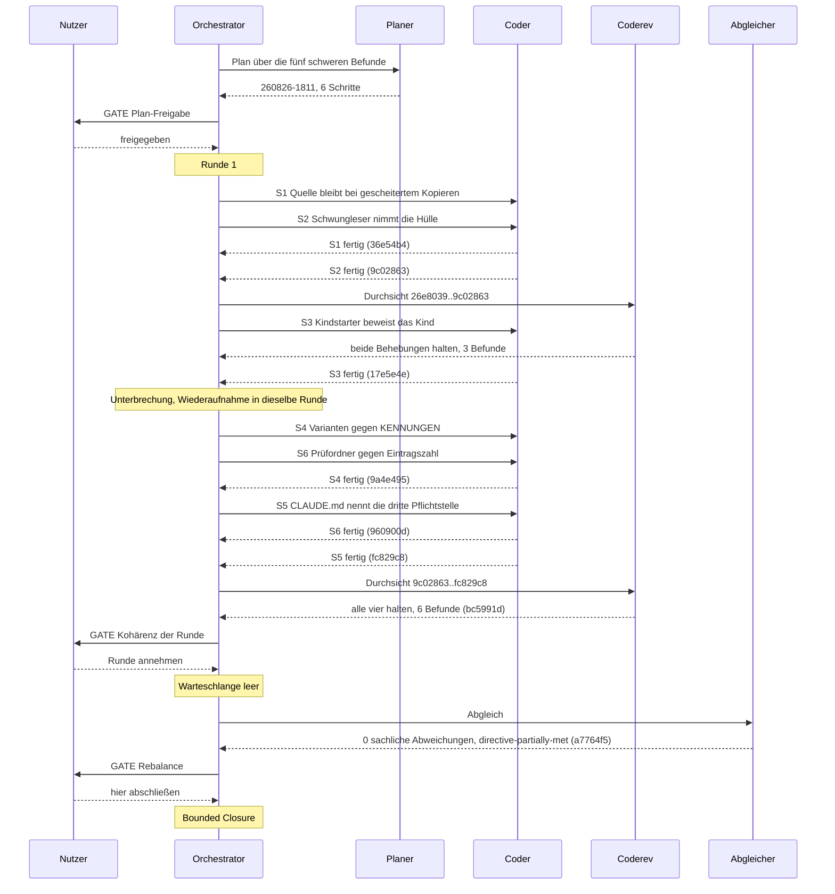

# Orchestratorsitzung — 260826-1807

**Directive:** Die Befunde der Vollbaum-Durchsicht beheben: zuerst den kritischen und die vier hohen, danach alle übrigen. Der Bestand ist nicht Buchführung um ihrer selbst willen.
**Mode:** custom → plan (Phase 0b, Planer über die fünf schweren Befunde)
**Status:** Bounded Closure: die erste Hälfte der Directive ist gebaut und belegt, die zweite bewusst zurückgestellt — Nutzerentscheidung am Rebalance-Gate 260826-2232

## Einrichtung

- Fortsetzung am selben Tag nach der Vollbaum-Durchsicht (`260826-1114-orchestrator-session.md`); Regeln und Kontext aus jener Sitzung gehalten, Kennung Kai Stalmann <kai@stalmann.org>, Checkout 6c11b1f2
- Git-HEAD: `26e8039`
- Bestand: 314 offene Defekte (121 aus der Durchsicht), 40 offene Entscheidungen, kein aktiver Circle
- Domäne: code (161 Quelldateien gegen 12 Datendateien, gezählt über git ls-files)
- Rundenbudget: 12 (fusion.json)

## Die fünf schweren Befunde

1. `shared/issues/260826-1221_o_ein-gescheitertes-kopieren-ueber-die-datentraegergrenze-loescht-die-quelle-trotzdem.md` (kritisch)
2. `shared/issues/260826-1221_o_der-schwungleser-oeffnet-mit-file-open-und-haengt-an-einer-benannten-roehre-fuer-immer.md`
3. `shared/issues/260826-1223_o_kennungen-ist-die-programmweite-kommandoliste-und-nichts-haelt-sie-vollstaendig.md`
4. `shared/issues/260826-1302_o_sechs-elternproben-am-gemeinsamen-kindstarter-bleiben-gruen-wenn-der-kindname-nicht-trifft.md`
5. `shared/issues/260826-1301_o_kein-pruefordner-ausser-dem-l6-unterordner-wird-gegen-seine-zugesagte-eintragszahl-gehalten.md`

<!-- RECONCILER-OWNED -->
## Wiederaufnahme 260826-2107

Die Sitzung ist nach dem Commit `17e5e4e` abgebrochen, während S4 und S6 parallel dispatcht waren. Beide hatten nichts hinterlassen, der Arbeitsbaum war sauber bis auf das Ereignisprotokoll. Wiedereintritt in dieselbe Runde 1 ohne zweites `turn_start`; Sitzungsbericht, Anker und Startstempel übernommen, kein zweiter Bericht angelegt.

## Budget

| Größe | Zahl |
|---|---|
| Runden (Turns) | 1 |
| Aufgaben erledigt | 6 |
| Aufgaben übersprungen oder zurückgestellt | 0 |
| Defekte abgelegt | 10 |
| Defekte geschlossen | 5 |
| Entscheidungen beantwortet (`_o_`→`_a_`) | 0 |
| Entscheidungen umgesetzt (`_a_`→`_i_`) | 0 |
| Entscheidungen abgelegt | 1 |
| Commits | 8 |
| Agentenfehler | 0 |
| Nutzergates | 3 |

Die Zahlen zu Defekten und Entscheidungen sind über den Dateibestand gegen den Anker `26e8039` und den Startstempel `260826-1807` erhoben, nicht mitgezählt.

## Rundenprotokoll

### Runde 1

- Aufgaben angefasst: S1 bis S6, alle sechs Schritte des Plans `260826-1811`
- Aufgaben erledigt: S1, S2, S3 (vor der Unterbrechung), S4, S5, S6 (nach der Wiederaufnahme)
- Commits: `36e54b4`, `9c02863`, `17e5e4e`, `9a4e495`, `960900d`, `fc829c8`, `bc5991d`
- Durchsichten: zwei, `26e8039..9c02863` und `9c02863..fc829c8`, zusammen 9 Befunde
- Schutzschalter: keiner ausgelöst
- Kohärenz: ok (Nutzer hat die Runde am Gate angenommen)

## Coherence

**Verdict:** directive-partially-met

**Edges:**
- Artefakt↔Grundlage: 6 von 6 Planschritten und 5 von 5 Defektdatensätzen einzeln gegen den Baum `bc5991d` gelesen und zutreffend, `make check` selbst gefahren (Ausstiegscode 0); 0 sachliche Abweichungen; 9 offene coderev-Befunde aus dieser Sitzung, keiner ein Rückschritt. Eine Formabweichung, kein Sachbefund und mit eigenem Datensatz: keine der fünf `Resolved:`-Zeilen nennt ihren Commit, obwohl das Schlusskriterium des Plans ihn verlangt (`shared/issues/260826-1933_*_die-zwei-resolved-zeilen-der-schritte-1-und-2-tragen-den-sitzungsstempel-statt-des-commits.md`, dort auf fünf von fünf erweitert; der Abgleich hat die Hashes als `Reconciled:`-Zeile nachgetragen und die Entscheidung über die Form offen gelassen). Belege je Schritt im Reconciliation Log von `shared/planning/260826-1811_*_plan-die-fuenf-schweren-befunde-der-vollbaum-durchsicht.md`.
- Artefakt↔Directive: die sieben Commits `36e54b4`, `9c02863`, `17e5e4e`, `9a4e495`, `960900d`, `fc829c8` und `bc5991d` gehen sämtlich auf die Directive zu, decken aber nur deren erste Hälfte. „Zuerst den kritischen und die vier hohen" ist erfüllt und geprüft; „danach alle übrigen" ist nicht angefangen: `shared/planning/` führt keinen zweiten Plan, und die 116 übrigen Befunde stehen unverändert auf `_o_`. Kein Commit geht an der Directive vorbei.
- Grundlage↔Directive: 48 aktive Entscheidungsdatensätze (41 `_o_`, 7 `_a_`) über alle Speicher; keiner widerspricht der Directive. Sieben davon sind am 260826 neben der Vollbaum-Durchsicht abgelegt worden und binden die zweite Hälfte, statt ihr zu widersprechen; darunter `shared/decisions/260826-1811_*_wie-wird-die-vollstaendigkeit-einer-alle-liste-neben-einer-aufzaehlung-gehalten.md`, das offen bleibt und den zweiten Plan bindet.

**Rebalance recommendation:** accept Bounded Closure

Begründung der Empfehlung: die Directive nennt zwei Hälften, die erste ist gebaut und einzeln gegen den Baum belegt, die zweite ist bewusst zurückgestellt und ihr Rückstand vollständig abgelegt — 116 offene Defektdatensätze und ein im Plan namentlich vorgesehener zweiter Plan. Nichts ist unerreichbar, nichts ist unbemerkt abgedriftet. Die Empfehlung ist beratend; das Gate legt dem Nutzer alle vier Möglichkeiten vor.

## Reviewdeckung

**Bereich:** `26e8039..HEAD` (`a7764f5`) — 8 Commits
**Gedeckt von:**
- `shared/reviews/260826-1933-coderev-behebungssitzung-runde-1-quelle-bleibt-stehen-und-schwungleser-ohne-warten.md`, `Reviewed-range: 26e8039..9c02863`, deckt 2
- `shared/reviews/260826-2158-coderev-behebungssitzung-runde-1-kindstarter-kennungen-pruefordner.md`, `Reviewed-range: 9c02863..fc829c8`, deckt 4

**Nicht gedeckt:**
- `bc5991d` docs(workbench): die Durchsicht der zweiten Hälfte von Runde 1, sechs Datensätze
- `a7764f5` chore(workbench): der Abgleich der Sitzung, sechs Schritte einzeln gegen den Baum

Beide tragen keine Zeile Code, und der erste ist die Durchsichtsdatei selbst, die ihren eigenen Commit nicht decken kann. **Jede Codeänderung der Sitzung ist gedeckt.** Die Lage ist als `shared/issues/260826-2205_*_der-deckungsmesser-meldet-am-sitzungs-head-ungedeckt-…` abgelegt; sie wiederholt sich in jeder Sitzung dieser Hausform.

**Aus dem Umfang gefallene Dateien:** keine (beide Durchsichten melden `Not-opened: none`).

## Verbleibende Arbeit

Die zweite Hälfte der Directive, „danach alle übrigen": 116 offene Defektdatensätze aus der Vollbaum-Durchsicht, dazu die 10 dieser Sitzung. Ein zweiter Plan ist im Plan `260826-1811` namentlich vorgesehen und nicht geschrieben. Er nimmt den Helfer `varianten_der_aufzaehlung` aus Schritt 4 für `Wirkungsbereich` und das Gate aus Schritt 3 für `zeit.rs::kindprobe_in_zone` wieder auf.

Zwei Befunde gehören vor den nächsten Abnahmelauf erledigt: `260826-2153` (die Abhilfe in `pruefordner_pruefen` nennt einen Aufruf ohne Seed, der abbricht) und `260826-2155` (Prüfordner B und der L6-Unterordner werden allein gegen ihren Steckbrief gehalten).

Offen und den zweiten Plan bindend: `shared/decisions/260826-1811_*_wie-wird-die-vollstaendigkeit-einer-alle-liste-neben-einer-aufzaehlung-gehalten.md`.

## Commits

| Hash | Was er tut | Aufgabe |
|---|---|---|
| `36e54b4` | ein gescheitertes Kopieren über die Datenträgergrenze lässt die Quelle stehen | S1 |
| `9c02863` | der Schwungleser öffnet über die Hülle und hängt an keiner benannten Röhre mehr | S2 |
| `17e5e4e` | der Kindstarter beweist, dass genau ein Kind gelaufen ist | S3 |
| `9a4e495` | jede Variante von `Kommando` steht nachweislich in `KENNUNGEN` | S4 |
| `960900d` | jeder Prüfordner wird gegen seine zugesagte Eintragszahl gehalten | S6 |
| `fc829c8` | `CLAUDE.md` nennt `KENNUNGEN` als dritte Pflichtstelle | S5 |
| `bc5991d` | die Durchsicht der zweiten Hälfte von Runde 1, sechs Datensätze | Durchsicht |
| `a7764f5` | der Abgleich der Sitzung, sechs Schritte einzeln gegen den Baum | Abgleich |

## Sitzungsverlauf

