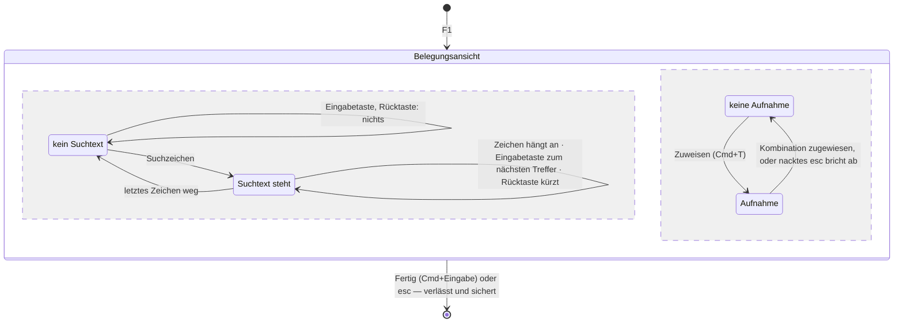
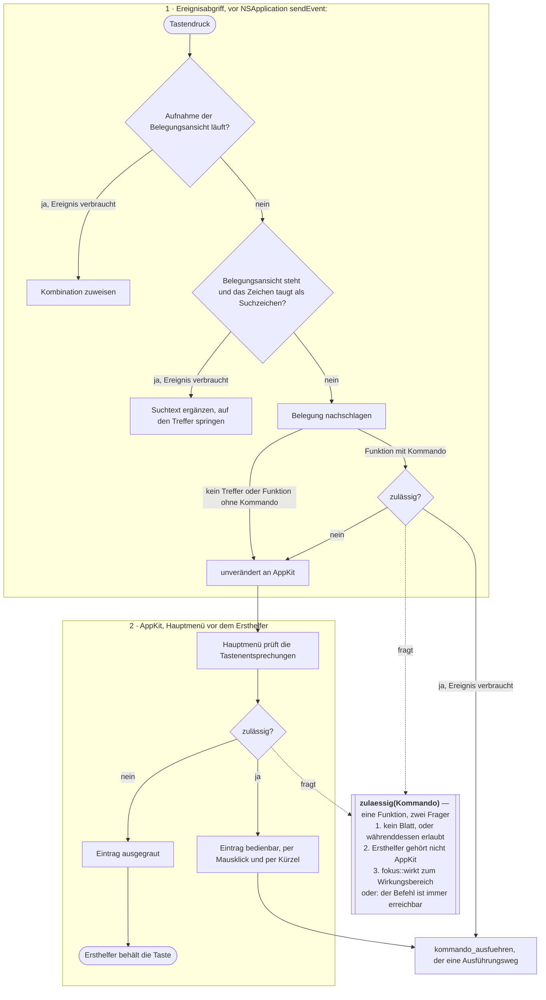
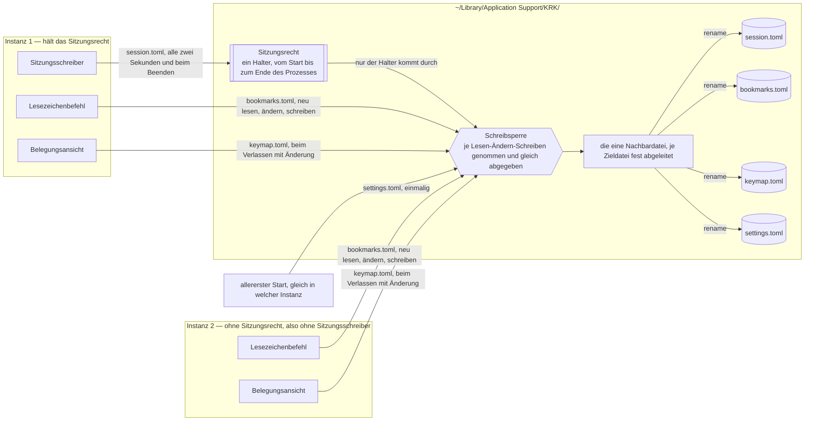

# Spec: Suche in der Belegungsansicht, vollständiges Menü, weitere Instanz

**Date:** 2026-08-13
**Status:** Überarbeitet nach der Diagrammprüfung
**Überarbeitet:** 260813-0130, nach dem Spruch `tangled` der Diagrammprüfung `circles/260813-0100-suche-in-der-belegung-vollstaendiges-menue-weitere-instanz/reviews/260813-0109-conceptrev-spec-suche-in-der-belegung-vollstaendiges-menue-weitere-instanz.md`. Was geändert wurde und warum, steht unten unter `## Nachzug vom 260813-0130`.
**Source:** Nutzerwortlaut vom 260813: „1. wenn F1 gedrückt wurde und die tastenbelegung angezeigt wird, sollte jede eingabe eines zeichens an einen suchstring appended werden und sofort nach dem ersten treffer gesucht werden, enter sucht das nächste vorkommen, weitere eingaben werden append und lösen eine weitere suche aus, backspace löscht und triggert die suche, esc beendet F1. 2. wir brauchen eine möglichkeit eine zweite instanz von krk zu starten - auch per taste. 3. alle tastenbefehle sollten auch über das Menu erreichbar sein."
**Grundlage erhoben:** 260813-0053, am Baum unter `crates/` und `resources/`
**Der Spec ist vor dem Circle entstanden** und liegt deshalb im gemeinsamen Speicher. Der Circle `circles/260813-0100-suche-in-der-belegung-vollstaendiges-menue-weitere-instanz/` ist seit dem 260813-0100 angelegt, ist aktiv und zitiert ihn von dort; der Spec behält seinen Ort und seinen Namen.

---

## Directive

Nach dieser Runde ist jeder Befehl von KRK auf drei Wegen erreichbar statt auf einem. Die Belegungsansicht wird durch Tippen durchsucht: jedes Zeichen hängt an einen Suchtext an, die Auswahl springt sofort auf den ersten Treffer, die Eingabetaste geht zum nächsten. Das Hauptmenü führt alle Funktionen der Belegung, gegliedert nach denselben neun Funktionsbereichen, die Belegungsansicht und Markdown-Ausgabe schon zeigen, jede mit ihrem Kürzel aus der Belegung und ausgegraut, wo sie gerade nicht wirkt. Und ein Tastenbefehl startet eine weitere Instanz von KRK, die sich Lesezeichen und Tastenbelegung mit der ersten teilt, ohne dass eine von beiden die Arbeit der anderen überschreibt.

Diese Runde setzt keine elfte Zeitzusage und fasst keine der zehn an.

---

## Wie diese Runde geschnitten ist, und warum so

**Empfehlung: eine Runde mit drei Fähigkeiten, mit einer benannten Naht.**

Die Abhängigkeiten liegen ungleich. Suche und Menü hängen beide an derselben Maschinerie: an `Belegung`, an `belegungsmodell::nach_bereichen`, an den Anzeigetexten `funktionstext` und `tastentext`, an der Übersetzung zwischen Kombination und AppKit-Kürzel. Sie stoßen zudem an genau einer Stelle aufeinander: solange die Belegungsansicht als Blatt steht, muss jeder Menüeintrag bis auf den Abbruch und zwei benannte Befehle ausgegraut sein, sonst nimmt das Menü der Ansicht ihre Schaltflächentasten weg. Zwei getrennte Runden fassten dieselben Dateien zweimal an und müssten diese eine Regel zweimal aufstellen.

Die weitere Instanz teilt mit beiden nichts. Sie arbeitet in `crates/krk-core/src/ablage/` und in einer neuen Hülle unter `appkit/`, und ihre Berührung mit dem Rest der Runde beträgt zwei Zeilen: ein Eintrag in `resources/default-keymap.toml` und eine Zeile in `bereich_des_kommandos`. Genau deshalb ist sie die Naht: wird die Runde lang, lässt sie sich als eigene Runde herauslösen, und der Preis dafür sind diese zwei Zeilen. Umgekehrt kostet es wenig, sie jetzt mitzunehmen, und der Nutzer hat eine Runde bestellt.

Die inhaltliche Klammer trägt alle drei: es geht um die Erreichbarkeit dessen, was KRK kann. Zwei Fähigkeiten machen die vorhandenen Befehle auffindbar, die dritte macht das Programm selbst ein zweites Mal verfügbar.

---

## Wie die Belegungsansicht nach dieser Runde bedient wird

Drei Betriebsarten und zwei Bedeutungen von `esc` stecken sonst in den Abnahmekriterien von C1, die man dafür einzeln gegeneinander lesen muss. Das Bild zeigt sie als das, was sie sind: ein Zustandsautomat aus zwei voneinander unabhängigen Teilen.

**Die zwei Teile stehen nebeneinander und nicht hintereinander, weil sie unabhängig sind.** Die Aufnahme lässt den Suchtext unberührt (C1.12): wer bei stehender Suche „Zuweisen" drückt und eine Kombination vergibt, findet danach denselben Suchtext vor. Ein Automat, der beides in eine Kette zwänge, brauchte je Betriebsart eine eigene Aufnahme.

**`esc` steht zweimal im Bild, und der Vorrang liegt beim Fänger.** Läuft eine Aufnahme, bricht ein nacktes `esc` sie ab und sonst nichts; läuft keine, verlässt `esc` die Ansicht und sichert. Einen Suchtext löscht es nie — dafür ist die Rücktaste da. Der Vorrang ist keine dritte Regel, sondern die Stellung des Fängers vor allem anderen aus C1.15.

## Wie ein Tastendruck nach dieser Runde läuft

**Die tragende Aussage sitzt zwischen Schicht 1 und Schicht 2: das Menü darf nicht rückgängig machen, was der Abgriff eben abgegeben hat.** Der Abgriff fragt, wem die Taste gehört. Wo die Antwort AppKit heißt, reicht er sie weiter — und das Hauptmenü prüft seine Tastenentsprechungen, bevor der Ersthelfer sie zu sehen bekommt. Ein Eintrag, der in diesem Augenblick bedienbar ist, nimmt dem Textfeld genau die Taste weg, die der Abgriff ihm gerade zugestanden hat. Deshalb trägt die Zulässigkeitsfrage die Frage des Fokusvorbehalts als **dritten** Bestandteil, und deshalb steht sie in einer Funktion statt zweimal geschrieben zu sein.

**Die beiden Rauten sind zwei Aufrufstellen einer Funktion und nicht zwei Fragen.** Die gestrichelten Kanten sagen es, und C2.16 lässt es prüfen. Bis zum 260813 behauptete das Bild diese Nämlichkeit in einer Beschriftung, während der Abgriff die Frage auf dem gefährlichsten Weg gar nicht erst stellte; die achte Feststellung der Ausgangslage führt das Gegenbeispiel.

**Die Ausgrauung ist der Weg zurück, und sie kostet die Maus mit.** Ein ausgegrauter Eintrag löst seine Tastenentsprechung nicht aus, und die Taste läuft weiter zum Ersthelfer. Er ist dann aber auch mit der Maus nicht bedienbar. Was davon ausgenommen bleibt, ist eine kurze benannte Liste; sie steht in C2.5, und ihre Herleitung unter „Abgeleitet und nicht gefragt".

## Wie die Ablage mit zwei Instanzen aussieht

**Zwei Sperren, zwei Namen, zwei Lebensdauern.** Bis zum 260813 hieß beides „die Sperre", und das ging nicht auf: hielte eine Instanz sie vom Start bis zum Ende, käme keine zweite je zum Schreiben; gäbe jeder Schreibvorgang sie wieder ab, taugte „wer sie hält" nicht mehr als Merkmal dafür, wem die Sitzung gehört.

- Die **Schreibsperre** ist kurzlebig. Sie wird für einen vollständigen Durchgang aus Lesen, Ändern und Schreiben genommen und gleich wieder abgegeben. Sie hält zwei Instanzen davon ab, dieselbe Nachbardatei zugleich zu beschreiben, und sie ist es, die die verlorene Änderung an den Lesezeichen verhindert — nicht das Schreiben allein steht unter ihr, sondern der ganze Durchgang.
- Das **Sitzungsrecht** ist langlebig. Genau eine Instanz bekommt es beim Start und hält es bis zu ihrem Ende. Es beantwortet die eine Frage, die aus den Eingaben eines Prozesses sonst nicht zu beantworten wäre: welche gespeicherte Sitzung zu welcher Instanz gehört.

**Dass Instanz 2 die Sitzung nicht schreibt, steht als Fehlen und nicht als Pfeil im Bild.** In ihrem Kasten gibt es keinen Sitzungsschreiber. Eine Kante kann nicht verneinen; bis zum 260813 stand hier eine, und im gerenderten Bild lief sie an der Sperre vorbei auf `session.toml` und sagte damit das Gegenteil dessen, was gemeint war.

**Die Nachbardatei steht im Bild, weil sie die eigentliche Gefahr ist.** `atomar::nachbarpfad` leitet ihren Namen fest aus dem Ziel ab und trägt bewusst keine Laufnummer. Ohne Sperre benutzen zwei Instanzen dieselbe, und das `rename` veröffentlicht ein Gemisch. Die Sperre schützt zuerst davor und erst danach vor der verlorenen Änderung.

## Ausgangslage, am 260813 am Baum erhoben

Acht Feststellungen tragen den Zuschnitt, und zwei von ihnen widersprechen dem, was man ohne sie annehmen würde. Die achte ist am 260813 nach der Diagrammprüfung dazugekommen und hat eine tragende Regel dieses Spec geändert.

**Das Menü führt heute zehn Befehle und nicht rund zwanzig.** Gezählt in `menue.rs:277-371`: zwei im Anwendungsmenü, sechs unter „Bearbeiten", zwei unter „Fenster", dazu zwei Trenner. Die Belegung führt 81 Funktionen mit 87 Kombinationen; 75 davon tragen ein `Kommando`, die übrigen sechs sind die Textbefehle, die über die Antwortkette laufen.

**Die Gliederung, die das Menü braucht, steht schon und hat zwei Abnehmer.** `belegungsmodell::nach_bereichen` ordnet jede Funktion einem von neun `Funktionsbereich`-Werten zu, und der Doc-Kommentar der Funktion sagt ausdrücklich zu, dass daneben keine zweite Gruppierung entsteht. Die Belegungsansicht bezieht ihre Abschnitte daraus, die Markdown-Ausgabe der Runde 3 ebenso. Das Menü wird der dritte Abnehmer und keine dritte Ordnung.

**Der Ereignisabgriff sieht jeden Tastendruck vor dem Menü, und er reicht weiter, was er nicht ausführt.** Ein lokaler Ereignisabgriff liegt vor `NSApplication::sendEvent:`; wo er `nil` liefert, sieht das Menü das Ereignis nie. Wo er weiterreicht, sieht es das Menü unverändert. **Daraus folgt die tragende Regel dieser Runde**: ein Menüeintrag mit Kürzel, dessen Befehl der Fokusvorbehalt eben abgewiesen hat, führte ihn trotzdem aus. Mit dem Fokus im Editor bewegte ein Auf-Pfeil dann die Dateiliste statt der Schreibmarke, und das erste Abnahmekriterium von C7 der Editor-Runde wäre gebrochen. Die Ausgrauung ist deshalb keine Höflichkeit, sondern die Bedingung dafür, dass die Runde nichts kaputtmacht.

**Der gefährlichste Fall ist nicht der Editor, sondern das Umbenennen direkt in der Liste.** Am 260813 am Baum verfolgt: dabei hält der Feldeditor eines `NSTextField` der Namensspalte den Ersthelferrang (`crates/krk-ui/src/appkit/tabelle.rs:2342`), und der Fokusvorbehalt reicht daraufhin jeden Tastendruck unverändert an AppKit weiter (`crates/krk-ui/src/appkit/ereignisse.rs:488`). Es steht dabei **kein** Blatt. Und `fokus()` antwortet für diesen Feldeditor trotzdem `Dateifenster`; der Doc-Kommentar sagt es ausdrücklich (`crates/krk-ui/src/appkit/anwendung.rs:3528`). Eine Zulässigkeitsregel aus nur zwei Bestandteilen — kein Blatt, und `fokus::wirkt` sagt ja — gibt damit jeden Befehl des Dateifensters frei, und `resources/default-keymap.toml` bindet darunter `up`, `down`, `return`, `space` und `tab` ohne Zusatztaste. Der Nutzer benennt um, drückt `up`, und die Auswahl in der Liste springt; das dritte Abnahmekriterium von C2.6 verlangt das Gegenteil. **Die Regel trägt deshalb seit dem Nachzug vom 260813 die Frage des Fokusvorbehalts als dritten Bestandteil.**

**Die Belegungsansicht sucht heute vermutlich schon, und zwar nicht so, wie der Nutzer es will.** Die Tabelle des Blattes setzt `allowsTypeSelect` nicht, und der Vorgabewert von `NSTableView` ist wahr. `inference:` Ein getipptes Zeichen läuft heute durch den Abgriff bis zur Senke, wird dort wegen des stehenden Blattes abgewiesen und geht unverändert an AppKit, wo die Tabelle ihre eingebaute Tippauswahl anbietet. Ob sie in einer ansichtsbasierten Tabelle ohne die zugehörige Delegiertenmethode tatsächlich Treffer liefert, ist am Baum nicht entscheidbar und am laufenden Bündel zu sehen. Für den Zuschnitt zählt die Folge und nicht der Zweifel: die neue Suche muss die eingebaute ausdrücklich abschalten, sonst hat die Ansicht zwei Suchen mit zwei Regeln.

**Zwei Tasten der Belegungsansicht stehen dem Wunsch im Weg.** Die Leertaste löst „Zuweisen" aus, die Eingabetaste „Fertig". Beide sind Zeichen im Sinne des Wunsches, und ein Funktionsname aus mehreren Wörtern lässt sich ohne Leertaste nicht suchen. Der Datensatz dazu steht unter `## Offene Nutzerentscheidungen`.

**Die Ablage kennt keine Sperre.** Kein `flock`, kein `O_EXCL`, keine Absprache; die Suche danach über `crates/` liefert am 260813 keinen Treffer. Zwei Instanzen schreiben `session.toml` im Zwei-Sekunden-Takt und beim Beenden, `bookmarks.toml` bei jedem Lesezeichenbefehl und `keymap.toml` beim Verlassen der Belegungsansicht mit Änderung. **Der schwerere Befund liegt eine Ebene tiefer**: `atomar::nachbarpfad` leitet den Namen der Nachbardatei fest ab und trägt bewusst keine Laufnummer. Zwei Instanzen benutzen deshalb dieselbe Nachbardatei, und das `rename` kann ein Gemisch veröffentlichen. Die Zusage des Moduls, ein Leser sehe entweder den alten Inhalt ganz oder den neuen ganz, gilt für einen Schreiber. Die Runde 6 hat gebaut, dass eine beschädigte Ablagedatei zur Seite gelegt statt überschrieben wird; sie fängt die Folge auf und verhindert die Ursache nicht.

**„Zweite Instanz" heißt zweiter Prozess und nicht zweites Fenster, und das ist abgeleitet und nicht geraten.** Der Nutzer schreibt „Instanz". Ein zweites Fenster in einem Prozess wäre daneben genau der Umbau, den der Spec der Runde 1 unter C7 ausdrücklich hinausgeschoben hat: „Zwei Fragen bleiben damit ungestellt, und das ist gewollt. Ob zwei Fenster sich eine Sitzung teilen und was ‚das aktive Dateifenster' aus C1 bei zwei Fenstern mit je zwei Dateifenstern bedeutet … die Prüfsitzung aus C8 wäre mehrdeutig: L4 endet bei der bedienbaren Oberfläche, und bei zwei Fenstern wäre unklar, welches sie beendet." Ein zweites Fenster im selben Prozess fasst damit C8 an. Ein zweiter Prozess tut es nicht: er misst seinen eigenen Kaltstart, und jede Instanz hält weiter genau ein Anwendungsfenster.

---

## Fähigkeiten und Abnahmekriterien

Jedes Kriterium trägt, wie es nachzuweisen ist. **(Probe)** heißt: eine Prüfung im Baum weist es nach, ein Agent kann es abnehmen. **(Bündel)** heißt: es ist am laufenden `KRK.app` im Vordergrund zu sehen, und das ist Nutzerarbeit.

### C1: Die Belegungsansicht wird durch Tippen durchsucht

1. Jedes getippte Zeichen hängt an einen Suchtext an, und die Auswahl springt sofort auf den ersten Treffer. Kein Befehl und kein Modus geht voraus. **(Probe** für Suchtext und Zielzeile, **Bündel** für die springende Auswahl**)**
2. Aufgenommen wird, was ein Suchtext tragen kann, und die Regel dafür steht schon: `krk_core::verzeichnis::sprungmarke::traegt_ein_dateiname` weist Steuerzeichen und den privaten Bereich U+F700 bis U+F8FF ab. Eine zweite Zeichenregel entsteht nicht. **(Probe)**
3. Gesucht wird über den Text, den die Ansicht zeigt, und über keinen zweiten: die Spalte „Funktion" aus `funktionstext` und die Spalte „Belegung" aus `tastentext`. Die Kennung wird nicht durchsucht, denn sie steht nicht auf dem Schirm, und ein Treffer, den der Nutzer nicht sehen kann, ist keiner. **(Probe)**
4. Gesucht wird als Teilzeichenfolge und nicht als Wortanfang: „datum" findet „Spalte Datum umschalten". Der Anfangsvergleich der Sprungmarke aus C2 der Runde 1 taugt hier nicht, weil die gesuchte Zeile fast nie mit dem gesuchten Wort beginnt. **(Probe)**
5. Ohne Rücksicht auf Groß- und Kleinschreibung, wie die Sprungmarke der Dateiliste. Die Suche im Editor unterscheidet sie zwar, aber ihr eigener Modulkopf hält fest, dass der Spec das offengelassen hat; ein Projektsatz ist es nicht. **(Probe)**
6. Bereichsüberschriften sind keine Treffer. Sie sind nicht auswählbar, und eine Zeile, auf die die Auswahl nicht springen kann, ist kein Treffer. **(Probe)**
7. Die Eingabetaste springt auf das nächste Vorkommen. Hinter dem letzten geht es beim ersten weiter, wie `krk_core::text::suche::naechster` es für den Editor tut. **(Probe)**
8. Die Rücktaste nimmt das letzte Zeichen weg und sucht erneut. Bei leerem Suchtext geschieht nichts. **(Probe)**
9. Bei null Treffern bleibt die Auswahl stehen, und die Meldungszeile sagt es. Wortlos nichts zu tun ist nach C1 der Runde 1 nicht zulässig. **(Probe** für den Satz, **Bündel** für die Zeile**)**
10. Der Suchtext ist sichtbar, samt der Zahl der Treffer und der Stelle darin. Er steht in der vorhandenen Meldungszeile des Blattes; eine zweite Meldefläche entsteht nicht. Eine Zuweisungs- oder Konfliktmeldung verdrängt ihn bis zum nächsten Suchzeichen. **(Probe** für den Satz, **Bündel** für die Zeile**)**
11. Die Ansicht führt **genau eine** Suche. Die eingebaute Tippauswahl der `NSTableView` ist ausdrücklich abgeschaltet. **(Probe** über den gesetzten Schalter**)**
12. Der Suchtext lebt so lange wie die Ansicht. Eine Pause setzt ihn nicht zurück; die Sekundenregel der Sprungmarke stammt aus C2 der Runde 1 und hat dort ihren Grund, hier hat sie keinen, weil die Rücktaste das Löschen trägt. **(Probe)**
13. `esc` behält seine zwei vorhandenen Bedeutungen und bekommt keine dritte: während der Aufnahme bricht es sie ab, sonst verlässt es die Ansicht und sichert. Es löscht keinen Suchtext. Der Vorrang zwischen beiden ist keine eigene Regel, sondern die Stellung des Fängers vor allem anderen aus Kriterium 15; der Zustandsautomat oben zeigt beide Bedeutungen. **(Probe** für die Fallunterscheidung, **Bündel** für das Verlassen**)**
14. Die Zeicheneingabe geht über den einen Ereignisabgriff, und zwar über den Fänger, der schon die Aufnahme trägt. Keine Ansicht bekommt eine eigene `keyDown:`-Behandlung. **(Probe** über die Zahl solcher Überschreibungen im Baum**)**
15. Während der Aufnahme nimmt die Suche nichts auf. Die Aufnahme steht vor ihr, so wie sie heute vor dem Fokusvorbehalt steht. **(Probe)**
16. Die drei Schaltflächen behalten je eine Taste, und keine davon ist ein Zeichen: „Zuweisen" auf Cmd+T, „Auslieferungszustand" unverändert auf Cmd+R, „Fertig" auf Cmd+Eingabe über den vorhandenen Wert `Taste::EingabeMitBefehl`. Die Erläuterungszeile des Blattes nennt alle drei und die Suche. **(Probe** für die Kürzel, **Bündel** für die Bedienung**)** — abhängig von der offenen Frage zu den Schaltflächentasten.
17. Bei leerem Suchtext bleiben Eingabetaste und Rücktaste wirkungslos. Das ist dieselbe Regel wie in Kriterium 8 und keine zweite: ohne Suchtext gibt es kein nächstes Vorkommen und kein letztes Zeichen. Wortlos geschieht das nicht — die Erläuterungszeile des Blattes steht die ganze Zeit und nennt die Tasten samt der Suche (Kriterium 16). **(Probe)**

### C2: Jeder Tastenbefehl steht im Menü

1. Alle Funktionen der Belegung stehen im Hauptmenü, jede genau einmal. Die Zahl steht nicht im Programmtext: das Menü entsteht aus der Belegung, und die Probe zählt seine Befehlseinträge gegen `Belegung::funktionen`. **(Probe)**
2. Das Menü entsteht aus derselben Gliederung wie Belegungsansicht und Markdown-Ausgabe, also aus `belegungsmodell::nach_bereichen`. Es wird ihr **dritter** Abnehmer; eine zweite Gruppierung entsteht nicht. **(Probe** über die Zahl der Aufrufer**)**
3. Je Funktionsbereich ein Obermenü, in der Reihenfolge von `Funktionsbereich::ALLE`, mit „Anwendung" vorn — macOS ersetzt dessen Titel ohnehin durch den Namen aus der `Info.plist` — und „Fenster" hinten. **(Probe** für Reihenfolge und Namen über `--menue-protokoll`, **Bündel** für das Bild**)**
4. Jeder Eintrag nimmt sein Kürzel aus der Belegung und keine Zeichenkette aus dem Programmtext. Trägt eine Funktion mehrere Kombinationen, zeigt der Eintrag die erste; trägt sie keine, zeigt er keine. Beide Regeln stehen schon in `menue::befehl` und bleiben unverändert. **(Probe)**
5. **Ein Eintrag, dessen Befehl hier gerade nicht zulässig ist, ist ausgegraut, und „zulässig" hat drei Bestandteile.** Zulässig ist ein Befehl, wenn **(1)** kein Blatt steht oder er währenddessen erlaubt ist, **und (2)** der Ersthelfer des Schlüsselfensters nicht AppKit gehört — dieselbe Frage, die der Fokusvorbehalt im Abgriff stellt —, **und (3)** `fokus::wirkt` zum Wirkungsbereich und zum gegenwärtigen Fokus ja sagt. Daneben steht eine benannte Liste von Befehlen, die ohne Rücksicht auf (1) und (2) erreichbar bleiben; sie trägt genau `beenden` und `fenster_schliessen`, und ihre Herleitung steht unter „Abgeleitet und nicht gefragt". **Ohne Bestandteil (2) gibt die Regel beim Umbenennen in der Liste jeden Befehl des Dateifensters frei**; die achte Feststellung der Ausgangslage führt das Gegenbeispiel am Baum. **(Probe** über die Tafel aus sieben Wirkungsbereichen mal fünf Fokuswerten mal Blatt ja/nein mal Ersthelfer ja/nein, also 140 Fälle, dazu die benannte Liste**)**
6. Fünf Fälle weisen nach, dass die Ausgrauung trägt und nicht bloß gut aussieht. Mit dem Fokus im Editor bewegt `up` die Schreibmarke und nicht die Dateiliste, und `return` setzt einen Zeilenumbruch und übergibt keine Datei an das Standardprogramm. Beim Umbenennen direkt in der Liste bewegen `up` und `down` die Schreibmarke im Feld, und die Auswahl der Liste bleibt stehen. In einem Textfeld löscht `delete` ein Zeichen und räumt nichts in den Papierkorb. Und `space` schreibt in beiden Textlagen, im Editor wie in der Umbenennung, ein Leerzeichen. **(Bündel)**
7. Solange ein Blatt steht, ist jeder Eintrag ausgegraut außer dem Abbruch und den zwei Befehlen der benannten Liste. Steht die Schreibmarke dabei in einem Textfeld des Blattes — die Pfadeingabe aus C2 der Runde 1 —, ist auch der Abbruch ausgegraut, und `esc` erreicht AppKit wie heute und schließt das Blatt über dessen eigene Abbruchschaltfläche. Die Belegungsansicht behält damit ihre eigenen Tasten, und jedes andere Blatt behält seine. **(Probe** für die Regel, **Bündel** für die Ansicht**)**
8. Die sechs Textbefehle bleiben, wie sie sind: ohne Kommando, über die Antwortkette, mit der Ausgrauung durch AppKit. Sie bekommen keine Zulässigkeitsregel von KRK. **(Probe)**
9. Der Eintrag „Tastenbelegung als Markdown sichern" der Runde 3 bleibt ohne Kennung und ohne Kürzel und steht im Anwendungsmenü über dem Beenden, durch einen Trenner davon geschieden. **(Probe)**
10. Es gibt weiterhin **genau eine** Stelle, die ein `NSMenuItem` anlegt, und **genau eine** Übersetzung zwischen Kombination und AppKit-Paar. Beide stehen schon in `menue.rs`. **(Probe** über die Zahl der Aufrufer**)**
11. Das Menü wird an genau zwei Anlässen gebaut, beim Start und nach einer Änderung der Belegung. Beide Stellen stehen heute. Ein Kürzel, das der Nutzer in der Belegungsansicht ändert, steht danach im Menü. **(Probe** für die Zahl der Bauaufrufe, **Bündel** für das Bild**)**
12. `--menue-protokoll` liest das gebaute Menü weiter aus und nennt jeden Eintrag mit Beschriftung, Kürzel, Zusatztasten und Selektor. Die Abnahme von C3 der Runde 1, dass keine Kombination außerhalb der Belegung etwas auslöst, läuft unverändert über dieses Auslesen und nicht über eine Aufzählung der heute bekannten Systemzusätze. **(Probe)**
13. Nach dieser Runde zeigt `--menue-protokoll` weder „Emoji & Symbols" noch „Start Dictation…" noch das Untermenü „AutoFill", und zu keinem neuen Eintrag stellt AppKit eine Zweitform mit eigener Kombination. **(Probe** über das Protokoll**)**
14. Ein Menüeintrag führt seinen Befehl über dieselbe Stelle aus wie ein Tastendruck, nämlich `kommando_ausfuehren`. Ein zweiter Ausführungsweg entsteht nicht. **(Probe** über die Zahl der Aufrufer**)**
15. Ein Befehl läuft auf einen Tastendruck hin **höchstens einmal**. Welche Regel das trägt, entscheidet die offene Frage zum Schluckverhalten des Abgriffs; ohne eine solche Regel liefe ein zulässiger, aber wirkungsloser Befehl über den Umweg Menü ein zweites Mal. **(Probe)**
16. **Die Zulässigkeitsfrage steht an genau einer Stelle, und beide Frager rufen sie.** Sie ist eine reine Funktion über Kommando, Blattstand, Ersthelferbefund und Fokus und damit ohne AppKit prüfbar; der Abgriff und die Ausgrauung des Menüs können keine verschiedenen Antworten geben. Eine zweite Fassung der Regel entsteht nicht. **(Probe** über die Zahl der Aufrufer**)**
17. **Kein Menüeintrag nimmt eine Taste an sich, die der Abgriff eben an AppKit abgegeben hat.** Das ist die Umkehrung von Kriterium 5, und sie wird eigens geprüft, weil die Runde daran hängt: für jeden Fall der Tafel, in dem der Abgriff weiterreicht, ist der zugehörige Eintrag ausgegraut oder steht auf der benannten Liste. **(Probe)**
18. **Die Einträge, die das Menü heute trägt, behalten jede Wirkung, die sie heute haben.** Cmd+Q beendet KRK auch während einer Umbenennung in der Liste und während ein Blatt steht; Shift+Cmd+W schließt das Fenster in denselben Lagen; die sechs Textbefehle laufen unverändert über die Antwortkette. Das ist die Prüfung der benannten Liste aus Kriterium 5 und zugleich ihre Herleitung. **(Probe** für die Liste, **Bündel** für die beiden Kürzel**)**
19. **Ein ausgegrauter Eintrag ist auch mit der Maus nicht bedienbar, und das ist der benannte Preis der einen Regel.** Während einer Umbenennung in der Liste und während ein Blatt steht, ist das Menü grau bis auf die benannte Liste und die sechs Textbefehle. Ein zweiter Mechanismus, der das Kürzel abgäbe und den Eintrag klickbar ließe, entsteht nicht. **(Bündel)**

### C3: Eine weitere Instanz von KRK

1. Ein Tastenbefehl startet eine weitere, eigenständige Instanz von KRK, und sie kommt mit eigenem Fenster nach vorn. **(Bündel)**
2. Der Befehl heißt „Weitere Instanz starten" und liegt ab Werk auf `opt+cmd+n`. Die Kombination ist heute frei. `cmd+n` bleibt bei „Fenster einblenden": dessen Aufgabe, das geschlossene Fenster zurückzuholen, gibt es unverändert weiter, und diese Runde führt keine zweiten Fenster ein, auf die sich die Umbenennungszusage aus C7 der Runde 1 bezieht. **(Probe)**
3. Der Befehl wirkt aus jedem Fokus und läuft über die vorhandene Kommando-Maschinerie und über keine zweite: eine Zeile in `resources/default-keymap.toml`, ein Wert in `Kommando`, je eine Zeile in `Kommando::wirkungsbereich` und in `bereich_des_kommandos`. **(Probe)**
4. Er ist über das Menü erreichbar wie jeder andere Befehl, nach den Regeln aus C2. **(Probe)**
5. Gestartet wird das Bündel, in dem die laufende Instanz steckt, und kein Pfad aus dem Programmtext. **(Probe** für die Herkunft des Pfades, **Bündel** für den Start**)**
6. Läuft KRK nicht aus einem Bündel, wie beim Entwicklungslauf über `cargo run`, meldet der Befehl das und startet nichts. **(Probe** für den Satz, **Bündel** für die Zeile**)**
7. **Jeder Durchgang aus Lesen, Ändern und Schreiben an den vier Dateien unter `~/Library/Application Support/KRK/` steht unter der Schreibsperre**, vom Lesen bis zum `rename`, und `atomar::schreiben` bleibt der eine Schreibweg. Die Sperre gilt dem Ablageordner und nicht der einzelnen Datei. Es gibt keinen Schreibweg an ihr vorbei. Zwei Instanzen beschreiben damit nie dieselbe Nachbardatei zugleich, und ein Gemisch kann nicht veröffentlicht werden. **(Probe** mit zwei Prozessen**)**
8. Ein Lesezeichenbefehl liest die Lesezeichen **unter derselben Sperre** frisch von der Platte und wendet seine eine Änderung darauf an statt auf den Stand vom Programmstart. Läge das Lesen außerhalb der Sperre, wäre die verlorene Änderung nur seltener und nicht fort. Ein Lesezeichen, das die andere Instanz angelegt hat, überlebt damit. **(Probe** mit zwei Prozessen**)**
9. **Die Sitzung schreibt genau die Instanz, die beim Start das Sitzungsrecht bekommen hat.** Das Sitzungsrecht ist nicht die Schreibsperre: es wird beim Start genommen und bis zum Ende des Prozesses gehalten, während die Schreibsperre je Durchgang genommen und gleich wieder abgegeben wird. Zwei Namen, zwei Lebensdauern, zwei Zwecke — ein Wort für beide beschriebe keinen baubaren Entwurf. Jede weitere Instanz startet aus derselben gespeicherten Sitzung und schreibt sie nicht zurück. **(Probe)**
10. Eine Instanz, die die Sitzung nicht schreibt, sagt es beim Start einmal in der Statuszeile. **(Probe** für den Satz, **Bündel** für die Zeile**)**
11. Die Zuständigkeit für die Sitzung wandert innerhalb eines Prozesslebens nicht. Wer beim Start kein Sitzungsrecht bekam, schreibt bis zu seinem Ende keine Sitzung, auch wenn die erste Instanz vorher endet. Eine wandernde Zuständigkeit wäre eine zweite Regel und ein Wettlauf mehr. Eine Instanz, die **nach** dem Ende der ersten startet, bekommt das Recht dagegen wie jede erste; das ist keine Wanderung, sondern die gewöhnliche Vergabe beim Start. **(Probe)**
12. KRK hält weiter genau **ein** Anwendungsfenster je Prozess. C7 der Runde 1 bleibt unangetastet, und die beiden dort ausdrücklich ungestellten Fragen bleiben ungestellt. **(Probe)**
13. **Endet ein Prozess, gibt er beides frei, auch wenn er abstürzt.** Nach einem Absturz von Instanz 1 bekommt die nächste startende Instanz das Sitzungsrecht, und eine Schreibsperre, die beim Absturz gehalten wurde, hält keinen zweiten Prozess auf. Ein Mechanismus, der eine liegengebliebene Sperre hinterlässt, die niemand aufhebt, erfüllt dieses Kriterium nicht; er ist damit nicht verboten, aber er braucht dann eine Aufräumregel, und die gehört in den Plan. **(Probe)**
14. **Es entstehen genau zwei Absprachen über der Ablage und keine dritte:** die Schreibsperre und das Sitzungsrecht. **(Probe** über die Zahl der Stellen**)**

### C4: Was der Bau erzwingt

1. `Kommando` wächst von 75 auf 76 Kennungen. `Wirkungsbereich`, `Bereich`, `Fokus` und `Funktionsbereich` wachsen **nicht**, und das ist ein Ergebnis und kein Zufall: diese Runde legt keinen neuen Bereich an, kein neues Fokusziel, keine neue Art von Wirkungsbereich und keinen zehnten Funktionsbereich. **(Probe)**
2. `resources/default-keymap.toml` führt danach 82 Funktionen mit zusammen 88 Kombinationen, und die Zählzeile im Kopf der Datei nennt beide Zahlen. **(Probe)**
3. `opt+cmd+n` ist vorher unbelegt; keine bestehende Kombination wechselt ihren Besitzer. **(Probe)**
4. Jede neue Datei unter `crates/krk-ui/src/appkit/` trägt im Modulkopf den Abschnitt `# Ab welchem macOS die angesprochenen Klassen stehen`, und jede dort genannte Zahl ist am SDK nachgelesen. **(Probe** über die Deckung, Augenschein für die Richtigkeit**)**
5. `#![deny(unsafe_code)]` bleibt an allen drei Kistenwurzeln. Kommt für eine der beiden Sperren eine dritte Datei mit `#![allow(unsafe_code)]` hinzu, nennt der Plan sie und ihren Grund in einem eigenen Schritt; sie fällt nicht im Vorbeigehen an. **(Probe** über die Liste der Ausnahmen**)**
6. Es gibt weiterhin genau **drei** Prüfordner-Fassungen. **(Probe)**
7. Jede neu eingebundene fremde Kiste trägt in der Wurzel-`Cargo.toml` den Satz, warum sie eingebunden ist, und `Cargo.lock` führt danach kein `cc` und außer `windows-sys` kein `-sys`-Paket. **(Probe)**
8. Ein Rückgabewert, dessen stilles Fallenlassen unbemerkt bliebe, trägt `#[must_use]`. Das betrifft in dieser Runde mindestens die Griffe **beider** Sperren, den der Schreibsperre und den des Sitzungsrechts: ein fallengelassener Griff der Schreibsperre gäbe sie sofort wieder ab und ließe den Durchgang ungeschützt. **(Probe)**

---

## Verhältnis zu den zehn Zeitzusagen aus C8 der Runde 1

**Diese Runde setzt keine elfte Zusage und ändert keine der zehn Zahlen.** Drei liegen auf ihrem Weg, und jede gehört aus einem eigenen Grund in den nächsten Abnahmelauf.

**L4 ist die einzige, bei der diese Runde messbar Arbeit hinzufügt.** Der Kaltstart bis zur bedienbaren Oberfläche hat 1000 ms, und das Menü entsteht auf diesem Weg, vor `applicationDidFinishLaunching`. Statt zehn Einträgen entstehen künftig zweiundachtzig, jeder mit einem Nachschlag in der Belegung und einer Übersetzung seiner Kombination. Dazu kommt die Sperre, ein Systemaufruf beim Öffnen der Ablage. Beides ist klein, und keines ist gemessen; die Runde behauptet deshalb nicht, dass L4 hält, sondern benennt L4 als Gegenstand des nächsten Laufs.

**L1 und L9 liegen nicht auf dem Weg, und das ist herleitbar statt gemessen.** Beide zählen Tastendrücke, die die Auswahl im Dateifenster sichtbar bewegen, also solche, die der Abgriff ausführt. Wo er ausführt, liefert er `nil`, und ein verworfenes Ereignis erreicht `NSApplication::sendEvent:` nie; das Menü kann an einem solchen Tastendruck keine Arbeit verrichten. Sie stehen trotzdem auf der Liste des nächsten Laufs, weil das Menü nach dieser Runde achtmal so viele Einträge trägt und eine Herleitung keine Messung ist.

Der vierte Gegenstand aus dem Spec der Runde 2, die Geschwindigkeit der Syntaxhervorhebung, ist von dieser Runde nicht berührt und bleibt offen.

---

## Randbedingungen

- **Der Ereignisabgriff bleibt der eine Eintrittspunkt für Tastendrücke.** Keine Ansicht bekommt eine eigene `keyDown:`-Behandlung, auch die Belegungsansicht nicht. Die Suche hängt sich an den vorhandenen Fänger.
- **Die Belegung bleibt die alleinige Quelle jeder Kombination.** Kein Kürzel steht als Zeichenkette im Programmtext, und die Konflikterkennung aus C3 sieht jede Kombination, die in KRK etwas auslöst. Die Schaltflächentasten der Blätter sind davon seit dem Nutzerentscheid vom 260805-0713 ausgenommen, weil ein stehendes Blatt jeden Befehl anhält und die beiden Zusteller einander nie begegnen.
- **`Kommando::wirkungsbereich` und `bereich_des_kommandos` bleiben vollständige Fallunterscheidungen ohne Auffangzweig.** Das neue Kommando braucht in beiden eine Zeile, sonst übersetzt der Baum nicht.
- **Die Aufrufrichtung bleibt von oben nach unten.** Der Kern gibt Werte zurück und schreibt auf keinen Kanal; die Meldung über die nicht gesicherte Sitzung entsteht in `krk-ui`.
- **Kein `make bundle` und kein `cargo xtask bundle` während der Runde.** Unter `target/KRK.app` liegt ein beglaubigtes Bündel, das der Nutzer braucht; der offene Defekt `shared/issues/260813-0026_*_bundle-und-release-schreiben-an-denselben-ort-…` beschreibt die Lage.
- **`blatt_steht` hat einen blinden Fleck, und diese Runde ändert ihn nicht.** Der Freigabedialog der Runde 6 ist kein Blatt; `NSWindow::attachedSheet` liefert währenddessen nichts, und der offene Datensatz `circles/260812-1000-teilen-ordnersprung-ablage-sichern-vorschau-rendern/issues/260812-1529_*_die-blattregel-sieht-den-freigabedialog-nicht.md` führt die Frage. Bestandteil (1) der Zulässigkeitsregel erbt den Fleck: solange der Dialog steht, antwortet er wie ohne ihn. Schlimmer wird es dadurch nicht — der Abgriff führt dieselben Befehle heute schon aus —, und behoben wird es hier nicht.
- **Kein Verlust gegenüber heute.** Diese Runde fügt Wege hinzu und nimmt keinen weg. Wo eine neue Regel einen heute vorhandenen Weg abschnitte, steht der Befehl auf der benannten Liste aus C2.5, oder der Spec sagt, warum der Weg keine Wirkung hatte.
- **Der Abnahmelauf am Bündel ist Nutzerarbeit.** Jedes mit **(Bündel)** gekennzeichnete Kriterium bleibt bis dahin unabgenommen, und die Runde schließt darum voraussichtlich als beschränkter Abschluss wie ihre sechs Vorgängerinnen.

---

## Nicht Gegenstand dieser Runde

- **Ein zweites Fenster innerhalb eines Prozesses.** Der Spec der Runde 1 hat den Umbau unter C7 ausdrücklich hinausgeschoben, und er fasst C8 an. Eine weitere Instanz ist ein weiterer Prozess.
- **Zwei Instanzen, die sich ihren Zustand gegenseitig anzeigen.** Ein in Instanz 1 angelegtes Lesezeichen überlebt nach C3.8, erscheint in Instanz 2 aber erst nach deren Neustart. Eine Beobachtung des Ablageordners über die vorhandene Dateisystemwache wäre der nächste Schritt und ist keiner dieser Runde.
- **Eine Suche, die die Belegungsansicht filtert.** Der Nutzer beschreibt ein Springen und kein Ausblenden; die Liste bleibt vollständig.
- **Rückwärtssuche, Groß-/Kleinschreibungsschalter, reguläre Ausdrücke** in der Belegungsansicht. Jeder Schalter wäre ein Bedienelement und ein Abnahmekriterium mehr, und die Suche im Editor kennt aus demselben Grund keinen.
- **Ein Kontextmenü für die neuen Befehle.** Das Kontextmenü der Runde 6 trägt weiterhin genau einen Eintrag.
- **Zwei zugleich geänderte Tastenbelegungen zusammenzuführen.** `keymap.toml` wird als Ganzes aus der Arbeitskopie geschrieben. Die Schreibsperre verhindert das Gemisch in der Datei, nicht die überschriebene Änderung der anderen Instanz. Wer in beiden Instanzen zugleich die Belegung ändert, behält die zuletzt geschriebene.
- **Ein Menüeintrag, der sein Kürzel abgibt und trotzdem klickbar bleibt.** Siehe C2.19 und die Herleitung unten.
- **Eine Änderung an den zehn Zeitzusagen.**

---

## Offen für den Planner

- **Wie ein Menüeintrag sein Kommando trägt.** Ein Selektor je Befehl wären sechsundsiebzig Selektoren; ein gemeinsamer Selektor braucht einen Träger am `NSMenuItem`. Der Planner entscheidet, welcher.
- **Woran die Ausgrauung hängt.** `validateMenuItem:` am Anwendungsdelegierten ist der naheliegende Ort, weil dort schon `blatt_steht` und `fokus` stehen. Die Wahl gehört dem Plan.
- **Welche Mechanismen die beiden Sperren tragen.** Zu wählen sind zwei Dinge und nicht eines: ein kurzlebiger wechselseitiger Ausschluss für die Schreibsperre und ein über das ganze Prozessleben gehaltenes Merkmal für das Sitzungsrecht. Beide berühren dieselbe Projektregel: ein `flock` bräuchte einen Fremdaufruf und damit eine Datei mit `#![allow(unsafe_code)]`, wovon es im Kern heute genau eine gibt; ein Sperrverzeichnis über `create_new` käme ohne aus, hinterließe aber nach einem Absturz eine Sperre, die niemand aufhebt, und C3.13 verlangt dafür eine Aufräumregel. Der Plan wählt für beide und nennt den Preis.
- **Wo die Zulässigkeitsfunktion wohnt und wie der Abgriff sie erreicht.** Sie ist eine reine Funktion und gehört damit neben `fokus::wirkt` nach `kommandos::`. Der Fokusvorbehalt steht heute **vor** dem Nachschlag und muss den getippten Zeichen der Sprungmarke erhalten bleiben, auch wenn die Kommandos die Frage später stellen; ein Zeichen, das während einer Umbenennung in den Sprungmarkenpuffer liefe, wäre derselbe Defekt in klein. Die Aufteilung gehört dem Plan.
- **Wie eine weitere Instanz gestartet wird.** `NSWorkspace` steht schon in vier Modulen dieses Baums; welche Methode das Bündel ein zweites Mal startet, entscheidet der Plan.
- **Wo die Trefferrechnung der Suche wohnt.** Sie ist ohne AppKit prüfbar und gehört damit nach `belegungsmodell`; die Aufteilung zwischen Modell und Ansicht gehört dem Plan.
- **Wie die Probe mit zwei Prozessen aussieht.** Die Kriterien C3.7 und C3.8 verlangen zwei gleichzeitige Schreiber. Ob das ein Prozessstart aus der Probe heraus wird oder zwei Fäden auf einem Prüfordner, entscheidet der Plan; der Messplatz liegt unter `~/Library/Caches/krk-messplatz` und nicht unter `/tmp`.

---

## Offene Nutzerentscheidungen

Vier Fragen sind gestellt und nicht beantwortet. Jede trägt Möglichkeiten, Kosten und eine Empfehlung, und die Runde fährt bis zur Antwort auf der Empfehlung.

| Datensatz | Frage | Empfehlung, auf der die Runde fährt |
|---|---|---|
| `shared/decisions/260813-0053_*_welche-tasten-behalten-die-schaltflaechen-der-belegungsansicht-…` | Leertaste und Eingabetaste: Suche oder Schaltfläche? | Die Suche nimmt beide; „Zuweisen" auf Cmd+T, „Fertig" auf Cmd+Eingabe. |
| `shared/decisions/260813-0053_*_wie-viele-obermenues-traegt-die-menueleiste-fuer-81-funktionen.md` | Neun Obermenüs oder weniger mit Untermenüs? | Neun, eines je Funktionsbereich. |
| `shared/decisions/260813-0053_*_was-teilen-sich-zwei-instanzen-an-der-ablage-…` | Was schützt Lesezeichen, Belegung und Sitzung vor der zweiten Instanz? | Schreibsperre je Durchgang, Neulesen unter derselben Sperre, Sitzungsrecht beim Start vergeben. |
| `shared/decisions/260813-0053_*_schluckt-der-abgriff-den-zulaessigen-befehl-oder-den-ausgefuehrten.md` | Schluckt der Abgriff den zulässigen oder den ausgeführten Befehl? | Den zulässigen; damit gibt es den Doppelweg nicht. |

Die vierte Antwort trägt das Kriterium C2.15 und ändert es je nach Ausgang; die übrigen drei ändern Kriterien innerhalb ihrer Fähigkeit und keinen Zuschnitt.

Der dritte und der vierte Datensatz sind am 260813-0130 nachgezogen worden: der dritte trennt Schreibsperre und Sitzungsrecht in Möglichkeit 1 und in seiner Empfehlung, der vierte nennt den dritten Bestandteil der Zulässigkeitsfrage. Ein fünfter Datensatz ist nicht entstanden — was der Nachzug entschieden hat, ließ sich ableiten und steht unten.

---

## Abgeleitet und nicht gefragt

Diese Festlegungen stehen ohne Rückfrage im Spec, weil sie sich aus dem Baum, aus `CLAUDE.md` oder aus einem vorhandenen Datensatz ergeben. Wer sie ändern will, ändert die Ableitung mit.

- **„Zweite Instanz" ist ein zweiter Prozess.** Aus dem Wort des Nutzers und aus C7 der Runde 1, die den Mehrfenster-Umbau hinausgeschoben und ihn an L4 gebunden hat.
- **Die Suche sucht als Teilzeichenfolge und ohne Rücksicht auf Groß- und Kleinschreibung.** Aus dem Zweck: über 81 mehrwortige Funktionsnamen fände ein Anfangsvergleich fast nichts. Die Unempfindlichkeit gegen die Schreibweise folgt der Sprungmarke der Dateiliste, die dieselbe Frage über Namen stellt.
- **Die Suche läuft im Ring.** Aus `krk_core::text::suche`, wo alle drei Auswahlfunktionen umlaufen und diese eine Stelle es tut.
- **Gesucht wird über die beiden angezeigten Spalten und nicht über die Kennung.** Ein Treffer, den der Nutzer nicht sehen kann, ist keiner.
- **`esc` bekommt keine dritte Bedeutung.** Aus dem Wortlaut des Nutzers und daraus, dass die Ansicht mit der Aufnahme schon zwei hat.
- **Die Ausgrauung im Menü ist Pflicht und nicht Zier.** Aus der Reihenfolge von Ereignisabgriff und Menübehandlung: ohne sie führt das Menü aus, was der Fokusvorbehalt eben abgewiesen hat.
- **Das Menü nimmt seine Gliederung aus `nach_bereichen`.** Aus dem Doc-Kommentar jener Funktion, die eine zweite Gruppierung ausschließt, und aus der Runde 3, deren Directive eine zweite Aufbereitung ausdrücklich ausschließt.
- **`cmd+n` bleibt bei „Fenster einblenden".** Aus C7 der Runde 1: die Umbenennungszusage gilt der Runde, die mehrere **Fenster** einführt, und diese Runde tut das nicht.
- **`opt+cmd+n` ist die Kombination des neuen Befehls.** Am 260813 als einzige naheliegende freie Kombination am Bestand der 87 ausgelieferten Kombinationen abgelesen.

Fünf weitere sind am 260813-0130 aus der Diagrammprüfung dazugekommen:

- **Die Zulässigkeitsfrage trägt den Fokusvorbehalt als dritten Bestandteil.** Aus dem Gegenbeispiel am Baum: ohne ihn gibt sie beim Umbenennen in der Liste `up`, `down`, `return`, `space` und `tab` frei, und das dritte Abnahmekriterium von C2.6 verlangt das Gegenteil. Der zweite Weg an der Frage vorbei, ein Nachschlag ohne Treffer, ist ungefährlich und trägt hier seinen Satz: eine Kombination, die keiner Funktion gehört, hat auch keinen Menüeintrag, und eine Funktion ohne Kommando hat keinen mit Zulässigkeitsregel — das sind die sechs Textbefehle aus C2.8.
- **Die benannte Liste der immer erreichbaren Befehle trägt genau `beenden` und `fenster_schliessen`.** Aus „kein Verlust gegenüber heute" und aus dem Bestand des heutigen Menüs: beide sind heute während einer Umbenennung in der Liste und während eines stehenden Blattes über ihr Kürzel erreichbar, und beide wären es nach der neuen Regel ohne Ausnahme nicht mehr. `fenster_einblenden` steht nicht darauf: bei geschlossenem Fenster gibt es kein Schlüsselfenster, Bestandteil (2) greift dann nicht, und bei offenem Fenster hat der Befehl keine Wirkung, die zu verlieren wäre. Die Liste wächst nur mit einem genannten Grund.
- **Die Ausgrauung gilt für Kürzel und Maus zugleich.** Aus C2.7, die für ein stehendes Blatt schon so entschieden war, und aus „supersimpel": ein Eintrag, der sein Kürzel abgibt und klickbar bleibt, braucht einen zweiten Mechanismus neben der Ausgrauung und gäbe zwei verschiedene Antworten auf dieselbe Frage. Er ließe zudem zu, mitten in einer Umbenennung eine Datei in den Papierkorb zu klicken. Der Preis steht als C2.19 im Spec, damit er am Tor sichtbar ist und nicht erst am Bündel auffällt.
- **Schreibsperre und Sitzungsrecht sind zwei Dinge.** Aus ihren Lebensdauern: die eine muss abgegeben werden, damit die andere Instanz überhaupt schreiben kann; das andere muss gehalten werden, damit „wer es hält" die Frage nach der Sitzung beantwortet. Ein Wort für beide beschreibt keinen baubaren Entwurf.
- **Bei leerem Suchtext tun Eingabetaste und Rücktaste nichts.** Aus Kriterium C1.8, das die Rücktaste schon so entscheidet, und daraus, dass ein leerer Suchtext keine Treffer hat.

---

## Prüfvorbehalt

Zwei Aussagen dieses Spec sind hergeleitet und nicht gemessen, und beide gehören in den Plan als eigene Prüfung:

- `inference:` Die eingebaute Tippauswahl der `NSTableView` wirkt heute in der Belegungsansicht. Der Weg dorthin ist am Baum belegt; ob sie in einer ansichtsbasierten Tabelle ohne die zugehörige Delegiertenmethode Treffer liefert, ist es nicht. Kriterium C1.11 schaltet sie in jedem Fall ab, damit die Frage keine Rolle mehr spielt.
- `inference:` Ein Tastendruck, den der Abgriff ausführt und schluckt, verursacht im Menü keine Arbeit. Die Herleitung steht oben unter C8; gemessen ist sie nicht.
- `inference:` Ein Menüeintrag mit einem Kürzel **ohne** Befehlstaste — `up`, `return`, `space` — nimmt dem Ersthelfer die Taste weg. Für Kombinationen **mit** Befehlstaste ist der Weg am eigenen Baum belegt: die sechs Textbefehle des Menüs wirken heute in jedem Textfeld, und sie erreichen es genau so — der Abgriff reicht wegen des Fokusvorbehalts weiter, das Hauptmenü löst aus, und die Antwortkette landet beim Feldeditor. Dass AppKit für ein Kürzel ohne Befehlstaste denselben Weg geht, ist die verbreitete Lesart und in diesem Baum nicht belegt. **Das Risiko ist einseitig**: trifft die Herleitung zu, verhindert die Ausgrauung den Schaden; trifft sie nicht zu, kostet die Ausgrauung nur die Maus, und C2.19 nennt diesen Preis ohnehin. Der Abnahmelauf am Bündel entscheidet es.

---

## Nachzug vom 260813-0130

Die Diagrammprüfung `circles/260813-0100-suche-in-der-belegung-vollstaendiges-menue-weitere-instanz/reviews/260813-0109-conceptrev-spec-suche-in-der-belegung-vollstaendiges-menue-weitere-instanz.md` hat den Spruch `tangled` gefällt, und nicht wegen der Dichte: beide Bilder waren metrisch sauber und widersprachen an ihrer tragenden Stelle dem Text, den sie bebilderten. Zwei Befunde haben den **Entwurf** geändert und nicht nur die Zeichnung; sieben weitere haben Bild und Text geschärft. Die Historie oben ist nicht umgeschrieben, sondern ergänzt.

### Die zwei Änderungen am Entwurf

**Erstens: die Zulässigkeitsfrage hat einen dritten Bestandteil bekommen.** Sie nannte zwei — kein Blatt, und `fokus::wirkt` sagt ja — und ließ damit den Fall durchfallen, den C2.6 ausdrücklich verlangt. Am Baum nachgesehen und bestätigt: beim Umbenennen direkt in der Liste hält der Feldeditor den Ersthelferrang, es steht kein Blatt, und `fokus()` antwortet `Dateifenster` (`crates/krk-ui/src/appkit/anwendung.rs:3528`). Jeder Befehl des Dateifensters wäre im Menü freigegeben gewesen, und `up`, `down`, `return`, `space` und `tab` liegen ohne Zusatztaste in der Belegung. Geändert haben sich dadurch: die achte Feststellung der Ausgangslage (neu), C2.5, C2.6, C2.7, die neuen C2.16 bis C2.19, das erste Diagramm samt Prosa, zwei Randbedingungen, fünf Ableitungen und ein Prüfvorbehalt.

Dazu gehört ein Preis, der vorher nicht im Spec stand und jetzt als C2.19 dort steht: **die Ausgrauung nimmt dem Eintrag nicht nur sein Kürzel, sondern auch den Mausklick.** Während einer Umbenennung in der Liste ist das Menü grau bis auf zwei Befehle und die sechs Textbefehle. Die Alternative wäre ein zweiter Mechanismus, der das Kürzel abgibt und den Eintrag klickbar lässt; er stellte zwei verschiedene Antworten auf dieselbe Frage und ließe zu, mitten in einer Umbenennung eine Datei in den Papierkorb zu klicken. Die Runde fährt auf der einen Regel.

Und dazu gehört eine benannte Ausnahme, ohne die die neue Regel Wirkung wegnähme: `beenden` und `fenster_schliessen` bleiben erreichbar, gleich ob ein Blatt steht oder die Schreibmarke in einem Textfeld. Beide sind heute in genau diesen Lagen über ihr Kürzel erreichbar. Die Liste ist aus „kein Verlust gegenüber heute" abgeleitet und nicht gewählt.

**Zweitens: aus einer Sperre sind zwei geworden.** Der Spec benutzte dasselbe Wort für einen kurzlebigen wechselseitigen Ausschluss je Schreibvorgang (C3.7) und für ein dauerhaft gehaltenes Merkmal der Sitzungszuständigkeit (C3.9). Beide Lesarten zugleich sind unmöglich: hielte Instanz 1 die Sperre dauerhaft, käme Instanz 2 nie zum Schreiben; gäbe jeder Schreibvorgang sie ab, taugte „wer sie hält" nicht mehr als Merkmal. Sie heißen jetzt **Schreibsperre** und **Sitzungsrecht**. Geändert haben sich C3.7 bis C3.9, C3.11, die neuen C3.13 und C3.14, C4.8, das zweite Diagramm samt Prosa, der Planner-Punkt zum Mechanismus und der Entscheidungsdatensatz zur Ablage.

Zwei Löcher sind beim Trennen mit aufgefallen und geschlossen: die Sperre muss den **ganzen** Durchgang aus Lesen, Ändern und Schreiben umfassen und nicht nur das Schreiben, sonst ist die verlorene Änderung nur seltener (C3.8). Und ein Prozess muss beides freigeben, auch wenn er abstürzt, sonst sperrt eine liegengebliebene Marke jede weitere Instanz für immer aus (C3.13).

### Das dritte Diagramm

Die Belegungsansicht trägt nach dieser Runde drei Betriebsarten, und `esc` bedeutet in zweien etwas anderes. Das steckte in den sechzehn Abnahmekriterien von C1, die man dafür einzeln gegeneinander lesen musste. Der Beurteilung ist gefolgt: der neue Abschnitt `## Wie die Belegungsansicht nach dieser Runde bedient wird` zeigt sie als `stateDiagram-v2` mit zwei nebenläufigen Teilen — Suchtext und Aufnahme sind unabhängig, und genau das sagt C1.12. Der Automat hat dabei eine Lücke aufgedeckt: was Eingabetaste und Rücktaste bei **leerem** Suchtext tun, stand nirgends. C1.17 sagt es jetzt, mit derselben Begründung wie C1.8.

### Die sieben übrigen Befunde

| Befund | Was daraus wurde |
|---|---|
| 3 · Die verneinende Kante von Instanz 2 sagt im Bild das Gegenteil | Entfernt. Dass Instanz 2 die Sitzung nicht schreibt, steht als **Fehlen** eines Sitzungsschreibers in ihrem Kasten, und die Prosa sagt es. Eine Kante kann nicht verneinen. |
| 4 · Die Sperre löscht die Zuordnung von Schreiber zu Datei | Jede Kante zu der Sperre trägt jetzt ihre Zieldatei und ihren Anlass. `keymap.toml` hat mit der Belegungsansicht in beiden Instanzen einen Erzeuger bekommen, `settings.toml` mit dem allerersten Start. |
| 5 · Das Bild zeigt die Abhilfe und nicht die Gefahr | Die Nachbardatei steht jetzt als Knoten zwischen Sperre und Dateien, und die Prosa sagt, dass die Sperre zuerst vor der beschädigten Datei schützt und erst danach vor der verlorenen Änderung. |
| 6 · Der Ja-Zweig landet im Bild unter dem Menü | Aufgelöst. Das Ausführen ist ein eigener, von beiden Frägern geteilter Knoten am Fuß des Bildes (C2.14), und das Schlucken steht als Kantenbeschriftung dort, wo es geschieht. Keine Kante läuft mehr gegen die Leserichtung. |
| 7 · Der Fänger hat drei Ausgänge, von denen zwei sich überschneiden | Aufgelöst in zwei hintereinandergeschaltete Rauten: erst die Aufnahme, dann die Suche. Das ist der Vorrang aus C1.15 und entspricht dem Code, in dem beides zwei Stationen sind. |
| 8 · Diagramm 1 trägt keine `subgraph`-Blöcke | Drei Kästen: Abgriff, AppKit, und was beide Frager teilen. Der Schichtwechsel ist damit die Stelle, an der die Zulässigkeitsfrage zum zweiten Mal gestellt wird. |
| 9 · Für die Betriebsarten fehlt ein Diagramm | Gebaut, siehe oben. |

Alle drei Diagramme sind mit `mmdc` 11.16.0 nach SVG und PNG gerendert und angesehen worden, bevor sie hier stehen.
