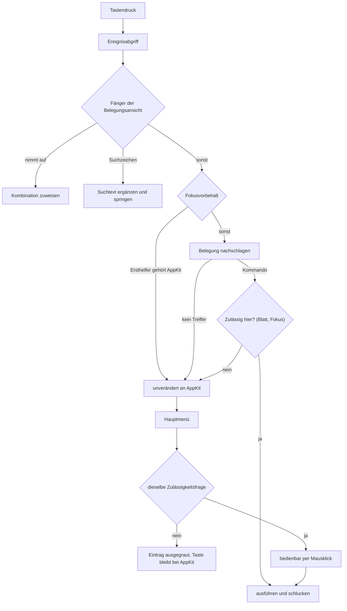
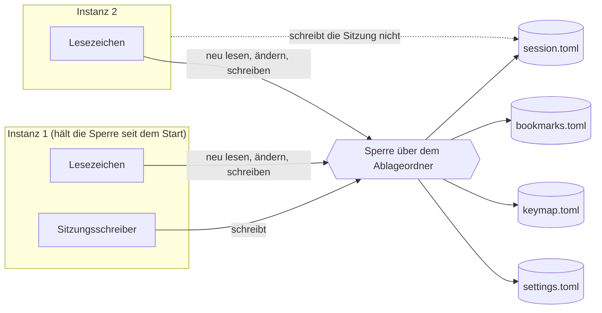

# Spec: Suche in der Belegungsansicht, vollständiges Menü, weitere Instanz

**Date:** 2026-08-13
**Status:** Draft
**Source:** Nutzerwortlaut vom 260813: „1. wenn F1 gedrückt wurde und die tastenbelegung angezeigt wird, sollte jede eingabe eines zeichens an einen suchstring appended werden und sofort nach dem ersten treffer gesucht werden, enter sucht das nächste vorkommen, weitere eingaben werden append und lösen eine weitere suche aus, backspace löscht und triggert die suche, esc beendet F1. 2. wir brauchen eine möglichkeit eine zweite instanz von krk zu starten - auch per taste. 3. alle tastenbefehle sollten auch über das Menu erreichbar sein."
**Grundlage erhoben:** 260813-0053, am Baum unter `crates/` und `resources/`
**Kein Circle aktiv.** Der Spec liegt deshalb im gemeinsamen Speicher; der Circle wird nach ihm angelegt.

---

## Directive

Nach dieser Runde ist jeder Befehl von KRK auf drei Wegen erreichbar statt auf einem. Die Belegungsansicht wird durch Tippen durchsucht: jedes Zeichen hängt an einen Suchtext an, die Auswahl springt sofort auf den ersten Treffer, die Eingabetaste geht zum nächsten. Das Hauptmenü führt alle Funktionen der Belegung, gegliedert nach denselben neun Funktionsbereichen, die Belegungsansicht und Markdown-Ausgabe schon zeigen, jede mit ihrem Kürzel aus der Belegung und ausgegraut, wo sie gerade nicht wirkt. Und ein Tastenbefehl startet eine weitere Instanz von KRK, die sich Lesezeichen und Tastenbelegung mit der ersten teilt, ohne dass eine von beiden die Arbeit der anderen überschreibt.

Diese Runde setzt keine elfte Zeitzusage und fasst keine der zehn an.

---

## Wie diese Runde geschnitten ist, und warum so

**Empfehlung: eine Runde mit drei Fähigkeiten, mit einer benannten Naht.**

Die Abhängigkeiten liegen ungleich. Suche und Menü hängen beide an derselben Maschinerie: an `Belegung`, an `belegungsmodell::nach_bereichen`, an den Anzeigetexten `funktionstext` und `tastentext`, an der Übersetzung zwischen Kombination und AppKit-Kürzel. Sie stoßen zudem an genau einer Stelle aufeinander: solange die Belegungsansicht als Blatt steht, muss jeder Menüeintrag ausgegraut sein, sonst nimmt das Menü der Ansicht ihre Schaltflächentasten weg. Zwei getrennte Runden fassten dieselben Dateien zweimal an und müssten diese eine Regel zweimal aufstellen.

Die weitere Instanz teilt mit beiden nichts. Sie arbeitet in `crates/krk-core/src/ablage/` und in einer neuen Hülle unter `appkit/`, und ihre Berührung mit dem Rest der Runde beträgt zwei Zeilen: ein Eintrag in `resources/default-keymap.toml` und eine Zeile in `bereich_des_kommandos`. Genau deshalb ist sie die Naht: wird die Runde lang, lässt sie sich als eigene Runde herauslösen, und der Preis dafür sind diese zwei Zeilen. Umgekehrt kostet es wenig, sie jetzt mitzunehmen, und der Nutzer hat eine Runde bestellt.

Die inhaltliche Klammer trägt alle drei: es geht um die Erreichbarkeit dessen, was KRK kann. Zwei Fähigkeiten machen die vorhandenen Befehle auffindbar, die dritte macht das Programm selbst ein zweites Mal verfügbar.

---

## Wie ein Tastendruck nach dieser Runde läuft

Die Frage in der Raute steht **einmal** und wird zweimal gestellt: vom Abgriff, bevor er ausführt, und vom Menü, bevor es einen Eintrag freigibt. Weil beide dieselbe Antwort bekommen, kann eine Taste, die der Abgriff durchreicht, im Menü nichts auslösen, und ein Eintrag, den das Menü freigibt, wird per Tastendruck nie erreicht.

## Wie die Ablage mit zwei Instanzen aussieht

---

## Ausgangslage, am 260813 am Baum erhoben

Sieben Feststellungen tragen den Zuschnitt, und zwei von ihnen widersprechen dem, was man ohne sie annehmen würde.

**Das Menü führt heute zehn Befehle und nicht rund zwanzig.** Gezählt in `menue.rs:277-371`: zwei im Anwendungsmenü, sechs unter „Bearbeiten", zwei unter „Fenster", dazu zwei Trenner. Die Belegung führt 81 Funktionen mit 87 Kombinationen; 75 davon tragen ein `Kommando`, die übrigen sechs sind die Textbefehle, die über die Antwortkette laufen.

**Die Gliederung, die das Menü braucht, steht schon und hat zwei Abnehmer.** `belegungsmodell::nach_bereichen` ordnet jede Funktion einem von neun `Funktionsbereich`-Werten zu, und der Doc-Kommentar der Funktion sagt ausdrücklich zu, dass daneben keine zweite Gruppierung entsteht. Die Belegungsansicht bezieht ihre Abschnitte daraus, die Markdown-Ausgabe der Runde 3 ebenso. Das Menü wird der dritte Abnehmer und keine dritte Ordnung.

**Der Ereignisabgriff sieht jeden Tastendruck vor dem Menü, und er reicht weiter, was er nicht ausführt.** Ein lokaler Ereignisabgriff liegt vor `NSApplication::sendEvent:`; wo er `nil` liefert, sieht das Menü das Ereignis nie. Wo er weiterreicht, sieht es das Menü unverändert. **Daraus folgt die tragende Regel dieser Runde**: ein Menüeintrag mit Kürzel, dessen Befehl der Fokusvorbehalt eben abgewiesen hat, führte ihn trotzdem aus. Mit dem Fokus im Editor bewegte ein Auf-Pfeil dann die Dateiliste statt der Schreibmarke, und das erste Abnahmekriterium von C7 der Editor-Runde wäre gebrochen. Die Ausgrauung ist deshalb keine Höflichkeit, sondern die Bedingung dafür, dass die Runde nichts kaputtmacht.

**Die Belegungsansicht sucht heute vermutlich schon, und zwar nicht so, wie der Nutzer es will.** Die Tabelle des Blattes setzt `allowsTypeSelect` nicht, und der Vorgabewert von `NSTableView` ist wahr. `inference:` Ein getipptes Zeichen läuft heute durch den Abgriff bis zur Senke, wird dort wegen des stehenden Blattes abgewiesen und geht unverändert an AppKit, wo die Tabelle ihre eingebaute Tippauswahl anbietet. Ob sie in einer ansichtsbasierten Tabelle ohne die zugehörige Delegiertenmethode tatsächlich Treffer liefert, ist am Baum nicht entscheidbar und am laufenden Bündel zu sehen. Für den Zuschnitt zählt die Folge und nicht der Zweifel: die neue Suche muss die eingebaute ausdrücklich abschalten, sonst hat die Ansicht zwei Suchen mit zwei Regeln.

**Zwei Tasten der Belegungsansicht stehen dem Wunsch im Weg.** Die Leertaste löst „Zuweisen" aus, die Eingabetaste „Fertig". Beide sind Zeichen im Sinne des Wunsches, und ein Funktionsname aus mehreren Wörtern lässt sich ohne Leertaste nicht suchen. Der Datensatz dazu steht unter `## Offene Nutzerentscheidungen`.

**Die Ablage kennt keine Sperre.** Kein `flock`, kein `O_EXCL`, keine Absprache; die Suche danach über `crates/` liefert am 260813 keinen Treffer. Zwei Instanzen schreiben `session.toml` im Zwei-Sekunden-Takt und beim Beenden, `bookmarks.toml` bei jedem Lesezeichenbefehl und `keymap.toml` beim Verlassen der Belegungsansicht mit Änderung. **Der schwerere Befund liegt eine Ebene tiefer**: `atomar::nachbarpfad` leitet den Namen der Nachbardatei fest ab und trägt bewusst keine Laufnummer. Zwei Instanzen benutzen deshalb dieselbe Nachbardatei, und das `rename` kann ein Gemisch veröffentlichen. Die Zusage des Moduls, ein Leser sehe entweder den alten Inhalt ganz oder den neuen ganz, gilt für einen Schreiber. Die Runde 6 hat gebaut, dass eine beschädigte Ablagedatei zur Seite gelegt statt überschrieben wird; sie fängt die Folge auf und verhindert die Ursache nicht.

**„Zweite Instanz" heißt zweiter Prozess und nicht zweites Fenster, und das ist abgeleitet und nicht geraten.** Der Nutzer schreibt „Instanz". Ein zweites Fenster in einem Prozess wäre daneben genau der Umbau, den der Spec der Runde 1 unter C7 ausdrücklich hinausgeschoben hat: „Zwei Fragen bleiben damit ungestellt, und das ist gewollt. Ob zwei Fenster sich eine Sitzung teilen und was ‚das aktive Dateifenster' aus C1 bei zwei Fenstern mit je zwei Dateifenstern bedeutet … die Prüfsitzung aus C8 wäre mehrdeutig: L4 endet bei der bedienbaren Oberfläche, und bei zwei Fenstern wäre unklar, welches sie beendet." Ein zweites Fenster im selben Prozess fasst damit C8 an. Ein zweiter Prozess tut es nicht: er misst seinen eigenen Kaltstart, und jede Instanz hält weiter genau ein Anwendungsfenster.

---

## Fähigkeiten und Abnahmekriterien

Jedes Kriterium trägt, wie es nachzuweisen ist. **(Probe)** heißt: eine Prüfung im Baum weist es nach, ein Agent kann es abnehmen. **(Bündel)** heißt: es ist am laufenden `KRK.app` im Vordergrund zu sehen, und das ist Nutzerarbeit.

### C1: Die Belegungsansicht wird durch Tippen durchsucht

1. Jedes getippte Zeichen hängt an einen Suchtext an, und die Auswahl springt sofort auf den ersten Treffer. Kein Befehl und kein Modus geht voraus. **(Probe** für Suchtext und Zielzeile, **Bündel** für die springende Auswahl**)**
2. Aufgenommen wird, was ein Suchtext tragen kann, und die Regel dafür steht schon: `krk_core::verzeichnis::sprungmarke::traegt_ein_dateiname` weist Steuerzeichen und den privaten Bereich U+F700 bis U+F8FF ab. Eine zweite Zeichenregel entsteht nicht. **(Probe)**
3. Gesucht wird über den Text, den die Ansicht zeigt, und über keinen zweiten: die Spalte „Funktion" aus `funktionstext` und die Spalte „Belegung" aus `tastentext`. Die Kennung wird nicht durchsucht, denn sie steht nicht auf dem Schirm, und ein Treffer, den der Nutzer nicht sehen kann, ist keiner. **(Probe)**
4. Gesucht wird als Teilzeichenfolge und nicht als Wortanfang: „datum" findet „Spalte Datum umschalten". Der Anfangsvergleich der Sprungmarke aus C2 der Runde 1 taugt hier nicht, weil die gesuchte Zeile fast nie mit dem gesuchten Wort beginnt. **(Probe)**
5. Ohne Rücksicht auf Groß- und Kleinschreibung, wie die Sprungmarke der Dateiliste. Die Suche im Editor unterscheidet sie zwar, aber ihr eigener Modulkopf hält fest, dass der Spec das offengelassen hat; ein Projektsatz ist es nicht. **(Probe)**
6. Bereichsüberschriften sind keine Treffer. Sie sind nicht auswählbar, und eine Zeile, auf die die Auswahl nicht springen kann, ist kein Treffer. **(Probe)**
7. Die Eingabetaste springt auf das nächste Vorkommen. Hinter dem letzten geht es beim ersten weiter, wie `krk_core::text::suche::naechster` es für den Editor tut. **(Probe)**
8. Die Rücktaste nimmt das letzte Zeichen weg und sucht erneut. Bei leerem Suchtext geschieht nichts. **(Probe)**
9. Bei null Treffern bleibt die Auswahl stehen, und die Meldungszeile sagt es. Wortlos nichts zu tun ist nach C1 der Runde 1 nicht zulässig. **(Probe** für den Satz, **Bündel** für die Zeile**)**
10. Der Suchtext ist sichtbar, samt der Zahl der Treffer und der Stelle darin. Er steht in der vorhandenen Meldungszeile des Blattes; eine zweite Meldefläche entsteht nicht. Eine Zuweisungs- oder Konfliktmeldung verdrängt ihn bis zum nächsten Suchzeichen. **(Probe** für den Satz, **Bündel** für die Zeile**)**
11. Die Ansicht führt **genau eine** Suche. Die eingebaute Tippauswahl der `NSTableView` ist ausdrücklich abgeschaltet. **(Probe** über den gesetzten Schalter**)**
12. Der Suchtext lebt so lange wie die Ansicht. Eine Pause setzt ihn nicht zurück; die Sekundenregel der Sprungmarke stammt aus C2 der Runde 1 und hat dort ihren Grund, hier hat sie keinen, weil die Rücktaste das Löschen trägt. **(Probe)**
13. `esc` behält seine zwei vorhandenen Bedeutungen und bekommt keine dritte: während der Aufnahme bricht es sie ab, sonst verlässt es die Ansicht und sichert. Es löscht keinen Suchtext. **(Probe** für die Fallunterscheidung, **Bündel** für das Verlassen**)**
14. Die Zeicheneingabe geht über den einen Ereignisabgriff, und zwar über den Fänger, der schon die Aufnahme trägt. Keine Ansicht bekommt eine eigene `keyDown:`-Behandlung. **(Probe** über die Zahl solcher Überschreibungen im Baum**)**
15. Während der Aufnahme nimmt die Suche nichts auf. Die Aufnahme steht vor ihr, so wie sie heute vor dem Fokusvorbehalt steht. **(Probe)**
16. Die drei Schaltflächen behalten je eine Taste, und keine davon ist ein Zeichen: „Zuweisen" auf Cmd+T, „Auslieferungszustand" unverändert auf Cmd+R, „Fertig" auf Cmd+Eingabe über den vorhandenen Wert `Taste::EingabeMitBefehl`. Die Erläuterungszeile des Blattes nennt alle drei und die Suche. **(Probe** für die Kürzel, **Bündel** für die Bedienung**)** — abhängig von der offenen Frage zu den Schaltflächentasten.

### C2: Jeder Tastenbefehl steht im Menü

1. Alle Funktionen der Belegung stehen im Hauptmenü, jede genau einmal. Die Zahl steht nicht im Programmtext: das Menü entsteht aus der Belegung, und die Probe zählt seine Befehlseinträge gegen `Belegung::funktionen`. **(Probe)**
2. Das Menü entsteht aus derselben Gliederung wie Belegungsansicht und Markdown-Ausgabe, also aus `belegungsmodell::nach_bereichen`. Es wird ihr **dritter** Abnehmer; eine zweite Gruppierung entsteht nicht. **(Probe** über die Zahl der Aufrufer**)**
3. Je Funktionsbereich ein Obermenü, in der Reihenfolge von `Funktionsbereich::ALLE`, mit „Anwendung" vorn — macOS ersetzt dessen Titel ohnehin durch den Namen aus der `Info.plist` — und „Fenster" hinten. **(Probe** für Reihenfolge und Namen über `--menue-protokoll`, **Bündel** für das Bild**)**
4. Jeder Eintrag nimmt sein Kürzel aus der Belegung und keine Zeichenkette aus dem Programmtext. Trägt eine Funktion mehrere Kombinationen, zeigt der Eintrag die erste; trägt sie keine, zeigt er keine. Beide Regeln stehen schon in `menue::befehl` und bleiben unverändert. **(Probe)**
5. **Ein Eintrag, dessen Befehl hier gerade nicht zulässig ist, ist ausgegraut.** Zulässig heißt genau das, was der Ereignisabgriff heute schon fragt: es steht kein Blatt, oder der Befehl ist währenddessen erlaubt, und `fokus::wirkt` sagt zum Wirkungsbereich und zum gegenwärtigen Fokus ja. **Eine Zulässigkeitsfrage, zwei Frager, eine Stelle.** **(Probe** über die Tafel aus sieben Wirkungsbereichen mal fünf Fokuswerten**)**
6. Drei Fälle weisen nach, dass die Ausgrauung trägt und nicht bloß gut aussieht: mit dem Fokus im Editor bewegt `up` die Schreibmarke und nicht die Dateiliste, `return` setzt einen Zeilenumbruch und übergibt keine Datei an das Standardprogramm, und in einem Textfeld löscht `delete` ein Zeichen und räumt nichts in den Papierkorb. **(Bündel)**
7. Solange ein Blatt steht, ist jeder Eintrag außer dem Abbruch ausgegraut. Die Belegungsansicht behält damit ihre eigenen Tasten, und jedes andere Blatt behält seine. **(Probe** für die Regel, **Bündel** für die Ansicht**)**
8. Die sechs Textbefehle bleiben, wie sie sind: ohne Kommando, über die Antwortkette, mit der Ausgrauung durch AppKit. Sie bekommen keine Zulässigkeitsregel von KRK. **(Probe)**
9. Der Eintrag „Tastenbelegung als Markdown sichern" der Runde 3 bleibt ohne Kennung und ohne Kürzel und steht im Anwendungsmenü über dem Beenden, durch einen Trenner davon geschieden. **(Probe)**
10. Es gibt weiterhin **genau eine** Stelle, die ein `NSMenuItem` anlegt, und **genau eine** Übersetzung zwischen Kombination und AppKit-Paar. Beide stehen schon in `menue.rs`. **(Probe** über die Zahl der Aufrufer**)**
11. Das Menü wird an genau zwei Anlässen gebaut, beim Start und nach einer Änderung der Belegung. Beide Stellen stehen heute. Ein Kürzel, das der Nutzer in der Belegungsansicht ändert, steht danach im Menü. **(Probe** für die Zahl der Bauaufrufe, **Bündel** für das Bild**)**
12. `--menue-protokoll` liest das gebaute Menü weiter aus und nennt jeden Eintrag mit Beschriftung, Kürzel, Zusatztasten und Selektor. Die Abnahme von C3 der Runde 1, dass keine Kombination außerhalb der Belegung etwas auslöst, läuft unverändert über dieses Auslesen und nicht über eine Aufzählung der heute bekannten Systemzusätze. **(Probe)**
13. Nach dieser Runde zeigt `--menue-protokoll` weder „Emoji & Symbols" noch „Start Dictation…" noch das Untermenü „AutoFill", und zu keinem neuen Eintrag stellt AppKit eine Zweitform mit eigener Kombination. **(Probe** über das Protokoll**)**
14. Ein Menüeintrag führt seinen Befehl über dieselbe Stelle aus wie ein Tastendruck, nämlich `kommando_ausfuehren`. Ein zweiter Ausführungsweg entsteht nicht. **(Probe** über die Zahl der Aufrufer**)**
15. Ein Befehl läuft auf einen Tastendruck hin **höchstens einmal**. Welche Regel das trägt, entscheidet die offene Frage zum Schluckverhalten des Abgriffs; ohne eine solche Regel liefe ein zulässiger, aber wirkungsloser Befehl über den Umweg Menü ein zweites Mal. **(Probe)**

### C3: Eine weitere Instanz von KRK

1. Ein Tastenbefehl startet eine weitere, eigenständige Instanz von KRK, und sie kommt mit eigenem Fenster nach vorn. **(Bündel)**
2. Der Befehl heißt „Weitere Instanz starten" und liegt ab Werk auf `opt+cmd+n`. Die Kombination ist heute frei. `cmd+n` bleibt bei „Fenster einblenden": dessen Aufgabe, das geschlossene Fenster zurückzuholen, gibt es unverändert weiter, und diese Runde führt keine zweiten Fenster ein, auf die sich die Umbenennungszusage aus C7 der Runde 1 bezieht. **(Probe)**
3. Der Befehl wirkt aus jedem Fokus und läuft über die vorhandene Kommando-Maschinerie und über keine zweite: eine Zeile in `resources/default-keymap.toml`, ein Wert in `Kommando`, je eine Zeile in `Kommando::wirkungsbereich` und in `bereich_des_kommandos`. **(Probe)**
4. Er ist über das Menü erreichbar wie jeder andere Befehl, nach den Regeln aus C2. **(Probe)**
5. Gestartet wird das Bündel, in dem die laufende Instanz steckt, und kein Pfad aus dem Programmtext. **(Probe** für die Herkunft des Pfades, **Bündel** für den Start**)**
6. Läuft KRK nicht aus einem Bündel, wie beim Entwicklungslauf über `cargo run`, meldet der Befehl das und startet nichts. **(Probe** für den Satz, **Bündel** für die Zeile**)**
7. Jeder Schreibvorgang an den vier Dateien unter `~/Library/Application Support/KRK/` geht unter einer Sperre über den Ablageordner, und `atomar::schreiben` bleibt der eine Schreibweg. Zwei Instanzen beschreiben damit nie dieselbe Nachbardatei zugleich, und ein Gemisch kann nicht veröffentlicht werden. **(Probe** mit zwei Prozessen**)**
8. Ein Lesezeichenbefehl liest die Lesezeichen unter der Sperre frisch von der Platte und wendet seine eine Änderung darauf an statt auf den Stand vom Programmstart. Ein Lesezeichen, das die andere Instanz angelegt hat, überlebt damit. **(Probe** mit zwei Prozessen**)**
9. Die Sitzung schreibt genau die Instanz, die die Sperre beim Start bekommen hat. Jede weitere startet aus derselben gespeicherten Sitzung und schreibt sie nicht zurück. **(Probe)**
10. Eine Instanz, die die Sitzung nicht schreibt, sagt es beim Start einmal in der Statuszeile. **(Probe** für den Satz, **Bündel** für die Zeile**)**
11. Die Zuständigkeit für die Sitzung wandert nicht. Wer beim Start keine bekam, schreibt bis zu seinem Ende keine, auch wenn die erste Instanz vorher endet. Eine wandernde Zuständigkeit wäre eine zweite Regel und ein Wettlauf mehr. **(Probe)**
12. KRK hält weiter genau **ein** Anwendungsfenster je Prozess. C7 der Runde 1 bleibt unangetastet, und die beiden dort ausdrücklich ungestellten Fragen bleiben ungestellt. **(Probe)**

### C4: Was der Bau erzwingt

1. `Kommando` wächst von 75 auf 76 Kennungen. `Wirkungsbereich`, `Bereich`, `Fokus` und `Funktionsbereich` wachsen **nicht**, und das ist ein Ergebnis und kein Zufall: diese Runde legt keinen neuen Bereich an, kein neues Fokusziel, keine neue Art von Wirkungsbereich und keinen zehnten Funktionsbereich. **(Probe)**
2. `resources/default-keymap.toml` führt danach 82 Funktionen mit zusammen 88 Kombinationen, und die Zählzeile im Kopf der Datei nennt beide Zahlen. **(Probe)**
3. `opt+cmd+n` ist vorher unbelegt; keine bestehende Kombination wechselt ihren Besitzer. **(Probe)**
4. Jede neue Datei unter `crates/krk-ui/src/appkit/` trägt im Modulkopf den Abschnitt `# Ab welchem macOS die angesprochenen Klassen stehen`, und jede dort genannte Zahl ist am SDK nachgelesen. **(Probe** über die Deckung, Augenschein für die Richtigkeit**)**
5. `#![deny(unsafe_code)]` bleibt an allen drei Kistenwurzeln. Kommt für die Sperre eine dritte Datei mit `#![allow(unsafe_code)]` hinzu, nennt der Plan sie und ihren Grund in einem eigenen Schritt; sie fällt nicht im Vorbeigehen an. **(Probe** über die Liste der Ausnahmen**)**
6. Es gibt weiterhin genau **drei** Prüfordner-Fassungen. **(Probe)**
7. Jede neu eingebundene fremde Kiste trägt in der Wurzel-`Cargo.toml` den Satz, warum sie eingebunden ist, und `Cargo.lock` führt danach kein `cc` und außer `windows-sys` kein `-sys`-Paket. **(Probe)**
8. Ein Rückgabewert, dessen stilles Fallenlassen unbemerkt bliebe, trägt `#[must_use]`. Das betrifft in dieser Runde mindestens den Rückgabewert der Sperre. **(Probe)**

---

## Verhältnis zu den zehn Zeitzusagen aus C8 der Runde 1

**Diese Runde setzt keine elfte Zusage und ändert keine der zehn Zahlen.** Drei liegen auf ihrem Weg, und jede gehört aus einem eigenen Grund in den nächsten Abnahmelauf.

**L4 ist die einzige, bei der diese Runde messbar Arbeit hinzufügt.** Der Kaltstart bis zur bedienbaren Oberfläche hat 1000 ms, und das Menü entsteht auf diesem Weg, vor `applicationDidFinishLaunching`. Statt zehn Einträgen entstehen künftig zweiundachtzig, jeder mit einem Nachschlag in der Belegung und einer Übersetzung seiner Kombination. Dazu kommt die Sperre, ein Systemaufruf beim Öffnen der Ablage. Beides ist klein, und keines ist gemessen; die Runde behauptet deshalb nicht, dass L4 hält, sondern benennt L4 als Gegenstand des nächsten Laufs.

**L1 und L9 liegen nicht auf dem Weg, und das ist herleitbar statt gemessen.** Beide zählen Tastendrücke, die die Auswahl im Dateifenster sichtbar bewegen, also solche, die der Abgriff ausführt. Wo er ausführt, liefert er `nil`, und ein verworfenes Ereignis erreicht `NSApplication::sendEvent:` nie; das Menü kann an einem solchen Tastendruck keine Arbeit verrichten. Sie stehen trotzdem auf der Liste des nächsten Laufs, weil das Menü nach dieser Runde achtmal so viele Einträge trägt und eine Herleitung keine Messung ist.

Der vierte Gegenstand aus dem Spec der Runde 2, die Geschwindigkeit der Syntaxhervorhebung, ist von dieser Runde nicht berührt und bleibt offen.

---

## Randbedingungen

- **Der Ereignisabgriff bleibt der eine Eintrittspunkt für Tastendrücke.** Keine Ansicht bekommt eine eigene `keyDown:`-Behandlung, auch die Belegungsansicht nicht. Die Suche hängt sich an den vorhandenen Fänger.
- **Die Belegung bleibt die alleinige Quelle jeder Kombination.** Kein Kürzel steht als Zeichenkette im Programmtext, und die Konflikterkennung aus C3 sieht jede Kombination, die in KRK etwas auslöst. Die Schaltflächentasten der Blätter sind davon seit dem Nutzerentscheid vom 260805-0713 ausgenommen, weil ein stehendes Blatt jeden Befehl anhält und die beiden Zusteller einander nie begegnen.
- **`Kommando::wirkungsbereich` und `bereich_des_kommandos` bleiben vollständige Fallunterscheidungen ohne Auffangzweig.** Das neue Kommando braucht in beiden eine Zeile, sonst übersetzt der Baum nicht.
- **Die Aufrufrichtung bleibt von oben nach unten.** Der Kern gibt Werte zurück und schreibt auf keinen Kanal; die Meldung über die nicht gesicherte Sitzung entsteht in `krk-ui`.
- **Kein `make bundle` und kein `cargo xtask bundle` während der Runde.** Unter `target/KRK.app` liegt ein beglaubigtes Bündel, das der Nutzer braucht; der offene Defekt `shared/issues/260813-0026_o_bundle-und-release-schreiben-an-denselben-ort-…` beschreibt die Lage.
- **Der Abnahmelauf am Bündel ist Nutzerarbeit.** Jedes mit **(Bündel)** gekennzeichnete Kriterium bleibt bis dahin unabgenommen, und die Runde schließt darum voraussichtlich als beschränkter Abschluss wie ihre sechs Vorgängerinnen.

---

## Nicht Gegenstand dieser Runde

- **Ein zweites Fenster innerhalb eines Prozesses.** Der Spec der Runde 1 hat den Umbau unter C7 ausdrücklich hinausgeschoben, und er fasst C8 an. Eine weitere Instanz ist ein weiterer Prozess.
- **Zwei Instanzen, die sich ihren Zustand gegenseitig anzeigen.** Ein in Instanz 1 angelegtes Lesezeichen überlebt nach C3.8, erscheint in Instanz 2 aber erst nach deren Neustart. Eine Beobachtung des Ablageordners über die vorhandene Dateisystemwache wäre der nächste Schritt und ist keiner dieser Runde.
- **Eine Suche, die die Belegungsansicht filtert.** Der Nutzer beschreibt ein Springen und kein Ausblenden; die Liste bleibt vollständig.
- **Rückwärtssuche, Groß-/Kleinschreibungsschalter, reguläre Ausdrücke** in der Belegungsansicht. Jeder Schalter wäre ein Bedienelement und ein Abnahmekriterium mehr, und die Suche im Editor kennt aus demselben Grund keinen.
- **Ein Kontextmenü für die neuen Befehle.** Das Kontextmenü der Runde 6 trägt weiterhin genau einen Eintrag.
- **Eine Änderung an den zehn Zeitzusagen.**

---

## Offen für den Planner

- **Wie ein Menüeintrag sein Kommando trägt.** Ein Selektor je Befehl wären sechsundsiebzig Selektoren; ein gemeinsamer Selektor braucht einen Träger am `NSMenuItem`. Der Planner entscheidet, welcher.
- **Woran die Ausgrauung hängt.** `validateMenuItem:` am Anwendungsdelegierten ist der naheliegende Ort, weil dort schon `blatt_steht` und `fokus` stehen. Die Wahl gehört dem Plan.
- **Welcher Mechanismus die Sperre trägt.** Zwei Wege liegen nahe, und beide berühren eine Projektregel: ein `flock` bräuchte einen Fremdaufruf und damit eine Datei mit `#![allow(unsafe_code)]`, wovon es im Kern heute genau eine gibt; ein Sperrverzeichnis über `create_new` käme ohne aus, hinterließe aber nach einem Absturz eine Sperre, die niemand aufhebt. Der Plan wählt und nennt den Preis.
- **Wie eine weitere Instanz gestartet wird.** `NSWorkspace` steht schon in vier Modulen dieses Baums; welche Methode das Bündel ein zweites Mal startet, entscheidet der Plan.
- **Wo die Trefferrechnung der Suche wohnt.** Sie ist ohne AppKit prüfbar und gehört damit nach `belegungsmodell`; die Aufteilung zwischen Modell und Ansicht gehört dem Plan.
- **Wie die Probe mit zwei Prozessen aussieht.** Die Kriterien C3.7 und C3.8 verlangen zwei gleichzeitige Schreiber. Ob das ein Prozessstart aus der Probe heraus wird oder zwei Fäden auf einem Prüfordner, entscheidet der Plan; der Messplatz liegt unter `~/Library/Caches/krk-messplatz` und nicht unter `/tmp`.

---

## Offene Nutzerentscheidungen

Vier Fragen sind gestellt und nicht beantwortet. Jede trägt Möglichkeiten, Kosten und eine Empfehlung, und die Runde fährt bis zur Antwort auf der Empfehlung.

| Datensatz | Frage | Empfehlung, auf der die Runde fährt |
|---|---|---|
| `shared/decisions/260813-0053_o_welche-tasten-behalten-die-schaltflaechen-der-belegungsansicht-…` | Leertaste und Eingabetaste: Suche oder Schaltfläche? | Die Suche nimmt beide; „Zuweisen" auf Cmd+T, „Fertig" auf Cmd+Eingabe. |
| `shared/decisions/260813-0053_o_wie-viele-obermenues-traegt-die-menueleiste-fuer-81-funktionen.md` | Neun Obermenüs oder weniger mit Untermenüs? | Neun, eines je Funktionsbereich. |
| `shared/decisions/260813-0053_o_was-teilen-sich-zwei-instanzen-an-der-ablage-…` | Was schützt Lesezeichen, Belegung und Sitzung vor der zweiten Instanz? | Sperre, Neulesen vor dem Schreiben, Sitzung beim Sperrhalter. |
| `shared/decisions/260813-0053_o_schluckt-der-abgriff-den-zulaessigen-befehl-oder-den-ausgefuehrten.md` | Schluckt der Abgriff den zulässigen oder den ausgeführten Befehl? | Den zulässigen; damit gibt es den Doppelweg nicht. |

Die vierte Antwort trägt das Kriterium C2.15 und ändert es je nach Ausgang; die übrigen drei ändern Kriterien innerhalb ihrer Fähigkeit und keinen Zuschnitt.

---

## Abgeleitet und nicht gefragt

Diese Festlegungen stehen ohne Rückfrage im Spec, weil sie sich aus dem Baum, aus `CLAUDE.md` oder aus einem vorhandenen Datensatz ergeben. Wer sie ändern will, ändert die Ableitung mit.

- **„Zweite Instanz" ist ein zweiter Prozess.** Aus dem Wort des Nutzers und aus C7 der Runde 1, die den Mehrfenster-Umbau hinausgeschoben und ihn an L4 gebunden hat.
- **Die Suche sucht als Teilzeichenfolge und ohne Rücksicht auf Groß- und Kleinschreibung.** Aus dem Zweck: über 81 mehrwortige Funktionsnamen fände ein Anfangsvergleich fast nichts. Die Unempfindlichkeit gegen die Schreibweise folgt der Sprungmarke der Dateiliste, die dieselbe Frage über Namen stellt.
- **Die Suche läuft im Ring.** Aus `krk_core::text::suche`, wo alle drei Auswahlfunktionen umlaufen und diese eine Stelle es tut.
- **Gesucht wird über die beiden angezeigten Spalten und nicht über die Kennung.** Ein Treffer, den der Nutzer nicht sehen kann, ist keiner.
- **`esc` bekommt keine dritte Bedeutung.** Aus dem Wortlaut des Nutzers und daraus, dass die Ansicht mit der Aufnahme schon zwei hat.
- **Die Ausgrauung im Menü ist Pflicht und nicht Zier.** Aus der Reihenfolge von Ereignisabgriff und Menübehandlung: ohne sie führt das Menü aus, was der Fokusvorbehalt eben abgewiesen hat.
- **Das Menü nimmt seine Gliederung aus `nach_bereichen`.** Aus dem Doc-Kommentar jener Funktion, die eine zweite Gruppierung ausschließt, und aus der Runde 3, deren Directive eine zweite Aufbereitung ausdrücklich ausschließt.
- **`cmd+n` bleibt bei „Fenster einblenden".** Aus C7 der Runde 1: die Umbenennungszusage gilt der Runde, die mehrere **Fenster** einführt, und diese Runde tut das nicht.
- **`opt+cmd+n` ist die Kombination des neuen Befehls.** Am 260813 als einzige naheliegende freie Kombination am Bestand der 87 ausgelieferten Kombinationen abgelesen.

---

## Prüfvorbehalt

Zwei Aussagen dieses Spec sind hergeleitet und nicht gemessen, und beide gehören in den Plan als eigene Prüfung:

- `inference:` Die eingebaute Tippauswahl der `NSTableView` wirkt heute in der Belegungsansicht. Der Weg dorthin ist am Baum belegt; ob sie in einer ansichtsbasierten Tabelle ohne die zugehörige Delegiertenmethode Treffer liefert, ist es nicht. Kriterium C1.11 schaltet sie in jedem Fall ab, damit die Frage keine Rolle mehr spielt.
- `inference:` Ein Tastendruck, den der Abgriff ausführt und schluckt, verursacht im Menü keine Arbeit. Die Herleitung steht oben unter C8; gemessen ist sie nicht.
