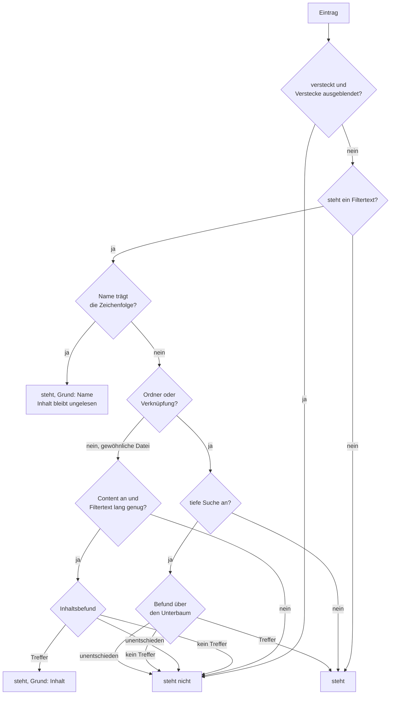

# Spec: Der Filter der Dateiliste berücksichtigt den Inhalt der Dateien

**Datum:** 2026-08-16
**Status:** Gebaut und belegt, Abnahmelauf **nicht** gefahren — die Runde 11 (`circles/260816-1321-inhaltsfilter-mit-ankreuzfeld-content`) ist am 260816-2030 beschränkt geschlossen, ihr Plan `planning/260816-1359_c_plan-inhaltsfilter-der-dateiliste.md` steht auf `_c_`. Die Abnahmeliste liegt fertig unter `messungen/260816-abnahme-inhaltsfilter.md` und ist Nutzerarbeit. Der Dateimarker bleibt `_o_`, solange `shared/decisions/260819-1440_*_was-sagt-der-marker-c-an-einem-spec-gebaut-oder-abgenommen.md` offen ist; siehe `## Reconciliation Log` am Ende.
**Quelle:** „Nächste Erweiterung des Filters: im Moment filtern wir Datei-/Foldernamen. Nun erweitern wir so, dass matches im Dateiinhalt berücksichtigt werden. Diese Funktion wird mit einer weiteren Checkbox in der unteren Controlleiste aktiviert: ‚Content'."
**Baumstand:** `9236dd4`, gelesen am 260816
**Ablage:** Dieser Spec entsteht ohne Circle im Blick und liegt deshalb im gemeinsamen Speicher. Der Circle der elften Runde nimmt ihn über sein Feld `Active spec/plan:` an.

## Directive

Wer im Dateifenster tippt, filtert die Liste nach Namen. Ist zusätzlich das Ankreuzfeld „Content" der Bereichsleiste gesetzt und der Filtertext lang genug, bleibt eine Datei auch dann stehen, wenn ihr Text die getippte Zeichenfolge trägt. Gelesen wird allein, was KRK als Text annimmt, höchstens bis zur Textgrenze der Vorschau, und nur bei Dateien, deren Name den Filtertext nicht schon trägt. Bei eingeschalteter tiefer Suche gilt dasselbe für den ganzen Unterbaum.

## Was der Nutzer am 260816 entschieden hat

Fünf Festlegungen stehen vor dieser Klärung. Sie sind hier eingearbeitet und nicht neu verhandelt.

**Der Inhalt wird beim Tippen gelesen, ab einer nach der tiefen Suche gestaffelten Mindestlänge.** Bei ausgeschalteter tiefer Suche wirkt der Inhaltsfilter ab drei Zeichen, bei eingeschalteter ab fünf. Unterhalb der Schwelle filtert KRK allein nach dem Namen, genau wie heute.

**Die Staffelung ist hergeleitet und nicht gesetzt.** Ein flacher Inhaltsfilter liest die Dateien eines Ordners, ein tiefer die Dateien seines ganzen Unterbaums, und das sind je nach Ort um Größenordnungen mehr. Zwei Zeichen bezeichnen wenig und treffen entsprechend viel; die Zahl der zu lesenden Dateien wächst also genau dort, wo die Eingabe am wenigsten aussagt. Die höhere Schwelle der tiefen Suche gleicht das aus. Aus der Staffelung folgt daneben zweierlei, und beides gehört zur Festlegung: der Inhalt wird fortlaufend während des Tippens gelesen und nicht erst auf einen Befehl, und die tiefe Suche liest bei gesetztem „Content" tatsächlich Inhalte über den ganzen Unterbaum. Sonst hätte ihre eigene Schwelle keinen Gegenstand.

**Name und Inhalt stehen im ODER, und der Name schließt kurz.** Trägt der Name die Zeichenfolge, steht die Zeile, und ihr Inhalt bleibt ungelesen. Trägt er sie nicht, entscheidet der Inhalt. Die Kurzschlussregel ist beides zugleich, eine Ersparnis und eine Bedeutung: die beiden Treffergründe schließen einander aus, und eine Zeile steht wegen ihres Namens oder wegen ihres Inhalts, nie wegen beidem.

**Gelesen wird allein, was KRK als Text annimmt, und höchstens 1 MB.** Das ist die Textgrenze der Vorschau, `TEXTGRENZE` in `crates/krk-ui/src/vorschaumodell.rs:121`, und nicht die 16 MB des Editors. Der Nutzer hat sie ausdrücklich gewählt, weil der Inhaltsfilter zu der Klasse gehört, in der KRK sich eine Datei im Vorbeigehen ansieht. Die 16 MB gelten dem bewussten Öffnen einer einzelnen Datei zum Bearbeiten. Binäres, benannte Röhren und Unlesbares fallen heraus.

**Der Inhaltsfilter bekommt keine eigene Zeitzusage.** Der Nutzer hat am 260816 entschieden, nachdem ihm die Kosten der Gegenvariante vorlagen. An die Stelle einer elften Zahl treten zwei ohne Messstrecke prüfbare Kriterien.

## Zwei Eigenschaften, die diese Runde annimmt statt sie zu beheben

**Ein häufiges Wort lässt in einem Quellbaum fast alles stehen.** Wer `budget` tippt, verkürzt die Liste stark; wer `src` tippt, kaum. Der Grund ist die Bedeutung des ODER: eine Datei steht, sobald ihr Text die Folge irgendwo trägt, und ein häufiges Wort trägt fast jede Datei. Das ist keine Fehlfunktion, sondern die Eigenschaft, die der Nutzer mit der Wahl des ODER angenommen hat. Die Staffelung der Mindestlänge mildert sie, sie hebt sie nicht auf.

**Eine Protokolldatei von 3 MB ist über ihren Inhalt nicht auffindbar.** Sie liegt über der Textgrenze der Vorschau und wird deshalb nicht gelesen. Der Nutzer hat diese Folge mit der Wahl der 1 MB angenommen. Ob KRK sie ausweist oder stillschweigend hinnimmt, ist die eine noch offene Frage dazu und liegt beim Datensatz zur Statuszeile.

## Der eine Prüfschritt, um zwei Zweige erweitert

Die Sichtbarkeit einer Zeile entscheidet genau eine Stelle, `Ordnermodell::sichtbar` (`crates/krk-core/src/verzeichnis/modell.rs:542-587`). Sie ist eine vollständige Fallunterscheidung ohne Auffangzweig, und diese Runde erweitert sie, statt eine zweite Sicht daneben zu stellen.

Der Zweig `Content an und Filtertext lang genug?` fragt beide Größen zusammen, weil die Schwelle vom Stand der tiefen Suche abhängt. `unentschieden` ist kein neuer Zustand, sondern derselbe, den die tiefe Suche schon führt: der Auftrag ist noch nicht entschieden, und bis dahin steht die Zeile nicht.

Der Kurzschluss des Namens ist im Bild die Kante `Name trägt die Zeichenfolge? → ja`. Sie erreicht den Inhaltszweig nicht, und daran hängen zugleich die Ersparnis und die Ausschließlichkeit der beiden Treffergründe.

## Die vier Zustände von „Deep" und „Content"

| Deep | Content | Schwelle | Über eine Datei entscheidet | Über einen Ordner entscheidet |
|---|---|---|---|---|
| aus | aus | — | der Name | nichts, er steht immer |
| aus | an | 3 Zeichen | der Name, sonst der Inhalt | nichts, er steht immer |
| an | aus | — | der Name | der Name, sonst ein Namenstreffer darunter |
| an | an | 5 Zeichen | der Name, sonst der Inhalt | der Name, sonst ein Namens- **oder** Inhaltstreffer darunter |

Ein Ordner steht bei ausgeschalteter tiefer Suche immer, und daran ändert „Content" nichts. Ein Ordner hat keinen Inhalt im Sinne dieser Runde, und die Begründung der Runde 10 gilt unverändert: bei stehendem Filter soll die Navigation nicht abbrechen.

Unterhalb der Schwelle verhält sich die Spalte „Content" wie „Content aus". Die Schwelle wird bei jeder Bewertung neu gefragt und nicht einmal beim Start gemerkt. Daraus folgt ein Fall, der benannt gehört: **wer bei vier Zeichen und ausgeschaltetem „Deep" Inhaltstreffer vor sich hat und dann „Deep" einschaltet, verliert sie**, weil die Schwelle auf fünf steigt. Ein fünftes Zeichen holt sie zurück. Die Regel ist eine und nicht zwei, und sie ist an jeder Stelle entscheidbar; eine Ausnahme für den Umschaltmoment wäre ein Sonderfall ohne Gegenstück.

## Fähigkeiten

**Der Spec führt 57 Abnahmekriterien.** Je Fähigkeit: C1 zwölf, C2 zehn, C3 neun, C4 zehn, C5 fünf, C6 neun, zusammen 55, dazu die zwei aus `## Verhältnis zu den zehn Zeitzusagen aus C8 der Runde 1`. Die zwei Kästchen unter `## Ausstehende Nutzerentscheidungen` sind **keine** Abnahmekriterien, sondern offene Fragen. Ein Zählweg, der alle Kästchen der Datei addiert, kommt auf 59 und misst falsch; genau diese Falle hat in der Runde 2 einen Defekt erzeugt.

### C1: Der Inhalt entscheidet über eine Datei, deren Name nicht passt

**Beschreibung:** Der Nutzer tippt im Dateifenster. Steht „Content" und ist der Filtertext lang genug, bleibt eine Datei auch dann in der Liste, wenn ihr Text die getippte Zeichenfolge enthält.

**Abnahmekriterien:**
- [ ] C1.1: Bei gesetztem „Content" und drei getippten Zeichen ohne tiefe Suche bleibt eine Datei in der Liste, deren Name die Zeichenfolge nicht trägt, deren Text sie aber enthält.
- [ ] C1.2: Bei zwei getippten Zeichen bleibt dieselbe Datei nicht stehen. Die Liste zeigt dann dasselbe wie bei ausgeschaltetem „Content".
- [ ] C1.3: Trägt der Name die Zeichenfolge, steht die Zeile, und der Inhalt der Datei wird nicht gelesen. Nachprüfbar an einer Datei ohne Leserecht, deren Name passt: sie steht in der Liste, und es erscheint keine Meldung.
- [ ] C1.4: Der Vergleich am Inhalt ist derselbe wie am Namen: Teilzeichenfolge an jeder Stelle, ohne Rücksicht auf Groß- und Kleinschreibung, ohne Faltung von Umlauten und Akzenten. `apfel` findet einen Text mit `Äpfel` nicht, `äpfel` findet ihn.
- [ ] C1.5: Ein Treffer zählt an jeder Stelle der Datei, auch im letzten Byte vor der Grenze.
- [ ] C1.6: Eine Datei, die KRK nicht als Text annimmt, steht bei gesetztem „Content" nicht in der Liste, wenn ihr Name nicht passt. Das gilt für eine Datei mit ungültigem UTF-8, für eine benannte Röhre und für eine Datei ohne Leserecht.
- [ ] C1.7: Eine Datei über 1 MB wird nicht gelesen und steht nicht in der Liste, wenn ihr Name nicht passt. Die Zahl ist `TEXTGRENZE` aus `crates/krk-ui/src/vorschaumodell.rs` und keine neue.
- [ ] C1.8: Die Grenze wird eingehalten und nicht nur vorhergesagt. Eine Datei, die zwischen der Größenauskunft und dem Lesen über die Grenze wächst, wird nicht vollständig gelesen und gilt als nicht lesbar. Nachprüfbar an `/dev/zero`, das ohne Ende liefert und keine Größe meldet.
- [ ] C1.9: KRK wartet an einer benannten Röhre ohne Schreiber nicht. Ein Ordner mit einer solchen Röhre lässt sich bei gesetztem „Content" filtern, ohne dass die Anwendung stehenbleibt.
- [ ] C1.10: Solange der Inhalt einer Datei noch nicht gelesen ist, steht ihre Zeile nicht. Die Liste beginnt deshalb bei den Namenstreffern und wächst während des Lesens.
- [ ] C1.11: Ein geschlossener Befundkanal ohne weitere Meldung heißt nicht, dass die übrigen Dateien keinen Treffer tragen. Er heißt, dass sie nicht entschieden sind.
- [ ] C1.12: Ein Ordnerwechsel lässt den Filtertext und den Stand von „Content" stehen. Bei gesetztem „Content" und ausreichend langem Filtertext beginnt der neue Ordner sofort damit, seine Dateien zu lesen.

### C2: Das Ankreuzfeld „Content" in der Bereichsleiste

**Beschreibung:** Die Bereichsleiste bekommt ein zehntes Ankreuzfeld mit der Aufschrift „Content", neben „Deep". Es schaltet den Inhaltsfilter des sichtbaren Tabs.

**Abnahmekriterien:**
- [ ] C2.1: Die Bereichsleiste zeigt ein Ankreuzfeld mit der Aufschrift „Content" neben „Deep".
- [ ] C2.2: Das Feld nimmt den Ersthelferrang nicht an. Ein Klick darauf verschiebt den Tastaturfokus nicht, und die Fokusanzeige bleibt, wo sie war.
- [ ] C2.3: Der Stand gehört dem Tab und nicht dem Fenster, wie der Stand von „Deep". Beim Tabwechsel zieht die Leiste den Stand des sichtbaren Tabs nach.
- [ ] C2.4: Der Stand übersteht einen Ordnerwechsel, wie der Filtertext und der Stand von „Deep".
- [ ] C2.5: Der Stand übersteht die Sitzung nicht. Nach einem Neustart steht „Content" aus.
- [ ] C2.6: Ohne stehenden Filtertext ändert „Content" nichts an der Liste.
- [ ] C2.7: Die Belegung führt eine Funktion „Inhaltssuche ein- und ausschalten" mit leerer Tastenliste und nicht mit `reserviert_fuer`, wie „Tiefe Suche ein- und ausschalten". Wer eine Taste dafür will, weist sie in der Belegungsansicht zu.
- [ ] C2.8: Die Funktion erscheint im Hauptmenü an derselben Stelle wie „Tiefe Suche ein- und ausschalten" und fällt wie diese aus der Markdown-Ausgabe der Tastenbelegung heraus, weil sie keine Kombination trägt.
- [ ] C2.9: Das Ein- und Ausschalten von „Content" bei stehendem Filtertext wirkt sofort auf die Liste. Beim Ausschalten verschwinden die Zeilen, die allein wegen ihres Inhalts standen.
- [ ] C2.10: Das Einschalten von „Deep" bei gesetztem „Content" und vier Zeichen Filtertext nimmt die Inhaltstreffer weg, weil die Schwelle auf fünf steigt. Ein fünftes Zeichen holt sie zurück.

### C3: Der Inhaltsfilter über den Unterbaum

**Beschreibung:** Ist zusätzlich „Deep" gesetzt und der Filtertext mindestens fünf Zeichen lang, bleibt ein Ordner stehen, unter dem eine Datei liegt, deren Name **oder** deren Text die Zeichenfolge trägt.

**Abnahmekriterien:**
- [ ] C3.1: Bei gesetztem „Deep" und gesetztem „Content" und fünf getippten Zeichen bleibt ein Ordner stehen, unter dem allein ein Inhaltstreffer liegt und kein Namenstreffer.
- [ ] C3.2: Bei vier getippten Zeichen und gesetztem „Deep" entscheidet allein der Name über den Unterbaum. Ein Ordner mit ausschließlich einem Inhaltstreffer darunter steht nicht.
- [ ] C3.3: Der erste Treffer entscheidet den Ordner, gleich in welcher Tiefe er liegt und gleich ob er aus einem Namen oder aus einem Inhalt stammt. Der Rest darunter bleibt ungelesen.
- [ ] C3.4: Auch im Unterbaum gilt der Kurzschluss: der Inhalt einer Datei, deren Name die Zeichenfolge trägt, wird nicht gelesen. Der Name entscheidet den Ordner dann bereits.
- [ ] C3.5: Der Durchlauf hält weiterhin genau einen Verzeichnisdeskriptor, gleich wie tief der Baum ist. Der Inhaltsfilter öffnet je Datei einen weiteren und gibt ihn frei, bevor er die nächste öffnet.
- [ ] C3.6: Ein Deskriptormangel von außen lässt einen Auftrag unentschieden und entscheidet ihn nicht negativ. Gemessen unter `ulimit -n 64` in einer Kindprobe, nicht in der geerbten Grenze der Sitzung.
- [ ] C3.7: In eine symbolische Verknüpfung wird nicht abgestiegen, und ihr Inhalt wird nicht gelesen. Sie trägt zum Befund ihres Ordners nichts bei.
- [ ] C3.8: Je Tab läuft nie mehr als ein Durchlauf.
- [ ] C3.9: Während des Durchlaufs bleiben beide Dateifenster, die Lesezeichenleiste und die Bereichsleiste bedienbar. Die Auswahl bewegt sich, ein Tabwechsel geschieht, die Anwendung hält nicht an.

### C4: Rückmeldung und Abbruch

**Beschreibung:** Ein Inhaltsdurchlauf kann lange dauern. Der Nutzer erfährt, dass gelesen wird, und kann es beenden.

**Abnahmekriterien:**
- [ ] C4.1: Ein weiteres getipptes Zeichen bricht den laufenden Durchlauf ab und beginnt einen neuen. Bereits gemeldete Befunde des alten wirken nicht mehr.
- [ ] C4.2: Das Zurücknehmen eines Zeichens wirkt wie ein weiteres Zeichen: der laufende Durchlauf endet, ein neuer beginnt.
- [ ] C4.3: `Esc` räumt den Filtertext weg und beendet damit den Durchlauf. Die Liste ist danach wieder vollständig.
- [ ] C4.4: Das Ausschalten von „Content" beendet einen laufenden Inhaltsdurchlauf. Das Ausschalten von „Deep" tut es ebenfalls, wie heute.
- [ ] C4.5: Ein Ordnerwechsel und ein Tabwechsel beenden den Durchlauf der verlassenen Ansicht.
- [ ] C4.6: KRK wartet beim Abbruch nicht auf den Arbeitsfaden. Ein getipptes Zeichen wartet nie auf den Durchlauf des vorigen Filtertexts.
- [ ] C4.7: Der Abbruch greift, während eine Datei gelesen wird, spätestens nach dieser einen Datei. **Die kleinste nicht unterbrochene Einheit ist eine gelesene Datei, und die Textgrenze der Vorschau ist damit zugleich die obere Schranke der Abbruchspanne.** Dieselbe Zahl deckt beides ab, und das ist ein Grund für sie und nicht bloß eine Folge.
- [ ] C4.8: Die eine Statuszeile lässt erkennen, dass noch gelesen wird. **Vorbelegung**, bis der Datensatz `shared/decisions/260816-1310_*_was-zeigt-die-eine-statuszeile-waehrend-der-inhalt-gelesen-wird.md` beantwortet ist: der Satz des Filterstands bekommt einen Zusatz, solange gelesen wird, und es entsteht kein siebter Rang.
- [ ] C4.9: Es bleibt bei einer Statuszeile. Eine zweite Anzeige daneben entsteht nicht.
- [ ] C4.10: Eine Auskunft über den Inhaltsdurchlauf ist kein Fehler und erscheint nicht in der Fehlerfarbe.

### C5: Der Treffergrund an der Zeile

**Beschreibung:** Der Nutzer erkennt, ob eine Zeile wegen ihres Namens oder wegen ihres Inhalts in der Liste steht. Die Kurzschlussregel macht die beiden Gründe überschneidungsfrei und die Aussage damit wohldefiniert.

**Vorbelegung**, bis der Datensatz `shared/decisions/260816-1310_*_sieht-der-nutzer-ob-eine-zeile-wegen-des-namens-oder-wegen-des-inhalts-steht.md` beantwortet ist: eine Zeile, die allein wegen ihres Inhalts steht, wird abgesetzt dargestellt. Diese Vorbelegung ist die teuerste der vier Möglichkeiten des Datensatzes, und der Grund für sie steht dort: sie trägt die Aussage an der einzelnen Zeile und belastet weder den Namen noch die Spaltenrechnung. Fällt die Antwort anders aus, wandert C5 mit ihr.

**Abnahmekriterien:**
- [ ] C5.1: Eine Zeile, die allein wegen ihres Inhalts steht, ist von einer Zeile unterscheidbar, die wegen ihres Namens steht.
- [ ] C5.2: Die Unterscheidung verträgt sich mit der Auswahl und mit der Markierung. Eine ausgewählte Inhaltstrefferzeile bleibt als ausgewählt erkennbar, eine markierte als markiert.
- [ ] C5.3: Die Unterscheidung ist in der hellen und in der dunklen Farbtafel lesbar und zieht bei einem Wechsel der Tafel nach.
- [ ] C5.4: Ein dritter Zustand entsteht nicht. Es gibt keine Zeile, die aus beiden Gründen zugleich steht.
- [ ] C5.5: Für einen Ordner trifft die Kennzeichnung keine Aussage. Diese Runde sagt nicht zu, welcher Art der Befund unter ihm war.

### C6: Der eine Vergleich und seine Zählprobe

**Beschreibung:** Der Inhaltsvergleich ist derselbe Vergleich wie der Namensvergleich, und er steht weiterhin genau einmal im Baum.

**Abnahmekriterien:**
- [ ] C6.1: `traegt_die_folge` steht unverändert genau einmal in `crates/krk-core/src/verzeichnis/filter.rs`. Eine zweite Fassung für den Inhalt entsteht nicht.
- [ ] C6.2: Der Filtertext wird einmal je Suche kleingeschrieben und nicht einmal je gelesener Datei.
- [ ] C6.3: Die Zählprobe `die_zeichenregel_und_der_vergleich_stehen_je_einmal_und_haben_je_zwei_rufer` in `crates/krk-core/tests/verzeichnis.rs` ist bewusst nachgezogen. Sie nennt den dritten Rufer namentlich, ihre Meldung sagt weiterhin, welcher Rufer unerwartet ist, und sie ist nicht durch eine bloße Zahl ersetzt worden. Bleibt der neue Rufer in einer der beiden schon genannten Dateien, bleibt die Probe unverändert bei zwei, und auch das ist eine bewusste Feststellung.
- [ ] C6.4: Die Zeichenregel `traegt_ein_dateiname` behält ihre zwei Rufer. Der Inhaltsfilter ändert nicht, welche Zeichen in den Filtertext aufgenommen werden.
- [ ] C6.5: Es entsteht kein dritter Weg, eine Datei zu lesen. Der Inhaltsfilter geht über `krk_core::verzeichnis::sys::ohne_warten_oeffnen`, wie der Editor und die Vorschau.
- [ ] C6.6: Die Typprüfung steht am Deskriptor und nicht am Pfad.
- [ ] C6.7: Es entsteht keine zweite Antwort auf die Frage „ist das Text". Entschieden wird über die gelesenen Bytes, nicht über eine Endungsliste.
- [ ] C6.8: Im Filter steht weiterhin keine Zeitmessung. Die Probe `im_filter_steht_keine_zeitmessung` bleibt grün, und ihre Dateiliste ist um jede neue Datei des Filterwegs erweitert.
- [ ] C6.9: Der Vergleich auf dem Inhalt und der auf dem Namen liefern für dieselbe Zeichenfolge dieselbe Antwort. Eine Probe stellt beide nebeneinander.

## Verhältnis zu den zehn Zeitzusagen aus C8 der Runde 1

**Diese Runde setzt keine eigene Zeitzusage. Eine elfte Zahl entsteht nicht.** Die Entscheidung ist getroffen und nicht offen gelassen; sie steht auf drei am Baum geprüften Gründen.

**Der erste: keine der zehn Zusagen deckt den Filter.** L1 misst die Spanne vom Tastendruck bis zum sichtbaren Umspringen der Auswahl, und der Messmodus setzt dafür zwanzig Pfeil-ab-Ereignisse ab (`crates/krk-ui/src/messmodus.rs:820`). Ein getipptes Zeichen fällt dort nicht hinein. Der Namensfilter der Runde 10 ist deshalb schon ungemessen; der Inhaltsfilter erbt diese Lage und fällt unter keine bestehende Zahl. Die Frage lautet damit nicht „unter welche", sondern „ob eine elfte".

**Der zweite: die vorhandene Messstrecke kann Inhalt nicht messen.** Die drei Prüfordner entstehen dünnbesetzt. Je Datei werden 512 Bytes wirklich geschrieben, der Rest entsteht über `set_len` als Loch (`crates/krk-bench/src/fixture.rs:42`), und der Modulkopf warnt ausdrücklich davor, sie für eine Messung zu benutzen, die tatsächlich Bytes bewegt. Ein Inhaltsdurchlauf über den Ordner mit 100.000 Einträgen läse dort fast nichts, und die Zahl hätte mit dem Gebrauch nichts zu tun. Eine elfte Zusage verlangt deshalb zuerst einen vierten Prüfordner mit echtem Inhalt, samt einer Erzeugungsvorschrift, die bei gleicher Eingabe dieselbe Zusammensetzung liefert. Der Bau der Messvorrichtung wäre damit der größere Teil dieser Runde.

**Der dritte: der Sockel ist alt.** Der letzte vollständige Abnahmelauf der zehn Zusagen ist vom 260810, und sechs Runden liegen dazwischen. Eine elfte Zahl stünde auf einem Sockel, dessen Stand seit sechs Runden nicht nachgemessen ist, und erbte diese Unsicherheit, ohne sie benennen zu können.

**Was an die Stelle einer Zahl tritt, sind zwei Kriterien, die ohne die Messstrecke prüfbar sind.** Sie sind Teil der Abnahme dieser Runde.

- [ ] Während der Inhaltsfilter liest, bleiben beide Dateifenster, die Lesezeichenleiste und die Bereichsleiste bedienbar. Die Auswahl bewegt sich, ein Tabwechsel geschieht, und die Anwendung hält nicht an.
- [ ] Keine der zehn Zahlen aus C8 der Runde 1 wird durch diese Runde geändert, gelockert oder umgedeutet.

**Was diese Wahl kostet, und es steht hier, statt kleingeredet zu werden.** Die Dauer eines Inhaltsdurchlaufs ist nirgends zugesagt. Eine spätere Verschlechterung fällt niemandem auf, weil nichts sie misst. Die einzige Zusage, die den Inhaltsfilter tatsächlich einschränkt, lautet „bedienbar bleiben".

**Der Inhaltsdurchlauf ist ein Gegenstand für die spätere Messrunde**, und er ist der fünfte auf dieser Liste. Vier stehen schon darauf: die drei Zusagen, die die Runde 2 benannt hat, und die Geschwindigkeit der Syntaxhervorhebung aus ihrem C3, die zu keiner der zehn Zahlen gehört und auf dem Referenzgerät weiterhin ungemessen ist. Wer die Messrunde fährt, findet hier, was der Inhaltsdurchlauf dafür braucht: **einen vierten Prüfordner, dessen Dateien echte Bytes tragen.** Ohne ihn misst jede Zahl über den Inhaltsfilter das Lesen von Löchern.

**Wo diese Runde einen gemessenen Weg berührt, sagt der Spec es.** **L2, L3 und L10** messen das Lesen eines Ordners samt Sortierung auf der kopflosen Strecke; sie bauen keine Tabelle und rufen den Prüfschritt der Sichtbarkeit nie. Diese Runde fasst weder den Lesevorgang noch die Sortierung an und berührt die drei damit nicht. **L1** misst die Bewegung der Auswahl im Dateifenster; der Prüfschritt der Sichtbarkeit bekommt zwei Zweige mehr und läuft bei jedem Aufbau der Sichtreihenfolge. **L6** misst den Einstieg in einen Unterordner mit bis zu 1.000 Einträgen; bei gesetztem „Content" und ausreichend langem Filtertext stößt jeder Einstieg einen Inhaltsdurchlauf an, weil der Filtertext den Ordnerwechsel übersteht.

## Abgeleitet und nicht gefragt

Diese Punkte folgen aus dem Baum. Sie sind benannt, damit sie am Gate widersprechbar sind, statt unbemerkt zu gelten.

**Der Vergleich am Inhalt ist derselbe wie am Namen.** Der Modulkopf von `filter.rs` begründet die eine Fassung damit, dass eine tiefe Suche sonst etwas anderes fände als eine flache und niemand das erklären könnte. Dasselbe Argument trifft den Inhalt: eine Datei, die über ihren Namen gefunden wird, über denselben Text in ihrem Inhalt aber nicht, wäre nicht erklärbar.

**Der Stand von „Content" gehört dem Tab.** `tief` liegt am `Ordnermodell` des Tabs (`crates/krk-ui/src/tabs.rs:596`), und der Filtertext ebenso. Ein Schalter, der weiter reicht als das, worauf er wirkt, erzeugt die Überraschung, die der offene Datensatz zu „Deep" unter Möglichkeit 2 beschreibt.

**„Content" wird ohne Tastenkombination ausgeliefert.** Die Nutzerantwort vom 260814-1610 hat das für „Deep" so entschieden, mit leerer Tastenliste und nicht mit `reserviert_fuer`. Ein zweiter Schalter derselben Art folgt derselben Form, statt eine der frei gehaltenen Kombinationen zu belegen.

**Der Filtertext übersteht einen Ordnerwechsel, und der Stand von „Content" mit ihm.** Der Nutzer hat das am 260815 für den Filtertext entschieden, ausdrücklich als **eine** Regel statt zweier.

**Ein Inhaltsdurchlauf trägt keinen eigenen Abbruchbefehl.** `Esc` räumt den Filtertext weg und beendet ihn damit, und jedes getippte Zeichen beendet ihn ebenfalls. Ein eigener Befehl wäre ein Eintrag in der Belegung, im Hauptmenü, im Wirkungsbereich und in der Zulässigkeitsregel, und er leistete nichts, was `Esc` nicht schon leistet.

## Nicht Gegenstand dieser Runde

- **Suchen und Ersetzen über mehrere Dateien.** Seit dem 260802 ein eigenes Vorhaben. Diese Runde findet Dateien, sie zeigt keine Fundstellen und sie ändert nichts.
- **Eine Anzeige der Fundstelle im Text.** Weder die Zeilennummer noch ein Textausschnitt. Die Liste zeigt Dateien.
- **Ein Deckel auf die Trefferzahl und eine Tiefengrenze.** Die Runde 10 hat beides ausgeschlossen, und diese Runde ändert daran nichts.
- **Reguläre Ausdrücke, ganze Wörter, Schreibungsempfindlichkeit als Schalter.** Der Vergleich ist einer, und er ist derselbe wie am Namen.
- **Ein Zwischenspeicher der gelesenen Inhalte.** Ein Inhalt, der einmal gelesen wurde, wird beim nächsten Filtertext wieder gelesen. Ein Zwischenspeicher braucht eine Regel für die von außen geänderte Datei und eine Obergrenze; beides wäre eine eigene Runde.
- **Ein hierarchisches Modell, eine `NSOutlineView` oder eine zweite Tabellenklasse.** Die Runde 10 hat das ausdrücklich fallen gelassen; die Tabelle bleibt flach mit ihren vier Spalten.
- **Nebenläufigkeit über mehrere Fäden.** Ein Faden je Tab ist die Bauart, die der Datensatz vom 260814-2102 festgelegt hat. Ob der Inhaltsfilter sie sprengt, ist eine Messfrage und keine Zusage dieser Runde.
- **Eine Anhebung der Größengrenze für einzelne Dateitypen.** Eine Ausnahme für Protokolldateien wäre die zweite Zahl, die der Nutzer ausgeschlossen hat.
- **Der Abnahmelauf der zehn Zeitzusagen.** Er verlangt KRK im Vordergrund und ist Nutzerarbeit.

## Offen für den Planner

- **Wo der Inhaltsvergleich wohnt.** Der Vergleich selbst bleibt in `filter.rs`. Wer ihn auf den Inhalt zieht, entscheidet der Planner, und die Entscheidung hat eine sichtbare Folge: die Zählprobe zählt **Dateien** und nicht Aufrufe. Liegt der neue Rufer in `durchlauf.rs` oder in `modell.rs`, bleibt die Probe bei zwei Rufern. Liegt er in einer neuen Datei, wächst die Liste auf drei, und C6.3 verlangt, dass das bewusst geschieht.
- **Wie ein Inhaltsbefund an das Ordnermodell kommt.** Der Prüfschritt ist heute eine reine Funktion über den Speicher, und ein Inhaltsbefund kommt von der Platte. Der Durchlauf beantwortet schon heute je Eintragsindex einen Wahrheitswert und führt den Zustand `unentschieden`; ob der Inhaltsfilter denselben Weg nimmt oder einen zweiten daneben, entscheidet der Planner.
- **Wie die Grenze von 1 MB an den Leseweg kommt.** `krk_core::text::datei::lesen` erzwingt heute `EDITORGRENZE` fest, und `bis_zur_grenze_lesen` in `krk-ui` nimmt eine Grenze als Argument, ist aber privat und liegt in der falschen Kiste. Der Planner entscheidet, welche der beiden Stellen die Grenze künftig als Argument nimmt. Beides bleibt derselbe Leseweg über `ohne_warten_oeffnen`, und `krk-core` bekommt dabei keinen Bezug auf `krk-ui`.
- **Wo die Schwelle geprüft wird.** Verlangt ist allein, dass sie eine Regel ist und an jeder Bewertung dieselbe Antwort gibt.
- **Ob der Inhalt vollständig gelesen oder streifenweise verglichen wird.** Beides erfüllt C1.4 und C1.5, solange ein Treffer über einer Streifengrenze nicht verlorengeht.
- **Wo der Abbruch geprüft wird.** C4.7 verlangt, dass er spätestens nach einer gelesenen Datei greift.
- **Welche Fallunterscheidungen der Übersetzer einfordert.** Der neue Befehl braucht eine Zeile in `Kommando::wirkungsbereich` und in `bereich_des_kommandos`. Was darüber hinaus nötig ist, nennt der Bau genauer als jede Aufzählung hier.

## Ausstehende Nutzerentscheidungen

Zwei Fragen sind offen. **Keine hält die Planung auf, jede bindet sie**, und für jede trägt der Spec eine benannte Vorbelegung. Beide Datensätze liegen im gemeinsamen Speicher und gehören in den Circle der elften Runde, sobald er angelegt ist.

- [ ] `shared/decisions/260816-1310_*_was-zeigt-die-eine-statuszeile-waehrend-der-inhalt-gelesen-wird.md` — die Form der Rückmeldung während des Lesens, und ob die Zeile ausweist, wie viele Dateien wegen ihrer Größe ungelesen blieben. Vorbelegung in C4.8. Betrifft C4.8 bis C4.10.
- [ ] `shared/decisions/260816-1310_*_sieht-der-nutzer-ob-eine-zeile-wegen-des-namens-oder-wegen-des-inhalts-steht.md` — ob und wie der Treffergrund an der Zeile sichtbar wird. Vorbelegung im Kopf von C5. Betrifft C5 ganz.

Zwei weitere Datensätze sind mit dieser Klärung beantwortet und liegen als `_a_` im gemeinsamen Speicher: die Größengrenze und die Frage nach einer elften Zeitzusage.

Daneben binden zwei offene Datensätze der Runde 10 diese Runde weiter, ohne sie aufzuhalten. `decisions/260814-1830_*_gilt-das-ankreuzfeld-deep-je-tab-oder-je-fenster.md` steht offen, obwohl der Baum die Frage für „Deep" faktisch mit „je Tab" beantwortet hat, und `decisions/260814-1552_*_wo-steht-die-filterzahl-in-der-rangfolge-der-einen-statuszeile.md` steht offen, während die Rangfolge gebaut ist. Beide liegen im Circle `260814-1551-tippen-filtert-dateiliste-flach-und-tief`.

---

## Reconciliation Log

**260820-2056, erster Abgleich dieses Specs, Baumstand `f5300f4`, Domäne `code`.**

**Diese Datei ist bis heute nie beurteilt worden.** Der Abgleich vom 260819-1440 hat das
festgestellt und als Vorbehalt festgehalten: sie trägt als eine von zwei Planungsdateien keinen
`## Reconciliation Log`, „ihr `_o_` ist nicht gesetzt, sondern stehen geblieben". Der Circle der
Runde 11 führt daneben **kein** Abgleichsprotokoll in seinem `history/`. Dieser Eintrag schließt die
Lücke; er beurteilt und benennt nicht um.

**Der Marker bleibt `_o_`, und der Grund ist nicht der Befund, sondern die offene Frage.**
`shared/decisions/260819-1440_*_was-sagt-der-marker-c-an-einem-spec-gebaut-oder-abgenommen.md` fragt,
ob `_c_` an einem Spec „gebaut und belegt" oder „abgenommen" heißt, und ist unbeantwortet. Nach der
einen Lesart stünde dieser Spec auf `_c_`, nach der anderen auf `_o_`. Eine Umbenennung entschiede
die Frage durch vollendete Tatsache, und der Nutzer hat sie nicht getroffen. **Was dieser Abgleich
zur Frage beiträgt, ist Bestand und keine Wahl:** die Kostenrechnung des Datensatzes ist um die
Archivfolge ergänzt worden — ein Spec auf `_c_` wandert beim nächsten Aufräumen in den Archivspeicher,
belegt an zwei Specs vom 260819-1613.

**Was am Baum nachgelesen ist, und was nicht.** Der Spec führt 57 Abnahmekriterien. Geprüft ist die
Teilmenge, die sich ohne laufendes Bündel entscheiden lässt, nämlich die strukturellen Zusagen der
Fähigkeit C6 und die zwei Zahlen, an denen C1 hängt. Die übrigen — alles, was Anzeige, Bedienung und
Zeitverhalten betrifft — sind Nutzerarbeit und stehen ungefahren in
`messungen/260816-abnahme-inhaltsfilter.md`, 28 Beobachtungen an vier Orten.

| Kriterium | Befund am Baum |
|---|---|
| C6.1 — `traegt_die_folge` steht genau einmal, keine zweite Fassung für den Inhalt | **hält.** `crates/krk-core/src/verzeichnis/filter.rs:122`, eine Erklärung im ganzen Baum. Rufer sind drei: `durchlauf.rs:539`, `inhalt.rs:139`, `modell.rs:823`. |
| C6.3 — die Zählprobe ist nachgezogen, nennt den dritten Rufer namentlich, ist nicht durch eine Zahl ersetzt | **hält der Sache nach, nicht dem Namen nach.** Die Probe steht bei `crates/krk-core/tests/verzeichnis.rs:3095` und führt die drei Rufer als namentliche Liste, mit einer Meldung, die sagt, welcher unerwartet ist. Sie heißt aber `die_zeichenregel_hat_zwei_rufer_und_der_vergleich_drei` und nicht mehr, wie hier zugesagt, `die_zeichenregel_und_der_vergleich_stehen_je_einmal_und_haben_je_zwei_rufer`. Die Umbenennung ist folgerichtig — der alte Name behauptete zwei Rufer je Regel, und genau das gilt seit dieser Runde nicht mehr —, aber sie ist hier nicht nachgetragen, und `CLAUDE.md:131` zitiert weiter den alten Namen. Gefilt als `shared/issues/260820-2056_*_claude-md-nennt-eine-zaehlprobe-unter-einem-namen-den-der-baum-nicht-traegt.md`. |
| C6.4 — die Zeichenregel behält ihre zwei Rufer | **hält.** `traegt_ein_dateiname` (`filter.rs:90`) hat außerhalb der Proben genau zwei Rufer: `krk-ui/src/belegungsmodell.rs:701` und `krk-ui/src/appkit/tabelle.rs:1736`. |
| C6.5 — kein dritter Weg, eine Datei zu lesen | **hält.** `ohne_warten_oeffnen` hat außerhalb der Proben genau zwei Rufer, und beide liegen in `crates/krk-core/src/text/datei.rs`: `:421` für den Editor, `:606` für Vorschau und Inhaltsfilter. |
| C6.8 — im Filter steht keine Zeitmessung, die Probe bleibt grün | **hält.** `im_filter_steht_keine_zeitmessung` (`crates/krk-core/tests/verzeichnis.rs:3007`) ist im Lauf vom 260820-2050 grün. |
| C1.7 — die Grenze ist `TEXTGRENZE` und keine neue Zahl | **hält.** `TEXTGRENZE = 1024 * 1024` (`crates/krk-ui/src/vorschaumodell.rs:131`), unverändert; sie reist an genau einer Stelle in den Kern (`crates/krk-ui/src/tabs.rs:929`), und `krk-core` führt keine eigene Zahl. |
| Schwelle aus dem Directive-Satz „lang genug" | **hält.** `inhaltsschwelle` (`filter.rs:157`) liefert 5 mit tiefer Suche und 3 ohne, mit Probe bei `:260`. Ein Rufer: `modell.rs:1059`. |

**Prüflauf.** `make check` am 260820-2050 gegen `f5300f4`, Rückgabewert 0: alle vier Kommandos grün,
keine Probe rot, keine Warnung unter `-D warnings`.

**Die zwei offenen Nutzerentscheidungen dieses Specs sind seit dem 260819-1613 nicht mehr im
gemeinsamen Speicher zu finden, und das ist kein Verlust.** Beide sind beantwortet und umgesetzt
worden und mit dem Marker `_i_` ins Archiv gewandert:
`archive/260819-1613-safe-cleanup-tier-1/shared/decisions/260816-1310_i_was-zeigt-die-eine-statuszeile-waehrend-der-inhalt-gelesen-wird.md`
und `.../260816-1310_i_sieht-der-nutzer-ob-eine-zeile-wegen-des-namens-oder-wegen-des-inhalts-steht.md`.
**Der Abschnitt `## Ausstehende Nutzerentscheidungen` oben ist damit überholt**, und die zwei
Kästchen dort sind nicht mehr offen; angefasst wird der Abschnitt nicht, weil er aufzeichnet, was
beim Schreiben des Specs offen war.

**Von den zwei Datensätzen, die der Spec als `_a_` nennt, ist einer mit diesem Abgleich auf `_i_`
gewandert:** `shared/decisions/260816-1310_*_welche-vorhandene-groessengrenze-gilt-fuer-den-inhaltsfilter.md`,
belegt an `crates/krk-ui/src/tabs.rs:929`. Der zweite, die Frage nach einer elften Messgröße, bleibt
auf `_a_`, weil seine Antwort „keine Zahl" lautet und eine Abwesenheit keinen Umsetzungscommit hat;
als Gestalt abgelegt in
`shared/issues/260820-2056_*_drei-beantwortete-datensaetze-koennen-nie-umgesetzt-werden-weil-ihre-antwort-eine-abwesenheit-ist.md`.

**Sechs Befunde der Runde 11 bleiben offen**, wie ihr Circle-Datensatz sie führt. Einer davon,
`issues/260816-1935_*_claude-md-nennt-zwei-filterregeln-…`, ist mit diesem Abgleich geschlossen: alle
vier Aussagen sind von zwei Kuratorenläufen berichtigt und einzeln am heutigen `CLAUDE.md`
nachgelesen. Es bleiben fünf.

### 260829-1252 — Aufräumlauf nach den Runden 19–22, am Baum `b9d9cbc`

**Die Runde 21 hat den einen Vergleich, den C1.4 „Teilzeichenfolge an jeder Stelle" nennt, in ein Muster mit Platzhalter verwandelt, und der Inhaltsfilter geht denselben Weg.** `traegt_die_folge` nimmt seit `f4ba58d` ein `Muster` statt einer Zeichenkette (`crates/krk-core/src/verzeichnis/filter.rs:190`), ein `*` darin steht für eine beliebige Folge, und `traegt_der_inhalt` (`crates/krk-core/src/verzeichnis/inhalt.rs`) ruft denselben Vergleich mit demselben Muster, „auch ueber Zeilenenden hinweg". Für einen Filtertext ohne `*` ist das Verhalten das von C1.4: Teilzeichenfolge, ohne Rücksicht auf die Schreibung, ohne Faltung. Mit `*` sagt C1.4 etwas Engeres als der Baum. Der Spec der Runde 21 (`circles/260828-1041-dateilistenfilter-nimmt-eingaben-per-paste/planning/260829-1052_*_spec-…`, C5 bis C7, B1 bis B9) trägt die neue Regel; dieser Spec wird nicht umgeschrieben (Ortsregel), der Vermerk hier genügt. Marker `_o_` und Statuszeile unverändert — der Abnahmelauf ist weiter nicht gefahren, und die Lesart des Markers ist weiter offen.
