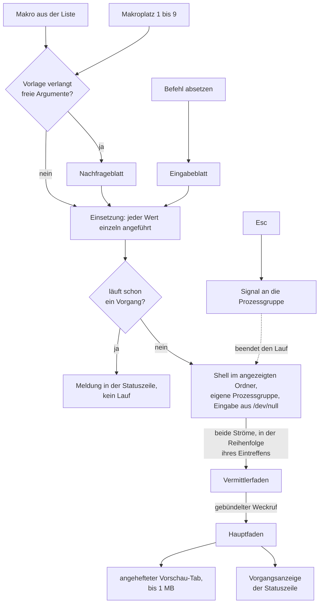

# Spec: Befehle absetzen und Makros speichern

**Datum:** 2026-08-16
**Status:** Entwurf
**Quelle:** „Bash-Befehle absetzen und Makros speichern und ausführen." Die Beispiele des Nutzers: alle Dateien nach einem Muster auflisten, ein Replace-Skript im Baum mit Argumenten rufen, git-Befehle, eine Kommandozeilenanwendung starten, etwa `fusion`.
**Grundlage:** `shared/consult/260815-1354-befehlslauf-und-makros-in-krk.md`, vollständig gelesen, samt ihrer Quellenliste.
**Baumstand:** `627b5f4`, Version 0.5.0, gelesen am 260816.
**Ablage:** Dieser Spec entsteht ohne aktiven Circle und liegt deshalb im gemeinsamen Speicher. Der Circle der zwölften Runde nimmt ihn über sein Feld `Active spec/plan:` an.

## Directive

Wer in KRK einen Befehl absetzen will, öffnet ein Blatt, tippt ihn und sieht seine Ausgabe fortlaufend in einem angehefteten Vorschau-Tab, während die Statuszeile den laufenden Vorgang trägt und `Esc` ihn abbricht. Häufig gebrauchte Befehle stehen als benannte Vorlagen in einer von Hand gepflegten Makrodatei, mit Platzhaltern für den angezeigten Ordner, den Ordner der anderen Seite, die ausgewählten Einträge und den Eintrag unter dem Cursor; gestartet werden sie aus einer Liste oder über einen von neun Plätzen der Tastenbelegung, und freie Argumente fragt KRK vorher nach. Ein eingebautes Terminal entsteht dabei nicht.

## Was der Nutzer am 260816 entschieden hat

Elf Festlegungen stehen vor diesem Spec. Sie sind hier eingearbeitet und nicht neu verhandelt.

**Die Umgebung des Laufs kommt aus der Anmeldeshell, einmal beim Start erfragt.** KRK fragt die Anmeldeshell beim Start nach ihrem `PATH` und benutzt diesen für jeden Lauf der Sitzung. Die Abfrage läuft nebenher: das Fenster steht, ohne auf ihre Antwort zu warten, und ein Befehl in der ersten Sekunde wartet kurz auf sie. Damit findet ein Makro auch ein Werkzeug aus `~/.local/bin`, das eine Shell ohne geladenes Profil nicht fände. Die Kehrseite ist eine Zusage dieses Specs und keine Auslassung: ein Werkzeug, das nach dem Start installiert wird, findet KRK erst nach einem Neustart.

**Beide Ausgabeströme stehen zusammen in der Vorschau, in der Reihenfolge ihres Eintreffens.** Eine getrennte Fläche für die Fehlerausgabe entsteht nicht. Der Rückgabewert erscheint in der Statuszeile, wenn er nicht null ist; ein Ende mit null meldet sie ohne Zahl.

**Die Makros werden von Hand gepflegt, und KRK schreibt ihre Datei nie.** Dazu kommen zwei Befehle, „Makrodatei im Editor öffnen" und „Makros neu einlesen". Eine Oberfläche zum Anlegen oder Ändern von Makros entsteht nicht, und damit behält die Datei ihre Kommentare, wie `settings.toml` sie behält.

**Es läuft genau ein Vorgang, gleich welcher Art.** Ein Befehl, der starten will, während eine Dateioperation läuft, wird mit einer Meldung abgewiesen, und ebenso umgekehrt.

**Ein Vorschau-Tab kann angeheftet sein.** Ein Lauf heftet den Tab an, in den er schreibt; die Dateivorschau schreibt dann in den nächsten nicht angehefteten. Die eine Regel des Modulkopfs von `vorschaumodell.rs` wird dafür umformuliert und nicht gebrochen.

**Die Anzeige nimmt 1 MB, der Lauf läuft trotzdem zu Ende.** Was darüber hinaus anfällt, wird verworfen, und die Statuszeile weist es aus. `Esc` bricht jederzeit ab.

**Der Abbruch trifft die ganze Prozessgruppe.** Der Lauf bekommt eine eigene Prozessgruppe, und das Signal geht an die Gruppe. `killpg(2)` wird damit die sechste Schnittstelle in `crates/krk-core/src/verzeichnis/sys.rs`.

**Die neun Makroplätze stehen in einem neuen, zehnten Funktionsbereich „Makros".** Er bringt ein zehntes Obermenü mit dreizehn Einträgen mit, und `Kommando` wächst von 79 auf 92 Varianten.

**Eine fehlerhafte Makrodatei kostet beim Neu-Einlesen nichts.** Der zuletzt gelesene Makrosatz bleibt stehen, die Statuszeile meldet den Fehler, und nichts wird beiseitegelegt. Beim Start dagegen gilt der Weg jeder Ablagedatei: die Auslieferungsmakros greifen, der gelesene Text wird über `atomar::beiseitepfad` danebengelegt, und die Statuszeile benennt die zur Seite gelegte Datei.

**Gegen Farbfolgen wirken zwei Maßnahmen und nicht eine.** Die Umgebung des Laufs trägt `NO_COLOR=1` und `TERM=dumb`, und ein Filter nimmt die gängigen Farbfolgen aus der Ausgabe. Der Filter ist eine reine Funktion mit Proben. Die Beratung hat den Filter als `inference:` geführt und ungeprüft gelassen; der Nutzer hat beide Maßnahmen bestellt, weil die erste allein von der Höflichkeit des gerufenen Werkzeugs abhängt.

## Der Weg vom Tastendruck zur Ausgabe

Drei Auslöser münden in denselben Lauf, und das ist der Zuschnitt dieser Runde: die Einsetzung, der Start, die Anzeige und der Abbruch stehen je einmal da und nicht dreimal.

Die eine Kante, die gegen die Richtung läuft, ist der Abbruch. Sie ist kein Kreis im Entwurf, sondern der Rückweg vom Nutzer zum Unterprozess, und sie hat ihre Vorlage im Abbruchgriff der Dateioperationen.

Zwei Vorlagen tragen dieses Bild, und beide stehen im Baum. Den Lauf trägt der Vermittlerfaden der Dateioperationen (`crates/krk-ui/src/kommandos/operationen.rs`, Modulkopf): ein Arbeitsfaden meldet über einen Kanal, der Vermittler setzt einen gebündelten Weckruf ab, der Hauptfaden liest den Stand und zeichnet. Die Anzeige trägt `Vorschaumodell::zwischenablage_anzeigen` (`crates/krk-ui/src/vorschaumodell.rs:434`), das schon heute etwas in einen Tab schreibt, das keine Datei ist. Die Verbindung der beiden ist das Neue dieser Runde.

## Welcher Tab die Ausgabe nimmt

Die Regel des Modulkopfs lautet heute: jede Quelle schreibt in den aktiven Tab und in keinen anderen. Sie bekommt einen Zusatz und behält ihre Form.

| Quelle | Aktiver Tab nicht angeheftet | Aktiver Tab angeheftet |
|---|---|---|
| Datei aus dem Dateifenster | schreibt in den aktiven Tab | schreibt in den nächsten nicht angehefteten, sonst in einen neuen |
| Zwischenablage | schreibt in den aktiven Tab | schreibt in den nächsten nicht angehefteten, sonst in einen neuen |
| Befehlsausgabe | heftet den aktiven Tab an und schreibt hinein | schreibt in den angehefteten Tab und ersetzt seinen Inhalt |

**Es gibt höchstens einen angehefteten Tab, und er gehört dem Befehlslauf.** Daraus folgt die Vollständigkeit der Tabelle: für die Befehlsausgabe ist der angeheftete Tab immer ihr eigener, und keine andere Quelle erreicht ihn. Die Marke fällt mit dem Tab, also mit dem Schließen; ein eigener Befehl zum Lösen entsteht nicht, weil es nichts zu lösen gibt, was das Schließen nicht schon erledigt.

Der Preis dieser Wahl gehört dazu: **die Ausgabe eines Laufs überlebt den nächsten Lauf nicht.** Wer sie behalten will, kopiert sie heraus oder leitet sie im Befehl selbst in eine Datei. Die Gegenvariante, ein neuer angehefteter Tab je Lauf, ließe die Tab-Leiste mit jedem Befehl wachsen und verlangte einen zweiten Befehl zum Lösen der Marke; sie ist bewusst nicht gewählt.

## Fähigkeiten

**Der Spec führt 54 Abnahmekriterien.** Je Fähigkeit: C1 achtzehn, C2 dreizehn, C3 zehn, C4 elf, zusammen 52, dazu die zwei aus `## Verhältnis zu den zehn Zeitzusagen aus C8 der Runde 1`. Die Datei trägt kein weiteres Kästchen: `## Ausstehende Nutzerentscheidungen` ist leer, und ein Zählweg über alle Kästchen kommt deshalb auf dieselben 54.

Die vier Fähigkeiten sind in dieser Reihenfolge zu bauen. Nach C1 allein ist die Runde schon brauchbar.

### C1: Ein Befehl läuft und seine Ausgabe erscheint

**Beschreibung:** Der Nutzer ruft „Befehl absetzen", tippt in ein Blatt eine Befehlszeile und bestätigt. Der Text läuft durch eine Shell im angezeigten Ordner des aktiven Dateifensters. Die Ausgabe erscheint fortlaufend in einem angehefteten Vorschau-Tab, die Statuszeile trägt den Vorgang, `Esc` bricht ab.

**Abnahmekriterien:**
- [ ] C1.1: Der Befehl „Befehl absetzen" öffnet ein Blatt mit einem einzeiligen Eingabefeld. Die Eingabetaste startet den Lauf, `Esc` schließt das Blatt, ohne etwas zu starten.
- [ ] C1.2: Der Lauf geht durch eine Shell. Namensausdehnung, Röhren und Verkettungen wirken: `ls *.rs | wc -l` liefert eine Zahl, `false && echo nein || echo ja` liefert `ja`.
- [ ] C1.3: Das Arbeitsverzeichnis ist der angezeigte Ordner des aktiven Dateifensters, derselbe, den `Ctrl+O` an das Terminal übergibt. `pwd` gibt ihn aus.
- [ ] C1.4: Die Ausgabe erscheint fortlaufend und nicht erst am Ende. Bei `for i in 1 2 3 4 5; do echo $i; sleep 1; done` steht die erste Zeile spätestens zwei Sekunden nach dem Start in der Vorschau.
- [ ] C1.5: Standardausgabe und Standardfehlerausgabe erscheinen in derselben Fläche, in der Reihenfolge ihres Eintreffens. Bei `echo eins; echo zwei >&2; echo drei` stehen die drei Zeilen in dieser Folge.
- [ ] C1.6: Endet der Lauf mit dem Rückgabewert null, nennt die Statuszeile das Ende ohne Zahl. Endet er anders, nennt sie den Rückgabewert.
- [ ] C1.7: Die Ausgabefläche folgt dem Ende, solange geschrieben wird. Wer während des Laufs zurückblättert, wird beim nächsten Stapel wieder an das Ende gezogen; das ist die zugesagte Form und keine Ausnahme.
- [ ] C1.8: Die Anzeige nimmt höchstens 1 MB. Die Zahl ist `TEXTGRENZE` aus `crates/krk-ui/src/vorschaumodell.rs:121` und keine neue. Was darüber hinaus anfällt, wird verworfen, der Lauf läuft zu Ende, und die Statuszeile weist die Kürzung aus.
- [ ] C1.9: `Esc` bricht den Lauf ab, auch während das Eingabeblatt schon geschlossen ist und die Ausgabe fließt. Die Statuszeile nennt den Abbruch.
- [ ] C1.10: Der Abbruch trifft die ganze Prozessgruppe. Nach dem Abbruch von `sleep 300 & sleep 300` lebt kein Kindprozess des Laufs mehr; nachprüfbar mit `ps`.
- [ ] C1.11: Die Standardeingabe des Laufs kommt aus `/dev/null`. `read x` endet sofort mit einem Fehler statt zu warten, und `cat` liefert nichts und endet.
- [ ] C1.12: Die Umgebung des Laufs trägt `NO_COLOR=1` und `TERM=dumb`. `env | grep -c '^NO_COLOR=1$'` liefert `1`.
- [ ] C1.13: Ein Filter nimmt die gängigen Farb- und Bildschirmsteuerfolgen aus der Ausgabe. Eine Ausgabe mit `\033[31mrot\033[0m` erscheint als `rot` und ohne Zeichenmüll. Der Filter ist eine reine Funktion und trägt eigene Proben, darunter eine Folge, die über die Grenze zweier Lesestapel zerfällt.
- [ ] C1.14: Der laufende Stand steht in der Vorgangsanzeige der Statuszeile, also im zweiten Rang, und zwar in der Statuszeile des Dateifensters, das den Lauf begonnen hat. Ein siebter Rang entsteht nicht.
- [ ] C1.15: Es läuft genau ein Vorgang. Ein Befehl, der während einer laufenden Kopie startet, wird mit einer Meldung in der Statuszeile abgewiesen und startet nicht; eine Kopie, die während eines laufenden Befehls startet, ebenso.
- [ ] C1.16: Der `PATH` des Laufs stammt aus der Anmeldeshell. Ein Werkzeug, das allein über deren Profil erreichbar ist, etwa aus `~/.local/bin`, wird gefunden.
- [ ] C1.17: Das Fenster wartet beim Start nicht auf die `PATH`-Antwort. Ein Befehl, der in der ersten Sekunde abgesetzt wird, wartet kurz auf sie und scheitert nicht daran.
- [ ] C1.18: Der Lauf schreibt in einen angehefteten Vorschau-Tab nach der Tabelle unter `## Welcher Tab die Ausgabe nimmt`. Ein Wechsel der Auswahl im Dateifenster überschreibt die Ausgabe nicht. Der Tab trägt als Titel den abgesetzten Befehl.

### C2: Die Makros stehen in der siebten Ablagedatei

**Beschreibung:** Eine siebte Datei unter `~/Library/Application Support/KRK/` führt die Makros: je Eintrag ein Name und ein Befehlstext, dazu Platzhalter für den angezeigten Ordner, den Ordner der anderen Seite, die ausgewählten Einträge und den Eintrag unter dem Cursor. Der Nutzer pflegt sie von Hand, KRK liest sie.

**Abnahmekriterien:**
- [ ] C2.1: Die Datei heißt `macros.toml` und liegt neben den sechs vorhandenen. `Datei` und `Datei::ALLE` in `crates/krk-core/src/ablage/pfade.rs` führen sie, und die vollständige Fallunterscheidung `Datei::format` bekommt ihre Zeile. Jede Prosastelle, die heute sechs Ablagedateien nennt, nennt danach sieben.
- [ ] C2.2: Sie entsteht beim ersten Start wörtlich aus einer eingebetteten, kommentierten Auslieferungsfassung, wie `settings.toml`. Die Kommentare erklären die Platzhalter und die Anführungsregel.
- [ ] C2.3: KRK schreibt die Datei nach ihrer Anlage nie. Kein Befehl, kein Beenden und kein Neu-Einlesen ändert eine Zeile darin.
- [ ] C2.4: Ein Eintrag trägt einen Namen und einen Befehlstext. Der Name erscheint in der Auswahlliste und in der Statuszeile, der Befehlstext läuft.
- [ ] C2.5: Vier Platzhalter tragen den Zusammenhang: der angezeigte Ordner, der angezeigte Ordner der anderen Seite, die ausgewählten Einträge und der Eintrag unter dem Cursor.
- [ ] C2.6: Jeder eingesetzte Wert wird in Einzelanführung gesetzt, und ein Anführungszeichen im Wert wird verdoppelt. Ein Dateiname mit Leerzeichen, mit `'`, mit `$`, mit einem Rückwärtsstrich und mit einem Zeilenumbruch kommt bei `printf '%s\n'` als genau ein Wert an.
- [ ] C2.7: Mehrere ausgewählte Einträge werden als mehrere je einzeln angeführte Werte eingesetzt, durch Leerzeichen getrennt. Bei drei markierten Dateien zählt `printf '%s\n' {auswahl} | wc -l` drei.
- [ ] C2.8: Ein Makro, dessen Vorlage die Auswahl oder den Eintrag unter dem Cursor verlangt und nichts vorfindet, läuft nicht. Die Statuszeile sagt es, nach dem Muster von `nichts_zu_kopieren` und `nichts_zu_teilen` in `crates/krk-ui/src/kommandos/operationen.rs`.
- [ ] C2.9: Der Befehlstext selbst bleibt ungeprüft und ungedeutet. KRK sagt nicht voraus, was ein Makro anfassen wird, und weist keines wegen seines Inhalts ab.
- [ ] C2.10: Ersetzt wird ausschließlich, was KRK benannt kennt: die vier Platzhalter aus C2.5 und die in diesem Eintrag erklärten freien Argumente. Jede andere geschweifte Klammer bleibt stehen. `awk '{print $1}'` läuft unverändert.
- [ ] C2.11: Der Befehl „Makrodatei im Editor öffnen" öffnet `macros.toml` im eingebauten Editor. Ist sie noch nicht angelegt, entsteht sie zuerst aus der Auslieferungsfassung.
- [ ] C2.12: Der Befehl „Makros neu einlesen" liest die Datei neu. Ist sie fehlerhaft, bleibt der zuletzt gelesene Makrosatz stehen, die Statuszeile meldet den Fehler mit Zeilenangabe, und nichts wird beiseitegelegt.
- [ ] C2.13: Ist die Datei beim Start fehlerhaft, greifen die Auslieferungsmakros, der gelesene Text liegt danach unter `macros.toml.beschaedigt`, und die Statuszeile benennt diese Datei. Steht dort schon etwas, bleibt die erste beiseitegelegte Fassung stehen; das ist der Weg aus `crates/krk-core/src/ablage/atomar.rs`, `beiseitepfad`.

### C3: Ein Makro wird aus der Liste gewählt und gestartet

**Beschreibung:** Ein Befehl öffnet ein Blatt mit der Liste der Makros. Der Nutzer wählt einen Eintrag und startet ihn. Verlangt die Vorlage freie Argumente, fragt KRK sie vorher nach.

**Abnahmekriterien:**
- [ ] C3.1: Der Befehl „Makros" öffnet ein Blatt mit der Liste der Makros, je Zeile der Name und der Befehlstext.
- [ ] C3.2: Die Auswahl bewegt sich mit den Pfeiltasten, die Eingabetaste startet, `Esc` schließt das Blatt ohne Lauf.
- [ ] C3.3: Ist die Makrodatei leer oder führt sie keinen Eintrag, sagt das Blatt es in einem Satz und nennt den Befehl „Makrodatei im Editor öffnen" als Weg dorthin.
- [ ] C3.4: Verlangt die gewählte Vorlage freie Argumente, öffnet sich ein zweites Blatt und fragt sie nach, eines je erklärtem Argument, mit dessen Beschriftung. Erst danach beginnt der Lauf.
- [ ] C3.5: Das Nachfrageblatt nennt den Namen des Makros, damit die Frage für sich steht.
- [ ] C3.6: `Esc` im Nachfrageblatt bricht ab, ohne etwas zu starten.
- [ ] C3.7: Ein freies Argument wird nach derselben Regel eingesetzt wie ein Dateiname, also einzeln angeführt mit verdoppeltem Anführungszeichen. Ein Argument mit einem Leerzeichen kommt als ein Wert an.
- [ ] C3.8: Ein leer gelassenes freies Argument wird als leerer Wert eingesetzt und weist den Lauf nicht ab. Wer ein Argument nicht nennen will, bricht mit `Esc` ab.
- [ ] C3.9: Der gestartete Lauf verhält sich in jeder Hinsicht wie C1: dieselbe Anzeige, dieselbe Grenze, dieselbe Umgebung, derselbe Abbruch, dieselbe Abweisung bei einem laufenden Vorgang.
- [ ] C3.10: Die Statuszeile nennt beim Start den Namen des Makros, und der Titel des Vorschau-Tabs trägt ihn ebenfalls.

### C4: Neun Plätze in der Tastenbelegung und ein zehntes Obermenü

**Beschreibung:** Neun nummerierte Plätze machen ein Makro über eine Taste erreichbar. Sie stehen mit den vier übrigen Befehlen dieser Runde in einem neuen Funktionsbereich „Makros", der als zehntes Obermenü erscheint.

**Abnahmekriterien:**
- [ ] C4.1: `resources/default-keymap.toml` führt neun Funktionen „Makro 1" bis „Makro 9", jede mit **leerer Tastenliste** und nicht mit `reserviert_fuer`. Das ist die Form der drei Spaltenschalter und des Schalters „Deep".
- [ ] C4.2: Der Name eines Platzes ist statisch und steht in der Belegungsdatei. Den Namen des hinterlegten Makros zeigen das Auswahlblatt und die Statuszeile, nicht die Belegungsansicht.
- [ ] C4.3: Welches Makro auf welchem Platz liegt, sagt die Makrodatei über ein Feld am Eintrag. Zwei Einträge auf demselben Platz sind ein Fehler der Datei und werden wie jeder andere behandelt (C2.12, C2.13).
- [ ] C4.4: Ein Platz ohne hinterlegtes Makro ist im Hauptmenü ausgegraut, und eine ihm zugewiesene Taste löst nichts aus. Beide Antworten kommen aus derselben Stelle wie heute, `crates/krk-ui/src/kommandos/zulaessigkeit.rs`, damit der Menüeintrag und der Tastendruck nicht auseinanderlaufen können.
- [ ] C4.5: `Funktionsbereich` in `crates/krk-ui/src/belegungsmodell.rs` trägt einen zehnten Wert „Makros". Alle drei Abnehmer der einen Gliederung zeigen ihn: die Belegungsansicht, die Markdown-Ausgabe der Runde 3 und das Hauptmenü.
- [ ] C4.6: Das Hauptmenü trägt ein zehntes Obermenü „Makros" mit dreizehn Einträgen: „Befehl absetzen", „Makros", „Makrodatei im Editor öffnen", „Makros neu einlesen" und die neun Plätze. Es entsteht aus dem zehnten Funktionsbereich und aus keiner zweiten Tabelle.
- [ ] C4.7: `Kommando` in `crates/krk-core/src/tasten/belegung.rs` wächst von 79 auf 92 Varianten. Jede neue trägt ihre Zeile in `Kommando::wirkungsbereich` und in `bereich_des_kommandos`; der Bau hält an, solange eine fehlt.
- [ ] C4.8: Ein Platz ohne zugewiesene Kombination steht **nicht** in der Markdown-Ausgabe der Runde 3, weil diese Ausgabe nur Funktionen mit Kombination führt. Ausgeliefert sind das alle neun. Das ist die bekannte Nebenwirkung der leeren Tastenliste, und sie ist hier genannt statt später gefunden.
- [ ] C4.9: Eine vom Nutzer zugewiesene Kombination startet das hinterlegte Makro ohne Zwischenblatt. Verlangt die Vorlage freie Argumente, kommt die Nachfrage aus C3.4.
- [ ] C4.10: Nach „Makros neu einlesen" wirkt eine geänderte Platzzuordnung sofort, ohne Neustart.
- [ ] C4.11: Der Kopf von `resources/default-keymap.toml` nennt danach die richtige Zahl der ausgelieferten Funktionen. Heute stehen dort 85 Funktionen mit 90 Kombinationen; nach dieser Runde sind es 98 Funktionen mit unverändert 90 Kombinationen.

## Verhältnis zu den zehn Zeitzusagen aus C8 der Runde 1

**Diese Runde setzt keine eigene Zeitzusage, und sie ändert keine der zehn.** Eine elfte Zahl entsteht nicht.

**Keine der zehn Zusagen deckt den Befehlslauf.** L8 misst die Spanne von einer gestarteten Kopie bis zum Fortschritt in der Statuszeile, L9 einen Tastendruck während einer laufenden Kopie. Ein Befehlslauf ist keine Kopie, und beide Zahlen greifen für ihn nicht. Ihn unter L8 zu ziehen hieße, die Startzeit eines fremden Prozesses in eine Zusage über KRK aufzunehmen; was `git status` in einem großen Baum braucht, entscheidet nicht KRK.

**Der Sockel ist alt, und diese Runde vergrößert den Abstand.** Der letzte vollständige Abnahmelauf stammt vom 260810 (`messungen/260810-1918-alle-zusagen.txt`, alle zehn halten in fünf Durchgängen) und liegt vor den Runden 5 bis 11. Diese Runde ist die achte, die seither gebaut wird, ohne dass eine von ihnen gegen die zehn Zahlen gemessen wäre.

**Ein belegter Präzedenzfall gehört hierher, und er trifft genau die Stelle, die diese Runde anfasst.** Die Closure Note der Runde 1 nennt `9a47c4a` als einen von drei Commits, die eine Messreihe altern ließen, und der Grund war eine Erweiterung der Kommando-Aufzählung, durch die jeder Tastendruck läuft. Diese Runde erweitert dieselbe Aufzählung um dreizehn Varianten, von 79 auf 92. **Der Effekt ist vermutlich klein, und gemessen ist er nicht.** Er steht hier, damit die nächste Messrunde weiß, was seit dem 260810 dazugekommen ist.

**Was an die Stelle einer Zahl tritt, sind zwei ohne Messstrecke prüfbare Kriterien.** Sie sind Teil der Abnahme dieser Runde.

- [ ] Während ein Befehl läuft, bleiben beide Dateifenster, die Lesezeichenleiste, die Bereichsleiste und das Vorschaufenster bedienbar. Die Auswahl bewegt sich, ein Tabwechsel geschieht, und die Anwendung hält nicht an.
- [ ] Keine der zehn Zahlen aus C8 der Runde 1 wird durch diese Runde geändert, gelockert oder umgedeutet. Insbesondere bleibt L4 unberührt: die `PATH`-Abfrage läuft nebenher, und das Fenster wartet nicht auf ihre Antwort.

**Was diese Wahl kostet, steht hier, statt kleingeredet zu werden.** Die Spanne vom Tastendruck bis zur ersten sichtbaren Ausgabezeile ist nirgends zugesagt, und eine spätere Verschlechterung fällt niemandem auf. Der Befehlslauf gehört damit auf die Liste für die spätere Messrunde. Zwei Gegenstände stehen schon darauf: die Geschwindigkeit der Syntaxhervorhebung aus C3 der Runde 2, auf dem Referenzgerät weiterhin ungemessen, und der Inhaltsdurchlauf der Runde 11. Eine Zahl steht hier nicht, weil die Liste zwischen den Runden wächst und die drei übrigen Gegenstände der Runde 2 mit dem Lauf vom 260810 erledigt sind.

## Abgeleitet und nicht gefragt

Diese Punkte folgen aus dem Baum und aus den elf Antworten. Sie sind benannt, damit sie am Gate widersprechbar sind, statt unbemerkt zu gelten.

**Die dreizehn neuen Befehle tragen `Wirkungsbereich::Ueberall`.** Der Lauf wirkt auf den angezeigten Ordner des **aktiven** Dateifensters, und der ist unabhängig davon, wo der Fokus gerade steht. Das ist genau die Begründung, die `Anwendungsdelegierter::abbrechen` für `Kommando::Abbrechen` schon trägt (`crates/krk-ui/src/appkit/anwendung.rs:4608-4615`): ein Wirkungsbereich, der den Fokus verlangte, machte die Taste davon abhängig, wo die Schreibmarke steht.

**`Esc` bekommt keine neue Bedeutung.** Der Abbruch hat heute drei Ränge: ein stehendes Blatt schließen, einen laufenden Vorgang abbrechen, den Filtertext leeren. Ein Befehlslauf **ist** ein laufender Vorgang und fällt damit in den zweiten Rang, ohne dass ein vierter entstünde. Die offene Frage der Runde 10 zur Stellung des Filtertexts in dieser Folge bleibt davon unberührt.

**Ein freies Argument wird im Eintrag erklärt und nicht erraten.** Ersetzt wird nur, was KRK benannt kennt. Der Grund ist am Beispiel entscheidbar: `awk '{print $1}'` trägt eine geschweifte Klammer, die kein Platzhalter ist, und eine Regel „jede unbekannte Klammer ist ein freies Argument" fragte den Nutzer nach einem Argument namens `print $1`. Die Erklärung im Eintrag kostet eine Zeile in der Makrodatei und macht die Frage entscheidbar.

**Der Ausgabe-Tab trägt keinen Pfad und gilt nicht als angezeigte Datei.** Er verhält sich darin wie der Tab der Zwischenablage: `crates/krk-ui/src/angezeigtedatei.rs` lässt einen Tab ohne Pfad herausfallen, und der Übergang in den Editor greift aus ihm nichts.

**Der offene Defekt zur Belegung trifft diese Runde nicht.** `shared/issues/260814-0656_o_eine-neue-funktion-kommt-bei-jedem-nutzer-mit-eigener-keymap-unbelegt-an.md` beschreibt, dass eine neu ausgelieferte Funktion beim Nutzer ohne ihre Kombinationen ankommt. Alle dreizehn Funktionen dieser Runde werden ohnehin ohne Kombination ausgeliefert, also geht nichts verloren. Der Defekt bleibt offen und bindet die nächste Runde, die eine belegte Funktion hinzufügt.

**Die Endmeldung ist eine Befehlsantwort, der laufende Stand eine Vorgangsanzeige.** Beide Ränge stehen schon; ein Abschlussblatt entsteht für den Befehlslauf nicht, anders als bei den Dateioperationen mit ihrer Abschlussliste.

## Was der Befehlslauf nicht kann, als Zusage und nicht als Auslassung

Drei Grenzen sind bekannt, bevor die Runde beginnt. Sie stehen hier, damit sie später nicht als Defekt erscheinen.

**Ein Befehl, der auf eine Eingabe wartet, endet sofort mit einem Fehler.** Die Standardeingabe kommt aus `/dev/null`. `sudo` ohne zwischengespeicherte Berechtigung, eine Passwortabfrage und `git commit` ohne `-m` scheitern damit, statt zu hängen. Für Werkzeuge, die selbst die Tastatur führen, bleibt `Ctrl+O` und das Terminal des Nutzers.

**Ein Werkzeug, das nach dem Start von KRK installiert wird, findet der Lauf erst nach einem Neustart.** Der `PATH` wird einmal beim Start erfragt.

**Über 1 MB Ausgabe sieht der Nutzer nicht.** Der Lauf läuft zu Ende, die Statuszeile weist die Kürzung aus, und wer alles braucht, leitet im Befehl selbst in eine Datei um.

## Berührte Abgrenzungen und offene Fragen

**„KRK als Kommandozentrale für Fusion" bleibt außerhalb.** Die Runde 1 führt diesen Punkt unter `## Ausdrücklich außerhalb dieses Circles`. Er bindet diese Runde nicht, und diese Runde hebt ihn nicht auf. Sie bewegt sich sichtbar in seine Richtung, denn ein Makro kann jedes Kommandozeilenwerkzeug rufen, `fusion` eingeschlossen. Was hier entsteht, ist ein Weg, einen Befehl abzusetzen, und keine Kenntnis von irgendeinem Werkzeug: KRK kennt kein Fusion, keine Circles und keine Marker, und keine Zeile dieser Runde nennt eines davon.

**Die offene Frage nach der Zahl der Obermenüs wird faktisch beantwortet und nicht geschlossen.** `shared/decisions/260813-0053_o_wie-viele-obermenues-traegt-die-menueleiste-fuer-81-funktionen.md` steht offen und empfiehlt Möglichkeit 1, ein Obermenü je Funktionsbereich. Diese Runde baut ein zehntes Obermenü und folgt damit der Empfehlung. **Sie schließt den Datensatz nicht**; das bleibt dem Nutzer, und wer ihn später anders beantwortet, ordnet auch dieses Obermenü neu ein.

**Diese Runde läuft bewusst vor dem vorgesehenen Circle `circles/260804-0933-eingebauter-web-betrachter-im-vorschaufenster`.** Beide greifen dieselbe Fläche an, die Tabs des Vorschaufensters. Die Befehlsausgabe ist die dritte fremde Quelle nach der Datei und der Zwischenablage, und sie legt mit der Anheftung die Regel fest, nach der eine fremde Quelle in einen Vorschau-Tab schreibt. Der Web-Betrachter wäre die vierte nach derselben Regel und erbt die Anheftbarkeit, statt eine eigene Ausnahme zu brauchen.

## Nicht Gegenstand dieser Runde

- **Ein eingebautes Terminal.** Für Werkzeuge, die selbst die Tastatur führen, bleibt `Ctrl+O`, das den angezeigten Ordner an Ghostty oder Terminal übergibt. Eine Eingabe in einen laufenden Befehl gibt es nicht.
- **Ein sechster Bereich der Fensterzeile.** Er zöge `Bereich`, `Fokus`, `Wirkungsbereich` und die proportionale Breitenregel der Runde 5 nach sich, und die Vorschau leistet dasselbe ohne eine dieser vier Änderungen.
- **Eine Oberfläche zum Anlegen oder Ändern von Makros.** Sie brauchte einen Schreibweg, und ein Schreibweg löschte die Kommentare, die den Sinn der Datei ausmachen.
- **Jede Prüfung oder Deutung des Makrotexts.** KRK sagt nicht voraus, was ein Befehl anfassen wird. Diese Frage ist aus dem Text nicht entscheidbar, und die entscheidbare Frage, wie ein Wert vollständig angeführt wird, beantwortet C2.6.
- **Die Git-Anbindung.** Ein Makro kann `git` rufen wie jedes andere Werkzeug. Eine Kenntnis von Git in KRK entsteht dabei nicht, und `Kommando` bekommt keine Git-Variante.
- **Eine elfte Zeitzusage.**
- **Eine Verlaufsliste abgesetzter Befehle, eine Ergänzung beim Tippen und ein Befehl „den letzten wiederholen".** Wer einen Befehl zweimal braucht, schreibt ihn als Makro.
- **Mehrere gleichzeitige Läufe.** Es läuft ein Vorgang, gleich welcher Art.
- **Ein zehnter Makroplatz und eine wachsende Zahl von Plätzen.** Neun ist eine gesetzte Obergrenze; jedes weitere Makro bleibt über die Liste erreichbar.
- **Der Abnahmelauf der zehn Zeitzusagen.** Er verlangt KRK im Vordergrund und ist Nutzerarbeit.

## Offen für den Planner

- **Wie der Unterprozess gestartet und abgeholt wird.** Er ist der erste im Produktivcode dieses Baums. Verlangt ist, dass der Hauptfaden nicht wartet, dass die Ausgabe fortlaufend ankommt und dass der Vermittlerfaden der Dateioperationen die Vorlage ist und keine zweite Maschinerie daneben entsteht.
- **Wo `killpg(2)` steht und wie die eigene Prozessgruppe gesetzt wird.** Die Schnittstelle gehört nach `crates/krk-core/src/verzeichnis/sys.rs`, weil es die eine Stelle mit `allow(unsafe_code)` in `krk-core` ist; die Zahl im Modulkopf steigt dabei von fünf auf sechs. Ob das Setzen der Gruppe eine siebte Schnittstelle braucht oder über die vorhandenen Mittel geht, entscheidet der Planner.
- **Welche Shell den Lauf fährt und wie ihr `PATH` erfragt wird.** Verlangt sind C1.2 und C1.16: eine Shell mit Namensausdehnung und Röhren, und ein `PATH`, der die Anmeldeshell des Nutzers wiedergibt.
- **Wo der Filter für die Farbfolgen wohnt und wie er über Lesestapelgrenzen hinweg arbeitet.** Verlangt ist eine reine Funktion mit Proben (C1.13).
- **Wie die Anheftung im `Vorschaumodell` geführt wird** und an welcher Stelle der Modulkopf umformuliert wird. Verlangt ist die Tabelle unter `## Welcher Tab die Ausgabe nimmt` und dass keine zweite Tab-Sorte mit eigener Regel entsteht.
- **Wie die Kenntnis „dieser Platz trägt ein Makro" an `zulaessigkeit::zulaessig` kommt.** Verlangt ist C4.4: eine Frage, zwei Frager, keine zweite Abfrage daneben.
- **Das Format der Makrodatei im Einzelnen**, also die Namen der Felder und der Platzhalter. Verlangt sind C2.4 bis C2.10 und C4.3; die Schreibweise folgt den sechs vorhandenen Ablagedateien.
- **Wo die 1-MB-Grenze der Anzeige geprüft wird.** Verlangt ist C1.8: der Lauf läuft zu Ende, die Kürzung wird ausgewiesen, und die Zahl ist die vorhandene und keine neue.
- **Welche Fallunterscheidungen der Übersetzer einfordert.** Die dreizehn Kommandos brauchen ihre Zeilen in `Kommando::wirkungsbereich` und `bereich_des_kommandos`, die siebte Ablagedatei ihre in `Datei::format`. Was darüber hinaus nötig ist, nennt der Bau genauer als jede Aufstellung hier.

## Ausstehende Nutzerentscheidungen

**Keine.** Die elf Fragen dieser Klärung sind beantwortet und stehen unter `## Was der Nutzer am 260816 entschieden hat`. Was daneben aus dem Baum abgeleitet ist, steht unter `## Abgeleitet und nicht gefragt` und ist am Gate widersprechbar.

Zwei offene Datensätze binden diese Runde, ohne sie aufzuhalten:

- `shared/decisions/260813-0053_o_wie-viele-obermenues-traegt-die-menueleiste-fuer-81-funktionen.md` — die Runde folgt der Empfehlung und schließt den Datensatz nicht.
- `circles/260814-1551-tippen-filtert-dateiliste-flach-und-tief/decisions/260814-1830_o_an-welcher-stelle-der-bedeutungen-von-esc-steht-der-filtertext.md` — die Runde fügt `Esc` keine Bedeutung hinzu und berührt die Frage nicht.
