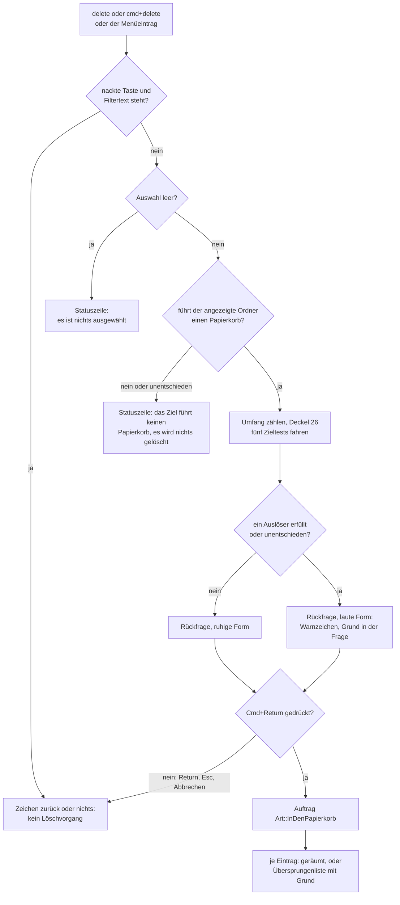

# Spec: Jeder Löschweg führt in den Papierkorb und fragt vorher nach

**Datum:** 2026-08-17
**Status:** Entwurf
**Quelle:** Nutzerwunsch vom 260816-2144 („jede Datei-Löschfunktion wird durch eine Rückfrage gesichert"), nachgeschärft am 260817 („Löschen OHNE Papierkorb wird entfernt: alle Datei/Folder-Löschvorgänge gehen immer in den Papierkorb"), dazu die ergänzende Antwort desselben Tages zu Zielen ohne Papierkorb.
**Baumstand:** `b8e198e`, gelesen am 260817
**Anlass:** der Schadensfall vom 260817-0344. KRK hat den Speicher `fusion-workbench/shared` des eigenen Projektverzeichnisses mit 189 verfolgten Dateien in den Papierkorb geräumt, auf einen Tastendruck, ohne Rückfrage, und vier Stunden unbemerkt. Forensik: `shared/analyses/260817-0419-verlust-des-speichers-shared.md`. Defekt: `shared/issues/260816-2144_*_das-raeumen-in-den-papierkorb-laeuft-ohne-rueckfrage.md`.
**Ablage:** Dieser Spec entsteht ohne Circle im Blick und liegt deshalb im gemeinsamen Speicher. Der Circle dieser Runde nimmt ihn über sein Feld `Active spec/plan:` an.
**Nachgezogen am 260817** nach der Abnahme. Der Nutzer hat dabei die drei offenen Fragen beantwortet, und eine der drei Antworten dreht eine frühere Festlegung um. Betroffen sind der Abschnitt `## Was der Nutzer entschieden hat`, C3, C5, die Kalibrierung zum Vorfall, die Abgrenzung und der Abschnitt der ausstehenden Entscheidungen, der danach leer ist. Alles Übrige steht unverändert.

## Directive

KRK kennt nach dieser Runde genau einen Löschweg, und er führt in den Papierkorb des Systems. Jeder Datei- und Ordner-Löschvorgang fragt vorher genau einmal nach, mit „Abbrechen" vorbelegt; wo das Ziel für den Nutzer, für seine Daten oder für den Umfang des Vorgangs ungewöhnlich ist, trägt dieselbe Rückfrage ein Warnzeichen und nennt den Grund in ihrer ersten Zeile. Ein Ziel ohne Papierkorb wird nicht gelöscht, sondern gemeldet. Der Befehl zum endgültigen Löschen fällt aus der Anwendung, aus der Belegung und aus dem Menü.

## Die vier Zusagen, die aus den Grenzen dieser Runde folgen

Sie stehen hier vorn und nicht am Ende, weil jede von ihnen eine Eigenschaft beschreibt, die der Nutzer bewusst gewählt hat und die eine spätere Runde nicht versehentlich zurücknehmen soll.

**Es gibt keinen Weg durch KRK zum unwiederbringlichen Löschen.** Der Nutzer hat diese Zusage der Alternative ausdrücklich vorgezogen, den endgültigen Codeweg für Sonderfälle zu behalten. Sie gilt für jeden Befehl, den der Nutzer auslöst. Zwei Stellen im Kern entfernen weiterhin Bäume ohne Papierkorb, und sie sind kein Löschbefehl: das Ersetzen eines vorhandenen Ziels nach der Konfliktantwort „Überschreiben" und das Verschieben über eine Datenträgergrenze, das nach dem Kopieren die Quelle wegräumt. Beide laufen über `krk_core::operation::loeschen::baum_entfernen` und behalten ihre zwei Aufrufer. Wer die Zusage prüft, prüft sie an den Befehlen und nicht an dieser Funktion; wer sie ausweitet, hat das Kopieren und das Verschieben mit abgeschafft.

**Ein Ziel ohne Papierkorb wird nicht gelöscht.** `trashItemAtURL:` scheitert auf Datenträgern ohne Papierkorb und auf manchen Netzlaufwerken. KRK meldet dort in der Statuszeile, dass das Ziel keinen Papierkorb führt, und beginnt den Vorgang gar nicht erst. Wer dort löschen will, nimmt den Finder. Der Preis ist benannt und angenommen: auf solchen Zielen kann KRK nach dieser Runde nicht mehr löschen.

**Unentschieden gilt als laut.** Lässt sich eine der Prüfungen an einem Ziel nicht beantworten, etwa weil ein Pfad sich nicht auflösen oder ein Datenträger sich nicht einordnen lässt, gilt das Ziel als warnwürdig und die Rückfrage nimmt ihre laute Form an. Eine Prüfung, die im Zweifel schweigt, wäre in genau den Lagen still, in denen KRK am wenigsten über das Ziel weiß.

**Zwei Klassen von Zielen sind nicht entscheidbar, und KRK behauptet nicht, sie zu erkennen.** „Clouddrive" ist als Klasse nicht entscheidbar: ein Ordner, der von einem fremden Programm synchronisiert wird, sieht im Dateisystem aus wie jeder andere, und die Zahl der Anbieter ist nicht abgeschlossen. Entscheidbar sind benannte Orte, und genau die prüft KRK: `~/Library/CloudStorage/` und `~/Library/Mobile Documents`. „Gesharte Verzeichnisse" zerfällt in drei verschiedene Dinge, von denen nur eines sauber entscheidbar ist: ein eingehängtes Netzlaufwerk (entscheidbar), ein lokaler Ordner, den der Nutzer über die Systemeinstellungen freigegeben hat (nicht am Pfad ablesbar), und ein Ordner, den ein Synchronisationsdienst mit anderen teilt (dasselbe Problem wie bei „Clouddrive"). KRK prüft das Netzlaufwerk und schweigt über die beiden anderen, statt sie zu raten.

## Was der Nutzer entschieden hat

Zwei Klärungsrunden, eine Verschärfung und drei Antworten bei der Abnahme stehen vor diesem Spec. Die Antworten sind hier eingearbeitet und nicht neu verhandelt. Der tragende Entscheidungsdatensatz ist `shared/decisions/260817-0536_*_wie-wird-jeder-loeschweg-abgesichert-und-faellt-das-endgueltige-loeschen-weg.md`; die drei Antworten der Abnahme tragen eigene Datensätze mit derselben Kennung `260817-0536`.

**Der endgültige Löschweg fällt ganz weg (260817).** Jeder Datei- und Ordner-Löschvorgang geht in den Papierkorb. `Kommando::EndgueltigLoeschen` und `Art::EndgueltigLoeschen` verschwinden.

**Beide Tasten des Papierkorbwegs fragen nach**, `delete` ebenso wie `cmd+delete`, auch bei einer einzelnen Datei. Vorbelegt ist „Abbrechen", die Eingabetaste bricht ab, Cmd+Return räumt weg. Das ist die Belegung, die das heutige Bestätigungsblatt schon trägt.

**Die laute Warnung ist dasselbe Blatt**, mit Warnzeichen, vollem Pfad, Zahl der betroffenen Einträge und dem Grund im Klartext. Eine Bestätigung genügt; den Namen abzutippen verlangt KRK nicht.

**Die Umfangsschwelle liegt bei 25 Einträgen im Unterbaum**, gedeckelt gezählt: KRK zählt höchstens 26 und meldet dann „mehr als 25". Die Warnung nennt die Zahl.

**Vier Zielarten lösen die laute Form aus**, und alle vier sind entscheidbar: außerhalb des Benutzerordners, unmittelbar im Benutzerordner, auf einem Netzlaufwerk, und unter `~/Library/CloudStorage/` oder `~/Library/Mobile Documents`.

**Jeder Löschvorgang innerhalb eines Git-Arbeitsbaums warnt laut** (Abnahme 260817), auch bei wenigen Einträgen. Das ist der fünfte Warngrund. Der Nutzer hat damit seine Festlegung der zweiten Klärungsrunde umgedreht, nach der nur der Ordner gewarnt hätte, der die Verwaltung selbst trägt: die Kalibrierung unten zeigt, dass die enge Form den auslösenden Schadensfall nicht getroffen hätte. Die Prüfung sieht deshalb auch aufwärts. Datensatz: `shared/decisions/260817-0536_*_sieht-die-git-pruefung-nur-den-ordner-selbst-oder-auch-aufwaerts.md`. Was diese Reichweite kostet, steht unter C3 und ist vom Nutzer angenommen.

**`ctrl+delete` bekommt keine Rückfrage** und bleibt wie heute. Der Befehl entfernt einen Eintrag aus der Lesezeichenleiste und keine Datei vom Datenträger; verloren gehen ein Name und ein Pfad, keine Daten. Die Frage ist gestellt und so entschieden worden, damit sie nicht als Lücke wiederkehrt.

**Der Warngrund steht in der Frage und nicht in der Erläuterung.** Die erste Zeile lautet also „18 Einträge aus einem Cloud-Ordner in den Papierkorb räumen?" und nicht „18 Einträge löschen?" mit dem Grund darunter. Die Erläuterung trägt den Pfad und die Folgen.

**`f8` zeigt künftig auf „In den Papierkorb räumen"** (Abnahme 260817). Die Funktion trägt danach drei Kombinationen, `delete`, `cmd+delete` und `f8`. Die Norton-Reihe behält ihre Löschtaste, und die Zwei-Wege-Zusage aus C3 der Runde 1 bleibt an dieser Stelle gewahrt. `opt+cmd+delete` bleibt unbelegt: die Kombination trägt im Finder die Bedeutung „sofort löschen", und diese Bedeutung hat KRK nach dieser Runde nicht mehr. Datensatz: `shared/decisions/260817-0536_*_bekommt-f8-den-papierkorb-nachdem-das-endgueltige-loeschen-weggefallen-ist.md`.

**Eine gespeicherte `keymap.toml` mit der entfallenen Kennung wird wie heute behandelt** (Abnahme 260817). KRK verwirft die Datei als Ganzes, fällt auf die Auslieferungsbelegung zurück und nennt in der Statuszeile, welche Datei zur Seite gelegt wurde. Ein neuer Sonderweg entsteht nicht, und die Ladelogik wird nicht angefasst. Der Nutzer nimmt den Verlust seiner eigenen Belegung in Kauf; die Runde trägt an dieser Stelle deshalb keinen Planschritt. Datensatz: `shared/decisions/260817-0536_*_was-geschieht-mit-einer-gespeicherten-keymap-die-die-entfallene-funktion-fuehrt.md`.

**Kein Protokoll der Löschvorgänge in dieser Runde.** Es wird ein vorgesehener Circle; der Orchestrator legt ihn an.

## Der eine Löschweg

Der Papierkorbtest steht vor der Rückfrage und nicht hinter ihr. Eine Bestätigung einzuholen und danach zu melden, dass der Vorgang gar nicht möglich ist, wäre die eine Reihenfolge, die dem Nutzer eine Entscheidung abverlangt, die nichts bewirkt.

## Fähigkeiten

### C1: Ein Löschweg, und er führt in den Papierkorb

**Beschreibung:** KRK löscht Dateien und Ordner auf genau einem Weg, dem Papierkorb des Systems. Der Befehl wirkt wie heute auf eine Mehrfachauswahl und auf Ordner mit Inhalt, und der Rückweg ist der Papierkorb; einen eigenen Rückgängig-Speicher führt KRK weiterhin nicht.

**Abnahmekriterien:**
- [ ] Die Belegungsansicht, das Hauptmenü und die Markdown-Ausgabe der Tastenbelegung führen genau eine Löschfunktion für Dateien und Ordner, „In den Papierkorb räumen".
- [ ] Es gibt in der ausgelieferten Belegung keine Tastenkombination, die eine Datei oder einen Ordner ohne Umweg über den Papierkorb entfernt.
- [ ] Ein Ordner mit Inhalt landet mitsamt seinem Inhalt im Papierkorb und lässt sich von dort mit den Mitteln des Systems zurückholen.
- [ ] Eine Auswahl aus mehreren Einträgen wird in einem Vorgang geräumt und erzeugt genau eine Rückfrage.

**Getroffene Festlegungen:**
- Verschieben (`f6`) ist kein Löschbefehl und bekommt nichts. Es verschiebt in das andere Dateifenster; über eine Datenträgergrenze hinweg kopiert es und räumt danach die Quelle weg, und das bleibt unverändert.

### C2: Die Rückfrage vor jedem Räumen

**Beschreibung:** Vor jedem Räumen in den Papierkorb steht genau eine Rückfrage, unabhängig von der Zahl der betroffenen Einträge und unabhängig davon, welche der beiden Tasten den Befehl ausgelöst hat. Sie ist ein Blatt am Fenster, wie die Rückfrage vor dem endgültigen Löschen es bisher war, und sie ist dasselbe Blatt in ruhiger und in lauter Form.

**Abnahmekriterien:**
- [ ] `delete` bei stehender Auswahl und ohne Filtertext zeigt die Rückfrage, statt sofort zu räumen. Dasselbe gilt für `cmd+delete` und für den Menüeintrag „In den Papierkorb räumen".
- [ ] Die Rückfrage erscheint genau einmal je Vorgang, auch wenn dreißig Einträge markiert sind.
- [ ] Die Rückfrage erscheint auch bei genau einem ausgewählten Eintrag.
- [ ] „Abbrechen" ist die vorbelegte Schaltfläche. Ein Druck auf die Eingabetaste bricht ab und löscht nichts. Die Escape-Taste bricht ebenfalls ab. Geräumt wird auf Cmd+Return oder auf einen Klick auf die zweite Schaltfläche.
- [ ] Nach einem Abbruch ist keine Datei bewegt, keine Auswahl verändert und keine Markierung aufgehoben.
- [ ] Die Rückfrage trägt kein Kästchen „nicht mehr fragen" und keine andere Möglichkeit, sie dauerhaft abzuschalten.
- [ ] Die Frage nennt in ihrer ersten Zeile, worauf sich der Vorgang bezieht, und wie viele Einträge betroffen sind. Bei einem einzelnen Eintrag steht dort die Einzahl.
- [ ] Die Erläuterung nennt den vollen Pfad des Ordners, aus dem geräumt wird.

**Getroffene Festlegungen:**
- Ein Vorgang betrifft genau einen Ordner, und das Blatt nennt genau einen Pfad. Das ist keine Annahme, sondern eine Eigenschaft der Auswahlregel: `kommandos::operationen::betroffene` setzt jeden Pfad aus dem angezeigten Ordner und dem Namen der sichtbaren Zeile zusammen. Auch bei eingeschalteter tiefer Suche stehen in der Liste nur Einträge des angezeigten Ordners; ein Unterordner steht dort, weil unter ihm ein Treffer liegt, und nicht als Vertreter seines Inhalts.
- Der Pfad steht in der Erläuterung ausgeschrieben und nicht als `~` gekürzt. Die Kürzung aus `krk_core::ablage::pfade::gekuerzt_fuer_anzeige` bleibt der Meldung der Tastenbelegung vorbehalten; eine Rückfrage vor einer zerstörenden Handlung soll den Ort nennen, über den sie spricht. Das ist eine Festlegung des Shapers und am Spec-Gate umstoßbar.
- Ein zweites Blatt entsteht nicht. Ruhige und laute Form sind dasselbe Blatt mit anderem Text und gesetztem Warnzeichen; zwei Blätter wären zwei Wahrheiten über dieselbe Frage.

### C3: Die laute Warnung und ihre sechs Auslöser

**Beschreibung:** Ist das Ziel des Vorgangs ungewöhnlich oder sein Umfang groß, trägt dieselbe Rückfrage das Warnzeichen des Systems, und ihre erste Zeile nennt den Grund. Sechs Auslöser gibt es, fünf beschreiben das Ziel und einer den Umfang. Trifft keiner zu und ist jeder entscheidbar, bleibt die Rückfrage in ihrer ruhigen Form.

**Die sechs Auslöser:**

| # | Auslöser | Woran er hängt | Wortlaut in der Frage |
|---|---|---|---|
| 1 | außerhalb des Benutzerordners | der aufgelöste Ordnerpfad liegt nicht unter dem Benutzerverzeichnis | „außerhalb des Benutzerordners" |
| 2 | unmittelbar im Benutzerordner | der aufgelöste Ordnerpfad ist das Benutzerverzeichnis selbst | „unmittelbar im Benutzerordner" |
| 3 | Netzlaufwerk | der Datenträger des Ordners ist kein lokaler | „von einem Netzlaufwerk" |
| 4 | benannter Cloud-Ort | der aufgelöste Ordnerpfad liegt unter `~/Library/CloudStorage/` oder `~/Library/Mobile Documents` | „aus einem Cloud-Ordner" |
| 5 | Git-Arbeitsbaum | der angezeigte Ordner, eine beliebige Ebene über ihm oder ein ausgewählter Ordner enthält einen Eintrag `.git` | „aus einem Git-Arbeitsbaum" |
| 6 | Umfang | der gezählte Unterbaum umfasst 25 Einträge oder mehr | „mit 25 Einträgen" oder „mit mehr als 25 Einträgen" |

**Abnahmekriterien:**
- [ ] Wird aus einem Ordner außerhalb des Benutzerordners geräumt, trägt die Rückfrage das Warnzeichen und nennt diesen Grund in ihrer ersten Zeile.
- [ ] Dasselbe gilt, wenn der angezeigte Ordner das Benutzerverzeichnis selbst ist.
- [ ] Dasselbe gilt auf einem vom Finder eingehängten Netzlaufwerk.
- [ ] Dasselbe gilt unter `~/Library/CloudStorage/` und unter `~/Library/Mobile Documents`, jeweils auch in beliebiger Tiefe darunter.
- [ ] Ein ausgewählter Ordner, der unmittelbar einen Eintrag `.git` enthält, löst die laute Form aus, auch wenn er nur drei Einträge trägt.
- [ ] Ein Vorgang aus einem Ordner, der irgendwo oberhalb von sich einen Arbeitsbaum hat, löst die laute Form ebenfalls aus, und zwar aus diesem Grund. Geprüft an einer einzelnen Datei mehrere Ebenen unterhalb des Ordners, der das `.git` trägt.
- [ ] Umfasst der Unterbaum des Vorgangs 25 Einträge, trägt die Frage die Zahl 25. Umfasst er mehr, trägt sie „mehr als 25".
- [ ] Bei 24 Einträgen und ohne jeden Zieltreffer bleibt die Rückfrage in ihrer ruhigen Form.
- [ ] Lässt sich einer der sechs Auslöser an diesem Ziel nicht entscheiden, ist die Rückfrage laut und nennt als Grund, dass das Ziel sich nicht einordnen ließ.
- [ ] Treffen mehrere Auslöser zugleich zu, nennt die Frage einen davon, und die Erläuterung führt die übrigen auf.
- [ ] Die laute Form unterscheidet sich von der ruhigen genau in drei Dingen: dem Warnzeichen, dem Grund in der Frage und den Folgen in der Erläuterung. Die Schaltflächen, ihre Reihenfolge und ihre Tasten sind in beiden Formen dieselben.

**Was gezählt wird:**
- Gezählt wird, was in den Papierkorb wanderte: jeder ausgewählte Eintrag zählt eins, dazu jeder Eintrag unterhalb eines ausgewählten Ordners, rekursiv.
- Gezählt wird höchstens bis 26. Wird 26 erreicht, bricht die Zählung ab und die Frage sagt „mehr als 25". Damit ist die Prüfung nach oben beschränkt, gleich wie groß der Baum ist.
- Verknüpfungen werden nicht verfolgt. Eine Verknüpfung zählt eins, und was hinter ihr liegt, zählt nicht mit; sie wird beim Räumen ebenso als sie selbst behandelt.

**Getroffene Festlegungen:**
- Getestet wird der aufgelöste Ordnerpfad, damit `/tmp` und `/private/tmp` dieselbe Antwort bekommen. Die Einträge des Vorgangs selbst werden nicht aufgelöst.
- Der Netzlaufwerk-Test bleibt ein eigener Auslöser, obwohl ein Netzpfad in der Regel schon außerhalb des Benutzerordners liegt. Er macht den Warntext genauer, und genauer ist bei einer Warnung der ganze Zweck.
- Bei mehreren zutreffenden Auslösern nennt die Frage den ersten nach dieser Rangfolge: unentscheidbar, Netzlaufwerk, Cloud-Ort, außerhalb des Benutzerordners, unmittelbar im Benutzerordner, Git-Arbeitsbaum, Umfang. Geordnet ist sie danach, wie schwer der Weg zurück ist. Das ist eine Vorbelegung des Shapers, weil der Nutzer zu diesem Fall nichts gesagt hat, und am Spec-Gate umstoßbar.
- Der Aufwärtsgang der Git-Prüfung endet am Benutzerverzeichnis oder an der Wurzel des Datenträgers, je nachdem, was zuerst erreicht ist. Welche der beiden Grenzen gilt, ist für den Nutzer nicht sichtbar: ein Pfad oberhalb des Benutzerverzeichnisses löst die laute Form schon über den ersten Auslöser aus, und der steht in der Rangfolge vor dem Git-Arbeitsbaum. Die Grenze begrenzt damit allein die Kosten der Prüfung.
- Der Aufwärtsgang läuft über den aufgelösten Pfad des angezeigten Ordners, also über denselben Pfad, den die Auslöser 1, 2 und 4 schon befragen. Die ausgewählten Ordner werden zusätzlich einzeln auf ein unmittelbares `.git` geprüft; damit bleibt der Fall erfasst, dass der angezeigte Ordner außerhalb jedes Arbeitsbaums liegt und ein ausgewählter Unterordner selbst einer ist.

**Was die Reichweite der Git-Prüfung kostet.** Der Nutzer hat die aufwärts sehende Form gegen die Empfehlung des Shapers gewählt, und der Einwand dagegen bleibt gültig. Er steht hier, damit er beim ersten lauten Blatt auffindbar ist. Wer in einem Quellbaum arbeitet, löscht dort täglich, und nach dieser Festlegung warnt jede dieser Löschungen laut. Im Projekt KRK selbst liegt jeder Pfad unterhalb von `/Users/k1/Projects/productive/krk` in einem Arbeitsbaum; die laute Form ist dort der Normalfall und die ruhige die Ausnahme. Eine Warnung, die fast immer erscheint, verliert ihre Unterscheidungskraft, und sie verliert sie zuerst dort, wo sie am häufigsten gesehen wird. Der Nutzer kennt diese Folge und hat sie angenommen. Ob sie sich im Gebrauch bestätigt, ist eine Beobachtung für eine spätere Runde und keine Zusage dieser.

### C4: Ziele ohne Papierkorb werden nicht gelöscht

**Beschreibung:** Führt das Ziel keinen Papierkorb, löscht KRK dort nicht. Es meldet das in der Statuszeile, beginnt den Vorgang nicht und zeigt keine Rückfrage. Die Meldung sagt, was der Nutzer stattdessen tun kann.

**Abnahmekriterien:**
- [ ] Auf einem Datenträger ohne Papierkorb löst der Löschbefehl keinen Vorgang aus, zeigt kein Blatt und entfernt nichts.
- [ ] Die Statuszeile meldet in diesem Fall, dass das Ziel keinen Papierkorb führt und deshalb nichts gelöscht wurde.
- [ ] Die Prüfung läuft, bevor der Vorgang beginnt, und nicht als Auswertung eines gescheiterten Versuchs.
- [ ] Lässt sich die Frage nach dem Papierkorb nicht beantworten, behandelt KRK das Ziel wie eines ohne Papierkorb und löscht nicht.
- [ ] Scheitert das Räumen trotz bestandener Prüfung an einem einzelnen Eintrag, erscheint dieser Eintrag mit seinem Grund in der Liste der übersprungenen Einträge, und KRK entfernt ihn auf keinem anderen Weg.

**Wie KRK den Fall erkennt, und was daran offen ist:**
Die Frage lautet: führt der Datenträger, auf dem der angezeigte Ordner liegt, einen Papierkorb, den `NSFileManager` für diesen Ort benutzen würde? Sie ist am Ort entscheidbar, und der Planner wählt das Mittel. Eine Bedingung stellt dieser Spec: die Antwort muss ohne einen Probelauf zustande kommen, also ohne einen Eintrag versuchsweise zu räumen. Zwei weitere Eigenschaften gehören zur Wahl des Mittels und sind unten unter „Offen für den Planner" aufgeführt, die Verfügbarkeit der angesprochenen Methode ab macOS 15 und die Kosten der Prüfung auf dem Hauptfaden.

Die Prüfung fragt den angezeigten Ordner und nicht jeden einzelnen Eintrag. Ein Einhängepunkt innerhalb dieses Ordners könnte auf einem anderen Datenträger liegen; für diesen seltenen Fall trägt das letzte Abnahmekriterium oben die Antwort, nämlich der übersprungene Eintrag mit seinem Grund. Der Vorgang fällt damit nie auf ein endgültiges Löschen zurück.

**Getroffene Festlegungen:**
- Der bestehende Rückfallweg des Kerns bleibt und trägt dieselbe Haltung: `OhnePapierkorb` scheitert, statt stillschweigend endgültig zu löschen, und sein Kommentar nennt genau diesen Grund. Die neue Prüfung ist die zweite Hälfte derselben Regel, eine Stufe früher.

### C5: Der endgültige Löschweg fällt aus Code, Belegung und Menü

**Beschreibung:** `Kommando::EndgueltigLoeschen` und `Art::EndgueltigLoeschen` verschwinden aus dem Baum, mit ihnen die Funktion `endgueltig_loeschen` in der ausgelieferten Belegung, ihr Menüeintrag, ihre Zeile in der Belegungsansicht und in der Markdown-Ausgabe, sowie die rekursive Löschmaschine, die allein an dieser Auftragsart hing.

**Was der Übersetzer einfordert.** Gezählt am 260817 gegen `b8e198e`: siebzehn Nennungen der beiden Aufzählungswerte in neun Dateien. Jede davon hält den Bau an, weil die betroffenen Fallunterscheidungen vollständig sind und keinen Auffangzweig führen.

| Datei | Nennungen | Was dort steht |
|---|---|---|
| `crates/krk-core/src/operation/auftrag.rs` | 3 | der Wert `Art::EndgueltigLoeschen`, der Erzeuger `Auftrag::endgueltig_loeschen`, der Zweig in `zielordner` |
| `crates/krk-core/src/operation/mod.rs` | 1 | der Zweig in `einen_abarbeiten`, der die Auftragsart auf die Löschmaschine schickt |
| `crates/krk-core/src/tasten/belegung.rs` | 3 | der Wert `Kommando::EndgueltigLoeschen`, sein Paar in `KENNUNGEN`, sein Zweig in `wirkungsbereich` |
| `crates/krk-core/tests/belegung.rs` | 1 | die Zusicherung über seinen Wirkungsbereich |
| `crates/krk-ui/src/belegungsmodell.rs` | 1 | der Zweig in `bereich_des_kommandos` |
| `crates/krk-ui/src/auffrischung.rs` | 2 | der Zweig in `schiebt_auffrischung_auf` und eine Probe daneben |
| `crates/krk-ui/src/kommandos/fokus.rs` | 1 | die Liste der Dateifenster-Befehle in der Fokusprobe |
| `crates/krk-ui/src/kommandos/operationen.rs` | 1 | die Überschrift „Endgültig löschen" in `ueberschrift` |
| `crates/krk-ui/src/appkit/anwendung.rs` | 4 | die Zuleitung in `kommando_ausfuehren`, der Auftrag im Rückruf des Blattes, zwei Zweige über Operationsarten |

Dazu kommt, was der Übersetzer nicht von sich aus nennt und trotzdem fällt oder sich ändert:

- `KENNUNGEN` ist ein Feld fester Länge, heute `[(Kommando, &'static str); 79]`. Die Länge sinkt auf 78, und diese Zahl steht im Typ.
- `krk_core::operation::loeschen::endgueltig_loeschen` verliert seinen einzigen Aufrufer und fällt mit ihm. `baum_entfernen` in derselben Datei bleibt und behält seine zwei Aufrufer.
- Die Funktion `endgueltig_loeschen` in `resources/default-keymap.toml` fällt. `opt+cmd+delete` fällt mit ihr und bleibt unbelegt; `f8` wandert zur Funktion `in_papierkorb`, deren Zeile `tasten` danach `["delete", "cmd+delete", "f8"]` lautet. Der Menüeintrag, die Zeile der Belegungsansicht und die Zeile der Markdown-Ausgabe entstehen aus dieser Datei und ziehen mit ihr nach; eine zweite Liste, die zu pflegen wäre, gibt es nicht.
- `Anwendungsdelegierter::endgueltig_loeschen` in `appkit/anwendung.rs` fällt. Sein Rumpf, die Rückfrage mit Warnzeichen und vorbelegtem Abbrechen, ist die Vorlage für C2 und C3 und wandert an den Papierkorbweg.
- `crates/krk-core/tests/operation.rs` prüft das rekursive endgültige Löschen. Die Probe fällt mit der Funktion.
- Der Modulkopf von `appkit/blaetter/loeschbestaetigung.rs` nennt in seiner ersten Zeile das endgültige Löschen als seinen Gegenstand und ist falsch, sobald das Blatt den Papierkorb trägt.
- Sechsundvierzig weitere Nennungen in Kommentaren und Modulköpfen über zwanzig Dateien beschreiben den zweiten Löschweg als bestehend. Sie halten den Bau nicht an und sind deshalb ein eigener Planschritt.

**Abnahmekriterien:**
- [ ] `grep -rn "EndgueltigLoeschen" crates` liefert keinen Treffer.
- [ ] `resources/default-keymap.toml` führt keine Funktion `endgueltig_loeschen`.
- [ ] Die Funktion `in_papierkorb` in `resources/default-keymap.toml` trägt die drei Kombinationen `delete`, `cmd+delete` und `f8`.
- [ ] `make tasten` und `make menue` zeigen genau eine Löschfunktion für Dateien und Ordner.
- [ ] `f8` löst im Dateifenster „In den Papierkorb räumen" aus, mit derselben Rückfrage wie `delete` und `cmd+delete`.
- [ ] `opt+cmd+delete` löst im Dateifenster nichts aus, solange keine Entscheidung die Kombination neu vergibt.
- [ ] `cargo build --workspace`, `cargo test --workspace`, `cargo clippy --workspace --all-targets` und `cargo fmt --all --check` laufen durch.
- [ ] Kein Kommentar und kein Modulkopf im Baum beschreibt den endgültigen Löschbefehl als bestehende Funktion.

### C6: Die überholte Festlegung wird an jeder Stelle nachgezogen

**Beschreibung:** Die Nutzerantwort vom 260802-1105, „Delete löscht in Papierkorb, FN+F8 endgültig", ist nach dieser Runde in keinem Teil mehr gültig. Sie steht an mehreren Stellen im Projekt, und jede davon wird nachgezogen. Diese Fähigkeit ist ein eigener Gegenstand und kein Nebeneffekt der Umsetzung: eine überholte Zusage, die stehen bleibt, wird von der nächsten Runde als bindend gelesen.

**Die Stellen, einzeln benannt:**

1. **Der Entscheidungsdatensatz.** `shared/decisions/260802-0842_*_loeschen-papierkorb-oder-endgueltig.md` bekommt eine Zeile `Superseded by:` mit dem Pfad des neuen Datensatzes und dem Grund und wandert von `_i_` auf `_s_`. Das ist die eine erlaubte Bewegung zwischen zwei Endzuständen.
2. **Der neue Datensatz.** `shared/decisions/260817-0536_*_wie-wird-jeder-loeschweg-abgesichert-und-faellt-das-endgueltige-loeschen-weg.md` hält die Antworten vom 260816 und 260817. Er liegt mit diesem Spec vor und wandert nach der Umsetzung auf `_i_`.
3. **Die Directive der Runde 1.** `circles/260802-0842-krk-mac-dateimanager-editor-git/_b_circle.md`, Abschnitt `## Directive`, schließt mit dem Satz „Die Taste Delete und Cmd+Delete räumen in den Papierkorb, F8 und Cmd+Opt+Delete löschen endgültig und fragen dabei einmal je Vorgang nach." Beide Hälften sind überholt. Der Circle ist beschränkt geschlossen; der Satz wird nachgezogen und der Nachtrag als solcher kenntlich gemacht, wie es die Runde 1 an ihren eigenen Directive-Korrekturen dreimal getan hat.
4. **Der Spec der Runde 1.** `circles/260802-0842-krk-mac-dateimanager-editor-git/planning/260802-1036_*_spec-navigator-geruest.md` trägt die alte Aufteilung an neun bindenden Stellen: die Beschreibung von C3 (Zeile 170), die Norton-Zuordnung (187), das Belegungskriterium (194), die Kürzel-Tabelle (215 und 216), die Herleitung der Cmd-Kürzel (230), die drei Löschkriterien von C4 (261, 263, 264), das Rückwegkriterium (266) und die drei Festlegungen (275, 276, 283). Die Chronik am Dokumentende, die den Weg der Directive-Korrekturen festhält, bleibt im Wortlaut stehen: sie zeichnet einen damaligen Stand auf, und diese Ortsregel führt das Projekt schon.
5. **`CLAUDE.md`.** Der Absatz in Zeile 139 sagt, das Räumen laufe ohne Rückfrage, und stützt darauf die Erklärung der Rückschritt-Regel. Er ist nachzuziehen. Der Absatz darunter, der die Regel aus `kommandos/zulaessigkeit.rs` heraushält, bleibt richtig.
6. **Der Modulkopf von `crates/krk-ui/src/kommandos/rueckschritt.rs`.** Er begründet die Existenz der Regel damit, dass „das Raeumen ohne Rueckfrage laeuft", und nennt weiter unten `f8` und `opt+cmd+delete` als eigene Löschwege. Beides stimmt nach dieser Runde nicht mehr.

**Die Rückschritt-Regel bleibt nötig, und ihre Begründung ändert sich.** Eine Rückfrage vor dem Räumen nimmt der Regel nicht die Grundlage: eine Rückfrage bei jedem berichtigten Zeichen wäre unbrauchbar, und der Nutzer, der einen Vertipper zurücknimmt, will keine Frage nach dem Papierkorb sehen. Die Regel unterscheidet nach dieser Runde nicht mehr zwischen „ein Zeichen zurück" und „ohne Rückfrage räumen", sondern zwischen „ein Zeichen zurück" und „die Rückfrage zeigen". Das ist eine mildere Fallunterscheidung als heute, und sie bleibt sicherheitsrelevant.

**Abnahmekriterien:**
- [ ] `shared/decisions/260802-0842_*_loeschen-papierkorb-oder-endgueltig.md` trägt den Marker `_s_` und eine Zeile `Superseded by:` mit Pfad und Grund.
- [ ] Der neue Entscheidungsdatensatz trägt nach der Umsetzung den Marker `_i_` und eine Zeile `Implemented:` mit Commit oder Pfad.
- [ ] Der Abschnitt `## Directive` des Circle-Datensatzes der Runde 1 sagt nichts mehr über ein endgültiges Löschen.
- [ ] Keine der neun genannten Zeilen des Specs der Runde 1 sagt noch, F8 oder Cmd+Opt+Delete lösche endgültig, und keine sagt, das Räumen laufe ohne Rückfrage.
- [ ] `CLAUDE.md` beschreibt den Löschweg so, wie er nach dieser Runde ist.
- [ ] Der Modulkopf von `kommandos/rueckschritt.rs` begründet die Regel ohne die überholte Aussage.
- [ ] Eine Suche über den Baum und die Werkbank nach „endgültig löschen" und „ohne Rückfrage" findet keine Stelle mehr, die den Stand vor dieser Runde als gültig beschreibt. Das Suchmuster deckt dabei auch die Kurzform von Datensatzverweisen ohne Dateiendung ab.

## Was die Prüfungen beim Vorfall vom 260817 geleistet hätten

Diese Kalibrierung gehört in den Spec, weil sie zeigt, welcher Teil der Runde den Schadensfall verhindert hätte und welcher nicht.

**Diese Rechnung ist am 260817 neu aufgestellt worden**, nachdem der Nutzer die `.git`-Prüfung auf die aufwärts sehende Form umgestellt hat. Die frühere Fassung hielt fest, keiner der fünf Zieltests hätte angeschlagen; mit der neuen Reichweite stimmt das nicht mehr.

Der geräumte Pfad war `/Users/k1/Projects/productive/krk/fusion-workbench/shared` mit 190 Dateien. Vier der fünf Zieltests hätten geschwiegen: der Pfad liegt unter dem Benutzerordner und nicht unmittelbar darin, auf einem lokalen Datenträger und außerhalb der beiden benannten Cloud-Orte. Der fünfte hätte angeschlagen. `shared` selbst enthält kein `.git`, der Arbeitsbaum liegt zwei Ebenen darüber unter `/Users/k1/Projects/productive/krk`, und genau diesen Fall erfasst die aufwärts sehende Prüfung.

Angeschlagen hätten daneben die Umfangsschwelle, die „mehr als 25 Einträge" gemeldet hätte, und die Rückfrage selbst, die vor jedem Vorgang steht und an keiner Bedingung hängt. Drei der Prüfungen dieser Runde hätten den Fall also getroffen, und die Rückfrage hätte ihn in ihrer lauten Form gezeigt, mit dem Arbeitsbaum als genanntem Grund.

**Die Last trägt trotzdem die unbedingte Rückfrage, und der Schluss der ersten Fassung bleibt damit stehen.** Verhindert hätte den Vorfall, dass überhaupt ein Blatt erscheint und „Abbrechen" darin vorbelegt ist. Was die laute Form hinzufügt, ist ein Warnzeichen und ein Grund im Text, und beides wirkt nur, solange es nicht der Normalfall ist. Im Quellbaum, in dem der Vorfall geschah, ist es nach dieser Festlegung der Normalfall: dort warnt jede Löschung aus dem Git-Grund. Der Zugewinn der neuen Reichweite liegt deshalb nicht bei diesem Nutzer in diesem Baum, sondern bei einem Vorgang in einem fremden Projekt, das er selten anfasst. Die Folge steht unter C3 benannt.

## Verhältnis zu den zehn Zeitzusagen aus C8 der Runde 1

**Keine der zehn Zusagen ist berührt, und diese Runde setzt keine elfte.**

Die Begründung, Zusage für Zusage. L2, L3, L6, L7 und L10 messen das Lesen und Anzeigen von Ordnern und Vorschauen; ein Löschbefehl kommt darin nicht vor. L4 misst den Kaltstart, L5 den Wechsel von Tab und Dateifenster. L1 misst den Tastendruck, der die Auswahl in der Dateiliste umspringen lässt, also die Bewegungstasten; die Löschtaste bewegt keine Auswahl. L8 misst den Kopier- oder Verschiebevorgang bis zum sichtbaren Fortschritt in der Statuszeile und nennt das Löschen nicht. L9 misst die Tastatur während einer laufenden Stapeloperation und wird an einer Kopie gemessen.

**Wie sicher das ist.** Die Zuordnung ist am 260817 gegen die Tabelle in C8 des Specs der Runde 1 und gegen die Kennungen in `crates/krk-bench/src/messen.rs` gelesen. Sie ist damit geprüft und nicht erschlossen. Was daran ungeprüft bleibt, ist eine Wirkung zweiter Ordnung: die neue Prüfung vor dem Vorgang zählt einen Unterbaum und fragt einen Datenträger, und beides geschieht, während der Nutzer eine Taste gedrückt hat. Wäre diese Arbeit unbeschränkt, könnte sie den Hauptfaden aufhalten und damit Zusagen berühren, die den Hauptfaden messen. Sie ist beschränkt: die Zählung bricht bei 26 ab, und die Zieltests sind Pfadvergleiche mit wenigen Anfragen an das Dateisystem. Die aufwärts sehende Git-Prüfung ist die teuerste davon, weil sie bis zu einen Zugriff je Ebene zwischen dem angezeigten Ordner und ihrer Grenze braucht. Auch sie ist beschränkt, denn die Zahl der Ebenen unter dem Benutzerverzeichnis ist in der Praxis einstellig. Gemessen ist diese Beschränkung nicht, und die Runde sagt dafür keine Zahl zu. Eine elfte Zahl, die diese Runde nicht messen kann, wäre ein Wunsch.

Der Abnahmelauf der zehn Zusagen ist zuletzt am 260810 gefahren und liegt vor den Runden 5 bis 12. Diese Runde ändert daran nichts und verlangt keinen neuen Lauf.

## Abgeleitet und nicht gefragt

Vier Festlegungen hat der Shaper getroffen, weil sie klein sind und die Codebasis eine offensichtliche Antwort trägt. Der Nutzer kann jede am Spec-Gate umstoßen.

- **Die laute und die ruhige Form sind dasselbe Blatt.** Vorlage: `NSAlert` trägt das Warnzeichen als Stilwahl, `Blatt::als_warnung` setzt sie, und das bestehende Löschblatt ruft sie bereits.
- **Der Pfad steht ausgeschrieben in der Erläuterung.** Begründung oben unter C2.
- **Die Rangfolge bei mehreren Warngründen.** Begründung oben unter C3.
- **Die Statuszeile trägt die Meldung über das fehlende Papierkorbziel.** Sie ist die Stelle, an der KRK dem Nutzer seit der Runde 1 jede Antwort auf einen Befehl gibt; ein Blatt dafür wäre eine zweite Meldefläche für dieselbe Sorte Auskunft.

## Nicht Gegenstand dieser Runde

- **Kein Protokoll der Löschvorgänge.** Der Nutzer hat es ausdrücklich ausgeklammert. Es wird ein vorgesehener Circle; der Orchestrator legt ihn an, mit diesem Spec und der Forensik vom 260817 als Grundlage.
- **Verschieben (`f6`) bekommt nichts.** Es ist kein Löschbefehl. Dass es über eine Datenträgergrenze hinweg die Quelle wegräumt, bleibt unverändert.
- **`ctrl+delete` in der Lesezeichenleiste bekommt nichts.** Gefragt und so entschieden.
- **Kein Rückgängig-Speicher in KRK.** Der Rückweg bleibt der Papierkorb des Systems. Ein eigener Speicher wäre ein zweiter Papierkorb und liefe gegen die Maxime „supersimpel".
- **Keine Sonderregel für den eigenen Quellbaum von KRK.** Der `.git`-Auslöser ist die allgemeine Form derselben Sorge und kommt ohne einen Sonderfall aus. Seit der Abnahme trifft er auch den Pfad des Vorfalls, weil er aufwärts sieht; die Rechnung dazu steht oben unter der Kalibrierung.
- **Kein Prüfgelände für die Bedienung von Hand.** Die Forensik empfiehlt es, und es ist keine Änderung an KRK, sondern eine an der Arbeitsweise. Es gehört nicht in einen Spec über das Verhalten der Anwendung.
- **Die Meldelücken der Werkbank.** Die Empfehlungen 4 und 5 der Forensik betreffen das Plugin `fusion` und nicht diesen Baum.

## Offen für den Planner

- **Womit KRK die Frage nach dem Papierkorb beantwortet.** Der Planner wählt das Mittel und prüft dabei zwei Dinge: dass die angesprochene Schnittstelle nicht nach macOS 15 hinzugekommen ist, weil `objc2` keine Verfügbarkeitsangaben mitführt und der Übersetzer die Untergrenze nicht hält, und dass der Modulkopf der berührten Datei unter `appkit/` seinen Abschnitt über die Untergrenzen bekommt.
- **Womit KRK ein Netzlaufwerk erkennt.** Eine solche Prüfung besteht im Baum noch nicht; die selbsttätige Auffrischung aus C9 der Runde 1 ist auf lokale Dateisysteme zugesagt, unterscheidet aber heute nicht. Ob die neue Prüfung dort ein zweiter Abnehmer wird, entscheidet der Planner.
- **Wo die Zählung des Unterbaums läuft.** `krk_core::verzeichnis::durchlauf` hält genau einen Verzeichnisdeskriptor, gleich wie tief der Baum ist, und ist damit der naheliegende Träger. Der Planner entscheidet, ob die gedeckelte Zählung dort einzieht oder daneben steht, und auf welchem Faden sie läuft.
- **Wo die Auslöserprüfung als reine Funktion wohnt.** Die Rückschritt-Regel ist das Vorbild: eine reine Funktion in `krk-ui/src/kommandos/`, ohne AppKit, mit ausgeschriebener Tafel und einem Aufrufer. Die Frage, welche Eingaben sie nimmt und wer sie beschafft, gehört zum Plan.
- **Wie der Aufwärtsgang der Git-Prüfung läuft.** Der Spec legt fest, was er sieht und wo er endet; womit er das tut, gehört zum Plan. Der Planner entscheidet, ob der Gang eine eigene Funktion in `krk-core` bekommt oder neben der Auslöserprüfung steht, ob er beim ersten Treffer abbricht, und ob sein Ergebnis für die Dauer eines Vorgangs gemerkt wird. Eine Anbindung an Git entsteht dabei nicht; geprüft wird die Anwesenheit eines Eintrags `.git`, nicht sein Inhalt.
- **Die drei Frager nach dem Benutzerverzeichnis.** `krk_core::ablage::pfade::benutzerverzeichnis` ist heute die eine Stelle, die danach fragt. Die Auslöser 1, 2 und 4 fragen dieselbe Größe, und die Grenze des Aufwärtsgangs aus Auslöser 5 fragt sie ein viertes Mal. Eine zweite Abfrage daneben wäre die Verdopplung, die dieses Projekt an mehreren Stellen ausdrücklich vermeidet.
- **Wie der Fragetext entsteht.** `kommandos::operationen::loeschfrage` rechnet heute die beiden Zeilen der Rückfrage. Ob es erweitert wird oder eine Nachbarfunktion bekommt, entscheidet der Plan; zwei Stellen, die denselben Text bauen, sollen es nicht werden.
- **Die Reihenfolge der Planschritte.** Der Wegfall des endgültigen Löschens und der Aufbau der Rückfrage berühren dieselben Dateien. Ob der Wegfall vorangeht, entscheidet der Plan.

## Ausstehende Nutzerentscheidungen

Keine. Die drei Fragen dieser Klärung sind bei der Abnahme am 260817 beantwortet worden, und die Antworten sind oben eingearbeitet.

- [x] **Was geschieht mit einer gespeicherten `keymap.toml`, die die entfallene Funktion noch führt?** Es bleibt beim heutigen Verhalten. `shared/decisions/260817-0536_*_was-geschieht-mit-einer-gespeicherten-keymap-die-die-entfallene-funktion-fuehrt.md`.
- [x] **Bekommt `f8` den Papierkorb, damit die Norton-Reihe ihre Löschtaste behält?** Ja; `opt+cmd+delete` bleibt unbelegt. `shared/decisions/260817-0536_*_bekommt-f8-den-papierkorb-nachdem-das-endgueltige-loeschen-weggefallen-ist.md`.
- [x] **Sieht die `.git`-Prüfung nur den Ordner selbst oder auch aufwärts?** Auch aufwärts, gegen die Empfehlung des Shapers. Die Folge steht unter C3 benannt. `shared/decisions/260817-0536_*_sieht-die-git-pruefung-nur-den-ordner-selbst-oder-auch-aufwaerts.md`.
