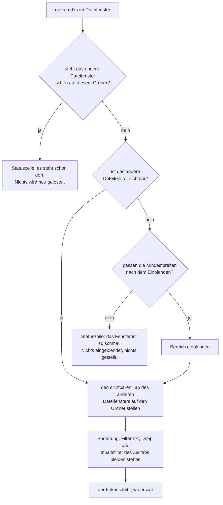
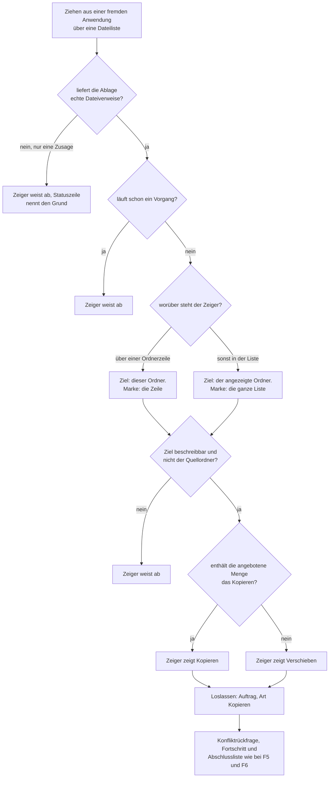

# Spec: Das andere Dateifenster nachziehen, und Dateien aus fremden Anwendungen abwerfen

**Datum:** 2026-08-18
**Status:** Entwurf
**Quelle:** Nutzerwunsch vom 260818: „Ok. bauen wir zwei neue Features ein: 1.) Ins gleiche Verzeichnis gehen: z.B. Fokus ist in Dateifenster A auf Verzeichnis /tmp/x/a. Nach der Operation ist Dateifenster B auf das gleiche Verzeichnis gestellt. 2.) Dateien oder Ordner von einer anderen App in einen Ordner einer Krk Dateiliste draggen."
**Baumstand:** `8d5baf6`, gelesen am 260818
**Ablage:** Dieser Spec entsteht ohne Circle im Blick und liegt deshalb im gemeinsamen Speicher. Der Circle dieser Runde nimmt ihn über sein Feld `Active spec/plan:` an.
**Vorlauf:** zwei Klärungsrunden mit dem Nutzer, am 260818. Alle Fragen sind beantwortet; der Abschnitt der ausstehenden Entscheidungen ist leer.
**Tragender Entscheidungsdatensatz:** `shared/decisions/260818-1453_*_welche-zusatztaste-macht-aus-einem-abwurf-ein-verschieben.md`, beantwortet am 260818.

## Directive

KRK stellt nach dieser Runde das andere Dateifenster auf einen Tastendruck hin auf den Ordner des aktiven, und es nimmt Dateien und Ordner entgegen, die eine fremde Anwendung in eine seiner Dateilisten wirft. Der Abwurf landet in dem Ordner, den der Zeiger beim Loslassen benennt: über einer Ordnerzeile in diesem Ordner, sonst in dem, den die Liste zeigt. Kopiert wird in der Vorgabe, verschoben mit `cmd`; welcher der beiden Vorgänge gilt, beantwortet das System und nicht KRK. Was KRK nicht ausführen kann, weist es schon während des Ziehens ab, damit der Zeiger es vor dem Loslassen zeigt.

## Warum zwei Gegenstände eine Runde sind

Der Nutzer hat das festgelegt, und der Grund liegt außerhalb der beiden Gegenstände. Der Abnahmelauf dieses Projekts verlangt KRK im Vordergrund und ist damit Nutzerarbeit; kein Agent kann ihn fahren. Zwei Runden hießen zwei Abnahmeläufe für zwei kleine Zugewinne. Die Festlegung ist getroffen und wird hier nicht neu verhandelt.

Im Code teilen sich die beiden wenig. Beide gehen über `DateifensterQuelle` (`crates/krk-ui/src/appkit/tabelle.rs`), die eine Klasse, die einen Ordner in ein Dateifenster stellt und die AppKit als Datenquelle der Tabelle kennt. Darüber hinaus berühren sie verschiedene Dateien. Der Plan darf sie deshalb in zwei unabhängigen Blöcken abarbeiten, und die Reihenfolge zwischen ihnen ist frei.

## Was der Nutzer entschieden hat

**Nur der eine Weg, das Schieben.** Der Befehl stellt das **andere** Dateifenster auf den Ordner des aktiven. Ein Gegenstück, das den eigenen Ordner vom anderen holt, und ein Tausch beider Ordner gehören nicht in diese Runde. Ein Kommando, eine Tastenkombination.

**Ein ausgeblendetes Ziel wird eingeblendet.** Der Fall ist ausdrücklich im Umfang und mit seinem bekannten Haken: das Einblenden kann scheitern, wenn die Mindestbreiten bei der aktuellen Fensterbreite nicht mehr nebeneinander passen. Dann geschieht nichts, und die Statuszeile sagt warum.

**Der Zieltab behält seine eigene Sicht.** Filtertext, „Deep", Inhaltsfilter und Sortierordnung des Zieltabs bleiben stehen. Das ist keine Ausnahme für diesen Befehl, sondern die Regel, die jeder Ordnerwechsel in KRK seit dem 260815 trägt. Der Nutzer hat sie bewusst unangetastet gelassen. Die Folge steht unter C3 ausgeschrieben.

**Zwei Abwurfziele, und eine Dateizeile ist keine Abweisung.** Über einer Ordnerzeile ist das Ziel dieser Ordner. An jeder anderen Stelle der Liste, über einer Dateizeile eingeschlossen, ist es der angezeigte Ordner. Zwei unterscheidbare Marken zeigen während des Ziehens, welches der beiden gilt. Die Lesezeichen- und Geräteleiste nimmt keine Abwürfe.

**Kopieren ist die Vorgabe, `cmd` verschiebt, `opt` kopiert ausdrücklich.** Der Nutzer hat damit seine erste Antwort ersetzt, die `shift` vorsah. Der Grund für die Ersetzung ist geprüft und steht unter C5: das System verengt die Menge der erlaubten Vorgänge aus `opt` und `cmd`, **bevor** KRK sie sieht, und ein KRK, das `shift` liest, wollte in der häufigsten Lage einen Vorgang, den die Menge nicht mehr enthält.

**Nur hinein, und nur echte Dateien.** KRK ist in dieser Runde Abwurfziel und keine Ziehquelle. Eine Zusagedatei, wie sie ein Mail-Anhang oder ein Bild aus „Fotos" liefert, wird abgewiesen und gemeldet.

**Was nicht ausführbar ist, wird früh abgewiesen.** Die Abweisung steht während des Ziehens und nicht nach dem Loslassen, damit der Zeiger sie zeigt. Drei Lagen fallen darunter: es läuft schon ein Vorgang, der Zielordner ist nicht beschreibbar, und die Ablage liefert keine echte Datei. Eine vierte Lage lässt sich vorher nicht prüfen und bleibt deshalb, wo sie heute ist: eine Quelle, die zwischen Loslassen und Zugriff verschwindet, erscheint in der Abschlussliste des Vorgangs.

## Der Weg des Tastenbefehls

Die Frage nach der Sichtbarkeit steht vor dem Einblenden und nicht darin. `Fenstermodell::einblenden` (`crates/krk-ui/src/fenstermodell.rs:735`) liefert `false` in zwei verschiedenen Lagen: der Bereich war schon sichtbar, und der Bereich passt nicht hinein. Nur die zweite ist eine Abweisung. Wer beide über denselben Rückgabewert liest, meldet dem Nutzer ein zu schmales Fenster, wenn das Dateifenster längst dasteht.

## Der Weg des Abwurfs

Die Prüfung auf einen laufenden Vorgang steht vor der Zielbestimmung, und die Beschreibbarkeit dahinter. Das ist keine Willkür in der Reihenfolge: die erste Frage hängt am Zustand der Anwendung und ist für die ganze Liste dieselbe, die zweite hängt an dem Ordner, den der Zeiger gerade benennt, und ändert ihre Antwort, während sich der Zeiger bewegt.

## Fähigkeiten

### C1: Ein Befehl stellt das andere Dateifenster auf denselben Ordner

**Beschreibung:** Ein Tastenbefehl im Dateifenster stellt das andere Dateifenster auf den Ordner, den das aktive zeigt. Er wirkt in eine Richtung, vom aktiven zum anderen. Der Fokus bleibt danach dort, wo er war, und die Auswahl im aktiven Dateifenster bleibt unangetastet.

**Die Funktion in der Belegung:**

| Feld | Wert |
|---|---|
| `id` | `ordner_angleichen` |
| `name` | „Anderes Dateifenster auf diesen Ordner stellen" |
| `tasten` | `["opt+cmd+s"]` |
| Wirkungsbereich | `Dateifenster` |

**Abnahmekriterien:**
- [ ] Steht der Fokus im linken Dateifenster auf einem Ordner, stellt der Befehl das rechte auf denselben Ordner. Aus dem rechten heraus wirkt er auf das linke.
- [ ] Nach dem Befehl steht der Fokus in demselben Dateifenster wie davor, und dasselbe Dateifenster ist aktiv.
- [ ] Die Auswahl und die Bildlaufposition des auslösenden Dateifensters sind unverändert.
- [ ] Der Befehl trifft den **sichtbaren** Tab des anderen Dateifensters. Er legt keinen neuen Tab an, und die übrigen Tabs jenes Dateifensters bleiben auf ihren Ordnern.
- [ ] Zeigt das andere Dateifenster in seinem sichtbaren Tab bereits denselben Ordner, geschieht nichts, und die Statuszeile sagt es. Auswahl und Bildlaufposition dort bleiben stehen.
- [ ] Die Belegungsansicht, das Hauptmenü und die Markdown-Ausgabe der Tastenbelegung führen die Funktion mit ihrem Namen und ihrer Kombination.
- [ ] `opt+cmd+s` löst außerhalb eines Dateifensters nichts aus, und der zugehörige Menüeintrag ist dort ausgegraut. **Nutzerarbeit**, weil der Wirkungsbereich das Schlüsselfenster im Vordergrund voraussetzt.

**Getroffene Festlegungen:**
- Ein Gegenstück, das den eigenen Ordner vom anderen Dateifenster holt, und ein Tausch beider Ordner entstehen nicht. Zwei Befehle für dieselbe Angleichung wären zwei Wege zu einem Ergebnis, und der Nutzer hat den einen benannt.
- Der Befehl steht in der `opt+cmd`-Reihe, weil diese Reihe in diesem Programm trägt, was einen Ordner herstellt oder liefert (`resources/default-keymap.toml:266`). Er liefert einen Ordner an das andere Dateifenster.
- Der Befehl wechselt den Fokus nicht. Begründung unter „Abgeleitet und nicht gefragt".

### C2: Ein ausgeblendetes Ziel wird hervorgeholt, oder der Befehl bleibt ohne Wirkung und sagt es

**Beschreibung:** Ist das andere Dateifenster ausgeblendet, holt der Befehl es hervor und stellt es dann auf den Ordner. Passen die Mindestbreiten der danach sichtbaren Bereiche bei der aktuellen Fensterbreite nicht mehr nebeneinander, geschieht überhaupt nichts: der Bereich bleibt ausgeblendet, sein Ordner bleibt der alte, und die Statuszeile nennt den Grund.

**Warum das ein eigener Gegenstand ist.** `Fenstermodell::einblenden` weist an dieser Bedingung ab, und die Abweisung ist stumm. Sie trägt deshalb seit der Bereichsleisten-Runde ein `#[must_use]`, dessen Text die Falle benennt: wer den Rückgabewert nicht liest, hält einen Bereich für hervorgeholt, den das Modell nicht eingeblendet hat. Ein Befehl, der danach den Ordner setzt, schreibt ihn in ein Dateifenster, das der Nutzer nicht sieht.

**Abnahmekriterien:**
- [ ] Ist das andere Dateifenster ausgeblendet und ist das Fenster breit genug, blendet der Befehl es ein und stellt es auf den Ordner. Beides geschieht in einem Zug, ohne einen zweiten Tastendruck.
- [ ] Ist das Fenster so schmal, dass die Mindestbreiten nach dem Einblenden nicht mehr passen, bleibt das andere Dateifenster ausgeblendet **und** auf seinem bisherigen Ordner. **Nutzerarbeit:** das Fenster ist dafür an seiner Breite zu ziehen.
- [ ] Die Statuszeile meldet in diesem Fall, dass das Fenster zu schmal ist und deshalb nichts geschehen ist. Die Meldung geht in das Dateifenster, in dem der Nutzer die Taste gedrückt hat.
- [ ] Ist das andere Dateifenster sichtbar, erscheint keine solche Meldung und der Befehl läuft durch.
- [ ] Der Befehl blendet in keiner Lage einen Bereich **aus**. Vorschau, Editor und Leiste stehen danach so, wie sie vorher standen, mit der einen Ausnahme, die das Fenstermodell ohnehin trägt: Vorschau und Editor teilen sich eine Fläche, und ein eingeblendetes Dateifenster berührt dieses Paar nicht.

**Getroffene Festlegungen:**
- Der Befehl fragt die Sichtbarkeit, bevor er einblendet, und liest den Rückgabewert nur in der Lage, in der er eine Abweisung bedeuten kann. Der Grund steht oben unter „Der Weg des Tastenbefehls".
- Die Meldung geht an das auslösende Dateifenster und nicht an das Ziel. So hält es KRK bei jeder Befehlsantwort: die Zeile antwortet dem, der gedrückt hat.

### C3: Der Zieltab behält seine eigene Sicht, und das ist sichtbar

**Beschreibung:** Der Befehl stellt einen Ordner ein und sonst nichts. Sortierung, Filtertext, das Ankreuzfeld „Deep", der Inhaltsfilter und die Anzeige ausgeblendeter Einträge bleiben im Zieltab, wie sie waren. Beide Dateifenster können danach denselben Ordner zeigen und sichtbar verschiedene Inhalte führen.

**Die Folge steht hier und nicht im Kleingedruckten.** Steht im Zieltab ein Filtertext, den der Nutzer vergessen hat, sieht er nach dem Befehl einen fast leeren oder ganz leeren Ordner und hält das für die Wirkung des Befehls. Der Filtertext übersteht in KRK seit dem 260815 jeden Ordnerwechsel; dieser Befehl ist ein Ordnerwechsel und erbt die Regel, statt eine zweite daneben zu setzen. Der Nutzer hat das so gewählt, ausdrücklich mit dem Argument, dass eine Sonderregel für diesen einen Befehl das Modell des Ordnerwechsels zerbräche.

**Der Zusammenhang mit einer bekannten offenen Lage.** Der Filterstand steht in der Statuszeile auf Rang 5 von 6, und eine Fenstermeldung des anderen Dateifensters verdrängt ihn. Wer in dieser Lage angleicht, sieht den stehenden Filtertext auch danach nicht. Das ist keine Folge dieser Runde, sondern die Lage aus `shared/issues/260815-1047_*_die-bedingung-der-moeglichkeit-2-ist-an-filterstand-text-geprueft-und-nicht-an-der-rangfolge.md`. Diese Runde macht sie nicht schlimmer und hebt sie nicht auf; der Datensatz bleibt offen.

**Abnahmekriterien:**
- [ ] Steht im Zieltab ein Filtertext, steht er nach dem Befehl weiter, und die Liste zeigt den neuen Ordner gefiltert.
- [ ] Steht im Zieltab „Deep" angekreuzt, ist es nach dem Befehl weiter angekreuzt, und die Liste zeigt den Unterbaum des neuen Ordners.
- [ ] Sortierordnung und Sortierspalte des Zieltabs sind nach dem Befehl unverändert, auch wenn sie von denen des auslösenden Dateifensters abweichen.
- [ ] Der Inhaltsfilter und die Anzeige ausgeblendeter Einträge des Zieltabs sind unverändert.
- [ ] Führen beide Dateifenster denselben Ordner mit verschiedenen Filtern, zeigen sie verschiedene Zeilen, und keines der beiden zieht das andere nach.

### C4: Der Abwurf und seine zwei Ziele

**Beschreibung:** Eine Dateiliste von KRK nimmt Dateien und Ordner entgegen, die eine fremde Anwendung darauf fallen lässt. Welcher Ordner das Ziel ist, sagt die Stelle, über der der Zeiger beim Loslassen steht, und während des Ziehens zeigt eine Marke, welches der beiden Ziele gerade gilt.

| Der Zeiger steht | Ziel | Marke |
|---|---|---|
| über einer Ordnerzeile | dieser Ordner | die Zeile ist hervorgehoben |
| über einer Dateizeile | der angezeigte Ordner | die ganze Liste ist umrandet |
| über der leeren Fläche unter den Zeilen | der angezeigte Ordner | die ganze Liste ist umrandet |
| über einer Verknüpfungszeile | der angezeigte Ordner | die ganze Liste ist umrandet |

**Eine Dateizeile ist keine Abweisung.** Das ist die Festlegung des Nutzers, und sie hat einen Preis, den die zweite Spalte der Tabelle bezahlt: über einer Dateizeile springt die Marke von der Zeile auf die ganze Liste, und genau daran sieht der Nutzer vor dem Loslassen, dass die Datei nicht das Ziel ist. Ohne die zweite Marke wäre die Regel unsichtbar und der Abwurf ein Ratespiel.

**Eine Verknüpfung auf einen Ordner zählt nicht als Ordner.** KRK verfolgt das Ziel einer Verknüpfung an dieser Stelle nicht. Der Grund ist derselbe, den die Löschrunde für die Zählung des Umfangs angeführt hat: eine Verknüpfung wird als sie selbst behandelt, und was hinter ihr liegt, gehört ihr nicht.

**Abnahmekriterien:** Alle Kriterien dieser Fähigkeit sind **Nutzerarbeit**. Sie verlangen einen Ziehvorgang mit der Maus oder dem Trackpad aus einer zweiten Anwendung, und kein Agent kann ihn auslösen.
- [ ] Aus dem Finder gezogene Dateien landen in dem Ordner, über dessen Zeile der Zeiger beim Loslassen stand.
- [ ] Über einer Ordnerzeile ist diese Zeile hervorgehoben, und die Umrandung der Liste steht nicht.
- [ ] Über einer Dateizeile ist die ganze Liste umrandet, und keine Zeile ist hervorgehoben. Losgelassen landet die Datei im angezeigten Ordner.
- [ ] Über der leeren Fläche unter der letzten Zeile ist die ganze Liste umrandet, und der Abwurf landet im angezeigten Ordner.
- [ ] Eine Verknüpfung, die auf einen Ordner zeigt, verhält sich wie eine Dateizeile.
- [ ] Mehrere zugleich gezogene Einträge landen in einem Vorgang im selben Ziel.
- [ ] Ein gezogener Ordner landet mitsamt seinem Inhalt.
- [ ] Ein Abwurf in ein Dateifenster, das nicht das aktive ist, wirkt genauso, und der Fortschritt erscheint in der Statuszeile jenes Dateifensters.
- [ ] Die Lesezeichen- und Geräteleiste nimmt keinen Abwurf an: der Zeiger weist dort ab, und nichts wird kopiert oder verschoben.
- [ ] Steht am Ziel ein Eintrag desselben Namens, erscheint dieselbe Konfliktrückfrage wie bei F5 und F6, mit denselben Schaltflächen.
- [ ] Der Vorgang zeigt Fortschritt und lässt sich abbrechen wie ein Vorgang aus F5 oder F6, und eine übersprungene Quelle erscheint mit ihrem Grund in der Abschlussliste.

**Getroffene Festlegungen:**
- Ein Abwurf verändert weder den Fokus noch das aktive Dateifenster. Begründung unter „Abgeleitet und nicht gefragt".
- Der Abwurf erzeugt keinen neuen Tab und wechselt den angezeigten Ordner nicht. Auch ein Abwurf auf eine Ordnerzeile steigt nicht in diesen Ordner ein.
- Der Zielordner frischt sich nach dem Vorgang von selbst auf, weil KRK das seit C9 der Runde 1 für jeden angezeigten Ordner tut. Ein zweiter Weg dafür entsteht nicht.

### C5: Kopieren ist die Vorgabe, `cmd` verschiebt, `opt` kopiert ausdrücklich

**Beschreibung:** Ohne Zusatztaste kopiert der Abwurf. Mit gehaltenem `cmd` verschiebt er, mit gehaltenem `opt` kopiert er ausdrücklich. `shift` trägt beim Ziehen keine Bedeutung. Der Zeiger zeigt in jeder dieser Lagen, was geschehen wird, und stimmt mit dem überein, was nach dem Loslassen geschieht.

**Die Regel dahinter ist eine einzige, und sie liest keine Taste.** KRK deutet keine Zusatztaste selbst. Es liest die Menge der Vorgänge, die die Quelle anbietet, und wählt daraus: enthält die Menge das Kopieren, kopiert KRK; sonst verschiebt es; enthält sie keines von beiden, weist KRK ab. Aus dieser einen Regel folgt die Tabelle oben vollständig, weil das System die Menge aus den gehaltenen Zusatztasten bereits verengt hat, bevor KRK sie sieht.

| Der Nutzer hält | Die Menge, die bei KRK ankommt | KRK wählt |
|---|---|---|
| nichts | Kopieren und Verschieben | Kopieren |
| `opt` | Kopieren | Kopieren |
| `cmd` | Verschieben | Verschieben |
| `shift` | Kopieren und Verschieben | Kopieren |

**Warum `shift` nicht geht, und warum das geprüft und nicht vermutet ist.** Die erste Antwort des Nutzers sah `shift` als Verschiebetaste vor, mit dem Argument, dass `shift` dem Ziehdienst nicht in die Quere kommt. Das Argument trägt die halbe Strecke. Das Ziel bekommt in `draggingEntered:` und `draggingUpdated:` nicht die rohe Tastenlage, sondern `draggingSourceOperationMask`: die Menge der Vorgänge, die die Quelle anbietet, gelesen am SDK unter `NSDragging.h:72`. Wer aus dem Finder mit gehaltenem `cmd` zieht, weil er es dort so gewohnt ist, verengt diese Menge auf das Verschieben. Ein KRK, das nur `shift` liest, wollte dann kopieren, und das Kopieren steht nicht mehr in der Menge. Der Zeiger zeigte das eine, KRK täte das andere. Der Nutzer hat die Berichtigung angenommen und `cmd` gewählt.

**Was das kostet, benannt und angenommen.** `cmd` ist damit die Taste, die Daten aus einer fremden Anwendung wegnimmt, und sie liegt unter dem Finger, weil der Finder sie dort hat. Der Nutzer hatte in seiner ersten Antwort ausdrücklich die sichere Seite gesucht. Er bekommt sie hier auf anderem Weg: die Vorgabe ist weiterhin der nicht zerstörerische Vorgang, und die zerstörerische Wirkung tritt nur ein, wenn der Nutzer eine Taste hält, deren Bedeutung ihm aus dem Finder geläufig ist und deren Wirkung der Zeiger vor dem Loslassen anzeigt.

**Abnahmekriterien:** sämtlich **Nutzerarbeit**.
- [ ] Ein Abwurf aus dem Finder ohne Zusatztaste kopiert. Die Quelle liegt danach noch dort, wo sie lag.
- [ ] Der Zeiger trägt dabei das Pluszeichen des Systems.
- [ ] Ein Abwurf mit gehaltenem `cmd` verschiebt. Die Quelle ist danach an ihrem alten Ort verschwunden.
- [ ] Der Zeiger trägt dabei kein Pluszeichen.
- [ ] Ein Abwurf mit gehaltenem `opt` kopiert, und der Zeiger trägt das Pluszeichen.
- [ ] Ein Abwurf mit gehaltenem `shift` und ohne `opt` oder `cmd` kopiert.
- [ ] In jeder dieser sechs Lagen stimmt das, was der Zeiger vor dem Loslassen zeigt, mit dem überein, was danach geschieht. Kein Fall zeigt das Pluszeichen und verschiebt.
- [ ] Zieht der Nutzer aus einer Anwendung, die allein das Kopieren anbietet, kopiert der Abwurf auch mit gehaltenem `cmd`, und der Zeiger zeigt das Kopieren.
- [ ] Der Vorgang läuft über dieselbe Operationsmaschine wie F5 und F6. Ein Verschieben über eine Datenträgergrenze hinweg verhält sich wie dort.

**Was ungeprüft bleibt.** Ob AppKit `draggingUpdated:` erneut schickt, wenn der Nutzer eine Zusatztaste drückt oder loslässt, ohne die Maus zu bewegen, ist an diesem Baum nicht gemessen. Trifft es nicht zu, wechselt das Zeigersymbol erst bei der nächsten Bewegung. Das ändert nichts an der Übereinstimmung von Symbol und Wirkung im Augenblick des Loslassens, weil das System die Menge zu diesem Zeitpunkt neu auswertet. Eine Zusage über die Bildwiederholung des Symbols macht diese Runde nicht.

### C6: Was nicht ausführbar ist, weist KRK schon während des Ziehens ab

**Beschreibung:** Ein Abwurf, den KRK nicht ausführen könnte, wird abgewiesen, solange der Nutzer die Maustaste noch hält. Der Zeiger zeigt die Abweisung, und nichts geschieht beim Loslassen. Drei Lagen fallen darunter.

| # | Lage | Woran KRK sie erkennt |
|---|---|---|
| 1 | Es läuft schon ein Vorgang | KRK hält genau einen; die Frage beantwortet heute `vorgang_laeuft_schon` (`crates/krk-ui/src/appkit/anwendung.rs:5348`) |
| 2 | Der Zielordner ist nicht beschreibbar | eine Prüfung am Zielordner. Das Mittel wählt der Planner; im Baum besteht heute keine solche Prüfung |
| 3 | Der Zielordner ist zugleich der Ordner, aus dem gezogen wird | die Quellpfade stehen in der Ablage des Ziehvorgangs und lassen sich vor dem Loslassen mit dem Ziel vergleichen |

**Die vierte Lage lässt sich vorher nicht prüfen, und dafür gibt es keine neue Antwort.** Eine Quelle, die zwischen dem Loslassen und dem Zugriff verschwindet, ist von keiner Prüfung zu fassen. Sie erscheint mit ihrem Grund in der Abschlussliste des Vorgangs, so wie es eine verschwundene Quelle bei F5 und F6 heute tut. Ein eigener Weg entsteht nicht.

**Lage 3 ist eine Festlegung dieses Specs und keine Nutzerantwort.** `auftrag_stellen` weist heute mit der Meldung „Quelle und Ziel sind derselbe Ordner" ab (`anwendung.rs:5320`). Ein Abwurf, der dieselbe Frage anders beantwortete, wäre eine zweite Wahrheit über dieselbe Sache. Umstoßbar am Spec-Gate.

**Abnahmekriterien:** sämtlich **Nutzerarbeit**.
- [ ] Läuft ein Vorgang, weist der Zeiger über der Dateiliste ab, und ein Loslassen bewirkt nichts.
- [ ] Ist der Zielordner nicht beschreibbar, weist der Zeiger über ihm ab. Steht der Zeiger daneben über einem beschreibbaren Ordner derselben Liste, nimmt er an.
- [ ] Zieht der Nutzer aus einem Finderfenster, das denselben Ordner **unter derselben Schreibweise** zeigt, den das Abwurfziel zeigt, weist der Zeiger ab. Die frühe Abweisung vergleicht zwei Pfade als Text und ist damit eine Vorhersage, keine Zusage: derselbe Ordner unter einer zweiten Schreibweise rutscht durch und der Zeiger nimmt an. **Was durchrutscht, endet seit `cac9218` als Zeile in der Abschlussliste des Vorgangs und nicht in einer Löschung.** `operation::zielpfad` vergleicht `(st_dev, st_ino)` statt Text und fängt den Fall an der entscheidbaren Stelle ab; davor beantwortete `ziel_klaeren` die Konfliktfrage mit „Überschreiben" und einem echten `remove_file` auf die Quelle (Befund `circles/260818-1615-ordner-angleichen-und-abwurf-aus-fremden-apps/issues/260818-2333_*_the-same-folder-refusal-compares-a-krk-path-against-a-foreign-apps-path-textually.md`).
- [ ] Verschwindet eine Quelle zwischen dem Loslassen und dem Zugriff, läuft der übrige Vorgang durch, und die verschwundene Quelle steht mit ihrem Grund in der Abschlussliste.
- [ ] In keiner der Abweisungen entsteht ein halb ausgeführter Vorgang.

### C7: Nur echte Dateien, und eine Zusagedatei wird gemeldet

**Beschreibung:** KRK nimmt Einträge an, die als Datei oder Ordner auf einem Datenträger liegen. Eine Zusagedatei, die die abgebende Anwendung erst auf Anforderung schreiben würde, nimmt KRK nicht an: der Zeiger weist ab, und die Statuszeile sagt, dass die Quelle keine Datei auf dem Datenträger liefert.

**Damit KRK das melden kann, muss es die Sorte überhaupt sehen.** Eine Ziehsorte, für die eine Ansicht sich nicht angemeldet hat, erreicht sie nicht: der Zeiger zeigt das Verbotszeichen des Systems, und KRK bekommt keine Gelegenheit, irgendetwas zu sagen. Wer allein den Dateiverweis anmeldet, bekommt für einen Mail-Anhang also gar nichts, und der Nutzer steht vor einer Anwendung, die schweigt. Diese Runde will die Meldung, und dafür meldet KRK die Zusagesorten mit an, um sie danach ausdrücklich abzuweisen. Das ist der Unterschied zwischen „KRK kann das nicht" und „KRK sagt, dass es das nicht kann", und der Nutzer hat die zweite Form verlangt.

**Abnahmekriterien:** sämtlich **Nutzerarbeit**.
- [ ] Ein Anhang, der aus Mail heraus über eine Dateiliste gezogen wird, wird nicht angenommen.
- [ ] Die Statuszeile nennt dabei den Grund, und die Meldung geht in das Dateifenster, über dem der Zeiger stand.
- [ ] Ein Bild, das aus „Fotos" heraus gezogen wird, verhält sich ebenso.
- [ ] Nach einer solchen Abweisung ist im Zielordner nichts entstanden, auch keine leere Datei.
- [ ] Eine gewöhnliche Datei aus dem Finder wird unverändert angenommen; die Anmeldung der Zusagesorten ändert daran nichts.

**Getroffene Festlegungen:**
- `NSFilePromiseReceiver` ist nicht Gegenstand dieser Runde. KRK fordert keine Zusagedatei an und schreibt keine.
- Ob die Meldung beim Eintritt in die Liste oder erst beim Loslassen erscheint, gehört zum Plan. Der Spec verlangt zweierlei: der Zeiger muss die Abweisung vor dem Loslassen zeigen, und die Meldung darf nicht bei jeder Zeigerbewegung neu geschrieben werden.

## Abgeleitet und nicht gefragt

Vier Festlegungen hat der Shaper getroffen. Der Nutzer kann jede am Spec-Gate umstoßen.

**`opt+cmd+s` als Kombination.** Die `opt+cmd`-Reihe trägt in diesem Programm, was einen Ordner herstellt oder liefert; das steht als Begründung in der Belegungsdatei selbst (`resources/default-keymap.toml:266`). Der neue Befehl liefert einen Ordner an das andere Dateifenster und gehört damit in diese Reihe. `s` liest sich als „selber Ordner". Die Kombination ist ab Werk frei, am 260818 gegen alle Tastenlisten der Datei nachgezählt. Dass `cmd+s` das Sichern im Editor trägt, spricht nicht dagegen: die `opt+cmd`-Reihe ist eine eigene Familie und keine Abwandlung der `cmd`-Reihe, wie `opt+cmd+c` neben `cmd+c` und `opt+cmd+g` neben `cmd+g` schon zeigen. Ebenfalls frei und damit Ausweichmöglichkeiten: `opt+cmd+up`, `opt+cmd+down`, `shift+cmd+o`, `ctrl+cmd+left`, `ctrl+cmd+right` und `cmd+l`.

**Die zwei Abwurfmarken kommen von AppKit und nicht aus eigener Zeichnung.** `NSTableView` kennt beide Marken bereits: eine Zeilennummer bezeichnet den Abwurf auf diese Zeile, die Zeilennummer `-1` den Abwurf auf die ganze Tabelle (`NSTableView.h:317`, am SDK gelesen). Zwei von Hand gezeichnete Marken daneben wären eine zweite Darstellung derselben Sache, und sie sähen in keinem Systemthema so aus wie die des Systems.

**Der Fokus bleibt, wo er ist.** Weder der Tastenbefehl noch der Abwurf ist ein Fokusbefehl. KRK trägt vier Befehle, die den Fokus holen, und sie sind daran erkennbar, dass sie sonst nichts tun. Ein Befehl, der nebenbei den Fokus mitnimmt, machte aus fünf Bereichen und vier Fokusbefehlen eine Regel mit Ausnahmen. Für den Abwurf kommt ein zweiter Grund hinzu: er ist eine Mausbewegung, und eine Mausbewegung, die den Tastaturfokus versetzt, überrascht beim nächsten Tastendruck.

**Der Abwurf in den eigenen Quellordner wird abgewiesen.** Begründung unter C6.

## Was der Übersetzer einfordert

Beide Gegenstände zusammen erweitern eine der vier gewachsenen Aufzählungen, und der Bau hält an jeder Stelle an, die nicht nachgezogen ist. Am 260818 gegen `8d5baf6` gezählt.

| Stelle | Was dort dazukommt |
|---|---|
| `crates/krk-core/src/tasten/belegung.rs`, `enum Kommando` | ein Wert für den neuen Befehl. Heute 78 Varianten |
| `crates/krk-core/src/tasten/belegung.rs`, `KENNUNGEN` | ein Paar. Die Länge steht im Typ und wächst von 78 auf 79 |
| `crates/krk-core/src/tasten/belegung.rs`, `Kommando::wirkungsbereich` | eine Zeile; die Fallunterscheidung ist vollständig und hat keinen Auffangzweig |
| `crates/krk-ui/src/belegungsmodell.rs`, `bereich_des_kommandos` | eine Zeile, aus derselben Ursache |
| `resources/default-keymap.toml` | ein Block `[[funktion]]`. Der Kopf der Datei nennt heute 84 Funktionen mit 89 Kombinationen und wächst auf 85 mit 90 |

Der Abwurf bringt keine neue Auftragsart mit. Er mündet in `Art::Kopieren` oder `Art::Verschieben`, also in dieselben zwei Werte, die F5 und F6 heute stellen. `schiebt_auffrischung_auf` (`crates/krk-ui/src/auffrischung.rs`) bekommt deshalb keine neue Zeile.

Dazu kommt, was der Übersetzer nicht von sich aus nennt:

- Die Belegungsansicht, das Hauptmenü und die Markdown-Ausgabe der Tastenbelegung entstehen aus `resources/default-keymap.toml` und ziehen mit ihr nach. In welcher Gruppe der Menüeintrag landet, entscheidet `bereich_des_kommandos`; an welcher Stelle innerhalb der Gruppe, entscheidet die Position des Blocks in der Belegungsdatei.
- Eine neue Datei unter `crates/krk-ui/src/appkit/`, sofern der Plan eine anlegt, braucht in ihrem Modulkopf den Abschnitt `# Ab welchem macOS die angesprochenen Klassen stehen`. Die Gewohnheit trägt in diesem Baum kein Werkzeug; sie ist zwischen dem 260811 und dem 260814 mehrfach abgesunken und von Hand wiederhergestellt worden.
- `crates/krk-ui/src/appkit/zwischenablage.rs` ist die eine Hülle um `NSPasteboard`. Die Ablage eines Ziehvorgangs ist nicht `generalPasteboard`, sondern die aus `draggingPasteboard`, und die heutige Hülle liest je Sorte genau eine Zeichenkette, während ein Abwurf mehrere Einträge trägt. Beides zusammen ist eine begründete Erweiterung jener Hülle. Eine zweite Hülle daneben ist ausgeschlossen.
- `#![deny(unsafe_code)]` gilt in `krk-core`, `krk-ui` und `krk-bench`; die beiden Ausnahmen sind `krk-core/src/verzeichnis/sys.rs` und `krk-ui/src/appkit/mod.rs`. Der Abwurf braucht keine dritte.

## Die Untergrenze macOS 15

Jede Klasse und jede Methode, die diese Runde anspricht, steht weit unter der Untergrenze. Am SDK gelesen am 260818:

| Angesprochen | Verfügbar seit |
|---|---|
| `registerForDraggedTypes:` (`NSView.h:488`) | 10.0, ohne Verfügbarkeitsangabe im Kopf |
| `NSDraggingInfo` mit `draggingSourceOperationMask` und `draggingPasteboard` (`NSDragging.h:69-79`) | 10.0, ohne Verfügbarkeitsangabe |
| `tableView:validateDrop:proposedRow:proposedDropOperation:` (`NSTableView.h:783`) | ohne Verfügbarkeitsangabe |
| `tableView:acceptDrop:row:dropOperation:` (`NSTableView.h:787`) | ohne Verfügbarkeitsangabe |
| `setDropRow:dropOperation:` (`NSTableView.h:319`) | ohne Verfügbarkeitsangabe |
| `NSPasteboardTypeFileURL` (`NSPasteboard.h:39`) | 10.13 |
| `readObjectsForClasses:options:` (`NSPasteboard.h:190`) | 10.6 |
| `NSFilePromiseReceiver.readableDraggedTypes` (`NSFilePromiseReceiver.h:23`) | 10.12 |

Das ist bedeutsam, weil `objc2` keine Verfügbarkeitsangaben mitführt und der Übersetzer die Untergrenze nicht hält. Eine Methode über der Untergrenze gibt keine Warnung, sondern einen Absturz auf dem Referenzgerät.

## Verhältnis zu den zehn Zeitzusagen aus C8 der Runde 1

**Keine der zehn Zusagen ist berührt, und diese Runde setzt keine elfte.**

Die Zuordnung, Zusage für Zusage, gelesen gegen die Kennungen in `crates/krk-bench/src/messen.rs`: L2, L3, L6, L7 und L10 messen das Lesen und Anzeigen von Ordnern und Vorschauen, L4 den Kaltstart, L5 den Wechsel von Tab und Dateifenster, L1 den Tastendruck, der die Auswahl in der Dateiliste bewegt, L8 den Kopier- oder Verschiebevorgang bis zum sichtbaren Fortschritt, L9 die Tastatur während einer laufenden Stapeloperation. Kein Ziehvorgang und kein Wechsel des Ordners im **anderen** Dateifenster kommt darin vor.

**Zwei Wirkungen zweiter Ordnung sind zu nennen, und beide bleiben unter einer Zahl.** Der Tastenbefehl löst im anderen Dateifenster einen gewöhnlichen Lesevorgang aus, also genau den Vorgang, den L2 und L10 im aktiven messen; er tut das auf demselben Weg und mit derselben Stapelmaschine. Der Abwurf mündet in dieselbe Operationsmaschine, die L8 misst. Was diese Runde daneben neu auf den Hauptfaden legt, ist die Prüfung während des Ziehens, und sie trägt **drei** Posten und nicht zwei. Zwei davon sind von der Zahl der gezogenen Einträge unabhängig: ein Vergleich zweier Pfade und eine Frage nach dem Schreibrecht des Zielordners, je Zeigerbewegung höchstens einmal. Der dritte ist das Auslesen der Ablage des Ziehvorgangs, und er wächst mit der Zahl der Einträge. Diese Stelle stand hier bis zum 260819 nicht, und sie war der teuerste der drei: am release-Bau gemessen kostete ein Aufruf von `dateiverweise` bei 1 Eintrag 0,13 ms, bei 100 Einträgen 6,0 ms, bei 1000 Einträgen 155 ms und bei 5000 Einträgen 585 ms, gegen ein Bild von 16,7 ms bei 60 Hz. Ab hundert gezogenen Einträgen fraß dieser eine Aufruf ein Drittel eines Bildes, ab tausend stand die Anwendung. **Seit `4d27c1c` ist er zwischengespeichert und damit ebenfalls von der Zahl der Einträge unabhängig**: ein Ivar der Datenquelle hält das ausgelesene Ergebnis unter dem Schlüssel `NSDraggingInfo::draggingSequenceNumber` und baut es allein dann neu, wenn die Nummer wechselt (`crates/krk-ui/src/appkit/tabelle.rs`, `DateifensterQuelle::abwurfquellen`; Befund `circles/260818-1615-ordner-angleichen-und-abwurf-aus-fremden-apps/issues/260818-2334_*_every-pointer-movement-decodes-the-whole-drag-pasteboard-and-nothing-names-that-cost.md`). Gemessen ist die Beschränkung damit an dieser einen Stelle und sonst nirgends, und die Runde sagt dafür weiterhin keine Zahl zu.

**An dessen Stelle treten zwei ohne Messstrecke prüfbare Kriterien**, in derselben Bauart, die die Runde 2 dafür gewählt hat:
- [ ] Der Tastenbefehl zeigt im anderen Dateifenster die erste Bildschirmseite, bevor der Rest des Ordners angehängt ist; ein großer Ordner blockiert dabei nicht die Bedienung des aktiven Dateifensters. **Nutzerarbeit.**
- [ ] Während ein Ziehvorgang über der Dateiliste steht, bleibt die Liste bildlauffähig und die Anwendung antwortet auf Tastendrücke, die nicht zum Ziehen gehören. **Nutzerarbeit.**

Der Abnahmelauf der zehn Zusagen ist zuletzt am 260810 gefahren und liegt vor den Runden 5 bis 13. Diese Runde ändert daran nichts und verlangt keinen neuen Lauf.

## Nicht Gegenstand dieser Runde

Die folgenden Punkte sind ausdrücklich ausgeschlossen. Sie stehen einzeln benannt, damit eine spätere Runde sie aufgreifen kann, ohne sie neu zu entdecken.

- **KRK als Ziehquelle.** KRK gibt in dieser Runde nichts ab. Aus einer Dateiliste heraus lässt sich nichts ziehen, weder in eine fremde Anwendung noch irgendwohin sonst. `beginDraggingSessionWithItems:event:source:` und `tableView:pasteboardWriterForRow:` bleiben unberührt.
- **Ziehen zwischen den beiden Dateifenstern.** Es folgt aus dem vorigen Punkt: ohne Ziehquelle gibt es keinen Zug, der im anderen Dateifenster ankäme. Zwischen den Dateifenstern kopiert und verschiebt weiter F5 und F6, und nach dieser Runde stellt `opt+cmd+s` beide auf denselben Ordner.
- **Ziehen in einen Ordner der Lesezeichen- und Geräteleiste.** Der Nutzer hat die Leiste ausdrücklich ausgenommen.
- **Zusagedateien anfordern.** `NSFilePromiseReceiver` bleibt außen vor. KRK erkennt eine Zusagedatei und meldet sie; es holt sie nicht.
- **Ein Gegenstück zum Angleichen und ein Tausch der Ordner.** Ein Befehl, der den eigenen Ordner vom anderen Dateifenster holt, und einer, der beide vertauscht, sind nicht Gegenstand. Sie wären eine eigene Entscheidung über die Belegung.
- **Ein Einstieg in den Zielordner nach dem Abwurf.** Der Abwurf auf eine Ordnerzeile steigt nicht in diesen Ordner ein.
- **Das Aufklappen eines Ordners unter dem gehaltenen Zeiger.** Der Finder öffnet einen Ordner, über dem der Zeiger verweilt („spring loading"). KRK tut das nicht. Es wäre ein Ordnerwechsel mitten in einer Handlung, die der Nutzer noch nicht abgeschlossen hat.
- **Eine elfte Zeitzusage.** Begründet oben.

## Offen für den Planner

- **Wo die Ziehannahme wohnt.** `DateifensterQuelle` (`crates/krk-ui/src/appkit/tabelle.rs`) ist die Datenquelle der Tabelle, und `validateDrop:` und `acceptDrop:` sind Methoden der Datenquelle. Ob sie dort einziehen oder ein eigenes Modul unter `appkit/` bekommen, entscheidet der Plan. Ein eigenes Modul braucht seinen Untergrenzen-Abschnitt im Kopf.
- **Wie die Regel aus C5 ohne AppKit prüfbar wird.** Die Wahl zwischen Kopieren und Verschieben ist eine reine Abbildung von einer Menge auf einen Vorgang. Das Vorbild im Baum ist `krk-ui/src/kommandos/rueckschritt.rs`: eine reine Funktion mit ausgeschriebener Tafel und einem Rufer, prüfbar ohne Fenster. Ob sie dorthin gehört oder daneben, entscheidet der Plan.
- **Womit KRK das Schreibrecht eines Ordners feststellt.** Eine solche Prüfung besteht im Baum nicht. `krk-core` führt kein `libc`, und die drei Konstanten und die variadische `fcntl`-Deklaration, die es braucht, stehen in `verzeichnis/sys.rs`. Ob die neue Prüfung dort einzieht, entscheidet der Plan, ebenso wie sie mit der Regel aus dem Modulkopf jener Datei zusammengeht: eine Prüfung am Pfad und ein späterer Zugriff sind zwei verschiedene Fragen, und zwischen ihnen liegt ein Fenster.
- **Wie die Ablage des Ziehvorgangs die eine Hülle erreicht.** `zwischenablage.rs` liest heute `generalPasteboard` und je Sorte eine Zeichenkette. Ein Abwurf trägt mehrere Einträge und eine andere Ablage. Ob die Hülle einen Parameter bekommt oder eine zweite Funktion daneben, und ob `readObjectsForClasses:options:` dafür eintritt, entscheidet der Plan. Eine zweite Hülle entsteht nicht.
- **Wie der Abwurf in die Operationsmaschine kommt.** `auftrag_stellen` (`anwendung.rs:5302`) nimmt seine Quellen aus der Auswahl des aktiven Dateifensters und passt deshalb nicht. `auftrag_starten` darunter nimmt einen fertigen `Auftrag` und ist der gemeinsame Teil, den heute schon zwei Wege benutzen. Ob der Abwurf ein dritter Rufer davon wird, entscheidet der Plan. Was der Spec verlangt: die Prüfung auf einen laufenden Vorgang darf nicht zweimal beantwortet werden.
- **Wie der Befehl aus C1 den Zielordner setzt.** `DateifensterQuelle::ordner_lesen` (`tabelle.rs:853`) stellt heute ein Dateifenster auf einen Ordner und wird von mehreren Stellen gerufen; `Anwendungsdelegierter::uebertragen` (`anwendung.rs:4428`) löst heute schon auf, welches das andere Dateifenster ist. Ob der neue Befehl beides zusammensetzt oder eine gemeinsame Stelle daraus entsteht, entscheidet der Plan.
- **Wie der Befehl aus C2 einblendet.** `Anwendungsdelegierter::bereich_einblenden` (`anwendung.rs:3862`) trägt den Weg für Befehle, die einen Bereich brauchen statt ihn umzuschalten, und hat heute zwei Sorten von Rufern. Der neue Befehl wird der nächste. Der Plan legt fest, wie er die Sichtbarkeit vorher fragt, damit die zwei Bedeutungen des Rückgabewerts nicht zusammenfallen.
- **Wo die Proben stehen.** `krk-ui` hat kein Bibliotheksziel, nur ein Binärziel. Eine Datei unter `crates/krk-ui/tests/` erreicht nichts aus `krk-ui`. Proben zu dieser Runde stehen deshalb in `#[cfg(test)]`-Modulen neben dem Code, und eine Probe, die eine `NSTableView` baut, behauptet den Hauptfaden so, wie `an_einer_flaeche` in `appkit/editor.rs` es tut.
- **Die Reihenfolge der Planschritte.** Die beiden Gegenstände berühren verschiedene Dateien, mit `tabelle.rs` als einziger gemeinsamer Stelle. Welcher zuerst gebaut wird, entscheidet der Plan.

## Ausstehende Nutzerentscheidungen

Keine. Die Fragen der beiden Klärungsrunden sind beantwortet, und die Antworten sind oben eingearbeitet. Der Entscheidungsdatensatz zur Zusatztaste (`shared/decisions/260818-1453_*_welche-zusatztaste-macht-aus-einem-abwurf-ein-verschieben.md`) trägt den Marker `_a_` und verweist auf C5 dieses Specs.

## Abgleich 260819-0057

**Reconciler, Domain `code`, Baumstand `cac9218`.** Zwei Stellen dieses Specs sind gegen den
Baum berichtigt worden, beide vor der Berichtigung am Baum nachgemessen und nicht nach Bericht
übernommen:

1. **`## Verhältnis zu den zehn Zeitzusagen aus C8 der Runde 1`** zählte zwei Posten auf dem
   Hauptfaden auf und ließ den dritten aus, das Auslesen der Ablage des Ziehvorgangs. Er war
   der teuerste der drei und ist seit `4d27c1c` zwischengespeichert. Die Messreihe steht im
   Befund `circles/260818-1615-ordner-angleichen-und-abwurf-aus-fremden-apps/issues/260818-2334_*_every-pointer-movement-decodes-the-whole-drag-pasteboard-and-nothing-names-that-cost.md`.
2. **Das dritte Abnahmekriterium von C6** hätte in dieser Fassung als fehlgeschlagen berichtet
   werden müssen, sobald der Nutzer aus einem Finderfenster zieht, das denselben Ordner unter
   einer zweiten Schreibweise zeigt. Es liest sich jetzt „unter derselben Schreibweise" und
   sagt daneben, was mit dem durchgerutschten Fall geschieht.

**Der Spec bleibt in jeder anderen Aussage unangetastet.** Die sieben Fähigkeiten sind gebaut,
die Planschritte sämtlich am Baum nachgeprüft (`circles/260818-1615-ordner-angleichen-und-abwurf-aus-fremden-apps/planning/260818-1633_*_plan-…`,
`## Reconciliation Log`), `make check` steht am Baumstand auf Exit 0. **Die Abnahmekriterien
selbst sind damit nicht abgehakt:** C4 bis C7 sind sämtlich Nutzerarbeit, ebenso zwei Kriterien
in C1, zwei in C2 und die zwei Kriterien an der Stelle einer elften Zeitzusage. Der Marker `_c_`
sagt hier „die Runde ist gebaut und ihre Schritte sind belegt" und nicht „abgenommen" — die
Unterscheidung, die dieses Projekt für jede seiner Runden führt.

**Ein Befund dieser Runde reicht über den Spec hinaus.** Die Kette in `krk-core`, die
`cac9218` behoben hat, bestand vor dieser Runde: `ziel_klaeren` beantwortete „Überschreiben"
mit einem echten `remove_file` auf ein Ziel, das unter zweiter Schreibweise die Quelle sein
konnte. Der Abwurf hat sie nur erreichbar gemacht. Sie liegt außerhalb der Directive dieses
Specs und innerhalb dessen, was die Runde tun musste, um gefahrlos zu sein.

