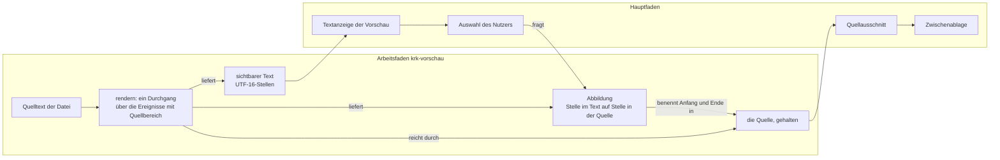

# Spec: Auswahl und Kopieren in der Vorschau

**Date:** 2026-08-19
**Status:** Gebaut und am laufenden Bündel abgenommen — vom Nutzer am 260819-2228 abgenommen, alle acht Planschritte gebaut und einzeln gegen den Baum gelesen; die 15 Abnahmekriterien mit Bündelanteil hat der Nutzer am 260820-1030 an `KRK.app` 0.5.4 gefahren, mit dem Befund, die neuen Funktionen halten. Der Dateimarker steht auf `_p_` und nicht auf `_c_`, solange `shared/decisions/260819-1440_*_was-sagt-der-marker-c-an-einem-spec-gebaut-oder-abgenommen.md` offen ist
**Source:** Der Wunsch des Nutzers vom 260819-2031, in der Vorschau Text auswählen und kopieren zu können, und seine vier Antworten der ersten Klärungsrunde vom 260819-2210
**Circle:** keiner. Diese Runde ist am 260819-1835 als eigener Circle mit vorgeschalteter Klärung beschlossen worden (Ereignis `scope_resolved` in `orchestrator-events.jsonl`); der Circle entsteht nach der Abnahme dieses Specs, und bis dahin liegen Spec und Datensätze im gemeinsamen Speicher.
**Grundlage erhoben:** 260819-2216, am Baum auf dem Stand `6be1e81`, unter `crates/` und `resources/`

**Vier Fragen sind beantwortet**, sämtlich am 260819-2210; sie liegen als Datensätze unter `shared/decisions/` und werden hier nicht erneut gestellt. **Drei sind offen.** Keine hält einen Planschritt auf, jede bindet die Umsetzung; der Spec fährt bei allen dreien auf der Empfehlung des jeweiligen Datensatzes und nennt an jedem betroffenen Kriterium, was sich mit einer anderen Antwort ändert. Nachzuzählen bleibt es am Dateibestand und nicht an diesem Satz: `ls fusion-workbench/shared/decisions/260819-2216_*.md`.

---

## Directive

Wer in der Vorschau eine Stelle mit der Maus markiert, kann sie kopieren. Auswählbar ist alles, was die Textfläche zeigt: der rohe Text einer Datei, eingefärbter Quelltext, gerendertes Markdown, die Metadaten eines Eintrags, ein Hinweissatz und der Text aus der Zwischenablage; ein Bild bleibt außen vor. Bei gerendertem Markdown landet nicht das, was dasteht, in der Zwischenablage, sondern der **Quelltext mit seinen Auszeichnungszeichen**. Die Tastenbedienung der Vorschau bleibt, wie sie ist, und das Kontextmenü der Textfläche ist von nun an das, was AppKit einer Textansicht mitgibt.

Diese Runde setzt keine elfte Zeitzusage und fasst keine der zehn aus C8 der Runde 1 an.

---

## Was diese Runde an der Runde 6 ändert

**Das achte Abnahmekriterium von C4 der Runde 6 wird ersetzt und nicht ergänzt** (`circles/260812-1000-teilen-ordnersprung-ablage-sichern-vorschau-rendern/planning/260812-1145_*_teilen-ordnersprung-ablage-sichern-vorschau-rendern.md`, Zeile 68). Es lautet heute:

> Die Vorschaufläche bleibt nicht auswählbar. Die Tastenbedienung der Vorschau-Tabs aus C1 der Runde 2 bleibt damit unangetastet. **(Probe** für die beiden Schalter, **Bündel** für die Tabbefehle**)**

Nach dieser Runde lautet es:

> Die Vorschaufläche ist auswählbar. Die Tastenbedienung der Vorschau-Tabs aus C1 der Runde 2 bleibt trotzdem unangetastet, weil die Textfläche in `ersthelfer_gehoert_appkit` angemeldet wird, wie die Textfläche des Editors es seit der Runde 2 ist.

**Mit demselben Beschluss fällt die Zeile 417 jenes Plans**, die Umsetzungszusage zum Kriterium:

> **Die Textfläche bleibt nicht auswählbar und nicht bearbeitbar.** `setSelectable(false)` und `setEditable(false)` bleiben, wo sie stehen; die Merkmale werden über Textspeicher und Layoutverwalter gesetzt und brauchen keine Auswahl.

Von den beiden Schaltern fällt einer. `setEditable(false)` bleibt unverändert stehen: die Vorschau zeigt und bearbeitet nicht, daran ändert diese Runde nichts. Der zweite Satz jener Zeile bleibt ebenfalls wahr und verliert nur seine Begründungslast: die Auszeichnungen gehen weiter über Textspeicher und Layoutverwalter in die Fläche und brauchen keine Auswahl.

**Der Datensatz, der beides trug, wird überholt und nicht berichtigt.** `circles/260812-1000-teilen-ordnersprung-ablage-sichern-vorschau-rendern/decisions/260812-1000_*_was-tut-ein-link-im-gerenderten-markdown-und-bleibt-die-vorschau-unauswaehlbar.md` beantwortet zwei Fragen in einem Dokument. **Überholt wird allein die zweite**, ob die Fläche unauswählbar bleibt. Die erste, was ein Verweis im gerenderten Markdown tut, gilt unverändert weiter: ein Link bekommt Farbe und Unterstreichung, keine Klickwirkung und keinen Zeigefinger, und welche Quellen eine Adresse setzen dürfen, bleibt die erste offene Frage des Circles `260804-0933-eingebauter-web-betrachter-im-vorschaufenster`. Der überholende Datensatz ist `shared/decisions/260819-2216_*_wird-die-vorschauflaeche-auswaehlbar-und-was-genau-laesst-sich-auswaehlen.md`; er nennt diese Trennung ausdrücklich, damit die Umbenennung des alten Datensatzes auf `_s_` nicht als Widerruf der Link-Antwort gelesen wird.

**Was der Nutzer dadurch verliert, ist benannt und angenommen.** Die abgelöste Zusage hat einen Preis abgewehrt, und dieser Preis wird jetzt bezahlt:

- **Die Vorschau bekommt einen zweiten Textspeicher.** Bei gerendertem Markdown hält sie von nun an die Quelle neben dem gerenderten Text und dazu eine Abbildung zwischen beiden. Anzeige und Auswahl sind damit nicht mehr dieselbe Sache, und jede spätere Änderung am Rendern muss die Abbildung mitführen.
- **Die Textfläche wird die zweite angemeldete Ausnahme im Ereignisabgriff.** Bis heute ist die Textfläche des Editors die einzige, und der Modulkopf von `crates/krk-ui/src/appkit/ereignisse.rs` schreibt aus, dass eine Liste von Ausnahmen dort nirgends entsteht. Aus einer Nämlichkeitsfrage mit einem Vergleich wird eine mit zwei. Der Nutzer hat die Möglichkeit mit dieser Kostenbeschreibung vor Augen gewählt.
- **Die Klickfläche der Vorschau wechselt den Träger.** Heute lehnt die Textanzeige den Fokus ab, und der Klick fällt durch die Antwortkette auf die Inhaltsfläche; künftig nimmt die Textanzeige ihn selbst entgegen. `Fokus::Vorschau` bleibt davon unberührt, weil `bereich_des_ersthelfers` über `isDescendantOf:` fragt und nicht nach der Ansicht selbst.

---

## Ausgangslage, am 260819-2216 am Baum erhoben

Neun Feststellungen tragen den Zuschnitt. Vier davon widersprechen dem, was man ohne sie annähme.

**Die Fokusfrage beantwortet der Enthaltensschnitt und nicht die Ansicht.** `Anwendungsdelegierter::bereich_des_ersthelfers` (`crates/krk-ui/src/appkit/anwendung.rs:5606-5618`) läuft über `Bereich::ALLE` und fragt `isDescendantOf:` gegen die Wurzelansicht jedes Bereichs. Eine Textanzeige, die den Ersthelferrang nimmt, liegt weiter im Teilbaum der Vorschau, also bleibt die Antwort `Fokus::Vorschau`. Der Fokusrahmen aus der Runde 2, der Fenstertitel und jede Zulässigkeitsregel lesen dieselbe Auskunft und brauchen keine Zeile.

**Der Ereignisabgriff fragt nach der Nämlichkeit und trägt heute genau einen Vergleich.** `ersthelfer_gehoert_appkit` (`crates/krk-ui/src/appkit/ereignisse.rs:685-701`) nimmt einen Abschluss `ist_editorflaeche` entgegen und antwortet für jeden Ersthelfer, der eine `NSTextView`, ein `NSTextField` oder ein `NSText` ist, mit `true`; der Abschluss ist die eine Ausnahme. Ohne Anmeldung der Vorschaufläche verlöre KRK mit dem Fokus in der Vorschau **jeden** Tastenbefehl, nicht nur die vier Tabbefehle: `zulaessig` (`crates/krk-ui/src/kommandos/zulaessigkeit.rs:179`) verlangt `!lage.ersthelfer_gehoert_appkit` als einen von vier Bestandteilen.

**Kopieren ist in diesem Baum kein Befehl von KRK.** `text_kopieren` steht in `resources/default-keymap.toml:964-968` mit `gehalten_von = "menue"`, ebenso `text_alles_auswaehlen` auf `cmd+a` (`:985-989`). `Belegung::nachschlag` überspringt die vom Menü gehaltenen Funktionen, also sieht der Ereignisabgriff `cmd+c` nicht; der Tastendruck läuft ins Hauptmenü und von dort die Antwortkette hinunter. `validateMenuItem:` am Anwendungsdelegierten antwortet für jede fremde Aktion `true` und überlässt AppKit die Ausgrauung. **Daraus folgt, dass diese Runde für das Kopieren keinen Belegungseintrag und keine `Kommando`-Variante braucht**; der Einhängepunkt ist die Antwortkette, und der Modulkopf von `crates/krk-ui/src/appkit/menue.rs` benennt ihn seit der Runde 7 als solchen.

**Der Auf- und der Ab-Pfeil sind mit dem Fokus in der Vorschau schon heute wirkungslos.** `Kommando::AuswahlHoch` und `Kommando::AuswahlRunter` tragen `Wirkungsbereich::Navigator`, und der schließt die Vorschau ein (`crates/krk-core/src/tasten/belegung.rs`, `fn wirkungsbereich`). Der Befehl ist damit zulässig, `bereichskommando` reicht ihn an die Vorschau (`crates/krk-ui/src/appkit/anwendung.rs:3174-3184`), die allein die vier Tabbefehle ausführt und `false` liefert. Geschluckt wird seit der Runde 7 aber, was **zulässig** war, und nicht, was gewirkt hat. Der Tastendruck ist verbraucht, die Auswahl im Dateifenster bewegt sich nicht, und in der Vorschau geschieht nichts.

**Bild-auf, Bild-ab, Pos1, Ende und `cmd+a` verhalten sich gegenläufig.** `SeiteHoch`, `SeiteRunter`, `Listenanfang`, `Listenende` und `AlleMarkieren` tragen `Wirkungsbereich::Dateifenster` und sind mit dem Fokus in der Vorschau **unzulässig**; der Abgriff reicht sie unverändert weiter. Heute läuft das ins Leere, weil die Textanzeige den Rang nicht hat. Mit einer auswählbaren Fläche beantwortet sie AppKit, und die fünf Tasten blättern beziehungsweise wählen alles aus. Das ist eine Folge der Auswählbarkeit und keine Wahl dieser Runde.

**Das Kontextmenü der Textanzeige hängt schon an der richtigen Stelle.** `Vorschaufenster` ist seit C1 der Runde 6 der Delegierte seiner Textanzeige und beantwortet `textView:menu:forEvent:atIndex:` (`crates/krk-ui/src/appkit/vorschau.rs:405-415`): AppKit baut sein Menü, KRK hängt den Teilen-Eintrag an und gibt das Menü zurück. Bild und Inhaltsfläche gehen den zweiten Weg über `setMenu:` und teilen sich ein eigenes Menü. **Die Antwort auf die vierte Frage kostet damit keine Zeile**: sobald die Fläche auswählbar ist, trägt AppKits Menü seine eigenen Einträge, und der Teilen-Eintrag steht daneben, wie er es im Editor tut.

**Das gerenderte Markdown trägt heute keine Herkunft.** `markdown::rendern` (`crates/krk-ui/src/markdown.rs:203`) läuft über `pulldown_cmark::OffsetIter` und hat damit zu **jedem** Ereignis den Quellbereich in Bytes; der Rückgabewert `Gerendert` (`:187-193`) behält davon nichts und trägt allein den sichtbaren Text und die Formatierung. Die Abbildung, die diese Runde braucht, ist also im vorhandenen Durchgang zu erheben und nicht in einem zweiten danach.

**Die Deckung des Quelltextes hat eine benannte Lücke.** Nach drei Reparaturen der Runde 6 erscheint jedes Byte der Quelle im gerenderten Text mit einer Ausnahme: der Vorspann eines Containers, also alles bis zum ersten darin gelesenen Byte, dort wo sein Merkzeichen steht (`circles/260812-1000-teilen-ordnersprung-ablage-sichern-vorschau-rendern/decisions/260812-2002_*_bleibt-der-vorspann-eines-containers-die-eine-luecke-in-der-deckungszusage-von-c4-3.md`, offen). Für das Kopieren dreht sich das Vorzeichen: was die Anzeige weglässt, will die Zwischenablage haben. Ein Merkzeichen `- ` erscheint nicht als Quelltext, ist aber Teil dessen, was ein Nutzer beim Kopieren eines Listenpunkts erwartet.

**Die Stellen werden auf beiden Seiten verschieden gezählt.** Der gerenderte Text trägt seine Stellen in UTF-16-Einheiten, weil ein `NSRange` so zählt (`crates/krk-ui/src/markdown.rs`, Abschnitt „Die Stellen sind UTF-16-Einheiten"); `pulldown-cmark` liefert Bytes. Eine Abbildung zwischen beiden rechnet um, und die Umrechnung ist die Stelle, an der ein Umlaut oder ein Emoji jede Zahl dahinter verschöbe.

**`Inhalt` wird bei jedem Neuzeichnen des aktiven Tabs geklont.** Der gerenderte Markdown-Wert liegt deshalb schon heute in einer `Box`, damit er die übrigen Werte der Aufzählung nicht aufbläht (`crates/krk-ui/src/vorschaumodell.rs:211-219`); die Bilddaten liegen aus demselben Grund in einem `Arc` (`:225-238`). Ein zweiter Textspeicher bis zur Vorschaugrenze von 1 MB (`TEXTGRENZE`, `:131`) legt sich in diesen Klon, und der Baum trägt für den Fall bereits ein Muster.

---

## Wie eine Auswahl zur Zwischenablage kommt

Der linke Kasten ist die vorhandene Bauart, um zwei Ausgänge erweitert; der rechte trägt allein den Weg der Auswahl. Für rohen Text, eingefärbten Quelltext, Metadaten, einen Hinweis und den Text aus der Zwischenablage entfallen beide Erweiterungen: dort ist der sichtbare Text die Quelle, und die Auswahl geht ohne Abbildung in die Zwischenablage.

---

## Fähigkeiten und Abnahmekriterien

Jedes Kriterium trägt, wie es nachzuweisen ist. **(Probe)** heißt: eine Prüfung im Baum weist es nach, ein Agent kann es abnehmen. **(Bündel)** heißt: es ist am laufenden `KRK.app` im Vordergrund zu sehen, und das ist Nutzerarbeit; jedes Bündelkriterium nennt die Beobachtung, mit der es abgenommen wird. Ein Kriterium mit beiden Kennzeichnungen hat eine Hälfte, die eine Probe deckt, und eine, die sie nicht deckt.

### C1: Die Vorschau lässt ihren Text auswählen

**Beschreibung:** Die Textanzeige der Vorschau nimmt eine Auswahl mit der Maus entgegen und behält alles andere, was sie heute ist: nicht bearbeitbar, mit derselben Schrift, denselben Auszeichnungen und derselben Zeilennummernspalte. Die Tastenbedienung der Vorschau bleibt vollständig erhalten, weil die Fläche im Ereignisabgriff angemeldet wird.

**Abnahmekriterien:**

1. Die Textanzeige der Vorschau ist auswählbar. Ein Zug mit der Maus über den Text markiert ihn sichtbar. **(Probe** für den Schalter, **Bündel** für die Markierung — **Beobachtung:** eine Textdatei in der Vorschau zeigen, mit gedrückter Maustaste über drei Zeilen ziehen; die Zeichen erscheinen hinterlegt**)**
2. Auswählbar ist **alles, was die Textfläche zeigt**: der rohe Text einer Datei, eingefärbter Quelltext, gerendertes Markdown, die Metadaten eines Eintrags, ein Hinweissatz und der Text aus der Zwischenablage. Es gibt keinen Inhaltswert, der die Auswahl abschaltet. **(Probe** über die Vollständigkeit der Fallunterscheidung, **Bündel** für zwei der sechs Fälle**)**
3. **Ein Bild ist nicht auswählbar.** Die Bildansicht bleibt unverändert; sie bekommt keine Auswahl, keinen Rahmen und keinen Kopierweg. **(Probe)**
4. Die Textanzeige bleibt **nicht bearbeitbar**. `setEditable(false)` bleibt, wo es steht; kein Zeichen der Vorschau lässt sich ändern, und ein Rückgängigverwalter entsteht nicht. **(Probe)**
5. **`Fokus::Vorschau` bleibt die Antwort**, auch wenn der Ersthelferrang in der Textanzeige steht. Es bleibt bei der einen Stelle, die den Rang auf einen Bereich abbildet, und sie bekommt keinen Zweig für diese Fläche. **(Probe)**
6. **Die vier Tabbefehle aus C1 der Runde 2 wirken unverändert**, mit dem Fokus in der Vorschau: einen Tab öffnen, schließen, zum nächsten und zum vorigen wechseln. **(Probe** für die Zulässigkeit, **Bündel** für die Tastendrücke — **Beobachtung:** in die Vorschau klicken, `ctrl+tab` und `ctrl+shift+tab` drücken; der aktive Vorschau-Tab wechselt**)**
7. Getragen wird C1.6 von **einer** Anmeldung der Textfläche in `ersthelfer_gehoert_appkit`, an derselben Stelle, an der die Textfläche des Editors angemeldet ist. Es entsteht keine zweite Regel daneben, keine Frage nach der Klasse und kein Gang durch den Ansichtsbaum. **(Probe** über die Zahl der Stellen**)**
8. **Der Fokusbefehl für die Vorschau setzt den Rang so, dass Kopieren wirkt.** Wer den Fokus über den Befehl holt statt mit der Maus, kann anschließend auswählen und kopieren. Es bleibt bei **einer** Zuordnung von Fokuswert auf Ansicht (`fokusansicht`); eine zweite daneben entsteht nicht. **(Probe** für die eine Zuordnung, **Bündel** für den Weg — **Beobachtung:** den Fokusbefehl für die Vorschau drücken, `cmd+a` und `cmd+c` drücken, den Inhalt der Zwischenablage prüfen**)**
9. Der Fokusrahmen und der volle Pfad im Fenstertitel ziehen unverändert nach. Ein Klick in den Text der Vorschau färbt denselben Rahmen wie heute ein Klick in die Fläche darunter. **(Bündel** — **Beobachtung:** aus dem Dateifenster in den Text der Vorschau klicken; der Rahmen wandert, und der Titel zeigt den Pfad der angezeigten Datei**)**
10. **Pfeil hoch und Pfeil runter behalten ihre heutige Wirkung.** Beide bleiben zulässig, werden von KRK entgegengenommen, von der Vorschau nicht ausgeführt und erreichen AppKit nicht. Weder die Schreibmarke der Vorschau noch die Auswahl im Dateifenster bewegt sich. **(Probe** für die Zulässigkeit und den Verbrauch, **Bündel** für den Tastendruck**)** — Nutzerentscheid vom 260819-2210, `shared/decisions/260819-2216_*_was-tun-pfeil-hoch-und-runter-in-der-auswaehlbaren-vorschau.md`. **Mit einer anderen Antwort ändert sich dieses Kriterium und sonst keines.**
11. **Bild-auf, Bild-ab, Pos1 und Ende blättern künftig in der Vorschau.** Die vier tragen `Wirkungsbereich::Dateifenster`, sind mit dem Fokus in der Vorschau unzulässig und laufen an AppKit weiter. Das ist eine Folge der Auswählbarkeit; diese Runde ändert dafür keinen Wirkungsbereich. **(Bündel** — **Beobachtung:** eine lange Textdatei in der Vorschau zeigen, hineinklicken, Bild-ab drücken; der Text blättert**)**
12. **`cmd+a` wählt mit dem Fokus in der Vorschau den ganzen Text der Vorschau aus.** `alle_markieren` im Dateifenster bleibt unberührt; die beiden begegnen einander nicht, weil der Fokusvorbehalt sie trennt. **(Bündel** — **Beobachtung:** in die Vorschau klicken, `cmd+a` drücken; der Text ist ganz hinterlegt und die Markierung im Dateifenster unverändert**)**
13. **Die Auswahl fällt mit jedem Inhaltswechsel.** Ein Tabwechsel, eine andere Datei und ein neuer Lesevorgang lassen sie fallen; sie wird nicht je Tab gemerkt. **(Probe)**
14. **Die Belegung wächst nicht.** Kein neuer Eintrag in `resources/default-keymap.toml`, keine neue `Kommando`-Variante, keine neue Kombination. Die Zählzeile im Kopf der Belegungsdatei bleibt unverändert. **(Probe)**
15. Die Zeilennummernspalte verhält sich unverändert: sie steht beim rohen Inhalt einer Textdatei und bei nichts sonst, und `Vorschaumodell::zeigt_dateitext` bleibt die eine Stelle, die es entscheidet. Eine Auswahl ändert daran nichts. **(Probe)**

**Getroffene Festlegungen:**

- **Alles, was die Textfläche zeigt, wird auswählbar; Bilder nicht.** Nutzerentscheid vom 260819-2210, `shared/decisions/260819-2216_*_wird-die-vorschauflaeche-auswaehlbar-und-was-genau-laesst-sich-auswaehlen.md`, Möglichkeit a. Die Alternative, allein Dateitext auswählbar zu machen und Metadaten und Hinweise auszunehmen, wäre eine Fallunterscheidung über den Inhaltswert an einer Stelle, die heute keine hat.
- **Die Textfläche wird im Ereignisabgriff angemeldet.** Sie ist ein Bereich der Fensterzeile, und für einen solchen sagt der Modulkopf von `crates/krk-ui/src/appkit/blaetter/zettel.rs` und die Erfahrung der Runde 9 dasselbe: ohne Anmeldung gehören seine Tasten AppKit, und kein Befehl von KRK wirkt darin. Die Fläche eines Blattes bleibt aus demselben Grund weiter **nicht** angemeldet.

### C2: Kopieren gibt bei gerendertem Markdown den Quelltext heraus

**Beschreibung:** Was der Nutzer aus der Vorschau kopiert, ist bei fünf der sechs Inhalte genau das, was er markiert hat. Bei gerendertem Markdown ist es der Quelltext der markierten Stelle, mit Doppelkreuzen, Sternen, Klammern und Adressen. Die Vorschau hält dafür die Quelle neben dem gerenderten Text und eine Abbildung zwischen beiden.

**Abnahmekriterien:**

1. Bei rohem Text, eingefärbtem Quelltext, Metadaten, einem Hinweis und dem Text aus der Zwischenablage legt das Kopieren genau die markierten Zeichen ab, Zeichen für Zeichen. **(Probe** für die Gleichheit, **Bündel** für den Tastendruck — **Beobachtung:** in einer `.rs`-Datei drei Zeilen markieren, `cmd+c` drücken, in ein Textfeld einfügen; es steht dasselbe da**)**
2. **Bei gerendertem Markdown legt das Kopieren den Quelltext der markierten Stelle ab.** Wer eine als große fette Zeile dargestellte Überschrift kopiert, hat `# Überschrift` in der Zwischenablage; wer einen Verweis mitkopiert, hat `[Text](Ziel)`. **(Probe** für die Abbildung, **Bündel** für den Weg — **Beobachtung:** eine `.md`-Datei mit Überschrift und Verweis in der Vorschau zeigen, den Absatz markieren, kopieren, in einen Texteditor einfügen; die Auszeichnungszeichen stehen da**)**
3. Die Vorschau hält dafür den **Quelltext neben dem gerenderten Text**. Er wird nicht ein zweites Mal von der Platte gelesen: er ist die Eingabe des Renderns und bleibt stehen. **(Probe** über das Fehlen eines zweiten Lesevorgangs**)**
4. **Die Abbildung entsteht in dem Durchgang, der rendert**, und nicht in einem zweiten danach. Ein zweiter Durchgang über die Quelle entsteht nicht. **(Probe** über die Zahl der Durchgänge**)**
5. **Die Abbildung ist ohne AppKit prüfbar.** Sie ist eine Rechnung von einer Stelle im gerenderten Text auf eine Stelle in der Quelle und berührt weder `NSTextView` noch `NSRange`; ihre Proben stehen dort, wo die Proben des Renderns stehen. **(Probe)**
6. **Die Abbildung ist total.** Jede Stelle des gerenderten Textes hat eine Antwort, auch die Zeichen, die KRK selbst erzeugt hat: das Merkzeichen eines Listenpunkts, die Einrückung eines Zitatblocks, die Leerzeile zwischen zwei Blöcken. Diese Zeichen tragen zum Quellausschnitt nichts bei; einen Auffangzweig „keine Antwort" gibt es nicht. **(Probe** über die Vollständigkeit**)**
7. Die Stellen des gerenderten Textes zählen UTF-16-Einheiten, die der Quelle Bytes, und die Umrechnung steht an **einer** Stelle. Geprüft an einem Text mit Umlauten und einem Emoji. **(Probe)**
8. **Alles auswählen und Kopieren legt die Quelldatei vollständig ab**, vom ersten bis zum letzten Byte. Dieses Kriterium bindet die Abbildung an ihren Rändern: ein Merkzeichen am Dateianfang und ein Vorspann, den die Anzeige weglässt, dürfen dabei nicht herausfallen. **(Probe)**
9. **Was an den Rändern einer kleineren Auswahl mitfährt**, ist offen und in `shared/decisions/260819-2216_*_welche-auszeichnungszeichen-fahren-an-den-raendern-der-auswahl-mit.md` mit drei Möglichkeiten ausgearbeitet. Der Spec fährt auf der Empfehlung jenes Datensatzes: **eine berührte Auszeichnung fährt ganz mit**, also liefert eine Auswahl innerhalb einer Überschrift `# Überschrift` und eine Auswahl innerhalb eines Verweistextes `[Text](Ziel)`. **(Probe)** — **Mit einer anderen Antwort ändert sich dieses Kriterium und der Wortlaut von C2.2, sonst keines.**
10. Es entsteht **keine zweite Hülle um `NSPasteboard`**. `crates/krk-ui/src/appkit/zwischenablage.rs` bleibt die eine. **(Probe** über die Zahl der Nennungen**)**
11. **Ohne Auswahl bleibt der Menüeintrag „Kopieren" grau**, und KRK setzt dafür nichts: die Ausgrauung kommt aus der Antwortkette, wie sie es im Editor tut. Ein Befehl von KRK, der wortlos nichts täte, entsteht nicht, weil das Kopieren kein Befehl von KRK ist. **(Bündel** — **Beobachtung:** ohne Auswahl das Bearbeiten-Menü öffnen; „Kopieren" ist grau**)**
12. **Der Quelltext geht auch dann heraus, wenn der Nutzer die Auswahl anders exportiert** als über `cmd+c`, also über den Menüeintrag und über das Kontextmenü. Für das Ziehen einer Auswahl mit der Maus und für die Dienste des Systems ist die Frage offen (`shared/decisions/260819-2216_*_gilt-die-quelltextzusage-auch-fuer-das-ziehen-einer-auswahl-und-die-dienste.md`); der Spec fährt auf der Empfehlung jenes Datensatzes, **eine Stelle für alle Ausgabewege**. **(Probe** über die Zahl der Stellen, **Bündel** für zwei Wege**)**
13. Die Zusage aus C4.11 der Runde 6 bleibt eingelöst: der Text erscheint sofort, die Farben ziehen nach, und `Vorschaumodell::laedt_noch` weiß von der Einfärbung nichts. Die Abbildung liegt auf der Seite des Textes und nicht auf der der Einfärbung. **(Probe** über den Ort**)**

**Getroffene Festlegungen:**

- **Der Quelltext mit Auszeichnungszeichen statt des gerenderten Textes.** Nutzerentscheid vom 260819-2210, `shared/decisions/260819-2216_*_was-landet-beim-gerenderten-markdown-in-der-zwischenablage.md`, Möglichkeit b. Die Empfehlung des Datensatzes lautete anders, und der Nutzer hat die Kosten ausdrücklich angenommen: ein zweiter Textspeicher, eine eigene Abbildung, und Anzeige und Auswahl sind nicht mehr dieselbe Sache.

### C3: Das Kontextmenü der Vorschau

**Beschreibung:** Ein Rechtsklick in den Text zeigt von nun an das Menü, das AppKit einer Textansicht mitgibt, unverändert. Der Teilen-Eintrag der Runde 6 tritt daneben, wie er es im Editor tut.

**Abnahmekriterien:**

1. Ein Rechtsklick in die Textanzeige zeigt AppKits eigenes Menü **unverändert**: KRK nimmt keinen Eintrag weg, ordnet keinen um und benennt keinen um. **(Bündel** — **Beobachtung:** eine Stelle markieren, rechtsklicken; das Menü trägt AppKits Einträge**)**
2. Der Teilen-Eintrag der Runde 6 steht weiter daneben, und der Anschluss bleibt `textView:menu:forEvent:atIndex:`. Diese Runde ändert an dieser Methode keine Zeile. **(Probe** über die Unveränderlichkeit der Stelle, **Bündel** für das Bild**)**
3. Kopiert der Nutzer über den Eintrag „Kopieren" des Kontextmenüs, gilt dieselbe Zusage wie für `cmd+c`, C2.2 eingeschlossen. **(Bündel** — **Beobachtung:** in gerendertem Markdown eine Überschrift markieren, über das Kontextmenü kopieren, einfügen; die Doppelkreuze stehen da**)**
4. Bildansicht und Inhaltsfläche behalten ihr gemeinsames Menü mit dem einen Teilen-Eintrag. Das Menü wird weiterhin an genau einer Stelle gebaut. **(Probe** über die Zahl der Bauer**)**

**Getroffene Festlegungen:**

- **AppKits Menü unverändert übernehmen.** Nutzerentscheid vom 260819-2210, `shared/decisions/260819-2216_*_welches-kontextmenue-zeigt-die-auswaehlbare-vorschau.md`, Möglichkeit a. Die Alternative, das Menü auf wenige Einträge zu beschneiden, hätte eine Liste erlaubter Aktionen gebraucht, die mit jeder macOS-Fassung nachzuziehen wäre.

### C4: Was der Bau erzwingt

1. **Keine der vier gewachsenen Aufzählungen wächst.** `Kommando`, `Wirkungsbereich`, `Bereich` und `Fokus` bleiben, wie sie sind, und das ist ein Ergebnis und kein Zufall: diese Runde legt keinen Befehl an, keinen Bereich und kein Fokusziel. **(Probe)**
2. Die Belegungsdatei bekommt keinen Eintrag und keine Kombination; die Zählzeile in ihrem Kopf bleibt unverändert. **(Probe)**
3. `#![deny(unsafe_code)]` bleibt an allen drei Kistenwurzeln; die Ausnahme bleibt auf `krk-core/src/verzeichnis/sys.rs` und `krk-ui/src/appkit/mod.rs` beschränkt. **(Probe)**
4. Jede in dieser Runde neu angesprochene AppKit-Klasse oder Methode bekommt ihre Zeile im Abschnitt `# Ab welchem macOS die angesprochenen Klassen stehen` der berührten Datei, mit der am SDK gelesenen Zahl. **(Probe** über die Deckung, Augenschein für die Richtigkeit**)**
5. Ein Rückgabewert, dessen stilles Fallenlassen unbemerkt bliebe, bekommt `#[must_use]`. **(Probe)**
6. **Keine neue fremde Kiste.** `pulldown-cmark` liefert die Quellbereiche bereits, und die Abbildung braucht nichts, was der Baum nicht hat. `Cargo.lock` führt danach weiterhin kein `cc` und außer `windows-sys` kein `-sys`-Paket. **(Probe)**
7. Es gibt weiterhin genau **drei** Prüfordner-Fassungen und **eine** Hülle um `NSPasteboard`. **(Probe)**

---

## Verhältnis zu den zehn Zeitzusagen aus C8 der Runde 1

**Diese Runde setzt keine elfte Zusage und fasst keine der zehn an.** Nachzuzählen bleibt es mit `grep -oE '"L[0-9]+"' crates/krk-bench/src/messen.rs | sort -u`; die Menge ist nach dieser Runde dieselbe wie davor.

**Eine Zusage liegt auf dem Weg dieser Runde, und sie heißt L7.** L7 misst „Vorschau des ausgewählten Eintrags sichtbar" gegen ein Perzentil von 100 ms (`crates/krk-bench/src/messen.rs:1109-1114`). Ihre Endbedingung ist `Vorschaumodell::laedt_noch`, und die Runde 6 hat den Einfärbungsvorgang eigens aus dem Modell herausgehalten, damit L7 nicht auf `syntect` wartet. Was diese Runde hinzufügt, liegt **innerhalb** dieser Endbedingung: die Abbildung entsteht im Durchgang des Renderns, auf dem Arbeitsfaden `krk-vorschau`, und der Quelltext bleibt stehen, statt neu gelesen zu werden. Der Durchgang kostet heute 19 bis 30 ms für 1,05 MB, und das Budget beträgt 100 ms.

**Ob die Runde deshalb einen Abnahmelauf schuldet, ist offen** und liegt als `shared/decisions/260819-2216_*_schuldet-diese-runde-einen-abnahmelauf-gegen-die-zusage-l7.md` beim Nutzer. Der Spec fährt auf der Empfehlung jenes Datensatzes: **kein Abnahmelauf in dieser Runde**, dafür zwei ohne Messstrecke prüfbare Kriterien (C2.4 über die Zahl der Durchgänge und C2.13 über den Ort der Abbildung) und die Aufnahme von L7 in die Gegenstände der späteren Messrunde. Wählt der Nutzer anders, kommt ein Abnahmelauf am laufenden Bündel als Bündelkriterium hinzu, und der ist Nutzerarbeit.

**Der Abnahmelauf der zehn Zusagen liegt am 260819 neun Tage zurück und vor acht gefahrenen Runden.** Er ist zuletzt am 260810 gefahren, und alle zehn hielten (`messungen/260810-1918-alle-zusagen.txt`). Das ist ein bestehender Zustand des Projekts und keine Folge dieser Runde; er steht hier, weil ein Spec, der eine Zusage nicht anfasst, leicht so gelesen wird, als sei sie geprüft.

---

## Randbedingungen

- Es bleibt bei **einer** Stelle, die den Ersthelferrang auf einen Bereich abbildet, und bei **einer** Zuordnung von Fokuswert auf Ansicht.
- Es bleibt bei **einer** Anmeldung je Fläche in `ersthelfer_gehoert_appkit` und bei der Frage nach der Nämlichkeit. Eine Frage nach der Klasse trennte die Vorschaufläche nicht vom Feldeditor eines Textfeldes.
- Es bleibt bei **einer** Hülle um `NSPasteboard` und bei **einer** Umsetzung von Auszeichnungen in AppKit-Merkmale.
- Es bleibt bei **einer** Größengrenze für die Vorschau, `TEXTGRENZE` mit 1 MB. Eine zweite Grenze für den zweiten Textspeicher entsteht nicht.
- `Vorschaumodell::laedt_noch` beantwortet weiter allein „wartet ein Tab auf seinen Text".
- Jede neu angesprochene AppKit-Klasse braucht den Abschnitt `# Ab welchem macOS die angesprochenen Klassen stehen` im Modulkopf. `objc2` führt keine Verfügbarkeitsangaben mit, und der Übersetzer hält die Untergrenze macOS 15 nicht.
- `krk-ui` hat kein Bibliotheksziel. Proben der Oberfläche stehen in `#[cfg(test)]`-Modulen neben dem Code; eine Datei unter `crates/krk-ui/tests/` erreicht nichts aus der Kiste. Was ohne AppKit gerechnet werden kann, gehört deshalb dorthin, wo es ohne Fenster prüfbar ist.
- Die vier gewachsenen Aufzählungen bleiben vollständig und ohne Auffangzweig.

---

## Nicht Gegenstand dieser Runde

- **Ein anklickbarer Verweis im gerenderten Markdown.** Die erste Hälfte des Datensatzes vom 260812-1105 gilt unverändert: Farbe und Unterstreichung ja, Klickwirkung und Zeigefinger nein. Welche Quellen eine Adresse setzen dürfen, bleibt die erste offene Frage des Circles `260804-0933-eingebauter-web-betrachter-im-vorschaufenster`.
- **Eine auswählbare Bildansicht.** Vom Nutzer ausgeschlossen.
- **Ein Bearbeiten in der Vorschau.** Dafür gibt es den Editor, und der Übergang aus der Vorschau in ihn steht seit der Runde 2.
- **Ein Suchen in der Vorschau.** Kein Suchfeld, kein `cmd+f`, keine Trefferzählung.
- **Eine Anzeige der Auswahl in der Statuszeile.** Keine Zeichenzahl, kein sechster Rang.
- **Ein Merken der Auswahl je Tab.** Die Auswahl fällt mit dem Inhalt.
- **Das Einfügen in die Vorschau.** `paste:` beantwortet weiterhin niemand, und der Menüeintrag bleibt grau.
- **Ein eigener Befehl für das Kopieren.** Das Kopieren gehört dem Menü und der Antwortkette; ein Belegungseintrag daneben wäre der zweite Zusteller für dieselbe Taste.
- **Die Schriftgröße der Vorschau.** Offen seit dem 260812-1707 und von dieser Runde nicht berührt.

---

## Offen für den Planner

- **Wo der Quelltext und die Abbildung gehalten werden.** Ein Feld an `Gerendert`, ein zweiter Wert neben ihm oder ein eigener Wert in `Inhalt::Markdown`: der Spec verlangt allein, dass beide zusammen mit dem gerenderten Text ankommen und dass der Klon je Neuzeichnen bezahlbar bleibt. Der Baum trägt für den teuren Klon zwei Muster, `Box` und `Arc`.
- **Welche Gestalt die Abbildung hat.** Eine Liste von Abschnitten, ein Lauflängenverfahren oder eine Tabelle je Zeile: entscheidet der Planner. Der Spec verlangt Totalität (C2.6), die Prüfbarkeit ohne AppKit (C2.5) und die Entstehung im vorhandenen Durchgang (C2.4).
- **An welcher Stelle das Kopieren abgefangen wird.** Eine eigene Klasse unter `NSTextView` mit einer Überschreibung, ein Delegiertenweg oder ein Abfangen vor der Antwortkette: entscheidet der Planner. Der Spec verlangt eine Stelle für alle Ausgabewege (C2.12) und keine zweite Hülle um `NSPasteboard` (C2.10).
- **Wie die Textfläche der Vorschau im Ereignisabgriff angemeldet wird.** Heute nimmt `ersthelfer_gehoert_appkit` einen Abschluss für eine Fläche entgegen. Ob daraus ein Abschluss für zwei Flächen wird, eine Liste oder ein zweiter Parameter, entscheidet der Planner; der Spec verlangt eine Stelle und die Frage nach der Nämlichkeit.
- **Ob `Vorschaufenster::fokusansicht` künftig die Textanzeige liefert** oder die Inhaltsfläche den Rang weiterreicht. C1.8 verlangt das Ergebnis, nicht den Weg.
- **Wie die Zeilennummernspalte auf eine Auswahl reagiert**, falls sie es tut. Der Spec verlangt allein, dass sich an ihrer Sichtbarkeitsregel nichts ändert.
- **Die Reihenfolge der Arbeit** und ob die Auswählbarkeit (C1) vor der Quelltextabbildung (C2) fertig wird.

---

## Offene Nutzerentscheidungen

Drei Fragen sind offen. Keine hält einen Planschritt auf, jede bindet die Umsetzung.

| Frage | Datensatz | Spec fährt auf | Betrifft |
|---|---|---|---|
| Welche Auszeichnungszeichen fahren an den Rändern einer Auswahl mit? | `shared/decisions/260819-2216_*_welche-auszeichnungszeichen-fahren-an-den-raendern-der-auswahl-mit.md` | eine berührte Auszeichnung fährt ganz mit | C2.2, C2.9 |
| Gilt die Quelltextzusage auch für das Ziehen einer Auswahl und für die Dienste des Systems? | `shared/decisions/260819-2216_*_gilt-die-quelltextzusage-auch-fuer-das-ziehen-einer-auswahl-und-die-dienste.md` | eine Stelle für alle Ausgabewege | C2.12 |
| Schuldet diese Runde einen Abnahmelauf gegen die Zusage L7? | `shared/decisions/260819-2216_*_schuldet-diese-runde-einen-abnahmelauf-gegen-die-zusage-l7.md` | kein Lauf in dieser Runde, L7 als Gegenstand der späteren Messrunde | Abschnitt zu den Zeitzusagen |

**Die erste Frage ist erst beim Ausarbeiten entstanden und stand in keiner Möglichkeit der ersten Klärungsrunde.** Der Nutzer hat „der Quelltext mit Auszeichnungszeichen" mit der Kostenbeschreibung „zweiter Textspeicher und eigene Abbildung" vor Augen gewählt. Dass die Abbildung an den Rändern einer Auswahl nicht eindeutig ist, gehörte nicht dazu, und der Spec legt die Antwort deshalb vor, statt sie stillschweigend zu treffen.

---

## Abgeleitet und nicht gefragt

Fünf Festlegungen sind aus den vier Antworten abgeleitet und dem Nutzer nicht vorgelegt worden. Jede ist am Spec-Tor überstimmbar.

- **Die Textfläche wird im Ereignisabgriff angemeldet** (C1.7). Die Alternative wäre, sie nicht anzumelden; dann verlöre KRK mit dem Fokus in der Vorschau jeden Tastenbefehl, und die Tastenbedienung der Vorschau-Tabs fiele mit. Der Nutzer hat die Auswählbarkeit gewählt, nicht den Verlust der Tastenbedienung.
- **Bild-auf, Bild-ab, Pos1 und Ende blättern künftig in der Vorschau** (C1.11). Sie sind mit dem Fokus in der Vorschau unzulässig und laufen deshalb an AppKit weiter, sobald dort eine Fläche steht, die sie beantwortet. Die Alternative wäre, ihnen `Wirkungsbereich::Ueberall` oder einen eigenen Zweig zu geben; beides änderte einen Wirkungsbereich, den diese Runde nicht anfassen will. **Neben C1.10 entsteht damit eine Ungleichheit**: die Pfeiltasten bleiben wirkungslos, die Blättertasten blättern. Sie ist im Datensatz zu den Pfeiltasten benannt.
- **Die Auswahl fällt mit jedem Inhaltswechsel** (C1.13). Die Alternative wäre, sie je Tab zu merken, wie die Tabs ihren Bildlauf merken; dann bräuchte `Tabinhalt` ein Feld, und eine Auswahl überlebte einen Lesevorgang, der ihren Text ausgetauscht hat.
- **Alles auswählen und Kopieren liefert die Quelldatei vollständig** (C2.8). Die Alternative wäre, auch diesen Fall über die Ränder der Abbildung laufen zu lassen; dann fiele bei einer Datei, die mit einem Listenpunkt beginnt, dessen Merkzeichen heraus, und „alles kopieren" lieferte etwas anderes als die Datei.
- **Das Kopieren bleibt ohne Befehl von KRK** (C1.14, C2.11). Die Alternative wäre ein eigener Eintrag in der Belegung; er wäre der zweite Zusteller für `cmd+c` und brächte die Konflikterkennung aus C3 der Runde 1 gegen eine Kombination in Stellung, die AppKit ohnehin beantwortet.

---

## Prüfvorbehalt

Die Ausgangslage ist am 260819-2216 auf dem Stand `6be1e81` am Baum erhoben, und jede Zeilennummer darin ist an der genannten Datei gelesen. Zwei Aussagen dieses Specs sind Erschließungen und keine Messungen, und sie sind so gekennzeichnet, weil ein Plan, der sie für geprüft hält, an der falschen Stelle spart:

- **Dass Bild-auf, Bild-ab, Pos1 und Ende nach der Änderung in der Vorschau blättern** (C1.11), ist aus zwei geprüften Tatsachen erschlossen und nicht am Bündel gesehen: die vier tragen `Wirkungsbereich::Dateifenster`, und der Abgriff reicht einen unzulässigen Befehl weiter. Ob AppKit sie in einer nicht bearbeitbaren, auswählbaren Textansicht zum Blättern nutzt, ist am laufenden Bündel nachzusehen.
- **Dass der Durchgang des Renderns die Abbildung ohne messbare Mehrkosten trägt**, ist aus den 19 bis 30 ms für 1,05 MB und dem Budget von 100 ms erschlossen. Gemessen ist die Abbildung nicht, weil es sie noch nicht gibt.

---

## Reconciliation Log

**260820-0834, Abgleich zum Abschluss der Runde 14, Baumstand `05cb614`, Domäne `code`.**

**Marker `_o_` → `_p_`, und ausdrücklich nicht `_c_`.** Drei Aussagen tragen das:

- `_o_` ist falsch geworden. Es heißt „Open — initial state on creation"; acht Planschritte
  stehen gebaut, jeder einzeln gegen den Baum gelesen, und alle vier Prüfkommandos laufen grün
  (`cargo build --workspace`, `cargo test --workspace`, `cargo clippy --workspace --all-targets`,
  `cargo fmt --all --check`, gefahren am 260820-0834).
- `_c_` wäre falsch. **15 der 39 Abnahmekriterien tragen einen Bündelanteil** und sind am
  laufenden `KRK.app` im Vordergrund abzunehmen: C1.1, C1.2, C1.6, C1.8, C1.9, C1.10, C1.11,
  C1.12, C2.1, C2.2, C2.11, C2.12, C3.1, C3.2 und C3.3. Keines davon ist gefahren. **Kein Agent
  kann sie fahren**; der Grund steht in `CLAUDE.md` unter „Was man nicht sieht" und in diesem
  Spec unter `## Fähigkeiten und Abnahmekriterien`. Dazu kommt C4.4 als Augenschein.
- `_c_` wäre außerdem eine Antwort auf eine offene Nutzerfrage. `shared/decisions/260819-1440_o_was-sagt-der-marker-c-an-einem-spec-gebaut-oder-abgenommen.md`
  fragt genau, ob `_c_` an einem Spec „gebaut" oder „abgenommen" heißt. Diesen Spec jetzt auf
  `_c_` zu setzen entschiede die Frage durch vollendete Tatsache. `_p_` ist der einzige der vier
  Marker, der heute wahr ist und die Frage offen lässt.

**Was am Baum nachgelesen ist.** Die 24 Kriterien ohne Bündelanteil sind einzeln geprüft;
die Belege stehen im Abgleichsprotokoll
`circles/260819-2230-auswahl-und-kopieren-in-der-vorschau/history/260820-0834-reconciliation.md`.
Zwei Kriterien mit Probenkennzeichnung haben keine Probe, C2.3 und C2.4; gemessen im offenen
Befund `circles/260819-2230-auswahl-und-kopieren-in-der-vorschau/issues/260820-0737_o_…`.

**Der Prüfvorbehalt dieses Specs steht unverändert.** Beide Erschließungen — dass die vier
Blättertasten in der Vorschau blättern (C1.11), und dass der Durchgang die Abbildung ohne
messbare Mehrkosten trägt — sind weiterhin nicht gemessen.

**260820-2056, Abgleich zum Sitzungsabschluss, Baumstand `f5300f4`, Domäne `code`.**

**Der Marker bleibt `_p_`, und der Grund ist nur noch einer von dreien.** Der Abgleich vom
260820-0834 hat drei Aussagen genannt. Zwei davon tragen heute nicht mehr.

- **„`_o_` ist falsch geworden"** — gilt unverändert, und stärker als damals. `make check` ist am
  260820-2050 gegen `f5300f4` ein zweites Mal grün gefahren (Rückgabewert 0, alle vier Kommandos,
  keine Probe rot).
- **„`_c_` wäre falsch, weil 15 der 39 Abnahmekriterien ungefahren sind"** — **entfallen.** Der
  Nutzer hat den Bündeldurchgang am 260820-1030 an `KRK.app` 0.5.4 aus `05cb614` gefahren; sein
  Befund lautet, die neuen Funktionen halten. Damit sind C1.1, C1.2, C1.6, C1.8, C1.9, C1.10, C1.11,
  C1.12, C2.1, C2.2, C2.11, C3.1, C3.2 und C3.3 gefahren. Beleg:
  `circles/260819-2230-auswahl-und-kopieren-in-der-vorschau/_c_circle.md`, `## Closure note`, und
  Commit `70d914d`.
- **„`_c_` wäre eine Antwort auf eine offene Nutzerfrage"** — **steht.**
  `shared/decisions/260819-1440_*_was-sagt-der-marker-c-an-einem-spec-gebaut-oder-abgenommen.md` ist
  unbeantwortet, und dieser Abgleich benennt sie als den einzigen verbliebenen Grund.

**Ein Kriterium der fünfzehn ist nicht mit gefahren, und das ist mehr als eine Lücke im Bericht.**
C2.12 verlangt vier Wege, den Menüeintrag, das Kontextmenü und die zwei erschlossenen: eine Auswahl
mit der Maus in einen Editor ziehen, und einen Dienst des Systems auf sie anwenden. Der Bericht des
Nutzers nennt die zwei letzten nicht, weder haltend noch fehlschlagend. Der Befund
`circles/260819-2230-…/issues/260820-0733_o_die-abfangstelle-verwirft-die-geforderten-sorten-und-leert-jede-gereichte-ablage.md`
misst am Baum, dass sie in dieser Form **nicht** halten. **C2.12 ist damit nicht ungeprüft, sondern
zur Hälfte widerlegt**, und `shared/decisions/260819-2216_a_gilt-die-quelltextzusage-auch-fuer-das-ziehen-einer-auswahl-und-die-dienste.md`
steht deshalb begründet auf beantwortet und nicht auf umgesetzt.

**Warum das die Wahl zwischen den zwei Lesarten schärft und nicht erledigt.** Nach der Lesart der
belegten Bauarbeit steht dieser Spec heute auf `_c_`: acht von acht Planschritten sind gebaut und
einzeln belegt, und der Plan daneben trägt seit diesem Abgleich `_c_`. Nach der Lesart der
Abnahmekriterien steht er nicht auf `_c_`: eines der 39 ist am Baum zur Hälfte widerlegt, und zwei
weitere tragen die Kennzeichnung **(Probe)** ohne Probe (C2.3 und C2.4,
`circles/260819-2230-…/issues/260820-0737_o_`). **Die zwei Lesarten fallen für diesen Spec
auseinander**, und deshalb entscheidet eine Umbenennung hier die offene Frage und ist keine bloße
Buchführung. Der Abgleich benennt es und benennt nicht um.

**Was am Marker `_p_` trotzdem unwahr bleibt.** Die Konvention liest `_p_` als „In progress — agent
is actively working on it" (`rules/fusion-workbench-conventions.md`,
`## State Markers — issues and planning`). An diesem Spec arbeitet kein Agent, und die Runde ist seit
dem 260820-1045 geschlossen. `_p_` ist von den vier Markern der einzige, der die offene Frage nicht
vorwegnimmt, und zugleich der einzige, der eine Tätigkeit behauptet, die es nicht gibt. **Das ist
kein Rückstand dieses Abgleichs, sondern die Kosten der offenen Frage**, hier ausgeschrieben, damit
sie beim nächsten Durchgang nicht als Nachlässigkeit gelesen wird.
