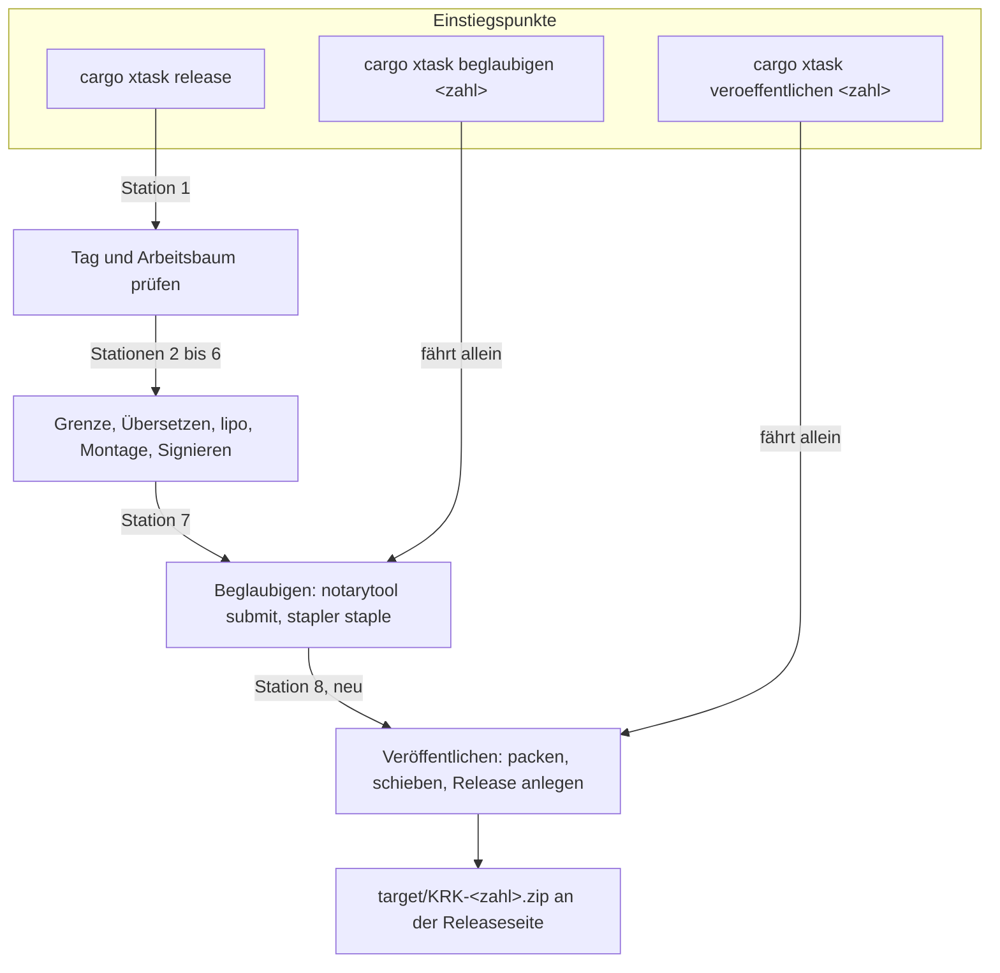
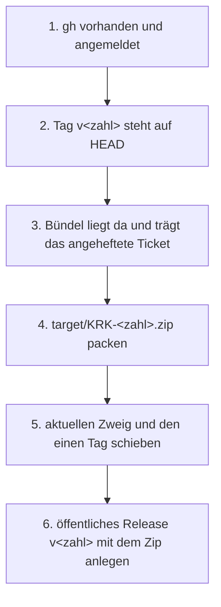

# Spec: Artefakt und Release

**Datum:** 2026-08-21
**Status:** Vom Nutzer am 260821 abgenommen, gebaut und am Baum belegt; 25 der 40 Abnahmekriterien sind an Proben und am Lesen abgenommen, 15 warten auf den Nutzer. Der Marker bleibt `_o_`; die Begründung steht unten im Abgleichsprotokoll.
**Baumstand bei der Abfassung:** `d771ec6`
**Quelle:** Nutzerwunsch vom 260821, „wie könnten wir eine Ersteinstall und eine Update-Function realisieren?", eingegrenzt in drei Klärungsrunden auf Artefakt und Release.
**Umfangswahl des Nutzers:** nur Artefakt und Release. Kein App-Code, keine neue Kiste, keine Netzverbindung zur Laufzeit. Aktualisieren heißt herunterladen und hinüberziehen.

## Directive

Nach dieser Runde entsteht aus einem beglaubigten Bündel mit einem Kommando ein weitergebbares
Zip, das an einer öffentlichen GitHub-Releaseseite hängt und den angehefteten Beglaubigungsnachweis
mitbringt. Die Seite sagt dem Nutzer in wenigen Zeilen, wie er die neue Fassung installiert, ohne
seine Daten zu verlieren. Wer KRK aktualisieren will, lädt das Zip von `releases/latest`,
entpackt es und zieht die App über die alte.

Der Anlass steht am 17.08. auf der Platte. Der Nutzer hat beim Installieren seinen ganzen
Ablageordner verloren, weil ein Löschwerkzeug die Stützdateien der App mitgenommen hat; mit dem
Ordner waren die Lesezeichen, die gesicherte Sitzung, die abweichende Tastenbelegung und die zwei
Notizzettel fort. Die Untersuchung und die daraus gezogene Betriebsregel stehen in
`fusion-workbench/shared/analyses/260820-2242-lesezeichenverlust-nach-installation.md`. Die Regel
lautet, die neue Fassung über die alte zu kopieren und die alte nicht vorher zu löschen. Sie ist
heute nirgends dort aufgeschrieben, wo der Nutzer sie beim Installieren liest, und genau diese
Stelle entsteht hier.

## Was diese Runde nicht ist: der Ersteinstall der Nutzerdaten

„Ersteinstall" im Sinne der Nutzerdaten ist gebaut und wird nicht angefasst. Der erste Start legt
`~/Library/Application Support/KRK/` an und schreibt `settings.toml` aus der eingebetteten Fassung,
wenn die Datei fehlt. Belegt ist das an den Geburtszeiten des Ordners und seiner drei ersten
Dateien vom 17.08. um 19:13:48, Beweisstücke B1 und B2 der genannten Untersuchung.

Diese Runde behandelt allein die Zustellung des Bündels: wie ein fertiges, beglaubigtes `KRK.app`
den Weg auf das Gerät des Nutzers findet. Sie schreibt keine Zeile Anwendungscode.

## Gestalt

Der neue Schritt ist die achte Station der Auslieferungskette und hat, wie die siebte seit dem
260820, zwei Rufer. Der zweite Weg existiert aus demselben Grund wie bei der Beglaubigung: ein
Lauf, der bis zur achten Station gekommen und am Hochladen gescheitert ist, soll dort wieder
ansetzen können, ohne beide Ziele erneut zu übersetzen.

Die innere Reihenfolge der achten Station ist festgelegt, weil sie entscheidet, was ein
abgebrochener Lauf hinterlässt. Die äußeren Voraussetzungen werden ganz zuerst geprüft, gepackt
wird vor dem Schieben, und die Releaseseite entsteht zuletzt.

Schritt 2 fährt nur der eigenständige Weg. Als Station 8 innerhalb von `release` hat Station 1
dieselbe Frage schon beantwortet, und ein zweites Mal fragen hieße, dieselbe Wahrheit an zwei
Stellen zu führen.

## Capabilities

### C1: Ein Unterbefehl, der veröffentlicht

**Beschreibung:** Das Bauwerkzeug bekommt einen achten Weg. Er nimmt ein fertiges, beglaubigtes
Bündel entgegen, packt es weitergebbar, schiebt den Stand zu GitHub und legt dort eine
Releaseseite mit dem Zip an. Er baut nichts, signiert nichts und beglaubigt nichts. Aufgerufen
wird er auf zwei Wegen: als achte Station eines vollständigen Auslieferungslaufs und
eigenständig mit der Versionszahl als einzigem Argument.

Die Trennung folgt der Gestalt, die das Projekt am 260820 für die Beglaubigung gewählt hat. Ein
Lauf, der bis hierher gekommen ist, hat rund eine Minute Übersetzung, `lipo`, die Signierung mit
gehärteter Laufzeitumgebung und einen Netzlauf zu Apple hinter sich. Scheitert allein das
Hochladen, etwa an einem Zeitüberlauf, dann soll der Nutzer diesen einen Schritt wiederholen
können.

**Name des Unterbefehls:** `veroeffentlichen` (Vorgabe, vom Nutzer überschreibbar). Deutsches
Verb im Infinitiv, wie `beglaubigen`; die englischen Namen `bundle`, `version` und `release`
stammen aus der Zeit vor dieser Konvention und bleiben, wie sie sind.

**Abnahmekriterien:**
- [ ] C1.1 `cargo xtask veroeffentlichen 0.5.6` läuft ohne weiteres Argument und ohne
      Umgebungsvariable durch, sofern die Voraussetzungen aus C5 erfüllt sind.
- [ ] C1.2 Der Befehl ohne Argument bricht mit dem Rückgabewert 2 ab (Aufruffehler) und nennt,
      dass er genau ein Argument nimmt, die Versionszahl.
- [ ] C1.3 Eine Zahl, die nicht aus drei Zahlenteilen ohne führendes `v` besteht, bricht
      ebenfalls als Aufruffehler ab, mit derselben Prüfung, die `beglaubigen` verwendet.
- [ ] C1.4 Ein vollständiger Lauf von `cargo xtask release` führt den Schritt als achte Station
      aus, ohne dass der Nutzer ein zweites Kommando tippt.
- [ ] C1.5 Der Befehl baut nichts: nach seinem Lauf sind weder das Bündel unter `target/KRK.app`
      noch die Übersetzungsergebnisse neu entstanden. Prüfbar an den Änderungszeiten des
      Bündelinhalts vor und nach dem Lauf.
- [ ] C1.6 Liegt kein Bündel unter `target/KRK.app`, bricht der Befehl ab und nennt den ganzen
      Weg (`./release.sh <zahl>`) als Abhilfe, so wie es `beglaubigen` heute tut.

### C2: Ein weitergebbares Zip, das den Beglaubigungsnachweis mitbringt

**Beschreibung:** Aus dem beglaubigten Bündel entsteht ein Zip, das ein zweiter Mac ohne
Rückfrage von Gatekeeper öffnet, auch ohne Netzverbindung. Dafür muss das Zip **nach** dem
Anheften des Tickets entstehen.

Das ist eine Korrektur an der heutigen Kette, und sie ist der Grund, warum das Zip nicht einfach
wiederverwendet werden kann. Der Ablauf in `xtask/src/beglaubigung.rs` packt das Bündel bei
`:344`, reicht es ein, löscht das Zip bei `:369` und heftet das Ticket erst bei `:379` an. Das
Zip der Einreichung entsteht also vor dem Ticket und trägt es nicht. Die achte Station packt
deshalb ein zweites Mal, mit demselben `ditto -c -k --keepParent`. Eine zweite Beglaubigung
findet nicht statt: das Ticket hängt am Bündel und reist mit jeder Kopie mit.

**Getroffene Entscheidungen:**
- Hülle: Zip, gepackt mit `ditto -c -k --keepParent`, derselbe Aufruf wie bei der Einreichung.
- Dateiname: `KRK-<zahl>.zip`, die Versionszahl steht also im Namen.
- Ablageort: `target/`, neben dem Bündel. Die Datei wird bei jedem Lauf neu gepackt und
  überschreibt eine gleichnamige aus einem früheren Lauf. `target/` ist der Ort, an dem dieses
  Projekt Bauergebnisse führt, und eine Datei, die dort liegt, ist erkennbar ein Bauergebnis und
  nichts, was aufgehoben werden müsste.
- Keine Prüfsumme daneben. Die Beglaubigung ist die stärkere Zusage und wird von macOS beim
  Öffnen selbst geprüft; eine Prüfsumme daneben verspräche eine Prüfung, die niemand fährt.

**Abnahmekriterien:**
- [ ] C2.1 Nach einem Lauf liegt `target/KRK-<zahl>.zip`, und die Zahl im Namen ist die des
      Arguments.
- [ ] C2.2 Entpackt man das Zip auf einem zweiten Mac ohne Netzverbindung und startet die App,
      erscheint keine Gatekeeper-Rückfrage.
- [ ] C2.3 Das aus dem Zip entpackte Bündel trägt das angeheftete Ticket. Das Kriterium ist an
      der Sache formuliert; welches Mittel es prüft, entscheidet der Planer (siehe
      „Randbedingungen").
- [ ] C2.4 Ein zweiter Lauf mit derselben Zahl schreibt die Datei neu und bricht nicht daran ab,
      dass sie schon dasteht.
- [ ] C2.5 Der Lauf reicht nichts ein Apple ein. Nachprüfbar daran, dass er ohne
      `KRK_NOTARY_PROFILE` und ohne vollständiges Xcode durchläuft.

### C3: Zweig und der eine Tag werden geschoben, eng begrenzt

**Beschreibung:** Der Befehl schiebt den Stand zu GitHub, damit die Releaseseite auf einen Tag
zeigt, den es dort auch gibt. Geschoben wird der aktuelle Zweig und genau ein Tag, `v<zahl>`,
und das nur, wenn dieser Tag auf HEAD steht. Nichts wird erzwungen, keine weitere Referenz
wandert mit.

Die Enge ist die Bedingung, unter der das Werkzeug überhaupt schieben darf. `xtask` ruft `git`
an genau einer Stelle, und eine Probe hält diese Zahl auf eins; die beiden schreibenden Kommandos
von `version` werden Wort für Wort daraufhin nachgesehen, dass sie keine Gewalt tragen. Ein
schiebendes Kommando ist das dritte dieser Art und gehört unter dieselbe Aufsicht.

**Getroffene Entscheidungen:**
- Geschoben werden zwei Referenzen: der aktuelle Zweig und `v<zahl>`. Sonst keine.
- Steht `v<zahl>` nicht auf HEAD, bricht der eigenständige Weg ab, bevor er etwas schiebt.
- Kein `--force`, kein `-f`, kein `--tags`, kein `--all`, kein `--mirror`, kein `--delete`.
- Wird das Schieben vom Server abgewiesen, etwa weil der Zweig zurückgefallen ist oder der Tag
  auf der Gegenseite anders steht, bricht der Lauf ab und nennt die Bedingung. Er erzwingt nichts.

**Abnahmekriterien:**
- [ ] C3.1 Nach einem Lauf trägt `git ls-remote --tags origin` den Tag `v<zahl>`, und der Zweig
      auf der Gegenseite steht auf demselben Stand wie der lokale.
- [ ] C3.2 Steht `v<zahl>` nicht auf HEAD, bricht der eigenständige Weg ab, nennt den erwarteten
      Tagnamen und schiebt nichts. Nachprüfbar daran, dass `git ls-remote` danach unverändert ist.
- [ ] C3.3 Der Lauf schiebt keine zweite Referenz. Nachprüfbar daran, dass die Zahl der Tags auf
      der Gegenseite um genau eins wächst.
- [ ] C3.4 Die Argumentliste des schiebenden Kommandos wird von einer Probe Wort für Wort
      nachgesehen, wie es `die_schreibenden_kommandos_tragen_keine_gewalt` in
      `xtask/src/version.rs` für Tag und Eintrag tut. Die Probe verwirft jede der sechs oben
      genannten Marken.
- [ ] C3.5 Die vorhandene Probe in `xtask/src/version.rs` wird bewusst erweitert und nicht
      umgangen: nach der Änderung deckt die Aufsicht **drei** schreibende Kommandos ab statt
      zwei, und die Erweiterung steht als solche im Prüfkommentar.
- [ ] C3.6 Die Probe `xtask_ruft_git_an_genau_einer_stelle` in `xtask/src/release.rs` bleibt
      grün: der neue Aufruf geht durch `xtask/src/git.rs` und legt keine zweite Aufrufstelle an.
- [ ] C3.7 Die drei lesenden Fragen in `xtask/src/git.rs` bleiben lesend. Die Probe
      `keine_der_drei_fragen_schreibt` läuft unverändert durch.

### C4: Eine öffentliche Releaseseite mit festem Text

**Beschreibung:** Auf GitHub entsteht ein Release zum Tag `v<zahl>`, sofort öffentlich und nicht
als Entwurf, mit dem Zip als angehängter Datei. Der Text der Seite kommt fest aus dem Werkzeug
und wird nicht aus der Versionsgeschichte erzeugt.

Der Text trägt vier Dinge: die Versionszahl, die Zeilen zum Installieren, den Hinweis auf die
Beglaubigung und macOS 15 als Untergrenze. Die Installationszeilen sind die Betriebsregel aus der
Untersuchung vom 260820, und sie stehen hier, weil dies die einzige Stelle ist, die der Nutzer im
Moment des Installierens vor Augen hat.

**Getroffene Entscheidungen:**
- Werkzeug: `gh release create`. Kein eigener Netzcode, keine neue Kiste.
- Der Inhalt des Texts steht als Konstante im Werkzeug. Kein `git log`, keine `RELEASE_NOTES.md`.
- Gleich öffentlich, kein Entwurf. Der Nutzer liefert aus, wenn er ausliefert.
- Die feste Adresse für den Nutzer ist die Seite `releases/latest`. Eine dauerhafte
  Direktadresse auf die Datei gibt es bewusst nicht, weil der Dateiname die Zahl trägt.
- Existiert das Release zu `v<zahl>` schon, bricht der Lauf ab und nennt die Lage. Es wird nichts
  überschrieben, weder die Seite noch die angehängte Datei.

**Abnahmekriterien:**
- [ ] C4.1 Nach einem Lauf zeigt `https://github.com/tenzoki/krk/releases/latest` das Release zu
      `v<zahl>`.
- [ ] C4.2 An dem Release hängt genau eine Datei, `KRK-<zahl>.zip`, und sie lässt sich ohne
      Anmeldung herunterladen.
- [ ] C4.3 Das Release ist kein Entwurf und keine Vorabfassung. Nachprüfbar daran, dass es ohne
      Anmeldung sichtbar ist.
- [ ] C4.4 Der Text der Seite nennt die Versionszahl.
- [ ] C4.5 Der Text nennt die Untergrenze macOS 15.
- [ ] C4.6 Der Text sagt, dass das Bündel beglaubigt ist und deshalb ohne Rückfrage startet.
- [ ] C4.7 Der Text sagt, wie installiert wird: entpacken, die neue Fassung über die alte
      kopieren, die alte **nicht** vorher löschen.
- [ ] C4.8 Der Text nennt die Folge des Löschens beim Namen: ein Werkzeug, das beim Löschen die
      Stützdateien mitnimmt, entfernt `~/Library/Application Support/KRK/` und damit die
      Lesezeichen, die gesicherte Sitzung, die abweichende Tastenbelegung und die zwei
      Notizzettel.
- [ ] C4.9 Der Text sagt, wie man sich absichert, wenn doch gelöscht werden muss: den Ordner
      `~/Library/Application Support/KRK/` vorher kopieren.
- [ ] C4.10 Ein zweiter Lauf mit derselben Zahl bricht ab, nennt das schon vorhandene Release
      und überschreibt es nicht.

### C5: Die äußeren Voraussetzungen werden zuerst geprüft

**Beschreibung:** Der Befehl prüft, dass `gh` vorhanden und angemeldet ist, bevor er packt und
schiebt. Eine fehlende Voraussetzung soll auffallen, solange noch nichts geschehen ist.

Damit hat die Auslieferungskette eine dritte äußere Voraussetzung. Die ersten zwei, das
vollständige Xcode und ein Apple-Entwicklerkonto, hängen an der siebten Station und stehen in der
`README.md`. `gh` hängt an der achten und ist auf diesem Gerät heute nicht installiert; geprüft
am 260821 mit `command -v gh`.

**Abnahmekriterien:**
- [ ] C5.1 Fehlt `gh`, bricht der Lauf ab, bevor er packt und bevor er schiebt, und nennt, dass
      die Veröffentlichung das GitHub-Kommandozeilenwerkzeug braucht.
- [ ] C5.2 Ist `gh` vorhanden, aber nicht angemeldet, bricht der Lauf an derselben Stelle ab und
      nennt den Handgriff `gh auth login`.
- [ ] C5.3 In beiden Fällen ist nach dem Abbruch weder ein Zip entstanden noch etwas geschoben.
      Nachprüfbar an `ls target/KRK-*.zip` und an `git ls-remote`.
- [ ] C5.4 Die Voraussetzungstabelle der `README.md` führt `gh` als dritte äußere Voraussetzung,
      mit der Angabe, wofür es gebraucht wird und woher es kommt.
- [ ] C5.5 Die `README.md` nennt den einmaligen Handgriff, mit dem die vorhandenen Tags
      nachgeschoben werden (siehe C6).

### C6: Die Dokumentation zieht nach

**Beschreibung:** Drei Texte beschreiben die Auslieferung heute, und alle drei sind nach dieser
Runde unvollständig: der Hilfetext von `xtask`, der Abschnitt „Auslieferung" der `README.md` und
die Zahl der Stationen, die beide nennen. Dazu kommt ein einmaliger Handgriff, den der Nutzer vor
dem ersten Lauf fahren muss, und ein offener Defekt am Hilfetext, der bei dieser Gelegenheit
mitgeht.

**Der einmalige Handgriff.** Die Gegenseite trägt heute genau einen Tag, `v0.1.0`. Lokal stehen
14. Es fehlen also **13** Tags, von `v0.2.0` bis `v0.5.5`; gemessen am 260821 mit
`comm -23` über `git tag -l` und `git ls-remote --tags origin`. Sie gehen einmalig mit
`git push origin --tags` hoch, von Hand, vor dem ersten Lauf des neuen Befehls. Der Befehl selbst
schiebt danach für immer nur seinen eigenen einen Tag; das Nachholen ist ausdrücklich nicht seine
Aufgabe, weil ein Kommando, das dreizehn Referenzen auf einmal schiebt, die Enge aus C3 aufgäbe.

**Abnahmekriterien:**
- [ ] C6.1 Der Hilfetext von `cargo xtask --hilfe` nennt den neuen Unterbefehl mit seinem
      Argument und sagt in einem Satz, was er tut.
- [ ] C6.2 Der Hilfetext sagt, dass der Befehl nichts baut und nichts beglaubigt.
- [ ] C6.3 Der Hilfetext und die `README.md` sprechen nach der Änderung von **acht** Stationen.
      Nachprüfbar daran, dass die Zeichenfolge „sieben Stationen" an keiner Stelle des Baums mehr
      steht.
- [ ] C6.4 Die `README.md` beschreibt die achte Station in derselben Form wie die sieben davor
      und nennt den eigenständigen Weg mit seinem vollständigen Aufruf.
- [ ] C6.5 Die `README.md` nennt den einmaligen Handgriff `git push origin --tags` als
      Voraussetzung des ersten Laufs und die Zahl der fehlenden Tags nicht als feste Zahl,
      sondern mit dem Kommando, das sie zählt.
- [ ] C6.6 Der Hilfetext zu `bundle` sagt, was das gebaute Bündel für die Weitergabe bedeutet,
      und schließt damit den Defekt
      `shared/issues/260815-1436_*_der-hilfetext-zu-bundle-schweigt-zur-weitergabe-obwohl-die-ausgabe-des-befehls-sie-jetzt-nennt.md`.
      Der Defektdatensatz wird auf `_c_` umbenannt und trägt eine `Resolved:`-Zeile.
- [ ] C6.7 Eine Probe hält Hilfetext und Verteilung des neuen Unterbefehls aneinander, wie es
      `beglaubigen_steht_in_verteilung_und_hilfe` in `xtask/src/main.rs` für den vorigen tut.

## Randbedingungen

**Das Kriterium für das Ticket ist an der Sache formuliert, das Mittel bleibt offen.** Geprüft
werden soll, dass das Bündel das angeheftete Ticket trägt. `xcrun stapler validate` beantwortet
diese Frage nicht zuverlässig offline: im Versuch hat es bei Apple nachgeladen, statt die
angeheftete Fassung zu lesen, und ist damit netzabhängig. Der Planer wählt das Mittel. Als
Beobachtung für ihn, nicht als Vorgabe: am beglaubigten Bündel auf diesem Gerät liegt neben
`Contents/_CodeSignature/` eine Datei `Contents/CodeResources`, deren Änderungszeit auf den
Beglaubigungslauf vom 260820 um 19:44 fällt, während `Info.plist` und die übrigen Bestandteile
die Zeit des Baus um 11:35 tragen.

**Der Defekt zum gemeinsamen Bauort wird gemildert und nicht behoben.** `cargo xtask bundle` und
`cargo xtask release` legen beide `target/KRK.app` an, und ein Entwicklungsbau überschreibt damit
ein beglaubigtes Bündel; der Datensatz ist
`shared/issues/260813-0026_o_bundle-und-release-schreiben-an-denselben-ort-und-ein-entwicklungsbau-zerstoert-das-beglaubigte-buendel.md`.
Die zwei Prüfungen aus `beglaubigen` fangen den Fall ab, weil ein zwischendurch gebautes
Entwicklungsbündel eine andere Signaturidentität trägt und keine gehärtete Laufzeitumgebung hat;
für die achte Station tut die Ticketprüfung aus C2.3 dasselbe. Das ist eine Milderung. Der
Datensatz bleibt offen, und diese Runde behauptet keinen Abschluss.

**`xtask` bleibt ohne Abhängigkeiten.** Das Bauwerkzeug führt heute keine einzige fremde Kiste.
Die Veröffentlichung ruft `gh` als Prozess und bringt keine Netzbibliothek mit.

**Es bleibt bei einer Aufrufstelle für `git`.** Der neue schiebende Aufruf geht durch
`xtask/src/git.rs`. Eine zweite Stelle wäre die zweite Wahrheit darüber, was das Bauwerkzeug in
den Arbeitsbaum schreiben darf, und der Modulkopf dort begründet die Einheit ausdrücklich.

**`bundle` bekommt keine neue Vorbedingung.** Die sieben Makefile-Ziele, die an `bundle` hängen,
laufen unverändert, und `make check` bekommt keine Abhängigkeit von `gh`. Die Probe
`allein_release_fragt_nach_tag_und_arbeitsbaum` bleibt grün.

**Prosa ist deutsch, Bezeichner sind englisch, wie überall in diesem Projekt.** Der feste Text der
Releaseseite ist an einen Nutzer gerichtet, dessen Sprache dieses Projekt kennt: er ist deutsch.

**Die zehn Zeitzusagen aus C8 der Runde 1 sind nicht berührt.** Diese Runde ändert keine Zeile
Anwendungscode, also gibt es nichts zu messen, und sie setzt keine elfte Zahl.

## Außerhalb des Umfangs

Der Nutzer hat den Umfang auf Artefakt und Release gesetzt. Draußen bleiben:

- **Ein Aktualisierungshinweis in der App.** KRK fragt nirgends nach, ob eine neuere Fassung
  vorliegt. Das verlangte eine Netzverbindung zur Laufzeit, und die ist ausgeschlossen.
- **Ein Homebrew-Cask.** Kein Paketverwalter, keine Formel, keine dritte Bezugsquelle.
- **Der volle Selbstaustausch des Bündels.** KRK lädt sich nicht selbst herunter und ersetzt sich
  nicht selbst. Aktualisieren bleibt ein Handgriff des Nutzers.
- **Jeder Anwendungscode.** Keine neue Kiste, keine Änderung an `krk-core`, `krk-ui` oder
  `krk-bench`.
- **Eine Prüfsumme neben dem Zip** und **eine dauerhafte Direktadresse** auf die Datei. Beide
  sind bewusst aufgegeben, mit den Gründen unter C2 und C4.
- **Eine erzeugte Änderungsliste.** Kein `git log`, keine `RELEASE_NOTES.md`.
- **Der Ersteinstall der Nutzerdaten.** Gebaut und unverändert, siehe den Abschnitt oben.
- **Das Nachholen der 13 fehlenden Tags durch das Werkzeug.** Einmaliger Handgriff des Nutzers.

## Drei verworfene Wege

Die drei Wege, gegen die der Umfang geschnitten wurde, mit dem Grund und mit dem, was sie
gekostet hätten:

1. **Der Aktualisierungshinweis in der App.** KRK fragte beim Start oder auf Befehl eine Adresse
   ab und meldete, wenn eine neuere Fassung vorliegt. Verworfen, weil er eine Netzverbindung zur
   Laufzeit einführte, also eine neue Kiste, einen neuen Fehlerweg beim Start und eine neue Frage
   nach dem Verhalten ohne Netz. Der Nutzen wäre eine Meldung, die eine Seite ersetzt, die er
   ohnehin öffnet.
2. **Das Homebrew-Cask.** Der Nutzer installierte mit `brew install --cask krk` und aktualisierte
   mit `brew upgrade`. Verworfen, weil es eine zweite Bezugsquelle mit eigener Pflege wäre, deren
   Formel bei jeder Auslieferung nachzuziehen ist, und weil sie die Zustellung an ein fremdes
   Werkzeug bindet, ohne das Zip überflüssig zu machen.
3. **Der volle Selbstaustausch des Bündels.** KRK lüde die neue Fassung herunter, prüfte sie,
   ersetzte sich selbst und startete neu. Verworfen als der weitaus größte der drei: er verlangt
   Netzcode, eine Prüfung der geladenen Fassung, das Ersetzen einer laufenden Anwendung und einen
   Rückweg für den Fall, dass das Ersetzen mittendrin scheitert. Genau in dieser Gegend liegt der
   Vorfall vom 17.08., und ein selbstgebauter Austauschweg brächte dieselbe Klasse von Verlust
   näher heran, statt sie zu entfernen.

Keiner der drei ist dauerhaft ausgeschlossen. Verworfen sind sie für diese Runde.

## Offen für den Planer

- Das Mittel, mit dem das angeheftete Ticket geprüft wird (C2.3). Netzunabhängig, und keine
  Prüfung, die bei Apple nachlädt.
- Wie die Anmeldung von `gh` erfragt wird und woran ein nicht angemeldeter Zustand erkannt wird.
- Die Aufteilung in Module: ob der neue Weg eine eigene Datei unter `xtask/src/` bekommt, wie es
  `beglaubigung.rs` am 260820 getan hat.
- Ob die schiebenden Argumente als Konstante oder als reine Funktion entstehen. Die Probe aus
  C3.4 muss sie in beiden Fällen Wort für Wort nachsehen können.
- Wie der feste Text der Releaseseite im Werkzeug geführt wird und wie die Versionszahl
  hineinkommt.
- Der Wortlaut aller Abbruchmeldungen, nach dem Muster, das dieses Projekt führt: die Bedingung
  benennen, die Zahl nennen, den Handgriff nennen.
- Die Reihenfolge, in der Zweig und Tag geschoben werden, und ob das ein Aufruf ist oder zwei.
- Wie der Titel des Releases lautet.

## Offene Nutzerentscheidungen

- [ ] Bekommt der neue Unterbefehl eine eigene Hülle wie `certify-only.sh` und ein Makefile-Ziel?
      Der Spec fährt vorläufig auf der schmalsten Fassung, also ohne beides; der Aufruf ist dann
      `cargo xtask veroeffentlichen <zahl>` mit vollem Pfad zu cargo. Datensatz:
      `shared/decisions/260821-1115_o_bekommt-der-veroeffentlichungsbefehl-eine-eigene-huelle-wie-certify-only-sh.md`.
- [ ] Der Name des Unterbefehls, `veroeffentlichen`, ist eine Vorgabe und keine Wahl des Nutzers.
      Er kann sie beim Durchsehen dieses Specs überschreiben.

---

## Reconciliation Log

**260821-1532, Reconciler, Baumstand `4e810f9`.** Erste Beurteilung dieses Specs.

### Was gemessen ist

| Gegenstand | Ergebnis |
|---|---|
| Elf Planschritte gegen den Baum | alle elf belegt; `xtask/src/veroeffentlichung.rs` steht mit 1.090 Zeilen, die achte Station hängt in `release` und im Hilfetext |
| `cargo test --workspace` | grün, `xtask` liefert 155 Proben |
| `cargo clippy --workspace --all-targets` | Rückgabewert 0 |
| `cargo fmt --all --check` | Rückgabewert 0 |
| Abnahmekriterien im Spec gezählt | 40 |
| Zuordnungstabelle des Plans | 40 Zeilen, keine Doppelung, keine Lücke |
| C6.3 am Quellbaum | „sieben Stationen" kommt in `README.md`, `Makefile` und `xtask/**.rs` nicht mehr vor; `acht Stationen` steht in vier Dateien |
| Geschoben worden ist nichts | `origin/main` steht auf `01d2365`, HEAD lokal auf `4e810f9` |

### Warum der Marker `_o_` bleibt

Aus demselben Grund, aus dem der Abgleich vom 260820-2056 die zwei Specs
`260819-2216_*_spec-auswahl-und-kopieren-in-der-vorschau.md` und
`260816-1310_*_spec-inhaltsfilter-der-dateiliste.md` hat stehen lassen: ein `_c_` an einem Spec
entschiede die offene Frage
`shared/decisions/260819-1440_*_was-sagt-der-marker-c-an-einem-spec-gebaut-oder-abgenommen.md`
durch vollendete Tatsache.

**Die Lage ist an dieser Datei dieselbe, und sie ist nachgemessen und nicht angenommen.** Die
zwei Lesarten fallen auseinander: nach der Lesart der belegten Bauarbeit stünde der Spec auf
`_c_` (elf von elf Planschritten belegt, vier Durchsichten gefahren, alle Befunde behoben oder
als eigener Datensatz abgelegt), nach der Lesart der Abnahmekriterien nicht — 15 der 40 sind
ohne den Nutzer nicht abzunehmen, und der Plan führt sie unter `## Abnahme durch den Nutzer`
einzeln auf. Was ihnen fehlt, liegt außerhalb des Baums: `gh` ist auf diesem Gerät nicht
installiert, es gibt keine Anmeldung, und `git push origin --tags` ist nie gefahren.

### Was daneben berichtigt ist

Die Kopfzeile `**Status:**` stand auf „Entwurf". Der Spec ist am 260821 vom Nutzer abgenommen
(`77b84bb`) und vollständig gebaut; „Entwurf" war seit jenem Commit falsch. Der Dateimarker ist
dabei nicht bewegt worden.

### Was offen bleibt und diesen Spec bindet

- `shared/issues/260821-1221_*_das-abnahmekriterium-c6-3-enthaelt-die-zeichenfolge-die-es-verbietet.md`
  — C6.3 ist so, wie es hier dasteht, selbstbezüglich unerfüllbar. Der Plan begrenzt die Zusage
  auf den Quellbaum; am Wortlaut des Kriteriums ist nichts geändert.
- `shared/decisions/260821-1115_*_bekommt-der-veroeffentlichungsbefehl-eine-eigene-huelle-wie-certify-only-sh.md`
  — weiter offen. Der Baum hat keine Hülle bekommen, und das ist die vorläufige Fassung des
  Specs und keine Antwort.

### 260829-1252 — Aufräumlauf nach den Runden 19–22, am Baum `b9d9cbc`

**Zwei weitere Auslieferungen sind durch die Kette gelaufen, ohne dass sich an ihr etwas geändert hat.** `d2824c5` (1.3.0, nach der Runde 22) und `b9d9cbc` (1.4.0, nach der Runde 21) tragen je allein die Versionszahl; `git diff a5c7a46..HEAD --stat -- xtask/ release.sh certify-only.sh Makefile` ist leer. `git tag -l --sort=creatordate | tail -2` nennt `v1.3.0` und `v1.4.0` auf genau diesen Commits. Die 15 Nutzerkriterien sind damit nicht abgenommen, aber ein weiteres Mal in Gebrauch gewesen. Statuszeile und Marker unverändert; die zwei bindenden Datensätze (`260821-1221_*_c6-3-…`, `260821-1115_*_bekommt-der-veroeffentlichungsbefehl-eine-eigene-huelle-…`) sind weiter offen.
