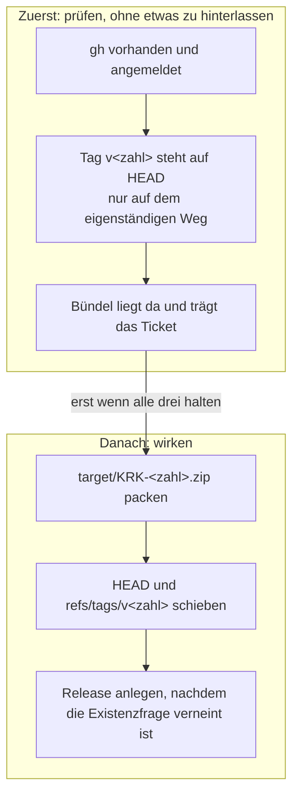
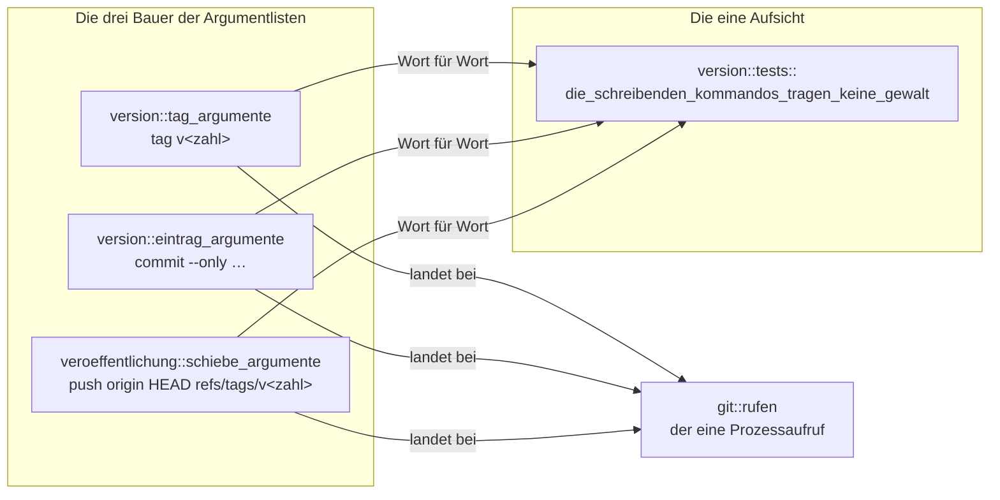
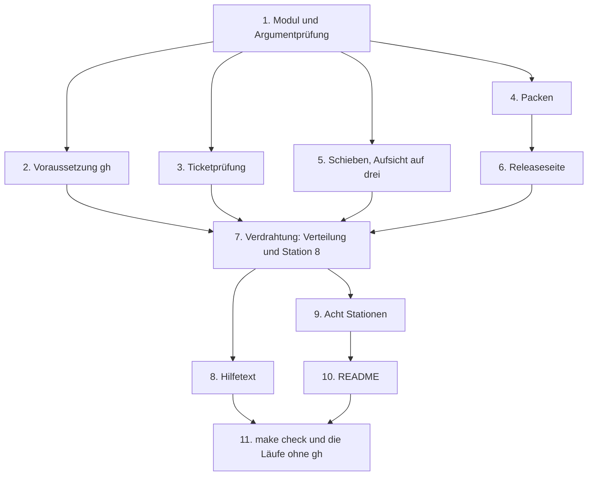

# Implementation Plan: Artefakt und Release

**Datum:** 2026-08-21
**Status:** Complete
**Spec:** `fusion-workbench/shared/planning/260821-1115_o_spec-artefakt-und-release.md`, vom Nutzer am 260821 abgenommen
**Baumstand bei der Abfassung:** `77b84bb`
**Decidability:** Die tragende Frage dieser Runde lautet: trägt das Bündel, das gleich zu GitHub hochgeladen wird, das angeheftete Beglaubigungsticket? Sie ist entscheidbar aus dem, was das Werkzeug in der Hand hält, denn das Ticket ist eine Datei im Bündel und keine Auskunft eines fremden Dienstes. Am ausgelieferten Bündel dieses Geräts liegt `Contents/CodeResources` mit der Kennung `s8ch` in den ersten vier Bytes, und die Datei stammt nachweislich aus dem Heftungslauf. Das Mittel, das der Spec verworfen sehen wollte, `xcrun stapler validate`, beantwortet dagegen eine andere Frage: es fragt Apple, ob dieser Stand beglaubigt ist, und braucht dafür eine Netzverbindung, die die Zusage aus C2 gerade nicht voraussetzen darf. Die zweite tragende Frage, ob dieses Kommando schieben darf, ist aus demselben Grund entscheidbar: das Werkzeug baut die Argumentliste selbst als Vektor von Wörtern, statt eine fremde Zeichenkette zu deuten. Beide Fragen brauchen keinen Wechsel des Mechanismus.

## Directive

Aus einem beglaubigten Bündel entsteht mit einem Kommando ein weitergebbares Zip, das an
einer öffentlichen GitHub-Releaseseite hängt und den angehefteten Beglaubigungsnachweis
mitbringt. Die Seite sagt dem Nutzer, wie er installiert, ohne seine Daten zu verlieren. Der
Spec führt die sechs Capabilities und die 40 Abnahmekriterien aus; dieser Plan wiederholt sie
nicht, sondern ordnet sie Schritten zu.

## Aktueller Stand

Am Baum gemessen, nicht geschätzt.

**Das Bauwerkzeug** trägt fünf Unterbefehle (`bundle`, `version`, `release`, `beglaubigen`,
`messen`), keine einzige fremde Kiste und ruft ausschließlich Prozesse auf. Die Aufteilung, an
der sich der neue Weg orientiert, ist am 260820 entstanden: `beglaubigung.rs` hält Station 7
und wird von zwei Rufern angesprochen, von `release::ausfuehren` als Station und von seinem
eigenen `ausfuehren` als ganzer Lauf.

**Drei Proben stehen dem neuen Weg im Weg oder daneben**, und jede verlangt eine eigene
Behandlung:

- `die_schreibenden_kommandos_tragen_keine_gewalt` (`xtask/src/version.rs:779`) sieht die
  Argumentlisten der zwei schreibenden Kommandos Wort für Wort nach und verwirft dabei unter
  anderem die Marke `push`. Ein schiebendes Kommando ist das dritte seiner Art, und die Probe
  ist bewusst zu erweitern. Schritt 5 schreibt aus, wie die Zusage danach lautet.
- `xtask_ruft_git_an_genau_einer_stelle` (`xtask/src/release.rs:1029`) zählt die Vorkommen von
  `Command::new("/usr/bin/git")` im ganzen Baum und hält sie auf eins. Der neue Aufruf geht
  über `git::rufen` und legt keine zweite Stelle an; die Probe bleibt unverändert grün.
- `allein_release_fragt_nach_tag_und_arbeitsbaum` (`xtask/src/release.rs:1051`) hält den Namen
  `auslieferungsstand_pruefen` an genau einer Datei fest. Der neue Weg fragt zwar ebenfalls
  nach dem Tag, darf diese Funktion aber nicht rufen: sie prüft zusätzlich den Arbeitsbaum und
  vergleicht gegen `env!("CARGO_PKG_VERSION")`, und beides gehört hier nicht hin. Er stellt die
  Frage stattdessen mit `git::TAGS_AUF_HEAD` und `git::tag_steht`, den beiden Bausteinen, aus
  denen jene Funktion selbst gebaut ist.

**Das Ticket liegt offen erkennbar im Bündel.** Am ausgelieferten `target/KRK.app` steht
`Contents/CodeResources` mit Änderungszeit 19:44 des 260820, während `Info.plist`, `PkgInfo`,
`MacOS/` und `_CodeSignature/CodeResources` die Bauzeit 11:35 tragen. Die Datei beginnt mit den
vier Bytes `s8ch`, gefolgt von einer DER-Struktur; die gleichnamige Datei unter
`_CodeSignature/` ist dagegen eine XML-Eigenschaftsliste. Kein Aufruf in `xtask/src/` schreibt
`Contents/CodeResources`: die Zeichenfolge steht in `xtask/`, `Makefile` und `README.md` an
keiner Stelle. Geschrieben hat sie `xcrun stapler staple`. Damit ist die Ticketfrage offline
und ohne fremden Dienst zu beantworten.

**Die äußere Voraussetzung fehlt heute.** `command -v gh` findet nichts. Gemessen am 260821.

**Die Gegenseite trägt einen Tag.** Lokal stehen 14 (`v0.1.0` bis `v0.5.5`, ohne `v0.4.2`), auf
`origin` steht allein `v0.1.0`. Es fehlen 13. Der Spec nennt an jeder seiner drei Stellen
dieselbe Zahl 13, und die Zahl stimmt mit der Messung überein; eine abweichende Angabe von 15
steht in ihm nicht, und es ist an ihm nichts zu berichtigen. Wer den Spec danach durchsucht,
findet allein die Untergrenze macOS 15.

**Sieben Prosastellen sprechen von sieben Stationen**, verteilt auf `README.md` (drei),
`xtask/src/version.rs` (zwei), `xtask/src/main.rs` (eine) und `xtask/src/release.rs` (eine).
Vier weitere stehen in der Werkbank, drei davon in Aufzeichnungen eines Standes, die ihren
damaligen Wortlaut behalten, und die vierte im Abnahmekriterium C6.3 selbst. Schritt 9 zieht
die Folgerung daraus.

## Ansatz

Der neue Weg entsteht als eigenes Modul `xtask/src/veroeffentlichung.rs`, in derselben Gestalt,
die `beglaubigung.rs` am 260820 bekommen hat: ein `ausfuehren` für den eigenständigen Aufruf,
eine aufrufbare Funktion für die Station innerhalb von `release`, und ein Modulkopf, der sagt,
was der Weg ausdrücklich nicht prüft.

Die Gestalt ist damit nicht neu erfunden, sondern von der siebten Station übernommen. Das ist
die tragende Entscheidung dieses Plans, und sie folgt dem, was der Baum an dieser Stelle schon
kann: die Trennung zwischen dem ganzen Lauf und der Wiederaufnahme einer einzelnen Station
existiert, sie hat ihre Rufer, ihre Hüllen und ihre Begründung im Modulkopf. Eine zweite
Bauform daneben wäre eine zweite Antwort auf dieselbe Frage.

**Jede Prüfung zerfällt in eine reine Hälfte und einen Prozessaufruf.** Das ist das Muster, das
`beglaubigung.rs` durchgehend führt: `signaturstand_pruefen` nimmt eine Zeichenkette und gibt
die fertige Abbruchmeldung zurück, `signaturanzeige` holt die Zeichenkette. Die reine Hälfte
ist ohne Bündel, ohne Netz und ohne fremdes Werkzeug abnehmbar, und genau dort liegen die
Proben. Der neue Weg hält es ebenso: `traegt_angeheftetes_ticket` liest Bytes,
`releasetext` baut eine Zeichenkette, `schiebe_argumente` baut einen Vektor von Wörtern.

**Der Umgang mit den Meldungen fremder Werkzeuge folgt der Regel, die `git.rs` schon aufstellt.**
Dort steht die erste der drei Fragen getrennt, damit die Antwort nicht am Wortlaut einer
Fehlermeldung hängt. Aus demselben Grund fragt Schritt 6 mit einem eigenen `gh release view`,
ob das Release schon steht, statt die Fehlermeldung von `gh release create` zu deuten.

### Die innere Reihenfolge der achten Station

Die sechs Schritte aus dem zweiten Diagramm des Specs sind verbindlich. Sie stehen so im
Rumpf, und die Reihenfolge trägt eine Zusage: was zuerst geprüft wird, hinterlässt bei einem
Abbruch nichts.

### Wo die drei schreibenden Kommandos stehen und wer sie beaufsichtigt

Das ist der Punkt, an dem dieser Plan eine bestehende Zusage umformuliert, und deshalb steht er
als eigenes Bild da.

Die Aufsicht ist im Bild eine Senke, und das ist richtig so: sie führt nichts aus, sondern liest
die drei Listen, die bei `git::rufen` landen, und keine anderen. Genau daran hängt ihre
Aussagekraft. Die drei Bauer zeigen zusammen auf einen einzigen Prozessaufruf, weil es im ganzen
Baum einen gibt; das ist der Grund für die Bündelung und keine Enge im Entwurf.

## Implementation Steps

Die Abhängigkeiten der elf Schritte untereinander:

---

1. [DONE] **Das Modul anlegen, mit Argumentprüfung und Bündelfrage**
   - Executor: `coder`
   - Dateien: `xtask/src/veroeffentlichung.rs` (neu), `xtask/src/main.rs` (allein die
     `mod`-Zeile)
   - Änderungen: Modulkopf nach dem Muster von `beglaubigung.rs`, mit vier Aussagen: wozu der
     Weg da ist, dass er nichts baut, dass er nichts einreicht, und was er ausdrücklich nicht
     prüft, nämlich den Arbeitsbaum. `pub(crate) fn ausfuehren(argumente: &[String])` zerlegt
     mit `let [zahl] = argumente else` und meldet bei jeder anderen Zahl von Argumenten einen
     Aufruffehler, dessen Text die Wendung „genau ein Argument" trägt, wie ihn die zwei
     vorhandenen Wege führen. Danach `version::versionszahl_pruefen(zahl)`, dieselbe Prüfung
     wie bei `beglaubigen`, ebenfalls auf `Abbruch::Aufruf` abgebildet. Anschließend die Frage
     nach `bundle::buendelpfad(&bundle::wurzel())`; fehlt es, nennt der Abbruch `./release.sh
     <zahl>` als Abhilfe, wörtlich in der Form, die `beglaubigung.rs` führt.
   - Proben: `veroeffentlichen_nimmt_genau_ein_argument` nach dem Vorbild von
     `beglaubigen_nimmt_genau_ein_argument`, mit den drei Fällen kein Argument, zwei Argumente,
     `v0.5.6`.
   - Kriterien: C1.2, C1.3, C1.6
   - Abhängigkeiten: keine

2. [DONE] **Die äußere Voraussetzung `gh` prüfen, ganz zuerst**
   - Executor: `coder`
   - Dateien: `xtask/src/veroeffentlichung.rs`
   - Änderungen: zwei Fragen in einer Funktion `gh_pruefen()`. Die erste ist ein Startversuch
     von `gh --version`; scheitert schon das Starten, fehlt das Werkzeug. Die zweite ist
     `gh auth status`, und allein sein Rückgabewert entscheidet: ungleich null heißt nicht
     angemeldet. Beide Meldungen entstehen als reine Funktionen, damit ihr Wortlaut ohne `gh`
     abnehmbar ist; die erste nennt, dass die Veröffentlichung das GitHub-Kommandozeilenwerkzeug
     braucht, die zweite nennt `gh auth login`.
   - **`gh` wird über den Suchpfad gerufen und nicht über einen absoluten Pfad.** Das weicht von
     der Gewohnheit des Baums ab, der `/usr/bin/git`, `/usr/bin/codesign`, `/usr/bin/ditto` und
     `/usr/bin/xcrun` mit vollem Pfad ruft, und die Abweichung gehört in den Modulkopf: `gh`
     wird nachinstalliert und liegt je nach Architektur unter `/opt/homebrew/bin` oder unter
     `/usr/local/bin`, ein fester Pfad wäre also auf einem der beiden Geräte falsch. Der
     Datensatz dazu steht unter „Open Questions".
   - Proben: der Wortlaut beider Meldungen; dazu eine Quelltextprobe über `include_str!`, dass
     der Aufruf von `gh_pruefen` im Rumpf von `ausfuehren` vor dem Packen und vor dem Schieben
     steht, nach dem Muster von `die_standpruefung_steht_vor_der_ersten_uebersetzung`.
   - Kriterien: C5.1, C5.2, C5.3
   - Abhängigkeiten: Schritt 1

3. [DONE] **Die Ticketprüfung, netzunabhängig**
   - Executor: `coder`
   - Dateien: `xtask/src/veroeffentlichung.rs`
   - Änderungen: zwei Konstanten und eine reine Funktion. `TICKETDATEI` ist
     `Contents/CodeResources`, `TICKETKENNUNG` sind die vier Bytes `s8ch`, und
     `traegt_angeheftetes_ticket(inhalt: &[u8]) -> bool` fragt allein nach dem Anfang. Die
     Funktion trägt `#[must_use]`, weil ihr stilles Fallenlassen genau den Fall durchließe, den
     sie abfangen soll. Der Doc-Kommentar hält die Messung fest, auf der sie steht: die Datei
     stammt aus dem Heftungslauf des 260820, kein Aufruf in `xtask/` schreibt sie, und die
     gleichnamige unter `_CodeSignature/` ist eine XML-Eigenschaftsliste und keine Verwechslung.
     Er sagt außerdem, warum `xcrun stapler validate` nicht genommen ist. Die Abbruchmeldung
     nennt die Bedingung, den Pfad und den Handgriff `./certify-only.sh <zahl>`.
   - Proben: die reine Funktion gegen die vier Bytes, gegen einen leeren Puffer, gegen eine
     XML-Eigenschaftsliste und gegen einen Puffer, der die Kennung erst später trägt.
   - Kriterien: C2.3
   - Abhängigkeiten: Schritt 1

4. [DONE] **Das Zip packen, nach dem Heften**
   - Executor: `coder`
   - Dateien: `xtask/src/veroeffentlichung.rs`
   - Änderungen: eine reine Funktion `zipname(zahl: &str) -> String` mit dem Ergebnis
     `KRK-<zahl>.zip`, abgelegt neben dem Bündel unter `target/`. Der Aufruf ist dasselbe
     `ditto -c -k --keepParent`, das `beglaubigung::beglaubigen` für die Einreichung führt; die
     Datei wird bei jedem Lauf neu geschrieben. Der Doc-Kommentar sagt, warum ein zweites Mal
     gepackt wird und nicht das Zip der Einreichung wiederverwendet: jenes entsteht in
     `beglaubigung.rs:344` vor der Einreichung, wird `:369` gelöscht, und das Heften läuft erst
     `:379`. Er sagt außerdem, dass die zwei Namen sich nicht ins Gehege kommen, weil die
     Einreichung `target/KRK.zip` packt und dieser Weg `target/KRK-<zahl>.zip`.
   - Proben: `zipname` gegen zwei Zahlen; dazu eine Quelltextprobe, dass das Modul weder
     `notarytool` noch `NOTAR_PROFIL_VARIABLE` noch `stapler` nennt, mit den Nadeln als
     `concat!`, weil die Probe in der Datei liegt, die sie liest.
   - Kriterien: C2.1, C2.2, C2.4, C2.5
   - Abhängigkeiten: Schritt 1

5. [DONE] **Schieben, und die Aufsicht von zwei auf drei Kommandos erweitern**
   - Executor: `coder`
   - Dateien: `xtask/src/veroeffentlichung.rs`, `xtask/src/git.rs` (Modulkopf),
     `xtask/src/version.rs` (Probe und ihr Prüfkommentar)
   - Änderungen: `pub(crate) fn schiebe_argumente(tagname: &str) -> Vec<&str>` liefert genau
     vier Wörter, `push`, `origin`, `HEAD` und `refs/tags/<tagname>`. **Es ist ein Aufruf und
     nicht zwei**, weil zwei Aufrufe einen Zwischenzustand hätten, in dem der Zweig oben steht
     und der Tag nicht, und weil eine Liste, die beide Referenzen trägt, in einer Probe an einer
     Stelle nachzusehen ist. **Geschoben wird `HEAD` und nicht der Zweigname**, damit keine
     vierte lesende Frage nach `git.rs` kommt; C3.7 verlangt, dass die vorhandene Probe über
     die drei Fragen unverändert durchläuft, und eine vierte Konstante änderte sie. `HEAD` als
     Quellreferenz schreibt auf der Gegenseite in den Zweig gleichen Namens; ein losgelöster
     HEAD lässt den Aufruf mit der Meldung von `git` scheitern, und der Lauf bricht ab, ohne
     etwas zu erzwingen.
     Der eigenständige Weg fragt vorher, ob `v<zahl>` auf HEAD steht, mit `git::TAGS_AUF_HEAD`
     und `git::tag_steht`; die Station innerhalb von `release` fragt nicht, weil Station 1
     dieselbe Wahrheit schon beantwortet hat. **`auslieferungsstand_pruefen` wird dabei nicht
     gerufen**: jene Funktion prüft zusätzlich den Arbeitsbaum und vergleicht gegen die
     eingebackene Zahl, und die Probe `allein_release_fragt_nach_tag_und_arbeitsbaum` hält
     ihren Namen an einer Datei fest.
   - **Wie die Zusage der erweiterten Probe danach lautet.** Sie sagt heute, dass keines der
     zwei schreibenden Kommandos eine Marke trägt, die seine Reichweite erweitert, und
     `push` steht dabei in derselben Liste wie `--force`. Das geht nicht weiter, sobald das
     dritte Kommando `push` **ist**. Die Zusage wird deshalb in zwei Hälften geteilt, und die
     Teilung ist trennscharf und vollständig:
     - **Das erste Wort ist der Unterbefehl und wird auf Gleichheit geprüft**, je Kommando
       einzeln: `tag`, `commit`, `push`. Damit ist gesagt, dass jedes der drei genau eine Sache
       tut, und `push` an der einen Stelle erlaubt und an den zwei anderen ausgeschlossen ist,
       ohne dass eine Ausnahmeliste nötig wäre.
     - **Die Wörter danach tragen keine Marke, die Reichweite oder Gewalt hinzufügt.** Die Liste
       umfasst die sechs aus C3 (`--force`, `-f`, `--tags`, `--all`, `--mirror`, `--delete`) und
       die drei, die schon dastehen (`--amend`, `--no-verify`, `-a`); `add` fällt weg, weil die
       Prüfung des ersten Worts es abdeckt.
     Der Prüfkommentar schreibt aus, dass die Aufsicht seit dem 260821 drei Kommandos deckt und
     dass der dritte Bauer in `veroeffentlichung` steht, während die Aufsicht hier bleibt, weil
     es eine ist. Der Modulkopf von `git.rs` sagt heute, die schreibenden Kommandos entstünden
     „in `version`"; er wird auf drei Bauer und zwei Orte nachgezogen.
   - Proben: `schiebe_argumente` Wort für Wort; die erweiterte
     `die_schreibenden_kommandos_tragen_keine_gewalt` über alle drei; die Tagprüfung des
     eigenständigen Wegs als reine Funktion mit ihrer Meldung, die den erwarteten Tagnamen
     nennt. `xtask_ruft_git_an_genau_einer_stelle` und `keine_der_drei_fragen_schreibt` bleiben
     unangetastet und müssen grün bleiben.
   - Kriterien: C3.1, C3.2, C3.3, C3.4, C3.5, C3.6, C3.7
   - Abhängigkeiten: Schritt 1

6. [DONE] **Die Releaseseite mit festem Text**
   - Executor: `coder`
   - Dateien: `xtask/src/veroeffentlichung.rs`
   - Änderungen: der Text steht als Konstante mit einer einzigen Fügestelle für die Zahl, und
     eine reine Funktion `releasetext(zahl: &str) -> String` setzt sie ein; `releasetitel(zahl)`
     liefert `KRK <zahl>`. Der Text ist deutsch und trägt sieben Aussagen: die Versionszahl, die
     Untergrenze macOS 15, dass das Bündel beglaubigt ist und deshalb ohne Rückfrage startet,
     die drei Installationszeilen (entpacken, die neue Fassung über die alte kopieren, die alte
     nicht vorher löschen), die benannte Folge des Löschens (ein Werkzeug, das Stützdateien
     mitnimmt, entfernt `~/Library/Application Support/KRK/` und damit die Lesezeichen, die
     gesicherte Sitzung, die abweichende Tastenbelegung und die zwei Notizzettel) und die
     Absicherung, den Ordner vorher zu kopieren. Der Wortlaut folgt dem Abschnitt „Betriebsregel
     für den Austausch der App" der Untersuchung vom 260820.
     Vor dem Anlegen steht die Existenzfrage: `gh release view v<zahl>`, und ein Rückgabewert
     gleich null heißt, das Release steht schon. Dann bricht der Lauf ab, nennt die Lage und
     überschreibt nichts. Die eigene Frage steht hier aus demselben Grund, aus dem `git.rs`
     seine erste Frage getrennt führt: die Antwort soll nicht am Wortlaut einer Fehlermeldung
     von `gh` hängen. Das Anlegen ist `gh release create v<zahl> --title … --notes … <zip>`,
     ohne `--draft` und ohne `--prerelease`, gerufen mit `.current_dir` auf der Projektwurzel,
     damit `gh` das Vorhaben aus der Gegenstelle des Verzeichnisses bestimmt.
   - Proben: `releasetext` gegen alle sieben Aussagen einzeln, jede mit einer eigenen
     Behauptung, damit ein Ausfall benennt, welche fehlt; `releasetitel` gegen die Zahl; eine
     Quelltextprobe, dass das Modul weder `--draft` noch `--prerelease` nennt.
   - Kriterien: C4.1, C4.2, C4.3, C4.4, C4.5, C4.6, C4.7, C4.8, C4.9, C4.10
   - Abhängigkeiten: Schritt 4

7. [DONE] **Verdrahten: Verteilung und die achte Station**
   - Executor: `coder`
   - Dateien: `xtask/src/main.rs`, `xtask/src/release.rs`
   - Änderungen: der Zweig `"veroeffentlichen" => veroeffentlichung::ausfuehren(&argumente[1..])`
     in der Verteilung. In `release::ausfuehren` der Aufruf der achten Station hinter
     `beglaubigung::beglaubigen`, mit der Zahl aus `env!("CARGO_PKG_VERSION")`, denn `release`
     nimmt kein Argument. Der Modulkopf von `release.rs` bekommt die achte Station in derselben
     Form wie die sieben davor.
   - Proben: eine Quelltextprobe über `include_str!`, dass der Rumpf von
     `release::ausfuehren` die achte Station hinter der Beglaubigung ruft, nach dem Muster von
     `die_standpruefung_steht_vor_der_ersten_uebersetzung`; die Probe `dieser_weg_baut_nichts`
     für das neue Modul, mit denselben drei Nadeln (`bundle::uebersetzen`,
     `bundle::vorbereiten`, `/usr/bin/lipo`), erweitert um `sign::` und `codesign`.
   - Kriterien: C1.1, C1.4, C1.5
   - Abhängigkeiten: Schritte 2, 3, 5, 6

8. [DONE] **Der Hilfetext, und der Defekt am Hilfetext zu `bundle`**
   - Executor: `coder`
   - Dateien: `xtask/src/main.rs`,
     `fusion-workbench/shared/issues/260815-1436_*_der-hilfetext-zu-bundle-schweigt-zur-weitergabe-obwohl-die-ausgabe-des-befehls-sie-jetzt-nennt.md`
   - Änderungen: ein Absatz für `cargo xtask veroeffentlichen <zahl>` in `HILFE`, der in einem
     Satz sagt, was der Befehl tut, und ausdrücklich sagt, dass er nichts baut und nichts
     beglaubigt. Der Absatz zu `bundle` bekommt den Satz, den der offene Defekt verlangt: was
     das gebaute Bündel für die Weitergabe bedeutet, also dass ein lokal signiertes Bündel auf
     einem zweiten Mac von Gatekeeper abgewiesen wird und die Weitergabe über
     `./release.sh <zahl>` läuft. Der Datensatz bekommt eine `Resolved:`-Zeile und wird auf
     `_c_` umbenannt.
   - Proben: `veroeffentlichen_steht_in_verteilung_und_hilfe` nach dem Vorbild von
     `beglaubigen_steht_in_verteilung_und_hilfe`; eine Probe, dass der Hilfetext die Wendung
     „baut nichts" im Absatz des neuen Befehls trägt; eine Probe, dass der Absatz zu `bundle`
     die Weitergabe nennt.
   - Kriterien: C6.1, C6.2, C6.6, C6.7
   - Abhängigkeiten: Schritt 7

9. [DONE] **Aus sieben Stationen werden acht**
   - Executor: `coder`
   - Dateien: `README.md`, `xtask/src/main.rs`, `xtask/src/release.rs`, `xtask/src/version.rs`
   - Änderungen: die sieben Stellen im Quellbaum, die von sieben Stationen sprechen, werden
     nachgezogen. **Der Umfang der Zusage wird dabei auf den Quellbaum begrenzt**, aus dem
     Grund, den der Abschnitt „Befunde am Spec" unten ausschreibt.
   - Proben: eine Zählprobe nach dem Muster von `rust_dateien` in `release.rs`, die
     `README.md`, `Makefile` und alle `.rs`-Dateien unter `xtask/` liest und die Zeichenfolge
     an keiner Stelle mehr findet. Die Nadel steht als `concat!`, weil die Probe sonst sich
     selbst zählte, und `fusion-workbench/` bleibt draußen.
   - Kriterien: C6.3
   - Abhängigkeiten: Schritt 7

10. [DONE] **Die `README.md` zieht nach**
    - Executor: `coder`
    - Dateien: `README.md`
    - Änderungen: vier Stellen. Die Voraussetzungstabelle bekommt `gh` als dritte äußere
      Voraussetzung, mit Zweck und Herkunft. Der Abschnitt „Das Paket bauen" bekommt die achte
      Station in derselben Form wie die sieben davor. Ein neuer Unterabschnitt „Nur
      veröffentlichen" beschreibt den eigenständigen Weg mit seinem vollständigen Aufruf, nach
      dem Vorbild von „Nur beglaubigen", und sagt dazu, dass es für ihn keine Hülle gibt und der
      Aufruf deshalb den vollen Pfad zu cargo braucht. Der einmalige Handgriff
      `git push origin --tags` steht als Voraussetzung des ersten Laufs, und die Zahl der
      fehlenden Tags steht nicht als feste Zahl, sondern als das Kommando, das sie zählt:
      `comm -23 <(git tag -l | sort) <(git ls-remote --tags origin | sed 's|.*refs/tags/||' | sort)`.
    - Proben: keine. Die vier Stellen sind Prosa und werden gelesen; eine Probe, die ihren
      Wortlaut festschriebe, wäre eine zweite Wahrheit über den Text.
    - Kriterien: C5.4, C5.5, C6.4, C6.5
    - Abhängigkeiten: Schritt 9

11. [DONE] **Abnahme am Gerät: `make check` und die zwei Läufe ohne `gh`**
    - Executor: `coder`
    - Dateien: keine
    - Änderungen: keine. `make check` fährt Bau, Proben, clippy und fmt in einem Zug; `cargo`
      liegt nicht auf dem Standard-PATH, das Makefile setzt ihn. Dazu zwei Läufe, die dieses
      Gerät heute hergibt, weil `gh` fehlt: `cargo xtask veroeffentlichen 0.5.6` muss an der
      ersten Stufe abbrechen und das Werkzeug benennen, und danach dürfen weder ein
      `target/KRK-*.zip` liegen noch `git ls-remote` sich geändert haben. Der zweite Lauf ist
      `cargo xtask veroeffentlichen` ohne Argument, der mit Rückgabewert 2 enden muss.
      **`make check` prüft heute den ganzen Arbeitsbereich und bricht bei parallel arbeitenden
      Agenten an fremden Dateien ab** (`shared/issues/260820-0602_o_make-check-prueft-den-ganzen-arbeitsbereich-und-bricht-bei-parallelen-agenten-an-fremden-dateien-ab.md`); wer den Lauf fährt,
      rechnet damit.
    - Kriterien: keines eigen. Der Schritt bestätigt am Gerät, was die Schritte 1 und 2 an
      Proben schon halten; die Zuordnung jener drei Kriterien bleibt dort.
    - Abhängigkeiten: Schritte 8, 10
    - **Gemessen am 260821, am lebenden Gerät:** `make check` endet mit Rückgabewert 0 (Bau,
      134 Proben in `xtask`, clippy unter `-D warnings`, fmt). `cargo xtask veroeffentlichen
      0.5.6` endet mit 1 und bricht an der ersten Stufe ab, mit der Meldung, die das
      GitHub-Kommandozeilenwerkzeug beim Namen nennt; `cargo xtask veroeffentlichen` ohne
      Argument endet mit 2. Danach liegt kein `target/KRK-*.zip`, und `git ls-remote origin`
      führt unverändert `refs/heads/main` auf `01d2365` und den einen Tag `v0.1.0`, während
      HEAD lokal auf `72f7a5d` steht — geschoben ist also nichts.
    - **Ein Befund an Schritt 1, hier behoben:** C1.6 ist in der Zuordnung mit „Probe"
      abgenommen, und eine solche gab es nicht — die Abbruchmeldung ohne Bündel entstand
      inline im Rumpf von `veroeffentlichen` und war damit nicht abnehmbar. Sie steht jetzt
      als reine Funktion `ohne_buendel_meldung` da, im selben Muster wie die drei anderen
      Meldungen des Moduls, und die Probe `ohne_buendel_nennt_die_meldung_den_ganzen_weg`
      nimmt sie ab. Der Wortlaut ist unverändert.

## Where this Circle stops

- Alle elf Schritte stehen auf `[DONE]`, und jede behauptete Erledigung ist einzeln gegen den
  Baum gelesen.
- `make check` läuft grün, also Bau, Proben, clippy und fmt.
- Jedes der 40 Abnahmekriterien ist entweder an einer Probe abgenommen oder in der Tabelle
  unter „Abnahme durch den Nutzer" ausdrücklich dem Nutzer zugewiesen; keines steht unzugeordnet.
- Der Defektdatensatz `260815-1436` trägt eine `Resolved:`-Zeile und den Marker `_c_`.
- Der Defektdatensatz `260813-0026` steht unverändert offen; kein Schritt behauptet seinen
  Abschluss.
- Der Entscheidungsdatensatz zur Hülle (`260821-1115`) ist entweder beantwortet oder steht
  weiter offen; er hält keinen Schritt auf.
- **Vorbedingung eines späteren Auslieferungslaufs, nicht dieser Runde:** der einmalige
  Handgriff `git push origin --tags` und `gh auth login`. Ohne beide ist der neue Befehl gebaut,
  aber nicht gefahren, und die Runde schließt beschränkt.

## Datenstrukturen

Keine neue Datenstruktur. Das Modul führt vier Konstanten (`TICKETDATEI`, `TICKETKENNUNG`,
`RELEASETEXT`, und den Titelrumpf) und fünf reine Funktionen (`traegt_angeheftetes_ticket`,
`zipname`, `schiebe_argumente`, `releasetext`, `releasetitel`). `Abbruch` bleibt, wie es ist:
`Aufruf` für die Befehlszeile mit Rückgabewert 2, `Lauf` für alles andere mit 1.

## Schnittstellen nach außen

Ein neuer Unterbefehl, `cargo xtask veroeffentlichen <zahl>`. Keine Änderung an `bundle`,
`version`, `release`, `beglaubigen` oder `messen` in ihrer Aufrufform; `release` bekommt allein
eine Station hinzu. Keine neue Umgebungsvariable, kein neues Makefile-Ziel, keine neue Hülle.
`xtask` führt weiterhin keine einzige fremde Kiste.

## Prüfstrategie

Der Baum prüft an vier Arten von Stellen, und dieser Plan nutzt alle vier.

**Reine Funktionen** tragen die Last. Jede Prüfung des neuen Wegs hat eine Hälfte, die eine
Zeichenkette oder einen Puffer hineinnimmt und eine fertige Meldung oder ein `bool` zurückgibt;
dort liegen die Proben, und sie brauchen weder Bündel noch Netz noch `gh`.

**Quelltextproben über `include_str!`** halten die drei Zusagen, die kein Wert trägt: dass der
Weg nichts baut, dass er nichts einreicht, und dass die Voraussetzungsprüfung vor dem ersten
Wirken steht. Ihre Nadeln stehen als `concat!`, weil eine Probe in der Datei liegt, die sie
liest.

**Die bestehenden Aufsichtsproben** bleiben stehen und müssen grün bleiben:
`xtask_ruft_git_an_genau_einer_stelle`, `keine_der_drei_fragen_schreibt`,
`allein_release_fragt_nach_tag_und_arbeitsbaum`. Eine davon wird bewusst erweitert,
`die_schreibenden_kommandos_tragen_keine_gewalt`, und Schritt 5 schreibt aus, wie ihre Zusage
danach lautet. **Nach der Durchsicht vom 260821-1346 ist sie durch etwas Stärkeres ersetzt** —
`git::aufsichtsbefund` auf dem Weg zum Prozessaufruf statt einer Probe daneben; der Nachtrag am
Ende dieses Plans schreibt aus, was das an den Kriterien C3.4 bis C3.7 ändert und was nicht.

**Und was keine Probe hält, wird hier gesagt und nicht versprochen.** Fünfzehn Kriterien
verlangen einen echten Lauf gegen GitHub oder einen zweiten Mac; sie stehen unten in einer
eigenen Tabelle und tragen in der Zuordnung entweder den Vermerk „Nutzer" oder den Zusatz
„dazu Nutzer". Dieses Projekt führt „Kriterium verspricht eine Probe und hat keine" als eigene
Defektklasse, und der Weg daran vorbei ist, es auszusprechen.

**Zwei davon standen bis zum 260821 nicht in jener Tabelle**, und die Durchsicht
`shared/reviews/260821-1346-coderev-artefakt-und-release.md` hat beide gefunden. Es ist
dieselbe Defektklasse, die diese Runde schon einmal getroffen hat (C1.6 in Schritt 11): eine
**Quelltextprobe** wurde für eine Zusage genommen, die den **Ablauf** betrifft. Die Regel, die
daraus folgt und die diese Zuordnung seither anwendet: wo eine Quelltextprobe steht, gehört
„dazu Nutzer" daneben — außer die Zusage ist selbst eine über den Text.

## Zuordnung der 40 Abnahmekriterien

Jedes Kriterium des Specs steht genau einmal in der Spalte „Schritt". Die Spalte „Abnahme"
sagt, wodurch es abgenommen wird.

| Kriterium | Schritt | Abnahme |
|---|---|---|
| C1.1 vollständiger eigenständiger Lauf | 7 | Nutzer |
| C1.2 ohne Argument Rückgabewert 2 | 1 | Probe, dazu ein Lauf in Schritt 11 |
| C1.3 falsche Zahl ist Aufruffehler | 1 | Probe |
| C1.4 `release` fährt die achte Station | 7 | Quelltextprobe, dazu Nutzer |
| C1.5 der Befehl baut nichts | 7 | Quelltextprobe, dazu Nutzer |
| C1.6 ohne Bündel bricht er ab und nennt den ganzen Weg | 1 | Probe |
| C2.1 `target/KRK-<zahl>.zip` liegt da | 4 | Probe auf `zipname`, der Lauf beim Nutzer |
| C2.2 zweiter Mac ohne Netz, keine Rückfrage | 4 | Nutzer |
| C2.3 das entpackte Bündel trägt das Ticket | 3 | Probe auf der reinen Funktion, der Befund am entpackten Zip beim Nutzer |
| C2.4 zweiter Lauf schreibt die Datei neu | 4 | Nutzer |
| C2.5 nichts wird bei Apple eingereicht | 4 | Quelltextprobe |
| C3.1 Tag und Zweig stehen auf der Gegenseite | 5 | Nutzer |
| C3.2 ohne Tag auf HEAD bricht er ab | 5 | Probe auf der Prüffunktion, `git ls-remote` beim Nutzer |
| C3.3 die Zahl der Tags wächst um genau eins | 5 | Nutzer |
| C3.4 die Argumentliste wird Wort für Wort nachgesehen | 5 | Probe |
| C3.5 die Aufsicht deckt drei Kommandos | 5 | Probe |
| C3.6 `xtask_ruft_git_an_genau_einer_stelle` bleibt grün | 5 | bestehende Probe |
| C3.7 `keine_der_drei_fragen_schreibt` läuft unverändert | 5 | bestehende Probe |
| C4.1 `releases/latest` zeigt `v<zahl>` | 6 | Nutzer |
| C4.2 genau eine Datei, ohne Anmeldung ladbar | 6 | Nutzer |
| C4.3 kein Entwurf, keine Vorabfassung | 6 | Quelltextprobe auf die fehlenden Marken, Sichtbarkeit beim Nutzer |
| C4.4 der Text nennt die Versionszahl | 6 | Probe |
| C4.5 der Text nennt macOS 15 | 6 | Probe |
| C4.6 der Text nennt die Beglaubigung | 6 | Probe |
| C4.7 der Text sagt, wie installiert wird | 6 | Probe |
| C4.8 der Text nennt die Folge des Löschens | 6 | Probe |
| C4.9 der Text nennt die Absicherung | 6 | Probe |
| C4.10 ein zweiter Lauf bricht ab | 6 | Quelltextprobe auf die Existenzfrage, der Lauf beim Nutzer |
| C5.1 fehlt `gh`, bricht der Lauf ab | 2 | Probe auf der Meldung, dazu ein Lauf in Schritt 11 |
| C5.2 `gh` da, nicht angemeldet | 2 | Probe auf der Meldung, der Lauf beim Nutzer |
| C5.3 nach dem Abbruch kein Zip, nichts geschoben | 2 | Quelltextprobe auf die Reihenfolge, dazu ein Lauf in Schritt 11 |
| C5.4 die Voraussetzungstabelle führt `gh` | 10 | Lesen |
| C5.5 die `README.md` nennt den einmaligen Handgriff | 10 | Lesen |
| C6.1 die Hilfe nennt den Unterbefehl | 8 | Probe |
| C6.2 die Hilfe sagt, dass er nichts baut | 8 | Probe |
| C6.3 acht Stationen statt sieben | 9 | Zählprobe über den Quellbaum |
| C6.4 die `README.md` beschreibt die achte Station | 10 | Lesen |
| C6.5 der Handgriff steht mit seinem Zählkommando | 10 | Lesen |
| C6.6 der Hilfetext zu `bundle`, und der Defekt schließt | 8 | Probe, dazu der Marker am Datensatz |
| C6.7 Hilfe und Verteilung hängen aneinander | 8 | Probe |

**Zählung:** 40 Kriterien, 40 zugeordnet, keines offen. Schritt 11 trägt kein eigenes Kriterium;
das ist die zulässige Richtung und kein Befund.

## Abnahme durch den Nutzer

Fünfzehn Kriterien sind ohne den Nutzer nicht abzunehmen. Kein Agent kommt an sie heran, und
zwar aus drei Gründen, die alle außerhalb des Baums liegen. **Die Zählung dieser Runde lautet
damit: 25 an Proben und Lesen abgenommen, 15 warten auf den Nutzer** — und nicht 27 zu 13, wie
sie bis zum 260821 hier stand.

Ehrlicher als zwei Zahlen ist ein vierteiliger Schnitt, denn die 25 verdecken eine dritte
Gruppe: **21 an Proben, 4 am Lesen** (C5.4, C5.5, C6.4, C6.5 tragen in der Zuordnung nicht
„Probe", sondern „Lesen"), **9 allein beim Nutzer, 6 halb an einer Probe und halb beim
Nutzer**.

**Was der Nutzer vorher tun muss.** `gh` installieren; `gh auth login` fahren; einmalig
`git push origin --tags` fahren, weil auf der Gegenseite 13 der 14 lokalen Tags fehlen. Erst
danach ist ein Lauf möglich.

| Kriterium | Warum es den Nutzer verlangt |
|---|---|
| C1.1 | Ein vollständiger Lauf braucht `gh` und eine Anmeldung. |
| C1.4 | Die Quelltextprobe `die_achte_station_steht_hinter_der_beglaubigung` liest die Reihenfolge des **Textes** und nicht den Ablauf; ihr eigener Prüfkommentar sagt das. Dass `release` die achte Station wirklich fährt, sieht nur ein Lauf. |
| C1.5 | Das Kriterium nennt sein Mittel selbst: „Prüfbar an den Änderungszeiten des Bündelinhalts vor und nach dem Lauf". Die Probe `dieser_weg_baut_nichts` sagt, dass das Modul die Bauaufrufe nicht **nennt** — nicht, dass nach einem Lauf nichts neu entstanden ist; und sie sieht nicht, dass `zip_packen` sehr wohl nach `target/` schreibt. |
| C2.1 | Das Zip entsteht erst im Lauf. |
| C2.2 | Ein zweiter Mac ohne Netzverbindung. |
| C2.3 | Der Befund am entpackten Zip; die Prüffunktion selbst ist im Bau abgenommen. |
| C2.4 | Ein zweiter Lauf mit derselben Zahl. |
| C3.1 | Der Stand der Gegenseite nach einem echten Schieben. |
| C3.2 | Die Hälfte, die `git ls-remote` vergleicht. |
| C3.3 | Die Zahl der Tags auf der Gegenseite. |
| C4.1 | Die Seite `releases/latest`. |
| C4.2 | Ein Ladeversuch ohne Anmeldung. |
| C4.3 | Die Sichtbarkeit ohne Anmeldung. |
| C4.10 | Ein zweites Anlegen desselben Releases. |
| C5.2 | Ein vorhandenes, nicht angemeldetes `gh`. |

**Diese Runde schließt damit voraussichtlich beschränkt.** Das ist in diesem Projekt der Regel-
und nicht der Ausnahmefall: die meisten gefahrenen Runden tragen den Marker `_b_`, und immer aus
demselben Grund, dass die Abnahme Nutzerarbeit ist. Es gehört benannt und nicht umgangen.

## Befunde am Spec

Zwei Stellen des abgenommenen Specs sind beim Durchgehen aufgefallen. Keine ändert den Umfang.

**C6.3 ist so, wie es dasteht, nicht erfüllbar, und der Grund ist Selbstbezug.** Das Kriterium
verlangt, dass die Zeichenfolge „sieben Stationen" an keiner Stelle des Baums mehr steht, und
das Kriterium selbst enthält sie. Dazu tragen sie drei Werkbankdatensätze, die Aufzeichnungen
eines Standes sind und ihren damaligen Wortlaut nach der Ortsregel behalten. Der Plan begrenzt
die Zusage deshalb auf den Quellbaum, also `README.md`, `Makefile` und die `.rs`-Dateien unter
`xtask/`; dort sind es sieben Stellen. Der Baum kennt diese Bauart schon: die Proben in
`release.rs` und `beglaubigung.rs` schreiben ihre Nadeln als `concat!`, „weil die Probe in
derselben Datei liegt, die sie liest: ausgeschrieben zählte sie sich selbst mit". Der Defekt ist
gefilt: `shared/issues/260821-1221_o_das-abnahmekriterium-c6-3-enthaelt-die-zeichenfolge-die-es-verbietet.md`.

**Die Zahl 13 stimmt an allen drei Stellen des Specs.** Am 260821 nachgezählt: 14 lokale Tags,
einer auf `origin`, also 13 fehlende. Eine Angabe von 15 steht im Spec nicht; wer danach sucht,
findet allein die Untergrenze macOS 15. Am Spec ist an dieser Stelle nichts zu berichtigen. Die
Spanne „von `v0.2.0` bis `v0.5.5`" ist dabei keine lückenlose Folge, weil `v0.4.2` nie vergeben
wurde; die Zahl bleibt richtig.

## Risiken und Gegenmaßnahmen

| Risiko | Gegenmaßnahme |
|---|---|
| Die Kennung `s8ch` am Anfang des Tickets ist von Apple nicht zugesagt. Ändert sie sich, hält die Prüfung ein beglaubigtes Bündel für ungeheftet. | Die Fehlrichtung ist die sichere: der Lauf bricht ab, statt ein ungeheftetes Bündel zu veröffentlichen. Der Doc-Kommentar hält Messung und Datum fest, damit ein späterer Leser weiß, worauf die Konstante steht. |
| `gh auth status` könnte seinen Rückgabewert ändern oder in einer künftigen Fassung anders melden. | Gefragt ist allein der Rückgabewert, nicht der Wortlaut. Das ist dieselbe Regel, aus der `git.rs` seine erste Frage getrennt führt. |
| `gh` wird über den Suchpfad gerufen und nicht mit vollem Pfad, anders als jedes andere fremde Werkzeug dieses Baums. | Der Modulkopf begründet die Abweichung, und der Entscheidungsdatensatz unter „Open Questions" legt sie dem Nutzer vor. Ein fester Pfad wäre auf einem der beiden Mac-Architekturen falsch. |
| Ein Entwicklungsbau überschreibt zwischen Beglaubigung und Veröffentlichung das Bündel unter `target/KRK.app`. | Die Ticketprüfung aus Schritt 3 fängt den Fall ab, weil ein Entwicklungsbündel kein Ticket trägt. **Das ist eine Milderung und kein Abschluss**; `shared/issues/260813-0026_o_bundle-und-release-schreiben-an-denselben-ort-und-ein-entwicklungsbau-zerstoert-das-beglaubigte-buendel.md` bleibt offen, und kein Schritt dieses Plans behauptet etwas anderes. |
| Ein losgelöster HEAD lässt das Schieben scheitern. | Der Lauf bricht mit der Meldung von `git` ab und erzwingt nichts. Der Fall ist selten und die Folge harmlos; eine eigene Vorprüfung dafür wäre eine vierte lesende Frage nach `git.rs` und stünde gegen C3.7. |
| Der feste Text der Releaseseite läuft mit der Zeit von der Betriebsregel weg, die die Untersuchung vom 260820 aufgestellt hat. | Die sieben Aussagen sind je einzeln an eine Probe gebunden. Fällt eine aus dem Text, benennt der Ausfall, welche. |

## Open Questions

- [ ] **Ruft `xtask` ein fremdes Werkzeug über den Suchpfad, wenn kein fester Pfad richtig sein
      kann?** Der Baum ruft heute jedes Systemwerkzeug mit vollem Pfad. `gh` ist keins: es wird
      nachinstalliert und liegt je nach Architektur unter `/opt/homebrew/bin` oder unter
      `/usr/local/bin`. Die Frage bindet jedes künftige fremde Werkzeug und ist deshalb als
      Datensatz abgelegt:
      `shared/decisions/260821-1221_o_ruft-xtask-ein-fremdes-werkzeug-ueber-den-suchpfad-wenn-kein-fester-pfad-richtig-ist.md`.
      Sie hält keinen Schritt auf; der Plan fährt auf dem Suchpfad, weil die Alternative auf
      einem der beiden Geräte falsch wäre.
- [ ] **Bekommt der Befehl eine eigene Hülle und ein Makefile-Ziel?** Offen, vom Shaper gefilt:
      `shared/decisions/260821-1115_o_bekommt-der-veroeffentlichungsbefehl-eine-eigene-huelle-wie-certify-only-sh.md`.
      Der Plan fährt auf der schmalsten Fassung, also ohne beides; Schritt 10 sagt in der
      `README.md` ausdrücklich, dass der Aufruf deshalb den vollen Pfad zu cargo braucht. Option 2
      wäre später in zwei Zeilen nachzuziehen.
- [ ] **Der Name des Unterbefehls, `veroeffentlichen`, ist eine Vorgabe des Specs und keine Wahl
      des Nutzers.** Er kann sie beim Durchsehen dieses Plans überschreiben; betroffen wären
      dann die Schritte 1, 7, 8 und 10.

## Nachtrag: was die Durchsicht vom 260821-1346 am gebauten Stand geändert hat

Die Durchsicht `shared/reviews/260821-1346-coderev-artefakt-und-release.md` hat neun Befunde
gemeldet, keinen als Auslieferungshindernis. Behoben sind sie am selben Tag. Drei davon
berühren Zusagen, die dieser Plan ausschreibt, und stehen deshalb hier und nicht nur dort.

**Die Aufsicht über die schreibenden Kommandos steht jetzt auf dem Weg statt daneben (A1).**
Schritt 5 hat sie als Erweiterung der Probe `die_schreibenden_kommandos_tragen_keine_gewalt`
gebaut, und die zählte drei Bauer namentlich auf. Eine Aufzählung von Namen kann nicht zusagen,
dass sie vollständig ist, und sie war es auch nicht: `version::tagliste_argumente` stand als
vierter Bauer daneben. `git::rufen` nimmt seither keine nackte Wortliste mehr entgegen, sondern
einen `git::Auftrag` — die vollständige Aufzählung jedes Kommandos, das dieses Werkzeug an `git`
reicht —, und `git::aufsichtsbefund` liest vor jedem Prozessaufruf die Liste, die wirklich
hinausgeht. Der Zuordnung ändert das nichts: **C3.4 hält weiter** (`die_auftraege_stehen_wort_fuer_wort`,
jetzt über sieben statt drei Listen), **C3.5 hält weiter und deckt statt drei
Kommandos alle sieben**, **C3.6 und C3.7 sind unverändert grün** — die Probe
`keine_der_drei_fragen_schreibt` steht weiter unter diesem Namen und liest dieselben drei
Fragen, nur in ihrer neuen Form als Varianten.

**Die Markenliste hatte drei Lücken (A2).** `-d` als kurze Form von `--delete`,
`--force-with-lease` und `--force-if-includes` — die ein Vergleich auf Gleichheit nicht deckt —
und `--prune`; dazu ein Refspec mit führendem `+`, der ganz ohne Marke erzwingt. Alle vier sind
geschlossen, und die Unterbefehle stehen seither als **Erlaubnisliste** statt als Verbotsliste:
was niemand ausdrücklich erlaubt hat, kommt nicht durch.

**`gh` wird auf dem `release`-Weg jetzt in Station 1 erfragt (B4).** C5.1 war wörtlich schon
erfüllt, die Begründung des Specs unter C5 aber nicht: „eine fehlende Voraussetzung soll
auffallen, solange noch nichts geschehen ist" trug am Kopf der achten Station nicht mehr, denn
dort war die Einreichung bei Apple bereits gelaufen. Die achte Station behält ihre eigene
Prüfung, weil ihr zweiter Rufer keine Station vor sich hat. `bundle` und `make check` bekommen
dadurch keine Abhängigkeit von `gh`.
