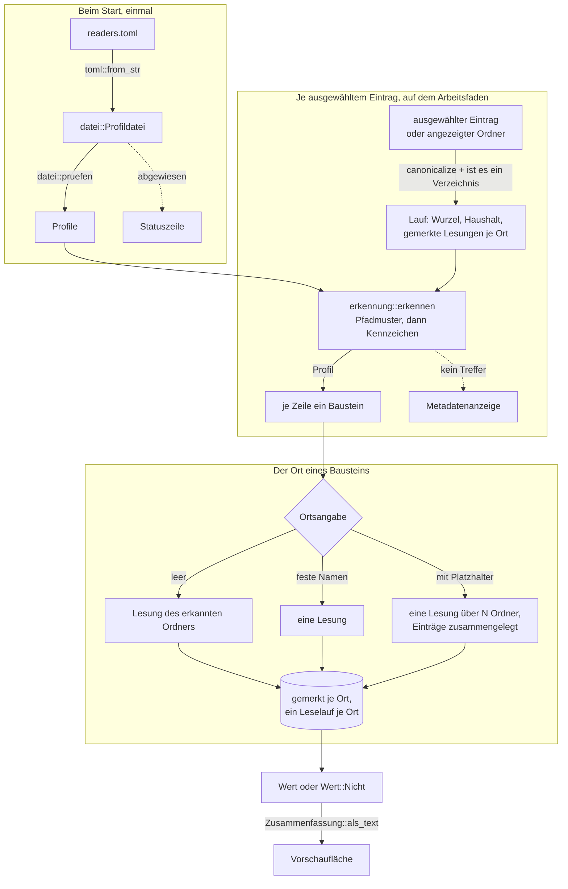
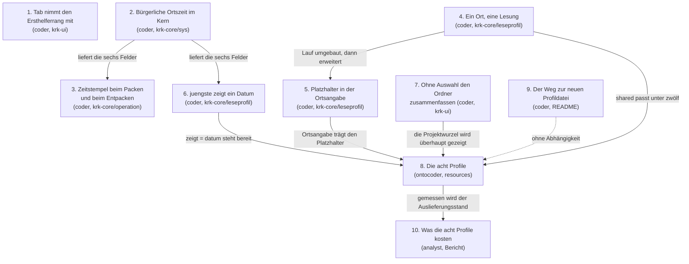

# Implementation Plan: Die Vorschau vertieft, und zwei Fehler

**Date:** 2026-08-25
**Status:** In Progress
**Spec:** keiner — geplant aus einem Rohauftrag des Nutzers vom 260825. Das Schärfen ist ausdrücklich übersprungen; die offenen Fragen sind in diesem Plan beantwortet und in sieben Entscheidungsdatensätzen abgelegt.
**Decidability:** Die tragende Frage lautet: *kann eine Profil-Zusammenfassung eine Auskunft geben, die über alle Unterordner eines Ordners aggregiert, ohne dass ihre Kosten mit dem Bestand der Werkbank wachsen?* Die Antwort ist **nein**, und zwar nicht aus Unentscheidbarkeit, sondern aus Unbeschränktheit: die Zahl der offenen Defekte über alle Runden ist entscheidbar, kostet aber eine Verzeichnisöffnung je Runde, und die Zahl der Runden wächst. Ein fester Deckel auf Verzeichnisöffnungen kann diese Auskunft deshalb nie dauerhaft tragen. **Der Mechanismus wechselt daher die Einheit, in der er zählt**: nicht mehr die geöffneten Verzeichnisse, sondern die **gelesenen Einträge** begrenzen einen Platzhalter-Lauf, und die Schranke dafür steht seit der Runde 16 als `HOECHSTENS_EINTRAEGE` da, samt der Vokabel für die abgeschnittene Antwort (`Wert::UeberGrenze`: „mindestens N, Lesung abgebrochen"). Damit ist die Auskunft an der heutigen Werkbank exakt (568 von 2.000 Einträgen), bei rund hundert Runden ausdrücklich unvollständig — und sie sagt dann selbst, dass sie es ist, statt eine Zahl zu nennen, die stillschweigend falsch ist.

## Directive

Zwei Dinge in einem Zug, die nichts miteinander zu tun haben und deshalb getrennt laufen.

**Erstens zwei Fehler.** Ein Klick in die Dateiliste des nicht fokussierten Fensters verschiebt den Tastaturfokus nicht dorthin; nur die Tab-Taste wechselt. Und jeder Eintrag, den KRK in ein Zip packt, trägt den 1. Januar 1980 statt des Änderungsdatums seiner Quelle.

**Der Auftrag nennt beide „Regressionsfehler", und für den ersten stimmt das nicht.** Nachgemessen am 260825: der Klickfehler ist keine Verschlechterung gegenüber einem früheren Stand, sondern so alt wie der Tab-Befehl selbst (`537fda5`, 260804, Schritt S12 der Runde 1). Kein Commit der Runden 14 bis 17 hat den Klickweg angefasst. Was sich am 260819 geändert hat, ist die Sichtbarkeit: `76ceb68` hat einen Klickweg **hinzugefügt** und dabei eine Vorbedingung angenommen, die nirgends gehalten wird. Der Unterschied ist nicht bloß Wortklauberei — wer nach einer Regression sucht, sucht in den letzten Runden und findet dort nichts.

**Zweitens fünf Erweiterungen der Vorschau**, alle im Umfeld der Leseprofile aus der Runde 16. Das Verzeichnis aller Runden soll die Zahl je Zustand und die Zahl der offenen Defekte zeigen; `archive/` soll Anzahl und Datum der letzten Archivierung zeigen; `shared/` je Unterordner Anzahl und Datum des jüngsten Eintrags; und das Verzeichnis, das die Werkbank enthält, soll ohne angewählte Zeile dieselbe Übersicht zeigen wie die Werkbank selbst.

## Current State

### Was die Leseprofile heute können

Die Runde 16 hat die Profil-Zusammenfassung gebaut. Ein Profil erkennt seinen Ort über ein Pfadmuster oder über eine Kennzeichendatei darin und beschreibt aus vier Bausteinen, was das Vorschaufenster dort zeigt: `zaehlung`, `juengste`, `feld`, `vorhandensein`. Der Weg ist `readers.toml` → `datei::Profildatei` → `datei::pruefen` → `Profile`, danach `erkennung::erkennen` und `bausteine::zusammenfassen`.

Drei Eigenschaften dieses Baus tragen den ganzen Plan, und alle drei sind nachgelesen:

- **Der Bausteinsatz ist eine vollständige Fallunterscheidung ohne Auffangzweig.** Festlegung A7 der Runde 16 hält die Zahl vier fest; ein fünfter Wert hielte den Bau an `Zeilendatei`, `Bausteindatei`, `Zeilendatei::zerlegen`, `BAUSTEINNAMEN`, `baustein_pruefen`, `Lauf::rechnen` und der Auslieferungsfassung an. Dasselbe gilt für `Wert` mit seinen sechs Werten und für `Ortsmangel` mit seinen dreien.
- **Der Haushalt zählt zwei Größen je Zusammenfassung**, und die Zahlen stehen als Konstanten in `leseprofil/mod.rs`: höchstens 12 Verzeichnisleseläufe (`HOECHSTENS_LESELAEUFE`), höchstens 24 Dateiöffnungen (`HOECHSTENS_OEFFNUNGEN`), höchstens 2.000 Einträge je Leselauf (`HOECHSTENS_EINTRAEGE`), höchstens 64 KB je gelesener Datei, höchstens 10 bei `anzahl`.
- **Eine unvollständige Lesung sagt nur, was sie entscheidet.** Die Zählung liefert `Wert::UeberGrenze`, das Vorhandensein liefert „ja" bei einem Treffer und den Platzhalter bei einem Nichtfund, die jüngsten N liefern den Platzhalter. Derselbe Rückgriff, den `verzeichnis::sys::ist_deskriptormangel` seit der Runde 10 im Durchlauf trägt.

### Was die fünf Wünsche daran finden

Vier der fünf sind mit der heutigen Datei allein nicht zu erfüllen. Nachgemessen an der Werkbank dieses Vorhabens am 260825:

| Wunsch | Woran es liegt | Zahlen |
|---|---|---|
| `circles/`, Zahl je Zustand | Der Marker steht in `<runde>/_X_circle.md`, also eine Ebene tiefer. `zaehlung` läuft flach, `Ortsangabe` kennt nur feste Namen. | 19 Runden, 133 Verzeichnisse bis Tiefe 2 |
| `circles/`, offene Defekte | `<runde>/issues/*_o_*.md`, zwei Ebenen tiefer | 568 Einträge in 19 Defektspeichern, davon 117 offen |
| `archive/`, Datum | Kein Baustein liefert ein Änderungsdatum. Dazu enthält `archive/` **Ordner**, und `juengste` nimmt allein Dateien. | 2 Einträge |
| `shared/`, je Unterordner Anzahl und Datum | Das Datum fehlt wie oben. Dazu kostet heute jede Zeile mit `ordner` einen eigenen Leselauf: 10 Unterordner × 2 Zeilen = 20 Läufe gegen einen Deckel von 12. | 10 Unterordner |
| Projektwurzel ohne Zeilenfokus | Kein Profilproblem, sondern Verhalten: `vorschau_fuellen` kehrt bei `None` zurück und lässt den Tab stehen. | — |

Ein naiver Ausbau kostet für die zwei `circles`-Zeilen zusammen **39 Leseläufe** (einmal `circles`, dann je Runde einer für den Rundenordner und einer für dessen `issues`) gegen einen Deckel von zwölf. Das ist der Punkt, an dem die Zeile **Decidability** oben ansetzt.

### Was die zwei Fehler heute tun

**Der Zip-Zeitstempel** ist bereits abgelegt und vom reconciler am 260825-1230 gegen den Baumstand bestätigt: `circles/260825-0711-kontextmenue-traegt-zip-unzip-finder/issues/260825-0838_*_jeder-gepackte-eintrag-traegt-den-1-januar-1980-statt-des-aenderungsdatums-der-quelle.md`. Dieser Plan legt **keinen zweiten Datensatz** daneben, sondern arbeitet jenen ab.

Gemessen am 260825 gegen `zip 8.6.0` und die beiden Entpackwerkzeuge von macOS ergänzt der Plan drei Befunde, die den Datensatz an zwei Stellen berichtigen:

- `SimpleFileOptions::default()` entsteht an drei Stellen (`zippen.rs:504`, `:519`, `:528`) und deckt damit jeden Eintragstyp ab: Dateien, Ordner, leere Ordner, Verknüpfungen.
- **Vorschlag 1 des Datensatzes trägt nicht.** Das Merkmal `time` von `zip` schaltet `default_for_write()` von 1980 auf `OffsetDateTime::now_utc()` um, also auf die Uhrzeit des Packens in UTC. Was es an Umrechnung hinzufügt, ist `TryFrom<time::PrimitiveDateTime>`, und eine `PrimitiveDateTime` ist bürgerliche Zeit **ohne** Zone: wer sie hat, hat die Zonenfrage schon gelöst. Das Merkmal kostet und liefert nichts. Gebraucht wird es nicht: `DateTime::from_date_and_time(u16, u8, u8, u8, u8, u8)` und `FileOptions::last_modified_time` tragen **kein** `cfg` und stehen mit KRKs heutigem Merkmalssatz zur Verfügung.
- **Vorschlag 2 des Datensatzes trägt auf macOS nicht.** Das erweiterte Zeitfeld 0x5455 allein genügt nicht, weil `ditto(1)` es nachweislich übergeht und stattdessen 0x5855 schreibt und liest. Gemessen an vier Archiven über dieselbe Quelle: mit richtigem MS-DOS-Feld liefert `unzip` 14:30:44 und `ditto` 13:30:44; erst mit 0x5455 **und** 0x5855 liefern beide 14:30:45. Die Stunde Abweichung bei `ditto` ist dabei genau die Sommerzeitfalle — es rechnet mit dem heute geltenden Versatz statt mit dem am Dateidatum geltenden.

**Der Klick-Fokus** hat eine Wurzel, die am 260825 an zwei Wegwerfprogrammen in Objective-C gemessen wurde, weil die AppKit-Hälfte sonst angenommen statt gemessen wäre.

KRK führt **zwei** Fokusgrößen nebeneinander: `Fenstermodell::aktiv`, das sagt, welches Dateifenster die Befehle meinen, und den Ersthelferrang von AppKit, der sagt, wohin die Tastendrücke gehen. Drei Stellen schreiben `aktiv`, und genau eine versäumt dabei den Rang:

| Schreiber von `aktiv` | Fundstelle | nimmt den Rang mit |
|---|---|---|
| Aufbau der Oberfläche | `anwendung.rs:1449` | ja |
| `aktives_setzen` | `anwendung.rs:4503` | ja, denn der Rang ist sein Auslöser |
| `Kommando::FensterWechseln` (Tab) | `anwendung.rs:3172` | **nein** |

Nach einem Tab sitzt der Rang also in der Liste, die **nicht** aktiv ist. Und dann ist der Weg tot, über den ein Klick seit dem 260819 das aktive Dateifenster setzt: gemessen im kontrollierten Vergleich — erster und zweiter Klick im selben Lauf, auf denselben Punkt, im selben Fensterzustand — wird `makeFirstResponder:` **gar nicht erst gerufen**, wenn die geklickte Ansicht den Rang schon hält. Der Melderweg `Hauptfenster::ersthelfer_setzen` → `aktives_dem_ersthelfer_nachziehen` → `aktives_setzen` läuft nicht an.

Übrig bleibt der zweite Weg, über die Auswahl: `tableView:shouldSelectRow:` → `angefasst` → `aktives_setzen`. Der feuert nur, wenn der Klick die Auswahl wirklich bewegt. Für die freie Fläche unter der letzten Zeile ist schon am 260819 gemessen, dass er es nicht tut (`shared/analyses/260819-1043-klick-holt-den-fokus-nicht.md`); für einen Klick auf die bereits ausgewählte Zeile ist es plausibel und **ungemessen**, weil der Prozess des Messprogramms nicht ins Schlüsselfenster kam.

Damit ist auch gesagt, warum die Abnahme vom 260819 nichts gefunden hat: sie prüfte „Klick auf eine Zeile" und die Fokusbefehle der Tastatur, beide aus einem gleichgeschalteten Ausgangszustand. Die Folge „erst Tab, dann mit der Maus zurück" stand auf keiner Prüfliste.

**Ein zweiter Erzeuger derselben Entkopplung steht daneben und ist keine Taste:** ein Klick auf die Tableiste des anderen Dateifensters ruft `angefasst` (`tabelle.rs:4648`) und setzt `aktiv`, nimmt den Rang aber nicht mit — an einem `NSSegmentedControl` gemessen, dessen `acceptsFirstResponder` `1` liefert und das den Rang bei einem Klick trotzdem nicht annimmt. Ob dieser Weg mitgezogen wird, ist eine eigene Frage und in `shared/decisions/260825-1725_*_nimmt-ein-klick-auf-die-tableiste-…` abgelegt.

### Zwei Stellen, an denen die Zeitumrechnung fehlt

`krk-core` kann `SystemTime` heute nicht in bürgerliche Ortszeit umrechnen. Die Standardbibliothek kennt keine Zeitzone; `NSDateFormatter`, den `appkit/vorschau.rs:1383` und `appkit/tabelle.rs` benutzen, liegt in AppKit und ist vom Kern aus unerreichbar; die Kalenderrechnung nach Hinnant steht in `krk-bench/src/bericht.rs:653`, ist privat, rechnet UTC, und `krk-bench` hängt von `krk-core` ab und nicht umgekehrt.

**Beide Hälften dieser Runde brauchen dieselbe Umrechnung**, das Packen für das MS-DOS-Zeitfeld und die Datumszeile eines Profils für ihre Anzeige. Das ist der eine Punkt, an dem die zwei sonst getrennten Arbeitsstränge sich berühren.

## Approach

Die Runde zerfällt in drei Stränge, die in dieser Reihenfolge laufen und sich an genau einer Stelle berühren.

**Strang 1: die zwei Fehler.** Sie hängen an nichts aus dieser Runde und stehen zuerst. Der Klick-Fokus ist eine Sache von `krk-ui` allein. Der Zip-Zeitstempel braucht die Zeitumrechnung, und die entsteht deshalb als eigener Schritt davor.

**Strang 2: der Mechanismus der Leseprofile.** Drei Änderungen an `krk-core`, jede die kleinste, die ihren Wunsch trägt, und keine davon ein fünfter Baustein:

1. **Ein Ort wird je Zusammenfassung höchstens einmal gelesen.** Das trägt `shared/` (10 Läufe statt 20) und macht zugleich den Sonderfall weg, dass der erkannte Ordner gemerkt wird und ein Unterordner nicht.
2. **Die Ortsangabe darf einen Platzhalter tragen.** `ordner = "*"` und `ordner = "*/issues"`. Der Lauf legt die Einträge aller getroffenen Ordner zu **einem** Lesestand zusammen und bucht **einen** Leselauf; begrenzt wird er durch die Eintragsschranke, wie jede andere Lesung. Das trägt beide `circles`-Wünsche mit einem Mechanismus.
3. **`juengste` bekommt einen Schlüssel `zeigt`.** `zeigt = "datum"` zeigt statt des Titels das Änderungsdatum, sieht Einträge jedes Typs und öffnet keine Datei. Das trägt `archive/` und `shared/`.

**Strang 3: das, was der Nutzer sieht.** Das Verhalten der Vorschau ohne angewählte Zeile, danach die acht Profile der Auslieferungsfassung, danach die Kostenmessung an der wirklichen Werkbank.

### Warum es kein fünfter Baustein wird, und kein größerer Deckel

Zwei Wege lagen nahe und sind verworfen, jeder aus einem eigenen Grund.

**Ein fünfter Baustein** täte an einem anderen Ort dasselbe wie `zaehlung`. Ein Ort ist genau das, was `Ortsangabe` beschreibt; die Erweiterung gehört deshalb dorthin und nicht in den Bausteinsatz. Festlegung A7 der Runde 16 bleibt damit unangetastet, und die sieben Stellen, die die Vollständigkeit der Aufzählung halten, bleiben unberührt.

**Ein größerer Deckel** verschiebt das Problem, statt es zu lösen. Für die heutigen 19 Runden bräuchte es 39 Leseläufe, für hundert Runden 201. Jede feste Zahl ist auf Sicht wieder falsch, und ein Deckel, der die doppelte Arbeit erlaubt statt sie zu beseitigen, gibt die Zusage auf, statt sie zu halten. Der Platzhalter-Lauf löst dasselbe innerhalb der Zwölf: die zwei `circles`-Zeilen kosten zusammen zwei Läufe.

### Die Rechnung, mit der die drei Änderungen zusammen aufgehen

Nachgerechnet gegen die Werkbank dieses Vorhabens am 260825, gegen `HOECHSTENS_LESELAEUFE = 12` und `HOECHSTENS_EINTRAEGE = 2.000`:

| Profil | Leseläufe | Verzeichnisöffnungen | gelesene Einträge | Dateiöffnungen |
|---|---|---|---|---|
| `circles/` | 3 | 1 + 19 + 19 = 39 | ~19 + ~135 + 568 | 0 |
| `shared/` | 10 | 10 | ~264 | 0 |
| `archive/` | 1 | 1 | 2 | 0 |
| Projektwurzel | 5 | 5 | wie Werkbankwurzel | 5 |

Die zweite Spalte ist die Größe, die neu von der ersten abweicht, und sie ist der Preis des Platzhalters: ein Leselauf öffnet nicht mehr genau ein Verzeichnis. Die dritte Spalte ist die Größe, die die Arbeit wirklich begrenzt, und sie bleibt in jeder Zeile weit unter der Schranke.

### Wo die Diagramme stehen

Der Ablauf einer Zusammenfassung nach dieser Runde:

Die Abhängigkeit der Schritte:

## Implementation Steps

### Strang 1: die zwei Fehler

Sie hängen an nichts aus Strang 2 und 3 und können zuerst laufen. Schritt 1 ist von allen anderen unabhängig.

1. [DONE] **Der Tab-Befehl nimmt den Ersthelferrang mit, damit der Klick zurück wieder wirkt**
   - Executor: `coder`
   - Files: `crates/krk-ui/src/appkit/anwendung.rs`
   - Changes: **Die Wurzel ist gemessen und steht unter „Current State"; dieser Schritt behebt sie und sucht sie nicht mehr.** Der Zweig `Kommando::FensterWechseln` (`anwendung.rs:3172`) ruft nach erfolgreichem `fenster_wechseln()` zusätzlich `self.fokus_setzen(Fokus::Dateifenster)`. Mehr nicht.

     Warum genau das die Wurzel trifft und nichts danebenstellt:
     - `fokus_setzen` (`:2386`) ist die **eine** Stelle, die `makeFirstResponder:` ruft, und `fokusansicht` (`:2340`) löst `Fokus::Dateifenster` bereits über `modell.aktiv()` auf, also über den schon umgesetzten Wert. Es entsteht keine zweite Zuordnung und keine zweite Tür.
     - Der Ring bricht von selbst ab: das ausgelöste `makeFirstResponder:` meldet, `aktives_dem_ersthelfer_nachziehen` läuft, `aktiv_setzen` liefert `false`, und es gibt keinen zweiten Nachzug.
     - Die Sichtbarkeitssperre greift nie ins Leere: `aktiv_setzen` weist ein ausgeblendetes Dateifenster schon ab (`fenstermodell.rs:479`).

     **Eine Falle beim Bauen**, die sonst den Übersetzer kostet: der Zweig hält heute `modell.borrow_mut()` im Ausdruck, und `fokus_setzen` nimmt sich selbst ein `borrow()`. Die Ausleihe muss erst enden.

     Danach gilt für alle drei Schreiber von `aktiv` dieselbe Regel, und **die Regel bekommt ihren Beleg**: eine Zählprobe am Quelltext über `quellbaum::quelldateien` und `quellbaum::aufrufstellen`, nach dem Muster von `zettelproben` (`anwendung.rs:8311`) und `fokusnachzugproben` (`:8567`). Sie hält, dass der Tab-Zweig den Rang mitnimmt. Das ist die Stelle, an der die Behebung ohne einen klickenden Agenten nachprüfbar wird.

     **Ausdrücklich nicht die Lösung**, jedes mit seinem Grund:
     - Ein `mouseDown:` an `tabelle.rs` oder `leiste.rs`. Wo der Rang wechselt, tut AppKit das schon; wo der Fehler auftritt, sitzt der Rang **bereits** in der geklickten Ansicht, ein `mouseDown:` müsste dort also `angefasst()` rufen und wäre eine dritte Tür in `aktives_setzen`. Und Tab bliebe entkoppelt: Symptom behandelt, Wurzel steht.
     - `acceptsFirstResponder` setzen. Eine `NSTableView` bringt es mit, und am `NSSegmentedControl` ist gemessen, dass ein `true` dort gerade nicht genügt.
     - Ein zweiter Fokusbeobachter. `NSWindow` verschickt keine Benachrichtigung über den Ersthelfer, und die Beobachtung der Eigenschaft ist von Apple nicht zugesagt (Modulkopf `appkit/fenster.rs`).
     - Die Anzeige nachbessern. `rahmen_setzen` und `fenstertitel::titel` rechnen richtig — aus einem `aktiv`, das falsch ist.
     - `aktives_dem_ersthelfer_nachziehen` aus einem Takt heraus laufen lassen. Das ist die Abfrage sechzigmal je Sekunde, die dieses Vorhaben schon einmal verworfen hat.

     **Was dieser Schritt nicht anfasst und nicht anfassen soll:** den Klick auf die Tableiste (`tabelle.rs:4648`), den zweiten Erzeuger derselben Entkopplung. Er ist eine eigene Frage mit einer eigenen Wirkung — er verbreitert den offenen Defekt `shared/issues/260823-0731_*_ein-klick-in-das-andere-dateifenster-nimmt-eine-ziehbewegung-zurueck.md` —, und die gehört gesondert entschieden statt nebenbei mitgegriffen. Der Datensatz dazu ist `shared/decisions/260825-1725_*_nimmt-ein-klick-auf-die-tableiste-…`.

     Der Doc-Kommentar an `aktives_dem_ersthelfer_nachziehen` (`:4552`) trägt heute den Satz „KRK muss den Klick also nicht abfangen, sondern nur auf den Rangwechsel hören". Er ist die Stelle, an der die Lücke saß, denn es gibt Klicks in einen Bereich ohne Rangwechsel. Er wird um die Vorbedingung ergänzt, die Schritt 1 herstellt.
   - Dependencies: keine
   - **Abnahmekriterien:**
     - Die Zählprobe am Quelltext hält, dass der Zweig `Kommando::FensterWechseln` den Rang mitnimmt, und wird rot, wenn der Ruf verschwindet.
     - Der Tab-Befehl wechselt weiter das aktive Dateifenster; die vorhandenen Proben zu `fenster_wechseln` und `aktiv_setzen` (`fenstermodell.rs:478`, `:490`) bleiben unverändert grün.
     - `der_nachzug_der_anzeige_schreibt_rahmen_und_titel` (`anwendung.rs:8607`) und `der_nachzug_der_anzeige_ruehrt_die_auslegung_nicht_an` (`:8579`) bleiben grün: die Anzeige schreibt weiter genau zwei Dinge und ruft weder `anwenden` noch `setHidden` noch `aktives_setzen`.
     - Ein Klick in die Vorschaufläche lässt `aktiv` weiter stehen. `Bereich::seite` liefert für `Bereich::Vorschau` `None` (`fenstermodell.rs:161-167`), und daran hängt die Auskunft, aus welchem Dateifenster F5 kopiert.
     - Ein stehendes Blatt bleibt unberührt: `fokusanzeige_nachziehen` kehrt bei `blatt_steht()` um, und der Ersthelfer eines Blattes liegt in keinem der fünf Teilbäume.
     - **Der vierteilige Handgriff des Nutzers bestätigt oder widerlegt die Diagnose**, und er steht namentlich unter „Testing Strategy". Widerlegt er sie schon im ersten Teil, ist dieser Schritt zurückzustellen und die Wurzel neu zu suchen; dann stimmte auch die Messung vom 260819 nicht mehr.
     - `make check` grün.

2. [DONE] **`krk-core` rechnet einen `SystemTime` in bürgerliche Ortszeit um**
   - Executor: `coder`
   - Files: `crates/krk-core/src/verzeichnis/sys.rs`, `crates/krk-core/src/verzeichnis/mod.rs`, `crates/krk-core/src/lib.rs`, `crates/krk-core/tests/verzeichnis.rs` (oder eine neue Prüfdatei `zeit.rs` unter `crates/krk-core/tests/`)
   - Changes: `localtime_r(3)` wird die **sechste** Schnittstelle der Systemschicht und die zehnte gebundene Funktion, in einem fünften `unsafe extern "C"`-Block. Die Bindung liefert aus einem `SystemTime` die sechs Felder Jahr, Monat, Tag, Stunde, Minute, Sekunde in bürgerlicher Ortszeit — **mit dem Zonenversatz, der zu jenem Zeitpunkt galt** und nicht mit dem von jetzt. Genau daran scheitert `ditto(1)` gemessenermaßen um eine Stunde.

     Der Ort ist gedeckt und nicht bloß bequem: der Modulkopf von `sys.rs` nennt sich selbst „die Systemschicht des Kerns und nicht allein die des Lesers", er führt mit `flock(2)` schon eine Schnittstelle, die weder liest noch schreibt, und er verlangt ausdrücklich, dass eine neue Schnittstelle dorthin kommt und nicht daneben. Ein zweites Modul mit `#![allow(unsafe_code)]` entsteht damit nicht, und `CLAUDE.md`s Aussage über die zwei Ausnahmestellen bleibt wahr.

     **Vier Prosastellen tragen die Zahlen und werden in diesem Schritt mitgezogen**, geprüft mit `grep -rn 'fuenf Schnittstellen\|neun Funktionen\|neun gebundene' crates/krk-core/src`: `lib.rs:20`, `verzeichnis/mod.rs:31`, `verzeichnis/sys.rs:1` und `sys.rs:26`. Dazu die Zeile „Gebunden sind alle neun in den vier `unsafe extern "C"`-Blöcken dieses Moduls" und das Kästchen am Modulkopf, das die Schnittstellen ihren Aufrufern zuordnet.

     Der Rückgabewert bekommt `#[must_use]`: eine fallen gelassene Zeitangabe bliebe unbemerkt.
   - Dependencies: keine
   - **Abnahmekriterien:**
     - Eine Kindprobe unter `TZ=UTC` — nach dem Muster von `tests/ablage.rs`, das dieselbe Prüfdatei mit gesetzter Umgebungsvariablen noch einmal startet — hält feste Zeitpunkte gegen feste Kalenderwerte, unter anderem den Sekundenwert 0 gegen 1970-01-01 00:00:00.
     - Eine zweite Kindprobe unter einer Zone mit Sommerzeit (`TZ=Europe/Berlin`) hält **zwei** Zeitpunkte aus verschiedenen Halbjahren und belegt damit, dass der Versatz vom Zeitpunkt abhängt und nicht vom Lauf. Ohne diese Probe ist die Sommerzeitzusage behauptet und nicht gemessen.
     - Eine zonenunabhängige Probe belegt, dass ein Wert überhaupt ankommt, und läuft in jeder Zone grün.
     - `cargo tree --workspace -e normal,build` findet weiter weder `cc` noch ein `-sys`-Paket außer `windows-sys`; `Cargo.lock` wächst um keinen Eintrag.
     - `grep` über `crates/krk-core/src` findet keine fünfte Stelle mit der alten Zahl.
     - `make check` grün, `krk-core` trägt weiter `#![deny(unsafe_code)]` mit genau einer Öffnung.

3. [DONE] **Ein gepackter Eintrag trägt das Änderungsdatum seiner Quelle, ein entpackter das des Archivs**
   - Executor: `coder`
   - Files: `crates/krk-core/src/operation/zippen.rs`, `crates/krk-core/src/operation/entpacken.rs`, `Cargo.toml` (Merkmalsliste von `zip`), `crates/krk-core/tests/operation.rs`
   - Changes: Die drei Stellen, an denen `SimpleFileOptions` entsteht (`zippen.rs:504` in `verknuepfung_packen`, `:519` in `dateiwahl`, `:528` in `ordnerwahl`), setzen `last_modified_time` aus dem Änderungsdatum der Quelle, umgerechnet über Schritt 2 und übergeben an `DateTime::from_date_and_time`. Beide sind merkmalsfrei; **das Merkmal `time` wird nicht eingeschaltet**, weil es die Aufgabe nicht löst (siehe „Current State").

     Daneben werden die zwei Zusatzfelder mitgeschrieben, und zwar **beide**: 0x5455 (Extended Timestamp), das `unzip` liest, und 0x5855 (Info-ZIP Unix, alt), das `ditto(1)` liest. Nur 0x5855 verlangt das Merkmal `unreserved` von `zip`; es ist als `unreserved = []` deklariert, schaltet keine Abhängigkeit ein und bringt keinen C-Code mit. Die Wurzel-`Cargo.toml` bekommt die Begründung dafür in derselben Ausführlichkeit, in der sie sie für jede fremde Kiste dieses Vorhabens führt, samt der Messung, die 0x5455 allein widerlegt.

     Das Änderungsdatum wird **am offenen Deskriptor** erfragt und nicht am Pfad: `datei_packen` hat ihn und fragt `gelesen.metadata()` bereits; `rechte_uebernehmen` fragt daneben ein zweites Mal `fs::metadata(pfad)`. Die dritte Frage wächst nicht an den Pfad, sondern an dieselbe Antwort — das ist die Regel dieses Vorhabens („die Prüfung steht am Deskriptor und nicht am Pfad") und spart zugleich einen Systemaufruf.

     `entpacken.rs` setzt den Zeitstempel des Archiveintrags auf die entpackte Datei, nach dem Muster von `kopieren.rs:194–199` (`File::set_times` mit `FileTimes`). Beide Enden gehören in denselben Zug, und der Modulkopf von `entpacken.rs` verweist heute genau darauf.

     **Der Bereich 1980 bis 2107 wird bewusst behandelt und nicht übergangen.** `from_date_and_time` liefert außerhalb `Err(DateTimeRangeError)`. Der Rückfall ist `DateTime::DEFAULT` **mit einer Zeile in der Abschlussliste**, denselben Weg, den das Packen für eine Datei nimmt, deren Typ es nicht annimmt: es weist nicht ab, es schreibt die Antwort auf.

     Zum Schluss trägt der Datensatz `260825-0838_o_…` seine Auflösung: die drei Messbefunde als Nachtrag, dann `Resolved:` und die Umbenennung auf `_c_`. Die zwei berichtigten Vorschläge werden dort ausgeschrieben, damit ein späterer Leser nicht dem Vorschlag folgt, den die Messung widerlegt hat.
   - Dependencies: Schritt 2
   - **Abnahmekriterien:**
     - Eine Probe packt eine Quelle mit gesetztem Änderungsdatum und liest über `ZipFile::last_modified()` zurück; der Wert stimmt mit der Umrechnung aus Schritt 2 überein. Der Helfer heißt `archivzeit` und steht neben den drei vorhandenen `archivnamen`, `archivinhalt`, `archivrechte` in `tests/operation.rs`, statt eine neue Bauform aufzumachen.
     - Eine Probe belegt in den **Rohbytes** des Archivs die Kennungen 0x5455 und 0x5855. Die Kiste hat für 0x5855 keinen Leser; dass `ditto` es liest, kann `cargo test` nicht prüfen und steht unter Nutzerarbeit.
     - Der Rundweg Packen → Entpacken erhält das Änderungsdatum jeder Datei, jedes Ordners und jeder Verknüpfung. Auf die Sekunde wird **nicht** geprüft, soweit nur das MS-DOS-Feld gelesen wird: dessen Zweisekundenraster schneidet ab (`second.min(58) >> 1`).
     - Ein Zeitpunkt vor 1980 fällt auf `DateTime::DEFAULT` zurück und erzeugt genau eine Zeile in der Abschlussliste; eine Probe hält beides.
     - `Cargo.lock` wächst um keinen Eintrag; weder `cc` noch ein neues `-sys`-Paket kommt herein.
     - `make check` grün.
   - **Nachtrag 260825-1859, Umsetzung.** Alle Kriterien sind erfüllt bis auf eine Hälfte des dritten: der Rundweg erhält das Änderungsdatum jeder Datei und jedes Ordners, **nicht** aber das einer Verknüpfung. `File::set_times` folgt der Verknüpfung und schriebe das Datum auf ihr Ziel; die Zeit am Verweis selbst setzte allein `lutimes(2)`, also eine siebte Schnittstelle der Systemschicht, und die steht nicht in der Dateiliste dieses Schritts. Der Archiveintrag trägt das richtige Datum, das Auspacken legt es nur nicht an, und `/usr/bin/unzip` und `/usr/bin/ditto` verhalten sich an dieser Stelle gemessenermaßen genauso. Abgelegt als `shared/issues/260825-1859_*_eine-entpackte-verknuepfung-bekommt-ihr-aenderungsdatum-nicht.md`, mit derselben Lücke in `operation::kopieren`. Das Merkmal `unreserved` ist aufgenommen worden, `time` nicht; die Messung dazu steht in der Wurzel-`Cargo.toml` und im aufgelösten Defektdatensatz. Daneben ist `shared/issues/260825-1859_*_claude-md-nennt-fuer-zip-das-eine-merkmal-deflate-flate2-es-sind-zwei.md` entstanden: `CLAUDE.md` steht nicht in der Dateiliste dieses Schritts.

### Strang 2: der Mechanismus der Leseprofile

4. **Ein Ort wird je Zusammenfassung höchstens einmal gelesen**
   - Executor: `coder`
   - Files: `crates/krk-core/src/leseprofil/bausteine.rs`, `crates/krk-core/tests/leseprofil.rs`
   - Changes: `Lauf` merkt seine Lesungen nach **aufgelöstem Pfad**, so wie er heute schon den erkannten Ordner in `Lauf::stand` merkt. Aus der `OnceCell<Option<Lesestand>>` wird ein Merker über mehrere Orte; `Lauf::am_ort` fragt ihn, statt bei einer Ortsangabe unbesehen zu lesen. Der Haushalt zählt damit **verschiedene Orte** statt Zeilen mit Ortsangabe.

     Die Trägheit bleibt: gelesen wird erst, wenn der erste Rufer den Ort braucht. Ein Profil, dessen Zeilen alle in Unterordnern arbeiten, liest den erkannten Ordner weiterhin gar nicht.

     Der Merker lebt genau so lange wie ein `Lauf`, also für **eine** Zusammenfassung. Zwei Zusammenfassungen desselben Ordners nacheinander lesen zweimal; alles andere zeigte dem Nutzer einen Stand von vorhin.

     Der Modulkopf trägt die Änderung: der Abschnitt „Der erkannte Ordner wird höchstens einmal gelesen" begründet heute die Asymmetrie zwischen erkanntem Ordner und Unterordner, und die entfällt. An ihre Stelle tritt eine Regel ohne Ausnahme, samt ihrem Grund und der Angabe, wie die Zahl der Läufe jetzt aus dem Profil abzulesen ist: als Zahl der **verschiedenen** genannten Orte.
   - Dependencies: keine
   - **Abnahmekriterien:**
     - Der elfte Fall der Probe `ein_baustein_kostet_hoechstens_einen_leselauf_und_im_erkannten_ordner_keinen` (`tests/leseprofil.rs:1588`) heißt künftig „zwei Bausteine auf demselben Unterordner teilen sich eine Lesung" und erwartet `2` statt `3`. Die übrigen zehn Fälle bleiben Zahl für Zahl gleich.
     - `ohne_einen_rufer_wird_der_erkannte_ordner_gar_nicht_gelesen` bleibt unverändert grün: die Trägheit ist nicht gefallen.
     - Eine neue Probe belegt, dass zwei Läufe über denselben Ordner zweimal lesen — der Merker überlebt keine Zusammenfassung.
     - Das mitgelieferte Circle-Profil kostet danach **vier** Leseläufe statt fünf, weil seine zwei Zeilen auf `planning` sich eine Lesung teilen. Die Zahl steht heute im Modulkopf von `bausteine.rs` und wird dort nachgezogen.
     - `make check` grün.

5. **Die Ortsangabe darf einen Platzhalter tragen**
   - Executor: `coder`
   - Files: `crates/krk-core/src/leseprofil/mod.rs`, `crates/krk-core/src/leseprofil/datei.rs`, `crates/krk-core/src/leseprofil/bausteine.rs`, `crates/krk-core/tests/leseprofil.rs`
   - Changes: `Ortsangabe` nimmt ein Stück `*` an. `Ortsangabe::aus_angabe` weist unverändert einen absoluten Pfad, ein leeres Stück, `.` und `..` ab und weist **zusätzlich** eine Angabe mit zwei oder mehr Platzhaltern ab; `Ortsmangel` bekommt dafür einen vierten Wert, und die Aufzählung bleibt vollständig ohne Auffangzweig, also hält der Bau an `Ortsmangel::grund` an.

     Beim Auswerten legt `Lauf` für eine Ortsangabe mit Platzhalter die Einträge aller getroffenen Ordner zu **einem** `Lesestand` zusammen: er liest den Ordner vor dem Platzhalter, nimmt daraus jeden Eintrag vom Typ **Ordner**, hängt das Stück hinter dem Platzhalter an und liest dort. Gebucht wird **ein** Leselauf; begrenzt wird die Sammlung durch `HOECHSTENS_EINTRAEGE` wie jede andere Lesung, und `abgeschnitten` wird gesetzt, sobald eine Teillesung abgeschnitten war oder die Sammlung die Schranke erreicht. Damit tragen die drei Regeln aus dem Modulkopf („es wird nur gesagt, was die Teillesung entscheidet") unverändert weiter.

     **C3.13 hält durch Bauart und nicht durch eine zusätzliche Prüfung**: der Platzhalter greift allein Einträge vom Typ Ordner und folgt keiner Verknüpfung — derselbe Grund, aus dem `verzeichnis/durchlauf.rs` nicht in eine absteigt —, und ein wirklicher Unterordner eines Ordners innerhalb der Schranke liegt innerhalb der Schranke. Das Stück **hinter** dem Platzhalter wird weiter aufgelöst und gegen die Wurzel gehalten wie heute.

     **`juengste` und `feld` nehmen keinen Platzhalter an.** Die Grenze liegt auf der Naht, die der Modulkopf von `bausteine.rs` schon zieht: zwei Bausteine sehen auf Namen, zwei lesen Dateien, und wer eine Datei liest, braucht ihren Pfad, den ein zusammengelegter Lesestand nicht trägt. Abgewiesen wird beim Laden mit Meldung; die Zeile behält ihre Beschriftung und verliert ihren Baustein — die dritte Reichweite der Prüfung.

     Der Kommentarblock der Auslieferungsfassung, der die Ortsangabe erklärt, wird in Schritt 8 nachgezogen; hier ändert sich der Modulkopf von `bausteine.rs` und die Dokumentation an `Ortsangabe`.
   - Dependencies: Schritt 4 (beide bauen an `Lauf`; die Reihenfolge hält sie auseinander)
   - **Abnahmekriterien:**
     - `ordner = "*"` an einer Werkbankgestalt zählt die Einträge aller Unterordner zusammen und kostet **einen** Leselauf, nachgezählt über `zusammenfassen_gezaehlt`.
     - `ordner = "*/issues"` desgleichen, und der Ordner vor dem Platzhalter wird dabei genau einmal gelesen, auch wenn eine andere Zeile ihn ebenfalls nennt (das ist Schritt 4, hier nachgemessen).
     - Ein Unterordner, den es hinter dem Platzhalter nicht gibt, wird übergangen und macht die Zeile nicht zum Platzhalterwert.
     - Eine **Verknüpfung** an der Stelle des Platzhalters wird übergangen; eine Probe belegt es mit einer Verknüpfung, die aus dem erkannten Ordner herausführt.
     - Eine Ortsangabe mit zwei Platzhaltern wird beim Laden abgewiesen, die Zeile behält ihre Beschriftung, und die Meldung nennt Profil, Beschriftung und Grund.
     - `juengste` und `feld` mit Platzhalter werden beim Laden abgewiesen, je mit eigener Meldung.
     - Eine Sammlung über der Eintragsschranke liefert `Wert::UeberGrenze` mit der Zahl der **Treffer** und nicht der Grenze; die Probe nimmt den Satz ab, den die Runde 16 dafür geschrieben hat.
     - `make check` grün.

6. **`juengste` zeigt auf Wunsch ein Änderungsdatum statt eines Titels**
   - Executor: `coder`
   - Files: `crates/krk-core/src/leseprofil/mod.rs`, `crates/krk-core/src/leseprofil/datei.rs`, `crates/krk-core/src/leseprofil/bausteine.rs`, `crates/krk-core/tests/leseprofil.rs`
   - Changes: `Juengstedatei` bekommt den Schlüssel `zeigt` mit den zwei Werten `titel` (Vorgabe, die heutige Fassung) und `datum`. `Baustein::Juengste` trägt ihn als Aufzählung mit zwei Werten, vollständig und ohne Auffangzweig; `Lauf::juengste` verzweigt darüber.

     `zeigt = "datum"` unterscheidet sich in drei Dingen von `zeigt = "titel"`, und jedes hat seinen Grund:
     - Es **öffnet keine Datei**. Das Datum steht in `Eintrag::geaendert`, das der Leselauf ohnehin liefert. Die Datumsform ist damit billiger als die Titelform, nicht teurer.
     - Es sieht Einträge **jedes Typs**. Der Modulkopf begründet die Beschränkung auf Dateien damit, dass `Juengste` und `Feld` Dateien **lesen**; wer nichts liest, den trifft der Grund nicht. Ohne das könnte `archive/` gar nicht antworten, denn es enthält Ordner.
     - Der Wert ist `Wert::Text` in der Form `JJJJ-MM-TT HH:MM`, bürgerliche Ortszeit über Schritt 2. **Kein neuer `Wert`**: bei `anzahl = 1` steht das Datum neben seiner Beschriftung, bei mehreren stehen die Daten untereinander, und beides folgt aus der Regel, die `Zusammenfassung::als_text` schon trägt (ein Wert mit Zeilenumbruch rutscht unter die Beschriftung). Die Dokumentation von `Wert::Text` weitet sich dabei von „ein aus einer Datei gezogenes Feld" auf „ein Text"; die Variante beschreibt die Gestalt eines Wertes und nicht seine Herkunft.

     Die Abbruchregel bleibt: die jüngsten N einer Teilliste sind nicht die jüngsten N, also liefert auch die Datumsform bei `abgeschnitten` den Platzhalter.
   - Dependencies: Schritt 2
   - **Abnahmekriterien:**
     - `juengste = { anzahl = 1, zeigt = "datum" }` liefert das Änderungsdatum des jüngsten Eintrags in der Form `JJJJ-MM-TT HH:MM` und kostet **null** Dateiöffnungen, nachgezählt über `zusammenfassen_gezaehlt`.
     - Dieselbe Zeile über einem Ordner, der **nur Ordner** enthält, liefert ein Datum und nicht den Platzhalter.
     - `zeigt = "titel"` und eine Zeile ohne `zeigt` verhalten sich Zahl für Zahl wie heute; die vorhandenen Proben zu `juengste` bleiben unverändert grün.
     - Ein dritter Wert für `zeigt` lässt `serde` die **ganze Datei** abweisen, mit einer Meldung, die den Schlüssel und die erwarteten Namen nennt — dieselbe Reichweite wie ein verschriebener Bausteintisch. Eine Probe hält es.
     - `anzahl = 3, zeigt = "datum"` stellt drei Daten untereinander unter die Beschriftung, ohne dass eine neue Regel in `als_text` dazukommt.
     - Eine abgeschnittene Lesung liefert auch mit `zeigt = "datum"` den Platzhalter.
     - `make check` grün.

### Strang 3: was der Nutzer sieht

7. **Ohne angewählte Zeile beschreibt die Vorschau den angezeigten Ordner**
   - Executor: `coder`
   - Files: `crates/krk-ui/src/appkit/tabelle.rs`, `crates/krk-ui/src/appkit/anwendung.rs`
   - Changes: Die Regel lautet: **die Vorschau beschreibt den ausgewählten Eintrag, und ohne Auswahl den angezeigten Ordner.** Eine Regel ohne Ausnahme, für jeden Ordner und nicht nur für die Projektwurzel — „Projektwurzel" ist für die Anwendung kein Begriff, und sie aus etwas zu erschließen hieße, Projektwissen in die Anzeige zu legen, wo heute allein die Leseprofile es tragen.

     Umgesetzt wird sie an der Stelle, die die Übersetzung ohnehin macht: `DateifensterQuelle::auswahl_merken` (`tabelle.rs:2063`) hält den angezeigten Ordner bereits in der Hand (`:2067`) und meldet künftig ihn, wenn keine Zeile ausgewählt ist. Der frühe Rücksprung in `Anwendungsdelegierter::vorschau_fuellen` (`anwendung.rs:1690`) entfällt damit samt seiner Begründung im Kopf jener Funktion, die dann nicht mehr stimmt.

     **Der Ordnerwechsel muss den Weg auch wirklich auslösen.** Heute meldet `auswahl_merken` nur, wenn AppKit eine Änderung meldet; war vorher schon nichts ausgewählt, meldet es nichts. `nach_lesebeginn` (`tabelle.rs:1448`) ist die eine Stelle, die Navigation und Auffrischung gemeinsam nachzieht, und dort gehört der Anstoß hin — nach `auswahl_anzeigen`, das die Auswahl des Modells an die Tabelle gibt.

     Ein zweiter Weg in die Vorschau entsteht dabei nicht: gemeldet wird über denselben Melder, gelesen über dasselbe `datei_anzeigen`, gerechnet auf demselben Arbeitsfaden. C4.7 bleibt unberührt, denn der angezeigte Ordner ist ein ausgewählter.
   - Dependencies: keine (läuft aber sinnvoll vor Schritt 8, weil erst damit die Projektwurzel überhaupt sichtbar wird)
   - **Abnahmekriterien:**
     - Nach dem Eintritt in einen Ordner und vor der ersten Bewegung des Zeilencursors zeigt die Vorschau die Zusammenfassung dieses Ordners, oder — wenn kein Profil greift — seine Metadaten.
     - Die erste Bewegung des Zeilencursors ersetzt sie durch den ausgewählten Eintrag.
     - Eine aufgehobene Auswahl (`Esc`, ein Filter ohne Treffer) fällt auf den angezeigten Ordner zurück und lässt den Tab nicht stehen.
     - Bei ausgeblendeter Vorschau wird weiter nichts gelesen; der Pfad geht in `vorschau_nachtrag` und wird beim Einblenden nachgeholt.
     - Die Zusammenfassung entsteht weiter allein auf dem Arbeitsfaden. Die Probe `zusammenfassen_hat_einen_rufer_und_der_haengt_am_arbeitsfaden` (`vorschaumodell.rs:1430`) bleibt unverändert grün.
     - Ein Ordner, den der Nutzer nie anzeigt, kostet weiter keinen Leselauf.
     - `make check` grün.

8. **Die Auslieferungsfassung führt acht Profile**
   - Executor: `ontocoder`
   - Files: `resources/default-readers.toml`
   - Changes: Aus fünf Profilen werden acht. Die drei neuen und die eine Erweiterung:

     **`fusion-Werkbank: alle Runden`** (vorhanden, `pfad = 'fusion-workbench/circles$'`) bekommt sechs Zustandszeilen und eine Defektzeile neben die vorhandene Zeile „Runden". Sechs und nicht vier: das Werkbankvokabular hat sechs Marker (`_a_` vorgesehen, `_t_` aktiv, `_c_` kohärent geschlossen, `_b_` beschränkt geschlossen, `_s_` überholt, `_d_` zurückgestellt), und dieses Vorhaben unterscheidet `_b_` und `_c_` ausdrücklich. Sechs eigene Zeilen sind überschneidungsfrei und vollständig; ihre Summe geht gegen die Zeile „Runden" auf, und ein siebter Marker würde als Differenz sichtbar — dieselbe Begründung, die der Defektspeicher-Block in derselben Datei schon für sich führt. Alle sechs nennen `ordner = "*"` und teilen sich damit **einen** Leselauf. Die Defektzeile nennt `ordner = "*/issues"`.

     **`fusion-Werkbank: der Ablagespeicher`** (neu, `pfad = 'fusion-workbench/archive$'`): die Zahl der Läufe und das Datum des jüngsten. Erkannt über den Pfad und nicht über eine Kennzeichendatei, weil `archive/` keine trägt. Das Muster trifft `.../archive/<lauf>/shared` **nicht**, weil dort `archive/` nicht unmittelbar hinter `fusion-workbench/` steht.

     **`fusion-Werkbank: der gemeinsame Speicher`** (neu, `pfad = 'fusion-workbench/shared$'`): je Unterordner zwei Zeilen, Anzahl und Datum des jüngsten Eintrags. Zehn Unterordner, zwanzig Zeilen, **zehn** Leseläufe — das ist Schritt 4, und ohne ihn wären es zwanzig gegen einen Deckel von zwölf.

     **`Projektwurzel mit fusion-Werkbank`** (neu, `kennzeichen = '^fusion-workbench$'`): dieselben sieben Zeilen wie das Wurzelprofil, jede mit `fusion-workbench/` vor der Ortsangabe. Damit beantwortet der Nutzer die Frage „welcher Ordner ist eine Projektwurzel" dort, wo er sie ändern kann, statt sie in der Anwendung festzuschreiben. **Der Preis wird im Kommentar über beiden Blöcken genannt und nicht wegerklärt**: die sieben Zeilen stehen zweimal da und können auseinanderlaufen. Ein Mechanismus dagegen — Vererbung, Verweis, Vorlage — wäre neu, und für zwei Blöcke in einer von Hand gepflegten Datei ist ein Kommentar die angemessene Antwort und ein Mechanismus die unangemessene.

     Dazu drei Kommentarblöcke, die mit den Schritten 4 bis 6 falsch geworden sind:
     - „Was eine Zusammenfassung höchstens kostet": der Satz „Ein Baustein mit `ordner` kostet genau einen Leselauf" wird zu „Ein Ort kostet genau einen Leselauf, gleich wie viele Zeilen ihn nennen". Das ist der Satz, den der Nutzer beim Schreiben seines Profils liest.
     - Der Abschnitt über `ordner` bekommt den Platzhalter: was er trifft, dass genau einer erlaubt ist, dass er allein Ordner greift und keiner Verknüpfung folgt, und dass `juengste` und `feld` ihn nicht annehmen.
     - Der Abschnitt über `juengste` bekommt `zeigt`, mit beiden Werten, der Datumsform und dem Hinweis, dass die Datumsform Einträge jedes Typs sieht und keine Datei öffnet.
   - Dependencies: Schritte 4, 5, 6, 7
   - **Abnahmekriterien:**
     - `die_eingebettete_fassung_besteht_ihre_eigene_pruefung` (`ablage/leseprofile.rs`) bleibt grün und erwartet **acht** Profile statt fünf. Die Zahl steht dort und wird mitgezogen.
     - `die_auslieferungsfassung_nennt_jeden_bausteinnamen` bleibt grün; die Zahl der Kommentarzeilen bleibt über hundert.
     - Kein Profil und keine Zeile wird beim Laden beanstandet, also bleibt die Meldungsliste leer.
     - An der Werkbank dieses Vorhabens: `circles/` zeigt sechs Zustandszahlen, deren Summe der Zeile „Runden" entspricht, und eine Zahl offener Defekte, die gegen `find fusion-workbench/circles/*/issues -maxdepth 1 -name '*_o_*.md' | wc -l` aufgeht. `shared/` zeigt zehn Paare aus Zahl und Datum. `archive/` zeigt die Zahl der Läufe und das Datum des jüngsten.
     - Jedes der acht Profile bleibt unter zwölf Leseläufen und unter vierundzwanzig Dateiöffnungen. Nachgemessen wird das in Schritt 10 und hier nur behauptet.
     - `make check` grün.

9. **Der Weg zu einer neuen Profildatei steht im `README.md`**
   - Executor: `coder`
   - Files: `README.md`
   - Changes: Ein Abschnitt „Neue Leseprofile übernehmen". `ablage::leseprofile::anlegen_falls_fehlt` schreibt die Auslieferungsfassung **nur**, wenn `~/Library/Application Support/KRK/readers.toml` fehlt; eine vorhandene Datei wird nach C1.2 nie angefasst. Die drei neuen Profile dieser Runde erreichen deshalb niemanden, der KRK schon einmal gestartet hat — ohne jede Meldung, denn eine unveränderte Datei verhält sich vollkommen richtig.

     Der Weg in drei Schritten: KRK beenden; `~/Library/Application Support/KRK/readers.toml` **beiseitelegen und nicht löschen**, etwa nach `readers.toml.alt`, weil eigene Profile sonst weg sind; KRK starten, die Datei entsteht neu samt Kommentaren.

     „Beiseitelegen und nicht löschen" steht aus demselben Grund da wie die Betriebsregel beim Installieren: der Bestand des Nutzers liegt außerhalb des Bündels, und ein Handgriff, der ihn mitnimmt, hat ihn genommen. Der `RELEASETEXT` in `xtask/src/veroeffentlichung.rs` wird dafür **nicht** angefasst: er trägt die Installationsregel, und seine Aussagen hält eine Probe einzeln.
   - Dependencies: keine
   - **Abnahmekriterien:**
     - Der Abschnitt nennt den vollen Pfad der Datei, die drei Schritte in dieser Reihenfolge und ausdrücklich, was ohne den Handgriff geschieht: die neuen Profile bleiben unsichtbar.
     - Er sagt, was verloren geht, wenn der Nutzer die alte Datei löscht statt sie beiseitezulegen.
     - `make check` grün.

10. **Was die acht Profile an der wirklichen Werkbank kosten**
    - Executor: `analyst`
    - Files: ein Bericht im Analysespeicher (`fusion-workbench/shared/analyses/`)
    - Changes: Eine Erhebung, keine Behauptung. Für jedes der acht ausgelieferten Profile an der Werkbank dieses Vorhabens: Leseläufe, geöffnete Verzeichnisse, gelesene Einträge und Dateiöffnungen, erhoben über `zusammenfassen_gezaehlt` und über eine Zählung der Verzeichnisöffnungen. Dazu der Abstand jeder Zahl zu ihrer Schranke und die Angabe, bei welchem Bestand sie fällt — für `circles/*/issues` also, bei wie vielen Runden die 2.000 Einträge erreicht sind.

      **Warum dieser Schritt eine eigene Zeile bekommt und nicht in Schritt 8 aufgeht:** die Zahlen in „Approach" oben sind gerechnet und nicht gemessen, und mit dem Platzhalter weicht die Zahl der geöffneten Verzeichnisse erstmals von der Zahl der Leseläufe ab. Genau diese Abweichung ist der Preis, den die Runde bezahlt, und wer ihn nicht abzählt, hat ihn nicht bezahlt, sondern angenommen.

      Der Bericht ist zugleich die Eingabe für zwei offene Datensätze, die er beide zitiert und keinen von beiden beantwortet: `circles/260823-2208-…/decisions/260824-1900_*_wie-wird-die-arbeit-dieser-runde-jemals-gegen-l7-gemessen-die-messstrecke-sieht-sie-nicht.md` — diese Runde macht die Frage dringender, weil ein Ordnerwechsel jetzt eine Zusammenfassung auslöst, die es vorher nicht gab — und `circles/260823-2208-…/issues/260824-1655_*_sechs-speicher-unter-archive-bleiben-ohne-profil-….md`, den das neue `archive`-Profil **nicht** erledigt: jener Datensatz spricht über die sechs Speicher **unter** `archive/<lauf>/shared/`, dieser Plan über `archive/` selbst.
    - Dependencies: Schritt 8
    - **Abnahmekriterien:**
      - Der Bericht führt für jedes der acht Profile vier Zahlen und nennt bei jeder, wie sie erhoben wurde.
      - Er nennt für jede Schranke den Abstand und den Bestand, bei dem sie fällt.
      - Er zitiert die zwei genannten Datensätze und sagt bei jedem ausdrücklich, was er beiträgt und was offen bleibt.
      - Er behauptet keine Zeitmessung: keine der zehn Zusagen aus C8 spricht über die Zusammenfassung, und der Abnahmelauf verlangt KRK im Vordergrund und ist Nutzerarbeit.

### Kein weiterer Schritt für `analyst`, und warum

Der Auftrag stellt `coder`, `ontocoder` und `analyst` bereit. Genau ein Schritt geht an `analyst`, nämlich der zehnte. Die zwei Untersuchungen, die diesen Plan tragen — die Wurzel des Klick-Fokus und die Merkmals- und Zeitzonenfrage beim Packen —, sind bei der Planung gelaufen und in diesen Plan sowie in die sieben Entscheidungsdatensätze eingegangen; ein Schritt, der sie wiederholte, brächte nichts. Was danach bleibt, ist Code, Daten und Dokumentation.

## Where this Circle stops

Es ist kein Circle aktiv; die Bedingungen gelten für die Arbeit dieses Plans.

- Alle zehn Schritte stehen auf `[DONE]`, und jede behauptete Erledigung ist einzeln gegen den Baum gelesen.
- `make check` läuft grün: `cargo build`, `cargo test`, `cargo clippy` und `cargo fmt --check`, jeweils über den ganzen Workspace.
- `Cargo.lock` führt weiter kein `cc` und außer `windows-sys` kein `-sys`-Paket, und der Baum ist um höchstens die Einträge gewachsen, die Schritt 3 nennt.
- `krk-core` trägt weiter `#![deny(unsafe_code)]` mit genau einer Öffnung, nämlich `verzeichnis/sys.rs`.
- Der Defektdatensatz `circles/260825-0711-…/issues/260825-0838_*_jeder-gepackte-eintrag-traegt-den-1-januar-1980-…` trägt seine Auflösung und steht auf `_c_`; die zwei durch Messung berichtigten Vorschläge sind darin ausgeschrieben.
- Die sieben Entscheidungsdatensätze dieser Runde sind vom Nutzer beantwortet oder ausdrücklich bei der Empfehlung belassen; ihre Marker stehen auf `_a_` oder `_i_`.
- Der Nutzer hat den Handgriff aus Schritt 9 an seinem Gerät ausgeführt und die acht Profile in KRK gesehen. **Das ist die Vorbedingung für jede spätere Aussage, die Arbeit sei sichtbar**: ohne ihn zeigt KRK die fünf Profile von gestern, und zwar ohne Meldung.
- Vor einem Auslieferungslauf: der Nutzer hat den Klick-Fokus, den Rundweg durch Zip und Unzip und die vier neuen Zusammenfassungen am laufenden Bündel gesehen. Was davon kein Agent abnehmen kann, steht unter „Testing Strategy"; ein Tag ohne diese Abnahme wäre derselbe Vorgang, den der Datensatz `260817-1613` einmal nachträglich hat aufarbeiten müssen.
- **Nicht Bedingung und ausdrücklich außerhalb:** der Abnahmelauf gegen die zehn Zeitzusagen aus C8. Keine der zehn spricht über die Profil-Zusammenfassung, und wie diese Arbeit je gegen L7 gemessen wird, ist eine offene Frage der Runde 16 (`260824-1900_o_…`), die dieser Plan nicht beantwortet und dringender macht.

## Data Structures

Vier Typen ändern sich, alle in `crates/krk-core/src/leseprofil/`, und drei davon sind vollständige Fallunterscheidungen ohne Auffangzweig — der Bau hält an, bis jede Stelle nachgezogen ist.

| Typ | Änderung | Wo der Bau anhält |
|---|---|---|
| `Ortsangabe` | trägt ein Stück `*`, höchstens eines | nirgends: die Teile bleiben `Vec<String>` |
| `Ortsmangel` | vierter Wert für „zwei Platzhalter" | `Ortsmangel::grund` |
| `Baustein::Juengste` | neues Feld `zeigt` | `baustein_pruefen`, `Lauf::rechnen`, `Lauf::juengste` |
| `Juengstedatei` | neues Feld `zeigt: Option<Juengsteform>` | `serde` weist eine unbekannte Form ab, samt der ganzen Datei |
| `Lauf` | `stand: OnceCell<…>` wird ein Merker über mehrere Orte | `Lauf::stand`, `Lauf::am_ort`, `Lauf::lesen` |

Neu ist eine Aufzählung mit zwei Werten für `zeigt` (`titel`, `datum`), ebenfalls vollständig ohne Auffangzweig.

`Wert` bekommt **keinen** siebten Wert: das Datum ist ein `Wert::Text`, und die Regel, wann ein Wert unter seine Beschriftung rutscht, bleibt unverändert. `Baustein` bekommt **keinen** fünften Wert.

In `krk-core/src/verzeichnis/sys.rs` kommt die Speicherform hinzu, die `localtime_r(3)` verlangt, und ein Typ für die sechs Felder der bürgerlichen Zeit.

## API Changes

Keine Signatur, die von außen sichtbar ist, ändert sich. `zusammenfassen(profile, ordner)` und `zusammenfassen_gezaehlt` behalten ihre Form: die Zeitumrechnung wohnt im Kern und wird nicht durchgereicht. Das ist der Ertrag der Entscheidung, `localtime_r` zu binden statt einen Rückruf aus `krk-ui` anzunehmen.

In `krk-ui` ändert sich der Vertrag des Auswahlmelders: er meldet künftig immer einen Pfad und nie `None`, weil ohne ausgewählte Zeile der angezeigte Ordner gemeldet wird.

## Testing Strategy

**Was `cargo test` abnimmt.** Alles in `krk-core`: die Zeitumrechnung samt zweier Kindproben mit gesetzter Zeitzone, der Zeitstempel im gebauten Archiv über einen vierten Helfer `archivzeit` neben den drei vorhandenen, der Rundweg durch Zip und Unzip, der Platzhalter mit seinen Abweisungen, die Datumsform von `juengste`, und die Zählproben zum Haushalt über `zusammenfassen_gezaehlt` — dieselbe Zählstelle, die der Lauf ohnehin führt, statt einer zweiten daneben. Dazu die zwei Proben an der Auslieferungsfassung: sie zerlegen den eingebetteten Text und lassen ihn durch denselben Prüfschritt, den die Nutzerdatei durchläuft, und sie sind der Grund, aus dem ein Tippfehler in `resources/default-readers.toml` beim Bauen auffällt und nicht erst beim Nutzer.

**Was ein `#[cfg(test)]`-Modul neben dem Code abnimmt.** Die prüfbaren Anteile von Schritt 1 und Schritt 7. `krk-ui` hat kein Bibliotheksziel; eine Datei unter `crates/krk-ui/tests/` ist eine eigene Kiste und erreicht nichts daraus, ob `pub` oder nicht.

**Was Nutzerarbeit bleibt, namentlich.** Fünf Dinge, und keines davon kann ein Agent fahren:

1. **Der vierteilige Handgriff zum Klick-Fokus**, der die Diagnose aus Schritt 1 bestätigt oder widerlegt. Jeder Teil mit seiner Vorhersage, und der vierte misst die eine Hälfte, die am 260825 ungemessen geblieben ist:
   1. KRK frisch starten, **ohne Tab**, in die andere Liste auf eine Zeile klicken. → soll wirken.
   2. Einmal Tab, dann zurückklicken auf eine **andere** Zeile als die dort ausgewählte. → soll wirken.
   3. Einmal Tab, dann zurückklicken auf die **freie Fläche unter der letzten Zeile**. → soll **nicht** wirken.
   4. Einmal Tab, dann zurückklicken auf die **schon ausgewählte Zeile**. → soll vermutlich nicht wirken; das ist die ungemessene Hälfte.

   Wirken die ersten beiden und der dritte nicht, ist die Wurzel bestätigt. Wirkt schon der erste nicht, ist die Diagnose falsch, und dann stimmt auch die Messung vom 260819 nicht mehr. Nach dem Fix müssen alle vier wirken.
2. Ein Doppelklick auf ein von KRK gepacktes Archiv im Finder, und ob die Zeitstempel danach stimmen. Gemessen sind `/usr/bin/unzip` und `/usr/bin/ditto`; die Archivierungsfunktion des Finders ist ein drittes Werkzeug, und die Vermutung, dass sie sich wie `ditto` verhält, ist eine Vermutung.
3. Die vier neuen Zusammenfassungen an der wirklichen Werkbank, im laufenden Bündel.
4. Der Eintritt in einen Ordner und das, was die Vorschau vor der ersten Cursorbewegung zeigt.
5. Der Handgriff aus Schritt 9, ohne den nichts davon sichtbar ist.

**Was ausdrücklich nicht gefahren wird.** Der Abnahmelauf gegen die zehn Zeitzusagen aus C8. Er verlangt KRK im Vordergrund, und keine der zehn spricht über die Profil-Zusammenfassung.

## Risks & Mitigations

| Risiko | Minderung |
|---|---|
| Die Diagnose zum Klick-Fokus ist an einem Nachbau gemessen und nicht an KRK; der Teil, der den Klick auf die schon ausgewählte Zeile betrifft, ist ungemessen. | Der vierteilige Handgriff unter „Testing Strategy" entscheidet es in einer Minute, mit einer Vorhersage je Teil. Schritt 1 hängt an nichts und läuft als Erster; widerlegt der Handgriff die Diagnose, bleibt der Rest der Runde unberührt. |
| Der Fix an Schritt 1 verbreitert den offenen Defekt `260823-0731`, weil ein weiterer Weg nach `aktives_setzen` führt. | Er tut es nicht: `fokus_setzen` löst den vorhandenen Melderweg aus, statt einen neuen zu bauen, und der Ring bricht an `aktiv_setzen == false` ab. Die Verbreiterung droht bei der **Tableiste**, und genau deshalb ist die als eigener Datensatz abgelegt und nicht mitgegriffen. |
| Der Platzhalter öffnet mit einem Leselauf beliebig viele Verzeichnisse, und die Zahl der Läufe sagt nichts mehr über die Arbeit. | Die Sammlung ist durch `HOECHSTENS_EINTRAEGE` begrenzt, und die Zahl der geöffneten Verzeichnisse ist durch den Bestand des Ordners vor dem Platzhalter begrenzt, der selbst gedeckelt gelesen wird. Schritt 10 misst beide Zahlen an der wirklichen Werkbank, statt sie zu behaupten. |
| Die Merkung je Ort zeigt einen Stand von vorhin. | Der Merker lebt genau so lange wie ein `Lauf`, also für eine Zusammenfassung. Eine Probe in Schritt 4 belegt, dass zwei Läufe zweimal lesen. |
| `zeigt = "datum"` sieht Einträge jedes Typs, und ein Nutzer erwartet bei `zeigt = "titel"` dasselbe. | Der Unterschied steht im Kommentarblock der Auslieferungsfassung und in der Dokumentation des Bausteins, jeweils mit seinem Grund: wer nichts liest, braucht keine Datei. |
| `struct tm` ist von Hand deklariert und muss zur Speicherform der Plattform passen. | Die Deklaration steht in der einen Datei, die dieses Vorhaben für Fremddeklarationen vorsieht, neben vier weiteren, die seit Runden tragen. Die Kindproben mit gesetzter Zeitzone fangen eine falsche Feldreihenfolge sofort, weil sie feste Kalenderwerte halten. |
| Das Merkmal `unreserved` zieht doch etwas herein. | Es ist als `unreserved = []` deklariert und schaltet allein eine Prüfung ab. Ein Abnahmekriterium von Schritt 3 hält `Cargo.lock` und den Abhängigkeitsbaum dagegen. |
| Die sieben Zeilen des Wurzelprofils und ihre Kopie im Projektwurzelprofil laufen auseinander. | Ein Kommentar über beiden Blöcken sagt es. Ein Mechanismus dagegen wäre neu und für zwei Blöcke in einer von Hand gepflegten Datei unangemessen. Der Preis ist genannt und nicht wegerklärt. |
| Der Nutzer führt den Handgriff aus Schritt 9 nicht aus und hält die Runde für wirkungslos. | Er steht unter „Where this Circle stops" als Vorbedingung, im `README.md` und im Bericht der Runde an sichtbarer Stelle — nicht unter „Details". |
| `shared/` kostet zehn von zwölf Leseläufen; ein elfter Speicher sprengt den Deckel. | Der Abstand ist gemessen und in Schritt 10 ausgeschrieben. Zwei Läufe Luft sind wenig; wer den elften Speicher aufnimmt, liest dort nach, was er kostet. |

## Open Questions

Die Fragen, die dieser Plan **beantwortet** hat, stehen als Datensätze im gemeinsamen Speicher und nicht in diesem Dokument. Sie binden über diesen Plan hinaus, und jede ist mit einer Empfehlung abgelegt:

- [ ] `shared/decisions/260825-1725_*_wie-erreicht-ein-baustein-die-eintraege-mehrerer-gleichartiger-unterordner.md` — Platzhalter in der Ortsangabe statt Tiefenangabe oder fünftem Baustein.
- [ ] `shared/decisions/260825-1725_*_liest-eine-zusammenfassung-denselben-unterordner-einmal-oder-je-zeile.md` — ein Ort, eine Lesung. Kehrt eine begründete Festlegung der Runde 16 um.
- [ ] `shared/decisions/260825-1725_*_wie-kommt-ein-aenderungsdatum-in-eine-profilzeile.md` — `zeigt` an `juengste`, kein fünfter Baustein und kein siebter `Wert`.
- [ ] `shared/decisions/260825-1725_*_wo-wohnt-die-umrechnung-von-systemtime-in-buergerliche-ortszeit.md` — `localtime_r(3)` als sechste Schnittstelle der Systemschicht.
- [ ] `shared/decisions/260825-1725_*_was-zeigt-die-vorschau-wenn-keine-zeile-ausgewaehlt-ist.md` — für jeden Ordner, nicht nur für die Projektwurzel.
- [ ] `shared/decisions/260825-1725_*_wie-erreichen-neue-auslieferungsprofile-einen-nutzer-der-krk-schon-gestartet-hat.md` — Handgriff jetzt, Befehl später.
- [ ] `shared/decisions/260825-1725_*_nimmt-ein-klick-auf-die-tableiste-des-anderen-dateifensters-den-ersthelferrang-mit.md` — der zweite Erzeuger der Entkopplung; empfohlen ja, aber als eigener Schritt, weil er einen offenen Defekt verbreitert.

Offen und von diesem Plan **nicht** beantwortet, aber von ihm berührt:

- [ ] `circles/260823-2208-…/decisions/260824-1900_*_wie-wird-die-arbeit-dieser-runde-jemals-gegen-l7-gemessen-die-messstrecke-sieht-sie-nicht.md` — diese Runde macht die Frage dringender: ein Ordnerwechsel löst jetzt eine Zusammenfassung aus, die es vorher nicht gab, und ein Platzhalter-Lauf öffnet mehr Verzeichnisse als ein gewöhnlicher.
- [ ] `circles/260823-2208-…/issues/260824-1655_*_sechs-speicher-unter-archive-bleiben-ohne-profil-und-tragen-dieselben-datensatzarten.md` — das neue `archive`-Profil erledigt ihn **nicht**. Er spricht über die Speicher unter `archive/<lauf>/shared/`, dieser Plan über `archive/` selbst.
- [ ] `shared/issues/260823-0731_*_ein-klick-in-das-andere-dateifenster-nimmt-eine-ziehbewegung-zurueck.md` — `aktives_setzen` zieht die Aufteilung nach, ohne vorher `bildschirmbreiten_uebernehmen` zu rufen. Schritt 1 verbreitert ihn nicht; die Frage zur Tableiste täte es, und das ist einer der zwei Gründe, aus denen sie gesondert steht.
