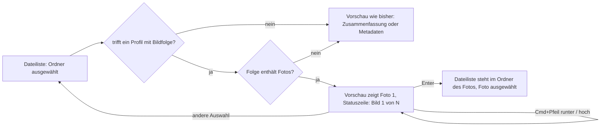

# Spec: Die Vorschau blättert durch die Fotos eines Jahres- oder Monatsordners

**Date:** 2026-09-29
**Status:** Draft
**Source:** Wunsch des Nutzers vom 260929, wörtlich: „Allgemeines Reader Profile so erweitern, dass ein Baum dieser Struktur ein bestimmtes Scrollverhalten in der Vorschau realisiert: Fotos └── 2008 ├── <monat>, zB. 08 │ ├── 260827_162941_ss.png │ ├── Bild.jpg │ ├── IMG_0970_edited.jpeg. Wenn man innerhalb eines Jahresordners ist (Fotos/2008/) soll erst das erste Bild des ersten Monats angezeigt werden. Mit CMD-Pfeil-{hoch/runter} soll dann durch die Bilder navigiert werden. Wenn man innerhalb eines Monatsordners ist (Fotos/2008/08/) soll erst das erste Bild dieses Monats angezeigt werden. Mit CMD-Pfeil-{hoch/runter} soll dann durch die Bilder navigiert werden. Enter springt in beiden Fällen in den Ordner zu dem Bild.“ Klärung in einer Runde, Antworten des Nutzers vom 260929: „1 a 2 a 3 a 4c - lesegrenzen einfach erweitern“; die Vorgaben ohne Rückfrage hat er mit angenommen.

## Directive

Ein Leseprofil kann statt einer Zusammenfassung in Textzeilen eine Bildfolge tragen: Ist ein Ordner ausgewählt, auf den ein solches Profil trifft, zeigt die Vorschau das erste Foto darunter. Mit Cmd+Pfeil blättert der Nutzer durch die Fotos nach Aufnahmedatum, und Enter führt ihn in den Ordner des angezeigten Fotos, wo es in der Dateiliste ausgewählt ist. Die Auslieferung bringt je ein Profil für einen Jahresordner und einen Monatsordner unter `Fotos` mit.

## Überblick

## Capabilities

### C1: Die Bildfolge als neue Bausteinart in `readers.toml`

**Description:** Ein Profil in `readers.toml` kann statt oder neben seinen Textzeilen eine Bildfolge nennen. Sie sagt, woher die Fotos kommen: aus dem erkannten Ordner selbst (Monat) oder aus jedem seiner Unterordner (Jahr, also der Platzhalter `*` der bestehenden Ortsangabe). Erkannt wird ein solches Profil genau wie jedes andere über `pfad` oder `kennzeichen`, und dabei gilt die bestehende Rangfolge. Ein fester Ordnername „Fotos“ steht nirgends im Programm, er steht allein im Muster des ausgelieferten Profils.

**Acceptance criteria:**
- [ ] Ein Profil mit Bildfolge, dessen `pfad` auf den ausgewählten Ordner trifft, lässt die Vorschau ein Foto zeigen statt Textzeilen.
- [ ] Wer das Muster in seiner `readers.toml` auf einen anderen Ordnernamen umschreibt, etwa `Bilder/[0-9]{4}$`, bekommt dasselbe Verhalten dort, ohne dass KRK neu gebaut wird.
- [ ] Ein Schreibfehler in einem Schlüssel der Bildfolge hat dieselbe Folge wie ein Schreibfehler in jedem anderen Baustein: Die Datei gilt als beschädigt, und die Meldung beim Start nennt den Schlüssel.
- [ ] Der Kopfkommentar von `resources/default-readers.toml` beschreibt die Bildfolge im selben Umfang wie die vier vorhandenen Bausteine: was sie tut, mit Beispiel, und ihre eigenen Grenzen aus C5.
- [ ] Trägt ein Profil Bildfolge und Textzeilen, zeigt die Vorschau das Foto, solange die Folge Fotos enthält, und sonst die Textzeilen.

**Decisions made:**
- Allgemein statt Sonderfall: Die Fähigkeit ist ein Baustein der Profildatei und kein fest eingebauter Fotoordner (Wortlaut „Allgemeines Reader Profile … erweitern“).
- Gilt für den **ausgewählten** Ordner, so wie jede Zusammenfassung heute (Nutzerwahl 1A). Die Jahresfolge sieht man also, wenn in `Fotos` die Zeile `2008` ausgewählt ist, und die Monatsfolge, wenn in `Fotos/2008` die Zeile `08` ausgewählt ist. Ohne ausgewählte Zeile gilt wie heute der angezeigte Ordner.
- Profil mit Bildfolge und Textzeilen: Das Foto geht vor, bei leerer Folge gelten die Zeilen (Vorgabe, damit keine der zwei Angaben still verfällt).

### C2: Welche Fotos in welcher Reihenfolge

**Description:** Als Foto zählt jede Datei mit einer der Endungen, die die Vorschau heute schon als Bild zeigt. Innerhalb eines Ordners laufen die Fotos nach ihrem Aufnahmedatum aus den Bilddaten. In der Jahresfolge laufen die Monatsordner nach Namen, und am Ende eines Monats geht es mit dem ersten Foto des nächsten weiter.

**Acceptance criteria:**
- [ ] Als Fotos zählen genau die Dateien mit den Endungen png, jpg, jpeg, gif, tif, tiff, heic, heif, bmp und icns, ohne Rücksicht auf Groß- und Kleinschreibung. Ordner, Verknüpfungen und andere Dateien zählen nicht.
- [ ] In einem Monatsordner mit drei Fotos, deren Aufnahmedaten in umgekehrter Reihenfolge zu ihren Namen stehen, zeigt die Vorschau zuerst das Foto mit dem frühesten Aufnahmedatum.
- [ ] Ein Foto ohne lesbares Aufnahmedatum wird mit seinem Änderungsdatum eingeordnet. Haben zwei Fotos denselben Zeitpunkt, entscheidet der Name.
- [ ] In der Jahresfolge kommen alle Fotos des Monatsordners `01` vor allen Fotos des Monatsordners `02`, auch wenn ein Foto in `02` ein früheres Aufnahmedatum trägt.
- [ ] Nach dem letzten Foto eines Monats zeigt Cmd+Pfeil runter das erste Foto des nächsten Monatsordners, der Fotos enthält. Monatsordner ohne Fotos werden übersprungen.
- [ ] In der Jahresfolge zählen allein Fotos, die unmittelbar in einem Monatsordner liegen. Fotos direkt im Jahresordner und Fotos in tieferen Ordnern gehören nicht zur Folge.
- [ ] Ein Foto über der heutigen Bildgrenze von 64 MB bleibt Teil der Folge und wird an seiner Stelle so gezeigt, wie die Vorschau es heute zeigt, also mit seinen Metadaten.

**Decisions made:**
- Reihenfolge nach Aufnahmedatum aus den Bilddaten (EXIF) (Nutzerwahl 4C).
- Rückfall ohne Aufnahmedatum: Änderungsdatum, bei Gleichstand der Name (Vorgabe). Kein Foto fällt aus der Folge, weil ihm das Datum fehlt.
- Monatsordner laufen nach Namen, innerhalb eines Monats nach Aufnahmedatum (Wortlaut „erst das erste Bild des ersten Monats“, Vorgabe „Monatsübergang“).

### C3: Blättern mit Cmd+Pfeil

**Description:** Solange die Vorschau eine Bildfolge zeigt und die Dateiliste den Fokus hat, zeigt Cmd+Pfeil runter das nächste und Cmd+Pfeil hoch das vorige Foto. In der Dateiliste bewegt sich dabei nichts, der ausgewählte Ordner bleibt ausgewählt. Außerhalb einer Bildfolge verhalten sich beide Kombinationen wie heute. Die Statuszeile zeigt, an welcher Stelle der Folge man steht.

**Acceptance criteria:**
- [ ] Ist in `Fotos` die Zeile `2008` ausgewählt und hat die Dateiliste den Fokus, zeigt Cmd+Pfeil runter das zweite Foto der Jahresfolge, und die Auswahl der Dateiliste bleibt auf `2008`.
- [ ] Cmd+Pfeil hoch zeigt dann wieder das erste Foto und führt **nicht** in den übergeordneten Ordner.
- [ ] Auf dem ersten Foto tut Cmd+Pfeil hoch nichts, auf dem letzten Foto der Folge (Jahresende oder Monatsende) tut Cmd+Pfeil runter nichts. Die Folge beginnt nicht von vorn.
- [ ] Ist ein Ordner ohne Bildfolge ausgewählt, führt Cmd+Pfeil hoch wie heute in den übergeordneten Ordner. Pfeil links tut das in jeder Lage.
- [ ] Die Statuszeile zeigt während einer Bildfolge „Bild 3 von 41“ in der Form des Seitenzählers des PDF-Betrachters. Sobald keine Bildfolge mehr angezeigt wird, verschwindet die Angabe.
- [ ] Wechselt die Auswahl in der Dateiliste und wird dann derselbe Ordner wieder ausgewählt, beginnt die Folge wieder beim ersten Foto.
- [ ] Beide Befehle stehen in `resources/default-keymap.toml` mit eigenem Namen, sind in der F1-Ansicht sichtbar und neu belegbar, und sie stehen im Hauptmenü. Welcher der Einträge dort das Kürzel Cmd+Pfeil hoch zeigt, folgt der bestehenden Regel für geteilte Kürzel.
- [ ] Die Konfliktprüfung der Belegung meldet für Cmd+Pfeil hoch keinen Konflikt zwischen „In den übergeordneten Ordner“ und „Voriges Bild“. Zwei andere Befehle des Dateifensters auf derselben Kombination meldet sie weiterhin als Konflikt.

**Decisions made:**
- Cmd+Pfeil hoch/runter, obwohl Cmd+Pfeil hoch schon „In den übergeordneten Ordner“ trägt (Nutzerwahl 2A). Die Konfliktregel der Belegung bekommt dafür eine neue Ausnahme: Zwei Befehle desselben Bereichs dürfen eine Kombination teilen, wenn der eine nur wirkt, solange die Vorschau eine Bildfolge zeigt. Das ist eine dritte Art des Teilens neben dem heutigen „Editor gegen außerhalb“.
- Wirksam nur mit dem Fokus in der Dateiliste (Vorgabe, Wortlaut „innerhalb eines Ordners“). Mit dem Fokus in der Vorschau gelten Cmd+Pfeil wie bisher.
- Anzeige „Bild N von M“ (Vorgabe).

### C4: Enter springt zum Foto

**Description:** Solange die Vorschau eine Bildfolge zeigt, führt Enter die Dateiliste in den Ordner, in dem das angezeigte Foto liegt, und wählt es dort aus. Die Liste behält dabei ihre eigene Sortierung. Außerhalb einer Bildfolge öffnet Enter wie bisher mit dem Standardprogramm.

**Acceptance criteria:**
- [ ] Ist in `Fotos` die Zeile `2008` ausgewählt und zeigt die Vorschau ein Foto aus `2008/08`, dann steht die Dateiliste nach Enter in `Fotos/2008/08`, und genau dieses Foto ist ausgewählt und sichtbar.
- [ ] Ist in `Fotos/2008` die Zeile `08` ausgewählt, steht die Dateiliste nach Enter in `Fotos/2008/08`, und das angezeigte Foto ist ausgewählt.
- [ ] Das gilt auch dann, wenn die Dateiliste nach Name, Größe oder einer anderen Spalte sortiert ist und das Foto dort an einer anderen Stelle steht als in der Folge.
- [ ] Steht ein Filtertext in der Dateiliste, gilt für ihn beim Sprung dieselbe Regel wie bei jedem anderen Ordnerwechsel. Verdeckt er das Foto, springt die Liste trotzdem in den Ordner und meldet in der Statuszeile, dass das Foto ausgefiltert ist.
- [ ] Nach dem Sprung zeigt die Vorschau das ausgewählte Foto so, wie sie es heute für eine ausgewählte Bilddatei tut.
- [ ] Ist ein Ordner ohne Bildfolge ausgewählt, öffnet Enter ihn wie heute mit dem Standardprogramm.
- [ ] Wird das Foto zwischen Anzeige und Enter gelöscht oder verschoben, steht die Liste danach im Ordner, und die Statuszeile meldet, dass das Foto nicht mehr da ist.

**Decisions made:**
- Enter auf derselben Ausnahme wie C3 (Nutzerwahl 3A): In einem Foto-Jahres- oder Monatsordner öffnet Enter den Ordner nicht mehr mit dem Standardprogramm.
- Filtertext beim Sprung: Er bleibt nach der bestehenden Regel stehen, und das Verdecken wird gemeldet (Vorgabe, damit der Sprung die Filterregel nicht unterläuft).

### C5: Grenzen und Tempo der Bildfolge

**Description:** Weil das Aufnahmedatum für jedes Foto gelesen werden muss, bekommt die Bildfolge eigene, höhere Lesegrenzen. Die Grenzen der übrigen Bausteine bleiben, wie sie sind. Die Arbeit läuft so, dass die Dateiliste nie wartet, und ein Wechsel der Auswahl bricht sie ab wie heute jede Zusammenfassung.

**Acceptance criteria:**
- [ ] Eine Bildfolge nimmt bis zu 7.500 Fotos auf. Hat ein Ordner mehr, enthält die Folge die ersten 7.500 in der Reihenfolge aus C2, und die Statuszeile sagt dazu, dass die Folge gekürzt ist.
- [ ] Die Grenzen der übrigen Bausteine (12 Leseläufe, 24 Dateiöffnungen, 2.000 Einträge je Leselauf, 64 KB je Datei) gelten unverändert. Eine Zusammenfassung in Textzeilen kostet nach dieser Arbeit höchstens so viel wie vorher.
- [ ] Solange die Aufnahmedaten gelesen werden, reagiert die Dateiliste auf jeden Tastendruck. Die Vorschau zeigt in dieser Zeit einen Hinweis, dass die Folge vorbereitet wird, und kein leeres Feld.
- [ ] Wechselt die Auswahl, während die Daten einer Folge gelesen werden, kommt kein Foto dieser Folge mehr in die Vorschau, und das Lesen hört auf.
- [ ] Ein Foto, dessen Bilddaten sich nicht lesen lassen, bricht die Folge nicht ab. Es wird nach C2 mit dem Änderungsdatum eingeordnet.
- [ ] Der Kopfkommentar von `readers.toml` nennt die Grenzen der Bildfolge im Abschnitt „Was eine Zusammenfassung höchstens kostet“ neben den bestehenden.

**Decisions made:**
- Eigene Grenzen für die Bildfolge statt einer allgemeinen Anhebung (Nutzerwahl „lesegrenzen einfach erweitern“, eng ausgelegt). Eine allgemeine Anhebung würde jedes Textprofil teurer machen dürfen, ohne dass es das braucht.
- Obergrenze 7.500 Fotos je Folge (Nutzerangabe vom 260929, „erhöhe max auf 7500 Bilder“; ein Jahr mit etwa zwanzig Aufnahmen am Tag bleibt darunter).

### C6: Ausgelieferte Profile und Anleitung

**Description:** Die Auslieferungsfassung von `readers.toml` bringt zwei Profile mit, eines für `Fotos/<vier Ziffern>` als Jahresfolge und eines für `Fotos/<vier Ziffern>/<zwei Ziffern>` als Monatsfolge. Wer KRK schon gestartet hat, holt sie über „Auf Werkseinstellungen zurücksetzen…“ oder trägt sie selbst ein.

**Acceptance criteria:**
- [ ] Mit der Auslieferungsfassung zeigt die Vorschau für einen ausgewählten Ordner `…/Fotos/2008` die Jahresfolge und für `…/Fotos/2008/08` die Monatsfolge, gleich wo `Fotos` im Dateisystem liegt.
- [ ] Ein Ordner `…/Fotos/Urlaub` oder `…/Fotos/2008/August` trifft keines der zwei Profile.
- [ ] Die Meldung beim Start über neue Profile nennt die zwei Profilnamen, wenn die Nutzerdatei sie nicht führt.
- [ ] `HowTo.md` beschreibt die Bildfolge, die zwei Tastenwege, den geänderten Sinn von Cmd+Pfeil hoch und Enter an diesen Orten, und wie man die Profile übernimmt. Dabei steht dort auch, dass „Auf Werkseinstellungen zurücksetzen…“ zugleich Belegung und Einstellungen zurücksetzt.

**Decisions made:**
- Übernahme bei bestehender Nutzerdatei über „Auf Werkseinstellungen zurücksetzen…“ (Nutzerangabe vom 260929). Der Preis dieses Wegs: Er setzt auch eigene Tastenzuweisungen und `settings.toml` zurück. Der Notizordner bleibt. Einzelne Profile von Hand zu übernehmen bleibt möglich.

## Stops when

- **Wenn sich das Aufnahmedatum auf beiden Mac-Zielen nicht ohne C-Code im Abhängigkeitsbaum lesen lässt**, weder über eine Rust-Kiste ohne `cc` und ohne Paket mit einem Namen auf `-sys` noch über ein Systemframework, dann hört die Arbeit auf, und der Nutzer entscheidet, ob C2 auf das Änderungsdatum zurückfällt oder die Zusage aufgeweicht wird. Geprüft wird das mit `cargo tree --target <ziel> -e normal,build` je Mac-Ziel.
- **Wenn ein unterstütztes Format sein Aufnahmedatum grundsätzlich nicht ohne das Lesen der ganzen Datei preisgibt** (zu erwarten ist das am ehesten bei HEIC), dann hört die Arbeit für dieses Format auf, und der Nutzer entscheidet, ob solche Fotos beim Änderungsdatum bleiben oder die Kosten tragbar sind.
- **Wenn auf dem Referenzgerät vom Auswählen eines Jahresordners mit 1.000 Fotos bis zum ersten gezeigten Foto mehr als zwei Sekunden vergehen**, dann hört die Arbeit auf, bevor die Grenze aus C5 festgeschrieben wird, und der Nutzer entscheidet über Grenze oder Vorgehen. Die Messung gehört zur Nutzerarbeit, weil sie KRK im Vordergrund braucht. Wenn sie nicht gefahren wird, geht die Runde als gebaut und nicht als abgenommen aus der Arbeit.
- **Wenn sich die Ausnahme aus C3 nicht in der einen Stelle der Konfliktregel unterbringen lässt, an der heute „Editor gegen außerhalb“ steht**, und wenn sie deshalb eine zweite Konfliktregel neben der ersten verlangt, dann hört die Arbeit auf, und der Nutzer entscheidet, ob die zweite Stelle hinnehmbar ist oder das Blättern auf die freien Kombinationen Umschalt+Cmd+Pfeil hoch/runter wechselt.

## Constraints

Die Abhängigkeiten dürfen auf keinem der beiden Mac-Ziele C-Code bauen. Weder `cc` noch ein Paket mit einem Namen auf `-sys` darf im Baum ankommen. Eine neue fremde Kiste steht ohne Vorgabemerkmale in der Wurzel-`Cargo.toml` und trägt dort ihre Begründung. Jede Klasse eines Systemframeworks muss auf macOS 15 stehen, und die angesprochene Datei trägt den Abschnitt zur Untergrenze.

Die zehn Zeitzusagen aus C8 der Runde 1 bleiben unberührt. Diese Arbeit setzt keine elfte Zusage; die Schwelle unter „Stops when“ ist ein Haltepunkt und keine Zusage. Die Vorschau eines ausgewählten Eintrags, der kein Ordner mit Bildfolge ist, darf nicht langsamer werden, damit L7 nicht berührt wird.

`readers.toml` wird von KRK weiterhin nicht aus eigenem Antrieb geschrieben. Die neuen Befehle brauchen ihre Pflichtstellen wie jedes Kommando, auch den Eintrag, den allein eine Probe hält.

## Out of Scope

Eine Diashow, die ohne Tastendruck weiterblättert, gehört nicht dazu. Ebenso wenig gehören dazu ein Rundlauf vom letzten zum ersten Foto, ein Übergang vom Ende eines Jahres in das nächste Jahr und eine Folge über mehrere Jahre von `Fotos` aus. Auch Vorschaubilder im Raster, Bildbearbeitung, Drehen nach der Ausrichtung in den Bilddaten, andere Aufnahmedaten als das Aufnahmedatum (etwa GPS oder Kamera) und Videos in der Folge sind ausgeschlossen. KRK merkt sich über einen Auswahlwechsel oder die Sitzung hinaus nicht, an welcher Stelle der Folge man stand.

## Open for Planner

Wie das Aufnahmedatum gelesen wird, legt die Planung fest: eine reine Rust-Kiste oder ImageIO über `objc2`, jeweils unter den Constraints oben. Offen sind auch die Schlüsselnamen der Bildfolge in `readers.toml` und ihre Einbettung in Profil und Zeile. Die Planung bestimmt außerdem, wie die Konfliktregel von der Vorschau erfährt, ob eine Bildfolge steht, am Vorbild von `form_passt`, und welchen Wirkungsbereich die zwei neuen Befehle tragen.

Weiter offen sind der Faden, auf dem die Daten gelesen werden, und der Weg des Abbruchs. Offen ist, ob die Aufnahmedaten zwischen zwei Auswahlen desselben Ordners gemerkt werden, sofern das Verhalten aus C3 gleich bleibt. Offen ist auch, wie Enter die Auswahl im Zielordner setzt, über den bestehenden Weg einer vorgemerkten Auswahl auf Namen.

## User Decisions Pending

- [ ] Keine. Die Punkte unter „Stops when“ werden erst dann zu Fragen, wenn ihr Anlass eintritt.
