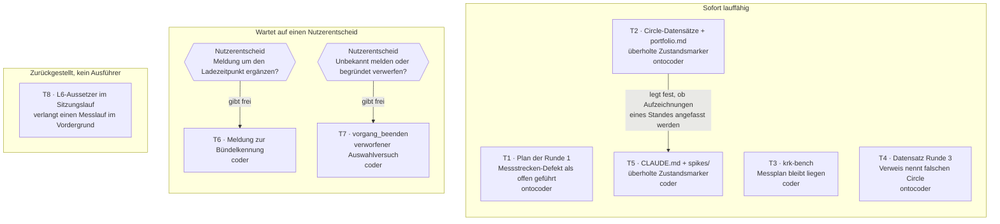

# Tasklist

**Generated:** 2026-08-10 17:07
**Domain:** code
**Active Circle:** keiner. Beim Bau dieser Schlange war kein Circle aktiv, `fusion-workbench/.active-circle` fehlt. Die aufgelösten Scan-Pfade deckten deshalb allein `fusion-workbench/shared/` ab. Die fünf Aufgaben aus dem Circle der Runde 1 (`circles/260802-0842-krk-mac-dateimanager-editor-git/issues/`) stehen auf ausdrückliche Festlegung des Nutzers in der Liste und nicht, weil ein Scan sie geliefert hätte. Wer die Schlange später auf Gültigkeit prüft, prüft genau das: wird sie unter einem aktiven Circle gelesen, ist ihr Umfang nicht der des Circles.
**Open tasks:** 8 (7 bearbeitbar, 1 zurückgestellt)
**Blocked:** 3 (T5 wartet auf T2, T6 und T7 warten auf einen Nutzerentscheid)

Der Umfang ist vom Nutzer auf acht Defektdateien festgelegt. Zwei davon beschreiben denselben Defekt und sind zu einer Aufgabe zusammengezogen, eine zerfällt in zwei Zuständigkeiten und ist geteilt. Es bleiben acht Aufgaben.

**Keine dieser Aufgaben liefert eine Fähigkeit, die der Nutzer sieht.** Alle acht sind Hygiene: Aufräumen im Temporärverzeichnis, Verweise in Dokumenten, eine Meldung, ein verworfener Rückgabewert. Die Achse "Nutzersichtbare Fähigkeit zuerst" trennt hier also nichts, und die Reihenfolge kommt aus der zweiten Achse: Schwere aus dem Datensatz, Abhängigkeit, Alter. Höher als `normal` steht deshalb nichts.

## Dependency graph



Zehn Knoten, drei Kanten. Die Schlange ist absichtlich so dünn verknüpft: acht Defekte aus vier Quellen, die einander fachlich nicht bedingen. Kein Knoten sammelt Kanten auf sich, es gibt keinen Kreis, und die Richtung läuft durchgehend von oben nach unten. T8 hängt an nichts, und das ist kein fehlender Zusammenhang, sondern der Zustand selbst: ein zurückgestellter Defekt ohne Ausführer hat keine Beziehung zu den übrigen sieben.

## Nutzerentscheide vor der Umsetzung

Zwei Aufgaben verlangen eine Wahl des Nutzers, bevor `coder` sie anfassen darf. Beide stehen unten als T6 und T7 mit ihren Möglichkeiten; hier nur, worum es geht:

- **T6, Meldung zur Bündelkennung.** Soll die Fehlermeldung sagen, dass `settings.toml` erst beim Start gelesen wird? Der Datensatz schreibt selbst: "Der Vorschlag, und er ist nicht entschieden."
- **T7, verworfener Auswahlversuch.** Soll ein fehlgeschlagener Auswahlversuch in die Statuszeile gehen, oder soll er ausdrücklich und begründet verworfen werden? Der Datensatz nennt die Meldung an der verbliebenen Stelle eher Rauschen als Auskunft.

## Tasks

### 1. Der Plan der Runde 1 führt den Messstrecken-Defekt noch als offen

- **ID:** I:260807-1022-plan
- **Source:** `fusion-workbench/circles/260802-0842-krk-mac-dateimanager-editor-git/issues/260807-1022_o_der-plan-fuehrt-den-messstrecken-defekt-an-zwei-stellen-noch-als-offen.md`
- **Executor:** ontocoder
- **Depends on:** keine
- **Priority:** normal
- **Status:** [ ] open
- **Detail:** Zu berichtigen ist `fusion-workbench/circles/260802-0842-krk-mac-dateimanager-editor-git/planning/260802-1428_c_plan-navigator-geruest-runde-1.md`. Der Plan behauptet, die Auswertung der Messstrecke könne die zweiteilige Fassung der Zeitzusage L9 nicht abnehmen. Seit Commit `d569f8a` ist das falsch: `Abnahmemass::AnteilImBild` (`crates/krk-bench/src/messen.rs:390-405`) trägt Bildlänge, Mindestanteil und Obergrenze, die frühere gemeinsame Konstante `ANTEIL_IM_BILD_PROZENT` gibt es im Baum nicht mehr, und der zugehörige Defekt trägt `_c_`.

  **Von den zwei gemeldeten Stellen steht nur noch eine offen.** Nachgeprüft am 260810-1707 gegen den Baum:
  - **Zeile 25**, Absatz "Nachzug 260807-0832", schließt weiterhin mit "Offen bleibt daraus ein Defekt an der Messstrecke, `issues/260807-0832_*_die-messstrecke-kann-die-neue-zweiteilige-fassung-von-l9-nicht-abnehmen.md`". **Diese Stelle ist zu berichtigen.**
  - **Zeile 267**, Abschnitt `### Frage 5`, ist bereits berichtigt und sagt heute selbst "Der Defekt dazu … ist damit geschlossen". **Hier ist nichts zu tun.**
  - **Zeile 1458** ist eine dritte Stelle, die der Datensatz nicht kennt: sie führt den Befund selbst und behauptet "Zwei Stellen dieses Plans sagen aber …". Mit der Berichtigung von Zeile 25 wird auch dieser Satz falsch und ist mitzuziehen.

  Die im Auftrag genannten Zeilennummern 23 und 264 stammen aus dem Datensatz vom 260807 und sind um zwei bis drei Zeilen abgewandert. Suche nach dem Wortlaut, nicht nach der Zeilennummer.

  **Der Plan trägt den Marker `_c_`, ist also geschlossen.** Ihn anzufassen ist hier trotzdem richtig: der Datensatz begründet das damit, dass der Plan die Stelle ist, an der der Rundenabschluss abgelesen wird, und er widerspricht dort dem Code. Der Dateimarker bleibt `_c_`; berichtigt wird der Inhalt, nicht der Zustand.

  Kein Bau nötig, es sind reine Textstellen.

### 2. Circle-Datensätze und portfolio.md tragen überholte Zustandsmarker

- **ID:** I:260807-1022-marker-a
- **Source:** `fusion-workbench/circles/260802-0842-krk-mac-dateimanager-editor-git/issues/260807-1022_o_zweiundzwanzig-verweise-in-lebenden-dokumenten-tragen-einen-ueberholten-zustandsmarker.md`
- **Executor:** ontocoder
- **Depends on:** keine
- **Priority:** normal
- **Status:** [ ] open
- **Detail:** Erste Hälfte des Defekts über die zweiundzwanzig Verweise. Ein Verweis der Form `YYMMDD-HHMM_x_name.md`, der den Zustandsmarker ausschreibt, veraltet mit dem nächsten Markerwechsel seines Ziels; die Sternform `_*_` veraltet nicht. Plan und Spec der Runde 1 führen sie seit dem 260805-0000.

  **Zuständig hier: die Circle-Datensätze und `fusion-workbench/portfolio.md`.** Die zweite Hälfte, `CLAUDE.md` und `spikes/`, steht als T5 und wartet auf diese Aufgabe.

  **Der Bestand im Datensatz ist überholt; erhebe ihn neu.** Die Tabelle im Datensatz stammt vom 260807-1022, seither ist die Runde 2 durchgelaufen. Eine Erhebung am 260810-1707 findet allein in den Circle-Datensätzen und `portfolio.md` rund fünfzig Stellen statt der dort genannten sechzehn, und sie liegen in allen vier Circles, nicht nur in zweien. Zwei Beispiele für die Drift: die Tabelle nennt `circles/260802-0842-…/_t_circle.md`, die Datei heißt seit dem Rundenabschluss `_b_circle.md`; die sechs Stellen in `portfolio.md` stehen heute in den Zeilen 87, 149, 177, 179 und 204 und nicht mehr in 24, 40 und 41.

  Erhebung, die den Bestand liefert (vom Projektwurzelverzeichnis aus):

  ```sh
  grep -rnoE '26[0-9]{4}-[0-9]{4}_[aoicdspb]_[a-z0-9-]+\.md' \
    fusion-workbench/portfolio.md fusion-workbench/circles/*/_?_circle.md | sort -u
  ```

  **Zwei Dinge gehören mitentschieden**, beide vom Datensatz benannt:
  1. Ob `portfolio.md` überhaupt von Hand zu berichtigen ist. Die Datei wird vom `playmaker` maschinell neu geschrieben. Zu berichtigen ist sie nur dann, wenn die Erzeugung selbst die Sternform nicht setzt; sonst kommt der Befund ein fünftes Mal wieder. Prüfe das, statt es anzunehmen.
  2. Ob Aufzeichnungen eines Standes ihren damaligen Marker behalten dürfen. Der Datensatz erlaubt das ausdrücklich für `messungen/` und `spikes/`. Deine Antwort darauf ist die Vorgabe für T5, die genau solche Aufzeichnungen anfasst.

  Der Nachtrag vom 260807-1045 verlangt daneben, dass das Suchmuster die Form `_x_circle.md` mit abdeckt: drei Zitate im Abschnitt `## Dependencies` von `circles/260804-0933-eingebauter-web-betrachter-im-vorschaufenster/_a_circle.md` zeigen auf Dateien, die unter dem genannten Namen nicht mehr existieren, und die alte Erhebung konnte sie nicht sehen.

  Kein Bau nötig, es sind Verweise in Markdown-Dateien.

### 3. Ein abgebrochener Messlauf lässt seinen Messplan im Temporärverzeichnis liegen

- **ID:** I:260810-1330
- **Source:** `fusion-workbench/shared/issues/260810-1330_o_der-messplan-bleibt-liegen-wenn-eine-runde-abbricht.md`
- **Dublette:** `fusion-workbench/shared/issues/260810-1430_o_ein-abgebrochener-messlauf-laesst-seinen-messplan-im-temporaerverzeichnis-liegen.md` — derselbe Defekt, mit demselben Fix zu schließen. Beide Dateien am Ende auf `_c_` setzen, in der Dublette mit einem `Resolved:`-Vermerk, der auf den Datensatz vom 260810-1330 zeigt.
- **Executor:** coder
- **Depends on:** keine
- **Priority:** low
- **Status:** [ ] open
- **Detail:** `plan_schreiben` (`crates/krk-bench/src/messen.rs:1519`, geschrieben wird in Zeile 1551) legt `krk-messplan-<pid>.toml` im Temporärverzeichnis an. Abgeräumt wird an genau einer Stelle, `messen.rs:1046`, und die steht **hinter** der Rundenschleife, also auf dem Erfolgsweg. Jedes `?` in `self.eine_gesamtrunde(&plan)?` (Zeile 1040) kehrt vorher zurück, und die Datei bleibt stehen. Der Abbruch ist hier nicht der seltene Fall, sondern der gewöhnliche: der Abnahmelauf verlangt KRK im Vordergrund, und aus dem Hintergrund meldet die Messstrecke `NICHT_IM_VORDERGRUND` statt Zahlen. Auf dem Referenzgerät liegen neun solche Dateien, die älteste vom 260805.

  Der Schaden ist kein falsches Messergebnis: der Name trägt die Prozesskennung, zwei Läufe treffen sich nicht. Liegen bleibt ein Abbild der Sitzung des Messenden samt Pfaden (`kopierziel`, `unterordner`, die Tabs beider Dateifenster), unbegrenzt lange und je Fehlschlag eines mehr.

  **Der Fix ist die Bauform, die acht Zeilen über der Fundstelle schon steht.** `Sitzungssicherung` (`messen.rs:1280`, `Drop` in Zeile 1418, angelegt in Zeile 1034) ist ein Wächter, der die Sitzung des Nutzers im `Drop` zurückspielt, und ihr Kommentar nennt genau diesen Grund. `plan_schreiben` gibt statt `io::Result<PathBuf>` einen Wächter zurück, der den Pfad hält und im `Drop` `remove_file` ruft; damit fallen Erfolgsweg und Abbruchweg zusammen und die Zeile 1046 entfällt. Kein zweiter Mechanismus, sondern der vorhandene ein zweites Mal angewandt. Zwei weitere Nachbarn tun dasselbe: `Wegwerfordner` in `crates/krk-bench/src/wegwerfordner.rs` und `messen.rs:1422`.

  Die Probe `der_messplan_traegt_die_pruefsitzung_in_der_serialisierung_der_sitzung` (`messen.rs:2550-2552`) räumt heute selbst mit `remove_file` ab; sie zieht mit dem Wächter nach und wird dabei um eine Zeile kürzer.

  Prüfen mit `make check` im Projektwurzelverzeichnis. `cargo` steht auf diesem Gerät nicht auf dem Standard-PATH; ohne `make` gehört `export PATH="$HOME/.cargo/bin:$PATH"` vor jeden Aufruf.

### 4. Ein Verweis nennt den falschen Circle

- **ID:** I:260810-0805
- **Source:** `fusion-workbench/shared/issues/260810-0805_o_ein-verweis-nennt-den-falschen-circle-und-die-zustellerregel-liegt-woanders.md`
- **Executor:** ontocoder
- **Depends on:** keine
- **Priority:** low
- **Status:** [ ] open
- **Detail:** In `fusion-workbench/circles/260809-2040-tastenbelegung-als-markdown-in-downloads/decisions/260809-2040_o_wie-wird-die-ausgabe-der-belegung-ausgeloest.md`, Zeile 7, führt `**Cross-references:**` den Pfad `circles/260807-2116-eingebauter-editor-mit-textmarken/decisions/260805-0713_i_ist-eine-kombination-bei-zwei-zustellern-ein-konflikt.md`. Diese Datei gibt es nicht. Der Datensatz liegt im Circle der Runde 1, unter `circles/260802-0842-krk-mac-dateimanager-editor-git/decisions/`. Zu ersetzen ist allein das Verzeichnis; der Marker `_i_` und der Dateiname stimmen.

  Der Verweis trägt die Klammer "die Zustellerregel, zitiert wo sie liegt", und genau das leistet er nicht. Es ist deshalb nicht die bekannte Sorte aus T2 und T5, wo ein ausgeschriebener Marker veraltet ist. Hier stimmt der Marker und das Verzeichnis ist falsch; eine Sternform repariert das nicht.

  **Der Datensatz verlangt, alle fünf Datensätze dieses Circles zu prüfen. Das ist erledigt.** Nachgeprüft am 260810-1707: die übrigen vier (`gehoert-der-wirkungsbereich-in-die-ausgabe`, `was-steht-in-der-ausgabe-und-wonach-ist-sie-gegliedert`, `welche-belegung-schreibt-die-ausgabe-bei-offener-belegungsansicht`, `wie-heisst-die-ausgabedatei-und-was-geschieht-bei-einer-vorhandenen`) tragen den Fehler nicht, und der zweite fremde Verweis in derselben Zeile 7, auf `260805-0000_i_menuekuerzel-in-die-konflikterkennung-oder-daneben.md`, nennt den Circle richtig. Es bleibt genau eine Stelle.

  `Domain: data`. Kein Bau nötig.

### 5. CLAUDE.md und spikes/ tragen überholte Zustandsmarker

- **ID:** I:260807-1022-marker-b
- **Source:** `fusion-workbench/circles/260802-0842-krk-mac-dateimanager-editor-git/issues/260807-1022_o_zweiundzwanzig-verweise-in-lebenden-dokumenten-tragen-einen-ueberholten-zustandsmarker.md`
- **Executor:** coder
- **Depends on:** I:260807-1022-marker-a (Aufgabe 2)
- **Priority:** low
- **Status:** [ ] open
- **Detail:** Zweite Hälfte desselben Defekts, mit dem Dateibestand, den der Datensatz dem `coder` zuweist: `CLAUDE.md` und `spikes/`.

  **Warum diese Aufgabe an Aufgabe 2 hängt.** Beide Hälften fassen zwar getrennte Dateien an, aber `spikes/fn-tasten/README.md` ist genau das, was der Datensatz eine "Aufzeichnung eines Standes" nennt, und er erlaubt solchen Dateien ausdrücklich, ihren damaligen Marker zu behalten, "wenn der Fixer das ausdrücklich so entscheidet". Diese eine Festlegung trifft Aufgabe 2. Sie hier ein zweites Mal und womöglich anders zu treffen, wäre die zweite Wahrheit über dieselbe Frage. Warte sie ab.

  **Der Bestand ist kleiner als der Datensatz sagt.** Nachgeprüft am 260810-1707:
  - **`CLAUDE.md`: nichts zu tun.** Der Datensatz führt `CLAUDE.md:17` mit `260802-1036_a_leistungszusagen-navigator.md` gegen einen Ist-Marker `_i_`. Die Datei ist seither neu geschrieben und führt den Verweis heute schon in der Sternform. Eine Erhebung über die ganze Datei liefert null Treffer.
  - **`spikes/fn-tasten/README.md`: drei Stellen, nicht zwei.** Zeilen 17, 25 und 54. Der Datensatz kennt nur 25 und 54; Zeile 17 mit `260802-1036_o_spec-navigator-geruest.md` ist neu dazugekommen, der Ist-Marker dort ist `_c_`.

  Fällt in Aufgabe 2 die Festlegung, dass Aufzeichnungen eines Standes ihren Marker behalten, dann ist diese Aufgabe leer und wird mit einer Begründung geschlossen, nicht mit einer Änderung. Das ist ein zulässiges Ergebnis und kein Versäumnis.

  Erhebung:

  ```sh
  grep -rnoE '26[0-9]{4}-[0-9]{4}_[aoicdspb]_[a-z0-9-]+\.md' CLAUDE.md spikes/ | sort -u
  ```

  Der Defektdatensatz wird von beiden Hälften geteilt: erst wenn Aufgabe 2 und diese Aufgabe beide fertig sind, geht er auf `_c_`.

### 6. Die Meldung zur Bündelkennung nennt den Ladezeitpunkt nicht

- **ID:** I:260807-0930
- **Source:** `fusion-workbench/circles/260802-0842-krk-mac-dateimanager-editor-git/issues/260807-0930_o_die-meldung-zur-buendelkennung-sagt-nicht-dass-settings-toml-erst-beim-start-gelesen-wird.md`
- **Executor:** Nutzerentscheid, danach coder
- **Depends on:** Nutzerentscheid (Tor G1 im Graphen)
- **Priority:** low
- **Status:** [ ] open, wartet auf den Nutzer
- **Detail:** **Nicht anfassen, bevor der Nutzer gewählt hat.** Der Datensatz sagt es selbst: "Der Vorschlag, und er ist nicht entschieden."

  Der Nutzer hat am 260807 entschieden, dass `settings.toml` beim einmaligen Laden bleibt: wer die Datei ändert, startet KRK neu. Das steht nicht zur Debatte. Der Preis daraus ist dieser Defekt. Das fünfte Abnahmekriterium der Fähigkeit C11 verlangt, dass die Statuszeile bei einer nicht installierten Bündelkennung den Grund meldet und die eingestellte Kennung nennt, "damit der Nutzer die Datei berichtigen kann". Unter dem einmaligen Laden führt die Meldung das nicht zu Ende: der Nutzer liest sie, öffnet `settings.toml`, behebt den Tippfehler, drückt `ctrl+o` und bekommt dieselbe Meldung noch einmal. Nichts an ihr deutet darauf hin, dass allein ein Neustart fehlt.

  **Zwei Möglichkeiten liegen vor:**
  1. Die Meldung um einen Halbsatz zum Ladezeitpunkt ergänzen, etwa: "keine Anwendung mit der Bündelkennung `com.example.gibtesnicht` installiert; `settings.toml` wird beim Start gelesen, eine Änderung wirkt nach einem Neustart". Das kostet keinen zweiten Lesepfad.
  2. Nichts ändern und den Nutzer den Zusammenhang selbst finden lassen.

  **Was gegen Möglichkeit 1 spricht**, und weshalb es ein Entscheid ist und kein Auftrag: es ist erstens eine Verhaltensänderung an einem bereits abgenommenen Abnahmekriterium; zweitens sagt die Meldung dem Nutzer dann in einer Zeile zwei Dinge, den Fehler und eine Eigenschaft der Ablage, und ob das die Statuszeile überfrachtet, ist eine Bedienfrage; drittens gilt derselbe Einwand künftig für jede Meldung aus einem einmal geladenen Wert, und ob daraus eine Regel wird oder ein Einzelfall bleibt, gehört mitentschieden.

  **Fundstelle für die Umsetzung:** `crates/krk-ui/src/kommandos/operationen.rs:745`, der Meldungstext "keine Anwendung mit der Bündelkennung …". Zusammenhang in `crates/krk-ui/src/appkit/anwendung.rs:1229` und `crates/krk-core/src/ablage/einstellungen.rs`.

  An diesem Defekt hängt kein Abnahmekriterium. Prüfen mit `make check`.

### 7. vorgang_beenden wirft den Auswahlversuch weg

- **ID:** I:260807-0219
- **Source:** `fusion-workbench/circles/260802-0842-krk-mac-dateimanager-editor-git/issues/260807-0219_o_drei-aufrufer-von-eintrag-waehlen-werfen-den-auswahlversuch-weg.md`
- **Executor:** Nutzerentscheid, danach coder
- **Depends on:** Nutzerentscheid (Tor G2 im Graphen)
- **Priority:** low
- **Status:** [ ] open, wartet auf den Nutzer
- **Detail:** **Auch diese Aufgabe ist ein Tor, und der Auftrag hat das nicht genannt.** Der Nachtrag des Datensatzes vom 260807 sagt ausdrücklich: "Die vorgeschlagene Änderung ist eine sichtbare Änderung am Verhalten und gehört dem Nutzer vorgelegt." Nicht ohne Wahl umsetzen.

  **Der Titel und der Auftrag nennen drei Stellen; es ist nur noch eine.** Der Nachtrag hat den Befund gegen Commit `5d7e299` nachgeprüft und zwei der drei ausgeräumt. Der Grund: `Tabliste::auswahl_auf_namen` (`crates/krk-ui/src/tabs.rs`) fragt seither `tab.liest()` zuerst und merkt den Namen vor, statt im angezeigten Bestand zu suchen. Läuft ein Lesevorgang, ist die Antwort damit ohne Ausnahme `Vorgemerkt`, und `Auswahlversuch::Unbekannt` ist in dieser Spanne nicht erreichbar.

  Die drei Aufrufer von `Tabellenquelle::eintrag_waehlen`, mit den Zeilennummern vom 260810-1707 (der Auftrag nennt 1885, 1908 und 2316, der Datensatz 1937, 1960 und 2378; beide Sätze sind abgewandert, seit die Runde 2 durchgelaufen ist):

  | Stelle | Funktion | Trägt den Befund? |
  |---|---|---|
  | `crates/krk-ui/src/appkit/anwendung.rs:2686` | `anlegen_ausfuehren` | nein, `Unbekannt` ausgeschlossen |
  | `crates/krk-ui/src/appkit/anwendung.rs:2709` | `umbenennen_ausfuehren` | nein, `Unbekannt` ausgeschlossen |
  | `crates/krk-ui/src/appkit/anwendung.rs:3187` | `vorgang_beenden`, Zweig `Art::UmbenennenImStapel` | **ja** |

  `vorgang_beenden` bleibt, weil der Vorgang zwischen dem Start des Stapel-Umbenennens und seinem Abschluss im Hintergrund läuft und der Nutzer in der Zwischenzeit den Ordner wechseln kann. Dann frischt `ordner_neu_lesen` auf dieser Seite nichts auf, kein Lesevorgang läuft, und `auswahl_auf_namen` befragt das Modell des anderen Ordners. `Unbekannt` ist dort erreichbar, und der Rückgabewert fällt wortlos weg.

  **Zwei Möglichkeiten liegen vor:**
  1. Den `Unbekannt`-Fall in die Statuszeile melden, mit Name und Ordner, so wie die Messstrecke ihn in ihre Abbruchmeldung schreibt. `melden` steht an der Stelle bereits zur Verfügung, ein neuer Mechanismus entsteht nicht.
  2. An dieser Stelle nichts melden und den Rückgabewert ausdrücklich mit Begründung verwerfen (`let _ = …` mit Kommentar), damit der nächste Leser sieht, dass das Wegwerfen eine Entscheidung ist und kein Versehen.

  **Der Datensatz neigt zu Möglichkeit 2** und begründet das: der einzige Weg, auf dem `Unbekannt` noch entsteht, ist der Ordnerwechsel während eines laufenden Stapel-Umbenennens. Eine Meldung "«datei-1» steht nicht in der Liste" träfe den Nutzer dann in einem Ordner, über den er gerade gar nichts wissen wollte. Das ist eher Rauschen als Auskunft.

  Der ursprüngliche Vorschlag "an jeder der drei Stellen melden" ist an zwei Stellen toter Code geworden. Setze ihn nicht in dieser Form um.

  Kein Abnahmekriterium und keine der zehn Zeitzusagen aus C8 sind berührt. Prüfen mit `make check`.

### 8. Der Sitzungslauf blieb einmal von drei Malen bei L6 stehen

- **ID:** I:260806-1304
- **Source:** `fusion-workbench/circles/260802-0842-krk-mac-dateimanager-editor-git/issues/260806-1304_o_der-sitzungslauf-blieb-einmal-von-drei-malen-bei-l6-stehen.md`
- **Executor:** keiner
- **Depends on:** ein Messlauf mit KRK im Vordergrund, und der ist Nutzerarbeit
- **Priority:** low
- **Status:** [ ] zurückgestellt, nicht zu bearbeiten
- **Detail:** **Vom Nutzer zurückgestellt. Kein Agent nimmt diese Aufgabe an.** Sie steht in der Liste, damit sie nicht als übersehen gilt.

  Am 260806 lief die Sitzungsstrecke dreimal aus einem Terminalfenster im Vordergrund. Zwei Läufe kamen durch, der erste blieb bei der Zeitzusage L6 stehen: "die Messung l6 ist nach 10 s nicht am Ziel". Der Bildtakt lief währenddessen weiter, rund 58 Bildgrenzen je Sekunde, es stand also nicht die Oberfläche.

  **Der Defekt ist zur Hälfte bereits abgearbeitet.** Am 260807 ist gebaut worden, was der ursprüngliche Bericht verlangte: ein abgewiesener `Auswahlversuch` in einer Vorbereitung der Messstrecke bricht den Lauf jetzt ab, statt verworfen zu werden und in eine Zehn-Sekunden-Geduld zu laufen. Der zweite Verdacht, ein Rennen zwischen Warteschritt und Auswahl, ist am Programmtext ausgeräumt.

  **Was offen bleibt, ist nicht codierbar.** Unbeantwortet ist, welcher der beiden Fälle der Abbruch vom 260806 war, und diese Frage beantwortet allein der nächste vollständige Sitzungslauf: bricht er mit der neuen Meldung ab, war es die verworfene Auswahl; läuft er wieder in die Geduld über L6, richtet sich der Verdacht auf die Messung selbst. Ein solcher Lauf verlangt KRK im Vordergrund. Aus dem Hintergrund weist die Wirkungsbereichs-Prüfung jeden fokusgebundenen Befehl ab, und die Messstrecke meldet `NICHT_IM_VORDERGRUND` statt Zahlen. Kein Agent kann sie fahren; `CLAUDE.md` hält das unter "Was man nicht sieht" fest, und die zugehörige offene Frage ist `circles/260802-0842-krk-mac-dateimanager-editor-git/decisions/260806-1303_*_wie-kommt-krk-fuer-den-abnahmelauf-in-den-vordergrund.md`.

## Prüfnotizen

Jede Aussage dieser Schlange über den Baum ist am 260810-1707 gegen die Dateien gelesen worden, nicht aus den Datensätzen übernommen. Drei Angaben aus dem Auftrag und vier aus den Datensätzen waren überholt:

| Gegenstand | Angabe in Auftrag oder Datensatz | Stand am 260810-1707 |
|---|---|---|
| T1, Fundstellen im Plan | zwei Stellen, Zeilen 23 und 264 | eine Stelle, Zeile 25; Zeile 267 ist bereits berichtigt; Zeile 1458 kommt als dritte hinzu |
| T7, Aufrufer von `eintrag_waehlen` | drei Stellen, Zeilen 1885, 1908, 2316 | eine Stelle, Zeile 3187; die anderen beiden stehen bei 2686 und 2709 und tragen den Befund nicht mehr |
| T7, Art der Aufgabe | im Auftrag als gewöhnliche Umsetzung geführt | Tor: der Datensatz verlangt eine Vorlage beim Nutzer |
| T5, `CLAUDE.md:17` | ein überholter Verweis | null Verweise, die Datei führt heute die Sternform |
| T5, `spikes/fn-tasten/README.md` | zwei Stellen, Zeilen 25 und 54 | drei Stellen, Zeilen 17, 25 und 54 |
| T2, Bestand der Verweise | sechzehn Stellen in zwei Dateien | rund fünfzig Stellen in fünf Dateien; die Runde 2 ist seither durchgelaufen |
| T2, `_t_circle.md` der Runde 1 | so benannt in der Tabelle | heißt seit dem Rundenabschluss `_b_circle.md` |

Geprüft und bestätigt, ohne Abweichung: die Zusammenlegung von T3 mit seiner Dublette (beide nennen `messen.rs:1551` als Schreibort und `messen.rs:1046` als Abräumzeile, beide belegen mit denselben neun Restdateien); die Verfügbarkeit der `Drop`-Bauform für T3 (`Sitzungssicherung` in `messen.rs:1280`, `wegwerfordner.rs`, `messen.rs:1422`); der Umfang von T4 (genau eine falsche Stelle, die übrigen vier Datensätze desselben Circles sind sauber); die Fundstelle von T6 (`kommandos/operationen.rs:745`).
