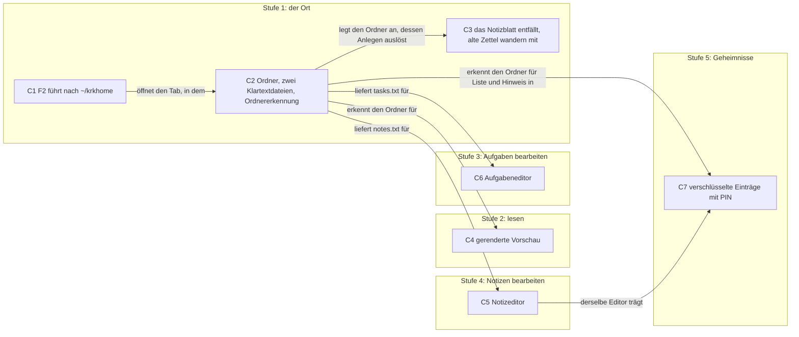
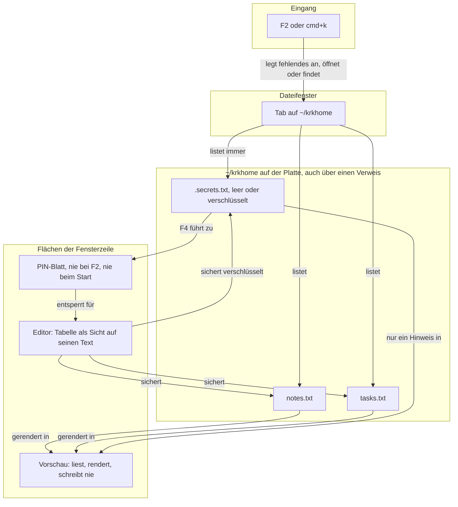

# Spec: F2 öffnet ~/krkhome mit Notizen, Aufgaben und Geheimnissen statt des Notizblatts

**Date:** 2026-09-26
**Status:** Complete
**Source:** Arbeitspaket `260925-2356-f2-oeffnet-krkhome-statt-notizfenster.md`, Abschnitt `## Directive`, in den Worten des Nutzers: „das notizfenster wird komplett umgebaut und erweitert. das blockierende fenster entfällt. stattdessen öffne F2 einen neuen dateilisten tab in ~/krkhome/" mit den drei Dateien `notes.txt`, `tasks.txt` und `.secrets.txt`.
**Grundlage erhoben:** 260926-0007, am Baum unter `crates/` und `resources/` sowie am Spec der Runde 9 (`260813-2348_*_spec-notizzettel-als-blatt-mit-zwei-zetteln.md`)
**Überarbeitet:** 260926, gegen die Antworten des Nutzers in den zehn Datensätzen unter `decisions/` dieses Arbeitspakets und gegen die Zweitlesung `260926-0017-zweitlesung-spec-f2-krkhome.md`; ein zweites Mal gegen die drei Datensätze, die aus dem Plan hervorgegangen sind (`260926-0050_*_…` zweimal, `260926-0112_*_…`), und gegen die Zweitlesung des Plans `260926-0107-zweitlesung-plan-f2-krkhome.md`. Berührt hat die zweite Überarbeitung die Ausgangslage zum Inhaltsfilter, C5 (Beschreibung, ein neues Kriterium, ein Nutzerkriterium, eine Entscheidung), C6 (eine Entscheidung zu den Tasten), C7 (Beschreibung, die Kriterien C7.3 und C7.13, ein geschärftes und ein neues Nutzerkriterium, drei Entscheidungen), eine Zeile der Constraints, drei Punkte unter `## Open for Planner` und die Tabelle unter `## Decisions`. Ein drittes Mal, eng, gegen die zwei Datensätze `260926-0115_*_…`: die Beschreibung und das Kriterium zur Ordnererkennung in C2 samt einer Entscheidung, je ein Kriterium und eine Entscheidung zu `esc` in C5 und C6, dazu ein Nutzerkriterium und ein Satz der Beschreibung in C5, ein Punkt unter `## Open for Planner` und zwei Zeilen der Tabelle unter `## Decisions`.
**Offene Nutzerfragen:** keine. Alle fünfzehn Datensätze tragen eine Antwort (Marker `_a_`); sie stehen unten unter `## Decisions` mit der Stelle, an der jede Antwort in die Abnahme eingeht.

---

## Directive

Nach dieser Arbeit bringt F2 den Nutzer in einen Dateilisten-Tab auf `~/krkhome/`, statt das blockierende Notizblatt zu öffnen; KRK legt den Ordner und die drei Dateien an, ohne dabei je ein Blatt zu zeigen. Notizen und Aufgaben sind strukturierte Einträge in lesbarem Text, die die Vorschau gerendert zeigt und der Editor in einer Sonderform bearbeitet; `.secrets.txt` trägt Einträge wie die Notizen, liegt mit einer vierstelligen PIN verschlüsselt auf der Platte, steht in der Liste trotz des Punkts im Namen und zeigt in der Vorschau nur einen Hinweis.

---

## Zuschnitt in fünf Stufen

Die Arbeit ist groß, und wir schneiden sie in fünf Stufen, von denen jede für sich ausgeliefert werden kann und dem Nutzer danach einen vollständigen, benutzbaren Stand hinterlässt. Keine Stufe lässt eine halbe Fähigkeit stehen: nach Stufe 1 ist das alte Blatt fort und F2 führt in einen Ordner, dessen Dateien sich im bestehenden Editor als Text bearbeiten lassen; jede weitere Stufe macht einen der drei Dateitypen bequemer.

| Stufe | Liefert | Nach der Auslieferung kann der Nutzer |
|---|---|---|
| 1 | C1, C2, C3 | mit F2 in `~/krkhome/` springen, `notes.txt` und `tasks.txt` im bestehenden Editor als Text pflegen, seine alten Zettel darin wiederfinden; seine eigene Tastenbelegung wirkt weiter |
| 2 | C4 | Notizen und Aufgaben in der Vorschau gerendert lesen |
| 3 | C6 | Aufgaben hinzufügen, verschieben, löschen und abhaken |
| 4 | C5 | Notizen als Tabelle aus Thema und Notiz bearbeiten |
| 5 | C7 | Geheimnisse verschlüsselt ablegen und mit PIN bearbeiten |

**Die Kennungen der Fähigkeiten bleiben, die Reihenfolge der Stufen hat sich gegenüber dem ersten Entwurf geändert.** Der Aufgabeneditor (C6) kommt vor den Notizeditor (C5). Er hat einzeilige Einträge und genau die Handlungen, die die Directive aufzählt, und ist damit das kleinere Stück, an dem sich die Bauform „die Tabelle ist eine Sicht auf den Text im Editor" zuerst bewährt. Der Notizeditor mit mehrzeiligen Zellen ist das schwierigere Stück und rückt so unmittelbar vor Stufe 5, die auf ihm aufsetzt.

**Stufe 2 ist dünn, und das ist eine Folge der Formatwahl und kein Mangel des Zuschnitts.** Weil die Dateien in einer Markdown-nahen Form stehen und die Vorschau Markdown seit der Runde 6 rendert, besteht die Stufe im Kern aus einer Regel, welche zwei Dateien als Notizen und Aufgaben gelten, und aus der Darstellung der Aufgabenkästchen, die auf diese zwei Dateien beschränkt bleibt. Sie bleibt eine eigene Stufe, weil sie für sich auslieferbar ist und dem Nutzer vor den Editoren schon das Lesen bequem macht.

**Die Kanten sind Voraussetzungen der Fähigkeit und keine Bauordnung.** Stufe 2, 3 und 4 hängen allein an Stufe 1; die Tabelle nennt die Reihenfolge, in der die Bauform an der einfacheren Datei zuerst erprobt wird. Stufe 5 braucht Stufe 4, weil die Directive für Geheimnisse „gleiche Darstellung der Einträge und gleicher Editor wie notes" verlangt, und Stufe 1, weil „steht immer" und der Hinweis in der Vorschau an der Erkennung des Ordners hängen. **Die Kante von Stufe 2 nach Stufe 5 aus dem ersten Entwurf ist gefallen:** der Hinweis in der Vorschau braucht die Ordnererkennung und nicht die gerenderte Darstellung. Welche Bauschritte innerhalb einer Stufe in welcher Reihenfolge laufen, entscheidet der Planer.

---

## Ausgangslage, am 260926-0007 am Baum erhoben

**F2 und `cmd+k` öffnen heute das Notizblatt der Runde 9.** Beide Kombinationen stehen in einer Zeile der Funktion mit der Kennung `notizzettel` in `resources/default-keymap.toml`; der Befehl `Kommando::Notizzettel` wird in `crates/krk-ui/src/appkit/anwendung.rs` von `notizzettel_zeigen` ausgeführt, das Blatt selbst steht in `crates/krk-ui/src/appkit/blaetter/zettel.rs`, sein Modell in `crates/krk-ui/src/zettelmodell.rs`.

**Eine eigene Tastenbelegung des Nutzers ist eine vollständige Liste von Kennungen.** Eine Kennung, die der Wortschatz nicht kennt, lässt die ganze Nutzerdatei abweisen, und KRK setzt dann die Auslieferungsbelegung ein; eine Funktion, die die Nutzerdatei nicht nennt, tritt ohne Taste hinzu (`crates/krk-core/src/tasten/belegung.rs`, `Belegung::bauen` und `laden`). Auf diesem Gerät ist `keymap.toml` eine solche vollständige Datei und führt `notizzettel`.

**Der Text der zwei Zettel liegt in `note-1.txt` und `note-2.txt` unter `~/Library/Application Support/KRK/`.** Beide stehen als `Datei::Zettel` in der Aufzählung der Ablagedateien (`crates/krk-core/src/ablage/pfade.rs`), und `session.toml` merkt sich im Feld `zettel`, welcher zuletzt offen war (`crates/krk-core/src/ablage/sitzung.rs`). Auf diesem Gerät tragen beide Text.

**Die Dateiliste blendet versteckte Einträge ab Werk aus**, je Tab umschaltbar mit `shift+cmd+h`. Ein Eintrag gilt als versteckt, wenn sein Name mit einem Punkt beginnt oder das Dateisystem ihn so kennzeichnet (`crates/krk-core/src/verzeichnis/eintrag.rs`). Ob eine Zeile steht, entscheidet ein einziger Prüfschritt in `crates/krk-core/src/verzeichnis/modell.rs`, der für jeden Eintrag jedes Ordners läuft. **Der Inhaltsfilter fragt nicht nach dem Kennzeichen „versteckt", sondern liest jede Datei, die in der Liste steht.** Das Kennzeichen hält eine Datei nur dadurch vom Filter fern, dass es sie bei ausgeblendeten Verstecken aus der Liste nimmt; sind die Verstecke eingeblendet, liest der Filter auch versteckte Dateien, und der Durchlauf über den Unterbaum fragt das Kennzeichen gar nicht (`zeilengrund_von` und `auftraege` in `crates/krk-core/src/verzeichnis/modell.rs`, `crates/krk-core/src/verzeichnis/durchlauf.rs`; erhoben in der Zweitlesung des Plans). Die erste Fassung dieses Spec behauptete an dieser Stelle das Gegenteil.

**Ein Tab entsteht über `Tabliste::oeffnen` mit einem Ordner** (`crates/krk-ui/src/tabs.rs`) hinter dem sichtbaren Tab des Dateifensters; Tabs werden in `session.toml` über Neustarts getragen, ebenso der Pfad der Datei im Editor.

**Die Vorschau rendert Markdown** seit der Runde 6 (`crates/krk-ui/src/markdown.rs`), ohne Zusatzoptionen des Zerlegers, und schreibt nichts. **Der Editor hat eine Roh- und eine Formatansicht** (`crates/krk-ui/src/editormodell.rs`, `Ansicht`); beide sind heute dieselbe Textfläche mit anderem Umbruch und anderer Einfärbung, und die Formatansicht unterscheidet nach der Endung zwischen Markdown und allem Übrigen.

**Die Anleitung beschreibt das Notizblatt.** `HowTo.md` trägt den Abschnitt `## Der Notizzettel` und führt `note-1.txt` und `note-2.txt` in der Aufstellung der Ablagedateien; `README.md` nennt die zwei Notizzettel unter dem, was ein Löschwerkzeug mitnimmt.

---

## Wer was zeigt und wer was schreibt

Die Vorschau liest und schreibt nie, jede Änderung geht durch den Editor (`260926-0007_*_wo-werden-notizen-und-aufgaben-bearbeitet-und-wo-gerendert.md`). Jede Handlung an der Tabelle ist eine Textänderung am Stand des Editors; deshalb gelten Sichern, die Rückfrage vor dem Verwerfen und Rückgängig für die drei Dateien genau so wie für jede andere Datei, und es gibt keinen zweiten Rückgängigstapel.

---

## Capabilities

Die Abnahmekriterien jeder Fähigkeit stehen in zwei Listen, wie in den Specs der früheren Runden: die erste ist am Baum nachweisbar und kann von einem Agenten gefahren werden, die zweite verlangt KRK im Vordergrund und ist Nutzerarbeit (`CLAUDE.md`, „Der Abnahmelauf verlangt KRK im Vordergrund").

**Vor jeder Nutzerabnahme einer Stufe, die neue Befehle bringt, steht ein Handgriff.** Eine vollständige eigene Belegung kennt die neuen Befehle nicht, und sie treten dort ohne Taste hinzu; die Startmeldung der Runde 24 nennt sie. Der Nutzer öffnet deshalb vor der Abnahme von Stufe 3, 4 und 5 die Belegungsansicht mit F1, setzt sie mit `cmd+r` auf den Auslieferungsstand und verlässt sie; danach tragen die neuen Befehle ihre Tasten. Ein Befehl ohne Taste vor diesem Handgriff ist kein Befund.

### Stufe 1

### C1: F2 führt nach ~/krkhome

**Description:** Der Nutzer drückt F2 oder `cmd+k`, gleich in welchem Bereich der Fokus steht, und das aktive Dateifenster zeigt `~/krkhome/`. Steht in diesem Dateifenster schon ein Tab auf den Ordner, wird er sichtbar; sonst entsteht ein neuer. Der Fokus geht in das Dateifenster. Ein Blatt öffnet sich dabei nie. Der Befehl behält seine Kennung `notizzettel`, damit eine eigene Belegung des Nutzers weiter geladen wird; Name und Wirkung ändern sich.

**Acceptance criteria, am Baum nachweisbar:**
- [ ] `resources/default-keymap.toml` führt die Funktion mit der Kennung `notizzettel` weiter, mit `f2` und `cmd+k` in einer Zeile und einem Namen, der den neuen Befehl beschreibt, etwa „Notizordner öffnen", mit Umlauten nach der Schreibregel des Projekts. Keine andere Funktion verliert eine Kombination.
- [ ] Eine Probe lädt eine vollständige Nutzerbelegung, die `id = "notizzettel"` führt, und bekommt sie ohne Ersetzung durch die Auslieferungsbelegung zurück.
- [ ] Der Befehl wirkt aus jedem Fokuswert heraus und, wie jeder andere Befehl, nicht, solange ein Blatt steht.
- [ ] Der Befehl hat einen eigenen Ausführungszweig und endet nicht im Auffangzweig des Anwendungsdelegierten.

**Acceptance criteria, nur am laufenden Bündel prüfbar (Nutzerarbeit):**
- [ ] Mit der eigenen Belegung dieses Geräts starten: keine Meldung, dass die eigene Belegung abgewiesen wurde, und F2 führt nach `~/krkhome/`. Das Hauptmenü darf dabei bis zum Zurücksetzen der Belegung den alten Namen „Notizzettel anzeigen" zeigen, weil der Name aus der Nutzerdatei kommt.
- [ ] F2 aus dem Dateifenster, aus der Leiste, aus der Vorschau, aus dem Editor und aus dem Git-Bereich: jedes Mal zeigt das aktive Dateifenster `~/krkhome/`, der Fokus steht im Dateifenster, und kein Blatt erscheint.
- [ ] Zweimal F2 hintereinander: es steht genau ein Tab auf `~/krkhome/` im aktiven Dateifenster.
- [ ] Mit der Maus in einen Tab auf `~/krkhome/` gegangen, dann in einen anderen Tab gewechselt, F2: der vorhandene Tab wird sichtbar, kein neuer entsteht.
- [ ] `cmd+k` tut dasselbe wie F2.
- [ ] Nach einem Neustart steht der Tab wie jeder andere Tab wieder da, und F2 findet ihn.

**Decisions made:**
- Beide Kombinationen gehen auf den neuen Befehl über (Vorgabe: eine Funktion mit zwei Wegen, wie der Nutzer es am 260802-1409 für die Norton-Reihe entschieden hat).
- Die Kennung `notizzettel` bleibt, nur Name und Wirkung ändern sich (Vorgabe aus der Zweitlesung; die Alternative, eine Liste stillgelegter Kennungen im Laden der Belegung, wäre eine eigene Regel, die diese Arbeit nicht braucht).
- F2 findet einen vorhandenen Tab im aktiven Dateifenster und öffnet nur dann einen neuen (`260926-0007_*_was-tut-f2-wenn-krkhome-schon-in-einem-tab-offen-ist.md`, Möglichkeit 1). Ein Tab zählt als vorhanden, gleich wie der Nutzer in den Ordner gekommen ist.

### C2: Der Ordner und die Klartextdateien entstehen bei F2, und KRK erkennt den Ordner an einer Stelle

**Description:** Gibt es `~/krkhome/` noch nicht, legt F2 den Ordner an und darin `notes.txt` und `tasks.txt`. Fehlt später eine der beiden, legt der nächste F2 sie leer wieder an. Eine vorhandene Datei überschreibt KRK nie, auch nicht, wenn eine zweite KRK-Instanz im selben Augenblick F2 drückt. Beim Start legt KRK nichts an, auch nicht für einen wiederhergestellten Tab auf den Ordner. Ist `~/krkhome` ein symbolischer Verweis auf einen Ordner, gilt dieser Ordner als `~/krkhome/`, und jede Regel dieser Arbeit, die am Ordner hängt, erkennt ihn an einer Stelle, über den Verweis `~/krkhome` ebenso wie über sein Ziel. Eine dritte Schreibweise, etwa ein weiterer Verweis, den der Nutzer selbst anderswo anlegt, erkennt KRK nicht; dort erscheinen die Dateien wie gewöhnliche Dateien, und verloren geht nichts.

Die zwei Dateien stehen in einer Markdown-nahen Textform, die der Nutzer auch ohne Sondereditor im bestehenden Editor und in jedem anderen Textprogramm pflegen kann:

- **Eine Notiz** beginnt mit einer Zeile `## <Thema>`; darunter folgt ihr Text über beliebig viele Zeilen bis zur nächsten solchen Zeile. `## ` und nicht `# `, weil eine Zeile `# …` damit als Überschrift der ganzen Datei frei bleibt und weil im Notiztext Zeilen mit `#` und `###` stehen dürfen, ohne ein neues Thema zu eröffnen.
- **Eine Aufgabe** ist eine Zeile `- [ ] <Text>`, erledigt `- [x] <Text>`; die Reihenfolge der Zeilen ist die Reihenfolge der Aufgaben. Gelesen wird großzügig: `- [X]`, `* [ ]`, `* [x]` und eingerückte Aufgaben gelten ebenfalls als Aufgaben. Geschrieben wird allein eine Zeile, die eine Handlung berührt hat, und dann in der Grundform; jede andere Zeile bleibt Byte für Byte, wie sie war.
- **Eine fremde Zeile**, also eine, die keiner Eintragsform folgt, bleibt erhalten. In `tasks.txt` hängt sie an der Aufgabe über ihr und wandert mit ihr; fremde Zeilen vor der ersten Aufgabe bleiben oben stehen. In `notes.txt` ist alles nach einer Themenzeile Notiztext, und fremd ist allein ein Vorspann vor der ersten Themenzeile; er bleibt oben stehen.

**Acceptance criteria, am Baum nachweisbar:**
- [ ] Das Anlegen öffnet jede Datei exklusiv, so dass es scheitert, wenn die Datei schon da ist. Eine Probe legt die Datei nach der Prüfung und vor dem Anlegen selbst an und findet sie danach Byte für Byte unverändert.
- [ ] Das Anlegen legt nur fehlende Dateien an; eine vorhandene Datei gleichen Namens bleibt Byte für Byte unverändert.
- [ ] Beim Start legt KRK weder den Ordner noch eine Datei an, auch nicht, wenn die Sitzung einen Tab auf `~/krkhome/` wiederherstellt. Eine Probe hält fest, dass der Weg der Sitzungswiederherstellung das Anlegen nicht erreicht.
- [ ] Die Form der Einträge ist an einer Stelle beschrieben, und Lesen und Schreiben einer Datei in dieser Form ergeben wieder dieselbe Datei, solange nichts geändert wurde, auch bei Aufgaben in den großzügig gelesenen Schreibweisen.
- [ ] Fremde Zeilen bleiben beim Lesen und Zurückschreiben erhalten; eine Probe verschiebt eine Aufgabe über eine fremde Zeile hinweg und findet die fremde Zeile unter der Aufgabe, zu der sie gehört, und einen Vorspann oben.
- [ ] Die Erkennung „das ist `~/krkhome/`" steht an einer Stelle und kennt den Ordner in zwei Pfadformen, der geschriebenen (`~/krkhome`) und der aufgelösten (dem Ziel des Verweises); ein gefragter Pfad gilt als der Ordner, wenn er als Text einer der beiden gleicht, und die Frage selbst greift nicht auf das Dateisystem zu. Eine dritte Schreibweise desselben Ordners wird nicht erkannt. Eine Probe erreicht einen Ordner über einen symbolischen Verweis und über sein Ziel und bekommt beide Male dieselbe Antwort; die Regeln aus C1, C4 und C7, die am Ordner hängen, fragen diese eine Stelle.

**Acceptance criteria, nur am laufenden Bündel prüfbar (Nutzerarbeit):**
- [ ] Ohne `~/krkhome/` F2 drücken: der Ordner steht da, darin `notes.txt` und `tasks.txt`, und es erscheint kein Blatt.
- [ ] `tasks.txt` im Finder löschen, F2: die Datei steht wieder da, leer.
- [ ] An die Stelle von `~/krkhome` eine gewöhnliche Datei legen, F2: die Statuszeile nennt den Grund, kein Tab öffnet sich, die Datei ist unverändert.
- [ ] `~/krkhome` durch einen symbolischen Verweis auf einen anderen Ordner ersetzen, F2: der Tab zeigt den Inhalt des Zielordners, und fehlende Dateien entstehen dort.
- [ ] `notes.txt` mit F4 im Editor öffnen, eine Notiz in der Form `## Thema` mit zwei Zeilen Text darunter von Hand schreiben, sichern: die Datei lässt sich in TextEdit öffnen und lesen.

**Decisions made:**
- Markdown-nahe Textform mit den vier Regeln zu fremden Zeilen, zu `## ` im Notiztext, zum großzügigen Lesen und zur Begründung von `## ` (`260926-0007_*_in-welchem-format-stehen-notes-txt-und-tasks-txt.md`, Möglichkeit 1).
- Fehlende Dateien legt jeder F2 neu an, exklusiv geöffnet, und überschreibt nie (`260926-0007_*_wann-entsteht-secrets-txt-und-was-geschieht-mit-fehlenden-dateien.md`).
- Der Ort ist fest `~/krkhome/`; die Einstellbarkeit ist spätere Arbeit; der Ordner wird auch über einen symbolischen Verweis erkannt (`260926-0007_*_ist-der-ort-krkhome-fest-oder-einstellbar.md`, Möglichkeit 3).
- Der Ordner wird an zwei Pfadformen erkannt, der geschriebenen und der aufgelösten, als Text verglichen; eine dritte Schreibweise, die der Nutzer selbst anlegt, wird nicht erkannt (`260926-0115_*_erkennt-krk-den-heimordner-an-zwei-pfadformen-oder-an-jeder-schreibweise.md`, Möglichkeit 1).
- `.secrets.txt` entsteht nicht in Stufe 1, sondern mit C7 in Stufe 5 (Vorgabe: eine leere `.secrets.txt` ohne die Regeln aus C7 ließe sich mit F4 als gewöhnlicher Text öffnen und mit Klartext sichern).

### C3: Das Notizblatt entfällt, und die alten Zettel gehen nicht verloren

**Description:** Das blockierende Notizblatt gibt es nach Stufe 1 nicht mehr. Was der Nutzer in den zwei alten Zetteln geschrieben hat, findet er als Notizen in `notes.txt` wieder. Übernommen wird genau einmal, nämlich dann, wenn ein F2 den Ordner `~/krkhome/` selbst angelegt hat; ein späteres Neuanlegen von `notes.txt` übernimmt nichts, und ein Ordner, den es schon gab, bekommt nichts übernommen. Die alten Dateien im Ablageordner bleiben unangetastet liegen, und KRK liest und schreibt sie danach nicht mehr.

**Acceptance criteria, am Baum nachweisbar:**
- [ ] Im Baum steht kein Blatt für den Notizzettel mehr, und kein Befehl öffnet eines.
- [ ] Hat derselbe Aufruf den Ordner angelegt, wird jeder nicht leere alte Zettel zu einer Notiz mit dem Thema „Zettel 1" beziehungsweise „Zettel 2", Text unverändert. Ein leerer oder fehlender Zettel ergibt keine Notiz.
- [ ] Trägt ein alter Zettel eine Zeile, die mit `## ` beginnt, wird dieser Zettel nicht übernommen, und die Statuszeile nennt ihn und sagt, dass seine Datei unverändert liegen bleibt; der andere Zettel wird trotzdem übernommen.
- [ ] Bestand der Ordner schon, übernimmt KRK nichts, auch wenn `notes.txt` darin fehlt und neu entsteht.
- [ ] `note-1.txt` und `note-2.txt` sind nach der Übernahme Byte für Byte unverändert.
- [ ] Eine `session.toml` mit dem bisherigen Feld für den zuletzt offenen Zettel bleibt lesbar, und keine andere Angabe darin geht verloren; das Feld selbst darf entfallen.

**Acceptance criteria, nur am laufenden Bündel prüfbar (Nutzerarbeit):**
- [ ] Mit Text in beiden alten Zetteln und ohne `~/krkhome/` auf die neue Fassung wechseln, F2, `notes.txt` ansehen: beide Texte stehen als Notizen darin.
- [ ] Danach steht unter `~/Library/Application Support/KRK/` noch `note-1.txt` und `note-2.txt` mit dem alten Inhalt.
- [ ] `notes.txt` löschen, F2: die neue `notes.txt` ist leer, die Zettel kommen nicht ein zweites Mal.
- [ ] `HowTo.md` beschreibt F2 und `~/krkhome/` statt des Notizblatts, und die Aufstellung der Ablagedateien dort und in `README.md` nennt die zwei Zettel nicht mehr als etwas, das KRK pflegt.

**Decisions made:**
- Einmalige Übernahme, ausgelöst allein durch das Anlegen des Ordners und nicht der Datei; die alten Dateien bleiben liegen; das alte Sitzungsfeld darf entfallen (`260926-0007_*_was-geschieht-mit-den-zwei-zetteln-des-bisherigen-notizblatts.md`, Möglichkeit 1).
- Ein Zettel mit einer Zeile `## ` wird nicht übernommen statt umgeschrieben (Vorgabe, abgeleitet aus der Formatregel, nach der eine solche Zeile im Notiztext abgewiesen wird; ihn still einzurücken änderte Text des Nutzers, und die Datei bleibt ohnehin liegen). Auf diesem Gerät beginnt in keinem der beiden Zettel eine Zeile mit `#`.

### Stufe 2

### C4: Notizen und Aufgaben erscheinen in der Vorschau gerendert

**Description:** Wählt der Nutzer im Ordner `~/krkhome/` die Datei `notes.txt`, zeigt die Vorschau die Notizen als gegliederte Liste: jedes Thema hervorgehoben, der Notiztext darunter. Für `tasks.txt` zeigt sie die Aufgaben in ihrer Reihenfolge, jede mit einem Kästchen, das den Erledigt-Zustand zeigt. Die Vorschau ändert dabei nichts an den Dateien. Jede andere Datei erscheint wie bisher, auch eine Markdown-Datei an anderem Ort.

**Acceptance criteria, am Baum nachweisbar:**
- [ ] Die gerenderte Darstellung gilt für `notes.txt` und `tasks.txt` im erkannten Ordner aus C2, auch über einen symbolischen Verweis erreicht, und für keine andere Datei; eine gleichnamige Datei in einem anderen Ordner erscheint wie bisher.
- [ ] Die Darstellung der Aufgabenkästchen gilt allein für diese zwei Dateien; eine `.md`-Datei mit `- [ ]` an anderem Ort erscheint unverändert wie vor dieser Arbeit.
- [ ] Die Vorschau schreibt keine der beiden Dateien.

**Acceptance criteria, nur am laufenden Bündel prüfbar (Nutzerarbeit):**
- [ ] `notes.txt` auswählen: jedes Thema ist als Überschrift zu erkennen, der Notiztext steht darunter.
- [ ] `tasks.txt` auswählen: offene und erledigte Aufgaben sind auf einen Blick zu unterscheiden, in der Reihenfolge der Datei.
- [ ] Eine von Hand geschriebene Zeile, die keiner Eintragsform folgt, erscheint als gewöhnlicher Text und nicht als Fehler.
- [ ] Beide Darstellungen sind in hellem und dunklem Erscheinungsbild lesbar.

**Decisions made:**
- Die Vorschau bleibt lesend, auch für das Kästchen; abgehakt wird im Editor (`260926-0007_*_wo-werden-notizen-und-aufgaben-bearbeitet-und-wo-gerendert.md`, Möglichkeit 1).

### Stufe 3

### C6: Der Aufgabeneditor

**Description:** Öffnet der Nutzer `tasks.txt` im Editor, zeigt die Formatansicht die Aufgaben als Liste mit je einem Kästchen. Er kann eine Aufgabe hinzufügen, ihren Text ändern, sie nach oben oder unten verschieben, sie löschen und sie abhaken oder wieder öffnen, mit der Tastatur und mit der Maus, das Abhaken auch mit einem Klick auf das Kästchen. Jede Handlung ändert den Text im Editor, wie es eine Eingabe von Hand täte: die Rohansicht zeigt die Änderung sofort, die Datei gilt als geändert, bis sie gesichert ist, und `cmd+z` nimmt eine Handlung zurück. Sichern, die Rückfrage vor dem Verwerfen ungesicherter Änderungen und Rückgängig wirken wie bei jeder anderen Datei. Während der Nutzer den Text einer Aufgabe tippt, wirken F2 und die Befehle von KRK weiter; Buchstaben, Rückschritt und die Pfeile innerhalb der Zeile ändern den Text der Aufgabe.

**Acceptance criteria, am Baum nachweisbar:**
- [ ] Jede der fünf Handlungen (hinzufügen, ändern, verschieben, löschen, abhaken) ist ohne Fenster am Modell prüfbar und ergibt als Textänderung am Stand des Editors die erwartete Datei; fremde Zeilen wandern nach der Regel aus C2 mit.
- [ ] Es gibt keinen zweiten Rückgängigstapel neben dem des Editors; eine Handlung zurückzunehmen stellt den Text wieder her, wie er vorher war, innerhalb des bestehenden Budgets des Editors.
- [ ] Abhaken ändert nur den Erledigt-Zustand der einen Aufgabe und nicht ihre Stelle in der Liste, und es schreibt allein diese eine Zeile neu.
- [ ] Jede Handlung ist über die Tastatur erreichbar; ihre Kombinationen stehen in `resources/default-keymap.toml` und damit in der Belegungsansicht und im Hauptmenü.
- [ ] Jeder neue Befehl hat einen eigenen Ausführungszweig und endet nicht in einem Auffangzweig.
- [ ] Die Befehle sind allein zulässig, wenn der Editor `tasks.txt` aus dem erkannten Ordner hält und die Formatansicht zeigt; bei jeder anderen Datei sind sie im Hauptmenü ausgegraut und tun über die Taste nichts.
- [ ] Die Textfläche, in der der Nutzer den Text einer Aufgabe tippt, ist als KRKs eigene Textfläche angemeldet, so dass die Befehle von KRK beim Tippen wirken.
- [ ] `esc` in einer Aufgabenzelle verwirft die Änderung an der Zelle und beendet ihre Bearbeitung; die Aufgabe trägt wieder ihren vorigen Text, und der Stand des Editors ist unberührt. `esc` leert dabei keinen Filtertext.

**Acceptance criteria, nur am laufenden Bündel prüfbar (Nutzerarbeit):** (vorher der Handgriff F1, `cmd+r`, Ansicht verlassen)
- [ ] Jeder neue Befehl im Hauptmenü tut, was sein Name sagt, einmal über das Menü und einmal über seine Taste.
- [ ] Drei Aufgaben anlegen, die mittlere nach oben verschieben, sichern: die Datei trägt die neue Reihenfolge.
- [ ] Ein Klick auf das Kästchen einer Aufgabe hakt sie ab, ein zweiter öffnet sie wieder.
- [ ] Eine Aufgabe löschen, `cmd+z`: sie steht wieder an ihrer Stelle.
- [ ] Nach einer Handlung und vor dem Sichern in die Rohansicht wechseln: die Änderung steht schon im Text.
- [ ] Mit ungesicherter Änderung den Editor schließen: die bestehende Rückfrage erscheint.
- [ ] Im Text einer Aufgabe tippen und dabei F2 drücken: das Dateifenster zeigt `~/krkhome/`.
- [ ] Eine andere Textdatei im Editor öffnen: die Befehle des Aufgabeneditors sind im Hauptmenü ausgegraut.
- [ ] Nach dem Sichern zeigt die Vorschau (C4) denselben Stand.

**Decisions made:**
- Die Sonderform wohnt in der Formatansicht des Editors, und jede Handlung ist eine Textänderung am Stand des Editors (`260926-0007_*_wo-werden-notizen-und-aufgaben-bearbeitet-und-wo-gerendert.md`, Möglichkeit 1).
- „checkout" in der Directive ist als Kästchen für den Erledigt-Zustand gelesen, „verschieben" als Ändern der Reihenfolge innerhalb von `tasks.txt` (Lesart des Designers).
- Erledigte Aufgaben bleiben an ihrer Stelle und wandern nicht ans Ende (Vorgabe).
- Neue Aufgaben entstehen am Ende der Liste (Vorgabe).
- Die Tasten der zwei Editoren und der PIN-Änderung sind sieben: `shift+cmd+return` legt einen Eintrag an, `cmd+return` beginnt die Bearbeitung und übernimmt eine Zelle, `opt+cmd+up` und `opt+cmd+down` verschieben, `shift+cmd+delete` löscht, `shift+cmd+x` hakt ab, `shift+cmd+p` ändert die PIN (C7). `shift+cmd+delete` wird trotz seiner Bedeutung „Papierkorb entleeren" im Finder vergeben; die Wirkung bleibt auf die Tabelle im Editor beschränkt und ist mit `cmd+z` zurückzunehmen. Jede Taste bleibt in der Belegungsansicht änderbar (`260926-0112_*_was-tut-return-in-einer-notizzelle-und-welche-tasten-tragen-die-editoren.md`, Möglichkeit 1 und die Tasten wie im Plan).
- `esc` verwirft in der Aufgabenzelle, nach der Mac-Konvention, weil eine einzeilige Zelle nach dem Verwerfen ihren alten Text an derselben Stelle zeigt; in einer geänderten Notizzelle übernimmt es (C5). Die Trennlinie ist, ob die Zelle Zeilenumbrüche trägt (`260926-0115_*_was-tut-esc-in-einer-geaenderten-zelle-der-eintragstabellen.md`, Möglichkeit 2).
- Beim Tippen in einer Aufgabe wirken KRKs Befehle weiter (Vorgabe nach der Regel des Projekts, dass die Textflächen eines Bereichs der Fensterzeile als eigene angemeldet werden, `CLAUDE.md`, Absatz zum Ereignisabgriff; ein Bereich, in dem beim Tippen kein Befehl wirkt, wäre der Zustand, den das Projekt nur für Blätter will).

### Stufe 4

### C5: Der Notizeditor

**Description:** Öffnet der Nutzer `notes.txt` im Editor, zeigt die Formatansicht die Notizen als Tabelle mit den Spalten Thema und Notiz. Er kann eine Notiz hinzufügen, Thema und Text einer Notiz ändern, eine Notiz löschen und eine Notiz nach oben oder unten verschieben. Der Text einer Notiz darf mehrere Zeilen tragen. Eine Zeile im Notiztext, die mit `## ` beginnt, weist der Editor ab und sagt in der Statuszeile, warum. In einer Notizzelle schreibt `return` einen Zeilenumbruch; die Bearbeitung der Zelle endet mit `cmd+return` oder einem Klick daneben. `esc` beendet sie ebenfalls und übernimmt dabei eine geänderte Zelle, statt sie zu verwerfen; `cmd+z` nimmt die Übernahme zurück. Für Sichern, Rückgängig, die Rohansicht und das Tippen in einer Zelle gilt dasselbe wie beim Aufgabeneditor (C6).

**Acceptance criteria, am Baum nachweisbar:**
- [ ] Jede der vier Handlungen (hinzufügen, ändern, löschen, verschieben) ist ohne Fenster am Modell prüfbar und ergibt als Textänderung am Stand des Editors die erwartete Datei; ein Vorspann vor der ersten Themenzeile bleibt oben stehen.
- [ ] Eine Änderung, die eine Zeile mit `## ` in den Notiztext brächte, wird abgewiesen, und der Stand bleibt, wie er war.
- [ ] Es gibt keinen zweiten Rückgängigstapel; eine zurückgenommene Handlung stellt den Text wieder her, wie er vorher war.
- [ ] Jede Handlung ist über die Tastatur erreichbar; ihre Kombinationen stehen in `resources/default-keymap.toml`. Befehle, die C6 schon bringt und die hier dasselbe tun, etwa Verschieben und Löschen, sind dieselben Befehle und keine zweiten.
- [ ] Jeder neue Befehl hat einen eigenen Ausführungszweig.
- [ ] Die Befehle sind allein zulässig, wenn der Editor `notes.txt` aus dem erkannten Ordner hält und die Formatansicht zeigt, und sonst im Hauptmenü ausgegraut.
- [ ] Die Zellen, in denen der Nutzer Thema und Notiz tippt, sind als KRKs eigene Textflächen angemeldet.
- [ ] In einer Notizzelle schreibt `return` einen Zeilenumbruch in den Text der Zelle und beendet die Bearbeitung nicht; `cmd+return` übernimmt die Zelle.
- [ ] `esc` in einer geänderten Notizzelle, ob Thema oder Notiz, übernimmt die Zelle als eine Handlung, die `cmd+z` zurücknimmt, und die Statuszeile sagt, dass übernommen wurde und `cmd+z` es zurücknimmt; eine unveränderte Zelle verlässt `esc` ohne Änderung am Stand. `esc` leert dabei keinen Filtertext.

**Acceptance criteria, nur am laufenden Bündel prüfbar (Nutzerarbeit):** (vorher der Handgriff F1, `cmd+r`, Ansicht verlassen)
- [ ] `notes.txt` im Editor öffnen: die Notizen stehen als Tabelle aus Thema und Notiz.
- [ ] Jeder neue Befehl im Hauptmenü tut, was sein Name sagt.
- [ ] Eine Notiz mit mehrzeiligem Text anlegen, die Zeilen mit `return` trennen, die Zelle mit `cmd+return` übernehmen, sichern, in der Rohansicht nachsehen: sie steht in der Form `## Thema` mit dem Text darunter in der Datei.
- [ ] In den Text einer Notiz eine Zeile `## x` tippen: die Statuszeile sagt, warum das nicht geht, und die Notiz bleibt ohne diese Zeile.
- [ ] Eine Notiz löschen, `cmd+z`: sie steht wieder da.
- [ ] Mit ungesicherter Änderung den Editor schließen: die bestehende Rückfrage erscheint.
- [ ] In einer Zelle tippen und dabei F2 drücken: das Dateifenster zeigt `~/krkhome/`.
- [ ] In den Text einer Notiz zwei Absätze tippen und `esc` drücken: der Text steht in der Notiz, die Statuszeile nennt `cmd+z`, und `cmd+z` stellt den vorigen Text wieder her.
- [ ] Jede der vier Handlungen gelingt allein mit der Tastatur und ebenso mit der Maus.

**Decisions made:**
- Verschieben gehört auch zum Notizeditor, obwohl die Directive es nur für Aufgaben nennt (Vorgabe: dieselbe Handlung wie in C6, damit beide Editoren sich gleich bedienen).
- Neue Notizen entstehen am Ende der Liste (Vorgabe).
- Die Sonderform wohnt in der Formatansicht, jede Handlung ist eine Textänderung am Stand des Editors (`260926-0007_*_wo-werden-notizen-und-aufgaben-bearbeitet-und-wo-gerendert.md`, Möglichkeit 1).
- Eine Zeile `## ` im Notiztext wird abgewiesen und nicht umgeschrieben (`260926-0007_*_in-welchem-format-stehen-notes-txt-und-tasks-txt.md`).
- `return` schreibt in einer Notizzelle einen Zeilenumbruch, beendet wird mit `cmd+return` oder einem Klick daneben; das weicht bewusst von der Mac-Konvention für Tabellenzellen ab, weil der häufige Fall, mehrzeiliger Notiztext, sonst je Zeile eine Zusatztaste bräuchte. Die Tasten sind dieselben sieben wie in C6 (`260926-0112_*_was-tut-return-in-einer-notizzelle-und-welche-tasten-tragen-die-editoren.md`, Möglichkeit 1).
- `esc` übernimmt eine geänderte Notizzelle und verwirft nicht, weil eine Zelle mit Zeilenumbrüchen mehrere Absätze tragen kann, die ein Verwerfen ohne Meldung verlöre; in der Aufgabenzelle verwirft es (C6). Dieselbe Regel gilt für die Tabelle von `.secrets.txt` (C7) (`260926-0115_*_was-tut-esc-in-einer-geaenderten-zelle-der-eintragstabellen.md`, Möglichkeit 2).

### Stufe 5

### C7: Geheimnisse, verschlüsselt und mit PIN

**Description:** F2 legt `.secrets.txt` in `~/krkhome/` an, wenn sie fehlt, und zwar leer mit null Bytes und ohne eine PIN zu fragen; wie `notes.txt` und `tasks.txt` exklusiv geöffnet und nie über eine vorhandene Datei. In diesem Ordner steht die Datei in der Liste immer, obwohl ihr Name mit einem Punkt beginnt. Die Vorschau zeigt für sie keinen Inhalt, sondern einen Hinweis, dass sie verschlüsselt ist und wie man sie öffnet.

Öffnet der Nutzer die Datei im Editor, fragt KRK zuerst die PIN: bei einer leeren Datei legt der Nutzer eine neue vierstellige PIN fest, bei jeder anderen gibt er die PIN ein. Danach zeigt der Editor die Einträge in derselben Tabelle wie bei den Notizen (C5), und Sichern schreibt sie verschlüsselt. Die Wartezeit der Schlüsselableitung fällt beim Öffnen, beim Festlegen und beim Ändern der PIN an und nicht beim Sichern: ein `cmd+s` an `.secrets.txt` dauert so lange wie an jeder anderen Datei. Die PIN gilt, solange die Datei im Editor offen ist; schließt der Nutzer den Editor, wechselt er dort auf eine andere Datei oder beendet er KRK, ist der Inhalt wieder verschlossen. Ein eigener Befehl ändert die PIN. Stimmt die PIN nicht oder ist die Datei verändert, öffnet sich nichts, und eine einzige Meldung sagt beides.

Die Verschlüsselung soll allein verhindern, dass Agenten, Werkzeuge und Indexer den Inhalt versehentlich lesen; ein Angriff mit einer Kopie der Datei liegt außerhalb. Die PIN-Abfrage sagt dem Nutzer genau das und dass eine vergessene PIN den Inhalt endgültig verschließt. Den Inhalt der Datei darf der Nutzer in die Zwischenablage kopieren; die Anleitung nennt das Risiko.

**Acceptance criteria, am Baum nachweisbar:**
- [ ] F2 legt eine fehlende `.secrets.txt` mit null Bytes an, exklusiv geöffnet, und zeigt dabei kein Blatt. Eine vorhandene `.secrets.txt` bleibt Byte für Byte unverändert.
- [ ] Die PIN besteht aus genau vier Ziffern; die Abfrage nimmt nichts anderes an.
- [ ] Der Inhalt einer nicht leeren `.secrets.txt` ist eine Binärdatei: vorn ein Kopf mit Kennung, Formatversion, den Parametern der Schlüsselableitung, Salz und Nonce, dahinter das Chiffrat. Verschlüsselt wird mit XChaCha20-Poly1305, der Schlüssel entsteht mit Argon2id aus der PIN, und der Kopf geht in die Prüfung der Echtheit ein. Jede Sicherung zieht eine neue Nonce; das Salz entsteht allein beim Festlegen und beim Ändern der PIN, und eine gewöhnliche Sicherung übernimmt Salz und Parameter aus dem Kopf. Zwei Sicherungen desselben Klartexts ergeben verschiedene Bytes. Der Schlüssel wird beim Öffnen einmal abgeleitet und gehalten, solange die Datei im Editor offen ist; eine Sicherung leitet nicht neu ab.
- [ ] Der Klartext eines Eintrags kommt in der Datei nicht vor; eine Probe hält es mit einem bekannten Eintrag fest.
- [ ] Mit der richtigen PIN ergibt Entschlüsseln und Verschlüsseln wieder dieselben Einträge.
- [ ] Mit einer falschen PIN und ebenso bei einem veränderten Chiffrat liefert das Entschlüsseln dieselbe Abweisung, keinen Text und keine halb entschlüsselte Anzeige; die Datei bleibt unverändert. Ein Schaden am Kopf (falsche Kennung, abgeschnittener Kopf, unbekannte Version) wird als solcher gemeldet und ebenfalls nicht angezeigt.
- [ ] Eine Datei, die mit einer älteren Formatversion und anderen Parametern der Schlüsselableitung geschrieben wurde, öffnet mit derselben PIN weiter; die Parameter lesen sich aus dem Kopf und nicht aus dem Code.
- [ ] Klartext der Geheimnisse gelangt an keine Stelle auf der Platte: nicht in `session.toml`, nicht in eine Nachbardatei des atomaren Schreibens, nicht in eine Sicherungs- oder Beiseitekopie und nicht beim Ändern der PIN. Verschlüsselt wird, bevor die Bytes den Schreibweg erreichen.
- [ ] `session.toml` nennt `.secrets.txt` nie als Datei im Editor; eine Probe beendet eine Sitzung mit der Datei im Editor und findet sie in der gesicherten Sitzung nicht.
- [ ] Jeder Weg, auf dem KRK die Datei in den Editor holt, führt über die PIN-Abfrage und nie über den gewöhnlichen Textweg, der sie als Text oder als „kein Text" behandeln würde.
- [ ] `.secrets.txt` im erkannten Ordner steht in der Liste, gleich wie der Umschalter für versteckte Einträge steht und über welchen Pfad der Ordner erreicht wurde. Andere versteckte Einträge im selben Ordner folgen weiter dem Umschalter, und `.secrets.txt` in jedem anderen Ordner ebenfalls.
- [ ] Die Ausnahme ist eine Eigenschaft des gelesenen Ordners, die beim Lesen einmal gesetzt wird; der Eintrag bleibt als versteckt gekennzeichnet. Ein Ordner, der nicht `~/krkhome/` ist, durchläuft den Prüfschritt der Sichtbarkeit ohne einen zusätzlichen Vergleich je Eintrag.
- [ ] Im erkannten Ordner bekommt `.secrets.txt` vom Inhaltsfilter nie einen Inhaltsauftrag, gleich wie der Umschalter für versteckte Einträge steht. Die Regel steht bei der Ausnahme „steht immer" und entscheidet dort allein über den Namen; sie hängt nicht am Kennzeichen „versteckt", das den Filter nicht aufhält. Eine Probe hält es mit ein- und mit ausgeblendeten Verstecken fest. Aus einem übergeordneten Ordner liest die tiefe Suche mit „Content" das Chiffrat weiter wie jede andere Datei darunter; Klartext erreicht sie nie.
- [ ] Die Vorschau liest für `.secrets.txt` keinen Inhalt, auch nicht für eine leere.
- [ ] Der Befehl „PIN ändern" und der Befehl, der die Datei öffnet, haben je einen eigenen Ausführungszweig; „PIN ändern" ist allein zulässig, wenn der Editor die entsperrte, nicht leere `.secrets.txt` hält, und sonst im Hauptmenü ausgegraut.
- [ ] Die Texte der PIN-Abfrage tragen Umlaute nach der Schreibregel des Projekts, und eine Probe hält ihren Wortlaut fest, wie es die Proben der Umsetzung vom 260907 für die übrigen Meldungen tun.
- [ ] Die zwei Kryptografie-Kisten bauen auf keinem der beiden Mac-Ziele C-Code (Prüfmittel wie in `CLAUDE.md`: `cargo tree --target <ziel> -e normal,build`, kein `cc`, kein Paket mit einem Namen auf `-sys`), und ihre Begründung steht in der Wurzel-`Cargo.toml` wie bei jeder fremden Kiste.
- [ ] `README.md` beschreibt den Kopf der Datei so, dass sich die Einträge mit der PIN auch ohne KRK entschlüsseln lassen.
- [ ] `HowTo.md` beschreibt `.secrets.txt`, was die PIN schützt und was nicht, dass eine vergessene PIN den Inhalt endgültig verschließt und dass kopierter Text im Klartext in der Zwischenablage liegt, wo jedes Programm des Kontos ihn lesen kann.

**Acceptance criteria, nur am laufenden Bündel prüfbar (Nutzerarbeit):** (vorher der Handgriff F1, `cmd+r`, Ansicht verlassen)
- [ ] Erster F2 nach Auslieferung dieser Stufe: kein Blatt erscheint, und `.secrets.txt` steht in der Liste; `ls -l ~/krkhome/.secrets.txt` zeigt null Bytes.
- [ ] `shift+cmd+h` im Tab umschalten: `.secrets.txt` bleibt stehen, `.DS_Store` folgt dem Umschalter.
- [ ] `.secrets.txt` auswählen: die Vorschau zeigt einen Hinweis und keinen Inhalt.
- [ ] Die leere Datei mit F4 öffnen: KRK verlangt eine neue vierstellige PIN, zweimal einzugeben, und der Text der Abfrage sagt, wovor die PIN schützt, wovor nicht und dass eine vergessene PIN den Inhalt verschließt. Danach steht eine leere Tabelle.
- [ ] Einen Eintrag anlegen, sichern, die Datei mit `cat` im Terminal ansehen: der Text des Eintrags ist nicht zu lesen.
- [ ] Den Editor schließen und die Datei erneut öffnen: die PIN wird wieder verlangt; mit falscher PIN öffnet nichts und die Meldung sagt „PIN falsch oder Datei verändert"; mit richtiger PIN stehen die Einträge als Tabelle.
- [ ] Mit entsperrter Datei im Editor KRK beenden und neu starten: kein Blatt beim Start, und der Editor zeigt die Datei nicht.
- [ ] Die PIN ändern, KRK neu starten: nur die neue PIN öffnet die Datei.
- [ ] Im Tab auf `~/krkhome/` den Filter mit angekreuztem „Content" nach dem Text eines Eintrags suchen lassen, einmal mit aus- und einmal mit eingeblendeten Verstecken: `.secrets.txt` erscheint nicht als Treffer.
- [ ] Die Datei öffnen, einen Eintrag ändern, `cmd+s`: die Sicherung ist so schnell wie bei `notes.txt`, das Fenster friert nicht ein.
- [ ] Einen Eintrag markieren und mit `cmd+c` kopieren: das gelingt, und `pbpaste` im Terminal zeigt den Text.

**Decisions made:**
- Vierstellige PIN, XChaCha20-Poly1305 mit Argon2id, binäre Datei mit versioniertem Kopf, eine Meldung für falsche PIN oder veränderte Datei; das Bedrohungsmodell ist allein das versehentliche Lesen durch Agenten, Werkzeuge und Indexer (`260926-0007_*_wie-wird-secrets-txt-verschluesselt-und-was-schuetzt-eine-vierstellige-pin.md`, Möglichkeit 1).
- F2 legt `.secrets.txt` leer mit null Bytes an und fragt nie nach einer PIN; das erste Öffnen legt die PIN fest (`260926-0007_*_wann-entsteht-secrets-txt-und-was-geschieht-mit-fehlenden-dateien.md`). „Beim Erzeugen wird eine PIN abgefragt" ist damit als Erzeugen des Inhalts gelesen und nicht der Datei.
- Die PIN gilt, solange die Datei im Editor offen ist; ein Befehl „PIN ändern" verlangt die alte PIN und verschlüsselt die Datei neu; `.secrets.txt` wird nicht in der Sitzung gemerkt (`260926-0007_*_wie-lange-gilt-eine-eingegebene-pin.md`, Möglichkeit 1 mit dem Befehl).
- „Immer gelistet" gilt im Ordner `~/krkhome/` unabhängig vom Umschalter und vom Weg dorthin, als Eigenschaft des Ordners, ohne das Kennzeichen „versteckt" umzustellen, und allein für `.secrets.txt` (`260926-0007_*_was-heisst-immer-gelistet-fuer-secrets-txt.md`, Möglichkeit 1).
- Kopieren aus `.secrets.txt` bleibt erlaubt, die Anleitung nennt das Risiko (`260926-0033_*_darf-text-aus-secrets-txt-in-die-zwischenablage.md`, Möglichkeit 1).
- Neues Salz nur beim Festlegen oder Ändern der PIN, neue Nonce bei jeder Sicherung, der abgeleitete Schlüssel wird gehalten, solange die Datei offen ist (`260926-0050_*_zieht-jede-sicherung-von-secrets-txt-ein-neues-salz-wenn-das-eine-halbe-sekunde-je-cmd-s-kostet.md`, Möglichkeit 3). Die erste Fassung verlangte ein neues Salz je Sicherung; das hätte jedes `cmd+s` rund eine halbe Sekunde gekostet. Angehobene Parameter der Ableitung greifen beim nächsten Ändern der PIN.
- Der Inhaltsfilter liest `.secrets.txt` im erkannten Ordner nie, über die Ausnahme „steht immer" und ihren Namen; die tiefe Suche aus einem übergeordneten Ordner liest weiter das Chiffrat, was unter dem Bedrohungsmodell hinnehmbar ist (`260926-0050_*_wie-weit-reicht-der-inhaltsfilter-liest-secrets-txt-nicht-wenn-das-kennzeichen-versteckt-ihn-nicht-haelt.md`, Möglichkeit 1). Die erste Fassung begründete das Kriterium mit dem Kennzeichen „versteckt"; diese Begründung war falsch, weil der Filter jede gelistete Datei liest.
- `shift+cmd+p` ändert die PIN (`260926-0112_*_was-tut-return-in-einer-notizzelle-und-welche-tasten-tragen-die-editoren.md`).
- Der Text der Abfrage lautet sinngemäß: „Die PIN hält Programme und Agenten vom Mitlesen ab. Gegen jemanden, der die Datei kopiert und gezielt angreift, schützt sie nicht. Eine vergessene PIN verschließt den Inhalt endgültig." Eine Zeitangabe steht darin nicht (Vorgabe aus der Zweitlesung).
- Eine neue PIN wird beim Festlegen und beim Ändern zweimal eingegeben (Vorgabe: eine vertippte neue PIN verschlösse den Inhalt so endgültig wie eine vergessene).
- KRK sperrt nach Fehlversuchen nicht (Vorgabe: eine Sperre in KRK schützt keine Kopie der Datei und schützt nach dem Bedrohungsmodell nichts, was nicht schon geschützt ist).
- Schließt der Nutzer eine leere `.secrets.txt` nach dem Festlegen der PIN, ohne zu sichern, bleibt sie leer, und das nächste Öffnen fragt wieder nach einer neuen PIN (Vorgabe: die PIN steht nur im Kopf der Datei, und eine Datei ohne gesicherten Inhalt hat keinen).
- Ändert der Nutzer die PIN mit ungesicherten Änderungen im Editor, schreibt der Befehl den Stand auf der Platte neu verschlüsselt; die ungesicherten Änderungen bleiben ungesichert und gehen beim nächsten Sichern mit der neuen PIN auf die Platte (Vorgabe).
- Die PIN-Abfrage ist ein Blatt. Das widerspricht dem Wegfall des blockierenden Notizfensters nicht, denn sie erscheint nur beim Öffnen der Datei und beim Ändern der PIN, nie bei F2 und nie beim Start (Lesart des Designers).
- Der Kopf der Datei wird in `README.md` beschrieben, damit der Nutzer seine Geheimnisse auch ohne KRK entschlüsseln kann (Vorgabe aus der Zweitlesung als Ersatz für das Dateiformat von `age`, das sie mit rund 185 Kisten Fläche verworfen hat; der Nutzer kann die Beschreibung bei der Durchsicht streichen).

---

## Stops when

- Wenn sich beim Planen von Stufe 3 zeigt, dass die Tabelle sich nicht als Sicht auf den Text im Editor bauen lässt, sondern ein eigenes Modell mit eigenem Rückgängigstapel bräuchte, hält die Stufe an, und der Datensatz zum Ort der Sondereditoren wird mit diesem Befund neu vorgelegt.
- Wenn sich beim Planen von Stufe 3 zeigt, dass die Formatansicht die Tabellenform nicht tragen kann, ohne die Ansichten jeder anderen Datei zu verändern, hält die Stufe ebenso an.
- Wenn sich beim Planen von Stufe 5 zeigt, dass die Ausnahme „steht immer" nicht ohne einen zusätzlichen Vergleich je Eintrag in jedem anderen Ordner unterzubringen ist, hält die Stufe an, weil die Zusagen L3 und L10 dann berührt sind und der Nutzer über einen Abnahmelauf entscheiden muss.
- Wenn die zur Aufnahme vorgesehenen Fassungen der Kisten für XChaCha20-Poly1305 und Argon2id auf einem der beiden Mac-Ziele `cc` oder ein Paket mit einem Namen auf `-sys` hereinziehen, hält Stufe 5 an, und die Frage geht an den Nutzer zurück, bevor eine Kiste mit C-Code aufgenommen wird. Die Zweitlesung hat am 260926 `chacha20poly1305` 0.11 und `argon2` 0.6 ohne beides erhoben.

---

## Constraints

- **Keine elfte Zeitzusage, keine der zehn aus C8 der Runde 1 wird angefasst.** Das Anlegen von `~/krkhome/`, die Übernahme der alten Zettel und das Anlegen von `.secrets.txt` geschehen bei F2 und nie beim Start; beim Start erscheint kein Blatt. L4 bleibt damit unberührt. Die Ausnahme „steht immer" kostet in jedem anderen Ordner nichts je Eintrag; L3 und L10 bleiben damit unberührt.
- **Jede Handlung ist über die Tastatur erreichbar und zusätzlich mit der Maus** (Maxime aus `idea.txt`). Jede neue Kombination steht in `resources/default-keymap.toml` als der einen Quelle der Belegung.
- **Eine eigene Belegung des Nutzers wird nach keiner Stufe abgewiesen.** Keine Kennung, die die Auslieferungsbelegung heute führt, fällt weg.
- **Nutzersichtbare Zeichenketten tragen Umlaute, Kommentare und Bezeichner die Umschrift** (`260826-1225_*_welche-schreibweise-gilt-fuer-nutzersichtbare-deutsche-meldungen-umlaut-oder-umschrift.md`).
- **Kein C-Code auf den Mac-Zielen**, auch nicht durch eine neue Kiste (`CLAUDE.md`, Abschnitt Projektstand).
- **Ein Rückgabewert, dessen stilles Fallenlassen unbemerkt bliebe, trägt `#[must_use]`**, etwa die Auskunft, ob ein Aufruf den Ordner angelegt oder Zettel übernommen hat (`CLAUDE.md`, „Was man nicht sieht").
- **Es gibt weiter genau eine Hülle um `NSPasteboard`**; diese Arbeit ändert an der Zwischenablage nichts.
- **Nichts, was der Nutzer geschrieben hat, verschwindet ohne Meldung:** weder beim Zurückschreiben einer von Hand geänderten Datei noch beim Wegfall des Notizblatts noch bei einer gescheiterten Sicherung noch bei einer falschen PIN.
- **KRK überschreibt beim Anlegen nie eine vorhandene Datei in `~/krkhome/`**, auch nicht gegen eine zweite Instanz.
- **Eine vergessene PIN verschließt `.secrets.txt` endgültig**; das ist eine Eigenschaft der Verschlüsselung und kein Mangel des Baus, und der Nutzer erfährt es an der Abfrage.
- **Eine vierstellige PIN schützt nicht gegen jemanden, der die Datei kopiert und gezielt angreift.** Der Spec sagt nichts anderes zu, und die Abfrage sagt es dem Nutzer.
- **Der Klartext im Speicher wird nicht zugesagt getilgt.** Solange die Datei entsperrt ist, hält die Textfläche des Editors den Klartext, und ein Tilgen des Speichers erreicht diesen Teil nicht. Dasselbe gilt für den aus der PIN abgeleiteten Schlüssel, den der Editor hält, solange die Datei offen ist. Der Spec verspricht deshalb nur, dass kein Klartext auf die Platte gelangt.
- **Der Klartext eines kopierten Geheimnisses liegt in der Zwischenablage**, lesbar für jedes Programm unter dem Konto. Diese Arbeit verbietet das Kopieren nicht; die Anleitung nennt es.

---

## Out of Scope

- Ein einstellbarer Ort statt `~/krkhome/`; die Frage ist als spätere Arbeit vermerkt.
- Das Abhaken von Aufgaben direkt in der Vorschau.
- Weitere Felder an Aufgaben oder Notizen, etwa Fälligkeitsdatum, Priorität, Schlagworte oder Suche über Einträge.
- Mehrere Notiz-, Aufgaben- oder Geheimnisdateien.
- Abgleich zwischen mehreren Macs und das Zusammenführen gleichzeitiger Änderungen.
- Das Erkennen einer fremden Änderung an einer Datei, die der Editor gerade hält, etwa wenn eine zweite KRK-Instanz `tasks.txt` zugleich bearbeitet. Das Verhalten des Editors dabei ist für jede Datei dasselbe wie vor dieser Arbeit.
- Ein automatisches Verschließen der Geheimnisse nach einer Ruhezeit oder beim Sperren des Bildschirms.
- Kennzeichnen kopierter Geheimnisse als verborgen oder flüchtig und Leeren der Zwischenablage nach einer Frist.
- Eine Sperre nach Fehlversuchen bei der PIN.
- Die Übergabe von `.secrets.txt` an ein anderes Programm über das Standardprogramm oder den Doppelklick; dort erscheint Chiffrat.
- Eine Liste stillgelegter Kennungen, die künftige Streichungen von Befehlen trägt.
- Das Entfernen der liegengebliebenen `note-1.txt` und `note-2.txt` aus dem Ablageordner.
- Ein Weg zurück bei vergessener PIN.

---

## Open for Planner

- Wie die Formatansicht des Editors für die drei Dateien zur Sonderform wird und woran sie die Dateien erkennt: an der einen Ordnererkennung aus C2 und am Namen, nicht an der Endung.
- Wie die Tabelle als Sicht auf den Text im Editor gebaut wird und wie ihre Handlungen als Textänderungen den bestehenden Rückgängigstapel mit seinem Bytebudget nutzen.
- Welches Bedienelement die Zellen trägt und wie seine Textflächen als KRKs eigene angemeldet werden. Ein Textfeld in einer Tabellenzelle bekommt als Ersthelfer AppKits Feldeditor, und der Ereignisabgriff reicht dann jeden Tastendruck an AppKit weiter; die Anmeldung geht über `Anwendungsdelegierter::ist_eigene_textflaeche` (`CLAUDE.md`, Absatz zum Ereignisabgriff). Dazu gehört, welche Tasten beim Tippen der Zelle und welche den Befehlen von KRK gehören, und dass die Kombinationen der Tabellenhandlungen nicht mit dem Tippen in der Zelle zusammenstoßen. Vom Nutzer entschieden ist dabei, dass `return` in einer Notizzelle einen Zeilenumbruch schreibt und `cmd+return` die Zelle übernimmt (C5).
- Die Tastenkombination des Öffnens von `.secrets.txt`, falls es einen eigenen Befehl braucht, vorzuschlagen gegen die freie Belegung. Die sieben Kombinationen der Editorhandlungen und der PIN-Änderung sind entschieden (C6, Decisions made).
- Wie die Zulässigkeit der neuen Befehle an „der Editor hält diese Datei in der Formatansicht" hängt, an der einen Stelle für Zulässigkeitsfragen (`krk-ui/src/kommandos/zulaessigkeit.rs`) und mit den Einträgen in `Kommando::wirkungsbereich`, `bereich_des_kommandos` und `Kommando::KENNUNGEN`.
- Die Ordnererkennung aus C2: wie die zwei Pfadformen entstehen und wann die aufgelöste nachgezogen wird (die Wahl zwischen Pfadformen und Gerät und Inode hat der Nutzer getroffen, C2), und wo sie steht, damit C1, C4 und C7 sie fragen und keine zweite entsteht.
- Die Darstellung der Aufgabenkästchen in der Vorschau, beschränkt auf die zwei Dateien, etwa über die Zusatzoption des bestehenden Markdown-Zerlegers allein für diese Pfade.
- Was aus `Kommando::Notizzettel` im Code wird (die Kennung `notizzettel` bleibt), aus dem Blatt `blaetter/zettel.rs`, `zettelmodell.rs`, den Varianten `Datei::Zettel` in der Ablageaufzählung und dem Feld `zettel` der Sitzung, und welche Proben dabei mitgehen. Fällt `Datei::Zettel` aus `Datei::ALLE`, braucht die Übernahme die alten Pfade weiter, an einer Stelle außerhalb von `ALLE`, und die vollständigen Fallunterscheidungen daneben in `ablage/neuerungen.rs` ziehen nach; der Übersetzer nennt sie, und die Probe `jede_alle_liste_fuehrt_genau_die_varianten_ihrer_aufzaehlung` hält die Liste.
- Wo die Ausnahme „steht immer" im Prüfschritt der Sichtbarkeit ihren Platz findet: als Eigenschaft des Ordnermodells, die beim Lesen einmal gesetzt wird, ohne eine zweite Sichtbarkeitsregel daneben und ohne das Kennzeichen „versteckt" umzustellen. An derselben Stelle steht die Regel, dass `.secrets.txt` dort keinen Inhaltsauftrag bekommt (C7). Die Zweitlesung des Plans rät, beides in den Zweig für versteckte Einträge zu legen, so dass es in jedem anderen Ordner nur versteckte Einträge berührt.
- Kisten und Fassungen für XChaCha20-Poly1305 und Argon2id, die genaue Gestalt des Kopfes und die Parameter der Schlüsselableitung, gemessen auf dem Referenzgerät mit dem Ziel von etwa einer halben Sekunde je Ableitung und nicht geschätzt. Abgeleitet wird beim Öffnen, beim Festlegen und beim Ändern der PIN, nie beim Sichern; auf welchem Faden, entscheidet der Planer, solange das Fenster dabei nicht einfriert.
- Wie der entschlüsselte Inhalt und der abgeleitete Schlüssel gehalten und beim Verschließen verworfen werden, innerhalb der Grenze aus den Constraints.
- Wie die Sitzungswiederherstellung `.secrets.txt` auslässt und was der Editor dann beim Start zeigt.
- Wie jeder Weg in den Editor (F4, `cmd+e`, und was sonst eine Datei dorthin holt) für `.secrets.txt` die PIN-Abfrage erreicht.
- Ob die Übernahme der alten Zettel und das Anlegen der Dateien über die bestehende atomare Schreibstelle der Ablage laufen oder über einen eigenen Weg mit exklusivem Öffnen.

---

## Decisions

Alle fünfzehn Datensätze liegen unter `decisions/` dieses Arbeitspakets und sind vom Nutzer beantwortet. Die letzten fünf sind aus dem Plan und seiner Zweitlesung hervorgegangen.

| Datensatz | Antwort in Kürze | geht ein in |
|---|---|---|
| `260926-0007_*_in-welchem-format-stehen-notes-txt-und-tasks-txt.md` | Markdown-nahe Textform, mit den vier Regeln der Zweitlesung | C2, C3, C5, C6 |
| `260926-0007_*_ist-der-ort-krkhome-fest-oder-einstellbar.md` | fest `~/krkhome/`, Einstellbarkeit später, auch über einen Verweis erkannt | C2, C4, C7 |
| `260926-0007_*_wann-entsteht-secrets-txt-und-was-geschieht-mit-fehlenden-dateien.md` | `.secrets.txt` leer mit null Bytes bei F2, erstes Öffnen legt die PIN fest; fehlende Dateien exklusiv neu | C2, C7 |
| `260926-0007_*_was-geschieht-mit-den-zwei-zetteln-des-bisherigen-notizblatts.md` | einmalige Übernahme beim Anlegen des Ordners; altes Sitzungsfeld darf entfallen | C3 |
| `260926-0007_*_was-heisst-immer-gelistet-fuer-secrets-txt.md` | immer in `~/krkhome/`, Eigenschaft des Ordners, „versteckt" bleibt | C7 |
| `260926-0007_*_was-tut-f2-wenn-krkhome-schon-in-einem-tab-offen-ist.md` | vorhandenen Tab im aktiven Dateifenster finden | C1 |
| `260926-0007_*_wie-lange-gilt-eine-eingegebene-pin.md` | solange im Editor offen, Befehl PIN ändern, nie in der Sitzung | C7 |
| `260926-0007_*_wie-wird-secrets-txt-verschluesselt-und-was-schuetzt-eine-vierstellige-pin.md` | vierstellige PIN, XChaCha20-Poly1305 mit Argon2id, binärer versionierter Kopf, eine Meldung | C7 |
| `260926-0007_*_wo-werden-notizen-und-aufgaben-bearbeitet-und-wo-gerendert.md` | Vorschau liest, Editor schreibt, jede Tabellenhandlung ist eine Textänderung | C4, C5, C6 |
| `260926-0033_*_darf-text-aus-secrets-txt-in-die-zwischenablage.md` | Kopieren bleibt erlaubt, die Anleitung nennt das Risiko | C7 |
| `260926-0050_*_zieht-jede-sicherung-von-secrets-txt-ein-neues-salz-wenn-das-eine-halbe-sekunde-je-cmd-s-kostet.md` | neues Salz nur beim Festlegen oder Ändern der PIN, neue Nonce je Sicherung, abgeleiteter Schlüssel gehalten, solange die Datei offen ist | C7 |
| `260926-0050_*_wie-weit-reicht-der-inhaltsfilter-liest-secrets-txt-nicht-wenn-das-kennzeichen-versteckt-ihn-nicht-haelt.md` | im erkannten Ordner nie ein Inhaltsauftrag für `.secrets.txt`, über die Ausnahme und den Namen; die tiefe Suche von oben liest weiter Chiffrat | C7 |
| `260926-0112_*_was-tut-return-in-einer-notizzelle-und-welche-tasten-tragen-die-editoren.md` | `return` schreibt einen Zeilenumbruch, `cmd+return` übernimmt; sieben Tasten wie im Plan, `shift+cmd+delete` trotz Finder | C5, C6, C7 |
| `260926-0115_*_erkennt-krk-den-heimordner-an-zwei-pfadformen-oder-an-jeder-schreibweise.md` | zwei Pfadformen, geschrieben und aufgelöst, als Text verglichen; eine dritte Schreibweise wird nicht erkannt | C2, C4, C7 |
| `260926-0115_*_was-tut-esc-in-einer-geaenderten-zelle-der-eintragstabellen.md` | `esc` verwirft in der Aufgabenzelle und übernimmt eine geänderte Notizzelle, `cmd+z` nimmt es zurück | C5, C6, C7 |

## User Decisions Pending

Keine. Die Vorgaben unter „Decisions made" der einzelnen Fähigkeiten kann der Nutzer bei der Durchsicht dieses Spec überstimmen.

---

## Was die Directive offenlässt oder in sich spannt

- **„Das blockierende Fenster entfällt" steht neben einer PIN-Abfrage beim Erzeugen und beim Bearbeiten.** Eine PIN-Abfrage ist ein Blatt. Der Spec liest den Wegfall als Wegfall jedes Blattes bei F2 und lässt Blätter für die PIN beim Öffnen der Datei und beim Ändern der PIN zu.
- **„Beim Erzeugen wird eine 4-stellige PIN abgefragt"** ist nach der Antwort des Nutzers als Erzeugen des Inhalts gelesen: F2 legt die Datei leer an, das erste Öffnen fragt die PIN.
- **„Beim ersten Aufruf … angelegt" sagt nichts über spätere Aufrufe**; nach der Antwort des Nutzers legt jeder F2 Fehlendes neu an.
- **„Unsichtbare Datei, die hier dennoch immer gelistet ist"** ist gelesen als „im Ordner `~/krkhome/`, gleich wie der Umschalter steht und wie der Nutzer dorthin kam".
- **„Gleiche Darstellung der Einträge wie notes"** und „der Preview zeigt nichts oder nur einen Hinweis" meinen verschiedene Flächen; der Spec liest „Darstellung" als die im Editor.
- **Eine vierstellige PIN „zur Verschlüsselung"** verspricht mehr Schutz, als 10 000 Werte gegen eine kopierte Datei leisten; nach dem Bedrohungsmodell des Nutzers ist das angenommen, weil allein das versehentliche Lesen abgewehrt werden soll.
- **„checkout" und „verschieben" bei den Aufgaben** sind als Kästchen und als Ändern der Reihenfolge gelesen.
- **Die Notizen tragen in der Directive nur „editieren"**, die Aufgaben dagegen ausdrücklich Hinzufügen, Verschieben, Löschen und Abhaken; der Spec gibt den Notizen dieselben Grundhandlungen als Vorgabe.
- **`cmd+k`** kommt in der Directive nicht vor, trägt heute aber dasselbe Notizblatt wie F2.
- **Die zwei alten Zettel** kommen in der Directive nicht vor.
- **Die Endung `.txt`** steht für strukturierten Inhalt und bei `.secrets.txt` für Chiffrat. Die Formerkennung hängt am Ordner und am Namen und nicht an der Endung, und KRK öffnet `.secrets.txt` nie über den gewöhnlichen Textweg.
