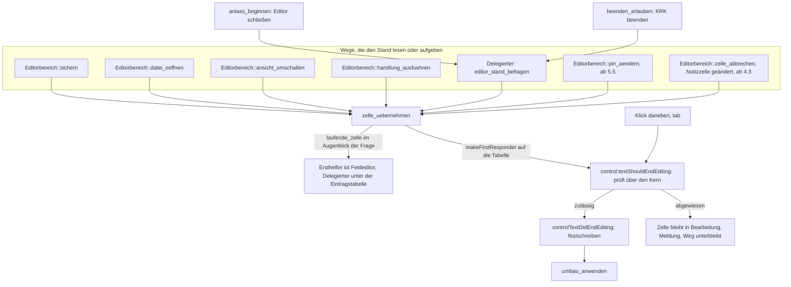
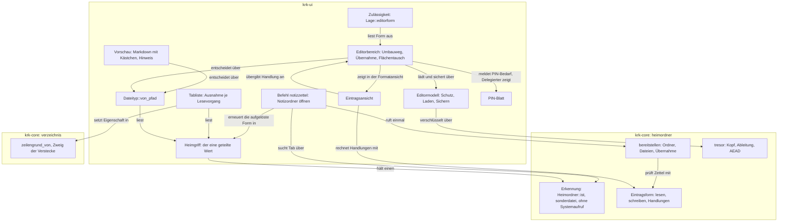
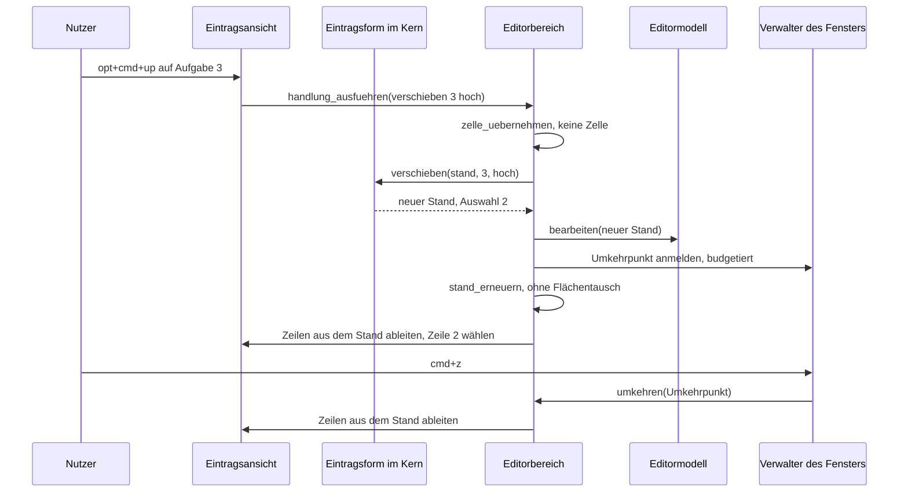
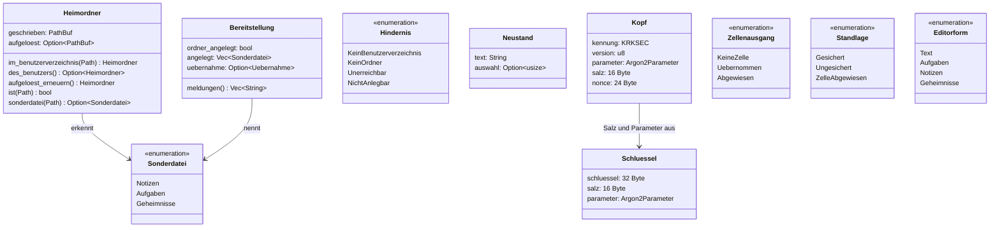

# Implementation Plan: F2 öffnet ~/krkhome mit Notizen, Aufgaben und Geheimnissen statt des Notizblatts

**Date:** 2026-09-26
**Status:** Draft
**Spec:** `260926-0007_*_spec-f2-oeffnet-krkhome-mit-notizen-aufgaben-geheimnissen.md` in seiner zweiten Überarbeitung, dazu die dreizehn beantworteten Datensätze unter `decisions/` dieses Arbeitspakets und die Zweitlesungen `260926-0017-zweitlesung-spec-f2-krkhome.md` (Spec) und `260926-0107-zweitlesung-plan-f2-krkhome.md` (Plan)
**Überarbeitet:** 260926-0115, gegen die Zweitlesung des Plans (alle sieben verlangten Änderungen, alle freiwilligen Punkte) und gegen die drei Antworten `260926-0050_*_zieht-jede-sicherung-…` (Möglichkeit 3), `260926-0050_*_wie-weit-reicht-der-inhaltsfilter-…` (Möglichkeit 1) und `260926-0112_*_was-tut-return-in-einer-notizzelle-…` (Möglichkeit 1, die sieben Tasten). Aus 22 Schritten sind 26 geworden.
**Decidability:** Die tragende Frage lautet „ist dieser Ordner `~/krkhome/`, und ist diese Datei eine der Eintragsdateien darin?“. **Sie ist aus den Eingaben des Mechanismus entscheidbar, weil der Mechanismus am gefragten Pfad nichts mehr abfragt:** `Heimordner` hält zwei Formen des Ordners, die geschriebene (`<benutzerverzeichnis>/krkhome`) und die aufgelöste, und vergleicht den gefragten Pfad als Text mit beiden. Die aufgelöste Form entsteht beim Bau über `read_link` am Verweis im Benutzerverzeichnis, ohne sein Ziel zu berühren, und bei jedem F2 über `canonicalize`, nachdem `bereitstellen` am Ziel ohnehin gearbeitet hat. Damit steht kein Dateisystemaufruf am Tab-Ordner auf dem Hauptfaden. **Nicht entscheidbar ist mit diesen Eingaben eine dritte Schreibweise desselben Ordners** (ein zweiter Verweis anderswo); ob das genügt, ist als Datensatz an den Nutzer gegangen (`260926-0115_*_erkennt-krk-den-heimordner-an-zwei-pfadformen-oder-an-jeder-schreibweise.md`), und die Gegenmöglichkeit dort ist Gerät und Inode aus dem Lesefaden. Die zweite Frage, „hat dieser F2 den Ordner angelegt?“, lässt sich aus einer vorherigen Existenzprüfung nicht beantworten, weil eine zweite Instanz dazwischen anlegen kann; der Plan nimmt deshalb die Antwort des einen Systemaufrufs, der anlegt: `mkdir(2)` gelingt genau einem Aufrufer, und die drei Dateien entstehen mit exklusivem Öffnen. Die dritte, „wird gerade eine Zelle bearbeitet?“, wird im Augenblick der Frage aus dem Ersthelfer gelesen und nie aus einem gemerkten Feld, weil AppKit `controlTextDidBeginEditing:` erst mit der ersten Textänderung schickt und ein gemerktes Feld zwischen Klick und erstem Buchstaben falsch antwortete. Die vierte, „PIN falsch oder Datei verändert?“, ist für ein AEAD-Verfahren nicht trennbar; der Spec legt sie zu einer Meldung zusammen, und der Plan unterscheidet allein den strukturellen Schaden am Kopf, der entscheidbar ist.

## Directive

Nach dieser Arbeit führt F2 in einen Dateilisten-Tab auf `~/krkhome/`, das Notizblatt der Runde 9 ist fort, und `notes.txt`, `tasks.txt` und `.secrets.txt` tragen Einträge in einer Markdown-nahen Textform, die die Vorschau gerendert zeigt und der Editor in seiner Formatansicht als Tabelle bearbeitet. Der Spec beschreibt das Verhalten vollständig; dieser Plan wiederholt es nicht, sondern sagt, wie es in fünf auslieferbaren Stufen gebaut wird.

## Current State

**Das Notizblatt ist über neun Stellen im Baum verteilt, und drei davon sind Fallen.** Befehl `Kommando::Notizzettel` mit Kennung `notizzettel` (`crates/krk-core/src/tasten/belegung.rs`), Ausführungszweig `notizzettel_zeigen` und sieben Hilfsfunktionen in `crates/krk-ui/src/appkit/anwendung.rs` (Abschnitt „Der Notizzettel“), das Blatt in `appkit/blaetter/zettel.rs`, das Modell in `zettelmodell.rs`, die Ablagevariante `Datei::Zettel(Zettel)` mit dem Typ `Zettel` in `crates/krk-core/src/ablage/pfade.rs`, die Wege `Zugang::text_laden` und `Zugang::text_sichern` in `ablage/mod.rs`, das Sitzungsfeld `Sitzung::zettel` und der Parameter `zettel` von `Fenstermodell::sitzung`. Die Fallen: das Prüfmodul `zettelproben` in `anwendung.rs` stellt die Helfer `diese_datei` und `rumpf` für sieben weitere Prüfmodule bereit; die Probe `die_abgeschalteten_stehen_an_der_gebauten_flaeche_auf_aus` in `appkit/editor.rs` baut die Zettelfläche mit; und `keine_prosastelle_der_ablage_nennt_eine_andere_zahl_von_ablagedateien` (`crates/krk-core/tests/baum.rs`) liest jedes Zahlwort vor „Ablagedateien“ in den Kommentaren unter `ablage/` gegen `Datei::ALLE.len()`. Prosa über den Notizzettel steht außerdem in `crates/krk-core/tests/text.rs` (Doc-Kommentar über `der_befund_deckt_alle_vier_ausgaenge_und_spult_zurueck`) und in `xtask/src/veroeffentlichung.rs` (Kommentar zur einen Aussage des Releasetextes).

**Der Editor hat schon den Weg, den jede Tabellenhandlung braucht.** Ein Umbau ändert den Stand im Modell, bildet einen `Umkehrpunkt` aus altem und neuem Stand, entscheidet über `verlauf_fuer_umbau` gegen das `STAPELBUDGET` und schreibt über `stand_erneuern` in die Fläche; die Rückgängig-Handlung geht in den Verwalter des Fensters, denselben, in dem die Textfläche ihr Tippen führt (`treffer_ersetzen` und `alle_treffer_ersetzen` in `crates/krk-ui/src/appkit/editor.rs`). Eine `NSTableView` als Ersthelfer findet über die Antwortkette denselben Fensterverwalter; die Zweitlesung hat das an `editor.rs` nachgelesen. Damit ist die erste Haltestelle des Spec („eigenes Modell mit eigenem Rückgängigstapel“) nicht erreicht.

**Die Frage „hält der Editor Ungesichertes?“ hat heute eine Stelle je Seite.** Im Editorbereich `Editorbereich::hat_ungesicherten_stand`, beim Anwendungsdelegierten `editor_haelt_ungesicherten_stand`, und diese hat genau zwei Rufer: `anlass_beginnen` (Schließen des Editors) und `beenden_erlauben` (`applicationShouldTerminate:`). Der Wechsel auf eine andere Datei prüft seine Vorbedingung im Modell und kommt als `Ladeausgang::Zurueckgehalten` herein. `Editormodell::sichern` schreibt `self.stand`. **Solange eine Zelle bearbeitet wird, steht der getippte Text allein im Feldeditor**, und keiner dieser Wege sähe ihn.

**Der Editor unterscheidet Dateien heute allein nach der Endung** (`Dateityp { Markdown, Sonstiges }`, `Dateityp::von_pfad` in `crates/krk-ui/src/editormodell.rs`, gerufen in `editormodell.rs`, `vorschaumodell.rs` und zweimal in `appkit/vorschau.rs`), und dieselbe Frage entscheidet in der Vorschau über Markdown, Text oder Metadaten (`hervorhebung::art` in `vorschaumodell::laden`). Die Vorschau rendert Markdown mit `Options::empty()` (`markdown::rendern`); `Event::TaskListMarker` steht im vollständigen `match` bereits als wörtlich geschriebenes Ereignis.

**Die Zulässigkeit kennt keine Datei und keine Ansicht.** `Lage` hat vier Felder (`blatt_steht`, `ersthelfer_gehoert_appkit`, `schluesselfenster_gehoert_krk`, `fokus`), und Editorbefehle sind allein über `Wirkungsbereich::Editor` an den Fokus gebunden (`crates/krk-ui/src/kommandos/zulaessigkeit.rs`). Ein Befehl ohne eigenen Zweig in `kommando_ausfuehren` endet bei `Fokus::Editor => false` im Auffangzweig und tut still nichts.

**Die Sichtbarkeit steht an einer Stelle, und der Inhaltsfilter hängt an ihr und nicht am Kennzeichen.** `zeilengrund_von` (`crates/krk-core/src/verzeichnis/modell.rs`) lässt einen Eintrag fallen, wenn er versteckt **und** ausgeblendet ist; wer diesen Zweig übersteht, bekommt bei gesetztem Filter und angekreuztem „Content“ einen Inhaltsauftrag. `Ordnermodell` kennt seinen Ordner nicht; Pfad und Modell treffen sich je Lesevorgang in `Tabliste::lesen_starten` (`crates/krk-ui/src/tabs.rs`), und **`lesen_starten` läuft auf dem Hauptfaden und stellt heute keinen einzigen Dateisystemaufruf**: es setzt Zustand und startet den Lesefaden.

**Erkennung über Verweise gibt es zweimal, beide privat:** `gleicher_ordner` in `krk-ui/src/auffrischung.rs` und in `krk-ui/src/kommandos/pfadeingabe.rs`, beide über `canonicalize` und beide aus einer Nutzerhandlung heraus, nicht je Lesevorgang. Das Benutzerverzeichnis fragt allein `ablage::pfade::benutzerverzeichnis`. Exklusives Anlegen (`create_new`) steht einmal im Baum, in `operation/anlegen.rs`. `text::datei::sicherungsform` ist öffentlich.

**Dieses Gerät ist das Referenzgerät** (`MacBookPro15,1`, nachgesehen mit `sysctl hw.model` am 260926-0050; `260802-1036_*_leistungszusagen-navigator.md`). Die Messung der Parameter für Argon2id kann ein Agent hier fahren; sie braucht KRK nicht im Vordergrund.

## Approach

**Ein Kernmodul trägt jede Regel, die an `~/krkhome` hängt, und die Oberfläche fragt es.** Neu ist `crates/krk-core/src/heimordner/` mit vier Teilen: die Erkennung (`mod.rs`), die Eintragsform (`eintraege.rs`), das Anlegen samt Übernahme der alten Zettel (`bereitstellen.rs`) und in Stufe 5 das Verschlüsseln (`tresor.rs`). Alles darin ist ohne Fenster prüfbar, und `krk-ui` hat kein Bibliotheksziel; deshalb liegt es im Kern. Die Erkennung ist die eine Stelle, die C2 verlangt: `Heimordner::ist` und `Heimordner::sonderdatei` vergleichen den gefragten Pfad als Text mit der geschriebenen und der aufgelösten Form, und F2, die Vorschau, der Editor und die Ausnahme „steht immer“ fragen nur sie. **Sie stellen keinen Systemaufruf**, und eine Quelltextprobe hält das. Neu aufgelöst wird allein bei F2, und der Anwendungsdelegierte reicht den erneuerten Wert über einen geteilten Griff an Dateilisten, Vorschau und Editor weiter.

**Eine Eintragsdatei ist ein Dateityp und keine zweite Endungsregel.** `Dateityp` bekommt den Wert `Eintraege(Sonderdatei)`, und `Dateityp::von_pfad` fragt die Erkennung, bevor es auf die Endung schaut. Damit entscheidet die vorhandene eine Stelle (`hervorhebung::art`) weiter über die Darstellung, und jeder vollständige `match` über `Dateityp` hält den Bau an, bis er die neuen Dateien eingeordnet hat. Die Vorschau rendert sie als Markdown mit Aufgabenkästchen, der Editor zeigt sie in der Formatansicht als Tabelle, und `.secrets.txt` bekommt in beiden einen eigenen Zweig, der vor jedem Lesen greift.

**Die Tabelle ist eine Sicht auf den Stand des Editors.** Sie hält keine Einträge, sondern leitet ihre Zeilen nach jeder Änderung des Standes aus ihm ab. Jede Handlung ruft eine reine Funktion aus `heimordner::eintraege`, die aus dem alten Stand den neuen berechnet, und reicht ihn an einen neuen Umbauweg `Editorbereich::umbau_anwenden`, der genau die Schritte von `treffer_ersetzen` geht. Sichern, Abweichungsmarke, Rückfrage und Rückgängig bleiben dieselben, und es entsteht kein zweiter Stapel. Die Formatansicht aller anderen Dateien bleibt unberührt: der Tausch zwischen Textfläche und Tabelle geschieht allein für `Dateityp::Eintraege`, **nur wenn sich Ansicht oder Dateityp wirklich ändern**, nie aus `stand_erneuern` heraus, und der Ersthelfer geht auf die neue Fläche über, bevor die alte ausgeblendet wird.

**Eine laufende Zellenbearbeitung wird an einer Stelle übernommen, und jeder Weg, der den Stand liest oder aufgibt, ruft sie zuerst.** Das ist `Editorbereich::zelle_uebernehmen`. Sie fragt im Augenblick des Rufs, ob eine Zelle bearbeitet wird, und beendet die Bearbeitung dann über AppKits eigenen Weg (`makeFirstResponder:` auf die Tabelle), so dass `control:textShouldEndEditing:` die Handlung prüft und `controlTextDidEndEditing:` sie als Umbau festschreibt. Ein Klick daneben und `tab` gehen durch dieselben zwei Delegiertenmethoden. Wird die Übernahme abgewiesen (eine `## `-Zeile im Notiztext, ein Umbruch im Aufgabentext), bleibt die Zelle in Bearbeitung, und der Weg, der gerufen hat, unterbleibt mit einer Meldung. Die Rufer sind Sichern, der Dateiwechsel, der Ansichtswechsel, jede Tabellenhandlung und die eine Frage des Delegierten nach dem ungesicherten Stand, die das Schließen samt Rückfrage und das Beenden stellen; in Stufe 5 kommt der PIN-Wechsel dazu. Eine Quelltextprobe hält diese Rufer.

Der Graph hat einen Eingang in die Übernahme für KRKs eigene Wege (`zelle_uebernehmen`) und einen für AppKits (Klick, `tab`), und beide enden in denselben zwei Delegiertenmethoden. Einen zweiten Ort, an dem Zellentext zu Stand wird, gibt es nicht.

**Welche Tasten beim Tippen in einer Zelle wem gehören, folgt aus den Wirkungsbereichen und braucht eine einzige neue Regel.** Buchstaben, `delete`, die Pfeile, `return`, `tab` und `space` erreichen den Feldeditor, weil ihre Befehle an Bereichen hängen, die im Editor nicht wirken. KRKs Befehle aus `Ueberall` und `Editor` wirken, also auch F2 und `cmd+s`. **Die eine Kollision ist `esc`:** `Kommando::Abbrechen` leert als dritten Rang den Filtertext des aktiven Dateifensters und schluckte die Taste dann. `abbrechen` bekommt deshalb einen Rang nach dem Blatt: steht eine Zellenbearbeitung, geht `esc` an `Editorbereich::zelle_abbrechen`. Was sie tut, entscheidet der Nutzer (`260926-0115_*_was-tut-esc-in-einer-geaenderten-zelle-der-eintragstabellen.md`); gebaut wird auf die Empfehlung: in der Aufgabenzelle verwerfen, in einer geänderten Notizzelle übernehmen. Die sieben Kombinationen sind vom Nutzer bestätigt (`260926-0112_*_was-tut-return-in-einer-notizzelle-und-welche-tasten-tragen-die-editoren.md`), und in einer Notizzelle schreibt `return` einen Zeilenumbruch.

**Die Zulässigkeit bekommt die Form des Editors als fünftes Lagefeld.** `Lage::editorform` sagt, was der Editor gerade zeigt (`Editorform::Text`, `Aufgaben`, `Notizen`, `Geheimnisse`), und drei neue Wirkungsbereiche binden die neuen Befehle daran: `Eintraege` (jede Tabellenform), `Aufgaben` (nur die Aufgabenliste) und in Stufe 5 `Geheimnisse` (mit einem sechsten Feld `pin_aenderbar`). Die Frage steht in `zulaessigkeit::gestattet`, und damit gilt sie für den Ereignisabgriff und für das Ausgrauen im Hauptmenü zugleich.

Der Graph ist geschichtet: jede Kante führt von der Oberfläche in den Kern oder innerhalb der Oberfläche vom Aufrufer zum Gerufenen. Die Kante zwischen Tabelle und Editorbereich läuft in beide Richtungen und ist gewollt: der Editorbereich zeigt die Tabelle, und die Tabelle übergibt ihre Handlung an ihn, weil nur er Stand, Stapel und Fläche zusammen hält. Einen Kreis im Kern gibt es nicht. Neu gegenüber der ersten Fassung sind der `Heimgriff`, über den genau ein Wert der Erkennung im Umlauf ist, und die Kante vom Editorbereich zum PIN-Blatt, die vorher vom Delegierten ausging: die Sperre sitzt am Editorbereich und im Modell (5.4a, 5.4b).

## Implementation Steps

Jeder Schritt nennt genau einen Executor aus der aktiven Menge (`code-implementer`, `data-implementer`). **`Cn.k` zählt die Kriterien der Liste „am Baum nachweisbar“ der Fähigkeit Cn im Spec in ihrer Reihenfolge**; der Spec nummeriert sie selbst nicht. **Jede Stufe endet mit `make check` grün**, allen fünf Kommandos, und nicht jeder Schritt; der Grund ist `260820-0602_*_make-check-prueft-den-ganzen-arbeitsbereich-und-bricht-bei-parallelen-agenten-an-fremden-dateien-ab.md`. Wo ein Schritt eine Probe rot hinterlässt, die ein späterer grün macht, nennt er genau diese Probe; jedes andere Rot ist ein Halt.

**Für jeden Schritt gilt ohne Wiederholung:** jeder neue Rückgabewert, dessen stilles Fallenlassen unbemerkt bliebe, trägt `#[must_use]` (mit Begründung an Typen und Griffen); jede nutzersichtbare Zeichenkette trägt Umlaute, Kommentare und Bezeichner die Umschrift; jede neue Datei unter `crates/krk-ui/src/appkit/` mit einem Namen aus einer `objc2_`-Kiste trägt im Modulkopf den Abschnitt `# Ab welchem macOS die angesprochenen Klassen stehen` und nennt darin jeden hereingeholten Namen; im Kern entsteht kein `unsafe`; jede neue Liste `ALLE` führt genau die Varianten ihrer Aufzählung in deren Reihenfolge.

```mermaid
flowchart LR
    subgraph ST1["Stufe 1"]
        S11["1.1 Erkennung und Form"] --> S12["1.2 bereitstellen"]
        S12 --> S13a["1.3a Oberfläche: Blatt fällt, F2 führt hin"]
        S13a --> S13b["1.3b Kern: Ablage ohne Zettel"]
        S13b --> S14["1.4 Belegung: Name"]
        S14 --> S15["1.5 Anleitung"]
    end
    subgraph ST2["Stufe 2"]
        S21["2.1 Dateityp und Vorschau"] --> S22["2.2 Anleitung"]
    end
    subgraph ST3["Stufe 3"]
        S31["3.1 Aufgaben-Handlungen"] --> S32a["3.2a Umbauweg, Flächentausch, anzeigende Tabelle"]
        S32a --> S32b["3.2b Zellen, Anmeldung, Übernahme"]
        S32b --> S33["3.3 Befehle"]
        S33 --> S34["3.4 Belegung: sechs Befehle"]
        S34 --> S35["3.5 Anleitung"]
    end
    subgraph ST4["Stufe 4"]
        S41["4.1 Notiz-Handlungen"] --> S43["4.3 Notiztabelle"]
        S42["4.2 Messung: mehrzeilige Zelle"] --> S43
        S43 --> S44["4.4 Anleitung"]
    end
    subgraph ST5["Stufe 5"]
        S51["5.1 tresor und Kisten"] --> S54a["5.4a Modell: Schutz, Laden, Sichern"]
        S52["5.2 Datei, Liste, Filter"] --> S53["5.3 Vorschau, Sitzung"]
        S52 --> S54a
        S54a --> S54b["5.4b PIN-Blatt und Weg"]
        S53 --> S54b
        S54b --> S55["5.5 PIN ändern"]
        S55 --> S56["5.6 Belegung: PIN ändern"]
        S56 --> S57["5.7 Anleitung, README"]
    end
    S11 --> S21
    S15 --> S21
    S11 --> S31
    S22 --> S31
    S21 --> S32a
    S35 --> S41
    S35 --> S42
    S33 --> S43
    S44 --> S51
    S44 --> S52
    S43 --> S54b
```

Die Kanten zwischen den Stufen sind zweierlei, und beide stehen in den Schritten: technische Voraussetzungen (2.1 braucht die Erkennung aus 1.1; 3.2a braucht `Dateityp::Eintraege` aus 2.1; 4.3 und 5.4b bauen auf der Eintragsansicht) und die Auslieferungsreihenfolge des Spec (jede Stufe beginnt, wenn die vorige samt Anleitung steht). **Eine Abweichung vom Spec gehört hierher:** der Spec lässt Stufe 3 allein an Stufe 1 hängen. Am Baum hängt sie auch an 2.1, weil die Formatansicht dieselbe Erkennung als Dateityp braucht wie die Vorschau; eine eigene Erkennung für den Editor wäre die zweite Stelle, die C2 ausschließt. Die Zweitlesung hält die Abweichung für richtig benannt.

### Stufe 1: der Ort (C1, C2, C3)

1. [DONE] **1.1 Erkennung von ~/krkhome und die Eintragsform im Kern**
   - Executor: `code-implementer`
   - Files: `crates/krk-core/src/heimordner/mod.rs` (neu), `crates/krk-core/src/heimordner/eintraege.rs` (neu), `crates/krk-core/src/lib.rs`, `crates/krk-core/tests/heimordner.rs` (neu)
   - Changes:
     - `pub const ORDNERNAME: &str = "krkhome"`, und das ist die einzige Stelle im Code, die den Namen schreibt.
     - `pub enum Sonderdatei { Notizen, Aufgaben }` mit `ALLE` und `const fn dateiname` (`notes.txt`, `tasks.txt`). Stufe 5 fügt `Geheimnisse` hinzu.
     - `#[derive(Clone)] pub struct Heimordner { geschrieben: PathBuf, aufgeloest: Option<PathBuf> }`. `im_benutzerverzeichnis(&Path)` baut die geschriebene Form und liest die aufgelöste **leicht**: ist `<benutzerverzeichnis>/krkhome` laut `symlink_metadata` ein Verweis, nimmt es sein Ziel über `read_link` (ein relatives Ziel gegen das Benutzerverzeichnis gesetzt und lexikalisch bereinigt), sonst `None`. Beide Aufrufe treffen allein das Benutzerverzeichnis und nie das Ziel. `des_benutzers() -> Option<Self>` über `ablage::pfade::benutzerverzeichnis`. `aufgeloest_erneuern(&self) -> Self` löst die geschriebene Form über `std::fs::canonicalize` auf und ist **allein für F2 gedacht** (1.3a); scheitert es, bleibt die leichte Form stehen.
     - `ist(&Path) -> bool` vergleicht den gefragten Pfad nach dem Entfernen eines Schlussstrichs mit beiden Formen über `Path`-Gleichheit. `sonderdatei(&Path) -> Option<Sonderdatei>` fragt erst den Dateinamen und nur bei einem der Namen den Elternpfad über `ist`. **Keine der beiden stellt einen Systemaufruf.** Der Modulkopf nennt die Grenze: eine dritte Schreibweise des Ordners wird nicht erkannt; die Gegenmöglichkeit mit Gerät und Inode aus dem Lesefaden steht im Datensatz `260926-0115_*_erkennt-krk-den-heimordner-an-zwei-pfadformen-oder-an-jeder-schreibweise.md`.
     - `eintraege.rs` beschreibt die Form an einer Stelle: `ist_themenzeile` (Zeile beginnt mit `## `), die großzügig gelesene Aufgabenzeile (`-` oder `*`, Einrückung erlaubt, `[ ]`, `[x]`, `[X]`) und ihre Grundform beim Schreiben (`- [ ] `, `- [x] `). `Notizen::lesen` und `Aufgaben::lesen` zerlegen einen Stand in Vorspann und Blöcke, wobei jeder Block seine Zeilen **roh** hält; `schreiben` setzt sie unverändert zusammen. In `tasks.txt` hängt eine fremde Zeile an der Aufgabe über ihr, in `notes.txt` ist alles nach einer Themenzeile Notiztext.
     - Die erste Handlung entsteht hier, weil C2 sie für seine Probe braucht: `aufgaben::verschieben(stand, index, Richtung) -> Option<Neustand>`, wobei `Neustand { text, auswahl }` den neuen Text und die Stelle der bewegten Aufgabe trägt. Ein bewegter Block behält seine Bytes; nur die Reihenfolge ändert sich.
   - Probes (`tests/heimordner.rs`): Lesen und Schreiben ergeben dieselben Bytes für eine Sammlung von Ständen, die jede großzügige Schreibweise, Vorspann, fremde Zeilen, eine fehlende Schlusszeile und leere Dateien enthält; eine Aufgabe, über eine fremde Zeile hinweg verschoben, nimmt ihre fremde Zeile mit und lässt den Vorspann oben; mit `krkhome` als Verweis auf einen Prüfordner gibt `sonderdatei` für `notes.txt` über den Verweis und über sein Ziel dieselbe Antwort, schon nach `im_benutzerverzeichnis` und ebenso nach `aufgeloest_erneuern`, und für eine gleichnamige Datei in einem anderen Ordner `None`; ein Schlussstrich ändert die Antwort nicht; **eine Quelltextprobe liest die Rümpfe von `ist` und `sonderdatei` und findet darin weder `std::fs` noch `canonicalize`, `metadata` oder `read_link`**.
   - Acceptance: `cargo test -p krk-core` grün; kein anderer Teil des Baums berührt.
   - Closes (am Baum): C2.4, C2.5, C2.6 in seinem Kernteil (die Probe zur einen Stelle folgt in 1.3a), in der Reichweite des Datensatzes zu den zwei Pfadformen.
   - Dependencies: none; der Datensatz `260926-0115_*_erkennt-krk-den-heimordner-…` trägt eine Antwort, bevor der Schritt beginnt.

2. [DONE] **1.2 Ordner und Dateien anlegen, alte Zettel übernehmen**
   - Executor: `code-implementer`
   - Files: `crates/krk-core/src/heimordner/bereitstellen.rs` (neu), `crates/krk-core/src/heimordner/mod.rs`, `crates/krk-core/tests/heimordner.rs`
   - Changes:
     - `pub fn bereitstellen(heim: &Heimordner, ablageordner: &Path) -> Result<Bereitstellung, Hindernis>`, `#[must_use]`.
     - Der Ordner entsteht mit `std::fs::create_dir` an der geschriebenen Form. **Gelingt der Aufruf, hat dieser F2 den Ordner angelegt**, und das ist der einzige Auslöser der Übernahme. `AlreadyExists` heißt: es steht etwas da; `std::fs::metadata` (folgt einem Verweis) entscheidet dann zwischen Ordner (weiter), keinem Ordner (`Hindernis::KeinOrdner`) und einem Verweis ins Leere (`Hindernis::Unerreichbar`). Jeder andere Fehler ist `Hindernis::NichtAnlegbar` mit dem Grund des Systems.
     - Jede Datei aus `Sonderdatei::ALLE` entsteht mit `OpenOptions::new().write(true).create_new(true)`. `AlreadyExists` ist kein Fehler, sondern „steht schon da“, und die Datei wird nicht angefasst. Eine Probe braucht einen Einhängepunkt unmittelbar vor dem exklusiven Öffnen; er steht als private Funktion mit einem Vorlauf-Parameter, und die Rennprobe liegt im Prüfmodul dieser Datei.
     - Die Übernahme liest `note-1.txt` und `note-2.txt` über `text::datei::lesen` aus dem Ablageordner, unter zwei Namen, die hier als Konstanten stehen und nicht mehr in `Datei::ALLE`. Sie legt nichts beiseite und schreibt nichts in den Ablageordner. Ein Zettel ohne Zeichen außer Leerraum oder ein fehlender ergibt keine Notiz; ein lesbarer ergibt `## Zettel 1` beziehungsweise `## Zettel 2` mit seinem Text darunter, und ein fehlender Schlussumbruch wird ergänzt. Ein Zettel mit einer Zeile, für die `ist_themenzeile` gilt, oder ein unlesbarer Zettel wird nicht übernommen und bekommt eine Meldung. `notes.txt` entsteht dann mit diesem Inhalt über dasselbe exklusive Öffnen; scheitert das Schreiben mittendrin, entfernt der Schritt die eben selbst angelegte Datei wieder.
     - **Der eine Wettlauf, der bleibt:** legt eine zweite Instanz zwischen `create_dir` und dem Anlegen von `notes.txt` eine leere `notes.txt` an, scheitert die Übernahme an `AlreadyExists`. Die Meldung sagt dann, dass die Zettel nicht übernommen wurden und unverändert im Ablageordner liegen. Nichts geht still verloren.
     - `Bereitstellung` trägt `ordner_angelegt`, die angelegten Dateien und die Übernahme; `Bereitstellung::meldungen()` und `Hindernis::meldung()` liefern die Sätze der Statuszeile mit Umlauten.
   - Probes: vorhandene Datei gleichen Namens bleibt Byte für Byte; die Rennprobe legt die Datei im Vorlauf an und findet sie danach unverändert; fehlende Datei entsteht leer neu; Ordner angelegt, beide Zettel mit Text, beide Notizen stehen darin; ein Zettel mit `## `-Zeile wird nicht übernommen, der andere schon, die Meldung nennt den abgewiesenen; bestehender Ordner ohne `notes.txt`: `notes.txt` entsteht leer, keine Übernahme; zweiter Aufruf nach gelöschter `notes.txt`: leer, keine zweite Übernahme; `note-1.txt` und `note-2.txt` sind nach jeder Probe Byte für Byte unverändert; eine gewöhnliche Datei an der Stelle von `krkhome` gibt `KeinOrdner` und bleibt unverändert; ein Verweis auf einen Ordner lässt die Dateien im Ziel entstehen; ein Verweis ins Leere gibt `Unerreichbar`.
   - Acceptance: `cargo test -p krk-core` grün.
   - Closes (am Baum): C2.1, C2.2, C3.2, C3.3, C3.4, C3.5.
   - Dependencies: 1.1

3. [DONE] **1.3a Oberfläche: das Notizblatt fällt, und F2 führt nach ~/krkhome**
   - Executor: `code-implementer`
   - Files: `crates/krk-core/src/tasten/belegung.rs`, `crates/krk-core/tests/{baum.rs,belegung.rs}`, `crates/krk-ui/src/main.rs`, `crates/krk-ui/src/heimgriff.rs` (neu), `crates/krk-ui/src/zettelmodell.rs` (entfällt), `crates/krk-ui/src/appkit/blaetter/zettel.rs` (entfällt), `crates/krk-ui/src/appkit/blaetter/mod.rs`, `crates/krk-ui/src/appkit/anwendung.rs`, `crates/krk-ui/src/appkit/tabelle.rs`, `crates/krk-ui/src/tabs.rs`, `crates/krk-ui/src/fenstermodell.rs`, `crates/krk-ui/src/belegungsmodell.rs`, `crates/krk-ui/src/kommandos/{zulaessigkeit.rs,operationen.rs}`, `crates/krk-ui/src/appkit/{editor.rs,textautomatik.rs,ereignisse.rs,mod.rs}` (Prosa und die eine Probe)
   - Changes:
     - **Der Befehl.** `Kommando::Notizzettel` heißt `Kommando::Notizordner`; die Zeile in `KENNUNGEN` bleibt `"notizzettel"`, und ihr Kommentar sagt, warum die Kennung älter ist als der Befehl. Wirkungsbereich (`Ueberall`) und Funktionsbereich (`Anwendung`) bleiben.
     - **Der geteilte Wert.** `heimgriff.rs` (ohne AppKit) definiert `pub type Heimgriff = Rc<RefCell<Option<Heimordner>>>` mit zwei Helfern, `lesen(&Heimgriff) -> Option<Heimordner>` (eine Abschrift) und `ersetzen`. Der Anwendungsdelegierte baut ihn einmal aus `Heimordner::des_benutzers()` und reicht Abschriften des `Rc` an jeden, der die Erkennung fragt (ab 2.1 Vorschau und Editor, ab 5.2 die Dateilisten). Wer auf einem Arbeitsfaden fragt, bekommt beim Auftrag eine Abschrift des Wertes und nicht den Griff.
     - **Der Zweig.** `Kommando::Notizordner => self.notizordner_oeffnen()` in `kommando_ausfuehren`. `notizordner_oeffnen` liest den Griff (ohne Benutzerverzeichnis meldet es `Hindernis::KeinBenutzerverzeichnis` und öffnet keinen Tab), ruft `bereitstellen` mit dem Ablageordner, zeigt jede Meldung als Befehlsantwort im aktiven Dateifenster und bricht bei einem `Hindernis` ohne Tab ab. Sonst ersetzt es den Wert im Griff durch `aufgeloest_erneuern()`, sucht in `tabordner()` des aktiven Dateifensters den ersten Tab, für den `Heimordner::ist` gilt, und macht ihn über `tab_waehlen` sichtbar; findet es keinen, öffnet es einen neuen Tab auf der geschriebenen Form über eine neue Methode `Dateitabelle::tab_oeffnen(ordner)`, die `Tabliste::oeffnen` und `tab_gewechselt` ruft. Zuletzt `fokus_holen(Fokus::Dateifenster)`.
     - **Was in der Oberfläche fällt.** `zettelmodell.rs`, `blaetter/zettel.rs`, der Abschnitt „Der Notizzettel“ in `anwendung.rs` samt den Ivars `zettel` und `zettelflaeche`, die Zettelaufrufe in `wird_beendet`, `fenster_schliessen` und `oberflaeche_aufbauen`. `Fenstermodell::sitzung` verliert den Parameter `zettel` und schreibt in `Sitzung::zettel` den leeren Wert, den das Feld heute ohne Zettel trägt; das Feld selbst fällt erst in 1.3b. Die Kernschnittstellen `Datei::Zettel`, `Zettel`, `Zugang::text_laden` und `Zugang::text_sichern` bleiben in diesem Schritt stehen; sie sind öffentlich, also meldet der Übersetzer sie nicht als unbenutzt.
     - **Die Fallen aus „Current State“.** Die Helfer `diese_datei` und `rumpf` ziehen aus `zettelproben` in ein neues Prüfmodul `quelltextproben` derselben Datei, und die sieben Prüfmodule importieren von dort. Die Editorprobe `die_abgeschalteten_stehen_an_der_gebauten_flaeche_auf_aus` prüft allein die Editorfläche.
     - **Neue Proben.** In `tests/belegung.rs`: eine vollständige Nutzerbelegung mit `id = "notizzettel"` lädt ohne Ersetzung. In `anwendung.rs`: eine Probe über die Ausführungszweige, die statt des einen Befehls `NeuerungenZeigen` eine Liste von Befehlen prüft und `Notizordner` aufnimmt (spätere Stufen erweitern die Liste); eine Probe, dass `bereitstellen` im Quellbaum genau einen Rufer hat, `notizordner_oeffnen`, und dieses genau einen, den Zweig in `kommando_ausfuehren`; ebenso, dass `aufgeloest_erneuern` allein in `notizordner_oeffnen` gerufen wird. Damit erreicht der Start weder das Anlegen noch das Auflösen am Ziel. In `baum.rs`: der Name `krkhome` steht in Codezeilen allein in `krk-core/src/heimordner/mod.rs`. Die Proben zum Blatt und zu den anwendungsweiten Befehlen (`der_notizzettel_kommt_bei_stehendem_blatt_nicht_durch`, `die_anwendungsweiten_befehle_wirken_aus_jedem_bereich_heraus`, `in_der_blattsperre_bleibt_es_bei_dem_einen_abbruch`) ziehen auf den neuen Variantennamen um.
   - Acceptance: `make check` grün. `resources/default-keymap.toml` bleibt unverändert; die Kennung stimmt ja weiter.
   - Closes (am Baum): C1.2, C1.3, C1.4, C2.3, C2.6 (die eine Stelle), C3.1.
   - Dependencies: 1.2

4. [DONE] **1.3b Kern: die Ablage verliert die Zettel**
   - Executor: `code-implementer`
   - Files: `crates/krk-core/src/ablage/{pfade.rs,mod.rs,sitzung.rs,neuerungen.rs,atomar.rs}`, `crates/krk-core/src/text/datei.rs` (Prosa), `crates/krk-core/tests/{ablage.rs,baum.rs,text.rs}`, `crates/krk-core/tests/gemeinsam/mod.rs`, `crates/krk-ui/src/fenstermodell.rs` (die eine Zeile, die das Feld füllt), `xtask/src/veroeffentlichung.rs` (Prosa)
   - Changes:
     - `Datei::Zettel`, der Typ `Zettel`, `Zugang::text_laden`, `Zugang::text_sichern` und `Sitzung::zettel` fallen; `Fenstermodell::sitzung` füllt das Feld nicht mehr. Die vollständigen Fallunterscheidungen in `ablage/neuerungen.rs` ziehen nach, wie der Übersetzer sie nennt.
     - **Freiwillig und ausdrücklich abtrennbar:** `Format` fällt ganz, samt `Datei::format` und den zwei `debug_assert`, weil die Aufzählung ohne Zetteldateien einen Wert hat und nichts mehr entscheidet; ebenso `Grund::ZuGross`, wenn `grep -rn 'Grund::ZuGross' crates/` nach dem Wegfall von `text_laden` keinen Erzeuger mehr findet. Wird der Schritt damit größer als ein überschaubarer Übersetzerlauf, bleiben beide stehen, und kein Kriterium fällt.
     - **`baum.rs`.** Der Eintrag für `Datei` in `UNLESBARE_ALLE_LISTEN` fällt, weil `Datei` danach allein Einheitsvarianten trägt und der allgemeine Durchlauf die Liste lesen kann; `die_ablageliste_fuehrt_jede_datei_und_je_einen_zettel` fällt aus demselben Grund, und mit ihr `varianten_mit_nutzlast_der_aufzaehlung` in `gemeinsam`, falls sie keinen Rufer mehr hat. Fällt `Format`, zählt der Filter `format() == Format::Toml` in `keine_prosastelle…` und in `tests/ablage.rs` alle Dateien. Jedes Zahlwort vor „Ablagedateien“ in `ablage/` folgt `Datei::ALLE.len()`, also sechs.
     - **Proben in `tests/ablage.rs`:** eine `session.toml` mit `zettel = "erster"` lädt und behält jede andere Angabe; die bestehende Probe zur späteren Fassung behält ihr Literal und verliert allein die Zusicherung auf das Feld; die Probe zu den obersten Schlüsseln zählt fünf statt sechs.
     - **Prosa.** Der Doc-Kommentar über `der_befund_deckt_alle_vier_ausgaenge_und_spult_zurueck` in `tests/text.rs` nennt den Editor als den Aufrufer, der den Befund übersetzt, und nicht mehr den Notizzettel; der Satz über den fehlenden Zettel, der keine Meldung nach sich zieht, bekommt seinen heutigen Grund oder fällt. Der Kommentar in `xtask/src/veroeffentlichung.rs`, der von Nutzern spricht, die „weder Lesezeichen noch Zettel pflegen“, nennt statt der Zettel eine Ablagedatei, die es noch gibt. Die Prosa in `text/datei.rs` zieht ebenso nach.
   - Acceptance: `make check` grün.
   - Closes (am Baum): C3.6.
   - Dependencies: 1.3a

5. [DONE] **1.4 Die Belegung nennt den neuen Befehl**
   - Executor: `data-implementer`
   - Files: `resources/default-keymap.toml`
   - Changes: der Eintrag `id = "notizzettel"` bekommt `name = "Notizordner öffnen"`; `tasten = ["f2", "cmd+k"]` bleibt. Der Kommentar über dem Block sagt, dass die Kennung aus der Runde 9 stammt und aus einem Grund bleibt, nämlich damit eine vollständige eigene Belegung weiter lädt (`Belegung::bauen` weist eine unbekannte Kennung ab und setzt die ganze Auslieferungsbelegung ein). Der Kommentar des folgenden Blocks, der „zwischen dem Notizzettel und der weiteren Instanz“ steht, zieht nach. Kopfzahlen bleiben.
   - Acceptance: `make check` grün.
   - Closes (am Baum): C1.1.
   - Dependencies: 1.3b

6. [DONE] **1.5 Anleitung, README und CLAUDE.md für Stufe 1**
   - Executor: `code-implementer`
   - Files: `HowTo.md`, `README.md`, `CLAUDE.md`
   - Changes: `HowTo.md` ersetzt `## Der Notizzettel` durch einen Abschnitt über F2, `cmd+k`, `~/krkhome/`, die zwei Dateien, ihre Textform mit einem Beispiel je Datei, die einmalige Übernahme der alten Zettel und den Verweis als Weg zur Synchronisierung. Die Aufstellung der Ablagedateien nennt `note-1.txt` und `note-2.txt` nicht mehr als etwas, das KRK pflegt, und sagt, dass sie nach der Übernahme ohne Leser liegen. `README.md` streicht die zwei Notizzettel unter dem, was ein Löschwerkzeug mitnimmt, und nennt dort `~/krkhome/` nicht, weil der Ordner nicht im Ablageordner liegt. `CLAUDE.md` zieht die Aussagen nach, die Stufe 1 falsch gemacht hat: das Beispiel „`Esc` schließt den Notizzettel“ im Absatz zum Ereignisabgriff bekommt ein anderes Blatt mit Textfeld als Beispiel, und `textautomatik` gilt nur noch dem Editor. Die Zeile 9 der Rundentabelle bleibt als Aufzeichnung.
   - Acceptance: `make check` grün; `grep -rn 'Notizzettel\|note-1' HowTo.md README.md` nennt nur noch die Stellen, die von der Übernahme erzählen.
   - Closes (Nutzerarbeit, am Text lesbar): C3, Kriterium zu `HowTo.md` und `README.md`.
   - Dependencies: 1.4

**Stufe 1 schließt am Baum:** C1.1 bis C1.4, C2.1 bis C2.6, C3.1 bis C3.6. **Am laufenden Bündel, Nutzerarbeit:** jedes Nutzerkriterium von C1, C2 und C3 aus dem Spec, dazu der Blick auf `HowTo.md`. **Riskantester Schritt:** 1.3a, weil er über fünfzehn Dateien der Oberfläche ändert und drei Proben verschiebt, die andere Module mittragen; die Teilung an der Kistengrenze gibt ihm einen Übersetzerlauf, dessen Fehlerliste zu überblicken ist.

### Stufe 2: lesen (C4)

7. [DONE] **2.1 Eintragsdateien sind ein Dateityp, und die Vorschau zeigt Kästchen**
   - Executor: `code-implementer`
   - Files: `crates/krk-ui/src/editormodell.rs`, `crates/krk-ui/src/hervorhebung.rs`, `crates/krk-ui/src/markdown.rs`, `crates/krk-ui/src/vorschaumodell.rs`, `crates/krk-ui/src/appkit/vorschau.rs`, `crates/krk-ui/src/appkit/editor.rs`, `crates/krk-ui/src/appkit/anwendung.rs` (Weitergabe des Griffs), `crates/krk-ui/src/appkit/textmerkmale.rs` (je nach Rufern von `Dateityp::von_pfad`)
   - Changes:
     - `Dateityp` bekommt `Eintraege(Sonderdatei)`; `Dateityp::von_pfad(pfad, heim: Option<&Heimordner>)` fragt zuerst `heim.sonderdatei(pfad)` und fällt sonst auf die Endung. Editor und Vorschau halten den `Heimgriff` aus 1.3a; der Ladeauftrag der Vorschau bekommt eine Abschrift des Wertes mit. Proben reichen einen `Heimordner` aus einem Prüfordner herein.
     - `hervorhebung::art` ordnet `Eintraege(_)` als `Darstellungsart::Markdown` ein. **Das ist eine Verhaltensänderung, die der Spec für Stufe 2 nicht nennt:** auch die Formatansicht des Editors zeigt `notes.txt` und `tasks.txt` damit bis zum Ende von Stufe 3 als Markdown. Sie ist harmlos und wird in 2.2 beschrieben.
     - `markdown::rendern(quelle, tafel, lesart)` mit `enum Lesart { Markdown, Eintragsdatei }`. Nur `Eintragsdatei` schaltet `Options::ENABLE_TASKLISTS` ein; `Event::TaskListMarker(erledigt)` wird dann zu `☐ ` oder `☑ `, und das Aufzählungszeichen `• ` fällt bei einem Punkt, der mit einem Kästchen beginnt. Der Quellbezug der Runde 14 deckt das Kästchen mit dem Quellbereich `[ ]` beziehungsweise `[x]`. Für `Lesart::Markdown` bleibt der Zweig, wie er ist, und die Kiste erzeugt das Ereignis dort gar nicht.
     - `vorschaumodell::laden` reicht die Lesart aus dem Dateityp an `rendern`; `notes.txt` und `tasks.txt` im erkannten Ordner kommen damit als `Inhalt::Markdown` statt `Inhalt::Text`.
   - Probes: `rendern` mit `Eintragsdatei` zeigt `☐ a` und `☑ b` für `- [ ] a` und `- [x] b` in der Reihenfolge der Quelle; mit `Markdown` bleibt die Ausgabe derselben Quelle byte-gleich mit der vor diesem Schritt (eine Referenzausgabe, vor der Änderung aufgenommen); `laden` gibt für `notes.txt` im Prüf-krkhome, über die geschriebene und über die aufgelöste Form, `Inhalt::Markdown` und für eine gleichnamige Datei daneben `Inhalt::Text`; eine `.md` mit `- [ ]` an anderem Ort bleibt ohne Kästchen; nach `laden` sind Bytes und Änderungszeit beider Dateien unverändert; eine fremde Zeile erscheint als Absatz.
   - Acceptance: `make check` grün.
   - Closes (am Baum): C4.1, C4.2, C4.3.
   - Dependencies: 1.1, 1.5

8. [DONE] **2.2 Anleitung für Stufe 2**
   - Executor: `code-implementer`
   - Files: `HowTo.md`
   - Changes: der Abschnitt aus 1.5 sagt, dass die Vorschau beide Dateien gerendert zeigt, dass die Formatansicht des Editors sie bis zur Tabellenform ebenso als Markdown zeigt, und dass das Abhaken im Editor geschieht.
   - Acceptance: `make check` grün.
   - Dependencies: 2.1

**Stufe 2 schließt am Baum:** C4.1 bis C4.3. **Nutzerarbeit:** die vier Nutzerkriterien von C4, darunter hell und dunkel. **Riskantester Schritt:** 2.1, weil das Unterdrücken des Aufzählungszeichens in die zurückgehaltene Merkzeichenlogik von `markdown.rs` greift, deren Deckungsregel die Runde 14 mit eigenen Proben hält.

### Stufe 3: Aufgaben bearbeiten (C6)

9. [DONE] **3.1 Die Handlungen an Aufgaben im Kern**
   - Executor: `code-implementer`
   - Files: `crates/krk-core/src/heimordner/eintraege.rs`, `crates/krk-core/tests/heimordner.rs`
   - Changes: zu `verschieben` kommen `hinzufuegen(stand, text)` (am Ende, mit ergänztem Umbruch davor, wenn die Datei ohne endet), `text_aendern(stand, index, text)`, `abhaken(stand, index)` (schaltet um) und `loeschen(stand, index)`, alle mit `Option<Neustand>` oder einem `Result` mit Abweisung, wo eine Eingabe unzulässig ist (ein Aufgabentext mit Zeilenumbruch). Eine berührte Zeile wird in der Grundform geschrieben, jede andere bleibt roh. **`loeschen` entfernt allein die Aufgabenzeile**; ihre fremden Zeilen bleiben stehen und hängen danach an der Aufgabe darüber oder am Vorspann (siehe Open Questions).
   - Probes: je Handlung die erwartete Datei, fremde Zeilen wandern nach der Regel aus C2; `abhaken` ändert genau eine Zeile (Vergleich Zeile für Zeile) und nicht die Stelle der Aufgabe; eine eingerückte `* [X]`-Aufgabe abgehakt kommt als `- [ ] ` in Grundform zurück, ihre Nachbarn unverändert; `text_aendern` mit Umbruch weist ab und lässt den Stand.
   - Acceptance: `cargo test -p krk-core` grün.
   - Closes (am Baum): C6.1 im Kernteil, C6.3.
   - Dependencies: 1.1, 2.2

10. [DONE] **3.2a Umbauweg, Flächentausch und eine anzeigende Tabelle**
    - Umgesetzt am 260926, `make check` grün. **Drei Abweichungen, alle aus einer Messung:** ein `NSWindow` endet auf dem Faden von `libtest` mit `SIGABRT` („Rust cannot catch foreign exceptions"), und schon `setString:` an einer nackten `NSTextView` endet dort mit `SIGSEGV`, mit und ohne Freigabeverbund; `Editorbereich::bauen` schreibt über `stand_erneuern` in seine Fläche und lässt sich in keiner Probe bauen. (1) Die drei Proben, die einen ganzen Editorbereich brauchen — `umbau_anwenden` samt `undo`, die Tipp-Handlung der Rohansicht mit `undo` bei der Tabelle, der Tausch mit Ersthelfer am Fenster — stehen deshalb in zerlegter Form: `tauschschritte` rein geprüft (Reihenfolge Einblenden, Ersthelfer, Ausblenden; gleiche Flächen ergeben keinen Schritt), `tausch_ausfuehren` als freie Funktion an echten Rollen (im Augenblick der Übergabe ist die neue sichtbar und die alte noch nicht ausgeblendet), Textfläche und Tabelle finden über die Antwortkette denselben Verwalter (ein `NSResponder` mit Verwalter hinter einer `Editorsicht` statt des Fensters), jede Aufgabenhandlung des Kerns ist über einen `Umkehrpunkt` Byte für Byte zurücknehmbar, und Quelltextproben halten den Weg von `umbau_anwenden` (derselbe wie `treffer_ersetzen`), den Nachzug der Tabelle aus `stand_erneuern` und `text_zurueckschreiben`, die Freiheit der fünf Nachzüge von `setHidden:` und `makeFirstResponder:`, die vier Rufer von `flaeche_waehlen` und die eine Stelle mit `makeFirstResponder:`. Was offen bleibt, ist Nutzerarbeit am laufenden Bündel (siehe unten) oder hängt an `260810-1044_*_ziehen-die-vier-instanzproben-in-ein-pruefziel-ohne-libtest-harness-um.md` (Runde 2, zurückgestellt). (2) `Editorform` trägt zwei Werte, `Text` und `Aufgaben`; `Notizen` kommt mit 4.3, `Geheimnisse` mit Stufe 5, damit kein Wert ohne Erzeuger entsteht. (3) `flaeche_waehlen` hat vier Rufer statt der zwei genannten Anlässe: das gelungene Öffnen ist zwei Stellen (`ladeausgang_einziehen`, `zurueckgehaltenes_uebernehmen`), und `schliessen` kommt dazu, weil es den Dateityp auf den der leeren Fläche wechselt und sonst eine Tabelle ohne Datei stehen bliebe. `umbau_anwenden` trägt bis 3.2b ein `expect(dead_code)`. **Nutzerarbeit am laufenden Bündel:** `tasks.txt` in der Formatansicht zeigt die Tabelle mit Kästchen, `ctrl+cmd+e` wechselt mit dem Fokus in die Rohansicht und zurück, ohne dass der Fokusrahmen flackert oder der Fokus den Editor verlässt; in der Rohansicht tippen, in die Formatansicht wechseln, `cmd+z` mit der Tabelle im Fokus nimmt das Getippte zurück und die Tabelle zeigt den Stand davor; Pfeile und Klick wählen Zeilen; eine `.md` bleibt in der Textfläche.
    - Executor: `code-implementer`
    - Files: `crates/krk-ui/src/appkit/eintragsansicht.rs` (neu), `crates/krk-ui/src/appkit/mod.rs`, `crates/krk-ui/src/appkit/editor.rs`, `crates/krk-ui/src/appkit/anwendung.rs`, `crates/krk-ui/src/kommandos/zulaessigkeit.rs` (allein der Typ `Editorform`)
    - Changes:
      - `eintragsansicht.rs`: eine Unterklasse `Eintragstabelle` von `NSTableView` in ihrer eigenen `NSScrollView`, zeilenbasiert über `tableView:viewForTableColumn:row:` wie die Tabellen in `appkit/git.rs` und `appkit/leiste.rs`, **in diesem Schritt nur anzeigend**: für Aufgaben eine Spalte mit einem Ankreuzfeld ohne Handlung und einem nicht bearbeitbaren `NSTextField`, Zeilenauswahl mit Maus und Pfeilen. Die Quelle hält allein eine Ableitung des Standes (Zeilen und ihr Erledigt-Zustand) und leitet sie auf Zuruf neu ab.
      - `editor.rs`: `Editorsicht` hält Textfläche und Eintragsansicht nebeneinander. **Der Flächentausch wird aus `darstellung_nachziehen` herausgelöst** in `flaeche_waehlen`, das allein gerufen wird, wenn eine Datei geladen ist und wenn `ansicht_umschalten` die Ansicht wechselt. Es vergleicht die gewünschte Fläche (`Textflaeche` oder `Tabelle`, aus `Ansicht::Format` und `Dateityp::Eintraege(Sonderdatei::Aufgaben)`) mit der gezeigten und tut bei Gleichheit nichts. Ändert sie sich, wird die neue Fläche eingeblendet, **hält die alte den Ersthelfer, geht er über `makeFirstResponder:` auf die neue über, und erst dann wird die alte ausgeblendet**. `stand_erneuern`, `text_zurueckschreiben` und `umbau_anwenden` rühren weder `setHidden` noch `makeFirstResponder:` an; sie ziehen allein die Zeilen der Tabelle nach.
      - Neu `umbau_anwenden(neustand)`: Abschrift, `Editormodell::bearbeiten`, `Umkehrpunkt::zwischen`, `verlauf_fuer_umbau`, `stand_erneuern`, Auswahl in der Tabelle; derselbe Weg wie `treffer_ersetzen` und kein zweiter. Neu `form() -> Editorform` und `fokusziel() -> &NSView` (Tabelle oder Textfläche, je nach gezeigter Fläche).
      - `anwendung.rs`: `fokusansicht(Fokus::Editor)` fragt `editor.fokusziel()`.
      - `Editorform` entsteht in `zulaessigkeit.rs` als Typ ohne Leser außerhalb des Editors; die `Lage` liest ihn ab 3.3.
    - Probes: mit `MainThreadMarker::new_unchecked` wie `an_einer_flaeche`: die Ansicht leitet aus einem Stand mit Vorspann, zwei Aufgaben und einer fremden Zeile genau zwei Zeilen ab; `umbau_anwenden` setzt die Abweichungsmarke und meldet genau eine Handlung beim Verwalter an, und ein `undo` am Verwalter stellt den Stand Byte für Byte wieder her (Bauart der Probe `der_verwalter_gibt_den_block_auf_allen_vier_wegen_frei`); **eine Tipp-Handlung der Textfläche in der Rohansicht, nach dem Wechsel in die Formatansicht mit der Tabelle als Ersthelfer über `undo` am Fensterverwalter zurückgenommen, stellt den Stand wieder her, und die Tabelle leitet danach die Zeilen des zurückgenommenen Standes ab**; nach dem Tausch mit der Textfläche als Ersthelfer ist die Tabelle Ersthelfer und die Textfläche ausgeblendet; ein zweiter Ruf von `flaeche_waehlen` ohne Änderung ruft `makeFirstResponder:` nicht; für eine `.md`-Datei in der Formatansicht bleibt die Textfläche sichtbar; eine Quelltextprobe in der Bauart von `der_nachzug_der_anzeige_ruehrt_die_auslegung_nicht_an` hält, dass die Rümpfe von `stand_erneuern`, `text_zurueckschreiben` und `umbau_anwenden` weder `setHidden` noch `makeFirstResponder` nennen.
    - Acceptance: `make check` grün. Die Tabelle lässt sich in diesem Stand noch nicht bearbeiten; ausgeliefert wird erst nach 3.5.
    - Closes (am Baum): C6.2.
    - Dependencies: 2.1, 3.1

11. [DONE] **3.2b Zellenbearbeitung, Anmeldung und die eine Übernahmestelle**
    - Umgesetzt am 260926, `make check` grün. **Abweichungen:** (1) `esc` verwirft nicht über `abortEditing`, sondern über denselben `makeFirstResponder:` wie die Übernahme, mit einer Marke `verwerfen`, die für die Dauer dieses einen Wechsels die Prüfung auf ja stellt und das Festschreiben aussetzt; `abortEditing` lässt den Ersthelferrang an keiner benannten Stelle zurück, und der Fokus soll in der Tabelle bleiben. (2) Die beiden `makeFirstResponder:` der Zelle stehen in `Eintragsansicht::bearbeitung_beenden` und `bearbeitung_verwerfen`; `zelle_uebernehmen` ruft das erste, und `editor.rs` behält seine eine Stelle in `flaeche_waehlen`. (3) `ZelleAbgewiesen(String)` steht in `Sicherungsausgang` **und** in `Ladeausgang` (`editormodell.rs`, nicht in der Dateiliste), damit das unterbliebene Öffnen „über denselben Weg wie ein Ladeausgang“ geht; beide Werte erzeugt allein der Editorbereich. `ansicht_umschalten` liefert `Option<Editormeldung>`. (4) Ein zweiter Rückweg `Editorbereich::meldungsmelder_setzen` trägt Meldungen, die aus AppKit heraus entstehen (Abweisung nach einem Klick daneben, Ankreuzfeld); dazu die Varianten `Editormeldung::EintragAbgewiesen` und `Editormeldung::Eintrag(Eintragsantwort)`. (5) Das Ankreuzfeld geht über `handlung_ausfuehren(Handlung::Abhaken, Some(zeile))` und damit über denselben Helfer wie `aufgabe_abhaken`, nicht über dessen Namen, weil es seine Zeile und nicht die gewählte meint. (6) Die sechs Handlungsmethoden tragen bis 3.3 `expect(dead_code)`; ihre Rechnung steht rein in `handlung_rechnen` und ist geprüft. (7) Die Rangprobe von `abbrechen` ist die vorhandene in `kommandos/operationen.rs` (`abbruchrangfolge`), auf vier Ränge erweitert; zwei weitere Proben ziehen nach: `copy:` steht jetzt dreimal (`betrachter.rs`), und die Ersthelfer-Zählprobe in `ereignisse.rs` nennt `eintragsansicht.rs` als eng gehaltene Ausnahme (eine Typprüfung, neben `isFieldEditor`), weil `laufende_zelle` eine Nämlichkeitsfrage stellt und keine zweite Frage nach AppKit. **Proben in zerlegter Form, aus dem Grund von 3.2a:** die Erkennung an einem selbst gebauten Feldeditor (vor dem ersten Zeichen, ein fremdes Feld nicht, keine Textfläche), die zwei Delegiertenwege an echten Feldern mit aufzeichnenden Wegen, das Ankreuzfeld über seinen Selektor, `handlung_rechnen` für jede Handlung, der Zellentext über Kern und Modell bis in die Datei (`editormodell.rs`), und Quelltextproben für die fünf Rufer von `zelle_uebernehmen` (je vor dem Stand), die zwei Rufer von `editor_stand_befragen`, den Verwerfensweg und die Anmeldung in `ist_eigene_textflaeche`. **Nutzerarbeit am laufenden Bündel:** Doppelklick auf eine Aufgabe öffnet die Zelle mit ausgewähltem Text; `return`, `tab` und ein Klick daneben übernehmen, `cmd+z` nimmt es zurück; `esc` stellt den alten Text her und lässt einen Filtertext im Dateifenster stehen; ein eingefügter Text mit Zeilenumbruch bleibt in der Zelle, und die Statuszeile nennt den Grund; `cmd+s`, `ctrl+cmd+e`, `opt+cmd+e` und `cmd+q` während des Tippens übernehmen zuerst (die Datei trägt danach den Text); `F2` und andere KRK-Befehle wirken während des Tippens; das Ankreuzfeld hakt ab und wieder auf, `cmd+z` nimmt es zurück; `cmd+c` mit gewählter Zeile legt den Aufgabentext ab; nach der Übernahme bleibt der Fokus in der Tabelle.
    - Executor: `code-implementer`
    - Files: `crates/krk-ui/src/appkit/eintragsansicht.rs`, `crates/krk-ui/src/appkit/editor.rs`, `crates/krk-ui/src/appkit/anwendung.rs`
    - Changes:
      - **Welche Zelle bearbeitet wird, steht an einer Stelle und wird im Augenblick der Frage gelesen:** `Eintragstabelle::laufende_zelle(ersthelfer) -> Option<Zelle>` sagt ja, wenn der Ersthelfer ein Feldeditor ist (`isFieldEditor`) und sein Delegierter eine Ansicht unter der Eintragstabelle (`isDescendantOf`); daraus liest sie Zeile und Spalte. Kein Feld wird in `controlTextDidBeginEditing:` gemerkt, und nichts muss in `controlTextDidEndEditing:` vergessen werden. Das ist ein Vergleich nach Nämlichkeit, dieselbe Bauart wie `bereich_des_ersthelfers`. `Editorbereich::bearbeitet_zelle(&NSResponder) -> bool` fragt sie.
      - Die Textfelder werden bearbeitbar. Bearbeiten beginnt über `editColumn:row:withEvent:select:` (wie die Umbenennung in `tabelle.rs`), auch per Doppelklick.
      - **Die Übernahme hat zwei Delegiertenmethoden und eine Eintrittsstelle.** `control:textShouldEndEditing:` rechnet die Handlung über den Kern (`text_aendern`); eine Abweisung antwortet nein, lässt die Zelle in Bearbeitung und schreibt den Grund in die Statuszeile. `controlTextDidEndEditing:` schreibt die Handlung über `umbau_anwenden` fest; ein unveränderter Text ergibt keinen Umbau. Ein Klick daneben und `tab` gehen durch diese zwei. **`Editorbereich::zelle_uebernehmen() -> Zellenausgang`** (`KeineZelle`, `Uebernommen`, `Abgewiesen(Editormeldung)`, `#[must_use]`) ist der Eintritt für KRKs eigene Wege: sie fragt `laufende_zelle` und beendet eine laufende Bearbeitung mit `makeFirstResponder:` auf die Tabelle, so dass AppKit die zwei Delegiertenmethoden ruft; lehnt AppKit den Wechsel ab, ist die Antwort `Abgewiesen`.
      - **Die Rufer von `zelle_uebernehmen`, jeder als erste Handlung:** `Editorbereich::sichern` (bei `Abgewiesen` ein neuer Ausgang `Sicherungsausgang::ZelleAbgewiesen`, den der vollständige `match` beim Delegierten einordnen muss), `Editorbereich::datei_oeffnen` (bei `Abgewiesen` unterbleibt das Öffnen, gemeldet über denselben Weg wie ein Ladeausgang), `Editorbereich::ansicht_umschalten` (bei `Abgewiesen` unterbleibt der Wechsel), `Editorbereich::handlung_ausfuehren` (der eine Helfer, durch den jede Tabellenhandlung geht) und beim Delegierten **`editor_stand_befragen() -> Standlage`**, das `editor_haelt_ungesicherten_stand` ersetzt und dessen zwei Rufer `anlass_beginnen` und `beenden_erlauben` bleiben. `Standlage` ist `Gesichert`, `Ungesichert` oder `ZelleAbgewiesen`; beim letzten unterbleibt das Schließen mit Meldung, und `beenden_erlauben` antwortet `TerminateCancel`. `Editorbereich::schliessen` beendet eine noch laufende Bearbeitung verwerfend, weil es erst nach der Frage läuft und dann nur noch verworfen werden soll.
      - Die Methoden der Handlungen (`eintrag_hinzufuegen`, `eintrag_bearbeiten`, `eintrag_hoch`, `eintrag_runter`, `eintrag_loeschen`, `aufgabe_abhaken`) gehen über `handlung_ausfuehren`, rechnen über den Kern, wenden über `umbau_anwenden` an und liefern ein `Editormeldung`. `eintrag_bearbeiten` übernimmt eine laufende Zelle oder beginnt die Bearbeitung der gewählten Zeile. Das Ankreuzfeld ruft `aufgabe_abhaken` derselben Zeile und keinen eigenen Weg. Die Unterklasse beantwortet `copy:` und legt den Text der gewählten Aufgabe über `zwischenablage::text_auf_ablage_schreiben` ab, die vorhandene Hülle.
      - `anwendung.rs`: `ist_eigene_textflaeche` bekommt den dritten Vergleich über `editor.bearbeitet_zelle(ersthelfer)`. `abbrechen` bekommt nach dem Blatt den Rang „eine Eintragszelle wird bearbeitet: `editor.zelle_abbrechen()`“, und das Diagramm im Doc-Kommentar zieht nach. `zelle_abbrechen` verwirft in der Aufgabenzelle (`abortEditing`, die Zelle zeigt danach den abgeleiteten Text). **Nach Möglichkeit 1 des Datensatzes zu `esc`** übernähme sie stattdessen jede geänderte Zelle über `zelle_uebernehmen`; der Unterschied ist ein Zweig.
    - Probes: mit `MainThreadMarker::new_unchecked`: `laufende_zelle` erkennt eine Zelle, deren Bearbeitung eben begonnen hat, **bevor ein Zeichen getippt ist**, und erkennt den Feldeditor eines Textfeldes außerhalb der Tabelle nicht; `zelle_uebernehmen` mit geändertem Zellentext führt genau einen Umbau aus, und ein nachfolgendes `sichern` schreibt den getippten Text in die Datei; mit einem Umbruch im Zellentext antwortet sie `Abgewiesen`, der Stand bleibt, und die Zelle ist weiter in Bearbeitung; nach `zelle_abbrechen` ist der Stand unverändert; **eine Quelltextprobe `die_zellenuebernahme_hat_genau_diese_rufer`** nennt `sichern`, `datei_oeffnen`, `ansicht_umschalten`, `handlung_ausfuehren` und `editor_stand_befragen` und findet keinen weiteren; eine zweite Quelltextprobe hält, dass `editor_stand_befragen` genau die zwei Rufer `anlass_beginnen` und `beenden_erlauben` hat; die Rangfolge von `abbrechen` hält eine Quelltextprobe über die Reihenfolge der vier Zweige.
    - Acceptance: `make check` grün.
    - Closes (am Baum): C6.7.
    - Dependencies: 3.2a; der Datensatz `260926-0115_*_was-tut-esc-in-einer-geaenderten-zelle-der-eintragstabellen.md` trägt eine Antwort, bevor der Schritt beginnt.

12. [DONE] **3.3 Sechs Befehle und die Form des Editors in der Zulässigkeit**
    - Umgesetzt am 260926; `cargo clippy`, `cargo fmt --check` und `cargo doc` grün, `cargo test --workspace --no-fail-fast` mit 2030 grünen und vier roten Proben, alle vier aus der erwarteten Frage „eine Kennung ohne Zeile in `resources/default-keymap.toml`“: `jede_kennung_der_kommandos_steht_in_der_auslieferungsbelegung` (`belegung.rs`), `jedes_gebaute_kommando_haengt_an_seiner_ausgelieferten_taste` (`tests/belegung.rs`), `die_dritte_spalte_haelt_die_begruendungslagen_auseinander` (`krk-ui/src/belegungsausgabe.rs`) und `der_bereich_editor_fuehrt_genau_die_befehle_des_editors` (`krk-ui/src/belegungsmodell.rs`, um die sechs Kennungen erweitert). Ein Probelauf mit den sechs Zeilen aus 3.4 in einer danach zurückgesetzten Belegungsdatei ließ allein `die_zwei_zahlen_im_kopf_der_auslieferungsbelegung_stimmen_noch` rot, und die Kopfzeile ist Teil von 3.4. **Abweichung:** die Vorgabe unter „Open Questions“, Suchen, Ersetzen und Zeilensprung in der Tabellenform zulässig zu lassen, ist nach der Übergabe aus 3.2b umgekehrt: die sechs Textbefehle tragen einen vierten neuen Wert `Wirkungsbereich::Editortext` („Text im Editor“), der allein bei `Editorform::Text` wirkt, denn in der Tabellenform landete ein Treffer in der ausgeblendeten Textfläche. Stufe 5 bringt damit den vierten und nicht den dritten neuen Wirkungsbereich. Die Form fragt `form_passt` in `zulaessigkeit.rs` als zweite Hälfte von Bestandteil (3), vollständig über `Wirkungsbereich` und `Editorform`; `Editorform::Notizen` aus 4.3 hält den Bau dort an. **Nutzerarbeit am laufenden Bündel, nach 3.4 und F1, `cmd+r`:** mit `tasks.txt` in der Formatansicht wirken die sechs Befehle und stehen im Menü „Editor“ bedienbar; mit einer anderen Datei im Editor oder dem Fokus anderswo sind sie ausgegraut und die Tasten gehen an AppKit; in der Aufgabentabelle sind Suchen, Weitersuchen, Rückwärtssuchen, Ersetzen, Alle ersetzen und Zeilensprung ausgegraut, in der Rohansicht derselben Datei bedienbar; `cmd+return` während einer laufenden Zelle übernimmt sie, ein zweites öffnet sie wieder.
    - Executor: `code-implementer`
    - Files: `crates/krk-core/src/tasten/belegung.rs`, `crates/krk-core/tests/belegung.rs`, `crates/krk-ui/src/kommandos/{fokus.rs,zulaessigkeit.rs}`, `crates/krk-ui/src/belegungsmodell.rs`, `crates/krk-ui/src/appkit/anwendung.rs`
    - Changes:
      - Sechs Varianten: `EintragHinzufuegen`, `EintragBearbeiten`, `EintragHoch`, `EintragRunter`, `EintragLoeschen`, `AufgabeAbhaken`, mit Kennungen `eintrag_hinzufuegen`, `eintrag_bearbeiten`, `eintrag_hoch`, `eintrag_runter`, `eintrag_loeschen`, `aufgabe_abhaken` in `KENNUNGEN` (die Längenangabe folgt).
      - `Wirkungsbereich` bekommt `Eintraege` und `Aufgaben` mit Beschriftungen („Einträge im Editor“, „Aufgaben im Editor“); `wirkungsbereich()` ordnet die fünf `Eintrag*` unter `Eintraege` und `AufgabeAbhaken` unter `Aufgaben`. `fokus::wirkt` behandelt beide wie `Editor`.
      - `Lage` bekommt `editorform: Editorform`; `gestattet` prüft nach `fokus::wirkt` in einem vollständigen `match` über den Wirkungsbereich, ob die Form passt (`Eintraege`: jede Tabellenform, `Aufgaben`: nur `Editorform::Aufgaben`, jeder alte Bereich: ja). `Anwendungsdelegierter::lage` füllt das Feld aus `editor.form()`. `STELLVERTRETER` bekommt je einen Vertreter für die neuen Bereiche.
      - `bereich_des_kommandos` ordnet alle sechs unter `Funktionsbereich::Editor`.
      - Sechs Zweige in `kommando_ausfuehren`, je `self.editorbefehl(Editorbereich::…)`, und alle sechs in der Liste der Zweigprobe aus 1.3a.
      - `EintragBearbeiten` während einer Zellenbearbeitung übernimmt die Zelle über `handlung_ausfuehren`; so beendet `cmd+return` in Stufe 4 auch eine mehrzeilige Notiz.
    - Probes: jeder der sechs ist nur mit `Fokus::Editor` und der passenden Form zulässig und sonst nicht, über `JEDER_FOKUS` und jede `Editorform`; `AufgabeAbhaken` bei `Editorform::Notizen` nicht; die Blattprobe bleibt bei vier.
    - Acceptance: `make check` bis auf die Proben, die `KENNUNGEN` gegen die Auslieferungsbelegung halten: erwartet rot sind allein `jede_kennung_der_kommandos_steht_in_der_auslieferungsbelegung` im Prüfmodul von `crates/krk-core/src/tasten/belegung.rs` und, falls sie auf dieselbe Frage antworten, Proben in `crates/krk-core/tests/belegung.rs`, die eine Kennung ohne Eintrag in `resources/default-keymap.toml` finden. Jedes andere Rot ist ein Halt. Schritt 3.4 macht sie grün.
    - Closes (am Baum): C6.4 im Codeteil, C6.5, C6.6.
    - Dependencies: 3.2b

13. [DONE] **3.4 Die Belegung trägt die sechs Befehle**
    - Umgesetzt am 260926; `make check` grün, 2034 Proben grün und keine rot, darunter die vier aus 3.3 und `die_zwei_zahlen_im_kopf_der_auslieferungsbelegung_stimmen_noch`. Der Block heißt „Einträge im Editor“ und steht zwischen `editor_alle_ersetzen` und der Belegungsansicht; die Kopfzeile nennt 100 Funktionen mit 103 Kombinationen, nachgezählt über die Einträge der Datei. Die belegten nackten Tasten nennt der Blockkommentar nach dem Baum: `return` öffnet mit dem Standardprogramm, `delete` räumt in den Papierkorb, `space` markiert.
    - Executor: `data-implementer`
    - Files: `resources/default-keymap.toml`
    - Changes: ein Block „Einträge im Editor“ unmittelbar nach dem Editorblock, damit er im Menü „Editor“ unter den Editorbefehlen steht, mit sechs Einträgen:

      | id | name | tasten |
      |---|---|---|
      | `eintrag_hinzufuegen` | Eintrag hinzufügen | `shift+cmd+return` |
      | `eintrag_bearbeiten` | Eintrag bearbeiten | `cmd+return` |
      | `eintrag_hoch` | Eintrag nach oben | `opt+cmd+up` |
      | `eintrag_runter` | Eintrag nach unten | `opt+cmd+down` |
      | `eintrag_loeschen` | Eintrag löschen | `shift+cmd+delete` |
      | `aufgabe_abhaken` | Aufgabe abhaken oder öffnen | `shift+cmd+x` |

      Der Blockkommentar hält fest, dass alle sechs am 260926 über alle Tastenlisten frei waren, dass keine davon im Feldeditor eine eingeführte Bedeutung hat (`StandardKeyBinding.dict` belegt keine), dass `return`, `delete` und `space` belegt sind und die Konfliktregel keinen Bereich kennt, und dass `shift+delete` und `opt+cmd+delete` absichtlich frei bleiben. **Er sagt, warum `shift+cmd+delete` trotzdem vergeben wird:** im Finder heißt die Kombination „Papierkorb entleeren“, hier wirkt sie allein auf die Tabelle im Editor und ist mit `cmd+z` zurückzunehmen; der Nutzer hat sie so bestätigt (`260926-0112_*_was-tut-return-in-einer-notizzelle-und-welche-tasten-tragen-die-editoren.md`). Die Kopfzeile geht auf 100 Funktionen mit 103 Kombinationen.
    - Acceptance: `make check` grün.
    - Closes (am Baum): C6.4.
    - Dependencies: 3.3

14. [DONE] **3.5 Anleitung und CLAUDE.md für Stufe 3**
    - Executor: `code-implementer`
    - Files: `HowTo.md`, `CLAUDE.md`
    - Changes: `HowTo.md` beschreibt die Aufgabentabelle, die sechs Befehle, Doppelklick und Ankreuzfeld, `esc` in einer Zelle nach der Antwort des Datensatzes, dass `cmd+s`, das Schließen und das Beenden eine laufende Zelle zuerst übernehmen, `ctrl+cmd+e` als Weg zur Rohansicht und den Handgriff F1, `cmd+r` für eine eigene Belegung. `CLAUDE.md` zieht den Satz nach, der die eigenen Textflächen als Editor und Vorschau aufzählt, und nennt die Zelle der Eintragsansicht als dritte, erkannt im Augenblick der Frage über den Feldeditor und seinen Delegierten; dazu einen Satz über die eine Übernahmestelle `zelle_uebernehmen` und ihre Quelltextprobe unter „Was man nicht sieht“.
    - Acceptance: `make check` grün.
    - Dependencies: 3.4

**Stufe 3 schließt am Baum:** C6.1 bis C6.7. **Nutzerarbeit:** die neun Nutzerkriterien von C6, nach dem Handgriff F1, `cmd+r`, Ansicht verlassen. **Riskantester Schritt:** 3.2b. Er verbindet drei Mechanismen, deren Zusammenspiel nur zum Teil gemessen ist: den Feldeditor mit eigenem Verwalter, den Umbauweg im Verwalter des Fensters und die Nämlichkeitsprüfung im Ereignisabgriff. Die Teilung legt den Umbauweg und den Flächentausch vorher in 3.2a fest und prüft sie für sich.

**Drei weitere Nutzerprüfungen aus der Zweitlesung der gebauten Stufe** (`260926-0811-zweitlesung-stufe-3-aufgabeneditor.md`, Frage 4, Punkte 1 bis 3), gefahren nach der Behebung von `260926-0813_*_cmd-z-bei-offener-zelle-nimmt-einen-tabellenumbau-zurueck-und-verliert-oder-verschiebt-den-getippten-text.md`. **Die Erwartung der ersten weicht vom Wortlaut der Zweitlesung ab**, und zwar deshalb, weil die Abnahme des Defekts es verlangt: `cmd+z` in einer offenen Zelle endet am Anfang der Zelle und nimmt keinen Tabellenumbau zurück. Die Zweitlesung schrieb die Prüfung vor der Behebung und erwartete „Reihenfolge wieder A, B“.

1. **Vorrangig.** In `tasks.txt` zwei Aufgaben A und B anlegen, B mit `opt+cmd+up` nach oben schieben, B doppelklicken und ohne zu tippen `cmd+z` drücken. Erwartet: nichts geschieht, die Zelle bleibt offen, die Reihenfolge bleibt B, A, und beide Texte sind unverändert; nach `esc` nimmt ein `cmd+z` das Verschieben zurück, und die Reihenfolge ist A, B. Ein Fehler zeigt sich als „A heißt jetzt B“, als Absturz oder als eine Zelle, die offen über einer neu geladenen Tabelle steht. Der Menüeintrag „Rückgängig“ bleibt dabei bedienbar und ist nicht grau; warum, steht an `Zelleneditor::rueckgaengig` in `crates/krk-ui/src/appkit/eintragsansicht.rs`.
2. Eine Zelle öffnen, drei Zeichen tippen und `cmd+z` viermal drücken. Erwartet: das erste `cmd+z` nimmt das Getippte zurück, die übrigen drei tun nichts; die Zelle bleibt offen, und kein Tabellenumbau ist zurückgenommen.
3. Während des Tippens in einer Zelle `cmd+w` drücken, das Fenster wieder einblenden und dann `cmd+q`. Erwartet: die Datei trägt danach den getippten Text, oder die Rückfrage kommt.

### Stufe 4: Notizen bearbeiten (C5)

15. [DONE] **4.1 Die Handlungen an Notizen im Kern**
    - Executor: `code-implementer`
    - Files: `crates/krk-core/src/heimordner/eintraege.rs`, `crates/krk-core/tests/heimordner.rs`
    - Changes: `notizen::hinzufuegen(stand, thema, text)`, `aendern(stand, index, thema, text)`, `loeschen`, `verschieben`. Eine Notiz ist Themenzeile und Text; `loeschen` nimmt beides. **Abgewiesen wird mit einem eigenen Fehlerwert:** ein Text mit einer Zeile, für die `ist_themenzeile` gilt, und ein Thema mit Zeilenumbruch. Der Vorspann bleibt oben.
    - Probes: je Handlung die erwartete Datei; die abgewiesene Änderung lässt den Stand unverändert und nennt den Grund; Rundlauf wie in 1.1.
    - Acceptance: `cargo test -p krk-core` grün.
    - Closes (am Baum): C5.1 im Kernteil, C5.2.
    - Dependencies: 3.5

16. [DONE] **4.2 Messung: wächst eine mehrzeilige Zelle beim Tippen mit?**
    - Executor: `code-implementer`
    - Files: `spikes/mehrzeilige-zelle/` (neu, ein Wegwerfprogramm nach der Art der übrigen Vorstudien), `messungen/260926-…-mehrzeilige-zelle.txt` (neu, der Befund)
    - Changes: ein kleines Programm mit einer `NSTableView` aus zwei Spalten, `usesAutomaticRowHeights`, einem mehrzeiligen `NSTextField` je Zelle mit gesetzter `preferredMaxLayoutWidth` und dem Delegierten, der `insertNewline:` auf `insertNewlineIgnoringFieldEditor:` abbildet. Es tippt über `postEvent:atStart:` in seine eigene Ereignisschlange drei Zeilen in eine Zelle und hält nach jeder Zeile fest: die Höhe der Zeile, ob sie ohne Zutun wächst, ob sie nach `noteHeightOfRowsWithIndexesChanged:` wächst, und welcher Ersthelfer danach steht. Der Befund steht mit Datum und Gerät in `messungen/`. Fährt ein Agent das Programm nicht durch, weil sein Fenster nicht in den Vordergrund kommt, ist der Lauf eine Minute Nutzerarbeit, und der Schritt steht, bis der Befund vorliegt.
    - **Haltestelle:** Wächst die Zeile auch mit `noteHeightOfRowsWithIndexesChanged:` nicht, oder verliert der Feldeditor beim Nachmessen den Ersthelferrang, hält Stufe 4 vor 4.3 an. Die Ausweichform, eine Liste der Themen mit einer Textfläche für den Notiztext daneben, wiche vom Spec („Tabelle mit den Spalten Thema und Notiz“) ab und geht deshalb als Frage an den Nutzer.
    - Acceptance: der Befund liegt unter `messungen/` und beantwortet die drei Fragen; `make check` bleibt grün, weil `spikes/` kein Mitglied des Workspace ist.
    - Gemessen am 260926 auf dem Referenzgerät, macOS 15.7.9, ohne Nutzerarbeit: das Programm kam selbst in den Vordergrund, alle 37 Anschläge je Durchgang liefen über `postEvent:atStart:` am Schlüsselfenster ein. Befund in `messungen/260926-0818-mehrzeilige-zelle.txt`, Programm und Einzelbelege unter `spikes/mehrzeilige-zelle/`. **Die drei Antworten:** ohne Zutun wächst die Zeile nicht; nach `noteHeightOfRowsWithIndexesChanged:` auch nicht, selbst mit `invalidateIntrinsicContentSize` davor und je Anschlag, weil das Feld während der Bearbeitung die Eigenhöhe seines alten Werts meldet (16 pt, während der Feldeditor auf 32 und 48 pt wächst); der Feldeditor bleibt in jedem Durchgang Ersthelfer. **Was trägt, ist gemessen:** vertikaler Stauchwiderstand `.required` am Feld (ohne ihn wächst nicht einmal eine nie bearbeitete dreizeilige Zeile, die Höhenbindung der Zeilenansicht mit Rang 500 gewinnt) und eine Unterklasse von `NSTextField`, deren `intrinsicContentSize` während der Bearbeitung die belegte Höhe des Feldeditortexts meldet, je Anschlag aus `controlTextDidChange:` ungültig gemacht; `noteHeight…` ist dann nicht nötig. **Die Haltestelle ist im Wortlaut berührt, im Zweck nicht:** mit `noteHeight…` allein wächst die Zeile nicht, aber die Form innerhalb des Spec trägt und der Ersthelferrang hält, die Ausweichform ist nicht nötig. Ob der Wortlaut 4.3 trotzdem anhält, entscheidet, wer 4.3 freigibt.
    - Dependencies: 3.5

17. [DONE] **4.3 Die Notiztabelle**
    - Umgesetzt am 260926 auf `7f27344`, `make check` grün (1002 Proben in `krk-ui`, davon neun neu oder erweitert). Geändert sind allein die drei genannten Dateien; `anwendung.rs` bleibt unberührt. **Abweichungen:** (1) **Eine Eintragsansicht mit zwei Arten und keine zweite Tabelle.** `Zeilen` (`Aufgaben` oder `Notizen`) trägt die Art selbst, `zeilen_zeigen` richtet bei einem Wechsel der Art Spalten, Zeilenhöhe und Kopfzeile neu ein (`spalten_einrichten`), und `laufende_zelle`, `feldeditor_fuer`, Fokusziel und Flächentausch behalten ihre eine Stelle; der Fensterdelegierte fragt unverändert dieselbe Ansicht. `Editorform::Notizen` zeigt `Flaeche::Tabelle`, `eintragsart_der_form` übersetzt, und Stufe 5 ordnet `Geheimnisse` dort als `Eintragsart::Notizen` ein. (2) **`return` schreibt allein in der Notizspalte einen Umbruch**; in der Themenspalte beendet es die Zelle wie in der Aufgabenzelle, weil ein Thema keinen Umbruch trägt (`Abweisung::UmbruchImThema`). Die Regel ist die reine Funktion `zellenbefehl`. (3) **`tab` und `shift+tab` sind eigens gebaut** und nicht AppKit überlassen: `control:textView:doCommandBySelector:` übernimmt über `bearbeitung_beenden` und beginnt erst danach die nächste Zelle (`naechste_zelle`, zeilenweise Thema, Notiz, nächstes Thema); `bearbeitung_beenden` hat damit einen zweiten Rufer, der den Weg von AppKit ersetzt und keinen von `zelle_uebernehmen`. In der Aufgabentabelle bleibt `tab` bei AppKit. (4) Die Notiztabelle trägt eine Kopfzeile mit „Thema“ und „Notiz“ (die Kopfzeile, die AppKit der Tabelle mitgibt, gehalten und allein dort eingehängt). (5) Die Umbruchbreite des Notizfeldes ist `preferredMaxLayoutWidth` aus der Spaltenbreite beim Bau der Zelle, nachgezogen über `tableViewColumnDidResize:` an den gebauten Zellen, ohne `reloadData`. (6) `Editormeldung::Eintrag` trägt die `Eintragsart`, die Sätze nennen Aufgabe oder Notiz; neu `Eintragsantwort::MitEscUebernommen` („Notiz übernommen; cmd+z nimmt es zurück“). Die Meldung geht aus `zelle_abbrechen` über den Meldungsmelder und hängt an einer Marke `zelle_umgebaut`, die `zelle_uebernehmen` löscht und allein ein festgeschriebener Umbau setzt; eine unveränderte Zelle endet ohne Umbau und ohne Meldung, eine abgewiesene bleibt offen und meldet ihren Grund über die Prüfung. (7) `cmd+return` und das Hinzufügen öffnen die Themenzelle, ein Doppelklick die geklickte Zelle; `cmd+c` legt den Notiztext ab, bei leerem Text das Thema. (8) **Die Proben der Zelle stehen am Rumpf und nicht an einer gebauten Zelle**, aus einem neu gemessenen Grund: `viewAtColumn:row:makeIfNecessary:` wirft für eine Zelle mit Auto Layout auf dem Faden von `libtest` „Modifications to the layout engine must not be performed from a background thread“ und endet mit `SIGABRT`. Gefahren sind die Ableitung (`notizzeilen`) samt Spalten- und Kopfzeilenwechsel an der Tabelle, `zellenbefehl` und `naechste_zelle`, `zellenrechnung` (Thema, Text, unverändert, `## `-Zeile, Umbruch im Thema), `handlung_rechnen` für Notizen, der Umkehrpunkt jeder Notizhandlung und die Zulässigkeit über drei Formen; die Rumpfproben halten das gemessene Verfahren der wachsenden Zeile, den Tab-Weg, die Esc-Marke und die sechs Rufer von `zelle_uebernehmen`. **Nutzerarbeit am laufenden Bündel** (zusätzlich zu den acht Nutzerkriterien von C5): eine Notiz mit drei Zeilen tippen, die Zeile wächst mit jeder Zeile; Umbrüche wieder löschen, die Zeile schrumpft (nicht gemessen); nach `cmd+return` behält die Zeile die Höhe des übernommenen Textes (nicht gemessen); eine überlange Zeile ohne `return` bricht an der Spaltenbreite um, auch nach dem Verbreitern und Verschmälern des Editors (nicht gemessen); die Kopfzeile zeigt „Thema“ und „Notiz“, und nach dem Wechsel auf `tasks.txt` steht wieder die Aufgabentabelle ohne Kopfzeile; `tab` aus dem Thema landet im Text derselben Notiz, aus dem Text im Thema der nächsten, nach der letzten bleibt der Fokus in der Tabelle; `shift+tab` geht zurück; `return` im Thema übernimmt; `esc` in einer unveränderten Zelle schließt sie ohne Meldung.
    - Executor: `code-implementer`
    - Files: `crates/krk-ui/src/appkit/eintragsansicht.rs`, `crates/krk-ui/src/appkit/editor.rs`, `crates/krk-ui/src/kommandos/zulaessigkeit.rs`
    - Changes: für `Sonderdatei::Notizen` zwei Spalten, Thema und Notiz, mit Zeilenhöhe nach Inhalt (`usesAutomaticRowHeights`, im Untergrenzen-Abschnitt mit seiner Fassung), und so viel Nachmessen während des Tippens, wie der Befund aus 4.2 verlangt. In der Notizzelle schreibt `return` einen Zeilenumbruch (`control:textView:doCommandBySelector:` bildet `insertNewline:` auf `insertNewlineIgnoringFieldEditor:` ab; `260926-0112_*_was-tut-return-in-einer-notizzelle-…`, Möglichkeit 1); `tab` wechselt übernehmend in die nächste Zelle; `cmd+return` übernimmt (3.3); ein Klick daneben übernimmt. Eine abgewiesene Übernahme (eine `## `-Zeile im Text, ein Umbruch im Thema) lässt die Zelle über dieselbe Delegiertenmethode aus 3.2b in Bearbeitung und schreibt den Grund in die Statuszeile. **`zelle_abbrechen` bekommt den Zweig der Notizzelle nach der Antwort des Datensatzes zu `esc`:** nach der Empfehlung übernimmt `esc` eine geänderte Notizzelle über `zelle_uebernehmen` und meldet „übernommen, `cmd+z` nimmt es zurück“, eine unveränderte verlässt es; nach Möglichkeit 3 tut es in einer geänderten Notizzelle nichts außer der Meldung. Die Quelltextprobe `die_zellenuebernahme_hat_genau_diese_rufer` nimmt `zelle_abbrechen` in ihre Liste auf. `Editorform::Notizen` kommt in die Formenableitung, und die Form passt für `Wirkungsbereich::Eintraege`. Keine neue Kennung: Hinzufügen, Bearbeiten, Verschieben und Löschen sind die Befehle aus Stufe 3.
    - Probes: die Ansicht leitet aus Vorspann und zwei Notizen zwei Zeilen mit Thema und mehrzeiligem Text ab; `insertNewline:` in einer Notizzelle fügt einen Umbruch ein und beendet die Bearbeitung nicht, in der Aufgabenzelle beendet es sie; `umbau_anwenden` für eine Notizänderung mit Rückgängig wie in 3.2a; eine abgewiesene `## `-Zeile lässt Stand und Zelle; `esc` auf eine geänderte Notizzelle lässt den getippten Text im Stand, auf eine unveränderte ergibt es keinen Umbau; die Zulässigkeit lässt `EintragLoeschen` bei `Editorform::Notizen` zu und `AufgabeAbhaken` nicht.
    - Acceptance: `make check` grün.
    - Closes (am Baum): C5.1, C5.3, C5.4, C5.5, C5.6, C5.7, C5.8.
    - Dependencies: 3.3, 4.1, 4.2

18. [DONE] **4.4 Anleitung für Stufe 4**
    - Executor: `code-implementer`
    - Files: `HowTo.md`
    - Changes: die Notiztabelle, `return` als Zeilenumbruch in der Notizzelle, `cmd+return`, `tab` und ein Klick daneben zum Übernehmen, `esc` nach der Antwort des Datensatzes, die Abweisung einer `## `-Zeile.
    - Acceptance: `make check` grün.
    - Dependencies: 4.3

**Stufe 4 schließt am Baum:** C5.1 bis C5.8. **Nutzerarbeit:** die acht Nutzerkriterien von C5, nach dem Handgriff. Neue Befehle bringt die Stufe nicht, der Handgriff ist trotzdem nötig, wenn er nach Stufe 3 unterblieben ist. **Riskantester Schritt:** 4.3, weil mehrzeiliges Bearbeiten im Feldeditor mit automatischer Zeilenhöhe in diesem Baum kein Vorbild hat; die Messung in 4.2 nimmt die Ungewissheit vorweg und hält die Stufe an, bevor gebaut wird, was nicht trägt.

### Stufe 5: Geheimnisse (C7)

**Die zwei Datensätze, die Stufe 5 vorausgesetzt hat, sind beantwortet:** `260926-0050_*_zieht-jede-sicherung-von-secrets-txt-ein-neues-salz-wenn-das-eine-halbe-sekunde-je-cmd-s-kostet.md` mit Möglichkeit 3 (neues Salz nur beim Festlegen und Ändern der PIN, neue Nonce je Sicherung, der abgeleitete Schlüssel wird gehalten) und `260926-0050_*_wie-weit-reicht-der-inhaltsfilter-liest-secrets-txt-nicht-wenn-das-kennzeichen-versteckt-ihn-nicht-haelt.md` mit Möglichkeit 1 (im erkannten Ordner über die Ausnahme und den Namen; die tiefe Suche von oben liest weiter Chiffrat). Der Spec trägt C7.3 und C7.13 in der Fassung dieser Antworten; die Schritte unten bauen darauf und nennen die Gegenmöglichkeiten nicht mehr.

19. [DONE] **5.1 Das Dateiformat und die zwei Kisten**
    - Executor: `code-implementer`
    - Files: `Cargo.toml` (Wurzel), `crates/krk-core/Cargo.toml`, `Cargo.lock`, `crates/krk-core/src/heimordner/tresor.rs` (neu), `crates/krk-core/tests/heimordner.rs`
    - Changes:
      - `chacha20poly1305` und `argon2` unter `[workspace.dependencies]`, ohne Vorgabemerkmale und mit den kleinsten Merkmalen, die Verschlüsseln in einen `Vec` und `hash_password_into` erlauben. Zufall für Salz und Nonce kommt vom Betriebssystem über `getrandom`, das schon im Baum steht (die Zweitlesung hat erhoben, dass die zwei Kisten dieselbe Fassung hereinholen wie `gix-utils`); eine dritte unmittelbare Abhängigkeit entsteht nur, wenn keine der zwei Kisten ihn mit den gewählten Merkmalen hergibt. Über jeder Kiste steht die Begründung wie bei `zip` und `gix`, und der Befund zu `cc` führt die Wendung „Namen auf `-sys`“, damit die Erhebung aus `CLAUDE.md` die neue Stelle findet.
      - **Haltestelle aus dem Spec:** `cargo tree --target aarch64-apple-darwin -e normal,build` und derselbe Lauf für `x86_64-apple-darwin`; führt einer `cc` oder ein Paket mit einem Namen auf `-sys`, hält der Schritt an, nimmt die Kisten nicht auf und gibt die Frage an den Nutzer zurück.
      - `tresor.rs`: `Pin` (genau vier ASCII-Ziffern, `Pin::aus_eingabe(&str) -> Result<Pin, Pinfehler>`), `Kopf` (Kennung `KRKSEC`, Formatversion, Kennung der Ableitung, Argon2id-Parameter Speicher, Durchläufe, Parallelität, 16 Byte Salz, 24 Byte Nonce), `Schluessel` (der abgeleitete Schlüssel samt dem Salz und den Parametern, aus denen er stammt), `schluessel_ableiten(pin, salz, parameter) -> Schluessel`, `neuer_schluessel(pin) -> Schluessel` mit frischem Salz und den Parametern des Codes, `verschliessen(klartext, &Schluessel) -> Vec<u8>` mit frischer Nonce, Salz und Parametern aus dem `Schluessel` und dem ganzen Kopf als zusätzlichen authentifizierten Daten, `oeffnen(bytes, pin) -> Result<Geoeffnet, Oeffnungsfehler>` mit `Geoeffnet { klartext, schluessel }`. **Eine gewöhnliche Sicherung ruft allein `verschliessen` und leitet nicht ab**; abgeleitet wird allein in `oeffnen` und `neuer_schluessel`. `Oeffnungsfehler` trennt `KopfBeschaedigt(Kopfschaden)` (falsche Kennung, abgeschnitten, unbekannte Version, unbekannte Ableitung) von `PinFalschOderVeraendert`; mehr trennt das Verfahren nicht.
      - **Die Parameter werden gemessen:** eine Probe mit `#[ignore]` misst Ableitungen für eine kleine Reihe von Speicher- und Durchlaufwerten auf diesem Gerät, dem Referenzgerät, mit `cargo test --release -p krk-core -- --ignored argon2`; gewählt wird die Reihe nächst einer halben Sekunde, und der Messwert steht mit Datum und Gerät im Modulkopf und in der Begründung in `Cargo.toml`.
    - Probes: Rundlauf; ein bekannter Eintrag steht nicht im Chiffrat; falsche PIN und ein geändertes Byte im Chiffrat geben denselben Fehler, keinen Text und lassen die Datei unverändert; jeder Kopfschaden gibt `KopfBeschaedigt`; eine Datei mit Formatversion 1 und kleineren Parametern, von Hand gebaut, öffnet mit derselben PIN; **zwei `verschliessen` desselben Klartexts mit demselben `Schluessel` ergeben verschiedene Bytes und tragen dasselbe Salz**; ein `Schluessel` aus `oeffnen` verschließt so, dass Salz und Parameter im neuen Kopf denen der geöffneten Datei gleichen; `Pin::aus_eingabe` nimmt `0000` bis `9999` und weist drei Ziffern, fünf Ziffern, Buchstaben und Leerraum ab.
    - Acceptance: `cargo test -p krk-core` grün und beide `cargo tree`-Läufe ohne `cc` und ohne `-sys`, im Commit zitiert.
    - Closes (am Baum): C7.2, C7.3, C7.4, C7.5, C7.6, C7.7, C7.17.
    - Dependencies: 4.4

20. **5.2 `.secrets.txt` entsteht, steht immer und bekommt im erkannten Ordner keinen Inhaltsauftrag**
    - Executor: `code-implementer`
    - Files: `crates/krk-core/src/heimordner/{mod.rs,bereitstellen.rs}`, `crates/krk-core/src/verzeichnis/modell.rs`, `crates/krk-core/tests/{heimordner.rs,verzeichnis.rs}`, `crates/krk-ui/src/tabs.rs`, `crates/krk-ui/src/appkit/anwendung.rs` (Weitergabe des Griffs), `crates/krk-ui/src/editormodell.rs`, `crates/krk-ui/src/hervorhebung.rs`, und jede Stelle, die der Übersetzer für die neue Variante nennt
    - Changes:
      - `Sonderdatei::Geheimnisse` mit `.secrets.txt`. `bereitstellen` legt sie damit ohne weitere Zeile über dasselbe exklusive Öffnen mit null Bytes an. `hervorhebung::art` ordnet `Eintraege(Geheimnisse)` als `EinfacherText` ein; erreicht wird der Wert dort nie, weil Vorschau und Editor vorher abzweigen (5.3, 5.4a).
      - `Ordnermodell` bekommt die Eigenschaft `immer_gelistet: Option<&'static str>` mit Setzer; `Tabliste::lesen_starten` setzt sie **einmal je Lesevorgang** über `Heimordner::ist(&tab.ordner)` auf `Some(".secrets.txt")` oder `None`, bevor der erste Stapel eintrifft, und `Tabinhalt::aus_zustand` tut dasselbe. `Tabliste` bekommt dafür beim Bau den `Heimgriff`. **Die Frage ist ein Textvergleich und stellt keinen Systemaufruf**; `lesen_starten` bleibt ohne Dateisystemaufruf auf dem Hauptfaden.
      - **`zeilengrund_von`: die Regel steht im Zweig der versteckten Einträge**, also nur für Einträge, deren Name mit einem Punkt beginnt. Dort, und nur wenn die Eigenschaft steht und der Eintrag genau diesen Namen trägt, gilt für ihn **allein der Name**: er steht, wenn kein Filtertext steht oder sein Name ihn trägt, sonst fällt er, und einen Inhaltsvorbehalt bekommt er nie, gleich wie der Umschalter steht. Das Kennzeichen `versteckt` bleibt am Eintrag. Ein gewöhnlicher Eintrag in jedem Ordner und ein versteckter in jedem anderen Ordner als `~/krkhome/` durchlaufen den Prüfschritt ohne einen zusätzlichen Vergleich; der Name wird allein bei versteckten Einträgen unter gesetzter Eigenschaft verglichen. Die tiefe Suche über den Unterbaum bleibt unberührt und liest aus einem übergeordneten Ordner das Chiffrat wie jede andere Datei (Datensatz zum Inhaltsfilter, Möglichkeit 1).
    - Probes: `bereitstellen` legt `.secrets.txt` mit null Bytes an und lässt eine vorhandene unverändert; im Modell mit gesetzter Eigenschaft steht `.secrets.txt` bei aus- und eingeblendeten Verstecken, `.DS_Store` folgt dem Umschalter; mit Eigenschaft `None` folgt `.secrets.txt` dem Umschalter; mit Filtertext über der Schwelle und „Content“ bekommt `.secrets.txt` unter gesetzter Eigenschaft keinen Auftrag, bei aus- und bei eingeblendeten Verstecken, eine gewöhnliche Datei daneben schon; `Tabliste` setzt die Eigenschaft für einen Tab auf das Prüf-krkhome über die geschriebene und über die aufgelöste Form und nicht für einen Tab daneben; eine Quelltextprobe hält, dass der Namensvergleich in `zeilengrund_von` innerhalb des Zweiges für versteckte Einträge steht.
    - Acceptance: `make check` grün.
    - Closes (am Baum): C7.1, C7.11, C7.12, C7.13.
    - Dependencies: 4.4

21. **5.3 Die Vorschau zeigt einen Hinweis, und die Sitzung vergisst die Datei**
    - Executor: `code-implementer`
    - Files: `crates/krk-ui/src/vorschaumodell.rs`, `crates/krk-ui/src/fenstermodell.rs`, `crates/krk-ui/src/appkit/anwendung.rs`
    - Changes: `vorschaumodell::laden` fragt nach der Typprüfung am Pfad und **vor jedem Lesen** `heim.sonderdatei(pfad)`; bei `Geheimnisse` liefert es `Inhalt::Hinweis` mit einem Satz, dass die Datei verschlüsselt ist und sich mit F4 und der PIN öffnet. `Fenstermodell::sitzung` nimmt den Editorpfad nicht auf, wenn er `.secrets.txt` im erkannten Ordner ist; `editor_wiederherstellen` öffnet eine solche Datei aus einer älteren Sitzung nicht und zeigt kein Blatt.
    - Probes: `laden` auf eine `.secrets.txt` mit Modus `000` im Prüf-krkhome liefert den Hinweis, womit belegt ist, dass nichts geöffnet wurde; ebenso für eine leere; `Fenstermodell::sitzung` mit `.secrets.txt` als Editordatei ergibt eine Sitzung ohne Editorpfad und mit jeder anderen Angabe.
    - Acceptance: `make check` grün.
    - Closes (am Baum): C7.9, C7.14.
    - Dependencies: 5.2

22. **5.4a Das Modell: Schutz, Laden mit PIN, verschlüsseltes Sichern**
    - Executor: `code-implementer`
    - Files: `crates/krk-ui/src/editormodell.rs`, `crates/krk-ui/src/appkit/editor.rs` (allein die Weitergabe der PIN an den Ladeauftrag)
    - Changes:
      - Das Modell hält neben dem Stand einen `Schutz`: `Klartext` für jede andere Datei oder `Verschluesselt { schluessel: Schluessel, pin: Pin }` für `.secrets.txt`. **Die PIN steht darin mit Absicht und allein für den Vergleich der alten PIN in 5.5**; nach dem Bedrohungsmodell ist das unerheblich, weil der Speicher ohnehin den Klartext hält und der Spec kein Tilgen zusagt.
      - **Die Sperre sitzt im Modell.** `Editormodell::oeffnen` fragt über den `Heimordner` `sonderdatei(pfad)`, bevor es `datei::oeffnen` erreicht; bei `Geheimnisse` ohne mitgegebene PIN weist es ab und liefert keinen Text. **`datei::oeffnen` wird für `.secrets.txt` nie erreicht.** Mit PIN läuft das Laden auf dem Arbeitsfaden, auf dem es heute läuft, und leitet dort ab: bei einer leeren Datei `neuer_schluessel`, sonst `tresor::oeffnen`. Ein Fehler wird zu `Ladeausgang::Abgewiesen` mit genau einer Meldung, „PIN falsch oder Datei verändert“, oder einer Meldung zum Kopfschaden.
      - **`sichern` für `.secrets.txt`:** zuerst die Prüfung `fremd_geaendert` wie bei jeder Datei, dann `text::datei::sicherungsform` auf den Klartext, damit der Rundlauf derselbe ist wie bei `notes.txt`, dann `tresor::verschliessen` mit dem gehaltenen `Schluessel` und frischer Nonce, **ohne neue Ableitung**, und die Bytes gehen an `ablage::atomar::schreiben`. Eine Datei, die nach dem Festlegen der PIN nie gesichert wurde, bleibt leer. `schliessen` wirft den Schutz fort.
    - Probes: im Modell ohne Fenster: `.secrets.txt` ohne PIN weist ab und liefert keinen Text; mit richtiger PIN kommen die Einträge; mit falscher PIN die eine Meldung, und die Datei ist Byte für Byte unverändert; nach `sichern` steht der Klartext nicht in der Datei, und ein Absturzbild der Nachbardatei (die Probe fängt die Bytes am Schreibweg ab) trägt ihn ebenso wenig; ein Stand ohne Schlussumbruch kommt nach Sichern und Öffnen mit Schlussumbruch zurück, wie bei `notes.txt`; eine außerhalb geänderte Datei weist `sichern` ab wie bei jeder Datei; zwei Sicherungen ohne Änderung ergeben verschiedene Bytes mit demselben Salz; eine leere Datei nach dem Festlegen ohne Sichern bleibt null Bytes; eine Quelltextprobe hält, dass `Editormodell::oeffnen` `sonderdatei` vor `datei::oeffnen` fragt.
    - Acceptance: `make check` grün.
    - Closes (am Baum): C7.8 in seinem Sicherungsteil, C7.10 in seinem Modellteil.
    - Dependencies: 5.1, 5.2

23. **5.4b Das PIN-Blatt und der Weg in den Editor**
    - Executor: `code-implementer`
    - Files: `crates/krk-ui/src/appkit/blaetter/pin.rs` (neu), `crates/krk-ui/src/appkit/blaetter/mod.rs`, `crates/krk-ui/src/appkit/editor.rs`, `crates/krk-ui/src/appkit/eintragsansicht.rs`, `crates/krk-ui/src/appkit/anwendung.rs`, `crates/krk-ui/src/kommandos/zulaessigkeit.rs`
    - Changes:
      - `blaetter/pin.rs`: ein Blatt über den vorhandenen Bauplan `Blatt` mit `NSSecureTextField` als Beigabe, in zwei Formen: „neue PIN festlegen“ (zwei Felder, beide gleich) und „PIN eingeben“ (ein Feld). Der Text trägt den Wortlaut aus C7 („Die PIN hält Programme und Agenten vom Mitlesen ab. Gegen jemanden, der die Datei kopiert und gezielt angreift, schützt sie nicht. Eine vergessene PIN verschließt den Inhalt endgültig.“) als Konstante. Geprüft wird über `Pin::aus_eingabe`; eine abgewiesene Eingabe schließt das Blatt nicht.
      - **Der Weg sitzt am Editorbereich und nicht am Delegierten.** `Editorbereich::datei_oeffnen`, die Stelle, an der die Herkunft eines Öffnens seit dem 260810 erzwungen wird und die genau einen Rufer hat, fragt nach `zelle_uebernehmen` `heim.sonderdatei(pfad)`; bei `Geheimnisse` und Herkunft Sitzung geschieht nichts, sonst meldet er dem Delegierten den PIN-Bedarf in der Form, die die Dateigröße verlangt (null Bytes: festlegen). Der Delegierte zeigt das Blatt und reicht die PIN an `Editorbereich::geheimnisse_oeffnen(pfad, pin)` zurück, das den Ladeauftrag mit PIN an das Modell gibt. `editor_oeffnen_lassen` bleibt, wie es ist.
      - `Editorform::Geheimnisse`; die Eintragsansicht zeigt die Tabelle der Notizen (4.3) auch für diese Datei, und `Wirkungsbereich::Eintraege` passt.
      - `Lage` bekommt `pin_aenderbar` (der Editor hält `.secrets.txt`, und auf der Platte steht ein Kopf); gelesen wird es ab 5.5.
    - Probes: der Wortlaut des Blattes; `Pin::aus_eingabe` hinter dem Blatt nimmt drei Ziffern nicht an; eine Quelltextprobe hält, dass `Editorbereich::datei_oeffnen` `sonderdatei` vor dem Ladeauftrag fragt; `datei_oeffnen` für `.secrets.txt` mit Herkunft Sitzung erteilt keinen Ladeauftrag und meldet keinen PIN-Bedarf; die Formenableitung gibt `Editorform::Geheimnisse`.
    - Acceptance: `make check` grün.
    - Closes (am Baum): C7.10, C7.16.
    - Dependencies: 5.4a, 5.3, 4.3

24. **5.5 Der Befehl „PIN ändern“**
    - Executor: `code-implementer`
    - Files: `crates/krk-core/src/tasten/belegung.rs`, `crates/krk-ui/src/kommandos/{fokus.rs,zulaessigkeit.rs}`, `crates/krk-ui/src/belegungsmodell.rs`, `crates/krk-ui/src/appkit/blaetter/pin.rs`, `crates/krk-ui/src/editormodell.rs`, `crates/krk-ui/src/appkit/editor.rs`, `crates/krk-ui/src/appkit/anwendung.rs`
    - Changes: `Kommando::PinAendern`, Kennung `pin_aendern`, `Wirkungsbereich::Geheimnisse` („Geheimnisse im Editor“), zulässig allein bei `Fokus::Editor` und `pin_aenderbar`; `Funktionsbereich::Editor`; ein eigener Zweig und ein Eintrag in der Zweigprobe. **`Editorbereich::pin_aendern` ruft als erstes `zelle_uebernehmen`**, und die Quelltextprobe `die_zellenuebernahme_hat_genau_diese_rufer` nimmt es auf; bei `Abgewiesen` unterbleibt der Befehl mit Meldung. Das Blatt bekommt die dritte Form mit drei Feldern (alte PIN, neue PIN zweimal). Die alte PIN wird gegen die gehaltene verglichen. `neuer_schluessel` läuft auf einem benannten Faden, dessen Startergebnis nicht fallengelassen wird (`kein_fadenstart_im_baum_wirft_seinen_rueckgabewert_weg`), und meldet über denselben Weg zurück, über den das Laden zurückmeldet; dabei greifen die Parameter des Codes, also auch angehobene. Danach entschlüsselt der Befehl den Stand **auf der Platte** mit dem gehaltenen Schlüssel, verschlüsselt ihn mit dem neuen, schreibt über `atomar::schreiben`, setzt den Stempel neu, damit das nächste Sichern keine fremde Änderung meldet, und ersetzt den Schutz. Ungesicherte Änderungen im Editor bleiben ungesichert. Hat sich die Datei außerhalb von KRK geändert, weist der Befehl ab wie `sichern`.
    - Probes: im Modell: nach dem Ändern öffnet allein die neue PIN die Datei, die alte nicht; das Salz im Kopf ist ein anderes; ungesicherte Änderungen stehen danach noch im Stand und nicht in der Datei; kein Klartext in der Datei und keiner im abgefangenen Schreibweg; `PinAendern` ist ohne `pin_aenderbar` unzulässig.
    - Acceptance: `make check` bis auf die Proben, die `KENNUNGEN` gegen die Auslieferungsbelegung halten, genannt wie in 3.3; 5.6 macht sie grün.
    - Closes (am Baum): C7.8 („nicht beim Ändern der PIN“), C7.15.
    - Dependencies: 5.4b

25. **5.6 Die Belegung trägt „PIN ändern“**
    - Executor: `data-implementer`
    - Files: `resources/default-keymap.toml`
    - Changes: `id = "pin_aendern"`, `name = "PIN ändern"`, `tasten = ["shift+cmd+p"]` im Block aus 3.4, mit dem Befund, dass die Kombination am Tag der Aufnahme frei war, dass sie in vielen Mac-Programmen „Seite einrichten“ heißt und KRK nicht druckt, und dem Verweis auf `260926-0112_*_was-tut-return-in-einer-notizzelle-und-welche-tasten-tragen-die-editoren.md`. Kopfzeile auf 101 Funktionen mit 104 Kombinationen.
    - Acceptance: `make check` grün.
    - Dependencies: 5.5

26. **5.7 Anleitung, README und CLAUDE.md für Stufe 5**
    - Executor: `code-implementer`
    - Files: `HowTo.md`, `README.md`, `CLAUDE.md`
    - Changes: `HowTo.md` beschreibt `.secrets.txt`, das Festlegen und Eingeben der PIN, was sie schützt und was nicht, dass eine vergessene PIN den Inhalt endgültig verschließt, dass kopierter Text im Klartext in der Zwischenablage liegt und jedes Programm des Kontos ihn lesen kann, „PIN ändern“, **dass eine auf null Bytes abgeschnittene `.secrets.txt` beim nächsten Öffnen als neue Datei gilt und nach einer neuen PIN fragt**, und dass die tiefe Suche mit „Content“ aus einem übergeordneten Ordner die Datei als Chiffrat liest. `README.md` beschreibt den Kopf Byte für Byte samt Ableitung und Verfahren, so dass sich die Einträge mit der PIN ohne KRK entschlüsseln lassen, **und sagt, dass angehobene Parameter der Ableitung eine bestehende Datei erst mit dem nächsten Ändern der PIN erreichen und nicht mit dem nächsten Sichern**. `CLAUDE.md` nennt die zwei Kisten im Absatz zur C-Freiheit mit der Wendung „Namen auf `-sys`“.
    - Acceptance: `make check` grün; die Erhebung ``grep -rn --exclude-dir=fusion-workbench --include='*.md' --include='*.toml' --include='*.rs' 'Namen auf `-sys`' .`` findet die neue Stelle in `Cargo.toml`.
    - Closes (am Baum): C7.18, C7.19.
    - Dependencies: 5.6

**Stufe 5 schließt am Baum:** C7.1 bis C7.19. **Nutzerarbeit:** die elf Nutzerkriterien von C7, nach dem Handgriff, darunter das `cmd+s` ohne Einfrieren. **Riskantester Schritt:** 5.4a. Er ändert den Lade- und den Sicherungsweg des Editormodells für eine Datei, und ein Fehler dort ist entweder Klartext auf der Platte oder Inhalt, den keine PIN mehr öffnet; die Teilung prüft ihn ohne Fenster, bevor ein Blatt dazukommt.

## Where this work stops

- Jeder der 26 Schritte steht auf `[DONE]`.
- Nach dem letzten Schritt jeder Stufe endet `make check` mit 0, alle fünf Kommandos.
- Der Datensatz `260926-0115_*_erkennt-krk-den-heimordner-an-zwei-pfadformen-oder-an-jeder-schreibweise.md` trägt eine Antwort, bevor Schritt 1.1 beginnt; wählt der Nutzer Möglichkeit 2, wird dieser Plan vor 1.1 überarbeitet, und wählt er Möglichkeit 1, zieht der `requirements-designer` den Wortlaut von C2.6 nach, bevor Stufe 1 ausgeliefert wird.
- Der Datensatz `260926-0115_*_was-tut-esc-in-einer-geaenderten-zelle-der-eintragstabellen.md` trägt eine Antwort, bevor Schritt 3.2b beginnt.
- Keine der vier Haltestellen des Spec ist eingetreten, und die Haltestelle aus 4.2 ebenso wenig. Tritt die zu den Kisten in 5.1 ein, endet diese Arbeit nach Stufe 4, und die Frage geht an den Nutzer; tritt die aus 4.2 ein, endet sie nach Stufe 3, bis der Nutzer über die Ausweichform entschieden hat.
- Jede Stufe ist vor ihrer Auslieferung am laufenden Bündel vom Nutzer abgenommen, oder die Schließungsnotiz sagt je Stufe, dass die Abnahme nicht gefahren ist.
- Ein Abnahmelauf gegen die zehn Zeitzusagen ist nicht geschuldet, solange drei Proben grün sind: der Start erreicht weder `bereitstellen` noch `aufgeloest_erneuern` (1.3a), `ist` und `sonderdatei` stellen keinen Systemaufruf (1.1), und der Namensvergleich in `zeilengrund_von` steht im Zweig der versteckten Einträge (5.2). Wird eine davon rot und lässt sie sich nicht an der Wurzel grün machen, hält die betroffene Stufe nach der dritten Haltestelle des Spec, und der Nutzer entscheidet über einen Abnahmelauf.
- Eine Auslieferung einer Stufe setzt voraus, dass ihr Anleitungsschritt `[DONE]` ist.

## Data Structures

`Sonderdatei::Geheimnisse` entsteht erst in 5.2, und jeder vollständige `match` hält den Bau dort an, bis die Variante eingeordnet ist. `Editorform` wohnt in `crates/krk-ui/src/kommandos/zulaessigkeit.rs`, weil sie ein Feld der `Lage` ist; der Editor liefert sie. `Zellenausgang` wohnt beim Editorbereich, `Standlage` beim Anwendungsdelegierten. `Heimgriff` ist `Rc<RefCell<Option<Heimordner>>>` in `crates/krk-ui/src/heimgriff.rs`.

## API Changes

- Kern, neu: `krk_core::heimordner::{ORDNERNAME, Heimordner, Sonderdatei, bereitstellen, Bereitstellung, Hindernis, eintraege, tresor}`; in `tresor` `Pin`, `Kopf`, `Schluessel`, `neuer_schluessel`, `schluessel_ableiten`, `verschliessen`, `oeffnen`.
- Kern, entfällt: `ablage::Zettel`, `Datei::Zettel`, `Zugang::text_laden`, `Zugang::text_sichern`, `Sitzung::zettel`; freiwillig `ablage::Format`, `Datei::format` und `Grund::ZuGross`.
- Kern, geändert: `Kommando::Notizzettel` heißt `Kommando::Notizordner` (Kennung bleibt); sieben neue Kommandos; drei neue Werte in `Wirkungsbereich`; `Ordnermodell::immer_gelistet_setzen`.
- Oberfläche: `Heimgriff`, `Dateityp::Eintraege`, `Dateityp::von_pfad(pfad, heim)`, `markdown::rendern(quelle, tafel, lesart)`, `Fenstermodell::sitzung` ohne `zettel`, `Lage::{editorform, pin_aenderbar}`, `Dateitabelle::tab_oeffnen`, `Editorbereich::{umbau_anwenden, form, fokusziel, bearbeitet_zelle, zelle_uebernehmen, zelle_abbrechen, handlung_ausfuehren, geheimnisse_oeffnen, pin_aendern}`, `Sicherungsausgang::ZelleAbgewiesen`; beim Delegierten ersetzt `editor_stand_befragen` die Abfrage `editor_haelt_ungesicherten_stand`.
- Belegung: `notizzettel` heißt „Notizordner öffnen“; sieben neue Kennungen.
- Neue Kisten: `chacha20poly1305`, `argon2`.

## Testing Strategy

**Der Kern trägt die Last.** Erkennung, Form, alle Handlungen, Anlegen, Übernahme und das Dateiformat sind reine oder dateisystemnahe Funktionen in `krk-core` und werden in `crates/krk-core/tests/heimordner.rs` mit der Prüfordner-Fassung des Kerns (`tests/gemeinsam/mod.rs`) geprüft; keine vierte Fassung entsteht. Die Rennprobe zum exklusiven Anlegen steht im Prüfmodul von `bereitstellen.rs`, weil sie einen privaten Einhängepunkt braucht.

**Die Oberfläche wird an Modellen und an einzelnen AppKit-Objekten geprüft.** Zulässigkeit, Sitzung, Vorschaumodell, Editormodell samt Schutz und Markdown sind ohne Fenster prüfbar. Eintragsansicht, Umbauweg, Flächentausch und Zellenübernahme bauen Objekte mit `MainThreadMarker::new_unchecked`, wie es das Prüfmodul von `editor.rs` schon tut, und messen am Verwalter, am Ersthelfer und am Stand, nicht am Bildschirm. Was sich nur an einem Fenster im Vordergrund zeigt, das Mitwachsen einer Zeile beim Tippen, misst 4.2 vor dem Bau.

**Quelltextproben halten, was kein Übersetzer hält:** die Ausführungszweige der sieben Befehle dieser Arbeit, der eine Rufer von `bereitstellen` und von `aufgeloest_erneuern`, die eine Stelle, die `krkhome` schreibt, die Systemaufruffreiheit von `ist` und `sonderdatei`, die Rufer von `zelle_uebernehmen` und von `editor_stand_befragen`, die Abwesenheit von `setHidden` und `makeFirstResponder` im Umbauweg, die Rangfolge in `abbrechen`, die Lage des Namensvergleichs im Zweig der Verstecke und die Frage nach der Sonderdatei vor dem Laden in `Editormodell::oeffnen` und in `Editorbereich::datei_oeffnen`.

**Was nur der Nutzer prüfen kann, steht je Stufe oben**, und es ist die Liste des Spec ohne Abstriche.

## Risks & Mitigations

| Risk | Mitigation |
|---|---|
| Die Anmeldung erkennt eine eben begonnene Zellenbearbeitung nicht, und `esc` leert den Filtertext statt die Zelle zu verlassen. | Erkannt wird im Augenblick der Frage über Feldeditor und Delegierten und nicht über `controlTextDidBeginEditing:`; eine Probe beginnt die Bearbeitung und fragt vor dem ersten Zeichen (3.2b). |
| Die Anmeldung erkennt zu weit und stiehlt einem Blatt die Tasten. | Der Delegierte muss unter der Eintragstabelle liegen; ein Blatt hält Tasten über die Blattsperre ohnehin an; eine Probe mit einem fremden Textfeld (3.2b). |
| Getippter Zellentext geht bei `cmd+s`, Schließen, Beenden, Datei- oder Ansichtswechsel oder PIN-Wechsel verloren. | Eine Übernahmestelle, von jedem dieser Wege zuerst gerufen und von einer Quelltextprobe über ihre Rufer gehalten; eine Probe tippt und sichert (3.2b, 5.5). |
| Der Flächentausch löst den Melder am Hauptfenster aus dem Rückgängig-Block heraus aus. | Getauscht wird allein bei einem echten Wechsel von Ansicht oder Dateityp und nie aus `stand_erneuern`; der Ersthelfer geht vor dem Ausblenden über; Quelltextprobe über den Umbauweg (3.2a). |
| Tippverlauf der Textfläche und Umbauten der Tabelle laufen im Verwalter auseinander. | Umbauten gehen durch denselben Weg wie das Ersetzen; die Tabelle zieht nach jedem Standwechsel nach, auch nach `text_zurueckschreiben`; eine Probe nimmt eine Tipp-Handlung der Rohansicht mit der Tabelle im Fokus zurück (3.2a). |
| Mehrzeilige Zellen wachsen im Feldeditor nicht mit. | Messung an einer Wegwerf-Tabelle vor dem Bau, mit Haltestelle und benannter Ausweichform (4.2). |
| `esc` verwirft einen langen Notiztext ohne Meldung. | Nach der Empfehlung übernimmt `esc` eine geänderte Notizzelle, `cmd+z` nimmt die Übernahme zurück; die Wahl liegt beim Nutzer (Datensatz zu `esc`). |
| Ein Dateisystemaufruf am Tab-Ordner auf dem Hauptfaden friert KRK an einem hängenden Netzlaufwerk ein. | `ist` und `sonderdatei` vergleichen Text; aufgelöst wird allein bei F2 am Ziel, das `bereitstellen` ohnehin berührt, und beim Start allein über `read_link` im Benutzerverzeichnis; Quelltextprobe (1.1). |
| Eine dritte Schreibweise von `~/krkhome` wird nicht erkannt. | Benannt im Modulkopf und als Datensatz an den Nutzer; die Gegenmöglichkeit über Gerät und Inode liegt ausgearbeitet bereit. |
| Die Kryptografie-Kisten ziehen auf einem Mac-Ziel C herein. | Haltestelle in 5.1 vor der Aufnahme; die Zweitlesung hat die Fassungen 0.11 und 0.6 ohne `cc` erhoben, die Messung am Projektbaum wiederholt es. |
| Eine Sicherung schreibt Klartext, oder eine falsche PIN zerstört Inhalt. | Verschlüsselt wird im Modell vor dem Schreibweg; das Öffnen schreibt nie; Proben mit bekanntem Eintrag, abgefangener Nachbardatei und falscher PIN in 5.1, 5.4a und 5.5. |
| Zwei Instanzen drücken F2 gleichzeitig beim ersten Mal. | `mkdir` entscheidet, wer anlegt; ein verlorenes Rennen um `notes.txt` wird gemeldet, die alten Zettel bleiben liegen. |
| Nutzer mit eigener Belegung sehen die neuen Befehle ohne Taste und lesen das als Fehler. | Handgriff F1, `cmd+r` vor jeder Nutzerabnahme ab Stufe 3, in `HowTo.md` beschrieben; offener Defekt `260814-0656_*_eine-neue-funktion-kommt-bei-jedem-nutzer-mit-eigener-keymap-unbelegt-an.md` bleibt, was er ist. |
| Eine neue Zeichenkette landet auf der falschen Seite der Umlautnaht, die keine Probe hält. | Wortlautproben für Blatttexte und Meldungen dieser Arbeit; die allgemeine Frage bleibt offen (`260907-0826_*_wie-wird-die-naht-zwischen-umlaut-und-umschrift-gehalten-jetzt-da-sie-eine-regel-ist.md`). |

## Open Questions

**Zwei Fragen binden über diesen Plan hinaus und stehen deshalb als Datensätze; der Plan baut auf die Empfehlung und nennt je Schritt, was die Gegenmöglichkeit ändert:**

- [ ] Erkennung an zwei Pfadformen oder an jeder Schreibweise: `260926-0115_*_erkennt-krk-den-heimordner-an-zwei-pfadformen-oder-an-jeder-schreibweise.md`. Empfohlen Möglichkeit 1; C2.6 wird dann auf „über den Verweis und über sein Ziel“ eingeschränkt. Zu beantworten vor 1.1.
- [ ] `esc` in einer geänderten Zelle: `260926-0115_*_was-tut-esc-in-einer-geaenderten-zelle-der-eintragstabellen.md`. Empfohlen Möglichkeit 2 (Aufgabenzelle verwirft, geänderte Notizzelle übernimmt). Zu beantworten vor 3.2b.

**Beantwortet seit der ersten Fassung:** `260926-0050_*_zieht-jede-sicherung-…` (Möglichkeit 3, in 5.1 und 5.4a), `260926-0050_*_wie-weit-reicht-der-inhaltsfilter-…` (Möglichkeit 1, in 5.2), `260926-0112_*_was-tut-return-in-einer-notizzelle-…` (Möglichkeit 1 und die sieben Tasten, in 3.4, 4.3 und 5.6).

**Diese Vorgaben gelten nur für diesen Plan; der Nutzer kann sie bei der Freigabe überstimmen:**

- [ ] `Eintrag löschen` an einer Aufgabe mit fremden Zeilen darunter entfernt allein die Aufgabenzeile; die fremden Zeilen bleiben und hängen dann an der Aufgabe darüber.
- [ ] Fremde Zeilen und der Vorspann erscheinen in der Tabelle nicht als Zeilen; sie stehen in der Rohansicht und in der Vorschau und bleiben beim Sichern erhalten.
- [ ] `cmd+c` auf einer gewählten Zeile legt den Aufgabentext beziehungsweise den Notiztext ohne Thema ab, weil das bei einem Geheimnis der zu kopierende Teil ist.
- [ ] Die Textbefehle des Editors (Suchen, Ersetzen, Zeilensprung) bleiben in der Tabellenform zulässig und wirken auf den Stand; ein Ersetzen zieht die Tabelle nach, ein Suchtreffer ist dort nicht zu sehen. Die Alternative wäre ein weiterer Wirkungsbereich für diese sechs Befehle.
- [ ] Ein Zettel aus nichts als Leerraum gilt als leer und wird nicht übernommen.
- [ ] Von der ersten Stufe bis zum Ende der dritten zeigt die Formatansicht des Editors `notes.txt` und `tasks.txt` als Markdown (2.1).
- [ ] Wird die Übernahme einer Zelle beim Beenden abgewiesen, beendet KRK nicht und sagt es in der Statuszeile, statt die Rückfrage mit „Verwerfen“ anzubieten (3.2b).

**Was aus der Zweitlesung des Plans nicht übernommen ist:** nichts. Die sieben verlangten Änderungen stehen in 3.2b (Übernahmestelle, Anmeldung im Augenblick der Frage), 3.2a (Flächentausch), 1.1 und 5.2 (kein `realpath` am Tab-Ordner), 4.3 mit dem neuen Datensatz (`esc`), in der Teilung von 1.3, 3.2 und 5.4 und in den Antworten, nach denen der Spec C7.3 und C7.13 schon umformuliert hat. Die elf freiwilligen Punkte stehen in 4.2, 5.4a (zweimal), 3.2a, 5.5, 1.3b (zweimal), 5.2, 3.4, 5.7 und 2.1. **Eine Abweichung in der Form:** die Zweitlesung schlug vor, die Übernahme im Delegierten an `editor_haelt_ungesicherten_stand` vorbeizuführen; der Plan ersetzt diese Abfrage durch `editor_stand_befragen` mit drei Werten, weil sie schon die eine Frage ist, die Schließen und Beenden stellen, und eine zweite Frage daneben die Stelle wäre, an der ein künftiger Anlass die Übernahme übergeht.

**So sind die Punkte aus „Open for Planner“ des Spec beantwortet:**

| Punkt | Antwort | Schritt |
|---|---|---|
| Formatansicht wird Sonderform, erkannt an Ordner und Name | `Dateityp::Eintraege` über `Heimordner::sonderdatei`; Tausch der Flächen in `flaeche_waehlen`, nur bei echtem Wechsel | 2.1, 3.2a |
| Tabelle als Sicht, Handlungen über den Stapel | reine Handlungen im Kern, Umbau über `umbau_anwenden` auf dem Weg von `treffer_ersetzen` | 3.1, 3.2a |
| Bedienelement der Zellen, Anmeldung, Tastenverteilung | `NSTableView` mit `NSTextField`-Zellen; Anmeldung im Augenblick der Frage über Feldeditor und Delegierten; `esc` bekommt einen Rang in `abbrechen`; `return` in der Notizzelle schreibt einen Umbruch | 3.2b, 4.3 |
| Tastenkombination des Öffnens von `.secrets.txt` | kein eigener Befehl; F4 und `cmd+e` führen über den Editorbereich zur PIN | 5.4b |
| Zulässigkeit an Datei und Ansicht | `Lage::editorform` und `pin_aenderbar`, drei neue Wirkungsbereiche, geprüft in `gestattet` | 3.3, 5.5 |
| Ordnererkennung | geschriebene und aufgelöste Form, Vergleich als Text, `heimordner/mod.rs`; Gerät und Inode als Gegenmöglichkeit im Datensatz | 1.1 |
| Aufgabenkästchen in der Vorschau | `Lesart::Eintragsdatei` schaltet `ENABLE_TASKLISTS` allein für die zwei Dateien ein | 2.1 |
| Was aus Befehl, Blatt, Modell, `Datei::Zettel` und Sitzungsfeld wird | Variante umbenannt, Kennung bleibt; Blatt und Modell fallen in 1.3a; Variante, Feld und freiwillig `Format` in 1.3b; alte Pfade als Konstanten in `bereitstellen` | 1.3a, 1.3b |
| Ausnahme „steht immer“ und kein Inhaltsauftrag | Eigenschaft `immer_gelistet` je Lesevorgang; Namensvergleich im Zweig der Verstecke, nur wenn sie steht | 5.2 |
| Kisten, Kopf, Parameter, Faden der Ableitung | `chacha20poly1305`, `argon2`, Kopf `KRKSEC`, Parameter gemessen auf diesem Gerät; abgeleitet auf dem Ladefaden und beim PIN-Wechsel auf einem benannten Faden, nie beim Sichern | 5.1, 5.4a, 5.5 |
| Halten und Verwerfen von Klartext und Schlüssel | Stand und `Schutz` im Editormodell, verworfen mit `schliessen`; kein Tilgen zugesagt | 5.4a |
| Sitzung lässt `.secrets.txt` aus | `Fenstermodell::sitzung` nimmt den Pfad nicht auf; die Wiederherstellung öffnet ihn nicht | 5.3 |
| Jeder Weg in den Editor erreicht die PIN | `Editorbereich::datei_oeffnen` fragt vor dem Ladeauftrag, und das Modell weist ohne PIN ab | 5.4a, 5.4b |
| Anlegen über die Ablage oder eigener Weg | eigener Weg mit `create_dir` und `create_new`, weil `atomar::schreiben` umbenennt und damit überschreibt | 1.2 |
