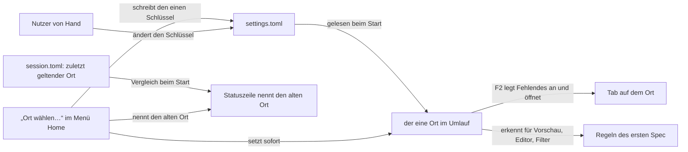

# Spec: Menü „Home“ und einstellbarer Ort des Notizordners

**Date:** 2026-09-26
**Status:** Draft
**Source:** Nutzerwunsch nach der ersten Prüfung am Bündel, beantwortet in `260926-1447_*_bekommt-krkhome-ein-eigenes-menue-und-einen-einstellbaren-ort.md` (bindend). Er löst `260926-0007_*_ist-der-ort-krkhome-fest-oder-einstellbar.md` ab.
**Baut auf:** `260926-0007_*_spec-f2-oeffnet-krkhome-mit-notizen-aufgaben-geheimnissen.md` (geschlossen, alle Stufen gebaut, HEAD `3091666`). Was dort gilt, gilt weiter, soweit dieser Spec es nicht ausdrücklich ändert. Kennungen dieses Spec tragen den Vorsatz **H**, damit sie nicht mit C1 bis C7 des ersten verwechselt werden.
**Grundlage erhoben:** 260926-1451 am Baum (`heimordner/mod.rs`, `heimordner/bereitstellen.rs`, `heimgriff.rs`, `ablage/einstellungen.rs`, `ablage/neuerungen.rs`, `ablage/mod.rs`, `belegungsmodell.rs`, `menuemodell.rs`, `resources/default-keymap.toml`, `resources/default-settings.toml`, `HowTo.md`).
**Nachgezogen:** 260926 nach der Zweitlesung `260926-1520-zweitlesung-home-menue-und-einstellbarer-ort.md` (M4, M5, S1, S3, S4, dazu der offene Entscheid zur beschädigten `settings.toml` in der Schärfung M3).

---

## Directive

Nach dieser Arbeit stehen alle Befehle rund um den Notizordner in einem eigenen Hauptmenü „Home“, und der Ort des Notizordners ist einstellbar, ab Werk `~/krkhome`. Der Nutzer setzt ihn über „Ort wählen…“ im neuen Menü oder von Hand in `settings.toml`; beim Wechsel verschiebt KRK nichts, legt fehlende Dateien erst beim nächsten F2 am neuen Ort leer an und nennt in der Statuszeile den alten Ort.

---

## Ausgangslage, am 260926-1451 am Baum erhoben

- **Die Menüleiste ist die Gliederung der Belegung.** Je `Funktionsbereich` (`crates/krk-ui/src/belegungsmodell.rs`) entsteht genau ein Obermenü, in der Reihenfolge von `Funktionsbereich::ALLE`; jedes Kommando steht über `bereich_des_kommandos` in genau einem Bereich, und innerhalb eines Bereichs gilt die Reihenfolge von `resources/default-keymap.toml`. Dieselbe Gliederung tragen die Belegungsansicht (F1) und die Markdown-Ausgabe. **Ein neues Menü ist deshalb ein neuer Funktionsbereich, und ein Befehl kann nicht in zwei Menüs zugleich stehen.**
- Heute steht „Notizordner öffnen“ (`notizzettel`) unter „Anwendung“, die sechs Eintragsbefehle und „PIN ändern“ unter „Editor“. Der Code begründet ausdrücklich, warum der Notizordner **keinen** eigenen Bereich bekommt („ein Obermenü mit einem einzigen Eintrag“); mit neun Einträgen trägt diese Begründung nicht mehr.
- **Der Ort ist fest.** `Heimordner::im_benutzerverzeichnis` hängt `ORDNERNAME` (`krkhome`) an das Benutzerverzeichnis; die Meldungen von F2 nennen den Ort über `anzeigename()` fest als `~/krkhome`. Die Erkennung vergleicht zwei Pfadformen als Text ohne Systemaufruf; die aufgelöste Form entsteht beim Start leicht (`read_link` am letzten Bestandteil) und bei F2 über `canonicalize`. `heimgriff.rs` hält den einen geteilten Wert.
- **`settings.toml` wird von KRK heute nie geschrieben.** Sie entsteht beim ersten Start wörtlich aus `resources/default-settings.toml` samt rund fünfzig Kommentarzeilen und wird danach nur gelesen, einmal beim Start. Die Kopfkommentare dieser Datei und von `ablage/einstellungen.rs` tragen eine Aufnahmeregel: **„sobald eine Ansicht einen Wert ändern kann, gehört er nicht mehr hierher: mit der Ansicht käme ein Schreibpfad, und ein Schreibpfad löscht die Kommentare“.** Die Datei weist unbekannte Schlüssel ab (`deny_unknown_fields`). Die Startmeldung der Runde 24 vergleicht die obersten Schlüssel der Auslieferungsfassung mit denen der Nutzerdatei in beide Richtungen.
- **Die Übernahme der alten Zettel hängt am Anlegen des Ordners**: jedes F2, dessen `mkdir(2)` gelingt, übernimmt `note-1.txt` und `note-2.txt` in eine neu entstehende `notes.txt`. Ein neuer Ort, den F2 anlegt, bekäme die Zettel ohne eine Regel dieses Spec ein zweites Mal.
- **Der Editor entscheidet beim Öffnen, in welcher Form er eine Datei zeigt, und beim Sichern über den Schutz, den er hält.** Eine entsperrte `secrets.txt` wird auch nach einem Ortswechsel weiter verschlüsselt gesichert; allein der Zweig für Klartext fragt die Erkennung zum Zeitpunkt des Sicherns (`editormodell.rs`, am 260926-1520 in der Zweitlesung nachgelesen). Ein Ortswechsel bei offener Datei öffnet also keinen Klartextweg. Er lässt aber die Anzeige veralten: eine Datei des alten Orts stünde bis zum Schließen weiter als Eintragstabelle mit „PIN ändern“ da, und eine Datei des neuen Orts, die als gewöhnlicher Text geöffnet ist, ließe sich als `secrets.txt` danach nicht mehr sichern.

---

## Zuschnitt in drei Stufen

| Stufe | Liefert | Nach der Auslieferung kann der Nutzer |
|---|---|---|
| 1 | H1 | alle Befehle rund um den Notizordner im Menü „Home“ finden |
| 2 | H2 | den Ort von Hand in `settings.toml` setzen; ab dem nächsten Start gilt er |
| 3 | H3 | den Ort über „Ort wählen…“ mit einem Ordnerdialog setzen, ohne Neustart |

Stufe 1 ist eine reine Umgliederung und für sich auslieferbar. Stufe 2 bringt den Ort und alle Regeln, die an ihm hängen, ohne einen neuen Schreibweg. Stufe 3 bringt den ersten Schreibweg in `settings.toml`, das riskanteste Stück, und hängt an Stufe 2. „Ort wählen…“ erscheint erst mit Stufe 3 im Menü.

---

## Capabilities

Wie im ersten Spec zwei Listen je Fähigkeit: am Baum nachweisbar, und nur am laufenden Bündel prüfbar (Nutzerarbeit, `CLAUDE.md`, „Der Abnahmelauf verlangt KRK im Vordergrund“). **Vor keiner Nutzerabnahme ist ein Handgriff an der Belegung nötig.** Eine Funktion, die die eigene Belegung nicht nennt, hängt KRK beim Laden unbelegt an, so dass „Ort wählen…“ mit Stufe 3 auch bei einer eigenen Belegung im Menü „Home“ steht. `cmd+r` in der Belegungsansicht ist dafür ausdrücklich **nicht** zu drücken: es setzt die ganze eigene Belegung auf die Auslieferung zurück. Die Gliederung in Menüs kommt ohnehin aus dem Code, nicht aus der Belegungsdatei.

### Stufe 1

### H1: Das Menü „Home“

**Description:** Die Menüleiste trägt ein Obermenü „Home“. Darin stehen „Notizordner öffnen“, die sechs Befehle der Eintragstabelle (Eintrag hinzufügen, Eintrag bearbeiten, Eintrag nach oben, Eintrag nach unten, Eintrag löschen, Aufgabe abhaken oder öffnen) und „PIN ändern“, ab Stufe 3 dazu „Ort wählen…“. Die Befehle ziehen um, sie werden nicht verdoppelt: unter „Anwendung“ und „Editor“ stehen sie danach nicht mehr. Tasten, Kennungen, Namen, Zulässigkeit und Ausgrauung bleiben, wie sie sind. Die Belegungsansicht und die Markdown-Ausgabe zeigen denselben Abschnitt „Home“, weil sie derselben Gliederung folgen.

**Acceptance criteria, am Baum nachweisbar:**
- [ ] Es gibt einen Funktionsbereich mit dem Anzeigenamen „Home“; `make menue` zeigt ein Obermenü „Home“ mit genau diesen Einträgen in dieser Reihenfolge: Notizordner öffnen, (ab Stufe 3) Ort wählen…, Eintrag hinzufügen, Eintrag bearbeiten, Eintrag nach oben, Eintrag nach unten, Eintrag löschen, Aufgabe abhaken oder öffnen, PIN ändern.
- [ ] Unter „Anwendung“ steht „Notizordner öffnen“ nicht mehr, unter „Editor“ keiner der sieben übrigen Befehle; jeder Befehl steht genau einmal in der Menüleiste.
- [ ] `resources/default-keymap.toml` trägt für jede bisherige Funktion dieselben Kombinationen und dieselbe Kennung wie vor dieser Arbeit; `make tasten` unterscheidet sich allein in der Gruppierung.
- [ ] Eine vollständige Nutzerbelegung aus der Zeit vor dieser Arbeit lädt ohne Ersetzung durch die Auslieferungsbelegung.
- [ ] Die Belegungsansicht und die Markdown-Ausgabe führen einen Abschnitt „Home“ mit denselben Funktionen.
- [ ] Die Begründung am Code, warum der Notizordner keinen eigenen Funktionsbereich bekommt, ist durch die neue ersetzt; keine Prosastelle im Baum behauptet mehr, der Notizordner stehe unter „Anwendung“ oder die Eintragsbefehle unter „Editor“.

**Acceptance criteria, nur am laufenden Bündel prüfbar (Nutzerarbeit):**
- [ ] Das Menü „Home“ steht in der Menüleiste; jeder Eintrag darin tut über das Menü, was er vorher über das alte Menü tat, und ist mit denselben Regeln ausgegraut (etwa die Eintragsbefehle ohne Eintragsdatei im Editor).
- [ ] Mit der eigenen Belegung dieses Geräts starten: keine Meldung, dass sie abgewiesen wurde, und die Befehle stehen unter „Home“, auch wenn ihre Namen noch aus der eigenen Datei kommen.
- [ ] F1 öffnen: der Abschnitt „Home“ ist da, und eine Taste darin lässt sich umbelegen wie jede andere.

**Decisions made:**
- Menüname „Home“, Inhalt wie oben (`260926-1447_*_…`, vom Nutzer entschieden).
- Die Befehle ziehen um statt sich zu verdoppeln (Vorgabe aus der Bauform: `bereich_des_kommandos` ordnet jedem Befehl genau einen Bereich zu, und `CLAUDE.md` hält die Belegung als die eine Quelle jedes Menüeintrags; eine Verdopplung bräuchte einen zweiten Mechanismus neben der Gliederung und nähme AppKit eine Tastenentsprechung doppelt, die es dem späteren Eintrag still wegnimmt).
- „Home“ steht in der Menüleiste unmittelbar hinter „Anwendung“ (Vorgabe: der Nutzer will die Befehle finden, und das erste eigene Menü ist die sichtbarste Stelle). Die Reihenfolge ist in der Durchsicht leicht zu ändern.
- Kein Trenner im Menü „Home“ (Vorgabe: das Menümodell führt Trenner allein im Anwendungsmenü; ein Trenner hier wäre eine neue Bauform für einen kleinen Gewinn).

### Stufe 2

### H2: Der Ort kommt aus `settings.toml`

**Description:** `settings.toml` trägt einen Schlüssel für den Ort des Notizordners. Die Auslieferungsfassung setzt ihn auf `~/krkhome`, samt Kommentar, der ihn erklärt; fehlt er in der Nutzerdatei, gilt `~/krkhome`. Ein Wert beginnt mit `~/` (für das Benutzerverzeichnis) oder mit `/`. KRK liest ihn beim Start. Jede Regel des ersten Spec, die am Notizordner hängt (F2, das Anlegen, die gerenderte Vorschau, die Tabellen im Editor, die PIN-Wege, der Inhaltsfilter für `secrets.txt`), gilt für den eingestellten Ort, und der Ordner wird dort wie bisher an zwei Pfadformen erkannt. Der alte Ort ist danach ein gewöhnlicher Ordner. Jede Meldung, die den Notizordner nennt, nennt den eingestellten Ort.

Hat sich der Ort seit dem letzten Lauf geändert, sagt die Statuszeile beim Start einmal, welcher Ort jetzt gilt und dass am alten Ort alles liegen bleibt. Angelegt wird beim Start nichts; F2 legt wie bisher den Ordner und die fehlenden Dateien an, am neuen Ort leer. Die alten Zettel übernimmt F2 allein am Vorgabeort `~/krkhome`.

**Acceptance criteria, am Baum nachweisbar:**
- [ ] `resources/default-settings.toml` führt den Schlüssel mit dem Wert `~/krkhome` und einem Kommentar, der sagt, was er bewirkt, welche Formen gelten und dass beim Wechsel nichts verschoben wird. Die Startmeldung der Runde 24 nennt ihn bei einer Nutzerdatei, die ihn nicht führt, wie jeden neuen Schlüssel.
- [ ] Eine Nutzerdatei ohne den Schlüssel ergibt `~/krkhome` ohne Meldung; eine mit dem Schlüssel ergibt dessen Wert; `~/` wird gegen das Benutzerverzeichnis aufgelöst.
- [ ] Ein unzulässiger Wert (leer, relativ, `~name/…`, kein Text) ergibt beim Start eine Meldung, die den Wert nennt, und **keinen** Ersatzort: F2 meldet dann denselben Grund, legt nichts an und öffnet keinen Tab. `~/krkhome` wird nicht stillschweigend eingesetzt.
- [ ] **(Vorbehaltlich der Antwort des Nutzers auf `260926-1506_*_welcher-notizordner-gilt-wenn-settings-toml-beim-start-beschaedigt-ist.md`, gebaut nach der empfohlenen Möglichkeit 1 in der Schärfung der Zweitlesung.)** Ist `settings.toml` beim Start beschädigt (kein gültiges TOML, ein unbekannter Schlüssel, ein Wert falschen Typs) oder nicht lesbar, oder hat KRK sie beim Start gar nicht erst lesen können, weil sich die Ablage nicht öffnen oder ihre Schreibsperre nicht nehmen ließ, gilt **kein** Notizordner: F2 nennt den Grund, legt nichts an und öffnet keinen Tab. Die Meldung nennt beide Wege heraus: `settings.toml` berichtigen und KRK neu starten, oder den Ort mit „Ort wählen…“ setzen. Fehlte die Datei dagegen nur und ließ sich nicht anlegen, hat der Nutzer nachweislich keinen Ort eingestellt, und es gilt `~/krkhome`. Der gemerkte Ort in `session.toml` bleibt in jedem dieser Fälle unverändert, so dass nach dem Berichtigen keine Wechselmeldung kommt, wenn der Ort derselbe geblieben ist.
- [ ] Ein Ort im Ablageordner von KRK (`~/Library/Application Support/KRK/`) oder darunter wird wie ein unzulässiger Wert abgewiesen.
- [ ] Die Erkennung bleibt die eine Stelle aus C2 des ersten Spec, bekommt den eingestellten Ort als geschriebene Form und stellt beim Fragen weiter keinen Systemaufruf; die Probe `ist_und_sonderdatei_stellen_keinen_systemaufruf` hält weiter. Die aufgelöste Form entsteht beim Start leicht, aber **nur für einen Ort unmittelbar im Benutzerverzeichnis**, wie heute für `~/krkhome`. Für jeden anderen Ort entsteht sie erst bei F2 und bei „Ort wählen…“ über `canonicalize`; bis dahin erkennt KRK den Ordner allein an der geschriebenen Form, und beim Start berührt KRK einen solchen Ort überhaupt nicht (ein nicht eingehängtes oder hängendes Laufwerk hält den Start nicht an). `secrets.txt` bleibt in dieser Spanne über Gerät und Inode erkannt, sobald sie geöffnet wird.
- [ ] `Heimordner::sonderdatei_genau` vergleicht Gerät und Inode gegen `secrets.txt` am eingestellten Ort.
- [ ] F2 legt am eingestellten Ort genau so an wie bisher an `~/krkhome`: nur die letzte Pfadstufe als Ordner, exklusiv geöffnete Dateien, nie über eine vorhandene. Fehlt eine höhere Stufe, etwa ein nicht eingehängtes Laufwerk, meldet F2 das mit dem eingestellten Ort und legt nichts an.
- [ ] Eine Probe legt den Ordner an einem anderen Ort als `~/krkhome` über F2 neu an, mit Text in beiden alten Zetteln, und findet danach eine leere `notes.txt`; am Vorgabeort übernimmt dasselbe weiter die Zettel wie bisher.
- [ ] Beim Start legt KRK weder am alten noch am neuen Ort etwas an; die bestehende Probe über die Rufer des Anlegens hält weiter.
- [ ] `session.toml` merkt sich den Ort, der zuletzt galt. Weicht er beim Start vom eingestellten ab, entsteht genau eine Statuszeile mit beiden Orten, danach gilt der neue als gemerkt. Eine `session.toml` ohne dieses Feld bleibt lesbar und erzeugt keine Meldung. Der Vergleich ist ein Textvergleich und berührt keinen der beiden Orte.
- [ ] Jede Meldung aus dem Anlegen und aus den Hindernissen von F2 nennt den eingestellten Ort; die Proben, die heute den Wortlaut mit `~/krkhome` festhalten, halten ihn für einen anderen Ort ebenso fest. Liegt der Ort im Benutzerverzeichnis, erscheint er in der Form `~/…`.
- [ ] Nach einem Ortswechsel gelten die Regeln aus C4, C5, C6 und C7 des ersten Spec am neuen Ort und am alten nicht mehr; eine Probe hält es für die gerenderte Vorschau und für den Inhaltsfilter an `secrets.txt` fest.
- [ ] `HowTo.md` beschreibt den Schlüssel, die zulässigen Formen, dass der Wechsel nichts verschiebt, dass ein Wechsel von Hand erst mit dem nächsten Start gilt, und dass die Zettel nur am Vorgabeort übernommen werden. Der Abschnitt zum symbolischen Verweis bleibt als zweiter Weg stehen und sagt, dass er nur für den Vorgabeort nötig ist. `README.md` nennt `secrets.txt` am eingestellten Ort statt fest unter `~/krkhome/`.

**Acceptance criteria, nur am laufenden Bündel prüfbar (Nutzerarbeit):**
- [ ] Ohne den Schlüssel in `settings.toml` starten: F2 führt nach `~/krkhome/` wie bisher; beim Start nennt die Neuerungsmeldung den neuen Schlüssel.
- [ ] Den Schlüssel auf einen noch nicht vorhandenen Ordner in einem vorhandenen Ordner setzen (etwa im Dropbox-Ordner), KRK neu starten: die Statuszeile nennt neuen und alten Ort; im Finder ist am neuen Ort noch nichts entstanden. F2: der Ordner steht mit leerer `notes.txt`, `tasks.txt` und `secrets.txt`, der Tab zeigt ihn, und `~/krkhome/` ist unverändert.
- [ ] Am neuen Ort `notes.txt` wählen: die Vorschau rendert sie. Einen Tab auf `~/krkhome/` öffnen und dort `notes.txt` wählen: die Vorschau zeigt sie als gewöhnlichen Text.
- [ ] Den Schlüssel auf einen Ort setzen, dessen übergeordneter Ordner fehlt, neu starten, F2: die Statuszeile nennt den Ort und den Grund, kein Tab öffnet sich, nichts entsteht.
- [ ] Den Schlüssel auf `notizen` (ohne `~/` und `/`) setzen, neu starten: die Statuszeile nennt den unzulässigen Wert; F2 öffnet nichts und legt nichts an.
- [ ] Zweiter Start ohne Änderung: keine Meldung zum Ort.
- [ ] (Vorbehaltlich des Entscheids `260926-1506_*_…`.) In `settings.toml` einen Tippfehler an einer anderen Zeile einbauen, etwa einen unbekannten Schlüssel, neu starten, F2: die Statuszeile nennt den Schaden und die zwei Wege heraus, kein Tab öffnet sich, weder am eingestellten Ort noch unter `~/krkhome` entsteht etwas. Den Tippfehler beheben, neu starten: F2 führt zum eingestellten Ort, ohne Meldung über einen Ortswechsel.

**Decisions made:**
- Der Ort ist einstellbar, Vorgabe `~/krkhome`, von Hand in `settings.toml` änderbar; beim Wechsel wird nichts verschoben, fehlende Dateien entstehen am neuen Ort leer, die Statuszeile nennt den alten Ort (`260926-1447_*_…`, vom Nutzer entschieden).
- Die Zettel werden am neuen Ort nicht übernommen, allein am Vorgabeort (abgeleitet aus der Antwort „fehlende Dateien entstehen am neuen Ort leer“; ohne diese Regel bekäme jeder neu angelegte Ort die alten Zettel ein weiteres Mal, und Notizen, die der Nutzer am alten Ort gelöscht hat, kämen zurück).
- Ein Wechsel von Hand gilt ab dem nächsten Start, wie jeder andere Wert der Datei (Vorgabe: KRK liest `settings.toml` heute allein beim Start; ein Beobachter der Datei wäre eine neue Bauform).
- Auch der Wechsel von Hand bekommt die Meldung mit dem alten Ort, einmal beim Start, über den in `session.toml` gemerkten Ort (Vorgabe: die Antwort des Nutzers sagt es für jeden Ortswechsel, und von Hand ist der alte Ort anders nicht zu kennen).
- Kein Ersatzort bei einem unzulässigen Wert (Vorgabe: ein stiller Rückfall auf `~/krkhome` legte bei F2 Dateien an einem Ort an, den der Nutzer gerade verlassen wollte).
- **Ausstehend:** kein Ort auch bei beschädigter oder nicht lesbarer `settings.toml` und bei einem Start, der die Datei nicht lesen konnte; `~/krkhome` nur, wenn sie fehlte (`260926-1506_*_…`, offen; Möglichkeit 1 in der Schärfung aus `260926-1520-zweitlesung-home-menue-und-einstellbarer-ort.md`, M3, empfohlen). Gebaut wird nach dieser Empfehlung; eine andere Antwort ändert das eine Kriterium oben und seine Nutzerprüfung. Der Preis: ein Tippfehler an `terminal` legt F2 still, bis die Datei berichtigt ist.
- Der Ablageordner von KRK ist als Ort ausgeschlossen (Vorgabe: Löschwerkzeuge nehmen ihn samt Inhalt mit, `CLAUDE.md`, „KRKs Bestand liegt außerhalb des Bündels“).
- Der Name des Schlüssels ist `notizordner` (Vorgabe: derselbe Begriff wie im Befehl „Notizordner öffnen“; der Nutzer kann ihn in der Durchsicht ändern).

### Stufe 3

### H3: „Ort wählen…“

**Description:** Im Menü „Home“ steht „Ort wählen…“. Der Befehl öffnet einen Ordnerdialog, der beim geltenden Ort beginnt und das Anlegen eines neuen Ordners erlaubt. Wählt der Nutzer einen Ordner, schreibt KRK ihn in `settings.toml` und lässt jede andere Zeile der Datei, jeden Kommentar und jeden anderen Wert unverändert. Der neue Ort gilt sofort, ohne Neustart: F2 führt ab jetzt dorthin, und die Regeln des Notizordners gelten dort. Die Statuszeile nennt den neuen und den alten Ort und sagt, dass am alten alles liegen bleibt und F2 zum neuen führt. Angelegt wird dabei nichts, auch kein Tab.

Hält der Editor gerade eine der drei Dateien des geltenden Notizordners, öffnet der Befehl keinen Dialog, und die Statuszeile sagt, welche Datei zuerst zu schließen ist. Dieselbe Abweisung gilt, wenn der Editor eine der drei Dateien des **gewählten** Ortes hält; sie wird nach der Wahl gefragt, ohne dass etwas geschrieben ist. Der Grund ist die Anzeige, nicht die Sicherheit: das Sichern verzweigt über den Schutz, den der Editor beim Öffnen gewonnen hat, und eine entsperrte `secrets.txt` bleibt auch nach einem Wechsel verschlüsselt. Ohne die Abweisung zeigte der Editor eine Datei des alten Orts bis zum Schließen weiter als Eintragsdatei mit „PIN ändern“, obwohl sie danach eine gewöhnliche Datei ist, und eine als gewöhnlicher Text geöffnete Datei des neuen Orts ließe sich nach dem Wechsel nicht mehr sichern, weil sie dann `secrets.txt` des Notizordners ist.

**Acceptance criteria, am Baum nachweisbar:**
- [ ] `resources/default-keymap.toml` führt „Ort wählen…“ mit einer neuen Kennung und ohne Kombination, unmittelbar hinter `notizzettel`, im Bereich „Home“. Der Befehl hat einen eigenen Ausführungszweig, steht in `Kommando::KENNUNGEN`, wirkt aus jedem Fokus heraus und, wie jeder Befehl, nicht, solange ein Blatt steht.
- [ ] Das Schreiben geht unter der Schreibsperre der Ablage (`Ablage::durchgang`) und über das atomare Schreiben der Ablage.
- [ ] Führt die Datei den Schlüssel, ändert das Schreiben allein dessen Wert; eine Probe vergleicht die Datei vor und nach dem Schreiben und findet jede andere Zeile Byte für Byte unverändert, Kommentare eingeschlossen, auch einen Kommentar hinter dem Wert in derselben Zeile.
- [ ] Führt die Datei den Schlüssel nicht, hängt das Schreiben ihn samt einem kurzen Kommentar ans Ende; alles davor bleibt Byte für Byte.
- [ ] Fehlt die Datei, entsteht sie aus der Auslieferungsfassung mit dem gewählten Wert.
- [ ] Das Schreiben liest `settings.toml` unter der Sperre neu und entscheidet am Stand der Datei, nicht am Stand des letzten Starts. Ist die Datei beschädigt (kein gültiges TOML, ein Schlüssel, den KRK nicht kennt, ein Wert falschen Typs), schreibt KRK nichts, der Ort bleibt der alte, und die Statuszeile sagt, dass `settings.toml` erst zu berichtigen ist. Hat der Nutzer sie seit dem Start berichtigt, schreibt der Befehl, und ein Notizordner, der wegen der Beschädigung beim Start nicht galt, gilt danach am gewählten Ort.
- [ ] Ist `settings.toml` ein symbolischer Verweis, schreibt KRK nichts, der Ort bleibt der alte, und die Statuszeile sagt, dass die Datei ein Verweis ist und der Wert dort von Hand zu setzen ist. Die Datei hinter dem Verweis und der Verweis selbst bleiben unverändert. Die Belegungsdatei `keymap.toml` ist davon nicht berührt.
- [ ] Liegt der gewählte Ort im Benutzerverzeichnis, steht er in der Form `~/…` in der Datei, sonst als absoluter Pfad.
- [ ] Der gewählte Ort durchläuft dieselbe Prüfung wie ein Wert von Hand (H2); ein Ort im Ablageordner wird abgewiesen, ohne zu schreiben.
- [ ] Steht der gewählte Ort schon **in der Datei** als Wert des Schlüssels, schreibt KRK nichts und sagt es in der Statuszeile. Verglichen wird unter der Sperre mit dem Wert in der Datei, nicht mit dem Ort, der seit dem Start gilt: hat der Nutzer den Schlüssel seit dem Start von Hand geändert und wählt nun den geltenden Ort, schreibt KRK ihn zurück, damit er auch nach dem nächsten Start gilt.
- [ ] Nach dem Schreiben setzt der Befehl den einen geteilten Wert der Erkennung neu, erhebt dabei die aufgelöste Form über `canonicalize` und merkt den Ort in der Sitzung als zuletzt geltenden, damit der nächste Start keine zweite Meldung zeigt. Schlägt das Schreiben fehl, bleibt der alte Ort in Kraft, und die Statuszeile nennt den Grund.
- [ ] Offene Tabs auf dem alten oder dem neuen Ort lesen nach dem Wechsel neu, so dass Vorschau und Inhaltsfilter sofort dem neuen Ort folgen.
- [ ] Hält der Editor `notes.txt`, `tasks.txt` oder `secrets.txt` des geltenden Ortes (auch eine gesperrte `secrets.txt`, deren PIN-Abfrage läuft), öffnet der Befehl keinen Dialog, schreibt nichts, und die Statuszeile nennt die Datei.
- [ ] Hält der Editor eine dieser drei Dateien am **gewählten** Ort, schreibt KRK nach der Wahl nichts, der Ort bleibt der alte, und die Statuszeile nennt die Datei, die zuerst zu schließen ist.
- [ ] Die Kopfkommentare von `resources/default-settings.toml` und `crates/krk-core/src/ablage/einstellungen.rs` sagen nicht mehr, KRK schreibe die Datei nie, und die Aufnahmeregel ist neu gefasst: ein Wert darf eine Ansicht haben, wenn ihr Schreibweg allein die Zeile dieses Werts berührt.
- [ ] `HowTo.md` beschreibt „Ort wählen…“, dass es nichts verschiebt und nichts anlegt, dass F2 danach zum neuen Ort führt, und dass eine zweite laufende KRK-Instanz den neuen Ort erst nach ihrem Neustart kennt.

**Acceptance criteria, nur am laufenden Bündel prüfbar (Nutzerarbeit):** (mit der eigenen Belegung dieses Geräts, ohne sie vorher zurückzusetzen)
- [ ] „Home“ → „Ort wählen…“ steht im Menü, ohne dass die eigene Belegung angefasst wurde, und trägt keine Tastenkombination.
- [ ] „Home“ → „Ort wählen…“: ein Ordnerdialog öffnet sich beim geltenden Ort. Einen neuen Ordner im Dialog anlegen und wählen: die Statuszeile nennt neuen und alten Ort. F2: der Tab zeigt den neuen Ort mit drei leeren Dateien.
- [ ] `settings.toml` danach in einem Textprogramm ansehen: alle Kommentare stehen noch, der Terminal-Wert ist unverändert, der Schlüssel trägt den neuen Ort.
- [ ] KRK neu starten: keine Meldung zum Ort, F2 führt zum neuen.
- [ ] `secrets.txt` mit PIN im Editor öffnen, dann „Ort wählen…“: kein Dialog, die Statuszeile sagt, dass zuerst `secrets.txt` zu schließen ist.
- [ ] Den Dialog abbrechen: nichts ändert sich, keine Meldung zum Ort.
- [ ] Einen Ort wählen, der ein symbolischer Verweis ist oder in einem liegt (etwa über `~/Dropbox`): F2 findet den Tab, und `notes.txt` erscheint dort gerendert, über den Weg durch den Verweis und über den aufgelösten Pfad.

**Decisions made:**
- Befehl „Ort wählen…“ mit Ordnerdialog, der in `settings.toml` schreibt (`260926-1447_*_…`, vom Nutzer entschieden).
- Ohne Tastenkombination, wie die übrigen Einrichtungsbefehle, umbelegbar in F1 (Vorgabe: ein seltener Befehl; der Nutzer wollte keine Tasten ändern).
- „Ort wählen…“ legt nichts an und öffnet keinen Tab; F2 bleibt der eine Weg, der anlegt (Vorgabe aus „fehlende Dateien entstehen bei F2“).
- Die Statuszeile nennt den alten Ort, ohne dort nachzusehen, ob Dateien liegen (Vorgabe: ein Nachsehen am alten Ort könnte an einem nicht erreichbaren Laufwerk hängen, und die Aussage „dort bleibt alles liegen“ stimmt auch für einen leeren Ort).
- Hält der Editor eine Datei des geltenden oder des gewählten Notizordners, wird der Befehl abgewiesen statt ausgegraut (Vorgabe: ein ausgegrauter Eintrag sagt nicht, warum; die Abweisung nennt die Datei). Die Abweisung schützt die Anzeige und nicht das Sichern: das Sichern bleibt über den gehaltenen Schutz auch ohne sie sicher (Zweitlesung `260926-1520-zweitlesung-home-menue-und-einstellbarer-ort.md`, M5 und S1). Die Alternative, den Wechsel zuzulassen und den Editor die Datei bis zum Schließen in ihrer Form halten zu lassen, ist keine neue Regel, sondern das heutige Verhalten des Sicherns; sie nähme veraltete Eintragstabellen und eine nicht mehr sicherbare Textdatei in Kauf. Der Nutzer kann sie in der Durchsicht wählen.
- Eine verknüpfte `settings.toml` wird nicht ersetzt, sondern mit Meldung abgewiesen (Vorgabe nach der Zweitlesung, S3: das atomare Schreiben setzte eine gewöhnliche Datei an die Stelle des Verweises, das Ziel behielte den alten Wert, und spätere Änderungen dort wirkten still nicht mehr).

---

## Stops when

- Wenn sich beim Planen von Stufe 3 zeigt, dass sich `settings.toml` nicht so schreiben lässt, dass jede andere Zeile Byte für Byte bleibt, ohne eine Kiste mit C-Code auf einem der Mac-Ziele aufzunehmen, hält die Stufe an, und die Frage, wo der Ort liegt, geht mit diesem Befund an den Nutzer zurück.
- Wenn sich beim Planen von Stufe 2 zeigt, dass die Erkennung am eingestellten Ort einen Systemaufruf beim Fragen bräuchte, hält die Stufe an; die Zusage aus dem Modulkopf von `heimordner/mod.rs` und die Zeitzusagen L3 und L10 wären berührt.

---

## Constraints

- **Keine elfte Zeitzusage, keine der zehn aus C8 der Runde 1 wird angefasst.** Beim Start wird nichts angelegt, und kein Ort wird beim Start oder je Lesevorgang über das Dateisystem befragt; `canonicalize` läuft allein bei F2 und bei „Ort wählen…“.
- **Nichts wird verschoben, nichts am alten Ort geändert oder gelöscht.**
- **Eine vorhandene Datei wird am neuen Ort nie überschrieben**, auch nicht gegen eine zweite Instanz (unverändert aus dem ersten Spec).
- **`secrets.txt` gelangt nie über den Klartextweg auf die Platte**, auch nicht über einen Ortswechsel bei offener Datei. Eine `secrets.txt` am alten Ort ist danach eine gewöhnliche Datei; ihr Chiffrat öffnet der Editor als „kein Text“ nicht. **Unverändert offen** bleibt, was schon heute für eine leere `secrets.txt` in einem beliebigen anderen Ordner gilt.
- **Kommentare und Werte in `settings.toml`, die der Nutzer geschrieben hat, bleiben unberührt.**
- **Eine eigene Belegung wird nach keiner Stufe abgewiesen**; keine Kennung fällt weg, keine Kombination ändert sich.
- **Nutzersichtbare Zeichenketten tragen Umlaute**, Kommentare und Bezeichner die Umschrift.
- **Kein C-Code auf den Mac-Zielen**, auch nicht durch eine Kiste für das Schreiben von TOML.
- **Eine ältere KRK-Fassung** weist eine `settings.toml`, die den neuen Schlüssel führt, als beschädigt ab (`deny_unknown_fields`) und setzt ihre Vorbelegung ein; die Datei bleibt dabei liegen. Das betrifft allein eine Rückkehr auf eine ältere Fassung und wird in `HowTo.md` genannt.
- **Liegt der Ort in einem synchronisierten Speicher, liegt dort eine Kopie von `secrets.txt`.** Das ist die in `HowTo.md` schon genannte Grenze der vierstelligen PIN; dieser Spec ändert daran nichts.

---

## Out of Scope

- Umzug der Dateien vom alten an den neuen Ort, auch als Angebot.
- Mehrere Notizordner zugleich oder ein Umschalten zwischen gemerkten Orten.
- Ein Beobachter, der eine Änderung von `settings.toml` im Betrieb bemerkt.
- Ein Einstellungsfenster für andere Werte aus `settings.toml`.
- Abgleich zwischen mehreren Macs und das Zusammenführen gleichzeitiger Änderungen (unverändert aus dem ersten Spec).
- Eine Sperre gegen eine leere `secrets.txt` außerhalb des Notizordners.
- Ein Umbenennen der Kennung `notizzettel`.

---

## Open for Planner

- Wie der neue Funktionsbereich entsteht und welche Proben zur Reihenfolge und zum Inhalt von „Anwendung“ und „Editor“ mitgehen (etwa die, die „die sechs vorletzten“ Einträge des Editors zählt).
- Wie `Heimordner` den eingestellten Ort statt `<benutzerverzeichnis>/krkhome` bekommt, was aus `ORDNERNAME` und `anzeigename()` wird, und wie der Proben-Zuschnitt mit einem hereingereichten Benutzerverzeichnis erhalten bleibt.
- Wie der Wert gelesen und geprüft wird, und wo die Prüfung steht, damit Start und „Ort wählen…“ dieselbe fragen.
- Wie `settings.toml` zeilengenau geschrieben wird (etwa mit einer Kiste, die TOML samt Kommentaren erhält, oder über eine gezielte Textersetzung) und wie das Neuerungsmodul und `Einstellungen` den neuen Schlüssel aufnehmen.
- Der Ordnerdialog: als Blatt am Hauptfenster oder als eigenes Fenster, und wie die Blattsperre für die Befehle dabei greift.
- Wie „Hält der Editor eine Datei des Notizordners“ gefragt wird, und ob die Abweisung in `kommandos/zulaessigkeit.rs` oder im Ausführungszweig steht, ohne den Menüeintrag auszugrauen.
- Wie die offenen Tabs auf altem und neuem Ort neu gelesen werden.
- Das Feld in `session.toml` für den zuletzt geltenden Ort und wie es mit dem Rhythmus des Sitzungssicherns zusammengeht.

---

## User Decisions Pending

- [ ] `260926-1506_*_welcher-notizordner-gilt-wenn-settings-toml-beim-start-beschaedigt-ist.md` (offen): welcher Notizordner gilt, wenn `settings.toml` beim Start beschädigt oder nicht lesbar ist. H2 ist nach der empfohlenen Möglichkeit 1 in der Schärfung der Zweitlesung (M3) gefasst und trägt den Vorbehalt am Kriterium.

Die drei Hauptfragen hat der Nutzer in `260926-1447_*_…` beantwortet; die Vorgaben unter „Decisions made“ kann er bei der Durchsicht überstimmen, zuerst die Abweisung bei offener Datei (H3), den Ausschluss des Ablageordners (H2) und die Stellung des Menüs (H1).

---

## Was die Antwort des Nutzers offenlässt oder in sich spannt

- **„Ort wählen…“ schreibt `settings.toml`, und die Datei trägt eine Regel dagegen.** Die Aufnahmeregel in `resources/default-settings.toml` und im Kopf von `ablage/einstellungen.rs` schließt Werte mit einer Ansicht aus, weil ein Schreibweg die Kommentare löschte. Der Nutzer hat den Schreibweg gewählt; der Spec hält den Grund der Regel ein (jede andere Zeile bleibt Byte für Byte) und verlangt ihre Neufassung (H3).
- **„Fehlende Dateien entstehen am neuen Ort leer“** stößt auf die Übernahme der alten Zettel, die an jedem F2 hängt, das den Ordner anlegt. Der Spec liest „leer“ wörtlich und beschränkt die Übernahme auf den Vorgabeort (H2).
- **„Die Statuszeile nennt den alten Ort“** ist für einen Wechsel von Hand nur möglich, wenn KRK sich den alten Ort merkt; der Spec merkt ihn in `session.toml` (H2).
- **„Die sechs Eintragsbefehle und PIN ändern“ im Menü „Home“** heißt nach der Bauform der Menüleiste: sie verlassen das Menü „Editor“. Wer sie dort sucht, findet sie nicht mehr.
- **Der symbolische Verweis `~/krkhome`**, den `HowTo.md` heute für den Abgleich empfiehlt, bleibt ein gültiger Weg für den Vorgabeort; mit dem einstellbaren Ort ist er nicht mehr nötig.
