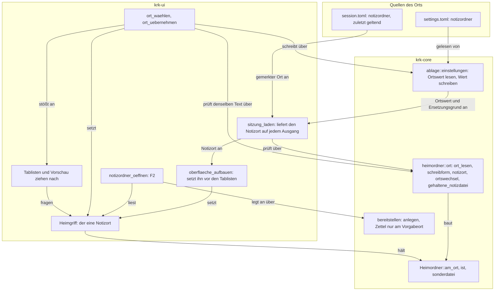
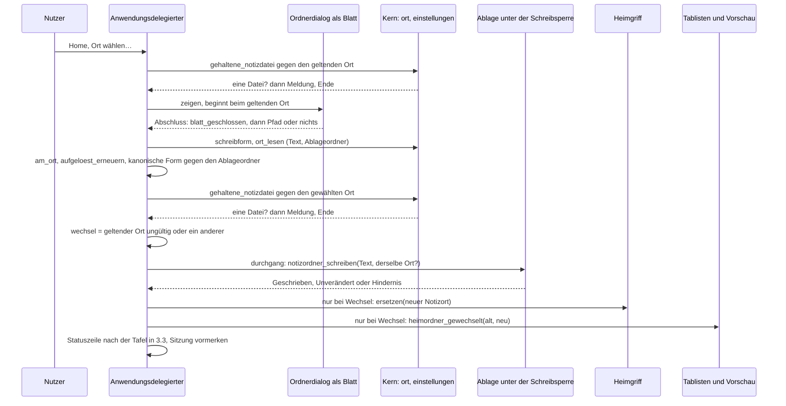
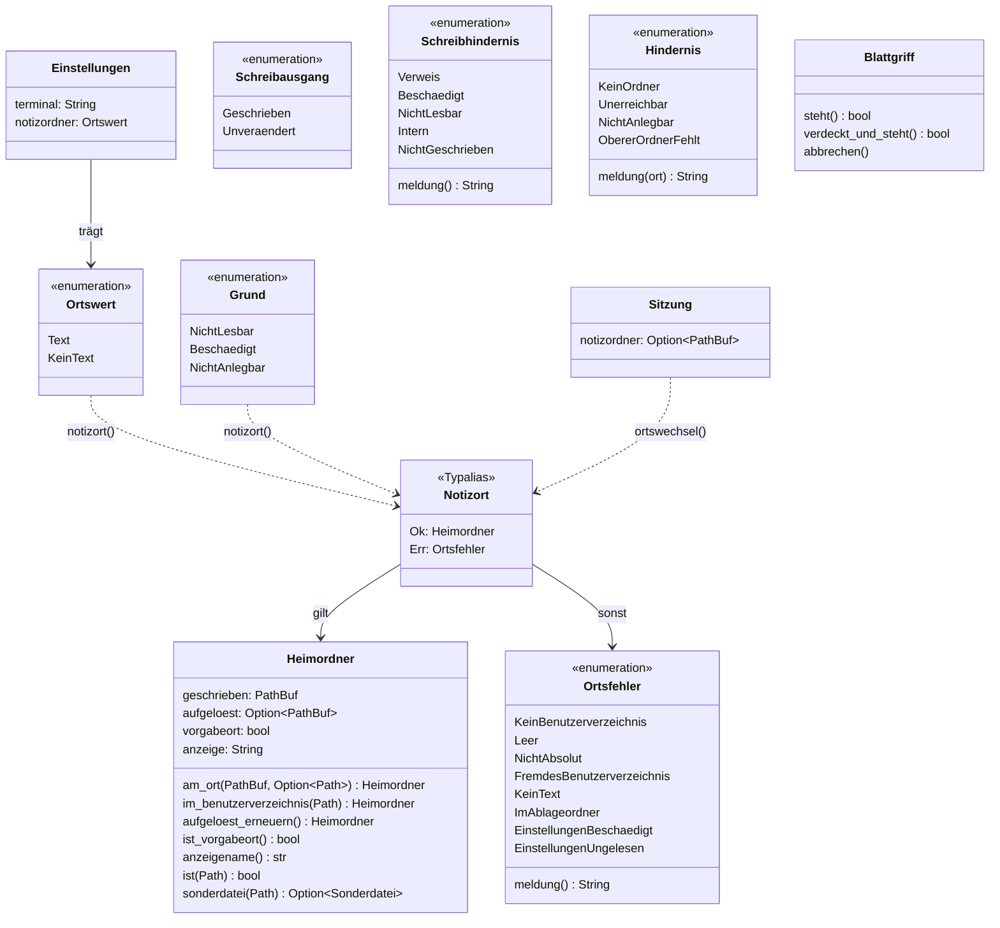

# Implementation Plan: Menü „Home“ und einstellbarer Ort des Notizordners

**Date:** 2026-09-26
**Status:** Ready for Review
**Revidiert:** 260926-1527 nach der Zweitlesung `260926-1520-zweitlesung-home-menue-und-einstellbarer-ort.md`; was daraus übernommen ist und was nicht, steht unter `## Übernahme der Zweitlesung`.
**Spec:** `260926-1451_*_spec-home-menue-und-einstellbarer-ort.md`, bindend dazu `260926-1447_*_bekommt-krkhome-ein-eigenes-menue-und-einen-einstellbaren-ort.md`; die gebaute Grundlage ist `260926-0050_*_plan-f2-oeffnet-krkhome-mit-notizen-aufgaben-geheimnissen.md` (geschlossen, HEAD `3091666`)
**Decidability:** Fünf Fragen tragen den Plan, und alle fünf sind aus den Eingaben ihres Mechanismus entscheidbar. **Erstens „ist dieser Pfad der Notizordner, oder eine Datei darin?“**: unverändert ein Textvergleich gegen die geschriebene und die aufgelöste Form (`Heimordner::ist`, `Heimordner::sonderdatei`); der einstellbare Ort ändert allein die Herkunft der geschriebenen Form, nicht die Frage. Die aufgelöste Form entsteht beim Start nur noch dann leicht, wenn der Ort unmittelbar im Benutzerverzeichnis liegt, weil nur dann `lstat` und `readlink` allein das Benutzerverzeichnis berühren; sonst entsteht sie erst bei F2 und bei „Ort wählen…“ über `canonicalize`. **Zweitens „lässt sich `settings.toml` so schreiben, dass jede andere Zeile Byte für Byte bleibt?“**: ja, ohne neue Kiste. Der TOML-Leser, den KRK schon führt (`toml` 1.1.4), meldet über `toml::Spanned` den Byte-Bereich des Werts, und das Schreiben ersetzt genau diesen Bereich; ein zweites Lesen des Ergebnisses prüft, dass allein der Wert sich geändert hat. Ist die Datei kein gültiges TOML oder ein symbolischer Verweis (`symlink_metadata` unter der Schreibsperre), wird die Frage gar nicht gestellt, weil KRK dann nicht schreibt. **Drittens „hat sich der Ort seit dem letzten Lauf geändert?“**: ein Textvergleich der lexikalisch bereinigten, gegen `~` aufgelösten Pfade aus `session.toml` und `settings.toml`, ohne den Ort zu berühren. Er meldet einen Wechsel auch dann, wenn beide Schreibweisen über einen Verweis denselben Ordner nennen; das ist der Preis dafür, beim Start kein Dateisystem zu fragen, und er ist hingenommen. **Viertens „steht der gewählte Ort schon in `settings.toml`?“**: derselbe lexikalische Vergleich zwischen dem Wert, den die Datei unter der Schreibsperre trägt, und dem gewählten Text; er berührt keinen Ort. **Fünftens „gehört `esc` dem Blatt, dessen Griff im Schlitz liegt?“**: eine Nämlichkeitsfrage an `attachedSheet`, die `Blattgriff::verdeckt_und_steht` heute schon stellt. **Nicht entscheidbar ohne Systemaufruf** ist, ob ein von Hand geschriebener Ort über einen Verweis im Ablageordner von KRK landet; beim Start prüft der Plan deshalb den Text, bei „Ort wählen…“ zusätzlich die kanonische Form, und die Lücke steht im Modulkopf.

## Directive

Nach dieser Arbeit stehen die neun Befehle rund um den Notizordner im Obermenü „Home“, und der Ort des Notizordners kommt aus `settings.toml`, ab Werk `~/krkhome`, von Hand oder über „Ort wählen…“ gesetzt. Der Spec beschreibt das Verhalten; dieser Plan sagt, wie es in drei auslieferbaren Stufen gebaut wird, und nennt die Stellen, an denen der Spec nachzuziehen ist.

## Current State

**Die Menüleiste folgt der Gliederung `Funktionsbereich`**, und die Reihenfolge innerhalb eines Bereichs ist die der Blöcke in `resources/default-keymap.toml` (`crates/krk-ui/src/belegungsmodell.rs`, `bereich_des_kommandos`; `menuemodell.rs`; `belegungsausgabe.rs`). Welche Werte `Funktionsbereich::ALLE` führt, sagt `awk '/pub enum Funktionsbereich/,/^}/' crates/krk-ui/src/belegungsmodell.rs`. Die sieben Eintragsbefehle stehen in der Belegung als Abschnitt „Einträge im Editor“ vor der Belegungsansicht und den Textbefehlen, `notizzettel` steht dahinter im Abschnitt „Der Notizordner“. Zwischen den beiden Blöcken liegt kein weiterer Befehl des Bereichs „Editor“; nachgesehen über die Kennungen zwischen den Zeilen 1110 und 1362 der Belegung und in der Zweitlesung ein zweites Mal bestätigt. **Ein Verschieben des Eintragsblocks hinter `notizzettel` ändert deshalb die Reihenfolge in keinem Bereich**, und genau das nutzt Schritt 1.1. Bei einer eigenen Belegung folgt die Reihenfolge innerhalb eines Bereichs deren Datei; Funktionen, die sie nicht nennt, hängt `Belegung::bauen` unbelegt in der Folge der Auslieferung an (`crates/krk-core/src/tasten/belegung.rs:1846-1858`).

**Der Ort ist fest.** `Heimordner::im_benutzerverzeichnis` hängt `ORDNERNAME` an das Benutzerverzeichnis und liest die aufgelöste Form über `symlink_metadata` und `read_link` am Eintrag im Benutzerverzeichnis (`crates/krk-core/src/heimordner/mod.rs`). `bereitstellen.rs` nennt den Ort in jeder Meldung über `anzeigename()`, fest `~/krkhome`, und übernimmt die alten Zettel bei jedem gelungenen `mkdir(2)`. `Hindernis::KeinBenutzerverzeichnis` wird vom Rufer erzeugt, nicht von `bereitstellen`.

**Genau ein Wert der Erkennung ist im Umlauf** (`crates/krk-ui/src/heimgriff.rs`, `Rc<RefCell<Option<Heimordner>>>`). Der Anwendungsdelegierte baut ihn in `neu` aus `Heimordner::des_benutzers()` (`crates/krk-ui/src/appkit/anwendung.rs:1410`), also **bevor** `settings.toml` gelesen ist. Gelesen wird sie in `sitzung_laden` (`anwendung.rs:1954`), im einen Durchgang des Starts, und `oberflaeche_aufbauen` ruft `sitzung_laden` unmittelbar vor dem Bau der Tablisten (`anwendung.rs:1424`). **`sitzung_laden` hat sechs Ausgänge vor dem gewöhnlichen Ende**: vier im Messmodus, je einer je Messaufgabe, dazu zwei im Betrieb, wenn der Ablageordner sich nicht öffnen oder die Schreibsperre sich nicht nehmen lässt; in den letzten beiden wird `settings.toml` gar nicht gelesen. Abschriften des Griffs halten die zwei Tablisten, das Vorschaufenster und der Editorbereich samt Editormodell. **Abschriften des Werts** leben über einen Aufruf hinaus an vier Stellen: im Ladeauftrag der Vorschau (`Vorschaumodell::datei_anzeigen` → `Ladevorgang::starten`), im Einfärbelauf der Vorschau, in der Eigenschaft „ohne Inhaltsauftrag“ jedes Ordnermodells (gesetzt einmal je Lesevorgang in `Tabliste::lesen_starten`) und im Dateityp, den das Editormodell beim Übernehmen einer gelesenen Datei festlegt.

**Das Sichern im Editor verzweigt über den gehaltenen `Schutz` und nicht über die Erkennung** (`Editormodell::sichern_ueber`, `editormodell.rs:1649-1660`). Eine mit PIN geöffnete `secrets.txt` wird verschlüsselt geschrieben, gleich was die Erkennung danach sagt; die Erkennung wird allein im Zweig `Schutz::Klartext` gefragt, zum Zeitpunkt des Sicherns über den Griff, und weist dort ab. Ein Ortswechsel bei offener Datei öffnet damit keinen Klartextweg; er lässt die Anzeige veralten. Der Spec trägt diese Lage seit der Zweitlesung in seiner Ausgangslage.

**`settings.toml` hat heute einen Leser und eine Anlage, keinen Schreiber** (`crates/krk-core/src/ablage/einstellungen.rs`). `Einstellungsdatei` trägt `deny_unknown_fields`; ein Wert falschen Typs macht die ganze Datei beschädigt, samt Beiseitelegen und Auslieferungswerten. **Die Ersetzung sagt, warum sie eingesprungen ist**: `Grund::NichtLesbar`, `Grund::Beschaedigt` oder `Grund::NichtAnlegbar` (`crates/krk-core/src/ablage/mod.rs:289-308`); der letzte trifft eine Datei, die fehlte und sich nicht anlegen ließ, in der also kein Nutzer einen Wert gesetzt haben kann. Die Anlage schreibt über `atomar::schreiben`, und `einstellungen.rs` steht damit schon in der Liste der Dateien, die die Probe `nur_benannte_dateien_erreichen_das_atomare_schreiben` zulässt. `atomar::schreiben` ersetzt das Ziel über `rename` (`atomar.rs:175-176`, `:292-294`); ein symbolischer Verweis an der Stelle wäre danach eine gewöhnliche Datei.

**Das Schreiben mit erhaltenem Rest ist gemessen und nicht vermutet**, zweimal unabhängig voneinander. Ein Wegwerfprojekt im Arbeitsverzeichnis dieser Sitzung, offline gegen dieselbe `toml` 1.1.4 übersetzt, hat für `notizordner` in fünf Schreibweisen den Bereich aus `toml::Spanned<toml::Value>` gelesen: er deckt genau das Wertzeichen samt Anführungszeichen, auch bei `'…'`, bei `"""…"""` und bei einem Schlüssel in Anführungszeichen, und lässt einen Kommentar dahinter aus. Die Zweitlesung hat acht Eingaben nachgemessen, darunter ein vorangestelltes UTF-8-BOM (der Versatz zählt die drei Bytes mit, der Ersatz trifft also) und CRLF-Zeilenenden (erhalten); ein doppelter Schlüssel und `notizordner.x = …` sind Lesefehler. `toml::Value::String(…).to_string()` kodiert einen Pfad mit `"` und `\` gültig. `Spanned` kommt aus `serde_spanned`, das `toml` schon heute als Abhängigkeit führt; `Cargo.lock` ändert sich dadurch nicht.

**`NSOpenPanel` ist in `objc2-app-kit` 0.3.2 mit den Vorgabemerkmalen frei**, und die gebrauchten Methoden sind sichere Funktionen (`openPanel`, `setCanChooseDirectories`, `setCanChooseFiles`, `setAllowsMultipleSelection`, `setCanCreateDirectories`, `setResolvesAliases`, `setDirectoryURL`, `URLs`, `beginSheetModalForWindow_completionHandler`); nachgelesen in `generated/NSOpenPanel.rs` der Kiste, kein `unsafe` entsteht. Die Klasse gibt es seit macOS 10.0, das Blatt mit Abschlussblock seit 10.6. Die Bindung warnt ausdrücklich, dass der Abschlussblock laufen kann, während das Blatt noch am Fenster hängt.

**`esc` bei stehendem Blatt nimmt heute jeden Griff aus dem Schlitz, nicht nur den des stehenden Blattes.** Die erste Fassung dieses Plans hat das falsch gelesen. Der erste Rang von `abbrechen` fragt `blatt_steht()`, nimmt dann den Griff aus `offenes_blatt`, gleich zu welchem Blatt er gehört, ruft `blatt.abbrechen()` und meldet `true` (`anwendung.rs:6666-6673`); an AppKit zurück geht die Taste allein bei **leerem** Schlitz. Die fünf Eingabeblätter melden ihr Schließen nicht, ihr Griff bleibt bis zum nächsten Blatt liegen (`anwendung.rs:3686-3700`, Doc-Kommentar von `blatt_oeffnet`), und `Blattgriff::abbrechen` beendet das Blatt **seiner eigenen** Warnung (`blaetter/mod.rs:674-677`), das dann nicht mehr steht. Heute trifft das niemanden, weil jedes Blatt von KRK einen Griff in den Schlitz legt. Der Ordnerdialog wäre das erste Blatt ohne Griff: nach einer Umbenennung, gefolgt von „Ort wählen…“, verbrauchte `esc` die Taste, und der Dialog bliebe stehen. Die Nämlichkeitsfrage, die das verhindert, steht schon im Baum, als zweite Hälfte von `Blattgriff::verdeckt_und_steht` (`blaetter/mod.rs:660-666`). `blatt_geschlossen` ist die eine Stelle, die nach einem Blatt nachholt, was liegen geblieben ist, etwa die Konfliktfrage eines laufenden Vorgangs; jeder Abschlussblock ruft sie.

## Approach

**Ein Ort, eine Prüfung, ein Wert im Umlauf.** Der Ort ist ein Text aus `settings.toml`; eine reine Funktion im Kern (`heimordner::ort::ort_lesen`) macht daraus einen Pfad oder einen benannten Fehler. Dieselbe Funktion prüft den Wert von Hand beim Start, den Wert, den „Ort wählen…“ schreiben will, und beim Schreiben den Wert, der schon in der Datei steht; der Dialog prüft also genau den Text, der danach in der Datei steht. Aus dem Pfad baut `Heimordner::am_ort` den Wert der Erkennung, und der eine Griff hält ab jetzt `Notizort = Result<Heimordner, Ortsfehler>` statt `Option<Heimordner>`. Jeder bisherige Frager liest weiter `Option<Heimordner>` über `heimgriff::lesen`; allein F2 und „Ort wählen…“ lesen den Fehler mit, um ihn zu nennen. **Es entsteht keine zweite Erkennung und kein zweiter Wert.**

**Der Start liefert den Ort auf jedem Ausgang, und gesetzt wird er an einer Stelle.** `sitzung_laden` gibt den `Notizort` als dritten Wert zurück; der Übersetzer hält damit jeden Ausgang an. Im Messmodus ist es der Vorgabeort, damit L4 misst, was er bisher maß; auf den zwei Ausgängen ohne gelesene `settings.toml` ist es ein Fehler, der die Ursache nennt; auf dem gewöhnlichen Weg ist es die Antwort von `notizort` auf Wert und Ersetzungsgrund. `oberflaeche_aufbauen` setzt ihn unmittelbar nach dem Ruf und vor der ersten Tabliste. `neu` baut den Griff nur noch als Platzhalter, den kein Frager zu sehen bekommt. Ein stiller Rückfall auf `~/krkhome`, den der Spec ausschließt, hat damit keinen Weg mehr.

**`ORDNERNAME` bleibt, und bekommt eine engere Bedeutung**: der Name des Vorgabeorts. Der Kern bleibt die einzige Codestelle, die `krkhome` schreibt; die Auslieferungsfassung von `settings.toml` trägt denselben Ort als Daten, und eine Probe hält beide gleich. `Heimordner::im_benutzerverzeichnis` bleibt als Bau des Vorgabeorts stehen, so dass jede Probe, die heute einen Heimordner in einen Prüfordner legt, unverändert bleibt. Aus demselben Vergleich entsteht `Heimordner::ist_vorgabeort`, an dem die Übernahme der alten Zettel hängt.

**Der Schreibweg ersetzt einen Byte-Bereich und sonst nichts.** `einstellungen::notizordner_schreiben` fragt unter der Schreibsperre zuerst, ob `settings.toml` ein symbolischer Verweis ist, und schreibt dann nicht. Sonst liest es die Datei, lässt den vorhandenen Leser den Bereich des Werts melden, fragt den Aufrufer, ob der Wert dort schon den gewählten Ort nennt, setzt den neuen Wert genau an den Bereich oder hängt Schlüssel und Kommentar ans Ende, liest das Ergebnis zur Probe ein zweites Mal und schreibt über `atomar::schreiben`. Eine beschädigte Datei wird nicht geschrieben. Die zweite Haltestelle des Spec (Kiste mit C-Code) tritt damit nicht ein.

**Der Ordnerdialog ist ein Blatt und kein eigenes modales Fenster.** `runModal` führte eine eigene Ereignisschleife im modalen Modus, in der die Zeitgeber der Sitzungssicherung, des Einzugs der Dateilisten und der Vorschau stehen blieben; das Blatt kehrt sofort zurück. Als Blatt greift die bestehende Blattsperre: während es steht, kommen genau die vier Befehle durch, die die Probe `waehrend_eines_blattes_kommen_genau_diese_vier_durch` zählt, und „Ort wählen…“ gehört nicht dazu. Einen `Blattgriff` bekommt der Dialog nicht, und damit `esc` ihn trotzdem erreicht, **gibt `abbrechen` die Taste an AppKit zurück, sobald der Griff im Schlitz nicht zum anhängenden Blatt gehört** (Schritt 3.2). Das ist eine Korrektur an der Wurzel und keine Ausnahme für den Dialog: jedes künftige Blatt ohne Griff hält dieselbe Regel. Der Abschlussblock des Dialogs ruft zuerst `blatt_geschlossen`.

**Nach einem Wechsel ziehen die Halter alter Abschriften nach, und zwar an den Stellen, die es schon gibt.** Jeder Tab, dessen Ordner der alte oder der neue Ort ist, liest über `lesen_starten` neu, die eine Stelle, die die Eigenschaft „ohne Inhaltsauftrag“ setzt und einen laufenden Inhaltsdurchlauf fallen lässt; verdeckte Tabs eingeschlossen. Jeder Vorschau-Tab, der eine Eintragsdatei des alten oder des neuen Orts zeigt, bekommt einen neuen Ladeauftrag mit der neuen Abschrift. **Der Editor hält beim Wechsel keine Datei des alten und keine des neuen Orts**: dieselbe Frage `gehaltene_notizdatei` wird vor dem Dialog gegen den geltenden und nach dem Dialog gegen den gewählten Ort gestellt, und bei einer Antwort unterbleibt der Wechsel.

Der Graph ist geschichtet: Quellen oben, Kern in der Mitte, Oberfläche unten, und jede Kante aus der Oberfläche in den Kern geht nach unten in die Abhängigkeit. `ort_lesen` hat zwei Frager, Start und Wahl, und das ist der Punkt der Bauform; der Griff hat zwei Schreiber, den Aufbau beim Start und die Wahl im Betrieb. Einen Kreis gibt es nicht; `FOLGE` fragt den Griff, den `WAHL` vorher gesetzt hat, und wird von `WAHL` erst danach angestoßen.

## Übernahme der Zweitlesung

| Punkt | Inhalt | Wo im Plan |
|---|---|---|
| M1 | `abbrechen` nimmt einen Griff nur, wenn sein Blatt das anhängende ist; `Blattgriff::steht` aus `verdeckt_und_steht` herausgelöst | Schritt 3.2, neu |
| M2 | `sitzung_laden` liefert den Ort auf jedem Ausgang; die zwei frühen Ausgänge einen Fehler, allein der Messmodus den Vorgabeort | Schritt 2.4 |
| M3 | kein Ort allein bei `Grund::Beschaedigt` und `Grund::NichtLesbar`; bei `Grund::NichtAnlegbar` der Wert der Auslieferung; die Meldung nennt den Neustart, ab Stufe 3 auch „Ort wählen…“ | Schritte 2.4 und 3.3; Datensatz `260926-1506_*_…` nachgeschärft |
| M4 | kein Handgriff „F1, `cmd+r`“ vor der Nutzerabnahme | Nutzerarbeit von Stufe 3 |
| M5 | Spec-Stellen nachziehen | `## Where this work stops`; Arbeit des `requirements-designer` |
| S1 | die Abweisung fragt auch gegen den gewählten Ort | Schritt 3.3 |
| S3 | eine verknüpfte `settings.toml` wird nicht ersetzt, sondern mit Meldung abgewiesen | Schritte 3.1 und 3.6 |
| S4 | „derselbe Ort“ entscheidet sich am Wert in der Datei, unter der Sperre | Schritte 3.1 und 3.3 |
| O1 | Modulkopf: Anhängen am Ende gilt, solange die Datei keine Tabelle kennt | Schritt 3.1 |
| O2 | angehängte Zeilen übernehmen das Zeilenende der Datei | Schritt 3.1 |
| O3 | Ausschluss des Ablageordners ohne Rücksicht auf Groß- und Kleinschreibung | Schritt 2.1 |
| O6 | `setResolvesAliases(true)` ausdrücklich | Schritt 3.3 |
| O7 | Prosasuche in 1.2 auch nach Zahlwörtern | Schritt 1.2 |
| O8 | `HowTo.md`: eine zweite laufende Instanz legt bis zu ihrem Neustart am alten Ort an | Schritt 3.6 |

**Nicht übernommen, mit Grund:**

- **S2 (`Option<toml::Spanned<String>>` statt `Ortswert`)** stand nicht im Auftrag dieser Überarbeitung, und der Spec verlangt die größere Form: H2 Kriterium 3 zählt „kein Text“ zu den unzulässigen **Werten**, deren Meldung den Wert nennt und die Datei nicht beiseitelegt. Mit `Spanned<String>` würde `notizordner = 5` zu einem Dateischaden, samt Beiseitelegen und Auslieferungswert für `terminal`. Die Zweitlesung nennt ihre Empfehlung selbst nicht zwingend. Fasst der Spec H2.3 um, entfallen `Ortswert` und `Ortsfehler::KeinText` in 2.2 und 2.4, und sonst ändert sich nichts.
- **O4 (Merker gegen die zweite Übernahme der alten Zettel)** bleibt außerhalb dieses Plans. Die Lücke besteht seit der ersten Arbeit: jedes F2, das `~/krkhome` neu anlegt, übernimmt die liegengebliebenen Zettel erneut, obwohl `260926-0007_*_was-geschieht-mit-den-zwei-zetteln-des-bisherigen-notizblatts.md` eine einmalige Übernahme beantwortet hat. Dieser Plan macht sie wahrscheinlicher, schafft sie aber nicht. Ein Merker in `session.toml` hielte sie nicht dicht, weil eine Instanz ohne Sitzungsrecht die Sitzung nie schreibt und eine beschädigte `session.toml` durch die Auslieferung ersetzt wird; ein dichter Merker wäre eine weitere Ablagedatei oder ein Eingriff in die alten Zettel, und beides ist eine eigene Frage. Abgelegt als Defekt `260926-1527_*_die-alten-zettel-werden-bei-jedem-neuen-anlegen-von-krkhome-erneut-uebernommen.md`.
- **O5 (`directoryURL` für einen Ort außerhalb des Benutzerverzeichnisses nicht setzen)**: H3 verlangt ausdrücklich, dass der Dialog beim geltenden Ort beginnt, und die Gefahr ist in der Zweitlesung Spekulation. Ein hängendes Laufwerk am geltenden Ort hält F2 auf dem Hauptfaden heute schon an (`canonicalize`, `mkdir`); der Dialog fügt dieser Klasse keinen Fall hinzu, den der Nutzer nicht selbst eingestellt hat. Die Nutzerarbeit von Stufe 3 prüft es einmal.

## Implementation Steps

Jeder Schritt nennt genau einen Executor aus der aktiven Menge (`code-implementer`, `data-implementer`, `analyst`); einen Schritt für `analyst` braucht dieser Plan nicht, weil die eine offene Wahl als Datensatz beim Nutzer liegt und keine Analyse verlangt. **`Hn.k` zählt die Kriterien der Liste „am Baum nachweisbar“ der Fähigkeit Hn im Spec in ihrer Reihenfolge**; der Spec nummeriert sie nicht. **Jede Stufe endet mit `make check` grün**, allen fünf Kommandos. Wo ein Schritt eine Probe rot hinterlässt, die ein späterer Schritt grün macht, nennt er genau diese Probe; jedes andere Rot ist ein Halt.

**Für jeden Schritt gilt ohne Wiederholung:** jeder neue Rückgabewert, dessen stilles Fallenlassen unbemerkt bliebe, trägt `#[must_use]`; jede nutzersichtbare Zeichenkette trägt Umlaute, Kommentare und Bezeichner die Umschrift; jede neue Datei unter `crates/krk-ui/src/appkit/` mit einem Namen aus einer `objc2_`-Kiste trägt den Abschnitt `# Ab welchem macOS die angesprochenen Klassen stehen` und nennt darin jeden hereingeholten Namen; im Kern entsteht kein `unsafe`; jede neue oder verlängerte Liste `ALLE` führt genau die Varianten ihrer Aufzählung in deren Reihenfolge; jede neue Fallunterscheidung über `Ortsfehler`, `Grund`, `Schreibhindernis` und `Schreibausgang` ist vollständig und ohne Auffangzweig; jede Prosastelle unter `crates/krk-core/src/ablage/`, die ein Zahlwort vor „Ablagedateien“ schreibt, bleibt bei `Datei::ALLE.len()`, weil `keine_prosastelle_der_ablage_nennt_eine_andere_zahl_von_ablagedateien` sie liest; keine neue Prosastelle schreibt die Zahl der Obermenüs oder Funktionsbereiche aus.

```mermaid
flowchart LR
    subgraph ST1["Stufe 1: H1"]
        S11["1.1 Belegung: Eintragsblock hinter notizzettel"] --> S12["1.2 Funktionsbereich Home"]
        S12 --> S13["1.3 Anleitung"]
    end
    subgraph ST2["Stufe 2: H2"]
        S21["2.1 Kern: ort_lesen, am_ort, Zettelregel, Meldungen"] --> S22["2.2 Einstellungen lesen notizordner"]
        S22 --> S23["2.3 Auslieferung: Schlüssel notizordner"]
        S23 --> S24["2.4 Start liefert den Ort auf jedem Ausgang, F2"]
        S24 --> S25["2.5 Anleitung, README"]
    end
    subgraph ST3["Stufe 3: H3"]
        S31["3.1 Kern: notizordner_schreiben"]
        S32["3.2 esc gehört dem anhängenden Blatt"]
        S31 --> S33["3.3 Befehl, Dialog, Übernahme"]
        S32 --> S33
        S33 --> S34["3.4 Tablisten und Vorschau ziehen nach"]
        S34 --> S35["3.5 Belegung und Auslieferung: Ort wählen"]
        S35 --> S36["3.6 Anleitung, README"]
    end
    S13 --> S21
    S25 --> S31
    S25 --> S32
```

Jede Kante ist eine Abhängigkeit, die der Schritt unter `Dependencies` nennt. Zwischen den Stufen stehen allein die Auslieferungskanten des Spec (Stufe 3 hängt an Stufe 2); technisch hängt Stufe 2 nicht an Stufe 1, und die Kante 1.3 → 2.1 hält nur die Reihenfolge der Auslieferung. 3.1 und 3.2 sind voneinander unabhängig; 3.3 braucht beide.

### Stufe 1: das Menü „Home“ (H1)

1. [DONE] **1.1 Die Belegung ordnet den Eintragsblock hinter den Notizordner**
   - Executor: `data-implementer`
   - Files: `resources/default-keymap.toml`
   - Changes:
     - Der Abschnitt „── Einträge im Editor ──“ samt Blockkommentar und den sieben Blöcken `eintrag_hinzufuegen` bis `pin_aendern` zieht unverändert an die Stelle unmittelbar hinter den Block `notizzettel` und vor „── Die Neuerungen auf Verlangen ──“. Keine Kennung, kein Name, keine Kombination ändert sich.
     - Der Kopf des verschobenen Abschnitts sagt, warum er dort steht: die Reihenfolge der Blöcke ist die Reihenfolge im Menü, und die Einträge folgen dem Notizordner, weil der Spec „Notizordner öffnen“ an erster Stelle verlangt. Er sagt nicht, in welchem Menü sie stehen; das ändert erst 1.2.
     - Der Kommentar über `neuerungen_zeigen`, der den Block „zwischen dem Notizordner und der weiteren Instanz“ verortet, nennt die neue Nachbarschaft.
   - Acceptance: `make check` grün. Die Ausgaben von `make tasten` und `make menue` sind vor und nach dem Schritt Byte für Byte gleich (Nachweis, dass sich in keinem Bereich die Reihenfolge geändert hat); der Vergleich steht in der Commit-Nachricht.
   - Closes (am Baum): H1.3 in seinem Teil zur Belegungsdatei.
   - Dependencies: none

2. [DONE] **1.2 Der Funktionsbereich „Home“**
   - Executor: `code-implementer`
   - Files: `crates/krk-ui/src/belegungsmodell.rs`, `crates/krk-ui/src/menuemodell.rs` (Proben), `crates/krk-ui/src/belegungsausgabe.rs` (Proben), `crates/krk-core/src/tasten/belegung.rs` (Doc-Kommentare der acht Varianten, wo sie ein Menü nennen), weitere Dateien unter `crates/` allein für Prosastellen, die die Suchen unten finden
   - Changes:
     - `Funktionsbereich::Home` als zweiter Wert, unmittelbar hinter `Anwendung`; `ALLE` bekommt ein Glied mehr, `name()` liefert „Home“. Der Doc-Kommentar sagt, warum der Bereich hinter „Anwendung“ steht (sichtbarste Stelle; Vorgabe des Spec, in der Durchsicht änderbar) und dass er der erste Bereich ist, der nach einem **Gegenstand** und nicht nach einer Gegend des Fensters benannt ist.
     - `bereich_des_kommandos`: `Notizordner`, die sechs Eintragsbefehle und `PinAendern` gehen nach `Funktionsbereich::Home`. Der Kommentar „bekommt keinen eigenen Funktionsbereich: er wäre ein Obermenü mit einem einzigen Eintrag“ fällt und wird durch die neue Begründung ersetzt (wer die Notizen sucht, sucht nach dem Gegenstand; `260926-1447_*_…`). Die Begründung am Editorzweig, die die Eintragsbefehle dorthin stellte, fällt ebenso. Der Satz über ein Obermenü mit einem einzigen Eintrag bei `NeuerungenZeigen` bleibt, er ist dort weiter wahr.
     - Proben: `der_bereich_editor_fuehrt_genau_die_befehle_des_editors` verliert die sieben Kennungen samt dem Kommentar über „die sechs vorletzten“; neu ist `der_bereich_home_fuehrt_genau_diese_befehle_in_dieser_folge`, die die Namen unter „Home“ **in ihrer Reihenfolge** gegen eine ausgeschriebene Liste der Kennungen hält und, anders als die Editorprobe, keine Kombination verlangt. In `menuemodell.rs` eine Probe, dass „Home“ das zweite Obermenü ist und jede Kennung aus `Kommando::KENNUNGEN` in der ganzen Leiste genau einmal als Eintrag steht, sofern die Leiste das nicht schon hält (dann bleibt es bei der vorhandenen). In `belegungsausgabe.rs` eine Zusicherung, dass die Markdown-Ausgabe einen Abschnitt „Home“ mit denselben Namen führt.
     - Prosa, zwei Suchen: `grep -rn 'Hauptmenü „Editor“\|Hauptmenue "Editor"\|unter "Editor"\|unter „Anwendung“' crates/` für die Verortung der acht Befehle, und `grep -rnE 'alle zehn|zehn (Bereich|Obermen|Funktionsbereich|Abschnitt)' crates/krk-ui/src crates/krk-core/src/tasten` für Zahlwörter der Gliederung. Jede Fundstelle, die die Befehle falsch verortet oder die Zahl der Bereiche nennt, zieht nach; eine Zahl wird dabei nicht durch „elf“ ersetzt, sondern entfällt (bekannt: die Zusicherungsmeldung `belegungsausgabe.rs:671`, „alle zehn in ihrer Reihenfolge“). Fundstellen über die zehn Zeitzusagen gehören nicht dazu.
   - Acceptance: `make check` grün; `make menue` zeigt „Home“ als zweites Obermenü mit Notizordner öffnen, Eintrag hinzufügen, Eintrag bearbeiten, Eintrag nach oben, Eintrag nach unten, Eintrag löschen, Aufgabe abhaken oder öffnen, PIN ändern, in dieser Folge; `make tasten` unterscheidet sich von der Ausgabe vor dem Schritt allein in der Gruppierung; die zweite Suche findet keine Zahl der Bereiche mehr.
   - Closes (am Baum): H1.1 ohne „Ort wählen…“ (das folgt in 3.5), H1.2, H1.3, H1.4 (keine Kennung ändert sich; die Probe aus der ersten Arbeit, dass eine Belegung mit `id = "notizzettel"` ohne Ersetzung lädt, bleibt grün), H1.5, H1.6.
   - Dependencies: 1.1

3. [DONE] **1.3 Anleitung für Stufe 1**
   - Executor: `code-implementer`
   - Files: `HowTo.md`
   - Changes: Jede Stelle, die „Notizordner öffnen“, die sechs Eintragsbefehle oder „PIN ändern“ im Hauptmenü „Anwendung“ oder „Editor“ verortet, nennt „Home“; der Abschnitt zu F2 sagt, dass alle Befehle zum Notizordner unter „Home“ stehen.
   - Acceptance: `make check` grün; `grep -n 'Hauptmenü „Editor“' HowTo.md` nennt keinen der acht Befehle mehr.
   - Closes: den Anleitungsteil von H1 (am Text lesbar).
   - Dependencies: 1.2

**Stufe 1 schließt am Baum:** H1.1 ohne „Ort wählen…“, H1.2 bis H1.6. **Nutzerarbeit:** die drei Nutzerkriterien von H1, mit der eigenen Belegung dieses Geräts und ohne Handgriff daran, dazu ein Blick auf die Menüleiste auf dem Bildschirm, an dem KRK gewöhnlich läuft: mit „Home“ steht ein Obermenü mehr in der Leiste, und auf einem Mac mit Kamerakerbe verschwinden überzählige Menüs dahinter. Die Folge innerhalb von „Home“ kommt bei einer eigenen Belegung aus deren Datei; auf diesem Gerät führt sie `notizzettel` und keinen der Eintragsbefehle, also zeigt das Menü die Folge des Spec. **Riskantester Schritt:** 1.2, weil die Gliederung drei Abnehmer hat und ihre Proben an mehreren Stellen Zahlen und Reihenfolgen festhalten; die Kette 1.1 → 1.2 hält den Übersetzerlauf auf die Gliederung beschränkt, weil die Belegung sich schon vorher nicht sichtbar bewegt hat.

### Stufe 2: der Ort aus `settings.toml` (H2)

4. [DONE] **2.1 Der Kern kennt einen Ort statt eines Namens**
   - Executor: `code-implementer`
   - Files: `crates/krk-core/src/heimordner/ort.rs` (neu), `crates/krk-core/src/heimordner/mod.rs`, `crates/krk-core/src/heimordner/bereitstellen.rs`, `crates/krk-core/tests/heimordner.rs`, `crates/krk-ui/src/appkit/anwendung.rs` (die zwei Stellen, die `Hindernis::meldung` rufen)
   - Changes:
     - **`ort.rs`, rein und ohne Systemaufruf.** `pub fn ort_lesen(text: &str, benutzerverzeichnis: Option<&Path>, ablageordner: Option<&Path>) -> Result<PathBuf, Ortsfehler>`: `~/rest` gegen das Benutzerverzeichnis (ohne eines `Ortsfehler::KeinBenutzerverzeichnis`), `/…` wie geschrieben, danach lexikalisch bereinigt über dasselbe `lexikalisch_bereinigt` aus `mod.rs`. Abgewiesen werden der leere Text, jeder relative Text, `~` allein, `~name/…` und ein Ort im Ablageordner oder darunter. **Der Vergleich mit dem Ablageordner läuft Bestandteil für Bestandteil und ohne Rücksicht auf Groß- und Kleinschreibung** (je Bestandteil `str::to_lowercase` auf beiden Seiten): ein Nachbar wie `KRK-alt` fällt nicht darunter, `~/library/application support/krk` dagegen schon, weil das Volume die Schreibweisen gewöhnlich nicht unterscheidet. Auf einem Volume, das sie unterscheidet, weist die Regel damit einen Ordner ab, der nicht der Ablageordner ist; das ist hingenommen und steht im Modulkopf. `pub fn schreibform(ort: &Path, benutzerverzeichnis: Option<&Path>) -> Option<String>` liefert `~/rest` für einen Ort echt unterhalb des Benutzerverzeichnisses, sonst den absoluten Pfad, und `None` für einen Pfad ohne gültiges UTF-8. **Das Benutzerverzeichnis selbst schreibt sie absolut**, weil `~` allein keine zulässige Leseform ist. `pub enum Ortsfehler` mit `KeinBenutzerverzeichnis`, `Leer`, `NichtAbsolut(String)`, `FremdesBenutzerverzeichnis(String)`, `KeinText(String)` und `ImAblageordner(String)`, mit `meldung()`, die den Wert nennt; die zwei Varianten zur ungelesenen Datei kommen in 2.4 dazu. `pub type Notizort = Result<Heimordner, Ortsfehler>`.
     - **`Heimordner::am_ort(ort: PathBuf, benutzerverzeichnis: Option<&Path>) -> Self`.** Die aufgelöste Form entsteht **nur dann** leicht über `symlink_metadata` und `read_link`, wenn `ort.parent()` das Benutzerverzeichnis ist; sonst bleibt sie `None` bis F2 oder „Ort wählen…“. Zwei neue Felder: `vorgabeort: bool` (der Ort ist `<benutzerverzeichnis>/ORDNERNAME`) und `anzeige: String` (über `pfade::gekuerzt_fuer_anzeige`), mit `ist_vorgabeort()` und `anzeigename()`. `im_benutzerverzeichnis` wird zu `am_ort(zuhause.join(ORDNERNAME), Some(zuhause))` und bleibt. `ist`, `sonderdatei`, `sonderdatei_genau` und `ohne_inhaltsauftrag` bleiben unverändert.
     - **Modulkopf von `mod.rs`.** „Der Name“ wird „Der Ort“: einstellbar nach `260926-1447_*_…`, `ORDNERNAME` ist der Name des Vorgabeorts und die einzige Codestelle mit `krkhome`, die leichte Form entsteht beim Start allein für einen Ort unmittelbar im Benutzerverzeichnis, und warum (das Argument „trifft allein das Benutzerverzeichnis“ trägt nur dort). Der Satz „Der Ort ist fest und nicht einstellbar“ fällt, samt dem Verweis auf den überholten Datensatz als Grundlage.
     - **`bereitstellen.rs`.** `Hindernis::KeinBenutzerverzeichnis` fällt (er ist jetzt `Ortsfehler::KeinBenutzerverzeichnis`); neu ist `Hindernis::ObererOrdnerFehlt` für ein `create_dir`, das mit `NotFound` scheitert. `Hindernis::meldung(&self, ort: &str)` und `Bereitstellung` trägt den Anzeigenamen des Orts für den Satz über zwei Geheimnisdateien; `anzeigename()` als freie Funktion fällt. **Die Übernahme der alten Zettel läuft nur bei `ordner_angelegt && heim.ist_vorgabeort()`**; sonst ist `uebernahme` `None`, und `notes.txt` entsteht leer. Der Modulkopf nennt die Regel mit ihrem Grund aus dem Spec.
     - `anwendung.rs`: die zwei Rufstellen von `meldung` reichen `heim.anzeigename()` herein, und der Zweig ohne Benutzerverzeichnis meldet über `Ortsfehler::KeinBenutzerverzeichnis`.
   - Probes (`tests/heimordner.rs`): eine Tafel für `ort_lesen` mit jeder zulässigen und jeder abgewiesenen Form, darunter `~/` (das Benutzerverzeichnis), `~/a/../b`, `/Volumes/X/notizen`, der Ablageordner, ein Ordner darunter, der Ablageordner in anderer Groß- und Kleinschreibung und `KRK-alt` daneben; `schreibform` und `ort_lesen` ergeben für jeden zulässigen Ort den Ort zurück, im Benutzerverzeichnis in der Form `~/…`; `am_ort` für einen Verweis unmittelbar im Benutzerverzeichnis erkennt über Verweis und Ziel, für einen Verweis zwei Ebenen tiefer bleibt die aufgelöste Form `None` und die Erkennung über die geschriebene Form gilt; `sonderdatei_genau` erkennt `secrets.txt` unter einer dritten Schreibweise auch an einem Ort außerhalb von `~/krkhome` (H2.6); F2 legt an einem anderen Ort mit Text in beiden Zetteln an und findet eine leere `notes.txt`, die Zettel Byte für Byte unverändert, und am Vorgabeort übernimmt derselbe Aufruf wie bisher (H2.8); `ObererOrdnerFehlt` für einen Ort, dessen übergeordneter Ordner fehlt, nichts entsteht; jede Meldung aus `Hindernis` und `Bereitstellung` für einen Ort unter dem Benutzerverzeichnis in `~/…` und für einen außerhalb absolut; die bestehenden Wortlautproben mit `~/krkhome` gelten weiter für den Vorgabeort. `ist_und_sonderdatei_stellen_keinen_systemaufruf` bleibt unverändert grün.
   - Acceptance: `make check` grün.
   - Closes (am Baum): H2.4 (Textprüfung), H2.5, H2.6, H2.7, H2.8, H2.11 (Wortlaut im Kern).
   - Dependencies: 1.3

5. [DONE] **2.2 `settings.toml` darf `notizordner` tragen**
   - Executor: `code-implementer`
   - Files: `crates/krk-core/src/ablage/einstellungen.rs`, `crates/krk-core/tests/ablage.rs`
   - Changes:
     - `Einstellungsdatei` bekommt `notizordner: Option<toml::Spanned<toml::Value>>` (`Eq` fällt an der privaten Struktur, falls der Übersetzer es verlangt). Neu ist `pub enum Ortswert { Text(String), KeinText(String) }`: ein Text wird `Text`, jeder andere Typ `KeinText` mit seiner TOML-Schreibweise. **Ein Wert falschen Typs macht die Datei damit nicht beschädigt**; das verlangt H2.3 („kein Text“ ist ein unzulässiger Wert mit eigener Meldung, und `terminal` bleibt, was es ist).
     - `Einstellungen` bekommt `notizordner: Option<Ortswert>`, gefüllt aus der Nutzerdatei, sonst aus der Auslieferungsfassung. `Option` nur bis 2.4; der Grund steht im Doc-Kommentar (die Auslieferung trägt den Schlüssel erst mit 2.3).
     - Proben: eine Nutzerdatei mit `notizordner = "~/x"` ergibt `Text("~/x")` ohne Ersetzung; mit `notizordner = 5` ergibt sie `KeinText("5")`, keine Ersetzung und den `terminal`-Wert der Datei; neu `die_auslieferungsfassung_fuehrt_den_notizordner_am_vorgabeort` (der Wert der Auslieferung ist `format!("~/{ORDNERNAME}")`); `eine_settings_ohne_terminal_liefert_genau_diesen_schluessel` erwartet beide obersten Schlüssel der Auslieferung in der Reihenfolge, die `toml::Table` liefert.
   - Acceptance: `make check` grün **bis auf genau zwei Proben in `crates/krk-core/tests/ablage.rs`**: `die_auslieferungsfassung_fuehrt_den_notizordner_am_vorgabeort` und `eine_settings_ohne_terminal_liefert_genau_diesen_schluessel`; beide wird 2.3 grün machen. Jedes andere Rot ist ein Halt.
   - Closes (am Baum): H2.3 im Teil „kein Text ist kein Dateischaden“.
   - Dependencies: 2.1

6. [DONE] **2.3 Die Auslieferungsfassung führt den Notizordner**
   - Executor: `data-implementer`
   - Files: `resources/default-settings.toml`
   - Changes: Hinter `terminal` ein Kommentarblock und `notizordner = "~/krkhome"`. Der Kommentar sagt, in der Umschrift der übrigen Kommentare dieser Datei: was der Wert bewirkt; dass er mit `~/` oder `/` beginnt; dass ein Wechsel nichts verschiebt und fehlende Dateien am neuen Ort leer entstehen; dass ein Wechsel von Hand ab dem nächsten Start gilt; dass ein unzulässiger Wert keinen Ersatzort ergibt und F2 dann den Grund nennt; dass eine beschädigte oder unlesbare Datei ebenso keinen Notizordner ergibt, bis sie berichtigt und KRK neu gestartet ist (in der Fassung, die der Datensatz `260926-1506_*_…` festlegt); dass der Ablageordner von KRK ausgeschlossen ist; dass die alten Notizzettel allein am Vorgabeort übernommen werden; dass eine ältere KRK-Fassung eine Datei mit diesem Schlüssel als beschädigt abweist, liegen lässt und mit ihren Vorgaben weiterarbeitet. Der Kopf der Datei bleibt in diesem Schritt, wie er ist: in Stufe 2 schreibt KRK die Datei weiterhin nie.
   - Acceptance: `make check` grün, die zwei Proben aus 2.2 eingeschlossen.
   - Closes (am Baum): H2.1 (die Neuerungsmeldung nennt den Schlüssel für eine Nutzerdatei ohne ihn über die bestehende Vergleichsform `ObersteSchluessel`, gehalten von der Probe aus 2.2).
   - Dependencies: 2.2

7. [DONE] **2.4 Der Start liefert den Ort auf jedem Ausgang, merkt ihn und meldet einen Wechsel; F2 folgt ihm**
   - Executor: `code-implementer`
   - Files: `crates/krk-core/src/ablage/einstellungen.rs`, `crates/krk-core/src/ablage/sitzung.rs`, `crates/krk-core/src/heimordner/ort.rs`, `crates/krk-core/tests/{ablage.rs,heimordner.rs}`, `crates/krk-ui/src/heimgriff.rs`, `crates/krk-ui/src/fenstermodell.rs`, `crates/krk-ui/src/appkit/anwendung.rs`, `crates/krk-ui/src/{tabs.rs,vorschaumodell.rs,editormodell.rs,main.rs}` sowie `appkit/{vorschau.rs,editor.rs}` (allein wo Prüfmodule `Heimgriff::default()` bauen oder Prosa den Griff beschreibt)
   - Changes:
     - `Einstellungen::notizordner` wird `Ortswert` ohne `Option`; `AUSLIEFERUNG` verlangt den Schlüssel mit `expect`, wie bei `terminal`.
     - **`Ortsfehler` bekommt die zwei Fälle, in denen `settings.toml` nichts hergegeben hat**: `EinstellungenBeschaedigt(String)` (die Datei war da und ließ sich nicht lesen oder nicht deuten; trägt den Satzteil des Grunds) und `EinstellungenUngelesen(String)` (der Start ist nicht bis zum Lesen gekommen; trägt die Ursache). Beide Meldungen sagen, dass F2 bis dahin nichts anlegt; die erste nennt als Weg „`settings.toml` berichtigen und KRK neu starten“, die zweite „KRK neu starten“. „Ort wählen…“ nennen sie in Stufe 2 nicht, weil es den Befehl noch nicht gibt; 3.3 ergänzt die erste.
     - `ort.rs`: `pub fn notizort(wert: &Ortswert, schaden: Option<&Grund>, benutzerverzeichnis: Option<&Path>, ablageordner: Option<&Path>) -> Notizort`, vollständig über `schaden`:
       - `None` → `ort_lesen` auf dem Wert der Datei, `KeinText` wird `Ortsfehler::KeinText`.
       - `Some(Grund::NichtAnlegbar(_))` → `ort_lesen` auf dem Wert, der dann der Auslieferungswert ist, also der Vorgabeort. Die Datei fehlte, also hat niemand einen anderen Ort eingestellt.
       - **`Some(Grund::Beschaedigt(_) | Grund::NichtLesbar(_))` → `Err(Ortsfehler::EinstellungenBeschaedigt(…))`. Das ist der eine Zweig, der an der Antwort des Nutzers auf `260926-1506_*_welcher-notizordner-gilt-wenn-settings-toml-beim-start-beschaedigt-ist.md` hängt**; gebaut wird Möglichkeit 1 in der Schärfung der Zweitlesung. Eine andere Antwort ändert allein diesen Zweig, seine Probe und den Satz in `HowTo.md`.
     - `ort.rs`, weiter: `pub fn ortswechsel(gemerkt: Option<&Path>, geltend: &Notizort, benutzerverzeichnis: Option<&Path>) -> Option<String>` und ein Satzbauer für „neuer Ort, alter Ort, dort bleibt alles liegen, F2 führt zum neuen“, den Stufe 3 wiederverwendet: kein gemerkter Ort ergibt keinen Satz, derselbe keinen, ein anderer genau einen, ein ungültiger geltender Ort keinen Wechselsatz. Dazu `pub fn startzeile(geltend: &Notizort, gemerkt: Option<&Path>, …) -> Option<String>`, vollständig über den Fehler: ein gültiger Ort ergibt den Wechselsatz oder nichts; `EinstellungenBeschaedigt` und `EinstellungenUngelesen` ergeben **keine** eigene Zeile, weil der Lader beziehungsweise der frühe Ausgang die Ursache schon in die Statuszeile stellt und F2 sie wiederholt; jeder Fehler des Werts ergibt seine Meldung, die den Wert nennt (H2.3).
     - `sitzung.rs`: `Sitzung::notizordner: Option<PathBuf>`, `skip_serializing_if = "Option::is_none"`, **vor den Tabellen** aus dem Grund, den `Sitzung::editor` ausschreibt. Doc-Kommentar: der zuletzt geltende Ort, ein Textwert, nie am Dateisystem geprüft.
     - `heimgriff.rs`: `Heimgriff = Rc<RefCell<Notizort>>`. `lesen` liefert weiter `Option<Heimordner>` (`.ok()` einer Abschrift), so dass kein Frager sich ändert; neu `lage(&griff) -> Notizort` für F2 und „Ort wählen…“; `ersetzen(&griff, Notizort)` ist der eine Schreiber; `ungelesen()` baut den Platzhalter `Err(Ortsfehler::EinstellungenUngelesen(…))` für `neu` und für Prüfmodule statt `Heimgriff::default()`. Der Modulkopf sagt, wann der Wert ersetzt wird (Aufbau beim Start, F2, „Ort wählen…“) und welche Abschriften des Werts über einen Aufruf hinaus leben (die vier aus `## Current State`).
     - `fenstermodell.rs`: `Fenstermodell::sitzung` bekommt `notizordner: Option<PathBuf>` und schreibt ihn durch.
     - **`anwendung.rs`, der Start.** `sitzung_laden` gibt `(Sitzung, Vec<String>, Notizort)` zurück, und der Übersetzer verlangt den dritten Wert auf jedem Ausgang:
       - die vier Messaufgaben: `Heimordner::des_benutzers().ok_or(Ortsfehler::KeinBenutzerverzeichnis)`, also derselbe Vorgabeort wie bisher, damit L4 misst, was es maß;
       - Ablageordner nicht zu öffnen und Schreibsperre nicht zu nehmen: `Err(Ortsfehler::EinstellungenUngelesen(fehler))`;
       - der gewöhnliche Weg: der Durchgang reicht neben `eingestellt` den Grund der Ersetzung heraus (`geladene_einstellungen.ersetzung.as_ref().map(|e| e.grund.clone())`, gelesen vor `mit_meldung`), und nach dem Durchgang ruft `sitzung_laden` `notizort(…)` mit `pfade::benutzerverzeichnis()` und dem Ablageordner.
       `neu` baut den Griff mit `heimgriff::ungelesen()`. **`oberflaeche_aufbauen` ruft `heimgriff::ersetzen` in der Zeile unmittelbar nach `self.sitzung_laden()` und vor dem ersten `Tabliste::aus_zustand`**, mit einem Kommentar, warum die Stelle tragend ist. `startzeile` gegen `sitzung.notizordner` ergibt höchstens eine Startmeldung. Neues Feld `gemerkter_ort` in den Ivars: der geschriebene Pfad eines gültigen Orts, sonst der gemerkte aus der Sitzung. `sitzung_bauen` reicht `gemerkter_ort` durch. Weicht `gemerkter_ort` vom geladenen Feld ab, merkt der Start die Sitzung nach dem Bau der Oberfläche einmal vor, damit der nächste Start keine zweite Meldung zeigt. `notizordner_oeffnen` liest `heimgriff::lage`: ein `Ortsfehler` geht als Befehlsantwort in die Statuszeile, und F2 legt nichts an und öffnet keinen Tab.
     - **Keiner dieser Wege ruft `canonicalize`, `aufgeloest_erneuern` oder `bereitstellen`**; `am_ort` ist der einzige Bau am Start.
   - Probes: in `tests/heimordner.rs` die Tafel für `notizort` (gültig, jede Fehlerform des Werts, `NichtAnlegbar` mit Auslieferungswert ergibt den Vorgabeort, `Beschaedigt` und `NichtLesbar` ergeben `EinstellungenBeschaedigt`), für `ortswechsel` (fehlend, gleich, gleich in anderer Schreibweise `~/krkhome` gegen `/<zuhause>/krkhome`, verschieden, geltender Ort ungültig) und für `startzeile` (jede Variante von `Ortsfehler` einmal); in `tests/ablage.rs` eine `session.toml` mit und ohne `notizordner`, beide lesbar, die ohne ergibt `None` und behält jede andere Angabe; in `vorschaumodell.rs` lädt ein Heimordner `am_ort(<pruef>/anderswo)` die `notes.txt` dort als `Inhalt::Markdown` und die unter `<pruef>/krkhome` als `Inhalt::Text`; in `tabs.rs` trägt mit demselben Griff ein Tab auf `anderswo` die Eigenschaft „ohne Inhaltsauftrag“ und ein Tab auf `krkhome` nicht (beide H2.12). In `anwendung.rs`: `der_start_erreicht_weder_das_anlegen_noch_das_aufloesen` bleibt unverändert grün (H2.9); eine Quelltextprobe hält, dass im Rumpf von `sitzung_laden` `Heimordner::des_benutzers` allein vor der Zeile `let mut meldungen = Vec::new();` steht, also allein im Messmodus, und dass `EinstellungenUngelesen` dort genau an den zwei frühen Ausgängen steht; eine zweite hält, dass in `oberflaeche_aufbauen` `heimgriff::ersetzen` vor dem ersten `Tabliste::aus_zustand` steht; eine dritte, dass der Rumpf von `notizordner_oeffnen` `heimgriff::lage` fragt und bei einem Fehler vor `bereitstellen` zurückkehrt.
   - Acceptance: `make check` grün.
   - Closes (am Baum): H2.2, H2.3, H2.4 (am Start), H2.9, H2.10, H2.11 (F2 und Start), H2.12.
   - Dependencies: 2.3; der Datensatz `260926-1506_*_welcher-notizordner-…` bestimmt den einen markierten Zweig, hält den Schritt aber nicht an.
   - Abweichung beim Bau: der Griff hält nicht `Notizort`, sondern `heimgriff::Notizlage` (den `Notizort` und, allein für einen Fehler, einen Schutzort). Gilt kein Ort, liefert `heimgriff::lesen` den zuletzt geltenden Ort aus `session.toml`, ohne einen gemerkten den Vorgabeort (`heimordner::ort::schutzort`); `heimgriff::lage` für F2 liefert allein den Fehler. Grund: ohne Ort fragten Vorschau, Editor, Inhaltsfilter, Sitzung und Tastenprotokoll keinen Heimordner mehr, und eine leere `secrets.txt` am bisherigen Ort ginge über den Klartextweg. Preis: die Regeln für `notes.txt` und `tasks.txt` gelten dort ebenfalls weiter. Dazu `ort::zu_merken` und `ort::wechselsatz` als eigene Funktionen.

8. [DONE] **2.5 Anleitung und README für Stufe 2**
   - Executor: `code-implementer`
   - Files: `HowTo.md`, `README.md`, `CLAUDE.md` (allein Aussagen, die Stufe 2 falsch gemacht hat)
   - Changes: `HowTo.md`: die Tabelle der Ablagedateien nennt für `settings.toml` auch den Notizordner; der Abschnitt zu F2 spricht vom Notizordner „ab Werk `~/krkhome/`“ und beschreibt den Schlüssel, die zulässigen Formen, dass ein Wechsel nichts verschiebt und von Hand ab dem nächsten Start gilt, dass ein unzulässiger Wert und eine beschädigte oder unlesbare `settings.toml` keinen Ort ergeben und was dann zu tun ist (in der Fassung, die der Datensatz zur beschädigten Datei festlegt), dass die Zettel nur am Vorgabeort übernommen werden und dass eine ältere KRK-Fassung die Datei mit dem neuen Schlüssel als beschädigt abweist; der Abschnitt zum symbolischen Verweis bleibt als zweiter Weg stehen und sagt, dass er allein für den Vorgabeort nötig ist. `README.md` nennt `secrets.txt` im eingestellten Notizordner statt fest unter `~/krkhome/`. `CLAUDE.md`: `grep -n 'krkhome\|settings.toml' CLAUDE.md`, und nur eine Aussage, die jetzt falsch ist, zieht nach.
   - Acceptance: `make check` grün; `grep -n '~/krkhome' HowTo.md README.md` nennt nur Stellen, die vom Vorgabeort oder vom Verweis sprechen.
   - Closes: H2.13.
   - Dependencies: 2.4

**Stufe 2 schließt am Baum:** H2.1 bis H2.13. **Nutzerarbeit:** die sechs Nutzerkriterien von H2 aus dem Spec, dazu einmal eine absichtlich beschädigte `settings.toml` (etwa ein Tippfehler an `terminal`): die Statuszeile nennt den Schaden beim Start, F2 nennt ihn ebenfalls samt Neustart als Weg und legt nichts an. **Riskantester Schritt:** 2.4, weil der Griff seinen Typ wechselt und damit jeder Halter und jedes Prüfmodul, das einen Griff baut, durch den Übersetzer geht, und weil `sitzung_laden` seine Gestalt ändert. Den Typwechsel fängt der Bau; dass jeder Ausgang einen Ort trägt, hält der Übersetzer über das Tupel; dass der Messmodus beim Vorgabeort bleibt und der Griff vor den Tablisten gesetzt ist, halten die zwei Quelltextproben aus diesem Schritt.

### Stufe 3: „Ort wählen…“ (H3)

9. [DONE] **3.1 Der eine Schreibweg in `settings.toml`**
   - Executor: `code-implementer`
   - Files: `crates/krk-core/src/ablage/einstellungen.rs`, `crates/krk-core/src/ablage/mod.rs` (Modulkopf, Doc-Kommentar an `Grund::NichtAnlegbar`), `crates/krk-core/tests/ablage.rs`
   - Changes:
     - `pub fn notizordner_schreiben(zugang: &Zugang<'_>, wert: &str, derselbe: impl Fn(&str) -> bool) -> Result<Schreibausgang, Schreibhindernis>`, `#[must_use]`. `derselbe` beantwortet, ob ein vorhandener Text denselben Ort nennt wie `wert`; der Rufer gibt dafür `ort_lesen` mit, so dass `ablage` `heimordner` nicht kennen muss. Ablauf, vollständig über das Ergebnis von `symlink_metadata` an `zugang.pfad(Datei::Einstellungen)`:
       - ein symbolischer Verweis, auch ein verwaister → `Schreibhindernis::Verweis`, nichts wird gelesen oder geschrieben;
       - `NotFound` → der Ausgang ist `AUSLIEFERUNGSTEXT`;
       - eine gewöhnliche Datei → ihre Bytes; kein gültiges UTF-8 oder ein Fehler des Lesers ergibt `Schreibhindernis::Beschaedigt(grund)`;
       - jede andere Antwort (ein Ordner, ein anderer Fehler) → `Schreibhindernis::NichtLesbar(grund)`.
       Steht der Schlüssel da und nennt `derselbe` seinen Text denselben Ort, ist der Ausgang `Schreibausgang::Unveraendert`, und nichts wird geschrieben. Sonst wird genau der Bereich aus `Spanned::span()` durch `toml::Value::String(wert).to_string()` ersetzt. Fehlt der Schlüssel, wird hinten angehängt: ein fehlender Schlussumbruch zuerst, dann eine Leerzeile, ein kurzer Kommentar (Ort des Notizordners, gesetzt über „Ort wählen…“) und die Schlüsselzeile, **jede angehängte Zeile mit dem Zeilenende der Datei** (`\r\n`, wenn die erste Zeile so endet, sonst `\n`). **Vor dem Schreiben wird das Ergebnis erneut gelesen**: es muss `notizordner == wert` und jeden anderen Wert der Datei unverändert ergeben, sonst `Schreibhindernis::Intern` und kein Schreiben. Geschrieben wird über `atomar::schreiben`; ein Fehler dort wird `Schreibhindernis::NichtGeschrieben(grund)`, und die alte Datei bleibt. Der Ausgang ist dann `Schreibausgang::Geschrieben`. Die Aufrufer halten die Schreibsperre, weil es einen `Zugang` nur im Durchgang gibt.
     - `Schreibhindernis::meldung()` nennt für `Verweis`, dass `settings.toml` ein symbolischer Verweis ist, den KRK nicht durch eine Datei ersetzt, und gibt die Zeile `notizordner = "…"` zum Eintragen von Hand mit; für `Beschaedigt`, dass die Datei erst zu berichtigen ist.
     - Modulköpfe: in `einstellungen.rs` wird „Die Datei entsteht einmal und wird danach nicht mehr geschrieben“ zu einem Abschnitt über den einen Schreibweg, mit der neu gefassten Aufnahmeregel (ein Wert darf eine Ansicht haben, wenn ihr Schreibweg allein den Byte-Bereich dieses Werts berührt), mit der Regel, dass eine verknüpfte Datei nicht geschrieben wird, und warum (KRK verwandelt eine vom Nutzer gepflegte Verknüpfung nicht still in eine Datei; `keymap.toml` bleibt davon unberührt), und mit dem Satz, dass **das Anhängen am Ende nur gilt, solange die Datei keine Tabelle kennt**: `deny_unknown_fields` lässt heute allein oberste Skalare zu; käme ein Schlüssel mit eigener Tabelle hinzu, landete ein angehängter `notizordner` darin, die zweite Lesung fängt das als `Intern` ab, und der Schreibweg muss dann vor der ersten Tabellenüberschrift einfügen. Genannt ist auch die verbleibende Lücke: zwischen `symlink_metadata` und `rename` kann ein anderes Programm, das die Schreibsperre nicht kennt, einen Verweis an die Stelle legen. In `ablage/mod.rs` wird der Abschnitt „Zwei der sechs Ablagedateien entstehen einmal und werden nie wieder geschrieben“ nachgezogen, ohne das Zahlwort vor „Ablagedateien“ zu ändern; der Doc-Kommentar an `Grund::NichtAnlegbar` („weil keine Ansicht sie schreibt“) ebenso. `Einstellungen` bleibt ohne `Serialize`; der Satz dazu bleibt wahr.
     - **Kistenprüfung**: `cargo tree --target aarch64-apple-darwin -e normal,build` und dasselbe für `x86_64-apple-darwin`, je durchsucht nach `cc` und nach Paketen mit einem Namen auf `-sys`; dazu `git diff --exit-code Cargo.toml Cargo.lock crates/*/Cargo.toml`. Erwartet ist kein Treffer und kein Unterschied, weil keine Kiste hinzukommt.
   - Probes (`tests/ablage.rs`, mit der Prüfordner-Fassung des Kerns): die Auslieferungsfassung mit neuem Wert, und jedes Byte vor und hinter dem Wertbereich ist gleich; dasselbe für eine Nutzerdatei mit Kommentar hinter dem Wert in derselben Zeile, mit `'…'`, mit `"""…"""`, mit `"notizordner"` als Schlüssel, mit vorangestelltem BOM und mit CRLF; eine Datei ohne den Schlüssel und ohne Schlussumbruch, deren bisherige Bytes danach unverändert am Anfang stehen; dieselbe mit CRLF, deren angehängte Zeilen auf `\r\n` enden; eine fehlende Datei, die als Auslieferungsfassung mit dem gewählten Wert entsteht; eine Datei, deren Wert `derselbe` bejaht, bleibt Byte für Byte und ergibt `Unveraendert`; eine Datei mit ungültigem TOML und eine mit unbekanntem Schlüssel, beide `Beschaedigt` und Byte für Byte unverändert; eine `settings.toml`, die ein Verweis auf eine Datei im Prüfordner ist, ergibt `Verweis`, und danach ist sie weiter ein Verweis und ihr Ziel Byte für Byte unverändert; ein verwaister Verweis ergibt ebenso `Verweis` und kein Anlegen; ein Wert mit `"` und `\`, der über `einstellungen::laden` unverändert zurückkommt; jede geschriebene Datei lädt danach ohne Ersetzung.
   - Acceptance: `make check` grün; das Ergebnis der Kistenprüfung steht in der Commit-Nachricht.
   - Closes (am Baum): H3.2 im Kernteil, H3.3, H3.4, H3.5, H3.6 im Kernteil, H3.9 im Kernteil, H3.13 im Teil `einstellungen.rs`.
   - Dependencies: 2.5
   - Abweichung beim Bau: `Schreibhindernis::Beschaedigt` deckt zusätzlich einen `notizordner`, der nicht als einzelner Wert dasteht (`notizordner.x = …`, `[notizordner]`). Der Leser meldet dort den Bereich des Schlüssels oder der Überschrift, nicht den eines Werts; `ist_einzelwert` liest den Bereich deshalb als eigenen Wert und verlangt denselben. `Verweis` trägt die Zeile zum Eintragen; `toml` wählt für einen Wert mit `"` die Form `'…'`, beide gültig. Kistenprüfung: `cargo tree --target {aarch64,x86_64}-apple-darwin -e normal,build` ohne `cc` und ohne Paket auf `-sys`, `git diff --exit-code Cargo.toml Cargo.lock crates/*/Cargo.toml` ohne Unterschied.

10. [DONE] **3.2 `esc` gehört dem anhängenden Blatt**
    - Executor: `code-implementer`
    - Files: `crates/krk-ui/src/appkit/blaetter/mod.rs`, `crates/krk-ui/src/appkit/anwendung.rs`
    - Changes:
      - `Blattgriff::steht(&self) -> bool`, `#[must_use]`: die Nämlichkeitsfrage aus `verdeckt_und_steht`, herausgelöst (`attachedSheet` des Fensters ist das Fenster der eigenen Warnung). `verdeckt_und_steht` wird `self.verdeckt && self.steht()`, der Doc-Kommentar der Nämlichkeit wandert an `steht`.
      - Erster Rang von `Anwendungsdelegierter::abbrechen`: steht ein Blatt, wird der Griff **nur dann** aus dem Schlitz genommen, wenn `griff.steht()` antwortet; dann `abbrechen()` und `true`. Sonst bleibt der Schlitz, wie er ist, und `abbrechen` gibt `false` zurück, so dass AppKit die Taste dem anhängenden Blatt gibt. Geleert wird der Schlitz weiter allein in `blatt_geschlossen`. Der Kommentar im Rang nennt den dritten Fall neben den zwei bisherigen (ein Griff im Schlitz, dessen Blatt nicht das anhängende ist) und seinen Anlass; der Doc-Kommentar von `blatt_oeffnet` („Ein liegengebliebener Griff ist dabei harmlos …“) sagt, dass er es ist, weil der erste Rang nach der Nämlichkeit fragt und nicht allein danach, ob ein Blatt steht.
    - Probes (Quelltextproben im Prüfmodul von `anwendung.rs`, nach dem Muster der vorhandenen): im Rumpf von `abbrechen` steht `Blattgriff::steht` vor dem `take()` des Schlitzes; der Rumpf von `verdeckt_und_steht` ruft `steht`; `offenes_blatt` wird weiter an genau einer Stelle geleert. Eine Probe mit einem wirklich anhängenden Blatt ist unter `libtest` nicht zu bauen; das Verhalten prüft die Nutzerarbeit von Stufe 3.
    - Acceptance: `make check` grün. Keine Probe ändert ihre Erwartung; die Blattsperre und die vier durchkommenden Befehle bleiben, wie sie sind.
    - Closes (am Baum): die Voraussetzung dafür, dass `esc` den Ordnerdialog erreicht (Nutzerkriterium „Den Dialog abbrechen“ von H3).
    - Dependencies: 2.5

11. [DONE] **3.3 Der Befehl, der Ordnerdialog und die Übernahme des gewählten Orts**
    - Executor: `code-implementer`
    - Files: `crates/krk-core/src/tasten/belegung.rs`, `crates/krk-core/tests/belegung.rs`, `crates/krk-ui/src/belegungsmodell.rs`, `crates/krk-ui/src/kommandos/zulaessigkeit.rs` (Probe), `crates/krk-ui/src/appkit/blaetter/ortwahl.rs` (neu), `crates/krk-ui/src/appkit/blaetter/mod.rs`, `crates/krk-ui/src/appkit/anwendung.rs`, `crates/krk-core/src/heimordner/ort.rs` (die Frage nach der gehaltenen Datei, der Wortlaut von `EinstellungenBeschaedigt`), `crates/krk-core/tests/heimordner.rs`
    - Changes:
      - **Die drei Pflichtstellen jedes Kommandos und die vierte.** `Kommando::OrtWaehlen` mit Doc-Kommentar; `(Kommando::OrtWaehlen, "ort_waehlen")` in `KENNUNGEN` unmittelbar hinter `notizzettel`; `Kommando::wirkungsbereich` im Zweig von `Notizordner` mit `Ueberall` und einem Satz, warum; `bereich_des_kommandos` nach `Home`; ein eigener Zweig `Kommando::OrtWaehlen => self.ort_waehlen()` in `Anwendungsdelegierter::kommando_ausfuehren`, weil der Auffangzweig ihn sonst still schluckte.
      - **Die Frage „hält der Editor eine Datei dieses Orts?“** als reine Funktion im Kern, `pub fn gehaltene_notizdatei(pfad: Option<&Path>, haelt_geheimnisse: bool, heim: Option<&Heimordner>) -> Option<String>`: der Dateiname, wenn `heim.sonderdatei(pfad)` antwortet oder der Editor einen Schlüssel hält; kein Systemaufruf. Gefragt wird sie zweimal, mit demselben Editorzustand und zwei Orten (unten). Eine `secrets.txt`, deren PIN-Abfrage läuft, erreicht diese Frage nie: das PIN-Blatt ist ein Blatt, und „Ort wählen…“ kommt dann gar nicht durch.
      - **`Ortsfehler::EinstellungenBeschaedigt::meldung`** nennt ab jetzt zwei Wege: `settings.toml` berichtigen und KRK neu starten, oder den Ort über „Home“ → „Ort wählen…“ setzen. Der zweite trägt im Betrieb, weil `notizordner_schreiben` die Datei unter der Sperre neu liest: ist sie inzwischen berichtigt, schreibt der Befehl, und der Griff wird gültig; ist sie es nicht, antwortet `Beschaedigt`. Die Wortlautprobe aus 2.4 zieht im selben Schritt nach.
      - **`appkit/blaetter/ortwahl.rs`**: `zeigen(fenster, beginn: Option<&Path>, fertig: impl Fn(Option<PathBuf>) + 'static)` baut `NSOpenPanel::openPanel`, wählt Ordner und keine Dateien, einen einzigen, erlaubt das Anlegen eines Ordners, setzt `setResolvesAliases(true)` ausdrücklich (der Vorgabewert von AppKit, hier festgeschrieben, damit ein Finder-Alias auf einen Ordner einen Ordner ergibt und kein Alias-Dokument), setzt `directoryURL` auf den geltenden Ort ohne ihn vorher zu prüfen, eine Schaltfläche „Wählen“ und die Zeile „Wo soll der Notizordner liegen?“, und zeigt ihn mit `beginSheetModalForWindow_completionHandler`; `NSModalResponseOK` liefert den ersten Pfad aus `URLs`, alles andere `None`. Der Modulkopf trägt den Untergrenzen-Abschnitt (jeder hereingeholte Name mit seiner macOS-Fassung, alle unter 15), und er sagt, warum ein Blatt und kein `runModal`, warum kein `Blattgriff` und dass `esc` den Dialog über die Regel aus 3.2 erreicht; ob AppKit einen symbolischen Verweis dabei ebenfalls auflöst, ist nicht nachgelesen und steht dort als offen.
      - **`ort_waehlen`** fragt `gehaltene_notizdatei` mit Pfad und Schutz des Editors gegen den geltenden Ort; bei einer Antwort meldet die Statuszeile „Zuerst <Datei> im Editor schließen; …“, und kein Dialog öffnet sich. Sonst zeigt es den Dialog am Hauptfenster. Der Abschlussblock hält den Delegierten schwach, ruft zuerst `blatt_geschlossen` und bei einem Pfad `ort_uebernehmen`.
      - **`ort_uebernehmen(pfad)`**, in dieser Folge; jeder Abbruch meldet in der Statuszeile und lässt den geltenden Ort in Kraft:
        1. `gehaltene_notizdatei` gegen den geltenden Ort, noch einmal;
        2. `schreibform` (ohne UTF-8 eine Meldung); `ort_lesen` auf genau diesem Text mit dem Ablageordner;
        3. `Heimordner::am_ort(…).aufgeloest_erneuern()`, also `canonicalize` am gewählten Ort; die kanonische Form noch einmal gegen den Ablageordner;
        4. **`gehaltene_notizdatei` gegen den gewählten Ort** (S1): hält der Editor eine Datei, die dort liegt, etwa eine als Text geöffnete leere `secrets.txt`, meldet die Statuszeile sie wie in `ort_waehlen`;
        5. `wechsel` = der geltende Notizort ist ein Fehler, oder die geschriebenen Formen unterscheiden sich und die neue kanonische Form gleicht nicht der aufgelösten des geltenden Orts (der alte Ort wird dafür nicht berührt);
        6. ohne geöffnete Ablage eine Meldung und Ende; sonst `ablage.durchgang(|zugang| einstellungen::notizordner_schreiben(zugang, &text, |alt| ort_lesen(alt, …).is_ok_and(|p| p == neuer_pfad)))`; ein Hindernis oder eine nicht genommene Sperre ergibt seine Meldung und Ende.
        Danach entscheidet allein die Tafel, und sie ist vollständig:

        | Ausgang des Schreibens | `wechsel` | Wirkung |
        |---|---|---|
        | `Unveraendert` | nein | Statuszeile: der gewählte Ort ist schon der Notizordner. Nichts sonst. |
        | `Unveraendert` | ja | Der Wert stand schon in der Datei (von Hand gesetzt seit dem Start). Nichts wird geschrieben; `heimgriff::ersetzen`, `einstellungen.notizordner` in den Ivars, `gemerkter_ort`, `sitzung_vormerken`, Nachzug aus 3.4 und der Wechselsatz aus 2.4. |
        | `Geschrieben` | nein | Die Datei nannte seit dem Start von Hand einen anderen Ort; jetzt steht wieder der geltende darin. Statuszeile sagt das; Griff, Sitzung und Tabs bleiben. |
        | `Geschrieben` | ja | Wie `Unveraendert`/ja, nach dem Schreiben. |

        Es wird nichts angelegt und kein Tab geöffnet. Der Wechselsatz nennt als alten Ort `gemerkter_ort` vor der Übernahme.
      - Proben: `OHNE_KOMBINATION_AB_WERK` in `tests/belegung.rs` führt `ort_waehlen`; `die_anwendungsweiten_befehle_wirken_aus_jedem_bereich_heraus` nimmt `OrtWaehlen` auf; in `zulaessigkeit.rs` `der_ortswahlbefehl_kommt_bei_stehendem_blatt_nicht_durch` nach dem Muster der Notizordnerprobe, und `waehrend_eines_blattes_kommen_genau_diese_vier_durch` bleibt unverändert grün; die Probe über die eigenen Ausführungszweige nimmt `OrtWaehlen` auf; `notizordnerproben` wird erweitert: `aufgeloest_erneuern` hat genau zwei Rufer, `notizordner_oeffnen` und `ort_uebernehmen`; `ort_uebernehmen` wird allein aus `ort_waehlen` gerufen und dieses allein aus dem Zweig in `kommando_ausfuehren`; `notizordner_schreiben` hat genau einen Rufer, `ort_uebernehmen`; im Rumpf von `ort_uebernehmen` steht `gehaltene_notizdatei` zweimal, beide Male vor `notizordner_schreiben`, und `notizordner_schreiben` vor `heimgriff::ersetzen`. Im Kern die Tafel für `gehaltene_notizdatei` (jede der drei Dateien über den Pfadtext, `secrets.txt` unter dritter Schreibweise über den Schlüssel, eine andere Datei, kein Pfad, eine Datei des gewählten statt des geltenden Orts) und die Wortlautprobe der neuen Meldung. `der_bereich_home_fuehrt_genau_diese_befehle_in_dieser_folge` bekommt `ort_waehlen` an zweiter Stelle.
    - Acceptance: `make check` grün **bis auf `der_bereich_home_fuehrt_genau_diese_befehle_in_dieser_folge` in `crates/krk-ui/src/belegungsmodell.rs`**: ohne Block in der Belegungsdatei hängt `Belegung::bauen` die neue Funktion unbelegt hinten an ihre Gruppe, also hinter „PIN ändern“; 3.5 macht die Probe grün. Findet der Lauf eine Probe, die für jede Kennung einen Block in `resources/default-keymap.toml` verlangt, ist sie das zweite erwartete Rot, und die Commit-Nachricht nennt sie. Jedes weitere Rot ist ein Halt.
    - Closes (am Baum): H3.1 im Codeteil, H3.2, H3.6 (Meldung), H3.7, H3.8, H3.9, H3.10, H3.12.
    - Dependencies: 3.1, 3.2
    - Abweichung beim Bau: **Rot bis 3.5 sind fünf Proben, nicht eine**, und alle aus demselben Grund: `Belegung::auslieferung` hängt eine Funktion ohne Block nicht an, sondern kennt `ort_waehlen` gar nicht. Rot sind `tasten::belegung::tests::jede_kennung_der_kommandos_steht_in_der_auslieferungsbelegung` (`krk-core`, lib), `ab_werk_traegt_genau_diese_liste_keine_kombination` und `jedes_gebaute_kommando_haengt_an_seiner_ausgelieferten_taste` (`krk-core/tests/belegung.rs`), `belegungsausgabe::tests::die_dritte_spalte_haelt_die_begruendungslagen_auseinander` und `belegungsmodell::tests::der_bereich_home_fuehrt_genau_diese_befehle_in_dieser_folge` (`krk-ui`); jedes andere Kommando von `make check` ist grün. Die erste Abweisung fragt den Ordner aus `heimgriff::lesen` und nicht aus `heimgriff::lage`: der Grund ist die Anzeige, und die folgt auch dem Schutzort, wenn kein Ort gilt. Der Wechsel selbst steht in `ort_wechseln` (Griff, `einstellungen.notizordner`, `gemerkter_ort`, `sitzung_vormerken`, Nachzug aus 3.4, Statuszeile); die Quelltextprobe hält Schreiben vor Wechsel in `ort_uebernehmen` und Griff vor Nachzug in `ort_wechseln`. Die kanonische Form wird gegen den Ablageordner lexikalisch und gegen dessen `canonicalize` gehalten (`ort::im_ablageordner`). `ortwahl::zeigen` liefert keinen Griff und ruft `fertig` auch beim Abbruch, mit `None`, damit `blatt_geschlossen` jedes Mal läuft. Neu im Kern: `Heimordner::aufgeloest`, `ort::{im_ablageordner, abweisungssatz, wahlsatz, schon_der_ort, zurueckgeschrieben}`; `wahlsatz` nennt ohne gemerkten Ort keinen alten.

12. [DONE] **3.4 Tablisten und Vorschau folgen dem neuen Ort sofort**
    - Executor: `code-implementer`
    - Files: `crates/krk-ui/src/tabs.rs`, `crates/krk-ui/src/appkit/tabelle.rs`, `crates/krk-ui/src/vorschaumodell.rs`, `crates/krk-ui/src/appkit/vorschau.rs`, `crates/krk-ui/src/appkit/anwendung.rs`
    - Changes:
      - `Tabliste::heimordner_gewechselt(&mut self, alt: Option<&Heimordner>, neu: &Heimordner) -> bool`: jeder Tab, dessen Ordner `alt.ist` oder `neu.ist` erkennt, merkt Auswahl und Bildlauf vor wie in `aktiven_neu_lesen` und liest über `lesen_starten` neu, der sichtbare wie jeder verdeckte; die Antwort sagt, ob der sichtbare darunter war. Kein Tab auf einem anderen Ordner wird berührt.
      - `Dateitabelle::heimordner_gewechselt(alt, neu)`: Bildlauf merken, die Tabliste fragen, und für den sichtbaren Tab denselben Nachzug wie `neu_lesen` (`nach_lesebeginn`), sonst allein den Einzug anstoßen.
      - `Vorschaumodell::neu_laden_wo(treffer, tafel, profile, heim)` startet für jeden Vorschau-Tab, dessen Pfad `treffer` erfüllt, einen neuen Ladeauftrag mit der neuen Abschrift; `Vorschaufenster::heimordner_gewechselt(alt, neu)` bildet den Treffer als `alt.sonderdatei(p)` oder `neu.sonderdatei(p)`, beides Textvergleiche, und stößt den Takt an.
      - `ort_uebernehmen` ruft beide Dateifenster und die Vorschau nach `heimgriff::ersetzen`, in den zwei Zeilen der Tafel aus 3.3, in denen `wechsel` gilt.
    - Probes: in `tabs.rs` eine Tabliste mit Tabs auf altem Ort, neuem Ort und einem dritten Ordner, einer davon verdeckt: danach trägt jeder die richtige Eigenschaft, der Tab auf dem dritten Ordner hat keinen neuen Lesevorgang, und ein laufender Inhaltsdurchlauf auf dem neuen Ort ist gefallen; in `vorschaumodell.rs` bekommt ein Tab mit `alt/notes.txt` einen neuen Ladeauftrag mit dem neuen Wert und ein Tab mit einer fremden Datei keinen; in `anwendung.rs` eine Quelltextprobe, dass `ort_uebernehmen` beide Nachzüge nach `heimgriff::ersetzen` ruft.
    - Acceptance: `make check` grün bis auf das in 3.3 benannte Rot, das 3.5 grün macht.
    - Closes (am Baum): H3.11.
    - Dependencies: 3.3
    - Abweichung beim Bau: `Vorschaumodell::neu_laden_wo(treffer, tafel, &profile, Option<&Heimordner>) -> usize` fragt die Datei eines laufenden Auftrags vor der angezeigten und liefert die Zahl der neuen Aufträge; `Vorschaufenster::heimordner_gewechselt` wirft den Ladetakt nur bei mindestens einem an. `DateifensterQuelle::heimordner_gewechselt` ist der Name der Ansichtsseite (`Dateitabelle` heißt im Baum so). Die Probe in `tabs.rs` prüft den gefallenen Inhaltsdurchlauf als `durchlauf.is_none()` nach dem Neulesen; einen laufenden Durchlauf baut sie nicht auf.

13. [DONE] **3.5 Belegung und Auslieferung kennen „Ort wählen…“**
    - Executor: `data-implementer`
    - Files: `resources/default-keymap.toml`, `resources/default-settings.toml`
    - Changes: In der Belegung ein Block `id = "ort_waehlen"`, `name = "Ort wählen…"`, `tasten = []`, unmittelbar hinter `notizzettel` und vor dem Eintragsblock, mit einem Kommentar: ein seltener Einrichtungsbefehl ohne Kombination ab Werk, in F1 belegbar; wer eine eigene `keymap.toml` hat, bekommt ihn unbelegt hinten an seine Gruppe, ohne etwas an seiner Belegung zu tun. In `default-settings.toml` wird der Kopf neu gefasst: KRK schreibt die Datei an genau einer Stelle, „Ort wählen…“, dort allein den Wert von `notizordner`, und nie, wenn die Datei ein symbolischer Verweis ist; die Aufnahmeregel lautet, dass ein Wert eine Ansicht haben darf, wenn ihr Schreibweg allein die Zeile dieses Werts berührt; der Kommentar an `notizordner` nennt „Ort wählen…“ als zweiten Weg und als Weg aus einer beschädigten Datei, sobald sie berichtigt ist.
    - Acceptance: `make check` grün, ohne Ausnahme. `make menue` zeigt „Home“ mit den neun Einträgen in der Folge des Spec.
    - Closes (am Baum): H1.1 vollständig, H3.1 im Teil der Belegung, H3.13 im Teil der Auslieferungsfassung.
    - Dependencies: 3.4

14. [DONE] **3.6 Anleitung und README für Stufe 3**
    - Executor: `code-implementer`
    - Files: `HowTo.md`, `README.md`, `CLAUDE.md` (allein Aussagen, die Stufe 3 falsch gemacht hat)
    - Changes: `HowTo.md` beschreibt „Ort wählen…“ im Menü „Home“: es verschiebt nichts und legt nichts an, F2 führt danach zum neuen Ort; es verweigert sich, solange der Editor eine Datei des geltenden oder des gewählten Orts hält; es schreibt nicht in eine beschädigte `settings.toml` und nicht in eine, die ein symbolischer Verweis ist, und sagt dann, welche Zeile von Hand einzutragen ist; es ist der Weg aus einer beschädigten Datei, sobald sie berichtigt ist, ohne Neustart. Eine zweite laufende KRK-Instanz kennt den neuen Ort erst nach ihrem Neustart, **und ihr F2 legt bis dahin am alten Ort an, was dort fehlt**. Ein Textprogramm, das `settings.toml` offen hält, kann den geschriebenen Wert beim eigenen Sichern wieder überschreiben. Die Aussage „KRK schreibt `settings.toml` nie“ zieht nach, wo sie steht. `README.md` ebenso, wo es die Schreibwege der Ablage nennt. `CLAUDE.md`: nur eine Aussage, die jetzt falsch ist.
    - Acceptance: `make check` grün; `grep -rn 'schreibt.*settings.toml.*nie\|settings.toml.*nie.*geschrieben' HowTo.md README.md CLAUDE.md crates/ resources/` findet keine Stelle mehr, die das für die Zeit nach dieser Arbeit behauptet.
    - Closes: H3.14.
    - Dependencies: 3.5

**Stufe 3 schließt am Baum:** H3.1 bis H3.14, dazu den Rest von H1.1. **Nutzerarbeit**, mit der eigenen Belegung dieses Geräts und **ohne jeden Handgriff daran**: „Ort wählen…“ erscheint unbelegt unter „Home“, weil `Belegung::bauen` jede Funktion anhängt, die die eigene Datei nicht nennt; `cmd+r` in F1 setzt die ganze eigene Belegung zurück und ist nicht zu drücken. Dazu die sieben Nutzerkriterien von H3 aus dem Spec und die folgenden, die kein Agent fahren kann: mit offenem Dialog `esc` (der Dialog schließt, nichts ändert sich), **dasselbe, nachdem vorher ein Eingabeblatt offen war, etwa eine Umbenennung** (der Fall aus 3.2); `cmd+w` und `cmd+q` bei offenem Dialog (KRK verhält sich wie bei jedem anderen Blatt, und nichts wird geschrieben); ein Kopiervorgang mit Konfliktfrage, der läuft, während der Dialog steht (die Frage erscheint, sobald der Dialog zu ist); ein Tab auf dem alten Ort mit gewähltem `notes.txt` im anderen Dateifenster (nach dem Wechsel zeigt die Vorschau sie ohne Neuwahl als Text); ein geltender Ort auf einem ausgehängten Laufwerk, dann „Ort wählen…“ (der Dialog öffnet sich, auch wenn er nicht dort beginnt); ein über `~/Dropbox` oder einen anderen Verweis gewählter Ort, und welche Form danach in `settings.toml` steht. **Riskantester Schritt:** 3.3. Das Schreiben selbst (3.1) ist über Proben am Byte gemessen, und die Regel für `esc` (3.2) ist klein und an der Wurzel gefasst; 3.3 dagegen führt das erste Blatt von KRK ein, das kein `NSAlert` ist, und was es an der Blattsperre, an `esc` und am Nachholen in `blatt_geschlossen` tut, zeigt sich nur am laufenden Bündel. Die Bauform hält den Umfang klein: kein Griff, kein eigener Tastenweg, ein Abschlussblock, der denselben Nachholer ruft wie jedes andere Blatt.

## Where this work stops

- Jeder Schritt unter `## Implementation Steps` steht auf `[DONE]`.
- Nach dem letzten Schritt jeder Stufe endet `make check` mit 0, alle fünf Kommandos.
- Der Datensatz `260926-1506_*_welcher-notizordner-gilt-wenn-settings-toml-beim-start-beschaedigt-ist.md` trägt vor der Auslieferung von Stufe 2 eine Antwort; lautet sie nicht auf Möglichkeit 1 in der Schärfung, die der Datensatz beschreibt, sind der markierte Zweig in `notizort` samt Probe und der Satz in `HowTo.md` vor der Auslieferung nachgezogen.
- Keine der zwei Haltestellen des Spec ist eingetreten. (Die zu den Kisten trat beim Planen nicht ein: `toml::Spanned` aus der vorhandenen Kiste deckt den Wertbereich, gemessen an `toml` 1.1.4, von der Zweitlesung nachgemessen. Die zur Erkennung trat nicht ein: `ist` und `sonderdatei` bleiben unverändert.) Die Kistenprüfung aus 3.1 bestätigt die erste am Projektbaum.
- Der Spec ist vor der Auslieferung von Stufe 2 an H2 nachgezogen: eine beschädigte oder unlesbare `settings.toml` und ein Start ohne gelesene Datei ergeben keinen Ort, eine nicht anlegbare den Vorgabeort (M2, M3). (H2 Kriterium 5 zur leichten Form ist bereits nachgezogen, Spec Zeile 94.)
- Der Spec ist vor der Auslieferung von Stufe 3 an H3 nachgezogen: die Begründung der Abweisung im zweiten Absatz der Beschreibung und unter „Decisions made“ (das Sichern verzweigt über den gehaltenen Schutz; die Ausgangslage des Spec trägt das schon); H3 Kriterium 9 vergleicht mit dem Wert in der Datei (S4); H3 Kriterium 12 weist auch bei einer Datei des gewählten Orts ab (S1); ein Kriterium für die verknüpfte `settings.toml` (S3). Durch den `requirements-designer` oder durch den Nutzer.
- Ein Abnahmelauf gegen die zehn Zeitzusagen ist nicht geschuldet, solange vier Proben grün sind: `der_start_erreicht_weder_das_anlegen_noch_das_aufloesen` samt der Erweiterung aus 3.3, `ist_und_sonderdatei_stellen_keinen_systemaufruf`, die Probe aus 2.1, dass `am_ort` für einen Ort außerhalb des Benutzerverzeichnisses keine aufgelöste Form erhebt, und die Quelltextprobe aus 2.4, dass der Messmodus beim Vorgabeort bleibt. Wird eine davon rot und lässt sie sich nicht an der Wurzel grün machen, hält die betroffene Stufe nach der zweiten Haltestelle des Spec, und der Nutzer entscheidet über einen Abnahmelauf.
- Jede Stufe ist vor ihrer Auslieferung am laufenden Bündel vom Nutzer abgenommen, oder die Schließungsnotiz sagt je Stufe, dass die Abnahme nicht gefahren ist.
- Eine Auslieferung einer Stufe setzt voraus, dass ihr Anleitungsschritt `[DONE]` ist.

## Data Structures

`Ortswert`, `Schreibhindernis` und `Schreibausgang` wohnen in `ablage/einstellungen.rs`, weil sie die Gestalt der Datei beschreiben; `Ortsfehler`, `Notizort` und die Funktionen `ort_lesen`, `schreibform`, `notizort`, `ortswechsel`, `startzeile` und `gehaltene_notizdatei` in `heimordner/ort.rs`, das `ablage` benutzt und nicht umgekehrt. Die Frage „derselbe Ort?“ reicht `ort_uebernehmen` als Abschluss an `notizordner_schreiben` hinein, damit die Richtung so bleibt. `Heimgriff` ist `Rc<RefCell<Notizort>>` in `crates/krk-ui/src/heimgriff.rs`. `Blattgriff` bleibt in `appkit/blaetter/mod.rs` und gewinnt allein `steht`.

## API Changes

- Kern, neu: `heimordner::ort::{ort_lesen, schreibform, notizort, ortswechsel, startzeile, gehaltene_notizdatei, Ortsfehler, Notizort}`; `Heimordner::{am_ort, ist_vorgabeort, anzeigename}`; `Hindernis::ObererOrdnerFehlt`; `ablage::einstellungen::{Ortswert, notizordner_schreiben, Schreibausgang, Schreibhindernis}`; `Einstellungen::notizordner`; `Sitzung::notizordner`; `Kommando::OrtWaehlen` mit Kennung `ort_waehlen`.
- Kern, entfällt: `Hindernis::KeinBenutzerverzeichnis` (jetzt `Ortsfehler::KeinBenutzerverzeichnis`), die freie Funktion `anzeigename` in `bereitstellen.rs`.
- Kern, geändert: `Hindernis::meldung(&self, ort: &str)`; `bereitstellen` übernimmt die Zettel allein am Vorgabeort.
- Oberfläche: `Funktionsbereich::Home`; `Heimgriff` hält `Notizort`, dazu `heimgriff::{lage, ungelesen}`, `ersetzen` nimmt `Notizort`; `sitzung_laden` gibt `(Sitzung, Vec<String>, Notizort)` zurück; `Fenstermodell::sitzung(…, notizordner)`; `Blattgriff::steht`; `Tabliste::heimordner_gewechselt`, `Dateitabelle::heimordner_gewechselt`, `Vorschaumodell::neu_laden_wo`, `Vorschaufenster::heimordner_gewechselt`; `appkit::blaetter::ortwahl::zeigen`; beim Delegierten `ort_waehlen`, `ort_uebernehmen` und das Feld `gemerkter_ort`.
- Oberfläche, geändert im Verhalten: der erste Rang von `abbrechen` gibt `esc` an AppKit zurück, wenn der Griff im Schlitz nicht zum anhängenden Blatt gehört.
- Belegung: neue Kennung `ort_waehlen` ohne Kombination; der Eintragsblock steht hinter `notizzettel`.
- Auslieferung der Einstellungen: neuer Schlüssel `notizordner = "~/krkhome"`.
- Kisten: keine neue.

## Testing Strategy

**Der Kern trägt die Regeln.** Lesen und Prüfen des Orts, die Schreibform, der Ort aus Wert und Ersetzungsgrund, die Startzeile, der Wechselsatz, die Zettelregel, die Frage nach der gehaltenen Datei und das Schreiben mit erhaltenem Rest sind reine oder dateisystemnahe Funktionen in `krk-core` und werden in `tests/heimordner.rs` und `tests/ablage.rs` mit der Prüfordner-Fassung des Kerns geprüft; eine vierte Fassung entsteht nicht. **Das Schreiben wird am Byte gemessen**: jede Probe vergleicht den Teil vor und hinter dem Wertbereich mit den Bytes vor dem Schreiben, und jede lädt das Ergebnis danach über den gewöhnlichen Ladeweg. Die verknüpfte Datei wird mit einem echten Verweis im Prüfordner gemessen, samt Ziel.

**Die Oberfläche wird an Modellen geprüft**: Tabliste, Vorschaumodell und Fenstermodell sind ohne Fenster prüfbar und bekommen einen Heimordner aus einem Prüfordner. Der Dialog selbst wird nicht in einer Probe gebaut; was an ihm Regel ist (welcher Text geprüft wird, welcher Ort derselbe ist, wann geschrieben wird), steht in Kernfunktionen, die der Delegierte ruft.

**Quelltextproben halten, was kein Übersetzer hält**: den eigenen Ausführungszweig von `OrtWaehlen`, die Rufer von `bereitstellen`, `aufgeloest_erneuern`, `notizordner_schreiben`, `ort_uebernehmen` und `ort_waehlen`, die zwei Fragen nach der gehaltenen Datei vor dem Schreiben und die Reihenfolge Schreiben vor Ersetzen vor Nachzug in `ort_uebernehmen`, die Rückkehr von F2 vor dem Anlegen bei einem ungültigen Ort, den Vorgabeort allein im Messmodus von `sitzung_laden`, das Setzen des Griffs vor der ersten Tabliste und die Nämlichkeitsfrage im ersten Rang von `abbrechen`. Dass jeder Ausgang von `sitzung_laden` einen Ort trägt, hält der Übersetzer über den Rückgabetyp.

**Was nur der Nutzer prüfen kann, steht je Stufe oben**: die Listen des Spec ohne Abstriche und die Zusätze dieses Plans zum Dialog, zu `esc` nach einem Eingabeblatt, zum ausgehängten Laufwerk, zum Verweis und zur Menüleiste.

## Risks & Mitigations

| Risk | Mitigation |
|---|---|
| Das Schreiben verändert eine andere Zeile von `settings.toml`. | Ersetzt wird allein der Bereich, den der Leser meldet, gemessen an acht Eingaben samt BOM und CRLF; vor dem Schreiben wird das Ergebnis erneut gelesen und muss allein im Wert abweichen; Proben am Byte (3.1). |
| Eine per Verweis abgelegte `settings.toml` würde durch eine gewöhnliche Datei ersetzt. | `notizordner_schreiben` fragt unter der Sperre `symlink_metadata` und schreibt dann nicht; die Meldung gibt die Zeile zum Eintragen von Hand mit (3.1). Die Lücke zwischen Frage und `rename` gegen ein Programm ohne Sperre steht im Modulkopf. |
| Beim Start gilt still `~/krkhome`, obwohl ein anderer Ort eingestellt ist. | `sitzung_laden` liefert den Ort auf jedem Ausgang; ohne gelesene Datei ist er ein Fehler; allein der Messmodus hat den Vorgabeort, gehalten von einer Quelltextprobe (2.4). |
| Eine beschädigte `settings.toml` legt F2 still, auch wenn der Schaden an `terminal` liegt. | Hingenommen nach dem Datensatz `260926-1506_*_…`; die Startmeldung nennt den Schaden, F2 wiederholt ihn mit dem Weg hinaus, ab Stufe 3 auch „Ort wählen…“ ohne Neustart. |
| `esc` erreicht den Ordnerdialog nicht, weil ein alter Griff im Schlitz liegt. | `abbrechen` nimmt einen Griff nur, wenn sein Blatt das anhängende ist (3.2); Nutzerprüfung nach einer Umbenennung. |
| Der Start fragt einen eingestellten Ort auf einem hängenden Laufwerk ab. | Die leichte Form entsteht allein für einen Ort unmittelbar im Benutzerverzeichnis; sonst berührt der Start den Ort nicht; Probe in 2.1. |
| Der Dialog hängt, weil `directoryURL` auf ein hängendes Laufwerk zeigt. | Nicht abgefangen (siehe `## Übernahme der Zweitlesung`, O5): F2 hängt am selben Ort heute schon; Nutzerprüfung mit ausgehängtem Laufwerk. |
| Ein Tab auf der aufgelösten Schreibweise eines Orts außerhalb des Benutzerverzeichnisses wird vor dem ersten F2 nicht erkannt. | Hingenommen und im Modulkopf benannt; `secrets.txt` schützt `sonderdatei_genau` beim Öffnen und Sichern unabhängig davon über Gerät und Inode. |
| AppKit löst einen gewählten symbolischen Verweis selbst auf; dann steht das Ziel in `settings.toml`, und ein Tab über den Verweis wird nicht als Notizordner erkannt. | Nicht nachgelesen (Spekulation der Zweitlesung). Die Nutzerprüfung mit `~/Dropbox` zeigt es; trifft es zu, geht das Nutzerkriterium „über den Weg durch den Verweis“ von H3 mit diesem Befund an den Nutzer zurück, weil der Dialog den Weg, auf dem gewählt wurde, dann nicht hergibt. |
| Eine Abschrift des alten Werts wirkt nach einem Wechsel weiter. | Die vier Halter aus `## Current State` sind benannt; Tabs lesen über `lesen_starten` neu, Vorschau-Tabs bekommen einen neuen Auftrag, der Editor hält beim Wechsel keine Datei des alten und keine des neuen Orts; Proben in 3.3 und 3.4. |
| Der Abschlussblock läuft, während das Blatt noch am Fenster hängt, und das Nachholen findet es noch. | `blatt_geschlossen` weckt den Hauptfaden über `hauptfaden_wecken` und holt nach, wenn das Blatt fort ist; Nutzerprüfung mit laufender Konfliktfrage (Stufe 3). |
| Ein Obermenü mehr passt auf einem Mac mit Kamerakerbe nicht in die Leiste. | Nutzerprüfung in Stufe 1; ist ein Menü verdeckt, geht die Frage nach Stellung und Zahl der Obermenüs an den Nutzer zurück. |
| Eine zweite Instanz schreibt `settings.toml` gleichzeitig, oder legt am alten Ort an. | Beide schreiben unter derselben Schreibsperre und lesen darunter; die andere Instanz kennt den neuen Ort erst nach ihrem Neustart und legt bis dahin mit F2 am alten an, und `HowTo.md` sagt beides. |
| Ein Wechsel des Orts wird beim Start gemeldet, obwohl nur die Schreibweise desselben Ordners wechselte. | Hingenommen: der Vergleich ist Text, damit der Start den Ort nicht berührt; `~` und lexikalische Bereinigung fangen die häufigen Schreibweisen ab. |

## Open Questions

- [ ] Welcher Notizordner gilt bei einer beschädigten oder unlesbaren `settings.toml`? Als Datensatz beim Nutzer: `260926-1506_*_welcher-notizordner-gilt-wenn-settings-toml-beim-start-beschaedigt-ist.md`, Möglichkeit 1 seit der Zweitlesung geschärft. Der Plan baut darauf, und eine andere Antwort ändert den einen markierten Zweig in 2.4.
- [ ] **Abweisung oder Halten in der Form?** Die Abweisung bei offener Datei (H3) bleibt als Bedienregel gebaut: der Editor zeigte sonst eine Eintragstabelle für eine Datei, die nicht mehr im Notizordner liegt, oder ließe eine Datei des neuen Orts nicht mehr sichern. Die Alternative des Spec, die Datei bis zum Schließen in ihrer Form zu halten, wäre am Sicherungsweg keine neue Regel, sondern sein heutiges Verhalten. Ob der Nutzer deshalb die Alternative wählt, entscheidet er bei der Durchsicht des Spec; der Plan baut die Abweisung, mit beiden Fragen aus 3.3.
- [ ] Die Stellung von „Home“ unmittelbar hinter „Anwendung“ und das Fehlen eines Trenners sind Vorgaben des Spec, die der Nutzer bei der Durchsicht überstimmen kann; der Plan baut sie, wie sie dastehen.
- [ ] Ob `NSOpenPanel` auf dem Referenzgerät im Prozess läuft und ob es einen gewählten symbolischen Verweis auflöst, zeigt erst die Nutzerprüfung am Bündel (Zweitlesung, Frage 4; beides dort als Spekulation markiert).
