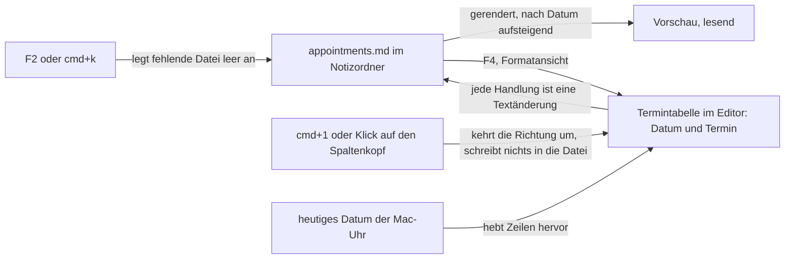

# Spec: Der Heimordner bekommt appointments.md als Termindatei

**Date:** 2026-09-26
**Status:** Draft
**Source:** Arbeitspaket `260926-2240-termine-als-weitere-datei-im-heimordner.md`, Abschnitt `## Directive`, wörtlich: „der home bereich bekommt eine weitere datei: appointments.md, gleicher aufbau und bedienung wie notizen, aber spalte links ist YYMMDD + optional HH:MM." Sortierung nach Datumsspalte (CMD+1 toggelt Richtung). Zeile mit aktuellem Tag wird hervorgehoben.
**Mode:** autonom. Der Nutzer hat für dieses Arbeitspaket keine Rückfragen gewünscht. Jede Frage, die die Directive offenlässt, ist unten als **Annahme** mit der verworfenen Alternative festgehalten (`## Annahmen`); keine davon berührt Datenverlust oder den Schutz von `secrets.txt`.
**Baut auf:** `260926-0007_*_spec-f2-oeffnet-krkhome-mit-notizen-aufgaben-geheimnissen.md` (C1 bis C7) und `260926-1451_*_spec-home-menue-und-einstellbarer-ort.md` (H1 bis H3), beide geschlossen. Was dort für `notes.txt` gilt, gilt für `appointments.md`, soweit dieser Spec es nicht ausdrücklich ändert. Kennungen dieses Spec tragen den Vorsatz **T**.
**Grundlage erhoben:** 260926-2253 am Baum (`krk-core/src/heimordner/mod.rs`, `heimordner/eintraege.rs`, `heimordner/bereitstellen.rs`, `krk-core/src/tasten/belegung.rs`, `krk-ui/src/kommandos/zulaessigkeit.rs`, `resources/default-keymap.toml`) und an der eigenen Belegung dieses Geräts (`~/Library/Application Support/KRK/keymap.toml`).

---

## Directive

Nach dieser Arbeit führt der Notizordner neben `notes.txt`, `tasks.txt` und `secrets.txt` eine vierte Eintragsdatei, `appointments.md`. Sie ist aufgebaut und bedient wie `notes.txt`, nur trägt die linke Spalte statt eines Themas ein Datum `YYMMDD` mit optionaler Uhrzeit `HH:MM`. Die Termintabelle ist nach dieser Spalte sortiert, `cmd+1` kehrt die Richtung um, und jede Zeile des heutigen Tages ist hervorgehoben.

---

## Ausgangslage, am 260926-2253 am Baum erhoben

- **`notes.txt` ist die Vorlage.** Eine Notiz beginnt mit einer Zeile `## <Thema>`, ihr Text reicht bis zur nächsten solchen Zeile, ein Vorspann vor der ersten bleibt oben stehen, und Lesen und Zurückschreiben ohne Änderung ergeben dieselben Bytes (`heimordner/eintraege.rs`, Modulkopf). Der Editor zeigt die Datei in der Formatansicht als Tabelle aus Thema und Notiz; jede Handlung ist eine Textänderung am Stand des Editors, mit Sichern, Rückfrage und einem einzigen Rückgängigstapel.
- **Die Eintragsdateien sind eine vollständige Aufzählung.** `Sonderdatei` (`heimordner/mod.rs`) führt drei Werte ohne Auffangzweig, `Sonderdatei::ALLE` hat die Länge drei. Ein vierter Wert hält den Bau an jeder Stelle an, die nach der Sorte fragt, und die Probe `jede_alle_liste_fuehrt_genau_die_varianten_ihrer_aufzaehlung` hält die Liste.
- **`cmd+1` ist belegt.** In der Auslieferungsbelegung und in der eigenen Belegung dieses Geräts liegt `cmd+1` auf „Nach Name sortieren“ (`sortierung_name`, Wirkungsbereich Dateifenster). **Die Konfliktregel der Belegung kennt keine Wirkungsbereiche**: zwei Funktionen mit demselben Zusteller dürfen dieselbe Kombination nicht tragen (`Belegung::konflikte`, `tasten/belegung.rs`), gleich wo sie wirken. Die einzigen doppelten Kombinationen heute, `cmd+a` und `cmd+f`, sind nur deshalb zulässig, weil je eine Seite vom Menü zugestellt wird.
- **Eine neue Funktion tritt in einer eigenen Belegung unbelegt hinzu.** Der Nutzer hat eine eigene `keymap.toml`; eine neue Funktion mit `cmd+1` in der Auslieferung käme dort ohne Taste an, und die Startmeldung der Runde 24 nennt sie.
- **Der Notizordner liegt auf diesem Gerät nicht unter `~/krkhome`**, sondern an dem Ort, den `settings.toml` unter `notizordner` nennt (H2, H3). Jede Regel dieses Spec gilt am eingestellten Ort.



---

## Capabilities

Wie in den zwei Specs, auf denen dieser aufbaut, stehen die Abnahmekriterien in zwei Listen: am Baum nachweisbar, und nur am laufenden Bündel prüfbar (Nutzerarbeit, `CLAUDE.md`, „Der Abnahmelauf verlangt KRK im Vordergrund“).

**Vor der Nutzerabnahme von T5 steht ein Handgriff, und er ist nicht `cmd+r`.** Die neue Funktion kommt in der eigenen Belegung ohne Taste an. Der Nutzer öffnet F1, legt `cmd+1` auf „Termine: Sortierrichtung umkehren“ und verlässt die Ansicht; „Nach Name sortieren“ behält dabei `cmd+1`. `cmd+r` in der Belegungsansicht setzt die ganze eigene Belegung zurück und ist hier ausdrücklich nicht gemeint.

### T1: appointments.md entsteht bei F2 und gehört zu den Eintragsdateien

**Description:** F2 legt `appointments.md` im Notizordner an, wenn sie fehlt, leer mit null Bytes, exklusiv geöffnet und nie über eine vorhandene Datei, genau wie `notes.txt` und `tasks.txt`. Beim Start legt KRK sie nicht an. Die Datei gilt allein im erkannten Notizordner als Termindatei; eine gleichnamige Datei anderswo ist eine gewöhnliche Markdown-Datei wie bisher. Die Übernahme der alten Zettel betrifft sie nicht.

**Acceptance criteria, am Baum nachweisbar:**
- [ ] Die Aufzählung der Eintragsdateien führt `appointments.md` als vierten Wert, und ihre Liste aller Werte hat die Länge vier; die Vollständigkeitsprobe der `ALLE`-Listen bleibt grün.
- [ ] Das Anlegen öffnet `appointments.md` exklusiv. Eine Probe legt die Datei nach der Prüfung und vor dem Anlegen selbst an und findet sie danach Byte für Byte unverändert.
- [ ] Eine vorhandene `appointments.md` bleibt beim Anlegen Byte für Byte unverändert; eine fehlende entsteht mit null Bytes.
- [ ] Beim Start entsteht keine `appointments.md`, auch nicht, wenn die Sitzung einen Tab auf den Notizordner wiederherstellt.
- [ ] Die Erkennung „das ist die Termindatei“ fragt dieselbe eine Stelle wie die Erkennung der übrigen Eintragsdateien und greift nicht auf das Dateisystem zu; eine `appointments.md` in einem anderen Ordner wird nicht erkannt.
- [ ] Die Erkennung von `secrets.txt` antwortet für jeden Pfad wie vor dieser Arbeit; eine Probe fragt `secrets.txt`, `appointments.md` und `Appointments.MD` im Notizordner und bekommt für die erste „Geheimnisse“ und für keine der anderen.
- [ ] Die Übernahme der alten Zettel schreibt nichts nach `appointments.md`.

**Acceptance criteria, nur am laufenden Bündel prüfbar (Nutzerarbeit):**
- [ ] Mit dem eingestellten Notizordner F2 drücken: `appointments.md` steht in der Liste, leer.
- [ ] `appointments.md` im Finder löschen, F2: sie steht wieder da, leer; `notes.txt`, `tasks.txt` und `secrets.txt` sind unverändert.
- [ ] Eine Datei `appointments.md` in einem anderen Ordner auswählen: die Vorschau zeigt sie wie jede Markdown-Datei, ohne Termindarstellung.

**Decisions made:**
- Der Dateiname ist `appointments.md` mit der Endung `.md`, wie die Directive sagt, obwohl die Schwesterdateien `.txt` tragen (Directive).
- Entstehen, Nicht-Überschreiben und Nicht-beim-Start folgen C2 des ersten Spec (Vorgabe: dieselbe Regel für jede Eintragsdatei).

### T2: Das Dateiformat

**Description:** Ein Termin steht in der Datei wie eine Notiz: eine Kopfzeile, darunter der Text über beliebig viele Zeilen bis zur nächsten Kopfzeile. Die Kopfzeile trägt statt eines Themas das Datum, mit oder ohne Uhrzeit:

```text
# Termine

## 261002
Steuererklärung abgeben

## 261002 09:30
Zahnarzt
Dr. Beispiel, Hauptstraße 3

## 260927 14:00
Anruf Werkstatt
```

- **Kopfzeile:** `## ` gefolgt von genau sechs Ziffern `YYMMDD`, optional gefolgt von genau einem Leerzeichen und `HH:MM` mit zwei Ziffern je Teil. Sonst steht nichts auf der Zeile.
- **Gültiges Datum:** `YY` von `00` bis `99` bedeutet die Jahre 2000 bis 2099; `MM` von `01` bis `12`; `DD` vom `01` bis zum letzten Tag dieses Monats in diesem Jahr, Schaltjahre eingeschlossen (`280229` ist gültig, `260229` nicht). **Gültige Uhrzeit:** `HH` von `00` bis `23`, `MM` von `00` bis `59`.
- **Eine Kopfzeile mit ungültigem Datum** ist trotzdem eine Kopfzeile, wenn sie mit `## ` beginnt: sie eröffnet einen Termin, dessen Datumsspalte den Text nach `## ` unverändert zeigt. Nichts geht verloren, und der Nutzer kann das Datum in der Tabelle berichtigen.
- **Vorspann, Leerzeilen als Trenner, Zeilen mit `#` und `###` im Text** und die Regel „Lesen und Zurückschreiben ohne Änderung ergeben dieselben Bytes“ gelten wie in `notes.txt`. Eine Handlung schreibt allein die Zeilen neu, die sie berührt.

**Acceptance criteria, am Baum nachweisbar:**
- [ ] Die Form ist an einer Stelle beschrieben, neben der von `notes.txt` und `tasks.txt`; Lesen und Schreiben einer unveränderten Datei ergeben dieselben Bytes, auch mit Vorspann, ohne Schlussumbruch und mit Kopfzeilen, deren Datum ungültig ist.
- [ ] Die Gültigkeitsprüfung nimmt `261002`, `261002 09:30`, `280229`, `991231 23:59` und `000101 00:00` an und weist `260229`, `261301`, `261000`, `261032`, `26102`, `2610022`, `261002 24:00`, `261002 9:30`, `261002 09:60`, `261002  09:30` und `261002 09:30 Zahnarzt` ab. Jede Antwort ist eine eigene Probe oder ein eigener Fall einer Probe.
- [ ] Eine Zeile `## <Text>` mit ungültigem Datum ergibt beim Lesen einen Termin, dessen Datumsspalte den Text nach `## ` trägt.

**Acceptance criteria, nur am laufenden Bündel prüfbar (Nutzerarbeit):**
- [ ] `appointments.md` mit F4 öffnen, in der Rohansicht zwei Termine in der Form oben von Hand schreiben, sichern: die Datei lässt sich in TextEdit lesen, und die Formatansicht zeigt beide Termine.

**Decisions made:**
- Die Kopfzeile ist `## YYMMDD` oder `## YYMMDD HH:MM`, also die Themenzeile der Notizen mit dem Datum an Stelle des Themas (Annahme A1).
- Eine ungültige Kopfzeile bleibt ein Termin mit rohem Datumstext (Annahme A2).

### T3: Die Termintabelle im Editor

**Description:** Öffnet der Nutzer `appointments.md` aus dem Notizordner im Editor, zeigt die Formatansicht die Termine als Tabelle mit den Spalten „Datum“ und „Termin“. Er kann einen Termin hinzufügen, Datum und Text ändern und einen Termin löschen, mit denselben Befehlen und Tasten wie in der Notiztabelle. Die Zelle „Termin“ bedient sich wie die Notizzelle: sie trägt mehrere Zeilen, `return` schreibt einen Zeilenumbruch, `cmd+return` oder ein Klick daneben übernimmt, `esc` übernimmt eine geänderte Zelle mit Meldung, und eine Zeile mit `## ` im Text wird abgewiesen. Die Zelle „Datum“ bedient sich wie die Aufgabenzelle: sie ist einzeilig, `return` und `cmd+return` übernehmen, `esc` verwirft die Änderung. Ein ungültiges Datum übernimmt sie nicht. Sichern, die Rückfrage vor dem Verwerfen, Rückgängig, die Rohansicht und das Wirken von F2 und KRKs Befehlen beim Tippen gelten wie für `notes.txt`. Die Befehle „Eintrag nach oben“ und „Eintrag nach unten“ sind in der Termintabelle nicht zulässig, weil die Reihenfolge der Anzeige das Datum bestimmt.

**Acceptance criteria, am Baum nachweisbar:**
- [ ] Hinzufügen, Datum ändern, Text ändern und Löschen sind ohne Fenster am Modell prüfbar und ergeben als Textänderung am Stand des Editors die erwartete Datei; ein Vorspann bleibt oben stehen.
- [ ] Hinzufügen hängt einen Termin am Ende der Datei an, mit dem heutigen Datum ohne Uhrzeit und leerem Text (`## YYMMDD` des Tages), und öffnet seine Datumszelle zur Bearbeitung.
- [ ] Eine Änderung der Datumszelle zu einem ungültigen Wert wird abgewiesen: der Stand des Editors bleibt, wie er war, die Zelle bleibt in Bearbeitung mit dem getippten Text, und die Statuszeile nennt die erwartete Form `YYMMDD` oder `YYMMDD HH:MM`. Leerzeichen am Anfang und am Ende der Eingabe werden vor der Prüfung entfernt.
- [ ] Eine Änderung, die eine Zeile mit `## ` in den Termintext brächte, wird abgewiesen wie in der Notiztabelle.
- [ ] Das Ändern eines Datums schreibt allein die Kopfzeile dieses Termins neu, das Ändern des Textes allein seine Textzeilen.
- [ ] Es gibt keinen zweiten Rückgängigstapel; jede Handlung nimmt `cmd+z` als eine zurück.
- [ ] Die Befehle der Eintragstabellen sind in der Termintabelle zulässig, bis auf „Eintrag nach oben“ und „Eintrag nach unten“, die dort im Hauptmenü ausgegraut sind und über die Taste nichts tun. „Aufgabe abhaken oder öffnen“ und „PIN ändern“ sind dort ebenfalls ausgegraut.
- [ ] Die Zellen „Datum“ und „Termin“ sind als KRKs eigene Textflächen erkannt, wie die Zellen der übrigen Eintragstabellen, und rufen das Abschalten der Textautomatiken.
- [ ] `esc` in der Datumszelle verwirft die Änderung, `esc` in einer geänderten Terminzelle übernimmt sie mit Statusmeldung, und keines von beiden leert einen Filtertext.
- [ ] In jeder anderen Datei, auch in `appointments.md` außerhalb des Notizordners, zeigt der Editor keine Termintabelle.

**Acceptance criteria, nur am laufenden Bündel prüfbar (Nutzerarbeit):**
- [ ] `appointments.md` im Editor öffnen: die Termine stehen als Tabelle aus Datum und Termin.
- [ ] Mit `shift+cmd+return` einen Termin anlegen: die neue Zeile trägt das heutige Datum, die Datumszelle ist zur Bearbeitung offen.
- [ ] In die Datumszelle `261340` tippen und `return` drücken: die Statuszeile nennt die erwartete Form, die Zelle bleibt offen; `esc` stellt das vorige Datum wieder her.
- [ ] Einen Termin mit zweizeiligem Text anlegen, sichern, in der Rohansicht nachsehen: er steht als `## YYMMDD` oder `## YYMMDD HH:MM` mit dem Text darunter in der Datei.
- [ ] Einen Termin löschen, `cmd+z`: er steht wieder da.
- [ ] `opt+cmd+up` in der Termintabelle: nichts geschieht, der Menüeintrag „Eintrag nach oben“ ist ausgegraut.
- [ ] Mit ungesicherter Änderung den Editor schließen: die bestehende Rückfrage erscheint.
- [ ] Jede der vier Handlungen gelingt allein mit der Tastatur und ebenso mit der Maus.

**Decisions made:**
- Hinzufügen, Bearbeiten und Löschen sind dieselben Befehle wie in der Notiztabelle und keine zweiten (Vorgabe aus C5 des ersten Spec).
- Die Datumszelle folgt der Aufgabenzelle, die Terminzelle der Notizzelle; die Trennlinie ist wie in `260926-0115_*_was-tut-esc-in-einer-geaenderten-zelle-der-eintragstabellen.md`, ob die Zelle Zeilenumbrüche trägt.
- Verschieben fällt in der Termintabelle weg (Annahme A4).
- Ein neuer Termin trägt das heutige Datum (Annahme A5).
- Ein ungültiges Datum wird bei der Eingabe abgewiesen und nicht still berichtigt (Annahme A3).

### T4: Sortierung nach dem Datum

**Description:** Die Termintabelle zeigt die Termine nach Datum und Uhrzeit geordnet, ab Werk aufsteigend, also der früheste zuoberst. Innerhalb eines Tages steht ein Termin ohne Uhrzeit vor denen mit Uhrzeit. Termine mit gleichem Datum und gleicher Uhrzeit behalten ihre Reihenfolge aus der Datei. Termine mit ungültigem Datum stehen in beiden Richtungen am Ende. Die Sortierung ist eine Eigenschaft der Anzeige: sie ordnet die Datei nicht um, macht sie nicht geändert und legt nichts auf den Rückgängigstapel. Nach einer Änderung des Datums steht der Termin sofort an seiner neuen Stelle, und die Auswahl bleibt auf ihm. Der Kopf der Spalte „Datum“ zeigt die Richtung mit einem Pfeil.

**Acceptance criteria, am Baum nachweisbar:**
- [ ] Die Ordnung ist ohne Fenster am Modell prüfbar. Eine Probe mit den Kopfzeilen `261002 09:30`, `260927 14:00`, `261002`, `xyz`, `261002 09:30` (zweites Vorkommen) liefert aufsteigend `260927 14:00`, `261002`, `261002 09:30`, `261002 09:30` (in Dateireihenfolge), `xyz`, und absteigend `261002 09:30`, `261002 09:30` (in Dateireihenfolge), `261002`, `260927 14:00`, `xyz`.
- [ ] Umkehren der Richtung ändert den Stand des Editors nicht: die Datei gilt danach nicht als geändert, und die Bytes sind dieselben.
- [ ] Die Rohansicht und die gesicherte Datei zeigen die Termine in der Reihenfolge der Datei, nicht in der Reihenfolge der Tabelle.

**Acceptance criteria, nur am laufenden Bündel prüfbar (Nutzerarbeit):**
- [ ] Drei Termine an drei verschiedenen Tagen in beliebiger Reihenfolge anlegen: die Tabelle zeigt sie aufsteigend nach Datum.
- [ ] Das Datum des obersten Termins auf einen späteren Tag ändern: er rückt an seine neue Stelle und bleibt ausgewählt.
- [ ] Ein Klick auf den Kopf der Spalte „Datum“ kehrt die Richtung um, der Pfeil im Kopf zeigt sie.

**Decisions made:**
- Ab Werk aufsteigend (Annahme A6).
- Die Sortierung ordnet allein die Anzeige, nicht die Datei (Annahme A4).
- Ein Termin ohne Uhrzeit steht vor denen mit Uhrzeit am selben Tag (Annahme A7).
- Ein Klick auf den Spaltenkopf kehrt die Richtung ebenfalls um (Annahme A9, nach der Maxime „Tastatur bei zusätzlicher Maus-Unterstützung“).

### T5: `cmd+1` kehrt die Richtung um

**Description:** Mit dem Fokus im Editor und der Termintabelle in der Formatansicht kehrt `cmd+1` die Sortierrichtung um. Der Befehl heißt „Termine: Sortierrichtung umkehren“, steht im Menü „Home“ und ist überall sonst ausgegraut. „Nach Name sortieren“ behält `cmd+1` und wirkt im Dateifenster wie bisher. Beide Funktionen tragen `cmd+1` in der Auslieferungsbelegung, und die Belegung lädt ohne Konflikt. Die gewählte Richtung gilt für die Termintabelle und bleibt über einen Neustart von KRK erhalten.

**Acceptance criteria, am Baum nachweisbar:**
- [ ] `resources/default-keymap.toml` führt eine neue Funktion „Termine: Sortierrichtung umkehren“ mit `cmd+1`; `sortierung_name` behält `cmd+1`, und keine andere Funktion verliert eine Kombination.
- [ ] Die Auslieferungsbelegung baut ohne Konflikt, und die Probe über doppelte Kombinationen der Auslieferung bleibt grün.
- [ ] Zwei Funktionen dürfen dieselbe Kombination genau dann tragen, wenn nie beide zugleich zulässig sein können. Eine Probe hält fest, dass `cmd+1` auf „Nach Name sortieren“ und auf „Termine: Sortierrichtung umkehren“ zusammen zulässig ist, und dass zwei Funktionen, deren Zulässigkeit sich überschneidet, weiter als Konflikt gemeldet werden, etwa `cmd+1` auf „Nach Name sortieren“ und „Nach Größe sortieren“.
- [ ] Eine Nutzerbelegung, in der `cmd+1` auf beiden Funktionen steht, lädt ohne Meldung; eine Nutzerbelegung, die die neue Funktion nicht nennt, lädt ebenfalls und führt sie unbelegt.
- [ ] Der neue Befehl steht im Funktionsbereich „Home“ und hat einen eigenen Ausführungszweig; er endet nicht im Auffangzweig des Anwendungsdelegierten.
- [ ] Der Befehl ist allein zulässig, wenn der Fokus im Editor steht und der Editor die Termintabelle zeigt; in jedem anderen Fall ist er im Hauptmenü ausgegraut, und `cmd+1` erreicht „Nach Name sortieren“ genau in den Lagen, in denen es vor dieser Arbeit zulässig war.
- [ ] Die Richtung der Termintabelle steht in der Sitzung. Eine `session.toml` ohne diese Angabe lädt mit „aufsteigend“, und keine andere Angabe der Sitzung geht dabei verloren.

**Acceptance criteria, nur am laufenden Bündel prüfbar (Nutzerarbeit):** (vorher F1, `cmd+1` auf „Termine: Sortierrichtung umkehren“ legen, Ansicht verlassen)
- [ ] In der Belegungsansicht erscheint beim Belegen keine Konfliktmeldung, und „Nach Name sortieren“ trägt danach weiter `cmd+1`.
- [ ] In der Termintabelle `cmd+1`: die Reihenfolge kehrt sich um, der Pfeil im Spaltenkopf wechselt. Ein zweites `cmd+1` stellt die vorige Richtung wieder her.
- [ ] Mit dem Fokus im Dateifenster `cmd+1`: die Dateiliste sortiert nach Name wie bisher, die Termintabelle ändert sich nicht.
- [ ] Das Menü „Home“ zeigt „Termine: Sortierrichtung umkehren“ mit `cmd+1`; mit dem Fokus im Dateifenster ist der Eintrag ausgegraut.
- [ ] Richtung auf absteigend stellen, KRK beenden und neu starten, `appointments.md` öffnen: die Tabelle steht absteigend.

**Decisions made:**
- `cmd+1` bleibt zugleich auf „Nach Name sortieren“; die Konfliktregel der Belegung lässt eine Kombination auf zwei Funktionen zu, die nie zugleich zulässig sein können (Annahme A8). Das ist die kleinste Änderung, unter der der Wortlaut der Directive und die unveränderte Dateifenster-Belegung zugleich halten.
- Die Richtung überlebt einen Neustart, wie die Sortierung der Tabs im Dateifenster (Annahme A10).
- Der Befehl steht im Menü „Home“, weil dort nach H1 alle Befehle rund um den Notizordner stehen.

### T6: Der heutige Tag ist hervorgehoben

**Description:** Jede Zeile der Termintabelle, deren Datum der heutige Tag ist, trägt eine Hintergrundfärbung über die ganze Zeile, mit oder ohne Uhrzeit. „Heute“ ist das Datum der Mac-Uhr in der Zeitzone, die der Mac eingestellt hat. Die Färbung passt sich dem hellen und dem dunklen Erscheinungsbild an, bleibt von der Auswahlfarbe unterscheidbar und lässt den Text in beiden lesbar. Eine ausgewählte Zeile des heutigen Tages zeigt die Auswahl; sobald die Auswahl weiterwandert, trägt sie wieder die Färbung. Die Hervorhebung wird neu bestimmt, wann immer die Tabelle neu gezeichnet wird: beim Öffnen, bei jeder Handlung, beim Umkehren der Richtung und wenn das Fenster wieder in den Vordergrund kommt.

**Acceptance criteria, am Baum nachweisbar:**
- [ ] Die Frage „ist dieser Termin heute“ ist ohne Fenster prüfbar und nimmt das heutige Datum als Eingabe entgegen, statt selbst die Uhr zu lesen; eine Probe fragt mit einem festen Tag und bekommt für `YYMMDD` dieses Tages mit und ohne Uhrzeit ja, für den Vortag, den Folgetag und ein ungültiges Datum nein.
- [ ] Die Uhr wird an genau einer Stelle gelesen, in der Ortszeit des Macs.
- [ ] Die Färbung ist keine feste Farbe, sondern eine, die das System je nach Erscheinungsbild liefert, und sie unterscheidet sich von der Auswahlfarbe der Tabelle.

**Acceptance criteria, nur am laufenden Bündel prüfbar (Nutzerarbeit):**
- [ ] Zwei Termine für heute (einer ohne, einer mit Uhrzeit) und einer für morgen: genau die zwei heutigen Zeilen sind gefärbt.
- [ ] Im hellen und im dunklen Erscheinungsbild ist die Färbung zu sehen und der Text darin lesbar.
- [ ] Eine heutige Zeile auswählen: die Auswahl ist als Auswahl zu erkennen; die Auswahl weiterbewegen: die Färbung ist wieder da.

**Decisions made:**
- Ganze Zeile, Hintergrund, systemseitige Farbe (Annahme A11).
- Neu bestimmt bei jedem Neuzeichnen und beim Wechsel in den Vordergrund, nicht über einen Zeitgeber um Mitternacht (Annahme A12).

### T7: Die Vorschau zeigt die Termine gerendert

**Description:** Wählt der Nutzer `appointments.md` im Notizordner, zeigt die Vorschau die Termine wie die Notizen: je Termin das Datum hervorgehoben, der Text darunter. Die Vorschau ordnet sie aufsteigend nach der Regel aus T4, unabhängig von der Richtung, die in der Termintabelle gilt, und schreibt die Datei nie. Eine Markdown-Datei anderswo erscheint wie bisher.

**Acceptance criteria, am Baum nachweisbar:**
- [ ] Die Termindarstellung gilt für `appointments.md` im erkannten Notizordner und für keine andere Datei.
- [ ] Die Vorschau schreibt die Datei nicht.
- [ ] Ein Vorspann und eine Kopfzeile mit ungültigem Datum erscheinen als gewöhnlicher Text, nicht als Fehler; der Termin mit ungültigem Datum steht am Ende.

**Acceptance criteria, nur am laufenden Bündel prüfbar (Nutzerarbeit):**
- [ ] `appointments.md` auswählen: jedes Datum ist als Überschrift zu erkennen, die Termine stehen aufsteigend, der Text darunter.
- [ ] Die Darstellung ist in hellem und dunklem Erscheinungsbild lesbar.

**Decisions made:**
- Die Vorschau ordnet fest aufsteigend und hebt den heutigen Tag nicht hervor (Annahme A13).

### T8: Was sich sonst ändert und was bleibt

**Description:** `HowTo.md` und `README.md` beschreiben `appointments.md` neben den drei anderen Dateien, einschließlich Form, Tasten und `cmd+1`. Der Inhaltsfilter liest `appointments.md` wie jede andere Datei. Alles, was die zwei vorigen Specs für `notes.txt`, `tasks.txt` und `secrets.txt` festlegen, gilt unverändert.

**Acceptance criteria, am Baum nachweisbar:**
- [ ] `HowTo.md` nennt `appointments.md`, die Kopfzeilenform, die Sortierung, `cmd+1` und die Hervorhebung.
- [ ] Die Ausnahme „ohne Inhaltsauftrag“ gilt weiter allein für `secrets.txt`; ein Filtertext, der in `appointments.md` steht, findet die Datei bei eingeschaltetem „Content“.
- [ ] Jede nutzersichtbare Zeichenkette dieser Arbeit trägt Umlaute, jeder Kommentar und jeder Bezeichner die Umschrift.
- [ ] Die bestehenden Proben zu `notes.txt`, `tasks.txt` und `secrets.txt` bleiben grün, ohne dass ihr erwarteter Wert geändert wurde.

**Acceptance criteria, nur am laufenden Bündel prüfbar (Nutzerarbeit):**
- [ ] `notes.txt`, `tasks.txt` und `secrets.txt` öffnen und je eine Handlung ausführen: alles verhält sich wie vor dieser Arbeit.

---

## Annahmen

Der Nutzer hat für dieses Arbeitspaket den autonomen Lauf angeordnet. Die folgenden Punkte hat der Designer entschieden, jeweils so, wie es der Bedienung der Notizen am nächsten liegt. Jede Annahme ist ohne Datenverlust umkehrbar.

| | Annahme | Verworfen | Grund |
|---|---|---|---|
| A1 | Kopfzeile `## YYMMDD` oder `## YYMMDD HH:MM`, Text darunter | Datum und Text in einer Zeile (`- 261002 09:30 Zahnarzt`) | „gleicher Aufbau wie Notizen“: dieselbe Zerlegung, mehrzeiliger Text bleibt möglich |
| A2 | Eine `## `-Zeile mit ungültigem Datum ist ein Termin mit rohem Datumstext, am Ende sortiert | sie als fremde Zeile dem Termin darüber zuschlagen | eine von Hand vertippte Kopfzeile bliebe sonst unsichtbar im Text des Vorgängers und rutschte beim nächsten Umordnen mit |
| A3 | Ungültige Eingabe in der Datumszelle wird abgewiesen, die Zelle bleibt offen | still berichtigen oder den Rohtext übernehmen | dasselbe Muster wie die Abweisung von `## ` im Notiztext; der Nutzer sieht den Fehler, bevor er in der Datei steht |
| A4 | Sortierung nur der Anzeige, Dateireihenfolge unberührt; Verschieben in der Termintabelle nicht zulässig | beim Umkehren die Datei umschreiben | nach der Regel „eine Handlung schreibt allein die Zeilen neu, die sie berührt“; ein Umkehren machte sonst die Datei geändert und belegte den Rückgängigstapel |
| A5 | Ein neuer Termin trägt das heutige Datum ohne Uhrzeit | leeres Datum | ein leerer Termin wäre sofort ungültig und stünde am Ende statt dort, wo der Nutzer weiterschreibt |
| A6 | Ab Werk aufsteigend, frühester zuoberst | absteigend | die Richtung eines Kalenders |
| A7 | Ohne Uhrzeit vor mit Uhrzeit am selben Tag | ohne Uhrzeit ans Ende des Tages | ein ganztägiger Termin gilt vom Beginn des Tages an |
| A8 | `cmd+1` auf zwei Funktionen, die nie zugleich zulässig sind; Konfliktregel entsprechend erweitert | neue Taste für die Termine, oder `sortierung_name` mit Zweitbedeutung | die Directive nennt `cmd+1`, die Dateifenster-Belegung soll unverändert bleiben, und eine Zweitbedeutung stünde im falschen Menü |
| A9 | Klick auf den Spaltenkopf kehrt die Richtung ebenfalls um | allein die Taste | Maxime „Tastatur bei zusätzlicher Maus-Unterstützung“ |
| A10 | Die Richtung steht in der Sitzung und überlebt einen Neustart | bei jedem Öffnen aufsteigend | wie die Sortierung der Tabs im Dateifenster; eine bewusst gewählte Richtung soll nicht verfallen |
| A11 | Hervorhebung als Hintergrund der ganzen Zeile, Farbe vom System je Erscheinungsbild | fettes Datum, feste Farbe | „Zeile wird hervorgehoben“; eine feste Farbe trüge nicht in beiden Erscheinungsbildern |
| A12 | „Heute“ nach Mac-Uhr und Ortszeit, neu bestimmt bei jedem Neuzeichnen und Wechsel in den Vordergrund | Zeitgeber um Mitternacht | eine Tabelle, die über Mitternacht unberührt offen steht, ist der seltene Fall; ein Zeitgeber wäre eigene Maschinerie für ihn |
| A13 | Die Vorschau ordnet fest aufsteigend, ohne Hervorhebung | Richtung und Hervorhebung auch in der Vorschau | die Directive nennt beides für die Tabelle; die Vorschau bleibt eine lesende Darstellung wie in C4 |
| A14 | `YY` bedeutet 2000 bis 2099 | ein gleitendes Jahrhundertfenster | eindeutig und prüfbar; Termine vor 2000 sind nicht der Gegenstand |

---

## Stops when

- Wenn sich beim Planen zeigt, dass die Erweiterung der Konfliktregel (A8) einen bestehenden Konflikt der Auslieferung oder der eigenen Belegung dieses Geräts nicht mehr meldet, der vorher gemeldet wurde, stoppt die Arbeit an T5 und geht mit dem Befund an den Nutzer zurück.
- Wenn der vierte Wert der Eintragsdateien an einer Stelle, die nach `secrets.txt` fragt, eine andere Antwort als vorher erzeugt, stoppt die Arbeit, bevor ein Schritt ausgeliefert wird.

## Constraints

- `appointments.md` wird nie über eine vorhandene Datei geschrieben, und beim Start entsteht sie nicht (C2 des ersten Spec).
- Der Schutz von `secrets.txt` bleibt unverändert: die Erkennung, die PIN-Sperre in `Editormodell::oeffnen`, der Chiffratweg und die Fragen an `haelt_geheimnisse`.
- Der Stand der Termintabelle ist der Text des Editors; es gibt keinen zweiten Rückgängigstapel und keinen zweiten Schreibweg.
- Jede neue Taste bleibt in der Belegungsansicht änderbar; keine bestehende Funktion verliert eine Kombination.
- Kein Pfad der Zeitzusagen L1 bis L10 wird berührt; die Erkennung der Eintragsdateien bleibt ohne Systemaufruf.
- Nutzersichtbare Zeichenketten tragen Umlaute, Kommentare und Bezeichner die Umschrift.
- Keine neue fremde Kiste, die C-Code oder ein Paket mit einem Namen auf `-sys` in den Baum bringt.

## Out of Scope

- Erinnerungen, Benachrichtigungen, Wiederholungen, Dauer oder Ende eines Termins.
- Ein Kalender- oder Monatsblick und jeder Abgleich mit dem Kalender von macOS.
- Eine Hervorhebung vergangener oder künftiger Termine über den heutigen Tag hinaus.
- Andere Datumsformen als `YYMMDD` und `HH:MM`, etwa `TT.MM.JJJJ` oder ein Datumswähler.
- Eine Termindatei, die verschlüsselt wird wie `secrets.txt`.
- Die Umbenennung von `notes.txt` oder `tasks.txt` auf `.md`.
- Sortierung der Notiz-, Aufgaben- oder Geheimnistabelle.

## Open for Planner

- Wie die Termindatei ihre Form mit `notes.txt` teilt: ein eigener Leser neben dem der Notizen oder derselbe Leser mit einer anderen Kopfzeilenregel. Die Vorgabe ist Wiederverwendung vor Neubau.
- Wie die Konfliktregel der Belegung „nie zugleich zulässig“ feststellt, und ob dafür ein eigener Wirkungsbereich für die Termintabelle entsteht oder die Form über `form_passt` gefragt wird. Die Beobachtung aus T5 muss halten, auch für eine Nutzerbelegung.
- Wie die Termintabelle „Eintrag nach oben/unten“ ausschließt, ohne die Zulässigkeit in der Notiz- und der Geheimnistabelle zu ändern.
- Welche Systemfarbe die Hervorhebung trägt und wie sie sich von der Auswahlfarbe abhebt.
- Unter welchem Schlüssel die Richtung in `session.toml` steht.
- Wie die Vorschau die Termine rendert: über den bestehenden Markdown-Weg mit einer Vorsortierung oder über die Darstellung der Notizen.

## User Decisions Pending

- [ ] Keine. Die Annahmen A1 bis A14 stehen zur Durchsicht bei der Abnahme offen; jede lässt sich in einem späteren Schritt ohne Datenverlust ändern.
