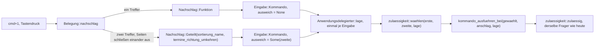
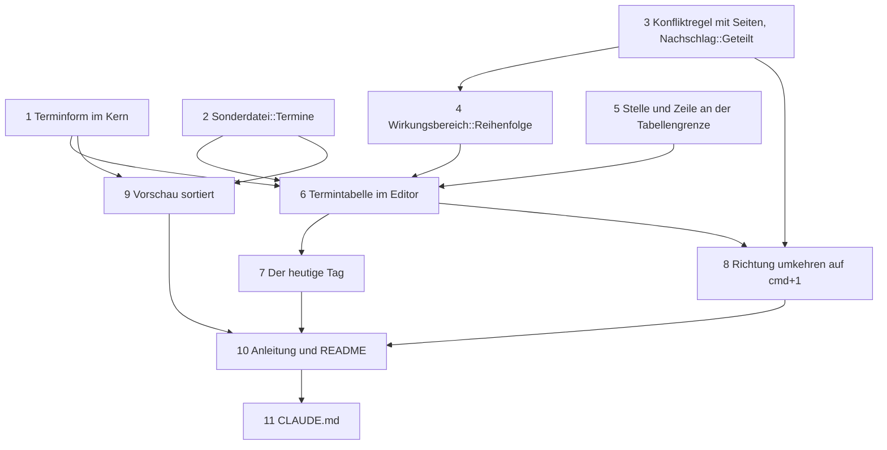

# Implementation Plan: `appointments.md` als Termindatei im Notizordner

**Date:** 2026-09-26
**Status:** Approved (Arbeitspaket mit `**Mode:** autonomous`; der Plan ist durch dieses Feld freigegeben und braucht keine weitere Eingabe des Nutzers)
**Spec:** `260926-2253_*_spec-termine-als-weitere-datei-im-heimordner.md` (T1 bis T8, Annahmen A1 bis A14); bindend dazu der Entscheid dieses Arbeitspakets `260926-2308_*_duerfen-zwei-funktionen-desselben-zustellers-eine-kombination-tragen-wenn-ihre-wirkungsbereiche-einander-ausschliessen.md` (Empfehlung: Möglichkeit 1). Gebaute Grundlage: `260926-0050_*_plan-f2-oeffnet-krkhome-mit-notizen-aufgaben-geheimnissen.md` und `260926-1506_*_plan-home-menue-und-einstellbarer-ort.md`, beide geschlossen, HEAD `cf458eb`.
**Decidability:** Drei Fragen tragen den Plan, und alle drei sind aus den Eingaben ihres Mechanismus entscheidbar. **Erstens „können zwei Funktionen, die dieselbe Kombination tragen, je zugleich zulässig sein?“**: entscheidbar zur Bauzeit der Belegung aus dem Wirkungsbereich je Kommando, einer festen Eigenschaft im Kern. Jeder Wirkungsbereich bekommt über eine vollständige Fallunterscheidung eine von drei Seiten (Editor, außerhalb des Editors, beide), und zwei Bereiche schließen einander genau dann aus, wenn einer auf der Editorseite und der andere außerhalb steht. Diese Einteilung ist disjunkt und vollständig, weil jeder Wert in genau einem Zweig steht. Dass sie mit der wirklichen Zulässigkeit übereinstimmt, hält eine Probe in `krk-ui` über alle Fokuswerte, alle Formen und alle Lagen der Zulässigkeitstafel. Die Regel ist gröber als die Tafel (zwei Bereiche derselben Seite gelten als überschneidend), und der Fehler fällt immer auf die Seite des gemeldeten Konflikts. **Zweitens „welche der zwei Funktionen meint dieser Anschlag?“**: entscheidbar aus der einen `Lage`, die der Anwendungsdelegierte je Eingabe ohnehin erhebt; nach der ersten Frage ist höchstens eine der beiden zulässig. **Drittens „ist dieser Termin heute?“**: entscheidbar aus dem Text der Kopfzeile und dem Datum der Mac-Uhr in Ortszeit, gelesen an genau einer Stelle über das vorhandene `verzeichnis::sys::ortszeit`. Nicht entscheidbar ist nichts, das der Plan braucht.

## Directive

Nach dieser Arbeit führt der Notizordner `appointments.md` als vierte Eintragsdatei. Sie ist aufgebaut und bedient wie `notes.txt`, die linke Spalte trägt `YYMMDD` mit optionaler Uhrzeit `HH:MM`, die Termintabelle ist nach dem Datum sortiert, `cmd+1` kehrt die Richtung um, und jede Zeile des heutigen Tages ist hervorgehoben. Der Spec beschreibt das Verhalten. Dieser Plan sagt, wie es in elf Schritten gebaut wird, und entscheidet die sechs Punkte, die der Spec unter `## Open for Planner` offenlässt (Abschnitt `## Entscheidungen des Plans`).

## Current State

**Die Form einer Notiz ist schon die Form eines Termins.** Eine Kopfzeile `## 261002 09:30` ist nach `ist_themenzeile` eine Themenzeile (`crates/krk-core/src/heimordner/eintraege.rs`). `Notizen::lesen` zerlegt eine `appointments.md` deshalb heute schon richtig in Vorspann und Blöcke, samt Byte-Treue, Trennern und Dateiende-Regel, und `notizen::hinzufuegen`, `notizen::aendern` und `notizen::loeschen` rechnen jede Handlung, die T3 verlangt. Was fehlt, ist allein, was eine Notiz nicht kennt: die Gültigkeit des Datums, die Ordnung nach dem Datum und die Frage nach dem heutigen Tag.

**Die Eintragsdateien sind eine vollständige Aufzählung.** `Sonderdatei` (`heimordner/mod.rs`) führt drei Werte, `Sonderdatei::ALLE` hat die Länge drei. `Heimordner::sonderdatei` findet die Sorte über `ALLE` und den Dateinamen und fragt erst dann den Ordner, ohne Systemaufruf; ein vierter Wert wird damit ohne weiteren Code erkannt. `bereitstellen` legt genau an, was `ALLE` führt, exklusiv über `create_new`, und die Rennprobe `eine_im_vorlauf_angelegte_datei_bleibt_unveraendert` (`heimordner/bereitstellen.rs`, Prüfmodul) läuft schon über `ALLE`. Der Start erreicht das Anlegen nicht; das hält `der_start_erreicht_weder_das_anlegen_noch_das_aufloesen` (`crates/krk-ui/src/appkit/anwendung.rs`). Fallunterscheidungen über `Sonderdatei` stehen in `heimordner/bereitstellen.rs`, `krk-ui/src/hervorhebung.rs` (`art`), `krk-ui/src/markdown.rs` (`Lesart::von_dateityp`), `krk-ui/src/appkit/editor.rs` (`editorform`, `oeffnungsweg`, `tabelle_nachziehen`) und in Proben.

**Die Konfliktregel kennt keine Wirkungsbereiche**, und der Nachschlag nimmt den ersten Treffer. `Belegung::konflikte` und `Belegung::zuweisen` (`crates/krk-core/src/tasten/belegung.rs`) melden zwei Funktionen mit gleicher Kombination und gleichem Zusteller; `Belegung::nachschlag` gibt die erste Funktion des Abgriffs zurück, deren Kombination passt. `cmd+1` liegt in der Auslieferung und in der eigenen Belegung dieses Geräts auf `sortierung_name`. **Am 260926-2300 nachgesehen:** die eigene `keymap.toml` führt 102 Funktionen, und ihre einzigen doppelten Kombinationen sind `cmd+a` und `cmd+f`, beide am Zusteller getrennt; beide Belegungen laden heute ohne Konflikt. Die erste Haltestelle des Spec tritt damit nicht ein (siehe `## Where this work stops`).

**Das Menü nimmt dem späteren von zwei gleichen Kürzeln das Zeichen.** Gemessen am 260813 und im Doc-Kommentar von `zugestellte_kuerzel` (`crates/krk-ui/src/menuemodell.rs`) festgehalten; die Probe `keine_zwei_eintraege_tragen_dieselbe_kombination` hält die Leiste frei von Doppelungen.

**Die Zulässigkeit fragt den Wirkungsbereich und die Form, nie das Kommando selbst.** `gestattet` (`crates/krk-ui/src/kommandos/zulaessigkeit.rs`) fragt `fokus::wirkt`, `form_passt` und `datei_passt`, alle drei vollständig über `Wirkungsbereich` und ohne Auffangzweig. Die fünf `Eintrag*`-Befehle tragen `Wirkungsbereich::Eintraege` und wirken in jeder Tabellenform. Eine Sonderbehandlung für ein einzelnes Kommando schließt der Doc-Kommentar von `zulaessig` aus.

**Die Tabelle zählt ihre Zeilen heute so, wie der Kern seine Blöcke zählt.** `Zelle::zeile` ist laut Doc-Kommentar „gezählt wie `Neustand::auswahl`“ (`crates/krk-ui/src/appkit/eintragsansicht.rs`), und `aufgabenzeilen` und `notizzeilen` erzeugen eine Zeile je Block in Dateireihenfolge. AppKits Zeilennummer und die Stelle im Stand sind deshalb bisher dieselbe Zahl. Eine sortierte Tabelle trennt die beiden, und an genau dieser Naht liegt das Risiko des Plans: eine Stelle, die die Zeilennummer als Stelle weiterreicht, löschte oder änderte den falschen Termin.

**Die Uhr liest der Kern schon**, über `verzeichnis::sys::ortszeit` (`localtime_r(3)`, Ortszeit mit dem Versatz des Zeitpunkts). Gerufen wird es heute von `operation/zippen.rs` und `leseprofil/bausteine.rs`.

**Die Sitzung ist offen für neue Felder.** `Sitzung` (`crates/krk-core/src/ablage/sitzung.rs`) trägt `#[serde(default)]` und bewusst kein `deny_unknown_fields`; ein Feld vor den drei Tabellen lädt aus einer älteren Datei mit seinem Vorgabewert. `verzeichnis::Richtung` (`Aufsteigend`, `Absteigend`, serialisiert klein geschrieben) gibt es schon.

**Der Hauptfenster-Melder hat zwei Empfänger** (`anwendung.rs`, Rumpf von `fenster.melder_setzen`): `aktives_dem_ersthelfer_nachziehen`, dann `fokusanzeige_nachziehen`. Er meldet jeden Wechsel des Ersthelfers und jeden Wechsel zwischen Vorder- und Hintergrund.

## Approach

**Wiederverwendung vor Neubau, an jeder der vier Stellen.** Der Termin ist eine Notiz, deren Thema ein Datum ist. Der Kern bekommt deshalb keinen zweiten Leser, sondern einen Abschnitt `termine` in `eintraege.rs` neben `aufgaben` und `notizen`. Er prüft das Datum, rechnet die Anzeigeordnung als Folge von Stellen, beantwortet „heute?“ und reicht jede Handlung an `notizen::` weiter. Die Tabelle ist dieselbe `Eintragsansicht` mit einer dritten Art. Die Vorschau ist der vorhandene Markdown-Weg über einen vorsortierten Text. Die Richtung steht in der Sitzung neben den übrigen Angaben.

**Die Stelle im Stand und die Zeile auf dem Schirm werden an einer Naht getrennt, und die liegt in der Tabelle.** Alles, was die `Eintragsansicht` nach außen gibt oder annimmt, spricht in Stellen des Standes: die gewählte Stelle, die Zelle, die Auswahl nach einem Umbau, der Beginn einer Bearbeitung. Allein innerhalb von `eintragsansicht.rs` gibt es AppKits Zeilennummern. Die Umrechnung steht an `Zeilen` und ist für Aufgaben und Notizen die Gleichheit. Der Editorbereich und der Kern bleiben dabei unverändert bei Stellen. Schritt 5 benennt dafür `Zelle::zeile` in `Zelle::stelle` um, und der Übersetzer zählt jede Stelle auf, die die Grenze überquert.

**Eine Kombination auf zwei Funktionen ist eine Regel und kein Sonderfall für `cmd+1`.** Der Entscheid `260926-2308_*_…` beschreibt sie: die Seite des Wirkungsbereichs im Kern, `Nachschlag::Geteilt` für den Abgriff, eine reine Wahlfunktion in `kommandos/zulaessigkeit.rs` auf der einen `Lage` der Eingabe, und im Menü behält der Eintrag, der in der Leiste früher steht, das Kürzel.

Die Wahl steht zwischen der Erhebung der Lage und der Ausführung und fragt dieselbe Lage; es entsteht weder eine zweite Erhebung noch ein dritter Frager der Regel (`beide_frager_rufen_die_eine_regel` zählt weiter zwei).

## Entscheidungen des Plans

Der Spec lässt sechs Punkte offen. Jeder ist hier entschieden, jeder ohne Datenverlust umkehrbar, und keiner berührt den Schutz von `secrets.txt`.

1. **Mechanismus der erweiterten Konfliktregel**: Möglichkeit 1 des Entscheids `260926-2308_*_…`, dort mit den verworfenen Möglichkeiten und ihrem Grund. Kurz: die Seite des Wirkungsbereichs im Kern, weil nur sie aus Eingaben entscheidet, die der Kern selbst hat. Die genaue Zulässigkeitstafel müsste aus `krk-ui` in den Kern gereicht werden, und eine benannte Ausnahme für `cmd+1` wäre die Sonderregel, die der Modulkopf von `tasten/belegung.rs` ausschließt.
2. **Eigener Wirkungsbereich für die Termintabelle: ja, und dazu ein zweiter für das Verschieben.** `Wirkungsbereich::Termine` trägt allein „Termine: Sortierrichtung umkehren“; `form_passt` sagt dafür allein in der Termintabelle ja. `Wirkungsbereich::Reihenfolge` trägt `EintragHoch` und `EintragRunter` und sagt in der Aufgaben-, Notiz- und Geheimnistabelle ja, in der Termintabelle nein. **Verworfen:** die Form über das Kommando zu fragen (eine Sonderbehandlung je Kommando, die `zulaessig` ausschließt) und die zwei Befehle in der Termintabelle zuzulassen und im Ausführungszweig nichts tun zu lassen (T3 verlangt, dass der Menüeintrag ausgegraut ist). **Der Preis:** die Probe `die_sechs_befehle_der_eintragstabelle_tragen_ihre_bereiche` ändert für zwei Kommandos ihren erwarteten Wert von `Eintraege` auf `Reihenfolge`. Die Zulässigkeit in der Aufgaben-, Notiz- und Geheimnistabelle bleibt dabei Feld für Feld gleich; das hält die Zulässigkeitstafel, deren Zeilen für diese drei Formen unverändert bleiben (Schritt 4).
3. **Wiederverwendung des Notizlesers: ja, vollständig.** Kein zweiter Leser und keine zweite Zerlegung; `termine` ist eine dünne Schicht über `Notizen` und `notizen::`. Die zwei Abweisungen, die für Termine anders lauten müssen, bekommen eigene Werte von `Abweisung` (`UngueltigesDatum`, `KopfzeileImTermintext`), weil „denn so beginnt die nächste Notiz“ in der Termintabelle falsch spräche.
4. **Farbe der Hervorhebung: `NSColor.systemYellowColor` mit dem Deckungsgrad 0,25, als Hintergrund der ganzen Zeilenansicht (`NSTableRowView`).** Die Systemfarbe liefert AppKit je Erscheinungsbild, und der geringe Deckungsgrad lässt den Text im hellen wie im dunklen Erscheinungsbild lesbar. Die Auswahl zeichnet `NSTableRowView` über den Hintergrund, eine gewählte Zeile zeigt also die Auswahl, und sobald die Auswahl weiterwandert, erscheint die Färbung wieder, ohne eigenen Code. **Verworfen:** `findHighlightColor`, weil sie für dunklen Text auf hellem Grund gemacht ist und im dunklen Erscheinungsbild den weißen Text schluckt; `unemphasizedSelectedContentBackgroundColor`, weil sie die Farbe der Auswahl einer Tabelle ohne Fokus ist und genau damit verwechselt würde; `controlAccentColor`, weil sie die Auswahlfarbe ist. Gelb steht hier für den Textmarker. Wer als Akzentfarbe Gelb eingestellt hat, sieht Auswahl und Färbung am Deckungsgrad und an der Schriftfarbe unterschieden; ob das genügt, ist Nutzerabnahme (T6).
5. **Schlüssel in `session.toml`: `terminrichtung`, Werte `"aufsteigend"` und `"absteigend"`**, als `Option<verzeichnis::Richtung>` mit `skip_serializing_if = "Option::is_none"` vor den drei Tabellen. Fehlt er, gilt aufsteigend. Dieselben zwei Wörter führt `session.toml` schon unter `sortierung` jedes Tabs; der Nutzer, der die Datei nach C7 der Runde 1 von Hand liest, deutet sie ohne Legende.
6. **Die Vorschau rendert über den vorhandenen Markdown-Weg mit einer Vorsortierung** und nicht über einen eigenen Renderer. `termine::in_anzeigeordnung` setzt die Blöcke des Standes aufsteigend hinter den Vorspann, mit derselben Dateiende-Regel wie das Verschieben, und `markdown::rendern` macht aus jeder Kopfzeile eine Überschrift, wie bei `notes.txt`. Die Vorschau schreibt dabei nichts, weil sie nur einen Text im Speicher umordnet.

Zwei weitere Festlegungen, die der Spec nicht nennt und die der Bau braucht:

7. **Welcher Menüeintrag `⌘1` zeigt:** der, der in der Leiste früher steht. „Home“ ist das zweite Obermenü, also zeigt „Termine: Sortierrichtung umkehren“ `⌘1`, und „Nach Name sortieren“ steht ohne Kürzel da und sortiert mit `cmd+1` im Dateifenster weiter. Das ist die Regel, die AppKit gemessenermaßen anwendet, als Rechnung im Modell ausgeschrieben, damit die Probe `keine_zwei_eintraege_tragen_dieselbe_kombination` grün bleibt. Der Preis ist derselbe, den `cmd+a` seit dem 260813 trägt, und die Anleitung nennt ihn (Schritt 10).
8. **Der Klick auf den Spaltenkopf „Datum“ geht denselben Weg wie die Taste**: über `kommando_ausfuehren(Kommando::TermineRichtungUmkehren, None)`, wie der Klick auf einen Schalter der Bereichsleiste. Vorher holt die Tabelle den Ersthelfer, damit der Fokus im Editor steht. Die Zulässigkeit hat damit einen Eingang und nicht zwei.

## Implementation Steps

**Wer ausführt.** Jeder Schritt gehört `code-implementer`. Die Belegungsdatei `resources/default-keymap.toml` ist Datenbestand, wird aber über `include_str!` einkompiliert, und ihre neue Zeile in Schritt 8 ist mit dem neuen Kommando untrennbar verbunden: `jede_variante_von_kommando_steht_genau_einmal_in_kennungen` und `jede_kennung_der_kommandos_steht_in_der_auslieferungsbelegung` verlangen beide Hälften zugleich, und eine Zeile mit `cmd+1` ohne Kommando bräche die Auslieferungsbelegung am Konflikt. Eine Zeile mit leerer Kombination ohne Kommando machte dagegen `ab_werk_traegt_genau_diese_liste_keine_kombination` rot, deren Liste in einer Probe steht. Ein Datenschritt vor dem Codeschritt endete also rot, und die Regel, dass jeder Schritt grün endet, geht vor. Das Projekt hat es zweimal ebenso gehalten (`d3a9983`, `95e36cd`). Die Kommentarzeilen der Belegung in Schritt 3 folgen demselben Schritt, weil ihre Aussage mit seinem Code falsch wird. Kein Schritt braucht `analyst`: die einzige Entscheidung von Reichweite ist als Datensatz abgelegt.

**Für jeden Schritt gilt**, ohne dass es dort wiederholt wird:
- `make check` endet grün (Bau, Proben, `clippy`, `fmt --check`, `cargo doc` mit `-D warnings`; `cargo` liegt unter `$HOME/.cargo/bin`).
- Nutzersichtbare Zeichenketten tragen Umlaute, Kommentare und Bezeichner die Umschrift (`CLAUDE.md`, „Sprache“).
- Jeder neue Rückgabewert, dessen stilles Fallenlassen unbemerkt bliebe, bekommt `#[must_use]`, und `let _ =` davor heißt „ich brauche den Wert nicht“.
- Jede neue Variante einer vollständigen Fallunterscheidung wird dort eingeordnet, wo der Übersetzer anhält; ein Auffangzweig entsteht nicht.
- Eine Probe zu `notes.txt`, `tasks.txt` oder `secrets.txt` ändert ihren erwarteten Wert allein dort, wo der Schritt es namentlich erlaubt; jede andere rote Probe dieser Art ist ein Stopp.
- Eine Zahl, die eine Prosastelle über eine gewachsene Aufzählung nennt, wird nicht hochgezählt, sondern fällt (`CLAUDE.md`, „Projektstand“).

Jede Kante ist eine Abhängigkeit, die der Schritt unter `Dependencies` nennt. 1, 2, 3 und 5 hängen an nichts und laufen in dieser Nummernfolge, weil jeder Schritt auf dem Stand des vorigen landet. Der riskanteste Schritt ist 6, weil dort die sortierte Tabelle zum ersten Mal Zeile und Stelle auseinanderlaufen lässt; Schritt 5 bereitet ihn als Umbau ohne Verhaltensänderung vor.

### Stufe A: der Kern

1. [DONE] **1 Die Terminform im Kern**
   - Executor: `code-implementer`
   - Files: `crates/krk-core/src/heimordner/eintraege.rs`, `crates/krk-core/tests/heimordner.rs` (oder das Prüfmodul von `eintraege.rs`, je nachdem, wo die Proben der Notizen heute stehen)
   - Changes:
     - **Modulkopf** von `eintraege.rs`: ein dritter Spiegelstrich „Ein Termin“ neben Notiz und Aufgabe. Er sagt: die Kopfzeile ist eine Themenzeile, deren Thema ein Datum ist; eine Kopfzeile mit ungültigem Datum ist trotzdem ein Termin (A2). Die Handlungen an `appointments.md` stehen in `termine` und rechnen über `notizen`. Die Form steht damit an einer Stelle neben der von `notes.txt` und `tasks.txt` (T2.1).
     - **`Termindatum`** mit `tag: Tag` und `zeit: Option<(u8, u8)>`, `Ord` abgeleitet, so dass ohne Uhrzeit vor mit Uhrzeit steht (A7). **`Tag`** mit `jahr` (2000 bis 2099, A14), `monat` und `tag`, dazu `Tag::aus_ortszeit(Ortszeit) -> Option<Tag>` und `Tag::kopftext() -> String` (`YYMMDD`). `pub fn termindatum(text: &str) -> Option<Termindatum>` nach T2: genau sechs Ziffern, optional genau ein Leerzeichen und `HH:MM` mit je zwei Ziffern, sonst nichts; Monatslängen samt Schaltjahr.
     - **`pub mod termine`**:
       - `hinzufuegen(stand, heute: Tag)` über `notizen::hinzufuegen(stand, &heute.kopftext(), "")`.
       - `aendern(stand, stelle, datum, text)`: die Datumseingabe wird an beiden Enden getrimmt. Weicht sie vom bisherigen Datumstext ab, muss sie `termindatum` bestehen, sonst `Abweisung::UngueltigesDatum`. Ein unverändert gelassenes ungültiges Datum wird also nicht geprüft. `ThemenzeileImNotiztext` wird zu `KopfzeileImTermintext` übersetzt, und dann rechnet `notizen::aendern`.
       - `loeschen(stand, stelle)` über `notizen::loeschen`.
       - `anzeigeordnung(stand, richtung: verzeichnis::Richtung) -> Vec<usize>`: stabil sortiert. Gültige Termine stehen nach `Termindatum`; in der absteigenden Richtung wird allein der Vergleich umgekehrt, gleiche Schlüssel behalten die Dateireihenfolge. Ungültige stehen in beiden Richtungen am Ende, in Dateireihenfolge.
       - `in_anzeigeordnung(stand) -> String`: aufsteigend, über `Zerlegung::in_reihenfolge`, also mit Vorspann oben und der Dateiende-Regel.
       - `ist_heute(datumstext, heute: Tag) -> bool`.
       - `heute() -> Option<Tag>`: **die eine Stelle, an der die Uhr für die Termine gelesen wird**, über `crate::verzeichnis::sys::ortszeit(SystemTime::now())`.
     - **`Abweisung`** bekommt `UngueltigesDatum` („Ein Datum steht als YYMMDD oder YYMMDD HH:MM, etwa 261002 oder 261002 09:30.“) und `KopfzeileImTermintext` („Eine Zeile im Termintext darf nicht mit „## “ beginnen, denn so beginnt der nächste Termin.“). Jede Fallunterscheidung über `Abweisung` außerhalb dieser Datei zieht der Übersetzer nach (heute allein `Editormeldung` in `krk-ui/src/appkit/editor.rs`, die `meldung()` ruft).
   - Probes (T2.1, T2.2, T2.3, T3.1 bis T3.5 in ihrer Kernhälfte, T4.1, T6.1, T6.2):
     - Byte-Treue für eine Termindatei mit Vorspann, ohne Schlussumbruch und mit einer ungültigen Kopfzeile.
     - Die Tafel aus T2.2, je Fall eine Zeile: 5 angenommen, 11 abgewiesen.
     - `## xyz` ergibt einen Termin mit dem Datumstext `xyz`.
     - Hinzufügen mit festem `Tag` hängt `## 260926` an, die Auswahl ist die neue Stelle, und ein Vorspann bleibt oben.
     - Datum ändern schreibt allein die Kopfzeile, Text ändern allein die Textzeilen.
     - Ein ungültiges Datum wird abgewiesen, auch mit Leerraum drumherum, und der Stand bleibt; ein Text mit `## `-Zeile wird abgewiesen.
     - Die Ordnungsprobe aus T4.1 wörtlich, aufsteigend und absteigend.
     - `ist_heute` für denselben Tag mit und ohne Uhrzeit, den Vortag, den Folgetag und ein ungültiges Datum.
     - Eine Quelltextprobe: im ganzen Baum unter `crates/` steht `SystemTime::now()` zusammen mit `ortszeit(` allein im Rumpf von `termine::heute`.
   - Invarianten, die der Schritt berührt: `#[must_use]` an jedem neuen `Neustand`- und `Vec`-Rückgabewert; Umlaut in den zwei Meldungen. Keine `ALLE`-Liste entsteht, also bleibt `jede_alle_liste_fuehrt_genau_die_varianten_ihrer_aufzaehlung` ohne Zutun grün. `ortszeit` bleibt die einzige Hülle um `localtime_r`, und der Schritt schreibt kein `unsafe`.
   - Acceptance: `make check` grün; die genannten Proben stehen im Baum und laufen.
   - Closes (am Baum): T2.1, T2.2, T2.3; die Kernhälften von T3.1 bis T3.5, T4.1, T6.1 und T6.2.
   - Dependencies: none

2. [DONE] **2 `appointments.md` wird die vierte Eintragsdatei**
   - Executor: `code-implementer`
   - Files: `crates/krk-core/src/heimordner/mod.rs`, `crates/krk-core/src/heimordner/bereitstellen.rs`, `crates/krk-core/tests/heimordner.rs`, `crates/krk-core/src/verzeichnis/modell.rs` (Prüfmodul), `crates/krk-ui/src/hervorhebung.rs`, `crates/krk-ui/src/markdown.rs`, `crates/krk-ui/src/appkit/editor.rs`
   - Changes:
     - **Kern:**
       - `Sonderdatei::Termine` als vierter Wert mit Doc-Kommentar: entsteht bei F2 leer, nie beim Start, allein im erkannten Notizordner eine Termindatei.
       - `ALLE` bekommt die Länge vier, `dateiname` liefert `"appointments.md"`.
       - Der Modulkopf von `mod.rs` nennt die vierte Datei, wo er die Eintragsdateien aufzählt.
       - `bereitstellen`: der Inhaltsarm legt `Termine` mit `""` an, der Modulkopf nennt die vierte Datei. `ohne_inhaltsauftrag` bleibt unverändert bei `secrets.txt`.
     - **Oberfläche, Zwischenstand bis Schritt 6 und Schritt 9:**
       - `hervorhebung::art`: `Termine` → `Darstellungsart::Markdown`.
       - `Lesart::von_dateityp`: `Termine` → `Lesart::Eintragsdatei`, wie bei `notes.txt`.
       - `editorform`: `(Format, Termine)` → `Editorform::Text` und `(Roh, Termine)` → `Editorform::Text`.
       - `oeffnungsweg`: `Termine` → `Oeffnungsweg::Laden`.
       - `tabelle_nachziehen`: `Termine` → die leere Aufgabenliste, wie bei jeder Datei ohne Tabelle.
       - **Zustand nach dem Schritt:** `appointments.md` entsteht bei F2 und wird als Termindatei erkannt. Der Editor zeigt sie als Markdown-Text, die Vorschau gerendert in Dateireihenfolge. Jede dieser Zeilen trägt einen Kommentar mit der Nummer des Schritts, der sie ablöst.
   - Probes (T1, T8.2):
     - `Sonderdatei::ALLE.len() == 4`, dazu die vorhandene Vollständigkeitsprobe.
     - Die Rennprobe `eine_im_vorlauf_angelegte_datei_bleibt_unveraendert` deckt `appointments.md` schon über `ALLE` ab. Die Commit-Nachricht nennt sie als Beleg für T1.2; eine neue Probe entsteht dafür nicht.
     - Eine vorhandene `appointments.md` bleibt Byte für Byte, eine fehlende entsteht mit null Bytes (T1.3).
     - `sonderdatei` erkennt `appointments.md` im Notizordner und nicht in einem anderen Ordner (T1.5). `ist_und_sonderdatei_stellen_keinen_systemaufruf` bleibt unverändert grün.
     - `sonderdatei_genau` für `secrets.txt`, `appointments.md` und `Appointments.MD` im Notizordner: `Geheimnisse` allein für die erste (T1.6).
     - Nach einer Übernahme der alten Zettel ist `appointments.md` leer (T1.7).
     - Im Prüfmodul von `verzeichnis/modell.rs`, neben `die_ausnahme_steht_im_inhaltszweig`: im erkannten Notizordner mit eingeschaltetem „Content“ findet ein Filtertext, der allein im Inhalt von `appointments.md` steht, die Datei (T8.2).
     - T1.4 hält `der_start_erreicht_weder_das_anlegen_noch_das_aufloesen` unverändert, weil `bereitstellen` der einzige Anlegeweg ist; die Commit-Nachricht nennt es.
   - **Namentlich erlaubte Änderungen an bestehenden Proben:**
     - `eine_vorhandene_datei_bleibt_und_eine_fehlende_entsteht_leer` erwartet `angelegt == [Aufgaben, Geheimnisse, Termine]` statt `[Aufgaben, Geheimnisse]`, weil F2 jetzt vier Dateien anlegt.
     - `eine_gescheiterte_umbenennung_legt_keine_leere_datei_daneben` legt `appointments.md` vor dem Schreibschutz ebenso an wie `notes.txt` und `tasks.txt`, sonst meldete der schreibgeschützte Ordner sie unter `nicht_angelegt`.
     - Die Proben über `Lesart` und `art` in `markdown.rs` und `hervorhebung.rs` bekommen den vierten Fall.
     - Jede weitere rote Probe zu den drei alten Dateien ist ein Stopp.
   - Invarianten, die der Schritt berührt:
     - `Sonderdatei::ALLE`: `jede_alle_liste_fuehrt_genau_die_varianten_ihrer_aufzaehlung` bleibt grün, weil die Liste den vierten Wert führt.
     - Die Erkennung bleibt ohne Systemaufruf, denn der Rumpf von `sonderdatei` ändert sich nicht.
     - Der Schutz von `secrets.txt` bleibt unverändert: `sonderdatei_genau` sucht `secrets.txt` weiter ohne Rücksicht auf Groß- und Kleinschreibung und allein für diesen Namen. `ohne_inhaltsauftrag`, die PIN-Sperre in `Editormodell::oeffnen`, `Chiffrat::schreiben` und `haelt_geheimnisse` bleiben unberührt; `kein_weg_schreibt_klartext_nach_secrets_txt` und `die_ausnahme_steht_im_inhaltszweig` bleiben ohne Änderung grün.
     - `appointments.md` steht in `Sonderdatei::ALLE` und nicht in `Datei::ALLE`, denn sie liegt im Notizordner und nicht im Ablageordner.
   - Acceptance: `make check` grün, und allein die drei namentlich erlaubten Proben ändern einen erwarteten Wert. **Stopp**, bevor committet wird, wenn eine Probe, die nach `secrets.txt` fragt, eine andere Antwort gibt als vorher (Haltestelle 2 des Spec).
   - Closes (am Baum): T1.1 bis T1.7, T8.2.
   - Dependencies: none

### Stufe B: die Belegung

3. [DONE] **3 Die Konfliktregel kennt einander ausschließende Wirkungsbereiche**
   - Executor: `code-implementer`
   - Files: `crates/krk-core/src/tasten/belegung.rs`, `crates/krk-core/src/tasten/mod.rs` (Wiederausfuhr), `crates/krk-core/tests/belegung.rs`, `crates/krk-ui/src/appkit/ereignisse.rs`, `crates/krk-ui/src/appkit/anwendung.rs`, `crates/krk-ui/src/kommandos/zulaessigkeit.rs`, `crates/krk-ui/src/menuemodell.rs`, `resources/default-keymap.toml` (allein Kommentare)
   - Changes, nach Möglichkeit 1 des Entscheids `260926-2308_*_…`:
     - **Kern:**
       - `pub enum Seite { Editor, Ausserhalb, Beide }` und `Wirkungsbereich::seite(self) -> Seite`, vollständig ohne Auffangzweig. Editor: `Editor`, `Editortext`, `Eintraege`, `Aufgaben`, `Geheimnisse`. Ausserhalb: `Dateifenster`, `Leiste`, `Tabbereich`, `Navigator`, `Vorschau`. Beide: `Dateibereiche`, `Ueberall`.
       - `Wirkungsbereich::schliesst_aus(self, andere) -> bool`: wahr genau für das Paar Editor/Ausserhalb.
       - `Funktion::wirkungsbereich() -> Option<Wirkungsbereich>` über `kommando()`.
       - Eine private Funktion `begegnen(a, b)`: gleicher Zusteller und kein Ausschluss, und ohne Wirkungsbereich auf einer Seite gilt das Paar als begegnend. `konflikte` und `zuweisen` fragen allein sie; zwei Fassungen der Regel entstehen nicht.
       - **`Nachschlag::Geteilt(&'a Funktion, &'a Funktion)`**, in Dateireihenfolge. `nachschlag` sammelt die Treffer des Abgriffs, statt beim ersten zurückzukehren: einer ergibt `Funktion`, zwei ergeben `Geteilt`. Mehr als zwei kann `bauen` nicht durchlassen. Der Doc-Kommentar sagt warum und dass der Lauf nie länger ist als der, den ein Anschlag ohne Funktion heute schon fährt.
       - Der Modulkopf, Abschnitt „Der Zusteller, und was er für den Konflikt bedeutet“, bekommt die zweite Hälfte der Regel samt dem Verweis auf den Entscheid. Die Tabelle der vier Stellen nennt `begegnen`.
     - **Oberfläche:**
       - `pub fn waehlen(erste: Kommando, zweite: Kommando, lage: Lage) -> Kommando` in `kommandos/zulaessigkeit.rs`: `zweite`, wenn `zulaessig(zweite, lage)` und nicht `zulaessig(erste, lage)`, sonst `erste`. Ist keine zulässig, bleibt es bei der ersten, und ihre Abweisung verhält sich wie vor dieser Arbeit, samt `blattmeldung`.
       - `ereignisse::Eingabe::Kommando` bekommt das Feld `ausweich: Option<Kommando>`. `behandeln` setzt es aus `Geteilt`; hat nur eine der beiden Funktionen ein Kommando, gilt sie allein. `protokollzeile` schreibt für `Geteilt` beide Kennungen, `erste|zweite`, und die Verdeckung greift unverändert davor.
       - `anwendung.rs`: der Rumpf von `kommando_ausfuehren` wandert nach `kommando_ausfuehren_bei(kommando, anschlag, lage)`, und `kommando_ausfuehren(kommando, anschlag)` erhebt die Lage und ruft ihn, für den Menüweg und die Bereichsleiste. `eingabe_ausfuehren` erhebt im Kommandozweig **einmal** die Lage, wählt mit `waehlen`, wenn `ausweich` gesetzt ist, und ruft `kommando_ausfuehren_bei`. Der Doc-Kommentar von `lage` nennt den neuen Abnehmer.
       - `menuemodell::aufbau`: ein Befehl des Abgriffs, dessen erste Kombination ein früherer Befehl des Abgriffs in der Leiste schon trägt, zeigt kein Kürzel. Doc-Kommentar mit der Begründung aus Entscheidung 7 und dem Verweis auf den Entscheid.
     - **`resources/default-keymap.toml`, allein Kommentare:** der Satz „Zwei vom Ereignisabgriff zugestellte Funktionen mit verschiedenem Wirkungsbereich blieben ein Konflikt“ (Block zu `filter_einfuegen`) wird mit diesem Schritt falsch. Er nennt stattdessen die Regel mit beiden Hälften: gleicher Zusteller, und Wirkungsbereiche, die einander nicht ausschließen.
   - Probes (Kern, über eine Nutzerbelegung aus der Auslieferung, damit der Wortschatz gilt):
     - `editor_sichern` zusätzlich auf `cmd+1` lädt ohne Ersetzung, und `nachschlag(cmd+1)` ergibt `Geteilt(sortierung_name, editor_sichern)`.
     - `sortierung_groesse` auf `cmd+1` ist ein Konflikt, der `sortierung_name` nennt.
     - `fenster_schliessen` (`Ueberall`) auf `cmd+1` ist ein Konflikt.
     - Drei Funktionen auf einer Kombination sind immer ein Konflikt, geprüft mit `sortierung_name`, `editor_sichern` und `eintrag_loeschen`.
     - `zuweisen` folgt derselben Regel wie das Einlesen, in beiden Richtungen.
     - `cmd_a_steht_bei_zwei_funktionen_und_ist_kein_konflikt` und `cmd_f_steht_bei_zwei_funktionen_und_ist_kein_konflikt` bleiben unverändert grün.
     - Die Proben, die jede ausgelieferte Kombination nachschlagen, lassen ab jetzt `Geteilt` zu, sofern die gesuchte Funktion eine der beiden ist: `jede_belegte_kombination_wird_weiterhin_als_funktion_gefunden`, `jedes_gebaute_kommando_haengt_an_seiner_ausgelieferten_taste`, `beide_ausgelieferten_wege_treffen_dieselbe_funktion` und `der_nachschlag_haengt_nicht_an_der_reihenfolge_der_eintraege`. In der Auslieferung kommt `Geteilt` erst mit Schritt 8 vor; die Proben sind damit vorher schon richtig.
   - Probes (Oberfläche):
     - In `zulaessigkeit.rs`: `einander_ausschliessende_bereiche_sind_nie_zugleich_zulaessig`, über alle Paare aus `STELLVERTRETER`, jeden Fokus, jede Form und alle acht Achtel. Sie hält die Seiten des Kerns gegen die wirkliche Regel.
     - `waehlen` über dieselbe Tafel: ist die erste zulässig, bleibt sie; ist allein die zweite zulässig, gilt die zweite.
     - In `menuemodell.rs`: für die Belegung mit `editor_sichern` auf `cmd+1` behält der frühere Eintrag der Leiste das Kürzel, der spätere zeigt keines, und `keine_zwei_eintraege_tragen_dieselbe_kombination` läuft zusätzlich über diese Belegung.
     - `protokollzeile` für `Geteilt`.
   - Invarianten, die der Schritt berührt:
     - Die vollständigen Fallunterscheidungen über `Wirkungsbereich` bekommen mit `seite` eine weitere, ohne Auffangzweig.
     - `beide_frager_rufen_die_eine_regel` zählt weiter zwei Aufrufe von `zulaessig` außerhalb von `zulaessigkeit.rs`: `waehlen` steht in dieser Datei, und der Aufruf in `anwendung.rs` wandert nur in `kommando_ausfuehren_bei`.
     - Die Lage wird je Eingabe einmal erhoben.
     - Der Ereignisabgriff fragt weiter nicht nach dem Ersthelfer, und die Probe `die_frage_nach_dem_ersthelfer_steht_an_genau_einer_stelle` bleibt grün.
     - `#[must_use]` an `waehlen` und an `schliesst_aus`.
   - Acceptance: `make check` grün. Die Ausgaben von `make tasten` und `make menue` sind vor und nach dem Schritt Byte für Byte gleich, weil die Auslieferung noch keine geteilte Kombination führt; der Vergleich steht in der Commit-Nachricht. **Stopp**, wenn die Auslieferung oder die eigene `keymap.toml` dieses Geräts unter der neuen Regel einen Konflikt verliert, den sie vorher meldete (Haltestelle 1 des Spec; nachgesehen am 260926-2300, sie meldeten keinen).
   - Closes (am Baum): die Regelhälften von T5.3 und T5.4. Die namentlichen Fälle mit „Termine: Sortierrichtung umkehren“ folgen in Schritt 8.
   - Dependencies: none

4. **4 Das Verschieben bekommt einen eigenen Wirkungsbereich**
   - Executor: `code-implementer`
   - Files: `crates/krk-core/src/tasten/belegung.rs`, `crates/krk-core/tests/belegung.rs`, `crates/krk-ui/src/kommandos/fokus.rs`, `crates/krk-ui/src/kommandos/zulaessigkeit.rs`, `crates/krk-ui/src/belegungsausgabe.rs` (nur, wenn eine Probe dort den Wirkungsbereich der zwei Befehle nennt)
   - Changes:
     - **Kern:**
       - `Wirkungsbereich::Reihenfolge` mit dem Doc-Kommentar: wirkt mit dem Fokus im Editor, solange er eine Eintragstabelle in Dateireihenfolge zeigt. Die Termintabelle ordnet nach dem Datum und nimmt die zwei Befehle deshalb nicht an; der Kommentar verweist auf Entscheidung 2 dieses Plans.
       - `beschriftung` liefert „Einträge in Dateireihenfolge im Editor“, `seite` liefert `Editor`.
       - `Kommando::wirkungsbereich`: `EintragHoch` und `EintragRunter` tragen `Reihenfolge`, mit einem Kommentar am Zweig.
     - **Oberfläche:**
       - `fokus::wirkt`: `Reihenfolge` → `fokus == Fokus::Editor`.
       - `form_passt`: `Reihenfolge` → `Text` nein, `Aufgaben`, `Notizen` und `Geheimnisse` ja.
       - `datei_passt`: `Reihenfolge` → ja.
       - In `STELLVERTRETER` vertritt `EintragHinzufuegen` den Bereich `Eintraege` (er steht auf keiner Ausnahmeliste und kommt während eines Blattes nicht durch) und `EintragHoch` den Bereich `Reihenfolge`.
       - Die Zulässigkeitstafel bekommt die Zeile `Reihenfolge`, in jeder der vier Formen gleich der Zeile `Eintraege`. Die Tafel in `fokus.rs` bekommt ihre Zeile ebenso.
   - **Namentlich erlaubte Änderung an einer bestehenden Probe:** `die_sechs_befehle_der_eintragstabelle_tragen_ihre_bereiche` erwartet für `EintragHoch` und `EintragRunter` `Wirkungsbereich::Reihenfolge`. **Dass sich die Zulässigkeit in der Aufgaben-, Notiz- und Geheimnistabelle nicht ändert, hält die Zulässigkeitstafel**: ihre Zeilen für diese drei Formen stehen nach dem Schritt Feld für Feld wie vorher, und die neue Zeile gleicht dort der Zeile `Eintraege`.
   - Probes: `jeder_wirkungsbereich_hat_einen_stellvertreter`, `keine_zwei_wirkungsbereiche_teilen_sich_eine_beschriftung`, `jeder_wirkungsbereich_traegt_seine_beschriftung` und `stelle_im_feld` in `tests/belegung.rs` nehmen den neuen Wert auf. `einander_ausschliessende_bereiche_sind_nie_zugleich_zulaessig` aus Schritt 3 deckt ihn ohne Zutun ab.
   - Invarianten, die der Schritt berührt: jede vollständige Fallunterscheidung über `Wirkungsbereich` (`beschriftung`, `seite`, `fokus::wirkt`, `form_passt`, `datei_passt`); die Zahl der Werte steht nirgends in der Prosa, und eine Prosastelle, die sie nennt, fällt.
   - Acceptance: `make check` grün. `make menue` zeigt „Eintrag nach oben“ und „Eintrag nach unten“ unverändert unter „Home“. `make tasten` unterscheidet sich allein in der dritten Spalte dieser zwei Zeilen; der Unterschied steht in der Commit-Nachricht.
   - Closes (am Baum): die Vorbedingung für T3.7 („Eintrag nach oben/unten“ in der Termintabelle nicht zulässig), eingelöst in Schritt 6.
   - Dependencies: 3 (der Schritt ordnet den neuen Wert in `seite` ein)

### Stufe C: die Termintabelle

5. **5 Stelle und Zeile trennen sich an der Grenze der Tabelle**
   - Executor: `code-implementer`
   - Files: `crates/krk-ui/src/appkit/eintragsansicht.rs`, `crates/krk-ui/src/appkit/editor.rs`
   - Changes, **ein Umbau ohne Verhaltensänderung**:
     - `Zelle::zeile` heißt `Zelle::stelle`. Der Doc-Kommentar sagt: die Stelle im Stand, gezählt wie `Neustand::auswahl`, und nie die Zeilennummer von AppKit.
     - `Eintragsansicht::gewaehlte_zeile` heißt `gewaehlte_stelle`. `auswahl_setzen`, `bearbeitung_beginnen` und der Rückruf `Zellenwege::abhaken` nehmen ausdrücklich eine Stelle.
     - `Zeilen` bekommt `stelle_der_zeile(zeile) -> Option<usize>` und `zeile_der_stelle(stelle) -> Option<usize>`, für `Aufgaben` und `Notizen` die Gleichheit innerhalb der Länge.
     - **Jede Stelle in `eintragsansicht.rs`, an der eine Zeilennummer von AppKit die Grenze überquert, rechnet über diese zwei.** Das betrifft `selectedRow`, `clickedRow`, die Zeile eines Delegiertenaufrufs, die Zeile des Ankreuzfelds, `selectRowIndexes`, `editColumn:row:`, `naechste_zelle` (Tab-Wechsel in Anzeigefolge) und das Nachschlagen des Zellentexts.
     - Der Modulkopf bekommt einen Abschnitt „Stelle und Zeile“: warum die Naht hier liegt, und dass Editorbereich und Kern allein Stellen sehen.
   - Probes: die vorhandenen Proben der Tabelle und des Editors laufen mit dem umbenannten Feld unverändert. Das ist keine Änderung eines erwarteten Werts, sondern eines Namens. Neu ist eine reine Probe über `stelle_der_zeile` und `zeile_der_stelle`: für Aufgaben und Notizen Gleichheit, jenseits der Länge `None`.
   - Invarianten, die der Schritt berührt:
     - `die_zellenuebernahme_hat_genau_diese_rufer`: kein neuer Rufer, die Liste bleibt.
     - `ist_eigene_textflaeche` und `Eintragsansicht::laufende_zelle`: die Nämlichkeitsfrage bleibt, allein die gemeldete Zelle trägt die Stelle. `die_frage_nach_dem_ersthelfer_steht_an_genau_einer_stelle` bleibt unverändert grün.
     - Die Zählprobe zu `copy:` (`nspasteboard_steht_nicht_im_betrachter_und_copy_cut_und_paste_stehen_an_genannten_stellen`) bleibt, denn es entsteht kein Selektor.
   - Acceptance: `make check` grün. `git diff --stat` des Schritts nennt allein die zwei Dateien, und jede geänderte Zeile außerhalb der Umbenennung liegt in `eintragsansicht.rs`.
   - Closes: nichts vom Spec; die Voraussetzung für Schritt 6.
   - Dependencies: none

6. **6 Die Termintabelle im Editor**
   - Executor: `code-implementer`
   - Files: `crates/krk-ui/src/kommandos/zulaessigkeit.rs`, `crates/krk-ui/src/appkit/eintragsansicht.rs`, `crates/krk-ui/src/appkit/editor.rs`
   - Changes:
     - **Form:**
       - `Editorform::Termine`, im Doc-Kommentar mit ihrem Unterschied zur Notiztabelle.
       - `JEDE_FORM` bekommt den fünften Wert.
       - `form_passt`: `Editortext` nein, `Eintraege` ja, `Reihenfolge` nein, `Aufgaben` nein.
       - Die Tafel bekommt `IN_DER_TERMINTABELLE`: wie die Notiztabelle, aber in der Zeile `Reihenfolge` überall nein.
       - `editorform`: `(Format, Termine)` → `Editorform::Termine`; der Zwischenstand aus Schritt 2 fällt samt Kommentar. `flaeche_der_form` → `Tabelle`, `eintragsart_der_form` → `Eintragsart::Termine`.
     - **Tabelle:**
       - `Eintragsart::Termine` und `Zeilen::Termine(Vec<Terminzeile>)`, `Terminzeile { stelle, datum, text }`.
       - `terminzeilen(stand, richtung)` ist die eine Stelle der Ableitung: `Notizen::notiz` je Stelle, in der Folge von `termine::anzeigeordnung`.
       - `stelle_der_zeile` und `zeile_der_stelle` lesen für Termine das Feld `stelle`.
       - Zwei Spalten mit den Köpfen „Datum“ und „Termin“; die Datumsspalte ist schmaler als die Themenspalte. Die Zelle „Termin“ ist dasselbe `Notizfeld` wie die Notizzelle.
       - `zellenbefehl`: in der Datumsspalte beendet `return` die Zelle, in der Terminspalte schreibt es einen Umbruch; `tab` und `shift+tab` wechseln wie in der Notiztabelle, in Anzeigefolge.
       - Der Editorbereich hält die Richtung in `terminrichtung: Cell<Richtung>`, in diesem Schritt fest `Aufsteigend`. `tabelle_nachziehen` baut für `Termine` die Termintabelle.
     - **Handlungen:**
       - `zellenrechnung`, Arm `Termine`: in der Datumsspalte `termine::aendern(stand, stelle, text, &alt.text)`, in der Terminspalte `termine::aendern(stand, stelle, alt_datum, text)`.
       - `handlung_rechnen` bekommt `heute: Option<Tag>`. `Hinzufuegen` ruft dafür `termine::hinzufuegen`; ohne `heute` kommt die Meldung „Das heutige Datum ließ sich nicht bestimmen.“, und es geschieht nichts. `Loeschen` rechnet über `termine::loeschen`. `Verschieben` meldet „Termine stehen nach ihrem Datum; verschieben lässt sich keiner.“; der Zweig ist durch die Zulässigkeit unerreichbar, und der Satz ist die ehrliche Antwort, falls er doch erreicht wird. `Abhaken` antwortet wie in der Notiztabelle.
       - `handlung_ausfuehren` liest `termine::heute()` allein für `Hinzufuegen` in der Termintabelle.
       - `zelle_abbrechen`, Arm `Termine`, nach der Spalte der laufenden Zelle: in der Datumsspalte `zelle_verwerfen`, in der Terminspalte übernehmen mit der Meldung, wie in der Notiztabelle.
       - `Editormeldung` und `Eintragsantwort` bekommen für `Termine` ihre Wörter („Termin hinzugefügt“, „Kein Termin gewählt“ …).
   - Probes:
     - **Zeile und Stelle:** eine Tabelle, gebaut wie in den vorhandenen Proben über `an_einer_flaeche`, mit drei Terminen in umgekehrter Dateireihenfolge. Zeile 0 gewählt ergibt die Stelle des frühesten Termins. `auswahl_setzen(stelle)` wählt die richtige Zeile. `bearbeitung_beginnen(stelle)` öffnet die Datumszelle der richtigen Zeile. Das Ändern des Datums des obersten Termins auf einen späteren Tag lässt ihn nach dem Umbau an seiner neuen Zeile stehen und gewählt (T4.2 der Nutzerliste am Baum).
     - **Handlungen** über `handlung_rechnen` und `zellenrechnung` mit festem `heute` (T3.1 bis T3.5): Löschen der gewählten Zeile 0 einer sortierten Tabelle löscht den frühesten Termin und keinen anderen.
     - **Zulässigkeit** über die Tafel (T3.7): `EintragHoch` ist in der Termintabelle nein, `EintragHinzufuegen` ja, `AufgabeAbhaken` und `PinAendern` nein.
     - `esc` je Spalte über eine reine Regel (T3.9); der Rang der Zelle in `abbrechen` ändert sich nicht, also leert keines von beiden den Filtertext.
     - `editorform` für `Dateityp::Markdown` einer `appointments.md` außerhalb des Notizordners ist `Text` (T3.10).
     - `tabelle_nachziehen` ändert den Stand nicht, also gilt die Datei danach nicht als geändert.
   - Invarianten, die der Schritt berührt:
     - `Editorform`, `Eintragsart` und `Zeilen` bekommen je einen Wert, und jede Fallunterscheidung darüber zieht der Übersetzer nach.
     - `jede_form_des_editors_steht_in_der_probenliste` hält `JEDE_FORM`, `die_tafel_aus_allen_faellen_geht_auf` die Tafel.
     - Die Zellen „Datum“ und „Termin“ laufen im vorhandenen `Zelleneditor`, der `textautomatik::automatiken_abschalten` schon ruft. Es entsteht keine neue bedienbare Textfläche, `jede_bearbeitbare_textflaeche_schaltet_die_automatiken_ab` bleibt unverändert grün, und `Eintragsansicht::laufende_zelle` erkennt die Zellen, wie sie die übrigen erkennt (T3.8).
     - `die_zellenuebernahme_hat_genau_diese_rufer` bleibt: `handlung_ausfuehren` und `zelle_abbrechen` stehen schon in der Liste.
     - Es gibt keinen zweiten Rückgängigstapel, weil jede Handlung über `umbau_anwenden` geht (T3.6).
     - Jede Klasse, die der Schritt neu anspricht, steht im Abschnitt `# Ab welchem macOS die angesprochenen Klassen stehen` des Modulkopfs; `jeder_frameworkimport_steht_namentlich_im_untergrenzen_abschnitt` hält es.
   - Acceptance: `make check` grün, und jede der genannten Proben läuft.
   - Closes (am Baum): T3.1 bis T3.10 und T4.1 in der Oberflächenhälfte (Anzeige aufsteigend).
   - Dependencies: 1, 2, 4, 5

7. **7 Der heutige Tag ist hervorgehoben**
   - Executor: `code-implementer`
   - Files: `crates/krk-ui/src/appkit/eintragsansicht.rs`, `crates/krk-ui/src/appkit/editor.rs`, `crates/krk-ui/src/appkit/anwendung.rs`
   - Changes:
     - `Terminzeile` bekommt `heute: bool`, und `terminzeilen(stand, richtung, heute: Option<Tag>)` setzt es über `termine::ist_heute`. `tabelle_nachziehen` liest dafür `termine::heute()`. Eine geänderte Hervorhebung ist damit eine geänderte Zeilenfolge, und `zeilen_zeigen` lädt neu.
     - Die Tabelle beantwortet `tableView:didAddRowView:forRow:`. Für eine heutige Zeile bekommt die `NSTableRowView` den Hintergrund aus `heute_farbe()`, sonst wird er zurückgesetzt, weil AppKit Zeilenansichten wiederverwendet. `heute_farbe()` liefert `NSColor::systemYellowColor().colorWithAlphaComponent(0.25)` und ist die eine Stelle der Farbe, mit dem Doc-Kommentar aus Entscheidung 4.
     - **Neu bestimmt beim Wechsel in den Vordergrund:** `Editorbereich::heute_nachziehen` tut nichts, solange der Editor keine Termintabelle zeigt oder eine Zelle läuft, und ruft sonst `tabelle_nachziehen`. Er hängt als **dritter Empfänger** am einen Melder des Hauptfensters, hinter `fokusanzeige_nachziehen`; ein zweiter Beobachter entsteht nicht. Der Kommentar am Melder nennt jetzt drei Empfänger und die Reihenfolge. `heute_nachziehen` ruft weder `anwenden` noch `setHidden` noch `makeFirstResponder:`.
   - Probes:
     - `terminzeilen` mit festem Tag: genau die zwei Termine des Tages, mit und ohne Uhrzeit, tragen `heute` (T6.1, Oberflächenhälfte).
     - Eine Quelltextprobe: der Rumpf von `heute_farbe` nennt `systemYellowColor` und keinen Erbauer einer festen Farbe (`colorWithRed`, `colorWithSRGB`, `colorWithCalibrated`, `colorWithDeviceRed`). Dazu ist die Farbe laut `isEqual:` weder `selectedContentBackgroundColor` noch `unemphasizedSelectedContentBackgroundColor` (T6.3).
     - `heute_nachziehen` steht allein im Rumpf des Melders; er meldet sich damit bei keinem zweiten Beobachter an.
     - Die Probe aus Schritt 1 zur einen Uhrstelle bleibt grün, weil die Oberfläche die Uhr nur über `termine::heute` liest (T6.2).
   - Invarianten, die der Schritt berührt:
     - „Jeder Wechsel des Ersthelfers geht durch `makeFirstResponder:`“ und „wer eine Anzeige an den Fokus hängt, hängt sie dort an“ (`CLAUDE.md`): der Empfänger hängt am vorhandenen Melder. `der_nachzug_der_anzeige_ruehrt_die_auslegung_nicht_an` bleibt unverändert grün. Zählt eine Probe die Empfänger, nimmt sie den dritten mit Begründung auf.
     - Eine laufende Zelle verliert nie Text, weil `heute_nachziehen` sie überspringt.
     - Untergrenzen-Abschnitt: `NSColor` (10.0), `systemYellowColor` (10.10), `colorWithAlphaComponent:` (10.0), `NSTableRowView` und `setBackgroundColor:` (10.7) und `tableView:didAddRowView:forRow:` (10.7), jede Zahl im SDK nachgelesen.
     - `unsafe` allein unter `appkit/`, mit `SAFETY`-Kommentar nach dem Muster der Datei.
   - Acceptance: `make check` grün.
   - Closes (am Baum): T6.1 bis T6.3.
   - Dependencies: 6

8. **8 `cmd+1` kehrt die Richtung um**
   - Executor: `code-implementer`
   - Files:
     - Kern: `crates/krk-core/src/tasten/belegung.rs`, `crates/krk-core/tests/belegung.rs`, `crates/krk-core/src/ablage/sitzung.rs`, `crates/krk-core/tests/ablage.rs`
     - Oberfläche: `crates/krk-ui/src/fenstermodell.rs`, `crates/krk-ui/src/belegungsmodell.rs`, `crates/krk-ui/src/menuemodell.rs`, `crates/krk-ui/src/kommandos/fokus.rs`, `crates/krk-ui/src/kommandos/zulaessigkeit.rs`, `crates/krk-ui/src/appkit/anwendung.rs`, `crates/krk-ui/src/appkit/editor.rs`, `crates/krk-ui/src/appkit/eintragsansicht.rs`
     - Belegung: `resources/default-keymap.toml`
   - Changes:
     - **Kern, Belegung:**
       - `Wirkungsbereich::Termine` („Termine im Editor“, Seite `Editor`).
       - `Kommando::TermineRichtungUmkehren` mit Doc-Kommentar; seine Zeile in `Kommando::KENNUNGEN` heißt `"termine_richtung_umkehren"`, die Feldlänge wächst um eins. `wirkungsbereich` → `Termine`.
     - **Kern, Sitzung:**
       - `Sitzung::terminrichtung: Option<Richtung>` vor den drei Tabellen, mit `skip_serializing_if`, und einem Doc-Kommentar nach dem Muster von `gitanteil`.
     - **Belegung:**
       - `resources/default-keymap.toml` bekommt einen Block `termine_richtung_umkehren` mit dem Namen „Termine: Sortierrichtung umkehren“ und `tasten = ["cmd+1"]`, unmittelbar hinter `pin_aendern` und damit am Ende der Befehle unter „Home“.
       - Sein Kommentar nennt den Entscheid `260926-2308_*_…`, dass `sortierung_name` `cmd+1` behält, und dass eine eigene `keymap.toml` die Funktion unbelegt führt, bis der Nutzer sie in F1 belegt.
       - Der Kopf der Datei nennt keine Zahl der Funktionen und Kombinationen mehr; der Satz „Ausgeliefert sind 102 Funktionen mit zusammen 104 Kombinationen“ fällt.
     - **Oberfläche, Belegungsmodell und Zulässigkeit:**
       - `bereich_des_kommandos` → `Funktionsbereich::Home`.
       - `fokus::wirkt` für `Termine` → Editor; `form_passt` → allein `Editorform::Termine`; `datei_passt` → ja.
       - `STELLVERTRETER` und beide Tafeln bekommen die Zeile `Termine`; in der Termintabelle sagt sie ja, in jeder anderen Form nein.
     - **Oberfläche, Ausführung und Richtung:**
       - `anwendung.rs`: ein eigener Zweig `Kommando::TermineRichtungUmkehren => { … editorbefehl(Editorbereich::terminrichtung_umkehren) …; self.sitzung_vormerken() }` in `kommando_ausfuehren_bei`. Das Kommando kommt in die Liste von `zweigproben::jeder_dieser_befehle_hat_einen_eigenen_ausfuehrungszweig`.
       - Beim Aufbau setzt der Delegierte die Richtung aus `sitzung.terminrichtung`, wie `git.listenanteil_setzen(sitzung.gitanteil)`. `sitzung_bauen` reicht `Some(editor.terminrichtung())` an `Fenstermodell::sitzung`, das dafür einen Parameter mehr nimmt.
       - `Editorbereich::terminrichtung_umkehren` ruft **zuerst** `zelle_uebernehmen` und bricht bei `Abgewiesen` mit dessen Meldung ab. Dann merkt es sich die gewählte Stelle, kehrt `terminrichtung` um, zieht die Tabelle nach, setzt die Auswahl auf dieselbe Stelle und meldet „Termine absteigend sortiert“ oder „Termine aufsteigend sortiert“. Den Stand fasst es nicht an. Dazu kommen `terminrichtung()` und `terminrichtung_setzen(Richtung)`.
     - **Oberfläche, Tabelle:**
       - Die Datumsspalte trägt den Richtungspfeil über `setIndicatorImage:inTableColumn:` mit `NSImage::imageNamed("NSAscendingSortIndicator")` oder `"NSDescendingSortIndicator"`, gesetzt in `zeilen_zeigen`.
       - `setAllowsColumnSelection(false)`.
       - Die Tabelle beantwortet `tableView:didClickTableColumn:`: allein für die Datumsspalte der Termintabelle nimmt sie den Ersthelfer über `makeFirstResponder:` und ruft `Zellenwege::kopf_geklickt`. Der Editorbereich reicht das über einen `Kommandomelder` an den Anwendungsdelegierten weiter, der `kommando_ausfuehren(Kommando::TermineRichtungUmkehren, None)` ruft; derselbe Zuschnitt wie `bereichsleiste.melder_setzen` (Entscheidung 8).
       - `menuemodell` braucht keine Änderung: die Regel aus Schritt 3 gibt `⌘1` dem Eintrag unter „Home“.
   - Probes:
     - **Belegung (T5.1, T5.2):**
       - Die Auslieferung führt `termine_richtung_umkehren` mit `cmd+1`, und `sortierung_name` behält `cmd+1`.
       - `make tasten` unterscheidet sich von der Ausgabe vor dem Schritt allein um die neue Zeile, also verliert keine andere Funktion eine Kombination; der Vergleich steht in der Commit-Nachricht.
       - `die_auslieferungsbelegung_ist_konfliktfrei` bleibt grün.
     - **Konflikt und Nachschlag (T5.3, T5.4):**
       - `nachschlag(cmd+1)` in der Auslieferung ergibt `Geteilt(sortierung_name, termine_richtung_umkehren)`.
       - `cmd+1` auf `sortierung_name` und `sortierung_groesse` bleibt ein Konflikt.
       - Eine Nutzerbelegung mit `cmd+1` auf beiden Funktionen lädt ohne Ersetzung; eine ohne die neue Funktion lädt und führt sie unbelegt.
     - **Zulässigkeit (T5.5, T5.6):**
       - Der eigene Zweig über `zweigproben`; der Bereich „Home“ über die vorhandene Probe der Home-Befehle, die die neue Kennung am Ende aufnimmt.
       - Für jede Lage der Tafel gilt: ist `SortierungName` zulässig, liefert `waehlen(SortierungName, TermineRichtungUmkehren, lage)` `SortierungName`, und `TermineRichtungUmkehren` ist allein mit dem Fokus im Editor und der Termintabelle zulässig.
     - **Sitzung (T5.7, in `tests/ablage.rs`):** eine `session.toml` ohne `terminrichtung` lädt mit `None` und behält jede andere Angabe; eine mit `terminrichtung = "absteigend"` übersteht Schreiben und Lesen; `eine_session_toml_aus_einer_spaeteren_fassung_behaelt_ihre_sitzung` bleibt grün.
     - **Richtung ohne Umbau (T4.2, T4.3):** `terminrichtung_umkehren` lässt `hat_ungesicherten_stand` und die Bytes des Standes unverändert, und die Rohansicht zeigt die Dateireihenfolge. Geprüft an den reinen Teilen und über `terminzeilen` in beiden Richtungen.
     - **Menü:** in der Auslieferung trägt der Eintrag unter „Home“ `cmd+1`, `sortierung_name` keines, und `keine_zwei_eintraege_tragen_dieselbe_kombination` bleibt grün.
   - Invarianten, die der Schritt berührt:
     - Die drei Pflichtstellen jedes neuen Kommandos: `Kommando::wirkungsbereich`, `bereich_des_kommandos` und `Kommando::KENNUNGEN`. Die dritte hält `jede_variante_von_kommando_steht_genau_einmal_in_kennungen`.
     - Der Ausführungszweig, den der Übersetzer nicht hält, hält `zweigproben`.
     - `die_zellenuebernahme_hat_genau_diese_rufer` nimmt `terminrichtung_umkehren` in ihre Liste auf, samt Doc-Kommentar von `zelle_uebernehmen`.
     - Die Sitzung bleibt ohne `deny_unknown_fields`.
     - Untergrenzen-Abschnitt: `NSImage` und `imageNamed:` (10.0), `setIndicatorImage:inTableColumn:` (10.0), `tableView:didClickTableColumn:` (10.0) und `setAllowsColumnSelection:` (10.0), im SDK nachgelesen.
     - `Kommando::KENNUNGEN.len() <= u16::MAX` hält weiter.
   - Acceptance: `make check` grün. `make menue` zeigt unter „Home“ als letzten Eintrag „Termine: Sortierrichtung umkehren“ mit `⌘1`, und „Nach Name sortieren“ ohne Kürzel.
   - Closes (am Baum): T5.1 bis T5.7, T4.2, T4.3.
   - Dependencies: 3, 6

### Stufe D: Vorschau und Texte

9. **9 Die Vorschau zeigt die Termine aufsteigend**
   - Executor: `code-implementer`
   - Files: `crates/krk-ui/src/vorschaumodell.rs`
   - Changes:
     - In `laden` wird für `Dateityp::Eintraege(Sonderdatei::Termine)` nicht `text`, sondern `termine::in_anzeigeordnung(&text)` an `markdown::rendern` gereicht, mit `Lesart::von_dateityp(typ)`. Die Frage nach `secrets.txt` bleibt vor jedem Lesen, wo sie steht. Der Zwischenstand aus Schritt 2 fällt.
     - Der Doc-Kommentar sagt, dass die Vorschau fest aufsteigend ordnet und nicht hervorhebt (A13). Er sagt auch, dass das Kopieren aus der Vorschau Text aus der umgeordneten Quelle nimmt; jeder Termin kommt dabei mit seinen eigenen Zeilen.
   - Probes:
     - Die Vorschau einer `appointments.md` im Notizordner mit Vorspann, drei Terminen in beliebiger Folge und einer ungültigen Kopfzeile ergibt `Inhalt::Markdown`: Vorspann oben, Termine aufsteigend, der ungültige am Ende, kein `Inhalt::Hinweis` (T7.3).
     - Dieselbe Datei in einem anderen Ordner rendert in Dateireihenfolge (T7.1).
     - Größe, Änderungszeit und Bytes der Datei sind nach `laden` unverändert (T7.2).
     - `laden_fragt_die_sonderdatei_vor_jedem_lesen` bleibt grün.
   - Invarianten, die der Schritt berührt: `secrets.txt` wird in der Vorschau weiter vor jedem Lesen abgewiesen (`sonderdatei_genau`). Die Arbeit greift allein auf dem Lesefaden der Vorschau und allein für `appointments.md` im Notizordner in den Weg ein, an dem L7 hängt (siehe `## Risks & Mitigations`).
   - Acceptance: `make check` grün.
   - Closes (am Baum): T7.1 bis T7.3.
   - Dependencies: 1, 2

10. **10 Anleitung und README**
    - Executor: `code-implementer`
    - Files: `HowTo.md`, `README.md`
    - Changes:
      - **`HowTo.md`:**
        - Im Abschnitt „Der Notizordner“ legt `f2` vier Dateien an und nicht mehr drei. Die Stellen „Fehlt später eine der drei Dateien“ und „Gemeint sind `notes.txt`, `tasks.txt` und `secrets.txt`“ nennen `appointments.md` mit.
        - Ein neuer Unterabschnitt „### Termine in `appointments.md`“ hinter „### Notizen in der Tabelle bearbeiten“: die Kopfzeilenform mit Beispiel, die Gültigkeitsregel samt „ein ungültiges Datum bleibt als Termin stehen und steht am Ende“, die Tabelle mit „Datum“ und „Termin“ und ihre Tasten.
        - Im selben Unterabschnitt: Datumszelle einzeilig mit `esc` verwirft, Terminzelle mehrzeilig mit `esc` übernimmt; „Eintrag nach oben/unten“ wirkt hier nicht; ein neuer Termin trägt das heutige Datum; `cmd+1` und der Klick auf den Kopf „Datum“ kehren die Richtung um, die über einen Neustart bleibt; die Hervorhebung des heutigen Tages; die Vorschau ordnet fest aufsteigend.
        - Der Handgriff vor der ersten Benutzung für jeden mit eigener `keymap.toml`: F1, „Termine: Sortierrichtung umkehren“ wählen, `cmd+t`, `cmd+1`, Ansicht verlassen. Nicht `cmd+r`, das die ganze eigene Belegung zurücksetzt.
        - Im Abschnitt „Die Tastaturbelegung“ wird „Kombinationskonflikt“ genau: eine Kombination darf auf zwei Funktionen liegen, wenn die eine allein im Editor und die andere allein außerhalb wirkt, wie `cmd+1`. Im Menü zeigt dann der frühere Eintrag das Kürzel.
      - **`README.md`:** im Abschnitt „Neuerungen an den eigenen Dateien übernehmen“, bei `keymap.toml`, der Satz, dass eine einzelne neue Funktion sich in F1 über „Zuweisen“ belegen lässt, ohne die eigene Belegung zurückzusetzen, mit „Termine: Sortierrichtung umkehren“ als Beispiel. Dazu nennt die README `appointments.md` an der Stelle, an der sie die Dateien des Notizordners nennt; nennt sie sie nirgends, bekommt der Abschnitt zu `secrets.txt` einen Satz über die vierte Datei im selben Ordner.
      - Die Betriebsregel „die alte … löschen“ bleibt, wo sie steht; die Erhebung ``grep -rnE --exclude-dir=fusion-workbench --exclude-dir=target '[Dd]ie alte.{0,24}löschen' .`` liefert dieselben Stellen wie vorher.
    - Acceptance:
      - `make check` grün.
      - `grep -n 'appointments.md' HowTo.md README.md` findet beide Dateien.
      - `grep -n 'der drei Dateien\|drei Eintragsdateien' HowTo.md` findet keine Stelle mehr über den Notizordner.
      - Der neue Unterabschnitt nennt die Kopfzeilenform, die Sortierung, `cmd+1` und die Hervorhebung (T8.1).
    - Closes (am Baum): T8.1.
    - Dependencies: 7, 8, 9

11. **11 `CLAUDE.md` nachziehen**
    - Executor: `code-implementer`
    - Files: `CLAUDE.md`
    - Changes, je Aussage, die mit den Schritten falsch geworden ist:
      - „Am Melder hängen seit dem 260819 zwei Empfänger“ wird zu drei, mit `heute_nachziehen` als drittem und der Zusage, dass er weder `anwenden` noch `setHidden` ruft und eine laufende Zelle überspringt.
      - Unter „Was man nicht sieht“ ein Absatz zur geteilten Kombination: `Nachschlag::Geteilt`, die Seiten des Wirkungsbereichs, die Wahl über die eine Lage, das Kürzel beim früheren Menüeintrag, der Entscheid `260926-2308_*_…`. Dazu, warum eine Belegungsprobe, die jede Kombination nachschlägt, `Geteilt` zulassen muss.
      - Unter „Was man nicht sieht“ ein Absatz zur Naht zwischen Zeile und Stelle in `eintragsansicht.rs`: wer dort eine AppKit-Zeilennummer ohne `stelle_der_zeile` weiterreicht, ändert in der Termintabelle den falschen Eintrag.
      - Der Absatz über die gewachsenen Aufzählungen nennt `Termine` und `Reihenfolge` neben `Editortext`, `Eintraege` und `Aufgaben` als Werte, die der Kern allein nicht beantworten kann, ohne eine Zahl.
      - Jede weitere Aussage, die eine Suche mit `grep -n 'notes.txt\|tasks.txt\|secrets.txt\|Eintragstabelle\|Konflikt\|Melder' CLAUDE.md` findet und die der Baum nach Schritt 9 widerlegt, wird nachgezogen. Die Tabelle der Runden wird nicht verlängert: dieses Arbeitspaket trägt seinen Zustand in der Kopfzeile, und der Absatz über die Zählung sagt das schon.
    - Acceptance: `make check` grün; jede geänderte Aussage in `CLAUDE.md` lässt sich mit dem Befehl, den sie nennt, am Baum nachprüfen.
    - Closes: nichts vom Spec; die Bestandsregel der Projektanweisung.
    - Dependencies: 10

## Where this work stops

- Jeder der elf Schritte trägt `[DONE]`, und jede behauptete Erledigung ist gegen den Baum gelesen.
- `make check` endet am HEAD nach Schritt 11 grün.
- Jedes Kriterium „am Baum nachweisbar“ aus T1 bis T8 nennt in der Closes-Zeile seines Schritts eine Probe oder eine Textstelle, die es hält.
- Der Entscheid `260926-2308_*_duerfen-zwei-funktionen-desselben-zustellers-eine-kombination-tragen-wenn-ihre-wirkungsbereiche-einander-ausschliessen.md` ist vor dem Schließen des Arbeitspakets beantwortet und nach Schritt 8 als umgesetzt vermerkt.
- Haltestelle 1 des Spec, verlorener Konflikt der Auslieferung oder der eigenen Belegung: (condition did not arise: beide luden am 260926-2300 ohne Konflikt, und ihre einzigen doppelten Kombinationen sind am Zusteller getrennt). Schritt 3 prüft es beim Bau ein zweites Mal und stoppt, wenn es sich geändert hat.
- Haltestelle 2 des Spec, eine andere Antwort an einer Stelle, die nach `secrets.txt` fragt: Schritt 2 stoppt vor dem Commit, wenn sie eintritt.
- Die Arbeit fügt dem Tastendruckweg keine zweite Erhebung der Lage hinzu, und der Lauf von `Belegung::nachschlag` bleibt innerhalb des vollen Durchgangs, den ein Anschlag ohne Funktion heute schon fährt. Trifft eines davon nicht zu, stoppt der Schritt, und die Frage, ob gegen L1 ein Abnahmelauf geschuldet ist, geht als Entscheid an den Nutzer.
- **Der Abnahmelauf verlangt KRK im Vordergrund und ist Nutzerarbeit; kein Agent kann ihn fahren** (`CLAUDE.md`, „Der Abnahmelauf verlangt KRK im Vordergrund“). Das Schließen des Arbeitspakets sagt „gebaut“ und nicht „abgenommen“, und die Kriterien „nur am laufenden Bündel prüfbar“ aus T1 bis T8 bleiben für den Nutzer offen.
- Vor der Nutzerabnahme von T5 steht der Handgriff aus dem Spec: F1, `cmd+1` auf „Termine: Sortierrichtung umkehren“, Ansicht verlassen.
- Eine Auslieferung gehört nicht zu diesem Plan. Sie geschieht allein auf ausdrücklichen Auftrag und nach `README.md`, `### Versionsstufen`.

## Data Structures

- `krk_core::heimordner::Sonderdatei::Termine` (`"appointments.md"`); `Sonderdatei::ALLE: [Sonderdatei; 4]`.
- `krk_core::heimordner::eintraege::{Tag, Termindatum, termindatum}` und `eintraege::termine::{hinzufuegen, aendern, loeschen, anzeigeordnung, in_anzeigeordnung, ist_heute, heute}`.
- `eintraege::Abweisung::{UngueltigesDatum, KopfzeileImTermintext}`.
- `krk_core::tasten::{Seite, Wirkungsbereich::seite, Wirkungsbereich::schliesst_aus}`; `Wirkungsbereich::{Reihenfolge, Termine}`; `Kommando::TermineRichtungUmkehren` (`"termine_richtung_umkehren"`); `Nachschlag::Geteilt(&Funktion, &Funktion)`; `Funktion::wirkungsbereich`.
- `krk_core::ablage::Sitzung::terminrichtung: Option<verzeichnis::Richtung>`, TOML `terminrichtung = "aufsteigend" | "absteigend"`.
- `krk_ui::kommandos::zulaessigkeit::{Editorform::Termine, waehlen}`.
- `krk_ui::appkit::ereignisse::Eingabe::Kommando { kommando, ausweich: Option<Kommando>, anschlag }`.
- `krk_ui::appkit::eintragsansicht::{Eintragsart::Termine, Zeilen::Termine, Terminzeile { stelle, datum, text, heute }, terminzeilen, Zelle { stelle, spalte }}`.

## API Changes

- `Belegung::nachschlag` kann `Nachschlag::Geteilt` liefern; jede vollständige Fallunterscheidung über `Nachschlag` bekommt den Zweig.
- `Anwendungsdelegierter::kommando_ausfuehren_bei(kommando, anschlag, lage)` neu. `kommando_ausfuehren(kommando, anschlag)` bleibt für Menü und Bereichsleiste.
- `Fenstermodell::sitzung` nimmt die Termine-Richtung als weiteren Parameter.
- `Eintragsansicht::gewaehlte_zeile` heißt `gewaehlte_stelle`, `Zelle::zeile` heißt `Zelle::stelle`.
- `handlung_rechnen` (`appkit/editor.rs`) nimmt `heute: Option<Tag>`.

## Testing Strategy

Jede Regel, die sich ohne Fenster fassen lässt, steht als reine Funktion mit eigener Probe da: Datumsprüfung, Anzeigeordnung, heute, Seite und Ausschluss, Wahl, Zeile und Stelle, `esc` je Spalte. Die Tafeln der Zulässigkeit wachsen um Zeilen und eine Form, und die Zeilen der vorhandenen Formen bleiben Feld für Feld stehen; daran hängt der Nachweis, dass die drei alten Tabellen sich nicht anders verhalten. Die Naht zwischen Zeile und Stelle bekommt eine Probe an einer gebauten Tabelle mit nicht gleicher Folge (Schritt 6), weil ein Fehler dort den falschen Eintrag trifft. Was allein am laufenden Bündel prüfbar ist, führt der Spec je T als Nutzerliste. Dazu gehört auch, ob AppKit bei zwei deaktivierten Menüeinträgen mit `⌘1` den Anschlag still lässt.

## Risks & Mitigations

| Risk | Mitigation |
|------|------------|
| Eine Stelle reicht in der sortierten Tabelle eine Zeilennummer als Stelle weiter und löscht oder ändert den falschen Termin | Schritt 5 benennt Feld und Methode um, so dass der Übersetzer jede Grenzstelle aufzählt; Schritt 6 prüft Löschen, Ändern, Auswahl und Bearbeitungsbeginn an einer Tabelle mit umgekehrter Folge; `CLAUDE.md` bekommt die Warnung (Schritt 11) |
| Die gelockerte Konfliktregel lässt eine Doppelung zu, die doch zugleich wirkt | Die Seiten sind gröber als die Tafel, der Fehler fällt auf die Seite des Konflikts; die Probe `einander_ausschliessende_bereiche_sind_nie_zugleich_zulaessig` hält die Seiten gegen jede Lage der Tafel |
| „Nach Name sortieren“ zeigt im Menü kein `⌘1` mehr | Benannt und angenommen wie bei `cmd+a`; `HowTo.md` sagt es (Schritt 10) |
| Stehen beide Menüeinträge mit `⌘1` deaktiviert, entscheidet AppKit den Anschlag | Der Abgriff sieht jeden Anschlag vor dem Menü und führt den zulässigen aus; sind beide unzulässig, sind beide Einträge ausgegraut, und keiner führt etwas aus; Nutzerabnahme T5 |
| `colorWithAlphaComponent:` auf einer Systemfarbe folgt dem Erscheinungsbild nicht | Nutzerabnahme T6 im hellen und dunklen Erscheinungsbild; die Farbe steht an einer Stelle (`heute_farbe`) und ist in einer Zeile zu tauschen |
| Das Neuziehen beim Wechsel in den Vordergrund verwirft eine laufende Zelle | `heute_nachziehen` überspringt eine laufende Zelle; nachgeholt wird beim nächsten Neuzeichnen |
| Der Tastendruckweg (L1) bekommt Arbeit | Der Nachschlag läuft höchstens so weit wie heute für jeden Anschlag ohne Funktion; die Lage wird nicht zweimal erhoben; sonst Stopp (`## Where this work stops`) |
| Die Vorschau (L7) sortiert vor dem Rendern | Allein für `appointments.md` im Notizordner, ein Durchgang über eine Datei, die zum Rendern ohnehin gelesen wird; L7 steht nach `CLAUDE.md` schon mit Vorbehalt |
| Eine eigene `keymap.toml` führt die neue Funktion unbelegt, und der Nutzer vermisst `cmd+1` | Die Startmeldung der Runde 24 nennt sie; `HowTo.md` und `README.md` nennen den Handgriff in F1 |
| Eine ältere KRK-Fassung liest eine `session.toml` mit `terminrichtung` | `Sitzung` bleibt ohne `deny_unknown_fields`, und die Probe dazu bleibt grün |

## Open Questions

- [ ] Der Entscheid `260926-2308_*_duerfen-zwei-funktionen-desselben-zustellers-eine-kombination-tragen-wenn-ihre-wirkungsbereiche-einander-ausschliessen.md` steht auf `_o_`. Der Plan baut auf seiner Empfehlung (Möglichkeit 1), weil das Arbeitspaket `**Mode:** autonomous` trägt; der Orchestrator vermerkt die Antwort unter diesem Feld.
- [ ] T7.3 sagt, ein Vorspann und eine ungültige Kopfzeile „erscheinen als gewöhnlicher Text, nicht als Fehler“. Der Plan liest das als „wie jedes Markdown gerendert, ohne Hinweis und ohne Fehlermeldung“: eine Zeile `## xyz` erscheint damit als Überschrift „xyz“ am Ende. Soll sie stattdessen als Fließtext erscheinen, wäre das eine Änderung an `in_anzeigeordnung`, ohne Datenverlust; die Frage betrifft allein diesen Plan und steht zur Durchsicht bei der Abnahme.
- [ ] Ob Gelb mit dem Deckungsgrad 0,25 auf dem Referenzgerät in beiden Erscheinungsbildern trägt, beantwortet allein die Nutzerabnahme von T6.
