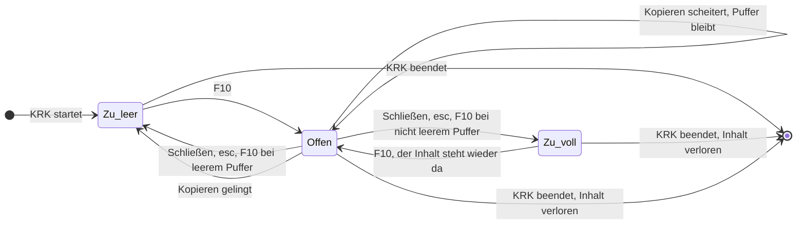

# Spec: F10 öffnet eine Quicknote mit flüchtigem Puffer

**Date:** 2026-09-26
**Status:** Draft
**Source:** Arbeitspaket `260926-2246-f10-oeffnet-quicknote-mit-fluechtigem-puffer.md`, Abschnitt `## Directive`, wörtlich: „F10 öffnet Quicknote im Text Editor. Die Quicknote speichert in einem Internen Speicher (keine Persistenz). Paste des Zwischenpuffer muss möglich sein. Drei Buttons: Clear (Löscht den Puffer), Close (schließt das Fenster, Inhalt bleibt im Puffer) und Copy (Schließt den Editor, Inhalt wird in die Zwischenablage bewegt, Puffer ist leer).“
**Modus:** autonom. Der Nutzer hat für diese Arbeit ausdrücklich keine Rückfragen gewollt. Jede offene Frage ist unten unter `## Annahmen` mit der verworfenen Möglichkeit entschieden; keine davon ist eine Frage mit Datenverlust oder Geheimnisleck als Folge eines Fehlgriffs.
**Grundlage erhoben:** 260926-2300 am Baum (`resources/default-keymap.toml`, `crates/krk-core/src/tasten/belegung.rs`, `crates/krk-ui/src/kommandos/zulaessigkeit.rs`, `crates/krk-ui/src/belegungsmodell.rs`, `crates/krk-ui/src/appkit/anwendung.rs`, `crates/krk-ui/src/appkit/zwischenablage.rs`, `crates/krk-ui/src/appkit/blaetter/ungesichert.rs`, `crates/krk-core/src/text/datei.rs`), dazu der Spec der Runde 9 (`260813-2348_*_spec-notizzettel-als-blatt-mit-zwei-zetteln.md`) und der erste Spec des Arbeitspakets `260925-2356-f2-oeffnet-krkhome-statt-notizfenster` (`260926-0007_*_spec-f2-oeffnet-krkhome-mit-notizen-aufgaben-geheimnissen.md`).
**Kennungen:** Fähigkeiten dieses Spec tragen den Vorsatz **Q**.

---

## Directive

Nach dieser Arbeit öffnet F10 im Editorbereich eine Quicknote: eine leere oder zuletzt beschriebene Textfläche, deren Inhalt allein im Arbeitsspeicher von KRK liegt und mit dem Beenden verloren geht. Der Nutzer tippt oder fügt Text aus der Zwischenablage ein und beendet die Quicknote über eine von drei Schaltflächen: Leeren, Schließen (der Inhalt bleibt) oder Kopieren (der Inhalt geht in die Zwischenablage, der Puffer ist danach leer). Was der Editorbereich vor F10 zeigte, zeigt er nach dem Schließen unverändert wieder.

---

## Ausgangslage, am 260926-2300 am Baum erhoben

- **F10 und `shift+f10` sind in `resources/default-keymap.toml` frei**, ebenso in der Nutzerdatei `~/Library/Application Support/KRK/keymap.toml` dieses Geräts. macOS legt die nackte F10 auf Apple-Tastaturen als Medientaste „Ton aus“; die Funktionstaste kommt wie F3 bis F8 als Tastencode an, mit gehaltener fn-Taste oder bei eingeschalteter Systemeinstellung „F1, F2 usw. als Standard-Funktionstasten“. KRK belegt den Tastencode (`260802-0842_*_f-tasten-unter-macos-systembelegung.md`, liegt im Archiv). Gemessen ist F10 auf dem Referenzgerät nicht.
- **Eine Funktion, die eine vorhandene `keymap.toml` nicht nennt, tritt beim Laden unbelegt hinzu** (`krk-core/src/tasten/belegung.rs`, „Funktionen, die die Nutzerdatei nicht nennt, treten unbelegt hinzu“). Der Nutzer dieses Geräts hat eine eigene `keymap.toml`. Nach der Installation steht die Quicknote bei ihm im Menü, aber F10 löst nichts aus, bis er die Taste in der Belegungsansicht (F1) vergibt. Die Startmeldung der Runde 24 nennt die neuen Funktionen.
- **Die Konfliktregel kennt keinen Bereich**: zwei Funktionen mit derselben Kombination und demselben Zusteller sind ein Konflikt, gleich wo sie wirken (Kopf von `default-keymap.toml`, Kommentar bei `filter_einfuegen`).
- **Der Editorbereich zeigt heute schon mehr als eine Form.** `Editorform` (`kommandos/zulaessigkeit.rs`) kennt die Textfläche und drei Eintragstabellen, und `form_passt` graut Befehle aus, die zur gezeigten Form nicht passen. Die Quicknote ist eine weitere Gestalt desselben Bereichs und kein neuer Bereich der Fensterzeile.
- **`esc` hat eine feste Rangfolge** in `Anwendungsdelegierter::abbrechen`: erst ein stehendes Blatt, dann die laufende Zelle der Eintragstabelle, dann ein laufender Vorgang, zuletzt der Filtertext des aktiven Dateifensters.
- **Das Notizblatt der Runde 9 ist gefallen, weil es blockierte.** Die Directive des F2-Pakets sagt „das blockierende fenster entfällt“, und dessen Spec liest das als Wegfall jedes Blattes auf einem F-Tasten-Einstieg. Aus der Runde 9 bleibt die Erfahrung, dass eine zweite bearbeitbare Textfläche die Textautomatiken abschalten und bewusst für den Ereignisabgriff angemeldet oder nicht angemeldet werden muss.
- **Es gibt genau eine Hülle um die Zwischenablage**, `appkit/zwischenablage.rs`; ihr Schreibweg für Text ist `text_schreiben` und meldet mit `bool`, ob das Schreiben gelang.
- **Der Editor nimmt Dateien bis `EDITORGRENZE` an** (heute 16 MiB, `krk-core/src/text/datei.rs`), und das Budget seines Rückgängigstapels hängt an derselben Zahl.

---

## Lebenslauf der Quicknote

Der Puffer lebt so lange wie der KRK-Prozess. Die Quicknote ist nur die Ansicht darauf, und keiner der Übergänge schreibt auf die Platte.

---

## Capabilities

Wie in den Specs des F2-Pakets zwei Listen je Fähigkeit: am Baum nachweisbar, und nur am laufenden Bündel prüfbar. Die zweite Liste ist Nutzerarbeit, weil der Abnahmelauf KRK im Vordergrund verlangt. **Vor der Abnahme am Bündel ist ein Handgriff nötig:** in der Belegungsansicht (F1) F10 an „Quicknote öffnen und schließen“ und `shift+f10` an „Quicknote kopieren und schließen“ vergeben. `cmd+r` in jener Ansicht ist dafür nicht zu drücken, denn es setzt die ganze eigene Belegung auf die Auslieferung zurück.

### Q1: F10 öffnet und schließt die Quicknote im Editorbereich

**Description:** F10 zeigt die Quicknote an der Stelle des Editors, rechts neben den Dateifenstern, und setzt die Schreibmarke hinein. War der Editorbereich ausgeblendet oder zeigte er die Vorschau, wird er für die Quicknote eingeblendet. Hielt der Editor eine Datei, bleibt sie mit ihrem ganzen Stand darunter liegen und kommt nach dem Schließen unverändert zurück, auch mit ungesicherten Änderungen. F10 wirkt als Umschalter: steht die Schreibmarke in der Quicknote, schließt F10 sie; steht die Quicknote offen, aber der Fokus in einem anderen Bereich, holt F10 den Fokus in die Quicknote zurück. Solange ein Blatt steht, tut F10 nichts. Der Fenstertitel nennt bei Fokus in der Quicknote „Quicknote“ statt eines Dateipfads.

**Acceptance criteria, am Bündel:**
- [ ] Mit leerem Puffer und Fokus im Dateifenster zeigt F10 eine leere Textfläche mit der Überschrift oder Titelzeile „Quicknote“ und darunter oder darüber die drei Schaltflächen „Leeren“, „Schließen“ und „Kopieren“; Tippen erscheint sofort in der Fläche, ohne vorher zu klicken.
- [ ] War vor F10 die Vorschau sichtbar, zeigt KRK nach dem Schließen der Quicknote wieder die Vorschau mit demselben Inhalt.
- [ ] Ist im Editor eine Datei mit ungesicherter Änderung offen, erscheint auf F10 keine Rückfrage; nach dem Schließen der Quicknote steht dieselbe Datei mit derselben ungesicherten Änderung und derselben Schreibmarkenposition wieder da, und `cmd+z` nimmt dort die letzte Dateiänderung zurück.
- [ ] Mit Fokus in der Quicknote schließt F10 sie; der Fokus kehrt in den Bereich zurück, der ihn vor F10 hatte.
- [ ] Bei offener Quicknote und Fokus im Dateifenster (`shift+cmd+d`) bringt F10 den Fokus in die Quicknote, ohne sie zu schließen.
- [ ] Steht ein Blatt (etwa die Pfadeingabe mit `shift+cmd+g`), öffnet F10 keine Quicknote.
- [ ] Bei Fokus in der Quicknote nennt der Fenstertitel „Quicknote“ und keinen Dateipfad.
- [ ] Im Hauptmenü „Editor“ stehen „Quicknote öffnen und schließen“ mit F10, „Quicknote kopieren und schließen“ mit `shift+f10` und „Quicknote leeren“ ohne Kürzel.

**Acceptance criteria, am Baum:**
- [ ] `resources/default-keymap.toml` führt die drei Funktionen mit den Tasten `["f10"]`, `["shift+f10"]` und `[]`, jede mit einem Kommentar, der ihre Wahl begründet; die Konfliktprüfung der Belegung meldet keinen Konflikt.
- [ ] Jedes der drei neuen Kommandos steht in `Kommando::KENNUNGEN`, in `Kommando::wirkungsbereich`, in `bereich_des_kommandos` (unter `Funktionsbereich::Editor`) und hat einen eigenen Zweig im Ausführungsweg des Anwendungsdelegierten statt des Auffangzweigs; `make check` läuft grün.
- [ ] `make tasten` und `make menue` führen die drei Funktionen.

**Decisions made:**
- Ort: der Editorbereich und kein Blatt, kein eigenes Fenster (Annahme A1).
- Datei darunter: bleibt unangetastet liegen, keine Rückfrage (Annahme A2).
- F10 als Umschalter mit Fokusrückholung (Annahme A3).
- Menü „Editor“ (Annahme A7).

### Q2: Der Puffer ist flüchtig

**Description:** Der Inhalt der Quicknote liegt allein im Arbeitsspeicher des laufenden KRK-Prozesses. Er übersteht das Schließen der Quicknote, das Schließen und Wiedereinblenden des Hauptfensters und jedes Öffnen und Schließen von Dateien im Editor. Er geht verloren, wenn KRK beendet wird oder abstürzt, und KRK fragt vor dem Beenden nicht nach. Eine weitere Instanz (`opt+cmd+n`) hat ihren eigenen, leeren Puffer. Kein Weg schreibt den Inhalt auf die Platte: weder die Sitzungsdatei noch die Lesezeichen noch eine andere Datei.

**Acceptance criteria, am Bündel:**
- [ ] Text in die Quicknote tippen, mit „Schließen“ schließen, mit F10 wieder öffnen: der Text steht unverändert da.
- [ ] Text in die Quicknote tippen, mit `shift+cmd+w` das Fenster schließen, mit `cmd+n` wieder einblenden und F10 drücken: der Text steht unverändert da.
- [ ] Text in die Quicknote tippen, KRK mit `cmd+q` beenden: es erscheint keine Rückfrage wegen der Quicknote. Nach dem Neustart zeigt F10 eine leere Quicknote.
- [ ] Nach dem Neustart zeigt der Editorbereich, was die Sitzung vor der Quicknote hielt, und nicht die Quicknote.
- [ ] Ein Suchlauf über `~/Library/Application Support/KRK/` nach einem eindeutigen, zuvor in die Quicknote getippten Wort findet nichts, weder bei offener Quicknote noch nach dem Beenden.

**Acceptance criteria, am Baum:**
- [ ] Eine Probe hält fest, dass der Zustand der Quicknote in keinem Feld der Sitzung (`Sitzung` in `krk-core/src/ablage/sitzung.rs`) steht.
- [ ] Textmarken sind in der Quicknote nicht verfügbar: der Befehl, der im Editor eine Textmarke setzt, ist bei Fokus in der Quicknote ausgegraut und schreibt nichts nach `bookmarks.toml`.

**Decisions made:**
- Keine Rückfrage beim Beenden mit gefülltem Puffer (Annahme A5).
- „Fenster“ heißt hier das Hauptfenster; sein Schließen gilt wie „Schließen“ (Annahme A4).

### Q3: Tippen und Einfügen

**Description:** Die Quicknote ist eine reine Textfläche. Sie nimmt Tippen, Einfügen über `cmd+v` und den Menüeintrag „Bearbeiten → Einfügen“, Ausschneiden, Kopieren einer Auswahl, „Alles auswählen“, Rückgängig und Wiederholen an. Eingefügt wird der Text, den die Zwischenablage führt, ohne Schrift, Farbe oder Bilder; führt die Zwischenablage keinen Text, ändert `cmd+v` nichts. Die Textautomatiken von macOS (Autokorrektur, Ersetzen von Anführungszeichen und Strichen, Rechtschreibprüfung beim Tippen) sind abgeschaltet wie im Editor. Der Puffer fasst höchstens so viel wie der Editor (`EDITORGRENZE`); ein Einfügen, das darüber hinausführte, unterbleibt ganz, und die Statuszeile nennt den Grund. Befehle, die sich auf eine Datei beziehen, wirken in der Quicknote nicht und sind im Menü ausgegraut: Sichern, Roh- und Formatansicht, Suchen, Weitersuchen, Ersetzen, Zu Zeile springen, Textmarken und die Eintragsbefehle.

**Acceptance criteria, am Bündel:**
- [ ] Formatierten Text aus Safari kopieren und mit `cmd+v` in die Quicknote einfügen: es erscheint der Text ohne Schriftwechsel, Farbe oder Verweis.
- [ ] Im Finder eine Datei mit `cmd+c` kopieren und in der Quicknote `cmd+v` drücken: es erscheint der Text, den die Zwischenablage dazu führt (der Dateiname), und keine Datei wird kopiert oder bewegt.
- [ ] `"Hallo"` eintippen: die geraden Anführungszeichen bleiben gerade; ein absichtlicher Tippfehler wird nicht korrigiert.
- [ ] `cmd+s`, `cmd+f` und `cmd+j` tun bei Fokus in der Quicknote nichts und sind im Menü ausgegraut.
- [ ] Eine Textmenge über der Editorgrenze aus der Zwischenablage einfügen: der Puffer bleibt unverändert, und die Statuszeile nennt, dass der Text zu groß für die Quicknote ist.

**Acceptance criteria, am Baum:**
- [ ] Die Textfläche der Quicknote ruft `textautomatik::automatiken_abschalten`; die Probe `jede_bearbeitbare_textflaeche_schaltet_die_automatiken_ab` erfasst sie.
- [ ] Die Textfläche ist beim Anwendungsdelegierten als eigene Textfläche angemeldet (`ist_eigene_textflaeche`), so dass F10, `esc` und `shift+f10` darin KRK erreichen.
- [ ] Die Zählprobe zu `copy:`, `cut:` und `paste:` in `appkit/betrachter.rs` ist grün; beantwortet die Quicknote einen dieser Selektoren selbst, steht sie dort mit Namen.

**Decisions made:**
- Kein vierter Knopf „Einfügen“; Einfügen geht über `cmd+v` und das Menü (Annahme A6).
- Reiner Text, Grenze wie im Editor (Annahme A9).
- Dateibezogene Editorbefehle ausgegraut (Annahme A10).

### Q4: Die drei Schaltflächen

**Description:** Unter oder über der Textfläche stehen von links nach rechts „Leeren“, „Schließen“ und „Kopieren“. Ein Klick auf eine Schaltfläche nimmt der Textfläche die Schreibmarke nicht dauerhaft; nach „Leeren“ tippt der Nutzer sofort weiter.

- **Leeren** löscht den ganzen Puffer und lässt die Quicknote offen. `cmd+z` nimmt das Leeren zurück, solange die Quicknote offen ist. Eine Rückfrage gibt es nicht. Ab Werk ohne Tastenkürzel, in F1 belegbar.
- **Schließen** schließt die Quicknote und lässt den Puffer, wie er ist. Denselben Weg nehmen `esc` bei Fokus in der Quicknote, F10 bei Fokus in der Quicknote und jeder Weg, der eine Datei in den Editor bringt oder den Editorbereich schließt oder ausblendet (F4, `cmd+e`, `opt+cmd+e`, `opt+cmd+b`, das Schließen des Hauptfensters).
- **Kopieren** schreibt den ganzen Puffer als Text in die Zwischenablage, leert den Puffer und schließt die Quicknote. Tastenkürzel ab Werk `shift+f10`, wirksam bei Fokus in der Quicknote. Ist der Puffer leer, lässt Kopieren die Zwischenablage unberührt und schließt nur. Scheitert das Schreiben in die Zwischenablage, bleibt die Quicknote offen, der Puffer unverändert, und die Statuszeile meldet den Fehlschlag. Gelingt es, nennt die Statuszeile die Zahl der kopierten Zeichen.

**Acceptance criteria, am Bündel:**
- [ ] Text tippen, „Leeren“ klicken: die Fläche ist leer, die Quicknote bleibt offen, und weiteres Tippen erscheint ohne Klick in der Fläche.
- [ ] Direkt nach „Leeren“ stellt `cmd+z` den Text wieder her.
- [ ] Text tippen, „Schließen“ klicken: die Quicknote verschwindet, F10 zeigt denselben Text.
- [ ] Text tippen, `esc` drücken: gleiche Wirkung wie „Schließen“. Läuft dabei im Hintergrund ein Kopiervorgang, läuft er weiter; `esc` schließt nur die Quicknote.
- [ ] Mehrere Zeilen Text tippen, einen Teil davon markieren, „Kopieren“ klicken: die Quicknote verschwindet, in TextEdit fügt `cmd+v` den **ganzen** Text mit allen Zeilenumbrüchen ein, und F10 zeigt danach eine leere Quicknote.
- [ ] Dasselbe mit `shift+f10` statt des Klicks: gleiche Wirkung.
- [ ] Bei leerem Puffer „Kopieren“ klicken: die Quicknote schließt, und die Zwischenablage hält weiter, was sie vorher hielt.
- [ ] Nach „Kopieren“ nennt die Statuszeile, dass die Quicknote in die Zwischenablage kopiert ist, mit der Zahl der Zeichen.
- [ ] Bei offener Quicknote mit Text im Dateifenster F4 auf einer Textdatei drücken: die Datei öffnet im Editor, und F10 zeigt danach den Text der Quicknote unverändert.

**Acceptance criteria, am Baum:**
- [ ] Kopieren schreibt über `zwischenablage::text_schreiben` (oder `text_auf_ablage_schreiben`) und über keinen zweiten Weg zu `NSPasteboard`.
- [ ] Eine Probe hält fest, dass der Puffer nach gescheitertem Schreiben in die Zwischenablage unverändert bleibt und nach gelungenem leer ist; eine zweite, dass ein leerer Puffer die Zwischenablage nicht beschreibt.
- [ ] `esc` hat in `Anwendungsdelegierter::abbrechen` einen Rang für die Quicknote, der nur bei Fokus in der Quicknote greift und nach dem Blatt und der laufenden Zelle, aber vor dem laufenden Vorgang und dem Filtertext steht.

**Decisions made:**
- Deutsche Beschriftung „Leeren“, „Schließen“, „Kopieren“ (Annahme A8).
- Kopieren nimmt den ganzen Puffer, nicht die Auswahl (Annahme A11).
- Leerer Puffer überschreibt die Zwischenablage nicht (Annahme A12).
- Leeren ohne Rückfrage, dafür rückgängig machbar (Annahme A13).
- Tastenwege: F10 und `esc` für Schließen, `shift+f10` für Kopieren, Leeren ohne Kürzel (Annahme A14).

---

## Stops when

- Wenn der Planer am Baum feststellt, dass die Quicknote im Editorbereich nicht erscheinen kann, ohne den Stand einer dort offenen Datei anzutasten (ungesicherte Änderung, Rückgängigstapel, Schreibmarke, laufende Zelle der Eintragstabelle, entsperrte `secrets.txt`), stoppt die Arbeit, und der Nutzer entscheidet, ob F10 die Datei stattdessen über die Nachfrage aus C4 der Editor-Runde schließen darf.
- Wenn der Abnahmelauf zeigt, dass F10 auf der Alltagstastatur des Nutzers KRK nicht erreicht, weil macOS die Taste abfängt, stoppt die Abnahme von Q1, und der Nutzer wählt eine andere Taste; der Bau selbst bleibt stehen.

---

## Constraints

- **Kein Datum der Quicknote auf der Platte.** Weder `session.toml` noch `bookmarks.toml` noch eine neue Ablagedatei trägt den Puffer oder die Tatsache, dass die Quicknote offen war. `Datei::ALLE` wächst nicht.
- **Eine Hülle um die Zwischenablage.** Kopieren schreibt über `appkit/zwischenablage.rs`; Einfügen geht über das Einfügen der Textfläche, das AppKit beantwortet. Eine zweite Hülle entsteht nicht.
- **Pflichtstellen jedes neuen Kommandos:** `Kommando::KENNUNGEN` (von einer Probe gehalten, nicht vom Übersetzer), `Kommando::wirkungsbereich`, `bereich_des_kommandos` und ein eigener Zweig im Ausführungsweg, weil `kommando_ausfuehren` auf einen Auffangzweig endet und ein Kommando ohne Zweig still nichts täte.
- **Die Textfläche der Quicknote ist Teil eines Bereichs der Fensterzeile** und wird deshalb bei `ist_eigene_textflaeche` angemeldet; sie ist keine Blattfläche.
- **Die Quicknote ist keine Geheimnisfläche und darf keine werden.** Sie liest und schreibt `secrets.txt` nie. Kopieren ist ein Weg, auf dem Editorinhalt KRK verlässt; die Regel aus `CLAUDE.md`, dass ein solcher Weg `Editormodell::haelt_geheimnisse` fragt, gilt hier für den Inhalt der Quicknote und nicht für eine darunter liegende Datei. Eine darunter offene `secrets.txt` darf Kopieren nicht sperren, und die Quicknote darf deren Inhalt nie ohne einen Einfügeschritt des Nutzers erhalten. Text, den der Nutzer selbst aus `secrets.txt` kopiert und hier einfügt, ist nach `260926-0033_*_darf-text-aus-secrets-txt-in-die-zwischenablage.md` erlaubt.
- **Blattsperre unverändert:** die Probe `zulaessigkeit::waehrend_eines_blattes_kommen_genau_diese_vier_durch` bleibt bei vier; keines der neuen Kommandos kommt während eines Blattes durch.
- **Schreibweise:** was der Nutzer liest (Menüeinträge, Beschriftungen, Statuszeile), trägt Umlaute; Bezeichner und Kommentare tragen die Umschrift.
- **Keine Zeitzusage aus C8 wird angefasst.** Der Start baut nichts für die Quicknote vorab, so dass L4 keine Arbeit hinzubekommt; die Quicknote hängt an keinem Lesevorgang der Dateifenster.
- **`#[must_use]`:** ein Rückgabewert, dessen stilles Fallenlassen einen verlorenen Puffer oder eine nicht beschriebene Zwischenablage verdecken könnte, trägt die Markierung.
- **Untergrenze macOS 15:** jede neu angesprochene AppKit-Klasse steht im Abschnitt „Ab welchem macOS die angesprochenen Klassen stehen“ ihres Modulkopfs.
- **`HowTo.md`** nennt F10, die drei Schaltflächen und ausdrücklich, dass der Inhalt mit dem Beenden verloren geht.

---

## Out of Scope

- Ein Sichern der Quicknote in eine Datei, ein „Sichern unter“, ein Übernehmen in `notes.txt` oder eine Wiederherstellung nach Absturz.
- Mehrere Quicknotes oder Tabs darin.
- Suchen, Ersetzen und Zeilensprung in der Quicknote.
- Ein eigenes Fenster oder ein Blatt für die Quicknote.
- Eine Änderung der Regel, nach der neue Funktionen einer vorhandenen `keymap.toml` unbelegt hinzutreten. Der Handgriff in F1 vor der Abnahme ist der Preis dieser Regel; wer ihn beseitigen will, braucht eine eigene Arbeit.
- Ein Cmd-Kürzel als zweiter Weg neben F10.
- Das Arbeitspaket zu `appointments.md` im Notizordner, das gleichzeitig an der Konfliktregel für `cmd+1` arbeitet; diese Arbeit hängt nicht davon ab und berührt `cmd+1` nicht.

---

## Annahmen

Jede Annahme nennt die gewählte und die verworfene Möglichkeit. Keine ist vom Nutzer bestätigt; jede lässt sich in der Durchsicht umdrehen.

- **A1: Die Quicknote erscheint im Editorbereich, nicht als Blatt und nicht als eigenes Fenster.** „Im Text Editor“ benennt den eingebauten Editor, und in KRKs Sprache heißen die Flächen der Fensterzeile „Fenster“ (Dateifenster, Vorschaufenster), so dass „schließt das Fenster“ und „schließt den Editor“ dieselbe Fläche meinen. Der Editorbereich blockiert nichts, und der Nutzer hat das blockierende Notizblatt eben erst abgeschafft. Verworfen: **ein Blatt am Hauptfenster** (die Bauform der Runde 9; billiger zu bauen, aber blockierend und damit gegen die Directive des F2-Pakets) und **ein eigenes, frei schwebendes Fenster** (KRK kennt kein zweites Fenster, die Zulässigkeitsregel fragt nach dem Schlüsselfenster, und die Belegung behält zweite Fenster ausdrücklich einer eigenen Runde vor).
- **A2: Eine im Editor offene Datei bleibt unter der Quicknote liegen und kommt unverändert zurück.** Verworfen: F10 behandelt die Quicknote wie eine weitere Datei und schließt die offene über die Nachfrage aus C4. Das kostete bei jeder Notiz eine Rückfrage und die Schreibmarke in der Datei. Wenn die Überlagerung am Baum nicht sauber geht, greift der erste Punkt unter `## Stops when`.
- **A3: F10 schaltet um und holt den Fokus zurück.** Offen mit Fokus: schließen. Offen ohne Fokus: Fokus hinein. Zu: öffnen. Das folgt dem Muster von `cmd+e`, dessen Wirkung vom Fokus abhängt. Verworfen: ein reiner Umschalter, der bei Fokus im Dateifenster schlösse, und damit gerade dann, wenn der Nutzer zur Notiz zurück will.
- **A4: „Fenster“ in „Close (schließt das Fenster)“ meint die Quicknote-Fläche.** Das Schließen des Hauptfensters mit `shift+cmd+w` wirkt auf die Quicknote wie „Schließen“: der Puffer bleibt. Verworfen: die Quicknote bleibt über das Schließen des Hauptfensters hinaus offen. Der Unterschied wäre nicht sichtbar und bräuchte einen eigenen Zustand.
- **A5: Beenden fragt nicht nach.** Der Nutzer hat „keine Persistenz“ verlangt, und eine Rückfrage vor jedem Beenden mit gefülltem Puffer machte aus dem Wegwerfpuffer einen Ort, um den man sich kümmern muss. Verworfen: eine Nachfrage wie bei ungesicherten Dateien. `HowTo.md` nennt den Verlust.
- **A6: Kein vierter Knopf „Einfügen“.** Der Nutzer nennt genau drei Schaltflächen; „Paste muss möglich sein“ ist mit `cmd+v` und „Bearbeiten → Einfügen“ erfüllt. Verworfen: eine Schaltfläche „Einfügen“.
- **A7: Die drei Befehle stehen im Menü „Editor“.** Die Quicknote erscheint im Editorbereich. Verworfen: das Menü „Home“, das nach dem Notizordner benannt ist; die Quicknote liegt nicht darin.
- **A8: Beschriftung deutsch: „Leeren“, „Schließen“, „Kopieren“; der Name „Quicknote“ bleibt.** KRKs Oberfläche ist durchgängig deutsch, auch auf Schaltflächen („Sichern“, „Verwerfen“, „Abbrechen“). Verworfen: die englischen Wörter der Directive als Beschriftung. Wer sie will, ändert drei Zeichenketten.
- **A9: Reiner Text, höchstens `EDITORGRENZE`.** Die Grenze schützt davor, dass ein versehentliches Einfügen riesiger Textmengen KRK anhält, und hält den Rückgängigstapel in seinem Budget. Verworfen: keine Grenze.
- **A10: Dateibezogene Editorbefehle sind in der Quicknote ausgegraut**, auch Suchen und Zeilensprung. Verworfen: Suchen und Zeilensprung zulassen; das ist mehr Umfang als verlangt und lässt sich später ergänzen.
- **A11: Kopieren nimmt den ganzen Puffer, auch bei einer Auswahl.** Die Directive sagt „Inhalt wird in die Zwischenablage bewegt, Puffer ist leer“; mit einer Teilauswahl ginge Inhalt verloren. Das Kopieren einer Auswahl bleibt bei `cmd+c`. Verworfen: Kopieren der Auswahl.
- **A12: Ein leerer Puffer überschreibt die Zwischenablage nicht.** Eine leere Zeichenkette dort vernichtete, was der Nutzer vorher kopiert hatte. Verworfen: die leere Zeichenkette schreiben.
- **A13: Leeren ohne Rückfrage, dafür mit `cmd+z` zurücknehmbar, solange die Quicknote offen ist.** Verworfen: eine Rückfrage vor dem Leeren, die jeden gewollten Klick verlangsamte. Ob das Rückgängig über ein Schließen hinaus reicht, ist nicht zugesagt.
- **A14: Tastenwege.** F10 öffnet und schließt, `esc` schließt bei Fokus in der Quicknote, `shift+f10` kopiert und schließt, Leeren hat ab Werk kein Kürzel (die Tastatur leert auch mit `cmd+a` und Rückschritt). `shift+f10` folgt dem Muster von `shift+f3` und `shift+f6`, die die Umschalttaste an eine verwandte Handlung der F-Taste binden. F10 bekommt kein Cmd-Kürzel daneben, wie F1 und F4; die Zwei-Wege-Regel gilt für die Norton-Reihe F3 bis F8. Verworfen: ein Cmd-Kürzel neben F10, und `cmd+return` für Kopieren, das `eintrag_bearbeiten` trägt und nach der Konfliktregel nicht zweimal stehen darf.
- **A15: Der Fokus kehrt nach Schließen und Kopieren in den Bereich zurück, der ihn vor F10 hatte**, und in das aktive Dateifenster, wenn jener Bereich nicht mehr sichtbar ist. Verworfen: der Fokus geht immer ins Dateifenster.

---

## Open for Planner

- Wie die Quicknote im Editorbereich über einer offenen Datei liegt, ohne deren Stand anzutasten: eine eigene Ansicht neben der Textfläche des Editors, ein weiterer Wert von `Editorform` oder ein anderer Zuschnitt. Der Planer entscheidet nach dem bestehenden Aufbau von `appkit/editor.rs`.
- Ob die Quicknote eine eigene Textfläche bekommt oder die des Editors mit anderem Inhalt nutzt; bindend ist allein, dass eine darunter offene Datei unverändert zurückkommt.
- Lage der Schaltflächenreihe (über oder unter der Textfläche), Zeilennummernspalte ja oder nein, Schrift.
- Welche Wirkungsbereiche die drei Kommandos tragen, und ob dafür ein neuer Wert von `Wirkungsbereich` nötig ist.
- Wie Kopieren den Inhalt der Quicknote von einer darunter offenen `secrets.txt` trennt, wenn es `haelt_geheimnisse` fragt.
- Ob das Tastenprotokoll (`--tasten-protokoll`) Anschläge in der Quicknote verdeckt. Zugesagt ist nichts; verdecken ist unschädlich.
- Wie eine Einfügung über der Grenze abgefangen wird.
- Wortlaut der Statuszeilenmeldungen und des Abschnitts in `HowTo.md`.

---

## User Decisions Pending

- [ ] Alle fünfzehn Annahmen oben sind ohne Rückfrage getroffen und warten auf die Durchsicht des Nutzers. Am ehesten umstritten sind A1 (Editorbereich statt Blatt), A5 (kein Schutz vor Verlust beim Beenden) und A8 (deutsche statt englischer Beschriftung).
