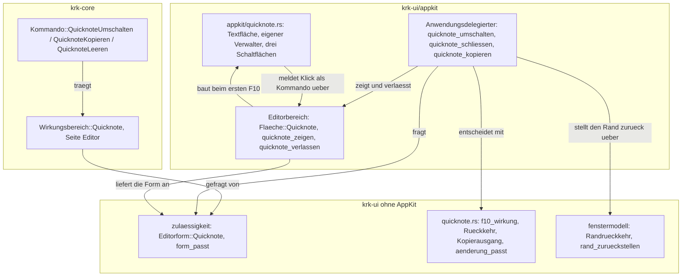
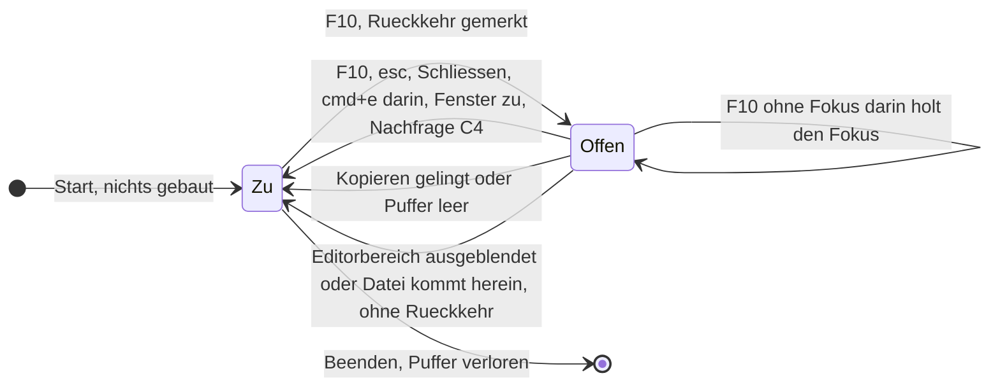
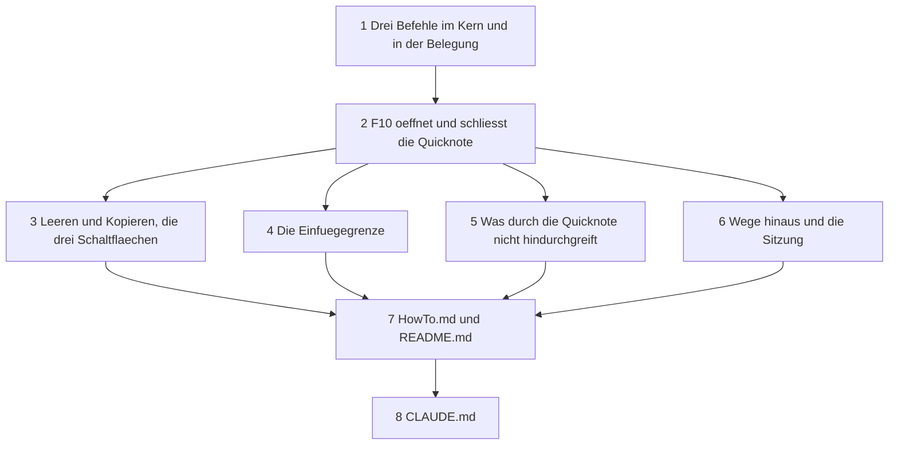

# Implementation Plan: F10 öffnet eine Quicknote mit flüchtigem Puffer

**Date:** 2026-09-27
**Status:** Ready for Review
**Spec:** `260926-2300_*_spec-f10-oeffnet-quicknote-mit-fluechtigem-puffer.md` (Q1 bis Q4, Annahmen A1 bis A15). Gebaute Grundlage: HEAD `f6981bf`, also einschließlich der Termine aus dem Arbeitspaket `260926-2240-termine-als-weitere-datei-im-heimordner` (`cf458eb..f6981bf`: geteilte Kombination über `Nachschlag::Geteilt` und `zulaessigkeit::waehlen`, `Wirkungsbereich::Reihenfolge` und `Wirkungsbereich::Termine`, `Editorform::Termine`, die Naht zwischen Stelle und Zeile in `appkit/eintragsansicht.rs`, `heute_nachziehen` als dritter Empfänger am Melder des Hauptfensters, `terminrichtung` in `session.toml`). Die Schlussdurchsicht jener Arbeit läuft gleichzeitig; dieser Plan ändert an ihr nichts.
**Modus:** autonom. Der Nutzer hat die Arbeit ohne Rückfragen beauftragt; jeder offene Punkt ist unten unter `## Entscheidungen des Plans` mit Grund entschieden.
**Decidability:** Vier Fragen tragen den Plan, und jede ist aus den Eingaben ihres Mechanismus entscheidbar. **Erstens „ist die Quicknote offen, und steht der Fokus in ihr?“**: der erste Teil ist ein Wert, den genau ein Schreiber hält (`Editorbereich`, Feld der Rückkehr, `Some` heißt offen), der zweite ist die Nämlichkeit des Ersthelfers mit der einen Textfläche der Quicknote, dieselbe Frage, die `ist_eigene_textflaeche` für jede eigene Fläche schon stellt. **Zweitens „welcher Bereich stand vor F10 am rechten Rand und kommt beim Schließen zurück?“**: entscheidbar im Augenblick von F10 aus der Sichtbarkeit im `Fenstermodell` und dort als Wert gemerkt; nachträglich wäre sie es nicht mehr, deshalb wird sie nicht nachträglich gestellt. **Drittens „bleibt der Puffer nach dieser Änderung innerhalb von `EDITORGRENZE`?“**: entscheidbar im Delegierten der Textfläche aus der Länge des Textes, der Länge des ersetzten Bereichs und der Länge der Einfügung. **Viertens „ist der Text in der Zwischenablage angekommen?“**: der Wahrheitswert von `zwischenablage::text_schreiben`. **Nicht aus dem Code entscheidbar ist, ob F10 auf der Tastatur des Nutzers KRK erreicht**, weil macOS die Taste je nach Systemeinstellung als Medientaste abfängt; diese Frage wandert deshalb in den Abnahmelauf des Nutzers und ist die zweite Haltestelle des Spec.

## Directive

Nach dieser Arbeit öffnet F10 im Editorbereich eine Quicknote, deren Text allein im Arbeitsspeicher des laufenden KRK liegt. Drei Schaltflächen „Leeren“, „Schließen“ und „Kopieren“ bedienen sie, eine im Editor offene Datei liegt unberührt darunter und kommt beim Schließen zurück. Das Verhalten beschreibt der Spec. Dieser Plan sagt, wie es in acht Schritten gebaut wird, und entscheidet die Punkte, die der Spec unter `## Open for Planner` offenlässt, dazu drei, in denen er vom Wortlaut des Spec abweicht.

## Current State

**Der Editorbereich zeigt schon zwei deckungsgleiche Flächen und tauscht sie an genau einer Stelle.** `Editorbereich` (`crates/krk-ui/src/appkit/editor.rs`) hält die Textfläche in ihrer Bildlaufrolle und die `Eintragsansicht` übereinander unter dem Kopf. Welche zu sehen ist, folgt aus `Editorbereich::form()` über `flaeche_der_form`, und gewechselt wird allein in `flaeche_waehlen`. Die Reihenfolge des Tauschs legt die reine Funktion `tauschschritte` fest: erst einblenden, dann den Ersthelfer übergeben, sofern die alte Fläche ihn hielt, dann ausblenden. Ein Ausblenden mit `setHidden:` fasst Textspeicher, Auswahl und Rückgängigstapel der Fläche nicht an.

**Die Form ist die eine Eingabe, an der Befehle des Editors ausgegraut werden.** `Editorform` (`crates/krk-ui/src/kommandos/zulaessigkeit.rs`) führt die Textfläche und die vier Tabellenformen; `form_passt` fragt sie für die Wirkungsbereiche, die eine Form verlangen, vollständig und ohne Auffangzweig. `Wirkungsbereich::Editor` (Sichern, Schließen, Ansicht) und `Wirkungsbereich::Geheimnisse` („PIN ändern“) sagen dort heute in jeder Form ja; `Geheimnisse` fragt statt der Form `datei_passt`.

**Eine Textfläche, die KRKs Befehle empfangen soll, muss beim Anwendungsdelegierten angemeldet sein.** `Anwendungsdelegierter::ist_eigene_textflaeche` (`appkit/anwendung.rs`) vergleicht den Ersthelfer über `isEqual` mit der Textfläche des Editors, der Textanzeige der Vorschau und fragt nach der laufenden Zelle der Eintragstabelle. Ohne Anmeldung gehört der Ersthelfer AppKit, und F10, `esc` und `shift+f10` blieben dort unzulässig. Die Probe `die_zelle_ist_eine_eigene_textflaeche` hält die Zelle am Quelltext.

**Den Rückgängigverwalter nimmt `NSWindow` vom Ersthelfer.** Gemessen am 260810 und im Doc-Kommentar von `rueckgaengigstapel_leeren` (`appkit/editor.rs`) festgehalten: `undo:` beantwortet in der Antwortkette allein `NSWindow`, und es nimmt dabei den Verwalter des Ersthelfers; `undoManagerForTextView:` am Delegierten gäbe einer Textfläche einen eigenen, der vom Menü aus erreichbar bleibt. Die Ausnahme davon ist der Feldeditor (gemessen am 260926, `messungen/260926-0828-zellen-rueckgaengig.txt`), und deshalb beantwortet der `Zelleneditor` in `appkit/eintragsansicht.rs` `undo:` und `redo:` selbst. Die Quicknote bekommt eine gewöhnliche `NSTextView` und keinen Feldeditor.

**Die Sichtbarkeit am rechten Rand ist ein gegenseitiger Ausschluss.** Vorschau, Editor und Git-Bereich tragen dieselbe `Flaeche::RechterRand` (`crates/krk-ui/src/fenstermodell.rs`); `Fenstermodell::umschalten` räumt beim Einblenden die Mitbewerber, `einblenden` erbt das. Jeder Wechsel läuft über `Anwendungsdelegierter::sichtbarkeit_aendern`, und für jeden Bereich, dessen Sichtbarkeit sich geändert hat, läuft genau einmal `nach_dem_sichtbarkeitswechsel`. Dort verlässt der Fokus einen ausgeblendeten Randbereich in das aktive Dateifenster. `Fenstermodell` leitet heute allein `Debug` ab.

**`esc` hat vier Ränge in `Anwendungsdelegierter::abbrechen`**: stehendes Blatt, laufende Zelle, laufender Vorgang, Filtertext. Der Rang der Zelle liest den Ersthelfer im Augenblick des Tastendrucks.

**Ein neues Kommando hat vier Pflichtstellen, und zwei davon hält der Übersetzer nicht.** `Kommando::wirkungsbereich` (`crates/krk-core/src/tasten/belegung.rs`) und `bereich_des_kommandos` (`crates/krk-ui/src/belegungsmodell.rs`) sind vollständige Fallunterscheidungen. `Kommando::KENNUNGEN` hält die Probe `jede_variante_von_kommando_steht_genau_einmal_in_kennungen` (`crates/krk-core/tests/belegung.rs`); den Ausführungszweig in `kommando_ausfuehren_bei` hält für die namentlich geführten Befehle die Probe `zweigproben::jeder_dieser_befehle_hat_einen_eigenen_ausfuehrungszweig`, sonst nichts.

**F10 und `shift+f10` sind in `resources/default-keymap.toml` frei**; `f10` steht in `parser::TASTEN` als dokumentierter Tastencode (`kVK_F10`, 109) und ist nicht gemessen. Der Kopf der Datei nennt in der Zeile `# Ausgeliefert sind …` die Zahl der Funktionen und der Kombinationen, und die Probe `die_zwei_zahlen_im_kopf_der_auslieferungsbelegung_stimmen_noch` zählt die Datei dagegen. Eine Funktion ohne Kombination ab Werk muss in `OHNE_KOMBINATION_AB_WERK` (`crates/krk-core/tests/belegung.rs`) stehen, in der Reihenfolge der Datei.

**Der Nutzer dieses Geräts hat eine eigene `keymap.toml`.** `Belegung::bauen` hängt eine Funktion, die sie nicht nennt, unbelegt an (offener Defekt `260814-0656_*_eine-neue-funktion-kommt-bei-jedem-nutzer-mit-eigener-keymap-unbelegt-an.md`). F10 erreicht die Quicknote bei ihm also erst, wenn er die Taste in der F1-Ansicht mit „Zuweisen“ (`cmd+t`) vergibt. `cmd+r` in jener Ansicht setzte seine ganze Belegung auf die Auslieferung zurück und ist nicht der Weg.

**Die Sitzung merkt sich die Sichtbarkeit jedes Bereichs** (`Sichtbarkeit` in `crates/krk-core/src/ablage/sitzung.rs`), und `Anwendungsdelegierter::sitzung_bauen` baut sie aus `Fenstermodell::sitzung` bei jedem wirksamen Befehl und beim Beenden.

**Das Hauptfenster überlebt sein Schließen** (`performClose:`, kein Freigeben); sein Delegierter `FensterDelegierter` (`appkit/fenster.rs`) beantwortet `windowWillClose:` und bricht dort die Lesevorgänge der Dateifenster ab.

**Der Start baut nichts, was er nicht braucht.** L4 steht seit dem 260910 ohnehin neben den Zusagen (`CLAUDE.md`, „Maximen“); der Spec verlangt trotzdem ausdrücklich, dass der Start für die Quicknote nichts vorab baut.

## Approach

**Die Quicknote ist eine dritte Fläche desselben Bereichs und eine sechste Form derselben Regel, kein neuer Mechanismus.** Sie bekommt einen Wert `Flaeche::Quicknote` neben Textfläche und Tabelle und einen Wert `Editorform::Quicknote` neben den fünf Formen. Der Tausch geht durch `flaeche_waehlen` und `tauschschritte`, wie jeder Wechsel von Datei oder Ansicht; das Ausgrauen der Dateibefehle geht durch `form_passt`, wie in der Aufgabentabelle das Ausgrauen der Suche. Der Stand der Datei darunter bleibt, weil kein Weg der Quicknote das `Editormodell` anfasst: Tausch heißt `setHidden:`, und `setHidden:` fasst weder Text noch Auswahl noch Stapel an.

**Offen ist die Quicknote genau dann, wenn der Editorbereich einen Rückkehrwert hält.** Der Wert `Rueckkehr` trägt den Fokus vor F10 und was am rechten Rand zurückzustellen ist. Er entsteht bei F10, lebt im Editorbereich, und `quicknote_verlassen` gibt ihn beim Schließen heraus. Ein zweites Kennzeichen „offen“ daneben gibt es nicht.

**Jeder Weg aus der Quicknote hinaus läuft über zwei Stellen.** `Anwendungsdelegierter::quicknote_schliessen` ist der eine Rumpf für F10, `esc`, die Schaltfläche „Schließen“, „Kopieren“, `cmd+e` in der Quicknote, das Schließen des Hauptfensters und die Nachfrage aus C4; er stellt den Rand und den Fokus zurück. `Editorbereich::quicknote_verlassen` ist die eine Stelle darunter, die die Fläche tauscht; sie rufen daneben unmittelbar nur `datei_oeffnen` (eine Datei kommt herein, also zeigt der Editor sie) und `nach_dem_sichtbarkeitswechsel` (der Editorbereich ist ausgeblendet, also ist die Quicknote es auch). Daraus folgt die Zusage, auf der F10 als Umschalter ruht: **ist die Quicknote offen, ist der Editorbereich sichtbar.**

**Der Puffer ist der Textspeicher der Fläche und keine Zeichenkette daneben.** Die Fläche entsteht beim ersten F10 und lebt danach so lange wie der Editorbereich, also so lange wie der Prozess. Das ist dieselbe Regel „ein Textspeicher und kein zweiter Textbestand“, die der Modulkopf von `appkit/editor.rs` für den Editor aufstellt.

Die Pfeile laufen von oben nach unten mit einer Ausnahme, und sie ist gewollt: die Schaltflächen melden ihren Klick als Kommando nach oben, durch den Kommandomelder, den der Editorbereich seit dem Klick auf den Kopf „Datum“ ohnehin führt. Der Klick geht damit durch dieselbe Zulässigkeit wie die Taste.

Die dritte Kante nach `Zu` stellt weder Rand noch Fokus zurück, weil der Befehl, der sie auslöst, beides selbst neu setzt: wer die Vorschau einblendet, will die Vorschau sehen, und wer F4 drückt, will die Datei sehen.

## Entscheidungen des Plans

Die ersten sechs beantworten `## Open for Planner` des Spec, die letzten drei sind Abweichungen vom Wortlaut des Spec und stehen mit ihrem Grund da. Jede ist ohne Datenverlust umkehrbar, und keine berührt den Schutz von `secrets.txt`.

1. **Zuschnitt: eine dritte Fläche im Editorbereich, eine sechste Form, eine eigene `NSTextView`.** Die Quicknote nutzt nicht die Textfläche des Editors mit anderem Inhalt: dann müsste jeder Wechsel den Stand der Datei aus der Fläche und zurück kopieren, und Rückgängigstapel, Schreibmarke und Einfärbung liefen dabei durch dieselbe Fläche. Die eigene Fläche hält die Datei darunter unberührt, und der Stopp aus `## Stops when` des Spec tritt nicht ein (siehe `## Where this work stops`). **Verworfen:** ein Wert `Bereich::Quicknote` in der Fensterzeile, weil die Quicknote kein siebter Bereich ist, sondern eine Gestalt des fünften (Spec, Ausgangslage).

2. **Lage und Aussehen.** Die Schaltflächenreihe steht oben in der Fläche, unter dem Kopf, von links nach rechts „Leeren“, „Schließen“, „Kopieren“. Der Kopf des Editors nennt bei offener Quicknote „Quicknote“ statt des Dateinamens; er ist die Titelzeile, die Q1 verlangt, und kein zweiter Kopf entsteht. Keine Nummernspalte, weil eine Notiz ohne Datei keine Zeilen hat, auf die sich eine Nummer bezöge. Die Schrift ist die der Rohansicht aus `textmerkmale::grundschrift(Ansicht::Roh, Darstellungsart::EinfacherText)`, die Farben sind die dynamischen Systemfarben `NSColor::textColor` und `NSColor::textBackgroundColor`, damit der Wechsel des Erscheinungsbildes keinen eigenen Nachzug braucht. Die Schaltflächen nehmen den Ersthelferrang nicht an (`setRefusesFirstResponder(true)`); ein Klick holt zuerst den Fokus in die Textfläche und meldet dann sein Kommando, nach dem Muster des Ankreuzfeldes der Aufgabentabelle (`der_klick_ins_ankreuzfeld_holt_den_fokus_in_die_tabelle`).

3. **Wirkungsbereiche: F10 trägt `Ueberall`, `shift+f10` und „Leeren“ tragen einen neuen Wert `Wirkungsbereich::Quicknote`.** F10 muss aus jedem Bereich heraus öffnen und hat deshalb keinen Vorbehalt ausser Blatt, Textfeld und fremdem Fenster; die Blattsperre bleibt bei vier (`waehrend_eines_blattes_kommen_genau_diese_vier_durch`). `Wirkungsbereich::Quicknote` verlangt den Fokus im Editor (`fokus::wirkt`) und die Form `Quicknote` (`form_passt`), steht auf der Seite `Editor` und trägt die Beschriftung „Quicknote im Editor“. **Verworfen:** die zwei Befehle unter `Wirkungsbereich::Editor` zu führen und im Zweig nach der Quicknote zu fragen (eine Abfrage je Aufrufstelle, die der Modulkopf von `tasten/belegung.rs` ausschliesst, und der Menüeintrag wäre in einer gewöhnlichen Datei nicht ausgegraut).

4. **Kopieren und `secrets.txt`: das Kopieren der Quicknote fragt `Editormodell::haelt_geheimnisse` nicht.** Die Regel aus `CLAUDE.md` gilt Wegen, auf denen **Editorinhalt**, also der Stand des `Editormodell`, KRK verlässt. Das Kopieren liest allein den Textspeicher der Quicknote, und in den gelangt Text aus `secrets.txt` nur über ein Einfügen des Nutzers, das `260926-0033_*_darf-text-aus-secrets-txt-in-die-zwischenablage.md` erlaubt. Eine darunter offene `secrets.txt` sperrt das Kopieren deshalb nicht (Constraint des Spec). Schritt 8 schreibt die Abgrenzung in `CLAUDE.md`, damit der nächste Leser der Regel nicht einen fehlenden Frager vermutet.

5. **Tastenprotokoll: keine Änderung.** `tasten_verdeckt` verdeckt Anschläge, solange der Editor `secrets.txt` hält, gleich wo der Fokus steht; das gilt dann auch für Anschläge in der Quicknote. Eine eigene Verdeckung für die Quicknote entsteht nicht, weil sie keine Geheimnisfläche ist.

6. **Die Einfügegrenze prüft der Delegierte vor der Änderung.** `textView:shouldChangeTextInRange:replacementString:` fragt die reine Funktion `quicknote::aenderung_passt`. Sie nimmt zuerst eine Obergrenze in Bytes, die ohne Durchlauf über den Text zu haben ist (`maximumLengthOfBytesUsingEncoding:` für UTF-8, also die UTF-16-Länge mal drei, für den stehenden Text und die Einfügung), und erst wenn diese über der Grenze liegt, die genaue Länge des Ergebnisses. Ein Anschlag in einer kleinen Notiz kostet damit keinen Durchlauf. Liegt das Ergebnis über `EDITORGRENZE`, unterbleibt die Änderung ganz, und die Statuszeile sagt es. Die Grenze gilt für Tippen, Einfügen, Ziehen und Dienste gleichermaßen, weil alle durch diese eine Delegiertenmethode gehen. **Die Meldungen im Wortlaut:** „Der Text ist zu groß für die Quicknote; eingefügt wurde nichts.“, „Die Quicknote ist in der Zwischenablage: {n} Zeichen.“, „Die Quicknote ist leer; die Zwischenablage bleibt, wie sie war.“, „Die Quicknote ließ sich nicht in die Zwischenablage kopieren; ihr Text bleibt stehen.“, „Für die Quicknote ist das Fenster zu schmal.“, „In der Quicknote gibt es keine Textmarken.“ Eine Zahl für die Grenze steht in keiner Meldung, weil sie mit `EDITORGRENZE` wanderte.

7. **Abweichung: `opt+cmd+e` ist in der Quicknote ausgegraut und schließt sie nicht.** Der Spec zählt `opt+cmd+e` zu den Wegen, die die Quicknote schließen. Der Befehl teilt aber `Wirkungsbereich::Editor` mit dem Sichern und dem Ansichtswechsel, die A10 in der Quicknote ausgrauen will, und mit dem Fokus in der Quicknote schlösse er die unsichtbare Datei darunter, samt Nachfrage zu einem Stand, den der Nutzer nicht vor Augen hat. Das bräche A2. `form_passt(Editor, Quicknote)` sagt deshalb nein für alle drei. Geschlossen wird die Quicknote mit F10, `esc`, „Schließen“ und `cmd+e`; `opt+cmd+b` blendet den Editorbereich aus und schließt sie damit ebenfalls.

8. **Abweichung: `cmd+d` ist in der Quicknote nicht ausgegraut, sondern antwortet in der Statuszeile und schreibt nichts.** „Lesezeichen anlegen“ trägt `Wirkungsbereich::Ueberall`, weil derselbe Befehl im Dateifenster einen Ordner merkt, und `Ueberall` fragt keine Form. Ein Ausgrauen allein in der Quicknote wäre eine Sonderregel je Kommando. Die Sperre sitzt an der Stelle, an der sie für `secrets.txt` schon sitzt, in `Editorbereich::textmarke_verweigert`, die `anlegeziel` vor jedem Lesen fragt; sie antwortet bei offener Quicknote mit „In der Quicknote gibt es keine Textmarken.“ Das zweite Kriterium von Q2 am Baum („ausgegraut“) ist damit in der Form erfüllt, die der Befehl erlaubt: nichts wird nach `bookmarks.toml` geschrieben.

9. **Abweichung: Teilen und „Ordner der Datei zeigen“ sehen durch die Quicknote nicht hindurch.** Beide tragen `Ueberall` und nehmen ihre Datei aus `angezeigte_datei`. Der Editorbereich bekommt dafür `angezeigter_pfad`, der bei offener Quicknote `None` sagt, und `angezeigte_datei` fragt diesen statt `pfad`. Beide Befehle antworten dann mit ihrem vorhandenen Satz für „keine angezeigte Datei“. `pfad` selbst bleibt, was er ist, die gehaltene Datei, und bedient weiter Sitzung, Dateisystemwache und Nachfrage.

Drei weitere Festlegungen braucht der Bau:

10. **Eigener Rückgängigverwalter über `undoManagerForTextView:` und nicht über eine Unterklasse.** Die gemessene Lage aus `rueckgaengigstapel_leeren` trägt den Weg für eine gewöhnliche `NSTextView`. Leeren meldet sich über `shouldChangeTextInRange:replacementString:`, den Ersatz im Textspeicher und `didChangeText` als eine Handlung an und ist damit zurücknehmbar (A13). Das Leeren nach einem gelungenen Kopieren geht dagegen über `setString:` und räumt danach den eigenen Verwalter mit `removeAllActions`: `setString:` schreibt an der Rückgängigverwaltung vorbei, und ein stehengebliebener Stapel zeigte auf Text, den die Fläche nicht mehr trägt (dieselbe Begründung wie an `Editorbereich::stand_einsetzen`). Das Schließen lässt den Stapel stehen.

11. **Die Fläche entsteht beim ersten F10, nicht beim Start**, in einem `OnceCell` des Editorbereichs. `ist_eigene_textflaeche` fragt sie mit `get` und baut sie dabei nie.

12. **Die Nachfrage aus C4 räumt die Quicknote vorher weg.** `nachfrage_zeigen` ruft `quicknote_schliessen`, bevor das Blatt aufgeht: die Nachfrage fragt nach dem Stand der gehaltenen Datei, und die gehört dann auf den Schirm. Erreichbar ist das beim Beenden mit ungesichertem Stand; F4 hat die Quicknote vorher schon über `datei_oeffnen` verlassen.

## Implementation Steps

**Wer ausführt.** Jeder Schritt gehört `code-implementer`. `resources/default-keymap.toml` ist Datenbestand, wird aber über `include_str!` einkompiliert, und ihre neuen Zeilen in Schritt 1 sind mit den neuen Kommandos untrennbar verbunden: `jede_kennung_der_kommandos_steht_in_der_auslieferungsbelegung` verlangt die Zeile zum Kommando, und eine Zeile `quicknote_leeren` mit `tasten = []` ohne Kommando machte `ab_werk_traegt_genau_diese_liste_keine_kombination` rot. Ein Datenschritt vor dem Codeschritt endete also rot; das Projekt hat es deshalb bei den Terminen ebenso gehalten (Plan `260926-2308_*_plan-termine-als-weitere-datei-im-heimordner.md`, „Wer ausführt“). `HowTo.md`, `README.md` und `CLAUDE.md` folgen demselben Zuschnitt wie dort. Kein Schritt braucht `analyst`.

**Für jeden Schritt gilt**, ohne dass es dort wiederholt wird:
- `make check` endet grün (Bau, Proben, `clippy -D warnings`, `fmt --check`, `cargo doc` mit `-D warnings`; `cargo` liegt unter `$HOME/.cargo/bin`). **Toter Code macht `clippy -D warnings` rot**, und eine Variante, die nirgends entsteht, zählt dazu; deshalb baut jeder Schritt seine neuen Teile samt ihren Rufern und nicht auf Vorrat.
- `make tasten` und `make menue` starten das Bündel und bleiben unberührt; kein Schritt fährt sie. Was sie zeigen würden, hält eine Probe über `menuemodell::aufbau`.
- Nutzersichtbare Zeichenketten tragen Umlaute, Kommentare und Bezeichner die Umschrift (`CLAUDE.md`, „Sprache“; gehalten wird die Naht von keiner Probe, also prüft der Ausführende jede neue Zeichenkette selbst).
- Jeder neue Rückgabewert, dessen stilles Fallenlassen unbemerkt bliebe, bekommt `#[must_use]`, und `let _ =` davor heißt „ich brauche den Wert nicht“.
- Jede neue Variante einer vollständigen Fallunterscheidung wird dort eingeordnet, wo der Übersetzer anhält; ein Auffangzweig entsteht nicht.
- Jede Datei unter `appkit/`, die einen neuen Namen aus einer `objc2_`-Kiste hereinholt, nennt ihn im Abschnitt `# Ab welchem macOS die angesprochenen Klassen stehen` ihres Modulkopfs, mit der Angabe aus der Kopfdatei des SDK (`/Library/Developer/CommandLineTools/SDKs/MacOSX.sdk/…/Headers/`). Die Proben `jede_appkit_datei_mit_frameworkimport_traegt_den_untergrenzen_abschnitt` und `jeder_frameworkimport_steht_namentlich_im_untergrenzen_abschnitt` (`crates/krk-core/tests/baum.rs`) halten, dass der Name dasteht; die Zahl hält der Ausführende. Eine Methode über macOS 15 geht über `textautomatik::setzen_falls_vorhanden`.
- Eine Zahl über eine gewachsene Aufzählung wird in Prosa nicht hochgezählt, sondern fällt oder wird durch das Zählkommando ersetzt (`CLAUDE.md`, „Projektstand“).
- Eine rote Probe, die der Schritt nicht namentlich nennt, ist ein Stopp und kein Anlass, ihre Erwartung anzupassen.

Jede Kante ist eine Abhängigkeit, die der Schritt unter `Dependencies` nennt. 3 bis 6 hängen allein an 2 und laufen trotzdem in der Nummernfolge, weil jeder auf dem Stand des vorigen landet. Der riskanteste Schritt ist 2: er führt Fläche, Form, Tausch und Rückkehr in einem Zug ein, weil jedes dieser Teile ohne die anderen toter Code wäre.

### Stufe A: Befehle und Belegung

1. [DONE] **Drei Befehle im Kern und in der Belegung**
   - Executor: `code-implementer`
   - Files: `crates/krk-core/src/tasten/belegung.rs`, `resources/default-keymap.toml`, `crates/krk-core/tests/belegung.rs`, `crates/krk-ui/src/kommandos/fokus.rs`, `crates/krk-ui/src/kommandos/zulaessigkeit.rs`, `crates/krk-ui/src/belegungsmodell.rs`, `crates/krk-ui/src/menuemodell.rs` (allein die neue Probe)
   - Changes:
     - **`Wirkungsbereich::Quicknote`** hinter `Geheimnisse`, mit Doc-Kommentar (Fokus im Editor, Form `Quicknote`, die Form fragt `krk_ui`). `beschriftung` → „Quicknote im Editor“, `seite` → `Seite::Editor`. Der Absatz im Doc-Kommentar der Aufzählung, der die Werte nach Runden herleitet, bekommt einen Satz zu diesem Wert und keine Zahl.
     - **`Kommando::QuicknoteUmschalten`, `Kommando::QuicknoteKopieren`, `Kommando::QuicknoteLeeren`** hinter `EditorAlleErsetzen`, je mit Doc-Kommentar. `KENNUNGEN`: `quicknote_umschalten`, `quicknote_kopieren`, `quicknote_leeren`. `wirkungsbereich`: `QuicknoteUmschalten` → `Ueberall`, die zwei anderen → `Quicknote`, mit einem Kommentar, warum F10 keinen Vorbehalt trägt (er holt die Quicknote aus jedem Bereich).
     - **`resources/default-keymap.toml`**: drei `[[funktion]]` hinter `editor_alle_ersetzen`, in dieser Reihenfolge: `quicknote_umschalten`, Name „Quicknote öffnen und schließen“, `tasten = ["f10"]`; `quicknote_kopieren`, Name „Quicknote kopieren und schließen“, `tasten = ["shift+f10"]`; `quicknote_leeren`, Name „Quicknote leeren“, `tasten = []`. Jeder Eintrag trägt einen Kommentar mit dem Grund der Wahl: F10 war frei und bekommt kein Cmd-Kürzel daneben, wie F1 und F4 (die Zwei-Wege-Regel gilt der Norton-Reihe F3 bis F8); `shift+f10` bindet wie `shift+f3` und `shift+f6` die Umschalttaste an die verwandte Handlung der F-Taste; „Leeren“ bleibt unbelegt, weil `cmd+a` und die Rücktaste dasselbe tun und `cmd+return` an `eintrag_bearbeiten` vergeben ist. Dazu ein Satz, dass die nackte F10 auf Apple-Tastaturen „Ton aus“ ist und KRK den Tastencode mit gehaltener fn-Taste bekommt, mit Verweis auf den Absatz über die fn-Taste im Kopf der Datei.
     - **Die Zeile `# Ausgeliefert sind …`** im Kopf wird nachgezählt, nicht hochgezählt: Funktionen und Kombinationen der Datei nach der Änderung zählen und beide Zahlen eintragen. Die gleichzeitige Durchsicht der Termine kann die Zeile vorher geändert haben.
     - **`krk-ui` an den Stellen, die der Übersetzer nennt:** `fokus::wirkt(Quicknote, fokus)` → `fokus == Fokus::Editor`, und die Tafel in `kommandos/fokus.rs` bekommt ihre Zeile. `form_passt`: ein Arm `Wirkungsbereich::Quicknote`, der für jede heutige Form nein sagt (die Form `Quicknote` entsteht in Schritt 2). `datei_passt`: `Quicknote` → ja. `bereich_des_kommandos`: alle drei → `Funktionsbereich::Editor`, mit einem Satz im vorhandenen Kommentar.
     - **`zulaessigkeit.rs`, Prüfmodul:** `STELLVERTRETER` bekommt `(Wirkungsbereich::Quicknote, Kommando::QuicknoteLeeren)` an der Stelle der Aufzählung; jede Tafel in `die_tafel_aus_allen_faellen_geht_auf` bekommt die Zeile `Quicknote` als `[false; 6]`, die Feldbreiten wachsen mit.
   - Probes:
     - In `tests/belegung.rs`: `BESCHRIFTUNGEN`, `stelle_im_feld` und `jedes_kommando_traegt_genau_einen_wirkungsbereich` bekommen den neuen Wert; `OHNE_KOMBINATION_AB_WERK` bekommt `quicknote_leeren` an seiner Stelle in der Dateireihenfolge. Neu: `die_drei_befehle_der_quicknote_tragen_ihre_bereiche_und_kennungen` (Wirkungsbereich, `aus_kennung` und `shift+f10` trifft `quicknote_kopieren`). Neu: `eine_eigene_belegung_ohne_die_quicknote_laedt_und_fuehrt_sie_unbelegt`, nach dem Muster des Termine-Falls in derselben Datei: eine Nutzerbelegung ohne die drei lädt ohne Ersetzung, die drei stehen unbelegt darin, und F10 trifft keine Funktion. Diese Probe ist der Beleg für den Satz in `HowTo.md`, dass F10 beim Nutzer erst nach „Zuweisen“ wirkt.
     - In `menuemodell.rs`: `die_quicknote_steht_mit_ihren_kuerzeln_im_menue_editor` über `aufbau(&Belegung::auslieferung())`: die drei Einträge stehen im Obermenü „Editor“ in der Reihenfolge der Datei, zwei mit Kürzel, „Quicknote leeren“ ohne.
   - Invariants: **KENNUNGEN / wirkungsbereich / bereich_des_kommandos** sind vollständig gesetzt und gehalten von `jede_variante_von_kommando_steht_genau_einmal_in_kennungen` und vom Übersetzer; **der Ausführungszweig fehlt in diesem Schritt mit Absicht** und kommt mit Schritt 2 und 3, samt Eintrag in `zweigproben::BEFEHLE`. **Kopfzählung** der Belegung: `die_zwei_zahlen_im_kopf_der_auslieferungsbelegung_stimmen_noch` grün nach dem Nachzählen. **form_passt** ohne Auffangzweig. **Blattsperre**: keiner der drei steht auf `immer_erreichbar` oder `waehrend_blatt_erlaubt`, `waehrend_eines_blattes_kommen_genau_diese_vier_durch` bleibt unverändert grün. **Umlaut/Umschrift**: Namen mit „ö“ und „ß“, Kennungen in Umschrift.
   - Acceptance: `make check` grün. **Zwischenstand, nicht auslieferbar:** F10 steht im Menü und tut nichts, bis Schritt 2 seinen Zweig baut (siehe `## Where this work stops`).
   - Dependencies: none

### Stufe B: die Fläche und ihre Wege

2. [DONE] **F10 öffnet und schließt die Quicknote im Editorbereich**
   - Executor: `code-implementer`
   - Files: `crates/krk-ui/src/quicknote.rs` (neu, ohne AppKit), `crates/krk-ui/src/appkit/quicknote.rs` (neu), `crates/krk-ui/src/main.rs` und `crates/krk-ui/src/appkit/mod.rs` (Moduleinträge), `crates/krk-ui/src/fenstermodell.rs`, `crates/krk-ui/src/kommandos/zulaessigkeit.rs`, `crates/krk-ui/src/appkit/editor.rs`, `crates/krk-ui/src/appkit/anwendung.rs`
   - Changes:
     - **`quicknote.rs` (rein):** `pub enum F10Wirkung { Oeffnen, FokusHinein, Schliessen }` und `#[must_use] pub fn f10_wirkung(offen: bool, fokus: Fokus) -> F10Wirkung`: offen und `Fokus::Editor` → `Schliessen`; offen und jeder andere Fokus → `FokusHinein`; zu → `Oeffnen`. Vollständig über `Fokus` ohne Auffangzweig. `#[derive(Clone, Copy)] pub struct Rueckkehr { pub fokus: Fokus, pub rand: Randrueckkehr }`. Modulkopf: die Zusage „offen heißt sichtbar“ und ihre zwei Halter.
     - **`fenstermodell.rs`:** `pub enum Randrueckkehr { Nichts, Ausblenden, Einblenden(Bereich) }` mit Doc-Kommentar (`Nichts`: der Editor stand schon; `Ausblenden`: der Rand war leer; `Einblenden(b)`: `b` teilte den Rand und ist gewichen). `#[must_use] pub fn randrueckkehr(&self) -> Randrueckkehr` über `Bereich::ALLE` und `bewirbt_sich_mit(Bereich::Editor)`, ohne eine Liste der Mitbewerber. `#[must_use] pub fn rand_zurueckstellen(&mut self, rueckkehr: Randrueckkehr, mass: Zeilenmass) -> bool`: `Nichts` → nichts; `Ausblenden` → den Editor über `umschalten` ausblenden, falls er steht; `Einblenden(b)` → `einblenden(b, mass)`, dessen Ausschluss den Editor räumt; weist die Mindestbreite ab, bleibt der Editor stehen. `Fenstermodell` leitet zusätzlich `Clone` ab (gebraucht in Schritt 6; wird es hier noch nicht geklont, bleibt die Ableitung trotzdem ohne Warnung).
     - **`zulaessigkeit.rs`:** `Editorform::Quicknote` mit Doc-Kommentar. `form_passt`: `Editortext`, `Eintraege`, `Reihenfolge`, `Aufgaben`, `Termine` → nein für `Quicknote`; `Editor` und `Geheimnisse` bekommen je einen inneren `match` über alle Formen, der allein für `Quicknote` nein sagt (Entscheidung 7; für `Geheimnisse` fragte sonst allein `pin_aenderbar`, und „PIN ändern“ wirkte durch die Quicknote auf eine darunter entsperrte `secrets.txt`); `Quicknote` → ja allein für die Form `Quicknote`. Der Doc-Kommentar von `form_passt` und der Satz in `Lage::ersthelfer_gehoert_appkit`, der die eigenen Textflächen zählt, werden nachgezogen, ohne Zahl.
     - **`appkit/quicknote.rs`:** eine Klasse `Quicknote` (Unterklasse von `NSObject`, `MainThreadOnly`) als Delegierter ihrer Fläche. Sie baut in `bauen(mtm, rahmen)` eine Rolle (`NSView`) und darin eine `NSScrollView` mit `NSTextView::initWithFrame(NSTextView::alloc(mtm), …)`, `setEditable(true)`, `setSelectable(true)`, `setRichText(false)`, `setImportsGraphics(false)`, `setAllowsUndo(true)`, `textautomatik::automatiken_abschalten`, Schrift und Farben nach Entscheidung 2, Größenregeln wie `textflaeche_bauen` in `appkit/editor.rs`. Sie hält einen eigenen `NSUndoManager` und liefert ihn über `undoManagerForTextView:` (Entscheidung 10). Öffentlich: `rolle()`, `textflaeche()`. Der Modulkopf sagt, warum es eine eigene Fläche ist (Entscheidung 1), warum der Verwalter über den Delegierten kommt und nicht über eine Unterklasse, und trägt den Untergrenzen-Abschnitt. Die Schaltflächen kommen in Schritt 3.
     - **`appkit/editor.rs`:** `Flaeche::Quicknote`; `flaeche_der_form(Quicknote)` → `Flaeche::Quicknote`; `eintragsart_der_form(Quicknote)` → `None`; `esc_regel` und `zellenrechnung` ordnen `Quicknote` ein (keine Zelle, `Ok(None)`). `EditorIvars` bekommt `quicknote: OnceCell<Retained<Quicknote>>` und `quicknote_rueckkehr: Cell<Option<Rueckkehr>>`. `flaechenrolle` und `ansicht_der_flaeche` bekommen den dritten Zweig über eine private `quicknote()`, die mit `get_or_init` baut, deckungsgleich mit dem Rahmen von `textrolle` und als Unteransicht von `bereich`, ausgeblendet. `form()` antwortet `Editorform::Quicknote`, solange die Rückkehr steht. Neu: `#[must_use] pub fn quicknote_zeigen(&self, rueckkehr: Rueckkehr) -> Result<(), Editormeldung>`: ist sie schon offen, `Ok(())` ohne etwas zu ändern; sonst zuerst `zelle_uebernehmen` (eine abgewiesene Zelle ergibt `Err` und lässt alles, wie es war), dann Rückkehr setzen, `flaeche_waehlen`, `kopf_nachziehen`. `#[must_use] pub fn quicknote_verlassen(&self) -> Option<Rueckkehr>`: nimmt die Rückkehr, `flaeche_waehlen`, `kopf_nachziehen`. `pub fn quicknote_offen(&self) -> bool`. `pub fn ist_quicknote_flaeche(&self, ersthelfer: &NSResponder) -> bool` über `quicknote.get()` und `isEqual`, ohne zu bauen. `kopf_nachziehen` nennt bei offener Quicknote „Quicknote“ (über eine Erweiterung der reinen `kopfzeile` oder eine vorgeschaltete Frage, eine Stelle).
     - **`appkit/anwendung.rs`:** Zweig `Kommando::QuicknoteUmschalten => self.quicknote_umschalten(fokus),` in `kommando_ausfuehren_bei`. `quicknote_umschalten(fokus)` verteilt nach `quicknote::f10_wirkung` auf drei Wege. **Öffnen:** `rand` aus `modell.randrueckkehr()` erheben, **bevor** etwas eingeblendet wird; steht der Editor nicht, zuerst am Modell fragen und dann `bereich_einblenden(Bereich::Editor)`, bei Abweisung „Für die Quicknote ist das Fenster zu schmal.“ in die Statuszeile und Schluss (die Frage vorab, weil `false` aus `bereich_einblenden` mehr als eine Bedeutung trägt, siehe `ordner_angleichen`); dann `editor.quicknote_zeigen(Rueckkehr { fokus, rand })`, bei `Err` die Meldung zeigen; dann `fokus_setzen(Fokus::Editor)`. **Fokus hinein:** `fokus_setzen(Fokus::Editor)`. **Schließen:** `quicknote_schliessen()`. `#[must_use] fn quicknote_schliessen(&self) -> bool`: `editor.quicknote_verlassen()`, `None` → `false`; sonst `sichtbarkeit_aendern(|m| m.rand_zurueckstellen(r.rand, mass))`, wenn es ein `Zeilenmass` gibt; dann den Fokus auf `r.fokus` setzen und, wenn das abgewiesen wird, auf `Fokus::Dateifenster`; zuletzt `titel_nachziehen(self.fokus())`. `ist_eigene_textflaeche` bekommt den vierten Vergleich `editor.ist_quicknote_flaeche(ersthelfer)`, der Doc-Kommentar zählt nicht mehr, sondern nennt. `abbrechen` bekommt einen Rang unmittelbar nach dem der Zelle und vor dem laufenden Vorgang: ist der Ersthelfer die Fläche der Quicknote, `quicknote_schliessen` und `true`; das Ablaufbild im Doc-Kommentar wächst um die Zeile. `nach_dem_sichtbarkeitswechsel`: für `Bereich::Editor`, der nicht mehr sichtbar ist, **vor** dem Fokusumzug `let _ = editor.quicknote_verlassen();` mit dem Kommentar, warum die Rückkehr hier fällt.
   - Probes:
     - `quicknote.rs`: `f10_wirkung` als Tafel über beide Werte von `offen` mal `Fokus::ALLE`, an einem Stück.
     - `fenstermodell.rs`: `randrueckkehr` für die vier Lagen (Editor steht; Vorschau steht; Git steht; Rand leer) und `rand_zurueckstellen` für jede ihrer Antworten, dazu die Abweisung an der Mindestbreite beim Git-Bereich mit einem schmalen `Zeilenmass`.
     - `zulaessigkeit.rs`: `JEDE_FORM` wächst um `Quicknote`; eine Tafel `IN_DER_QUICKNOTE` für `die_tafel_aus_allen_faellen_geht_auf`, in der die Zeilen `Editor`, `Editortext`, `Eintraege`, `Reihenfolge`, `Aufgaben`, `Termine` und `Geheimnisse` überall nein sagen, `Quicknote` allein mit dem Fokus im Editor ja, und jede übrige Zeile gleich der in der Textfläche; in jeder anderen Tafel sagt `Quicknote` überall nein. Neu: `in_der_quicknote_wirkt_kein_befehl_der_datei`, ausgeschrieben für `EditorSichern`, `EditorSchliessen`, `EditorAnsichtUmschalten`, `EditorSuchen`, `EditorZeileSpringen` und `PinAendern` mit `pin_aenderbar = true`, jeweils mit dem Fokus im Editor. `einander_ausschliessende_bereiche_sind_nie_zugleich_zulaessig` läuft über die neue Form mit und bleibt grün.
     - `appkit/quicknote.rs`: die gebaute Fläche ist kein Rich Text, nimmt keine Grafiken, erlaubt Rückgängig, und ihr `undoManager` ist der eigene Verwalter der Quicknote.
     - `appkit/editor.rs`: `flaeche_der_form` für die neue Form; `die_zellenuebernahme_hat_genau_diese_rufer` bekommt `(&editor, "quicknote_zeigen")` in ihre Liste; die Probe über die abgeschalteten Automatiken an der gebauten Fläche (`die_abgeschalteten_stehen_an_der_gebauten_flaeche_auf_aus`) misst die Fläche der Quicknote mit, sofern sie sich im Prüfmodul bauen lässt (siehe `## Risks & Mitigations`, Faden von `libtest`).
     - `appkit/anwendung.rs`: `die_quicknote_ist_eine_eigene_textflaeche` (Quelltext, nach dem Muster von `die_zelle_ist_eine_eigene_textflaeche`); `zweigproben::BEFEHLE` bekommt `QuicknoteUmschalten`; `esc_hat_den_rang_der_quicknote_nach_der_zelle_und_vor_dem_vorgang` liest die Reihenfolge der vier Fragen im Rumpf von `abbrechen`; `ein_ausgeblendeter_editor_verlaesst_die_quicknote` liest, dass `nach_dem_sichtbarkeitswechsel` `quicknote_verlassen` vor `fokus_setzen` ruft; `die_rueckkehr_wird_vor_dem_einblenden_erhoben` liest im Rumpf des Öffnens `randrueckkehr` vor `bereich_einblenden`.
   - Invariants: **ist_eigene_textflaeche**: die Fläche ist angemeldet, gehalten von der neuen Quelltextprobe; die Nämlichkeit geht über `isEqual`, keine Typprüfung kommt dazu, also bleibt `die_frage_nach_dem_ersthelfer_steht_an_genau_einer_stelle` (`appkit/ereignisse.rs`) grün. **textautomatik**: `appkit/quicknote.rs` legt die Fläche mit `NSTextView::alloc` an und schreibt `setEditable(true)` in einer Codezeile, fällt damit unter die erste Form von `jede_bearbeitbare_textflaeche_schaltet_die_automatiken_ab` und ruft `automatiken_abschalten`; wer die Fläche als Unterklasse baut, erweitert die Nadel der Probe im selben Schritt. **form_passt** vollständig, ohne Auffangzweig. **zelle_uebernehmen**: `quicknote_zeigen` ist ein neuer Rufer, übernimmt vor jedem Lesen des Standes und vor `flaeche_waehlen`, gehalten von `die_zellenuebernahme_hat_genau_diese_rufer`. **esc-Rang**: nach Blatt und Zelle, vor Vorgang und Filtertext, gehalten von der neuen Probe; `abbrechen_nimmt_den_griff_erst_nach_der_naemlichkeitsfrage` bleibt grün. **Ausführungszweig** für F10, gehalten von `zweigproben`. **NSPasteboard**: dieser Schritt fasst die Zwischenablage nicht an; `copy:`, `cut:` und `paste:` bleiben bei ihren Stellen, weil die Fläche sie AppKit überlässt, und die Zählprobe in `appkit/betrachter.rs` bleibt unverändert grün. **Untergrenze**: `appkit/quicknote.rs` trägt den Abschnitt mit jedem hereingeholten Namen, darunter `undoManagerForTextView:` und `setImportsGraphics:`. **#[must_use]** an `f10_wirkung`, `randrueckkehr`, `rand_zurueckstellen`, `quicknote_zeigen`, `quicknote_verlassen`, `quicknote_schliessen`. **Start**: die Fläche entsteht erst im ersten `quicknote_zeigen`; `ist_eigene_textflaeche` baut sie nicht.
   - Acceptance: `make check` grün, und keine Probe ausser den hier genannten hat ihre Erwartung geändert.
   - Dependencies: Schritt 1

3. [DONE] **Leeren und Kopieren, die drei Schaltflächen**
   - Executor: `code-implementer`
   - Files: `crates/krk-ui/src/quicknote.rs`, `crates/krk-ui/src/appkit/quicknote.rs`, `crates/krk-ui/src/appkit/editor.rs`, `crates/krk-ui/src/appkit/anwendung.rs`
   - Changes:
     - **`quicknote.rs`:** `#[must_use] pub enum Kopierausgang { Leer, Kopiert { zeichen: usize }, Gescheitert }` mit `leert_den_puffer()` und `schliesst()`, beide vollständig ohne Auffangzweig. `#[must_use] pub fn kopieren(text: &str, schreiben: impl FnOnce(&str) -> bool) -> Kopierausgang`: leerer Text → `Leer`, ohne `schreiben` zu rufen (A12); sonst `schreiben(text)` → `Kopiert { zeichen: text.chars().count() }` oder `Gescheitert`.
     - **`appkit/quicknote.rs`:** die Schaltflächenreihe oben in der Rolle, drei `NSButton` mit „Leeren“, „Schließen“, „Kopieren“ von links nach rechts, `setRefusesFirstResponder(true)`, Ziel die `Quicknote`, Aktionen `quicknoteLeeren:`, `quicknoteSchliessen:` und `quicknoteKopieren:` (kein Selektor `copy:`, `cut:` oder `paste:`). Jede Aktion macht zuerst die Textfläche zum Ersthelfer ihres Fensters und meldet dann `Kommando::QuicknoteLeeren`, `Kommando::QuicknoteUmschalten` oder `Kommando::QuicknoteKopieren` an einen Knopfmelder, den der Editorbereich beim Bau setzt und der dessen `kommando_melden` schwach ruft. Neu: `leeren()` als eine zurücknehmbare Handlung über `shouldChangeTextInRange:replacementString:`, Ersatz des ganzen Bereichs im Textspeicher und `didChangeText`, mit `breakUndoCoalescing` davor; `nach_kopie_leeren()` über `setString:` und `removeAllActions` am eigenen Verwalter (Entscheidung 10); `text() -> String`.
     - **`appkit/editor.rs`:** `quicknote_text()`, `quicknote_leeren()` und `quicknote_nach_kopie_leeren()` reichen an die Fläche durch. `Editormeldung` bekommt `QuicknoteKopiert { zeichen }`, `QuicknoteLeer` und `QuicknoteNichtKopiert` mit den Sätzen aus Entscheidung 6; die Tafel der Auslöser im Doc-Kommentar wächst um eine Zeile.
     - **`appkit/anwendung.rs`:** Zweige `Kommando::QuicknoteKopieren => self.quicknote_kopieren(),` und `Kommando::QuicknoteLeeren => self.quicknote_leeren(),`. `quicknote_kopieren` liest den Text, fragt `quicknote::kopieren(&text, zwischenablage::text_schreiben)` und handelt nach dem Ausgang: `Kopiert` → erst `quicknote_nach_kopie_leeren`, dann `quicknote_schliessen`, dann die Meldung; `Leer` → schließen und melden; `Gescheitert` → allein melden. Er fragt `haelt_geheimnisse` nicht, mit einem Kommentar, der auf Entscheidung 4 und `260926-0033_*_darf-text-aus-secrets-txt-in-die-zwischenablage.md` verweist. `quicknote_leeren` ruft `quicknote_leeren` am Editor.
   - Probes:
     - `quicknote.rs`: die drei Ausgänge von `kopieren`; bei leerem Text wird `schreiben` nicht gerufen (Abschluss, der bei Aufruf abbricht); bei `Gescheitert` sagen `leert_den_puffer` und `schliesst` nein, bei `Kopiert` ja; ein mehrzeiliger Text mit Umlauten zählt Zeichen und nicht Bytes und kommt Zeichen für Zeichen mit allen Zeilenumbrüchen bei `schreiben` an.
     - `appkit/editor.rs`: die sechs Sätze der Quicknote aus Entscheidung 6, soweit sie `Editormeldung` sind, sind paarweise verschieden und nennen keine Zahl ausser der Zeichenzahl.
     - `appkit/anwendung.rs`: `zweigproben::BEFEHLE` bekommt `QuicknoteKopieren` und `QuicknoteLeeren`; `das_kopieren_der_quicknote_schreibt_ueber_die_eine_huelle` liest im Rumpf von `quicknote_kopieren` `zwischenablage::text_schreiben` und `nach_kopie_leeren` nach dem Ausgang und vor `quicknote_schliessen`.
     - `appkit/quicknote.rs`: keine Codezeile nennt `NSPasteboard`; die drei Aktionen melden die drei Kommandos (Quelltext).
   - Invariants: **NSPasteboard**: eine Hülle, `appkit/zwischenablage.rs`; das Kopieren geht über `text_schreiben`, und `nspasteboard_steht_nicht_im_betrachter_und_copy_cut_und_paste_stehen_an_genannten_stellen` bleibt ohne Änderung ihrer Erwartung grün, weil keine Überschreibung von `copy:`, `cut:`, `paste:` oder `filterEinfuegen:` dazukommt. **Ausführungszweig** für beide Befehle, gehalten von `zweigproben`. **haelt_geheimnisse**: bewusst nicht gefragt, Entscheidung 4, Kommentar an der Stelle. **Umlaut/Umschrift**: Beschriftungen und Meldungen mit Umlaut, Selektoren und Bezeichner in Umschrift. **Untergrenze**: `NSButton` und die neuen Methoden (`buttonWithTitle:target:action:` steht laut Kopfdatei seit 10.12, am SDK nachzulesen) stehen im Abschnitt. **#[must_use]** an `Kopierausgang` und `kopieren`. **Klickweg**: kein neuer Melder beim Anwendungsdelegierten; die Schaltflächen nehmen den Kommandomelder des Editorbereichs, also bleibt `der_delegierte_wird_an_genau_drei_stellen_um_einen_befehl_gebeten` (`appkit/menue.rs`) grün.
   - Acceptance: `make check` grün.
   - Dependencies: Schritt 2

4. [DONE] **Die Einfügegrenze**
   - Executor: `code-implementer`
   - Files: `crates/krk-ui/src/quicknote.rs`, `crates/krk-ui/src/appkit/quicknote.rs`, `crates/krk-ui/src/appkit/editor.rs`
   - Changes:
     - **`quicknote.rs`:** `pub const QUICKNOTEGRENZE: u64 = krk_core::text::datei::EDITORGRENZE;` und daneben `const _: () = assert!(…)`, das beide aneinander hält. `#[must_use] pub fn aenderung_passt(obergrenze_nachher: usize, genau_nachher: impl FnOnce() -> usize) -> bool` nach Entscheidung 6.
     - **`appkit/quicknote.rs`:** `textView:shouldChangeTextInRange:replacementString:` am Delegierten: Obergrenze aus `maximumLengthOfBytesUsingEncoding:` für Text und Einfügung, genaue Länge aus `lengthOfBytesUsingEncoding:` des Textes ohne den ersetzten Bereich plus der Einfügung. Ein `None` als Einfügung (reine Attributänderung) passt immer. Bei nein ruft sie einen Grenzmelder, den der Editorbereich beim Bau setzt und der `meldung_melden(Editormeldung::QuicknoteZuGross)` schwach ruft.
     - **`appkit/editor.rs`:** `Editormeldung::QuicknoteZuGross` mit dem Satz aus Entscheidung 6.
   - Probes: `aenderung_passt` ruft die genaue Länge nicht, solange die Obergrenze passt (Abschluss, der bei Aufruf abbricht); genau auf der Grenze passt, ein Byte darüber nicht; die Konstante ist `EDITORGRENZE`.
   - Invariants: **Untergrenze**: die zwei Längenmethoden von `NSString` stehen mit ihrer Angabe im Abschnitt. **#[must_use]** an `aenderung_passt`. **Umlaut/Umschrift** in der Meldung.
   - Acceptance: `make check` grün.
   - Dependencies: Schritt 2

5. [DONE] **Was durch die Quicknote nicht hindurchgreift**
   - Executor: `code-implementer`
   - Files: `crates/krk-ui/src/appkit/editor.rs`, `crates/krk-ui/src/appkit/anwendung.rs`, `crates/krk-ui/src/fenstertitel.rs`
   - Changes:
     - **Textmarken:** `Editorbereich::textmarke_verweigert` antwortet bei offener Quicknote „In der Quicknote gibt es keine Textmarken.“, bevor es das Modell fragt (Entscheidung 8).
     - **Angezeigte Datei:** `Editorbereich::angezeigter_pfad()` → `None` bei offener Quicknote, sonst `pfad()`. `Anwendungsdelegierter::angezeigte_datei` fragt ihn statt `pfad()` (Entscheidung 9); jeder andere Rufer von `pfad()` bleibt.
     - **Titel:** `fenstertitel::titel` nimmt statt `editordatei: Option<&Path>` einen Wert `Editoranzeige<'_> { Datei(Option<&Path>), Quicknote }` und antwortet für `Fokus::Editor` mit `Quicknote` den Titel „Quicknote“. `titel_nachziehen` baut den Wert aus dem Editorbereich.
   - Probes: `fenstertitel`: die Tafel `jeder_fokuswert_bekommt_seinen_pfad` bekommt den Fall Quicknote, und für jeden anderen Fokuswert ändert die Quicknote nichts. `appkit/editor.rs`: im Rumpf von `textmarke_verweigert` steht die Frage nach der Quicknote vor der nach dem Modell (Quelltext). `appkit/anwendung.rs`: `angezeigte_datei` fragt `angezeigter_pfad` und nicht `pfad` (Quelltext).
   - Invariants: **haelt_geheimnisse**: unberührt; `textmarke_verweigert` bleibt die eine Sperre vor dem Lesen einer Zeile, jetzt mit zwei Gründen. **Umlaut/Umschrift** im Titel und in der Meldung.
   - Acceptance: `make check` grün.
   - Dependencies: Schritt 2

6. **Wege hinaus und die Sitzung**
   - Executor: `code-implementer`
   - Files: `crates/krk-ui/src/appkit/editor.rs`, `crates/krk-ui/src/appkit/anwendung.rs`, `crates/krk-ui/src/appkit/fenster.rs`
   - Changes:
     - **Eine Datei kommt herein:** `Editorbereich::datei_oeffnen` ruft unmittelbar nach der Übernahme der Zelle `let _ = self.quicknote_verlassen();` mit dem Kommentar, dass der Befehl den Fokus selbst setzt und der Rand ohnehin den Editor zeigt.
     - **`cmd+e` in der Quicknote:** `editor_rundweg` gibt im Zweig `Rundweg::ZurueckInDieDateiliste` bei offener Quicknote `quicknote_schliessen()` zurück statt `editor_schliessen(true)`; der Kommentar begründet es mit A2 (die Datei darunter bleibt, die Nachfrage fragte nach einem unsichtbaren Stand).
     - **Das Hauptfenster schließt:** `FensterDelegierter` bekommt einen Schließmelder (`RefCell<Option<Box<dyn Fn()>>>` mit Setzer), den `windowWillClose:` nach dem Abbruch der Lesevorgänge ruft; `oberflaeche_aufbauen` setzt ihn mit einem schwachen Griff auf den Anwendungsdelegierten, der `quicknote_schliessen` ruft. Kein Empfänger am Melder des Ersthelfers kommt dazu.
     - **Die Nachfrage aus C4:** `nachfrage_zeigen` ruft `let _ = self.quicknote_schliessen();` nach den drei frühen Rückkehren und vor `ungesichert::zeigen` (Entscheidung 12).
     - **Sitzung:** `sitzung_bauen` baut die Sitzung aus einer Kopie des Fenstermodells, an der `rand_zurueckstellen` mit der Rückkehr der offenen Quicknote gelaufen ist, sofern eine offen ist und ein `Zeilenmass` vorliegt; sonst wie bisher. Dafür `Editorbereich::quicknote_rueckkehr() -> Option<Rueckkehr>`. Eine geschlossene Quicknote und eine offene ergeben so dieselbe `session.toml`.
   - Probes (Quelltext, in `appkit/anwendung.rs` und `appkit/editor.rs`): `datei_oeffnen` verlässt die Quicknote nach der Zellenübernahme; der Rundweg schließt in der Quicknote über `quicknote_schliessen`; der Schließmelder wird beim Aufbau gesetzt und in `windowWillClose:` gerufen; `nachfrage_zeigen` ruft `quicknote_schliessen` vor `ungesichert::zeigen`; `die_sitzung_nennt_die_quicknote_nicht`: kein Feld von `Sitzung` (`crates/krk-core/src/ablage/sitzung.rs`) und kein Feld seiner Unterstrukturen nennt die Quicknote, und `sitzung_bauen` ruft weder `quicknote_text` noch einen anderen Leser des Puffers. Rein in `fenstermodell.rs`: die Sichtbarkeit nach `rand_zurueckstellen` an einer Kopie ist dieselbe wie die am Original, für jede `Randrueckkehr`.
   - Invariants: **zelle_uebernehmen**: `datei_oeffnen` bleibt Rufer an erster Stelle, und `quicknote_verlassen` steht danach; `die_zellenuebernahme_hat_genau_diese_rufer` bleibt grün, ihre Liste unverändert. **Melder des Ersthelfers**: keiner kommt dazu; `der_nachzug_der_anzeige_ruehrt_die_auslegung_nicht_an` bleibt grün. **Standfrage**: `die_standfrage_hat_genau_die_zwei_rufer_schliessen_und_beenden` bleibt grün, weil `nachfrage_zeigen` die Standfrage nicht stellt. **Ablage**: `Datei::ALLE` wächst nicht, die Sitzung bekommt kein Feld. **Untergrenze**: `fenster.rs` holt keinen neuen Namen herein.
   - Acceptance: `make check` grün.
   - Dependencies: Schritt 2

### Stufe C: Anleitung und Projektbeschreibung

7. **`HowTo.md` und `README.md`**
   - Executor: `code-implementer`
   - Files: `HowTo.md`, `README.md`
   - Changes:
     - **`HowTo.md`**: in der Tabelle unter `## Editor und Vorschau` eine Zeile für `f10`. Ein neuer Abschnitt `## Die Quicknote` hinter `## Editor und Vorschau`: was F10 tut (öffnen, Fokus zurückholen, schließen), die drei Schaltflächen und `shift+f10`, `esc` und `cmd+e` in der Quicknote; dass der Text allein im Arbeitsspeicher liegt und **mit dem Beenden oder einem Absturz verloren geht**, ohne Rückfrage; dass eine offene Datei unberührt darunter liegt; dass „Kopieren“ den ganzen Text nimmt und nicht die Auswahl und einen leeren Puffer nicht kopiert; dass `cmd+z` ein Leeren zurücknimmt, solange die Quicknote offen ist; welche Befehle darin ausgegraut sind und dass `cmd+d` eine Antwort in der Statuszeile gibt; die Grenze in Worten, ohne Zahl; dass ein Einfügen aus `secrets.txt` in die Quicknote erlaubt ist und der Text danach bis zum Kopieren, Leeren oder Beenden im Speicher steht. **Und der Handgriff für eine eigene `keymap.toml`**: die drei Funktionen stehen dort unbelegt; in der F1-Ansicht „Quicknote öffnen und schließen“ wählen, **Zuweisen** (`cmd+t`), F10 drücken (auf Apple-Tastaturen mit gehaltener fn-Taste, falls die Taste sonst „Ton aus“ ist), ebenso `shift+f10` für „Quicknote kopieren und schließen“, und die Ansicht mit **Fertig** verlassen. Ausdrücklich dazu: **nicht `cmd+r`**, das setzt die ganze eigene Belegung zurück. Den Absatz über die Neuerungen an den eigenen Dateien, den der offene Defekt `260927-0100_*_howto-nennt-den-handgriff-beiseitelegen-und-neu-starten-auch-fuer-keymap-toml-die-krk-nie-anlegt.md` betrifft, fasst dieser Schritt nicht an.
     - **`README.md`**: unter `## Neuerungen an den eigenen Dateien übernehmen` im Absatz „Eine einzelne neue Funktion belegt man ohne jedes Zurücksetzen“ ein Satz, der die Quicknote auf F10 als zweites Beispiel nennt. Sonst wird `README.md` gegen die neue Lage gelesen und nur geändert, wo eine Aussage falsch geworden ist.
   - Probes: keine neuen. Die Erhebung ``grep -rnE --exclude-dir=fusion-workbench --exclude-dir=target '[Dd]ie alte.{0,24}löschen' .`` gibt vor und nach dem Schritt dieselben Stellen aus.
   - Invariants: **Umlaut**: Anleitungstext mit Umlauten. Der feste Text `RELEASETEXT` in `xtask/src/veroeffentlichung.rs` bleibt unberührt (`der_releasetext_traegt_jede_seiner_aussagen`).
   - Acceptance: `make check` grün; jede Taste, jeder Menüname und jeder Satz der Statuszeile, den `HowTo.md` nennt, steht wortgleich im Baum (vom Ausführenden gegen `resources/default-keymap.toml` und die Sätze aus Schritt 3 bis 5 gehalten).
   - Dependencies: Schritte 3, 4, 5, 6

8. **`CLAUDE.md`**
   - Executor: `code-implementer`
   - Files: `CLAUDE.md`
   - Changes: allein Aussagen, die mit dieser Arbeit falsch oder unvollständig geworden sind, jede an ihrer Stelle und ohne neue Zahl.
     - Der Absatz über den Ereignisabgriff nennt unter den eigenen Textflächen die der Quicknote, und dass sie über `isEqual` erkannt wird.
     - Der Satz „Die Zellen der Eintragstabellen haben einen eigenen Feldeditor mit eigenem Rückgängigverwalter, und jedes andere Textfeld hat den von AppKit“ wird berichtigt: die Quicknote hat einen eigenen Verwalter über `undoManagerForTextView:`, und für eine gewöhnliche Textfläche genügt der Delegierte, für einen Feldeditor nicht.
     - Der Absatz „Jeder Weg, auf dem Editorinhalt KRK verlässt, muss `Editormodell::haelt_geheimnisse` fragen“ bekommt die Abgrenzung aus Entscheidung 4.
     - Der Absatz über das stehende Blatt und `form_passt` sagt, dass die Form auch die Quicknote sein kann und die Dateibefehle des Editors in ihr ausgegraut sind.
     - Der Satz über den Rang der Zelle in `abbrechen` nennt den Rang der Quicknote dahinter.
     - Unter „Was man nicht sieht“ ein Absatz: die Quicknote ist offen genau dann, wenn der Editorbereich eine Rückkehr hält; sie schließt, sobald der Editorbereich ausgeblendet wird, eine Datei hereinkommt oder das Hauptfenster schließt; ihr Puffer ist der Textspeicher ihrer Fläche und geht nie auf die Platte, und `sitzung_bauen` schreibt die Sichtbarkeit, die das Schließen herstellen würde.
   - Probes: keine neuen. Die Zählkommandos, die `CLAUDE.md` nennt, laufen weiter (`awk '/^pub enum Kommando/,/^}/' …`, `awk '/^pub enum Wirkungsbereich/,/^}/' …`, `awk '/fn ist_eigene_textflaeche/,/^    }/' crates/krk-ui/src/appkit/anwendung.rs`).
   - Invariants: `**Language:** de` bleibt formgebunden an seiner Stelle; die Rundentabelle bekommt keine Zeile, weil diese Arbeit ein Arbeitspaket nach fusion 11 ist.
   - Acceptance: `make check` grün; jede geänderte Aussage ist mit dem genannten Befehl oder der genannten Datei am Baum nachprüfbar.
   - Dependencies: Schritt 7

## Where this work stops

- Die Arbeit ist fertig, wenn alle acht Schritte `[DONE]` tragen und `make check` auf dem letzten Commit grün endet.
- **Ausgeliefert wird nicht vor Schritt 6.** Nach Schritt 1 steht F10 im Menü und tut nichts; nach den Schritten 2 bis 5 fehlen Wege hinaus, und eine offene Quicknote hinterließe beim Beenden die Sichtbarkeit des Editors in `session.toml`. Ein `./release.sh` vor dem Commit von Schritt 6 ist deshalb ausgeschlossen; ob danach ausgeliefert wird, entscheidet ein eigener Auftrag und nicht dieser Plan.
- Der erste Stopp des Spec („die Quicknote kann nicht erscheinen, ohne den Stand einer offenen Datei anzutasten“) tritt nicht ein (condition did not arise: die Fläche der Datei wird mit `setHidden:` ausgeblendet, `Editormodell`, Schreibmarke und Rückgängigstapel des Fensters bleiben unberührt, und eine laufende Zelle endet über `zelle_uebernehmen` genau so, wie sie bei jedem Klick daneben endet; eine abgewiesene Zelle hält F10 an und lässt alles, wie es war).
- Der Abnahmelauf am Bündel ist Nutzerarbeit und nicht Teil dieser Arbeit: er verlangt KRK im Vordergrund, und vor ihm vergibt der Nutzer F10 und `shift+f10` in der F1-Ansicht mit „Zuweisen“, nicht mit `cmd+r`. Zeigt er, dass F10 auf seiner Tastatur KRK nicht erreicht, hält die Abnahme von Q1 an, und der Nutzer wählt eine andere Taste; der Bau bleibt stehen (zweiter Stopp des Spec).
- Ein Abnahmelauf gegen die zehn Zusagen aus C8 ist nicht geschuldet: der Start baut für die Quicknote nichts, und je Tastendruck kommt in `ist_eigene_textflaeche` ein Nämlichkeitsvergleich dazu, der ohne gebaute Quicknote an `OnceCell::get` endet.

## Data Structures

- `krk_core::tasten::Wirkungsbereich::Quicknote` (Seite `Editor`, Beschriftung „Quicknote im Editor“).
- `krk_core::tasten::Kommando::{QuicknoteUmschalten, QuicknoteKopieren, QuicknoteLeeren}`, Kennungen `quicknote_umschalten`, `quicknote_kopieren`, `quicknote_leeren`.
- `krk_ui::kommandos::zulaessigkeit::Editorform::Quicknote`.
- `krk_ui::fenstermodell::Randrueckkehr { Nichts, Ausblenden, Einblenden(Bereich) }`; `Fenstermodell` leitet `Clone` ab.
- `krk_ui::quicknote::{F10Wirkung, Rueckkehr { fokus: Fokus, rand: Randrueckkehr }, Kopierausgang, QUICKNOTEGRENZE}`.
- `appkit::editor::Flaeche::Quicknote`; `EditorIvars::{quicknote: OnceCell<Retained<Quicknote>>, quicknote_rueckkehr: Cell<Option<Rueckkehr>>}`.
- `appkit::quicknote::Quicknote` (Delegierter, Rolle, Textfläche, eigener `NSUndoManager`, Knopf- und Grenzmelder).
- `fenstertitel::Editoranzeige<'_> { Datei(Option<&Path>), Quicknote }`.
- `Editormeldung::{QuicknoteZuGross, QuicknoteKopiert { zeichen }, QuicknoteLeer, QuicknoteNichtKopiert}`; die Meldung zur Fensterbreite geht als Befehlsantwort über `antwort_zeigen`, die zur Textmarke als `&'static str` aus `textmarke_verweigert`.

## API Changes

Keine Schnittstelle nach außen. Innerhalb von `krk-ui` neu: `Editorbereich::{quicknote_zeigen, quicknote_verlassen, quicknote_offen, ist_quicknote_flaeche, quicknote_rueckkehr, quicknote_text, quicknote_leeren, quicknote_nach_kopie_leeren, angezeigter_pfad}`, `Fenstermodell::{randrueckkehr, rand_zurueckstellen}`, `FensterDelegierter::schliessmelder_setzen`; geändert: `fenstertitel::titel` nimmt `Editoranzeige` statt `Option<&Path>`. In der Belegung drei neue Funktionen; eine eigene `keymap.toml` lädt weiter ohne Ersetzung.

## Testing Strategy

Am Baum halten Proben, was ohne Fenster entscheidbar ist: die reinen Regeln (`f10_wirkung`, `randrueckkehr`, `rand_zurueckstellen`, `kopieren`, `aenderung_passt`, `titel`), die Zulässigkeit als ganze Tafel über jede Form und jeden Fokus, die Pflichtstellen der Kommandos und die Lage jeder Aufrufstelle als Quelltextprobe nach dem Muster, das `anwendung.rs` und `editor.rs` schon führen. Was AppKit tut, wenn getippt, eingefügt, zurückgenommen und geklickt wird, hält der Abnahmelauf am Bündel; die Kriterien „am Bündel“ in Q1 bis Q4 des Spec sind seine Liste, mit zwei Änderungen aus den Entscheidungen 7 und 8 (`opt+cmd+e` ist in der Quicknote ausgegraut; `cmd+d` antwortet in der Statuszeile statt ausgegraut zu sein). Zusätzlich gehört in den Abnahmelauf: nach „Schließen“ nimmt `cmd+z` in der Datei darunter deren letzte Änderung zurück, und in einer leeren Quicknote tut `cmd+z` nichts an der Datei.

## Risks & Mitigations

| Risk | Mitigation |
|------|------------|
| Eine Probe, die eine `NSTextView` der Quicknote baut oder ihren Textspeicher ändert, endet auf dem Faden von `libtest` mit `SIGSEGV` (gemessen am 260926 für `setString:`, Kopf von `tausch_ausfuehren`). | Die Proben der Fläche fragen allein Eigenschaften der gebauten Fläche und rufen weder `setString:` noch einen Ersatz im Textspeicher; stürzt auch der Bau ab, fällt die Probe auf die reine Hälfte zurück, und die Wirkung geht in den Abnahmelauf. Das ist kein Stopp. |
| `cmd+z` in einer leeren Quicknote erreicht den Stapel des Fensters und nimmt eine Änderung der Datei darunter zurück (Schluss aus der Messung vom 260810, für die Quicknote nicht gemessen). | Der Abnahmelauf prüft es ausdrücklich. Zeigt er es, bekommt die Fläche das Muster des `Zelleneditor`: eine Unterklasse, die `undo:` und `redo:` selbst beantwortet, und die Nadel von `jede_bearbeitbare_textflaeche_schaltet_die_automatiken_ab` wächst um die Form „Unterklasse und `setEditable(true)`“. |
| F10 kommt auf der Alltagstastatur als Medientaste an. | Zweiter Stopp des Spec; `HowTo.md` nennt die fn-Taste. |
| Das Einfügen oder Ziehen einer Datei aus dem Finder legt einen Pfad oder den Dateiinhalt in die Quicknote, je nach AppKit (Schluss, nicht gemessen). | Die Grenze greift auf jedem Weg, weil alle durch `shouldChangeTextInRange:replacementString:` gehen; was eingefügt wird, prüft das Q3-Kriterium des Abnahmelaufs. |
| Die gleichzeitige Durchsicht der Termine ändert `resources/default-keymap.toml`, `zulaessigkeit.rs` oder `HowTo.md`. | Schritt 1 zählt die Kopfzeile nach statt hochzuzählen; jeder Schritt landet auf dem dann aktuellen Stand; eine Überschneidung ist ein Zusammenführen im Schritt, kein Überschreiben. |
| Die Sitzung wird geschrieben, während die Quicknote offen ist, und der nächste Start zeigt den Editor statt der Vorschau. | Schritt 6 baut die Sitzung aus einer Kopie des Fenstermodells nach `rand_zurueckstellen`; bis dahin schließt der Ausschluss einer Auslieferung vor Schritt 6 den Fall für den Nutzer aus. |

## Open Questions

- [ ] Keine Frage hält einen Schritt auf. Die Entscheidungen 7 bis 9 weichen vom Wortlaut des Spec ab und stehen mit Grund in diesem Plan; der Nutzer kann jede in der Durchsicht umdrehen, und jede Umkehr bleibt in einem Schritt. Ein Entscheidungsdatensatz ist nicht angelegt: keine der Entscheidungen bindet Arbeit jenseits dieses Plans, und Entscheidung 4 legt die Regel aus `CLAUDE.md` aus, ohne sie zu ändern, und schreibt die Auslegung in Schritt 8 dorthin. Dass eine neue Funktion bei eigener `keymap.toml` unbelegt ankommt, bleibt der offene Defekt `260814-0656_*_eine-neue-funktion-kommt-bei-jedem-nutzer-mit-eigener-keymap-unbelegt-an.md` und liegt ausserhalb dieser Arbeit (Out of Scope des Spec).
