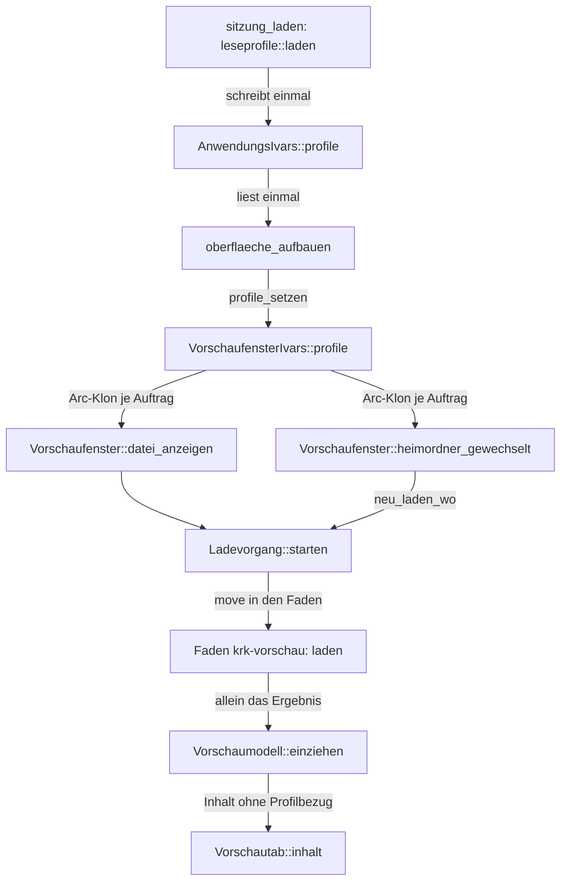

# Analysis: Klärung – die Vorschau übernimmt einen neuen Profilstand ohne Neuaufbau ihrer Tabs

**Date:** 2026-09-29 10:33
**Type:** Feasibility
**Status:** Complete
**Requested by:** orchestrator (Schritt 1 des Plans `260929-1025_*_plan-werkseinstellungen-zuruecksetzen-und-neu-einlesen.md`, Haltepunkt 1 des Spec `260929-0759_*_spec-werkseinstellungen-zuruecksetzen-und-neu-einlesen.md`)

## Question

Kann die laufende Vorschau einen neuen Satz Leseprofile übernehmen, ohne ihre Tabs neu zu bauen und ohne Neustart, so wie Entscheidung 1 des Plans es vorsieht? Beantwortet werden die vier Fragen (a) bis (d) aus Schritt 1, jede am Quelltext.

## Scope

Gelesen: `crates/krk-ui/src/appkit/vorschau.rs`, `crates/krk-ui/src/vorschaumodell.rs`, die Start- und Ortswege in `crates/krk-ui/src/appkit/anwendung.rs`, dazu `zusammenfassen` in `crates/krk-core/src/leseprofil/bausteine.rs` und `Zusammenfassung` und `Profile` in `crates/krk-core/src/leseprofil/mod.rs`. Plan, Entscheidung 1 und Schritt 1; Spec, C3.1, der Abschnitt zur fallenden Zusage C4.5 und `## Stops when`.

Baum: HEAD `fe4b9fb` vom 2026-09-29 10:30 +0200, Zweig `main`, laut `git status -sb` 5 Commits vor `origin/main`. Der Arbeitsbaum weicht allein im Werkbankverzeichnis ab: im Ereignisprotokoll und an der Markerumbenennung des Plans von `_o_` auf `_p_`. Keine der gelesenen Quelldateien ist geändert, jede Aussage unten gilt für diesen Stand.

## Findings

### Wo der Profilsatz wohnt und wohin er reist

Die Kanten laufen vom Lesen der Datei bis zum Inhalt eines Tabs. Kein Pfeil führt vom Tab zurück zum Profilsatz: ein Tab hält das Ergebnis und nie den Satz.

### (a) Hält außer `VorschaufensterIvars::profile` eine Stelle den Profilsatz über einen Auftrag hinaus?

| Stelle | Hält den Satz? | Beleg |
|---|---|---|
| `VorschaufensterIvars::profile` | ja, `OnceCell<Arc<Profile>>` | `appkit/vorschau.rs:727`, gesetzt in `profile_setzen` (`:1047`), gelesen in `datei_anzeigen` (`:1067`) und `heimordner_gewechselt` (`:1095`) |
| `AnwendungsIvars::profile` | **ja, zweiter Halter**, `RefCell<Arc<Profile>>` | `appkit/anwendung.rs:760`. Geschrieben einmal in `sitzung_laden` (`:2219`), gelesen einmal in `oberflaeche_aufbauen` (`:1672`), sonst nirgends (`grep` über `profile.borrow`, `profile.set`, `.profile`). |
| `Vorschautab` (Titel, Inhalt, Pfad, Ladevorgang) | nein | `vorschaumodell.rs:453-467`. Kein Feld trägt `Profile`. |
| `Inhalt::Zusammenfassung` | nein, allein das Ergebnis | `krk_core::leseprofil::Zusammenfassung` führt `name`, `pfad` und `zeilen` (`leseprofil/mod.rs:590-594`). Kein Verweis auf ein `Profil` oder einen Satz. |
| `Inhalt::Metadaten { zaehlzeilen }` | nein | `vorschaumodell.rs:356-361`, Zeilen des Default-Profils als Werte |
| `Vorschaumodell` | nein | `vorschaumodell.rs:486-489`, allein `tabs` und `aktiv` |
| Einfärbung (`einfaerbung`, `einfaerbungsstand`), `Quellbezug`, Tableiste | nein | In `appkit/vorschau.rs` kommt `profile` allein an den Zeilen 727, 883, 1047-1048, 1067 und 1095 vor. Die übrigen Treffer sind Kommentare und die Probe. |
| Arbeitsfaden `krk-vorschau` | ja, bis `laden` zurückkehrt | `Ladevorgang::starten` (`vorschaumodell.rs:421-448`) zieht den `Arc` in den Faden. Dort liest `laden` den Satz allein in `zusammenfassen(profile, pfad)` (`:908`). |

**Der Faden gilt nach dem Kriterium des Plans als abgelöst.** Der Empfänger lebt allein in `Ladevorgang::empfaenger` (`:399`), und der `Ladevorgang` lebt allein in `Vorschautab::ladevorgang`. `neu_laden_wo` (`:648`) und `datei_anzeigen` (`:609`) ersetzen ihn durch Zuweisung, und der alte Empfänger fällt mit ihm. `Vorschaumodell::einziehen` (`:742-767`) fragt allein den Empfänger, der gerade im Tab steht. Das Ergebnis des alten Fadens kommt deshalb nie an, auch dann nicht, wenn es schon im Kanal der Tiefe 1 wartet: der Kanal fällt mitsamt seinem Puffer. Der alte Faden rechnet bis zum Ende von `laden` weiter und hält den alten `Arc` so lange; das Ende ist durch `HOECHSTENS_LESELAEUFE` und `HOECHSTENS_OEFFNUNGEN` begrenzt. Danach scheitert sein `send` still (Modulkopf, `# Der Arbeitsfaden`).

**Befund (a):** Es gibt einen zweiten dauerhaften Halter, `AnwendungsIvars::profile`. Er hält eine Vorschau nicht fest, weil ihn nach dem Start niemand mehr liest. Nach dem Zurücksetzen stünde dort aber der alte Satz. Schritt 8 des Plans schreibt ihn schon mit („Profile in `AnwendungsIvars::profile` und `vorschau.profile_uebernehmen`“); Entscheidung 1 nennt ihn nicht. Weitere Halter gibt es nicht.

### (b) Lässt sich jeder profilabhängige Tab über den Weg von `neu_laden_wo` an Ort und Stelle neu laden?

**Welche Inhalte vom Profilsatz abhängen.** `laden` (`vorschaumodell.rs:868-987`) liest den Satz an genau einer Stelle, im Zweig `metadaten.typ != Typ::Datei` (`:891-920`). Dieser Zweig liefert drei Ausgänge:

| Ausgang von `zusammenfassen` | `Inhalt` | profilabhängig |
|---|---|---|
| `Some(Auskunft::Erkannt(_))` | `Zusammenfassung` | ja |
| `Some(Auskunft::Default(_))` | `Metadaten { typ: Ordner, zaehlzeilen }` | ja, denn unter einem anderen Satz kann der Ordner erkannt werden |
| `None` | `Metadaten { typ: Ordner oder Verknuepfung, zaehlzeilen: [] }` | ja für eine Verknüpfung auf einen Ordner: `zusammenfassen_gezaehlt` erkennt am aufgelösten Pfad (`bausteine.rs:317-344`), also kann sie unter einem anderen Satz eine `Zusammenfassung` werden |

Die Werte `Leer`, `Text`, `Markdown`, `Bild`, `Pdf` und `Hinweis` entstehen vor dem Zweig oder im Dateizweig (`:871-882`, `:921-986`) oder ganz ohne `laden` (`zwischenablage_anzeigen`, `:664-680`). Keiner hängt vom Satz ab. `Metadaten` mit `typ == Typ::Datei` entsteht allein im Dateizweig, als Rückfall für zu groß, unlesbar oder kein UTF-8, und hängt ebenso nicht davon ab.

**Die Trefferfrage aus Entscheidung 1**, `Zusammenfassung` oder `Metadaten` oder laufender `Ladevorgang`:

- **Vollständig: ja.** Jeder Tab, dessen angezeigter Inhalt im Ordnerzweig entstand, ist `Zusammenfassung` oder `Metadaten`. Jedes Ergebnis mit dem alten Satz, das noch nicht angezeigt ist, hängt an einem `Ladevorgang`, auch wenn es schon im Kanal wartet.
- **Genau ist sie nicht, aber sie schadet nicht.** `Metadaten` mit `typ == Typ::Datei` wird ebenfalls neu geladen, ohne dass sich etwas ändern kann. Das kostet einen `lstat(2)` und höchstens ein Lesen bis zur jeweiligen Grenze, beim Rückfall „kein UTF-8“ also bis zu 1 MB. Genau wäre `Metadaten { metadaten, .. }` mit `metadaten.typ != Typ::Datei`; das Feld reist mit dem Inhalt (`:258-269`).
- **Die drei Klassen sind nicht disjunkt.** Ein Tab kann eine `Zusammenfassung` zeigen und zugleich einen neuen Pfad laden. Das schadet nicht, solange die Frage **ein** Prädikat je Tab ist und je Treffer genau einen Auftrag startet, wie die Schleife von `neu_laden_wo` es tut (`:639-655`).
- **Welcher Pfad neu geladen wird, ist schon richtig gelöst.** `neu_laden_wo` nimmt den Pfad des laufenden Vorgangs vor dem angezeigten (`:640-644`). Ein Tab mitten im Laden bekommt also die neuere Auswahl des Nutzers mit dem neuen Satz und fällt nicht auf den alten angezeigten Pfad zurück.
- **„Der den alten Satz trägt“ lässt sich nicht erfragen.** `Ladevorgang` hält keinen Verweis auf seinen `Arc`. Das braucht es auch nicht: alles läuft auf dem Hauptfaden, `profile_uebernehmen` setzt das Merkfeld vor der Schleife, also hat jeder Vorgang, der beim Eintritt in die Schleife steht, den alten Satz. Das Kriterium ist damit `ladevorgang.is_some()`.

**Aktiv, verdeckt und mitten im Laden.** Die Schleife von `neu_laden_wo` geht über alle Tabs und fragt nicht nach `aktiv` (`:639`). `einziehen` füllt einen verdeckten Tab still und meldet allein einen geänderten aktiven Tab (`:754-756`), der danach durch `anzeigen` geht (`appkit/vorschau.rs:1291-1301`). `self.aktiv` wird dabei nicht verändert. Titel und Inhalt bleiben bis zur Lieferung stehen, es flackert also nichts. Ein Tab ohne Pfad und ohne Vorgang, also `Leer` oder die Zwischenablage, fällt schon heute durch (`:645`), und das ist richtig so. Es entsteht kein Tab, keiner wird geschlossen, und der Faden ist derselbe `Ladevorgang::starten`.

**Das Zusammenspiel mit dem Ortswechsel trägt in der Reihenfolge von Schritt 8.** `profile_uebernehmen` vor `ort_wechseln` heißt: die Aufträge des Profilnachzugs nehmen die Abschrift des Heimordners **vor** dem Wechsel mit (`heimgriff::lesen` in `datei_anzeigen` und `heimordner_gewechselt`). Das betrifft allein Tabs, die eine Sonderdatei am alten oder neuen Ort laden. Genau diese Tabs lädt `ort_wechseln` über `heimordner_gewechselt` noch einmal (`anwendung.rs:5484-5502`), nachdem es den Griff ersetzt hat, und dann liest es den neuen Satz aus dem Merkfeld. Der zweite Auftrag ersetzt den ersten, und dessen Ergebnis fällt. Für Ordner hat der Heimordner in `laden` keine Wirkung außer der Frage nach `secrets.txt` (`:880`), und die ist vom Satz unabhängig.

**Befund (b):** Ja. Jeder profilabhängige Tab lässt sich über dieselbe Schleife neu laden, aktiv, verdeckt und mitten im Laden. Die Trefferfrage ist vollständig und über ein Prädikat je Tab widerspruchsfrei. Zu präzisieren ist sie an den zwei Stellen, die unter „Berichtigungen“ stehen.

### (c) Trägt ein Tab beim Aufruf von `profile_setzen` in `oberflaeche_aufbauen` schon profilabhängigen Inhalt oder einen laufenden Vorgang?

Nein.

- `Vorschaufenster::bauen` (`appkit/vorschau.rs:821-947`) legt `Vorschaumodell::neu()` an. Das ist ein Tab mit `Inhalt::Leer`, ohne Pfad und ohne Vorgang (`vorschaumodell.rs:470-477`, `:500-505`). `bauen` ruft danach allein `anzeigen`, und `anzeigen` startet keinen Auftrag.
- Zwischen dem Bau (`anwendung.rs:1472`) und `profile_setzen` (`:1672`) wird die Vorschau allein über `seitenmelder_setzen` berührt (`:1481`). Die übrigen Zeilen betreffen Editor, Git-Bereich, Aufteilung und Fenster.
- In die Vorschau schreibt allein `self.vorschau()`, und das hängt an `ivars.vorschau`. Dieses Feld wird erst eine Zeile nach `profile_setzen` gesetzt (`:1673`), und `vorschau()` bricht vorher mit `expect` ab (`:2253-2258`). Der einzige Weg der Dateiliste in die Vorschau, `auswahlmelder_setzen` mit `vorschau_fuellen`, wird erst danach eingehängt (`:1754-1760`).
- Die Tabs der Vorschau kommen nicht aus der Sitzung: `Vorschaumodell` hat allein `neu`.

**Befund (c):** Beim Start ist ein Nachladen ein leerer Lauf, die Schleife liefert null Aufträge. Zu beachten ist dabei eine Sache, die unter „Berichtigungen“ steht: der Zeitgeber darf nur bei mehr als null Aufträgen anlaufen.

### (d) Holt eine ausgeblendete Vorschau ihren Nachtrag über `datei_anzeigen` mit dem Merkfeld zum Zeitpunkt des Nachtrags?

Ja.

- Bei ausgeblendeter Vorschau merkt `vorschau_fuellen` (`anwendung.rs:2288-2299`) nur den Pfad in `AnwendungsIvars::vorschau_nachtrag` vor.
- Beim Einblenden ruft der Nachzug der Sichtbarkeit `vorschau_nachtragen` (`:5888-5891`). Das ruft `self.vorschau().datei_anzeigen(&pfad)` (`:2306-2311`).
- `Vorschaufenster::datei_anzeigen` liest das Merkfeld beim Aufruf (`appkit/vorschau.rs:1067`) und reicht den Klon in den neuen Auftrag. Wurde das Merkfeld vorher ersetzt, trägt der Nachtrag den neuen Satz, und mehr braucht es nicht.

Eines gehört zur Vollständigkeit dazu. `profile_uebernehmen` lädt die profilabhängigen Tabs auch dann neu, wenn die Vorschau ausgeblendet ist. Das Feld `vorschau_nachtrag` begründet sich gerade damit, dass eine ausgeblendete Vorschau nicht liest (`:855-866`). Einen Präzedenzfall gibt es aber schon: `heimordner_gewechselt` fragt ebenfalls nicht nach der Sichtbarkeit (`appkit/vorschau.rs:1094-1108`). Der Befehl ist selten und kommt auf Anforderung, und Entscheidung 1 sagt ausdrücklich, dass verdeckte Tabs gleich behandelt werden. Das ist also keine Berichtigung, sondern eine benannte Folge.

## Implications

Entscheidung 1 trägt. Die Vorschau hat den Nachladeweg schon, und er erfüllt beide Bedingungen des Haltepunkts. Er baut keinen Tab neu, denn Titel, Stelle, Aktivität und Inhalt bleiben bis zur Lieferung stehen. Er führt keinen zweiten Ladeweg ein, denn es ist derselbe `Ladevorgang::starten` über dieselbe Schleife. Der Tab ist nie Halter des Satzes, und ein abgelöster Faden kann sein Ergebnis nicht mehr abliefern. Deshalb reicht es, das Merkfeld zu tauschen und die abhängigen Tabs neu zu beauftragen.

## Recommendations

**Berichtigungen an Entscheidung 1.** Keine davon baut einen Tab neu oder führt einen zweiten Ladeweg ein:

1. **„Laufender `Ladevorgang`, der den alten Satz trägt“ wird zu `ladevorgang.is_some()`.** Der Vorgang hält keinen Verweis auf seinen Satz. Es genügt, dass `profile_uebernehmen` das Merkfeld vor der Schleife setzt. Ausdrücklich eingeschlossen ist ein Vorgang, dessen Ergebnis schon im Kanal wartet.
2. **Die Trefferfrage ist ein Prädikat je Tab, und der Pfad kommt wie heute zuerst aus dem Vorgang.** Die Klassen überschneiden sich (eine Zusammenfassung, die gerade einen anderen Pfad lädt). Deshalb soll die Schleife je Tab höchstens einen Auftrag starten, mit `vorgang.pfad` vor `tab.pfad`, genau wie `neu_laden_wo` es heute tut.
3. **`profile_uebernehmen` wirft den Zeitgeber nur bei mehr als null Aufträgen an**, wie `heimordner_gewechselt` (`appkit/vorschau.rs:1105-1107`). Dann bleibt der Start wegen Befund (c) ohne jede zusätzliche Arbeit. Daran hängt die L4-Klausel unter `## Where this work stops`.
4. **`AnwendungsIvars::profile` ist ein zweiter Halter und wird mitgenannt.** Schritt 8 setzt ihn schon. Entscheidung 1 sollte ihn nennen, damit die Probe aus Schritt 8 nicht allein das Merkfeld der Vorschau sieht.

**Wahlweise Präzisierung, keine Bedingung.** `Inhalt::Metadaten` lässt sich auf `metadaten.typ != Typ::Datei` einengen. Das erspart unnötige Aufträge für Dateien im Metadatenrückfall. Die Frage bleibt so vollständig, weil Ordner und Verknüpfungen erfasst bleiben, auch eine Verknüpfung auf einen Ordner.

**Nächster Schritt:** Schritt 2 (Klärung des Ortswegs) steht noch aus. Nach zwei Go-Urteilen geht Schritt 4 an `code-implementer`, mit diesen Berichtigungen.

## Filed Issues

Keine. Die Berichtigungen gehören in Entscheidung 1 und Schritt 4 und sind kein Defekt am Baum.

## Sources

- `crates/krk-ui/src/appkit/vorschau.rs`: `VorschaufensterIvars` (606-732), `Vorschaufenster::bauen` (821-947), `profile_setzen` (1047), `datei_anzeigen` (1055-1083), `heimordner_gewechselt` (1094-1108), `einziehen` (1291-1301), Probe `die_profile_haben_genau_einen_schreiber_und_einen_rufer` (2096-2155)
- `crates/krk-ui/src/vorschaumodell.rs`: Modulkopf `# Der Arbeitsfaden` (163-172), `Inhalt` (274-385), `Ladevorgang` (398-449), `Vorschautab` (453-478), `Vorschaumodell::neu`, `datei_anzeigen`, `neu_laden_wo`, `zwischenablage_anzeigen`, `einziehen` (500-767), `laden` (868-987)
- `crates/krk-ui/src/appkit/anwendung.rs`: `AnwendungsIvars::profile` (743-760), `vorschau_nachtrag` (855-866), `neu` (1368-1429), `oberflaeche_aufbauen` (1432-1760), `sitzung_laden` (2162, 2219), `vorschau` (2253-2258), `vorschau_fuellen` und `vorschau_nachtragen` (2288-2311), `ort_wechseln` (5478-5510), Nachzug der Sichtbarkeit (5888-5891)
- `crates/krk-core/src/leseprofil/bausteine.rs`: `zusammenfassen`, `zusammenfassen_gezaehlt` (294-344)
- `crates/krk-core/src/leseprofil/mod.rs`: `Profile` (187-189), `Zusammenfassung` (590-594)
- Plan `260929-1025_*_plan-werkseinstellungen-zuruecksetzen-und-neu-einlesen.md`, Entscheidung 1, Schritte 1, 4 und 8
- Spec `260929-0759_*_spec-werkseinstellungen-zuruecksetzen-und-neu-einlesen.md`, C3.1, Z. 80 (C4.5 fällt), `## Stops when`

## Open Questions

- [ ] Keine, die den Schritt aufhält. Ob die wahlweise Präzisierung bei `Metadaten` übernommen wird, entscheidet der Ausführende von Schritt 4.

Urteil: Go
