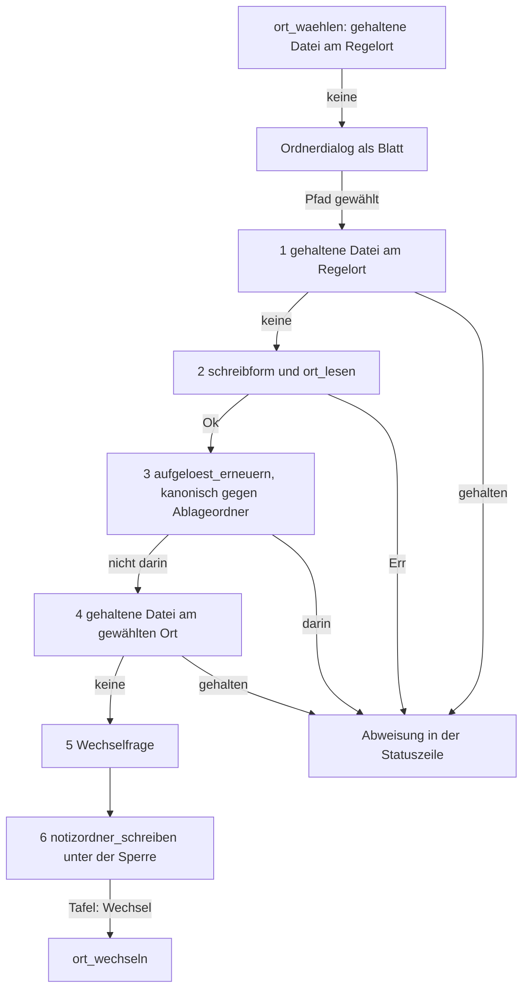

# Analysis: Klärung, der Weg von „Ort wählen…“ mit festem Ziel

**Date:** 2026-09-29 10:34
**Type:** Feasibility
**Status:** Complete
**Requested by:** orchestrator, Schritt 2 des Plans `260929-1025_*_plan-werkseinstellungen-zuruecksetzen-und-neu-einlesen.md` (Haltepunkt 2 des Spec `260929-0759_*_spec-werkseinstellungen-zuruecksetzen-und-neu-einlesen.md`)

## Question

Lässt sich der Prüfweg von „Ort wählen…“ so in eine Funktion `ortsziel_pruefen(text)` fassen, dass der neue Befehl „Auf Werkseinstellungen zurücksetzen…“ ihn mit dem festen Ziel `~/krkhome` geht, ohne eine zweite Prüffolge für den Notizordner zu bauen und ohne das Verhalten von „Ort wählen…“ über den in Entscheidung 2 benannten Vorrangfall hinaus zu ändern? Beantwortet werden die vier Fragen (a) bis (d) aus Schritt 2.

## Scope

Gelesen am Quelltext:

- `crates/krk-ui/src/appkit/anwendung.rs`: `ort_waehlen` (5309), `gehaltene_notizdatei` (5338), `ort_uebernehmen` (5372 bis 5470), `ort_wechseln` (5481 bis 5511), `unter_der_sperre` (1976), `sitzung_bauen` (9765), `sitzung_vormerken` (9830), der Ausführungszweig in `kommando_ausfuehren_bei` (4123 bis 4456), `wird_beendet` (1279), die Proben `die_ortswahl_hat_genau_eine_rufkette` (11149), `die_ortswahl_fragt_vor_dem_schreiben_und_setzt_den_griff_vor_dem_nachzug` (11176), `der_start_erreicht_weder_das_anlegen_noch_das_aufloesen` (11039) und der Helfer `rumpf` (10575).
- `crates/krk-core/src/heimordner/ort.rs` vollständig; `Heimordner::aufgeloest_erneuern` in `crates/krk-core/src/heimordner/mod.rs` (Doc-Kommentar 242 bis 249).
- `crates/krk-core/src/ablage/einstellungen.rs` (`Ortswert`, `Einstellungen::auslieferung`), `resources/default-settings.toml` (Zeile 94), `crates/krk-core/src/ablage/sitzung.rs` (`Sitzungsschreiber::vormerken`, `abgleichen`), `Ablage::durchgang` in `crates/krk-core/src/ablage/mod.rs` (626 bis 644).
- `crates/krk-ui/src/heimgriff.rs` (`lesen`, `lage`), `crates/krk-ui/src/appkit/vorschau.rs` und `appkit/tabelle.rs` (je `heimordner_gewechselt`), `crates/krk-ui/src/appkit/blaetter/ortwahl.rs` (`zeigen`, `erster_pfad`).
- Die Proben in `crates/krk-core/tests/heimordner.rs` zu `gehaltene_notizdatei`, `abweisungssatz` und `ImAblageordner`, dazu `crates/krk-core/tests/ablage.rs:2115`.
- Spec H3 in `260926-1451_*_spec-home-menue-und-einstellbarer-ort.md` (Arbeitspaket `260925-2356-f2-oeffnet-krkhome-statt-notizfenster`), Zeilen 127 bis 190.

Baum: `/Users/k1/Projects/productive/krk`, HEAD `fe4b9fb` vom 2026-09-29 10:30 +0200, Zweig `main`, fünf Commits vor `origin/main`. Der Arbeitsbaum trägt außer dem Plan und dem Ereignisprotokoll keine Änderung; der Quelltext unter `crates/` steht auf HEAD. Jede Aussage im Präsens gilt für diesen Stand.

## Findings

### Der heutige Weg in einem Bild

Die Schritte 1 bis 5 lesen und schreiben nichts; Schritt 3 stellt mit `canonicalize` den einzigen Systemaufruf. Erst Schritt 6 schreibt. Entscheidung 2 zieht 1 bis 5 in `ortsziel_pruefen` und lässt Schritt 6 und die Tafel in `ort_uebernehmen`.

### (a) Die Schritte 1 bis 5 lassen sich fassen, und `ort_uebernehmen` tut danach bis auf den Vorrangfall dasselbe

**Befund: ja.** Die fünf Schritte hängen an genau vier Eingaben, und keine davon ist der Dialog: dem Zieltext, `heimgriff::lage` und `heimgriff::lesen` (`ort_uebernehmen`, 5375 f.), `pfade::benutzerverzeichnis()` samt `self.ablageordner()` (5386 f.) und dem Editorzustand, den `gehaltene_notizdatei` fragt (5338 bis 5341). Nur die Schreibform `ort::schreibform(pfad, …)` (5388) braucht den gewählten Pfad. Sie bleibt nach Entscheidung 2 in `ort_uebernehmen`, und der Befehl braucht sie nicht, weil er den Text schon hat.

Was Schritt 6 und die Tafel danach brauchen, trägt das Feld `Ortsziel` aus Schritt 5 des Plans: `text` und `neuer_pfad` für `notizordner_schreiben` und seinen Vergleich (5435 bis 5438), `neu` und `regelort` für `ort_wechseln` (5467), `wechsel` für die Tafel (5461 bis 5469). `zuhause` und `ablageordner` braucht die Vergleichsfunktion in Schritt 6 ebenfalls. `pfade::benutzerverzeichnis` ist `std::env::home_dir()` (`crates/krk-core/src/ablage/pfade.rs:310`) und `ablageordner` eine Frage an die Ablage ohne Plattenzugriff (5281 bis 5288), also darf `ort_uebernehmen` beide neu erheben oder `Ortsziel` sie tragen lassen, ohne eine Prüfung zu wiederholen.

**`gehalten` reicht als ein Feld.** `ort::gehaltene_notizdatei` antwortet mit dem Dateinamen des Editorpfads oder mit `secrets.txt` (`ort.rs`, 405 bis 408); der Name hängt am Editor und nicht am gefragten Ort. Beide Fragen ergeben für denselben Editorzustand denselben Namen, und `ortsziel_pruefen` darf sie zu `gehalten_am(regelort).or_else(|| gehalten_am(neu))` fassen. Die Probe `die_ortswahl_fragt_vor_dem_schreiben_…` zählt danach die zwei Aufrufe im Rumpf von `ortsziel_pruefen`, wie Schritt 5 des Plans es vorsieht.

**Was sich an „Ort wählen…“ ändert, ist allein die Reihenfolge der Abweisungen**, und zwar in drei Lagen, alle mit demselben Ausgang „nichts geschrieben“:

| Lage | heute gemeldet | nach Entscheidung 2 gemeldet | erreichbar? |
|---|---|---|---|
| gehaltene Datei am Regelort und `ort_lesen` weist den Text ab (lexikalisch im Ablageordner) | Abweisungssatz mit Dateiname (5379 bis 5382) | `Ortsfehler::ImAblageordner` (5394 bis 5399) | nur, wenn der Editor zwischen Dialog und Wahl eine Notizdatei öffnet |
| gehaltene Datei am Regelort und die kanonische Form liegt im Ablageordner | Abweisungssatz | `ImAblageordner` aus Schritt 3 (5404 bis 5413) | ebenso |
| gehaltene Datei am Regelort und `schreibform` liefert `None` | Abweisungssatz | Satz „kein gültiges UTF-8“ (5388 bis 5392) | nein: `erster_pfad` baut den Pfad aus einem `NSString` (`ortwahl.rs`, 140 bis 145), also ist er immer gültiges UTF-8 |

Die ersten zwei Zeilen sind der Vorrangfall aus Entscheidung 2; Entscheidung 2 nennt ihn als „ungültiger gewählter Ort“ und meint damit beide Gestalten, den lexikalischen und den kanonischen Treffer. Die dritte Zeile nennt Entscheidung 2 nicht, und sie ist unerreichbar. Auch die ersten zwei sind aus dem Dialog praktisch unerreichbar: der Ordnerdialog steht als Blatt (`beginSheetModalForWindow_completionHandler`, `ortwahl.rs:135`), und während eines Blattes weist `kommando_ausfuehren` jeden Befehl ab, der den Editor füllen könnte. Schritt 1 in `ort_uebernehmen` ist eine Rückversicherung für ein Fenster, das der Bau schon schließt.

**Eine Wirkung ohne sichtbaren Ausgang kommt dazu.** Heute endet eine Abweisung in Schritt 1, bevor `aufgeloest_erneuern` den gewählten Ort mit `canonicalize` berührt. Danach läuft `canonicalize` auch in diesem Fall. Der Ort ist der eben im Dialog gewählte, also erreichbar, und geschrieben wird nichts.

### (b) Kein Kriterium von H3 und keine Probe hält den Vorrang fest

**Befund: nein.** Durchsucht sind die Kriterien von H3 (Spec, 136 bis 166), die Proben unter `crates/krk-core/tests/heimordner.rs` und das Prüfmodul von `anwendung.rs`.

- Das Kriterium „Hält der Editor `notes.txt`, `tasks.txt` oder `secrets.txt` des geltenden Ortes …, öffnet der Befehl keinen Dialog“ hält die Frage in `ort_waehlen` vor dem Dialog (5311 bis 5316). Diese Stelle bleibt unverändert, und die Probe `die_ortswahl_fragt_…` hält sie weiter (11180 bis 11184).
- Das Kriterium zum **gewählten** Ort („schreibt KRK nach der Wahl nichts … und die Statuszeile nennt die Datei“) setzt schon heute einen gültigen Ort voraus: Schritt 4 steht hinter den Schritten 2 und 3, und ein ungültiger gewählter Ort meldet heute den Ortsfehler, auch wenn der Editor eine Datei dort hält. Entscheidung 2 ändert an dieser Reihenfolge nichts.
- `die_ortswahl_fragt_vor_dem_schreiben_…` verlangt allein, dass beide Fragen vor `notizordner_schreiben(` stehen (11194 bis 11199), nicht vor `ort_lesen`. `die_ortswahl_hat_genau_eine_rufkette` zählt Rufer und keine Reihenfolge. Die Kernproben `gehaltene_notizdatei_erkennt_die_drei_dateien_am_gefragten_ort` (2843) und `die_saetze_der_ortswahl_nennen_datei_und_orte` (2918) prüfen die Frage und den Satz, nicht ihren Rang.

Der Vorrang steht allein im Doc-Kommentar von `ort_uebernehmen` (5349 bis 5351, „noch einmal, denn zwischen Dialog und Wahl kann der Editor eine geöffnet haben“). Schritt 5 des Plans schreibt diesen Kommentar ohnehin neu. Wer den Vorrang trotzdem halten will, erreicht das ohne zweite Prüffolge: `ort_uebernehmen` behält vor der Schreibform einen Aufruf von `gehaltene_notizdatei(regelort)`, dieselbe Funktion und keine eigene Regel. Wir empfehlen das nicht, weil nichts ihn verlangt und die Probe dann drei Fragen in zwei Rümpfen zählen müsste.

### (c) Der Ortswert der Auslieferungsfassung besteht die Prüfungen, und die Wechselfrage braucht die gehaltene Datei nicht

**Befund: ja, mit einer Einschränkung für die Form des Aufrufs.**

- **Der Wert.** `Einstellungen::auslieferung().notizordner` ist `Ortswert::Text("~/krkhome")` (`resources/default-settings.toml:94`; gehalten von `crates/krk-core/tests/ablage.rs:2115 f.`). `ortsziel_pruefen` nimmt einen `String`. Der Befehl muss den Text also aus `Ortswert` holen, und `Ortswert` hat zwei Varianten ohne Auffangzweig (`einstellungen.rs`, 158 bis 163). Der Zweig `KeinText` ist für die eingebettete Fassung unerreichbar. Er braucht trotzdem einen Ausgang und nimmt am saubersten `Ortsfehler::KeinText(…).meldung()` als Abbruchsatz nach C3.7.
- **`ort_lesen`** (`ort.rs`, 146 bis 173): `~/krkhome` beginnt mit `~/`, wird gegen das Benutzerverzeichnis gesetzt und liegt nicht unter `~/Library/Application Support/KRK`. Das Ergebnis ist `Ok(<zuhause>/krkhome)`. Einziger Fehlerfall ist `KeinBenutzerverzeichnis`, wenn das System keines nennt. Er geht dann als Grund in die Statuszeile, wie C3.7 es verlangt.
- **Die kanonische Prüfung** (`ort_uebernehmen`, 5403 bis 5414): Fehlt `~/krkhome`, liefert `aufgeloest_erneuern` keine aufgelöste Form, und die Prüfung entfällt. Ist `~/krkhome` ein Verweis in den Ablageordner, weist sie ab, ebenfalls nach C3.7. Einen anderen Ausgang hat sie nicht.
- **Die Wechselfrage** (5423 bis 5431) liest allein `geltend` aus `heimgriff::lage` und `neu`, also die geschriebene und die aufgelöste Form beider Orte. `gehalten` kommt darin nicht vor. Sie beantwortet C3.8 so: Gilt `~/krkhome` in beliebiger Schreibweise, die `ort_lesen` zum selben Pfad bereinigt, ist `wechsel` falsch. Gilt ein Ort, dessen kanonische Form `~/krkhome` ist, ebenfalls. Gilt kein Ort (`Err`, etwa nach einer beim Start beschädigten `settings.toml`), ist `wechsel` wahr, und das deckt die `Ortsfolge::KeinerGalt` aus Schritt 8.

Die Befundwerte liegen damit vollständig vor der Frage nach der gehaltenen Datei. Die Regel „abweisen allein bei `wechsel && gehalten`“ aus Entscheidung 2 ist aus ihnen berechenbar.

**Eine Randlage zur Kenntnis, kein Hindernis.** Gilt `~/Dropbox/krkhome` und ist das ein Verweis auf `~/krkhome`, ist `wechsel` falsch. `settings.toml` trägt nach dem Zurücksetzen trotzdem `~/krkhome`, während der Griff und `gemerkter_ort` die alte Schreibweise behalten, bis KRK neu startet. Der nächste Start zeigt dann einen Wechselsatz, weil `ortswechsel` lexikalisch vergleicht (`ort.rs`, 275 bis 288). Genau so verhält sich „Ort wählen…“ heute im Zweig `(Geschrieben, false)` (5463 bis 5465), also ist das „dieselbe Wirkung“ nach C3.5 und keine Abweichung.

### (d) `ort_wechseln` lässt sich unverändert rufen, unter einer Bedingung, die der Plan einhält

**Befund: ja.** `ort_wechseln` (5481 bis 5511) tut in dieser Reihenfolge Folgendes:

1. `heimgriff::ersetzen` mit `neu`, im Speicher.
2. `einstellungen.notizordner = Ortswert::Text(text)`. Ist `AnwendungsIvars::einstellungen` unmittelbar davor aus der neu gelesenen `settings.toml` gesetzt, steht dort schon `Text("~/krkhome")`, und `text` ist nach (c) derselbe Text. Die Zuweisung ist gleichwertig und widerspricht dem Vollzug nicht. Terminal und alle übrigen Felder berührt sie nicht.
3. `gemerkter_ort` auf die geschriebene Form von `neu`, im Speicher.
4. `sitzung_vormerken()`, Erläuterung unten.
5. Nachzug der Tablisten beider Dateifenster und der Vorschau über `heimordner_gewechselt`. Beide Rümpfe (`tabelle.rs:1773`, `tabs.rs:991`, `vorschau.rs:1094`) starten Lesevorgänge und schreiben nichts auf die Platte. Die Vorschau liest dabei ihren Profilsatz aus dem Merkfeld. Läuft `profile_uebernehmen` vorher, wie Schritt 8 es anordnet, laden die Tabs am alten und neuen Ort mit den neuen Profilen. Ein Tab, den beide Nachzüge treffen, bekommt einen zweiten `Ladevorgang`, und das Ergebnis des ersten fällt. Das ist doppelte Arbeit, aber kein Widerspruch.
6. `antwort_zeigen` mit dem Wahlsatz. Entscheidung 2 lässt `ort_wechseln` diesen Satz zurückgeben. Das ist die einzige Änderung, die der Befehl an der Funktion braucht, und der Plan führt sie.

**`sitzung_vormerken` und `session.toml`.** `sitzung_vormerken` (9830 bis 9862) nimmt über `unter_der_sperre` einen eigenen Durchgang. `Sitzungsschreiber::vormerken` schreibt `session.toml` sofort, wenn der Takt abgelaufen ist oder noch nie geschrieben wurde, sonst beim nächsten Abgleich (`sitzung.rs`, 625 bis 669). Daraus folgen zwei Dinge.

- **Bedingung für den Vollzug:** `ort_wechseln` darf nicht im Rumpf des Durchgangs laufen, in dem `werkszustand::zuruecksetzen` und die Lader laufen. `Ablage::durchgang` sagt, dass der Rumpf nicht geschachtelt wird, weil ein zweiter Durchgang die Sperre des ersten vorzeitig abgäbe, und dass der Übersetzer das nicht hält (`ablage/mod.rs`, 633 bis 635). Schritt 8 ruft `ort_wechseln` nach dem Durchgang. Die Quelltextprobe, die Schritt 8 für `werkseinstellungen_vollziehen` neu anlegt, hält diese Lage bisher nicht und sollte sie mit aufnehmen.
- **Zur offenen Frage C2.6 gegen C3.5:** `session.toml` bleibt über den Befehl hinweg schon ohne `ort_wechseln` nicht bytegleich. `kommando_ausfuehren_bei` ruft nach jedem Zweig, der `true` liefert, `sitzung_vormerken` (4453 bis 4456). Der Zweig `werkseinstellungen` liefert nach Schritt 8 `true`, auch wenn nur die Rückfrage aufgeht. `wird_beendet` schreibt die Sitzung beim Beenden stets neu (1279 bis 1304). Eine Lesart von C2.6, die `session.toml` über den Befehl hinaus festhält, kann kein Befehl dieses Projekts einhalten. Die Lesart des Plans, C2.6 gelte dem Vorgang im Kern, ist damit die einzige erfüllbare. Entfiele das Vormerken in `ort_wechseln`, landete `gemerkter_ort` erst beim nächsten Vormerken oder beim Beenden auf der Platte. Beendete sich KRK davor ohne `applicationWillTerminate`, zeigte der nächste Start einen falschen Wechselsatz. Wir empfehlen, `ort_wechseln` samt Vormerken unverändert zu rufen.

### Eine rote Probe, die Schritt 5 nicht nennt

`der_start_erreicht_weder_das_anlegen_noch_das_aufloesen` (`anwendung.rs`, 11039 bis 11086) verlangt, dass `aufgeloest_erneuern` im ausgelieferten Code genau zwei Aufrufstellen hat und dass eine davon **im Rumpf von `ort_uebernehmen`** steht (11067 bis 11074). Nach Entscheidung 2 steht der Aufruf im Rumpf von `ortsziel_pruefen`. Die Gesamtzahl bleibt zwei, die dritte Zusicherung wird rot. Schritt 5 nennt als bewusst geänderte Proben allein `die_ortswahl_fragt_…` und `die_ortswahl_hat_genau_eine_rufkette`. Nach der Regel des Plans („Eine rote Probe, die der Schritt nicht namentlich als bewusst geändert nennt, ist ein Stopp“) hielte Schritt 5 an. Das ist eine Lücke im Plan und kein Hindernis im Code: die Zusage der Probe, der Start erreiche das Auflösen nicht, bleibt wahr, denn `ortsziel_pruefen` hat allein Befehle als Rufer.

### Doc-Kommentare, die mit dem dritten Anlass falsch werden und in keinem Schritt stehen

| Stelle | Aussage heute | wird falsch in |
|---|---|---|
| `Heimordner::aufgeloest_erneuern`, `crates/krk-core/src/heimordner/mod.rs:244` | „Allein für F2 und „Ort wählen…“ gedacht“ | Schritt 8 (dritter Anlass: der Befehl vor der Rückfrage und im Vollzug) |
| Modulkopf `crates/krk-core/src/heimordner/ort.rs`, 5 bis 9 | `ort_lesen` „hat zwei Frager: den Start … und … „Ort wählen…““ | Schritt 8 |
| `ort::gehaltene_notizdatei`, `ort.rs`, 378 bis 381 | „Gefragt von „Ort wählen…“, zweimal“ | Schritt 5 (Frager ist dann `ortsziel_pruefen`) und Schritt 8 |
| Kommentar in `der_start_erreicht_…`, `anwendung.rs`, 11055 f. | „Zwei Rufer … F2 und „Ort wählen…““ | Schritt 5 |

`crates/krk-core/src/heimordner/mod.rs` und `ort.rs` stehen in keiner Dateiliste der Schritte 3 bis 8.

### Zwei Formvorgaben für Schritt 5

- `ortsziel_pruefen` muss eine Methode im `impl` des Anwendungsdelegierten bleiben, wie Schritt 5 sie ansetzt (`&self`). Der Probenhelfer `rumpf` sucht das Ende eines Rumpfs an `"\n    }\n"` (10581 f.). Eine freie Funktion auf oberster Ebene fände er nicht richtig begrenzt.
- `ortsziel_pruefen` und `ort_uebernehmen` dürfen den Durchgang von Schritt 6 nicht in die neue Funktion ziehen. Die Funktion bleibt frei von Schreibvorgängen, sonst schriebe die Vorabfrage des Befehls vor der Rückfrage und bräche C3.6.

## Implications

Entscheidung 2 trägt. Der Befehl bekommt seine Prüfungen aus derselben Funktion wie „Ort wählen…“, und eine zweite Prüffolge entsteht nicht. Die Verhaltensänderung an „Ort wählen…“ bleibt auf den benannten Vorrangfall beschränkt, dazu eine unerreichbare Lage und ein `canonicalize`, der jetzt auch vor einer Abweisung läuft. Kein Kriterium und keine Probe verlangt den alten Vorrang. Der Plan braucht vier Berichtigungen, damit Schritt 5 nicht an einer ungenannten Probe anhält und die Kommentare nach Schritt 8 stimmen. Die offene Frage zu `session.toml` beantwortet der Code in Richtung der Lesart, die der Plan schon gewählt hat.

## Recommendations

Berichtigungen an Entscheidung 2 und an den Schritten, die sie umsetzen, alle an `implementation-planner` oder in der Durchsicht des Plans:

1. **Schritt 5, bewusst geänderte Proben:** `der_start_erreicht_weder_das_anlegen_noch_das_aufloesen` aufnehmen. Die dritte Zusicherung sucht `aufgeloest_erneuern` im Rumpf von `ortsziel_pruefen` statt `ort_uebernehmen`. Die Gesamtzahl zwei bleibt, und der Kommentar über den Rufern nennt die neue Funktion.
2. **Entscheidung 2, Vorrangfall vollständig benennen:** Der Fall umfasst beide Gestalten des ungültigen Orts, `ort_lesen` und die kanonische Prüfung. Dazu kommt die unerreichbare Lage der Schreibform ohne gültiges UTF-8, und `canonicalize` läuft jetzt vor der Abweisung wegen einer gehaltenen Datei. Der Doc-Kommentar von `ort_uebernehmen` in Schritt 5 schreibt das aus.
3. **Schritt 8, Lage von `ort_wechseln`:** Die neue Quelltextprobe zu `werkseinstellungen_vollziehen` hält zusätzlich, dass `ort_wechseln(` hinter dem Ende des Rumpfs von `unter_der_sperre(` steht, weil `sitzung_vormerken` einen eigenen Durchgang nimmt und Durchgänge nicht geschachtelt werden.
4. **Schritt 8, Dateiliste und Kommentare:** `crates/krk-core/src/heimordner/mod.rs` (`aufgeloest_erneuern`) und `crates/krk-core/src/heimordner/ort.rs` (Modulkopf, `gehaltene_notizdatei`) aufnehmen und dort den dritten Anlass nennen. Das folgt der Regel des Plans für Kommentare, die „genau ein Rufer“ oder „allein für“ behaupten.

Zur Kenntnis, ohne Planänderung: `Ortsziel::gehalten` darf ein einzelnes `Option<String>` sein (Befund a). Der Zweig `Ortswert::KeinText` im Befehl braucht einen Abbruchsatz (Befund c). Die offene Frage zu `session.toml` kann mit dem Befund (d) geschlossen werden: Die Lesart des Plans ist die einzige erfüllbare, und `ort_wechseln` behält sein Vormerken.

Nächster Schritt: Das Tor zu Stufe B hängt noch am Bericht aus Schritt 1. Dieser Bericht gibt für Haltepunkt 2 frei.

## Filed Issues

Keine. Die vier Berichtigungen betreffen den Plan, der noch in Durchsicht steht (`_p_`), und gehören in ihn und nicht in eigene Defektdatensätze.

## Sources

- `crates/krk-ui/src/appkit/anwendung.rs`: 1279 bis 1304, 1976 bis 1984, 4123 bis 4125, 4386 bis 4391, 4453 bis 4456, 5281 bis 5288, 5290 bis 5341, 5343 bis 5511, 9765 bis 9813, 9826 bis 9862, 10575 bis 10589, 11011 bis 11086, 11144 bis 11227
- `crates/krk-core/src/heimordner/ort.rs`: 1 bis 41, 146 bis 173, 183 bis 191, 275 bis 288, 368 bis 409, 414 bis 431
- `crates/krk-core/src/heimordner/mod.rs`: 242 bis 249
- `crates/krk-core/src/ablage/einstellungen.rs`: 140 bis 186; `resources/default-settings.toml:94`
- `crates/krk-core/src/ablage/sitzung.rs`: 600 bis 669; `crates/krk-core/src/ablage/mod.rs`: 626 bis 644; `crates/krk-core/src/ablage/pfade.rs:310`
- `crates/krk-ui/src/heimgriff.rs`: 118 bis 142; `crates/krk-ui/src/appkit/vorschau.rs:1094`; `crates/krk-ui/src/appkit/tabelle.rs:1773`; `crates/krk-ui/src/tabs.rs:991`
- `crates/krk-ui/src/appkit/blaetter/ortwahl.rs`: 107 bis 145
- `crates/krk-core/tests/heimordner.rs`: 2843 bis 2893, 2918 bis 2930; `crates/krk-core/tests/ablage.rs`: 2115 f.
- Spec H3: `260926-1451_*_spec-home-menue-und-einstellbarer-ort.md` (Arbeitspaket `260925-2356-f2-oeffnet-krkhome-statt-notizfenster`), 127 bis 190
- Plan `260929-1025_*_plan-werkseinstellungen-zuruecksetzen-und-neu-einlesen.md`: Entscheidungen 2 und 10, Schritte 2, 5 und 8, `## Open Questions`
- Spec `260929-0759_*_spec-werkseinstellungen-zuruecksetzen-und-neu-einlesen.md`: C2.6, C3.5 bis C3.8, `## Stops when`

## Open Questions

- [ ] Übernimmt der Planer die vier Berichtigungen vor Schritt 5? Berichtigung 1 muss vor Schritt 5 im Plan stehen, sonst hält Schritt 5 nach der eigenen Regel des Plans an.
- [ ] Schließt der Nutzer den ersten Punkt unter `## Open Questions` des Plans mit Befund (d)?

Urteil: Go
