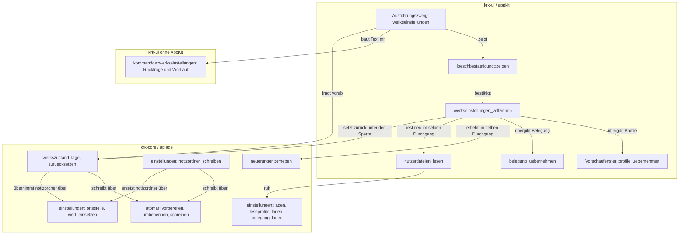
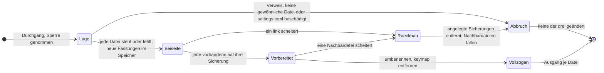
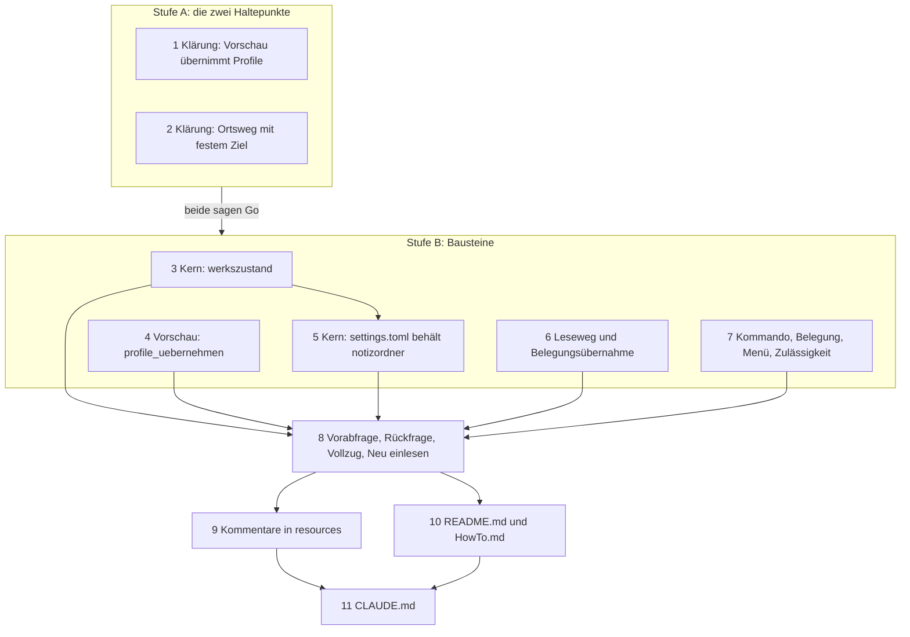

# Implementation Plan: Auf Werkseinstellungen zurücksetzen und neu einlesen

**Date:** 2026-09-29
**Status:** Ready for Review
**Spec:** `260929-0759_*_spec-werkseinstellungen-zuruecksetzen-und-neu-einlesen.md` (C1 bis C4, zwei Haltepunkte unter `## Stops when`). Gebaute Grundlage: HEAD `568efc7`, Fassung 2.1.1.
**Überarbeitet:** 2026-09-29, nach einer Anforderungsänderung des Nutzers, während die Schritte 1 bis 4 schon `[DONE]` und committet waren (3: `ebf94a4`, 4: `a9a8abc`). **Der Notizordner bleibt beim Zurücksetzen immer, wie er ist**: `settings.toml` geht auf die Auslieferungsfassung, behält aber den Wert von `notizordner`, und der Befehl wechselt den Notizordner nie und fasst keine Datei darin an. Der Spec wird parallel nachgezogen; wo er noch vom Ortswechsel spricht (C3.5 bis C3.8 und die Ortssätze in C1), gilt diese Fassung des Plans. Neu ist Schritt 5, der bisherige Schritt 5 (`ortsziel_pruefen`) ist gestrichen, die Nummern 6 bis 11 bleiben.
**Decidability:** Vier Fragen tragen den Plan, und jede ist aus den Eingaben ihres Mechanismus entscheidbar. **Erstens „liegt jede vorher dastehende der drei Dateien danach unverändert unter einem Namen, den keine frühere Sicherung trägt?“**: entschieden vom Dateisystem selbst, denn `link(2)` legt den neuen Namen an oder scheitert mit `EEXIST`, und zwar unter der Schreibsperre der Ablage; vorhergesagt wird dabei nichts. **Zweitens „ist eine der drei ein symbolischer Verweis?“**: `symlink_metadata` unter derselben Sperre; offen bleibt allein das Fenster bis zum `rename` gegen ein fremdes Programm, das die Sperre nicht kennt, dieselbe benannte Lücke wie bei `einstellungen::notizordner_schreiben`. **Drittens „übernimmt die laufende Vorschau einen neuen Profilstand, ohne ihre Tabs neu zu bauen?“**: am Quelltext entscheidbar und von Klärungsschritt 1 mit Go entschieden. **Viertens „welchen Wert von `notizordner` trägt die alte `settings.toml`, und lässt er sich in die Auslieferungsfassung einsetzen, ohne einen zweiten Schreibweg neben `notizordner_schreiben`?“**: entschieden vom TOML-Leser, den `notizordner_schreiben` schon fragt, an den Bytes, die unter der Sperre auf der Platte stehen. Er meldet den Wert samt Byte-Bereich, meldet sein Fehlen oder weist die Datei als beschädigt ab. Im dritten Fall gibt es keinen Wert zum Übernehmen, und der Vorgang bricht ab, bevor etwas geschieht (Entscheidung 2). Die frühere vierte Frage, ob sich „Ort wählen…“ mit festem Ziel gehen lässt, stellt sich nicht mehr. Nicht aus dem Code entscheidbar ist, was der Nutzer im Menü, in der Rückfrage und nach dem Vorgang am Bündel sieht; das bleibt der Abnahmelauf im Vordergrund.

## Directive

Ein Befehl im Menü „KRK“ setzt `readers.toml`, `settings.toml` und `keymap.toml` nach einer Rückfrage in einem Zug auf den Zustand eines ersten Starts zurück, legt die vorhandenen alten Fassungen mit Zeitstempel beiseite und lässt KRK sofort mit den Werkswerten weiterarbeiten. **Ausgenommen ist der Notizordner**: `settings.toml` behält den Wert von `notizordner`, der geltende Ort bleibt derselbe, und keine Datei darin wird angefasst. Das Verhalten beschreibt der Spec. Dieser Plan sagt, wie es in elf Schritten gebaut wird, und entscheidet die Punkte, die der Spec unter `## Open for Planner` offenlässt.

## Current State

**KRK liest die drei Dateien an zwei Zeitpunkten, die beide vor dem ersten Fenster liegen.** `keymap.toml` lädt `belegung::fuer_den_betrieb` in `starten`, noch vor `NSApplication`. `settings.toml` und `readers.toml` lädt `Anwendungsdelegierter::sitzung_laden` (`crates/krk-ui/src/appkit/anwendung.rs`) in einem Durchgang unter der Schreibsperre, zusammen mit der Sitzung und hinter den zwei Ladern die Erhebung der Neuerungen. Die Urteile der drei Leser liegen danach in `AnwendungsIvars::urteile`, der Bestand der Neuerungen in `AnwendungsIvars::neuerungen`, und beide Felder sagen in ihrem Doc-Kommentar, dass sie nach dem Start nicht nachgezogen werden.

**Die Anlage schreibt die Auslieferungsfassung wörtlich.** `einstellungen::AUSLIEFERUNGSTEXT` und `leseprofile::AUSLIEFERUNGSTEXT` stehen über `include_str!` im Programm, und je ein privates `anlegen_falls_fehlt` schreibt sie über `atomar::schreiben`, wenn die Datei fehlt. `atomar` trennt `vorbereiten` (Nachbardatei vollständig geschrieben und synchronisiert) von `Nachbardatei::umbenennen`; eine fallengelassene Nachbardatei räumt sich ab.

**`settings.toml` hat neben der Anlage genau einen Schreibweg**, `einstellungen::notizordner_schreiben`, gerufen allein aus `ort_uebernehmen`; die Probe `die_ortswahl_hat_genau_eine_rufkette` hält das. (Seit Schritt 3 ist `werkszustand::zuruecksetzen` der zweite, noch ohne Betriebsrufer.) Sein Kern ist eine Textoperation, die heute im Rumpf steckt: der Leser meldet über `toml::Spanned` den Byte-Bereich des Werts, `ist_einzelwert` prüft, dass der Bereich den Wert selbst trägt, genau dieser Bereich wird ersetzt oder, fehlt der Schlüssel, `angehaengt` hängt ihn an, und `pruefen` liest das Ergebnis ein zweites Mal. Nichts davon braucht die Platte; die Platte kommt allein beim Lesen vorher und beim `atomar::schreiben` danach vor.

**Den geltenden Notizordner hält der Griff und nicht `AnwendungsIvars::einstellungen`.** F2, „Ort wählen…“ und jede Tabliste fragen `heimgriff::lage` oder `heimgriff::lesen`; `ersetzen` setzen allein der Start, F2 und `ort_wechseln`. Das Feld `notizordner` in `AnwendungsIvars::einstellungen` liest im Betrieb niemand (`ort_wechseln` schreibt es, `sitzung_laden` liest den Wert aus der lokalen Variablen). Wer die Einstellungen in den Ivars ersetzt, ändert den geltenden Ort also nicht; `terminal_oeffnen` liest dagegen `terminal` bei jedem Aufruf aus den Ivars. `readers.toml` schreibt KRK nach der Anlage nie wieder, und `die_leseprofile_werden_im_baum_genau_einmal_geladen` hält, dass `leseprofile::laden` im Betriebscode einmal gerufen wird.

**Die Vorschau hält die Profile in einer `OnceCell`.** `Vorschaufenster::profile_setzen` ist ihr einziger Schreiber und hat einen Rufer in `oberflaeche_aufbauen`; `die_profile_haben_genau_einen_schreiber_und_einen_rufer` hält beides. Daneben steht schon ein Nachladeweg, der Tabs an Ort und Stelle neu lädt: `Vorschaumodell::neu_laden_wo(treffer, tafel, profile, heim)` startet für jeden Tab, dessen Pfad der Treffer annimmt, einen neuen `Ladevorgang` mit dem übergebenen Profilsatz; ein ersetzter Vorgang verliert seinen Empfänger, und sein Ergebnis fällt. Gerufen wird er heute allein aus `heimordner_gewechselt`.

**Für die Belegung gibt es den Neuaufbau im Betrieb schon.** `belegungsansicht_verlassen` setzt die neue Belegung, baut das Hauptmenü über `menue::hauptmenue` neu und ruft `tastenabgriff_nachziehen`. Das Terminal liest seine Kennung bei jedem Aufruf aus `AnwendungsIvars::einstellungen` (`terminal_oeffnen`).

**Die Rückfrage vor dem Räumen in den Papierkorb ist nach ihrem Inhalt allgemein.** `blaetter::loeschbestaetigung::zeigen(mtm, fenster, frage, erlaeuterung, schaltflaeche, laut, fertig)` baut „Abbrechen“ auf Return vorn, die ausführende Schaltfläche auf Cmd+Return dahinter, und hängt den Satz „Return und Esc brechen ab. Zum Bestätigen Cmd+Return.“ an; `esc` erreicht sie über `abbrechen`.

**Ein neues Kommando hat Pflichtstellen, von denen der Übersetzer nur zwei hält**: `Kommando::wirkungsbereich` und `bereich_des_kommandos`. `Kommando::KENNUNGEN` hält `jede_variante_von_kommando_steht_genau_einmal_in_kennungen`, den Ausführungszweig in `kommando_ausfuehren_bei` für namentlich geführte Befehle `zweigproben::jeder_dieser_befehle_hat_einen_eigenen_ausfuehrungszweig`, die Kopfzeile der Belegung `die_zwei_zahlen_im_kopf_der_auslieferungsbelegung_stimmen_noch` und eine Funktion ohne Kombination ab Werk `ab_werk_traegt_genau_diese_liste_keine_kombination` über `OHNE_KOMBINATION_AB_WERK`.

**Die Uhr der Termine hat eine Zählprobe.** `die_uhr_der_termine_wird_an_einer_stelle_gelesen` (`crates/krk-core/tests/heimordner.rs`) meldet jede Quelldatei, die zugleich `SystemTime::now()` und `ortszeit(` enthält, ausser `heimordner/eintraege.rs`. `verzeichnis::sys::ortszeit` ist die eine Umrechnung in Ortszeit.

**Ein Verschieben ohne Ersetzen gibt es schon**: `heimordner/bereitstellen.rs`, `ohne_ersetzen_umbenennen`, über `fs::hard_link` und `fs::remove_file`, weil `rename(2)` ein vorhandenes Ziel still ersetzte.

## Approach

**Der Befehl ist kein neuer Mechanismus, sondern ein zweiter Zeitpunkt für drei Wege, die es gibt.** Die drei Dateien werden über denselben Leseweg neu gelesen, über den der Start sie liest; die Vorschau übernimmt den neuen Profilstand über denselben Nachladeweg, über den sie heute einen Ortswechsel nachzieht; die Belegung wirkt über denselben Neuaufbau, über den die F1-Ansicht sie wirken lässt; der Wert von `notizordner` kommt über dieselbe Textoperation in die neue `settings.toml`, über die „Ort wählen…“ ihn schreibt. Neu ist allein das, was es noch nicht gibt: ein Kernmodul, das die drei Dateien unter einem Zugang beiseitelegt und ersetzt.

**Der Notizordner ist kein Gegenstand des Befehls.** Der Befehl ruft weder `ort_wechseln` noch `heimgriff::ersetzen`, schreibt weder `gemerkter_ort` noch die Sitzung, und kein Schritt öffnet eine Datei im Notizordner. Der Griff, an dem F2, die Tablisten, die Vorschau und der Schutz von `secrets.txt` den Ort erfragen, trägt nach dem Vorgang denselben Wert wie davor.

**Wo ein Weg heute einen Rufer hat, bekommt er einen zweiten, und die Probe, die „genau einen“ hält, nennt danach beide.** Ein zweiter Schreibweg für `notizordner`, ein zweiter Ladeweg für die Leseprofile oder ein zweites Blatt für die Rückfrage entstehen nicht.

Die Pfeile laufen von oben nach unten und von der Oberfläche zum Kern; der Kern ruft die Oberfläche nicht. Die Textoperation für `notizordner` hat zwei Rufer im Kern, `notizordner_schreiben` (Rufer `ort_uebernehmen`, nicht im Bild, weil an diesem Befehl nicht beteiligt) und `werkszustand`; auf die Platte schreibt jeder der zwei über `atomar`, und die Ersetzung selbst steht einmal. Der Griff des Notizordners steht nicht im Bild, weil kein Pfeil dieses Befehls ihn erreicht.

**Der Vorgang im Kern läuft in vier Stufen unter einem Zugang**, und jede Stufe vor der letzten lässt sich vollständig zurücknehmen. Seit Schritt 5 stellt die erste Stufe außer der Lage auch die neuen Fassungen fest, also für `settings.toml` die Auslieferungsfassung mit dem übernommenen Wert von `notizordner`; eine beschädigte `settings.toml` bricht damit ab, bevor ein Name angelegt ist:

## Entscheidungen des Plans

Die ersten sieben beantworten `## Open for Planner` des Spec, die übrigen braucht der Bau. Jede lässt sich in einem Schritt umkehren, und keine berührt den Schutz von `secrets.txt`.

1. **Die Vorschau übernimmt einen Profilstand über `profile_uebernehmen`, und das gilt beim Start wie beim Zurücksetzen.** Das Merkfeld wird eine `RefCell<Arc<Profile>>`. `profile_uebernehmen` setzt es und lädt danach jeden Tab neu, dessen Inhalt vom Profilsatz abhängt: `Inhalt::Zusammenfassung`, `Inhalt::Metadaten` (ein Ordner ohne Treffer kann unter dem neuen Satz einer werden) und jeder Tab mit laufendem `Ladevorgang`, der den alten Satz trägt. Aktive und verdeckte Tabs werden gleich behandelt; ein Tab ist dabei kein neuer Tab, sondern bekommt einen neuen `Ladevorgang` über dieselbe Schleife wie `neu_laden_wo`, die dafür eine zweite Trefferfrage an den Tab annimmt statt allein an seinen Pfad. Eine ausgeblendete Vorschau braucht nichts Eigenes: ihr Nachtrag geht durch `datei_anzeigen`, das das Merkfeld beim Aufruf liest. Beim Start findet `profile_uebernehmen` keinen abhängigen Tab und lädt nichts (Klärungsschritt 1 prüft das).

2. **Der Notizordner bleibt, und `settings.toml` behält seinen Wert über dieselbe Textoperation, über die „Ort wählen…“ ihn schreibt** (Anforderungsänderung vom 2026-09-29; ersetzt die frühere Entscheidung, den Weg von „Ort wählen…“ mit festem Ziel zu gehen). Die neue Fassung von `settings.toml` ist `AUSLIEFERUNGSTEXT`, in dem genau der Byte-Bereich des Werts von `notizordner` durch den Quelltext des alten Werts ersetzt ist, so wie er in der alten Datei steht. Dafür zieht Schritt 5 aus `notizordner_schreiben` zwei reine Funktionen über Text heraus, `ortsstelle` (Leser, Byte-Bereich, `ist_einzelwert`) und `wert_einsetzen` (Ersetzen oder `angehaengt`, dann `pruefen`), und beide Schreiber rufen sie. Einen zweiten Schreibweg neben `notizordner_schreiben` gibt es danach nicht: `werkszustand` schreibt die ganze Datei weiter allein über `atomar::vorbereiten` und `umbenennen`, nur die Nutzlast stammt aus derselben Ersetzung. Die Fälle der alten Datei:
   - **fehlt**, oder **steht ohne den Schlüssel**: der geltende Wert ist heute der der Auslieferung (`Einstellungen::aus_datei` füllt ihn), also ist die neue Fassung `AUSLIEFERUNGSTEXT` Byte für Byte;
   - **trägt einen Wert**, ob Text, einen Text in anderer Schreibweise oder einen Wert anderen Typs wie `notizordner = 5`: sein Quelltext wird eingesetzt. Ist er so geschrieben wie in der Auslieferung (`"~/krkhome"`), ist das Ergebnis wieder `AUSLIEFERUNGSTEXT` Byte für Byte; ein unzulässiger Wert bleibt unzulässig, wie er es vorher war;
   - **ist beschädigt** im Sinn von `notizordner_schreiben` (kein UTF-8, ein Fehler des Lesers, ein unbekannter Schlüssel, ein `notizordner`, der nicht als einzelner Wert dasteht): **der Vorgang bricht ab, bevor etwas geschieht**, mit dem Satz, den `Schreibhindernis::Beschaedigt` heute schon trägt. Eine solche Datei hat keinen Wert, der sich übernehmen ließe, und die Auslieferungsfassung an ihre Stelle zu schreiben, setzte beim nächsten Start `~/krkhome` in Kraft, also genau den Wechsel, den der Befehl nie auslösen soll. Dieselbe Regel hält `notizordner_schreiben` schon: eine beschädigte Datei berichtigt der Nutzer zuerst. Die Abweichung vom Spec, der das Zurücksetzen einer beschädigten Datei zuließ, steht unter `## Open Questions`.

   Den geltenden Ort ändert der Befehl nicht, weil ihn allein der Griff trägt (`## Current State`): der Vollzug setzt `AnwendungsIvars::einstellungen` auf die neu gelesene Datei, damit `terminal` sofort gilt, und ruft weder `heimgriff::ersetzen` noch `ort_wechseln`, schreibt weder `gemerkter_ort` noch die Sitzung. **Der Bericht `260929-1034-klaerung-ortsweg-mit-festem-ziel.md` (Klärungsschritt 2) bleibt als Aufzeichnung stehen; sein `Urteil: Go` wird nicht mehr gebraucht**, weil kein Schritt den Weg von „Ort wählen…“ mehr mit festem Ziel geht. `ort_uebernehmen`, `ort_wechseln` und ihre Proben bleiben unverändert.

3. **Reihenfolge und Sperre: ein Durchgang, vier Stufen, Sicherung über einen harten Verweis.** Unter einem `Zugang` fragt `werkszustand::zuruecksetzen` zuerst die Lage jeder der drei Dateien (`symlink_metadata`; ein Verweis, auch ein verwaister, oder etwas anderes als eine gewöhnliche Datei bricht ab und nennt sie). Dann legt es jede vorhandene über `fs::hard_link` unter ihrem Sicherungsnamen beiseite; der alte Inhalt bleibt damit Byte für Byte derselbe Inode, gleich wie groß die Datei ist, und `link(2)` überschreibt nie. Dann schreibt es `settings.toml` und `readers.toml` über `atomar::vorbereiten` in ihre Nachbardateien. Scheitert eine dieser Stufen, entfernt es die Sicherungsnamen, die es in diesem Lauf angelegt hat, die Nachbardateien fallen von selbst, und keine der drei Dateien ist berührt (C2.7). Erst danach benennt es beide Nachbardateien um und entfernt `keymap.toml`, deren alte Fassung schon unter dem Sicherungsnamen liegt.

4. **Ein Fehler in der letzten Stufe wird gemeldet und nicht zurückgebaut.** Scheitert dort ein `rename` oder das Entfernen, stehen die Sicherungen schon (C2.3), der Ausgang nennt je Datei, ob sie zurückgesetzt ist, und KRK liest danach ein, was auf der Platte steht. Ein Rückbau wäre eine weitere Folge von Schreibvorgängen mit eigenen Fehlerfällen, gegen einen Fall, der nach einer gelungenen, synchronisierten Nachbardatei im selben Ordner allein bei einem fremden Eingriff eintritt.

5. **Der Sicherungsname ist `<name>.<JJMMTT-HHMM>`, und in derselben Minute `<name>.<JJMMTT-HHMM>-2`, `-3` und so fort** (C2.5). Die drei Sicherungen eines Vorgangs tragen denselben Stempel. Ob ein Name frei ist, entscheidet `link(2)` mit `EEXIST`, und erst dann wird die nächste Nummer versucht; nach der Nummer 99 bricht der Vorgang mit einem Hindernis ab, statt unbegrenzt zu zählen. Der Stempel kommt aus `verzeichnis::sys::ortszeit` über einen `SystemTime`, den der Rufer übergibt; ohne Ortszeit bricht der Vorgang ab, bevor etwas geschieht.

6. **Neuerungen und Urteile werden im selben Durchgang nachgezogen, und die Merkdatei bleibt unberührt** (C3.9, C2.6). Nach dem Zurücksetzen laufen im selben Durchgang `belegung::laden`, der gemeinsame Leseweg aus Schritt 6 und `neuerungen::erheben` mit den neuen Urteilen. `AnwendungsIvars::urteile` bekommt die neuen Urteile, `AnwendungsIvars::neuerungen` den neuen Bestand als `Some`. Gerufen wird `neuerungen::erheben` und nicht `neuerungen_erheben`, denn dieses liest und schreibt `reported.toml`.

7. **Wortlaut.** Schaltfläche: „Zurücksetzen“. Frage: „readers.toml, settings.toml und keymap.toml auf Werkseinstellungen zurücksetzen?“ Erläuterung, Grundsatz: „Jede der drei Dateien, die im Ablageordner steht, legt KRK unter ihrem Namen mit angehängtem Zeitstempel beiseite, etwa readers.toml.JJMMTT-HHMM, und löscht keine davon. Danach stehen readers.toml und settings.toml so da, wie diese Fassung von KRK sie mitbringt, nur behält settings.toml den eingestellten Notizordner; keymap.toml fehlt, und es gilt die mitgelieferte Tastenbelegung. Der Notizordner und alle Dateien darin bleiben unberührt. KRK liest den neuen Stand sofort ein.“ Dazu, als eigener Absatz, wenn eine eigene `keymap.toml` steht: „Alle eigenen Tastenzuweisungen aus keymap.toml gehen damit aus dem Betrieb; sie liegen danach allein in der Sicherung.“ Statuszeile nach dem Vorgang: „Auf Werkseinstellungen zurückgesetzt. Beiseitegelegt: {voller Pfad}, …“, für eine Datei ohne Sicherung „{name} stand nicht da, für sie ist nichts beiseitegelegt“, dahinter jede Meldung der Lader. Abbruchsätze nennen die Datei und den Grund; der für eine beschädigte `settings.toml` ist der Satz von `Schreibhindernis::Beschaedigt` mit angehängtem „Nichts ist zurückgesetzt.“ Die Sätze stehen als reine Funktionen in `crates/krk-ui/src/kommandos/werkseinstellungen.rs` (Rückfrage) und in `werkszustand` (Ausgang und Hindernis), nach dem Muster von `kommandos::loeschwarnung` und `Schreibhindernis::meldung`.

8. **Welche drei Dateien es sind, sagt eine vollständige Fallunterscheidung und keine zweite Liste.** `werkszustand::Werkszustand::fuer(Datei)` antwortet über jede `Datei` ohne Auffangzweig: `Wortlaut(leseprofile::AUSLIEFERUNGSTEXT)`, `Fehlt` für die Belegung und `Unberuehrt` für Lesezeichen, Sitzung und Merkdatei; für die Einstellungen bis Schritt 4 `Wortlaut(einstellungen::AUSLIEFERUNGSTEXT)` und ab Schritt 5 `MitNotizordner`, „Auslieferungstext mit übernommenem `notizordner`“ (Entscheidung 2). Eine Probe hält die Menge der berührten Dateien gleich der Menge, die `neuerungen::Vergleichsform::fuer` vergleicht.

9. **Eine Rückfrage, zwei Anlässe.** Der Befehl ruft `blaetter::loeschbestaetigung::zeigen` mit eigenem Text und `laut = true`, weil er in jedem Fall Bestand des Nutzers aus dem Betrieb nimmt. Ein neues Blatt entsteht nicht; der Modulkopf von `loeschbestaetigung.rs` nennt danach beide Anlässe.

10. **Vor der Rückfrage wird gefragt, was sie sagen muss, und nach der Bestätigung fragt der Kern dasselbe noch einmal, mit derselben Funktion.** Vorab ohne Sperre: gibt es einen Ablageordner (C2.9, sonst Statuszeile und kein Blatt), dann `werkszustand::lage` über `Ablage::pfad`. Ein Verweis und eine beschädigte `settings.toml` brechen schon hier ab, ohne Blatt; ob `keymap.toml` steht, speist den Satz aus C1.5. Nach der Bestätigung fragt `zuruecksetzen` die Lage unter der Sperre selbst, denn zwischen beiden Fragen kann der Nutzer die Datei geändert haben. Eine Prüfung des Notizordners gibt es weder vorab noch danach, weil der Befehl ihn nicht anfasst.

11. **Die Uhr liest die Oberfläche, die Umrechnung der Kern.** `werkszustand::zuruecksetzen` nimmt einen `SystemTime` und rechnet ihn mit `ortszeit` in den Stempel um; der Vollzug übergibt `SystemTime::now()`. Damit ist der Kern mit fester Zeit prüfbar, und die Zählprobe der Terminuhr bleibt unverändert grün, weil keine Datei beides trägt. Sie gilt der Uhr der Termine; eine zweite Uhr für einen anderen Zweck ist kein Verstoß gegen ihre Zusage, und der Doc-Kommentar der Probe bekommt diesen Satz.

12. **Die Belegung wird im selben Durchgang über `belegung::laden` gelesen und nicht über `fuer_den_betrieb`**, denn jenes öffnet eine zweite Ablage, und zwei Ablagen eines Prozesses dürfen nicht zugleich einen Durchgang fahren (Kopf von `ablage::sperre`).

## Implementation Steps

**Wer ausführt.** Die Schritte 1 und 2 gehören `analyst`: sie sind die zwei Haltepunkte des Spec und entscheiden, ob gebaut wird. Schritt 9 gehört `data-implementer`, weil er allein Kommentare in `resources/*.toml` ändert. Jeder übrige Schritt gehört `code-implementer`, auch die neue Zeile in `resources/default-keymap.toml` in Schritt 7: sie ist mit dem neuen Kommando untrennbar verbunden (`jede_kennung_der_kommandos_steht_in_der_auslieferungsbelegung` verlangt sie, `ab_werk_traegt_genau_diese_liste_keine_kombination` verlangt den Eintrag in `OHNE_KOMBINATION_AB_WERK`), und ein Datenschritt davor endete rot. `README.md`, `HowTo.md` und `CLAUDE.md` gehen wie in den Arbeiten zu den Terminen und zur Quicknote an `code-implementer`.

**Für jeden Codeschritt gilt**, ohne dass es dort wiederholt wird:
- `make check` endet grün (Bau, Proben, `clippy -D warnings`, `fmt --check`, `cargo doc` mit `-D warnings`; `cargo` liegt unter `$HOME/.cargo/bin`). **`krk-ui` ist ein Binärziel, und toter Code macht `clippy -D warnings` rot**; deshalb baut jeder Schritt dort nur, was im selben Schritt einen Rufer bekommt. In `krk-core` darf ein `pub`-Name bis zu seinem Betriebsrufer allein von Proben gerufen sein (`260912-1149_*_was-geschieht-mit-einem-oeffentlichen-namen-ohne-rufer-im-betriebscode.md`, Möglichkeit 1).
- Nutzersichtbare Zeichenketten tragen Umlaute, Kommentare und Bezeichner die Umschrift. Keine Probe hält die Naht; der Ausführende prüft jede neue Zeichenkette selbst.
- Ein Rückgabewert, dessen stilles Fallenlassen unbemerkt bliebe, trägt `#[must_use]`.
- Jede neue Variante einer vollständigen Fallunterscheidung wird dort eingeordnet, wo der Übersetzer anhält; ein Auffangzweig entsteht nicht.
- Eine Zahl über eine gewachsene Aufzählung wird in Prosa nicht hochgezählt, sondern fällt oder wird durch ihr Zählkommando ersetzt.
- **Eine rote Probe, die der Schritt nicht namentlich als bewusst geändert nennt, ist ein Stopp** und kein Anlass, ihre Erwartung anzupassen.
- Ein Modulkopf oder Doc-Kommentar, der durch den Schritt falsch wird („nur beim Start“, „nie wieder“, „genau ein Schreibweg“, „genau ein Rufer“), wird im selben Schritt berichtigt.

Die Kante von Stufe A nach Stufe B steht für die Abhängigkeit der Schritte 3, 4, 6 und 7 von den Schritten 1 und 2; sie ist ein Tor und keine Sachabhängigkeit, und sie ist erfüllt: beide Berichte sagen Go (`6317181`). Schritt 5 kam mit der Anforderungsänderung hinzu und hängt an keinem der zwei Berichte, sondern allein an Schritt 3, dessen Modul er ändert; das Go von Schritt 2 trägt seit der Änderung keinen Schritt mehr. Sonst hängt innerhalb von Stufe B kein Schritt am anderen, sie landen trotzdem in der Nummernfolge, jeder auf dem Stand des vorigen. Der riskanteste Schritt ist 8, weil er als erster auf die Platte des Nutzers schreibt und dabei sechs Stellen des Betriebszustands nachzieht.

### Stufe A: die zwei Haltepunkte

1. [DONE] **Klärung: die Vorschau übernimmt einen neuen Profilstand ohne Neuaufbau ihrer Tabs** (Haltepunkt 1 des Spec)
   - Executor: `analyst`
   - Files: keine Änderung am Baum; ein Bericht nach `$OUT_ANALYSIS` des Arbeitspakets, Thema `klaerung-vorschau-uebernimmt-profilstand`
   - Changes: Am Quelltext von `crates/krk-ui/src/appkit/vorschau.rs`, `crates/krk-ui/src/vorschaumodell.rs` und `crates/krk-ui/src/appkit/anwendung.rs` beantworten, jede Antwort mit Datei und Funktion belegt:
     - (a) Hält ausser `VorschaufensterIvars::profile` eine Stelle den Profilsatz über einen Auftrag hinaus (Tab, Modell, Einfärbung, Arbeitsfaden)? Ein `Arc`, den ein laufender `Ladevorgang` hält, zählt als abgelöst, wenn ein neuer Vorgang ihn ersetzt und das Ergebnis des alten nachweislich fällt (`Vorschaumodell::einziehen`).
     - (b) Lässt sich jeder Tab, dessen Inhalt vom Profilsatz abhängt, über denselben Weg wie `neu_laden_wo` an Ort und Stelle neu laden, aktiv, verdeckt und mitten im Laden? Welche Varianten von `Inhalt` hängen vom Profilsatz ab, und ist die Trefferfrage aus Entscheidung 1 vollständig und überschneidungsfrei?
     - (c) Trägt ein Tab beim Aufruf von `profile_setzen` in `oberflaeche_aufbauen` schon einen profilabhängigen Inhalt oder einen laufenden Vorgang? Davon hängt ab, ob ein Nachladen beim Start ein leerer Lauf ist.
     - (d) Holt eine ausgeblendete Vorschau ihren Nachtrag über `datei_anzeigen` mit dem Merkfeld zum Zeitpunkt des Nachtrags?
   - Acceptance: Der Bericht endet mit genau einer Zeile `Urteil: Go` oder `Urteil: Stop`. **Go** heißt: (a) bis (d) tragen Entscheidung 1 so, wie sie steht, oder mit einer benannten Berichtigung, die weder einen Tab neu baut noch einen zweiten Ladeweg einführt. **Stop** heißt: mindestens ein profilabhängiger Inhalt lässt sich nur durch Neuaufbau des Tabs oder einen Neustart übernehmen; der Bericht nennt ihn. `make check` bleibt unberührt, weil kein Quelltext sich ändert.
   - Dependencies: none

2. [DONE] **Klärung: der Weg von „Ort wählen…“ lässt sich mit festem Ziel gehen, ohne seine Prüfungen zu verdoppeln** (Haltepunkt 2 des Spec)
   - Executor: `analyst`
   - Files: keine Änderung am Baum; ein Bericht nach `$OUT_ANALYSIS` des Arbeitspakets, Thema `klaerung-ortsweg-mit-festem-ziel`
   - Changes: Am Quelltext von `ort_waehlen`, `ort_uebernehmen`, `ort_wechseln` und `gehaltene_notizdatei` (`crates/krk-ui/src/appkit/anwendung.rs`), `crates/krk-core/src/heimordner/ort.rs` und den Proben `die_ortswahl_hat_genau_eine_rufkette` und `die_ortswahl_fragt_vor_dem_schreiben_und_setzt_den_griff_vor_dem_nachzug` beantworten:
     - (a) Lassen sich die Schritte 1 bis 5 von `ort_uebernehmen` in `ortsziel_pruefen(text)` nach Entscheidung 2 fassen, sodass `ort_uebernehmen` ausser im benannten Vorrangfall dasselbe tut wie heute?
     - (b) Hält eine Probe oder ein Kriterium von H3 des Spec `260926-1451_*_spec-home-menue-und-einstellbarer-ort.md` den Vorrang der Meldung „gehaltene Datei“ vor „ungültiger Ort“ fest? Wenn ja, welche, und wie bleibt er ohne zweite Prüffolge erhalten?
     - (c) Ergibt `ort::ort_lesen` auf dem Ortswert der Auslieferungsfassung (`Einstellungen::auslieferung().notizordner`) einen Ort, der die Prüfungen gegen den Ablageordner besteht, und beantwortet die Wechselfrage C3.8, ohne die Fragen nach der gehaltenen Datei zu brauchen?
     - (d) Lässt sich `ort_wechseln` unverändert rufen, wenn `AnwendungsIvars::einstellungen` unmittelbar davor aus der neu gelesenen `settings.toml` gesetzt wurde, und schreibt es dabei etwas, das dem Vollzug widerspricht? Ausdrücklich zu nennen ist `sitzung_vormerken` und damit `session.toml` (siehe `## Open Questions`, erster Punkt).
   - Acceptance: Der Bericht endet mit genau einer Zeile `Urteil: Go` oder `Urteil: Stop`. **Go** heißt: (a) bis (d) tragen Entscheidung 2 ohne zweite Prüffolge, gegebenenfalls mit benannter Berichtigung. **Stop** heißt: der Weg lässt sich nur mit einer zweiten, eigenen Prüffolge oder mit einer Verhaltensänderung an „Ort wählen…“ gehen, die über den benannten Vorrangfall hinausgeht; der Bericht nennt sie. `make check` bleibt unberührt.
   - Dependencies: none

### Stufe B: Bausteine

3. [DONE] **Kern: `ablage/werkszustand.rs` legt beiseite und setzt zurück**
   - Executor: `code-implementer`
   - Files: `crates/krk-core/src/ablage/werkszustand.rs` (neu), `crates/krk-core/src/ablage/mod.rs` (Moduleintrag, Modulkopf), `crates/krk-core/src/ablage/einstellungen.rs` und `crates/krk-core/src/ablage/leseprofile.rs` (allein die Modulköpfe), `crates/krk-core/tests/werkszustand.rs` (neu), `crates/krk-core/tests/baum.rs`, `crates/krk-core/tests/heimordner.rs` (allein der Doc-Kommentar der Uhrprobe)
   - Changes:
     - **`Werkszustand` mit `fuer(Datei)`** nach Entscheidung 8, vollständig über `Datei`, ohne Auffangzweig.
     - **`pub fn lage(pfad: impl Fn(Datei) -> PathBuf) -> Result<Lage, Werkshindernis>`**: je berührter Datei `Steht` oder `Fehlt` über `symlink_metadata`; `Werkshindernis::Verweis(Datei)`, `KeineDatei(Datei)` und `NichtLesbar(Datei, String)` sonst. Ohne Sperre aufrufbar, weil sie nur fragt.
     - **`#[must_use] pub fn zuruecksetzen(zugang: &Zugang<'_>, zeitpunkt: SystemTime) -> Result<Zurueckgesetzt, Werkshindernis>`** mit den vier Stufen aus Entscheidung 3 und dem Rückbau aus derselben Entscheidung, dem Sicherungsnamen aus Entscheidung 5 (`KeineOrtszeit`, `KeinFreierName(Datei)`, `NichtBeiseitegelegt(Datei, String)`, `NichtVorbereitet(Datei, String)` als weitere Hindernisse) und dem Ausgang aus Entscheidung 4: `Zurueckgesetzt` nennt je berührter Datei die Sicherung (`Option<PathBuf>`) und ob der Vollzug gelang.
     - **`Werkshindernis::meldung` und `Zurueckgesetzt::meldung`** mit dem Wortlaut aus Entscheidung 7, vollständig ohne Auffangzweig.
     - **Modulköpfe**: `ablage/mod.rs` (Abschnitt „Zwei der sechs Ablagedateien entstehen einmal …“: „nie wieder“ und „an genau einer Stelle“ gelten nicht mehr), `einstellungen.rs` („genau einen Schreibweg“) und `leseprofile.rs` („danach von KRK nie wieder angefasst“) nennen `werkszustand` als zweiten Schreiber. Der Kopf von `werkszustand.rs` schreibt die Stufen, den harten Verweis und seinen Grund, den Rückbau und die offene Lücke gegen fremde Programme aus, dazu warum `keymap.toml` entfernt und nicht geschrieben wird (Spec, C2, vierte Entscheidung).
   - Probes, **neu**, in `crates/krk-core/tests/werkszustand.rs` an einem Prüfordner aus `gemeinsam`:
     - C2.1: nach dem Vorgang sind `readers.toml` und `settings.toml` bytegleich mit dem jeweiligen `AUSLIEFERUNGSTEXT`, mit vorher eigenen Dateien und mit vorher fehlenden.
     - C2.2 und C2.3: `keymap.toml` fehlt danach; jede vorher vorhandene Datei liegt bytegleich unter `<name>.<JJMMTT-HHMM>` mit dem Stempel aus `ortszeit` des übergebenen Zeitpunkts.
     - C2.4: eine vorher fehlende Datei hinterlässt keine Sicherung, und der Ausgang sagt es.
     - C2.5: zwei Vorgänge mit demselben Zeitpunkt legen `<name>.<stempel>` und `<name>.<stempel>-2` an, beide mit ihrer jeweils alten Fassung.
     - C2.6: `bookmarks.toml`, `session.toml`, `reported.toml` und eine vorhandene `*.beschaedigt` sind danach bytegleich.
     - C2.7, Stufe 2: ein Ablageordner ohne Schreibrecht lässt `link` scheitern; danach sind alle drei Dateien unverändert und kein Sicherungsname steht. Stufe 3: ein Verzeichnis an der Stelle der Nachbardatei von `settings.toml` lässt `vorbereiten` scheitern; danach gilt dasselbe, und die schon angelegten Sicherungen sind entfernt.
     - Verweis: ist eine der drei ein symbolischer Verweis, auch ein verwaister, bricht der Vorgang mit `Verweis` ab, nichts ist geändert, und die Zieldatei des Verweises ist bytegleich.
     - Die Menge der Dateien mit `Werkszustand` ungleich `Unberuehrt` ist die Menge mit `Vergleichsform` ungleich `Nicht`.
   - Probes, **bewusst geändert**: `nur_benannte_dateien_erreichen_das_atomare_schreiben` (`crates/krk-core/tests/baum.rs`) bekommt die Nadel `atomar::vorbereiten`, die heute fehlt, und in ihrer Liste `krk-core/src/ablage/werkszustand.rs` mit einer Kommentarzeile zum Grund; die übrigen Einträge bleiben. `die_uhr_der_termine_wird_an_einer_stelle_gelesen` ändert ihre Erwartung nicht, nur ihr Doc-Kommentar bekommt den Satz aus Entscheidung 11.
   - Acceptance: `make check` grün; keine Probe ausser den zwei genannten ändert ihre Erwartung. `werkszustand::zuruecksetzen` hat in diesem Schritt allein Probenrufer; der Betriebsrufer kommt in Schritt 8.
   - Dependencies: Schritte 1 und 2 (Tor)

4. [DONE] **Vorschau: `profile_uebernehmen` ersetzt `profile_setzen`**
   - Executor: `code-implementer`
   - Files: `crates/krk-ui/src/appkit/vorschau.rs`, `crates/krk-ui/src/vorschaumodell.rs`, `crates/krk-ui/src/appkit/anwendung.rs` (die eine Aufrufstelle und ihr Kommentar)
   - Changes: nach Entscheidung 1 und in der Gestalt, die der Bericht aus Schritt 1 bestätigt oder berichtigt hat. `VorschaufensterIvars::profile` wird `RefCell<Arc<Profile>>`; `datei_anzeigen` und `heimordner_gewechselt` lesen es über `borrow`. `profile_setzen` heißt `profile_uebernehmen` und lädt nach dem Setzen jeden profilabhängigen Tab neu. Im Modell trägt die Schleife von `neu_laden_wo` die Trefferfrage an den Tab; `heimordner_gewechselt` gibt seine Pfadfrage weiter wie bisher. Der Doc-Kommentar des Feldes und der Methode sagt nicht mehr „steht nach dem Aufbau fest“ (C4.5 der Runde 16 fällt nach dem Spec bewusst), sondern: gesetzt beim Start und beim Zurücksetzen, bei keinem anderen Anlass, ohne Beobachter auf der Datei. Der Kommentar an der Aufrufstelle in `oberflaeche_aufbauen` ebenso.
   - Probes, **neu**, in `vorschaumodell.rs`: die Trefferfrage an einem Modell mit je einem Tab jeder `Inhalt`-Variante und einem ladenden Tab nimmt genau die aus Entscheidung 1; ein verdeckter Tab wird wie der aktive neu geladen; der aktive Tab bleibt der aktive.
   - Probes, **bewusst geändert**: `die_profile_haben_genau_einen_schreiber_und_einen_rufer` (`appkit/vorschau.rs`) zählt den Schreiber an seiner neuen Schreibweise (die Nadel `profile.set` fällt mit der `OnceCell`) und den Rufer unter dem neuen Namen, beide weiter genau einmal.
   - Acceptance: `make check` grün; keine Probe ausser der genannten ändert ihre Erwartung. Das Verhalten beim Start ist unverändert, belegt durch Befund (c) aus Schritt 1.
   - Dependencies: Schritte 1 und 2 (Tor)

5. [DONE] **Kern: `settings.toml` geht auf die Auslieferungsfassung und behält den Wert von `notizordner`**
   - Executor: `code-implementer`
   - Files: `crates/krk-core/src/ablage/einstellungen.rs`, `crates/krk-core/src/ablage/werkszustand.rs`, `crates/krk-core/src/ablage/mod.rs` (allein der Modulkopf), `crates/krk-core/tests/werkszustand.rs`
   - Changes, nach Entscheidung 2:
     - **Zwei reine Funktionen in `einstellungen.rs`, aus dem Rumpf von `notizordner_schreiben` gezogen und nicht neu geschrieben**, beide privat im Modul `ablage` (`pub(super)`):
       - `fn ortsstelle(text: &str) -> Result<Option<Ortsstelle>, Schreibhindernis>`: der Leser (`Einstellungsdatei`, weiter mit `deny_unknown_fields`), der Byte-Bereich über `toml::Spanned` und `ist_einzelwert`; `Ortsstelle { bereich: Range<usize>, wert: toml::Value }`. `None` heißt „Schlüssel fehlt“, `Err(Beschaedigt)` jede Beschädigung, genau wie heute in den Zeilen zwischen dem Lesen und der Frage `derselbe`.
       - `fn wert_einsetzen(text: &str, stelle: Option<&Ortsstelle>, quelltext: &str) -> Result<String, Schreibhindernis>`: ersetzt den Bereich durch `quelltext` oder hängt über `angehaengt` an, dann `pruefen`. `quelltext` ist ein TOML-Wert in seiner Schreibweise; `angehaengt` nimmt ihn statt des rohen Texts, und `pruefen` vergleicht den neuen Wert mit dem, den `quelltext` ergibt, statt mit `toml::Value::String(wert)`. `schluesselzeile` bleibt für den Satz von `Schreibhindernis::Verweis`.
       - Dazu `fn als_text(bytes: Vec<u8>) -> Result<String, Schreibhindernis>` für die eine UTF-8-Prüfung mit dem Satz „keine gültige UTF-8-Folge“, damit beide Rufer denselben Befund geben.
     - **`notizordner_schreiben` ruft sie und tut sonst dasselbe wie heute**: `symlink_metadata`, Lesen, `als_text`, `ortsstelle`, die Frage `derselbe` am gelesenen Wert, `wert_einsetzen(&text, stelle.as_ref(), &toml_text(wert))`, `atomar::schreiben`. Sein Doc-Kommentar und seine Tafel bleiben gültig, sein Ausgang ist für jede Eingabe derselbe.
     - **Eine dritte Funktion für den zweiten Rufer**: `pub(super) fn auslieferung_mit_notizordner(alt: Option<&str>) -> Result<String, Schreibhindernis>`. `None` (Datei fehlt) und eine alte Datei ohne Schlüssel ergeben `AUSLIEFERUNGSTEXT` unverändert; sonst `wert_einsetzen(AUSLIEFERUNGSTEXT, ortsstelle(AUSLIEFERUNGSTEXT)?.as_ref(), &alt[stelle.bereich])`. Eine beschädigte alte Datei ergibt das `Err` von `ortsstelle` unverändert.
     - **`werkszustand.rs`**: `Werkszustand::fuer(Datei::Einstellungen)` wird `Werkszustand::MitNotizordner` statt `Wortlaut(einstellungen::AUSLIEFERUNGSTEXT)`, dokumentiert als „die Auslieferungsfassung, in die der Wert von `notizordner` aus der alten Datei übernommen ist“. `beruehrt` ist dafür `true`. `lage` stellt außer dem Stand jeder berührten Datei ihre neue Fassung fest und hält sie in `Lage` (`neue_fassungen: Vec<(Datei, String)>`), vollständig über `Werkszustand` und ohne Auffangzweig: `Wortlaut(text)` ergibt `text`, `MitNotizordner` liest bei `Stand::Steht` die Datei (`fs::read`, gescheitert: `NichtLesbar`), prüft sie mit `einstellungen::als_text` und ruft `einstellungen::auslieferung_mit_notizordner`, `Fehlt` und `Unberuehrt` ergeben keine. Neues Hindernis `Werkshindernis::Einstellungen(Schreibhindernis)`, dessen `meldung` den Satz des Schreibhindernisses nimmt und „Nichts ist zurückgesetzt.“ anhängt. Stufe 3 von `zuruecksetzen` schreibt die Fassungen aus der Lage, die es unter der Sperre selbst erhoben hat, und nicht mehr den Text aus `Werkszustand::fuer`; Stufe 4 benennt jede Datei mit `Wortlaut` oder `MitNotizordner` um. Die Lage wird also weiter genau einmal je Aufruf erhoben, und jede Datei höchstens einmal gelesen.
     - **Modulköpfe und Doc-Kommentare, die damit falsch werden**: der Kopf von `werkszustand.rs` („`settings.toml` und `readers.toml` stehen danach woertlich als ihre eingebettete Auslieferungsfassung da“; Stufe 1 stellt jetzt auch die neuen Fassungen fest und bricht bei einer beschädigten `settings.toml` ab, mit dem Grund aus Entscheidung 2); der Kopf von `einstellungen.rs`, Abschnitt „Danach schreiben zwei Befehle die Datei“ (das Zurücksetzen ersetzt die ganze Datei bis auf den Wert von `notizordner` und benutzt dafür dieselbe Ersetzung wie „Ort wählen…“; eine beschädigte Datei schreibt keiner der beiden); der Doc-Kommentar von `laden` („das Zuruecksetzen … legt sie beiseite, bevor es die Auslieferungsfassung an ihre Stelle schreibt“ gilt für eine beschädigte Datei nicht mehr); in `ablage/mod.rs` der Absatz „Danach schreibt KRK beide nur noch auf ausdruecklichen Befehl“ (das Zurücksetzen schreibt `readers.toml` wörtlich und `settings.toml` als Auslieferungsfassung mit übernommenem `notizordner`; eine beschädigte `settings.toml` schreibt keiner der zwei Schreiber). Der Kopf von `leseprofile.rs` spricht allein von `readers.toml`, bleibt richtig und wird nicht geändert.
   - Probes, **neu**, in `crates/krk-core/tests/werkszustand.rs`, je Fall der alten `settings.toml` aus Entscheidung 2, jeweils mit eigener `readers.toml` und `keymap.toml` daneben:
     - **eigener Text als Wert** (`notizordner = "~/Dropbox/krkhome"` zu eigenem `terminal`): danach ist `settings.toml` gleich `AUSLIEFERUNGSTEXT` mit `"~/Dropbox/krkhome"` an der Stelle von `"~/krkhome"`, `einstellungen::laden` liefert `terminal` der Auslieferung und `Ortswert::Text("~/Dropbox/krkhome")`, und die Sicherung trägt die alte Datei bytegleich;
     - **Wert anderen Typs** (`notizordner = 5`): danach steht `notizordner = 5` in der Auslieferungsfassung, und `laden` liefert `Ortswert::KeinText("5")` ohne Ersetzung;
     - **Wert wie in der Auslieferung** (`notizordner = "~/krkhome"` zu eigenem `terminal`): danach ist `settings.toml` bytegleich `AUSLIEFERUNGSTEXT`;
     - **beschädigte Datei**, dreimal (ein Syntaxfehler, ein unbekannter Schlüssel, `[notizordner]` als Tabelle): `zuruecksetzen` antwortet `Err(Werkshindernis::Einstellungen(Schreibhindernis::Beschaedigt(_)))`, alle drei Dateien sind bytegleich, kein Sicherungsname steht, und `werkszustand::lage` ohne Sperre antwortet vorher dasselbe Hindernis.
     - Der Fall „Schlüssel fehlt“ ist schon gehalten: `EIGENE_EINSTELLUNGEN` in `c2_1_…` trägt keinen `notizordner`.
   - Probes, **neu**, im Prüfmodul von `einstellungen.rs`: `die_ersetzung_des_notizordners_steht_an_einer_stelle` liest den Quelltext der Datei und hält, dass `bereich.start` und `angehaengt(` außerhalb des Prüfmoduls allein im Rumpf von `wert_einsetzen` stehen und dass `notizordner_schreiben` und `auslieferung_mit_notizordner` beide `wert_einsetzen(` rufen. Sie ist die Probe dafür, dass kein zweiter Schreibweg entsteht.
   - Probes, **bewusst geändert**, in `crates/krk-core/tests/werkszustand.rs`:
     - `c2_1_beide_dateien_stehen_woertlich_als_auslieferungsfassung_da` heißt danach `c2_1_beide_dateien_stehen_als_auslieferungsfassung_da_settings_mit_ihrem_notizordner`; Name und Doc-Kommentar sagen nicht mehr „wörtlich“ für `settings.toml`. **Ihre zwei heutigen Erwartungen bleiben** und müssen ohne Änderung grün bleiben, denn beide Vorher-Fälle tragen keinen `notizordner`, und dann ist die neue Fassung `AUSLIEFERUNGSTEXT` Byte für Byte.
     - `c2_5_ein_zweiter_vorgang_in_derselben_minute_ueberschreibt_nichts` **ändert nichts**: der erste Vorgang übernimmt keinen Wert, also liegt unter `settings.toml.<stempel>-2` wieder `AUSLIEFERUNGSTEXT`. Wird sie rot, ist das ein Stopp.
     - `die_zurueckgesetzten_dateien_sind_die_verglichenen` bleibt unverändert und grün, weil `MitNotizordner` berührt und `settings.toml` weiter verglichen wird.
     - Die Proben von `notizordner_schreiben` in `crates/krk-core/tests/ablage.rs` (`notizordner_neu`, `notizordner_mit_regel` und ihre Rufer) ändern keine Erwartung; eine rote dort ist ein Stopp, weil die Herausnahme das Verhalten von „Ort wählen…“ nicht ändern darf.
   - Acceptance: `make check` grün; außer den hier genannten Proben ändert keine ihre Erwartung, und `c2_1_…` ändert allein Name und Doc-Kommentar. `git diff --stat` nennt allein die Dateien unter Files. `werkszustand::zuruecksetzen` hat weiter allein Probenrufer; der Betriebsrufer kommt in Schritt 8.
   - Dependencies: Schritt 3

6. [DONE] **Ein Leseweg für die zwei Dateien des Starts, eine Übernahme der Belegung**
   - Executor: `code-implementer`
   - Files: `crates/krk-ui/src/appkit/anwendung.rs`
   - Changes: Aus dem Durchgang von `sitzung_laden` wird die freie Funktion `nutzerdateien_lesen(zugang, belegung_ersetzt: bool) -> Nutzerdateien` gezogen, neben `neuerungen_erheben`: sie ruft `einstellungen::laden` und `leseprofile::laden` in der heutigen Reihenfolge und liefert Einstellungen samt Ersetzungsgrund, Profile samt beiden Meldungsarten und die `Leserurteile`. `sitzung_laden` ruft sie und danach `neuerungen_erheben(zugang, urteile)`, in derselben Reihenfolge und mit denselben Aufrufen wie heute; kein Systemaufruf kommt dazu und keiner fällt weg. Aus `belegungsansicht_verlassen` wird `belegung_uebernehmen(&self, belegung)` gezogen: Belegung in die Ivars, Hauptmenü neu, `tastenabgriff_nachziehen`. Beide haben in diesem Schritt einen Rufer.
   - Probes, **bewusst geändert**: `die_erhebung_steht_im_durchgang_hinter_den_zwei_ladern` hält im Rumpf von `sitzung_laden` `nutzerdateien_lesen(` vor `neuerungen_erheben(zugang, urteile)` und im Rumpf von `nutzerdateien_lesen` beide Lader. `die_leseprofile_werden_im_baum_genau_einmal_geladen` bleibt unverändert grün, weil der Aufruf von `leseprofile::laden` weiter einmal im Betriebscode steht.
   - Acceptance: `make check` grün; keine Probe ausser der genannten ändert ihre Erwartung. Der Diff von `sitzung_laden` verschiebt Aufrufe und fügt keinen hinzu (Grundlage der L4-Klausel unter `## Where this work stops`).
   - Dependencies: Schritte 1 und 2 (Tor)

7. [DONE] **Das Kommando im Kern, in der Belegung, im Menü und in der Zulässigkeit**
   - Executor: `code-implementer`
   - Files: `crates/krk-core/src/tasten/belegung.rs`, `resources/default-keymap.toml`, `crates/krk-core/tests/belegung.rs`, `crates/krk-ui/src/belegungsmodell.rs`, `crates/krk-ui/src/menuemodell.rs` (allein die neue Probe), `crates/krk-ui/src/kommandos/zulaessigkeit.rs` (allein die neue Probe)
   - Changes, **die Pflichtstellen einzeln**:
     - **Variante** `Kommando::Werkseinstellungen` mit Doc-Kommentar hinter `NeuerungenZeigen`.
     - **`Kommando::KENNUNGEN`**: `(Kommando::Werkseinstellungen, "werkseinstellungen")`; die Länge der Feldangabe wächst mit.
     - **`Kommando::wirkungsbereich`**: im Arm `Wirkungsbereich::Ueberall` neben `NeuerungenZeigen`, mit dem Grund (Blatt am Hauptfenster, Gegenstand die Ablage, kein Bereich der Fensterzeile).
     - **`bereich_des_kommandos`**: `Funktionsbereich::Anwendung` neben `NeuerungenZeigen`; damit steht der Befehl in der F1-Ansicht unter „Anwendung“ (C1.2).
     - **`resources/default-keymap.toml`**: ein `[[funktion]]` unmittelbar hinter `neuerungen_zeigen` und vor dem Block der weiteren Instanz, `id = "werkseinstellungen"`, `name = "Auf Werkseinstellungen zurücksetzen…"`, `tasten = []`, mit Kommentar: gleicher Block wie „Neuerungen anzeigen“ und damit gleicher Block im Menü „KRK“ (C1.1); ab Werk ohne Kombination wie „Ort wählen…“, weil ein versehentlicher Anschlag alle eigenen Zuweisungen aus dem Betrieb nähme (C1.2); in F1 belegbar. Die Zeile `# Ausgeliefert sind …` im Kopf wird nachgezählt, nicht hochgezählt.
     - **`OHNE_KOMBINATION_AB_WERK`** bekommt `"werkseinstellungen"` an der Stelle der Dateireihenfolge.
     - **Blattsperre und Zulässigkeit**: der Befehl steht weder in `immer_erreichbar` noch in `operationen::waehrend_blatt_erlaubt`; `STELLVERTRETER` bleibt, weil kein Wirkungsbereich dazukommt. **ALLE-Listen**: keine Aufzählung mit einer Liste `ALLE` bekommt einen Wert; `jede_alle_liste_fuehrt_genau_die_varianten_ihrer_aufzaehlung` bleibt unverändert grün.
     - **Ausführungszweig**: fehlt in diesem Schritt mit Absicht und kommt mit Schritt 8, samt Eintrag in `zweigproben::BEFEHLE`.
   - Probes, **neu**: `der_werkseinstellungsbefehl_kommt_bei_stehendem_blatt_nicht_durch` in `kommandos/zulaessigkeit.rs` nach dem Muster von `der_ortswahlbefehl_kommt_bei_stehendem_blatt_nicht_durch` (C1.7); in `menuemodell.rs` über `aufbau(&Belegung::auslieferung())`: im Menü der Anwendung steht „Auf Werkseinstellungen zurücksetzen…“ unmittelbar hinter „Neuerungen anzeigen“ und ohne Kürzel (C1.1, C1.2); in `tests/belegung.rs`: eine eigene Belegung ohne die neue Kennung lädt ohne Ersetzung und führt den Befehl unbelegt.
   - Probes, **bewusst geändert**: `OHNE_KOMBINATION_AB_WERK` (neuer Eintrag); `die_anwendungsweiten_befehle_wirken_aus_jedem_bereich_heraus` nimmt `Kommando::Werkseinstellungen` auf, ihr Doc-Kommentar nennt keine Zahl mehr. `jede_variante_von_kommando_steht_genau_einmal_in_kennungen`, `die_zwei_zahlen_im_kopf_der_auslieferungsbelegung_stimmen_noch` und `waehrend_eines_blattes_kommen_genau_diese_vier_durch` ändern ihre Erwartung nicht und enden grün.
   - Acceptance: `make check` grün. **Zwischenstand, nicht auslieferbar**: der Eintrag steht im Menü und tut nichts, bis Schritt 8 seinen Zweig baut.
   - Dependencies: Schritte 1 und 2 (Tor)

### Stufe C: der Befehl wirkt

8. [DONE] **Vorabfrage, Rückfrage, Vollzug und neu einlesen**
   - Executor: `code-implementer`
   - Files: `crates/krk-ui/src/appkit/anwendung.rs`, `crates/krk-ui/src/kommandos/werkseinstellungen.rs` (neu, ohne AppKit), `crates/krk-ui/src/kommandos/mod.rs` (Moduleintrag und Modulkopf, der die Module ohne Tastenbefehl abgrenzt, falls er ihn nennen muss), `crates/krk-ui/src/appkit/blaetter/loeschbestaetigung.rs` (allein der Modulkopf), `crates/krk-ui/src/appkit/vorschau.rs` (allein die Probe)
   - Changes:
     - **`kommandos/werkseinstellungen.rs`**: `struct Vorlage { keymap_steht: bool }` und `#[must_use] fn rueckfrage(&Vorlage) -> (String, String)` mit dem Wortlaut aus Entscheidung 7. Eine Aufzählung der Ortsfolgen entsteht nicht, weil es keinen Ortswechsel gibt, von dem die Rückfrage sprechen müsste.
     - **Ausführungszweig** `Kommando::Werkseinstellungen => self.werkseinstellungen(),` in `kommando_ausfuehren_bei`, mit dem Kommentar, warum er hier steht (derselbe wie bei `NeuerungenZeigen`).
     - **`fn werkseinstellungen(&self) -> bool`**, die Vorabfrage nach Entscheidung 10 in dieser Reihenfolge: ohne Ablage die Statuszeile und `true` (C2.9); `werkszustand::lage` über `ablagepfad`, bei einem Hindernis dessen Satz und kein Blatt (ein Verweis, eine beschädigte `settings.toml`); sonst `Vorlage` bilden, `loeschbestaetigung::zeigen(…, "Zurücksetzen", true, …)` und den Griff über `blatt_oeffnet` in den Schlitz legen. Der Abschlussblock hält den Delegierten schwach, ruft zuerst `blatt_geschlossen` und bei Bestätigung `werkseinstellungen_vollziehen`.
     - **`fn werkseinstellungen_vollziehen(&self)`**: ein `unter_der_sperre`, in dem nacheinander `werkszustand::zuruecksetzen(zugang, SystemTime::now())`, `belegung::laden(zugang)`, `nutzerdateien_lesen(zugang, …)` und `neuerungen::erheben(zugang, urteile)` laufen; ein Hindernis des Zurücksetzens beendet den Durchgang, bevor gelesen wird, und geht als Satz in die Statuszeile (C2.7). Nach dem Durchgang, in dieser Reihenfolge: `einstellungen` in die Ivars, damit `terminal` beim nächsten `terminal_oeffnen` gilt, und ohne Folge für den Notizordner, weil dessen Feld im Betrieb niemand liest (`## Current State`); `belegung_uebernehmen` (C3.2, C3.3); Profile in `AnwendungsIvars::profile` und `vorschau.profile_uebernehmen` (C3.1); `urteile` und `neuerungen` in die Ivars (C3.9); zuletzt eine Befehlsantwort aus `Zurueckgesetzt::meldung` und den Meldungen der Lader (C2.8). `Sperrhindernis::OhneOrdner` und `Gesperrt` bekommen je einen eigenen Satz. **Nicht gerufen werden** `ort_wechseln`, `heimgriff::ersetzen`, `sitzung_vormerken` und `heimordner_gewechselt` (weder der Vorschau noch einer Tabliste), und `gemerkter_ort` wird nicht geschrieben: der Griff und die Sitzung tragen danach, was sie davor trugen.
     - **Doc-Kommentare**, die mit diesem Schritt falsch werden: `AnwendungsIvars::neuerungen` und `AnwendungsIvars::urteile` („nach dem Start nicht nachgezogen“), `AnwendungsIvars::einstellungen` (zweiter Zeitpunkt; der Wert von `notizordner` darin setzt den geltenden Ort nicht, das tut allein der Griff), `sitzung_laden` („ein Durchgang für alles“ bleibt, dazu der zweite Zeitpunkt), `neuerungen_zeigen` („Das Urteil kommt auch hier vom Start“), der Modulkopf von `loeschbestaetigung.rs` (zweiter Anlass).
   - Probes, **neu**: in `kommandos/werkseinstellungen.rs` die Rückfrage für beide Werte von `keymap_steht`: sie nennt die drei Dateinamen, das Beiseitelegen mit Zeitstempel und dass keine gelöscht wird (C1.4), enthält in jedem Fall den Satz „Der Notizordner und alle Dateien darin bleiben unberührt.“ und den Satz zu den eigenen Zuweisungen genau bei `keymap_steht` (C1.5). In `anwendung.rs` als Quelltextproben: im Rumpf von `werkseinstellungen` steht `lage(` vor `loeschbestaetigung::zeigen(` und kein `zuruecksetzen(` (vor der Rückfrage wird nichts geschrieben); im Rumpf von `werkseinstellungen_vollziehen` steht `unter_der_sperre(`, darin `zuruecksetzen(` vor `nutzerdateien_lesen(` vor `neuerungen::erheben(`, und `neuerungen_erheben(` und `merker::` stehen dort nicht (C2.6). **`der_werkseinstellungsbefehl_fasst_den_notizordner_nicht_an`**: in den Rümpfen von `werkseinstellungen` und `werkseinstellungen_vollziehen` steht keines von `ort_wechseln(`, `heimgriff::ersetzen(`, `sitzung_vormerken(`, `heimordner_gewechselt(`, `gemerkter_ort`, `notizordner_schreiben(` und `bereitstellen`; ihr Doc-Kommentar nennt die Klausel unter `## Where this work stops`, die sie hält, und sagt, dass sie einen Weg über einen dritten, neu gebauten Helfer nicht sieht.
   - Probes, **bewusst geändert**:
     - `zweigproben::BEFEHLE` bekommt `"Werkseinstellungen"`.
     - `die_leseprofile_werden_im_baum_genau_einmal_geladen` bleibt bei einem Aufruf von `leseprofile::laden` und hält zusätzlich, dass `nutzerdateien_lesen` im Betriebscode genau zwei Rufer hat, `sitzung_laden` und `werkseinstellungen_vollziehen`; sie heißt danach `die_leseprofile_haben_einen_leseweg_und_zwei_zeitpunkte`, ihr Doc-Kommentar sagt, warum.
     - `die_profile_haben_genau_einen_schreiber_und_einen_rufer` (`appkit/vorschau.rs`) hält einen Schreiber und zwei Rufer, `oberflaeche_aufbauen` und `werkseinstellungen_vollziehen`; sie heißt danach `die_profile_haben_einen_schreiber_und_zwei_rufer`.
     - `die_ortswahl_hat_genau_eine_rufkette` und `die_ortswahl_fragt_vor_dem_schreiben_und_setzt_den_griff_vor_dem_nachzug` ändern **nichts** und enden grün: `ort_wechseln` und `notizordner_schreiben` behalten je ihren einen Rufer. Wird eine der zwei rot, ist das ein Stopp, denn dann erreicht der Befehl den Ortsweg.
   - Acceptance: `make check` grün; keine Probe ausser den hier genannten ändert ihre Erwartung. Die Kriterien „am Bündel“ aus C1 bis C3 gehen in den Abnahmelauf (siehe `## Testing Strategy`).
   - Dependencies: Schritte 3, 4, 5, 6, 7

### Stufe D: was der Nutzer und der nächste Leser lesen

9. **Kommentare in den Auslieferungsfassungen**
   - Executor: `data-implementer`
   - Files: `resources/default-settings.toml`, `resources/default-readers.toml`, `resources/default-keymap.toml`
   - Changes: allein Kommentarzeilen, die mit Schritt 8 falsch geworden sind: der Kopf von `default-settings.toml` („KRK schreibt sie an genau einer Stelle“; das Zurücksetzen schreibt die ganze Datei neu und übernimmt dabei den Wert von `notizordner`, eine beschädigte Datei setzt es nicht zurück), der Kopf von `default-readers.toml` („nach ihrer Anlage nie wieder überschreibt“), der Absatz „Die Datei hat zwei Schreiber“ in `default-keymap.toml` („liest sie einmal beim Start“). Jede Stelle nennt den Befehl „Auf Werkseinstellungen zurücksetzen…“ im Menü „KRK“ als zweiten Anlass. Kein Wert, kein Schlüssel, kein `[[funktion]]` und kein `[[profil]]` ändert sich. Die geänderten Kommentare gehören danach zu dem Text, den der Befehl bei einem Nutzer als Auslieferungsfassung schreibt.
   - Acceptance: `make check` grün, insbesondere `die_auslieferungsfassung_traegt_ihre_kommentare`, `die_auslieferungsfassung_nennt_jeden_bausteinnamen`, `die_eingebettete_fassung_besteht_ihre_eigene_pruefung` und `die_zwei_zahlen_im_kopf_der_auslieferungsbelegung_stimmen_noch` ohne geänderte Erwartung; `git diff` zeigt allein Zeilen, die mit `#` beginnen.
   - Dependencies: Schritt 8

10. **`README.md` und `HowTo.md`**
    - Executor: `code-implementer`
    - Files: `README.md`, `HowTo.md`
    - Changes:
      - **`README.md`**, `## Neuerungen an den eigenen Dateien übernehmen`: der Befehl als erster Weg, mit Menüort „KRK“ und seinen Folgen (eigene Zuweisungen gehen aus dem Betrieb, die alten Dateien liegen als `<name>.<JJMMTT-HHMM>` im Ablageordner, der Notizordner bleibt samt seinem Wert in `settings.toml`, und eine beschädigte `settings.toml` ist zuerst von Hand zu berichtigen) (C4.1). Der Absatz „Wie die drei entstehen …“ wird gegen die neue Lage gelesen: `readers.toml` wird beim Zurücksetzen geschrieben, `settings.toml` hat zwei Schreibwege, und der zweite behält den Wert von `notizordner`, `keymap.toml` wird beim Zurücksetzen entfernt.
      - **`HowTo.md`**: an der Stelle, die heute den Handgriff „beenden, beiseitelegen, neu starten“ nennt, der Befehl als erster Weg (C4.2); ebenso im Abschnitt `## Leseprofile`. Unter `### Der Ort des Notizordners` wird der Unterschied ausgeschrieben: der Befehl behält den eingestellten Notizordner, das Beiseitelegen von `settings.toml` von Hand setzt ihn beim nächsten Start auf `~/krkhome` zurück. Die Tabelle unter `## Wo KRK seine eigenen Dateien ablegt` wird in den Zellen berichtigt, die der Befehl falsch macht; der offene Datensatz `260912-0441_*_die-spalte-wer-schreibt-der-howto-tabelle-nennt-fuer-drei-dateien-das-gegenteil-dessen-was-krk-tut.md` betrifft dieselbe Spalte und wird vorher gelesen. Behebt der Schritt ihn mit, bekommt er seine `Resolved:`-Zeile im selben Commit; sonst bekommt er eine Zeile `Also seen:` und bleibt offen.
      - In beiden Dateien bleibt der Hinweis, eine einzelne neue Funktion in F1 über „Zuweisen“ (`cmd+t`) zu belegen statt zurückzusetzen, stehen (C4.3), und neben ihm ein Satz, dass der Befehl alle eigenen Zuweisungen aus dem Betrieb nimmt.
    - Acceptance: `make check` grün. Die Erhebung ``grep -rnE --exclude-dir=fusion-workbench --exclude-dir=target '[Dd]ie alte.{0,24}löschen' .`` gibt vor und nach dem Schritt dieselben Stellen mit demselben Wortlaut aus (C4.4). Jeder Menüname, Dateiname und Satz der Statuszeile, den die zwei Dateien nennen, steht wortgleich im Baum. `RELEASETEXT` in `xtask/src/veroeffentlichung.rs` bleibt unberührt. Wird ein Datensatz geschlossen, läuft `make check` nach dieser Schreibung.
    - Dependencies: Schritt 8

11. **`CLAUDE.md`**
    - Executor: `code-implementer`
    - Files: `CLAUDE.md`
    - Changes: allein Aussagen, die mit dieser Arbeit falsch oder unvollständig geworden sind, jede an ihrer Stelle und ohne neue Zahl: der Absatz „Ein Versionswechsel bringt neue Leseprofile nicht mit …“ (KRK schreibt `readers.toml` beim Zurücksetzen; der Handgriff hat den Befehl als ersten Weg; für `keymap.toml` entfernt er die Datei); der Absatz „`settings.toml` hat neben ihrer Anlage genau einen Schreibweg“ (zwei Schreibwege; der zweite ersetzt die ganze Datei bis auf den Wert von `notizordner`, über dieselbe Ersetzung wie der erste, und weist eine beschädigte Datei ab wie er; sein letzter Satz, „beiseitelegen und neu starten“ setze einen gewählten Notizordner zurück, bekommt daneben, dass der Befehl das nicht tut); dazu unter „Was man nicht sieht“ ein Absatz: die Sicherungen des Befehls sind harte Verweise im Ablageordner neben den `.beschaedigt`-Kopien, stehen nicht in `Datei::ALLE` und räumt niemand auf; die Leseprofile, die Belegung und die Urteile der drei Leser haben zwei Zeitpunkte, den Start und das Zurücksetzen; `nur_benannte_dateien_erreichen_das_atomare_schreiben` führt seit dieser Arbeit auch die Nadel `atomar::vorbereiten`.
    - Acceptance: `make check` grün; jede geänderte Aussage ist mit dem genannten Befehl oder der genannten Datei am Baum nachprüfbar; `**Language:** de` steht unverändert an seiner Stelle; die Rundentabelle bekommt keine Zeile.
    - Dependencies: Schritte 9 und 10

## Where this work stops

- Die Arbeit ist fertig, wenn alle elf Schritte `[DONE]` tragen und `make check` auf dem Commit des letzten Schritts grün endet.
- Sagt der Bericht aus Schritt 1 oder aus Schritt 2 `Urteil: Stop`, endet die Arbeit dort: kein Schritt ab 3 beginnt, nichts weicht auf einen Neustart oder eine zweite Prüffolge aus, und die Lage geht mit dem Bericht an den Nutzer. (condition did not arise: beide Berichte sagen Go, `6317181`; das Go aus Schritt 2 trägt seit der Anforderungsänderung keinen Schritt mehr.)
- Kein Schritt schreibt, verschiebt oder löscht eine Datei im Notizordner, und der geltende Notizordner ist nach dem Befehl derselbe wie davor. Gehalten am Baum von `der_werkseinstellungsbefehl_fasst_den_notizordner_nicht_an` (Schritt 8) und von den unveränderten Proben der Ortswahl, am Bündel vom Abnahmelauf.
- `settings.toml` trägt nach dem Befehl den Wert von `notizordner` aus ihrer alten Fassung, oder die alte Fassung trug keinen und die neue ist die Auslieferungsfassung Byte für Byte; eine beschädigte `settings.toml` hat der Befehl nicht angefasst. Gehalten von den Proben aus Schritt 5.
- Ausgeliefert wird nicht vor dem Commit von Schritt 8, denn nach Schritt 7 steht der Eintrag im Menü und tut nichts. Auch danach liefert diese Arbeit nicht aus: ein `./release.sh` braucht einen eigenen, ausdrücklichen Auftrag des Nutzers.
- Der Abnahmelauf am Bündel ist Nutzerarbeit und nicht Teil dieser Arbeit, weil er KRK im Vordergrund verlangt; kein Agent fährt ihn.
- Ein Abnahmelauf gegen L4 ist nicht geschuldet, solange Schritt 6 den Start nur umordnet und kein Schritt dem Start einen Systemaufruf hinzufügt; der Befehl läuft allein auf Anforderung. Fügt ein Schritt dem Start Arbeit hinzu, hält dieser Schritt an, und der Abnahmelauf wird geschuldet. L4 und L7 bleiben unabhängig davon auf der Liste der späteren Messrunde, auf der sie schon stehen.
- Das Arbeitspaket bleibt `claimed`, bis der Nutzer es schließt; dieser Plan setzt `**Status:** done` nicht.

## Data Structures

- `krk_core::ablage::werkszustand::{Werkszustand { Wortlaut(&'static str), MitNotizordner, Fehlt, Unberuehrt }, Lage, Werkshindernis, Zurueckgesetzt}`; `Lage` trägt ab Schritt 5 die neuen Fassungen; `Werkshindernis` mit `Verweis`, `KeineDatei`, `NichtLesbar`, `KeineOrtszeit`, `KeinFreierName`, `NichtBeiseitegelegt`, `NichtVorbereitet`, `NichtZurueckgebaut` und ab Schritt 5 `Einstellungen(Schreibhindernis)`, je mit der betroffenen `Datei`, wo es eine gibt.
- In `krk_core::ablage::einstellungen`, sichtbar allein im Modul `ablage`: `Ortsstelle { bereich, wert }`, `ortsstelle`, `wert_einsetzen`, `als_text`, `auslieferung_mit_notizordner`.
- `krk_core::tasten::Kommando::Werkseinstellungen`, Kennung `werkseinstellungen`.
- `krk_ui::kommandos::werkseinstellungen::Vorlage { keymap_steht }`.
- In `appkit/anwendung.rs`: `Nutzerdateien` als Rückgabe von `nutzerdateien_lesen`.
- `VorschaufensterIvars::profile: RefCell<Arc<Profile>>`.

## API Changes

Keine Schnittstelle nach außen. Neu in `krk-core`: `ablage::werkszustand::{lage, zuruecksetzen}`. Innerhalb von `krk-ui` neu: `nutzerdateien_lesen`, `belegung_uebernehmen`, `werkseinstellungen`, `werkseinstellungen_vollziehen`, `kommandos::werkseinstellungen::rueckfrage`; umbenannt: `Vorschaufenster::profile_setzen` zu `profile_uebernehmen`; geändert: `Vorschaumodell::neu_laden_wo` nimmt eine Trefferfrage an den Tab. `ort_uebernehmen` und `ort_wechseln` bleiben unverändert; `notizordner_schreiben` behält Signatur und Verhalten und ruft ab Schritt 5 die herausgezogenen Textfunktionen. In der Belegung eine neue Funktion ohne Kombination; eine eigene `keymap.toml` lädt weiter ohne Ersetzung. Im Ablageordner entstehen Dateien `<name>.<JJMMTT-HHMM>[-n]`, die KRK nie liest.

## Testing Strategy

Am Baum halten Proben, was ohne Fenster entscheidbar ist: der Vorgang im Kern an einem Prüfordner mit jedem Kriterium aus C2, dem Rückbau und dem Verweisfall (Schritt 3); die Übernahme von `notizordner` in jedem Fall der alten Datei und die eine Stelle der Ersetzung (Schritt 5); die Trefferfrage der Vorschau am Modell (Schritt 4); der Wortlaut der Rückfrage als reine Funktion (Schritt 8); die Pflichtstellen des Kommandos und seine Stelle im Menü (Schritt 7); Reihenfolge und Rufer jeder Aufrufstelle als Quelltextprobe nach dem Muster, das `anwendung.rs` schon führt, samt der Probe, dass der Befehl den Ortsweg nicht erreicht (Schritte 6 und 8).

Der Abnahmelauf am Bündel prüft, was AppKit und die Platte des Nutzers zusammen tun, und seine Liste sind die Kriterien aus C1 bis C3, soweit sie nicht vom Ortswechsel handeln, dazu vier Punkte: (1) ein erkannter Ort in der Vorschau, aktiv und in einem verdeckten Tab, zeigt nach dem Vorgang ohne weiteres Zutun die Zusammenfassung der Auslieferungsfassung (C3.1, Beispiel aus 2.1.1); (2) eine Kombination, die nur in der alten `keymap.toml` stand, löst nichts mehr aus, und das Hauptmenü zeigt die Kürzel der Auslieferung (C3.2); (3) mit einem Notizordner außerhalb von `~/krkhome` und einer Datei daraus im Editor öffnet F2 nach dem Vorgang denselben Ordner, `settings.toml` nennt ihn, die Datei im Editor bleibt offen, und `ls -lT` zeigt im Notizordner dieselben Namen und Zeiten wie davor; (4) Return und Esc brechen ab, Cmd+Return bestätigt (C1.6). Vor dem Lauf sichert der Nutzer seinen Ablageordner von Hand, weil der Lauf seine eigenen Dateien zurücksetzt; die Sicherungen des Befehls tragen zwar den alten Stand, aber ein Abnahmelauf soll sich nicht auf den Gegenstand verlassen, den er prüft.

## Risks & Mitigations

| Risk | Mitigation |
|------|------------|
| Ein harter Verweis teilt den Inode: scheitert in Stufe 4 das `rename` von `settings.toml`, sind Original und Sicherung dieselbe Datei, und ein Editor, der an Ort und Stelle schreibt, änderte beide. | Der Ausgang nennt die nicht zurückgesetzte Datei ausdrücklich; der Fall setzt einen gescheiterten `rename` im eigenen Ordner voraus. Eine Kopie statt des Verweises hätte ein Größenlimit oder einen zweiten Schreibweg an `atomar` vorbei gebraucht und `EEXIST` nicht als Entscheidung des Dateisystems. |
| Der Editor hält eine der drei Dateien mit ungesichertem Stand; ein späteres Sichern schriebe den alten Inhalt zurück. | Das ist eine Handlung des Nutzers wie bei jeder von aussen geänderten Datei; die vorhandene Wache der Editordatei meldet die Änderung. Der Abnahmelauf prüft es einmal; zeigt er ein stilles Überschreiben, wird es ein eigener Datensatz und kein stiller Zusatz in diesem Plan. |
| Die Vorschau lädt nach dem Vorgang mehrere Tabs zugleich neu, und ein grosser Ordner mit Platzhalterprofil kostet spürbar. | Nur profilabhängige Tabs laden neu; der Vorgang ist selten und auf Anforderung. Keine Zusage aus C8 misst diesen Weg. |
| Die Herausnahme der Textoperation aus `notizordner_schreiben` in Schritt 5 ändert still das Verhalten von „Ort wählen…“. | Die Proben in `crates/krk-core/tests/ablage.rs` bleiben ohne geänderte Erwartung, und eine rote dort ist ein Stopp; die neue Probe `die_ersetzung_des_notizordners_steht_an_einer_stelle` hält, dass beide Rufer dieselbe Funktion nehmen. |
| Eine beschädigte `settings.toml` sperrt den Befehl, und gerade für eine kaputte Datei ist er ein naheliegender Ausweg. | Die Meldung sagt, dass die Datei zuerst zu berichtigen ist, mit dem Befund des Lesers; `readers.toml` und `keymap.toml` bleiben bis dahin ebenfalls, wie sie sind. Die Alternative steht unter `## Open Questions`. |
| `AnwendungsIvars::einstellungen` trägt nach dem Vorgang einen Wert von `notizordner`, der vom Griff abweichen kann (etwa nach einer Änderung von Hand seit dem Start). | Das ist die Lage nach jeder Änderung von Hand schon heute: der Wert gilt ab dem nächsten Start. Das Feld liest im Betrieb niemand, und der Doc-Kommentar sagt es ab Schritt 8. |
| Eine zweite laufende Instanz schreibt ihre alte Belegung aus F1 zurück. | Vom Spec getragen (`260901-0734_*_haelt-krk-die-belegungsdatei-gegen-ihren-zweiten-schreiber-oder-bleibt-es-beim-hinweis.md`, Möglichkeit 1); durch die Sicherung geht nichts verloren. |
| `ortszeit` liefert `None` (Uhr ausserhalb des Kalenders). | `KeineOrtszeit` bricht vor Stufe 2 ab; nichts ist geändert. |

## Open Questions

- [x] ~~C2.6 und C3.5 treffen sich an `session.toml`.~~ Mit der Anforderungsänderung vom 2026-09-29 erledigt: ohne Ortswechsel ruft der Befehl `ort_wechseln` und `sitzung_vormerken` nicht, und `session.toml` bleibt über den Vorgang hinaus unberührt, bis zum nächsten gewöhnlichen Sichern der Sitzung.
- [ ] **Eine beschädigte `settings.toml` sperrt den Befehl** (Entscheidung 2, dritter Fall). Der Plan bricht ab, weil eine solche Datei keinen Wert von `notizordner` hat, der sich übernehmen ließe, und die Auslieferungsfassung beim nächsten Start `~/krkhome` in Kraft setzte. Die Gegenmöglichkeit: den Wert mit einem nachsichtigeren Leser retten, der unbekannte Schlüssel übergeht, und nur bei einem Syntaxfehler oder ungültigem UTF-8 abbrechen. Sie brächte eine zweite Leseregel neben der von `notizordner_schreiben` und rettet allein den Fall des unbekannten Schlüssels. Der nachgezogene Spec muss einen der zwei Wege tragen; nennt er den zweiten, ändert sich allein `ortsstelle` samt seinen Proben in Schritt 5, und die Wahl bindet dann auch „Ort wählen…“ oder trennt beide Leseregeln ausdrücklich. Schritt 5 hält bis zur Antwort nicht an, weil der Abbruch der vorsichtigere Ausgang ist und nichts schreibt.
- [ ] Keine weitere Frage hält einen Schritt auf. Die Entscheidungen 3, 4, 5, 7 und 9 (harter Verweis, kein Rückbau in der letzten Stufe, Nummer ab `-2`, Wortlaut, laute Rückfrage mit „Zurücksetzen“) sind Vorgaben dieses Plans und in je einem Schritt umkehrbar. Ein Entscheidungsdatensatz ist nicht angelegt: jede dieser Festlegungen bindet allein diese Arbeit, und die eine, die über sie hinausreicht, der zweite Schreibweg nach `settings.toml` und der zweite Lesezeitpunkt von `readers.toml`, hat der Spec schon entschieden.
