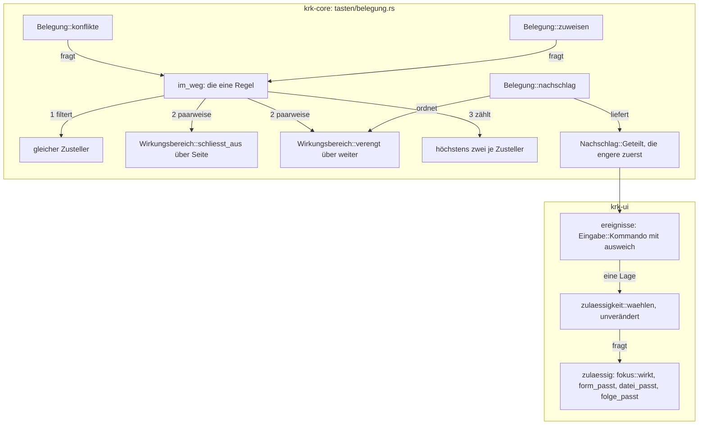

# Analysis: Klärung, ob die Verengung an die eine Stelle der Konfliktregel passt

**Date:** 2026-09-29 14:37
**Type:** Feasibility
**Status:** Complete
**Requested by:** orchestrator, Schritt 2 des Plans `260929-1423_*_plan-vorschau-blaettert-fotos-nach-aufnahmedatum.md` (Haltepunkt 4 des Spec)

## Question

Lässt sich die zweite Art des Teilens, „die eine Funktion wirkt nur bei stehender Bildfolge“, an der einen Stelle der Konfliktregel unterbringen, an der heute „Editor gegen außerhalb“ steht? Oder verlangt sie eine zweite Regel neben `begegnen`? Beantwortet werden die Fragen (a) bis (e) aus Schritt 2 und die drei Möglichkeiten des offenen Entscheidungsdatensatzes `260929-1423_*_wie-teilen-zwei-funktionen-eine-kombination-wenn-die-eine-nur-bei-stehender-bildfolge-wirkt.md`.

## Scope

Gelesen am Quelltext:

- `crates/krk-core/src/tasten/belegung.rs`: Modulkopf „Zwei Funktionen eines Zustellers auf einer Kombination“ (Z. 131–158), `Wirkungsbereich` (Z. 299–484), `beschriftung` (509), `seite` (539), `schliesst_aus` (565), `Seite` (580), `Kommando::wirkungsbereich` (1347), `Funktion::wirkungsbereich` (1783), `Nachschlag` (1796), `nachschlag` (1926), `zuweisen` (1972), `konflikte` (2022), `bauen` (2055), `begegnen` (2143).
- `crates/krk-core/tests/belegung.rs`: die Proben zum Teilen (905–1060), `getroffene` (273), `jede_belegte_kombination_wird_weiterhin_als_funktion_gefunden` (1602), `jedes_gebaute_kommando_haengt_an_seiner_ausgelieferten_taste` (1692), `jedes_kommando_traegt_genau_einen_wirkungsbereich` (2410), `stelle_im_feld` (2900).
- `crates/krk-ui/src/kommandos/zulaessigkeit.rs`: `Lage` (196), `zulaessig` (318), `waehlen` (338), `gestattet` (445), `form_passt` (476), `datei_passt` (580), `immer_erreichbar` (615), Prüfmodul mit `STELLVERTRETER` (799), `lage_in` (891), `die_tafel_aus_allen_faellen_geht_auf` (1028), `jede_lage` (1235), `einander_ausschliessende_bereiche_sind_nie_zugleich_zulaessig` (1263), `waehlen_nimmt_die_zulaessige_der_beiden` (1294).
- `crates/krk-ui/src/kommandos/fokus.rs`: `wirkt` (413), Tafel `die_tafel_aus_wirkungsbereichen_und_fokuswerten_geht_auf` (~505), Gruppenprobe mit `match` (~958–1000).
- `crates/krk-ui/src/kommandos/blattmeldung.rs`: `blattmeldung` (178).
- `crates/krk-ui/src/appkit/ereignisse.rs`: `Eingabe::Kommando` (353), der Zweig für `Nachschlag::Geteilt` (698), `protokollzeile` (909).
- `crates/krk-ui/src/appkit/anwendung.rs`: `eingabe_ausfuehren` (3723), `lage` (3947), `kommando_ausfuehren_bei` (4095).
- `crates/krk-ui/src/menuemodell.rs`: `aufbau` (262), `fruehere_behalten_das_kuerzel` (307), `eintrag` (335); `crates/krk-ui/src/belegungsmodell.rs`: `Funktionsbereich::ALLE` (177), `bereich_des_kommandos` (289, 361, 394).
- `resources/default-keymap.toml`: `ordner_aufwaerts` (276–279), `mit_standardprogramm_oeffnen` (941–944).
- Spec `260929-1313_*_spec-vorschau-blaettert-fotos-nach-aufnahmedatum.md` (C3, C4, `## Stops when`), Entscheid `260926-2308_*_duerfen-zwei-funktionen-desselben-zustellers-eine-kombination-tragen-wenn-ihre-wirkungsbereiche-einander-ausschliessen.md` (Marker `_i_`).

Baumstand: HEAD `c374be2` vom 2026-09-29 14:31:55 +0200, Zweig `main`, 21 Commits vor `origin/main`; im Arbeitsbaum geändert sind allein `fusion-workbench/orchestrator-events.jsonl` und der Plan dieses Arbeitspakets. Kein Quelltext ist gegenüber HEAD geändert. Jede Aussage im Präsens gilt für diesen Stand.

## Findings

### Ausgangslage am Quelltext

| Tatsache | Beleg |
|---|---|
| Beide Paare stehen im selben Bereich und beim selben Zusteller. | `Kommando::OrdnerAufwaerts` und `Kommando::MitStandardprogrammOeffnen` tragen beide `Wirkungsbereich::Dateifenster` (`belegung.rs`, `Kommando::wirkungsbereich`, Arm um Z. 1675–1684). Keine der zwei Funktionen hat `gehalten_von`. |
| Kein anderer Träger auf `cmd+up` oder `return`, auch nicht beim Menü. `cmd+down` ist frei. | `grep` über `default-keymap.toml`: `cmd+up` allein in Z. 279, `return` allein in Z. 944, `cmd+down` nirgends. |
| Die Regel ist heute paarweise. | `begegnen(eine, andere) -> bool` (Z. 2143): gleicher Zusteller und `!schliesst_aus`. `konflikte` (2027) und `zuweisen` (1987) rufen allein sie. |
| „Höchstens zwei“ ist heute keine Regel, sondern eine Folgerung. | Doc von `nachschlag`, Z. 1919–1922: drei paarweise ausschließende Funktionen bräuchten drei Seiten. `nachschlag` kehrt beim zweiten Treffer sofort zurück (Z. 1938). |
| Die Wahl der Oberfläche ist asymmetrisch. | `waehlen` (Z. 338): `zweite`, wenn allein sie zulässig ist, sonst `erste`. |
| Die Menüleiste gibt das Kürzel dem früheren Eintrag. | `fruehere_behalten_das_kuerzel` (Z. 307); ein Eintrag zeigt die **erste** Kombination seiner Funktion (`eintrag`, Z. 341). |

### (a) Möglichkeit 1 passt an die eine Stelle, aber nicht in die heutige Signatur

**Die paarweise Form kann „höchstens zwei“ nicht tragen.** Mit einer Verengung gibt es drei Funktionen, die einander paarweise vertragen: eine der Editorseite (etwa `termine_richtung_umkehren`), eine des Dateifensters und eine der Bildfolge. Editor gegen Dateifenster schließt aus, Editor gegen Bildfolge ebenso (Bildfolge steht auf `Seite::Ausserhalb`), Dateifenster gegen Bildfolge ist eine Verengung. `begegnen` sagte dreimal nein, `konflikte` meldete nichts, und `nachschlag` gäbe beim zweiten Treffer zurück und überginge den dritten still. Das ist genau der Nachteil, den der Datensatz unter Möglichkeit 1 selbst nennt.

**Die Mengenform bleibt eine Stelle.** Die Regelfunktion bekommt statt eines Partners die Träger, die die Kombination schon haben, und nennt den, an dem der Bewerber scheitert:

```rust
/// Die eine Fassung der Konfliktregel: der Traeger, an dem `bewerber` auf
/// dieser Kombination scheitert, oder `None`, wenn er sie mittragen darf.
fn im_weg<'a>(traeger: &[&'a Funktion], bewerber: &Funktion) -> Option<&'a Funktion>
```

Ihr Rumpf in dieser Reihenfolge:

1. Träger eines anderen Zustellers fallen heraus (heute die erste Zeile von `begegnen`).
2. Der erste verbleibende Träger, mit dem der Bewerber **nicht** teilen darf, wird genannt. Teilen dürfen zwei Funktionen, wenn beide einen Wirkungsbereich haben und der eine den anderen ausschließt **oder** verengt. Diese paarweise Frage steht im Rumpf und hat keinen zweiten Rufer.
3. Sonst: trägt die Kombination beim selben Zusteller schon zwei, wird der erste genannt („höchstens zwei“).

Die Rufer ändern sich so:

- `konflikte` sammelt je `(stelle, kombination)` die früheren Funktionen mit dieser Kombination und fragt `im_weg`.
- `zuweisen` sammelt alle anderen Funktionen mit der Kombination und fragt `im_weg`.

Eine zweite Regel entsteht dabei nicht.

**Die heutigen Ergebnisse bleiben Wort für Wort.** Schritt 3 greift heute nie: jede Belegung, die `begegnen` durchlässt, trägt je Zusteller höchstens zwei (Z. 1919–1922). Schritt 2 findet denselben Partner wie die heutige Schleife, weil beide in Dateireihenfolge laufen. Nachgeprüft an den drei Proben, die Namen erwarten:

| Probe | Erwartet | Unter `im_weg` |
|---|---|---|
| `eine_kombination_zweimal_im_dateifenster_bleibt_ein_konflikt` (`tests/belegung.rs` 946) | andere `sortierung_name`, Bewerber `sortierung_groesse` | Schritt 2 trifft `sortierung_name` zuerst: gleich |
| `drei_funktionen_auf_einer_kombination_sind_ein_konflikt` (972) | andere `editor_sichern`, Bewerber `eintrag_loeschen` | Schritt 2 trifft `editor_sichern` (dieselbe Seite): gleich |
| `die_umbelegung_folgt_derselben_regel_wie_das_einlesen` (987) | vier Antworten über `zuweisen` und das Einlesen | Schritt 2: gleich |

**Eine benannte Abweichung:** `konflikte` meldet heute für eine Funktion und eine Kombination so viele Konflikte, wie frühere Partner da sind. Unter `im_weg` meldet es höchstens einen. Kein Rufer zählt die Länge. `bauen` (2128) nimmt den ersten, die Proben fragen `is_empty` oder den ersten, und `krk-ui` ruft `konflikte` nicht (`grep 'konflikte()' crates/krk-ui/src` ist leer). Der Doc-Kommentar von `konflikte` („Jede Kombination, die zwei Funktionen beanspruchen …“) bekommt einen Satz dazu.

**Berichtigung an der Form der Verengung.** Plan, Schritt 7, sieht `Wirkungsbereich::verengt(self, andere) -> bool` als `const fn` vor, „vollständig, heute allein `(Bildfolge, Dateifenster)`“. Ein `matches!` über ein Paar ist nicht vollständig: das Makro enthält den Auffangzweig, und ein neuer Wert hält den Bau dort nicht an. Die vollständige Form heißt:

```rust
/// Der Bereich, den dieser verengt: wo dieser zulaessig ist, ist jener es auch.
pub const fn weiter(self) -> Option<Wirkungsbereich>   // match ueber alle Werte, ohne `_`
pub const fn verengt(self, andere: Wirkungsbereich) -> bool  // self.weiter() == Some(andere), per match
```

`weiter` hat einen Arm je Wert, heute `Bildfolge => Some(Dateifenster)` und sonst `None`. Damit gilt dreierlei ohne Zutun:

- Jeder Bereich verengt höchstens einen.
- `verengt(x, x)` braucht einen ausdrücklich falschen Arm. Eine Kernprobe hält `weiter(x) != Some(x)`.
- Ein neuer Wirkungsbereich hält den Bau an dieser Stelle an und wird bewusst eingeordnet.

Eine zweite Kernprobe hält `weiter(x) == Some(y) ⇒ x.seite() == y.seite()`. Dann sind Ausschluss und Verengung disjunkt, und jedes Paar fällt in genau eine der drei Klassen: schließt aus, verengt (in einer Richtung), begegnet.

**Transitive Verengung gibt es bewusst nicht.** `Bildfolge` liegt der Sache nach auch in `Navigator` und `Tabbereich`. Nach `weiter` bleibt ein Teilen mit deren Funktionen trotzdem ein Konflikt. Das ist die sichere Richtung des Fehlers, dieselbe, die der Entscheid 260926-2308 für die Seiten angenommen hat.



Selbstprüfung des Diagramms: zwei Schichten, alle Kanten laufen nach unten oder von Kern zu Oberfläche, kein Zyklus. `im_weg` hat genau zwei Rufer, wie es der Text sagt. `nachschlag` fragt die Regelfunktion nicht, sondern allein `verengt` für die Reihenfolge; der Text unter (b) begründet, warum das keine zweite Regel ist.

### (b) Die engere zuerst genügt, und `waehlen` bleibt unverändert

**Die Reihenfolge muss im Code entstehen, nicht in der Datei.** `Belegung::bauen` übernimmt die Reihenfolge der Nutzerdatei (Z. 2060). Eine eigene `keymap.toml` kann `bild_zurueck` vor oder hinter `ordner_aufwaerts` führen. `nachschlag` tauscht deshalb im Zweig `Some(erste) =>` (Z. 1938): verengt der zweite Treffer den ersten, liefert es `Geteilt(zweiter, erster)`, sonst wie heute. Das ist eine Frage an `verengt` und keine Zulässigkeitsfrage, also keine zweite Regel. Der Vorteil, den der Datensatz als Nachteil führt („die Reihenfolge hängt nicht mehr allein an der Datei“), ist hier der Zweck: keine Nutzerdatei kann den Vorrang der Bildfolge umdrehen.

**`waehlen` wählt damit in jeder Lage richtig.** `e` ist die engere, `w` die weitere.

| `zulaessig(e)` | `zulaessig(w)` | `waehlen(e, w)` | Bedeutung |
|---|---|---|---|
| ja | ja | `e` | Bildfolge steht, Fokus in der Dateiliste: blättern, springen |
| nein | ja | `w` | keine Bildfolge: wie heute |
| ja | nein | `e` | nach Schritt (c) unmöglich; wäre auch dann eindeutig |
| nein | nein | `e`, abgewiesen | wie heute; siehe (e) zur Meldung |

Die Tafel gilt für jede Lage aus `jede_lage`, sobald diese das neue Feld mit beiden Werten führt.

**Was an den bestehenden geteilten Kombinationen gleich bleibt:**

- `cmd+1`: `sortierung_name` und `termine_richtung_umkehren` schließen einander aus. `verengt` sagt in beiden Richtungen nein, der Tausch greift nicht. `cmd_1_ergibt_in_der_auslieferung_einen_geteilten_nachschlag` (`tests/belegung.rs` 1048) bleibt unverändert grün, ebenso `die_auslieferung_legt_die_richtung_der_termine_auf_cmd_1_und_die_sortierung_behaelt_sie` (1027), `eine_kombination_im_editor_und_im_dateifenster_ist_kein_konflikt` (919, `cmd+2` in Dateireihenfolge), `eine_geteilte_kombination_nennt_beide_kennungen` (`ereignisse.rs` ~1385) und `waehlen_nimmt_die_zulaessige_der_beiden` (`zulaessigkeit.rs` 1294). Die letzte läuft nur über Paare mit `schliesst_aus`. Die neuen Paare `Bildfolge` × Editorseite sind solche Paare und halten, weil `Bildfolge` den Fokus im Dateifenster verlangt.
- `cmd+a` und `cmd+f`: verschiedene Zusteller. `im_weg` filtert sie in Schritt 1 heraus wie heute `begegnen`, und `nachschlag` sieht die Menü-Funktion gar nicht (Z. 1929).
- `jede_belegte_kombination_wird_weiterhin_als_funktion_gefunden` (1602) und `jedes_gebaute_kommando_haengt_an_seiner_ausgelieferten_taste` (1692) lassen `Geteilt` über `getroffene` (273) zu. `cmd+up` und `return` werden geteilt, beide Proben bleiben grün.

**Doc-Kommentare, die der Schritt falsch macht** und die er im selben Schritt berichtigt:

- `Nachschlag::Geteilt` (Z. 1799–1805): „deren Wirkungsbereiche einander ausschließen, in der Reihenfolge der Belegung“ und „höchstens eine der beiden zulässig“.
- `nachschlag`, Abschnitt „Zwei Treffer“ (1914–1924): die Drei-Seiten-Begründung.
- Modulkopf von `belegung.rs` (131–158): „nach der Regel oben ist höchstens eine zulässig“.
- `waehlen` (`zulaessigkeit.rs` 325–332): „dann ist in jeder Lage höchstens eine zulässig“.
- Kommentar im `Geteilt`-Zweig der Ereigniszuleitung (`ereignisse.rs` 695–697) und in `protokollzeile` (910–911, „in der Reihenfolge der Belegung“).
- `CLAUDE.md`, Absatz über `Nachschlag::Geteilt`: der Satz, dass die Seiten „nie zwei zugleich zulässige Funktionen durchlassen“, wird falsch, denn Bildfolge und Dateifenster sind mit Absicht zugleich zulässig. Das gehört in Schritt 14.

### (c) Eine Probe hält die Verengung über jede Lage

Die Probe steht in `zulaessigkeit.rs` neben `einander_ausschliessende_bereiche_sind_nie_zugleich_zulaessig` und ist nach ihrem Muster gebaut:

- Sie läuft über jedes Paar aus `Kommando::KENNUNGEN` mit `eine.wirkungsbereich().verengt(andere.wirkungsbereich())`, also nicht allein über die Stellvertreter.
- In jeder Lage aus `jede_lage()` verlangt sie `zulaessig(eine) ⇒ zulaessig(andere)`.
- Sie sichert ab, dass sie überhaupt etwas prüft: mindestens ein Paar, und mindestens eine Lage, in der die engere zulässig ist. Sonst liefe sie grün, solange `jede_lage` das neue Feld auf `false` hält.

Über `KENNUNGEN` statt über `STELLVERTRETER` zu laufen hat einen eigenen Grund. So prüft die Probe auch die Ausnahmelisten mit. Stünde ein Befehl der Bildfolge auf `immer_erreichbar` oder `waehrend_blatt_erlaubt` und sein weiterer Bereich nicht, wäre die engere während eines Blattes zulässig und die weitere nicht, und die Probe würde rot.

**Die Stellvertreter:** Für die Tafeln braucht `STELLVERTRETER` eine Zeile `(Wirkungsbereich::Bildfolge, Kommando::BildVor)` (oder `BildZurueck`). Beide stehen auf keiner Ausnahmeliste, was `jeder_stellvertreter_traegt_den_bereich_den_er_vertritt` (974) prüft. Die fünf Tafeln in `die_tafel_aus_allen_faellen_geht_auf` bekommen je eine Zeile. Weil `lage_in` das neue Feld auf `false` setzt, ist sie in allen fünf `[false; 6]`, wie die Zeile `Geheimnisse` ohne `pin_aenderbar`. Die Lage mit `bildfolge = true` baut die neue Probe selbst, nach dem Vorbild von `pin_aendern_wirkt_allein_mit_dem_fokus_im_editor_und_pin_aenderbar` (2007).

### (d) Pflichtstellen eines sechzehnten Wirkungsbereichs und eines siebten Feldes in `Lage`

`Wirkungsbereich` trägt heute fünfzehn Werte (`awk '/^pub enum Wirkungsbereich/,/^}/'`, zählt man die Varianten: Dateifenster bis Ueberall). `Lage` trägt sechs Felder (Z. 196–242). Eine Liste `Wirkungsbereich::ALLE` gibt es nicht (`grep` in `belegung.rs` leer).

**Hält der Übersetzer** (ein `match` ohne Auffangzweig oder ein vollständiges Literal):

| Stelle | Datei | Wert für `Bildfolge` / neues Feld |
|---|---|---|
| `Wirkungsbereich::beschriftung` | `krk-core/src/tasten/belegung.rs` 509 | „Dateifenster, solange die Vorschau eine Bildfolge zeigt“ |
| `Wirkungsbereich::seite` | ebd. 539 | `Seite::Ausserhalb` |
| `Wirkungsbereich::weiter` (neu, siehe (a)) | ebd. | `Some(Dateifenster)`, sonst `None` |
| `Kommando::wirkungsbereich` | ebd. 1347 | die drei neuen Kommandos |
| `fokus::wirkt` | `krk-ui/src/kommandos/fokus.rs` 413 | `fokus == Fokus::Dateifenster` |
| Gruppenprobe mit `match` über den Bereich | `fokus.rs` ~958–1000 (Prüfmodul, hält unter `cargo test` und `clippy --all-targets`) | Arm bei den Befehlen des Dateifensters |
| `form_passt` | `zulaessigkeit.rs` 476 | `true` |
| `datei_passt` | `zulaessigkeit.rs` 580 | `true` |
| `folge_passt` (neu) | `zulaessigkeit.rs` | allein `Bildfolge` fragt `lage.bildfolge`, vollständig über `Wirkungsbereich` |
| `stelle_im_feld` | `krk-core/tests/belegung.rs` 2900 | Stelle 15, und das Feld darüber wächst |
| Literal `Lage { … }` in `lage_in` | `zulaessigkeit.rs` 898 | `bildfolge: false` |
| Literal `Lage { … }` in `Anwendungsdelegierter::lage` | `appkit/anwendung.rs` 3949 | `vorschau.zeigt_bildfolge()` und Bereich Vorschau sichtbar |

Jedes andere `Lage { … }` im Baum schreibt `..lage_in(…)` und erbt das Feld still: `zulaessigkeit.rs` 1241, 2014, 2025, 2047, 2100.

**Hält eine Probe:**

| Stelle | Probe |
|---|---|
| Zeile in `STELLVERTRETER` (`zulaessigkeit.rs` 799) | `jeder_wirkungsbereich_hat_einen_stellvertreter` (833), liest die Varianten aus dem Quelltext |
| je eine Zeile in den fünf Tafeln | `die_tafel_aus_allen_faellen_geht_auf` (1028): die Schlusszählung gegen `STELLVERTRETER.len()` wird rot, weil `zip` bei 15 Zeilen abbricht |
| Zeile in `BESCHRIFTUNGEN` (`tests/belegung.rs`) | `jeder_wirkungsbereich_im_quelltext` und die drei Beschriftungsproben |
| Liste im `matches!` von `jedes_kommando_traegt_genau_einen_wirkungsbereich` (2410–2446) | dieselbe Probe, rot beim ersten Kommando mit `Bildfolge` |
| Eindeutige Beschriftung | `keine_zwei_wirkungsbereiche_teilen_sich_eine_beschriftung` |
| Seiten gegen die Zulässigkeit | `einander_ausschliessende_bereiche_sind_nie_zugleich_zulaessig` (1263) läuft ohne Änderung über die neuen Paare |
| Verengung gegen die Zulässigkeit | neu, siehe (c) |
| `weiter` irreflexiv und seitengleich | neu, zwei Kernproben, siehe (a) |

**Hält nichts:**

| Stelle | Warum nichts sie hält | Vorschlag |
|---|---|---|
| Zeile `Bildfolge` in der Tafel von `fokus.rs` (`TAFEL`, ~505) | Ihr eigener Doc-Kommentar sagt, dass ein weiterer Bereich ohne Zeile dort grün bleibt; gefangen wird er allein an `wirkt`. | Zeile von Hand, `[true, false, false, false, false, false]` |
| Die zweite Dimension in `jede_lage` (`zulaessigkeit.rs` 1235) | Das Literal in `lage_in` zwingt nur zu einem Wert. Eine Schleife über `[false, true]` ergänzt niemand von selbst. | Schleife wie bei `pin_aenderbar`, und die Absicherung aus (c), dass die engere mindestens einmal zulässig ist |
| Die Blattlisten `immer_erreichbar`, `waehrend_blatt_erlaubt` | Gewollt keine vollständigen Unterscheidungen; der Vorgabewert „nicht darauf“ ist richtig. | nichts eintragen; die Probe aus (c) wird rot, wenn einer der Engeren doch darauf käme |
| Ausführungszweige in `kommando_ausfuehren_bei` | enden auf einen Auffangzweig (`CLAUDE.md`, „Der Ausführungszweig hält er nicht“) | wie im Plan: Schritte 8 und 9 samt `zweigproben::BEFEHLE` |
| Doc-Kommentare mit Zahlen | „sechs kleine Felder“ (`Lage`, Z. 190), „als fünftes Feld“ (`Editorform`, Z. 250), „die vier Bestandteile“ (`gestattet`) | `folge_passt` wird wie `form_passt` und `datei_passt` eine Hälfte von Bestandteil (3); die Zahlen fallen oder werden berichtigt |

### (e) Cmd+Pfeil hoch außerhalb der Bildfolge: dasselbe wie heute

Heute liefert `nachschlag` für `cmd+up` `Funktion(ordner_aufwaerts)`. Nach der Regel liefert es `Geteilt(bild_zurueck, ordner_aufwaerts)`. Der Weg geht über `eingabe_ausfuehren` → `waehlen` → `kommando_ausfuehren_bei`.

| Fokus, Lage | heute | neu | Unterschied |
|---|---|---|---|
| Dateiliste, keine Bildfolge | `OrdnerAufwaerts` zulässig, führt aus | `BildZurueck` nein, `OrdnerAufwaerts` ja: `zweite` | keiner |
| Dateiliste, Bildfolge steht | `OrdnerAufwaerts` | `BildZurueck` | gewollt (C3.2) |
| Vorschau | `OrdnerAufwaerts` abgewiesen, Rückgabe `false`, Anschlag an AppKit | beide abgewiesen, `erste` abgewiesen, `false`, an AppKit | keiner |
| Leiste, Editor, Git, Anderswo | wie Vorschau | wie Vorschau | keiner |
| Blatt steht | `blattmeldung` meldet | `blattmeldung` meldet denselben Satz | keiner, weil `blattmeldung` (`blattmeldung.rs` 184) allein `waehrend_blatt_erlaubt` und `immer_erreichbar` fragt, und die sind für `BildZurueck` und `OrdnerAufwaerts` beide falsch |
| Textfeld (Umbenennen, Pfadeingabe) | abgewiesen, an AppKit | abgewiesen, an AppKit | siehe unten |

Für `return` mit `ZumBild` und `MitStandardprogrammOeffnen` gilt dieselbe Tafel. `cmd+down` ist heute `Unbelegt` (Rückgabe `false`, an AppKit). Neu ist es `Funktion(bild_vor)`, außerhalb der Bildfolge abgewiesen, ebenfalls `false`. Auch dort gibt es keinen Unterschied.

**Zwei Unterschiede bleiben sichtbar, und keiner verändert eine Wirkung:**

1. **Das Tastenprotokoll** (`--tasten-protokoll`) schreibt `funktion=bild_zurueck|ordner_aufwaerts` statt `funktion=ordner_aufwaerts` (`protokollzeile`, 909). Das ist eine Auskunft und kein Verhalten.
2. **`cmd+up` wird zum ersten Mal ein Menükürzel**, am Eintrag „Voriges Bild“, und `cmd+down` am Eintrag „Nächstes Bild“. Außerhalb einer Bildfolge sind beide ausgegraut. Ein Anschlag, den der Abgriff an AppKit zurückgibt, trifft vor dem Ersthelfer auf die Menüleiste. Ob ein ausgegrauter Eintrag ihn dort verschluckt, ist für `cmd+up` nicht gemessen. **Indiz dagegen:** `return` ist heute schon Menükürzel von „Mit dem Standardprogramm öffnen“, `opt+up` und `opt+down` von „Lesezeichen nach oben/unten verschieben“ (`default-keymap.toml` 631, 636), und beide sind in Textfeldern ausgegraut. Würde ein ausgegrauter Eintrag den Anschlag schlucken, bestätigte die Pfadeingabe mit `return` nicht mehr. Die sichtbare Prüfung gehört zu C3.4 im Abnahmelauf des Nutzers, mit dem Fokus in der Vorschau über einem PDF.

### Menükürzel nach der bestehenden Regel

`Funktionsbereich::ALLE` ordnet `Dateilisting` und `Dateioperationen` vor `Vorschau` (`belegungsmodell.rs` 177–189). `OrdnerAufwaerts` steht in `Dateilisting` (289), `MitStandardprogrammOeffnen` in `Dateioperationen` (361), die drei neuen Befehle nach Plan in `Vorschau`.

| Eintrag | erste Kombination | im Menü | Grund |
|---|---|---|---|
| In den übergeordneten Ordner | `left` | ← | Die erste Kombination ist `left` (keymap 279); `cmd+up` erscheint dort nicht. |
| Voriges Bild | `cmd+up` | ⌘↑ | Kein früherer Eintrag zeigt `cmd+up`. |
| Nächstes Bild | `cmd+down` | ⌘↓ | frei |
| Mit dem Standardprogramm öffnen | `return` | ↩ | steht früher in der Leiste |
| Zum angezeigten Bild springen | `return` | keins | `fruehere_behalten_das_kuerzel` nimmt es ihm |

`keine_zwei_eintraege_tragen_dieselbe_kombination` bleibt grün. **Die Anzeige hängt an der Reihenfolge in `ordner_aufwaerts.tasten`.** Führt eine Nutzerdatei dort `cmd+up` zuerst, verliert „Voriges Bild“ die Anzeige, denn „Vorschau“ steht in der Leiste später. Beide bleiben über den Abgriff erreichbar. Das ist derselbe Preis, den `cmd+1` und `cmd+a` tragen, und er entspricht C3.7 („folgt der bestehenden Regel“).

### Bewertung der Möglichkeiten des Datensatzes

| | Möglichkeit 1: Verengung an der einen Stelle | Möglichkeit 2: zweite Regel neben `begegnen` | Möglichkeit 3: Umschalt+Cmd+Pfeil |
|---|---|---|---|
| Eine Regelstelle | ja, `im_weg` mit zwei Rufern | nein; genau der Haltepunkt des Spec | ja, die Regel bleibt unberührt |
| Hält „höchstens zwei“ | ja, als Schritt 3 der Regel | nur mit einer dritten Prüfung | trivial |
| Löst Return (C4) | ja, dieselbe Verengung | ja | **nein**; Return braucht trotzdem 1 oder 2 |
| Nutzerwahl 2A und 3A | eingehalten | eingehalten | verletzt 2A |
| `waehlen`, Abgriff, Menü | unverändert | unverändert | unverändert |
| `cmd+1`, `cmd+a`, `cmd+f` | unverändert, siehe (b) | unverändert | unverändert |
| Heutige Proben | unverändert grün bis auf die im Plan benannten Tafeln | unverändert grün | unverändert grün |

**Disjunkt:** 1 und 2 unterscheiden sich allein darin, ob die Verengung in derselben Funktion geprüft wird wie der Ausschluss. 3 ändert die Tasten und nicht die Regel. Überlappungen gibt es keine.

**Vollständig nur mit einer Einschränkung.** Jeder Entwurf, der `cmd+up` und `return` für zwei benannte Funktionen desselben Zustellers hält, muss die Konfliktregel ändern; der Raum ist also „Regel an einer Stelle“, „Regel an zwei Stellen“ oder „andere Taste“. Ungenannt bleibt eine vierte Form: `OrdnerAufwaerts` fragt in seinem Ausführungszweig selbst nach der Bildfolge. Die Konfliktregel bliebe dann unberührt. Das ist aber die „Abfrage je Aufrufstelle“, die der Modulkopf von `belegung.rs` (Z. 170–175) ausschließt. Sie graute das Menü falsch aus, und sie gäbe „Voriges Bild“ keine eigene Taste, die C3.7 verlangt. Sie ist deshalb keine gleichwertige Alternative, und der Datensatz braucht sie nicht als Möglichkeit.

## Implications

**Haltepunkt 4 greift nicht.** Die Verengung passt an die eine Stelle. Sie verlangt dort aber, dass die Regel eine Menge fragt und nicht mehr ein Paar. Das ist keine zweite Regel. Es ist dieselbe Frage, gestellt an alle, die die Kombination schon tragen. Die Empfehlung des Datensatzes trifft also zu, mit drei Berichtigungen am Plan:

1. Die Signatur ist `im_weg(traeger, bewerber) -> Option<&Funktion>` und nicht `begegnen(eine, andere) -> bool`.
2. Die Verengung steht als vollständiges `weiter()` und nicht als `matches!`.
3. `jede_lage` und die Tafel in `fokus.rs` werden von Hand erweitert, weil sie niemand erzwingt.

**Die Zusage an die Oberfläche ändert sich im Wortlaut, nicht in der Wirkung.** Bisher hieß sie: „in jeder Lage ist höchstens eine zulässig“. Künftig heißt sie: „in jeder Lage ist höchstens eine zulässig, oder die engere geht vor“. `waehlen` erfüllt beide Fassungen ohne Änderung, weil `nachschlag` die engere zuerst liefert.

**Die Antwort bindet über diese Arbeit hinaus**, wie der Datensatz sagt. Jeder künftige Befehl, dessen Bedeutung am Inhalt einer Fläche hängt, bekommt einen Wirkungsbereich mit einem Arm in `weiter`, eine Hälfte in `gestattet` und ein Feld in `Lage`. Eine vierte Art des Teilens entsteht dabei nicht.

## Recommendations

- **An den Nutzer, über den Orchestrator:** Möglichkeit 1 des Datensatzes `260929-1423_*_wie-teilen-zwei-funktionen-eine-kombination-wenn-die-eine-nur-bei-stehender-bildfolge-wirkt.md` wählen, in der Fassung dieses Berichts. Der Datensatz bleibt offen, bis der Nutzer antwortet; dieser Bericht beantwortet ihn nicht.
- **An `code-implementer`, Schritt 7:**
  - die Regel als `im_weg` bauen, gefragt allein von `konflikte` und `zuweisen`; den heutigen Namen `begegnen` ersetzen, nicht daneben stehen lassen;
  - `weiter` und `verengt` vollständig bauen, mit zwei Kernproben (irreflexiv, seitengleich);
  - in `nachschlag` den Tausch im Zweig des zweiten Treffers einbauen;
  - die Probe aus (c) über `KENNUNGEN` und über `jede_lage` samt dem neuen Feld schreiben, mit beiden Absicherungen gegen einen leeren Lauf;
  - die Liste aus (d) abarbeiten, auch die zwei Stellen ohne Halt;
  - die sieben Doc-Stellen aus (b) und die Zahlen aus (d) im selben Schritt berichtigen.
- **Eine zusätzliche Kernprobe:** drei Funktionen desselben Zustellers mit paarweise verträglichen Bereichen (etwa `termine_richtung_umkehren`, `ordner_aufwaerts`, `bild_zurueck` auf `cmd+up`) sind beim Einlesen und bei `zuweisen` ein Konflikt, und die Meldung nennt `ordner_aufwaerts`. Der Plan nennt den Fall unter C3.8 mit „Editor, Dateifenster, Bildfolge“. Hier ist er an einer Stelle festgelegt, an der die paarweise Regel ihn nicht fängt.
- **An `code-implementer`, Schritt 14:** den Satz in `CLAUDE.md` berichtigen, der sagt, die Seiten ließen nie zwei zugleich zulässige Funktionen durch.
- **Abnahmelauf des Nutzers:** unter C3.4 prüfen, dass `cmd+up` und `cmd+down` mit dem Fokus in der Vorschau über einem PDF und über einem Text wie vorher wirken, obwohl beide jetzt als ausgegraute Menükürzel stehen.

## Filed Issues

Keine. Jeder Befund ist eine Berichtigung am Plan vor Schritt 7 und wird dort gebaut. Ein Nebenbefund ohne eigenen Datensatz: der Doc-Kommentar von `ein_befehl_des_dateifensters_wirkt_im_editor_nicht` (`zulaessigkeit.rs` 1339–1342) sagt, `return` liege auf `Kommando::Oeffnen`. `return` gehört `mit_standardprogramm_oeffnen` (keymap 944), `oeffnen` liegt auf `right` (274). Schritt 7 schreibt in dieser Datei und kann den Satz mitnehmen.

## Sources

- `crates/krk-core/src/tasten/belegung.rs`: 131–192, 299–587, 1347–1450, 1770–1960, 1961–2151
- `crates/krk-core/tests/belegung.rs`: 273–315, 320–334, 905–1060, 1600–1728, 2410–2446, 2895–2935
- `crates/krk-ui/src/kommandos/zulaessigkeit.rs`: 150–620, 770–1335, 2007–2110
- `crates/krk-ui/src/kommandos/fokus.rs`: 413–462, 470–580, 958–1000
- `crates/krk-ui/src/kommandos/blattmeldung.rs`: 178–189
- `crates/krk-ui/src/appkit/ereignisse.rs`: 340–372, 670–720, 895–930, 1295–1330, 1385–1405
- `crates/krk-ui/src/appkit/anwendung.rs`: 3723–3775, 3947–3975, 4095–4160
- `crates/krk-ui/src/menuemodell.rs`: 180–431
- `crates/krk-ui/src/belegungsmodell.rs`: 101–189, 260–400, 992–1017
- `resources/default-keymap.toml`: 272–285, 628–637, 941–950, 1390–1402
- `260929-1313_*_spec-vorschau-blaettert-fotos-nach-aufnahmedatum.md`: C3, C4, `## Stops when`
- `260929-1423_*_plan-vorschau-blaettert-fotos-nach-aufnahmedatum.md`: Current State, Approach, Schritte 2 und 7
- `260929-1423_*_wie-teilen-zwei-funktionen-eine-kombination-wenn-die-eine-nur-bei-stehender-bildfolge-wirkt.md`
- `260926-2308_*_duerfen-zwei-funktionen-desselben-zustellers-eine-kombination-tragen-wenn-ihre-wirkungsbereiche-einander-ausschliessen.md` (Arbeitspaket `260926-2240-termine-als-weitere-datei-im-heimordner`)

## Open Questions

- [ ] Die Wahl zwischen den Möglichkeiten des Datensatzes steht beim Nutzer; dieser Bericht empfiehlt 1 in der Fassung oben.
- [ ] Verschluckt ein ausgegrauter Menüeintrag mit `⌘↑` den Anschlag, bevor ein Textfeld oder die Vorschau ihn bekommt? Aus dem Code nicht entscheidbar. Das Indiz über `return` und `opt+up` spricht dagegen; entscheiden kann es allein der Abnahmelauf (C3.4).

Urteil: Go
