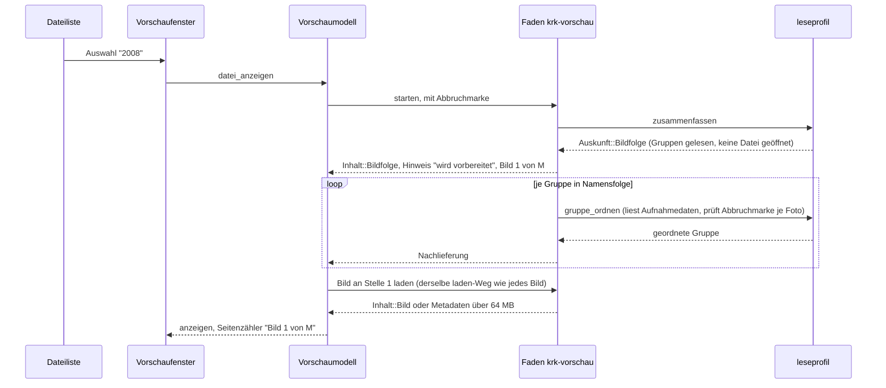
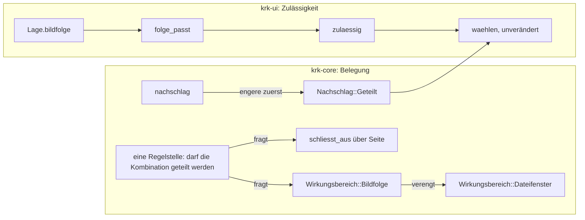
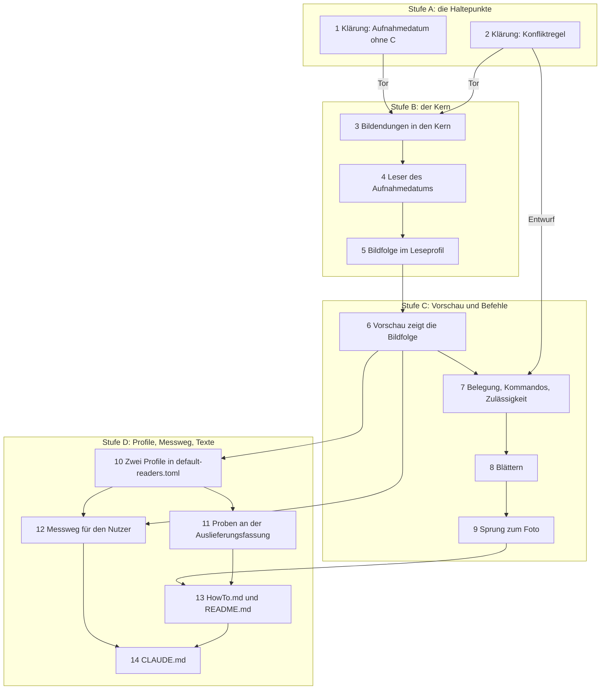

# Implementation Plan: Die Vorschau blättert durch die Fotos eines Jahres- oder Monatsordners

**Date:** 2026-09-29
**Status:** Draft
**Spec:** `260929-1313_*_spec-vorschau-blaettert-fotos-nach-aufnahmedatum.md` (C1 bis C6, vier Haltepunkte unter `## Stops when`, Obergrenze 7.500 Fotos). Gebaute Grundlage: HEAD `9926c78`, Fassung 2.1.1, der Befehl „Auf Werkseinstellungen zurücksetzen…“ ist darin gebaut.
**Decidability:** Fünf Fragen tragen den Plan. **Erstens „in welcher Reihenfolge stehen die Fotos eines Ordners?“**: entscheidbar aus den Bytes jeder Datei innerhalb einer festen Lesegrenze je Foto; wo die Bilddaten kein Aufnahmedatum hergeben (Format ohne EXIF, unlesbar, über der Grenze), antwortet derselbe Mechanismus mit dem Änderungsdatum aus dem Verzeichnisleselauf, der ohnehin stattfindet. Ob ein Format sein Datum innerhalb der Grenze preisgibt, ist je Format am Dateiaufbau entscheidbar und wird von Schritt 1 entschieden (Haltepunkte 1 und 2 des Spec). **Zweitens „welche von zwei Funktionen meint ein Anschlag auf Cmd+Pfeil hoch oder Return?“**: entscheidbar aus der einen `Lage`, die der Anschlag ohnehin erhebt, sobald sie ein Feld `bildfolge` trägt, das die Vorschau auf dem Hauptfaden beantwortet. Die Verengung sichert, dass die engere Funktion nie ohne die weitere zulässig ist; ob die Konfliktregel das an ihrer einen Stelle aufnimmt, entscheidet Schritt 2 (Haltepunkt 4). **Drittens „ist das Foto nach dem Sprung ausgefiltert oder verschwunden?“**: im Augenblick des Anschlags **nicht** entscheidbar, weil der Zielordner noch nicht gelesen ist. Der Plan sagt es deshalb nicht voraus, sondern hängt die Meldung an die vorgemerkte Auswahl, und entschieden wird am Ende des Lesevorgangs aus Bestand und Filter. **Viertens „hört das Lesen nach einem Auswahlwechsel auf?“**: entschieden vom Arbeitsfaden vor jedem Foto an einer Abbruchmarke, die das Fallenlassen des Vorgangs setzt. **Fünftens „erscheint das erste Foto eines Jahresordners mit 1.000 Fotos in unter zwei Sekunden?“**: aus dem Code nicht entscheidbar. Die kopflose Messung aus Schritt 12 liefert eine Untergrenze des Kernanteils; die Antwort gibt allein der Messlauf des Nutzers am Referenzgerät (Haltepunkt 3).

## Directive

Ein Leseprofil bekommt eine Bildfolge: trifft es einen ausgewählten Ordner und liegen darunter Fotos, zeigt die Vorschau das erste, Cmd+Pfeil blättert nach Aufnahmedatum, Return führt die Dateiliste zum angezeigten Foto. Die Auslieferung bringt ein Jahres- und ein Monatsprofil unter `Fotos` mit. Das Verhalten beschreibt der Spec; dieser Plan sagt, wie es in vierzehn Schritten gebaut wird, und entscheidet die Punkte, die der Spec unter `## Open for Planner` offenlässt.

## Current State

**Eine Zusammenfassung entsteht auf einem eigenen Faden und kommt als eine Meldung zurück.** `Ladevorgang::starten` (`crates/krk-ui/src/vorschaumodell.rs`) startet je Auswahl einen Faden `krk-vorschau`, der `laden` fährt und genau ein `Geladen` über einen `sync_channel(1)` schickt. Ein neuer Auftrag überschreibt den Vorgang des Tabs; der alte Empfänger fällt, das `send` des alten Fadens scheitert still, **aber der alte Faden rechnet bis zum Ende**. Eine Abbruchmarke gibt es nicht. Abgeholt wird über einen `NSTimer` mit `LADETAKT` in `Vorschaufenster::einziehen` (`appkit/vorschau.rs`), der stehen bleibt, sobald nichts mehr lädt. Bis die Meldung eintrifft, bleibt der bisherige Inhalt stehen; einen Hinweis „wird vorbereitet“ gibt es nicht.

**`laden` entscheidet alles an einer Stelle.** Für einen Ordner ruft es `leseprofil::zusammenfassen`, das `Option<Auskunft>` mit den Werten `Erkannt` und `Default` liefert; der Modulkopf von `Auskunft` sagt ausdrücklich, dass ein dritter Wert den Bau in `laden` anhält. Für ein Bild liest es bis `BILDGRENZE` (64 MB) und liefert `Inhalt::Bild`, darüber `Inhalt::Metadaten`. Die Bildendungen stehen als `BILDENDUNGEN` in `vorschaumodell.rs` und damit **nicht im Kern**; `editormodell.rs` verweist auf sie.

**Ein Profil trägt Erkennung und Zeilen, sonst nichts.** `Profilblock` in `leseprofil/datei.rs` ist die eine Stelle ohne `deny_unknown_fields`; jeder Bausteintisch trägt es. Die Grenzen einer Zusammenfassung stehen als Konstanten in `leseprofil/mod.rs` (12 Leseläufe, 24 Öffnungen, 2.000 Einträge, 64 KB) und werden vom `Haushalt` eines `Lauf` gezählt. Die Ortsangabe kennt den Platzhalter `*` (`Ortsangabe`, `Ort::Gestreut`).

**Die Konfliktregel kennt eine Art des Teilens.** `begegnen` (`krk-core/src/tasten/belegung.rs`) lässt zwei Funktionen desselben Zustellers eine Kombination teilen, wenn `Wirkungsbereich::schliesst_aus` über die `Seite` ja sagt, also Editor gegen außerhalb. `Nachschlag::Geteilt` liefert die zwei in Dateireihenfolge, `zulaessigkeit::waehlen` nimmt die zweite nur, wenn allein sie zulässig ist. `Lage` hat sechs Felder, und keines beschreibt, was die Vorschau zeigt. Cmd+Pfeil hoch gehört `ordner_aufwaerts` (mit `left`), Return gehört `mit_standardprogramm_oeffnen`, Cmd+Pfeil runter ist frei. Beide bestehenden Befehle haben keinen eigenen Zweig in `kommando_ausfuehren_bei`, sondern laufen über den Auffangzweig bis `DateifensterQuelle::kommando_ausfuehren` (`appkit/tabelle.rs`).

**Der Weg „Ordner zeigen und Namen vormerken“ steht schon.** `ordner_der_datei_zeigen` (`appkit/anwendung.rs`, Kommando `OrdnerDerDatei`) ruft `DateifensterQuelle::ordner_lesen(ordner, Some(name))`; `Tabliste::ordner_setzen` trägt Filtertext, Sortierung und Tiefe über den Wechsel, und `wunschauswahl_anwenden` (`tabs.rs`) setzt am Ende des Lesevorgangs die Auswahl, auch auf einen ausgefilterten Eintrag. Findet es den Namen nicht, bleibt die Auswahl leer, **und niemand meldet etwas**. Eine Meldung „ausgefiltert“ gibt es im Code nicht.

**Der Seitenzähler hat einen Rang und einen Weg.** `Rang::Seitenzaehler` in `appkit/statuszeile.rs`, Text aus `seitenzaehler_text` („Seite 3 von 41“), abgeholt über `Vorschaufenster::seitenzaehler`, das heute allein beim Betrachter `Some` liefert.

**Der Messmodus liest `readers.toml` nicht**, und `krk-bench` kennt keinen Prüfordner mit Bilddaten. Ein Messwert ohne Zusage hat eine Form: `Abnahmemass::Keine` (`krk-bench/src/messen.rs`).

**`krk-core` führt kein `objc2`**, und `#![allow(unsafe_code)]` steht allein in `verzeichnis/sys.rs` und `krk-ui/src/appkit/mod.rs`, gehalten von `genau_zwei_dateien_oeffnen_die_regel_deny_unsafe_code`.

## Approach

**Eine Bildfolge ist eine weitere Antwort derselben Auswertung, kein zweiter Weg daneben.** Das Profil trägt eine wahlfreie Angabe `bildfolge` mit derselben Ortsangabe wie jeder Baustein; `zusammenfassen` bekommt den dritten Wert `Auskunft::Bildfolge`, den sein Modulkopf seit der Runde 19 vorsieht; `laden` bekommt den achten Wert `Inhalt::Bildfolge`. Erkennung, Rangfolge der Profile, Faden, Auswahlmelder und Neuladen beim Zurücksetzen bleiben die, die es gibt.

**Die Folge kommt in Gruppen an, und das trägt die Zwei-Sekunden-Schwelle.** Eine Gruppe ist ein Ordner, aus dem Fotos stammen: der erkannte Ordner selbst beim Monat, jeder Unterordner beim Jahr (`ordner = "*"`). Der Spec ordnet Gruppen nach Namen und Fotos nur innerhalb einer Gruppe nach Datum. Daraus folgt: **das erste Foto hängt allein an der ersten Gruppe**, und die Gesamtzahl „von M“ allein an den Verzeichnisleseläufen. Der Faden liest zuerst alle Gruppen (billig, ohne eine Datei zu öffnen), schickt die Folge mit ihrer Zahl und dem Hinweis „wird vorbereitet“, ordnet dann Gruppe für Gruppe nach Aufnahmedatum und schickt jede, sobald sie geordnet ist.



**Die Bedeutung von Cmd+Pfeil hoch und Return hängt an einer Verengung**, einer zweiten Art des Teilens neben dem Ausschluss, an derselben Regelstelle (`260929-1423_*_wie-teilen-zwei-funktionen-eine-kombination-wenn-die-eine-nur-bei-stehender-bildfolge-wirkt.md`, Möglichkeit 1). Ein neuer Wirkungsbereich `Bildfolge` verlangt den Fokus im Dateifenster **und** eine stehende Bildfolge; er verengt `Dateifenster`. Die engere Funktion kommt im geteilten Nachschlag zuerst, und `waehlen` nimmt sie unverändert, wo sie zulässig ist.



**Das Aufnahmedatum kommt über eine eingespritzte Leserfunktion in den Kern**, sodass Ordnen, Grenzen und Abbruch ohne Fenster und ohne echte Bilddateien prüfbar sind. Welcher Leser sie füllt, eine reine Rust-Kiste im Kern oder ImageIO in `krk-ui/src/appkit/`, entscheidet Schritt 1; der Plan dahinter ändert sich mit dem Urteil nur in Schritt 4.

### Entscheidungen

1. **Schlüssel in `readers.toml`: `bildfolge = { }` am Profil, mit einem wahlfreien `ordner`.** Ohne `ordner` ist der erkannte Ordner die eine Gruppe (Monat), `ordner = "*"` macht jeden Unterordner zur Gruppe (Jahr). Die Ortsangabe geht durch `Ortsangabe::aus_angabe` und die aufgelöste Prüfung wie bei jedem Baustein, mit höchstens einem Platzhalter. Der Tisch trägt `deny_unknown_fields`: ein verschriebener Schlüssel darin kostet die Datei (C1.3). **Ein verschriebener Tischname `bildfolg` wird dagegen still übergangen**, weil `Profilblock` die Marke nicht trägt; das ist dieselbe benannte Lücke wie bei `kennzeichnen` und wird im Kopfkommentar ausgeschrieben, nicht behoben.
2. **Die Bildfolge ist kein fünfter Baustein**, sondern eine Angabe am Profil: sie ersetzt die Zeilen, statt eine davon zu sein. `Baustein` bleibt bei vier, `BAUSTEINNAMEN` unverändert.
3. **Grenzen der Bildfolge, eigene Konstanten neben denen der Zusammenfassung:** `HOECHSTENS_FOTOS = 7_500` (Spec C5.1); `HOECHSTENS_BILDGRUPPEN = 60` (fünf Jahre Monatsordner, falls jemand `*` weiter oben ansetzt); `HOECHSTENS_EINTRAEGE_JE_BILDORDNER = 10_000` je Verzeichnisleselauf der Folge; `HOECHSTENS_BYTES_JE_FOTO` aus dem Urteil von Schritt 1 (Vorschlag: 256 KiB). Gezählt wird in einem eigenen `Bildhaushalt`, der `Haushalt` der Textzeilen bleibt unberührt (C5.2). Die Zahl der Datumslesungen ist durch die Folge selbst begrenzt: höchstens die Fotos der Gruppen, die ganz oder teilweise in die Folge kommen, also höchstens 7.500 plus die Einträge der einen Gruppe, an der gekürzt wird.
4. **Gekürzt wird in Folgenreihenfolge.** Gruppen kommen nach Namen hinein, solange die Zahl unter 7.500 bleibt; die Gruppe, an der die Grenze fällt, wird ganz geordnet und nur mit ihren frühesten Fotos aufgenommen (C5.1). Eine Gruppe, deren Verzeichnisleselauf an `HOECHSTENS_EINTRAEGE_JE_BILDORDNER` abbricht, gilt ebenfalls als gekürzt; es wird nur geordnet, was gelesen ist.
5. **Welche Einträge Fotos sind:** Einträge vom Typ `Datei` (nie Verknüpfung, nie Ordner) mit einer der zehn Endungen, ohne Rücksicht auf Groß- und Kleinschreibung (C2.1). Die Endungsliste zieht in den Kern und hat danach genau eine Fassung (Schritt 3). Versteckte Einträge zählen nach dem Wortlaut des Spec mit; siehe `## Open Questions`.
6. **Vergleichszeitpunkt ist die bürgerliche Ortszeit.** Das EXIF-Feld `DateTimeOriginal` wird als Ortszeit ohne Zone gelesen, das Änderungsdatum über `verzeichnis::sys::ortszeit` in dieselbe Form gebracht; `OffsetTimeOriginal` und Sekundenbruchteile gehen nicht ein. Gleicher Zeitpunkt: der Name entscheidet, über `kollation::schluessel`, dieselbe Ordnung wie die Namensspalte. Gruppen laufen nach demselben Schlüssel.
7. **Keine Merkstelle zwischen zwei Auswahlen.** Jede Auswahl liest neu, aus demselben Grund, den der Modulkopf von `bausteine.rs` für den `Lauf` nennt: alles andere zeigte einen Stand von vorhin. C3.6 ist damit Bauart und keine Regel.
8. **Derselbe Pfad erneut gemeldet startet eine stehende Bildfolge nicht neu.** Eine Auffrischung meldet die Auswahl ein zweites Mal (`260825-1922_*_eine-auffrischung-stoesst-die-vorschau-mit-an-und-die-kosten-sind-ungemessen.md`); fiele die Folge dabei auf Foto 1 zurück und läse alle Daten neu, verlöre der Nutzer seine Stelle, ohne die Auswahl gewechselt zu haben. `Vorschaumodell::datei_anzeigen` lässt deshalb einen Tab stehen, der für genau diesen Pfad eine Bildfolge zeigt oder vorbereitet. Ein Auswahlwechsel und die Rückkehr (C3.6) sowie `neu_laden_wo` beim Zurücksetzen laden weiterhin neu.
9. **Der Abbruch ist eine Marke, keine zweite Leitung.** Der Vorgang hält ein `Arc<AtomicBool>`, sein `Drop` setzt es; der Faden fragt es vor jedem Foto und vor jeder Gruppe und hört auf (C5.4). Das bisherige stille Scheitern des `send` bleibt der zweite, gröbere Halt.
10. **Die Nachlieferung beendet das Laden im Sinne von L7 nicht.** `laedt_noch` beantwortet weiterhin allein „wartet ein Tab auf seinen ersten Inhalt“; die geordneten Gruppen kommen über ein eigenes Feld des Tabs, und der Takt läuft, solange eines von beiden wartet.
11. **Das Foto an einer Stelle lädt `laden` selbst**, über einen weiteren `Ladevorgang` mit dem Ziel „Bild der Folge“. So bekommt ein Foto über 64 MB an seiner Stelle die Metadaten (C2.7), und es gibt weiter genau einen Rufer von `laden`. Das Ergebnis ersetzt allein das Bild der Folge, nie den Inhalt des Tabs.
12. **Angezeigt wird über die Flächen, die es gibt.** `anzeigen` gibt für `Inhalt::Bildfolge` das innere Bild an `bild_zeigen`, den Hinweis und die Metadaten an die Textfläche. Eine vierte Fläche und ein vierter `setHidden` entstehen nicht.
13. **Zähler:** `bildzaehler_text(aktuell, gesamt, gekuerzt)` neben `seitenzaehler_text`, Form „Bild 3 von 41“, bei gekürzter Folge „Bild 3 von 7.500 (Folge nach 7.500 Fotos gekürzt)“, auf dem Rang `Seitenzaehler`. Der Rang bekommt keinen Nachbarn: eine Vorschau zeigt nie zugleich PDF und Bildfolge.
14. **Drei Kommandos, ein Wirkungsbereich.** `Kommando::BildVor` (`bild_vor`, „Nächstes Bild“, `cmd+down`), `Kommando::BildZurueck` (`bild_zurueck`, „Voriges Bild“, `cmd+up`), `Kommando::ZumBild` (`zum_bild`, „Zum angezeigten Bild springen“, `return`), alle `Wirkungsbereich::Bildfolge`, im Menü „Vorschau“ hinter den drei Zoombefehlen. Nach der bestehenden Regel für geteilte Kürzel zeigt „In den übergeordneten Ordner“ im Menü sein erstes Kürzel `left`, „Voriges Bild“ damit `cmd+up`; „Mit dem Standardprogramm öffnen“ steht in der Leiste früher und behält `return`, „Zum angezeigten Bild springen“ steht ohne Kürzel da (C3.7).
15. **Am Ende und am Anfang tut Blättern nichts** (C3.3); ein Ende-Hinweis entsteht nicht. Die Stelle wandert auch in eine noch nicht geordnete Gruppe; dort steht der Hinweis „wird vorbereitet“, bis die Gruppe eintrifft.
16. **Return ohne angezeigtes Foto** (die Stelle liegt in einer noch nicht geordneten Gruppe) springt nicht, sondern meldet in der Statuszeile „Die Bildfolge wird noch vorbereitet.“.
17. **Der Sprung teilt seinen Rumpf mit `ordner_der_datei_zeigen`.** Ein Helfer `zum_eintrag_springen(datei, meldung)` bildet Ordner und Namen und ruft `ordner_lesen`; `OrdnerDerDatei` übergibt „still“ und verhält sich wie heute, `ZumBild` übergibt „melden“. Die vorgemerkte Auswahl trägt dafür ein Kennzeichen, und `wunschauswahl_anwenden` liefert am Ende des Lesevorgangs `Gewaehlt`, `Ausgefiltert` (im Bestand, nicht in der Sichtreihenfolge) oder `Fehlt`. Gemeldet werden die zwei letzten, und nur bei gesetztem Kennzeichen: „<name> ist ausgefiltert.“ und „<name> ist nicht mehr da.“ als Fenstermeldung. Alle übrigen Rufer der Vormerkung bleiben still wie heute.

## Implementation Steps

**Wer ausführt.** Die Schritte 1 und 2 gehören `analyst`: sie sind die Haltepunkte 1, 2 und 4 des Spec und entscheiden, ob gebaut wird. Schritt 10 gehört `data-implementer`, weil er allein `resources/default-readers.toml` ändert. Jeder übrige Schritt gehört `code-implementer`, auch die drei `[[funktion]]`-Blöcke in `resources/default-keymap.toml` in Schritt 7: sie sind mit den neuen Kommandos untrennbar verbunden (`jede_kennung_der_kommandos_steht_in_der_auslieferungsbelegung` verlangt sie im selben Schritt), und `README.md`, `HowTo.md` und `CLAUDE.md` gehen wie in den vorigen Arbeiten an `code-implementer`.

**Für jeden Codeschritt gilt**, ohne dass es dort wiederholt wird:
- `make check` endet grün (Bau, Proben, `clippy -D warnings`, `fmt --check`, `cargo doc` mit `-D warnings`; `cargo` liegt unter `$HOME/.cargo/bin`). **`krk-ui` ist ein Binärziel, und toter Code macht `clippy -D warnings` rot**; jeder Schritt baut dort nur, was im selben Schritt einen Rufer im Betriebscode bekommt. In `krk-core` darf ein `pub`-Name bis zu seinem Betriebsrufer allein von Proben gerufen sein (`260912-1149_*_was-geschieht-mit-einem-oeffentlichen-namen-ohne-rufer-im-betriebscode.md`, Möglichkeit 1).
- Nutzersichtbare Zeichenketten tragen Umlaute, Kommentare und Bezeichner die Umschrift; keine Probe hält die Naht.
- Ein Rückgabewert, dessen stilles Fallenlassen unbemerkt bliebe, trägt `#[must_use]`.
- Jede neue Variante einer vollständigen Fallunterscheidung wird dort eingeordnet, wo der Übersetzer anhält; ein Auffangzweig entsteht nicht.
- Eine Zahl über eine gewachsene Aufzählung wird in Prosa nicht hochgezählt, sondern fällt oder wird durch ihr Zählkommando ersetzt.
- **Eine rote Probe, die der Schritt nicht namentlich als bewusst geändert nennt, ist ein Stopp** und kein Anlass, ihre Erwartung anzupassen.
- Ein Modulkopf oder Doc-Kommentar, den der Schritt falsch macht („vier Bausteine“, „zwei Antworten“, „mehr als zwei Treffer kann es nicht geben“, „genau ein Rufer“), wird im selben Schritt berichtigt.
- Jede neue Datei, die eine Datei öffnet, öffnet über `verzeichnis::sys::ohne_warten_oeffnen` und fragt den Typ am Deskriptor.



Die Tor-Kanten von 1 und 2 nach 3 stehen für alle Schritte ab 3: kein Umbau beginnt vor zwei Urteilen `Go`. Die zweite Kante von 2 nach 7 ist eine Sachabhängigkeit: Schritt 7 baut die Regelform, die der Bericht aus Schritt 2 bestätigt oder berichtigt. Der riskanteste Schritt ist 6, weil er den Faden der Vorschau von einer Meldung auf eine Folge von Meldungen umstellt, an dem die Endbedingung von L7 hängt.

### Stufe A: die Haltepunkte

1. [DONE] **Klärung: das Aufnahmedatum ohne C auf beiden Mac-Zielen, je Format** (Haltepunkte 1 und 2 des Spec)
   - Executor: `analyst`
   - Files: keine Änderung am Baum; ein Bericht nach `$OUT_ANALYSIS` des Arbeitspakets, Thema `klaerung-aufnahmedatum-ohne-c`. Versuche laufen in einer Wegwerfkiste im eigenen Arbeitsverzeichnis des Agenten, nie im Workspace.
   - Changes: beantworten, jede Antwort mit Befehl, Ausgabe oder Quelltextstelle belegt:
     - (a) **Kandidaten.** Mindestens eine reine Rust-Kiste (`kamadak-exif`, Bibliotheksname `exif`; `nom-exif`) und ImageIO über `objc2` (Kiste `objc2-image-io`, `CGImageSourceCreateWithURL` und `CGImageSourceCopyPropertiesAtIndex`, gegebenenfalls `objc2-core-foundation` für die Wörterbücher). Je Kandidat: kleinste Merkmalsauswahl ohne Vorgabemerkmale, Fassung zum Festnageln, `cargo tree --target aarch64-apple-darwin -e normal,build` und dasselbe für `x86_64-apple-darwin`, mit der Aussage, ob `cc` oder ein Paket mit einem Namen auf `-sys` ankommt.
     - (b) **Je Format** (`jpg`/`jpeg`, `tif`/`tiff`, `png`, `heic`/`heif`, dazu `gif`, `bmp`, `icns` ohne EXIF): liest der Kandidat `DateTimeOriginal`, und **wie viele Bytes liest er dafür höchstens**, gemessen mit einem zählenden `Read + Seek` um die Datei und nicht aus der Dokumentation? Ausdrücklich zu prüfen: HEIC mit dem Exif-Element hinter `mdat`, PNG mit `eXIf` hinter den `IDAT`-Blöcken. Ein Format, das sein Datum nur um den Preis der ganzen Datei hergibt, wird als **Stop für dieses Format** benannt (Haltepunkt 2); Formate ohne EXIF werden als „Änderungsdatum, keine Öffnung“ benannt.
     - (c) **Zeit je Foto**, warm, an je einer echten Datei jedes EXIF-Formats, und hochgerechnet auf eine Gruppe von 100 Fotos.
     - (d) **Lage im Baum.** Eine Rust-Kiste läuft im Kern und ist dort ohne Fenster prüfbar. ImageIO braucht `unsafe` und damit einen Ort in `krk-ui/src/appkit/`; welche Datei, ihr Abschnitt `# Ab welchem macOS die angesprochenen Klassen stehen`, und dass der Kern die Leserfunktion eingespritzt bekommt.
     - (e) **Prüfbilder.** Für jedes EXIF-Format eine kleine Datei mit bekanntem `DateTimeOriginal` und eine ohne: wie sie ohne C entsteht (etwa ein handgebautes JPEG mit APP1-Segment, `sips` für HEIC), ihre Größe in Bytes und ihre Herkunft. Aus dem Bericht muss Schritt 4 sie ohne weitere Recherche anlegen können.
     - (f) **`HOECHSTENS_BYTES_JE_FOTO`**: der Wert, der (b) für alle nicht gestoppten Formate trägt.
   - Acceptance: Der Bericht endet mit genau einer Zeile `Urteil: Go (<Kiste und Fassung, oder ImageIO>)` oder `Urteil: Stop`. **Go** heißt: ein Kandidat liest das Datum auf beiden Mac-Zielen ohne `cc` und ohne Paket auf `-sys`, mindestens für `jpg`/`jpeg`. **Stop** heißt: keiner tut das (Haltepunkt 1). Darüber steht eine Tabelle je Format mit `liest`, `Änderungsdatum` oder `Stop für dieses Format`. `make check` bleibt unberührt, weil kein Quelltext sich ändert.
   - Dependencies: none

2. [DONE] **Klärung: die Verengung passt an die eine Stelle der Konfliktregel** (Haltepunkt 4 des Spec)
   - Executor: `analyst`
   - Files: keine Änderung am Baum; ein Bericht nach `$OUT_ANALYSIS` des Arbeitspakets, Thema `klaerung-verengung-in-der-konfliktregel`
   - Changes: Am Quelltext von `crates/krk-core/src/tasten/belegung.rs` (`begegnen`, `konflikte`, `zuweisen`, `nachschlag`, `Wirkungsbereich::seite`, `schliesst_aus`), `crates/krk-ui/src/kommandos/zulaessigkeit.rs` (`Lage`, `gestattet`, `form_passt`, `waehlen`, `jede_lage`, `STELLVERTRETER`, die Tafeln), `kommandos/fokus.rs` (`wirkt`), `appkit/ereignisse.rs` (`Eingabe::Kommando`) und `menuemodell.rs` (`fruehere_behalten_das_kuerzel`) beantworten, jeweils mit Funktion und Datei belegt:
     - (a) Lässt sich Möglichkeit 1 des Entscheids `260929-1423_*_wie-teilen-zwei-funktionen-eine-kombination-wenn-die-eine-nur-bei-stehender-bildfolge-wirkt.md` so in `begegnen` fassen, dass `konflikte` und `zuweisen` weiter genau diese eine Funktion fragen, auch für die Zusage „höchstens zwei Funktionen desselben Zustellers je Kombination“? Wie lautet ihre Signatur?
     - (b) Genügt es, dass `nachschlag` bei einer Verengung die engere Funktion zuerst liefert, damit `waehlen` ohne Änderung richtig wählt, in jeder Lage aus `jede_lage` samt dem neuen Feld? Welche heutigen Proben zur Reihenfolge eines geteilten Nachschlags bleiben unverändert (cmd+1)?
     - (c) Hält eine Probe über jede Lage, dass `Bildfolge` nie zulässig ist, wo `Dateifenster` es nicht ist, und welche Stellvertreter braucht sie?
     - (d) Welche Pflichtstellen erzwingt ein sechzehnter Wirkungsbereich und ein siebtes Feld in `Lage` (Übersetzer, Probe, nichts)? Die Liste geht wörtlich in Schritt 7.
     - (e) Was tut ein Anschlag auf Cmd+Pfeil hoch mit dem Fokus in der Vorschau oder in der Leiste nach der neuen Regel, verglichen mit heute?
   - Acceptance: Der Bericht endet mit genau einer Zeile `Urteil: Go` oder `Urteil: Stop`. **Go** heißt: (a) bis (c) tragen Möglichkeit 1 an der einen Regelstelle, gegebenenfalls mit benannter Berichtigung, und (e) ändert nichts außerhalb der Bildfolge. **Stop** heißt: die Verengung verlangt eine zweite Konfliktregel neben `begegnen`; der Bericht nennt, wo. `make check` bleibt unberührt.
   - Dependencies: none

### Stufe B: der Kern

3. [DONE] **Die Bildendungen ziehen in den Kern**
   - Executor: `code-implementer`
   - Files: `crates/krk-core/src/lib.rs`, `crates/krk-core/src/bild/mod.rs` (neu), `crates/krk-ui/src/vorschaumodell.rs`, `crates/krk-ui/src/editormodell.rs` (allein der Verweis im Doc-Kommentar)
   - Changes: `krk_core::bild::ENDUNGEN` mit den zehn Endungen und `pub fn ist_fotoname(name: &str) -> bool` (Endung klein verglichen); der Modulkopf sagt, dass die Liste die Vorschau und die Bildfolge speist und nirgends sonst stehen darf. `vorschaumodell::ist_bildpfad` fragt die Kernfunktion, `BILDENDUNGEN` fällt. Kein Verhalten ändert sich.
   - Acceptance: `make check` grün; keine Probe ändert ihre Erwartung. `grep -rn '"heic"' crates/*/src` nennt allein `krk-core/src/bild/mod.rs`.
   - Dependencies: Schritte 1 und 2 (Tor)

4. [DONE] **Der Leser des Aufnahmedatums**
   - Executor: `code-implementer`
   - Files, **bei Urteil Rust-Kiste**: `Cargo.toml` (Wurzel, `[workspace.dependencies]`), `crates/krk-core/Cargo.toml`, `crates/krk-core/src/bild/aufnahmedatum.rs` (neu), `crates/krk-core/src/bild/mod.rs`, `crates/krk-core/tests/bild.rs` (neu), `crates/krk-core/tests/bilder/` (neu, die Prüfbilder aus Schritt 1 (e)). **Bei Urteil ImageIO**: statt der Kernkiste `crates/krk-ui/Cargo.toml` und `crates/krk-ui/src/appkit/aufnahmedatum.rs` (neu, mit Untergrenzen-Abschnitt); Typ und Signatur im Kern bleiben dieselben.
   - Changes:
     - **`Aufnahmezeit`** im Kern: bürgerliche Ortszeit bis zur Sekunde, `Ord`, gebaut aus `DateTimeOriginal` oder über `ortszeit` aus einem `SystemTime` (Entscheidung 6).
     - **`pub type Datumsleser = dyn Fn(&Path) -> Option<Aufnahmezeit> + Sync`** und, bei Urteil Rust-Kiste, `pub fn aufnahmedatum(pfad: &Path) -> Option<Aufnahmezeit>`: Endung prüfen (ohne EXIF: `None` ohne Öffnung), öffnen über `ohne_warten_oeffnen`, Typ am Deskriptor fragen, lesen über einen Begrenzer, der nach `HOECHSTENS_BYTES_JE_FOTO` Bytes einen Fehler liefert, `DateTimeOriginal` zerlegen. Jeder Fehler ist `None`, nie eine Panik (C5.5). Formate mit „Stop für dieses Format“ aus Schritt 1 stehen wie Formate ohne EXIF da, mit einem Kommentar, der den Bericht nennt.
     - **Wurzel-`Cargo.toml`**: die Kiste ohne Vorgabemerkmale, Fassung festgenagelt wie `gix`, und ein Kommentarblock nach dem Muster der übrigen, der den Zweck nennt und die Zusage mit der Wendung „Namen auf `-sys`“ führt, damit die Erhebung aus `CLAUDE.md` die Stelle findet.
     - `HOECHSTENS_BYTES_JE_FOTO` steht im Kern bei den übrigen Grenzen (`leseprofil/mod.rs`), nicht beim Leser.
   - Probes, **neu**: je Prüfbild das erwartete Datum; eine Datei ohne EXIF, eine abgeschnittene, eine leere und eine benannte Röhre liefern `None` und kehren zurück; ein Leser, der über die Grenze greifen müsste, liefert `None`, gemessen mit einem zählenden Leser; `gif`, `bmp` und `icns` öffnen keine Datei.
   - Acceptance: `make check` grün; `cargo tree --target aarch64-apple-darwin -e normal,build` und `cargo tree --target x86_64-apple-darwin -e normal,build` nennen weder `cc` noch ein Paket mit einem Namen auf `-sys`; `genau_zwei_dateien_oeffnen_die_regel_deny_unsafe_code` ändert ihre Erwartung nicht (bei Urteil ImageIO liegt die Datei unter `appkit/`); der awk-Lauf aus `CLAUDE.md` für `ohne_warten_oeffnen` nennt den neuen Rufer.
   - Dependencies: Schritt 3

5. [DONE] **Die Bildfolge im Leseprofil: Datei, Prüfung, Gruppen, Ordnung, Grenzen**
   - Executor: `code-implementer`
   - Files: `crates/krk-core/src/leseprofil/mod.rs`, `crates/krk-core/src/leseprofil/datei.rs`, `crates/krk-core/src/leseprofil/bildfolge.rs` (neu), `crates/krk-core/tests/leseprofil.rs`
   - Changes:
     - **Datei:** `Profilblock::bildfolge: Option<Bildfolgedatei>`, `Bildfolgedatei { ordner: Option<String> }` mit `deny_unknown_fields`. Der Modulkopf unter „Wo `deny_unknown_fields` steht und wo nicht“ nennt den neuen Tisch und die stille Hälfte bei `Profilblock` (Entscheidung 1).
     - **Prüfung:** `pruefen` übersetzt die Ortsangabe über `ortsangabe`; ein Mangel kostet das Profil seine Bildfolge mit einer Meldung, die Profilname und Grund nennt, und lässt die Zeilen stehen. `Profil` bekommt `bildfolge: Option<Bildfolgeangabe>` und eine Abfrage dafür; `Profil::neu` bekommt den Parameter.
     - **Grenzen** als Konstanten neben den bisherigen (Entscheidung 3), jede mit Doc-Kommentar, und `Bildhaushalt` (Verzeichnisleseläufe, Gruppen, Fotos, Datumslesungen), der wie `Haushalt` die tatsächlichen und nicht die versuchten zählt.
     - **`bildfolge.rs`**: `pub fn verzeichnis_erheben(angabe, ausgewaehlt, wurzel) -> Option<Bildverzeichnis>` löst die Ortsangabe auf wie `Lauf::ort_aufloesen` (dieselbe Schranke, derselbe Umgang mit Verknüpfungen), liest je Gruppe einen Ordner über `leser::lesen_hoechstens`, nimmt Fotos nach Entscheidung 5, ordnet Gruppen nach `kollation::schluessel`, kürzt nach Entscheidung 4 und öffnet dabei **keine** Datei. `Bildverzeichnis` trägt je Gruppe ihren Ordner und ihre Fotos (Name, Änderungsdatum), die Gesamtzahl, ob gekürzt, und für die Kappungsgruppe, wie viele sie beiträgt. `pub fn gruppe_ordnen(&self, index, leser: &Datumsleser, weiter: &dyn Fn() -> bool) -> Option<Vec<Foto>>` liest je Foto das Datum, fragt vor jedem Foto `weiter`, fällt ohne Datum auf das Änderungsdatum zurück, ordnet nach (Zeitpunkt, Namensschlüssel) und kappt die Kappungsgruppe; `None` heißt abgebrochen. `Foto` trägt den vollen Pfad.
     - Der Modulkopf von `leseprofil/mod.rs` bekommt im Diagramm und im Text die Bildfolge als dritte Antwort; `Auskunft` selbst ändert sich in diesem Schritt **nicht**, damit `krk-ui` unberührt baut.
   - Probes, **neu** (alle mit eingespritztem Leser, ohne echte Bilddateien außer wo genannt): Jahr mit Monaten `01`, `02`, `10`, deren Daten gegen die Namen stehen, ergibt alle aus `01` vor allen aus `02` (C2.4); innerhalb eines Monats das früheste zuerst (C2.2); ohne Datum das Änderungsdatum, bei Gleichstand der Name (C2.3); Fotos direkt im Jahresordner und in `01/tief/` gehören nicht dazu, Verknüpfungen, Ordner und `notiz.txt` ebenso nicht, `IMG.JPG` schon (C2.1, C2.6); ein Monat ohne Fotos fehlt in der Gruppenliste (C2.5); 7.501 leere Dateien mit Endung `jpg` über zwei Gruppen ergeben 7.500 und `gekuerzt`, und aus der Kappungsgruppe kommen die frühesten (C5.1); ein Leser, der für jedes zweite Foto `None` liefert, bricht nichts ab (C5.5); `weiter`, das nach dem dritten Foto `false` sagt, lässt den Leser genau dreimal rufen (C5.4); ein verschriebener Schlüssel `ordnr` im Tisch weist die Datei ab und die Meldung nennt ihn (C1.3); `verzeichnis_erheben` öffnet keine Datei, gezählt am `Bildhaushalt`.
   - Probes, **unverändert grün**: jede Zählprobe zu C6 der Runde 16 und `dreizehn_zaehlbausteine_erreichen_die_grenze_und_der_rest_traegt_den_platzhalter` (C5.2), `eine_rundreise_ueber_alle_vier_bausteine_liefert_die_erwarteten_werte`.
   - Acceptance: `make check` grün; keine Probe außer den genannten ändert ihre Erwartung.
   - Dependencies: Schritt 4

### Stufe C: Vorschau und Befehle

6. [DONE] **Die Vorschau zeigt die Bildfolge**
   - Executor: `code-implementer`
   - Files: `crates/krk-core/src/leseprofil/mod.rs`, `crates/krk-core/src/leseprofil/bausteine.rs`, `crates/krk-core/tests/leseprofil.rs`, `crates/krk-ui/src/vorschaumodell.rs`, `crates/krk-ui/src/appkit/vorschau.rs`, `crates/krk-ui/src/appkit/statuszeile.rs`
   - Changes:
     - **Kern:** `Auskunft::Bildfolge(Bildverzeichnis)`. `zusammenfassen_gezaehlt` fragt nach der Erkennung, ob das Profil eine Bildfolge trägt; wenn ja, `verzeichnis_erheben`, und bei mindestens einem Foto die neue Antwort, sonst die Zeilen wie bisher (C1.5). Ein Profil ohne Bildfolge nimmt denselben Weg wie heute und keinen Systemaufruf mehr.
     - **Modell:** `Inhalt::Bildfolge(Box<Folgeanzeige>)` mit Verzeichnis, geordneten Gruppen (`Vec<Option<Vec<Foto>>>`), Stelle, gekürzt und dem Inhalt an der Stelle (`Hinweis` „Die Bildfolge wird vorbereitet: M Fotos.“, `Bild` oder `Metadaten`). `laden` bildet ihn aus `Auskunft::Bildfolge`. Der Faden schickt statt eines `Geladen` eine Folge von Meldungen (Inhalt zuerst, dann je Gruppe eine Nachlieferung) und ruft `gruppe_ordnen` mit dem Leser aus Schritt 4 und der Abbruchmarke (Entscheidung 9). Der Tab trägt die Nachlieferung in einem eigenen Feld (Entscheidung 10). Trifft die erste Gruppe ein, startet ein `Ladevorgang` mit Ziel „Bild der Folge“ für Stelle 1 (Entscheidung 11). `datei_anzeigen` lässt einen Tab mit Bildfolge für denselben Pfad stehen (Entscheidung 8). Jede vollständige Fallunterscheidung über `Inhalt` bekommt ihren Arm: `Tabstand::haengt_an_den_profilen` ja, `zeigt_dateitext` nein, Einfärbung nein, Zeilennummern nein. Öffentlich für die Ansicht: `zeigt_bildfolge()` und `bildstand() -> Option<(usize, usize, bool)>`.
     - **Ansicht:** `anzeigen` gibt das innere Bild an `bild_zeigen`, Hinweis und Metadaten an die Textfläche (Entscheidung 12). `seitenzaehler` liefert bei einer Bildfolge `bildzaehler_text` (Entscheidung 13) und meldet sich über `seiten_melden`, wenn Stelle oder Bild wechseln. Der Takt läuft, solange ein Vorgang oder eine Nachlieferung wartet.
   - Probes, **neu**: im Kern, dass ein Profil ohne Bildfolge denselben `Haushalt` und null Leseläufe im `Bildhaushalt` verbraucht wie vor dem Schritt (Grundlage der L7-Klausel unter `## Where this work stops`), und dass ein Profil mit Bildfolge und leerem Ordner seine Zeilen liefert (C1.5); im Modell mit eingespritztem Leser: die erste Meldung ist die Folge mit Hinweis, `laedt_noch` ist danach falsch, obwohl Gruppen ausstehen; ein zweiter `datei_anzeigen` mit anderem Pfad setzt die Abbruchmarke, und der Leser wird danach nicht mehr gerufen (C5.4); derselbe Pfad erneut lässt Stelle und Gruppen stehen; ein Foto über `BILDGRENZE` ergibt an seiner Stelle `Metadaten` (C2.7). `gruppe_ordnen` hat im Betriebscode genau einen Rufer, und der hängt am Arbeitsfaden, nach dem Muster von `zusammenfassen_hat_einen_rufer_und_der_haengt_am_arbeitsfaden`.
   - Probes, **bewusst geändert**: `zusammenfassen_hat_einen_rufer_und_der_haengt_am_arbeitsfaden` bleibt bei einem Rufer von `zusammenfassen` und einem von `laden`; `die_profilfrage_nimmt_genau_die_profilabhaengigen_tabs`, `allein_der_text_einer_datei_traegt_zeilennummern` und `eingefaerbt_wird_genau_darstellungsart_code` bekommen je den Tab mit `Inhalt::Bildfolge`. `set_hidden_steht_in_dieser_datei_allein_in_flaeche_zeigen`, `die_zuordnung_auf_eine_ansicht_steht_in_der_vorschau_genau_einmal` und `laden_fragt_die_sonderdatei_vor_jedem_lesen` ändern ihre Erwartung **nicht**.
   - Acceptance: `make check` grün; keine Probe außer den genannten ändert ihre Erwartung. **Zwischenstand, nicht auslieferbar**: die Folge steht still auf Foto 1, bis Schritt 8 blättert; die Auslieferungsfassung trägt noch kein Profil mit Bildfolge.
   - Dependencies: Schritt 5

7. [DONE] **Belegung, Kommandos und Zulässigkeit**
   - Executor: `code-implementer`
   - Files: `crates/krk-core/src/tasten/belegung.rs`, `crates/krk-core/tests/belegung.rs`, `resources/default-keymap.toml`, `crates/krk-ui/src/kommandos/zulaessigkeit.rs`, `crates/krk-ui/src/kommandos/fokus.rs`, `crates/krk-ui/src/belegungsmodell.rs`, `crates/krk-ui/src/menuemodell.rs` (allein Proben), `crates/krk-ui/src/appkit/anwendung.rs` (allein `lage()`)
   - Changes, **die Pflichtstellen einzeln**, in der Fassung, die der Bericht aus Schritt 2 bestätigt:
     - **Wirkungsbereich** `Bildfolge` mit Doc-Kommentar; Übersetzerstellen: `beschriftung` („Dateifenster, solange die Vorschau eine Bildfolge zeigt“), `seite` (`Seite::Ausserhalb`), `fokus::wirkt` (`fokus == Fokus::Dateifenster`), `form_passt` (ja), `datei_passt` (ja) und die neue `folge_passt` (allein `Bildfolge` fragt `lage.bildfolge`, vollständig über `Wirkungsbereich`).
     - **Verengung** `Wirkungsbereich::verengt(self, andere) -> bool` als `const fn`, vollständig, heute allein `(Bildfolge, Dateifenster)`. Die eine Regelfunktion anstelle von `begegnen` nach Möglichkeit 1 des Entscheids, gefragt von `konflikte` und `zuweisen`; ihr Doc-Kommentar nennt beide Arten des Teilens und die Zusage „höchstens zwei“. `nachschlag` liefert bei einer Verengung die engere zuerst; der Doc-Kommentar von `Nachschlag::Geteilt` und der von `nachschlag` („mehr als zwei Treffer kann es nicht geben“) werden berichtigt.
     - **Kommandos** `BildVor`, `BildZurueck`, `ZumBild` mit Doc-Kommentar (Entscheidung 14); **`Kommando::KENNUNGEN`** je eine Zeile, die Feldlänge wächst mit; **`Kommando::wirkungsbereich`** im neuen Arm `Wirkungsbereich::Bildfolge`; **`bereich_des_kommandos`** `Funktionsbereich::Vorschau`.
     - **`resources/default-keymap.toml`**: drei `[[funktion]]` hinter den Zoombefehlen, jeder mit Kommentar, der die geteilte Kombination und ihre Regel nennt; die Zählzeile im Kopf wird nachgezählt, nicht hochgezählt.
     - **`Lage::bildfolge`** mit Doc-Kommentar; `lage()` in `anwendung.rs` fragt `vorschau.zeigt_bildfolge()` und die Sichtbarkeit des Bereichs Vorschau; `lage_in` und `jede_lage` in den Proben nehmen das Feld auf.
     - **Blattsperre**: keiner der drei steht in `immer_erreichbar` oder `waehrend_blatt_erlaubt`. **ALLE-Listen**: gibt es zu `Wirkungsbereich` eine Liste `ALLE`, bekommt sie den Wert; `jede_alle_liste_fuehrt_genau_die_varianten_ihrer_aufzaehlung` bleibt grün.
     - **Ausführungszweige** fehlen in diesem Schritt mit Absicht und kommen mit den Schritten 8 und 9, samt Einträgen in `zweigproben::BEFEHLE`.
   - Probes, **neu**: in `tests/belegung.rs`: die Auslieferung liefert für `cmd+up` `Geteilt(bild_zurueck, ordner_aufwaerts)` und für `return` `Geteilt(zum_bild, mit_standardprogramm_oeffnen)`; zwei Funktionen des Dateifensters auf einer Kombination bleiben ein Konflikt, zwei der Bildfolge ebenso, drei desselben Zustellers (Editor, Dateifenster, Bildfolge) ebenso (C3.8); `zuweisen` lässt `cmd+up` für `bild_zurueck` neben `ordner_aufwaerts` zu. In `zulaessigkeit.rs`: `eine_verengung_ist_nie_ohne_ihren_weiteren_bereich_zulaessig` über jede Lage; `waehlen` nimmt bei stehender Bildfolge und Fokus im Dateifenster `BildZurueck`, sonst `OrdnerAufwaerts`, mit dem Fokus in der Vorschau keinen der beiden (C3.1, C3.4, Spec „nur mit dem Fokus in der Dateiliste“). In `menuemodell.rs`: „Voriges Bild“ zeigt `cmd+up`, „Nächstes Bild“ `cmd+down`, „Zum angezeigten Bild springen“ kein Kürzel, „In den übergeordneten Ordner“ weiter `left` (C3.7).
   - Probes, **bewusst geändert**: `STELLVERTRETER` und die Tafeln von `die_tafel_aus_allen_faellen_geht_auf` bekommen die Zeile `Bildfolge`; `jedes_kommando_traegt_genau_einen_wirkungsbereich` nimmt den Wert auf; `einander_ausschliessende_bereiche_sind_nie_zugleich_zulaessig` läuft über das erweiterte `jede_lage` und ändert sonst nichts. `die_auslieferungsbelegung_ist_konfliktfrei`, `jede_variante_von_kommando_steht_genau_einmal_in_kennungen`, `die_zwei_zahlen_im_kopf_der_auslieferungsbelegung_stimmen_noch`, `cmd_1_ergibt_in_der_auslieferung_einen_geteilten_nachschlag` und `waehrend_eines_blattes_kommen_genau_diese_vier_durch` ändern ihre Erwartung nicht und enden grün.
   - Acceptance: `make check` grün. **Zwischenstand, nicht auslieferbar**: bei stehender Bildfolge wählt Cmd+Pfeil hoch „Voriges Bild“, und das tut bis Schritt 8 nichts.
   - Dependencies: Schritte 2 und 6

8. [DONE] **Blättern**
   - Executor: `code-implementer`
   - Files: `crates/krk-ui/src/vorschaumodell.rs`, `crates/krk-ui/src/appkit/vorschau.rs`, `crates/krk-ui/src/appkit/anwendung.rs`
   - Changes: `Vorschaumodell::blaettern(richtung) -> bool` versetzt die Stelle um eins, am Anfang und am Ende nichts (Entscheidung 15), und startet für eine geordnete Stelle den `Ladevorgang` des Bildes, sonst steht der Hinweis. `Vorschaufenster::blaettern` ruft es, startet den Takt und meldet den Zähler. In `kommando_ausfuehren_bei` je ein eigener Zweig für `BildVor` und `BildZurueck` nach dem Muster der Zoombefehle, mit dem Kommentar, warum sie nicht über `bereichskommando` laufen (der Fokus liegt im Dateifenster, die Wirkung in der Vorschau). Die Auswahl der Dateiliste wird nicht berührt (C3.1).
   - Probes, **neu**: im Modell: vorwärts über das Ende einer Gruppe hinaus landet auf dem ersten Foto der nächsten Gruppe mit Fotos (C2.5); rückwärts auf Stelle 1 und vorwärts auf der letzten tun nichts (C3.3); eine Stelle in einer noch nicht geordneten Gruppe zeigt den Hinweis und nach der Nachlieferung das Foto; der Zähler folgt der Stelle (C3.5). Quelltextprobe: der Rumpf von `blaettern` in `anwendung.rs` ruft kein `zeile_setzen`, `auswahl_merken` und `ordner_lesen`.
   - Probes, **bewusst geändert**: `zweigproben::BEFEHLE` bekommt `"BildVor"` und `"BildZurueck"`.
   - Acceptance: `make check` grün; keine Probe außer den genannten ändert ihre Erwartung.
   - Dependencies: Schritt 7

9. [DONE] **Sprung zum Foto**
   - Executor: `code-implementer`
   - Files: `crates/krk-ui/src/tabs.rs`, `crates/krk-ui/src/appkit/tabelle.rs`, `crates/krk-ui/src/appkit/anwendung.rs`, `crates/krk-ui/src/vorschaumodell.rs`, `crates/krk-ui/src/appkit/vorschau.rs`
   - Changes (Entscheidungen 16 und 17): `Vorschaufenster::folgebild() -> Option<PathBuf>` liefert den Pfad des Fotos an der Stelle, wenn seine Gruppe geordnet ist. `zum_eintrag_springen(datei, meldung)` wird aus `ordner_der_datei_zeigen` herausgezogen; `ordner_der_datei_zeigen` ruft ihn still. Die Vormerkung in `Tabliste` trägt das Meldekennzeichen, `wunschauswahl_anwenden` liefert `Gewaehlt`, `Ausgefiltert` oder `Fehlt`, und der Einzug des Lesevorgangs zeigt bei gesetztem Kennzeichen die Fenstermeldung. `ordner_lesen` bekommt den Parameter, jeder bisherige Rufer übergibt „still“. Zweig `Kommando::ZumBild => self.zum_bild_springen()` in `kommando_ausfuehren_bei`. Der Filtertext folgt der bestehenden Regel über den Ordnerwechsel (C4.4), die Sortierung der Liste bleibt (C4.3).
   - Probes, **neu**: in `tabs.rs` mit Prüfordner: Vormerkung auf einen vorhandenen Namen wählt ihn bei jeder Sortierung (C4.3); auf einen ausgefilterten liefert `Ausgefiltert` (C4.4); auf einen gelöschten `Fehlt` (C4.7); ohne Kennzeichen entsteht in keinem Fall eine Meldung. Quelltextproben: `ordner_der_datei_zeigen` und `zum_bild_springen` rufen beide `zum_eintrag_springen`, und `ordner_lesen` steht in keinem der zwei Rümpfe unmittelbar.
   - Probes, **bewusst geändert**: `zweigproben::BEFEHLE` bekommt `"ZumBild"`; `die_vorschauregel_hat_einen_rufer_und_der_ordnerwechsel_meldet` nur, wenn der neue Parameter ihre Suchnadel verschiebt, und dann allein im Wortlaut der Nadel.
   - Acceptance: `make check` grün; keine Probe außer den genannten ändert ihre Erwartung. Das Verhalten von „Ordner der angezeigten Datei zeigen“ ist unverändert, gehalten von dessen bestehenden Proben.
   - Dependencies: Schritt 8

### Stufe D: Profile, Messweg, Texte

10. [DONE] **Zwei Profile und ihr Kopfkommentar in der Auslieferungsfassung**
    - Executor: `data-implementer`
    - Files: `resources/default-readers.toml`
    - Changes: zwei `[[profil]]`-Blöcke in einem eigenen `# ===`-Abschnitt „Die Profile für Fotoordner“ hinter den flight-Profilen: `name = "Fotos: ein Jahr"`, `pfad = '/Fotos/[0-9]{4}$'`, `bildfolge = { ordner = "*" }`; `name = "Fotos: ein Monat"`, `pfad = '/Fotos/[0-9]{4}/[0-9]{2}$'`, `bildfolge = { }`. Keiner trägt Zeilen. Im Kopf: ein Abschnitt „Die Bildfolge“ im Umfang der vier Bausteine (was sie tut, ein Beispiel mit umgeschriebenem Muster `Bilder/[0-9]{4}$`, welche Einträge Fotos sind, Reihenfolge, Vorrang vor Zeilen, die stille Hälfte eines verschriebenen Tischnamens) (C1.4); im Abschnitt „Was eine Zusammenfassung höchstens kostet“ die vier Grenzen der Bildfolge aus Entscheidung 3 mit ihren Werten aus `leseprofil/mod.rs` (C5.6); im Abschnitt „Der Aufbau“ ein Satz, dass ein Profil neben seinen Zeilen eine Bildfolge nennen darf.
    - Acceptance: `make check` grün, insbesondere `die_eingebettete_fassung_besteht_ihre_eigene_pruefung`, `die_auslieferungsfassung_traegt_ihre_kommentare` und `die_auslieferungsfassung_nennt_jeden_bausteinnamen` ohne geänderte Erwartung. Jede Zahl im Kopf steht als Konstante in `leseprofil/mod.rs`.
    - Dependencies: Schritt 6
    - **Berichtigung beim Bau:** Die Zusage „keine geänderte Erwartung“ in Schritt 10 und 11 übersah, dass vier Proben (`ablage/leseprofile.rs` zweimal, `tests/ablage.rs`, `ausgelieferte()` in `tests/leseprofil.rs`) die Zahl der ausgelieferten Profile fest auf 13 hielten; sie zählen seither die `[[profil]]`-Blöcke der Auslieferungsfassung, und ein getroffener Fotoordner ohne Foto fällt nach dem Überblick des Spec auf das Default-Profil zurück, statt allein Name und Pfad zu zeigen.

11. [DONE] **Proben an der Auslieferungsfassung**
    - Executor: `code-implementer`
    - Files: `crates/krk-core/tests/leseprofil.rs`, `crates/krk-core/src/ablage/leseprofile.rs` (allein Proben), `crates/krk-core/tests/ablage.rs` oder `crates/krk-core/src/ablage/neuerungen.rs` (allein Proben)
    - Changes: allein Proben. Mit den Profilen der Auslieferungsfassung: `…/Fotos/2008` erkennt das Jahresprofil, `…/Fotos/2008/08` das Monatsprofil, beide unter zwei verschiedenen Wurzeln (C6.1); `…/Fotos/Urlaub` und `…/Fotos/2008/August` erkennen keines der zwei (C6.2); eine Nutzerdatei ohne die zwei Profile ergibt bei `neuerungen::erheben` beide Namen unter `nur_ausgeliefert`, und `startzeile` zählt sie mit (C6.3). `die_auslieferungsfassung_nennt_jeden_bausteinnamen` oder eine Schwesterprobe verlangt zusätzlich, dass der Kopf den Tisch `bildfolge` nennt.
    - Acceptance: `make check` grün; keine bestehende Probe ändert ihre Erwartung.
    - Dependencies: Schritt 10

12. **Der Messweg für den Nutzer, und die kopflose Vorabmessung**
    - Executor: `code-implementer`
    - Files: `crates/krk-bench/src/main.rs`, `crates/krk-bench/src/fotoordner.rs` (neu), `crates/krk-bench/src/messen.rs`, `crates/krk-ui/src/messmodus.rs`, `crates/krk-ui/src/appkit/anwendung.rs` (allein der Messmodus-Anschluss), `Makefile`, `messungen/<stempel>-bildfolge-kopflos.txt` (neu, Ergebnis des Laufs)
    - Changes:
      - **Prüfordner:** `krk-bench fotoordner --fotos N --groesse BYTES --seed S --out PFAD` legt `PFAD/Fotos/2008/01` bis `12` an, verteilt N Fotos darauf und schreibt je Foto ein gültiges kleines JPEG mit APP1-Segment und `DateTimeOriginal`, dessen Daten gegen die Namen laufen, aufgefüllt mit echten (nicht spärlichen) Bytes auf `--groesse`; dazu einen Steckbrief wie `fixture.rs`. Ohne C, ohne fremde Kiste für das Schreiben.
      - **Kopflos:** `krk-bench bildfolge --kopflos PFAD/Fotos/2008` misst im Kern `verzeichnis_erheben` plus `gruppe_ordnen` der ersten Gruppe mit dem Leser aus Schritt 4, zwanzigmal warm, und schreibt den Bericht nach `messungen/`. Eine Zeile mit `Abnahmemass::Keine`: gemessen wird eine Untergrenze des Kernanteils, keine Zusage.
      - **Im Bündel:** Messmodus-Aufgabe `--messmodus bildfolge --ordner PFAD/Fotos --zeile 2008`: die Anwendung lädt die Profile aus `leseprofile::AUSLIEFERUNGSTEXT` (nicht aus der Ablage, wie jeder Messmodus), zeigt `PFAD/Fotos`, wählt die Zeile, misst bis zum Ende des Zeichendurchgangs, der das erste Foto der Folge trägt, und wiederholt über „andere Zeile wählen, Zeile wieder wählen“. Ziele `make fotoordner` und `make bildfolge RUNDEN=n` im `Makefile`, `make help` nennt sie mit dem Satz, dass der Lauf KRK im Vordergrund verlangt. Auch ein eigener Fotoordner des Nutzers ist als `--ordner` zulässig.
    - Probes, **neu**: der Prüfordner liefert die zugesagte Zahl und Verteilung, und der Leser aus Schritt 4 liest aus jedem erzeugten Foto das geschriebene Datum; `Aufgabe::aus_argumenten` nimmt `bildfolge` an und weist fehlende Angaben ab.
    - Acceptance: `make check` grün; der kopflose Lauf auf einem Prüfordner mit 1.000 Fotos ist gefahren, und sein Bericht liegt unter `messungen/`. Der Lauf im Bündel ist **nicht** Teil der Abnahme dieses Schritts: er verlangt KRK im Vordergrund und ist Nutzerarbeit.
    - Dependencies: Schritte 6 und 10

13. **`HowTo.md` und `README.md`**
    - Executor: `code-implementer`
    - Files: `HowTo.md`, `README.md`
    - Changes:
      - **`HowTo.md`**, unter `## Leseprofile` ein Abschnitt zur Bildfolge: was sie zeigt, dass sie für den **ausgewählten** Ordner gilt, Cmd+Pfeil runter und hoch, dass Cmd+Pfeil hoch und Return dort ihren Sinn wechseln und Pfeil links immer nach oben führt, dass der Fokus in der Dateiliste liegen muss, die Anzeige „Bild N von M“, die Grenze von 7.500 Fotos, dass das Aufnahmedatum aus den Bilddaten kommt und sonst das Änderungsdatum gilt. Übernahme der zwei Profile: „Auf Werkseinstellungen zurücksetzen…“ mit dem Satz, dass der Befehl zugleich Belegung und Einstellungen zurücksetzt und der Notizordner bleibt, oder von Hand eintragen (C6.4). Wer eine eigene `keymap.toml` führt, findet die drei Befehle unbelegt und belegt sie in F1 über „Zuweisen“ (`cmd+t`); `cmd+r` ist dafür der falsche Weg.
      - **`README.md`**, unter `## Neuerungen an den eigenen Dateien übernehmen`: die zwei neuen Profile als Beispiel einer Neuerung in `readers.toml`, ohne die Regel des Abschnitts zu ändern; unter `## Bauen` oder dem Messabschnitt die Ziele `make fotoordner` und `make bildfolge` mit dem Hinweis auf den Vordergrund.
    - Acceptance: `make check` grün. Jeder Befehlsname, Menüname und Satz der Statuszeile, den die zwei Dateien nennen, steht wortgleich im Baum. Die Erhebung ``grep -rnE --exclude-dir=fusion-workbench --exclude-dir=target '[Dd]ie alte.{0,24}löschen' .`` gibt vor und nach dem Schritt dieselben Stellen aus. `RELEASETEXT` bleibt unberührt.
    - Dependencies: Schritte 9 und 11

14. **`CLAUDE.md`**
    - Executor: `code-implementer`
    - Files: `CLAUDE.md`
    - Changes: allein Aussagen, die mit dieser Arbeit falsch oder unvollständig werden, jede an ihrer Stelle und ohne neue Zahl: der Absatz über `Nachschlag::Geteilt` (zwei Arten des Teilens, Verengung, höchstens zwei, engere zuerst); der Absatz über die ohne Vorgabemerkmale eingebundenen Kisten (der Leser des Aufnahmedatums, sofern Schritt 1 eine Kiste gewählt hat, mit „Namen auf `-sys`“); der Absatz über `Wirkungsbereich` (ein Wert, der wie `form_passt` eine Frage an die Oberfläche stellt: `folge_passt`); unter „Was man nicht sieht“ je ein Absatz: die Bildfolge liefert ihre Gruppen nach, und `laedt_noch` wartet nicht auf sie; eine Auffrischung startet eine stehende Bildfolge nicht neu; die Meldung nach dem Sprung entsteht am Ende des Lesevorgangs und allein bei gesetztem Kennzeichen. Die Rundentabelle bekommt keine Zeile.
    - Acceptance: `make check` grün; jede geänderte Aussage ist am Baum nachprüfbar; `**Language:** de` steht unverändert an seiner Stelle.
    - Dependencies: Schritte 12 und 13

## Where this work stops

- Die Arbeit ist gebaut, wenn alle vierzehn Schritte `[DONE]` tragen und `make check` auf dem Commit des letzten Schritts grün endet.
- Sagt der Bericht aus Schritt 1 `Urteil: Stop`, beginnt kein Schritt ab 3, und der Nutzer entscheidet, ob C2 auf das Änderungsdatum zurückfällt oder die Zusage aufgeweicht wird (Haltepunkt 1).
- Nennt der Bericht aus Schritt 1 für ein Format „Stop für dieses Format“, läuft die Arbeit für die übrigen Formate weiter, jenes Format ordnet nach dem Änderungsdatum, und die Auslieferung wartet, bis der Nutzer für dieses Format entschieden hat (Haltepunkt 2).
- Sagt der Bericht aus Schritt 2 `Urteil: Stop`, beginnt kein Schritt ab 3, und der Nutzer entscheidet, ob eine zweite Regelstelle hinnehmbar ist oder das Blättern auf Umschalt+Cmd+Pfeil hoch/runter wechselt (Haltepunkt 4).
- Der Messlauf im Bündel (`make bildfolge`) ist Nutzerarbeit, weil er KRK im Vordergrund verlangt; kein Agent fährt ihn. Fährt der Nutzer ihn vor der Auslieferung und vergehen am Referenzgerät mehr als zwei Sekunden bis zum ersten Foto, wartet die Auslieferung auf seine Entscheidung über Grenze oder Vorgehen (Haltepunkt 3). Fährt er ihn nicht, verlässt die Arbeit den Baum als gebaut und nicht als abgenommen; die Auslieferung hängt daran nicht, denn der Spec verlangt es nicht.
- Ausgeliefert wird als 2.2.0, wie der Nutzer ausdrücklich beauftragt hat, zusammen mit dem gebauten Befehl „Auf Werkseinstellungen zurücksetzen…“ (Commit `9926c78` ist Vorfahre von HEAD). Vorbedingungen, jede für sich prüfbar: Schritt 14 trägt `[DONE]`; eine Durchsicht über den Bereich von `9926c78` bis HEAD ist gefahren, und jeder ihrer Befunde ist behoben oder vom Nutzer zurückgestellt; der ausführende Agent nennt die Zahl 2.2.0 vor dem Lauf (`260918-0842_*_wer-vergibt-die-versionszahl-und-darf-ein-agent-den-auslieferungslauf-fahren.md`); die Haltepunkte oben stehen nicht offen.
- Ein Abnahmelauf gegen die Zeitzusagen ist nicht geschuldet, solange zwei Proben halten: für einen Eintrag ohne Profil mit Bildfolge verbraucht die Vorschau denselben Haushalt und keinen Leselauf der Bildfolge (Schritt 6), und kein Schritt fügt dem Start einen Systemaufruf hinzu (die Auslieferungsfassung wird wie bisher einmal geparst). Dann ist L7 für jeden Eintrag außerhalb einer Bildfolge unberührt und L4 nicht berührt. Wird eine der zwei Proben rot oder fügt ein Schritt dem Start Arbeit hinzu, hält dieser Schritt an, und der Abnahmelauf gegen L7 oder L4 wird geschuldet. L4 und L7 bleiben unabhängig davon auf der Liste der späteren Messrunde, auf der sie schon stehen; eine elfte Zusage setzt diese Arbeit nicht.
- Kein Schritt lässt KRK `readers.toml` aus eigenem Antrieb schreiben.
- Das Arbeitspaket bleibt `claimed`, bis der Nutzer es schließt; dieser Plan setzt `**Status:** done` nicht.

## Data Structures

```rust
// krk-core/src/bild/mod.rs
pub const ENDUNGEN: [&str; 10] = ["png", "jpg", "jpeg", "gif", "tif", "tiff", "heic", "heif", "bmp", "icns"];
pub fn ist_fotoname(name: &str) -> bool;

// krk-core/src/bild/aufnahmedatum.rs (oder die Signatur allein, bei ImageIO)
#[derive(Debug, Clone, Copy, PartialEq, Eq, PartialOrd, Ord)]
pub struct Aufnahmezeit { jahr: u16, monat: u8, tag: u8, stunde: u8, minute: u8, sekunde: u8 }
pub type Datumsleser = dyn Fn(&Path) -> Option<Aufnahmezeit> + Sync;

// krk-core/src/leseprofil/mod.rs
pub const HOECHSTENS_FOTOS: usize = 7_500;
pub const HOECHSTENS_BILDGRUPPEN: usize = 60;
pub const HOECHSTENS_EINTRAEGE_JE_BILDORDNER: usize = 10_000;
pub const HOECHSTENS_BYTES_JE_FOTO: u64 = /* aus Schritt 1 */;
pub struct Bildfolgeangabe { ort: Ortsangabe }
pub enum Auskunft { Erkannt(Zusammenfassung), Default(Vec<Zusammenfassungszeile>), Bildfolge(Bildverzeichnis) }

// krk-core/src/leseprofil/bildfolge.rs
pub struct Bildverzeichnis { gruppen: Vec<Gruppe>, gesamt: usize, gekuerzt: bool }
pub struct Gruppe { ordner: PathBuf, fotos: Vec<Fotoeintrag>, beitrag: usize }
pub struct Fotoeintrag { name: String, geaendert: SystemTime } // aus dem Leselauf, ohne Öffnung
pub struct Foto { pfad: PathBuf, zeit: Aufnahmezeit, aus_bilddaten: bool }

// krk-core/src/tasten/belegung.rs
pub enum Wirkungsbereich { /* … */ Bildfolge }
impl Wirkungsbereich { pub const fn verengt(self, andere: Wirkungsbereich) -> bool; }
pub enum Kommando { /* … */ BildVor, BildZurueck, ZumBild }

// krk-ui/src/kommandos/zulaessigkeit.rs
pub struct Lage { /* sechs Felder */ pub bildfolge: bool }

// krk-ui/src/vorschaumodell.rs
pub enum Inhalt { /* … */ Bildfolge(Box<Folgeanzeige>) }

// krk-ui/src/tabs.rs
pub enum Wunschausgang { Gewaehlt, Ausgefiltert, Fehlt }
```

`readers.toml`:

```toml
[[profil]]
name = "Fotos: ein Jahr"
pfad = '/Fotos/[0-9]{4}$'
bildfolge = { ordner = "*" }

[[profil]]
name = "Fotos: ein Monat"
pfad = '/Fotos/[0-9]{4}/[0-9]{2}$'
bildfolge = { }
```

## API Changes

- `leseprofil::zusammenfassen` liefert einen dritten Wert; `Profil::neu` nimmt die Bildfolge an.
- `leseprofil::bildfolge::{verzeichnis_erheben, Bildverzeichnis::gruppe_ordnen}` neu.
- Die Konfliktregel in `belegung.rs` wird von paarweise zu mengenweise; `Nachschlag::Geteilt` ordnet eine Verengung, die engere zuerst.
- `DateifensterQuelle::ordner_lesen` bekommt das Meldekennzeichen; `Tabliste::ordner_setzen` reicht es an die Vormerkung weiter.
- Neue Befehle in `default-keymap.toml`: `bild_vor`, `bild_zurueck`, `zum_bild`.
- `krk-bench`: Unterbefehle `fotoordner` und `bildfolge`; Messmodus-Aufgabe `bildfolge`.

## Testing Strategy

- **Ohne Fenster im Kern:** Ordnung, Kürzung, Gruppen, Abbruch und Grenzen mit eingespritztem Leser (Schritt 5); die Prüfbilder allein für den Leser selbst (Schritt 4); die Profile der Auslieferung (Schritt 11); die Konfliktregel (Schritt 7). Die Kernproben tragen jedes Kriterium aus C1, C2 und C5, das keine Oberfläche braucht.
- **Im Modell der Oberfläche ohne AppKit:** Nachlieferung, `laedt_noch`, Abbruch, gleicher Pfad, Blättern, Zähler (Schritte 6 und 8), Vormerkung mit Meldung (Schritt 9), Zulässigkeit über jede Lage (Schritt 7).
- **Quelltextproben:** ein Rufer von `gruppe_ordnen` am Faden, der Sprung über den gemeinsamen Helfer, Blättern ohne Eingriff in die Dateiliste, die unveränderten Zählproben der Vorschau.
- **Am Bündel, Nutzerarbeit im Vordergrund:** C3.1, C3.2, C3.4, C3.5, C4.1, C4.2, C4.5, C5.3 und C6.1 sichtbar prüfen; `make bildfolge` für Haltepunkt 3. Kein Agent fährt diese Prüfungen.
- **Kopflos, von einem Agenten gefahren:** `krk-bench bildfolge --kopflos` am Prüfordner mit 1.000 Fotos (Schritt 12). Das Ergebnis ist eine Untergrenze des Kernanteils und ersetzt den Messlauf im Bündel nicht.

## Risks & Mitigations

| Risk | Mitigation |
|------|------------|
| HEIC gibt sein Datum nur um den Preis der ganzen Datei her, oder die Rust-Kiste liest es nicht. | Schritt 1 misst je Format die gelesenen Bytes; ein gestopptes Format ordnet nach dem Änderungsdatum, und die Auslieferung wartet auf die Nutzerentscheidung. |
| Die erste Gruppe eines Jahres ist groß, und das erste Foto kommt spät. | Nur die erste Gruppe steht vor dem ersten Foto; die kopflose Messung in Schritt 12 zeigt die Größenordnung vor dem Nutzerlauf. Über zwei Sekunden greift Haltepunkt 3. |
| Die Umstellung des Fadens auf mehrere Meldungen verschiebt die Endbedingung von L7. | Entscheidung 10 trennt `laedt_noch` von der Nachlieferung; eine Probe hält, dass `laedt_noch` nach der ersten Meldung falsch ist, eine zweite, dass ein Eintrag ohne Bildfolge nichts mehr liest. |
| Der alte Faden liest nach einem Auswahlwechsel weiter und hält die Platte beschäftigt. | Abbruchmarke je Foto (Entscheidung 9), gemessen an der Zahl der Leseraufrufe. |
| Eine Auffrischung setzt die Folge auf Foto 1 zurück. | Entscheidung 8 und ihre Probe. |
| Drei paarweise verträgliche Funktionen auf einer Kombination; `nachschlag` überginge die dritte. | Mengenform der Regel mit „höchstens zwei“ und eine Probe dafür (Schritt 7). |
| AppleDouble-Dateien (`._IMG.jpg`) auf fremden Datenträgern zählen als Fotos und zeigen Metadaten. | Offene Frage unten; bis zur Antwort gilt der Wortlaut des Spec. |
| Nutzer mit eigener `keymap.toml` haben die drei Befehle unbelegt. | So ist die Regel für jede neue Funktion; `HowTo.md` nennt den Weg über „Zuweisen“ (Schritt 13). |
| Ein verschriebener Tischname `bildfolg` fällt still weg. | Benannte Lücke von `Profilblock`, im Kopfkommentar ausgeschrieben (Schritt 10). |

## Open Questions

- [ ] **Versteckte Fotos.** Der Spec zählt jede Datei mit passender Endung. Auf Datenträgern mit fremdem Dateisystem liegen neben jedem Foto AppleDouble-Dateien `._IMG_0970.jpg`, die dann als Fotos in der Folge stehen und ihre Metadaten zeigen. Wir empfehlen, versteckte Einträge (`Eintrag::versteckt`) auszunehmen; bis zur Antwort baut Schritt 5 nach dem Wortlaut. Die Frage bindet allein diesen Plan.
- [ ] **Versionsstufe.** `README.md` unter `### Versionsstufen` hebt Major, wenn sich die Bedeutung eines Tastenbefehls ändert. Cmd+Pfeil hoch und Return ändern ihren Sinn nur bei stehender Bildfolge, und die gibt es nur mit den neuen Profilen, die eine vorhandene `readers.toml` nicht bekommt, bis der Nutzer sie übernimmt. Wir lesen das als neue Fähigkeit, also Minor, und damit als verträglich mit dem Auftrag 2.2.0. Liest der Nutzer die Regel anders, wird die Zahl vor dem Lauf 3.0.0.
- [ ] **C6.3, Meldung beim Start.** `startzeile` zählt neue Profile („2 Einträge in readers.toml“), die Namen nennt das Blatt „Neuerungen anzeigen“. Der Plan hält beides mit Proben und ändert `startzeile` nicht. Verlangt der Spec die Namen in der Startzeile selbst, ist das eine Änderung an allen drei Ablagedateien und gehört nicht in diese Arbeit.
- [ ] **Return während der Vorbereitung** meldet „Die Bildfolge wird noch vorbereitet.“ und springt nicht (Entscheidung 16). Der Spec sagt dazu nichts; die Wahl bindet allein diesen Plan.
- [ ] **Konfliktregel:** `260929-1423_*_wie-teilen-zwei-funktionen-eine-kombination-wenn-die-eine-nur-bei-stehender-bildfolge-wirkt.md` ist offen; Schritt 2 liefert die Grundlage für die Antwort, Schritt 7 baut sie.
