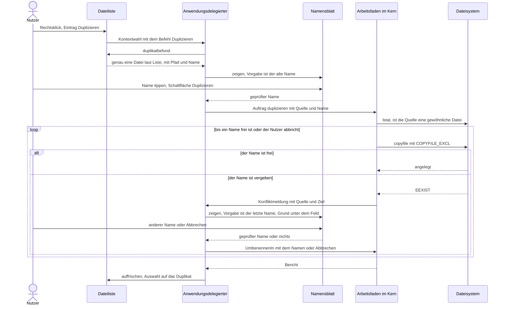
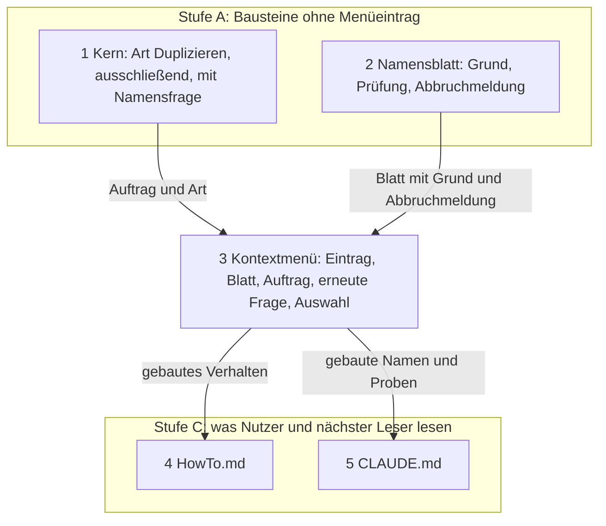

# Implementation Plan: Das Kontextmenü der Dateiliste trägt „Duplizieren…“ mit Namensblatt

**Date:** 2026-09-30
**Status:** Complete
**Spec:** none — planned from raw request. Shaping wurde übersprungen; die Directive steht im Datensatz `260930-1914-kontextmenue-traegt-duplicate-mit-namensdialog.md`, der `**Mode:** autonomous` trägt. Gebaute Grundlage: HEAD `17750c7`, Fassung 2.2.0.
**Decidability:** Drei Fragen tragen den Plan. **Erstens „ist der gewünschte Name frei?“**: aus der gelesenen Liste und aus einem `lstat` vor dem Anlegen ist sie nicht entscheidbar, denn ein fremdes Programm kann den Namen dazwischen vergeben, und ob zwei Schreibungen derselbe Eintrag sind, weiß allein der Datenträger. Der Mechanismus sagt deshalb nichts vorher: der Arbeitsfaden versucht das ausschließende Anlegen über `copyfile(3)` mit `COPYFILE_EXCL`, und das Dateisystem antwortet mit `EEXIST`. Gemessen am 260930 auf diesem Gerät (macOS 15.8, APFS) in beiden Übertragungsarten: `EEXIST` für den eigenen Namen, für eine andere Groß- und Kleinschreibung, für eine vorhandene Datei, für einen verwaisten symbolischen Verweis und für einen Ordner, Quelle und Ziel danach bytegleich. **Zweitens „ist die Eingabe überhaupt ein Name?“**: entscheidbar am Text durch `krk_core::operation::name_pruefen`, und deshalb schon im Blatt beantwortet. **Drittens „ist der betroffene Eintrag eine gewöhnliche Datei?“**: aus der Liste nur vorhersagbar, weil `Typ::Datei` auch Röhre, Socket und Gerätedatei trägt und die Liste einen Augenblick alt sein kann. Entschieden wird sie im Arbeitsfaden durch `lstat` unmittelbar vor der Übertragung; offen bleibt allein das Fenster zwischen diesem `lstat` und `copyfile(3)` gegen ein fremdes Programm, ein Wettlauf und kein gewöhnlicher Weg.

## Directive

Das Kontextmenü der Dateiliste bekommt einen Eintrag, der genau eine gewöhnliche Datei im selben Ordner dupliziert. Vor dem Duplizieren fragt ein kleines Blatt nach dem neuen Namen und zeigt den alten vorausgefüllt; es trägt zwei Schaltflächen. Ein schon vergebener Name überschreibt nichts, sondern öffnet das Blatt erneut mit einer Fehlermeldung. Den Wortlaut des Nutzers und seine zwei Antworten vom 260930 führt der Datensatz des Arbeitspakets unter `## Directive`; dieser Plan sagt, wie es gebaut wird, und schreibt jede Auslegung aus, die er dabei trifft.

## Current State

**Das Kontextmenü führt eigene Einträge über eine Aufzählung, und kein Eintrag wird ausgegraut.** `Kontextbefehl` (`crates/krk-ui/src/kommandos/kontextmenue.rs`) trägt `ALLE`, `titel`, `menuemarke` und `von_menuemarke`; die Datenquelle der Dateiliste baut das Menü in `eigene_kontexteintraege_anfuegen` (`crates/krk-ui/src/appkit/tabelle.rs`) über `ALLE`, und `Anwendungsdelegierter::kontextbefehl_ausfuehren` (`crates/krk-ui/src/appkit/anwendung.rs`) verzweigt vollständig und ohne Auffangzweig. Der Doc-Kommentar des Menübauers legt fest: „Kein Eintrag wird ausgegraut und keiner weggelassen“; was ein Befehl vorfindet, entscheidet sich bei der Ausführung und steht dann in der Statuszeile. Die Probe `jeder_kontextbefehl_erreicht_seine_wirkung` hält je Wert die Paarung von Befehl, Zweig und Wirkung, `jede_alle_liste_fuehrt_genau_die_varianten_ihrer_aufzaehlung` (`crates/krk-core/tests/baum.rs`) die Liste samt Reihenfolge.

**Worauf ein Eintrag wirkt, sagt `operationen::betroffene`, und der Rechtsklick richtet die Menge vorher aus.** Die Markierung hat den Vorrang, sonst gilt die ausgewählte Zeile. Ein Rechtsklick auf eine unmarkierte Zeile hebt die Markierung auf und rückt die Auswahl auf diese Zeile (`rechtsklick_zielzeile`, Nutzerentscheide vom 260812 und 260907); ein Rechtsklick auf eine markierte Zeile lässt die Markierung als betroffene Menge stehen. `Auswahl` trägt die Pfade und die Zahl der Ordner, den Typ der einzelnen Einträge trägt sie nicht; den kennt das `Ordnermodell` über `Eintrag::typ`, ohne Dateizugriff.

**Die Vorgangsmaschine kopiert eine Datei ausschließend, entscheidet einen Konflikt aber vor dem Kopieren und an anderer Stelle.** `sys::datei_kopieren` (`crates/krk-core/src/verzeichnis/sys.rs`) setzt `COPYFILE_EXCL` in beiden Übertragungsarten. `Art::Kopieren` behält den Namen der Quelle: `zielpfad` weist „Quelle und Ziel sind derselbe Eintrag“ ab, und `ziel_klaeren` fragt bei einem vorhandenen Ziel über `Steuerung::konflikt_loesen` nach, wobei „Überschreiben“ den vorhandenen Eintrag über `loeschen::baum_entfernen` endgültig entfernt. Nach der Antwort „Umbenennen in“ wird der neue Name nicht noch einmal geprüft (`260825-1130_*_ein-selbst-getippter-name-im-konfliktblatt-kann-einen-belegten-treffen-und-wird-ohne-rueckfrage-ueberschrieben.md`, offen). `kopieren::datei` verbucht jeden Fehler von `copyfile(3)` als übersprungenen Eintrag mit einem Grund als Text; ob der Grund „am Ziel steht schon ein Eintrag“ war, ist am Bericht danach nicht mehr typisiert abzulesen.

**Die Rückfrage des Arbeitsfadens hat einen fertigen Weg zum Hauptfaden.** `Meldung::Konflikt` trägt Quelle, Ziel und den Antwortkanal; der Arbeitsfaden wartet. `vorgang_zeichnen` holt die Frage ab, sobald kein Blatt steht, und `konflikt_fragen` zeigt das Konfliktblatt. `blatt_geschlossen` leert den Schlitz `offenes_blatt` und weckt den Hauptfaden über die Hauptschlange, weil `attachedSheet` im Abschlussblock eines Blattes noch antworten kann. Die Blätter, die auf eine Antwort folgen, also die zweite Konfliktfrage eines Vorgangs und die Abschlussliste, gehen über diesen Durchgang auf und nicht aus dem Abschlussblock des vorigen Blattes.

**Ein Blatt für einen Namen gibt es, und eines, das eine abgewiesene Eingabe nicht schließt, auch.** `blaetter::namenseingabe::frei_zeigen` zeigt Frage, bestätigende Schaltfläche, „Abbrechen“ und ein Feld mit ausgewählter Vorgabe; der Abbruch ruft den Rückruf gar nicht. Das PIN-Blatt (`blaetter/pin.rs`) hält seine bestätigende Schaltfläche abgeschaltet und schreibt den Grund in eine Zeile unter den Feldern, über `Blatt::bestaetigung_pruefen`, `Blatt::bestaetigende_schaltflaeche` und `Blatt::textaenderung_melden`. Das Feld eines Blattes ist nicht als eigene Textfläche angemeldet, damit `Esc` das Blatt schließt (Modulkopf von `blaetter/mod.rs`).

**Die Namensprüfung steht an einer Stelle.** `name_pruefen` (`crates/krk-core/src/operation/umbenennen.rs`) weist den leeren Namen, den Schrägstrich, das Nullbyte sowie `.` und `..` ab, und `Namensfehler::grund` liefert den Satz dazu. Das Anlegen, das Umbenennen und `brauchbarer_stamm` im Kontextmenü fragen dieselbe Funktion; ob ein Name vergeben ist, beantwortet an jeder dieser Stellen das Dateisystem und nicht die gelesene Liste.

**`HowTo.md` beschreibt das Kontextmenü bisher nicht, `README.md` beschreibt keine Bedienung.** Erhoben mit `grep -n -i 'kontext\|rechte maus\|rechtsklick' HowTo.md README.md`, das nichts ausgibt. `CLAUDE.md` führt das Kontextmenü im Absatz „Seit der Runde 17 führt ein zweiter Weg in die Anwendung hinein“ und die Aufzählung `Art` im Absatz über die gewachsenen Aufzählungen.

## Approach

**Duplizieren ist ein weiterer Wert der Vorgangs-Aufzählung, der denselben Übertragungsweg nimmt wie das Kopieren und die Konfliktfrage anders stellt.** Das Kopieren fragt vor dem Schreiben, ob am Ziel etwas steht, und bietet das Ersetzen an. Das Duplizieren versucht das ausschließende Anlegen und fragt erst, wenn das Dateisystem `EEXIST` meldet; die Frage lautet dann „unter welchem anderen Namen?“, und eine Antwort, die ersetzt, gibt es auf diesem Weg nicht. Die Frage reist über den vorhandenen Konfliktkanal, und die Oberfläche beantwortet sie mit demselben Namensblatt, das den Vorgang eröffnet hat, diesmal mit dem Grund in der Zeile unter dem Feld. „Das Blatt öffnet erneut“ ist damit kein zweiter Mechanismus, sondern der Weg, auf dem heute die zweite Konfliktfrage eines Kopiervorgangs ihr Blatt bekommt.

**Die Fehleingaben zerfallen nach dem, der sie entscheiden kann.** Eine Eingabe, die kein Name ist, erkennt der Text; das Blatt lässt sie gar nicht bestätigen und nennt den Grund unter dem Feld. Ein Name, der vergeben ist, erkennt allein das Dateisystem im Augenblick des Anlegens; er öffnet das Blatt erneut. Jede Eingabe fällt in genau einen der zwei Fälle. Jeder Versuch mit einem gültigen Namen hat genau einen von drei Ausgängen: angelegt, vergeben und deshalb erneut gefragt, oder gescheitert mit seinem Grund in der Abschlussliste. Abbrechen kann der Nutzer die Frage wie die laufende Übertragung.

**Auf dem Hauptfaden entsteht dabei kein Dateisystemaufruf.** Die Vorhersage „eine Datei laut Liste“ liest das Ordnermodell, die Namensprüfung liest den Text, und alles, was die Platte fragt, läuft im Arbeitsfaden. Die Zusage „der Hauptfaden führt keine Dateisystem-Arbeit aus“ aus dem Modulkopf von `operation/mod.rs` gilt für den neuen Weg unverändert.

## Entscheidungen des Plans

### Nutzerentscheide vom 260930

Beide stehen im Datensatz des Arbeitspakets unter `## Directive` und sind Vorgaben, keine Wahl dieses Plans.

- **N1. „nur gewöhnliche dateien“.** Der Eintrag wirkt allein, wenn genau ein Eintrag betroffen ist und dieser eine gewöhnliche Datei ist. Ein Ordner zählt nicht. Daraus abgeleitet (Entscheidung 3): eine symbolische Verknüpfung, eine Röhre, ein Socket, eine Gerätedatei und ein Bündel, das ein Ordner ist, sind keine gewöhnliche Datei; der Eintrag wirkt dort nicht.
- **N2. „ja, mach das auch auf deutsch“.** Menüeintrag, Schaltflächen und jede Meldung sind deutsch und tragen Umlaute. Den Wortlaut legt Entscheidung 8 fest.

### Entscheidungen des Planers

Jede ist aus dem Bestand begründet und in dem Schritt umkehrbar, der sie baut.

1. **Duplizieren ist ein weiterer `Kontextbefehl` und kein `Kommando`.** Der Nutzer verlangt eine Funktion im Menü der rechten Maustaste. Ein `Kommando` brächte eine Kennung in `Kommando::KENNUNGEN`, einen Wirkungsbereich, eine Zeile in `resources/default-keymap.toml` und einen Hauptmenüeintrag, und bei jedem Nutzer mit eigener `keymap.toml` käme die Funktion unbelegt an (`260814-0656_*_eine-neue-funktion-kommt-bei-jedem-nutzer-mit-eigener-keymap-unbelegt-an.md`). Nichts davon ist verlangt; die eigenen Einträge des Kontextmenüs sind genau die Bauform für einen Befehl ohne Taste. Er steht hinter „Unzip“ und vor den zwei Finder-Einträgen: die Finder-Einträge bleiben am Ende beieinander, wie der Doc-Kommentar von `Kontextbefehl::ALLE` es verlangt, und „Zip“ und „Unzip“ bleiben ein Paar.
2. **Der Eintrag steht immer da und ist immer bedienbar; er wirkt allein bei genau einer gewöhnlichen Datei.** „nur wenn eine Datei markiert ist“ liest dieser Plan als Bedingung der Wirkung und nicht der Sichtbarkeit, weil der Menübauer ausdrücklich keinen Eintrag ausgraut und die Directive der Runde 17 verlangt, dass ein Befehl, der nichts vorfindet, es in der Statuszeile meldet. „Markiert“ heißt dabei betroffen im Sinn von `operationen::betroffene`: die Markierung, sonst die ausgewählte Zeile, die der Rechtsklick vorher nachgerückt hat. Sind mehrere Einträge markiert und der Klick trifft einen davon, meldet der Eintrag es und dupliziert nichts. Eine zweite Auswahlregel entsteht nicht.
3. **„Gewöhnliche Datei“ wird an zwei Stellen des Weges gefragt, beide ohne AppKit prüfbar.** Die Vorhersage steht als reine Funktion `duplikatbezug` in `kommandos/kontextmenue.rs` und liest den Typ aus dem Ordnermodell: ein Ordner und eine Verknüpfung bekommen eine Meldung statt des Blattes. Die Entscheidung steht im Kern: `eintrag_duplizieren` fragt `fs::symlink_metadata` und überspringt alles, dessen Dateityp nicht `is_file()` ist, mit dem Grund „keine gewöhnliche Datei“. Die Liste kann Röhre, Socket und Gerätedatei nicht von einer Datei trennen; der Kern kann es.
4. **Eine neue `Art::Duplizieren { neuer_name }`, und kein zweiter Kopierweg.** `Art::Kopieren` trägt die Zusage „die Quellen behalten ihre Namen“, weist Quelle und Ziel im selben Ordner ab und führt über `ziel_klaeren` zu einem Zweig, der den vorhandenen Eintrag endgültig entfernt. Ein Feld „anderer Name“ an `Art::Kopieren` ließe genau diesen Zweig erreichbar. Die eigene Art ruft `ziel_klaeren` nie; übertragen wird über denselben Rumpf wie beim Kopieren, der dafür aus `kopieren::datei` als `datei_uebertragen` herausgezogen wird und den Fehler an den Rufer zurückgibt, statt ihn selbst zu verbuchen. Der Name und nicht ein voller Zielpfad steht in der Art, damit „im selben Ordner“ aus der Bauform folgt (`quelle.with_file_name(name)`).
5. **Nicht zu überschreiben hält das Dateisystem, und gefragt wird nach jedem Versuch neu.** Eine Vorabprüfung gegen die Liste oder per `lstat` gibt es nicht; sie wäre die zweite Wahrheit über denselben Ordner, die `umbenennen_ausfuehren` und `umbenennung_pruefen` ausdrücklich ablehnen. Meldet `copyfile(3)` `EEXIST`, fragt der Kern über den Konfliktkanal nach einem anderen Namen und versucht ihn wieder ausschließend. Der Defekt `260825-1130_*_ein-selbst-getippter-name-im-konfliktblatt-kann-einen-belegten-treffen-und-wird-ohne-rueckfrage-ueberschrieben.md` (ein selbst getippter Name wird nicht noch einmal geprüft) erreicht diesen Weg deshalb nicht. **Die Konfliktregel des Auftrags gilt für Duplizieren nicht**: sie regelt Ersetzen und Überspringen über mehrere Quellen, und Duplizieren hat eine Quelle und ersetzt nie. Jede Antwort, die kein Name ist, beendet den Vorgang, ohne etwas anzulegen.
6. **Was am Text entscheidbar ist, schließt das Blatt nicht; was nur das Dateisystem weiß, öffnet es erneut.** Als Fehleingabe gelten: der leere oder nur aus Leerzeichen bestehende Name, ein Name mit Schrägstrich, ein Name mit Nullbyte, `.` und `..` (alle vier über `name_pruefen`, keine zweite Regel daneben) und der vergebene Name. Der unveränderte alte Name ist der häufigste vergebene Name und bekommt keinen Sonderfall: das Dateisystem beantwortet ihn wie jeden anderen, auch in anderer Groß- und Kleinschreibung. Für die ersten vier bleibt die Schaltfläche „Duplizieren“ abgeschaltet, die Eingabetaste bestätigt nicht, und die Zeile unter dem Feld nennt den Grund, nach dem Muster des PIN-Blattes. Getrimmt wird wie in jeder Namenseingabe.
7. **Vorausgefüllt ist beim ersten Aufgehen der alte Name, beim erneuten der zuletzt eingegebene.** In beiden Fällen steht der ganze Name ausgewählt da, wie in jedem Eingabeblatt von KRK; beim erneuten Aufgehen steht unter dem Feld der Grund, und er weicht mit dem ersten Anschlag dem Urteil über den neuen Text.
8. **Wortlaut.** Menüeintrag: „Duplizieren…“, mit Auslassungszeichen, weil er vor der Wirkung fragt, wie „Ort wählen…“ und „Auf Werkseinstellungen zurücksetzen…“. Frage des Blattes: „Wie soll das Duplikat heißen?“, nach „Wie soll die neue Datei heißen?“. Schaltflächen: „Duplizieren“ und „Abbrechen“, die zweite aus `standardschaltflaechen` wie in jedem Blatt. Grund beim vergebenen Namen: „es gibt schon einen Eintrag namens „<name>““, derselbe Satz wie beim Anlegen und Umbenennen (`schon_vergeben`). Gründe der Textprüfung: die Sätze aus `Namensfehler::grund`, unverändert. Statuszeile: „nichts zu duplizieren: nichts markiert und nichts ausgewählt“ (über `nichts_betroffen`), „nichts zu duplizieren: es sind mehrere Einträge markiert, und dupliziert wird genau eine Datei“, „nichts zu duplizieren: „<name>“ ist ein Ordner, und dupliziert wird allein eine gewöhnliche Datei“, dasselbe mit „ist eine Verknüpfung“. Überschrift des Vorgangs: „Duplizieren“. Grund des Kerns in der Abschlussliste: „keine gewöhnliche Datei“.
9. **Nach dem Duplizieren steht die Auswahl auf dem Duplikat.** So halten es das Anlegen und das Stapel-Umbenennen. Die Gründe, aus denen Zip und Unzip die Auswahl stehen lassen (mehrere Ergebnisse, die Quellen werden als Nächstes weggeräumt), greifen hier nicht: es entsteht genau ein Eintrag, und der Nutzer hat ihn eben benannt. Gewählt wird über `eintrag_waehlen`, das den Namen vormerkt, und nur, wenn der Bericht das Duplikat als entstanden ausweist. Blendet ein Filtertext das Duplikat aus, bleibt es still, wie beim Anlegen.
10. **Jeder andere Fehlschlag geht in die Abschlussliste wie bei jedem Vorgang.** Fehlende Rechte, ein voller Datenträger, ein zu langer Name und eine inzwischen verschwundene Quelle öffnen das Blatt nicht erneut: ein anderer Name behöbe keinen davon. Der Nutzer liest den Grund im Blatt der übersprungenen Einträge.
11. **Ein Namensblatt und kein zweites.** `blaetter/namenseingabe.rs` bekommt den einen Bauer, der zusätzlich einen Grund, eine Prüfung und die Meldung des Abbruchs trägt; `zeigen` und `frei_zeigen` rufen ihn und behalten Aussehen und Verhalten. Der Abbruch muss gemeldet werden, weil beim erneuten Aufgehen ein Arbeitsfaden auf die Antwort wartet.
12. **Kein Blatt geht aus dem Abschlussblock eines anderen auf, und jeder Ausgang des Namensblatts ruft `blatt_geschlossen`.** Das erneute Aufgehen kommt über `vorgang_zeichnen` wie jede Konfliktfrage, also einen Durchgang der Hauptschlange nach dem Schließen. Der Aufruf von `blatt_geschlossen` stellt sicher, dass nach dem Abbau des Blattes ein Durchgang folgt, der eine inzwischen eingetroffene Frage oder den Bericht abholt.
13. **Ein Entscheidungsdatensatz ist nicht angelegt.** Jede Festlegung oben bindet allein diese Arbeit, folgt aus einem vorhandenen Muster oder aus den zwei Nutzerentscheiden und ist in einem Schritt umkehrbar. Keine Frage war aus dem Bestand unentscheidbar.

## Implementation Steps

**Wer ausführt.** Jeder Schritt gehört `code-implementer`. Die Arbeit ändert keine Datendatei: ein `Kontextbefehl` hat keine Zeile in `resources/default-keymap.toml`. Ein strategisches Dokument verlangt kein Schritt, also bleibt `analyst` ohne Aufgabe. `HowTo.md` und `CLAUDE.md` gehen wie in den Arbeiten davor an `code-implementer`.

**Für jeden Codeschritt gilt**, ohne dass es dort wiederholt wird:
- `make check` endet grün (Bau, Proben, `clippy -D warnings`, `fmt --check`, `cargo doc` mit `-D warnings`; `cargo` liegt unter `$HOME/.cargo/bin`, das `Makefile` setzt den Pfad). **`krk-ui` ist ein Binärziel, und toter Code macht `clippy -D warnings` rot**; deshalb baut jeder Schritt dort nur, was im selben Schritt einen Rufer bekommt. In `krk-core` darf ein `pub`-Name bis zu seinem Betriebsrufer allein von Proben gerufen sein (`260912-1149_*_was-geschieht-mit-einem-oeffentlichen-namen-ohne-rufer-im-betriebscode.md`).
- Nutzersichtbare Zeichenketten tragen Umlaute, Kommentare und Bezeichner die Umschrift. Keine Probe hält die Naht (`260907-0826_*_wie-wird-die-naht-zwischen-umlaut-und-umschrift-gehalten-jetzt-da-sie-eine-regel-ist.md`, offen); der Ausführende prüft jede neue Zeichenkette selbst.
- Ein Rückgabewert, dessen stilles Fallenlassen unbemerkt bliebe, trägt `#[must_use]`.
- Jede neue Variante einer vollständigen Fallunterscheidung wird dort eingeordnet, wo der Übersetzer anhält; ein Auffangzweig entsteht nicht.
- Eine Zahl über eine gewachsene Aufzählung wird in Prosa nicht hochgezählt, sondern fällt oder weicht ihrem Zählkommando.
- **Eine rote Probe, die der Schritt nicht namentlich als bewusst geändert nennt, ist ein Stopp** und kein Anlass, ihre Erwartung anzupassen. Die eine bekannte Ausnahme ist die Probe aus `260926-1012_*_die-probe-ein-abgegebenes-sitzungsrecht-ist-wieder-zu-haben-schlug-in-einem-von-drei-laeufen-von-make-check-fehl.md`: fällt genau sie, wird `make check` einmal wiederholt und der Lauf an jenem Datensatz vermerkt.
- Ein Modulkopf oder Doc-Kommentar, der durch den Schritt falsch wird, wird im selben Schritt berichtigt.
- Kein Ganzbaum-Git-Kommando, kein Commit durch den Ausführenden; das Eintragen übernimmt der Orchestrator.

Die Schritte 1 und 2 hängen nicht aneinander; sie landen trotzdem in der Nummernfolge, jeder auf dem Stand des vorigen. Der riskanteste Schritt ist 3: er baut als erster einen Weg, den der Nutzer auslösen kann, und setzt dabei die Gestalt des Blattes aus Schritt 2 ein, die kein Agent am laufenden Bündel prüfen kann. Nach keinem Commit steht ein Menüeintrag da, der nichts tut: der Eintrag und seine Wirkung kommen im selben Schritt.

### Stufe A: Bausteine ohne Menüeintrag

1. [DONE] **Kern: `Art::Duplizieren` überträgt ausschließend und fragt bei einem vergebenen Namen nach**
   - Executor: `code-implementer`
   - Files: `crates/krk-core/src/operation/auftrag.rs`, `crates/krk-core/src/operation/kopieren.rs`, `crates/krk-core/src/operation/duplizieren.rs` (neu), `crates/krk-core/src/operation/fortschritt.rs`, `crates/krk-core/src/operation/mod.rs`, `crates/krk-core/tests/operation.rs`, `crates/krk-core/tests/baum.rs`; in `krk-ui` allein die Stellen, an denen der Übersetzer wegen der neuen Variante anhält: `crates/krk-ui/src/kommandos/operationen.rs`, `crates/krk-ui/src/auffrischung.rs`, `crates/krk-ui/src/appkit/anwendung.rs`
   - Changes:
     - **`Art::Duplizieren { neuer_name: String }`** mit Doc-Kommentar nach Entscheidung 4 und 5. **`#[must_use] pub fn Auftrag::duplizieren(quelle: PathBuf, neuer_name: impl Into<String>) -> Self`** nimmt genau eine Quelle; der Doc-Kommentar sagt, dass die Konfliktregel für diese Art nicht gilt. `Auftrag::neuer_name(stelle)` antwortet für die neue Art an der Stelle 0 mit dem Namen; `Auftrag::entpackziel` und `Auftrag::zielordner` antworten `None`. Die Zahlwörter in den Doc-Kommentaren dieser drei Funktionen („Eine siebte Art“, „Vier Arten haben keinen“) fallen oder werden berichtigt.
     - **`kopieren::datei_uebertragen(quelle, ziel, art, steuerung) -> io::Result<Ablauf>`**, `pub(crate)`: der bisherige Rumpf von `kopieren::datei` bis auf die Verbuchung des Fehlers. Fortschritt, Abbruch und das Wegräumen der halben Zieldatei nach einem Abbruch bleiben darin. `kopieren::datei` ruft ihn und verbucht einen Fehler wie bisher über `steuerung.ueberspringen(pfad, grund(&fehler))`. Das Verhalten des Kopierens und des Verschiebens ändert sich nicht.
     - **`Steuerung::namen_erfragen(&mut self, quelle: &Path, ziel: &Path) -> Option<String>`**, `pub(crate)` und `#[must_use]`: stellt die Frage über denselben privaten Weg wie `konflikt_loesen` unter `Konfliktregel::Fragen`, ohne die Regel des Laufs zu lesen. `Konfliktantwort::UmbenennenIn(name)` wird `Some(name)`; jede andere Antwort, ein fehlender Sender und ein fallengelassener Antwortkanal werden `None`.
     - **`duplizieren::eintrag_duplizieren(quelle, neuer_name, art, steuerung) -> Ablauf`**, `pub(crate)`, in dieser Reihenfolge: (a) `fs::symlink_metadata(quelle.pfad)`; ein Fehler wird mit `grund` übersprungen, ein Dateityp ungleich `is_file()` mit „keine gewöhnliche Datei“. (b) Schleife über den Namen, beginnend mit `neuer_name`: `name_pruefen`, bei einem Fehler überspringen mit `Namensfehler::grund` und enden; Ziel ist `quelle.pfad.with_file_name(name)`; `datei_uebertragen`. `Ok(ablauf)` beendet mit diesem Ablauf. Ein Fehler der Art `AlreadyExists` ruft `namen_erfragen(quelle.pfad, &ziel)`: `Some(name)` setzt die Schleife mit dem neuen Namen fort, `None` endet mit `Ablauf::Abgebrochen`. Jeder andere Fehler wird mit `grund` übersprungen. Die Schleife läuft allein so oft, wie der Nutzer einen vergebenen Namen nennt; ohne Antwort endet sie.
     - **`operation/mod.rs`**: Moduleintrag `mod duplizieren;`, `ausfuehren` ordnet die Art in die Bahn `quelle_fuer_quelle`, `einen_abarbeiten` ruft `eintrag_duplizieren` mit `auftrag.neuer_name(stelle)` und meldet „es fehlt der neue Name“, wenn die Stelle keinen trägt, wie beim Stapel-Umbenennen. Das Schaubild und der erste Satz des Modulkopfes nennen das Duplizieren. Der Modulkopf von `duplizieren.rs` schreibt aus: warum die Art `ziel_klaeren` nicht ruft, dass `COPYFILE_EXCL` die eine Prüfung ist, die Messung vom 260930 aus der Kopfzeile `**Decidability:**` dieses Plans, das verbleibende Fenster zwischen `lstat` und `copyfile(3)`, und warum die Konfliktregel nicht gilt.
     - **`krk-ui`, allein zur Einordnung**: `ueberschrift` antwortet „Duplizieren“; `erzeugt_genau_ein_ziel` antwortet `true`; `ersetzungsweg` ordnet die Art zu den Arten, deren Konflikt das Konfliktblatt nie sieht, mit dem Wert `Endgueltig` und einem Satz im Doc-Kommentar, dass Duplizieren nie ersetzt; `schiebt_auffrischung_auf` antwortet `false`; `Vorgang::ordner` fügt keinen zweiten Ordner hinzu; der Abschlusszweig in `vorgang_beenden` ordnet die Art vorerst zu den Arten ohne eigenen Rumpf (Schritt 3 gibt ihr den Zweig). Die Tabellen in den Doc-Kommentaren von `erzeugt_genau_ein_ziel` und `ersetzungsweg` bekommen ihre Zeile, ihre Zahlwörter fallen.
   - Probes, **neu**, in `crates/krk-core/tests/operation.rs` an einem Prüfordner aus `gemeinsam`:
     - Ein freier Name legt das Duplikat bytegleich daneben, die Quelle bleibt bytegleich, der Bericht nennt einen Eintrag und nichts Übersprungenes.
     - Ein vergebener Name löst genau eine `Meldung::Konflikt` aus, deren Ziel der vergebene Pfad ist; nach der Antwort `UmbenennenIn` mit einem freien Namen steht das Duplikat unter diesem, und die Datei am vergebenen Namen ist bytegleich.
     - Der eigene Name der Quelle ist ein vergebener Name: eine Frage, und nach der Antwort `Abbrechen` endet der Lauf mit `Abschluss::Abgebrochen`, die Quelle ist bytegleich, und der Ordner trägt dieselben Einträge wie davor.
     - Ein zweiter vergebener Name als Antwort löst eine zweite Frage aus, und überschrieben ist danach keine der zwei vorhandenen Dateien.
     - Unter jedem Wert von `Konfliktregel` bleibt die Datei am vergebenen Namen bytegleich, und ohne eine Antwort mit einem Namen entsteht kein weiterer Eintrag; ausdrücklich auch unter `Ueberschreiben` und `AutomatischUmbenennen`.
     - Ein Lauf, dessen Frage niemand beantwortet, endet abgebrochen und legt nichts an.
     - Ein Ordner, eine Verknüpfung auf eine Datei, eine verwaiste Verknüpfung und eine benannte Röhre (über den Röhrenbauer des Prüfordners aus `gemeinsam`, der `/usr/bin/mkfifo` ruft) als Quelle werden je mit „keine gewöhnliche Datei“ übersprungen, und unter dem neuen Namen steht nichts; der Lauf über die Röhre kehrt zurück, statt an ihr zu warten.
     - Die Namen `""`, `"  "`, `"a/b"`, `"."` und `".."` werden je mit dem Satz aus `Namensfehler::grund` übersprungen; für `"a/b"` mit einem vorhandenen Unterordner `a` steht danach nichts in `a`.
     - Ein vergebener Name führt in beiden Werten von `Uebertragungsart` zur Frage und lässt das Vorhandene bytegleich, nach dem Vorbild von `ein_vorhandenes_ziel_weist_jede_uebertragungsart_ab`.
   - Probe, **neu**, in `crates/krk-core/tests/baum.rs`: `das_duplizieren_kennt_keinen_weg_der_einen_eintrag_entfernt` liest die Codezeilen von `krk-core/src/operation/duplizieren.rs` und findet darin keine der Nadeln `ziel_klaeren(`, `baum_entfernen(`, `in_den_papierkorb(`, `remove_file(`, `remove_dir` und `rename`. Ihr Doc-Kommentar sagt, was sie nicht sieht: den Rumpf von `datei_uebertragen`, der nach einem Abbruch allein die eigene halbe Zieldatei wegräumt.
   - Probes, **bewusst geändert**: `genau_ein_ziel_erzeugt_allein_das_packen` (`kommandos/operationen.rs`) bekommt die Zeile der neuen Art mit `true` und einen Namen, der wieder stimmt; `der_ersetzungsweg_folgt_der_stelle_die_wegraeumt` bekommt ihre Zeile; die Liste `die_gemaechlichen` (`auffrischung.rs`) bekommt die neue Art, sonst fällt `die_liste_der_gemaechlichen_deckt_jede_art_ausser_dem_stapel_umbenennen`. Trägt eine weitere Probe eine von Hand geschriebene Tafel über alle Werte von `Art`, bekommt sie ihre Zeile; die Erwartung keines vorhandenen Wertes ändert sich.
   - Acceptance: `make check` grün. Jede Probe des Kopierens, Verschiebens, Packens und Entpackens in `crates/krk-core/tests/operation.rs` besteht mit unveränderter Erwartung. `Auftrag::duplizieren` hat in diesem Schritt allein Probenrufer; im Bündel ändert sich nichts Sichtbares.
   - Dependencies: none

2. [DONE] **Namensblatt: ein Bauer mit Grund, Prüfung und Abbruchmeldung**
   - Executor: `code-implementer`
   - Files: `crates/krk-ui/src/appkit/blaetter/namenseingabe.rs`, `crates/krk-ui/src/appkit/blaetter/mod.rs` (allein Modulkopf und der Doc-Kommentar von `Blatt::bestaetigung_pruefen`)
   - Changes:
     - **Ein Bauer für jedes Namensblatt**, etwa `geprueft_zeigen(mtm, fenster, vorlage, fertig: impl Fn(Option<String>) + 'static) -> Blattgriff`. Die Vorlage trägt Frage, Beschriftung der bestätigenden Schaltfläche, Vorgabe, einen wahlfreien Grund und eine wahlfreie Prüfung `fn(&str) -> Option<&'static str>`, die zur getrimmten Eingabe den Grund nennt, aus dem sie nicht bestätigt werden darf. In der Datei bleibt genau ein Aufruf von `Blatt::neu`.
     - **Ohne Grund und ohne Prüfung** entsteht das Blatt wie heute: das Feld allein als Beigabe, die Vorgabe ausgewählt. `frei_zeigen` ruft den Bauer so und reicht `Some(name)` an seinen Rückruf weiter; beim Abbruch läuft sein Rückruf weiterhin nicht. `zeigen` bleibt auf `frei_zeigen` gebaut. Aussehen und Verhalten des Anlegens und der zwei Lesezeichenblätter ändern sich nicht.
     - **Mit Grund oder Prüfung** ist die Beigabe eine Ansicht mit dem Feld oben und einer einzeiligen Beschriftung darunter, gebaut nach dem Vorbild von `blaetter/pin.rs`. Die Zeile zeigt anfangs den Grund der Prüfung zur Vorgabe, sonst den übergebenen Grund, sonst nichts. Die bestätigende Schaltfläche ist genau dann eingeschaltet, wenn die Prüfung die getrimmte Eingabe annimmt; bei jeder Textänderung (`Blatt::textaenderung_melden`) werden Zeile und Schaltfläche neu gesetzt, wobei der übergebene Grund fällt. Die Eingabetaste im Feld bestätigt allein bei angenommener Eingabe (`Blatt::bestaetigung_pruefen`) und schreibt sonst den Grund in die Zeile.
     - **Der Abschluss ruft `fertig` auf jedem Weg genau einmal**: `Some(getrimmter Name)`, wenn bestätigt wurde und die Prüfung annimmt, sonst `None`. Eine Antwort von AppKit, die zu keiner Schaltfläche gehört, fällt damit auf `None`.
     - **Eine reine Funktion für den Stand des Blattes**, etwa `blattstand(eingabe, grund, pruefen) -> (bool, String)`: ob bestätigt werden darf und was die Zeile zeigt. Der Bauer ruft sie an beiden Stellen, an denen er Zeile und Schaltfläche setzt.
     - **Das Feld wird nicht als eigene Textfläche angemeldet**, wie das Feld jedes Blattes; der Modulkopf sagt es mit Verweis auf `blaetter/mod.rs`.
     - **Modulköpfe**: `namenseingabe.rs` beschreibt die zwei Gestalten und ihren Grund (Entscheidungen 6 und 11) und nennt im Abschnitt `# Ab welchem macOS die angesprochenen Klassen stehen` jeden neu hereingeholten Namen mit seiner Untergrenze, darunter `NSView`, `labelWithString:` (10.12), `setFrame:`, `addSubview:` und `setEnabled:`. In `blaetter/mod.rs` fällt die Aussage, das PIN-Blatt sei das einzige, dessen bestätigende Schaltfläche erst mit einer gültigen Eingabe wirkt, im Kopf und am Doc-Kommentar von `bestaetigung_pruefen`.
   - Probes, **neu**, im Prüfmodul von `namenseingabe.rs`: die Tafel von `blattstand` über die Fälle ohne Prüfung, mit annehmender Prüfung, mit abweisender Prüfung und mit übergebenem Grund vor und nach einer Textänderung, an einer Prüfung, die die Probe selbst mitbringt.
   - Probes, **bewusst geändert**: keine. `jeder_frameworkimport_steht_namentlich_im_untergrenzen_abschnitt` und `jede_appkit_datei_mit_frameworkimport_traegt_den_untergrenzen_abschnitt` bestehen mit unveränderter Erwartung, weil der Abschnitt mitwächst; `jede_bearbeitbare_textflaeche_schaltet_die_automatiken_ab` ist nicht berührt, denn es entsteht keine `NSTextView`.
   - Acceptance: `make check` grün; keine Probe ändert ihre Erwartung. Die Gestalt mit Prüfung hat in diesem Schritt keinen Rufer, der eine Prüfung übergibt; sie ist über den Parameter erreichbar und deshalb kein toter Code.
   - Dependencies: none

### Stufe B: der Befehl wirkt

3. [DONE] **Kontextmenü: der Eintrag, das Blatt, der Auftrag, die erneute Frage und die Auswahl**
   - Executor: `code-implementer`
   - Files: `crates/krk-ui/src/kommandos/kontextmenue.rs`, `crates/krk-ui/src/kommandos/operationen.rs`, `crates/krk-ui/src/appkit/tabelle.rs`, `crates/krk-ui/src/appkit/anwendung.rs`
   - Changes:
     - **`Kontextbefehl::Duplizieren`** zwischen `Entpacken` und `ImFinderOeffnen`, in der Aufzählung wie in `ALLE`; `titel` antwortet „Duplizieren…“, `menuemarke` folgt der Reihenfolge, die zwei Finder-Werte rücken um eins. Doc-Kommentare und Modulkopf von `kontextmenue.rs` werden nachgezogen: das Schaubild bekommt `duplikatbezug`, der Abschnitt „Wer hier hereinruft“ den neuen Frager, und jede Stelle, die die Feldbreite oder die Zahl der Werte in Worten nennt, verliert die Zahl.
     - **`Duplikatbefund` und `duplikatbezug(modell: &Ordnermodell, betroffen: &[PathBuf]) -> Duplikatbefund`** in `kontextmenue.rs`, `#[must_use]`, ohne Dateizugriff. Die Fälle sind überschneidungsfrei und vollständig: kein betroffener Eintrag (`Nichts`); mehrere (`Mehrere`); genau einer, und dann nach seinem `Typ` im Modell vollständig und ohne Auffangzweig `Datei { quelle, name }`, `Ordner { name }` oder `Verknuepfung { name }`. Steht der betroffene Eintrag nicht unter den sichtbaren Zeilen, gilt `Nichts`. Der Doc-Kommentar sagt nach Entscheidung 3, dass dies die Vorhersage ist und wo die Entscheidung fällt.
     - **`DateifensterQuelle::duplikatbefund()`** in `tabelle.rs`, nach der Bauform von `entpackbefund`: `betroffene` und `duplikatbezug` in einer Ausleihe des Tabmodells. Der Menübauer bleibt unverändert, denn er baut über `ALLE`; sein Doc-Kommentar und der Modulkopf von `tabelle.rs` verlieren jede Zahl über die eigenen Einträge.
     - **Texte in `operationen.rs`**, je als reine Funktion mit dem Wortlaut aus Entscheidung 8: die Frage des Blattes, die Beschriftung der Schaltfläche, der Grund beim vergebenen Namen (ruft `schon_vergeben`), die Meldungen zu `Nichts` (ruft `nichts_betroffen`), `Mehrere`, `Ordner` und `Verknuepfung`, und `namensgrund(eingabe: &str) -> Option<&'static str>` als Prüfung des Blattes über `name_pruefen` und `Namensfehler::grund`. Der Modulkopf von `operationen.rs` nennt die neuen Sätze in seiner Aufstellung.
     - **`Konfliktform` und `konfliktform(art: &Art) -> Konfliktform`** in `operationen.rs`, `#[must_use]`, vollständig über `Art` und ohne Auffangzweig: `Art::Duplizieren` ergibt `Namensnachfrage`, jede andere Art `Blatt(konfliktgestalt(art))`. `konflikt_fragen` fragt diese eine Funktion und verzweigt vollständig: der Zweig `Blatt` trägt den heutigen Rumpf, der Zweig `Namensnachfrage` ruft `duplikatname_nachfragen`.
     - **`Anwendungsdelegierter::duplikat_erfragen(seite)`** als Zweig von `Kontextbefehl::Duplizieren` in `kontextbefehl_ausfuehren`: `vorgang_laeuft_schon(seite)` beendet mit der vorhandenen Meldung; `duplikatbefund()` der Quelle dieser Seite; jeder Befund außer `Datei` schreibt seinen Satz über `antwort_zeigen`; bei `Datei` geht das Namensblatt aus Schritt 2 auf, mit dem alten Namen als Vorgabe, ohne Grund, mit `operationen::namensgrund` als Prüfung. Der Griff geht über `blatt_oeffnet` in den Schlitz. Der Rückruf ruft bei `Some(name)` `duplikatauftrag_stellen(seite, quelle, ordner, name)` und auf jedem Weg danach `blatt_geschlossen`. Seite, Quelle und angezeigter Ordner stehen seit dem Klick fest und reisen im Rückruf mit.
     - **`Anwendungsdelegierter::duplikatauftrag_stellen`**: fragt `vorgang_laeuft_schon(seite)` ein zweites Mal, weil zwischen Klick und Bestätigung ein Abwurf einen Vorgang begonnen haben kann, und ruft dann `auftrag_starten(seite, Auftrag::duplizieren(quelle, name), ordner, 1, 0)` mit `let _ =` und der Begründung der Nachbarzweige.
     - **`Anwendungsdelegierter::duplikatname_nachfragen(frage: Konfliktfrage)`**: liest den zuletzt versuchten Namen aus `frage.ziel.file_name()`, zeigt das Namensblatt mit diesem Namen als Vorgabe, dem Grund „es gibt schon einen Eintrag namens …“ und derselben Prüfung, und legt den Griff in den Schlitz. Der Rückruf trägt bei `Some(name)` den Namen in die `Art` des gehaltenen `Vorgang` ein und schickt `Konfliktentscheid::einmal(Konfliktantwort::UmbenennenIn(name))`; bei `None` schickt er `Konfliktentscheid::einmal(Konfliktantwort::Abbrechen)`; auf beiden Wegen ruft er danach `blatt_geschlossen`. Das Feld `Vorgang::art` bekommt in seinem Doc-Kommentar den Satz, dass es für Duplizieren den zuletzt beauftragten Namen trägt.
     - **Abschluss in `vorgang_beenden`**: der Zweig `Art::Duplizieren { neuer_name }` ruft `eintrag_waehlen(neuer_name)` auf der Seite des Vorgangs, wenn `operationen::duplikat_entstanden(bericht)` ja sagt (`Abschluss::Fertig` und genau ein übertragener Eintrag), und verwirft den Rückgabewert mit `let _ =` und der Begründung aus `anlegen_ausfuehren`. Der Kommentar des Nachbarzweigs über Zip und Unzip bleibt und bekommt den Gegengrund aus Entscheidung 9.
     - **Doc-Kommentare in `anwendung.rs`**: `auftrag_starten` nennt den neuen Rufer und verliert sein Zahlwort über die Rufer; `kontextbefehl_ausfuehren`, `konflikt_fragen` und `vorgang_laeuft_schon` beschreiben den neuen Zweig.
   - Probes, **neu**:
     - `kontextmenue.rs`: die Tafel von `duplikatbezug` über: nichts betroffen; eine ausgewählte Datei; ein ausgewählter Ordner; eine ausgewählte Verknüpfung; zwei markierte Dateien; genau eine markierte Datei bei anderer Auswahl (die Markierung gewinnt).
     - `operationen.rs`: der Wortlaut jedes neuen Satzes samt Umlauten; `namensgrund` über `""`, `"  "`, `"a/b"`, `"."`, `".."` und einen gewöhnlichen Namen, je gegen `Namensfehler::grund`; die Tafel von `konfliktform` über jeden Wert von `Art`, von Hand geschrieben; `duplikat_entstanden` über fertig mit einem Eintrag, fertig ohne Eintrag und abgebrochen.
     - `anwendung.rs`, Quelltextproben nach dem Muster von `kontextproben`:
       - `der_duplikatweg_reisst_nirgends_ab`: der Rumpf von `duplikat_erfragen` ruft den Blattbauer und `duplikatauftrag_stellen`; der Rumpf von `duplikatauftrag_stellen` enthält `Auftrag::duplizieren(`; in `konflikt_fragen` stehen `Konfliktform::Namensnachfrage` und `duplikatname_nachfragen` auf einer Zeile.
       - `jede_antwort_auf_die_namensnachfrage_erreicht_den_arbeitsfaden`: der Rumpf von `duplikatname_nachfragen` enthält `Konfliktantwort::UmbenennenIn`, `Konfliktantwort::Abbrechen` und `blatt_geschlossen` und enthält `konflikt::zeigen` nicht.
       - `der_duplikatweg_stellt_auf_dem_hauptfaden_keinen_systemaufruf`: die Rümpfe von `duplikat_erfragen`, `duplikatauftrag_stellen` und `duplikatname_nachfragen` enthalten in Codezeilen weder `fs::` noch `metadata(` noch `exists(`. Ihr Doc-Kommentar nennt die Grenze: sie liest die Rümpfe und nicht, was tiefer gerufen wird.
   - Probes, **bewusst geändert**: in `kontextmenue.rs` die `TAFEL` (neue Zeile „Duplizieren…“, die Marken der Finder-Werte) und `die_null_und_alles_daneben_benennen_keinen_befehl` (die erste freie Marke rückt um eins); in `anwendung.rs` die Tafel `ZWEIGE` von `jeder_kontextbefehl_erreicht_seine_wirkung` (neue Zeile mit dem Zweig `duplikat_erfragen` und dem Aufruf des Blattbauers als Nadel). `jede_alle_liste_fuehrt_genau_die_varianten_ihrer_aufzaehlung` besteht mit unveränderter Erwartung.
   - Acceptance: `make check` grün; keine Probe außer den genannten ändert ihre Erwartung. Im Kontextmenü steht „Duplizieren…“ zwischen „Unzip“ und „Im Finder öffnen“, und sein Klick erreicht nach den Quelltextproben das Blatt, den Auftrag und bei einem vergebenen Namen die erneute Frage. Was am laufenden Bündel zu prüfen bleibt, führt `## Testing Strategy`.
   - Dependencies: Schritte 1 und 2

### Stufe C: was Nutzer und nächster Leser lesen

4. [DONE] **`HowTo.md`: eine Datei duplizieren**
   - Executor: `code-implementer`
   - Files: `HowTo.md`
   - Changes: ein Abschnitt `## Eine Datei duplizieren` hinter `## Der Dateilistenfilter`, mit dessen Trennlinie. Er sagt: wo der Eintrag steht (Rechtsklick in der Dateiliste, „Duplizieren…“), dass er keine Taste und keinen Hauptmenüeintrag hat, worauf er wirkt (genau eine gewöhnliche Datei; bei einem Ordner, einer Verknüpfung, mehreren markierten Einträgen oder gar keinem meldet die Statuszeile den Grund), was das Blatt zeigt (alter Name vorausgefüllt und ausgewählt, „Duplizieren“ und „Abbrechen“, `Esc` schließt), was es nicht bestätigen lässt (leerer Name, Schrägstrich, `.` und `..`, mit dem Grund unter dem Feld), was bei einem vergebenen Namen geschieht (nichts wird überschrieben, das Blatt geht mit dem Grund erneut auf, auch beim unveränderten alten Namen), wo das Duplikat entsteht (im selben Ordner) und dass danach die Auswahl auf ihm steht. Ein Satz nennt, dass das Duplizieren als Vorgang läuft: Fortschritt in der Statuszeile, `Esc` bricht ab. `README.md` bleibt unverändert, weil sie keine Bedienung beschreibt.
   - Acceptance: `make check` grün (der Schritt ändert keinen Code). Jeder Satz des Abschnitts ist am Stand von Schritt 3 gelesen: die zitierten Beschriftungen stimmen Zeichen für Zeichen mit `Kontextbefehl::titel` und den Textfunktionen aus `operationen.rs` überein. Die Betriebsregel „die alte … löschen“ ist nicht berührt.
   - Dependencies: Schritt 3

5. [DONE] **`CLAUDE.md`: der dritte Wert aus dem Kontextmenü und was ihn hält**
   - Executor: `code-implementer`
   - Files: `CLAUDE.md`
   - Changes:
     - Im Absatz „Seit der Runde 17 führt ein zweiter Weg in die Anwendung hinein“ bekommt der Schlusssatz über `Art::Zippen` und `Art::Entpacken` seine Fortsetzung: `Art::Duplizieren` ist ein weiterer Wert derselben Aufzählung und der erste Kontextbefehl, der vor seinem Auftrag ein Blatt öffnet; er erbt Fortschritt und Abbruch und **nicht** das Konfliktblatt. Seine Konfliktfrage beantwortet `konfliktform` mit dem Namensblatt; `ziel_klaeren` erreicht er nie; überschrieben wird nichts, weil `copyfile(3)` mit `COPYFILE_EXCL` die eine Prüfung ist und nach jeder Antwort neu versucht wird. Genannt werden die Proben, die das halten: `das_duplizieren_kennt_keinen_weg_der_einen_eintrag_entfernt`, `jede_antwort_auf_die_namensnachfrage_erreicht_den_arbeitsfaden` und `der_duplikatweg_stellt_auf_dem_hauptfaden_keinen_systemaufruf`, je mit ihrer Datei, und was sie nicht sehen: einen neuen Weg, der die Namensnachfrage öffnet und eine Antwort schuldig bleibt, hält der Arbeitsfaden an.
     - Im Absatz über die gewachsenen Aufzählungen bekommt der Satz über `Art` den Hinweis, dass auch diese Arbeit sie erweitert hat; eine Zahl entsteht nicht.
     - Im Absatz über `ohne_warten_oeffnen` ändert sich nichts: der neue Weg öffnet keine Datei selbst. Der Ausführende bestätigt das mit dem Zähllauf, den jener Absatz nennt, und ändert den Absatz nur, wenn der Lauf einen neuen Rufer zeigt.
   - Acceptance: `make check` grün. Jeder neu genannte Name steht im Baum (`grep -rn` je Name über `crates/`), und kein neuer Satz trägt eine Zahl über eine gewachsene Aufzählung. Die Zeile `**Language:** de` ist unverändert.
   - Dependencies: Schritt 3

## Where this work stops

- Die Arbeit ist fertig, wenn die Schritte 1 bis 5 `[DONE]` tragen und `make check` auf dem Commit des letzten Schritts grün endet.
- Der Eintrag wirkt allein auf genau eine gewöhnliche Datei (N1): gehalten am Baum von der Tafel zu `duplikatbezug` (Schritt 3) und von den Kernproben zu Ordner, Verknüpfung und Röhre (Schritt 1).
- Menüeintrag, Schaltflächen und Meldungen sind deutsch und tragen Umlaute (N2): gehalten von den Wortlautproben aus Schritt 3.
- Kein Weg des Duplizierens ersetzt oder entfernt einen vorhandenen Eintrag: gehalten von den Kernproben unter jeder Konfliktregel und von `das_duplizieren_kennt_keinen_weg_der_einen_eintrag_entfernt` (Schritt 1).
- Nach keinem Commit dieser Arbeit steht ein Menüeintrag da, der nichts tut: der Eintrag und seine Wirkung kommen in Schritt 3 zusammen.
- Ein Abnahmelauf gegen die zehn Zeitzusagen aus C8 ist nicht geschuldet, solange drei Bedingungen halten. Erstens fügt kein Schritt dem Hauptfaden einen Dateisystemaufruf hinzu; das hält `der_duplikatweg_stellt_auf_dem_hauptfaden_keinen_systemaufruf`. Zweitens ändert kein Schritt den Start, das Lesen und Sortieren eines Ordners, den Tab- und Fensterwechsel oder die Vorschau, also die Wege von L2 bis L7 und L10; der Menübauer bekommt einen Eintrag mehr je Rechtsklick, und keine Zusage misst den Rechtsklick. Drittens bleibt der Weg, den L8 und L9 am Kopieren messen, im Verhalten unverändert: `kopieren::datei` ruft nach Schritt 1 dieselben Systemaufrufe in derselben Folge, und jede vorhandene Probe des Kopierens besteht mit unveränderter Erwartung. Fügt ein Schritt dem Hauptfaden einen Dateisystemaufruf hinzu oder ändert er eine Probe des Kopierens in ihrer Erwartung, hält dieser Schritt an, und die Frage nach dem Abnahmelauf geht an den Nutzer. L4 und L7 bleiben unabhängig davon auf der Liste der späteren Messrunde, auf der sie schon stehen.
- Der Abnahmelauf am Bündel ist Nutzerarbeit und nicht Teil dieser Arbeit, weil er KRK im Vordergrund verlangt; kein Agent fährt ihn. Seine Punkte führt `## Testing Strategy`.
- Diese Arbeit liefert nicht aus: ein `./release.sh` braucht einen eigenen, ausdrücklichen Auftrag des Nutzers.
- Das Arbeitspaket bleibt `claimed`, bis der Nutzer es schließt; dieser Plan setzt `**Status:** done` nicht.

## Data Structures

- `krk_core::operation::Art::Duplizieren { neuer_name: String }` und der Erzeuger `Auftrag::duplizieren`.
- `krk_ui::kommandos::kontextmenue::Kontextbefehl::Duplizieren` und `Duplikatbefund { Datei { quelle: PathBuf, name: String }, Ordner { name: String }, Verknuepfung { name: String }, Nichts, Mehrere }`.
- `krk_ui::kommandos::operationen::Konfliktform { Blatt(Konfliktgestalt), Namensnachfrage }`.
- In `blaetter/namenseingabe.rs` die Vorlage des Namensblatts mit Frage, Beschriftung, Vorgabe, wahlfreiem Grund und wahlfreier Prüfung.

## API Changes

Keine Schnittstelle nach außen, keine neue Ablagedatei, keine Zeile in `resources/`. Neu in `krk-core`: `Auftrag::duplizieren`; kistenintern `kopieren::datei_uebertragen`, `duplizieren::eintrag_duplizieren`, `Steuerung::namen_erfragen`. `Auftrag::neuer_name` antwortet zusätzlich für die neue Art. Innerhalb von `krk-ui` neu: `kontextmenue::duplikatbezug`, `operationen::{konfliktform, namensgrund, duplikat_entstanden}` samt den Textfunktionen, `DateifensterQuelle::duplikatbefund`, der Bauer des Namensblatts, `Anwendungsdelegierter::{duplikat_erfragen, duplikatauftrag_stellen, duplikatname_nachfragen}`. `namenseingabe::zeigen` und `frei_zeigen` behalten Signatur und Verhalten. Die Menümarken der zwei Finder-Einträge rücken um eins; eine Marke entsteht bei jedem Menübau neu und überdauert keinen Rechtsklick.

## Testing Strategy

Am Baum halten Proben, was ohne Fenster entscheidbar ist. Der Kern wird an einem Prüfordner mit einem antwortenden Faden geprüft, nach dem Vorbild von `fragen_beantworten` in `crates/krk-core/tests/operation.rs`: der freie Name, der vergebene, der eigene, der zweimal vergebene, jede Konfliktregel, die unbeantwortete Frage, jede Quelle, die keine gewöhnliche Datei ist, jeder Text, der kein Name ist, und beide Übertragungsarten (Schritt 1). Die Vorhersage aus der Liste, die Texte, die Prüfung des Blattes und die Zuordnung von Art zu Konfliktform sind reine Funktionen mit Tafeln (Schritte 2 und 3). Die Kette vom Klick bis zur Antwort an den Arbeitsfaden halten Quelltextproben nach dem Muster, das `anwendung.rs` für das Kontextmenü schon führt (Schritt 3).

Der Abnahmelauf am Bündel prüft, was AppKit und die Platte zusammen tun. Seine Punkte: (1) Rechtsklick auf eine unmarkierte Datei, „Duplizieren…“: das Blatt zeigt den alten Namen ausgewählt, die Schaltflächen heißen „Duplizieren“ und „Abbrechen“. (2) Ein neuer Name und die Eingabetaste legen das Duplikat im selben Ordner an, und die Auswahl steht auf ihm. (3) Die Eingabetaste auf dem unveränderten Namen lässt das Blatt zugehen und mit dem Grund „es gibt schon einen Eintrag namens …“ erneut aufgehen; die Datei ist danach unverändert. (4) Im erneut aufgegangenen Blatt ein zweiter vergebener Name: das Blatt geht ein weiteres Mal auf; danach ein freier Name: das Duplikat entsteht. (5) Ein leerer Name, ein Name mit Schrägstrich, `.` und `..`: die Schaltfläche ist abgeschaltet, die Eingabetaste tut nichts, der Grund steht unter dem Feld. (6) `Esc` und „Abbrechen“ schließen das Blatt im ersten wie im erneuten Aufgehen, und angelegt ist nichts. (7) Rechtsklick auf einen Ordner, auf eine Verknüpfung, auf eine von mehreren markierten Dateien und unter die letzte Zeile bei leerer Auswahl: je die Meldung in der Statuszeile, kein Blatt. (8) Eine große Datei auf einem Datenträger ohne Klonen: Fortschritt in der Statuszeile, `Esc` bricht ab und hinterlässt keine halbe Datei. (9) Das Anlegen über `f7` und das Umbenennen eines Lesezeichens sehen aus und wirken wie vor dieser Arbeit.

## Risks & Mitigations

| Risk | Mitigation |
|------|------------|
| Das Verhalten des Blattes am laufenden Bündel (Anordnung der Zeile unter dem Feld, Zustand der Schaltfläche, erneutes Aufgehen nach dem Schließen) kann kein Agent prüfen. | Der Bau folgt zwei am Bündel erprobten Mustern: dem PIN-Blatt für die nicht schließende Prüfung und der Folge zweier Konfliktfragen eines Kopiervorgangs für das erneute Aufgehen. Die Punkte 1 bis 6 des Abnahmelaufs decken jede dieser Stellen. |
| Während das erneut aufgegangene Blatt steht, wartet der Arbeitsfaden auf die Antwort. Bleibt sie aus, hängt der Vorgang. | Der Bauer aus Schritt 2 ruft `fertig` auf jedem Weg genau einmal, der Rückruf antwortet auf beiden Zweigen, und ein fallengelassener Antwortkanal gilt im Kern als Abbruch. `jede_antwort_auf_die_namensnachfrage_erreicht_den_arbeitsfaden` hält die zwei Antworten am Quelltext. Dieselbe Lage besteht heute beim Konfliktblatt. |
| Eine Frage oder ein Bericht trifft ein, während `attachedSheet` nach dem Schließen noch antwortet, und bleibt liegen. | Jeder Ausgang des Namensblatts ruft `blatt_geschlossen`, das den Hauptfaden einen Durchgang später weckt (Entscheidung 12). |
| Der Umbau von `kopieren::datei` ändert still das Kopieren oder Verschieben. | Die vorhandenen Proben in `crates/krk-core/tests/operation.rs` bestehen ohne geänderte Erwartung; eine rote dort ist ein Stopp. |
| Zwischen `lstat` und `copyfile(3)` ersetzt ein fremdes Programm die Quelle durch eine Röhre, und `copyfile(3)` wartet. | Betroffen ist der Arbeitsfaden und nie der Hauptfaden; der Fall ist ein Wettlauf und kein gewöhnlicher Weg, wie `CLAUDE.md` es für `File::open` im Kopieren festhält. Der Modulkopf von `duplizieren.rs` nennt das Fenster. |
| Auf einem Datenträger, der Groß- und Kleinschreibung unterscheidet, ist ein Name frei, der auf APFS in der Vorgabe vergeben wäre. | Gewollt: der Datenträger entscheidet, und genau deshalb gibt es keine Vorabprüfung am Text (Entscheidung 5). |
| inference: Der Feldeditor eines Blattfeldes kann die Textersetzung des Systems anwenden und den getippten Namen ändern; gemessen ist es an keinem Bündel. | Die Lage besteht für das Anlegen über dasselbe Blatt schon heute, und die Probe der Textautomatiken sagt in ihrem Doc-Kommentar, dass sie ein `NSTextField` nicht sieht. Angelegt wird der Name, der im Feld sichtbar steht. Zeigt der Abnahmelauf eine stille Ersetzung, wird es ein eigener Datensatz für alle Namensblätter. |
| Die Vorgabe steht ganz ausgewählt da, also ersetzt das erste getippte Zeichen auch die Endung. | So verhält sich jedes Eingabeblatt von KRK (Entscheidung 7). Eine Auswahl allein des Stamms steht unter `## Open Questions`. |
| Ein Duplikat von `secrets.txt` ist eine Datei mit dem Chiffrat unter einem Namen, den KRK nicht als Geheimnis erkennt. | Es ist dieselbe Bytekopie, die F5 heute anlegt: Klartext verlässt den Editor auf diesem Weg nicht, und das Chiffrat öffnet sich ohne PIN nicht als Klartext. |
| `make check` prüft den ganzen Arbeitsbereich und bricht an fremden, halb geschriebenen Dateien ab, wenn zwei Agenten zugleich schreiben (`260820-0602_*_make-check-prueft-den-ganzen-arbeitsbereich-und-bricht-bei-parallelen-agenten-an-fremden-dateien-ab.md`). | Die Schritte laufen nacheinander, auch 1 und 2, die nicht aneinander hängen. |

## Open Questions

- [ ] **Soll der Eintrag ausgegraut sein, wenn er nicht wirken kann?** Entscheidung 2 lässt ihn nach der Regel des Bestands immer bedienbar und meldet den Grund. Liest der Nutzer „nur wenn eine Datei markiert ist“ als Bedingung der Sichtbarkeit, ändert sich der Menübauer in `tabelle.rs` für diesen einen Wert und bekäme damit die erste Zulässigkeitsfrage des Kontextmenüs; das Blatt, der Kern und die Proben bleiben. Die Frage hält keinen Schritt auf.
- [ ] **Soll beim Aufgehen allein der Stamm des Namens ausgewählt sein, wie im Finder?** Der Plan bleibt beim Verhalten jedes Eingabeblatts. Die Änderung träfe `namenseingabe.rs` und bräuchte den Feldeditor des stehenden Blattes; sie hält keinen Schritt auf.
- [ ] Keine weitere Frage ist offen. Die zwei Nutzerentscheide vom 260930 stehen im Datensatz des Arbeitspakets, und jede Entscheidung des Planers steht oben mit ihrem Grund.
