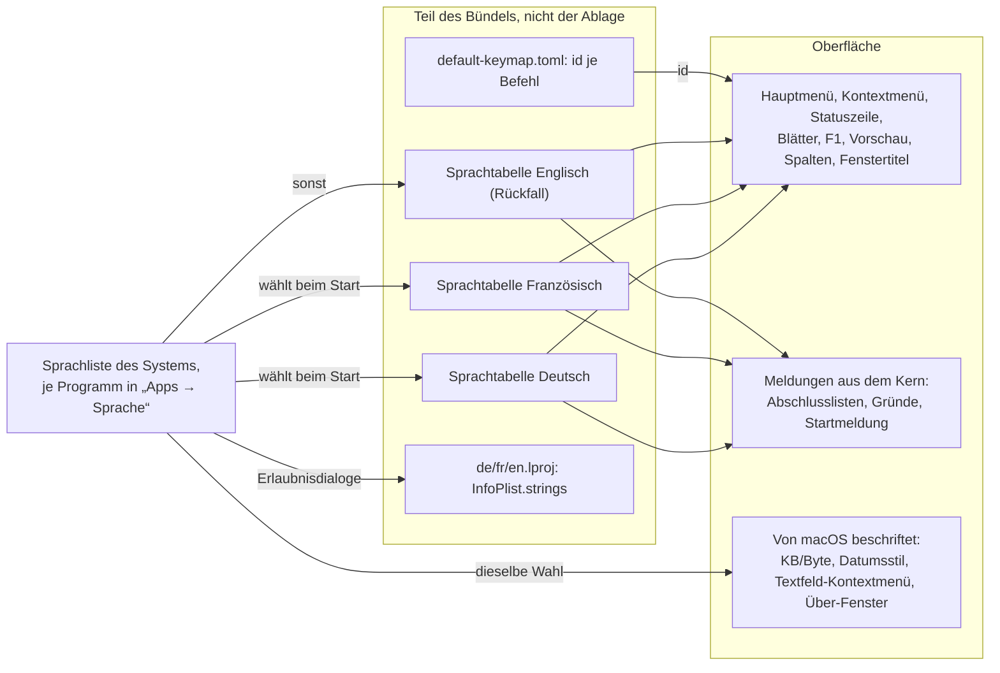

# Spec: Die Oberfläche folgt der Systemsprache: Deutsch, Französisch, Englisch als Rückfall

**Date:** 2026-10-01
**Status:** Draft
**Source:** „Plane, spezifiziere, implementiere im auto-Modus ein neues Arbeitspaket zu i8n. Alles was jetzt im UI nur auf Detusch erscheint, sollte lokalisiert werden können: außer Deutsch biete msl noch Französisch an. Auswhal im Krk Menu.“ Auf die drei Klärungsfragen des Entwurfs vom 261001-0735: „Ja, ne, wir machen das noch andders: folge der Systemsprache, Fallback auf English. Führe English also auch ein.“ Auf die Nachfrage zum Menü und zum Feld `name`: „a1 b1“. (Arbeitspaket `260930-2319-oberflaeche-lokalisierbar-deutsch-und-franzoesisch.md`, `## Directive`; der Slug des Arbeitspakets bleibt.)
**Cross-references:** `260826-1225_*_welche-schreibweise-gilt-fuer-nutzersichtbare-deutsche-meldungen-umlaut-oder-umschrift.md` (die Umlautregel, auf der die Naht dieses Specs aufsetzt), `260907-0826_*_wie-wird-die-naht-zwischen-umlaut-und-umschrift-gehalten-jetzt-da-sie-eine-regel-ist.md` (offen; C5 liefert einen Kandidaten für die Antwort), `260907-0826_*_gilt-die-umlautregel-auch-fuer-die-terminalausgabe-von-xtask-krk-bench-und-messmodus.md` (offen; bleibt unberührt, siehe `## Out of Scope`), `260807-0745_*_die-buendelbeschreibung-fuehrt-keine-entwicklungsregion.md` und `260807-0754_*_der-kommentar-an-cfbundlelocalizations-nennt-eine-falsche-auswahlregel.md` (die Messungen, auf denen die Sprachwahl durch macOS ruht), `260910-0818_*_schuldet-diese-runde-einen-abnahmelauf-gegen-die-zusage-l4.md` (L4 steht schon daneben)

## Directive

Jede Zeichenkette, die ein Mensch durch KRKs Fenster, Blätter, Menüs und die Statuszeile liest, kommt nach dieser Arbeit aus einer Sprachtabelle und steht nicht mehr fest im Code; Deutsch, Französisch und Englisch liegen als Tabellen vor. Welche gilt, entscheidet macOS aus der Sprachliste des Systems und der Einstellung je Programm: Deutsch und Französisch, wo sie dort vorn stehen, Englisch bei jeder anderen Sprache. KRK selbst bietet keine Sprachwahl an, und eine neue Zeichenkette kann künftig nur noch als Eintrag aller drei Tabellen entstehen.

## Nutzerentscheide vom 261001

Die drei Fragen des Entwurfs sind beantwortet, und die Antwort auf die erste hat die zweite aufgehoben:

1. **Vorgabesprache und Menü:** keine Wahl in KRK. Die Sprache folgt allein dem System, mit Englisch als Rückfall für jede Systemsprache außer Deutsch und Französisch; Englisch wird als dritte Sprache angelegt. Das Menü „KRK“ bekommt keinen Eintrag, `settings.toml` keinen Schlüssel, die Belegung keine Funktion.
2. **Wirkung und Ort der Wahl:** entfallen. Wer Französisch oder Englisch auf einem deutschen Mac will, stellt es in den Systemeinstellungen unter „Apps → Sprache“ für KRK ein; der Wechsel wirkt beim nächsten Start, und macOS beschriftet dann auch Einheiten, Datumsstil und seine eigenen Dialoge passend. Zurücksetzen auf Werkseinstellungen und Startmeldung der Neuerungen sind nicht berührt.
3. **Das Feld `name` in der eigenen `keymap.toml`:** der Befehlsname kommt immer aus der Sprachtabelle. Die Umbenennung über die eigene Datei fällt, alte Dateien laden weiter, `HowTo.md` und die Probe dazu ändern sich.

Die englischen und französischen Texte liefert ein Agent, der Nutzer prüft sie.

## Bestand, auf dem der Spec aufsetzt

Die Erhebung am Stand `e984b3f` entscheidet die meisten Fragen, die eine Lokalisierung sonst dem Nutzer stellte. Wir halten sie hier fest, weil die Planung sie braucht und weil die Zahlen mit der nächsten Runde veralten; verbindlich sind die genannten Befehle, nicht die Zahlen.

**Umfang.** Ein Zähler über Stringliterale mit mindestens zwei Wörtern außerhalb der Prüfmodule und außerhalb der Diagnostik (`assert`, `panic`, `expect`, `must_use`, `eprintln`) findet in `crates/krk-core/src` 224 und in `crates/krk-ui/src` 396 Prosaliterale (die erste Näherung ist `grep -rn --include='*.rs' '"[^"]*[äöüÄÖÜß][^"]*"' crates/krk-core/src crates/krk-ui/src`, 134 und 394 Zeilen samt Prüfmodulen). Dazu kommen die einwortigen Beschriftungen, die der Zähler nicht sieht: die Namen der 103 Werte von `Kommando`, die 16 von `Wirkungsbereich`, die 6 von `Bereich` (je kurz und lang), die 5 von `Spalte`, die 11 von `Funktionsbereich` (die Obermenüs), die 6 von `Kontextbefehl`. `krk-bench` und `xtask` tragen 172 und 187 Prosaliterale, alle in Umschrift und alle für das Terminal; sie liegen außerhalb (`## Out of Scope`).

**Wo die Texte wohnen, in vier Bauarten.**

1. *Datenfeld in einer TOML-Datei.* Die Namen der Befehle sind kein Rust-Quelltext: jeder `[[funktion]]`-Block in `resources/default-keymap.toml` trägt `id` (ASCII) und `name` (die deutsche Beschriftung), 110 Einträge, über `include_str!` eingebunden (`crates/krk-core/src/tasten/belegung.rs:237`). Hauptmenü (`menuemodell.rs:335`), Belegungsansicht F1 (`belegungsmodell.rs:666`), die Suche darin (`:721`, sucht im angezeigten Namen) und die Markdown-Ausgabe (`belegungsausgabe.rs:224`) lesen alle dieses eine Feld. Die eigene `keymap.toml` des Nutzers trägt dasselbe Feld, KRK schreibt es beim Verlassen der F1-Ansicht zurück, und beim Lesen gewinnt bis heute der Name aus der Nutzerdatei (`belegung.rs:2240`, Modulkopf `:48-56`; Probe `die_nutzerdatei_setzt_weder_zusteller_noch_name_noch_vorbehalt` in `crates/krk-core/tests/belegung.rs`; `HowTo.md:935` „Der Name kommt aus der eigenen Datei“). Das ändert C3.
2. *`const fn` mit vollständigem `match` auf `&'static str`.* `Wirkungsbereich::beschriftung`, `Bereich::beschriftung` und `langname`, `Spalte::beschriftung`, `Funktionsbereich::name`, `Kontextbefehl::titel`, `Ortsmangel::grund`, `Namensfehler::grund`, `Kollision::grund`, `Namenshinweis::grund`, `Grund::beschreibung`. Diese Stellen sind ohne Auffangzweig gebaut, damit ein neuer Wert den Bau anhält (`CLAUDE.md`, „Etliche Fallunterscheidungen sind vollständig“); eine Lokalisierung darf diese Eigenschaft nicht verlieren.
3. *Sätze, die der Kern fertig baut.* `Uebersprungen { grund: String }` (63 Rufer von `Steuerung::ueberspringen` unter `krk-core/src/operation/`), `Abweisung::meldung`, `Hindernis::meldung`, `Bereitstellung::meldungen`, `Werkshindernis::meldung`, `Zurueckgesetzt::meldung`, `neuerungen::startzeile` und `blatttext`, `heimordner/ort.rs` (sieben Satzbauer), `leseprofil/datei.rs` (`profilmeldung`, `zeilenmeldung`), `Wert::als_text`, `git/texte.rs`, dazu die `Display`-Implementierungen von `Ersetzung`, `Regelfehler`, `Schreibfehler`, `Konflikt`, `Belegungsfehler`, `Zuweisungsfehler`. Der Kern kennt heute keine Sprache und soll nach `CLAUDE.md` von AppKit nichts wissen; wie er sie erfährt, ist `## Open for Planner`.
4. *Sätze, die die Oberfläche baut.* Statuszeile (`statuszeile.rs:557`, `:590-606`, `:858-870`), Vorgangsmeldungen (`kommandos/operationen.rs`, 65 Literale, darunter die Pluralpaare `eintraege_text`, `positionen_text`, `ordner_text`), Löschwarnung (`loeschwarnung.rs:884-899`), Blätter (`appkit/blaetter/`, 13 Baustellen von `Blatt::mit_schaltflaechen`, alle Schaltflächen über `Schaltflaeche::neu`, Vorgabe „Abbrechen“ in `mod.rs:803`), Vorschau (`vorschau.rs:1831` die sechs Metadatenzeilen, `:356` der Leertext, `vorschaumodell.rs:287,538,749,1117,1129`), Fenstertitel (`fenstertitel.rs`), Bereichsleiste (`bereichsleiste.rs:546`), Spaltenköpfe (`tabelle.rs:450-455`, `eintragsansicht.rs:2151`, `belegungsansicht.rs:772`, `stapelumbenennen.rs:613`), 36 `labelWithString`-Stellen in 11 Dateien, der eine `NSAlert` in `hinweis.rs` mit festem „OK“. Senken, durch die jeder Text geht: `meldung_zeigen`, `befehlsantwort_zeigen`, `antwort_zeigen`, `Statuszeile::zeigen`, `Blatt::erlaeuterung_setzen`, `Blatt::mit_schaltflaechen`, `fenster.setTitle`.

**Plural und Zahl.** Mehrzahlformen sind sieben von Hand geschriebene `match`-Zweige (`1 => Einzahl, n => Mehrzahl`); drei Stellen lassen die Einzahl aus (`stapelumbenennen.rs:476,478`, Defekt `261001-0731_*_die-zusammenfassung-des-stapelumbenennens-schreibt-bei-einem-eintrag-1-eintraege.md`; `vorschaumodell.rs:538`; `startmeldungen.rs:90`). Die Tausendergruppierung macht `zahl()` (`neuerungen.rs:855`, Punkt), Byte-Mengen `menge()` (`operationen.rs:1168`, Komma und „kB/MB/GB/TB/Bytes“). Beides ist deutsche Schreibweise und muss der Sprache folgen.

**Wie macOS die Sprache eines Programms wählt.** Foundation geht die Sprachliste des Nutzers der Reihe nach durch und nimmt die erste Sprache, die das Bündel in `CFBundleLocalizations` anbietet; führt die Liste keine davon, entscheidet `CFBundleDevelopmentRegion`, und steht `en` in der Liste des Bündels, gewinnt `en` den Rückfall, sobald keine Entwicklungsregion es überstimmt. Gemessen am 260807 an gebauten Bündeln, die sich allein in diesen Schlüsseln unterscheiden (`resources/Info.plist:30-56`; heute `de, en` und Region `de`). Die Einstellung je Programm in den Systemeinstellungen („Apps → Sprache“) setzt dieselbe Liste für ein Programm allein und wirkt beim nächsten Start. An dieser Wahl hängen heute schon die Größenspalte, die Metadatenzeile „Größe“ der Vorschau und der fünfte Rang der Statuszeile (`NSByteCountFormatter`), das Kontextmenü eines Textfeldes, das Über-Fenster und jeder weitere Text, den AppKit stellt; das Änderungsdatum folgt dem Datumsstil der Region (`NSDateFormatter`). **Eine Sprache, die KRK aus derselben Wahl liest, ist deshalb mit allem einig, was macOS beschriftet.** Eigene `.lproj`-Ordner hat KRK nicht; die fünf `NS*UsageDescription`-Texte in `Info.plist` (Zeilen 193-206) sind nur deutsch und lassen sich allein über `InfoPlist.strings` in einem `.lproj`-Ordner je Sprache übersetzen, und solche Ordner sind zugleich der Weg, auf dem macOS die Sprachen eines Programms sicher erkennt. Ob die Systemeinstellung KRK schon mit `CFBundleLocalizations` allein anbietet, ist nicht gemessen (`## Stops when`).

**Ablage.** `settings.toml` führt zwei Schlüssel, `terminal` und `notizordner` (`resources/default-settings.toml:65,99`). Nichts daran ändert diese Arbeit: die Sprache ist kein Wert der Ablage, das Zurücksetzen auf Werkseinstellungen und die Startmeldung der Neuerungen sehen sie nicht, und `Datei::ALLE` bleibt bei sechs Dateien. Die Startmeldung der Neuerungen vergleicht für `keymap.toml` allein Kennungen (`neuerungen.rs:170-183`), also auch nach C3 nichts Sprachabhängiges.

**Wann die Sprache feststehen muss.** `starten` baut das Hauptmenü, bevor irgendeine Ablagedatei außer `keymap.toml` gelesen ist (`anwendung.rs:10983-10993`); die Sprache aus dem Bündel ist ohne Ablage zu haben und kann vor dem Menü feststehen. Einen Wechsel zur Laufzeit gibt es nicht (Nutzerentscheid 2); die Wege, über die das Zurücksetzen Menü und Profile ohne Neustart nachzieht (`belegung_uebernehmen`, `profile_uebernehmen`), bleiben, wie sie sind.

**Systemsprache im Code.** KRK liest sie heute nirgends (`NSLocale`, `preferredLanguages`, `preferredLocalizations`, `AppleLanguages`, `LANG`: keine Treffer). Die Sortierung nutzt die CLDR-Wurzelkollation ohne Sprachbezug (`verzeichnis/kollation.rs:28-38`), und das bleibt so.

**Die Umlautregel und die Naht.** Seit dem 260907 tragen nutzersichtbare Zeichenketten Umlaute, Kommentare und Bezeichner die Umschrift; gehalten wird die Naht von nichts, und der Datensatz dazu nennt als Befund, dass „nutzersichtbar“ am Quelltext nicht entscheidbar ist. Die Lokalisierung ändert genau diese Lage: wenn jeder nutzersichtbare Text aus der Tabelle kommt, ist ein Literal mit Umlaut im Betriebscode ein Text, der nicht durch die Tabelle geht, und die Umschrift-Regel sorgt dafür, dass kein anderes deutsches Literal einen Umlaut trägt. C5 baut darauf.

**Werkzeug-Ausgaben.** `make tasten` (`--tasten-protokoll`) druckt Kennungen, nicht Namen (`ereignisse.rs:907`), und bleibt unberührt. `make menue` (`--menue-protokoll`) liest die Titel aus dem gebauten `NSMenu` zurück und druckt sie, also in der Sprache, die beim Lauf gilt; eine Probe gegen eine feste Ausgabe gibt es nicht.

**Wortlautproben.** 76 einzeilige `assert`-Zeilen mit Umlaut in `crates/` (`grep -rn 'assert.*[äöüß]' crates | wc -l`), die meisten in `editormodell.rs` (12), `operationen.rs` (10), `loeschwarnung.rs` (7); dazu Proben, die Befehlsnamen aus der Auslieferungsbelegung festhalten (`crates/krk-core/tests/belegung.rs:1027` „Termine: Sortierrichtung umkehren“, `belegungsausgabe.rs:898` „Alles auswählen“, `kontextmenue.rs:1272` die sechs Titel, `belegungsmodell.rs:1179` „Bearbeiten“). Sie ziehen mit, verlieren aber nichts: eine Probe, die den deutschen Wortlaut hält, hält nach der Lokalisierung den deutschen Tabelleneintrag.

## Capabilities

### C1: Die Sprache folgt dem System

**Description:** KRK bestimmt beim Start aus der Sprachwahl, die macOS für das Programm trifft, welche der drei Tabellen gilt, und zeigt sich vom ersten gezeichneten Fenster an in dieser Sprache. Eine eigene Wahl in KRK gibt es nicht; wer eine andere Sprache will als die seines Systems, stellt sie in den Systemeinstellungen für KRK ein und startet neu. Nichts davon liegt in der Ablage.

**Acceptance criteria:**
- [ ] Auf einem Mac, dessen Sprachliste Deutsch vor Französisch und Englisch führt, startet KRK deutsch; führt sie Französisch zuerst, französisch; führt sie Englisch zuerst oder keine der drei, englisch. Geprüft am gebauten Bündel über die Systemeinstellung je Programm, nicht durch Umstellen des ganzen Systems.
- [ ] Die Systemeinstellung „Apps → Sprache“ bietet KRK mit genau den drei Sprachen Deutsch, Französisch, Englisch an, und eine dort getroffene Wahl gilt beim nächsten Start vor der Liste des Systems.
- [ ] Die Sprache, die KRKs eigene Texte tragen, ist bei jedem Start dieselbe, die macOS für das Programm wählt: Größeneinheiten, Datumsstil, das Kontextmenü eines Textfeldes und das Über-Fenster passen zu Menü, Blättern und Statuszeile.
- [ ] Das Menü „KRK“ trägt keinen Spracheintrag, `settings.toml` keinen Sprachschlüssel, `default-keymap.toml` keine Sprachfunktion; `Datei::ALLE`, die Tabelle der Ablagedateien in `HowTo.md`, das Zurücksetzen auf Werkseinstellungen und die Startmeldung der Neuerungen bleiben, wie sie sind.
- [ ] Das Bündel trägt je Sprache einen `.lproj`-Ordner unter `Contents/Resources/`, den `xtask/src/bundle.rs` anlegt und in seinem Kopfkommentar aufführt; `CFBundleLocalizations` nennt `de`, `fr`, `en`, und der Rückfall für jede andere Systemsprache ist Englisch, auch für das, was macOS beschriftet.
- [ ] Der Kommentar an `CFBundleLocalizations` und `CFBundleDevelopmentRegion` in `resources/Info.plist` beschreibt den Stand nach dieser Arbeit, mit der Messung, auf der er ruht.
- [ ] Beim Start liest KRK für die Sprache keine Datei der Ablage und keine weitere Datei des Bündels, die es heute nicht liest; die Sprache steht fest, bevor das Hauptmenü gebaut wird.

**Decisions made:**
- Keine Sprachwahl in KRK, Sprache allein aus der Wahl des Systems, Wechsel beim nächsten Start (Nutzerentscheid vom 261001, Antworten 1 und 2).
- Englisch als dritte Sprache und als Rückfall (Nutzerentscheid vom 261001).

### C2: Jede Zeichenkette der Oberfläche kommt aus der Sprachtabelle

**Description:** Was ein Mensch durch KRKs Fenster, Blätter, Menüs und die Statuszeile liest, steht in einer Tabelle je Sprache und wird zur Laufzeit über einen Schlüssel geholt. Kein Text dieser Flächen steht mehr fest im Code, auch nicht als Bruchstück in einem `format!`. Die Tabellen reisen im Bündel mit und liegen nicht in der Ablage: der Nutzer kann sie weder verlieren noch beschädigen, und ein Löschwerkzeug nimmt sie nicht mit.

**Acceptance criteria:**
- [ ] In jeder der drei Sprachen ist jede der folgenden Flächen in dieser Sprache: Hauptmenü samt Obermenütiteln und den beiden Sonderposten („Über KRK“, „Tastenbelegung als Markdown sichern“); Kontextmenü der Dateiliste samt „Öffnen mit“; Statuszeile in allen Rängen, die KRK selbst beschriftet (Filterstand, Bildzähler, Seitenzähler, Vorgangsfortschritt, Meldung der anderen Seite); jedes Blatt (Titel, Erläuterung, Schaltflächen, Feldbeschriftungen, Ankreuzfeld, Spaltenköpfe); die F1-Ansicht (Überschriften der Gruppen, Zusätze wie „reserviert für“, Spaltenköpfe, Schaltflächen, Titel); die Markdown-Ausgabe der Tastenbelegung; die Löschwarnung; die Abschlusslisten eines Vorgangs samt jedem Grund einer übersprungenen Datei; der Fenstertitel; die Bereichsleiste samt Kurz- und Langnamen; die Spaltenköpfe der Dateiliste und der Eintragstabellen; die Vorschau in allem, was KRK selbst schreibt (sechs Metadatenzeilen, Zählzeilen des Default-Profils, Leertext, Hinweis der Bildfolge, Geheimnishinweis, Fehlertexte beim Lesen); die Startmeldungen und das Blatt der Neuerungen; die Meldungen zu `readers.toml`, `keymap.toml` und `settings.toml` (beschädigt, ersetzt, beiseitegelegt, Konflikt); der Hinweis, wenn KRK keine Tastendrücke lesen darf; die fünf Erlaubnistexte in `Info.plist`, die macOS beim ersten Zugriff auf Schreibtisch, Dokumente, Downloads, Wechsel- und Netzlaufwerke zeigt.
- [ ] Die Namen der Befehle (C3) und die Namen der Wirkungsbereiche in der Markdown-Ausgabe wechseln mit.
- [ ] Ein Schlüssel, zu dem die geltende Sprache keinen Eintrag hat, zeigt den Eintrag der Quelltabelle (Deutsch) und nie den Schlüssel selbst oder einen leeren Text; dass dieser Fall in der ausgelieferten Fassung nicht vorkommt, hält C4.
- [ ] Sätze mit Laufzeitwerten (Namen, Zahlen, Pfade, Fehlertexte des Systems) entstehen aus einem Tabelleneintrag mit benannten Platzhaltern; die Reihenfolge der Platzhalter darf je Sprache verschieden sein.
- [ ] Mehrzahlformen kommen aus der Tabelle und nicht aus einem `match` im Code; die Tabelle einer Sprache legt fest, welche Form welche Zahl bekommt (Deutsch und Englisch: 1 Einzahl, sonst Mehrzahl; Französisch: 0 und 1 Einzahl, sonst Mehrzahl). Damit fallen die drei Stellen, die heute die Einzahl auslassen.
- [ ] Zahlen, die KRK selbst formatiert (`zahl()`, `menge()`), folgen der Sprache: Deutsch gruppiert Tausender mit Punkt und trennt Dezimalen mit Komma, Französisch gruppiert mit schmalem geschütztem Leerzeichen und trennt mit Komma, Englisch gruppiert mit Komma und trennt mit Punkt.
- [ ] Die Tabellen sind Teil des Bündels (im Binärziel oder unter `Contents/Resources/`), nicht der Ablage.
- [ ] Jede vollständige Fallunterscheidung, die heute einen Text liefert (`Bereich`, `Spalte`, `Wirkungsbereich`, `Funktionsbereich`, `Kontextbefehl`, die `grund`-Funktionen), bleibt vollständig: ein neuer Wert hält den Bau weiter an und bekommt nie still den Text eines Nachbarn.
- [ ] Texte, die der Kern (`krk-core`) heute als fertigen Satz liefert, erscheinen in der geltenden Sprache. Ob der Kern die Sprache als Wert erfährt oder strukturierte Werte liefert, die die Oberfläche beschriftet, entscheidet die Planung (`## Open for Planner`); `krk-core` bleibt frei von AppKit und Foundation.
- [ ] `make menue` druckt die Titel in der Sprache, die beim Lauf gilt; `make tasten` druckt wie heute Kennungen.
- [ ] Die bestehenden Wortlautproben halten nach der Umstellung den deutschen Tabelleneintrag; keine wird gestrichen, um grün zu werden.

**Decisions made:**
- Dateinamen, Pfade, Inhalte von Dateien, Lesezeichen, die Namen und Beschriftungen in `readers.toml` sind Nutzerdaten und werden nicht übersetzt (`## Out of Scope`).
- Was macOS selbst beschriftet, folgt derselben Wahl wie KRKs Texte (C1) und ist kein Gegenstand von C2.

### C3: Die Namen der Befehle kommen aus der Sprachtabelle

**Description:** Die 110 Funktionen der Belegung heißen in der geltenden Sprache, im Hauptmenü, in der F1-Ansicht, in deren Suche, in der Markdown-Ausgabe und in jeder Konfliktmeldung. Der maschinenlesbare Bezeichner (`id`) bleibt der eine Schlüssel jeder Funktion, bleibt ASCII und steht wie heute in `default-keymap.toml` und in der `keymap.toml` des Nutzers. Das Feld `name` der Nutzerdatei wird gelesen und geduldet, aber nie angezeigt; die Umbenennung über die eigene Datei fällt.

**Acceptance criteria:**
- [ ] Jede Funktion in `default-keymap.toml` hat einen deutschen, einen französischen und einen englischen Namen; keine zwei Funktionen tragen in einer Sprache denselben Namen (Erweiterung der bestehenden Eindeutigkeitsproben).
- [ ] Der angezeigte Name einer Funktion kommt in jeder Fläche aus der Sprachtabelle, auch wenn die eigene `keymap.toml` unter `name` etwas anderes trägt.
- [ ] Eine `keymap.toml` aus einer früheren Fassung, die `name` trägt, lädt ohne Fehler und ohne Meldung; schreibt KRK die Datei, trägt `name` den Namen in der Sprache, die beim Schreiben gilt, damit die Datei lesbar bleibt, wenn der Nutzer sie über „Tastaturdefinition öffnen“ ansieht.
- [ ] Die Suche in der F1-Ansicht findet die Funktion unter ihrem Namen in der geltenden Sprache.
- [ ] Die Konfliktmeldung beim Zuweisen nennt die belegte Funktion in der geltenden Sprache.
- [ ] Die Probe `die_nutzerdatei_setzt_weder_zusteller_noch_name_noch_vorbehalt` hält das Gegenteil von heute für `name`: der Name der Nutzerdatei gewinnt nicht; der Modulkopf von `belegung.rs` (`:48-56`) und `HowTo.md:935` sagen, was gilt.

**Decisions made:**
- Der Name kommt immer aus der Sprachtabelle, die Umbenennung über die eigene Datei fällt (Nutzerentscheid vom 261001, Antwort b1).
- Die Kennung bleibt die Identität der Funktion und ist in keiner Sprache übersetzt; die Startmeldung der Neuerungen vergleicht wie heute allein Kennungen.

### C4: Die französische und die englische Fassung sind vollständig und richtig geschrieben

**Description:** Die französische und die englische Tabelle decken jeden Schlüssel der deutschen und lesen sich wie ein Programm in dieser Sprache, nicht wie eine Übersetzung: französische Anführungszeichen und die geschützten Leerzeichen vor `:`, `;`, `!` und `?`, die Akzente, die Einzahl bei null; englische Anführungszeichen, die Großschreibung der Menüeinträge, die englischen Namen der macOS-Begriffe (Finder, Trash, Desktop, Clipboard; Corbeille, Bureau, Presse-papiers).

**Acceptance criteria:**
- [ ] Eine Probe hält, dass die französische und die englische Tabelle genau die Schlüssel der deutschen führen, keinen mehr und keinen weniger, und zu jedem einen nicht leeren Text.
- [ ] Eine Probe hält, dass jeder Platzhalter eines deutschen Eintrags in beiden Gegenstücken vorkommt und umgekehrt.
- [ ] Französische Einträge tragen « » statt „“, ein geschütztes Leerzeichen vor `:` `;` `!` `?` und die Akzente; englische Einträge tragen “ ” und die Großschreibung der Menüeinträge, wie macOS sie führt; die deutsche Tabelle trägt Umlaute, wie es die Entscheidung vom 260907 verlangt.
- [ ] Die Übersetzungen liefert ein Agent; jede Tabelle trägt bis zur Durchsicht durch den Nutzer eine Kopfzeile, die das sagt, und der Nutzer prüft sie Fläche für Fläche in der laufenden Anwendung. Der Abnahmelauf dafür ist Nutzerarbeit wie jeder Abnahmelauf an KRK im Vordergrund.

**Decisions made:**
- Übersetzung durch einen Agenten, Prüfung durch den Nutzer, für beide Sprachen (Nutzerentscheid vom 261001).

### C5: Die Naht wird gehalten: wie eine neue Zeichenkette künftig entsteht

**Description:** Nach dieser Arbeit entsteht ein nutzersichtbarer Text nur als Eintrag aller drei Tabellen unter einem ASCII-Schlüssel, nie als Literal im Code. Eine Probe hält das und beantwortet damit die offene Frage, wie die Naht zwischen Umlaut und Umschrift gehalten wird: ein Stringliteral mit Umlaut oder ß im Betriebscode von `krk-core` und `krk-ui` ist seit der Umlautregel ein nutzersichtbarer Text, und ein nutzersichtbarer Text, der nicht durch die Tabelle geht, ist ein Defekt.

**Acceptance criteria:**
- [ ] Eine Probe in `crates/krk-core/tests/baum.rs` liest den Betriebscode von `crates/krk-core/src` und `crates/krk-ui/src` außerhalb der Prüfmodule und wird rot, sobald ein Stringliteral außerhalb der Diagnostik (`assert`, `debug_assert`, `panic`, `expect`, `unreachable`, `#[must_use]`, `eprintln!`, `println!`) ein Zeichen aus `äöüÄÖÜß` trägt; die Sprachtabellen selbst sind keine `.rs`-Dateien oder liegen in einem Pfad, den die Probe ausnimmt, und die Ausnahme ist eine Eigenschaft (der Ort der Tabellen) und keine Liste von Dateien.
- [ ] Dieselbe Probe hält die Diagnostik in Umschrift: ein `assert`-, `panic`- oder `must_use`-Text mit Umlaut wird rot, weil er sonst als nutzersichtbar gelesen würde.
- [ ] Der Modulkopf des Lokalisierungsmoduls und `CLAUDE.md` schreiben die Regel aus: nutzersichtbarer Text ist ein Tabelleneintrag mit ASCII-Schlüssel in allen drei Sprachen; die deutsche Fassung trägt Umlaute, Kommentare und Bezeichner die Umschrift; Terminalausgaben bleiben, wie die offene Entscheidung vom 260907 sie findet.
- [ ] Die Probe sagt in ihrem Doc-Kommentar, was sie nicht sieht: deutsche Prosa ohne Umlaut in einem Literal (etwa „Name: {}“). Dafür hält eine zweite Probe die bekannten Senken: `meldung_zeigen`, `befehlsantwort_zeigen`, `antwort_zeigen`, `Blatt::erlaeuterung_setzen`, `Blatt::mit_schaltflaechen`, `Schaltflaeche::neu`, `Steuerung::ueberspringen`, `labelWithString`, `setTitle`, `setStringValue` bekommen kein Stringliteral und kein `format!` mit Literal als Argument, sondern einen Tabellenwert.
- [ ] Die offene Entscheidung `260907-0826_*_wie-wird-die-naht-zwischen-umlaut-und-umschrift-gehalten-jetzt-da-sie-eine-regel-ist.md` bekommt durch den Plan eine Antwort zur Vorlage; den Übergang schreibt, wer sie dem Nutzer vorlegt, nicht diese Arbeit.

**Decisions made:**
- Die Probe liest allein `crates/`, wie jede Baumprobe dort; `xtask` liegt außerhalb und bleibt Terminal.

## Stops when

- Wenn `cargo tree --target <ziel> -e normal,build` auf einem der beiden Mac-Ziele für eine Kiste, die diese Arbeit neu einbindet, `cc` oder ein Paket mit einem Namen auf `-sys` zeigt, hält die Arbeit an und die Kiste fällt; die Tabellen werden dann ohne fremde Kiste gehalten (`CLAUDE.md`, die C-Freiheits-Zusage).
- Wenn das gebaute Bündel mit den drei `.lproj`-Ordnern in der Systemeinstellung „Apps → Sprache“ nicht erscheint oder dort nicht genau die drei Sprachen anbietet, hält die Arbeit an und legt dem Nutzer vor, was macOS zusätzlich verlangt; eine vierte Sprache oder ein leerer Ordner als Platzhalter wird nicht ohne ihn angelegt.
- Wenn die Probe aus C5 beim ersten Lauf Literale meldet, die kein nutzersichtbarer Text sind und sich nicht in die Umschrift bringen lassen, ohne eine Datei- oder Stellenliste als Ausnahme einzuführen, hält die Arbeit an und legt dem Nutzer vor, welche Eigenschaft die Probe stattdessen liest.
- Wenn die kopflose Messstrecke `krk-bench` nach der Umstellung bei L4 (Prozessstart bis bedienbares Fenster, p95 unter 1000 ms) am Referenzgerät mehr als die heutige Streuung verliert, hält die Arbeit an; der Lauf gegen alle zehn Zusagen bleibt Nutzerarbeit und ist nicht geschuldet (`## Verhältnis zu den zehn Zeitzusagen aus C8`).

## Verhältnis zu den zehn Zeitzusagen aus C8

Keine der zehn Zusagen misst einen Text. Betroffen sind zwei Stellen, an denen die Lokalisierung Zeit kosten kann: der Start und die Statuszeile. **L4** misst „Prozessstart bis bedienbares Fenster“ (`crates/krk-bench/src/messen.rs:916-921`, p95 unter 1000 ms) und steht seit dem 260910 ohnehin für die spätere Messrunde daneben; diese Arbeit legt beim Start die Frage an das Bündel nach der Sprache und das Bereitstellen der Tabellen nach und verzichtet wie die Runde 24 auf einen eigenen Abnahmelauf, also kommt sie auf dieselbe Messrunde. Die Planung hält den Zuschlag klein: keine Datei der Ablage, keine Tabelle, die beim Start erst aus Text zu übersetzen ist, wenn sie auch übersetzt im Binärziel liegen kann. **L1** misst „Tastendruck bis Ende des Zeichendurchgangs“ (`:891-902`), nicht den Start; ein Tabellenzugriff je Meldung liegt um Größenordnungen unter einem Bildwechsel und ändert daran nichts. L3 und L10 hängen am Sortierschlüssel und am Filter, die beide keinen Text dieser Arbeit berühren; die Kollation bleibt sprachunabhängig. Der Lauf gegen alle zehn ist Nutzerarbeit und bleibt es.

## Constraints

- `krk-core` bleibt frei von AppKit und Foundation (`CLAUDE.md`, Kistenbeschreibung); wenn der Kern die Sprache braucht, bekommt er sie als Wert aus `krk-ui` und nicht über einen Systemaufruf.
- Jede neue fremde Kiste steht in der Wurzel-`Cargo.toml` mit Begründung, `default-features = false` und dem Nachweis über `cargo tree`, dass auf beiden Mac-Zielen weder `cc` noch ein `-sys`-Paket hinzukommt.
- Keine Liste von Dateien oder Stellen als Ausnahme einer Probe; eine Ausnahme ist eine Eigenschaft (`CLAUDE.md`, mehrfach).
- Alle `NSMenuItem` entstehen weiter über `roher_befehl` (`menue.rs`, Probe `es_gibt_eine_stelle_je_anlage_und_uebersetzung`).
- Die Vorgabedateien `default-keymap.toml`, `default-settings.toml`, `default-readers.toml` bleiben je eine; die Tastenbelegung bekommt keine zweite Quelle je Sprache.
- Umlautregel vom 260907: die deutsche Tabelle trägt Umlaute, Kommentare und Bezeichner die Umschrift; der Schlüssel eines Tabelleneintrags ist ein Bezeichner und damit ASCII.
- Jede Zeichenkette in `Info.plist`, die übersetzt wird, bleibt in der deutschen Fassung dort stehen, wo sie heute steht; `xtask/src/bundle.rs` legt an, was das Bündel zusätzlich braucht, und sein Kopfkommentar führt es auf.
- Die Sprache ändert nichts an Sortierung, Filter, Dateinamen, Pfaden, der Kollation und dem Datumsformat des Systems.
- Die Ablage bleibt bei ihren sechs Dateien und `settings.toml` bei ihren zwei Schlüsseln; die Sprache ist kein Wert, den KRK sich merkt.

## Out of Scope

- Eine Sprachwahl in KRK selbst, als Menüeintrag, als Schlüssel in `settings.toml` oder als Funktion der Belegung: gefallen mit dem Nutzerentscheid vom 261001. Der Weg ist die Systemeinstellung „Apps → Sprache“.
- Ein Sprachwechsel ohne Neustart: die Wahl des Systems gilt beim Start, und ein laufendes KRK wechselt nicht.
- Die Terminalausgabe von `xtask`, `krk-bench`, `--messmodus`, `--tasten-protokoll` und der `eprintln!("krk: …")`-Zeilen: sie geht durch kein Fenster, und ob die Umlautregel sie erreicht, ist die offene Entscheidung `260907-0826_*_gilt-die-umlautregel-auch-fuer-die-terminalausgabe-von-xtask-krk-bench-und-messmodus.md`, die diese Arbeit nicht berührt. Die maschinenlesbaren Felder von `--menue-protokoll` bleiben, wie sie sind; nur die Titel darin folgen der Sprache, weil sie aus dem gebauten Menü kommen.
- `HowTo.md` und `README.md` werden nicht übersetzt; sie werden dort nachgezogen, wo sie Verhalten beschreiben, das diese Arbeit ändert (C3, der Weg über die Systemeinstellung, die `.lproj`-Ordner im Bündel).
- Eine vierte Sprache; die Tabellenform muss eine weitere zulassen, angelegt wird keine.
- `readers.toml`: `name` und `beschriftung` jedes Profils sind Nutzerdaten wie Lesezeichen und werden nicht übersetzt; die Auslieferungsfassung `default-readers.toml` bleibt deutsch, und ein französischer oder englischer Nutzer sieht in der Profil-Zusammenfassung deutsche Beschriftungen aus seiner eigenen Datei, bis er sie ändert. Die verbindenden Texte, die KRK um die Werte schreibt („Name:“, „Pfad:“, „ja“, „nein“, „mindestens … abgebrochen“), gehören zu C2.
- Die Namen der Ablagedateien, der Schlüssel in `settings.toml`, `readers.toml` und `keymap.toml` und die Werte darin: maschinenlesbar, nicht übersetzt.
- Die Kollation der Sortierung (CLDR-Wurzel) und die Datumsform der Leseprofile („Ohne Abhaengigkeit von der Spracheinstellung“, `leseprofil/bausteine.rs:1066`).
- Syntaxnamen der Hervorhebung, Git-Markenbuchstaben, Tastennamen in Kombinationen (`cmd+up`): Bezeichner, keine Prosa.
- Ein Abnahmelauf gegen die zehn Zeitzusagen (Nutzerarbeit, siehe oben).

## Open for Planner

- Der Aufruf, mit dem KRK die Wahl des Systems liest: `NSBundle.mainBundle.preferredLocalizations` liefert die Sprachen, die das Bündel anbietet, in der Reihenfolge der Nutzerliste und mit der Einstellung je Programm; `NSLocale.preferredLanguages` liefert die rohe Liste ohne Abgleich mit dem Bündel. Welcher der richtige ist und wie das Ergebnis auf die drei Tabellen abgebildet wird (`fr-CA` ist Französisch, `de-CH` Deutsch), prüft die Planung am gebauten Bündel, wie es die Messung vom 260807 getan hat.
- Form und Ort der Sprachtabellen (Rust-Konstanten je Sprache, TOML über `include_str!`, eine Kiste wie `fluent` unter den Kistenregeln) und die Form des Schlüssels; das Plural- und Platzhalterverfahren.
- Wie der Kern die Sprache erfährt: als Parameter der satzbauenden Funktionen, als einmal gesetzter Wert, oder indem die satzbauenden Stellen strukturierte Werte liefern, die die Oberfläche beschriftet. Die Senke `Steuerung::ueberspringen(pfad, grund: impl Into<String>)` mit 63 Rufern und `Namensfehler::grund`, das zusätzlich in ein `io::Error` gebacken wird (`umbenennen.rs:63`), sind die zwei Stellen, an denen die Wahl am meisten entscheidet.
- Ob die französischen und englischen Befehlsnamen in `default-keymap.toml` stehen (weitere Felder je Funktion) oder in der Sprachtabelle unter der `id`; das Feld `name` bleibt in jedem Fall lesbar (C3).
- Die drei `.lproj`-Ordner mit `InfoPlist.strings` in `xtask/src/bundle.rs`, der neue Wert von `CFBundleDevelopmentRegion` und `CFBundleLocalizations`, und der Nachweis am gebauten Bündel, dass die Systemeinstellung KRK anbietet.
- Welche der 76 Wortlautproben auf den Tabelleneintrag umgestellt werden und welche den Wortlaut weiter als Literal halten dürfen (eine Probe, die den deutschen Wortlaut hält, ist keine Verletzung von C5, weil sie im Prüfmodul steht).
- Die Teststrategie für die Vollständigkeit der drei Tabellen und für die Senkenprobe aus C5.
- Wie die Abnahme der Übersetzungen durch den Nutzer organisiert wird: eine Anleitung, mit der er KRK über die Systemeinstellung in jeder der drei Sprachen startet und die Flächen aus C2 abgeht.
