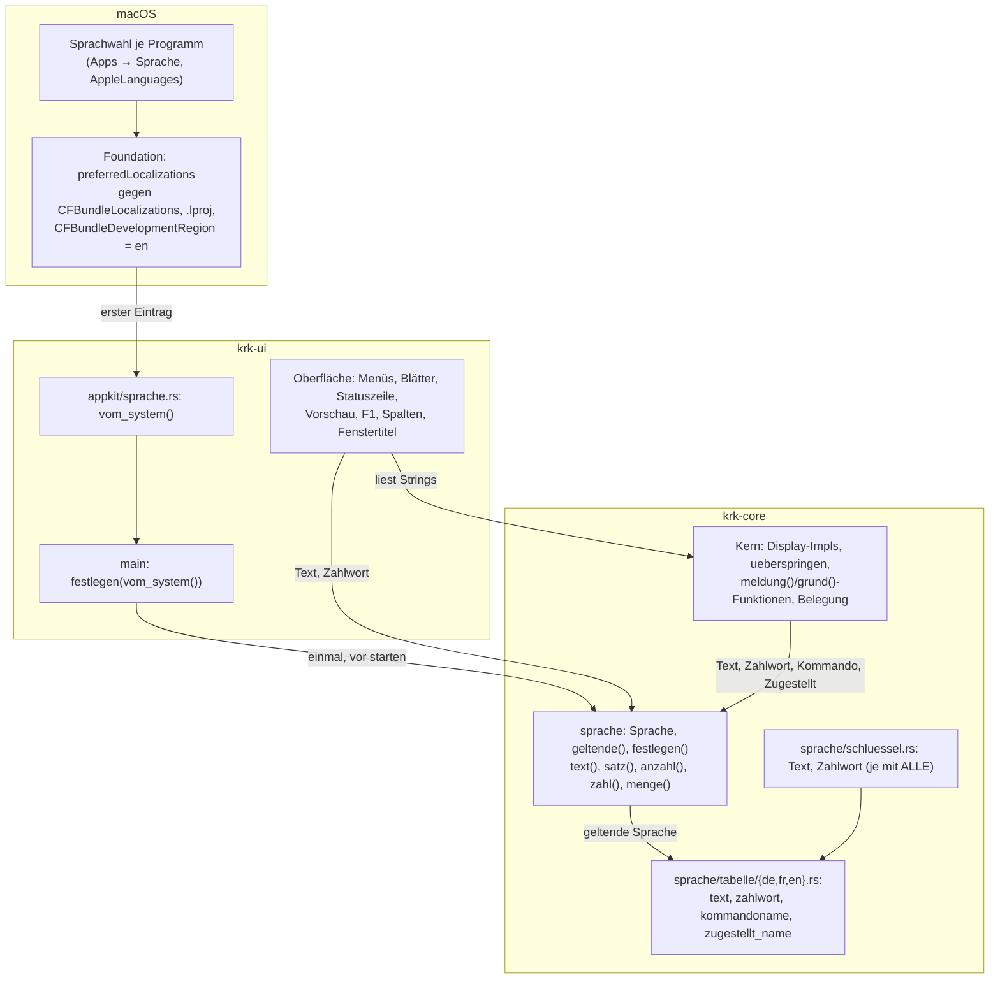
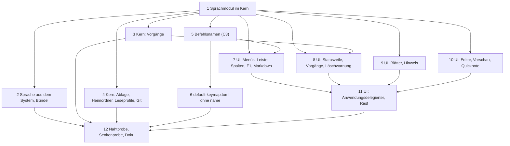

# Implementation Plan: Die Oberfläche folgt der Systemsprache, Deutsch, Französisch, Englisch als Rückfall

**Date:** 2026-10-01
**Status:** Draft
**Spec:** `261001-0735_*_spec-oberflaeche-lokalisierbar-deutsch-und-franzoesisch.md` (C1 bis C5, `## Stops when`, `## Constraints`, `## Open for Planner`; das Arbeitspaket trägt `**Mode:** autonomous`, die Fragen aus `## Open for Planner` sind deshalb hier entschieden und nicht vorgelegt)
**Decidability:** Die tragende Frage des Specs lautet „ist dieses Literal nutzersichtbar?“, und sie ist aus dem Quelltext **nicht** entscheidbar: ob eine Zeichenkette in der Statuszeile oder in einer `#[must_use]`-Marke endet, steht nirgends im Text der Zeichenkette (`260907-0826_*_wie-wird-die-naht-zwischen-umlaut-und-umschrift-gehalten-jetzt-da-sie-eine-regel-ist.md`, Befund). Der Plan ändert deshalb den Mechanismus statt die Frage zu nähern: nutzersichtbar ist nach dieser Arbeit, was aus der Sprachtabelle kommt, und die Probe stellt zwei andere, aus dem Quelltext entscheidbare Fragen. Erstens: „trägt ein Stringliteral im Betriebscode außerhalb des Tabellenverzeichnisses ein Zeichen aus `äöüÄÖÜß`?“ Seit der Umlautregel vom 260907 tragen Kommentare, Bezeichner und Diagnostik die Umschrift, also ist jedes solche Literal eine Verletzung, gleich ob es jemand sieht. Zweitens: „bekommt eine der benannten Senken ein Literal oder ein `format!` als Argument?“ Das ist an der Aufrufstelle entscheidbar. Was keine der beiden Fragen sieht und der Plan deshalb ausschreibt statt verspricht: deutsche Prosa ohne Umlaut, die in einer Variablen gebaut und erst dann an eine Senke gereicht wird. Diese Lücke schließt kein Muster über den Quelltext; sie würde erst ein Typ schließen, den jede Senke verlangt (Möglichkeit 3 des genannten Datensatzes), und den baut diese Arbeit nicht.

## Directive

Der Spec trägt sie. In einem Satz: jede Zeichenkette, die ein Mensch durch KRKs Fenster, Blätter, Menüs und die Statuszeile liest, kommt aus einer Sprachtabelle in Deutsch, Französisch und Englisch; welche gilt, entscheidet macOS aus der Sprachwahl je Programm, mit Englisch als Rückfall; KRK selbst bietet keine Wahl an. Die Nutzerentscheide vom 261001 (keine Wahl in KRK, Englisch als dritte Sprache, der Befehlsname immer aus der Tabelle) stehen im Spec unter `## Nutzerentscheide vom 261001` und werden hier nicht wiederholt.

## Current State

Die Bestandserhebung des Specs gilt; hier steht, was die Planung darüber hinaus nachgelesen und gemessen hat.

**Vier Bauarten, und der Kern kennt heute keine Sprache.** Der Kern baut fertige Sätze an Stellen, die keinen Parameter für eine Sprache haben: `impl fmt::Display` (`Ersetzung`, `Konflikt`, `Belegungsfehler`, `Zuweisungsfehler`, `Regelfehler`, `Schreibfehler`), `From<Namensfehler> for io::Error` (`operation/umbenennen.rs`, backt `grund()` in den Fehler), und `Steuerung::ueberspringen(pfad, grund: impl Into<String>)` mit seinen 63 Rufern unter `operation/`. Die Oberfläche nimmt diese Texte als `String` entgegen (`mit_meldung`, `fehler.to_string()`, `Uebersprungen.grund`) und zeigt sie an. Im Betriebscode des Kerns stehen 115 Literale mit Umlaut außerhalb der Prüfmodule, in dem der Oberfläche 210 (gezählt je Literal, am echten Prüfmodul geschnitten; die Zahlen des Specs zählen Zeilen und Prosaliterale ohne Umlaut mit). Dazu kommen die Beschriftungen aus vollständigen Fallunterscheidungen: im Kern `Wirkungsbereich::beschriftung` (16), `Ortsmangel`, `Namensfehler`, `Kollision`, `Namenshinweis`, `Grund::beschreibung`, `Ersatz::satzteil`, `Pinfehler::meldung`, `eintraege::Abweisung::meldung`, `git::texte::wort`, `Datei::preis`; in der Oberfläche `Bereich::beschriftung` und `langname` (6), `Spalte::beschriftung` (5), `Funktionsbereich::name` (11), `Kontextbefehl::titel` (6), `Teil::ueberschrift`, `seitenname`, `ueberschrift(&Art)`, `Anlegeart`, `Eintragsantwort::text`, `Editormeldung::text`, `pin::frage`, `stapelumbenennen::Spalte::titel`, `typ_beschriften`.

**Die Befehlsnamen sind Daten.** `Funktion { kennung, name, … }` nimmt `name` aus dem `[[funktion]]`-Block (`tasten/belegung.rs`, `Belegung::bauen`), bei einer Nutzerdatei aus **deren** Block, und `Funktionsname` (`tasten/konflikt.rs`) trägt beides in jede Konfliktmeldung. 103 der 110 Funktionen sind ein `Kommando`; die übrigen sieben tragen `gehalten_von = "menue"` und sind `filter_einfuegen`, `text_ausschneiden`, `text_kopieren`, `text_einfuegen`, `text_alles_auswaehlen`, `text_rueckgaengig` und `text_wiederholen`. `belegungsmodell::bereich` ordnet diese sieben heute über ein `match` auf Kennungszeichenketten ihrem Obermenü zu.

**Gewachsene Hilfen, auf denen der Plan aufsetzt.** `ablage::neuerungen::zahl` ist der eine Tausenderformatierer (Punkt), `operationen::menge` der eine Byteformatierer (Komma, „Bytes“); `jede_alle_liste_fuehrt_genau_die_varianten_ihrer_aufzaehlung` (`crates/krk-core/tests/baum.rs`) hält jede `pub const ALLE: [Name; N]` neben ihrer Aufzählung in derselben Datei; `der_name_krkhome_steht_im_ausgelieferten_code_allein_bei_der_erkennung` (ebenda) trägt den Schnitt des Prüfmoduls, der auch die acht Dateien richtig liest, in denen ein `#[cfg(test)]` vor einem einzelnen `use` steht (`appkit/editor.rs`, `kommandos/operationen.rs`, `vorschaumodell.rs`, `heimgriff.rs`, `hervorhebung.rs`, `kommandos/fokus.rs`, `appkit/volumes.rs`, `appkit/quicknote.rs`); `Kommando::KENNUNGEN` samt `jede_variante_von_kommando_steht_genau_einmal_in_kennungen` ist das Muster für eine Aufzählung, die mit Kennungen in einer Datei verbunden ist. `objc2-foundation` steht mit Vorgabemerkmalen im Baum, und `NSBundle::mainBundle().preferredLocalizations()` ist darin gebunden (`NSBundle.rs:390` der Kiste 0.3.2); `weitereinstanz.rs` holt `NSBundle` schon herein.

**Wie macOS die Sprache wählt, gemessen am 261001.** Gemessen an fünf Scratch-Bündeln, die sich allein in `CFBundleLocalizations`, `CFBundleDevelopmentRegion` und dem Vorhandensein von `de.lproj`, `fr.lproj`, `en.lproj` (je mit einer `InfoPlist.strings`) unterscheiden, mit einem Binärprogramm im Bündel, das `Bundle.main.preferredLocalizations` druckt, und der Sprachwahl je Bündelkennung über `defaults write <kennung> AppleLanguages`; jede Vorgabendomäne ist danach entfernt. Ergebnis:

| Sprachwahl | Liste `de, fr, en`, Region `en` | Liste `de, fr, en`, Region `de` | Liste `de, en`, Region `de` (heute) |
|---|---|---|---|
| `de-DE` | `de` | `de` | `de` |
| `de-CH` | `de` | `de` | `de` |
| `fr-CA` | `fr` | `fr` | `de` |
| `fr-FR, de-DE` | `fr` | `fr` | `de` |
| `en-US, de-DE` | `en` | `en` | `en` |
| `en-GB` | `en` | `en` | `en` |
| `ja` | **`en`** | **`de`** | `de` |
| `pt-BR, es-ES` | **`en`** | **`de`** | `de` |

Vier Befunde tragen den Plan. Erstens: der erste Eintrag der Antwort ist immer eine der drei angebotenen Sprachen ohne Regionszusatz, `de-CH` kommt als `de`, `fr-CA` als `fr`; die Abbildung auf die Tabelle ist damit eine Gleichheit. Zweitens: den Rückfall für eine nicht angebotene Sprache entscheidet `CFBundleDevelopmentRegion`, und zwar auch dann, wenn `en` in der Liste steht; der Kommentar in `resources/Info.plist`, `en` gewinne den Rückfall, sobald es in der Liste stehe, gilt nur ohne diesen Schlüssel. Für „Rückfall auf Englisch“ muss der Schlüssel deshalb auf `en`. Drittens: mit `.lproj`-Ordnern führt `localizations` jede Sprache doppelt (einmal aus dem Schlüssel, einmal aus dem Ordner) und `preferredLocalizations` die gewählte zweimal; das ist unschädlich, gelesen wird der erste Eintrag. Viertens: ein Binärprogramm **außerhalb** eines Bündels meldet `localizations = []` und `preferredLocalizations = ["en"]`, während `Locale.preferredLanguages` `de-DE` sagt. Eine Einschränkung der Messung gehört dazu: ob macOS bei einer Sprachwahl, deren **erster** Eintrag keine der drei ist, einen Treffer an zweiter Stelle nimmt (`it-IT, fr-FR`), hat die Messreihe nicht eindeutig beantwortet. In fünf frisch angelegten Domänen gewann jedes Mal die Entwicklungsregion, in wiederverwendeten Domänen zweimal `fr`; `cfprefsd` reicht Schreibvorgänge verzögert weiter, und die Reihe ist dadurch in diesem Punkt nicht sauber. Für KRK ist der Punkt unerheblich, weil KRK die Antwort von macOS liest und nicht selbst über die Liste läuft; welche Sprache macOS wählt, trägt dann auch jede Beschriftung, die macOS selbst stellt. Der Abnahmelauf des Nutzers (unten) prüft die Fälle, die der Spec nennt, am gebauten Bündel über die Systemeinstellung.

**Die Terminalausgabe ist nicht Gegenstand.** `messmodus.rs`, die `eprintln!("krk: …")`-Zeilen, `--tasten-protokoll` und das maschinenlesbare Format von `--menue-protokoll` tragen Umschrift und bleiben (Spec, `## Out of Scope`; offene Entscheidung `260907-0826_*_gilt-die-umlautregel-auch-fuer-die-terminalausgabe-von-xtask-krk-bench-und-messmodus.md`).

## Approach

**Ein Mechanismus für alle vier Bauarten: eine Sprachtabelle als Rust-Code im Kern, mit Aufzählungen als Schlüssel und je Sprache einer vollständigen Fallunterscheidung.** Das Modul `krk_core::sprache` trägt die Aufzählung `Sprache { De, Fr, En }`, die Schlüssel `Text` (feste Texte, auch solche mit benannten Platzhaltern) und `Zahlwort` (Paare aus Einzahl und Mehrzahl), und unter `sprache/tabelle/` je Sprache eine Datei `de.rs`, `fr.rs`, `en.rs` mit `const fn text(Text) -> &'static str` und `const fn zahlwort(Zahlwort) -> (&'static str, &'static str)`, jede ein `match` ohne Auffangzweig. Daraus folgt, was der Spec mit C4 und C5 verlangt, zur einen Hälfte vom Übersetzer und nicht von einer Probe: ein neuer Schlüssel ohne französischen oder englischen Eintrag übersetzt nicht, ein Eintrag ohne Schlüssel ebenso wenig, und eine neue Zeichenkette kann deshalb nur als Eintrag aller drei Tabellen entstehen. Das C2-Kriterium „ein Schlüssel ohne Eintrag zeigt den deutschen Eintrag“ hat unter diesem Mechanismus keinen Fall: ein Schlüssel ohne Eintrag ist kein Zustand, den das Programm erreichen kann. Die Proben halten, was der Übersetzer nicht hält: keinen leeren Eintrag, gleiche Platzhalter in allen drei Tabellen, die Typografie je Sprache.

**Gegen TOML über `include_str!` und gegen `fluent`.** Eine TOML-Tabelle wäre beim Start aus Text zu übersetzen (L4), ihre Schlüssel wären Zeichenketten, deren Vollständigkeit erst eine Probe hält, und der Fall „Schlüssel ohne Eintrag“ wäre ein wirklicher Zustand mit Rückfall. `fluent` brächte denselben Startpreis, einen Laufzeitparser und eine Kiste für ein Pluralverfahren, das für drei Sprachen drei Zeilen lang ist. Keine fremde Kiste kommt deshalb hinzu; die Haltebedingung zur C-Freiheit tritt nicht ein. Die Tabellen als Rust-Dateien tragen die deutschen Umlaute, und genau das macht die Nahtprobe aus C5 möglich: der Ort der Tabellen ist die eine Eigenschaft, die die Probe ausnimmt.

**Wie der Kern die Sprache erfährt: als einmal gesetzter Wert, nicht als Parameter und nicht als strukturierte Werte.** `sprache::festlegen(Sprache)` setzt eine `OnceLock` genau einmal, `sprache::geltende()` liest sie und antwortet `De`, solange nichts gesetzt ist. Die Oberfläche setzt den Wert in `main`, vor `starten`, also vor dem Laden der Belegung und vor dem Bau des Hauptmenüs. Drei Gründe entscheiden für den Wert und gegen die zwei anderen Wege. Erstens haben `fmt::Display` und `From<Namensfehler> for io::Error` keinen Platz für einen Parameter; ein Parameter hieße, jede dieser Stellen durch eine Methode mit Argument zu ersetzen und 63 Rufer von `ueberspringen` sowie jede Stelle, die einen Kernfehler zu Text macht, mit einem Wert zu versorgen, den sie heute nicht halten. Zweitens wären strukturierte Werte („der Kern liefert einen `Grund`, die Oberfläche beschriftet“) ein zweiter Mechanismus neben der Tabelle und ließen die `io::Error`-Wege ohne Antwort, weil ein `io::Error` keinen typisierten Grund trägt. Drittens ist die Sprache eine Eigenschaft des Prozesses und keine der Funktion: macOS wählt sie je Programm beim Start, und einen Wechsel zur Laufzeit gibt es nach dem Nutzerentscheid nicht. Der Preis steht in `## Testing Strategy`: eine Probe kann die Sprache nicht umschalten, die Eigenschaften der drei Sprachen werden deshalb an den Tabellen geprüft und die Mechanik auf Deutsch. Was die Umschaltung kostet, ist eine Fundstelle in einem Prozess, der sie nie braucht.

**Die Befehlsnamen kommen aus derselben Tabelle, geschlüsselt über die Aufzählungen, die es schon gibt.** Je Sprache trägt die Tabelle `const fn kommandoname(Kommando) -> &'static str` über alle 103 Werte und `const fn zugestellt_name(Zugestellt) -> &'static str` über eine neue Aufzählung `Zugestellt` mit den sieben vom Hauptmenü zugestellten Funktionen, beide ohne Auffangzweig. Ein neues Kommando hält damit den Bau an, bis es drei Namen hat; das ist C3, Kriterium 1, vom Übersetzer gehalten, und es fügt den drei Pflichtstellen eines neuen Kommandos keine vierte hinzu, die nichts hält. `Funktion` verliert sein Feld `name: String` und hält stattdessen seinen Schlüssel; `name()` liefert den Namen in der geltenden Sprache. Das Feld `name` in `default-keymap.toml` fällt, weil es sonst eine zweite deutsche Quelle wäre; in der Nutzerdatei bleibt es als geduldetes, nie gelesenes Feld und wird beim Sichern in der geltenden Sprache geschrieben. Gegen weitere Felder `name_fr`, `name_en` in der TOML-Datei spricht, dass sie einen zweiten Tabellenmechanismus neben der Rust-Tabelle einführten, die Vollständigkeit erst eine Probe hielte und die Umstellung drei Schritte bräuchte (Felder dulden, Felder füllen, Felder verlangen), damit jeder Schritt grün bleibt.

**Platzhalter und Mehrzahl.** Ein Tabellentext trägt benannte Platzhalter in geschweiften Klammern, `{name}`, und `sprache::satz(Text, &[(&str, &dyn Display)])` setzt sie ein; die Reihenfolge darf je Sprache verschieden sein. Ein `Zahlwort` trägt zwei Formen, und `sprache::anzahl(Zahlwort, u64, &[…])` wählt nach `Sprache::mehrzahl(n)` (Deutsch und Englisch: `n != 1`; Französisch: `n > 1`) und setzt `{n}` als gruppierte Zahl ein; die Einzahl darf `{n}` auslassen („Einen Eintrag umbenennen“). `Sprache::zahl(u64)` gruppiert Tausender (Deutsch Punkt, Französisch U+202F, Englisch Komma), `Sprache::menge(u64)` schreibt Bytemengen mit dem Dezimaltrenner der Sprache (Deutsch und Französisch Komma, Englisch Punkt) und den Einheiten aus der Tabelle (Französisch `o`, `ko`, `Mo`, `Go`, `To`). Die sieben handgeschriebenen Pluralzweige und die drei Stellen ohne Einzahl fallen damit; der Defekt zur Zusammenfassung des Stapelumbenennens schließt sich darin.

**Das Bündel.** `resources/Info.plist` führt `CFBundleLocalizations` mit `de`, `fr`, `en` und `CFBundleDevelopmentRegion` mit `en`, der Kommentar an beiden Schlüsseln beschreibt die Messung vom 261001; `resources/de.lproj/InfoPlist.strings`, `resources/fr.lproj/…`, `resources/en.lproj/…` tragen die fünf Erlaubnistexte; `xtask/src/bundle.rs` kopiert die drei Ordner nach `Contents/Resources/` und führt sie im Kopfkommentar. Die Lesung steht in einer neuen Datei `crates/krk-ui/src/appkit/sprache.rs` mit Untergrenzen-Abschnitt (`NSBundle`, `mainBundle`, `preferredLocalizations` seit macOS 10.0) und nimmt den ersten Eintrag von `preferredLocalizations`; außerhalb eines Bündels antwortet macOS `en`, und KRK folgt dem, weil KRK die Wahl von macOS liest und nicht eine eigene daneben trifft (`make run`, `make tasten`, `make menue` und die Messstrecke starten alle das Bündel).

**Die Naht.** Zwei Proben in `crates/krk-core/tests/baum.rs`: die Umlautprobe über jedes Stringliteral des Betriebscodes beider Kisten außerhalb von `sprache/tabelle/`, und die Senkenprobe über die Argumente der benannten Senken. Beide schneiden das Prüfmodul mit der Regel, die `der_name_krkhome_steht_im_ausgelieferten_code_allein_bei_der_erkennung` schon trägt; diese Regel zieht als Hilfsfunktion nach `tests/gemeinsam/mod.rs` um, damit drei Proben nicht drei Fassungen tragen.

Der Graph hat eine Richtung: von der Systemwahl über die eine Lesung in den Kern, und aus Kern und Oberfläche in dieselbe Tabelle. Die Oberfläche liest den Kern wie heute; der Kern liest die Oberfläche nicht, und `sprache` liest keine Datei und keinen Systemaufruf.

## Implementation Steps

Jeder Schritt lässt `make check` grün und landet in einem Commit; nach jedem Commit ist die Anwendung in deutscher Sprachwahl vollständig deutsch, und in französischer oder englischer Sprachwahl zeigt sie die bis dahin umgestellten Flächen übersetzt und die übrigen deutsch. Die französischen und englischen Texte schreibt der Ausführende des jeweiligen Schrittes zusammen mit den Schlüsseln, weil die Tabellen ohne Auffangzweig nicht anders übersetzen; `fr.rs` und `en.rs` tragen ab Schritt 1 die Kopfzeile, dass ein Agent übersetzt hat und der Nutzer noch nicht durchgesehen hat. Gebaut wird nacheinander (`260820-0602_*_make-check-prueft-den-ganzen-arbeitsbereich-und-bricht-bei-parallelen-agenten-an-fremden-dateien-ab.md`); welche Schritte voneinander unabhängig sind, sagt die Zeile `Dependencies` und der Graph am Ende dieses Abschnitts.

Für jede Umstellung gilt dieselbe Handwerksregel: der deutsche Tabelleneintrag ist der heutige Wortlaut, Zeichen für Zeichen, damit jede Wortlautprobe weiter hält; ein Literal, das heute an zwei Stellen gleich steht (etwa „Abbrechen“, „Schließen“), bekommt einen Schlüssel und nicht zwei; ein Schlüssel heißt nach der Fläche und der Sache (`StatuszeileFilterStand`, `BlattAbbrechen`, `VorgangKeineRechte`), ASCII, ohne Umschrift-Zweideutigkeit; ein Text ohne Laufzeitwert ist ein `Text`, ein Satz mit Laufzeitwert ein `Text` mit Platzhaltern über `satz`, eine Mengenangabe ein `Zahlwort` über `anzahl`. Beschriftungsfunktionen mit vollständigem `match` bleiben vollständig und bilden ihre Variante auf einen Schlüssel ab (`Bereich::Dateifenster => text(Text::BereichDateifenster)`), damit ein neuer Wert weiter den Bau anhält. Kein `LazyLock` und kein `static` hält einen Tabellentext; was heute `DEFAULTPROFIL` als drei deutsche Beschriftungen hält, hält danach drei Schlüssel.

1. [DONE] **Das Sprachmodul im Kern, und die Beschriftungen des Kerns**
   - Executor: `code-implementer`
   - Files: `crates/krk-core/src/sprache/mod.rs` (neu), `crates/krk-core/src/sprache/schluessel.rs` (neu), `crates/krk-core/src/sprache/tabelle/mod.rs`, `de.rs`, `fr.rs`, `en.rs` (neu), `crates/krk-core/src/lib.rs`, `crates/krk-core/src/ablage/neuerungen.rs` (`zahl` zieht um), `crates/krk-ui/src/kommandos/operationen.rs` (der Re-Export von `zahl` zeigt auf die neue Stelle; `menge` zieht in den Kern um), `crates/krk-core/src/tasten/belegung.rs` (`Wirkungsbereich::beschriftung`), `crates/krk-core/src/leseprofil/mod.rs` (`Ortsmangel::grund`), `crates/krk-core/src/operation/umbenennen.rs` (`Namensfehler::grund`), `crates/krk-core/src/stapelumbenennen/kollision.rs` (`Kollision::grund`), `crates/krk-core/src/ablage/lesezeichen.rs` (`Namenshinweis::grund`), `crates/krk-core/src/ablage/mod.rs` (`Grund::beschreibung`), `crates/krk-core/src/ablage/pfade.rs` (`Ersatz::satzteil`), `crates/krk-core/src/heimordner/tresor.rs` (`Pinfehler::meldung`), `crates/krk-core/src/heimordner/eintraege.rs` (`Abweisung::meldung`), `crates/krk-core/src/git/texte.rs` (`wort`), `crates/krk-core/src/leseprofil/defaultprofil.rs` (`BESCHRIFTUNGEN` als Schlüssel), `crates/krk-core/tests/sprache.rs` (neu), `crates/krk-core/tests/gemeinsam/mod.rs` (die Prüfmodul-Schnittregel als Hilfsfunktion), `crates/krk-core/tests/baum.rs` (die Probe `der_name_krkhome_…` ruft die Hilfsfunktion)
   - Changes: (a) `Sprache` mit `De`, `Fr`, `En`, `pub const ALLE: [Sprache; 3]`, `kennung()` (`"de"`, `"fr"`, `"en"`), `aus_bezeichner(&str) -> Sprache` (schneidet an `-` und `_`, vergleicht ohne Rücksicht auf Groß- und Kleinschreibung, antwortet `En` für jede andere), `mehrzahl(n)`, `zahl(n)`, `dezimal(ganze, zehntel)`, `menge(bytes)`; jede Fallunterscheidung über `Sprache` vollständig. (b) `festlegen(Sprache) -> Result<(), Sprache>` über eine `OnceLock`, `Err` trägt den schon stehenden Wert; `geltende()` antwortet `De`, solange nichts gesetzt ist, und der Doc-Kommentar sagt, warum (die Quelltabelle ist Deutsch, und `cargo test` setzt nichts). (c) `Text` und `Zahlwort` in `schluessel.rs`, je mit `pub const ALLE` in derselben Datei nach der Form, die `jede_alle_liste_fuehrt_genau_die_varianten_ihrer_aufzaehlung` liest; zunächst mit den Schlüsseln dieses Schrittes. (d) `text(Text) -> &'static str`, `satz(Text, &[(&str, &dyn fmt::Display)]) -> String`, `anzahl(Zahlwort, u64, &[(&str, &dyn fmt::Display)]) -> String`, dazu je eine Form mit ausdrücklicher Sprache (`Sprache::text(self, Text)`, `Sprache::zahlwort(self, Zahlwort)`), die die Proben nutzen; `satz` ersetzt jedes `{name}` aus der Liste und hält unter `debug_assertions` fest, dass kein Platzhalter stehen bleibt. (e) `tabelle/de.rs`, `fr.rs`, `en.rs` mit `pub(super) const fn text(Text) -> &'static str` und `zahlwort(Zahlwort) -> (&'static str, &'static str)`, je `match` ohne Auffangzweig; `fr.rs` und `en.rs` tragen als erste Zeile des Modulkopfs: „Übersetzt von einem Agenten am 261001; vom Nutzer noch nicht Fläche für Fläche durchgesehen.“ (f) Der Modulkopf von `sprache/mod.rs` schreibt die Regel aus: nutzersichtbarer Text ist ein Tabelleneintrag mit ASCII-Schlüssel in allen drei Sprachen; die deutsche Tabelle trägt Umlaute, Kommentare und Bezeichner die Umschrift; Terminalausgaben sind nicht Gegenstand; ein Tabellentext trägt keine geschweifte Klammer außer als Platzhalter; kein `LazyLock` hält einen Tabellentext; die Sprache ist ein Wert des Prozesses, gesetzt in `main`. (g) Die genannten Beschriftungsfunktionen des Kerns bilden ihre Variante auf einen Schlüssel ab; `zahl` zieht aus `neuerungen.rs` nach `sprache` (gleiche Signatur, geltende Sprache), `menge` aus `operationen.rs` in den Kern (`Sprache::menge`), die Rufer folgen. (h) Das Glossar unter `## Übersetzung` dieses Plans gilt für jeden Eintrag.
   - Acceptance:
     - `jede_alle_liste_fuehrt_genau_die_varianten_ihrer_aufzaehlung` hält `Sprache::ALLE`, `Text::ALLE` und `Zahlwort::ALLE` ohne Eintrag in `UNLESBARE_ALLE_LISTEN`.
     - `tests/sprache.rs`: für jede Sprache und jeden Schlüssel aus `Text::ALLE` und `Zahlwort::ALLE` ist der Eintrag nicht leer (bei `Zahlwort` beide Formen); die Menge der Platzhalter `{…}` eines `Text`-Eintrags ist in allen drei Sprachen gleich; die Menge der Platzhalter beider Formen eines `Zahlwort`-Eintrags ist ohne `n` in allen drei Sprachen gleich; kein Eintrag trägt ein ASCII-Anführungszeichen `"`; deutsche Einträge tragen kein `«` und kein `»`; französische Einträge tragen kein `„` und kein `“`, und vor jedem `:`, `;`, `!` und `?` steht, wenn davor ein Buchstabe oder eine Ziffer steht, U+00A0 oder U+202F und nie ein gewöhnliches Leerzeichen; englische Einträge tragen kein `„`, kein `«` und kein `»`.
     - `Sprache::aus_bezeichner`: `de`, `de-CH`, `de_AT`, `DE` liefern `De`; `fr`, `fr-CA` liefern `Fr`; `en`, `en-GB`, `ja`, `pt-BR` und der leere Text liefern `En`.
     - `mehrzahl`: Deutsch und Englisch sagen für 0 ja, für 1 nein, für 2 ja; Französisch sagt für 0 nein, für 1 nein, für 2 ja.
     - `zahl(1_234_567)` ist `1.234.567`, `1 234 567` (mit U+202F) und `1,234,567`; `menge(1_500)` ist `1,5 kB`, `1,5 ko`, `1.5 kB`; `menge(1)` nennt in jeder Sprache die Einzahl von Byte, `menge(2)` die Mehrzahl.
     - `satz` setzt zwei Platzhalter in umgekehrter Reihenfolge richtig ein; `anzahl` nimmt für 1 die Einzahl ohne `{n}` und für 2 die Mehrzahl mit gruppierter Zahl.
     - `festlegen` antwortet beim zweiten Aufruf `Err` mit dem ersten Wert; `geltende()` ist `De`, ohne dass eine Probe `festlegen` ruft (eine Probe, die `festlegen` riefe, bände jede andere Probe des Binärziels an ihren Wert; keine tut es, und `tests/sprache.rs` sagt das in seinem Kopf).
     - Die bestehenden Wortlautproben halten unverändert, namentlich `BESCHRIFTUNGEN` in `crates/krk-core/tests/belegung.rs`, `der_grund_steht_in_worten_da`, `das_default_profil_traegt_genau_die_drei_zaehlzeilen` und die Wortlautproben zu `git/texte.rs`.
     - `make check` grün. Die Umlautprobe aus Schritt 12 existiert noch nicht; dieser Schritt lässt die übrigen Literale, wie sie sind.
   - Dependencies: keine

2. [DONE] **Die Sprache aus dem System, und das Bündel**
   - Executor: `code-implementer`
   - Files: `crates/krk-ui/src/appkit/sprache.rs` (neu), `crates/krk-ui/src/appkit/mod.rs`, `crates/krk-ui/src/main.rs`, `resources/Info.plist`, `resources/de.lproj/InfoPlist.strings`, `resources/fr.lproj/InfoPlist.strings`, `resources/en.lproj/InfoPlist.strings` (alle drei neu), `xtask/src/bundle.rs`, `README.md` (Bündelstruktur, `## Neuerungen an den eigenen Dateien übernehmen` unberührt)
   - Changes: (a) `appkit/sprache.rs` mit `vom_system() -> Sprache`: `NSBundle::mainBundle().preferredLocalizations()`, erster Eintrag, `Sprache::aus_bezeichner`; ohne Eintrag `En`. Der Modulkopf trägt den Untergrenzen-Abschnitt (`NSBundle`, `mainBundle`, `preferredLocalizations`, `NSArray`, `NSString` seit macOS 10.0) nach dem Muster von `appkit/hinweis.rs`, die Messtabelle aus `## Current State` in Kurzform, und den Satz, dass ein Binärprogramm außerhalb eines Bündels von macOS `en` bekommt und KRK dem folgt. (b) `main.rs` ruft nach der Argumentauswertung und vor `appkit::starten` `krk_core::sprache::festlegen(appkit::sprache::vom_system())` und bricht mit `eprintln!` und `AUFRUFFEHLER` ab, wenn der Wert schon steht (das kann nur ein zweiter Rufer sein, und den gibt es nicht; die Zeile sagt, dass sie den Fall ausschließt und nicht behandelt). (c) `Info.plist`: `CFBundleLocalizations` mit `de`, `fr`, `en`; `CFBundleDevelopmentRegion` mit `en`; die Kommentare an beiden Schlüsseln ersetzt durch die gemessene Regel vom 261001 mit den acht Zeilen der Messtabelle, dem Satz, dass die Entwicklungsregion den Rückfall auch neben `en` in der Liste entscheidet, und dem Satz, dass die drei `.lproj`-Ordner die Erlaubnistexte tragen und zugleich der Weg sind, auf dem die Systemeinstellung „Apps → Sprache“ die Sprachen eines Programms erkennt (letzteres als Erwartung, geprüft vom Nutzer, siehe `## Where this work stops`); die fünf deutschen `NS*UsageDescription`-Texte bleiben, wo sie stehen. (d) Die drei `InfoPlist.strings` im Format `"Schluessel" = "Text";`, UTF-8, je die fünf Schlüssel; die deutsche Datei trägt die Texte der `Info.plist` Zeichen für Zeichen, die französische und die englische die Übersetzung mit dem Hinweis in einem Kommentar der ersten Zeile, dass ein Agent übersetzt hat. (e) `bundle.rs`: eine Konstante `SPRACHEN: [&str; 3] = ["de", "fr", "en"]`, `zusammensetzen` kopiert `resources/<sprache>.lproj/` nach `Contents/Resources/<sprache>.lproj/`, der Kopfkommentar führt die Ordner in der Strukturskizze; eine fehlende Quelle bricht ab, bevor ein Verzeichnis entsteht, wie die Symbolquellen. (f) `README.md` nennt die drei Ordner in der Bündelstruktur und sagt in einem Absatz, wie der Nutzer die Sprache von KRK in den Systemeinstellungen wählt.
   - Acceptance:
     - Im Prüfmodul von `bundle.rs`: `resources/` trägt genau die `.lproj`-Ordner aus `SPRACHEN`; `CFBundleLocalizations` der ausgelieferten `Info.plist` nennt genau `SPRACHEN`; `CFBundleDevelopmentRegion` ist `en`; jede `InfoPlist.strings` nennt genau die fünf `NS*UsageDescription`-Schlüssel der `Info.plist` und keinen anderen; die Werte der deutschen Datei sind die der `Info.plist`.
     - `plutil -lint` ist grün für `resources/Info.plist` und für die drei `InfoPlist.strings` (vom Ausführenden gefahren, Ergebnis im Commit genannt).
     - `cargo xtask bundle` baut, und `target/KRK.app/Contents/Resources/` trägt `de.lproj`, `fr.lproj`, `en.lproj` mit je einer `InfoPlist.strings`; `plutil -p target/KRK.app/Contents/Info.plist` zeigt die drei Sprachen und die Region `en`.
     - `jede_appkit_datei_mit_frameworkimport_traegt_den_untergrenzen_abschnitt` und `jeder_frameworkimport_steht_namentlich_im_untergrenzen_abschnitt` halten für `appkit/sprache.rs`.
     - `make menue` druckt auf einem deutschen Mac deutsche Titel (wie heute); die Protokollform ist unverändert.
     - `make check` grün.
   - Dependencies: Schritt 1

3. [DONE] **Der Kern: Vorgänge, Namen, Textdateien**
   - Executor: `code-implementer`
   - Files: `crates/krk-core/src/operation/mod.rs`, `kopieren.rs`, `verschieben.rs`, `loeschen.rs`, `umbenennen.rs`, `duplizieren.rs`, `zippen.rs`, `entpacken.rs`, `fortschritt.rs` (Doc-Kommentar an `ueberspringen`), `crates/krk-core/src/stapelumbenennen/regel.rs`, `crates/krk-core/src/text/datei.rs`, `crates/krk-core/src/verzeichnis/leser.rs` (`datenschutzsperre`), `crates/krk-core/src/verzeichnis/sys.rs` (die Fehlertexte, die eine Meldung erreichen), `crates/krk-core/tests/operation.rs`, `tests/stapelumbenennen.rs`, `tests/text.rs`, `crates/krk-core/src/sprache/schluessel.rs`, `tabelle/de.rs`, `fr.rs`, `en.rs`
   - Changes: Jedes Literal, das `ueberspringen` erreicht, wird ein `text(Text::…)` oder ein `satz(Text::…, &[…])`; `operation::grund(&io::Error)` bildet seine vier Fälle auf Schlüssel ab und lässt den Systemtext als Rückfall (der Systemtext ist ein Fehlertext des Systems, Spec C2); `Regelfehler`, `Abweisung` (`text/datei.rs`) und `datenschutzsperre` nehmen die Tabelle. Dateinamen, die KRK selbst bildet (`freier_name` mit „Kopie“), bleiben unverändert, siehe `## Open Questions`. Der Doc-Kommentar an `ueberspringen` sagt, dass `grund` ein Tabellenwert ist und die Senkenprobe aus Schritt 12 das hält.
   - Acceptance:
     - Die Wortlautproben in `tests/operation.rs` („keine Rechte“, „das Ziel liegt in der Quelle“, „gibt es nicht mehr“, „keine gewöhnliche Datei“, „es fehlt der neue Name“, „bericht Kopie.txt“), `tests/stapelumbenennen.rs` und `tests/text.rs` halten unverändert.
     - Unter `crates/krk-core/src/operation/`, `stapelumbenennen/`, `text/` und `verzeichnis/` steht außerhalb der Prüfmodule kein Stringliteral mit `äöüÄÖÜß` mehr (`grep -rn --include='*.rs' '[äöüÄÖÜß]' crates/krk-core/src/operation crates/krk-core/src/stapelumbenennen crates/krk-core/src/text crates/krk-core/src/verzeichnis`, gelesen bis zum jeweiligen Prüfmodul).
     - `make check` grün.
   - Dependencies: Schritt 1 (unabhängig von 2, 4, 5)

4. [DONE] **Der Kern: Ablage, Heimordner, Leseprofile, Git, Tastenparser**
   - Executor: `code-implementer`
   - Files: `crates/krk-core/src/ablage/mod.rs`, `pfade.rs`, `einstellungen.rs`, `werkszustand.rs`, `neuerungen.rs`, `leseprofile.rs`, `crates/krk-core/src/heimordner/ort.rs`, `bereitstellen.rs`, `tresor.rs`, `eintraege.rs`, `crates/krk-core/src/leseprofil/mod.rs`, `datei.rs`, `defaultprofil.rs`, `crates/krk-core/src/git/texte.rs`, `crates/krk-core/src/tasten/parser.rs` (`Schreibfehler`), `crates/krk-core/tests/ablage.rs`, `tests/heimordner.rs`, `tests/leseprofil.rs`, `tests/werkszustand.rs`, `tests/git.rs`, `crates/krk-core/src/sprache/schluessel.rs`, `tabelle/de.rs`, `fr.rs`, `en.rs`, der Defektdatensatz `261001-0731_*_neuerungen-rs-sagt-settings-toml-fuehre-genau-einen-schluessel-die-datei-fuehrt-zwei.md`
   - Changes: Die Satzbauer (`Ersetzung`, `Schreibhindernis`, `Werkshindernis`, `Zurueckgesetzt`, `startzeile`, `blatttext`, `gekuerzt`, die sieben in `ort.rs`, `Hindernis`, `Bereitstellung`, `Uebernahme`, `Tresorfehler`, `Oeffnungsfehler`, `profilmeldung`, `zeilenmeldung`, die Gründe in `pruefen`, `Zusammenfassung::als_text`, `zeilen_als_text`, `Wert::als_text`, `kopfzeile`, `zusammenfassung`, `verlaufszeile`, die Konstanten in `git/texte.rs`, `Schreibfehler`) nehmen die Tabelle; die Pluralzweige „Eintrag/Einträge“ und „Notiz/Notizen“ werden `Zahlwort`; „ja“/„nein“ und `PLATZHALTER` werden Schlüssel. Nicht angefasst: die Namen, die KRK auf die Platte schreibt (`.neu`, `.beschaedigt`, `## Zettel N`, der Kommentar, den `einstellungen.rs:571` in die `settings.toml` des Nutzers schreibt), siehe `## Open Questions`. Der Doc-Kommentar an `Vergleichsform::ObersteSchluessel` nennt keine Zahl mehr und zeigt auf `resources/default-settings.toml` als Quelle; der Defektdatensatz bekommt seine `Resolved:`-Zeile und den Marker `_c_`.
   - Acceptance:
     - Die Wortlautproben in `tests/ablage.rs`, `tests/heimordner.rs`, `tests/leseprofil.rs`, `tests/werkszustand.rs`, `tests/git.rs` und in den Prüfmodulen von `git/texte.rs`, `leseprofile.rs`, `bereitstellen.rs` halten unverändert.
     - `startzeile` meldet für genau einen Eintrag „1 Eintrag“ und für zwei „2 Einträge“ (je eine Probe).
     - `DEFAULTPROFIL` hält keine Zeichenkette aus der Tabelle; die drei Zählzeilen werden beim Bau der Zusammenfassung beschriftet.
     - Unter `crates/krk-core/src/` steht außerhalb von `sprache/tabelle/` und außerhalb der Prüfmodule kein Stringliteral mit `äöüÄÖÜß` mehr (bis auf die Namen in `tasten/belegung.rs` und `tasten/konflikt.rs`, die Schritt 5 nimmt).
     - `make check` grün.
   - Dependencies: Schritt 1 (unabhängig von 2, 3, 5)

5. [DONE] **Die Befehlsnamen kommen aus der Tabelle (C3)**
   - Executor: `code-implementer`
   - Files: `crates/krk-core/src/tasten/belegung.rs`, `crates/krk-core/src/tasten/konflikt.rs`, `crates/krk-core/src/tasten/mod.rs`, `crates/krk-core/src/sprache/tabelle/de.rs`, `fr.rs`, `en.rs`, `schluessel.rs`, `crates/krk-core/tests/belegung.rs`, `crates/krk-ui/src/belegungsmodell.rs` (`bereich`), `HowTo.md` (die Stelle, die heute „Der Name kommt aus der eigenen Datei“ sagt, Zeile 935 am Stand `e984b3f`)
   - Changes: (a) `pub enum Zugestellt` in `belegung.rs` mit den sieben Werten `FilterEinfuegen`, `TextAusschneiden`, `TextKopieren`, `TextEinfuegen`, `TextAllesAuswaehlen`, `TextRueckgaengig`, `TextWiederholen`, `pub const KENNUNGEN: [(Zugestellt, &str); 7]` und `aus_kennung` nach dem Muster von `Kommando`; `pub enum Funktionsschluessel { Kommando(Kommando), Zugestellt(Zugestellt) }` mit `aus_kennung(&str) -> Option<Self>` und `kennung(self) -> &'static str`. (b) Je Sprache `pub(super) const fn kommandoname(Kommando) -> &'static str` und `zugestellt_name(Zugestellt) -> &'static str`, beide `match` ohne Auffangzweig; die deutschen Namen sind die heutigen `name`-Werte aus `default-keymap.toml`, Zeichen für Zeichen; `sprache::funktionsname(Funktionsschluessel) -> &'static str` in der geltenden Sprache. (c) `Funktion` verliert `name: String` und hält `schluessel: Funktionsschluessel`; `name()` liefert `sprache::funktionsname(self.schluessel)`, dazu `name_in(Sprache)`; `kommando()` antwortet aus dem Schlüssel, weiter `None` bei gesetztem Zusteller; `Belegung::bauen` löst `eintrag.id` über `Funktionsschluessel::aus_kennung` auf und antwortet ohne Treffer `Belegungsfehler::UnbekannteFunktion`, für die Auslieferung wie für die Nutzerdatei; `Eintrag.name` wird `Option<String>`, `#[serde(default, skip_serializing_if = "Option::is_none")]`, beim Lesen geduldet und nie gelesen, beim Schreiben `Some(funktion.name().to_owned())`. (d) `Funktionsname.name` bleibt und trägt den Namen in der Sprache zum Zeitpunkt des Konflikts; `Konflikt`, `Funktionsname`, `Belegungsfehler`, `Zuweisungsfehler` formatieren über die Tabelle. (e) Der Modulkopf von `belegung.rs`, Abschnitt über `name` und `reserviert_fuer`, sagt, dass `name` seit dieser Arbeit wie `gehalten_von` eine Duldung beim Lesen ist, der Name aus der Tabelle kommt und `reserviert_fuer` weiter aus der Datei; `HowTo.md` sagt dasselbe für den Nutzer. (f) `belegungsmodell::bereich` nimmt `Funktionsschluessel` und verzweigt über `Zugestellt` vollständig statt über Kennungszeichenketten.
   - Acceptance:
     - `die_nutzerdatei_setzt_weder_zusteller_noch_name_noch_vorbehalt` hält für `name` das Gegenteil von heute: eine Nutzerdatei mit `name = "Kaffee kochen"` an `kopieren` zeigt weiter „Kopieren“; eine Nutzerdatei ohne `name` lädt ohne Fehler und ohne Meldung; `reserviert_fuer` kommt weiter aus der Datei.
     - Nach `sichern` trägt die geschriebene Datei an jeder Funktion `name` mit dem Namen der geltenden Sprache.
     - `jede_variante_von_zugestellt_steht_genau_einmal_in_kennungen` nach dem Vorbild der Probe für `Kommando`; `jede_funktion_der_auslieferung_hat_einen_schluessel` (jede `id` der Auslieferung löst sich auf) und die Umkehrung (jede Kennung aus beiden `KENNUNGEN` steht in der Auslieferung).
     - Je Sprache: keine zwei Funktionen der Auslieferung tragen denselben Namen; kein Name ist leer; kein Name trägt `|` (die Markdown-Ausgabe maskiert, die Probe hält, dass sie es nicht muss, wie heute `keine_beschriftung_ist_leer_oder_traegt_einen_senkrechten_strich` für die Wirkungsbereiche).
     - `crates/krk-core/tests/belegung.rs:1027` („Termine: Sortierrichtung umkehren“) und `eine_bereits_vergebene_kombination_liefert_einen_konflikt_mit_dem_namen_der_anderen_funktion` halten unverändert.
     - `make check` grün; `default-keymap.toml` trägt in diesem Schritt noch `name`, geduldet.
   - Dependencies: Schritt 1 (unabhängig von 2, 3, 4)

6. [DONE] **`default-keymap.toml` ohne das Feld `name`**
   - Executor: `data-implementer`
   - Files: `resources/default-keymap.toml`
   - Changes: Jede Zeile `name = "…"` fällt aus den 110 `[[funktion]]`-Blöcken; der Kopfkommentar beschreibt `name` nicht mehr als Feld der Auslieferung, sondern sagt, dass die Beschriftung aus der Sprachtabelle im Kern kommt (`crates/krk-core/src/sprache/tabelle/`, je Sprache `kommandoname` und `zugestellt_name`) und dass `name` in einer eigenen `keymap.toml` geduldet und nie gelesen wird. Die Zeile „Ausgeliefert sind 110 Funktionen mit zusammen 110 Kombinationen“ bleibt, wie sie ist; nichts an `id`, `tasten`, `reserviert_fuer`, `gehalten_von` ändert sich.
   - Acceptance:
     - `grep -c '^name = ' resources/default-keymap.toml` ist 0.
     - Die Probe über die zwei Zahlen im Kopf der Datei und `jede_kennung_der_kommandos_steht_in_der_auslieferungsbelegung` halten; `make check` grün.
     - Der Vergleich der Neuerungen (`neuerungen.rs`) vergleicht `keymap.toml` weiter allein über `id`; die Probe `eine_keymap_toml_ohne_eine_ausgelieferte_id_liefert_genau_diese_id` (oder wie sie am Stand heißt) hält.
   - Dependencies: Schritt 5

7. [DONE] **Die Oberfläche: Menüs, Kontextmenü, Leiste, Spalten, F1-Ansicht, Markdown-Ausgabe**
   - Executor: `code-implementer`
   - Files: `crates/krk-ui/src/menuemodell.rs`, `crates/krk-ui/src/appkit/menue.rs`, `crates/krk-ui/src/kommandos/kontextmenue.rs`, `crates/krk-ui/src/appkit/tabelle.rs` (Spaltentitel, Kontextmenü, `typ_beschriften`), `crates/krk-ui/src/appkit/bereichsleiste.rs`, `crates/krk-ui/src/fenstermodell.rs` (`Bereich`), `crates/krk-ui/src/spalten.rs`, `crates/krk-ui/src/appkit/eintragsansicht.rs` (Spaltenköpfe), `crates/krk-ui/src/belegungsmodell.rs`, `crates/krk-ui/src/appkit/belegungsansicht.rs`, `crates/krk-ui/src/belegungsausgabe.rs`, `crates/krk-ui/src/leistenmodell.rs`, `crates/krk-ui/src/appkit/leiste.rs`, `crates/krk-ui/src/fenstertitel.rs`, `crates/krk-ui/src/appkit/titelzusatz.rs`, `crates/krk-ui/src/appkit/tableiste.rs`, `crates/krk-core/src/sprache/schluessel.rs`, `tabelle/de.rs`, `fr.rs`, `en.rs`, der Defektdatensatz `261001-0731_*_der-doc-kommentar-an-hauptmenue-nennt-menue-neu-bauen-die-funktion-heisst-belegung-uebernehmen.md`
   - Changes: `MARKDOWN_BESCHRIFTUNG`, `UEBER_BESCHRIFTUNG`, `Funktionsbereich::name`, `Kontextbefehl::titel`, `Bereich::beschriftung` und `langname`, `Spalte::beschriftung`, `titel(spalte)` in `tabelle.rs` (die Ausnahme „Änderungsdatum“ wird ein eigener Schlüssel, der Zweig bleibt), `Teil::ueberschrift`, die Zusätze „reserviert für“ und „Kürzel des Menüs“, die Spaltenköpfe „Funktion“, „Belegung“, „Aufgabe“, „Thema“, „Notiz“, „Datum“, „Termin“, die Knöpfe und Meldungen der F1-Ansicht samt Suchmeldungen, `UEBERSCHRIFT`, `TABELLENKOPF`, `NICHT_EINGEORDNET`, `wirkung()` und die Statusmeldungen der Markdown-Ausgabe (der Dateiname `KRK-Tastenbelegung.md` und der Ordner `Downloads` bleiben Bezeichner), die Tooltips und Beschriftungen der Bereichsleiste („Deep“, „Content“ bleiben die Namen der Ankreuzfelder; ob sie übersetzt werden, sagt das Glossar: nein, sie sind Schalterbezeichner wie Tastennamen), „Quicknote“ im Fenstertitel, „KRK {Version}“ im Titelzusatz, die Beschriftungen der Tableiste. Alle `NSMenuItem` entstehen weiter über `roher_befehl`. Der Doc-Kommentar an `hauptmenue` nennt `Anwendungsdelegierter::belegung_uebernehmen` mit seinen zwei Rufern statt der nicht vorhandenen Funktion; der Defektdatensatz bekommt `Resolved:` und `_c_`.
   - Acceptance:
     - `es_gibt_eine_stelle_je_anlage_und_uebersetzung` und `das_menue_wird_an_zwei_anlaessen_gebaut` halten.
     - Die Wortlautproben in `menuemodell.rs`, `belegungsmodell.rs`, `belegungsausgabe.rs` („Alles auswählen“), `kontextmenue.rs` (die sechs Titel), `leistenmodell.rs` („Geräte und Orte“) halten unverändert.
     - `make menue` druckt dieselben Titel wie vor dem Schritt (Vergleich der Ausgabe vor und nach dem Schritt, vom Ausführenden gefahren und im Commit genannt).
     - In den genannten Dateien steht außerhalb der Prüfmodule kein Stringliteral mit `äöüÄÖÜß` mehr.
     - `make check` grün.
   - Dependencies: Schritte 1 und 5

8. [DONE] **Die Oberfläche: Statuszeile, Vorgangsmeldungen, Löschwarnung, Startmeldungen**
   - Executor: `code-implementer`
   - Files: `crates/krk-ui/src/appkit/statuszeile.rs`, `crates/krk-ui/src/kommandos/operationen.rs`, `crates/krk-ui/src/kommandos/auswahl.rs`, `crates/krk-ui/src/kommandos/loeschwarnung.rs`, `crates/krk-ui/src/kommandos/blattmeldung.rs`, `crates/krk-ui/src/kommandos/pfadeingabe.rs`, `crates/krk-ui/src/kommandos/werkseinstellungen.rs`, `crates/krk-ui/src/tabs.rs`, `crates/krk-ui/src/appkit/papierkorb.rs`, `crates/krk-ui/src/appkit/blaetter/startmeldungen.rs`, `crates/krk-ui/src/appkit/blaetter/uebersprungen.rs`, `crates/krk-core/src/sprache/schluessel.rs`, `tabelle/de.rs`, `fr.rs`, `en.rs`
   - Changes: `filterstand_text`, `bildzaehler_text`, `seitenzaehler_text`, `zeilentext`, `seitenname`, die Vorgangszeilen (`vorgangszeile`, `abbruchzeile`, `schon_ein_vorgang`, `abschlusstext`, `uebersprungenliste`, `ueberschrift(&Art)`, `Anlegeart`, `kopiermeldung`, `ablagemeldung`, die `nichts_zu_…`-Sätze, `ABBRUCHHINWEIS`, `TRENNER`), der Markierungsstand, die Löschwarnung (`ohne_papierkorb`, `wortlaut`, Frage und Erläuterung), die Blattmeldung, die Pfadeingabe, die Rückfrage der Werkseinstellungen, die Startmeldungen. Jeder Pluralzweig wird ein `Zahlwort` (`eintraege_text`, `positionen_text`, `ordner_text`, „Datei zu groß“, „Markierung ausgeblendet“, „Eintrag übersprungen“, die Grenzen der Bildfolge, „Meldungen beim Start“, „Dateiverweise“); die Sätze mit Slice-Mustern (`[einziger]` gegen mehrere) bleiben zwei Schlüssel, weil sie zwei Satzformen und keine Zahlform unterscheiden.
   - Acceptance:
     - Die Wortlautproben in `statuszeile.rs` (Filterstand, Seiten- und Bildzähler mit Tausenderpunkten, „eine Datei zu groß“ gegen „2.500 Dateien zu groß“), `operationen.rs`, `loeschwarnung.rs`, `auswahl.rs`, `werkseinstellungen.rs`, `blattmeldung.rs`, `pfadeingabe.rs`, `startmeldungen.rs`, `uebersprungen.rs` halten unverändert.
     - In den genannten Dateien steht außerhalb der Prüfmodule kein Stringliteral mit `äöüÄÖÜß` mehr und kein `match … { 1 => …, _ => … }` über eine Anzahl mit zwei Wortformen.
     - `make check` grün.
   - Dependencies: Schritte 1 und 3

9. [DONE] **Die Oberfläche: Blätter und der Hinweis**
   - Executor: `code-implementer`
   - Files: `crates/krk-ui/src/appkit/blaetter/mod.rs`, `konflikt.rs`, `loeschbestaetigung.rs`, `namenseingabe.rs`, `neuerungen.rs`, `ortwahl.rs`, `pin.rs`, `stapelumbenennen.rs`, `suche.rs`, `ungesichert.rs`, `zeilennummer.rs`, `crates/krk-ui/src/appkit/hinweis.rs`, `crates/krk-core/src/sprache/schluessel.rs`, `tabelle/de.rs`, `fr.rs`, `en.rs`, der Defektdatensatz `261001-0731_*_die-zusammenfassung-des-stapelumbenennens-schreibt-bei-einem-eintrag-1-eintraege.md`
   - Changes: Jede Frage, Erläuterung, Schaltfläche, Feldbeschriftung und jeder Spaltenkopf der Blätter wird ein Schlüssel; `standardschaltflaechen` nimmt „Abbrechen“ aus der Tabelle; `NSOpenPanel::setPrompt` und `setMessage` in `ortwahl.rs` ebenso; `hinweis.rs` nimmt „OK“ aus der Tabelle, und der Kommentar daneben sagt, dass die Tabelle dieselbe Sprache trägt, die macOS für KRK gewählt hat, und die Schaltfläche deshalb nicht mehr gegen die Systemlokalisierung, sondern mit ihr beschriftet ist. `zusammenfassung` in `stapelumbenennen.rs` wird aus `Zahlwort`-Formen und einem Satzschlüssel mit Platzhaltern gebaut, sodass ein Eintrag „1 Eintrag“ ergibt und die Zahl über `zahl` gruppiert ist; eine Probe neben `frage` hält beide Zeilen für 1 und 2 Einträge; der Defektdatensatz bekommt `Resolved:` und `_c_`.
   - Acceptance:
     - Die Wortlautproben in `konflikt.rs`, `loeschbestaetigung.rs`, `namenseingabe.rs`, `neuerungen.rs`, `pin.rs` (`der_wortlaut_des_blattes`), `startmeldungen.rs`, `uebersprungen.rs` halten unverändert; `der_bauplan_traegt_die_eine_schliessende_schaltflaeche` hält in allen drei Blättern.
     - Die neue Probe zur Zusammenfassung des Stapelumbenennens: ein Eintrag ergibt die Einzahl in beiden Zeilen, zwei Einträge die Mehrzahl, 1.234 Einträge die gruppierte Zahl.
     - In `appkit/blaetter/` und `hinweis.rs` steht außerhalb der Prüfmodule kein Stringliteral mit `äöüÄÖÜß` mehr.
     - `make check` grün.
   - Dependencies: Schritt 1 (unabhängig von 7 und 8)

10. [DONE] **Die Oberfläche: Editor, Vorschau, Quicknote**
    - Executor: `code-implementer`
    - Files: `crates/krk-ui/src/editormodell.rs`, `crates/krk-ui/src/appkit/editor.rs` (`Editormeldung::text`, `Eintragsantwort::text`, die Quicknote-Sätze), `crates/krk-ui/src/appkit/quicknote.rs`, `crates/krk-ui/src/quicknote.rs`, `crates/krk-ui/src/appkit/vorschau.rs` (die sechs Metadatenzeilen, der Leertext, der Darstellungsfehler), `crates/krk-ui/src/vorschaumodell.rs` (Geheimnishinweis, Bildfolgehinweis, Zwischenablage, Bildgrenze, Lesefehler, `rechte_text`), `crates/krk-ui/src/appkit/nummernspalte.rs` (sofern Text), `crates/krk-core/src/sprache/schluessel.rs`, `tabelle/de.rs`, `fr.rs`, `en.rs`
    - Changes: Die Metadatenzeilen werden sechs Schlüssel mit je einem Platzhalter statt eines verketteten Literals; der Bildfolgehinweis wird ein `Zahlwort` („1 Foto“ gegen „{n} Fotos“); die „Treffer ersetzt“-Dreiteilung (0, 1, n) wird ein `Zahlwort` plus ein eigener Schlüssel für 0; die Eintragsantworten (15 Varianten mal 3 Arten) bleiben ein vollständiges Tupel-`match`, dessen Arme Schlüssel liefern.
    - Acceptance:
      - Die Wortlautproben in `editormodell.rs` (13 außer Testdaten), `editor.rs`, `vorschaumodell.rs` (Geheimnishinweis mit F4 und PIN, Bildgrenze, „Verknüpfungen“) halten unverändert.
      - In den genannten Dateien steht außerhalb der Prüfmodule kein Stringliteral mit `äöüÄÖÜß` mehr.
      - `make check` grün.
    - Dependencies: Schritt 1 (unabhängig von 7, 8, 9)

11. [DONE] **Die Oberfläche: der Anwendungsdelegierte und der Rest**
    - Executor: `code-implementer`
    - Files: `crates/krk-ui/src/appkit/anwendung.rs`, `crates/krk-ui/src/appkit/weitereinstanz.rs`, `crates/krk-ui/src/appkit/git.rs`, `crates/krk-ui/src/appkit/volumes.rs`, `crates/krk-ui/src/appkit/suche.rs`, `crates/krk-ui/src/gitmodell.rs`, `crates/krk-ui/src/appkit/ereignisse.rs` (sofern eine Zeichenkette ein Fenster erreicht; das Tastenprotokoll bleibt), jede weitere Datei unter `crates/krk-ui/src/`, die nach den Schritten 7 bis 10 noch ein Literal mit Umlaut außerhalb des Prüfmoduls trägt (erhoben mit dem `grep` aus Schritt 3 über `crates/krk-ui/src`), `crates/krk-core/src/sprache/schluessel.rs`, `tabelle/de.rs`, `fr.rs`, `en.rs`
    - Changes: Die Startmeldungen des Delegierten, die Lesezeichenfragen, der Hinweis `ohne_tastenabgriff_beenden`, „Für die Quicknote ist das Fenster zu schmal“, die Meldungen zu Ort, Werkseinstellungen und Heimordner, die Sätze der weiteren Instanz, die Beschriftungen des Git-Bereichs und der Datenträgerleiste. `antwort_zeigen`, `meldung_zeigen`, `befehlsantwort_zeigen`, `editormeldung_zeigen` behalten ihre Signatur (`&str`); jeder Rufer reicht einen Tabellenwert oder einen vom Kern gelieferten Text.
    - Acceptance:
      - Die Wortlautproben in `anwendung.rs`, `weitereinstanz.rs` („Bündel“) und `gitmodell.rs` halten unverändert.
      - `grep -rn --include='*.rs' '[äöüÄÖÜß]' crates/krk-ui/src crates/krk-core/src`, gelesen bis zum jeweiligen Prüfmodul und ohne `crates/krk-core/src/sprache/tabelle/`, ist leer.
      - `make check` grün.
    - Dependencies: Schritte 7, 8, 9, 10 (nimmt, was sie übrig lassen)

12. [IN PROGRESS] **Die Nahtprobe, die Senkenprobe und die Dokumentation (C5)**
    - Executor: `code-implementer`
    - Files: `crates/krk-core/tests/baum.rs`, `crates/krk-core/tests/gemeinsam/mod.rs`, `crates/krk-core/src/sprache/mod.rs` (Modulkopf, letzte Fassung), `CLAUDE.md`, `README.md`, `HowTo.md`, der Defektdatensatz `261001-0731_*_claude-md-nennt-acht-wortlautproben-der-umlaut-umstellung-der-beleg-zaehlt-neun.md`
    - Changes: (a) `kein_stringliteral_des_betriebscodes_traegt_einen_umlaut_ausser_in_der_sprachtabelle`: liest über `quelldateien()` jede Datei unter `crates/krk-core/src` und `crates/krk-ui/src`, schneidet das Prüfmodul mit der Hilfsfunktion aus Schritt 1, nimmt Dateien unter `crates/krk-core/src/sprache/tabelle/` aus (die eine Eigenschaft: der Ort der Tabellen; keine Datei- und keine Stellenliste), zerlegt den Rest in Stringliterale (`"…"` mit Escapes, `r"…"`, `r#"…"#`, Zeichenliterale; Kommentare übergangen) und wird rot, sobald ein Literal eines der Zeichen `äöüÄÖÜß` trägt, auch als `\u{…}`-Schreibweise, auch in `assert`, `panic`, `expect`, `#[must_use]` und `eprintln!`. Der Doc-Kommentar sagt, was die Probe nicht sieht: deutsche Prosa ohne Umlaut, und Text, der in einer Variablen gebaut an eine Senke geht. (b) `keine_senke_der_oberflaeche_bekommt_ein_literal`: über dieselben Dateien, nach demselben Schnitt, für jede Senke aus der Liste `meldung_zeigen(`, `befehlsantwort_zeigen(`, `antwort_zeigen(`, `editormeldung_zeigen(`, `Statuszeile::zeigen(`, `erlaeuterung_setzen(`, `mit_schaltflaechen(`, `Blatt::neu(`, `Schaltflaeche::neu(`, `ueberspringen(`, `labelWithString(`, `wrappingLabelWithString(`, `setTitle(`, `setStringValue(`, `setToolTip(`, `initWithTitle`, `checkboxWithTitle(`, `buttonWithTitle(`, `setLabel_forSegment(`, `setPrompt(`, `setMessage(`, `setMessageText(`, `setInformativeText(`, `addButtonWithTitle(`: das Argumenttext bis zur schließenden Klammer (Klammern gezählt) darf kein `format!` und kein Stringliteral außer `""` tragen, nachdem die Platzhalternamen der Form `("name",` entfernt sind. Die Liste ist eine Liste von Senken, nicht von Ausnahmen; ihr Doc-Kommentar sagt das und nennt die Lücke (ein Text, der eine Zeile vorher in einer Variablen entsteht). (c) `CLAUDE.md`: unter „Sprache“ die Regel aus dem Modulkopf von `sprache/mod.rs` in zwei Sätzen und der Verweis dorthin; die Zeile „acht Proben halten den Wortlaut mit“ wird zum Erhebungsbefehl `grep -rn 'assert.*[äöüß]' crates | wc -l` nach dem Muster der übrigen Zählstellen; der Absatz über die Kontextmenü-Einträge und die Stelle über `Kommando::KENNUNGEN` nennen, dass ein neues Kommando drei Namen in `sprache/tabelle/` braucht und der Übersetzer das hält; „Was man nicht sieht“ bekommt den Absatz, dass die Sprache in `main` einmal gesetzt wird, ein Binärprogramm außerhalb des Bündels Englisch bekommt, und `name` in `keymap.toml` eine Duldung ist. Der Defektdatensatz bekommt `Resolved:` und `_c_`. (d) `HowTo.md`: ein Abschnitt „Sprache“ (die Systemeinstellung „Apps → Sprache“, Wechsel beim nächsten Start, Rückfall Englisch, was macOS selbst beschriftet) und die Tabelle der Ablagedateien unverändert. (e) `README.md`: der Satz zur Naht und der Verweis auf die zwei Proben.
    - Acceptance:
      - Beide Proben sind beim ersten Lauf grün, ohne Datei- oder Stellenliste; melden sie Literale, die kein nutzersichtbarer Text sind und sich nicht in die Umschrift bringen lassen, greift die dritte Haltebedingung unter `## Where this work stops`.
      - Eine absichtlich eingefügte Zeile `let _ = "Größe";` in `crates/krk-ui/src/spalten.rs` außerhalb des Prüfmoduls macht die Umlautprobe rot, dieselbe Zeile in `crates/krk-core/src/sprache/tabelle/de.rs` nicht; ein absichtlich eingefügtes `meldung_zeigen("Fertig")` macht die Senkenprobe rot (vom Ausführenden gefahren und wieder entfernt, im Commit genannt).
      - `CLAUDE.md` nennt an der berichtigten Stelle keine Zahl.
      - `make check` grün.
    - Dependencies: Schritte 2 bis 11

Unabhängig voneinander sind 2, 3, 4 und 5 (nach 1), ferner 9 und 10 gegenüber 7 und 8. Die Bauordnung ist trotzdem linear, 1 bis 12 in der Nummernfolge, weil `make check` keine zwei Agenten verträgt.

## Übersetzung

Das Glossar bindet jeden Eintrag von `fr.rs` und `en.rs`; der Ausführende ergänzt es im Modulkopf von `sprache/tabelle/mod.rs`, wenn ein Schritt einen Begriff braucht, der hier fehlt.

| Deutsch | Französisch | Englisch |
|---|---|---|
| Finder | Finder | Finder |
| Papierkorb | Corbeille | Trash |
| Schreibtisch | Bureau | Desktop |
| Zwischenablage | Presse-papiers | Clipboard |
| Ordner | dossier | folder |
| Datei | fichier | file |
| Dateifenster | volet de fichiers | file pane |
| Vorschau | Aperçu | Preview |
| Editor | Éditeur | Editor |
| Lesezeichen | signet | bookmark |
| Datenträger | volume | volume |
| Verknüpfung | lien symbolique | symbolic link |
| Tastenbelegung | raccourcis clavier | key bindings |
| Belegungsansicht | vue des raccourcis | key-binding view |
| Blatt | feuille | sheet |
| Werkseinstellungen | réglages d’usine | factory settings |
| Notizordner | dossier de notes | notes folder |
| Geheimnisse | secrets | secrets |
| Termine | rendez-vous | appointments |
| Aufgaben | tâches | tasks |
| Bildfolge | série de photos | photo sequence |
| Quicknote | Quicknote | Quicknote |
| Rückgängig / Wiederholen | Annuler / Rétablir | Undo / Redo |
| Ausschneiden / Kopieren / Einfügen | Couper / Copier / Coller | Cut / Copy / Paste |
| Alles auswählen | Tout sélectionner | Select All |
| Bearbeiten (Menü) | Édition | Edit |
| Fenster (Menü) | Fenêtre | Window |
| Über KRK | À propos de KRK | About KRK |
| Beenden | Quitter KRK | Quit KRK |
| Schließen | Fermer | Close |
| Abbrechen | Annuler | Cancel |
| Sichern | Enregistrer | Save |
| Verwerfen | Ne pas enregistrer | Don’t Save |
| Deep, Content (Ankreuzfelder) | Deep, Content | Deep, Content |
| Tastennamen (`cmd`, `return`, `esc`) | unverändert | unverändert |

Französisch: Anführungszeichen « » mit U+00A0 innen, geschütztes Leerzeichen vor `:` (U+00A0) und vor `;`, `!`, `?` (U+202F), Akzente auch auf Großbuchstaben (`À propos`, `Éditeur`), Einzahl bei 0 und 1. Englisch: „ ” als Anführungszeichen, Title Case in Menüeinträgen und Schaltflächen, wie macOS sie führt (`Select All`, `Don’t Save`), Satzform in Statuszeile und Erläuterungen. Deutsch: der heutige Wortlaut mit „ “ (die wenigen ASCII-Anführungszeichen des Kerns, etwa in `Schreibfehler`, werden zu „ “, und die zugehörigen Proben ziehen mit, weil sie dann den deutschen Tabelleneintrag halten).

## Where this work stops

- Jeder der zwölf Planschritte trägt `[DONE]`, und jede behauptete Erledigung ist einzeln gegen den Baum gelesen.
- `make check` endet mit 0, alle fünf Kommandos, in seiner Reihenfolge, am Stand des letzten Commits dieser Arbeit.
- Keine fremde Kiste ist hinzugekommen: `cargo tree --target aarch64-apple-darwin -e normal,build` und `cargo tree --target x86_64-apple-darwin -e normal,build` zeigen vor und nach der Arbeit dieselben Pakete, und `cc` und ein Paket mit einem Namen auf `-sys` kommen auf keinem der beiden Ziele hinzu. (condition did not arise: der Plan bindet keine Kiste ein; die erste Haltebedingung des Specs hat damit keinen Fall.)
- Die Umlautprobe und die Senkenprobe aus Schritt 12 sind grün, ohne Datei- oder Stellenliste. Meldet die Umlautprobe beim ersten Lauf Literale, die kein nutzersichtbarer Text sind und sich nicht in die Umschrift bringen lassen, hält die Arbeit an und legt dem Nutzer vor, welche Eigenschaft die Probe stattdessen liest (dritte Haltebedingung des Specs).
- **Nutzerarbeit am gebauten Bündel, Teil 1: die Systemeinstellung.** Nach `cargo xtask bundle` und dem Kopieren der neuen Fassung über die alte (die alte nicht vorher löschen) öffnet der Nutzer Systemeinstellungen → Allgemein → Sprache & Region → „Apps“ (unter macOS 15 so benannt), fügt KRK hinzu und prüft, dass genau Deutsch, Französisch und Englisch zur Wahl stehen. Erscheint KRK dort nicht oder mit anderen Sprachen, hält die Arbeit an, und der Nutzer bekommt vorgelegt, was macOS zusätzlich verlangt (zweite Haltebedingung des Specs); ein leerer Ordner oder eine vierte Sprache wird nicht ohne ihn angelegt.
- **Nutzerarbeit am gebauten Bündel, Teil 2: die Sprachwahl.** Je Sprache einmal: KRK beenden, in „Apps“ die Sprache für KRK setzen, KRK starten, und prüfen: das Hauptmenü samt Obermenütiteln, „Über KRK“ und „Tastenbelegung als Markdown sichern“; das Kontextmenü der Dateiliste samt „Öffnen mit“; die Statuszeile mit stehendem Filtertext, in einem Ordner mit Bildfolge, in einem PDF, während eines Kopiervorgangs; ein Blatt je Art (Umbenennen, Löschbestätigung, Konflikt, Stapelumbenennen, PIN, Suche, ungesicherter Stand, Neuerungen, Ortwahl); die F1-Ansicht mit Suche und einer Zuweisung samt Konfliktmeldung; die Markdown-Ausgabe; die Löschwarnung; die Abschlussliste eines Vorgangs mit einer übersprungenen Datei; der Fenstertitel; die Bereichsleiste; die Spaltenköpfe der Dateiliste und der Eintragstabellen; die Vorschau mit den sechs Metadatenzeilen, einem Ordner mit Default-Profil, einem leeren Tab, einer Bildfolge und `secrets.txt`; die Startmeldungen; das Blatt der Neuerungen; der Größentext einer Datei unter 1.000 Bytes (den macOS beschriftet) passt zur Sprache des Menüs. Dazu je Sprache ein erster Zugriff auf einen geschützten Ordner (etwa Downloads, nach `tccutil reset All org.stalmann.krk`), damit der Erlaubnistext in der gewählten Sprache erscheint. Mit `ja` als Systemsprache (oder einer vierten Sprache in „Apps“) startet KRK englisch.
- **Nutzerarbeit, Teil 3: die Durchsicht der Übersetzungen.** Der Nutzer liest `crates/krk-core/src/sprache/tabelle/fr.rs` und `en.rs` Fläche für Fläche gegen die laufende Anwendung und entfernt die Kopfzeile „vom Nutzer noch nicht durchgesehen“ je Datei, wenn er sie abgenommen hat. Bis dahin stehen die Kopfzeilen, und das Arbeitspaket bleibt `claimed`.
- Die vier Defekte `261001-0731_*` sind geschlossen, mit `Resolved:`-Zeilen, die den Schritt nennen (Schritt 4, 7, 9 und 12).
- Ein Abnahmelauf gegen die zehn Zeitzusagen aus C8 ist **keine** Vorbedingung dieser Arbeit. L4 (Prozessstart bis bedienbares Fenster) steht seit dem 260910 ohnehin für die spätere Messrunde daneben (`260910-0818_*_schuldet-diese-runde-einen-abnahmelauf-gegen-die-zusage-l4.md`, Möglichkeit 1); diese Arbeit legt beim Start einen Foundation-Aufruf und das Setzen einer `OnceLock` nach, liest keine Datei und übersetzt keine Tabelle aus Text, und kommt mit derselben Begründung auf dieselbe Messrunde. Die Entscheidung ist hier getroffen und nicht als eigener Datensatz gestellt, weil der Datensatz der Runde 24 die Frage für denselben Fall schon beantwortet hat und der Zuschlag dieser Arbeit kleiner ist als der dortige. Fällt die kopflose Messstrecke bei L4 am Referenzgerät um mehr als die heutige Streuung, hält die Arbeit an (vierte Haltebedingung des Specs); gemessen wird das nicht von dieser Arbeit, sondern von der Messrunde.
- Die offene Entscheidung `260907-0826_*_wie-wird-die-naht-zwischen-umlaut-und-umschrift-gehalten-jetzt-da-sie-eine-regel-ist.md` hat durch diesen Plan einen Vorschlag zur Antwort: die Naht wird gehalten, indem nutzersichtbarer Text aus der Tabelle kommt und die zwei Proben aus Schritt 12 den Betriebscode frei von Umlauten und die Senken frei von Literalen halten; das ist keine der drei Möglichkeiten des Datensatzes, sondern die Eigenschaft, die Möglichkeit 3 herstellen wollte, ohne den Typ. Den Übergang schreibt, wer sie dem Nutzer vorlegt, nicht diese Arbeit.
- Ein Tag und eine Auslieferung sind **nicht** Teil dieser Arbeit und werden ohne ausdrücklichen Auftrag des Nutzers nicht gefahren. Wird eine daraus gefahren, sind die drei Nutzerarbeiten oben ihre Vorbedingung, und diese Vorbedingung liest ein Mensch und prüft kein Werkzeug (`foreign:fusion:260817-1613_*_does-a-plan-stated-precondition-get-any-mechanism-or-is-it-read-by-a-human-or-not-at-all.md`).
- Das Arbeitspaket bleibt `claimed`, bis der Nutzer die drei Nutzerarbeiten gefahren hat; `done` schreibt der Nutzer oder der Orchestrator auf sein Wort.

## Data Structures

- `krk_core::sprache::Sprache { De, Fr, En }`, `Copy`, mit `ALLE`, `kennung`, `aus_bezeichner`, `mehrzahl`, `zahl`, `dezimal`, `menge`, `text`, `zahlwort`.
- `krk_core::sprache::schluessel::Text` (Einheitsvarianten, `ALLE`), `Zahlwort` (Einheitsvarianten, `ALLE`).
- `krk_core::tasten::belegung::Zugestellt` (sieben Werte, `KENNUNGEN`, `aus_kennung`, `kennung`) und `Funktionsschluessel { Kommando(Kommando), Zugestellt(Zugestellt) }`.
- `Funktion { kennung: String, schluessel: Funktionsschluessel, tasten, reserviert_fuer, gehalten_von }`; `Eintrag.name: Option<String>`.
- `leseprofil::Zeile` oder das Default-Profil: die Beschriftung der drei Zählzeilen als Schlüssel statt als `String` (der Ausführende wählt die kleinste Form, die `DEFAULTPROFIL` ohne Tabellentext lässt).

## API Changes

- Neu: `krk_core::sprache::{festlegen, geltende, text, satz, anzahl, zahl, funktionsname}`; `krk_ui::appkit::sprache::vom_system`.
- Verschoben: `ablage::neuerungen::zahl` wird `sprache::zahl` (gleiche Signatur); `operationen::menge` wird `Sprache::menge` beziehungsweise `sprache::menge`.
- Geändert: `Funktion::name()` liefert `&'static str` in der geltenden Sprache; `Funktion::name_in(Sprache)` neu; `Belegung::bauen` meldet eine unbekannte `id` auch für die Auslieferung; `belegungsmodell::bereich` nimmt `Funktionsschluessel`.
- Unverändert: die Signaturen der Senken (`meldung_zeigen`, `antwort_zeigen`, `befehlsantwort_zeigen`, `editormeldung_zeigen`, `Blatt::mit_schaltflaechen`, `Schaltflaeche::neu`, `Steuerung::ueberspringen`), `Datei::ALLE`, `settings.toml`, `readers.toml`, das Format von `--menue-protokoll` und `--tasten-protokoll`.

## Testing Strategy

Vier Schichten, je mit dem, was sie halten, und dem, was sie nicht halten.

1. **Der Übersetzer** hält die Vollständigkeit: jeder Schlüssel in jeder Sprache, jedes Kommando und jede zugestellte Funktion mit drei Namen, jede Beschriftungsfunktion weiter ohne Auffangzweig. Er hält nicht, ob ein Eintrag leer, falsch oder deutsch ist.
2. **Die Tabellenproben** (`tests/sprache.rs`, Schritt 1, und die Namensproben aus Schritt 5) laufen über `Text::ALLE`, `Zahlwort::ALLE`, `Kommando::KENNUNGEN`, `Zugestellt::KENNUNGEN` und halten Nichtleere, Platzhaltergleichheit, Typografie je Sprache und Eindeutigkeit der Namen je Sprache. Sie nutzen die Formen mit ausdrücklicher Sprache, weil `geltende()` in `cargo test` immer `De` ist. Sie halten nicht, ob eine Übersetzung richtig ist; das ist die Durchsicht des Nutzers.
3. **Die Wortlautproben** bleiben, und welche auf den Tabelleneintrag umgestellt wird, entscheidet eine Regel und keine Liste: eine Probe, die den **Wortlaut** hält (ihr Name oder Doc-Kommentar sagt es, etwa `der_geheimnishinweis_nennt_f4_und_pin_mit_umlauten`, `die_hindernisse_melden_sich_im_wortlaut`, `BESCHRIFTUNGEN`), behält ihr deutsches Literal, weil ein Vergleich mit dem Tabelleneintrag sie zur Tautologie machte; eine Probe, die die **Mechanik** hält und den Wortlaut nur als Mittel nennt (etwa „die Meldung nennt den Pfad“), vergleicht gegen `Sprache::De.text(Text::…)`, damit eine spätere Wortänderung sie nicht bricht. Beide Formen stehen im Prüfmodul und sind von C5 nicht berührt. Keine Probe wird gestrichen, um grün zu werden.
4. **Die Nahtproben** (Schritt 12) halten den Betriebscode frei von Umlauten außerhalb der Tabellen und die Senken frei von Literalen. Sie halten nicht: deutsche Prosa ohne Umlaut in einer Variablen, die eine Senke erreicht; welche Sprache ein Prozess bekommt (das ist die Nutzerarbeit am Bündel).

Was keine Probe kann und der Plan deshalb nicht verspricht: eine Fläche in Französisch rendern. Die Sprache ist ein Prozesswert, und `cargo test` fährt alle Proben eines Binärziels in einem Prozess. Die Eigenschaften der drei Sprachen sind Tabelleneigenschaften, und die Mechanik ist auf Deutsch geprüft, Zeichen für Zeichen dieselbe wie vor dieser Arbeit.

## Risks & Mitigations

| Risk | Mitigation |
|------|------------|
| Die Arbeit ist groß (über 300 Literale, rund 110 Namen, drei Sprachen), und ein Schritt wächst über einen Commit hinaus. | Zwölf Schritte mit je einer Dateiliste und einer `grep`-Abnahme je Schritt; Schritt 11 nimmt ausdrücklich, was die vorigen übrig lassen, damit keiner „noch schnell“ fremde Dateien anfasst. |
| Eine Übersetzung ist falsch oder liest sich wie eine Übersetzung. | Glossar und Typografieregeln im Plan, Typografieproben in der Tabelle, Kopfzeile bis zur Durchsicht, Durchsicht des Nutzers als Haltebedingung. |
| Ein `LazyLock` oder `static` friert einen Tabellentext vor `festlegen` ein. | Regel im Modulkopf; `DEFAULTPROFIL` wird in Schritt 4 umgestellt; `festlegen` steht in `main` vor jedem anderen Aufruf. |
| Die Systemeinstellung „Apps → Sprache“ zeigt KRK nicht oder mit falschen Sprachen. | Ungemessen und Nutzerarbeit; zweite Haltebedingung des Specs, mit Vorlage an den Nutzer. |
| Die Messung zur zweiten Stelle der Sprachliste ist nicht eindeutig. | Für KRK unerheblich: KRK liest die Antwort von macOS; der Abnahmelauf prüft die Fälle des Specs an der Systemeinstellung. |
| Ein Binärprogramm außerhalb des Bündels kommt englisch hoch. | Dokumentiert in `appkit/sprache.rs` und `CLAUDE.md`; jeder vorgesehene Startweg (`make run`, `make tasten`, `make menue`, Messstrecke) startet das Bündel. |
| Die Umlautprobe meldet beim ersten Lauf ein Literal, das kein nutzersichtbarer Text ist. | Dritte Haltebedingung des Specs; der Bestand sagt heute, dass die Terminalausgaben Umschrift tragen, also wird kein solcher Fall erwartet, und ein Fall ist ein Befund und keine Ausnahme. |
| Die Konfliktmeldung nennt die Funktion in der Sprache zum Zeitpunkt des Konflikts; nach einem Sprachwechsel steht in einer alten `keymap.toml` ein `name` in der alten Sprache. | `name` wird nie gelesen und beim nächsten Sichern in der geltenden Sprache geschrieben; die Datei bleibt lesbar (C3). |
| `menge` zieht in den Kern, obwohl der Kern heute keine Bytemenge formatiert. | Die Funktion ist Zahlformatierung je Sprache und gehört zu `Sprache` wie `zahl`; ihr einziger Rufer bleibt `operationen.rs`. |

## Open Questions

- [ ] Namen, die KRK auf die Platte schreibt, bleiben deutsch und sind von dieser Arbeit nicht berührt: „Kopie“ in `freier_name` (das Duplikat), `.neu` und `.beschaedigt` (werden zurückgelesen), `## Zettel N` (Überschriften in `notes.txt` des Nutzers), der Kommentar, den `einstellungen.rs` in die `settings.toml` des Nutzers schreibt. Sie sind Daten und keine Fläche der Oberfläche, und ein Name, der mit der Sprache wechselte, wäre nach einem Wechsel nicht mehr der, unter dem die Datei angelegt wurde. Für „Kopie“ ist das die einzige Stelle, die ein französischer Nutzer als deutsch bemerkt; ob KRK dort der Konvention des Finders (`copie`, `copy`) folgt, ist eine Frage für eine spätere Runde und bindet diese nicht.
- [ ] Die Sprachliste als Ganzes: ob macOS bei einer Liste, deren erster Eintrag keine der drei Sprachen ist, einen Treffer an zweiter Stelle wählt, hat die Messreihe nicht eindeutig gezeigt (siehe `## Current State`). Der Nutzer kann es am gebauten Bündel in der Systemeinstellung sehen; der Plan hängt nicht daran.
- [ ] Die Umlautregel für die Terminalausgabe (`260907-0826_*_gilt-die-umlautregel-auch-fuer-die-terminalausgabe-von-xtask-krk-bench-und-messmodus.md`) bleibt offen und unberührt; die Umlautprobe liest `messmodus.rs` mit und findet dort nach dem Bestand keinen Umlaut, weil die Datei Umschrift trägt. Fällt der Datensatz später auf Möglichkeit 2 (Umlaute auch im Terminal), müssen die Terminalausgaben entweder in die Tabelle oder die Probe bekommt eine Eigenschaft, die Terminalausgaben erkennt; beides ist dann Arbeit jener Entscheidung.
